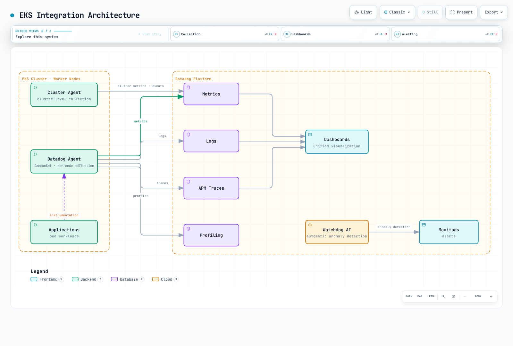

# Datadog

> **Última actualización**: September 13, 2026
> Helm chart 3.244.0; Agent/Cluster Agent 7.83.1 correspondientes.
> Los límites de configuración, SDK y validación local se indican a continuación; no se modificó ningún tenant de Datadog.

## Introducción

Datadog proporciona un backend de observabilidad SaaS. Los equipos siguen siendo responsables de los collectors, la identidad,
el acceso de red, la instrumentación, la divulgación de datos, la retención, los monitors y el costo.
Infrastructure Monitoring, APM, profiling, logs y otros productos tienen distintos
derechos de uso y dimensiones de facturación; instalar un Agent no incluye todos los productos.

| Tema | Datadog | CloudWatch | Prometheus / Grafana autoadministrados |
| --- | --- | --- | --- |
| Backend | Datadog SaaS, con disponibilidad específica por site | Servicios administrados por AWS | Almacenamiento, consulta y visualización operados por el equipo |
| Recopilación | Agent/Cluster Agent, bibliotecas y rutas OTel compatibles | Métricas de servicios AWS, agents/SDKs/OTLP | Exporters, scraping, agents y remote write |
| APM/logs | Seleccionar y configurar los productos requeridos | Integraciones de Application Signals, tracing y Logs | Configurar los backends y collectors correspondientes |
| Operaciones | Persisten las responsabilidades de collector/configuración y de la aplicación | Persisten las responsabilidades de recopilación/configuración y respuesta | Persisten las responsabilidades de backend y recopilación |
| Costo | Unidades de host y de uso/retención específicas de cada producto | Unidades de métrica/observación/OTLP/log/consulta/alarma | Infraestructura y esfuerzo operativo |

Elija el **site** de Datadog correcto para la organización y sus credenciales;
los endpoints de API, la residencia de datos, los productos disponibles y las condiciones de precios no son
intercambiables entre sites. Use el catálogo de integraciones en lugar de una afirmación fija sobre
la cantidad de integraciones o una clasificación universal de “fácil/avanzado/económico”.

## Arquitectura de integración con EKS

| Componente | Responsabilidad / límite |
| --- | --- |
| Node Agent | Checks de host/contenedor; normalmente un DaemonSet en nodos EC2 compatibles |
| Cluster Agent | Metadatos/checks compartidos de Kubernetes, coordinación de eventos y funciones opcionales de admission/métricas externas |
| Trace Agent | Recibe las cargas de traces de la aplicación y las reenvía |
| Recopilación de procesos / system-probe | Funciones opcionales de proceso/red/seguridad con sus propios requisitos de SO, privilegios y producto |
| Admission Controller | Inyecta la configuración de conexión y, cuando se configura, bibliotecas cliente compatibles en los nuevos pods |

La instrumentación de la aplicación produce traces/profiles; un listener del Agent o una
etiqueta de pod por sí solos no demuestran instrumentación. El Cluster Agent no es la ruta habitual
de reenvío de logs de aplicación ni de traces.

La instalación de este capítulo está dirigida a **nodos EKS Linux respaldados por EC2**. EKS Fargate
usa el modelo de recopilación documentado por pod/sidecar, no este DaemonSet de host.
UDS es local al host y no es compatible con Windows. Windows, Bottlerocket,
Auto Mode y el cómputo mixto requieren la configuración específica de su distribución/función y
el acceso de host compatible. No deshabilite la verificación TLS ni afirme que todas las
funciones de eBPF/procesos funcionan en todos los entornos.

Datadog documenta Agent y Cluster Agent 7.67+ para la compatibilidad con Kubernetes 1.33+
mediante `AllocatedResources`, y recomienda que sus versiones coincidan. Estos requisitos mínimos
de funciones no son la matriz de soporte actual de EKS.

La descripción general muestra las rutas de recopilación posibles. Los traces/profiles requieren instrumentación de la aplicación y los productos seleccionados; el enrutamiento de notificaciones de Watchdog debe configurarse.



[Diagrama interactivo](https://www.atomai.click/kubernetes-docs/archmaps/en-observability-metrics-05-datadog-1.html)

## Instalación del Datadog Agent

Datadog recomienda su Operator para la configuración del ciclo de vida en un nivel más alto y también
admite la instalación con Helm. Este ejemplo gestiona los node/Cluster Agents mediante el
**Helm chart de Datadog Agent**. El chart 3.244.0 incluye una dependencia opcional del Operator;
`datadog.operator.enabled: false` mantiene ese controlador adicional fuera de este ejemplo.
Eso no significa que el Operator esté obsoleto.

El chart usa por defecto Agent/Cluster Agent 7.82.3. Este ejemplo fija explícitamente ambos
a **7.83.1** y a los digests verificados del índice de imágenes. La versión incluye correcciones de
facturación de pruebas de red, limpieza de snapshots de containerd y apagado del leader-lock del Cluster Agent.
Los índices de imagen del Agent/Cluster Agent incluyen Linux amd64/arm64. Un render de plantilla
exitoso no es un despliegue en Kubernetes ni una prueba de compatibilidad en tiempo de ejecución.

### Credenciales y propiedad de la instalación

La ingesta básica del Agent necesita una API key en el mismo namespace que el Agent.
Se necesita una application key para funciones de lectura/control de la API, como el proveedor
de métricas externas; no es necesaria solo para instalar el Agent básico. Use una
application key con alcance limitado solo cuando la función elegida la requiera.

Mantenga las credenciales en un flujo de trabajo de Secret aprobado. El comando de archivo siguiente evita el
antiguo problema de redirección de shell con `<YOUR_API_KEY>` sin comillas y la exposición de una key en los
argumentos del proceso. Proteja y elimine los archivos temporales de key según el flujo de trabajo
de credenciales. Los Secrets de Kubernetes también requieren controles adecuados de acceso y cifrado.
No ejecute esta instalación sobre recursos que pertenezcan a otro release o controlador.

```bash
helm repo add datadog https://helm.datadoghq.com
helm repo update datadog
kubectl create namespace datadog --dry-run=client -o yaml | kubectl apply -f -

# The protected file contains only the API key; obtain it through your approved secret process.
# Do not put the key in command-line literals, Git or terminal output.
: "${DATADOG_API_KEY_FILE:?Set the path to the protected API-key file}"
kubectl create secret generic datadog-secret --namespace datadog \
  --from-file="api-key=$DATADOG_API_KEY_FILE" --dry-run=client -o yaml | kubectl apply -f -

helm template datadog datadog/datadog --version 3.244.0 \
  --namespace datadog --include-crds --values datadog-values.yaml > datadog-rendered.yaml

# This changes the cluster. Review the rendered resources and installation ownership first.
helm upgrade --install datadog datadog/datadog --version 3.244.0 \
  --namespace datadog --values datadog-values.yaml
```

### Valores revisados

Guarde lo siguiente como `datadog-values.yaml`. Los logs se activan de forma opcional mediante la
configuración del contenedor, APM/DogStatsD usan UDS, y la inyección automática de bibliotecas a nivel de
cluster, las métricas externas para HPA, las estadísticas de red de discovery y la recopilación opcional de
procesos/red no están habilitadas aquí.
El namespace de la aplicación debe estar separado del namespace del Agent; SSI no
instrumenta pods en el propio namespace del Agent.

```yaml
targetSystem: linux
registry: gcr.io/datadoghq
datadog:
  apiKeyExistingSecret: datadog-secret
  clusterName: my-eks-cluster
  site: datadoghq.com
  tags:
  - env:demo
  - team:platform
  logs:
    enabled: true
    containerCollectAll: false
    containerCollectUsingFiles: true
  apm:
    socketEnabled: true
    portEnabled: false
    instrumentation:
      enabled: false
  dogstatsd:
    useSocketVolume: true
    useHostPort: false
    nonLocalTraffic: false
  processAgent:
    processCollection: false
    processDiscovery: false
    containerCollection: true
  networkMonitoring:
    enabled: false
  discovery:
    enabled: false
    networkStats:
      enabled: false
  autoscaling:
    workload:
      enabled: false
  profiling:
    enabled: null
  collectEvents: true
  prometheusScrape:
    enabled: false
  kubeStateMetricsCore:
    enabled: true
    collectSecretMetrics: false
    collectConfigMaps: false
  operator:
    enabled: false
clusterAgent:
  enabled: true
  replicas: 2
  image:
    tag: 7.83.1
    digest: sha256:8e420c81e68abec34ab792c72a6513b739dcba8f7682c52e1e7e276363827b1a
  metricsProvider:
    enabled: false
    useDatadogMetrics: false
  admissionController:
    enabled: true
    mutateUnlabelled: false
agents:
  image:
    tag: 7.83.1
    digest: sha256:ed0bd588e955d82f661d1b8dd1cdf179c1023e74a2817e7a812c99d52f05c319
```

`processAgent.enabled` está obsoleto; use las opciones de recopilación individuales.
El chart ya monta `/etc/passwd` cuando corresponde, así que no agregue volúmenes/montajes
manuales duplicados de `passwd`. Las sobrescrituras de recursos son por componente, como
`agents.containers.agent.resources`; dimensione los contenedores realmente renderizados bajo carga.
Dos réplicas del Cluster Agent no sustituyen las pruebas de colocación, disrupción y fallos.

Las entradas originales de nivel superior `kubeStateMetricsEnabled` y `prometheus.enabled`
no configuran las integraciones que se afirmaban. La opción heredada de KSM está anidada bajo
`datadog`; el ejemplo usa `datadog.kubeStateMetricsCore.enabled` y evita la
recopilación heredada duplicada. Los checks explícitos de Autodiscovery de Datadog son distintos
de activar `prometheusScrape` para todas las anotaciones.

`datadog.profiling.enabled` **es válido**. Inyecta `DD_PROFILING_ENABLED` en
los pods elegibles y requiere bibliotecas cliente instaladas y Cluster Agent 7.57+.
No instala un profiler en una aplicación arbitraria sin instrumentar.
Elija deliberadamente su comportamiento `null`/`false`/`auto`/`true`. De igual modo, habilitar
las métricas externas para HPA requiere su application key, permisos de API, servicio/CRDs
y la disponibilidad real de las métricas; el monitoreo de red requiere acceso compatible de system-probe.

### La integración de cuentas de AWS es una ruta separada

La integración SaaS de cuentas de AWS usa un rol entre cuentas autorizado y un
external ID proporcionado por Datadog, con los permisos que requieran las integraciones seleccionadas.
Un rol IRSA arbitrario asociado a la SA de un node Agent no configura esa
integración SaaS. La recopilación normal del Agent de Kubernetes no requiere la
amplia política de CloudWatch/EC2/tags que se mostraba antes aquí.

Use Pod Identity o IRSA solo para un Agent/check que realmente llame a AWS, con su
rol, confianza y permisos específicos. Resuelva el nombre **renderizado** de la service account;
crear una asociación de IAM para una SA `datadog-agent` supuesta no vincula una
SA distinta usada por el release de Helm. Nunca considere una comprobación local del caller de STS como
prueba de la identidad de la carga de trabajo.

## Infrastructure Monitoring

### Verifique el collector, la unidad y los tags de la métrica

| Métrica / origen | Significado |
| --- | --- |
| `system.cpu.idle` / System check | **Porcentaje** de CPU inactiva; adecuado para un umbral de nodo basado en porcentaje |
| `system.mem.total`, `system.mem.used`, `system.mem.free` | Mediciones de memoria; free no es intercambiable con memoria utilizable/recuperable |
| `kubernetes.cpu.usage.total` / Kubelet | **Nanocores**, no porcentaje; un core equivale a 1.000.000.000 de nanocores |
| `kubernetes.memory.usage`, `kubernetes.memory.limits` | Bytes; comparar uso con límite requiere que coincidan la misma entidad/conjunto de tags |
| `kubernetes.pods.running`, `kubernetes.containers.restarts` | Gauges válidos de Kubelet: pods en ejecución y reinicios acumulados de contenedores |
| `kubernetes_state.deployment.replicas_available`, `kubernetes_state.deployment.replicas_desired` | Estado del Deployment según Kubernetes State Metrics Core |
| `kubernetes_state.pod.status_phase`, `kubernetes_state.service.count` | Fase del Pod/inventario de Services; revise sus tags de agrupación documentados |
| `kubernetes_state.container.restarts` | Gauge de reinicios de State Core, con tags de namespace/pod/contenedor |

La integración heredada de Kubernetes, el check de Kubelet y State Core tienen catálogos
distintos. Una métrica ausente de un catálogo no está necesariamente eliminada del
Agent. No renombre a ciegas métricas válidas de Kubelet. La disponibilidad de sistema de archivos/red
y las unidades de tasa dependen del collector/runtime; consulte la definición real de esa métrica.

Use el tag estándar `kube_cluster_name` para esta instalación de Kubernetes e inspeccione
los tags reales de las métricas antes de agrupar. Las métricas de State Core centradas en el cluster no siempre
llevan un tag `host`. `cluster_name` y `kube_cluster_name` no son intercambiables.
Un valor de nanocores en bruto comparado con 80 no significa 80 % de CPU.

### Autodiscovery con OpenMetrics

Combine el siguiente **fragmento de metadata** con una carga de trabajo cuyo contenedor se llame
`app` y exponga el gauge `queue_depth` en el puerto 9464. No crea esa
aplicación ni ese endpoint. El identificador de contenedor de la anotación debe coincidir.
Proteja el endpoint y configure TLS/autenticación si es necesario.

```yaml
metadata:
  annotations:
    ad.datadoghq.com/app.checks: "{\n  \"openmetrics\": {\n    \"init_config\": {},\n\
      \    \"instances\": [\n      {\n        \"openmetrics_endpoint\": \"http://%%host%%:9464/metrics\"\
      ,\n        \"namespace\": \"my_app\",\n        \"metrics\": [\n          {\n\
      \            \"queue_depth\": \"queue_depth\"\n          }\n        ]\n    \
      \  }\n    ]\n  }\n}"
```

El check actual de `openmetrics` usa `openmetrics_endpoint`. Estas anotaciones de
Autodiscovery de Datadog no requieren un servidor Prometheus separado ni el
amplio discovery de `prometheusScrape` del chart. Restrinja las métricas/labels seleccionadas.
Para counters e histogramas, verifique la normalización de nombres, las series `.count`/de buckets
emitidas y el comportamiento de la versión del check, en lugar de suponer que el nombre de Prometheus
es también el nombre final en Datadog.

### DogStatsD: use un endpoint accesible desde la aplicación

El `localhost` de un pod de aplicación no es el node Agent. El ejemplo de Linux usa
el directorio UDS local al host. El modo `socket` del Admission Controller puede inyectar
`DD_DOGSTATSD_URL`, `DD_TRACE_AGENT_URL` y el volumen; de lo contrario, configure explícitamente los
montajes y permisos correspondientes. `admission.datadoghq.com/config.mode` específico de un Pod
es un **label**, no una anotación. Monte el directorio padre para que la sustitución del socket
tras un reinicio del Agent siga siendo visible.

El helper de Python se verificó con `datadog==0.53.0`. Pase la ruta real del sistema de archivos,
como `/var/run/datadog/dsd.socket`, a `socket_path`; la URL `unix://`
usada por otros SDKs/configuraciones de entorno no tiene el mismo formato de argumento.
Llame a `emit_batch` con los recuentos reales del intervalo, incluidos los valores cero de good/error.

```python
from datadog import DogStatsd


def emit_batch(client, total, errors):
    """Report one real interval; send zeros instead of omitting counters."""
    if any(isinstance(x, bool) or not isinstance(x, int) for x in (total, errors)):
        raise ValueError("counts must be integers")
    if not 0 <= errors <= total:
        raise ValueError("require 0 <= errors <= total")
    client.increment("requests.total", total)
    client.increment("requests.error", errors)
    client.increment("requests.good", total - errors)


# Create once in an application with the Agent's UDS directory mounted.
# This construction does not mean that the socket or receiving Agent is ready.
def make_metrics_client(socket_path):
    return DogStatsd(
        socket_path=socket_path,
        namespace="my_app",
        constant_tags=["env:demo", "service:orders"],
        disable_telemetry=True,
        disable_buffering=True,
    )
```

El helper de Go usa datadog-go/v5. Cree el cliente con `WithNamespace("my_app.")`
y los mismos tags `env:demo,service:orders`. Compruebe los errores del constructor, del envío y del cierre;
no descarte el error de `statsd.New`. El helper no cierra un cliente compartido
proporcionado por el caller.

```go
package metrics

import (
    "fmt"

    "github.com/DataDog/datadog-go/v5/statsd"
)

// The caller creates/reuses the client, checks New's error, and closes it at shutdown.
// For the Linux UDS example, use unix:///var/run/datadog/dsd.socket.
func EmitBatch(client *statsd.Client, total, errors int64) error {
    if errors < 0 || total < errors {
        return fmt.Errorf("require 0 <= errors <= total")
    }
    for _, item := range []struct {
        name string
        value int64
    }{
        {"requests.total", total},
        {"requests.error", errors},
        {"requests.good", total - errors},
    } {
        if err := client.Count(item.name, item.value, nil, 1); err != nil {
            return err
        }
    }
    return nil
}
```

| Tipo de DogStatsD | Interpretación |
| --- | --- |
| Counter | Recuento del intervalo; Datadog puede almacenarlo como tasa. `.as_count()` reconstruye los recuentos para una ventana de consulta |
| Gauge | Instantánea, como la profundidad de cola; sumar instantáneas no da un recuento de solicitudes procesadas |
| Histogram | Agregado por el Agent receptor; promediar percentiles por host no crea un percentil global |
| Distribution | Admite agregación de distribución en el backend; revise los percentiles habilitados, los tags y la facturación |
| Service check | Estado de una comprobación de salud real: 0 OK, 1 advertencia, 2 crítico, 3 desconocido |

La entrega local de datagramas no confirma la ingesta en el SaaS. UDP puede perder paquetes;
el buffering de UDS/cliente y las colas del Agent también requieren monitoreo. El helper de ejemplo no
habilita la telemetría del cliente DogStatsD, así que elija una señal separada de salud de la recopilación
para el despliegue. Los reintentos/envíos duplicados de counters no son un libro contable de negocio con entrega exactamente una vez.

### Configuración de Autodiscovery basada en archivos

Para la configuración gestionada por Helm, `datadog.confd` crea y monta los archivos de check.
Un ConfigMap independiente llamado `datadog-checks` no se descubre automáticamente solo
porque exista. El siguiente fragmento de NGINX requiere una identidad de imagen coincidente
y un endpoint `stub_status` configurado y autorizado.

```yaml
datadog:
  confd:
    nginx.yaml: "ad_identifiers:\n  - nginx\ninit_config: {}\ninstances:\n  - nginx_status_url:\
      \ http://%%host%%:80/nginx_status\n"
```

Un check autenticado de Redis necesita además el puerto/TLS correctos y la entrega de
credenciales. `%%env_REDIS_PASSWORD%%` lee el entorno **del Agent**, no el entorno del pod
de la aplicación Redis. Prefiera un backend de secretos de Datadog configurado o la entrega mediante
archivo protegido con los permisos específicos que requiera; no exponga contraseñas en
ejemplos públicos de checks ni otorgue lecturas de Secrets a nivel de cluster solo para discovery.

## APM y Distributed Tracing

### La inyección local del SDK y SSI son decisiones explícitas

El label de opt-in de admission permite la mutación/inyección de la configuración de conexión. Para instalar
una biblioteca de tracing, configure objetivos de SSI o una anotación de lenguaje/versión compatible.
El label por sí solo no prueba que se haya instalado un SDK ni que los traces llegaran a Datadog.
La inyección local de Java/Python/Node.js requiere Cluster Agent 7.40+; .NET/Ruby requiere
7.44+. La versión actual 7.83.1 también excluye `kube-system` y su propio namespace de la inyección.

Para un ejemplo controlado de Java, combine el siguiente **fragmento de pod template** con
un Deployment existente en un namespace de aplicación, preservando su selector,
contenedores y configuración de seguridad. No es un Deployment completo para aplicar por sí solo.
La imagen init de Java `gcr.io/datadoghq/dd-lib-java-init:v1.66.0` se verificó para
Linux amd64/arm64. Verifique la compatibilidad real de JVM/framework/imagen de la aplicación.

```yaml
spec:
  template:
    metadata:
      labels:
        admission.datadoghq.com/enabled: 'true'
        admission.datadoghq.com/config.mode: socket
        tags.datadoghq.com/env: demo
        tags.datadoghq.com/service: orders
        tags.datadoghq.com/version: 1.0.0
      annotations:
        admission.datadoghq.com/java-lib.version: v1.66.0
```

Los labels `tags.datadoghq.com/*` proporcionan el tagging unificado de service/environment/version.
No coloque el label únicamente en la metadata del Deployment esperando que sus pods lo hereden.
La inyección ocurre cuando se admiten **nuevos pods**. Confirme los init
containers inyectados, los archivos de biblioteca, los montajes/permisos de UDS y la configuración de
conectividad no secreta, y luego verifique el tráfico/traces reales. Las exclusiones de namespace, los fallos del
webhook, las políticas de seguridad y las imágenes no compatibles pueden impedir la instrumentación.

SSI a nivel de cluster es una alternativa configurada mediante
`datadog.apm.instrumentation`, con objetivos de namespace/pod y versiones de biblioteca revisados.
Evite combinar involuntariamente tracers manuales e inyectados: una biblioteca inyectada puede
tener precedencia sobre una instalada manualmente. Habilitar el profiler sigue requiriendo
una biblioteca cliente compatible y sus propias condiciones de producto/runtime.

### Instrumentación manual de Java

Use un `dd-java-agent.jar` versionado y preparado al iniciar la JVM de la aplicación, o la
ruta de inyección validada anterior. Agregar simplemente `dd-trace-api` da acceso a la
anotación/API; **no** inicia la instrumentación de bytecode en tiempo de ejecución.
La dependencia de Maven siguiente y el código fuente Java son archivos separados.

```xml
<dependency>
  <groupId>com.datadoghq</groupId>
  <artifactId>dd-trace-api</artifactId>
  <version>1.66.0</version>
</dependency>
```
```java
import java.util.function.Supplier;
import datadog.trace.api.Trace;

public final class TraceMethods {
    private TraceMethods() {}

    @Trace(operationName = "order.process", resourceName = "process_order")
    public static <T> T process(Supplier<T> handler) {
        return handler.get();
    }
}
```

El handler representa el código de aplicación proporcionado por el caller. Use nombres de
operación/recurso acotados. Los tags de identificador por pedido/cliente del ejemplo anterior
son innecesarios para esta demostración y pueden crear riesgos de divulgación/cardinalidad.
Las APIs de spans manuales requieren su bridge/biblioteca compatible correspondiente; no agregue
imports de OpenTracing a un proyecto que solo tiene la API de anotaciones.

### Instrumentación manual de Python

Use el import actual `ddtrace.trace` para este ejemplo verificado con 4.14.0. Mantenga la
declaración de dependencia en `requirements.txt`, no dentro de un bloque de código Python.
Para la auto-instrumentación del framework, siga la configuración elegida de `ddtrace-run`/SSI
antes de los imports de la aplicación; no suponga que este helper parchea todo un framework.

```text
ddtrace==4.14.0
```
```python
from ddtrace.trace import tracer


def process_order(handler):
    with tracer.trace("order.process", service="orders", resource="process_order") as span:
        span.set_tag("operation.kind", "order")
        return handler()
```

El decorador equivalente `tracer.wrap` está disponible para el tracing de métodos. Las excepciones
del handler deben propagarse; registrar un span no es un reintento de la aplicación ni una
garantía de éxito. Use tags correctos de service/env/version y propagación de contexto
en las integraciones HTTP/de mensajería compatibles. Los service maps provienen de relaciones
instrumentadas observadas, no únicamente de `DD_TAGS` arbitrarios.

No etiquete por defecto identificadores de cliente/pedido en bruto, tokens ni cuerpos de solicitud.
Revise la captura de la instrumentación, los mensajes de error y las reglas de muestreo/redacción para
la aplicación real. La auto-instrumentación no garantiza la eliminación completa de PII.

## Log Management

### Seleccione deliberadamente la recopilación y el parsing

La instalación habilita la recopilación de logs pero deja `containerCollectAll: false`.
Combine esta metadata con el pod template del contenedor llamado `app`.
La regla multilínea se aplica a **registros Java de texto plano que comienzan con una fecha**.
No es un parser general de logs JSON. El encuadre del container runtime y el parsing de mensajes
de la aplicación son etapas separadas; verifique los registros realmente recopilados.

```yaml
metadata:
  annotations:
    ad.datadoghq.com/app.logs: "[\n  {\n    \"source\": \"java\",\n    \"service\"\
      : \"orders\",\n    \"log_processing_rules\": [\n      {\n        \"type\": \"\
      multi_line\",\n        \"name\": \"java_timestamp_start\",\n        \"pattern\"\
      : \"^\\\\d{4}-\\\\d{2}-\\\\d{2}\"\n      }\n    ]\n  }\n]"
```

Para aplicaciones con un evento JSON por línea, use la ruta JSON compatible en lugar de
unir eventos JSON no relacionados con esta regla. El acceso a archivos, las rutas de runtime, la coincidencia
de anotaciones, la configuración de exclusiones y los filtros del pipeline del backend afectan todos la recopilación.
Compruebe la recopilación selectiva con una aplicación coincidente y otra excluida.

### Estructura de la solicitud de pipeline

Esta solicitud usa los campos reales de la API **`match_rules` y `support_rules`**.
Los antiguos campos en camelCase no formaban parte del modelo de la Logs API. El mensaje de ejemplo define
el formato de línea esperado; use el formato/zona horaria reales de la aplicación y pruebe los casos
sin coincidencia/multilínea/de error. Un modelo de solicitud válido no prueba el parsing con Grok
ni la ingesta/indexación en un tenant de Datadog.

```json
{
  "name": "Java application logs",
  "is_enabled": true,
  "filter": {
    "query": "source:java service:orders"
  },
  "processors": [
    {
      "type": "grok-parser",
      "name": "Parse the documented Java line format",
      "is_enabled": true,
      "source": "message",
      "samples": [
        "2026-09-13 12:00:00,123 INFO [main] example.Service - completed"
      ],
      "grok": {
        "support_rules": "",
        "match_rules": "java_log %{date(\"yyyy-MM-dd HH:mm:ss,SSS\"):timestamp} %{word:level} \\[%{notSpace:thread}\\] %{notSpace:logger} - %{data:message}"
      }
    },
    {
      "type": "status-remapper",
      "name": "Use level as status",
      "is_enabled": true,
      "sources": [
        "level"
      ]
    },
    {
      "type": "date-remapper",
      "name": "Use parsed timestamp",
      "is_enabled": true,
      "sources": [
        "timestamp"
      ]
    }
  ]
}
```

Crear o reordenar pipelines cambia el procesamiento de los logs coincidentes. Configúrelo
bajo el site correcto, con permisos de API de alcance limitado y respetando la propiedad de los pipelines existentes.
No se envió ninguna solicitud de pipeline durante esta auditoría.

### Correlación trace-log y propiedad del MDC

Use la inyección automática de logs compatible donde sea posible y conserve los IDs de trace/span
como strings en los logs estructurados. También se requieren service/env/version correctos, timestamps, parsing y
datos de trace disponibles; dos campos de ID por sí solos no garantizan la correlación.
No existe un trace ID activo útil cuando un proceso no ha sido instrumentado.

Para aplicaciones que gestionan explícitamente el MDC de SLF4J, este helper restaura **todo el
contexto previo** del caller tanto en caso de éxito como de fallo. El antiguo `MDC.clear()` incondicional
perdía campos no relacionados del caller. Es un helper síncrono, no un mecanismo de propagación
de contexto asíncrono ni un filtro de servlet completo.

```java
import java.util.Map;
import java.util.function.Supplier;
import datadog.trace.api.CorrelationIdentifier;
import org.slf4j.MDC;

public final class TraceLogContext {
    private TraceLogContext() {}

    public static <T> T withTraceContext(Supplier<T> handler) {
        Map<String, String> previous = MDC.getCopyOfContextMap();
        try {
            MDC.put("dd.trace_id", CorrelationIdentifier.getTraceId());
            MDC.put("dd.span_id", CorrelationIdentifier.getSpanId());
            return handler.get();
        } finally {
            if (previous == null) {
                MDC.clear();
            } else {
                MDC.setContextMap(previous);
            }
        }
    }
}
```

Requiere `dd-trace-api` y una API/proveedor de SLF4J compatible con la aplicación.
El patrón de logging o el encoder JSON deben incluir los valores del MDC. No copie un
ejemplo de servlet sin la API de servlet, los imports y el contrato de excepciones comprobadas.

## Dashboards y alertas

### Construcción de la solicitud de dashboard

Este helper usa `datadog-api-client==2.60.0` para construir un cuerpo de solicitud. Las variables de plantilla
de cluster y namespace están realmente referenciadas por sus consultas. El widget de host
usa una métrica de porcentaje; el widget de pod usa bytes de memoria y su filtro de namespace.
Compruebe que los datos seleccionados realmente tienen los tags de agrupación.

```python
from datadog_api_client.v1.model.dashboard import Dashboard
from datadog_api_client.v1.model.dashboard_layout_type import DashboardLayoutType


def build_dashboard(cluster_name):
    return Dashboard(
        title="EKS observability example",
        layout_type=DashboardLayoutType.ORDERED,
        widgets=[
            {"definition": {
                "type": "timeseries",
                "title": "CPU idle by host (%)",
                "requests": [{"q": "avg:system.cpu.idle{$cluster} by {host}", "display_type": "line"}],
            }},
            {"definition": {
                "type": "toplist",
                "title": "Top 10 pod memory series by mean (bytes)",
                "requests": [{"q": "top(sum:kubernetes.memory.usage{$cluster,$namespace} by {pod_name,kube_namespace}, 10, 'mean', 'desc')"}],
            }},
        ],
        template_variables=[
            {"name": "cluster", "prefix": "kube_cluster_name", "default": cluster_name},
            {"name": "namespace", "prefix": "kube_namespace", "default": "*"},
        ],
    )
```

El caller proporciona un `ApiClient` correctamente configurado y usa `DashboardsApi`
para crear o actualizar el dashboard deseado. Registre/reconcilie el ID devuelto;
la creación repetida por título puede generar duplicados. El site y las credenciales de automatización
con alcance limitado son distintos de la API key del node Agent. No se llamó a ninguna API de dashboards
en esta auditoría.

### Consultas y unidades de los monitors

Use un proveedor de Terraform de Datadog configurado y restricciones de versión/archivo de lock del proyecto.
Estos son fragmentos de recursos, no una configuración completa de proveedor/credenciales. Los umbrales
son ejemplos; inspeccione las unidades, tags, ventanas reales de las métricas y los objetivos de la aplicación.
El primer monitor evalúa directamente el porcentaje de inactividad en lugar de comparar nanocores
con 80 y llamar al resultado “porcentaje de CPU”.

```hcl
# Fragments for a configured, version-pinned Datadog Terraform provider.
# Replace notification destinations with approved, tested destinations.
resource "datadog_monitor" "low_cpu_idle" {
  name    = "Low CPU idle on EKS nodes"
  type    = "metric alert"
  message = "CPU idle on {{host.name}} is {{value}}%. Inspect the host and collection health."
  query   = "avg(last_5m):avg:system.cpu.idle{kube_cluster_name:my-eks-cluster} by {host} < 20"
  monitor_thresholds {
    warning  = 30
    critical = 20
  }
  require_full_window = false
  notify_no_data      = false
  tags               = ["env:demo", "team:platform"]
}

resource "datadog_monitor" "restart_total" {
  name    = "Container restart total exceeds example threshold"
  type    = "metric alert"
  message = "Inspect {{pod_name.name}} / {{kube_container_name.name}}. This is a restart total, not a count of new restarts in five minutes."
  query   = "max(last_5m):max:kubernetes_state.container.restarts{kube_cluster_name:my-eks-cluster} by {pod_name,kube_namespace,kube_container_name} > 3"
  monitor_thresholds {
    warning  = 2
    critical = 3
  }
  require_full_window = false
  notify_no_data      = false
  tags               = ["env:demo", "team:platform"]
}

resource "datadog_monitor" "request_error_rate" {
  name    = "High request error ratio"
  type    = "metric alert"
  message = "Error ratio for {{service.name}} is {{value}}%. Check traffic volume and the reporting path."
  query   = "sum(last_5m):sum:my_app.requests.error{env:demo} by {service}.as_count() / sum:my_app.requests.total{env:demo} by {service}.as_count() * 100 > 5"
  monitor_thresholds {
    warning  = 2
    critical = 5
  }
  require_full_window = false
  notify_no_data      = false
  tags               = ["env:demo", "type:application"]
}
```

El gauge de reinicios es un **total**. Comparar sumas de muestras repetidas del gauge en dos
ventanas no cuenta de forma fiable los nuevos reinicios, especialmente con reinicios a cero, pods
de reemplazo o muestreo desigual. Un monitor de reinicios recientes necesita un diseño validado de
delta/reset. Este ejemplo alerta explícitamente sobre un total en su lugar.

El monitor de errores usa los tres counters emitidos por `emit_batch`, incluidos los
valores cero explícitos para las solicitudes con error/correctas. Para la evaluación con `.as_count()`, la
agregación temporal ocurre **antes de la división**: sum(errors)/sum(total), en lugar de una suma
del ratio de cada bucket temporal. Use un agregador de suma con esta ruta.

Tráfico cero, telemetría ausente y tráfico genuinamente sin errores son cosas distintas.
Defina condiciones mínimas de tráfico/salud de la recopilación y valide el comportamiento del monitor
ante ausencia de datos. `notify_no_data: false` no establece que haya salud; simplemente
no notifica sobre datos ausentes en estos fragmentos.

Para las métricas integradas de APM, use los nombres reales `trace.<operation>.hits/errors` y los
tags generados por la integración elegida. Java, Python y otras integraciones no
emiten todas `trace.http.request.*`. El trace analytics, las métricas de trace generadas y las
métricas personalizadas de DogStatsD son orígenes distintos.

### Watchdog y entrega de notificaciones

Watchdog puede exponer anomalías/insights detectados sin elegir manualmente cada
umbral. Un insight no es prueba de que se haya entregado una notificación. Use el
flujo de trabajo compatible de Watchdog/monitors y verifique el origen del evento, la
disponibilidad del producto y el enrutamiento de notificaciones en el site previsto.

El siguiente fragmento de monitor de eventos asume que existen eventos reales que coinciden con
`source:watchdog` en esa organización. No inventa un tag de grupo `story_category`
ni garantiza que todos los resultados de Watchdog aparezcan en este stream. Valide el
filtro contra eventos reales antes de habilitar notificaciones.

```hcl
resource "datadog_monitor" "watchdog_events" {
  name    = "Review matching Watchdog events"
  type    = "event-v2 alert"
  message = "Review the matching Watchdog event and affected services. Add an approved notification destination."
  query   = "events(\"source:watchdog\").rollup(\"count\").last(\"5m\") > 0"
  tags    = ["env:demo", "type:watchdog"]
}
```

### Construcción de la solicitud de SLO

Los SLOs basados en métricas necesitan recuentos de good/total bien definidos. El helper siguiente usa los
counters explícitos anteriores. “Good” debe coincidir con la política de SLI de la aplicación; contar
solo HTTP 2xx no es una definición universal de disponibilidad. Valide el comportamiento con tráfico cero y
datos ausentes en lugar de tratar la ausencia como 100 % de éxito.

```python
from datadog_api_client.v1.model.service_level_objective_request import ServiceLevelObjectiveRequest


def build_success_slo():
    return ServiceLevelObjectiveRequest(
        name="Orders successful-request SLO",
        type="metric",
        description="Successful requests divided by all reported requests",
        query={
            "numerator": "sum:my_app.requests.good{env:demo,service:orders}.as_count()",
            "denominator": "sum:my_app.requests.total{env:demo,service:orders}.as_count()",
        },
        thresholds=[{"timeframe": "30d", "target": 99.9, "warning": 99.95}],
        tags=["env:demo", "service:orders"],
    )
```

Esto construye una solicitud, no un SLO en funcionamiento. El caller configurado puede pasarla a
`ServiceLevelObjectivesApi.create_slo` después de verificar la propiedad, los datos y los permisos.
Datadog también admite SLOs basados en monitors y de time-slice; elija el modelo
que coincida con el SLI en lugar de forzar un gauge/total de reinicios como recuento de eventos correctos.

## Estructura de costos

### Use las unidades reales del producto y del contrato

| Componente | Datos de entrada para estimar |
| --- | --- |
| Infrastructure | Hosts/contenedores facturables o el modelo de plataforma aplicable, plan y términos de compromiso |
| APM | Hosts de APM facturables y el plan/modelo seleccionado, las asignaciones incluidas, los spans ingeridos e indexados |
| Logs | Volumen ingerido más las opciones de indexación/retención/búsqueda/archivado |
| Métricas personalizadas / distributions | Combinaciones distintas de métrica/tag, agregaciones habilitadas y volúmenes incluidos aplicables |
| Productos adicionales | Cargos de profiling, red/seguridad, serverless y otros productos habilitados |

No combine todos los productos en una tabla universal Free/Pro/Enterprise. La página
de precios distingue productos, términos anuales/on-demand y ofertas adjuntas frente a
independientes. La retención de métricas de infraestructura, traces consultables y logs indexados
no es una única configuración común de “15 meses”.

Para el antiguo ejemplo de 100 nodos, **50 services no implican 50 hosts de APM**. Bajo un
acuerdo con precio por host, determine primero los recuentos reales de hosts facturables de
Infrastructure y APM. Para 100 GB/día durante 30 días, la ingesta de logs es de 3.000 GB, pero la ingesta
por sí sola no es la factura total de logs.

```text
Estimated cost =
  billable infrastructure units × applicable rate
  + billable APM units × applicable rate
  + ingested/indexed span overages under the contract
  + 3,000 GB × applicable log-ingestion rate
  + indexed events/retention/search/archive charges
  + custom-metric and other enabled-product charges
```

El total anterior de ~3.350 USD usaba unidades de APM que no coincidían y omitía dimensiones facturables.
No era una factura de producción medida. Use la cotización actual del site/producto y
el uso medido en lugar de tratar esa estimación como una garantía presupuestaria.

### Los controles de métricas, logs y traces hacen cosas distintas

- `dogstatsd.nonLocalTraffic` controla la accesibilidad del receptor; no es una cuota de
  métricas personalizadas. Cerrar un receptor simplemente puede perder telemetría.
- `ignoreAutoConfig` deshabilita checks automáticos seleccionados. Los filtros de exclusión de contenedores
  seleccionan contenedores; ninguno de los dos es un limitador general de cardinalidad de tags.
- Revise las métricas permitidas y los valores de tags en su propietario de recopilación. Cambiar la
  cardinalidad de los tags de origen puede cambiar los tags de agrupación disponibles, así que vuelva a revisar los monitors/SLOs.
- La exclusión de logs en el origen evita enviar registros seleccionados. La exclusión en el índice ocurre
  después y no elimina los costos de ingesta. Conserve la evidencia de incidentes y los fallos;
  no descarte todas las líneas de health-check independientemente del resultado.
- El muestreo y la indexación/retención son cosas separadas. `DD_TRACE_SAMPLE_RATE` o las reglas de
  muestreo dependen de la biblioteca/versión y del alcance coincidente. El `DD_TRACE_RATE_LIMIT`
  documentado de Python es por proceso y se aplica con las reglas/tasa de muestreo configuradas,
  no es un tope a nivel de cluster ni en dólares. Una tasa de traces del 10 % no implica una reducción del 90 %
  en toda la factura de Datadog.

## Buenas prácticas

Use labels consistentes de service/env/version y tags acotados, con permisos separados para la
ingesta con API key y la automatización con application key. Revise la captura de la aplicación
y las rutas de secretos/redacción antes de recopilar todos los logs, argumentos de proceso o profiles.
Monitoree las colas/descartes del collector y verifique las salidas reales tras cambiar filtros.

Acuerde con el equipo de operaciones la severidad de las alertas, la propiedad y los objetivos de respuesta.
Las etiquetas P1/P2 en un runbook son una política operativa, no definiciones independientes de
recursos de Datadog. Pruebe los destinos reales, los datos ausentes y las notificaciones de recuperación.
Use un SLI/SLO documentado y el contexto de tráfico en lugar de elegir umbrales solo
porque aparecen en un ejemplo.

## Solución de problemas

Comience por el propietario de la instalación, los nombres reales de pod/contenedor y el site previsto.
Compruebe las referencias del Secret de la API key, la salud del Agent/Cluster Agent, el acceso a Kubelet/RBAC,
la configuración de scraping y la telemetría en cola/descartada. El pod del node Agent renderizado por esta
versión tiene los contenedores `agent` y `trace-agent`; el antiguo selector `app=datadog`
no es un sustituto fiable de inspeccionar los labels actuales.

```bash
kubectl get pods -n datadog \
  -l app.kubernetes.io/instance=datadog,app.kubernetes.io/component=agent -o wide

# Select the actual node Agent pod after inspecting the list.
: "${DD_AGENT_POD:?Set the node Agent pod name}"
kubectl exec -n datadog "$DD_AGENT_POD" -c agent -- agent status
kubectl logs -n datadog "$DD_AGENT_POD" -c agent --tail=100
kubectl logs -n datadog "$DD_AGENT_POD" -c trace-agent --tail=100

# Check new application pods without dumping credentials/environment values.
: "${APP_NAMESPACE:?Set the application namespace}"
: "${APP_POD:?Set the application pod name}"
kubectl get pod -n "$APP_NAMESPACE" "$APP_POD" \
  -o jsonpath='{.spec.initContainers[*].image}'
kubectl get pod -n "$APP_NAMESPACE" "$APP_POD" \
  -o jsonpath='{range .spec.containers[*]}{.name}{": "}{.env[*].name}{"\n"}{end}'

# Create a local diagnostic archive only; review it before any authorized sharing.
kubectl exec -n datadog "$DD_AGENT_POD" -c agent -- agent flare --local
```

Para los traces, verifique la inyección/arranque real de la biblioteca, el socket o el endpoint de host,
los permisos y la consistencia de los tags. Una comprobación TCP exitosa no valida una ruta
UDS ni prueba que se acepten las cargas de traces. No use `env | grep DD_`: puede divulgar
API/application keys o credenciales de proxy.

Para los logs, inspeccione el identificador real de anotación/contenedor y el acceso a archivos, y luego
las exclusiones de recopilación, el parsing y los filtros de índice. `agent configcheck`, el status, los
logs y los archivos pueden exponer configuración o datos de la aplicación; inspeccione/redacte las
salidas antes de compartirlas.

`agent flare --local` crea un paquete local para inspección. La carga o la recopilación remota de flares
es una acción de soporte autorizada aparte. La redacción integrada es útil,
pero no sustituye la revisión del archivo en busca de los datos que recopiló su aplicación.

## Alcance de la validación

La auditoría usó el rendering del chart y la inspección del esquema/código fuente oficial, datagramas
Unix locales de DogStatsD, spans manuales de ddtrace 4.14.0 en Python 3.12 con exportación/telemetría deshabilitadas,
compilación de dd-trace-api 1.66.0 para Java 17 y pruebas síncronas de MDC, y modelos de solicitud/serialización
del API client 2.60.0. Estas comprobaciones no llamaron a un tenant de Datadog, no instalaron en EKS,
no ejecutaron un admission webhook, no enviaron traces/logs al SaaS, no crearon dashboards/monitors/
SLOs ni midieron costos.

El significado de las consultas de los monitors se comprobó contra las unidades de métrica documentadas y las
reglas de agregación; no se invocó ningún motor de consultas de Datadog ni un plan del proveedor de Terraform.
El esquema de la solicitud Grok es distinto del parsing en vivo. Las aplicaciones, credenciales,
el tráfico, el soporte en tiempo de ejecución y la propiedad del destino siguen siendo prerrequisitos del despliegue.

## Referencias

- [Kubernetes installation and version prerequisites](https://docs.datadoghq.com/containers/kubernetes/installation.md)
- [Helm chart 3.244.0](https://github.com/DataDog/helm-charts/releases/tag/datadog-3.244.0)
- [Agent 7.83.1 release](https://github.com/DataDog/datadog-agent/releases/tag/7.83.1)
- [Kubernetes distributions](https://docs.datadoghq.com/containers/kubernetes/distributions.md)
- [Kubelet metrics](https://docs.datadoghq.com/integrations/kubelet.md)
- [Kubernetes State Metrics Core](https://docs.datadoghq.com/integrations/kubernetes_state_core.md)
- [System metrics](https://docs.datadoghq.com/integrations/system.md)
- [AWS account integration](https://docs.datadoghq.com/integrations/amazon-web-services.md)
- [Admission Controller](https://docs.datadoghq.com/containers/cluster_agent/admission_controller.md)
- [Local SDK injection](https://docs.datadoghq.com/tracing/guide/local_sdk_injection.md)
- [OpenMetrics on Kubernetes](https://docs.datadoghq.com/containers/kubernetes/prometheus.md)
- [DogStatsD UDS](https://docs.datadoghq.com/extend/dogstatsd/unix_socket.md)
- [Python tracing configuration](https://docs.datadoghq.com/tracing/trace_collection/library_config/python.md)
- [Custom instrumentation](https://docs.datadoghq.com/tracing/trace_collection/custom_instrumentation/server-side.md)
- [Log parsing](https://docs.datadoghq.com/logs/log_configuration/parsing.md)
- [as_count monitor evaluation](https://docs.datadoghq.com/monitors/guide/as-count-in-monitor-evaluations.md)
- [Metric-based SLOs](https://docs.datadoghq.com/service_level_objectives/metric.md)
- [Datadog pricing and billing FAQs](https://www.datadoghq.com/pricing/)
- [Agent flare handling](https://docs.datadoghq.com/agent/troubleshooting/send_a_flare.md)

[Cuestionario](../../quizzes/observability/metrics/05-datadog-quiz.md)
