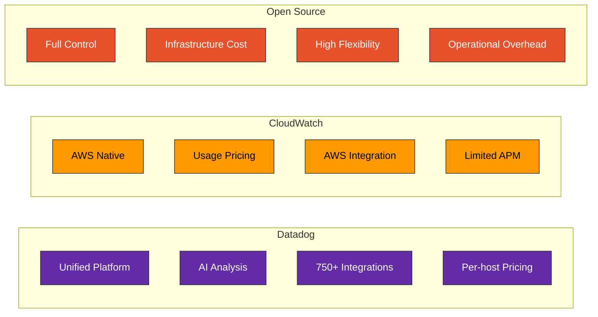
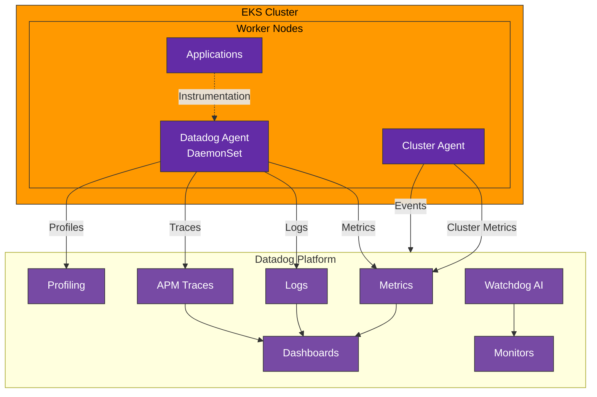
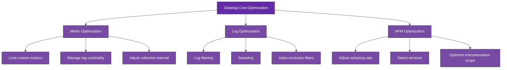

# Datadog

> **Última actualización**: February 20, 2026

## Tabla de contenido

- [Introducción](#introducción)
- [Arquitectura de integración de EKS](#arquitectura-de-integración-de-eks)
- [Instalación de Datadog Agent](#instalación-de-datadog-agent)
- [Monitoreo de infraestructura](#monitoreo-de-infraestructura)
- [APM y trazado distribuido](#apm-y-trazado-distribuido)
- [Gestión de logs](#gestión-de-logs)
- [Dashboards y alertas](#dashboards-y-alertas)
- [Estructura de costos](#estructura-de-costos)
- [Prácticas recomendadas](#prácticas-recomendadas)
- [Solución de problemas](#solución-de-problemas)

## Introducción

Datadog es una plataforma unificada de observabilidad para monitorear infraestructura, aplicaciones y logs a escala de nube. Se entrega como un modelo SaaS y proporciona potentes capacidades de monitoreo sin necesidad de gestionar infraestructura.

### Características principales

| Característica | Descripción |
|---------|-------------|
| **Plataforma unificada** | Métricas, logs, trazas y profiling integrados |
| **Más de 750 integraciones** | Amplias integraciones con AWS, Kubernetes, bases de datos, etc. |
| **Instrumentación automática** | Compatibilidad con instrumentación automática de APM |
| **Análisis basado en IA** | Detección automática de anomalías con Watchdog AI |
| **Monitoreo en tiempo real** | Posible recopilación de métricas con granularidad de 1 segundo |
| **Infraestructura global** | Centros de datos en todo el mundo |
| **SSO/RBAC** | Funciones de seguridad empresarial |

### Datadog frente a Open Source frente a CloudWatch



| Elemento | Datadog | CloudWatch | Prometheus+Grafana |
|------|---------|------------|-------------------|
| Modelo de implementación | SaaS | Administrado | Autohospedado |
| Configuración inicial | Muy fácil | Fácil | Media |
| Carga operativa | Ninguna | Baja | Alta |
| Previsibilidad de costos | Alta (basada en host) | Baja (basada en uso) | Alta (basada en infraestructura) |
| Escalabilidad | Automática | Automática | Manual |
| APM | Incluido | Independiente (X-Ray) | Requiere configuración independiente |
| Alertas | Avanzadas | Básicas | Alertmanager |

## Arquitectura de integración de EKS

### Arquitectura general



### Componentes

| Componente | Función |
|-----------|------|
| **Datadog Agent** | Recopilación de métricas, logs y trazas por nodo (DaemonSet) |
| **Cluster Agent** | Recopilación de métricas y eventos a nivel de clúster |
| **Admission Controller** | Inyección automática de instrumentación de APM |
| **Trace Agent** | Recopilación y reenvío de trazas de APM |
| **Process Agent** | Métricas de procesos y contenedores |

## Instalación de Datadog Agent

### Instalación con Helm

```bash
# Add Helm repository
helm repo add datadog https://helm.datadoghq.com
helm repo update

# Create API key secret
kubectl create namespace datadog
kubectl create secret generic datadog-secret \
  --namespace datadog \
  --from-literal api-key=<YOUR_API_KEY> \
  --from-literal app-key=<YOUR_APP_KEY>

# Install Datadog Agent
helm install datadog datadog/datadog \
  --namespace datadog \
  -f values.yaml
```

### values.yaml

```yaml
# API key configuration
datadog:
  apiKeyExistingSecret: datadog-secret
  appKeyExistingSecret: datadog-secret

  # Cluster name
  clusterName: my-eks-cluster

  # Site (US1, US3, US5, EU1, AP1, etc.)
  site: datadoghq.com

  # Tags
  tags:
    - env:production
    - team:platform
    - service:eks

  # Log collection
  logs:
    enabled: true
    containerCollectAll: true
    containerCollectUsingFiles: true

  # APM configuration
  apm:
    portEnabled: true
    socketEnabled: true

  # Process monitoring
  processAgent:
    enabled: true
    processCollection: true

  # Network monitoring
  networkMonitoring:
    enabled: true

  # Profiling
  profiling:
    enabled: true

  # Kubernetes events
  collectEvents: true

  # Prometheus metrics collection
  prometheusScrape:
    enabled: true
    serviceEndpoints: true

  # Live containers
  containerExclude: "image:datadog/agent"

# Cluster Agent
clusterAgent:
  enabled: true
  replicas: 2

  # Metrics server (for HPA)
  metricsProvider:
    enabled: true
    useDatadogMetrics: true

  # Admission Controller (auto instrumentation)
  admissionController:
    enabled: true
    mutateUnlabelled: false

  resources:
    requests:
      cpu: 200m
      memory: 256Mi
    limits:
      cpu: 500m
      memory: 512Mi

# Agent configuration
agents:
  # DaemonSet configuration
  rbac:
    create: true

  # Resource limits
  resources:
    requests:
      cpu: 200m
      memory: 256Mi
    limits:
      cpu: 500m
      memory: 512Mi

  # Volume mounts
  volumeMounts:
    - name: passwd
      mountPath: /etc/passwd
      readOnly: true
    - name: group
      mountPath: /etc/group
      readOnly: true

  volumes:
    - name: passwd
      hostPath:
        path: /etc/passwd
    - name: group
      hostPath:
        path: /etc/group

  # Tolerations (deploy to all nodes)
  tolerations:
    - operator: Exists

  # Priority class
  priorityClassName: system-node-critical

# Kubernetes integration
kubeStateMetricsEnabled: true

# Prometheus operator integration
prometheus:
  enabled: true
```

### Configuración de IRSA (opcional: para la integración con AWS)

```bash
# IAM policy
cat <<EOF > datadog-aws-policy.json
{
    "Version": "2012-10-17",
    "Statement": [
        {
            "Effect": "Allow",
            "Action": [
                "cloudwatch:GetMetricStatistics",
                "cloudwatch:ListMetrics",
                "ec2:DescribeInstances",
                "ec2:DescribeVolumes",
                "ec2:DescribeTags",
                "tag:GetResources",
                "tag:GetTagKeys",
                "tag:GetTagValues"
            ],
            "Resource": "*"
        }
    ]
}
EOF

aws iam create-policy \
  --policy-name DatadogAWSIntegration \
  --policy-document file://datadog-aws-policy.json

# Create service account
eksctl create iamserviceaccount \
  --name datadog-agent \
  --namespace datadog \
  --cluster my-cluster \
  --attach-policy-arn arn:aws:iam::123456789012:policy/DatadogAWSIntegration \
  --approve
```

## Monitoreo de infraestructura

### Métricas recopiladas automáticamente

Datadog Agent recopila automáticamente diversas métricas de infraestructura.

**Métricas del sistema**:
```yaml
# CPU
system.cpu.user           # User CPU usage
system.cpu.system         # System CPU usage
system.cpu.idle           # Idle CPU
system.load.1             # 1-minute load average

# Memory
system.mem.total          # Total memory
system.mem.used           # Used memory
system.mem.free           # Available memory
system.mem.cached         # Cached memory

# Disk
system.disk.total         # Total disk
system.disk.used          # Used disk
system.disk.free          # Available disk
system.io.r_s             # Disk reads/sec
system.io.w_s             # Disk writes/sec

# Network
system.net.bytes_rcvd     # Received bytes
system.net.bytes_sent     # Sent bytes
```

**Métricas de Kubernetes**:
```yaml
# Nodes
kubernetes.cpu.usage.total
kubernetes.memory.usage
kubernetes.memory.limits
kubernetes.filesystem.usage

# Pods
kubernetes.pods.running
kubernetes.containers.running
kubernetes.containers.restarts

# Deployments
kubernetes.deployment.replicas
kubernetes.deployment.replicas_available
kubernetes.deployment.replicas_desired

# Services
kubernetes.endpoint.address_available
kubernetes.service.count
```

### Recopilación de métricas personalizadas

#### Basada en anotaciones de Prometheus

```yaml
apiVersion: v1
kind: Pod
metadata:
  name: my-app
  annotations:
    # Datadog Agent automatically scrapes
    ad.datadoghq.com/my-app.checks: |
      {
        "prometheus": {
          "instances": [
            {
              "prometheus_url": "http://%%host%%:8080/metrics",
              "namespace": "my_app",
              "metrics": ["http_requests_total", "http_request_duration_*"]
            }
          ]
        }
      }
spec:
  containers:
  - name: my-app
    image: my-app:latest
```

#### Uso de DogStatsD

```python
# Python example
from datadog import initialize, statsd

initialize(statsd_host='localhost', statsd_port=8125)

# Counter
statsd.increment('my_app.requests', tags=['endpoint:/api/users', 'method:get'])

# Gauge
statsd.gauge('my_app.queue_size', 150, tags=['queue:orders'])

# Histogram
statsd.histogram('my_app.response_time', 0.25, tags=['endpoint:/api/users'])

# Distribution
statsd.distribution('my_app.request_size', 1024, tags=['content_type:json'])

# Service check
statsd.service_check('my_app.database', 0)  # 0=OK, 1=WARNING, 2=CRITICAL
```

```go
// Go example
package main

import (
    "github.com/DataDog/datadog-go/v5/statsd"
)

func main() {
    client, _ := statsd.New("localhost:8125",
        statsd.WithNamespace("my_app."),
        statsd.WithTags([]string{"env:production"}),
    )
    defer client.Close()

    // Counter
    client.Incr("requests", []string{"endpoint:/api/users"}, 1)

    // Gauge
    client.Gauge("queue_size", 150, []string{"queue:orders"}, 1)

    // Histogram
    client.Histogram("response_time", 0.25, []string{"endpoint:/api/users"}, 1)
}
```

### Descubrimiento de servicios

```yaml
# Auto discovery configuration via ConfigMap
apiVersion: v1
kind: ConfigMap
metadata:
  name: datadog-checks
  namespace: datadog
data:
  nginx.yaml: |
    ad_identifiers:
      - nginx
    init_config:
    instances:
      - nginx_status_url: http://%%host%%:80/nginx_status

  redis.yaml: |
    ad_identifiers:
      - redis
    init_config:
    instances:
      - host: "%%host%%"
        port: "6379"
        password: "%%env_REDIS_PASSWORD%%"
```

## APM y trazado distribuido

### Configuración de instrumentación automática

Instrumentación automática mediante Admission Controller:

```yaml
# Enable auto instrumentation by adding label to pod
apiVersion: apps/v1
kind: Deployment
metadata:
  name: my-app
spec:
  template:
    metadata:
      labels:
        # Enable automatic APM instrumentation
        admission.datadoghq.com/enabled: "true"
      annotations:
        # Specify library version (optional)
        admission.datadoghq.com/java-lib.version: "v1.24.0"
    spec:
      containers:
      - name: my-app
        image: my-java-app:latest
        env:
        # Service name
        - name: DD_SERVICE
          value: "my-app"
        # Environment
        - name: DD_ENV
          value: "production"
        # Version
        - name: DD_VERSION
          value: "1.0.0"
```

### Instrumentación manual (Java)

```java
// build.gradle
dependencies {
    implementation 'com.datadoghq:dd-trace-api:1.24.0'
}

// Java code
import datadog.trace.api.Trace;
import datadog.trace.api.DDTags;
import io.opentracing.Span;
import io.opentracing.util.GlobalTracer;

public class OrderService {

    @Trace(operationName = "order.process", resourceName = "processOrder")
    public Order processOrder(OrderRequest request) {
        Span span = GlobalTracer.get().activeSpan();
        if (span != null) {
            span.setTag("order.id", request.getOrderId());
            span.setTag("customer.id", request.getCustomerId());
        }

        // Business logic
        return doProcessOrder(request);
    }
}
```

### Instrumentación manual (Python)

```python
# requirements.txt
ddtrace==2.5.0

# Application code
from ddtrace import tracer, patch_all

# Auto patch
patch_all()

# Manual span creation
@tracer.wrap(service='order-service', resource='process_order')
def process_order(order_id):
    span = tracer.current_span()
    if span:
        span.set_tag('order.id', order_id)

    # Business logic
    return do_process_order(order_id)

# Using context manager
with tracer.trace('custom.operation', service='my-service') as span:
    span.set_tag('custom.tag', 'value')
    # Perform work
```

### Mapa de servicios

Los mapas de servicios se generan automáticamente a partir de los datos de trazas:

```yaml
# Service relationship tagging
env:
  - name: DD_SERVICE
    value: "api-gateway"
  - name: DD_ENV
    value: "production"
  - name: DD_VERSION
    value: "2.1.0"
  - name: DD_TAGS
    value: "team:platform,component:gateway"
```

## Gestión de logs

### Recopilación automática de logs

```yaml
# Enable in values.yaml
datadog:
  logs:
    enabled: true
    containerCollectAll: true  # Collect all container logs
```

### Configuración de logs por Pod

```yaml
apiVersion: v1
kind: Pod
metadata:
  name: my-app
  annotations:
    # Enable log collection
    ad.datadoghq.com/my-app.logs: |
      [{
        "source": "java",
        "service": "my-app",
        "log_processing_rules": [
          {
            "type": "multi_line",
            "name": "log_start_with_date",
            "pattern": "\\d{4}-\\d{2}-\\d{2}"
          }
        ]
      }]
spec:
  containers:
  - name: my-app
    image: my-app:latest
```

### Pipelines de logs

Configure los pipelines de logs en la UI de Datadog o mediante la API:

```json
{
  "name": "Java Application Logs",
  "is_enabled": true,
  "filter": {
    "query": "source:java"
  },
  "processors": [
    {
      "type": "grok-parser",
      "name": "Parse Java logs",
      "is_enabled": true,
      "source": "message",
      "samples": [],
      "grok": {
        "supportRules": "",
        "matchRules": "java_log %{date(\"yyyy-MM-dd HH:mm:ss,SSS\"):timestamp} %{word:level} \\[%{notSpace:thread}\\] %{notSpace:logger} - %{data:message}"
      }
    },
    {
      "type": "status-remapper",
      "name": "Set status from level",
      "is_enabled": true,
      "sources": ["level"]
    },
    {
      "type": "date-remapper",
      "name": "Set timestamp",
      "is_enabled": true,
      "sources": ["timestamp"]
    }
  ]
}
```

### Correlación de trazas y logs

```java
// Include trace ID in logs for Java
import org.slf4j.MDC;
import datadog.trace.api.CorrelationIdentifier;

// Add trace ID to log pattern
// logback.xml: %d{ISO8601} [%thread] %-5level %logger - dd.trace_id=%X{dd.trace_id} dd.span_id=%X{dd.span_id} - %msg%n

public class LoggingFilter implements Filter {
    @Override
    public void doFilter(ServletRequest request, ServletResponse response, FilterChain chain) {
        MDC.put("dd.trace_id", CorrelationIdentifier.getTraceId());
        MDC.put("dd.span_id", CorrelationIdentifier.getSpanId());
        try {
            chain.doFilter(request, response);
        } finally {
            MDC.clear();
        }
    }
}
```

## Dashboards y alertas

### Creación de dashboards (API)

```python
from datadog_api_client import ApiClient, Configuration
from datadog_api_client.v1.api.dashboards_api import DashboardsApi
from datadog_api_client.v1.model.dashboard import Dashboard
from datadog_api_client.v1.model.dashboard_layout_type import DashboardLayoutType

configuration = Configuration()
with ApiClient(configuration) as api_client:
    api_instance = DashboardsApi(api_client)

    dashboard = Dashboard(
        title="EKS Cluster Overview",
        description="Kubernetes cluster monitoring dashboard",
        layout_type=DashboardLayoutType.ORDERED,
        widgets=[
            {
                "definition": {
                    "type": "timeseries",
                    "title": "CPU Usage by Node",
                    "requests": [
                        {
                            "q": "avg:kubernetes.cpu.usage.total{cluster_name:my-cluster} by {host}",
                            "display_type": "line"
                        }
                    ]
                }
            },
            {
                "definition": {
                    "type": "toplist",
                    "title": "Top Pods by Memory",
                    "requests": [
                        {
                            "q": "top(avg:kubernetes.memory.usage{cluster_name:my-cluster} by {pod_name}, 10, 'mean', 'desc')"
                        }
                    ]
                }
            }
        ],
        template_variables=[
            {
                "name": "cluster",
                "default": "my-cluster",
                "prefix": "cluster_name"
            },
            {
                "name": "namespace",
                "default": "*",
                "prefix": "kube_namespace"
            }
        ]
    )

    response = api_instance.create_dashboard(body=dashboard)
```

### Configuración de Monitor (alerta)

```yaml
# Create monitors with Terraform
resource "datadog_monitor" "high_cpu" {
  name    = "High CPU Usage on EKS Nodes"
  type    = "metric alert"
  message = <<-EOT
    CPU usage is high on {{host.name}}.

    Current value: {{value}}%

    @slack-alerts @pagerduty-critical
  EOT

  query = "avg(last_5m):avg:kubernetes.cpu.usage.total{cluster_name:my-cluster} by {host} > 80"

  monitor_thresholds {
    warning  = 70
    critical = 80
  }

  notify_no_data    = false
  renotify_interval = 60

  tags = ["env:production", "team:platform", "cluster:my-cluster"]
}

resource "datadog_monitor" "pod_restarts" {
  name    = "Pod Restart Alert"
  type    = "metric alert"
  message = <<-EOT
    Pod {{pod_name.name}} in namespace {{kube_namespace.name}} is restarting frequently.

    @slack-alerts
  EOT

  query = "change(sum(last_5m),last_5m):sum:kubernetes.containers.restarts{cluster_name:my-cluster} by {pod_name,kube_namespace} > 3"

  monitor_thresholds {
    warning  = 2
    critical = 3
  }

  tags = ["env:production", "cluster:my-cluster"]
}

resource "datadog_monitor" "error_rate" {
  name    = "High Error Rate"
  type    = "metric alert"
  message = <<-EOT
    Error rate is high for service {{service.name}}.

    Current error rate: {{value}}%

    [View APM Dashboard](https://app.datadoghq.com/apm/service/{{service.name}})

    @slack-alerts @pagerduty-warning
  EOT

  query = "sum(last_5m):sum:trace.http.request.errors{env:production} by {service}.as_count() / sum:trace.http.request.hits{env:production} by {service}.as_count() * 100 > 5"

  monitor_thresholds {
    warning  = 2
    critical = 5
  }

  tags = ["env:production", "type:apm"]
}
```

### Watchdog AI

Watchdog detecta automáticamente anomalías y genera alertas:

```yaml
# Watchdog alert configuration
resource "datadog_monitor" "watchdog" {
  name    = "Watchdog Alert"
  type    = "event-v2 alert"
  message = <<-EOT
    Watchdog detected an anomaly:
    {{event.title}}

    {{event.text}}

    @slack-alerts
  EOT

  query = "events(\"source:watchdog\").rollup(\"count\").by(\"story_category\").last(\"5m\") > 0"

  tags = ["env:production", "type:watchdog"]
}
```

## Estructura de costos

### Resumen de precios

| Plan | Infraestructura | APM | Logs | Características |
|------|----------------|-----|------|----------|
| **Gratuito** | 5 hosts | - | - | Retención de 1 día |
| **Pro** | $15/host/mes | $31/host/mes | $0.10/GB | Retención de 15 meses |
| **Enterprise** | $23/host/mes | $40/host/mes | $0.10/GB | Retención personalizada |

### Ejemplo de cálculo de costos

**Clúster de EKS de 100 nodos**:
```
Infrastructure monitoring: 100 x $15 = $1,500/month
APM (50 services): 50 x $31 = $1,550/month
Logs (100GB/day): 100 x 30 x $0.10 = $300/month
-----------------------------------------
Estimated total cost: ~$3,350/month
```

### Estrategias de optimización de costos



#### 1. Optimización de métricas

```yaml
# values.yaml
datadog:
  # Exclude unnecessary metrics
  ignoreAutoConfig:
    - docker
    - containerd

  # Limit custom metrics
  dogstatsd:
    nonLocalTraffic: false

  # Limit tag cardinality
  containerExcludeLogs: "name:datadog-agent"
  containerExcludeMetrics: "name:pause"
```

#### 2. Optimización de logs

```yaml
# Log filtering and sampling
datadog:
  logs:
    enabled: true
    containerCollectAll: false  # Selective collection

# Exclude logs at pod level
metadata:
  annotations:
    ad.datadoghq.com/my-app.logs: |
      [{
        "source": "java",
        "service": "my-app",
        "log_processing_rules": [
          {
            "type": "exclude_at_match",
            "name": "exclude_health_checks",
            "pattern": "GET /health"
          }
        ]
      }]
```

#### 3. Muestreo de APM

```yaml
# Trace sampling configuration
env:
  - name: DD_TRACE_SAMPLE_RATE
    value: "0.1"  # 10% sampling
  - name: DD_TRACE_RATE_LIMIT
    value: "100"  # Max 100 traces per second
```

## Prácticas recomendadas

### 1. Estrategia de etiquetado

```yaml
# Consistent tagging scheme
datadog:
  tags:
    - env:production
    - team:platform
    - cost-center:engineering
    - cluster:my-eks-cluster

# Service tags
env:
  - name: DD_SERVICE
    value: "order-service"
  - name: DD_ENV
    value: "production"
  - name: DD_VERSION
    valueFrom:
      fieldRef:
        fieldPath: metadata.labels['app.kubernetes.io/version']
```

### 2. Capas de alertas

```yaml
# P1 (Critical) - Immediate response
- name: "Service Down"
  priority: P1
  notify: "@pagerduty-critical @slack-incidents"

# P2 (High) - Response within 1 hour
- name: "High Error Rate"
  priority: P2
  notify: "@pagerduty-warning @slack-alerts"

# P3 (Medium) - Response during business hours
- name: "High Latency"
  priority: P3
  notify: "@slack-alerts"

# P4 (Low) - Next sprint
- name: "Resource Warning"
  priority: P4
  notify: "@slack-monitoring"
```

### 3. Configuración de SLO

```python
# Create SLO via API
from datadog_api_client.v1.api.service_level_objectives_api import ServiceLevelObjectivesApi
from datadog_api_client.v1.model.service_level_objective_request import ServiceLevelObjectiveRequest

slo = ServiceLevelObjectiveRequest(
    name="API Availability SLO",
    type="metric",
    description="99.9% availability for API endpoints",
    query={
        "numerator": "sum:trace.http.request.hits{service:api-gateway,http.status_code:2*}.as_count()",
        "denominator": "sum:trace.http.request.hits{service:api-gateway}.as_count()"
    },
    thresholds=[
        {
            "timeframe": "30d",
            "target": 99.9,
            "warning": 99.95
        }
    ],
    tags=["service:api-gateway", "env:production"]
)
```

## Solución de problemas

### Problemas comunes

#### 1. El Agent no envía métricas

```bash
# Check Agent status
kubectl exec -it $(kubectl get pods -n datadog -l app=datadog -o jsonpath='{.items[0].metadata.name}') -n datadog -- agent status

# Test connectivity
kubectl exec -it <agent-pod> -n datadog -- agent diagnose

# Check logs
kubectl logs -n datadog -l app=datadog --tail=100
```

#### 2. Faltan trazas de APM

```bash
# Check Trace Agent status
kubectl exec -it <agent-pod> -n datadog -- agent status | grep -A 20 "APM Agent"

# Check trace endpoint
kubectl exec -it <app-pod> -- env | grep DD_

# Test connectivity
kubectl exec -it <app-pod> -- nc -zv <agent-service> 8126
```

#### 3. Los logs no se recopilan

```bash
# Check log configuration
kubectl exec -it <agent-pod> -n datadog -- agent configcheck | grep logs

# Check pod annotations
kubectl get pod <pod-name> -o jsonpath='{.metadata.annotations}'

# Check Agent logs
kubectl logs -n datadog <agent-pod> -c agent | grep -i logs
```

### Comandos de depuración

```bash
# Full Agent status
kubectl exec -it <agent-pod> -n datadog -- agent status

# Configuration check
kubectl exec -it <agent-pod> -n datadog -- agent configcheck

# Connection diagnostics
kubectl exec -it <agent-pod> -n datadog -- agent diagnose

# Real-time logs
kubectl exec -it <agent-pod> -n datadog -- agent stream-logs

# Generate flare (for support requests)
kubectl exec -it <agent-pod> -n datadog -- agent flare <case-id>
```

## Referencias

- [Documentación oficial de Datadog](https://docs.datadoghq.com/)
- [Integración de Kubernetes](https://docs.datadoghq.com/integrations/kubernetes/)
- [Datadog Helm Charts](https://github.com/DataDog/helm-charts)
- [Guía de configuración de APM](https://docs.datadoghq.com/tracing/)
- [Precios de Datadog](https://www.datadoghq.com/pricing/)

## Cuestionario

Para comprobar su comprensión de este capítulo, pruebe el [cuestionario de Datadog](../../quizzes/observability/metrics/05-datadog-quiz.md).
