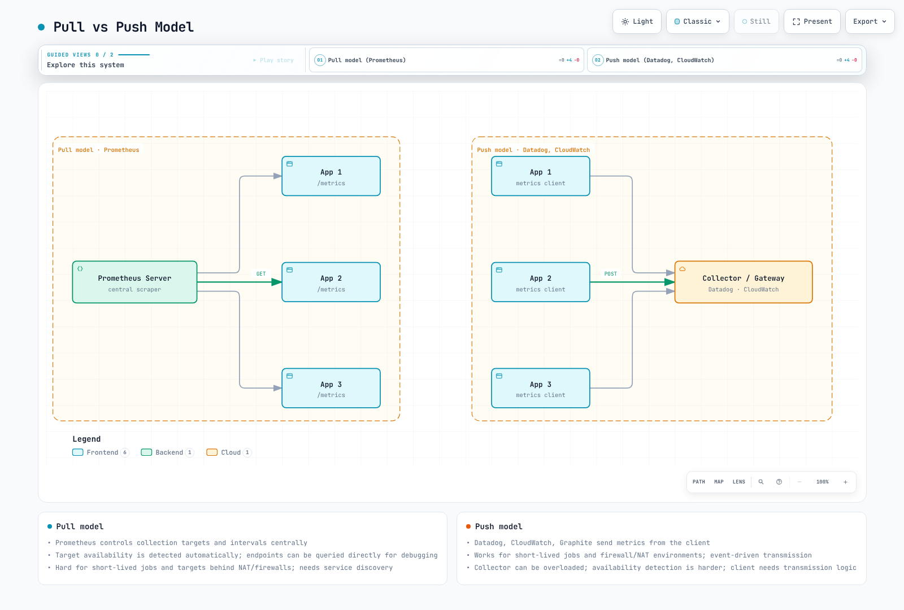

# Descripción general de métricas

> **Última actualización**: September 13, 2026. Los ejemplos se comprobaron localmente con las herramientas de Prometheus 3.14.0; no se realizó ningún despliegue de clúster o nube.

## Tabla de contenido

- [Fundamentos de las métricas](#metrics-fundamentals)
- [Tipos de métricas](#metric-types)
- [Modelo Pull frente a Push](#pull-vs-push-model)
- [Cardinalidad y diseño de métricas](#cardinality-and-metric-design)
- [Requisitos de almacenamiento a largo plazo](#long-term-storage-requirements)
- [Comparación de soluciones](#solution-comparison)
- [Arquitectura de recopilación de métricas](#metrics-collection-architecture)

## Fundamentos de las métricas

Las métricas describen numéricamente el estado y el comportamiento del sistema. Un nombre de métrica y su conjunto completo de etiquetas identifican una serie temporal; cada muestra añade un valor y una marca de tiempo. Las métricas permiten alertas, resolución de problemas, planificación de capacidad y análisis del rendimiento, pero una medición muestreada no conserva cada evento individual.

Por ejemplo, `http_requests_total` nombra un contador de solicitudes; `method="GET"` y `status="200"` distinguen poblaciones. El valor de la muestra es el recuento acumulado. Las etiquetas de destino como `job` e `instance` se añaden normalmente durante el scraping.

Las marcas de tiempo dependen del formato. Una marca de tiempo explícita en la exposición de texto heredada de Prometheus usa **milisegundos** Unix, mientras que OpenMetrics usa **segundos** Unix. Los exporters normalmente omiten las marcas de tiempo explícitas de las muestras para que Prometheus asigne el momento del scraping. No trate una unidad como universal entre protocolos de telemetría.

### Nombres y unidades

| Ejemplo | Interpretación |
|---|---|
| `http_requests_total` | Contador; `_total` indica un recuento acumulado, no una unidad física |
| `http_request_duration_seconds` | Duración en una unidad base |
| `node_memory_MemAvailable_bytes` | Métrica existente de node-exporter; conserve su ortografía publicada |
| `requests` | Muy poco contexto para una métrica de aplicación nueva |
| `httpRequestDurationMs` | Contiene una unidad, pero usa camelCase y milisegundos en lugar de la convención habitual de nombres/unidades base de Prometheus |

Para métricas nuevas, prefiera prefijos descriptivos, palabras en minúsculas separadas por guiones bajos y unidades como `_seconds` o `_bytes`. Una convención de nombres no autoriza renombrar la API establecida de un exporter.

Los siguientes bloques `text` son una **exposición de texto de Prometheus** sintética, no YAML. Las expresiones de consulta son bloques `promql` independientes. Los selectores de consulta asumen los nombres de scrape-job mostrados; adáptelos a las etiquetas reales de sus destinos.

## Tipos de métricas

Las bibliotecas cliente de Prometheus exponen habitualmente Counter, Gauge, Histogram y Summary. Seleccione el tipo según el significado de la medición, no solo según qué consulta acepta sus muestras.

### 1. Counter

Un contador acumula incrementos no negativos, como solicitudes, errores o tareas completadas. Puede reiniciarse cuando se vuelve a crear el proceso/estado medido; no necesariamente cada reinicio de un exporter reinicia el contador subyacente.

```text
# TYPE http_requests_total counter
http_requests_total{method="GET",endpoint="/api/users",status="200"} 12345
http_requests_total{method="POST",endpoint="/api/users",status="500"} 23
```

Tasa por serie, tasa de todo el servicio e incremento estimado:

```promql
rate(http_requests_total{job="example-app"}[5m])
```

```promql
sum(rate(http_requests_total{job="example-app"}[5m]))
```

```promql
increase(http_requests_total{job="example-app"}[1h])
```

`rate()` considera los reinicios observados del contador y extrapola sobre la ventana solicitada. No puede recuperar incrementos perdidos entre observaciones. Por lo tanto, `increase()` puede devolver una estimación fraccionaria incluso para un contador entero. **Aplique `rate()` antes de agregar** para que un reinicio en una instancia no quede oculto por el crecimiento en otra.

### 2. Gauge

Un Gauge representa el estado actual y puede subir o bajar. Estos valores ilustran nombres reales de node-exporter y kube-state-metrics junto con una métrica de temperatura definida por la aplicación.

```text
# TYPE node_memory_MemAvailable_bytes gauge
node_memory_MemAvailable_bytes 8589934592
# TYPE node_memory_MemTotal_bytes gauge
node_memory_MemTotal_bytes 17179869184
# TYPE kube_pod_status_ready gauge
kube_pod_status_ready{namespace="example-app",pod="example-0",uid="00000000-0000-4000-8000-000000000001",condition="true"} 1
# TYPE temperature_celsius gauge
temperature_celsius{location="datacenter-1"} 23.5
```

```promql
100 * (1 - node_memory_MemAvailable_bytes{job="node-exporter"} / node_memory_MemTotal_bytes{job="node-exporter"})
```

```promql
max_over_time(temperature_celsius{job="example-app"}[1h])
```

La expresión de memoria es la proporción no reportada como `MemAvailable`; no es una medición de memoria residente de una aplicación. La preparación de un Pod usa una serie `condition` concreta: un valor de uno en `condition="false"` tiene un significado diferente de uno en `condition="true"`.

### 3. Histogram

Un **histograma clásico** cuenta observaciones en buckets acumulativos en la aplicación/exporter instrumentado. Prometheus calcula los cuantiles posteriormente. `le` es un límite superior inclusivo, y el bucket `+Inf` equivale a `_count`.

```text
# TYPE http_request_duration_seconds histogram
http_request_duration_seconds_bucket{le="0.005"} 24054
http_request_duration_seconds_bucket{le="0.01"} 33444
http_request_duration_seconds_bucket{le="0.025"} 100392
http_request_duration_seconds_bucket{le="0.05"} 129389
http_request_duration_seconds_bucket{le="0.1"} 133988
http_request_duration_seconds_bucket{le="0.25"} 144320
http_request_duration_seconds_bucket{le="+Inf"} 144320
http_request_duration_seconds_sum 4800.8625
http_request_duration_seconds_count 144320
```

Esta es una distribución ilustrativa, no un benchmark. Sus 144,320 observaciones suman **4,800.8625 segundos**. La antigua suma de 53.42 segundos era inconsistente con los recuentos de buckets mostrados, que implican un límite inferior por encima de 2,704 segundos. El bucket finito de 0.25 segundos también evita que el p95 del ejemplo caiga solo en el bucket sin límite.

p95 y media de toda la flota para diseños de buckets coincidentes:

```promql
histogram_quantile(0.95, sum by (le) (rate(http_request_duration_seconds_bucket{job="example-app"}[5m])))
```

```promql
sum(rate(http_request_duration_seconds_sum{job="example-app"}[5m])) / sum(rate(http_request_duration_seconds_count{job="example-app"}[5m]))
```

Conserve `le` al agregar buckets clásicos. Los cuantiles interpolan dentro de los buckets; su exactitud depende de la distribución y la resolución de los buckets. Cambiar los límites de los buckets clásicos es un cambio de instrumentación, no una edición solo de consulta.

Los histogramas nativos representan la distribución de forma diferente. La guía actual de Prometheus los prefiere cuando el cliente, el protocolo de scraping y el pipeline de almacenamiento/consulta los admiten. Verifique la compatibilidad y la configuración a lo largo de toda la ruta; los ejemplos clásicos aquí no son salida de cable de histogramas nativos.

### 4. Summary

Un Summary puede calcular cuantiles configurados sobre una ventana del lado del cliente. Esos valores son generalmente **aproximaciones con error dependiente del algoritmo/ventana**, no cuantiles exactos. El soporte de las bibliotecas varía; una implementación de Summary puede exponer solo suma/recuento.

```text
# TYPE rpc_request_duration_seconds summary
rpc_request_duration_seconds{quantile="0.5"} 0.052
rpc_request_duration_seconds{quantile="0.9"} 0.089
rpc_request_duration_seconds{quantile="0.99"} 0.245
rpc_request_duration_seconds_sum 29969.50
rpc_request_duration_seconds_count 562887
```

```promql
rpc_request_duration_seconds{job="example-app",quantile="0.99"}
```

```promql
sum(rate(rpc_request_duration_seconds_sum{job="example-app"}[5m])) / sum(rate(rpc_request_duration_seconds_count{job="example-app"}[5m]))
```

La primera expresión devuelve el p99 reportado por cada instancia coincidente. Promediar o sumar esos valores de p99 no produce un p99 de toda la flota. La segunda expresión agrega legítimamente las tasas de `_sum` y `_count` de duración no negativa para calcular una media de toda la flota.

| Pregunta | Histograma clásico | Summary con cuantiles |
|---|---|---|
| ¿Dónde se procesa la distribución? | Buckets en la instrumentación; cuantil en el momento de la consulta | Cuantil en la instrumentación |
| ¿Se pueden combinar instancias? | Se pueden agregar buckets compatibles | Los cuantiles no; suma/recuento sí |
| El error depende de | Resolución de buckets y observaciones | Algoritmo del cliente, objetivo y ventana temporal |
| ¿Se puede consultar después un percentil/ventana diferente? | A partir de muestras de buckets conservadas | No a partir de solo el cuantil precomputado |

Para tráfico cero, la media puede ser `NaN`; las series ausentes pueden producir un resultado vacío. Ninguno debe convertirse silenciosamente en evidencia de tráfico saludable.

<a id="metric-collection-models"></a>

## Modelo Pull frente a Push



[Diagrama interactivo](https://www.atomai.click/kubernetes-docs/archmaps/en-observability-metrics-readme-0.html)

La figura ilustra la dirección de conexión. Los pipelines reales pueden combinar ambos modelos: un agente puede hacer scraping de endpoints y reenviar los resultados. Los nombres de proveedores no implican que cada integración use un solo modelo.

### Descubrimiento Pull y Kubernetes

La recopilación Pull controla centralmente los destinos e intervalos y facilita inspeccionar endpoints. El recopilador necesita conectividad saliente y el destino necesita acceso entrante permitido, con enrutamiento, TLS y autorización configurados. NAT no hace automáticamente que un destino sea accesible. `up` de Prometheus informa del éxito del scraping; no es el SLO de disponibilidad de la aplicación.

Este fragmento de configuración de Prometheus selecciona **Pods en ejecución en `example-app` con un puerto de contenedor TCP `metrics` nombrado y con inclusión habilitada**. Usa la dirección detectada en lugar de reescribirla con una expresión regular exclusiva de IPv4.

```yaml
# pod-scrape.yaml
scrape_configs:
- job_name: example-app
  kubernetes_sd_configs:
  - role: pod
    namespaces:
      names:
      - example-app
  relabel_configs:
  - source_labels:
    - __meta_kubernetes_pod_annotation_prometheus_io_scrape
    action: keep
    regex: 'true'
  - source_labels:
    - __meta_kubernetes_pod_phase
    action: keep
    regex: Running
  - source_labels:
    - __meta_kubernetes_pod_container_port_name
    action: keep
    regex: metrics
  - source_labels:
    - __meta_kubernetes_pod_container_port_protocol
    action: keep
    regex: TCP
  - source_labels:
    - __meta_kubernetes_pod_annotation_prometheus_io_path
    action: replace
    target_label: __metrics_path__
    regex: (.+)
  - source_labels:
    - __meta_kubernetes_namespace
    target_label: namespace
  - source_labels:
    - __meta_kubernetes_pod_name
    target_label: pod
```

Requisitos previos: la anotación del Pod `prometheus.io/scrape: "true"`, un puerto declarado llamado `metrics`, una `prometheus.io/path` opcional y credenciales/RBAC de la API de Kubernetes para que Prometheus detecte estos Pods. El endpoint debe servir realmente métricas en ese puerto/ruta. Este es un fragmento de configuración, no una instalación de clúster ni una prueba de accesibilidad.

### Push y trabajos por lotes a nivel de servicio

Push puede ser adecuado para productores con acceso saliente, incluidas algunas cargas de trabajo de corta duración. Aun así, requiere capacidad del receptor, autenticación, gestión de tiempo de espera/reintentos y una forma de detectar productores ausentes. Una comprobación de estado exitosa del receptor no prueba que se ejecutó un trabajo por lotes.

Prometheus recomienda Pushgateway para casos de uso limitados de trabajos por lotes **a nivel de servicio**, no como valor predeterminado para cada Pod de corta duración. Los grupos enviados no caducan automáticamente. Evite la agrupación por `HOSTNAME` de cada Pod que deja grupos abandonados; defina una propiedad estable del trabajo y un proceso explícito de retirada/limpieza.

Lo siguiente es un **fragmento de integración posterior al éxito** para un lote lógico, no un Kubernetes Job ejecutable. Supone un Pushgateway accesible y autorizado, `sh`, `awk` y `curl`. El lote proporciona su duración medida, el recuento de registros procesados y la marca de tiempo original de finalización. Si se reintenta la entrega, conserve esa marca de tiempo original. Añada TLS/autenticación apropiados para el entorno sin incrustar secretos en los ejemplos.

```sh
set -eu
: "${PUSHGATEWAY_URL:?Set the reachable authorized Pushgateway base URL}"
: "${DURATION_SECONDS:?Set the measured duration of the successful batch}"
: "${RECORDS_PROCESSED:?Set the number of records processed by that batch}"
: "${COMPLETED_AT_SECONDS:?Set its original Unix completion time in seconds}"

# Reject nonnumeric metric values before sending anything.
awk -v n="$DURATION_SECONDS" 'BEGIN { exit !(n ~ /^[0-9]+([.][0-9]+)?$/) }'
case "$RECORDS_PROCESSED" in *[!0-9]*|'') exit 2;; esac
case "$COMPLETED_AT_SECONDS" in *[!0-9]*|'') exit 2;; esac

cat <<EOF | curl --fail --silent --show-error --connect-timeout 5 --max-time 15 \
  --request PUT --data-binary @- "${PUSHGATEWAY_URL%/}/metrics/job/example_batch"
# TYPE example_batch_last_run_duration_seconds gauge
example_batch_last_run_duration_seconds ${DURATION_SECONDS}
# TYPE example_batch_last_run_records_processed gauge
example_batch_last_run_records_processed ${RECORDS_PROCESSED}
# TYPE example_batch_last_success_timestamp_seconds gauge
example_batch_last_success_timestamp_seconds ${COMPLETED_AT_SECONDS}
EOF
```

`PUT` reemplaza las métricas de esta clave de agrupación estable. Los trabajos independientes no deben competir por la misma clave. No envíe una marca de tiempo de éxito después de trabajo fallido, ni elimine el grupo después de cada ejecución exitosa antes de que pueda ser scrapeado. Cuando se retire el trabajo lógico, elimine deliberadamente su grupo propio.

Haga scraping del Pushgateway con `honor_labels` para conservar la identidad del trabajo enviado:

```yaml
# pushgateway-scrape.yaml
scrape_configs:
- job_name: pushgateway
  honor_labels: true
  static_configs:
  - targets:
    - pushgateway:9091
```

Antigüedad de la última finalización exitosa, en segundos:

```promql
time() - max(example_batch_last_success_timestamp_seconds{job="example_batch"})
```

Elija un umbral según la programación y el tiempo de ejecución esperado, y gestione por separado una serie completamente ausente. `up` para Pushgateway solo describe el scraping del gateway.

## Cardinalidad y diseño de métricas

La cardinalidad es el número de series distintas en un ámbito definido. El producto de los recuentos de valores de etiquetas es un **límite superior si puede ocurrir cada combinación**, no una garantía de que existan todas las combinaciones.

Cinco métodos × veinte rutas normalizadas × diez estados dan como máximo 1,000 combinaciones de etiquetas de aplicación. Las etiquetas de destino/réplica y los buckets de histogramas clásicos más suma/recuento pueden multiplicar ese número. La rotación de series también añade coste de almacenamiento histórico e índice.

Use plantillas de ruta acotadas como `/users/{id}`. Evite IDs de usuario, IDs de solicitud, IDs de sesión y marcas de tiempo cambiantes como etiquetas de métricas comunes; también corren el riesgo de exponer datos sensibles. Agrupe códigos de estado solo cuando la pérdida de detalle sea aceptable. Coloque el contexto específico de solicitudes en logs/traces adecuadamente controlados.

Estas consultas con ámbito cuentan series actualmente seleccionables, no todas las series históricas almacenadas en el TSDB:

```promql
topk(10, count by (__name__) ({job="example-app"}))
```

```promql
count(http_requests_total{job="example-app"})
```

```promql
count(count by (endpoint) (http_requests_total{job="example-app"}))
```

Las longitudes de los nombres/valores de métricas y etiquetas todavía afectan los límites de formato, el almacenamiento y la aceptación del backend. La cardinalidad es importante, pero no es la única restricción de diseño.

## Requisitos de almacenamiento a largo plazo

El TSDB local de Prometheus usa compresión y puede conservar datos durante mucho más de 30 días cuando se configura y aprovisiona en consecuencia. Su retención temporal predeterminada es de **15 días cuando no se proporciona ninguna configuración de retención por tiempo/tamaño**; eso no es un máximo.

El almacenamiento local no es un almacén distribuido replicado. Réplicas independientes de Prometheus pueden proporcionar redundancia de recopilación/alertas sin requerir Thanos o Mimir, pero las consultas compartidas, la deduplicación, la durabilidad remota y la recuperación necesitan su propio diseño. El coste de consultas de largo alcance depende del volumen de datos y de la expresión, no solo de la antigüedad en calendario.

### Planificación de retención

| Necesidad | Pregunta de planificación |
|---|---|
| Evaluación de alertas | ¿Qué ventanas retrospectivas, márgenes para interrupciones y comportamiento ante datos ausentes se requieren? |
| Análisis de incidentes | ¿Durante cuánto tiempo debe estar disponible una resolución útil? |
| Capacidad/estacionalidad | ¿Se necesitan varios meses o una comparación interanual? |
| Obligaciones de auditoría | ¿Qué política real se aplica a estos datos, acceso y eliminación? |
| Recuperación | ¿Se requieren copias de seguridad, pruebas de restauración y dominios de fallo independientes? |

No existe una regla universal de «las métricas deben conservarse durante 1–7 años». Especifique la retención **y la resolución**, la política de eliminación/acceso y los objetivos de recuperación para la carga de trabajo.

### Escritura remota

Este fragmento se dirige a un receptor de **VictoriaMetrics de nodo único** ya desplegado. Combínelo con una configuración de scraping revisada. Un receptor de clúster usa una ruta/topología diferente; un ID de tenant por sí solo no es autenticación. Use un endpoint autorizado y protegido con TLS según corresponda para el entorno.

```yaml
# remote-write.yaml
global:
  scrape_interval: 15s
remote_write:
- url: http://victoriametrics:8428/api/v1/write
  queue_config:
    capacity: 10000
    max_samples_per_send: 2000
    max_shards: 10
  write_relabel_configs:
  - source_labels:
    - __name__
    regex: example_debug_payload_total
    action: drop
```

El ejemplo conserva los valores predeterminados documentados de cola/lote de 10,000/2,000; `max_shards: 10` es un límite de concurrencia ilustrativo, no un óptimo medido. La memoria de la cola crece con los shards y la capacidad. La guía de ajuste sugiere una capacidad de aproximadamente 3–10 veces el tamaño del lote; comience con los valores predeterminados y mida el atraso, el rendimiento y la memoria.

La regla explícita de descarte ilustra la exclusión de una métrica de depuración revisada de la entrega **remota**; no elimina las muestras locales. Descartar todas las métricas `go_.*` no es un remedio general para la cardinalidad y descarta diagnósticos de tiempo de ejecución.

La escritura remota es asíncrona y su búfer WAL es finito. La guía de ajuste de Prometheus describe la pérdida de datos no enviados después de una interrupción prolongada más allá de la ventana WAL documentada (unas dos horas en esa guía). No es una copia de seguridad ni una garantía de que la entrega siempre tenga éxito.

## Comparación de soluciones

### Límites de despliegue y operación

| Opción | Qué evaluar |
|---|---|
| Servidor Prometheus | TSDB local, PromQL y reglas; retención/capacidad, réplicas independientes y recuperación |
| VictoriaMetrics | Despliegue de nodo único frente a clúster; compatibilidad MetricsQL/PromQL, capacidad de almacenamiento, autorización de tenant, replicación y funcionalidades específicas de edición |
| Grafana Mimir | Servicios distribuidos y almacenamiento de objetos; recursos locales/de ingestión, replicación, autenticación de tenant, límites y capacidad operativa |
| Métricas CloudWatch | Almacenamiento de métricas administrado por AWS, matemática de métricas/Metrics Insights e integraciones relevantes; dimensiones, producto de consulta, cuotas y resolución |
| Métricas Datadog | SaaS más agentes/integraciones; cardinalidad de etiquetas, derechos de producto, rollups de consulta y facturación |

El almacenamiento de objetos no implica escalado ilimitado ni elimina todos los requisitos de disco local. Los destinos de backup de VictoriaMetrics y las funciones de ediciones concretas no son intercambiables con la arquitectura de almacenamiento primaria. Las afirmaciones de compresión comparativa como «7×» necesitan un conjunto de datos, versión y método identificados; aquí no se afirma ninguna.

Para las **métricas tradicionales de CloudWatch**, la resolución cambia con la antigüedad: los puntos de menos de un minuto están disponibles durante tres horas, los puntos de un minuto durante 15 días, los puntos de cinco minutos durante 63 días y los puntos horarios durante 455 días. Otros productos/rutas de ingestión de métricas deben comprobarse por separado. La tabla de retención publicada por Datadog enumera etiquetas/valores de métricas durante 15 meses, pero las consultas aplican rollups; eso no promete la resolución de scraping original en cada gráfico.

### Entradas de coste, no totales mensuales sin respaldo

Si **un millón es el recuento real de series exportadas**, un intervalo uniforme de 15 segundos durante 30 días produce `1,000,000 × 30 × 86,400 / 15 = 172,800,000,000` muestras antes del filtrado/deduplicación de entrega. Si el millón se refiere solo a combinaciones de etiquetas de aplicación, expanda primero los destinos, réplicas y series de histogramas.

| Opción | Entradas necesarias para una estimación |
|---|---|
| Almacenamiento autogestionado | CPU/RAM, bytes medidos por muestra, índices/WAL/margen, réplicas, almacenamiento/red, backup y tiempo del operador |
| Amazon Managed Service for Prometheus | Muestras ingeridas, almacenamiento, procesamiento de consultas, funciones de recopilación elegidas y precios regionales |
| CloudWatch | Combinaciones facturables de métrica/dimensión, resolución, API/consulta y funciones de observabilidad seleccionadas |
| Datadog | Planes seleccionados, hosts/contenedores, métricas personalizadas incluidas y adicionales, etiquetas y otros productos habilitados |

Compare supuestos equivalentes de ingestión, retención, HA y funcionalidades. Obtenga precios actuales de las páginas de precios oficiales de abajo y pruebe el uso de recursos específico de la carga de trabajo. «Open source» no hace que la infraestructura y las operaciones sean gratuitas.

Seleccione una solución según las consultas/resolución requeridas, la cardinalidad y la rotación, los objetivos de fallo/recuperación, los límites de tenant/acceso, las integraciones y un modelo de costes medido. El tamaño del equipo por sí solo no es un algoritmo de selección de productos.

## Arquitectura de recopilación de métricas

Separe las responsabilidades de recopilación, almacenamiento/consulta, evaluación de reglas y notificación:

| Componente | Función |
|---|---|
| node-exporter | Métricas del SO host como contadores de memoria, sistema de archivos y red |
| kube-state-metrics | Estado de objetos de la API de Kubernetes; no sustituye las mediciones de CPU de contenedores |
| endpoints kubelet/cAdvisor | Mediciones de recursos de contenedores; la disponibilidad del endpoint y la autorización de scraping requieren verificación |
| metrics-server | Resource Metrics API para autoscaling y `kubectl top`; no es un TSDB histórico de Prometheus |
| Prometheus | Scraping, almacenamiento/consulta local y evaluación de reglas |
| vmagent | Recopila y reenvía métricas, con búfer; no es un TSDB de Prometheus consultable |
| VictoriaMetrics / Mimir | Almacenan y consultan métricas según su arquitectura de despliegue |
| Reglas de Prometheus / vmalert / Mimir ruler | Evalúan expresiones y envían alertas a Alertmanager |
| Alertmanager | Agrupa, enruta, inhibe y entrega alertas; no consulta un TSDB para evaluar PromQL |
| Grafana | Consulta fuentes de datos configuradas y visualiza resultados |

Planifique descubrimiento, RBAC, credenciales, TLS y acceso de red para cada conexión. Hacer scraping de más endpoints no sustituye definir qué señales responden las preguntas de la carga de trabajo.

## Referencias principales

- [Tipos de métricas de Prometheus](https://github.com/prometheus/docs/blob/main/docs/concepts/metric_types.md), [histogramas y summaries](https://github.com/prometheus/docs/blob/main/docs/practices/histograms.md), y [formatos de exposición](https://github.com/prometheus/docs/blob/main/docs/instrumenting/exposition_formats.md)
- [Configuración de Prometheus 3.14](https://github.com/prometheus/prometheus/blob/v3.14.0/docs/configuration/configuration.md) y [almacenamiento](https://github.com/prometheus/prometheus/blob/v3.14.0/docs/storage.md)
- [Cuándo usar Pushgateway](https://github.com/prometheus/docs/blob/main/docs/practices/pushing.md), [ciclo de vida/API de Pushgateway](https://github.com/prometheus/pushgateway), y [ajuste de remote-write](https://github.com/prometheus/docs/blob/main/docs/practices/remote_write.md)
- [Clúster de VictoriaMetrics](https://docs.victoriametrics.com/victoriametrics/cluster-victoriametrics/), [vmagent](https://docs.victoriametrics.com/victoriametrics/vmagent/), y [arquitectura de Mimir](https://grafana.com/docs/mimir/latest/references/architecture/)
- [Retención de métricas de CloudWatch](https://docs.aws.amazon.com/AmazonCloudWatch/latest/monitoring/cloudwatch_concepts.html), [retención de Datadog](https://docs.datadoghq.com/data_security/data_retention_periods/), y [rollup de Datadog](https://docs.datadoghq.com/dashboards/functions/rollup/)
- Precios oficiales: [Amazon Managed Service for Prometheus](https://aws.amazon.com/prometheus/pricing/), [CloudWatch](https://aws.amazon.com/cloudwatch/pricing/), [Datadog](https://www.datadoghq.com/pricing/)

## Próximos pasos

1. [Prometheus](01-prometheus.md)
2. [VictoriaMetrics](02-victoriametrics.md)
3. [Grafana Mimir](03-mimir.md)
4. [Métricas CloudWatch](04-cloudwatch-metrics.md)
5. [Datadog](05-datadog.md)

[Cuestionario de descripción general de métricas](../../quizzes/observability/metrics/00-metrics-overview-quiz.md)
