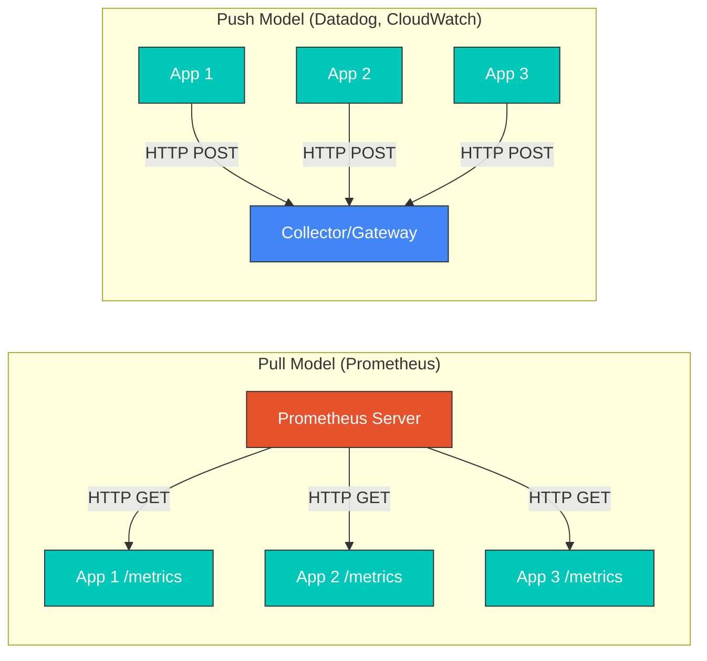
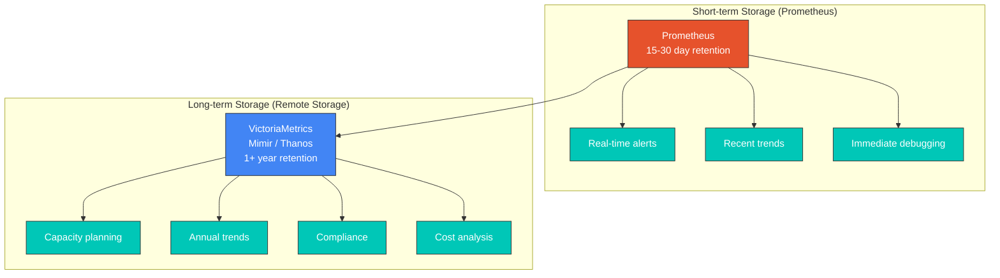
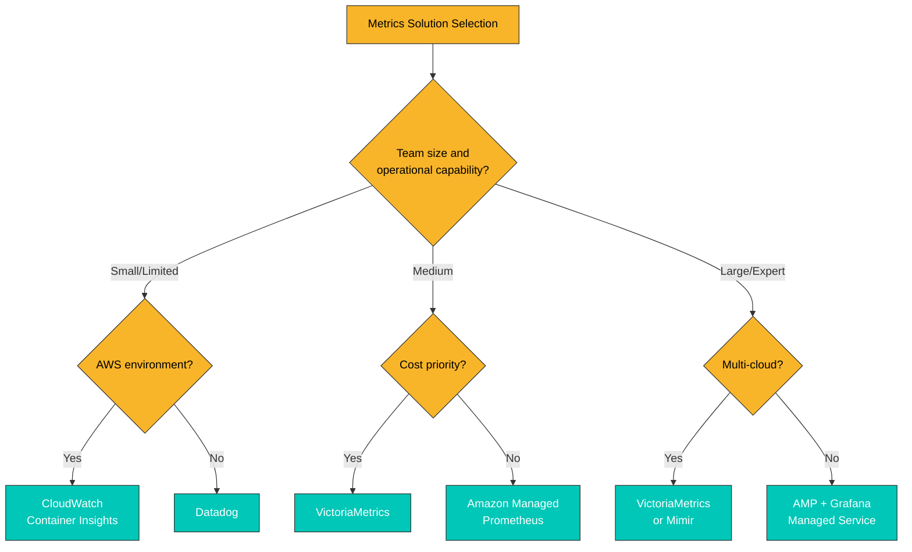
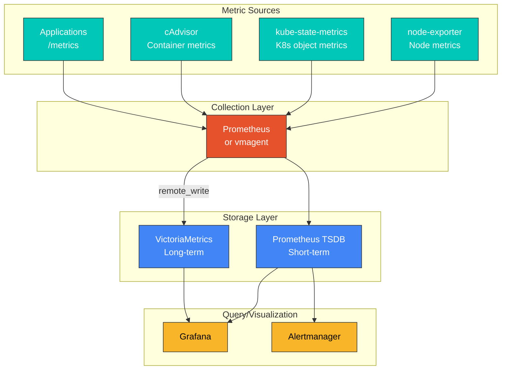

# Descripción general de las métricas

> **Última actualización**: February 20, 2026

## Tabla de contenido

- [Fundamentos de las métricas](#metrics-fundamentals)
- [Tipos de métricas](#metric-types)
- [Modelo Pull frente a Push](#pull-vs-push-model)
- [Cardinalidad y diseño de métricas](#cardinality-and-metric-design)
- [Requisitos de almacenamiento a largo plazo](#long-term-storage-requirements)
- [Comparación de soluciones](#solution-comparison)
- [Arquitectura de recopilación de métricas](#metrics-collection-architecture)

## Fundamentos de las métricas

Las métricas son datos cuantitativos que se utilizan para medir y monitorear el estado y el rendimiento de los sistemas. En entornos Kubernetes, las métricas son esenciales para comprender la salud del clúster, detectar problemas de forma temprana y realizar la planificación de capacidad y la optimización del rendimiento.

### Componentes de una métrica

Las métricas constan de los siguientes componentes:

```
http_requests_total{method="GET", endpoint="/api/users", status="200"} 1234 1677649200000
      |                              |                                   |        |
  metric name                      labels                              value  timestamp
```

1. **Nombre de la métrica**: identifica qué se está midiendo
2. **Etiquetas**: pares clave-valor que segmentan la métrica
3. **Valor**: los datos numéricos medidos
4. **Marca de tiempo**: cuándo se realizó la medición (tiempo Unix en milisegundos)

### Convenciones de nomenclatura de métricas

Los buenos nombres de métricas siguen estas reglas:

```yaml
# Good examples
http_requests_total              # Total request count (Counter)
http_request_duration_seconds    # Request duration (Histogram)
node_memory_usage_bytes          # Memory usage (Gauge)

# Bad examples
requests                         # Too vague
httpRequestDurationMs            # Unit not in name, uses camelCase
```

**Reglas de nomenclatura**:
- Use snake_case (minúsculas con guiones bajos)
- Incluya las unidades como sufijos (`_seconds`, `_bytes`, `_total`)
- Use prefijos de aplicación/dominio (`http_`, `node_`, `kube_`)

## Tipos de métricas

Los sistemas de métricas compatibles con Prometheus utilizan cuatro tipos básicos de métricas:

### 1. Counter

Un tipo de métrica que realiza seguimiento de valores acumulativos. Los valores solo pueden aumentar y se restablecen a 0 al reiniciarse.

```yaml
# Use cases: request count, error count, completed tasks
http_requests_total{method="GET", status="200"} 12345
http_requests_total{method="POST", status="500"} 23

# PromQL query examples
rate(http_requests_total[5m])                    # Requests per second
increase(http_requests_total[1h])                # Increase over 1 hour
```

**Características**:
- Aumenta de forma monotónica
- Se restablece al reiniciarse, pero la función `rate()` lo corrige automáticamente
- Se analiza mediante la tasa de cambio en lugar del total

### 2. Gauge

Un valor que representa el estado actual y que puede aumentar o disminuir.

```yaml
# Use cases: temperature, memory usage, current connections
node_memory_usage_bytes 8589934592
kube_pod_status_ready{pod="nginx-abc123"} 1
temperature_celsius{location="datacenter-1"} 23.5

# PromQL query examples
node_memory_usage_bytes / node_memory_total_bytes * 100  # Memory usage %
max_over_time(temperature_celsius[1h])                    # Max temp in 1 hour
```

**Características**:
- Instantánea del estado actual
- Puede aumentar o disminuir
- Es significativo como valor absoluto en un momento dado

### 3. Histogram

Observa la distribución de valores mediante buckets. Es ideal para analizar distribuciones de latencia, tamaños de respuesta, etc.

```yaml
# Histogram generates three metrics
http_request_duration_seconds_bucket{le="0.005"} 24054    # Requests <= 5ms
http_request_duration_seconds_bucket{le="0.01"} 33444     # Requests <= 10ms
http_request_duration_seconds_bucket{le="0.025"} 100392   # Requests <= 25ms
http_request_duration_seconds_bucket{le="0.05"} 129389    # Requests <= 50ms
http_request_duration_seconds_bucket{le="0.1"} 133988     # Requests <= 100ms
http_request_duration_seconds_bucket{le="+Inf"} 144320    # Total requests
http_request_duration_seconds_sum 53.42                    # Total duration
http_request_duration_seconds_count 144320                 # Total count

# PromQL query examples
histogram_quantile(0.95, rate(http_request_duration_seconds_bucket[5m]))  # p95 latency
rate(http_request_duration_seconds_sum[5m]) / rate(http_request_duration_seconds_count[5m])  # Average latency
```

**Características**:
- Se agrega en buckets en el lado del servidor
- Puede calcular cuantiles entre varias instancias
- Los límites de los buckets se determinan al definir la métrica

### 4. Summary

Calcula cuantiles en el lado del cliente. Es similar a Histogram, pero con un método de cálculo diferente.

```yaml
# Summary generates quantiles and sum/count
http_request_duration_seconds{quantile="0.5"} 0.052      # Median (p50)
http_request_duration_seconds{quantile="0.9"} 0.089      # p90
http_request_duration_seconds{quantile="0.99"} 0.245     # p99
http_request_duration_seconds_sum 29969.50               # Total duration
http_request_duration_seconds_count 562887               # Total count

# PromQL query examples
http_request_duration_seconds{quantile="0.99"}           # p99 latency (direct query)
```

**Características**:
- Los cuantiles se calculan en el lado del cliente
- No se pueden agregar entre varias instancias
- Proporciona cuantiles exactos (no aproximaciones)

### Comparación entre Histogram y Summary

| Característica | Histogram | Summary |
|---------|-----------|---------|
| Cálculo de cuantiles | Servidor (en tiempo de consulta) | Cliente (en tiempo de recopilación) |
| Agregación | Puede agregar entre instancias | No se puede agregar |
| Exactitud | Aproximación basada en los límites de los buckets | Cuantiles exactos |
| Cambios de configuración | Requiere redespliegue para cambiar los buckets | Requiere redespliegue para cambiar los cuantiles |
| Uso recomendado | Medición de SLO/SLI, sistemas distribuidos | Instancia única, cuando la exactitud es crítica |

## Modelo Pull frente a Push

Existen dos modelos principales para la recopilación de métricas:



### Modelo Pull

Prometheus es el sistema representativo basado en Pull.

**Ventajas**:
- Control centralizado de los objetivos e intervalos de recopilación
- Detección automática de la disponibilidad de los objetivos
- Configuración de firewall simplificada (solo permite tráfico entrante)
- Depuración sencilla (se pueden consultar los endpoints directamente)

**Desventajas**:
- Es difícil recopilar métricas de jobs de corta duración
- Acceso limitado a objetivos detrás de NAT/firewalls
- Requiere descubrimiento de servicios

```yaml
# Prometheus scrape configuration example
scrape_configs:
  - job_name: 'kubernetes-pods'
    kubernetes_sd_configs:
      - role: pod
    relabel_configs:
      - source_labels: [__meta_kubernetes_pod_annotation_prometheus_io_scrape]
        action: keep
        regex: true
      - source_labels: [__meta_kubernetes_pod_annotation_prometheus_io_path]
        action: replace
        target_label: __metrics_path__
        regex: (.+)
```

### Modelo Push

Datadog, CloudWatch, Graphite, etc. se basan en Push.

**Ventajas**:
- Puede recopilar métricas de jobs de corta duración
- Es ventajoso en entornos con firewall/NAT
- Transmisión de métricas controlada por eventos

**Desventajas**:
- Posible sobrecarga en el servidor de recopilación
- Detección automática de la disponibilidad de objetivos difícil
- Requiere lógica de transmisión en el cliente

```yaml
# Push example using Pushgateway
# Used for short-lived batch jobs
apiVersion: batch/v1
kind: Job
metadata:
  name: batch-job
spec:
  template:
    spec:
      containers:
      - name: worker
        image: my-batch-job:latest
        env:
        - name: PUSHGATEWAY_URL
          value: "http://pushgateway:9091"
        command:
        - /bin/sh
        - -c
        - |
          # Perform work
          do_work()

          # Push metrics
          cat <<EOF | curl --data-binary @- ${PUSHGATEWAY_URL}/metrics/job/batch_job/instance/${HOSTNAME}
          batch_job_duration_seconds ${DURATION}
          batch_job_records_processed ${RECORDS}
          EOF
      restartPolicy: Never
```

## Cardinalidad y diseño de métricas

### ¿Qué es la cardinalidad?

La cardinalidad se refiere al número de combinaciones únicas de series temporales de una métrica. Una cardinalidad alta afecta directamente al rendimiento del almacenamiento y de las consultas.

```yaml
# Low cardinality (good)
http_requests_total{method="GET", status="200"}     # method: ~5, status: ~10 = max 50 combinations

# High cardinality (caution needed)
http_requests_total{method="GET", user_id="12345"}  # user_id could be millions

# Very high cardinality (dangerous)
http_requests_total{request_id="abc-123-def"}       # Unique ID per request = infinite growth
```

### Cálculo de la cardinalidad

```
Total time series = label1 unique values x label2 unique values x ... x labelN unique values
```

**Ejemplo**:
- `method`: 5 (GET, POST, PUT, DELETE, PATCH)
- `endpoint`: 20
- `status`: 10 (200, 201, 400, 401, 403, 404, 500, 502, 503, 504)
- **Total de series temporales**: 5 x 20 x 10 = **1,000**

### Prácticas recomendadas de cardinalidad

```yaml
# Bad example: Infinite cardinality
http_request_duration_seconds{
  user_id="12345",           # Unique per user
  request_id="abc-123",      # Unique per request
  timestamp="1677649200"     # New value every second
}

# Good example: Bounded cardinality
http_request_duration_seconds{
  method="GET",              # 5 or fewer
  endpoint="/api/users",     # Dozens
  status_class="2xx"         # 5 (1xx, 2xx, 3xx, 4xx, 5xx)
}
```

**Recomendaciones**:
1. Evite valores de etiquetas que puedan crecer infinitamente
2. No use ID de usuario, ID de solicitud ni ID de sesión como etiquetas
3. Agrupe los códigos de estado (200 -> 2xx)
4. Normalice las rutas URL (`/users/123` -> `/users/{id}`)

### Monitoreo de cardinalidad

```yaml
# Query to detect high cardinality metrics
topk(10, count by (__name__)({__name__=~".+"}))

# Check cardinality of specific metric
count(http_requests_total)

# Check unique values per label
count(count by (endpoint)(http_requests_total))
```

## Requisitos de almacenamiento a largo plazo

### Limitaciones de Prometheus

Prometheus es una excelente herramienta de monitoreo en tiempo real, pero tiene limitaciones para el almacenamiento de datos a largo plazo:



**Problemas con el almacenamiento a largo plazo de Prometheus**:

1. **Eficiencia del almacenamiento**: la baja compresión aumenta el uso de disco
2. **Escalabilidad horizontal**: la arquitectura de nodo único limita el escalado
3. **Alta disponibilidad**: no dispone de soporte nativo para clústeres de HA
4. **Rendimiento de las consultas**: consultas más lentas en rangos de tiempo amplios

### Por qué se necesita almacenamiento a largo plazo

| Caso de uso | Retención requerida | Descripción |
|----------|-------------------|-------------|
| Alertas en tiempo real | 1-7 días | Detección inmediata de problemas |
| Solución de problemas | 7-30 días | Análisis de problemas recientes |
| Planificación de capacidad | 3-12 meses | Pronóstico de tendencias de crecimiento |
| Comparación interanual | 12+ meses | Análisis interanual |
| Cumplimiento normativo | 1-7 años | Requisitos legales y de auditoría |
| Optimización de costos | 6-12 meses | Análisis de patrones de uso de recursos |

### Arquitectura de Remote Write

```yaml
# Prometheus remote_write configuration
global:
  scrape_interval: 15s

remote_write:
  - url: "http://victoriametrics:8428/api/v1/write"
    queue_config:
      max_samples_per_send: 10000
      batch_send_deadline: 5s
      min_backoff: 30ms
      max_backoff: 5s
      max_shards: 10
      capacity: 2500
    write_relabel_configs:
      # Exclude high cardinality metrics
      - source_labels: [__name__]
        regex: "go_.*"
        action: drop
```

## Comparación de soluciones

### Comparación de las principales soluciones de métricas

| Característica | Prometheus | VictoriaMetrics | Mimir | CloudWatch | Datadog |
|---------|------------|-----------------|-------|------------|---------|
| **Modelo de implementación** | Autoalojado | Autoalojado | Autoalojado | Administrado | SaaS |
| **Escalabilidad** | Nodo único | Horizontal | Horizontal | Escalado automático | Escalado automático |
| **Alta disponibilidad** | Requiere Thanos/Cortex | Nativa | Nativa | Nativa | Nativa |
| **Compresión de datos** | Media | Muy alta (7x) | Alta | N/A | N/A |
| **Lenguaje de consulta** | PromQL | MetricsQL | PromQL | Sintaxis personalizada | Sintaxis personalizada |
| **Almacenamiento a largo plazo** | Limitado | Eficiente | Eficiente | 15 meses | 15 meses |
| **Multitenencia** | Limitada | Compatible | Compatible | Separación por cuenta | Separación por organización |
| **Costo** | Gratis (solo infraestructura) | Gratis (solo infraestructura) | Gratis (solo infraestructura) | Según el uso | Por host |
| **Complejidad de configuración** | Baja | Media | Alta | Baja | Baja |
| **Integración con AWS** | Configuración manual | Configuración manual | Configuración manual | Nativa | Nativa |

### Comparación de costos (estimación mensual)

**Supuestos**: 1,000 nodos, 1M de series temporales activas, retención de 30 días

| Solución | Costo de infraestructura | Costo del servicio | Costo total |
|----------|--------------------|--------------| -----------|
| Prometheus + VictoriaMetrics | ~$500 | $0 | ~$500 |
| Amazon Managed Prometheus | ~$200 | ~$1,500 | ~$1,700 |
| CloudWatch | $0 | ~$3,000+ | ~$3,000+ |
| Datadog | $0 | ~$15,000+ | ~$15,000+ |

*Los costos reales pueden variar significativamente según los patrones de uso.*

### Guía de selección



## Arquitectura de recopilación de métricas

### Estructura de recopilación de métricas en entornos Kubernetes



### Fuentes de métricas clave

| Componente | Función | Métricas clave |
|-----------|------|-------------|
| **node-exporter** | Métricas de nivel de Node | CPU, memoria, disco, red |
| **kube-state-metrics** | Estado de objetos de K8s | Estado de Pod, Deployment, Node |
| **cAdvisor** | Métricas de Container | CPU, memoria, I/O por Container |
| **metrics-server** | Métricas de recursos | CPU, memoria para HPA/VPA |

### Próximos pasos

Para obtener información detallada sobre cada solución de métricas, consulte los siguientes documentos:

1. [Prometheus](./01-prometheus.md) - El estándar de monitoreo de código abierto
2. [VictoriaMetrics](./02-victoriametrics.md) - Almacenamiento a largo plazo de alto rendimiento
3. [Grafana Mimir](./03-mimir.md) - Almacenamiento de métricas de nivel empresarial
4. [CloudWatch Metrics](./04-cloudwatch-metrics.md) - Monitoreo nativo de AWS
5. [Datadog](./05-datadog.md) - Plataforma unificada de observabilidad

## Cuestionario

Para comprobar su comprensión de este capítulo, intente el [Cuestionario de descripción general de métricas](../../quizzes/observability/metrics/00-metrics-overview-quiz.md).
