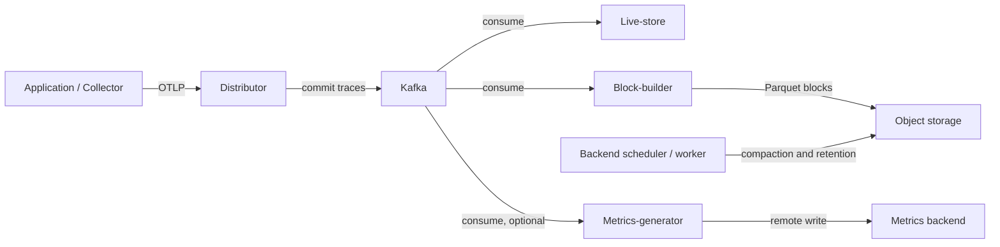
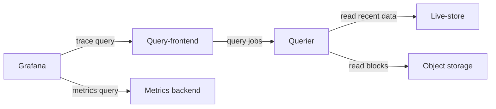

# Grafana Tempo

> **Línea base revisada**: Tempo 3.0.3; chart `tempo-distributed` 3.6.0 (appVersion 3.0.3)
> **Última actualización**: September 13, 2026

## Introducción

Grafana Tempo almacena y consulta trazas distribuidas mediante almacenamiento de objetos, bloques Parquet y TraceQL. Un TraceID localiza **datos retenidos e ingeridos correctamente**; no puede recuperar spans perdidos por muestreo, exportaciones fallidas o retención. Tempo evita una base de datos de búsqueda independiente de propósito general, pero las columnas dedicadas, los metadatos, las cachés, el cómputo y las solicitudes al almacenamiento de objetos siguen teniendo costos.

Este capítulo separa un ejemplo monolítico local de una línea base de configuración distribuida para EKS. Se comprobaron el binario local, el compilador de consultas, el renderizado de Helm y el análisis de configuración. Un despliegue en EKS, la autenticación de Kafka, la autorización de S3, la alta disponibilidad y el dimensionamiento de producción **no** se probaron.

## Características principales

| Característica | Alcance |
|---------|-------|
| Almacenamiento de objetos | S3, GCS y Azure Blob; almacenamiento local para un ejemplo de desarrollo acotado |
| TraceQL | Consultas de atributos, duración, estado y estructura; las funciones de métricas son distintas de las agregaciones por traza |
| Protocolos | OTLP, más receivers opcionales como Jaeger y Zipkin; habilite los puertos correspondientes del chart |
| Correlación | Grafana vincula trazas, logs, métricas y ejemplares cuando los identificadores y los UID de las fuentes de datos coinciden |
| Modos de despliegue | `target: all` monolítico, o microservicios con una cola de ingesta compatible con Kafka |
| Generación de métricas | Métricas de span y grafos de servicio opcionales; requiere processors y un destino de remote-write funcional |

## Arquitectura

**Los microservicios de Tempo 3 requieren Kafka. El modo monolítico no.** El distributor confirma la ingesta después de confirmar en Kafka; los live-stores, block-builders y metrics-generators consumen de forma independiente. Los live-stores sirven datos recientes; los block-builders escriben bloques de largo plazo. Los query-frontends dividen el trabajo y los queriers leen almacenes recientes o almacenamiento de objetos.



Ruta de lectura (los mismos componentes de almacenamiento y métricas):



Las flechas muestran solicitudes y flujo de datos, no cada respuesta ni conexión del plano de control. Grafana **consulta** el backend de métricas; un metrics-generator no almacena métricas en Grafana.

### Detalles de componentes

| Componente | Responsabilidad en Tempo 3 | Consideración operativa |
|-----------|-------------------------|---------------------------|
| Distributor | Validar y enrutar trazas a particiones de Kafka | Backpressure, bytes y spans aceptados/rechazados |
| Live-store | Consultas de trazas recientes y WAL local | Consumer lag, capacidad local y propiedad de particiones |
| Block-builder | Consumir Kafka y escribir bloques Parquet | Asignación de particiones y rendimiento del almacenamiento de objetos |
| Query-frontend / querier | Dividir, programar y ejecutar consultas | Encolamiento, bytes escaneados, concurrencia y cachés |
| Backend scheduler / worker | Compactación, retención y tareas en segundo plano | Coordinación del scheduler, recursos de worker y tareas fallidas |
| Metrics-generator | Derivar métricas de span y grafos de servicio | Cardinalidad, activación de processors y salud de remote-write |

La configuración de `ingester` y `compactor` de Tempo 2 no es una receta de instalación para Tempo 3. Una migración distribuida de **2→3 se realiza en paralelo**, con bloques existentes compatibles (`vParquet4` o posterior), una nueva ruta de ingesta y un cambio de tráfico controlado. No se admite una reversión de 3→2. No dirija instalaciones en competencia a los mismos datos escribibles sin el [procedimiento de migración oficial](https://grafana.com/docs/tempo/latest/set-up-for-tracing/setup-tempo/upgrade/).

La replicación de Kafka, las réplicas en sincronía, la retención y la capacidad de disco determinan la durabilidad de la ruta de escritura. Un número de réplicas de Tempo no establece la durabilidad de Kafka ni garantiza pérdida cero. En el chart 3.6.0, los volúmenes de datos de live-store y block-builder son `emptyDir`; tres réplicas no implican tres PVC persistentes.

## Instalación con Helm (modo distribuido)

### 1. Agregar repositorio de Helm

Use el chart comunitario mantenido y una versión explícita:

```bash
helm repo add grafana-community https://grafana-community.github.io/helm-charts
helm repo update grafana-community
helm show chart grafana-community/tempo-distributed --version 3.6.0
helm show values grafana-community/tempo-distributed --version 3.6.0 > tempo-defaults.yaml
```

El chart declara Kubernetes `^1.25.0-0`. Es una restricción del chart, **no** una matriz de pruebas para cada combinación de versión de Kubernetes/EKS o add-on.

### 2. Configuración de values.yaml

Guarde lo siguiente como `tempo-distributed-values.yaml`. Es un **punto de partida solo para renderizado**, con nombres de cuenta/bucket de marcador de posición y una dirección de Kafka para pruebas aisladas.

```yaml
# Render-only baseline. Read the Kafka security/deployment gates first.
fullnameOverride: tempo
reportingEnabled: false
serviceAccount:
  create: true
  name: tempo
  annotations:
    eks.amazonaws.com/role-arn: arn:aws:iam::123456789012:role/tempo-s3
traces:
  otlp:
    grpc:
      enabled: true
    http:
      enabled: true
ingest:
  kafka:
    address: kafka-bootstrap.kafka.svc.cluster.local:9092
    topic: tempo-traces
    auto_create_topic_enabled: false
storage:
  trace:
    backend: s3
    s3:
      bucket: replace-with-owned-tempo-bucket
      region: ap-northeast-2
      endpoint: s3.ap-northeast-2.amazonaws.com
      insecure: false
backendScheduler:
  config:
    provider:
      compaction:
        compaction:
          block_retention: 336h
metricsGenerator:
  enabled: false
gateway:
  enabled: false
ingress:
  enabled: false
metaMonitoring:
  serviceMonitor:
    enabled: false
tempo:
  structuredConfig:
    distributor:
      receivers:
        otlp:
          protocols:
            grpc:
              max_recv_msg_size_mib: 16
    overrides:
      defaults:
        ingestion:
          rate_limit_bytes: 15000000
          burst_size_bytes: 20000000
```

Antes de un despliegue, resuelva estos requisitos:

- Aprovisione y posea el topic de Kafka por separado. Las tres réplicas predeterminadas de live-store/block-builder y `partitions_per_instance: 1` necesitan un diseño de particiones correspondiente; escalar solo los Pods no redistribuye cada asignación de block-builder.
- Verifique de extremo a extremo el transporte y la autenticación de Kafka. El cliente Kafka de Tempo **3.0.3 expone SASL/PLAIN, pero no configuración de TLS de Kafka, SCRAM ni MSK IAM**. PLAIN no es cifrado. Este ejemplo no es una receta segura y lista para usar con MSK. Una solución de red/proxy debe cubrir todos los endpoints de broker anunciados, no solo bootstrap, y debe probarse de forma independiente antes del uso en producción.
- Proporcione el bucket de S3 y el role de la siguiente sección. Establezca el nombre exacto de ServiceAccount y la anotación del role; crear un ServiceAccount no relacionado es insuficiente.
- Restrinja el acceso OTLP, de consultas, memberlist y RPC de componentes mediante los controles de red reales del clúster y transporte autenticado. Un balanceador de carga interno o el encabezado `X-Scope-OrgID` por sí solos no son autenticación.
- Establezca recursos, programación, presupuestos de interrupción y política de almacenamiento/recuperación para la carga de trabajo. Un PodDisruptionBudget restringe las expulsiones voluntarias; la anti-affinity controla la ubicación. Ninguno demuestra disponibilidad.

El límite de tamaño de recepción está en **MiB**; los campos de tasa/ráfaga de ingesta están en **bytes**. Los valores de 16 MiB y 15/20 MB son límites ilustrativos, no capacidad medida.

La generación de métricas opcional necesita tanto activación como un receiver autenticado existente. Combine este segundo archivo solo después de crear el Secret `tempo-metrics-client` con los tres archivos de certificado nombrados y reemplazar la URL:

```yaml
metricsGenerator:
  enabled: true
  config:
    storage:
      remote_write:
        - url: https://metrics-write.example.org/api/v1/write
          send_exemplars: true
          tls_config:
            ca_file: /etc/metrics-tls/ca.crt
            cert_file: /etc/metrics-tls/tls.crt
            key_file: /etc/metrics-tls/tls.key
  extraVolumes:
    - name: metrics-tls
      secret:
        secretName: tempo-metrics-client
  extraVolumeMounts:
    - name: metrics-tls
      mountPath: /etc/metrics-tls
      readOnly: true
overrides:
  defaults:
    metrics_generator:
      processors: [span-metrics, service-graphs]
      generate_native_histograms: both
```

El receiver debe aceptar Prometheus remote write; los ejemplares y los histogramas nativos también necesitan compatibilidad en el destino. El WAL predeterminado del generator de este chart es efímero. Valide por separado el comportamiento de reproducción/cola/almacenamiento; no interprete `send_exemplars: true` como una garantía de entrega.

### 3. Configuración de IRSA

El ejemplo usa la identidad exacta `system:serviceaccount:monitoring:tempo`. La confianza de su role está limitada tanto por los claims OIDC `sub` como `aud`. El role permite acceso únicamente al bucket de Tempo poseído. Evite claves de acceso estáticas en variables de entorno o valores de Helm.

IRSA es la ruta concreta mostrada aquí, no la única identidad posible para cargas de trabajo de EKS. Debe comprobarse una alternativa de Pod Identity con el proveedor de credenciales usado por la imagen de Tempo fijada. Verifique también la conectividad de STS, las políticas de bucket, los endpoints de VPC y cualquier política de clave KMS; un renderizado YAML correcto no demuestra nada de ello.

### 4. Ejecutar la instalación

Primero renderice e inspeccione sin contactar un clúster:

```bash
helm template tempo grafana-community/tempo-distributed \
  --version 3.6.0 --namespace monitoring --kube-version 1.36.2 \
  -f tempo-distributed-values.yaml > tempo-rendered.yaml
```

`--kube-version` selecciona las capacidades de renderizado; no certifica compatibilidad con EKS 1.36.2. Inspeccione los puertos de Service, las identidades de Pod, los ConfigMaps, la configuración de recursos y la configuración opcional del generator. Extraiga el `tempo.yaml` renderizado y valídelo con el binario **correspondiente**:

```bash
tempo -config.file=tempo.yaml -config.verify=true
```

Esto finaliza antes de la inicialización del servicio. No se conecta a Kafka/S3 ni prueba por completo una configuración arbitraria de receiver. **No ejecute una instalación de Helm hasta que se hayan resuelto los requisitos de despliegue anteriores.** Después, use los values revisados y un release/namespace propio según su proceso de despliegue, incluido un plan de reversión/migración.

Para una comprobación local de un solo proceso, guarde este archivo separado como `tempo-local.yaml` y use el binario oficial verificado de Tempo 3.0.3 para su SO/arquitectura:

```yaml
target: all
stream_over_http_enabled: true
server:
  http_listen_address: 127.0.0.1
  http_listen_port: 3200
  grpc_listen_address: 127.0.0.1
  grpc_listen_port: 9095
distributor:
  receivers:
    otlp:
      protocols:
        grpc:
          endpoint: 127.0.0.1:4317
        http:
          endpoint: 127.0.0.1:4318
storage:
  trace:
    backend: local
    wal:
      path: ./tempo-data/wal
    local:
      path: ./tempo-data/blocks
live_store:
  wal:
    path: ./tempo-data/live-store/traces
  shutdown_marker_dir: ./tempo-data/live-store/shutdown-marker
  ring:
    instance_addr: 127.0.0.1
    instance_interface_names: [lo]
metrics_generator:
  storage:
    path: ./tempo-data/generator/wal
backend_scheduler:
  local_work_path: ./tempo-data/scheduler
memberlist:
  bind_addr: [127.0.0.1]
  advertise_addr: 127.0.0.1
usage_report:
  reporting_enabled: false
```

```bash
tempo -config.file=tempo-local.yaml -config.verify=true
tempo -config.file=tempo-local.yaml
# In a second terminal:
curl --fail http://127.0.0.1:3200/ready
```

Se vincula a loopback, deshabilita los informes de uso y escribe bajo `./tempo-data`. Detenga este proceso con Ctrl-C. Esta es una instancia local sin Kafka, S3, gateway de autenticación ni afirmación de HA.

## Consultas TraceQL

### Sintaxis básica

Use el modo TraceID de Grafana Explore para una búsqueda directa, o un ID completo de 32 caracteres hexadecimales en una intrínseca TraceQL:

```traceql
{ trace:id = "4bf92f3577b34da6a3ce929d0e0e4736" }
{ resource.service.name = "payment-service" }
{ span.http.response.status_code >= 400 }
{ duration > 1s }
{ status = error }
```

Estas son consultas separadas. El estado `error` de un span no es idéntico a cada estado HTTP ≥400. Los nombres de atributos reflejan la versión de convención semántica del SDK emisor: los datos antiguos de `http.status_code` y `db.system` siguen siendo consultables bajo sus nombres originales; Tempo no cambia automáticamente el nombre de los atributos almacenados.

### Ejemplos de consultas avanzadas

```traceql
{ span.db.system.name = "postgresql" && duration > 100ms }
{ span.http.route = "/api/payment" && status = error }
{ resource.service.name = "api-gateway" } >> { resource.service.name = "payment-service" }
{ resource.service.name = "order-service" } > { span.db.system.name = "postgresql" }
{ resource.service.name = "order-service" } ~ { resource.service.name = "inventory-service" }
{ trace:rootService = "api-gateway" } | count() > 50
{ duration > 2s } | by(resource.service.name) | avg(duration) > 2s
{ status = error } | rate() by (resource.service.name)
{ } | avg_over_time(duration) by (resource.service.name)
```

- `A >> B` devuelve los **descendientes B** coincidentes de A; `A > B` devuelve los hijos directos B coincidentes. Para obtener padres, use la relación inversa correspondiente en lugar de describir a los hijos como padres.
- `A ~ B` coincide con elementos hermanos. No establece una llamada de red A→B.
- `count()` cuenta spans en el **spanset actual**. Filtrar primero hasta los errores contaría spans de error, no todos los spans de la traza. `traceSpanCount` no es una intrínseca válida.
- `nestedSetParent` es aceptado por esta versión, pero es un marcador interno de padre de conjunto anidado, no un contador de profundidad de anidamiento.
- `by(...) | avg(...) > ...` filtra spansets por traza; `rate()` y `avg_over_time(...)` producen series temporales. El primero es una tasa de spans de error, **no una proporción de errores**. Seleccione el intervalo de tiempo en Grafana o en la API de consultas; un filtro de duración no es un rango de tiempo de reloj.

Una consulta como `{ span.user.id = "synthetic-user-123" }` requiere ese atributo emitido explícitamente. Use identificadores sintéticos o seudónimos aprobados; no convierta los datos personales en un requisito de trazado. Prefiera `http.route` de baja cardinalidad a URL literales que contienen ID de usuario o cadenas de consulta.

### Uso de TraceQL en Grafana

Cree la fuente de datos de Tempo con la URL de query-frontend en el puerto **3200** y después seleccione Explore → Tempo → Search/TraceQL. El UID de `tempo` debe coincidir con los enlaces de logs y los destinos de ejemplares. Acorte el rango de tiempo antes de aumentar la concurrencia o los límites de consultas.

## Configuración del backend S3

### Configuración del bucket S3

Use un bucket dedicado con Block Public Access, propiedad aplicada por el propietario del bucket y cifrado. Mantenga su propiedad en un solo estado de infraestructura; no cree el mismo bucket con un fragmento de CLI y Terraform.

El `block_retention: 336h` de Tempo es un objetivo de retención aplicado de forma asíncrona por su procesamiento en segundo plano, no una fecha límite exacta de eliminación. Una política general de S3 de «eliminar cada objeto después de 30 días» puede entrar en conflicto con la compactación y los metadatos. No agregue una sin un diseño de ciclo de vida documentado y consciente del backend. Si el versionado está habilitado, eliminar un objeto actual puede dejar versiones no actuales y cargos; defina por separado sus requisitos de retención y recuperación.

### Configuración de S3 e IRSA con Terraform

Este ejemplo del proveedor de AWS **6.64.0** usa SSE-S3 y un proveedor OIDC de clúster **existente**. Reemplace las entradas de cuenta, nombre de bucket globalmente único y emisor. Intencionalmente no crea un clúster EKS, Kafka ni una clave KMS.

```hcl
terraform {
  required_version = ">= 1.6.0"
  required_providers {
    aws = {
      source  = "hashicorp/aws"
      version = "6.64.0"
    }
  }
}

variable "region" {
  type    = string
  default = "ap-northeast-2"
}
variable "account_id" {
  type = string
  validation {
    condition     = can(regex("^[0-9]{12}$", var.account_id))
    error_message = "Supply the bucket and role owner account ID."
  }
}
variable "bucket_name" { type = string }
variable "oidc_provider_arn" { type = string }
variable "oidc_issuer_hostpath" {
  type        = string
  description = "Existing cluster OIDC issuer without https://."
}
provider "aws" { region = var.region }

resource "aws_s3_bucket" "tempo" {
  bucket        = var.bucket_name
  force_destroy = false
  lifecycle { prevent_destroy = true }
}
resource "aws_s3_bucket_public_access_block" "tempo" {
  bucket                  = aws_s3_bucket.tempo.id
  block_public_acls       = true
  block_public_policy     = true
  ignore_public_acls      = true
  restrict_public_buckets = true
}
resource "aws_s3_bucket_ownership_controls" "tempo" {
  bucket = aws_s3_bucket.tempo.id
  rule { object_ownership = "BucketOwnerEnforced" }
}
resource "aws_s3_bucket_server_side_encryption_configuration" "tempo" {
  bucket = aws_s3_bucket.tempo.id
  rule {
    apply_server_side_encryption_by_default { sse_algorithm = "AES256" }
  }
}
resource "aws_s3_bucket_policy" "tempo" {
  bucket = aws_s3_bucket.tempo.id
  policy = jsonencode({
    Version = "2012-10-17"
    Statement = [{
      Sid       = "DenyInsecureTransport"
      Effect    = "Deny"
      Principal = "*"
      Action    = "s3:*"
      Resource  = [aws_s3_bucket.tempo.arn, "${aws_s3_bucket.tempo.arn}/*"]
      Condition = { Bool = { "aws:SecureTransport" = "false" } }
    }]
  })
}
resource "aws_iam_role" "tempo" {
  name = "tempo-s3"
  assume_role_policy = jsonencode({
    Version = "2012-10-17"
    Statement = [{
      Effect    = "Allow"
      Principal = { Federated = var.oidc_provider_arn }
      Action    = "sts:AssumeRoleWithWebIdentity"
      Condition = {
        StringEquals = {
          "${var.oidc_issuer_hostpath}:aud" = "sts.amazonaws.com"
          "${var.oidc_issuer_hostpath}:sub" = "system:serviceaccount:monitoring:tempo"
        }
      }
    }]
  })
}
resource "aws_iam_role_policy" "tempo" {
  role = aws_iam_role.tempo.id
  policy = jsonencode({
    Version = "2012-10-17"
    Statement = [
      {
        Effect    = "Allow"
        Action    = ["s3:ListBucket", "s3:GetBucketLocation"]
        Resource  = aws_s3_bucket.tempo.arn
        Condition = { StringEquals = { "aws:ResourceAccount" = var.account_id } }
      },
      {
        Effect    = "Allow"
        Action    = ["s3:GetObject", "s3:PutObject", "s3:DeleteObject", "s3:AbortMultipartUpload"]
        Resource  = "${aws_s3_bucket.tempo.arn}/*"
        Condition = { StringEquals = { "aws:ResourceAccount" = var.account_id } }
      }
    ]
  })
}
output "tempo_role_arn" { value = aws_iam_role.tempo.arn }
output "tempo_bucket" { value = aws_s3_bucket.tempo.id }
```

Use `tempo_role_arn` y `tempo_bucket` en los values de Helm. El formato/la validación de esquema de Terraform son útiles antes de un plan; revise el plan real y la propiedad antes de aplicar. Para SSE-KMS, proporcione explícitamente una clave propia, configuraciones de bucket/Tempo compatibles, permisos con alcance para `kms:GenerateDataKey`/`kms:Decrypt` y una política de clave que permita la carga de trabajo. Una referencia `aws_kms_key` no definida no es una configuración completa.

## Correlación de trazas a logs (integración de Loki)

### Configuración de la fuente de datos de Grafana

Este es un **archivo de aprovisionamiento de Grafana**, no un `values.yaml` específico de un chart. Móntelo mediante el mecanismo admitido por su chart de Grafana. Las tres URL internas son marcadores de posición para servicios existentes con acceso controlado:

```yaml
apiVersion: 1
datasources:
  - name: Tempo
    uid: tempo
    type: tempo
    access: proxy
    url: http://tempo-query-frontend.monitoring.svc.cluster.local:3200
    jsonData:
      tracesToLogsV2:
        datasourceUid: loki
        spanStartTimeShift: '-1m'
        spanEndTimeShift: '1m'
        tags: [{key: service.name, value: service_name}]
        filterByTraceID: true
        filterBySpanID: false
        customQuery: false
      tracesToMetrics:
        datasourceUid: prometheus
        tags: [{key: service.name, value: service}]
        queries:
          - name: Span request rate
            query: 'sum(rate(traces_spanmetrics_calls_total{$$__tags}[5m]))'
          - name: Span error ratio
            query: '(sum(rate(traces_spanmetrics_calls_total{$$__tags,status_code="STATUS_CODE_ERROR"}[5m])) or (0 * sum(rate(traces_spanmetrics_calls_total{$$__tags}[5m])))) / (sum(rate(traces_spanmetrics_calls_total{$$__tags}[5m])) > 0)'
      serviceMap:
        datasourceUid: prometheus
      nodeGraph:
        enabled: true
  - name: Loki
    uid: loki
    type: loki
    access: proxy
    url: http://loki-gateway.logging.svc.cluster.local
    jsonData:
      derivedFields:
        - name: TraceID
          matcherRegex: '"traceId"\s*:\s*"([0-9a-f]{32})"'
          datasourceUid: tempo
          url: '$${__value.raw}'
  - name: Prometheus
    uid: prometheus
    type: prometheus
    access: proxy
    url: http://prometheus-operated.monitoring.svc.cluster.local:9090
    jsonData:
      httpMethod: POST
      exemplarTraceIdDestinations:
        - name: traceID
          datasourceUid: tempo
```

El `tracesToLogsV2` de Tempo implementa **Trace→Logs**; los `derivedFields` de Loki implementan **Logs→Trace**. El ejemplo asigna el atributo OTel `service.name` a la etiqueta existente `service_name` de Loki. Verifique la asignación de su collector; el enlace no puede crear una etiqueta ni un registro de log. El filtrado de span está deshabilitado porque no todos los logs tienen un ID de span.

En el YAML de aprovisionamiento, `$$` preserva un `$` literal para las macros de tiempo de ejecución de Grafana. `__tags` se expande a un conjunto de selectores de etiquetas; no lo incruste como el valor de `service="..."`. La proporción de errores completa una serie de errores ausente a partir de la serie total y divide solo cuando la tasa total es positiva. El tráfico cero y la telemetría ausente permanecen vacíos.

La etiqueta de métricas de span `service` y el valor de estado `STATUS_CODE_ERROR` deben coincidir con las series generadas reales. Los ejemplares usan el nombre de etiqueta de ejemplar observado (`traceID` para la configuración de generator ilustrada); otros productores pueden usar `trace_id`. El muestreo puede hacer que estas métricas difieran de los conteos completos de solicitudes de la aplicación.

### Registro de aplicaciones

Para Python con OpenTelemetry API 1.44, compruebe la validez del contexto en vez de `span.is_recording()`. Un span válido no registrable puede seguir correlacionando logs:

```python
import datetime
import json
import logging
from opentelemetry import trace


class TraceJsonFormatter(logging.Formatter):
    def format(self, record):
        payload = {
            "timestamp": datetime.datetime.fromtimestamp(
                record.created, datetime.timezone.utc
            ).isoformat(),
            "level": record.levelname,
            "message": record.getMessage(),
        }
        context = trace.get_current_span().get_span_context()
        if context.is_valid:
            payload["traceId"] = f"{context.trace_id:032x}"
            payload["spanId"] = f"{context.span_id:016x}"
        if record.exc_info:
            payload["exception"] = self.formatException(record.exc_info)
        return json.dumps(payload, ensure_ascii=False)


logger = logging.getLogger("payment")
logger.setLevel(logging.INFO)
logger.propagate = False
# Configure once at application startup.
if not logger.handlers:
    handler = logging.StreamHandler()
    handler.setFormatter(TraceJsonFormatter())
    logger.addHandler(handler)
```

Esto preserva las marcas de tiempo UTC, el formato de mensajes y las excepciones, y omite ID no válidos en lugar de fabricar trazas con todos ceros. Configure el handler una vez; propague el contexto OTel a través de límites asíncronos y elimine mensajes/excepciones sensibles en su origen.

Para Java, use el [helper MDC con alcance en la descripción general de tracing](README.md#linking-logs-via-traceid): valide el `SpanContext` actual, establezca los ID para el ámbito de logging y restaure los valores MDC previos en `finally`. El simple hecho de escribir `MDC.put` puede filtrar los ID de una solicitud anterior en hilos reutilizados. Se comprobó el contrato de la API de Java; no se ejecutó ninguna aplicación Java para este capítulo.

## Ajuste de rendimiento

### Optimización de la tasa de ingesta

Mida bytes y spans aceptados/rechazados, reintentos del exporter, errores del producer de Kafka y consumer lag. Aumentar el tamaño del receiver, los límites de ingesta o los conteos de réplicas sin capacidad de memoria y cola puede desplazar el cuello de botella en lugar de eliminarlo. Preserve los supuestos de muestreo ascendentes al interpretar las métricas generadas.

Use `overrides.defaults.ingestion` para límites de tenant y el campo `max_recv_msg_size_mib` del receiver para el tamaño de mensajes gRPC. El bloque antiguo `distributor.rate_limit` y el bloque de ajuste de `ingester` de Tempo 2 no configuran Tempo 3.

### Optimización de compactación

Configure la retención mediante los ajustes `backendScheduler.config.provider.compaction.compaction` del chart y la configuración correspondiente de backend-worker. Observe la antigüedad y los fallos de las tareas, las solicitudes al almacenamiento de objetos y el espacio de trabajo temporal. Una mayor concurrencia de compactación puede aumentar el tráfico al almacenamiento de objetos y la memoria; no existe una regla universal de «un compactor por clúster» para la arquitectura anterior.

### Optimización del rendimiento de consultas

Reduzca primero el rango de tiempo y la selectividad; después inspeccione los bytes escaneados, el encolamiento, la concurrencia de querier y los roles de caché pertinentes. Configure los campos de caché desde el chart/configuración fijado en lugar de copiar diseños `cache:` eliminados. El hedging del almacenamiento de objetos puede mejorar la latencia de cola a costa de solicitudes adicionales; valide esa compensación con mediciones.

El `fail_on_high_lag` de live-store de Tempo 3 tiene como valor predeterminado true y el `query_end_cutoff` de query-frontend tiene como valor predeterminado 30s. La visibilidad de búsquedas muy recientes puede retrasarse respecto a una búsqueda directa de TraceID. No deshabilite estas protecciones solo para que un dashboard vacío parezca saludable.

### Recomendaciones de recursos

Dimensione los distributors según la entrada, los live-stores según el volumen/lag de trazas recientes, los block-builders según las particiones asignadas y el tamaño de bloque, los queriers según la concurrencia de consultas y los generators según las series activas. La tabla antigua y no medida de CPU y disco para Ingester/Compactor de Tempo 2 no es una recomendación de capacidad para Tempo 3. Mida CPU, RSS, uso local/WAL, lag de Kafka, costo de solicitudes y saturación bajo tráfico representativo.

## Solución de problemas

### Problemas y soluciones comunes

#### 1. Los datos de trazas no se muestran

Compruebe errores de exportación del SDK, muestreo, contexto propagado, colas de collector, transporte OTLP, enrutamiento de tenant y retención. Una solicitud GET a `/v1/traces` no es una prueba de ingesta; envíe un POST OTLP válido y luego consulte su TraceID sintético conocido. Un sondeo `/ready` exitoso por sí solo no demuestra que cada etapa funcione.

#### 2. Errores de permisos de S3

Inspeccione el ServiceAccount exacto, la confianza del role, la política de bucket, el acceso al endpoint y la política KMS si corresponde. No vuelque variables de entorno ni tokens proyectados de Pod. No suponga que la imagen de Tempo contiene una AWS CLI o shell.

```bash
kubectl get serviceaccount tempo -n monitoring -o yaml
kubectl get pods -n monitoring -l app.kubernetes.io/instance=tempo \
  -o custom-columns=NAME:.metadata.name,SA:.spec.serviceAccountName
kubectl logs -n monitoring -l app.kubernetes.io/component=block-builder --tail=100
```

Restrinja el acceso a la salida de diagnóstico: los logs pueden contener metadatos operativos o atributos de aplicación.

#### 3. Tiempos de espera de consultas

Compruebe los logs de query-frontend/querier, el rango de tiempo, el lag de Kafka, las particiones de live-store disponibles y la limitación de S3. Aumente la concurrencia solo después de medir la memoria y los límites del backend. Trate un resultado vacío, un tiempo de espera y telemetría ausente como estados diferentes.

#### 4. Presión de memoria de live-store

Para Tempo 3, inspeccione la memoria de live-store, las ventanas de datos recientes, la rotación de bloques y la propiedad de particiones. Para un despliegue de Tempo 2 que aún se está ejecutando, use su documentación versionada de ingester durante la migración; copiar `ingester.max_block_duration: 30m` a Tempo 3 no ajustará live-store.

### Comandos de depuración útiles

Use un port-forward autorizado para inspeccionar el query-frontend real:

```bash
kubectl port-forward -n monitoring service/tempo-query-frontend 3200:3200
# In a second terminal:
curl --fail http://127.0.0.1:3200/ready
curl --fail http://127.0.0.1:3200/metrics
curl --fail http://127.0.0.1:3200/api/traces/4bf92f3577b34da6a3ce929d0e0e4736
```

El ID final debe existir realmente en ese despliegue. Los endpoints de ring/status de solo lectura son específicos de cada componente; verifique la API fijada antes de usarlos. Los comandos de `/ingester/ring`, `/compactor/ring` y forced-flush eliminados no son diagnósticos generales de Tempo 3.

### Dashboard de monitorización

Use las series reales emitidas por su despliegue y agregue sus etiquetas de destino:

```promql
sum(rate(tempo_distributor_spans_received_total[5m]))
sum(process_resident_memory_bytes{job=~"tempo.*"})
histogram_quantile(0.99, sum by (le) (rate(tempo_request_duration_seconds_bucket{route="api_search"}[5m])))
```

Estos paneles indican **spans recibidos/s**, **bytes RSS del proceso** y **p99 de segundos de solicitudes HTTP de búsqueda**. El selector de memoria presupone el nombre de su job de scrape; inspeccione primero las etiquetas. Un contador de escritura de bytes no es memoria y un conteo de spans no es un conteo de trazas. El histograma/ruta de solicitudes se observó en la prueba de humo local de Tempo 3.0.3; no es una medición de latencia distribuida de extremo a extremo.

## Referencias

- [Lanzamiento de Tempo 3.0.3](https://github.com/grafana/tempo/releases/tag/v3.0.3), [valores del chart 3.6.0](https://github.com/grafana-community/helm-charts/blob/tempo-distributed-3.6.0/charts/tempo-distributed/values.yaml)
- [Arquitectura de Tempo](https://grafana.com/docs/tempo/latest/introduction/architecture/), [implementación del cliente Kafka](https://github.com/grafana/tempo/blob/v3.0.3/pkg/ingest/writer_client.go)
- [Sintaxis de TraceQL](https://grafana.com/docs/tempo/latest/traceql/construct-traceql-queries/), [aprovisionamiento de Grafana](https://grafana.com/docs/grafana/latest/datasources/tempo/configure-tempo-data-source/provision/)
- [Asociación de IRSA en EKS](https://docs.aws.amazon.com/eks/latest/userguide/associate-service-account-role.html), [S3 Block Public Access](https://docs.aws.amazon.com/AmazonS3/latest/userguide/access-control-block-public-access.html)

## Cuestionario

Pruebe este capítulo con el [cuestionario de Tempo](../../quizzes/observability/tracing/01-tempo-quiz.md).
