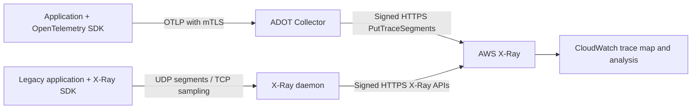
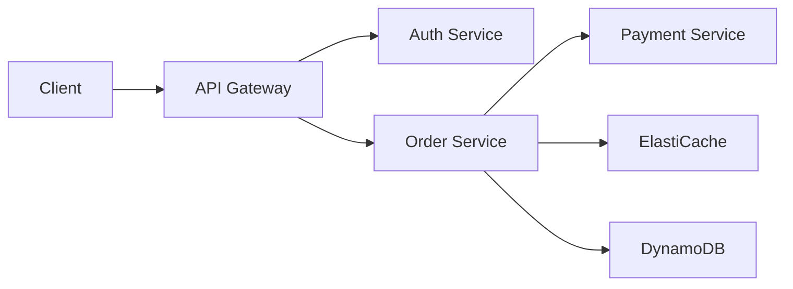

# AWS X-Ray

> **Última actualización**: September 13, 2026

## Introducción

AWS X-Ray es un servicio nativo de AWS para rastrear y analizar solicitudes en aplicaciones distribuidas. Usar X-Ray en entornos EKS permite visualizar el flujo de solicitudes entre microservicios, identificar cuellos de botella de rendimiento y determinar las causas raíz de los errores.

Los **SDK y el daemon de X-Ray están en modo de mantenimiento desde el 25 de febrero de 2026**, únicamente con correcciones de seguridad y sin fecha de finalización anunciada en el [cronograma de soporte](https://docs.aws.amazon.com/xray/latest/devguide/xray-sdk-daemon-timeline.html) actual. Esto corresponde al ciclo de vida de la instrumentación, no a la retirada del servicio X-Ray. AWS recomienda OpenTelemetry para nueva instrumentación y para las migraciones. El ejemplo del daemon que aparece más abajo es una vía de compatibilidad heredada (legacy).

## Características principales

| Característica | Descripción |
|---------|-------------|
| **Service Map** | Visualización automática de las dependencias entre servicios |
| **Request Tracing** | Seguimiento de la ruta de la solicitud de extremo a extremo |
| **Analysis Tools** | Distribución de tiempos de respuesta, análisis de tasa de errores |
| **AWS Integration** | Soporte nativo para Lambda, API Gateway, ECS, EKS |
| **Sampling Rules** | Configuración centralizada del muestreo |
| **Groups and Alerts** | Agrupación basada en filtros y alertas de CloudWatch |

## Arquitectura

Lo siguiente muestra las dos alternativas de recolección descritas aquí. El daemon envía solicitudes HTTPS firmadas a AWS; UDP/TCP2000 son sus protocolos heredados orientados a la aplicación. El exportador awsxray de ADOT configurado usa PutTraceSegments, no el endpoint OTLP nativo de CloudWatch.



EKS no instrumenta automáticamente todas las aplicaciones. Lambda/API Gateway y otras integraciones de servicios necesitan su propia configuración de tracing y propagación admitida. El OTLP nativo de CloudWatch es una ruta de ingesta independiente con requisitos previos de Transaction Search y SigV4, descritos más abajo.

## Despliegue del daemon de X-Ray

### Desplegar como DaemonSet

```yaml
# xray-daemon.yaml
apiVersion: v1
kind: ServiceAccount
metadata:
  name: xray-daemon
  namespace: amazon-cloudwatch
  annotations:
    eks.amazonaws.com/role-arn: arn:aws:iam::123456789012:role/xray-daemon-role
---
apiVersion: apps/v1
kind: DaemonSet
metadata:
  name: xray-daemon
  namespace: amazon-cloudwatch
spec:
  selector:
    matchLabels:
      app: xray-daemon
  updateStrategy:
    type: RollingUpdate
  template:
    metadata:
      labels:
        app: xray-daemon
    spec:
      serviceAccountName: xray-daemon
      nodeSelector:
        kubernetes.io/os: linux
      containers:
        - name: xray-daemon
          image: amazon/aws-xray-daemon:3.7.0@sha256:a2303d37f9dd7077c93e596689cb1de12f2ef8333c15b088ba223840164f6bc2
          args: ["-o", "-n", "ap-northeast-2"]
          ports:
            - name: xray-udp
              containerPort: 2000
              protocol: UDP
            - name: xray-tcp
              containerPort: 2000
              protocol: TCP
          resources:
            requests:
              cpu: 50m
              memory: 64Mi
            limits:
              cpu: 100m
              memory: 128Mi
          env:
            - name: AWS_REGION
              value: ap-northeast-2
      tolerations:
        - key: node-role.kubernetes.io/master
          effect: NoSchedule
---
apiVersion: v1
kind: Service
metadata:
  name: xray-daemon
  namespace: amazon-cloudwatch
spec:
  selector:
    app: xray-daemon
  ports:
    - name: xray-udp
      port: 2000
      protocol: UDP
    - name: xray-tcp
      port: 2000
      protocol: TCP
  type: ClusterIP
```

Esta imagen de la vía de mantenimiento está fijada al manifiesto multiarquitectura oficial 3.7.0 verificado (Linux amd64/arm64). Su entrypoint es `/xray`, no `/usr/bin/xray`; `-o` desactiva el enriquecimiento con metadatos de EC2 y `-n` proporciona la Región. Los DaemonSet no se ejecutan en EKS Fargate. Este Service de tipo ClusterIP puede seleccionar un daemon en otro nodo, por lo que no garantiza la entrega local al nodo ni un UDP sin pérdidas.

Para un cliente con el SDK heredado, establezca `AWS_XRAY_DAEMON_ADDRESS=xray-daemon.amazon-cloudwatch.svc.cluster.local:2000`. Tanto los segmentos UDP como el tráfico de muestreo TCP necesitan alcanzabilidad. Restrinja esta ruta heredada sin cifrar a cargas de trabajo confiables; use la ruta de OpenTelemetry para una recolección TLS autenticada. Elija una sola ruta de recolección por productor.


### Configuración de IRSA

Cree el namespace `amazon-cloudwatch` a través de su propietario existente. La ServiceAccount `xray-daemon` del daemon heredado debe referenciar su propio rol preparado. La siguiente política de permisos cubre la exportación de segmentos/telemetría y las llamadas de muestreo centralizado; reemplace la Región por la Región real de despliegue:

```json
{
  "Version": "2012-10-17",
  "Statement": [
    {
      "Effect": "Allow",
      "Action": [
        "xray:PutTraceSegments",
        "xray:PutTelemetryRecords",
        "xray:GetSamplingRules",
        "xray:GetSamplingTargets",
        "xray:GetSamplingStatisticSummaries"
      ],
      "Resource": "*",
      "Condition": {
        "StringEquals": {
          "aws:RequestedRegion": "ap-northeast-2"
        }
      }
    }
  ]
}
```

Estas acciones de X-Ray usan `Resource: "*"`, restringido aquí mediante `aws:RequestedRegion`. La política del daemon es independiente de la política más restringida de ADOT que aparece a continuación. Ninguna de las dos políticas otorga a un operador permiso para crear grupos o reglas de muestreo.

Para cualquiera de los dos recolectores, prepare un rol de IRSA usando el proveedor OIDC registrado del cluster, `aud=sts.amazonaws.com` y el **subject exacto de namespace/ServiceAccount**. El ejemplo de confianza siguiente corresponde a `adot-collector`; un rol de daemon requiere en su lugar `system:serviceaccount:amazon-cloudwatch:xray-daemon`. Reemplace de forma coherente la cuenta, la Región y el ID de OIDC de ejemplo.

```json
{
  "Version": "2012-10-17",
  "Statement": [
    {
      "Effect": "Allow",
      "Principal": {
        "Federated": "arn:aws:iam::123456789012:oidc-provider/oidc.eks.ap-northeast-2.amazonaws.com/id/EXAMPLE"
      },
      "Action": "sts:AssumeRoleWithWebIdentity",
      "Condition": {
        "StringEquals": {
          "oidc.eks.ap-northeast-2.amazonaws.com/id/EXAMPLE:aud": "sts.amazonaws.com",
          "oidc.eks.ap-northeast-2.amazonaws.com/id/EXAMPLE:sub": "system:serviceaccount:amazon-cloudwatch:adot-collector"
        }
      }
    }
  ]
}
```

Solicite al propietario de IAM/infraestructura que cree o actualice el rol previsto y adjunte la política de permisos correspondiente. Conserve la propiedad de una ServiceAccount existente; no ejecute `eksctl --override-existing-serviceaccounts` como paso genérico de configuración. Verifique el token proyectado del Pod renderizado, el ARN del rol, la resolución de credenciales del SDK y la autorización real en el entorno aprobado. Una anotación en la ServiceAccount por sí sola no es una prueba de autorización.

## Despliegue del ADOT Collector

Esta canalización de trazas usa [ADOT Collector 0.50.0](https://github.com/aws-observability/aws-otel-collector/releases/tag/v0.50.0), basado en Collector/Contrib 0.158.0. La distribución publicada de ADOT tiene su propio inventario de componentes; no asuma que contiene todos los componentes de una versión upstream de Contrib. El binario del collector fijado se ejercitó localmente con datos sintéticos OTLP/X-Ray y un endpoint falso de X-Ray en loopback. No se realizó ninguna prueba de autorización de AWS, despliegue en Kubernetes ni disponibilidad en producción.

<a id="adot-collector-daemonset"></a>

### Despliegue del Collector y requisitos previos

El ejemplo consiste en un único **Deployment** central y un Service de tipo ClusterIP, sin puertos de host. No es una configuración de alta disponibilidad (HA). Las aplicaciones seleccionan explícitamente su endpoint DNS; instalarlo no instrumenta las aplicaciones. Un DaemonSet es un diseño de ubicación distinto y no está soportado en EKS Fargate. Un Deployment en Fargate igualmente necesita un perfil de Fargate coincidente y una configuración de recursos/almacenamiento/red admitida.

Antes de aplicar estos recursos:

- Prepare el namespace y el rol de IRSA de la sección anterior, con el subject `system:serviceaccount:amazon-cloudwatch:adot-collector`.
- Entregue el Secret de Kubernetes existente `adot-collector-tls` mediante el proceso de certificados aprobado. Contiene `server.crt`, `server.key` y `ca.crt`. El certificado del servidor debe cubrir el nombre DNS real del Service, por ejemplo `adot-collector.amazon-cloudwatch.svc.cluster.local`; la CA debe confiar en los certificados de cliente previstos.
- Monte en los productores los archivos aprobados de CA, certificado de cliente y clave. Restrinja el acceso al Secret, el acceso de las cargas de trabajo a los puertos 4317/4318 y al endpoint de salud; planifique la rotación de certificados. No coloque el contenido de las claves privadas de certificados ni credenciales de AWS en variables de entorno.
- Reemplace los valores de cluster/cuenta/Región e inspeccione la identidad final de la carga de trabajo. El procesador resource establece explícitamente un único nombre de cluster; no descubre todos los metadatos de Pod/nodo y no debe reetiquetar como este cluster el tráfico de clusters no relacionados.

La canalización de ADOT siguiente desactiva la telemetría del exportador y usa únicamente la ruta clásica de exportación `PutTraceSegments` de X-Ray, por lo que su política de permisos de carga de trabajo es:

```json
{
  "Version": "2012-10-17",
  "Statement": [
    {
      "Effect": "Allow",
      "Action": ["xray:PutTraceSegments"],
      "Resource": "*",
      "Condition": {
        "StringEquals": {
          "aws:RequestedRegion": "ap-northeast-2"
        }
      }
    }
  ]
}
```

Use este ConfigMap completo junto con el manifiesto de carga de trabajo/Service siguiente:

```yaml
apiVersion: v1
kind: ConfigMap
metadata:
  name: adot-collector-config
  namespace: amazon-cloudwatch
data:
  collector.yaml: |
    receivers:
      otlp:
        protocols:
          grpc:
            endpoint: 0.0.0.0:4317
            tls:
              cert_file: /etc/otel/tls/server.crt
              key_file: /etc/otel/tls/server.key
              client_ca_file: /etc/otel/tls/ca.crt
              min_version: "1.2"
          http:
            endpoint: 0.0.0.0:4318
            tls:
              cert_file: /etc/otel/tls/server.crt
              key_file: /etc/otel/tls/server.key
              client_ca_file: /etc/otel/tls/ca.crt
              min_version: "1.2"
    processors:
      memory_limiter:
        check_interval: 1s
        limit_mib: 400
        spike_limit_mib: 100
      resource:
        attributes:
          - key: cloud.provider
            value: aws
            action: upsert
          - key: k8s.cluster.name
            value: ${env:CLUSTER_NAME}
            action: upsert
      batch:
        timeout: 5s
        send_batch_size: 256
        send_batch_max_size: 512
    exporters:
      awsxray:
        region: ap-northeast-2
        local_mode: true
        index_all_attributes: false
        indexed_attributes:
          - deployment.environment.name
          - app.operation
        telemetry:
          enabled: false
    extensions:
      health_check:
        endpoint: 0.0.0.0:13133
    service:
      extensions: [health_check]
      pipelines:
        traces:
          receivers: [otlp]
          processors: [memory_limiter, resource, batch]
          exporters: [awsxray]
```

```yaml
apiVersion: v1
kind: ServiceAccount
metadata:
  name: adot-collector
  namespace: amazon-cloudwatch
  annotations:
    eks.amazonaws.com/role-arn: arn:aws:iam::123456789012:role/adot-xray-role
automountServiceAccountToken: false
---
apiVersion: apps/v1
kind: Deployment
metadata:
  name: adot-collector
  namespace: amazon-cloudwatch
spec:
  replicas: 1
  selector:
    matchLabels:
      app: adot-collector
  template:
    metadata:
      labels:
        app: adot-collector
    spec:
      serviceAccountName: adot-collector
      nodeSelector:
        kubernetes.io/os: linux
      automountServiceAccountToken: false
      terminationGracePeriodSeconds: 30
      securityContext:
        runAsNonRoot: true
        runAsUser: 4317
        runAsGroup: 4317
        fsGroup: 4317
        seccompProfile:
          type: RuntimeDefault
      containers:
        - name: collector
          image: public.ecr.aws/aws-observability/aws-otel-collector:v0.50.0
          args: ["--config=/conf/collector.yaml"]
          env:
            - name: CLUSTER_NAME
              value: replace-with-cluster-name
            - name: AWS_REGION
              value: ap-northeast-2
            - name: AWS_EC2_METADATA_DISABLED
              value: "true"
            - name: GOMEMLIMIT
              value: 400MiB
          resources:
            requests:
              cpu: 100m
              memory: 256Mi
            limits:
              cpu: 500m
              memory: 512Mi
          securityContext:
            allowPrivilegeEscalation: false
            readOnlyRootFilesystem: true
            capabilities:
              drop: [ALL]
          ports:
            - name: otlp-grpc
              containerPort: 4317
            - name: otlp-http
              containerPort: 4318
            - name: health
              containerPort: 13133
          volumeMounts:
            - name: config
              mountPath: /conf
              readOnly: true
            - name: tls
              mountPath: /etc/otel/tls
              readOnly: true
          readinessProbe:
            httpGet:
              path: /
              port: health
            initialDelaySeconds: 5
          livenessProbe:
            httpGet:
              path: /
              port: health
            initialDelaySeconds: 15
      volumes:
        - name: config
          configMap:
            name: adot-collector-config
        - name: tls
          secret:
            secretName: adot-collector-tls
            defaultMode: 0440
---
apiVersion: v1
kind: Service
metadata:
  name: adot-collector
  namespace: amazon-cloudwatch
spec:
  type: ClusterIP
  selector:
    app: adot-collector
  ports:
    - name: otlp-grpc
      port: 4317
      targetPort: otlp-grpc
    - name: otlp-http
      port: 4318
      targetPort: otlp-http
```

La imagen del contenedor proporciona `RUN_IN_CONTAINER=True`; para una prueba autónoma del collector nativo esta variable es necesaria para mantener su registro CLI personalizado fuera de `/opt`. Su CLI no es intercambiable con todos los comandos upstream de `otelcol`. La prueba local utilizó el binario de AWS con la versión fijada, certificados de prueba y únicamente destinos de loopback.

La configuración propuesta pasó cinco comprobaciones locales de mTLS, incluidos el rechazo sin certificado de cliente y la aceptación con uno de confianza. Los tres recursos de Kubernetes pasaron la validación local de esquema OpenAPI. Esto no verifica el Secret real, la mutación de IRSA, la política de CNI, la programación (scheduling) ni los permisos de AWS. El endpoint de salud informa del estado del proceso del collector, no de la entrega correcta a X-Ray. Las colas, los reintentos, la presión de memoria, la terminación y los fallos del backend aún pueden provocar pérdida de telemetría; planifique la capacidad y monitorice los datos rechazados/descartados/con exportación fallida.

### Receptor heredado de X-Ray y canalizaciones de telemetría independientes

ADOT 0.50.0 también incluye el receptor `awsxray`. Su configuración UDP admitida es:

```yaml
# Receiver fragment only; requires an explicitly connected trace pipeline.
receivers:
  awsxray:
    endpoint: 0.0.0.0:2000
    transport: udp
```

Este receptor heredado es una alternativa a enviar los segmentos del SDK a través del daemon; evite duplicar la ruta de trazas del mismo productor. También inicia por defecto un proxy de muestreo TCP. Si usa muestreo centralizado, configure y restrinja tanto la ruta de Service/proxy TCP2000 requerida y los permisos de muestreo como el puerto UDP2000. El protocolo heredado no está protegido por la configuración mTLS del receptor OTLP. La auditoría nativa confirmó la recepción tanto de OTLP como de UDP de X-Ray; no ejecutó muestreo remoto de AWS.

Las métricas, los logs de aplicación y las trazas requieren sus propias canalizaciones conectadas y configuración de backend. Declarar simplemente un exportador `awscloudwatchlogs` no convierte las trazas en logs ni las escribe en un grupo de logs inventado `/aws/xray/traces`. Un endpoint de remote-write de métricas necesita igualmente su receptor real, autenticación y configuración TLS; no es un requisito previo de X-Ray.

## Integración de OpenTelemetry con X-Ray

Estos ejemplos usan el Service del collector autenticado anterior. Los productores necesitan acceso a ese Service y a sus archivos TLS de cliente montados; no necesitan las credenciales de AWS del collector. Los ejemplos crean spans sintéticos y no realizan ninguna operación de pago, base de datos o negocio en AWS.

Las bases de validación exactas son SDK/exportador de Python1.44.0 con Flask3.1.3, SDK/exportador de Go1.44.0 con Go1.26.8 y fuentes de la API de Java1.66.0. Estas versiones fijadas no constituyen una matriz universal de compatibilidad de AWS ni afirman que todos los lenguajes tengan la misma versión más reciente. Python y Go se ejercitaron localmente; la API/configuración de Java se verificó contra el código fuente etiquetado, pero no había compilación con JDK/Maven disponible en esta auditoría.

Use estos ajustes para el proceso de demostración finito. El endpoint incluye `/v1/traces` para OTLP/HTTP. Mantenga la clave privada del cliente en un archivo protegido montado. En esta demostración finita se muestrean los spans raíz y se respetan las decisiones del padre remoto; seleccione un muestreador de producción medido en lugar de copiar un ajuste de demostración que muestrea todas las raíces al tráfico de producción sin restricciones. Los muestreadores genéricos del SDK no obtienen automáticamente las reglas centralizadas de X-Ray.

```bash
# Application-process configuration; mounted file paths are not secret contents.
export OTEL_SDK_DISABLED=false
export OTEL_SERVICE_NAME=inventory-demo
export OTEL_TRACES_EXPORTER=otlp
export OTEL_METRICS_EXPORTER=none
export OTEL_LOGS_EXPORTER=none
export OTEL_EXPORTER_OTLP_TRACES_PROTOCOL=http/protobuf
export OTEL_EXPORTER_OTLP_TRACES_ENDPOINT=https://adot-collector.amazon-cloudwatch.svc.cluster.local:4318/v1/traces
export OTEL_EXPORTER_OTLP_TRACES_CERTIFICATE=/etc/otel/client/ca.crt
export OTEL_EXPORTER_OTLP_TRACES_CLIENT_CERTIFICATE=/etc/otel/client/client.crt
export OTEL_EXPORTER_OTLP_TRACES_CLIENT_KEY=/etc/otel/client/client.key
export OTEL_PROPAGATORS=tracecontext
export OTEL_TRACES_SAMPLER=parentbased_always_on
```

### Configuración de la aplicación (Java)

Guarde `InventoryDemo.java` en el proyecto Java existente. La autoconfiguración lee los ajustes estándar de endpoint OTLP, protocolo y archivos de CA/clave de cliente/certificado de cliente. No instrumenta automáticamente una aplicación completa. No inicialice otro SDK si un agente/framework ya es su propietario. `OpenTelemetrySdk` implementa Closeable; cerrarlo coordina el apagado de los proveedores, pero la finalización de una llamada a un método no prueba la entrega al backend.

```xml
<!-- Dependency fragment for an existing Java17+ Maven project. -->
<dependencies>
  <dependency>
    <groupId>io.opentelemetry</groupId>
    <artifactId>opentelemetry-sdk-extension-autoconfigure</artifactId>
    <version>1.66.0</version>
  </dependency>
  <dependency>
    <groupId>io.opentelemetry</groupId>
    <artifactId>opentelemetry-exporter-otlp</artifactId>
    <version>1.66.0</version>
  </dependency>
</dependencies>
```

```java
import io.opentelemetry.api.trace.Span;
import io.opentelemetry.api.trace.Tracer;
import io.opentelemetry.context.Scope;
import io.opentelemetry.sdk.OpenTelemetrySdk;
import io.opentelemetry.sdk.autoconfigure.AutoConfiguredOpenTelemetrySdk;

// Standalone finite demo; do not create a second SDK when an agent/framework owns it.
public final class InventoryDemo {
    public static void main(String[] args) {
        try (OpenTelemetrySdk sdk = AutoConfiguredOpenTelemetrySdk.builder()
                .build().getOpenTelemetrySdk()) {
            Tracer tracer = sdk.getTracer("inventory-demo");
            Span root = tracer.spanBuilder("inventory.demo").startSpan();
            try (Scope ignored = root.makeCurrent()) {
                root.setAttribute("app.operation", "inventory.demo");
                root.setAttribute("deployment.environment.name", "demo");
                Span child = tracer.spanBuilder("inventory.lookup").startSpan();
                try {
                    child.setAttribute("lookup.result", "demo");
                    // No AWS or database call is performed by this example.
                } finally {
                    child.end();
                }
            } finally {
                root.end();
            }
        } // SDK close shuts down providers/exporters; delivery must still be monitored.
    }
}
```

### Configuración de la aplicación (Python)

Use un entorno de aplicación aislado con `opentelemetry-api==1.44.0`, `opentelemetry-sdk==1.44.0`, `opentelemetry-exporter-otlp-proto-http==1.44.0` y `Flask==3.1.3`. Guarde lo siguiente como `payment_demo.py`. Su endpoint `/api/payment` solo devuelve una respuesta sintética; no cobra ni valida un pago real. El servidor de desarrollo local de Flask no es un despliegue WSGI de producción.

```python
"""Synthetic Flask instrumentation example: no payment is processed."""
import os
from pathlib import Path
from urllib.parse import urlparse

from flask import Flask, jsonify, request
from opentelemetry.exporter.otlp.proto.http.trace_exporter import OTLPSpanExporter
from opentelemetry.sdk.resources import Resource
from opentelemetry.sdk.trace import TracerProvider
from opentelemetry.sdk.trace.export import BatchSpanProcessor
from opentelemetry.sdk.trace.sampling import ParentBased, ALWAYS_ON
from opentelemetry.trace import SpanKind
from opentelemetry.trace.propagation.tracecontext import TraceContextTextMapPropagator


def configure_provider():
    endpoint = os.environ["OTEL_EXPORTER_OTLP_TRACES_ENDPOINT"]
    url = urlparse(endpoint)
    if url.scheme != "https" or not url.hostname or url.username or url.password:
        raise ValueError("Configure an HTTPS collector endpoint without URL credentials")
    certs = {
        "certificate_file": os.environ["OTEL_EXPORTER_OTLP_TRACES_CERTIFICATE"],
        "client_certificate_file": os.environ["OTEL_EXPORTER_OTLP_TRACES_CLIENT_CERTIFICATE"],
        "client_key_file": os.environ["OTEL_EXPORTER_OTLP_TRACES_CLIENT_KEY"],
    }
    for path in certs.values():
        if not Path(path).is_file():
            raise ValueError("A required mounted TLS file is missing")
    provider = TracerProvider(
        resource=Resource.create({"service.name": "payment-demo"}),
        # Finite demo traffic only. Select a measured production sampling policy.
        sampler=ParentBased(ALWAYS_ON),
    )
    provider.add_span_processor(BatchSpanProcessor(
        OTLPSpanExporter(endpoint=endpoint, timeout=5, **certs),
        max_queue_size=256, max_export_batch_size=64,
    ))
    return provider


def create_app(provider):
    app = Flask(__name__)
    tracer = provider.get_tracer("payment-demo")
    propagator = TraceContextTextMapPropagator()

    @app.post("/api/payment")
    def payment_demo():
        carrier = {name.lower(): value for name, value in request.headers.items()}
        parent = propagator.extract(carrier)
        with tracer.start_as_current_span(
            "POST /api/payment", context=parent, kind=SpanKind.SERVER
        ) as span:
            span.set_attribute("app.operation", "payment.demo")
            span.set_attribute("deployment.environment.name", "demo")
            span.set_attribute("http.request.method", "POST")
            span.set_attribute("http.route", "/api/payment")
            with tracer.start_as_current_span("validation.demo") as child:
                child.set_attribute("validation.result", "accepted")
            span.set_attribute("http.response.status_code", 202)
            # No request payload/Authorization/user ID is added to telemetry.
            return jsonify(status="demo-only-no-payment-processed"), 202

    return app


if __name__ == "__main__":
    provider = configure_provider()
    try:
        # Local development server only; not a production WSGI deployment.
        create_app(provider).run(host="127.0.0.1", port=8080)
    finally:
        provider.shutdown()
```

### Configuración de la aplicación (Go)

Guarde los siguientes `go.mod` y `main.go` en un directorio de ejemplo separado, resuelva las dependencias fijadas con `go mod tidy` y ejecútelo únicamente con el entorno de collector/TLS previsto. El ejemplo emite dos spans finitos. `DEMO_TRACEPARENT` es un portador (carrier) de demostración opcional; los handlers HTTP reales deben extraer de las cabeceras de la solicitud e inyectar en las solicitudes salientes. La creación del SDK por sí sola no añade instrumentación a todas las bibliotecas HTTP/de base de datos.

```text
module example.invalid/xray-otel-demo

go 1.25.0

require (
    go.opentelemetry.io/otel v1.44.0
    go.opentelemetry.io/otel/exporters/otlp/otlptrace/otlptracehttp v1.44.0
    go.opentelemetry.io/otel/sdk v1.44.0
    go.opentelemetry.io/otel/trace v1.44.0
)
```

```go
package main

import (
	"context"
	"fmt"
	"log"
	"net/url"
	"os"
	"time"

	"go.opentelemetry.io/otel/attribute"
	"go.opentelemetry.io/otel/exporters/otlp/otlptrace/otlptracehttp"
	"go.opentelemetry.io/otel/propagation"
	"go.opentelemetry.io/otel/sdk/resource"
	sdktrace "go.opentelemetry.io/otel/sdk/trace"
	"go.opentelemetry.io/otel/trace"
)

func configureProvider(ctx context.Context) (*sdktrace.TracerProvider, error) {
	endpoint := os.Getenv("OTEL_EXPORTER_OTLP_TRACES_ENDPOINT")
	u, err := url.Parse(endpoint)
	if err != nil || u.Scheme != "https" || u.Hostname() == "" || u.User != nil {
		return nil, fmt.Errorf("configure an HTTPS collector endpoint without URL credentials")
	}
	for _, name := range []string{
		"OTEL_EXPORTER_OTLP_TRACES_CERTIFICATE",
		"OTEL_EXPORTER_OTLP_TRACES_CLIENT_CERTIFICATE",
		"OTEL_EXPORTER_OTLP_TRACES_CLIENT_KEY",
	} {
		info, err := os.Stat(os.Getenv(name))
		if err != nil || !info.Mode().IsRegular() {
			return nil, fmt.Errorf("required mounted TLS file is missing: %s", name)
		}
	}
	// This exporter reads the standard signal-specific TLS file environment settings.
	exporter, err := otlptracehttp.New(ctx,
		otlptracehttp.WithEndpointURL(endpoint),
		otlptracehttp.WithTimeout(5*time.Second))
	if err != nil {
		return nil, err
	}
	return sdktrace.NewTracerProvider(
		sdktrace.WithResource(resource.NewSchemaless(
			attribute.String("service.name", "inventory-demo"))),
		// Finite demo only; honors a remote parent's unsampled decision.
		sdktrace.WithSampler(sdktrace.ParentBased(sdktrace.AlwaysSample())),
		sdktrace.WithBatcher(exporter),
	), nil
}

func emitDemo(ctx context.Context, tracer trace.Tracer) {
	ctx, parent := tracer.Start(ctx, "inventory.demo")
	defer parent.End()
	parent.SetAttributes(
		attribute.String("app.operation", "inventory.demo"),
		attribute.String("deployment.environment.name", "demo"))
	_, child := tracer.Start(ctx, "inventory.lookup")
	child.SetAttributes(attribute.String("lookup.result", "demo"))
	child.End()
}

func run() error {
	ctx := context.Background()
	provider, err := configureProvider(ctx)
	if err != nil {
		return err
	}
	// Optional CLI demonstration carrier, not automatic HTTP instrumentation.
	parent := propagation.TraceContext{}.Extract(ctx,
		propagation.MapCarrier{"traceparent": os.Getenv("DEMO_TRACEPARENT")})
	emitDemo(parent, provider.Tracer("inventory-demo"))
	shutdown, cancel := context.WithTimeout(ctx, 10*time.Second)
	defer cancel()
	return provider.Shutdown(shutdown)
}

func main() {
	if err := run(); err != nil {
		log.Fatal(err)
	}
}
```

El ejemplo de Python pasó 13 comprobaciones que cubren cabeceras entrantes con mayúsculas y minúsculas mezcladas, identidad padre/hijo, padres no muestreados, exclusión de payloads sensibles y un POST OTLP real con mTLS en loopback. Go pasó 4 pruebas nativas que cubren la exportación mTLS/protobuf, la identidad W3C, los padres no muestreados, el rechazo de tráfico en texto plano y la ausencia de archivos TLS. Ninguna de las pruebas contactó con AWS ni demostró el rendimiento de una aplicación en producción. Los imports, el ciclo de vida y la autoconfiguración TLS de Java solo se verificaron en el código fuente.

Seleccione la propagación de forma deliberada: aquí se usa W3C Trace Context. La interoperabilidad con X-Amzn-Trace-Id puede requerir el propagador de AWS adecuado para el lenguaje/integración concretos, pero un generador de ID específico de X-Ray no es universalmente necesario para trazas W3C. Con varios formatos aceptados, defina la precedencia y los límites de confianza en lugar de componer propagadores a ciegas. El trabajo asíncrono debe transportar su contexto padre de forma explícita.

## Reglas de muestreo

### Configuración de muestreo centralizado

Las reglas centralizadas de X-Ray se aplican únicamente a los productores que usan un muestreador remoto de X-Ray compatible. Un muestreador genérico de OpenTelemetry `parentbased_traceidratio` no obtiene estas reglas, y crear una regla no habilita el muestreo remoto en un SDK. El exportador `awsxray` del collector exporta spans ya seleccionados; no selecciona solicitudes de forma retroactiva.

El muestreo en cabeza (head sampling) decide antes de conocer la respuesta completada. Coincidir con un futuro HTTP500 o con la duración final no puede garantizar la captura de todas las solicitudes con error o lentas. Los SDK clásicos de X-Ray ignoran las reglas que contienen `Attributes` y admiten `ResourceARN: "*"`; la regla anterior basada en atributos de error no era una política funcional que capturara todos los errores. Una regla “lenta” con coincidencia amplia tampoco inspecciona la latencia final.

Las reglas se evalúan en orden numérico ascendente de prioridad. Los objetivos de reservorio y las tasas fijas son un comportamiento de muestreo de mejor esfuerzo, no una garantía de diez trazas por segundo cuando llegan menos solicitudes. Las decisiones del padre, las implementaciones de muestreador admitidas y las cuotas distribuidas importan.

Los siguientes son tres archivos de solicitud independientes. Sus formas de la API de AWS se validaron localmente, no se aplicaron a AWS.

**`sampling-production.json` — una política general para solicitudes de API:**

```json
{
  "SamplingRule": {
    "RuleName": "docs-production-api",
    "ResourceARN": "*",
    "Priority": 1000,
    "FixedRate": 0.05,
    "ReservoirSize": 10,
    "ServiceName": "*",
    "ServiceType": "*",
    "Host": "*",
    "HTTPMethod": "*",
    "URLPath": "/api/*",
    "Version": 1,
    "Attributes": {}
  }
}
```

**`sampling-health.json` — una exclusión de health checks GET con mayor prioridad:**

```json
{
  "SamplingRule": {
    "RuleName": "docs-health-checks",
    "ResourceARN": "*",
    "Priority": 100,
    "FixedRate": 0,
    "ReservoirSize": 0,
    "ServiceName": "*",
    "ServiceType": "*",
    "Host": "*",
    "HTTPMethod": "GET",
    "URLPath": "/health*",
    "Version": 1,
    "Attributes": {}
  }
}
```

**`sampling-adaptive.json` — un ejemplo adaptativo opcional con alcance de solicitud:**

El [SamplingRateBoost](https://docs.aws.amazon.com/xray/latest/api/API_SamplingRateBoost.html) actual admite incrementos temporales impulsados por anomalías, con una tasa máxima y un periodo de enfriamiento. `MaxRate: 0.5` es un límite absoluto de la tasa de muestreo, no un incremento relativo del 50 %. Esto no es muestreo de cola (tail sampling) retroactivo ni una garantía de capturar todas las solicitudes fallidas. Confirme el soporte de muestreo adaptativo del productor antes de usarlo.

```json
{
  "SamplingRule": {
    "RuleName": "docs-adaptive-checkout",
    "ResourceARN": "*",
    "Priority": 200,
    "FixedRate": 0.05,
    "ReservoirSize": 1,
    "ServiceName": "*",
    "ServiceType": "*",
    "Host": "*",
    "HTTPMethod": "POST",
    "URLPath": "/api/checkout*",
    "Version": 1,
    "Attributes": {},
    "SamplingRateBoost": {
      "MaxRate": 0.5,
      "CooldownWindowMinutes": 10
    }
  }
}
```

### Gestión de reglas de muestreo

Inspeccione los nombres y prioridades de las reglas existentes en la cuenta/Región prevista antes de crear, actualizar o eliminar cualquier cosa. Use un rol de operador con los permisos necesarios de gestión de reglas; los permisos de escritura del collector son insuficientes.

```bash
set -euo pipefail
: "${AWS_REGION:?Set the reviewed Region}"
aws xray get-sampling-rules --region "$AWS_REGION"
aws xray get-sampling-statistic-summaries --region "$AWS_REGION"
# AWS mutation: apply only a reviewed new rule with no conflicting owner.
aws xray create-sampling-rule --region "$AWS_REGION"   --cli-input-json file://sampling-production.json
```

Use `update-sampling-rule` para una regla existente de la que sea propietario y conserve su configuración previa. Elimine solo una regla propia explícitamente retirada con `delete-sampling-rule`; ni un fallo de búsqueda ni un nombre adivinado prueban que sea seguro eliminar una regla.

Para conservar trazas completadas en función de errores/latencia, evalúe una canalización de tail sampling diseñada por separado. Debe recibir los spans relevantes antes de cualquier descarte en cabeza aguas arriba, mantener cada traza en el muestreador adecuado y tolerar spans tardíos y memoria acotada. No puede recuperar spans ya descartados ni prometer la captura sin pérdidas de todos los errores.

### Ejemplos de expresiones de filtro

Estas son expresiones de filtro de X-Ray para su UI/API de consulta, no comandos de shell ni consultas de Logs Insights. Los valores de duración están en segundos; `> 2` significa estrictamente mayor que dos segundos. Seleccione anotaciones realmente emitidas e indexadas por sus productores.

```text
service("order-service")
http.status >= 400
responsetime > 2
annotation[environment] = "demo"
service("api-gateway") AND responsetime > 1 AND !fault
edge("api-gateway", "order-service")
```

## Mapa de servicios

### Uso del trace map

El trace map de CloudWatch reúne el mapa de X-Ray y el antiguo mapa de ServiceLens. Los colores de su tráfico distinguen categorías: rojo para fallos del servidor (HTTP5xx), amarillo para errores de cliente (HTTP4xx), morado para throttling (HTTP429) y verde para tráfico correcto. No son umbrales arbitrarios de advertencia de latencia.

La ilustración original en coreano usaba la topología siguiente. Sus valores se conservan como **promedios agregados ilustrativos**, no como mediciones reales, tiempos aditivos de una sola traza ni una clasificación de QPS. Tener más conexiones salientes no prueba que Order Service reciba la mayor cantidad de solicitudes.



| Componente | Promedio ilustrativo original |
|---|---:|
| Client |250ms|
| API Gateway |50ms|
| Auth Service |30ms|
| Order Service |100ms|
| Payment Service |150ms; tasa de error ilustrativa2%|
| ElastiCache |5ms|
| DynamoDB |20ms|

### Leer el grafo de servicios

```bash
# Read-only AWS API example; requires the approved operator role.
set -euo pipefail
: "${AWS_REGION:?Set the reviewed Region}"
END_TIME=$(date -u +%s)
START_TIME=$((END_TIME - 3600))
aws xray get-service-graph --region "$AWS_REGION"   --start-time "$START_TIME" --end-time "$END_TIME"
# Add --group-name only for a verified existing group.
```

## Integración con CloudWatch ServiceLens

### Configurar la ruta de recolección real

CloudWatch puede correlacionar trazas, métricas y logs, pero deben recolectarse realmente y compartir identificadores de servicio/traza adecuados. Un ConfigMap no montado no configura un agente. Use el [add-on de CloudWatch Observability para EKS](https://docs.aws.amazon.com/AmazonCloudWatch/latest/monitoring/install-CloudWatch-Observability-EKS-addon.html) o la configuración aprobada del agente/operator existente, preservando su propietario, identidad de IAM, ajustes de Secret/CA y el comportamiento admitido de la plataforma. No inicie un receptor adicional en un puerto de host ya ocupado por otro collector. El ConfigMap anterior por sí solo no establecía esta integración.

La ingesta nativa de trazas OTLP usa el endpoint HTTPS `https://xray.REGION.amazonaws.com/v1/traces`, **HTTP con SigV4**, y requiere [Transaction Search](https://docs.aws.amazon.com/AmazonCloudWatch/latest/monitoring/CloudWatch-Transaction-Search.html). Un exportador OTLP genérico sin firmar apuntado a esa URL es insuficiente. Esto es diferente del exportador awsxray de ADOT anterior, que traduce los spans OTLP a documentos clásicos de segmentos de X-Ray.

Transaction Search almacena spans estructurados en el grupo de logs `aws/spans` de CloudWatch. Sus controles de muestreo de índice son independientes del muestreo en cabeza del productor y de la ingesta de spans. X-Ray admite IDs de traza W3C de 128 bits; la representación clásica de segmentos usa `1-8hex-24hex`, pero un generador de ID específico de X-Ray no es universalmente necesario. Elija la propagación X-Amzn-Trace-Id solo donde la integración real aguas arriba/aguas abajo la necesite y defina la precedencia si se aceptan varios formatos de propagación.

### Consultas de análisis de spans

Las siguientes son **consultas independientes de Logs Insights QL** para `aws/spans`, basadas en los [campos de span documentados](https://docs.aws.amazon.com/AmazonCloudWatch/latest/monitoring/CloudWatch-Transaction-Search-search-analyze-spans.html). Inspeccione primero los campos reales de su ruta de ingesta; no todos los spans personalizados tienen atributos de servicio local de AWS o de HTTP. No existe una tabla SQL suministrada llamada `xray.traces`. Estos ejemplos se verificaron contra los contratos documentados de consulta/campos, no se ejecutaron en una cuenta gestionada de CloudWatch.

```text
fields @timestamp, durationNano, attributes.aws.local.service
| filter ispresent(durationNano)
| limit 20

# Separate query: sampled span durations in milliseconds, not request-level SLOs.
filter ispresent(durationNano) and ispresent(attributes.aws.local.service)
| stats count(*) as sampled_spans,
        avg(durationNano) / 1000000 as avg_ms,
        pct(durationNano, 99) / 1000000 as p99_ms
  by attributes.aws.local.service
| sort p99_ms desc

# Separate query: largest sampled HTTP 5xx span counts.
filter attributes.http.response.status_code >= 500
| stats count(*) as sampled_5xx_spans by attributes.aws.local.service
| sort sampled_5xx_spans desc
```

Seleccione el rango temporal previsto y el alcance de span/servicio en la UI de consulta. Varios spans pueden pertenecer a una sola solicitud; los recuentos de spans muestreados y los percentiles de duración de span no son una tasa de error de la aplicación sin sesgo ni un SLO de latencia de solicitudes. Para tasas a nivel de solicitud, use métricas de solicitud con un alcance coherente, incluyendo el tráfico correcto sin errores, los datos ausentes y el sesgo de muestreo. El orden descendente selecciona los valores más grandes.

## Grupos y filtros

### Crear grupos de X-Ray

Use un rol de operador autorizado y la Región prevista. Revise los grupos existentes antes de crearlos; use la operación de actualización para un grupo existente del que sea propietario. El filtro de demostración siguiente coincide con el atributo de entorno indexado explícitamente que emiten los ejemplos de SDK. Reemplácelo por el campo/valor real de producción cuando corresponda.

```bash
set -euo pipefail
: "${AWS_REGION:?Set the reviewed Region}"
aws xray get-groups --region "$AWS_REGION"
# AWS mutations: create only reviewed new groups whose names are not already owned.
aws xray create-group --region "$AWS_REGION" --group-name docs-demo \
  --filter-expression 'annotation[deployment.environment.name] = "demo"'
aws xray create-group --region "$AWS_REGION" --group-name docs-errors \
  --filter-expression 'fault = true OR error = true'
aws xray create-group --region "$AWS_REGION" --group-name docs-slow \
  --filter-expression 'responsetime > 1'
aws xray create-group --region "$AWS_REGION" --group-name docs-payment \
  --filter-expression 'service("payment-demo")'
```

Los grupos filtran las trazas recolectadas y exponen métricas relacionadas; no definen aislamiento de IAM, retención ni muestreo del productor. Configure y pruebe las alarmas de CloudWatch por separado. Los resultados vacíos pueden significar atributos que no coinciden, muestreo, datos ausentes o un rango temporal incorrecto, no una aplicación saludable.

## Buenas prácticas

### 1. Diseño de segmentos y subsegmentos

Use nombres acotados para operaciones significativas y preserve el contexto padre. El siguiente fragmento del SDK heredado de Java ilustra trabajo síncrono anidado, no una aplicación completa ni una operación de AWS ejecutada. Segment/Subsegment de X-Ray Java 2.21.1 implementan AutoCloseable, por lo que try-with-resources es válido; un segmento creado por middleware debería reutilizarse en lugar de añadir una segunda raíz. Las transiciones asíncronas o entre hilos requieren propagación explícita y admitida del contexto. Prefiera OpenTelemetry para código nuevo.

```java
// Legacy X-Ray SDK structure fragment; no database/payment/queue call is executed.
// AWSXRay, Segment and Subsegment are from the reviewed X-Ray Java SDK.
try (Segment segment = AWSXRay.beginSegment("ProcessOrder")) {
    segment.putAnnotation("operation", "checkout");
    segment.putAnnotation("environment", "demo");
    try (Subsegment lookup = AWSXRay.beginSubsegment("inventory.lookup")) {
        lookup.putMetadata("operation", "GetItem");
        // Invoke the application's reviewed client here, without recording secrets.
    }
    try (Subsegment payment = AWSXRay.beginSubsegment("payment.authorize")) {
        payment.putAnnotation("payment_method", "card");
    }
    try (Subsegment notification = AWSXRay.beginSubsegment("notification.publish")) {
        notification.putMetadata("operation", "SendMessage");
    }
}
```

### 2. Uso de anotaciones y metadatos

X-Ray indexa hasta **50 anotaciones por traza**, no 50 por cada segmento de forma independiente. Use campos deliberadamente de baja cardinalidad. Los metadatos no se indexan como anotaciones, pero permanecen almacenados y accesibles; no constituyen redacción ni un límite de privacidad. Elimine tokens de acceso, cookies, claves privadas, payloads sin procesar de solicitud/respuesta, identificadores de usuario y parámetros SQL antes de la recolección. El acceso y la retención de spans/logs de Transaction Search también requieren revisión. El ajuste index_all_attributes=false del collector no elimina los atributos no indexados.

```java
// Synthetic, bounded examples. Never attach complete request/response bodies.
segment.putAnnotation("environment", "demo");
segment.putAnnotation("operation", "checkout");
segment.putMetadata("diagnostics", Map.of(
    "operation", "GetItem",
    "result_category", "success"
));
```

### 3. Optimización de costes

Use la configuración real del SDK/muestreador remoto o del collector para la ruta elegida; un bloque YAML genérico de sampling.default/errors no es una API de X-Ray ni una configuración de ADOT. Mantenga las exclusiones de health checks por delante de las reglas de API más amplias y mida el efecto. El muestreo en cabeza no puede prometer el 100 % de los errores eventuales. Evalúe por separado el registro, la recuperación/escaneo, la ingesta/indexación de Transaction Search, la retención de CloudWatch y la capacidad del collector frente a los precios actuales. El muestreo de índice y el muestreo del productor son controles distintos; reducir uno no necesariamente reduce todos los spans almacenados ni todos los cargos.

## Cuestionario

Pon a prueba tus conocimientos con el [Cuestionario de X-Ray](../../quizzes/observability/tracing/02-xray-quiz.md).
