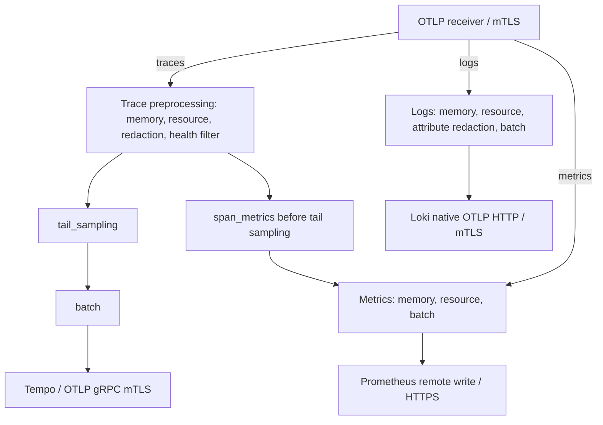

# OpenTelemetry

> **Base de revisión**: Collector Contrib 0.160.0; Operator 0.158.0; versiones de lenguajes más abajo
> **Última actualización**: September 13, 2026

## Introducción

OpenTelemetry (OTel) es un framework de observabilidad para software nativo de la nube. Proporciona estándares neutrales respecto al proveedor para generar, recopilar y gestionar tres señales: trazas (traces), métricas (metrics) y logs. La retrospectiva de la CNCF con fecha del 24 de julio de 2026 lo describió como el segundo proyecto después de Kubernetes en velocidad de contribución. La madurez del proyecto y la estabilidad de cada SDK o componente son cuestiones distintas.

### Actualización de julio de 2026: graduación en la CNCF

OpenTelemetry alcanzó el estado de proyecto **graduado** (graduated) en la CNCF en **mayo de 2026**; el artículo del 24 de julio es una retrospectiva. Este es el nivel de madurez más alto de la fundación, que también ostentan proyectos como Kubernetes y Prometheus. La graduación indica que el gobierno, las prácticas de seguridad y la adopción del proyecto han sido evaluados para uso en producción. La retrospectiva aborda las convenciones semánticas de GenAI, la observabilidad en navegador y móvil, y el gobierno de esquemas junto con las herramientas de despliegue. Consulte la entrada del blog de la CNCF ["OpenTelemetry has graduated… Now what?"](https://www.cncf.io/blog/2026/07/24/opentelemetry-has-graduated-now-what/) para conocer los antecedentes y la hoja de ruta.

## ¿Qué es OpenTelemetry?

OpenTelemetry nació de la fusión de los proyectos OpenTracing y OpenCensus:


[🔍 Ver diagrama interactivo](https://www.atomai.click/kubernetes-docs/archmaps/en-observability-tracing-03-opentelemetry-0.html)

## Conceptos fundamentales

### Las tres señales

Este capítulo se centra en trazas, métricas y logs. El profiling es otra señal en evolución; el soporte y la estabilidad varían según la implementación. Los IDs de traza/log y los exemplars de métricas requieren la instrumentación adecuada y la configuración correspondiente en el backend.

| Señal | Descripción | Casos de uso |
|--------|-------------|-----------|
| **Trazas** | Trazado distribuido de peticiones | Análisis de latencia, mapeo de dependencias |
| **Métricas** | Mediciones numéricas | Uso de recursos, SLI/SLO |
| **Logs** | Registros de eventos | Depuración, auditoría |

### Componentes principales


[🔍 Ver diagrama interactivo](https://www.atomai.click/kubernetes-docs/archmaps/en-observability-tracing-03-opentelemetry-2.html)

La figura enumera las opciones de backend por señal. Solo están activos los exporters configurados; el ejemplo base que aparece más abajo no habilita automáticamente todos los proveedores.


## SDK de OpenTelemetry

El Collector, el Operator, el agente de Java y los SDK de cada lenguaje tienen números de versión independientes. Estas plantillas de cargas de trabajo Linux se han comprobado contra los esquemas de Kubernetes 1.35: las imágenes de aplicación, los namespaces, los certificados y los servicios de destino deben prepararlos sus responsables. La matriz general del Operator no elimina los requisitos específicos de cada receta, como los sidecars nativos. Las comprobaciones locales no acreditan una aplicación desplegada en EKS.

| Componente | Base y límites |
|---|---|
| Collector Contrib independiente | 0.160.0; componentes y esquemas comprobados con su binario real |
| Operator | 0.158.0; su tabla de compatibilidad indica Kubernetes 1.25–1.36 y cert-manager v1 |
| Agente de Java | 2.31.1, dirigido al SDK 1.65.0; no es la misma versión que la imagen Java predeterminada del Operator |
| Python | SDK/exporter 1.44.0 e instrumentation/distro 0.65b0; Python ≥3.10 |
| Ejemplo CommonJS de Node.js | SDK-node 0.220.0, auto-instrumentations-node 0.78.0, resources 2.9.0, API 1.9.1 |

El Operator usa por defecto el Collector 0.158.0. Las cargas de trabajo independientes 0.160.0 que aparecen más abajo no constituyen una actualización de un Collector gestionado por el Operator. Compruebe la intersección con las versiones de EKS soportadas; la versión más reciente de Kubernetes no entra automáticamente en la matriz del Operator.

### Instrumentación automática

A fecha del 13 de septiembre de 2026, la página del ciclo de vida de EKS indica 1.34, 1.35 y 1.36 en soporte estándar. La base de esquemas 1.35 se encuentra dentro de esa lista y de la matriz del Operator; aun así, esto no sustituye a las comprobaciones de aceptación en vivo de la plataforma y los add-ons.

La instrumentación sin código (zero-code) engancha las librerías soportadas; no descubre operaciones de negocio arbitrarias. Elija para cada proceso una única vía: un agente/lanzador preparado directamente o la inyección del Operator. No inicialice un segundo SDK sobre un provider ya configurado. Las siguientes imágenes de aplicación son marcadores de posición para sus propias compilaciones, incluidos sus comandos de arranque y sus dependencias.

Prepare un namespace `ecommerce` y, en él, un Secret `otel-client-tls` que contenga `ca.crt`, `tls.crt` y `tls.key`. El certificado de cliente debe ser aceptado por el Collector, cuyo certificado debe coincidir con `otel-collector.otel.svc.cluster.local`. Los archivos del Secret se montan en modo solo lectura; adapte el acceso por UID/GID a su imagen. En las variables de entorno solo aparecen **rutas** de certificados, nunca el contenido de las claves ni tokens de portador. Estas plantillas usan OTLP HTTP/protobuf sobre TLS en el puerto 4318.

#### Instrumentación automática de Java

Descargue el agente con versión fijada en la compilación de su aplicación y verifique la suma de comprobación del artefacto de la release. El JAR de la versión 2.31.1 pesa 25.107.554 bytes, lo que excede el límite de 1 MiB de los ConfigMap de Kubernetes. Inclúyalo en la imagen o utilice la inyección del Operator; un ConfigMap no es un mecanismo de distribución de binarios de agente.


```bash
curl --fail --location --output opentelemetry-javaagent.jar \
  https://github.com/open-telemetry/opentelemetry-java-instrumentation/releases/download/v2.31.1/opentelemetry-javaagent.jar
printf '%s  %s\n' \
  bbf83c151b6400709e2f225bdd07a04f839d9d13b8b93464241333fd25d3e3ba \
  opentelemetry-javaagent.jar | sha256sum --check -
```

```dockerfile
# Add to the application's existing Dockerfile; not a complete image build.
COPY opentelemetry-javaagent.jar /opt/otel/opentelemetry-javaagent.jar
```
Combine la opción del agente con cualquier valor existente de `JAVA_TOOL_OPTIONS`; no descarte las opciones de JVM de la aplicación. El selector del Deployment y las etiquetas del Pod deben coincidir.


```yaml
apiVersion: apps/v1
kind: Deployment
metadata:
  name: order-service
  namespace: ecommerce
spec:
  replicas: 1
  selector:
    matchLabels:
      app: order-service
  template:
    metadata:
      labels:
        app: order-service
    spec:
      automountServiceAccountToken: false
      securityContext:
        fsGroup: 10001
      containers:
      - name: app
        image: registry.example.com/order-service:otel-demo
        env:
        - name: OTEL_SERVICE_NAME
          value: order-service
        - name: OTEL_RESOURCE_ATTRIBUTES
          value: service.namespace=ecommerce,deployment.environment.name=demo
        - name: OTEL_EXPORTER_OTLP_ENDPOINT
          value: https://otel-collector.otel.svc.cluster.local:4318
        - name: OTEL_EXPORTER_OTLP_PROTOCOL
          value: http/protobuf
        - name: OTEL_EXPORTER_OTLP_CERTIFICATE
          value: /var/run/otel-client/ca.crt
        - name: OTEL_EXPORTER_OTLP_CLIENT_CERTIFICATE
          value: /var/run/otel-client/tls.crt
        - name: OTEL_EXPORTER_OTLP_CLIENT_KEY
          value: /var/run/otel-client/tls.key
        - name: OTEL_TRACES_EXPORTER
          value: otlp
        - name: OTEL_METRICS_EXPORTER
          value: otlp
        - name: OTEL_LOGS_EXPORTER
          value: none
        - name: OTEL_TRACES_SAMPLER
          value: parentbased_always_on
        - name: OTEL_METRIC_EXPORT_INTERVAL
          value: '60000'
        - name: JAVA_TOOL_OPTIONS
          value: -javaagent:/opt/otel/opentelemetry-javaagent.jar
        volumeMounts:
        - name: otel-client-tls
          mountPath: /var/run/otel-client
          readOnly: true
      volumes:
      - name: otel-client-tls
        secret:
          secretName: otel-client-tls
          defaultMode: 288
```
#### Instrumentación automática de Python

Para una aplicación Flask, instale los paquetes correspondientes en su entorno de compilación y fije las dependencias resueltas de la aplicación. Otros frameworks necesitan su paquete de instrumentación correspondiente. Este ejemplo selecciona explícitamente el exporter HTTP, en lugar de enviar el valor predeterminado HTTP de Python al puerto gRPC 4317.


```bash
python -m pip install \
  opentelemetry-api==1.44.0 opentelemetry-sdk==1.44.0 \
  opentelemetry-distro==0.65b0 \
  opentelemetry-instrumentation-flask==0.65b0 \
  opentelemetry-exporter-otlp-proto-http==1.44.0
```

```yaml
apiVersion: apps/v1
kind: Deployment
metadata:
  name: payment-service
  namespace: ecommerce
spec:
  replicas: 1
  selector:
    matchLabels:
      app: payment-service
  template:
    metadata:
      labels:
        app: payment-service
    spec:
      automountServiceAccountToken: false
      securityContext:
        fsGroup: 10001
      containers:
      - name: app
        image: registry.example.com/payment-service:otel-demo
        env:
        - name: OTEL_SERVICE_NAME
          value: payment-service
        - name: OTEL_RESOURCE_ATTRIBUTES
          value: service.namespace=ecommerce,deployment.environment.name=demo
        - name: OTEL_EXPORTER_OTLP_ENDPOINT
          value: https://otel-collector.otel.svc.cluster.local:4318
        - name: OTEL_EXPORTER_OTLP_PROTOCOL
          value: http/protobuf
        - name: OTEL_EXPORTER_OTLP_CERTIFICATE
          value: /var/run/otel-client/ca.crt
        - name: OTEL_EXPORTER_OTLP_CLIENT_CERTIFICATE
          value: /var/run/otel-client/tls.crt
        - name: OTEL_EXPORTER_OTLP_CLIENT_KEY
          value: /var/run/otel-client/tls.key
        - name: OTEL_TRACES_EXPORTER
          value: otlp
        - name: OTEL_METRICS_EXPORTER
          value: otlp
        - name: OTEL_LOGS_EXPORTER
          value: none
        - name: OTEL_TRACES_SAMPLER
          value: parentbased_always_on
        - name: OTEL_METRIC_EXPORT_INTERVAL
          value: '60000'
        volumeMounts:
        - name: otel-client-tls
          mountPath: /var/run/otel-client
          readOnly: true
        command:
        - opentelemetry-instrument
        - python
        - app.py
      volumes:
      - name: otel-client-tls
        secret:
          secretName: otel-client-tls
          defaultMode: 288
```
#### Instrumentación automática de Node.js


```bash
npm install --save-exact \
  @opentelemetry/api@1.9.1 @opentelemetry/resources@2.9.0 \
  @opentelemetry/sdk-node@0.220.0 \
  @opentelemetry/auto-instrumentations-node@0.78.0
# Commit package-lock.json and use npm ci for subsequent application builds.
```
Guárdelo como `tracing.cjs`, cargado antes de los módulos de la aplicación y del framework. Este es un ejemplo CommonJS; la carga con ESM requiere la configuración específica de la guía del lenguaje. El SDK lee las variables de entorno explícitas de OTEL para exporter y TLS que se indican más abajo. Para lectores de métricas programáticos, la configuración actual usa `metricReaders`, que sustituye a la opción singular obsoleta. Integre `shutdownTelemetry()` después del paso de drenaje de peticiones propio de la aplicación.


```javascript
// Load before application/framework modules in a CommonJS application.
const { NodeSDK } = require('@opentelemetry/sdk-node');
const { envDetector } = require('@opentelemetry/resources');
const { getNodeAutoInstrumentations } = require('@opentelemetry/auto-instrumentations-node');

const sdk = new NodeSDK({
  resourceDetectors: [envDetector],
  instrumentations: [
    getNodeAutoInstrumentations({
      '@opentelemetry/instrumentation-fs': { enabled: false },
      '@opentelemetry/instrumentation-http': {
        ignoreIncomingRequestHook: (request) =>
          String(request.url || '').split('?')[0] === '/health',
      },
    }),
  ],
});

// OTEL_* variables configure exporters, protocol, TLS and metric interval.
sdk.start();

// Call after the application's own request-draining step on shutdown.
module.exports = { shutdownTelemetry: () => sdk.shutdown() };
```

```yaml
apiVersion: apps/v1
kind: Deployment
metadata:
  name: notification-service
  namespace: ecommerce
spec:
  replicas: 1
  selector:
    matchLabels:
      app: notification-service
  template:
    metadata:
      labels:
        app: notification-service
    spec:
      automountServiceAccountToken: false
      securityContext:
        fsGroup: 10001
      containers:
      - name: app
        image: registry.example.com/notification-service:otel-demo
        env:
        - name: OTEL_SERVICE_NAME
          value: notification-service
        - name: OTEL_RESOURCE_ATTRIBUTES
          value: service.namespace=ecommerce,deployment.environment.name=demo
        - name: OTEL_EXPORTER_OTLP_ENDPOINT
          value: https://otel-collector.otel.svc.cluster.local:4318
        - name: OTEL_EXPORTER_OTLP_PROTOCOL
          value: http/protobuf
        - name: OTEL_EXPORTER_OTLP_CERTIFICATE
          value: /var/run/otel-client/ca.crt
        - name: OTEL_EXPORTER_OTLP_CLIENT_CERTIFICATE
          value: /var/run/otel-client/tls.crt
        - name: OTEL_EXPORTER_OTLP_CLIENT_KEY
          value: /var/run/otel-client/tls.key
        - name: OTEL_TRACES_EXPORTER
          value: otlp
        - name: OTEL_METRICS_EXPORTER
          value: otlp
        - name: OTEL_LOGS_EXPORTER
          value: none
        - name: OTEL_TRACES_SAMPLER
          value: parentbased_always_on
        - name: OTEL_METRIC_EXPORT_INTERVAL
          value: '60000'
        volumeMounts:
        - name: otel-client-tls
          mountPath: /var/run/otel-client
          readOnly: true
        command:
        - node
        - --require
        - ./tracing.cjs
        - app.cjs
      volumes:
      - name: otel-client-tls
        secret:
          secretName: otel-client-tls
          defaultMode: 288
```
Estos ejemplos establecen `OTEL_LOGS_EXPORTER=none` de forma deliberada. Habilitar un exporter de logs no hace que se recoja la salida estándar de la aplicación: instale el bridge/handler de logging adecuado o un recolector de logs, y revise antes la exposición de la carga útil. El sampler `parentbased_always_on` sigue respetando un padre no muestreado. Si en su lugar opta por un muestreo en cabecera (head sampling) del 10 %, el Collector de cola no podrá recuperar los spans descartados.

### Instrumentación manual

Reutilice la instancia o el provider de OpenTelemetry inicializado por el agente o por la aplicación. Sin un provider del SDK, las llamadas a la API pueden no hacer nada. Estos spans de flujos de trabajo de negocio son INTERNAL: los clientes HTTP y de base de datos instrumentados crean sus propios spans CLIENT y propagan el contexto. Crear manualmente un span CLIENT por sí solo no envía una petición ni inyecta contexto de traza.

#### Instrumentación manual de Java

La aplicación proporciona las callbacks de inventario y de pago. No se registran IDs de pedido o de cliente, importes, IDs de transacción ni mensajes de excepción sin procesar. Estas son operaciones de aplicación, no una implementación de un servicio de pagos ni un despliegue de Spring probado.


```java
import io.opentelemetry.api.OpenTelemetry;
import io.opentelemetry.api.trace.Span;
import io.opentelemetry.api.trace.SpanKind;
import io.opentelemetry.api.trace.StatusCode;
import io.opentelemetry.api.trace.Tracer;
import io.opentelemetry.context.Scope;

public final class OrderTelemetry {
    private final Tracer tracer;

    public OrderTelemetry(OpenTelemetry telemetry) {
        this.tracer = telemetry.getTracer("example.order-workflow", "1.0.0");
    }

    public void processOrder(Runnable validateInventory, Runnable processPayment) {
        Span parent = tracer.spanBuilder("processOrder")
                .setSpanKind(SpanKind.INTERNAL).startSpan();
        try (Scope ignored = parent.makeCurrent()) {
            parent.addEvent("validation.started");
            child("checkInventory", validateInventory);
            child("processPayment", processPayment);
            parent.addEvent("processing.completed");
        } catch (RuntimeException error) {
            parent.setStatus(StatusCode.ERROR);
            parent.setAttribute("error.type", error.getClass().getName());
            throw error;
        } finally {
            parent.end();
        }
    }

    private void child(String name, Runnable operation) {
        Span span = tracer.spanBuilder(name).setSpanKind(SpanKind.INTERNAL).startSpan();
        try (Scope ignored = span.makeCurrent()) {
            operation.run();
        } catch (RuntimeException error) {
            span.setStatus(StatusCode.ERROR);
            span.setAttribute("error.type", error.getClass().getName());
            throw error;
        } finally {
            span.end();
        }
    }
}
```
#### Instrumentación manual de Python

El decorador síncrono preserva los resultados y los errores mientras finaliza los spans anidados. Registra únicamente el tipo de error, evitando eventos duplicados con la excepción sin procesar. Una función asíncrona requiere un wrapper compatible con async. Aporte sus propias callbacks de consulta parametrizada a base de datos, validación, persistencia y publicación de eventos; la validación local utilizó callbacks sintéticas y un exporter en memoria.


```python
"""Manual spans for synchronous application callbacks; no database is created."""
from functools import wraps
from contextlib import contextmanager
from opentelemetry import trace
from opentelemetry.trace import SpanKind, Status, StatusCode

# Reuse the SDK provider initialized by auto-instrumentation or the application.
tracer = trace.get_tracer("example.user-workflow", "1.0.0")

@contextmanager
def operation(name):
    with tracer.start_as_current_span(
        name, kind=SpanKind.INTERNAL,
        record_exception=False, set_status_on_exception=False,
    ) as span:
        try:
            yield span
        except Exception as error:
            span.set_status(Status(StatusCode.ERROR))
            span.set_attribute("error.type", type(error).__name__)
            raise

def traced(name):
    def decorate(function):
        @wraps(function)
        def wrapped(*args, **kwargs):
            with operation(name):
                return function(*args, **kwargs)
        return wrapped
    return decorate

@traced("get_user")
def get_user(user_id, lookup):
    # lookup is supplied by the application, with parameterized queries.
    # The ID and SQL text are not added to telemetry.
    with operation("lookup_user"):
        result = lookup(user_id)
    trace.get_current_span().set_attribute("app.user.found", result is not None)
    return result

@traced("create_user")
def create_user(user_data, validate, save, publish):
    # These callbacks are the application's own implementations.
    with operation("validate_user_data"):
        validate(user_data)
    with operation("save_user"):
        result = save(user_data)
    with operation("publish_user_event"):
        publish(result)
    return result
```
Para una instrumentación real de bases de datos o mensajería, siga la versión de la convención implementada, como `db.system.name`, `db.operation.name` y `messaging.destination.name`. No copie IDs de usuario en cadenas de telemetría SQL ni utilice consultas sin procesar como etiquetas de métricas. Las callbacks de negocio anteriores no son prueba de una ejecución en PostgreSQL ni en Kafka.

## OTEL Collector

### Arquitectura




Rutas de señal para la configuración que aparece a continuación. El bloque de preprocesamiento de trazas resume un procesamiento equivalente en dos pipelines de trazas separados. Las métricas de spans se derivan antes del muestreo de cola; las métricas y los logs entrantes usan sus propios pipelines.

### Configuración del Collector

Guárdelo como `otel-collector-config.yaml`. Se trata de una única instancia activa con estado para muestreo y agregación en un laboratorio, no de una garantía de alta disponibilidad o capacidad. Un pipeline de trazas independiente deriva métricas **antes del muestreo de cola**. Los spans descartados por muestreo en cabecera o por filtrado siguen estando ausentes de esas métricas. Estos contadores cuentan spans observados, no peticiones únicas de usuario final; seleccione tipos de span adecuados y dimensiones acotadas para los SLI de peticiones. Los contadores acumulativos de métricas de spans exportan inicialmente cero en la versión 0.160.0; evalúe los volcados posteriores antes de interpretar el primer valor como ausencia de tráfico.

Prepare Tempo con OTLP habilitado, un receptor de remote write compatible con Prometheus y la ingesta OTLP nativa de Loki, con pasarelas de TLS y autenticación proporcionadas por sus responsables. Los nombres de pasarela de los ejemplos siguientes no son servicios creados por esta guía. Prometheus necesita su receptor de remote write habilitado (`--web.enable-remote-write-receiver` si se usa Prometheus directamente). La base del exporter de Loki termina en `/otlp`; el exporter HTTP añade `/v1/logs`. Configure los metadatos estructurados de Loki y la asignación de tenants de confianza según sea necesario; una cabecera de tenant no es autenticación.

Las variables de entorno identifican certificados y endpoints existentes. Todos los receivers configurados usan TLS mutuo; no se habilita CORS con comodín para navegadores ni un endpoint público de profiling. Las eliminaciones de atributos nombrados son controles limitados, no un enmascaramiento completo de los cuerpos de los logs, los eventos de span, los atributos de recurso o cargas útiles arbitrarias. Minimice también los datos en el SDK.


```yaml
# otel-collector-config.yaml
receivers:
  otlp:
    protocols:
      grpc:
        endpoint: 0.0.0.0:4317
        max_recv_msg_size_mib: 16
        tls:
          cert_file: ${env:OTEL_SERVER_CERT}
          key_file: ${env:OTEL_SERVER_KEY}
          client_ca_file: ${env:OTEL_CLIENT_CA}
      http:
        endpoint: 0.0.0.0:4318
        tls:
          cert_file: ${env:OTEL_SERVER_CERT}
          key_file: ${env:OTEL_SERVER_KEY}
          client_ca_file: ${env:OTEL_CLIENT_CA}

processors:
  memory_limiter:
    check_interval: 1s
    limit_mib: 384
    spike_limit_mib: 96
  resource/cluster:
    attributes:
      - key: k8s.cluster.name
        value: ${env:K8S_CLUSTER_NAME}
        action: insert
  attributes/redact:
    actions:
      - key: http.request.header.authorization
        action: delete
      - key: user.email
        action: delete
      - key: user.id
        action: delete
      - key: customer.id
        action: delete
      - key: db.statement
        action: delete
      - key: db.query.text
        action: delete
  filter/health:
    error_mode: propagate
    traces:
      span:
        - 'attributes["http.route"] == "/health"'
        - 'attributes["http.route"] == "/ready"'
        - 'attributes["http.route"] == "/metrics"'
  tail_sampling:
    decision_wait: 10s
    num_traces: 10000
    expected_new_traces_per_sec: 100
    policies:
      - name: errors
        type: status_code
        status_code:
          status_codes: [ERROR]
      - name: slow
        type: latency
        latency:
          threshold_ms: 1000
      - name: selected-services
        type: string_attribute
        string_attribute:
          key: service.name
          values: [payment-service, order-service]
      - name: baseline
        type: probabilistic
        probabilistic:
          sampling_percentage: 10
  batch:
    timeout: 5s
    send_batch_size: 512
    send_batch_max_size: 1024

connectors:
  span_metrics:
    histogram:
      unit: s
      explicit:
        buckets: [5ms, 10ms, 25ms, 50ms, 100ms, 250ms, 500ms, 1s, 2s, 5s]
    dimensions:
      - name: http.request.method
      - name: http.response.status_code
    aggregation_cardinality_limit: 1000
    metrics_flush_interval: 15s

exporters:
  otlp_grpc/tempo:
    endpoint: ${env:TEMPO_OTLP_GRPC_ENDPOINT}
    tls:
      ca_file: ${env:BACKEND_CA}
      cert_file: ${env:BACKEND_CLIENT_CERT}
      key_file: ${env:BACKEND_CLIENT_KEY}
  prometheus_remote_write:
    endpoint: ${env:PROMETHEUS_REMOTE_WRITE_ENDPOINT}
    tls:
      ca_file: ${env:BACKEND_CA}
      cert_file: ${env:BACKEND_CLIENT_CERT}
      key_file: ${env:BACKEND_CLIENT_KEY}
  otlp_http/loki:
    endpoint: ${env:LOKI_OTLP_HTTP_ENDPOINT}
    tls:
      ca_file: ${env:BACKEND_CA}
      cert_file: ${env:BACKEND_CLIENT_CERT}
      key_file: ${env:BACKEND_CLIENT_KEY}

extensions:
  health_check:
    endpoint: 0.0.0.0:13133
    path: /health

service:
  extensions: [health_check]
  pipelines:
    traces:
      receivers: [otlp]
      processors: [memory_limiter, resource/cluster, attributes/redact, filter/health, tail_sampling, batch]
      exporters: [otlp_grpc/tempo]
    traces/span-metrics:
      receivers: [otlp]
      processors: [memory_limiter, resource/cluster, attributes/redact, filter/health]
      exporters: [span_metrics]
    metrics:
      receivers: [otlp, span_metrics]
      processors: [memory_limiter, resource/cluster, batch]
      exporters: [prometheus_remote_write]
    logs:
      receivers: [otlp]
      processors: [memory_limiter, resource/cluster, attributes/redact, batch]
      exporters: [otlp_http/loki]
  telemetry:
    logs:
      level: info
      encoding: json
    metrics:
      readers:
        - pull:
            exporter:
              prometheus:
                host: 127.0.0.1
                port: 8888
```
Las políticas de muestreo positivas son condiciones OR, no una escala ordenada de prioridades. Los servicios seleccionados pueden conservarse independientemente de la probabilidad de base. La latencia usa una comparación estricta `>1000 ms`. Las decisiones basadas en temporizador no demuestran que la traza esté completa, y el filtro de health elimina deliberadamente los spans coincidentes incluso si contienen errores; filtrar spans individuales puede dejar trazas parciales.

El límite duro de memoria es de 384 MiB y el límite blando de 288 MiB, dejando margen por debajo del límite de 512 MiB del contenedor en la plantilla. Los rechazos, los reintentos, las colas y las ráfagas siguen requiriendo medición. Los límites de batch, trazas y cardinalidad aquí son valores de demostración, no resultados de benchmark.

### Carga de trabajo y configuración de instancia única

Prepare el namespace `otel` y los Secrets `otel-ingest-tls` / `otel-backend-tls` con `tls.crt`, `tls.key` y `ca.crt`. Use SAN de certificado que coincidan con los nombres del Service o de la pasarela correspondientes, un bundle de confianza adecuado y certificados con los usos de servidor/cliente correctos. Adapte el acceso a archivos con UID/GID 10001. El ConfigMap contiene configuración en texto, no claves privadas. `Recreate` evita el solapamiento habitual del surge en despliegues progresivos para este sampler de instancia única, a costa de tiempo de indisponibilidad; no preserva las trazas en memoria entre reinicios.


```bash
: "${KUBE_CONTEXT:?Set the reviewed cluster context}"
kubectl --context "$KUBE_CONTEXT" -n otel create configmap otel-collector-config \
  --from-file=otel-collector-config.yaml --dry-run=client -o yaml > otel-collector-configmap.yaml
# Inspect the namespace, Secrets, endpoints and workloads before any real apply.
```

```yaml
apiVersion: v1
kind: ServiceAccount
metadata:
  name: otel-collector
  namespace: otel
automountServiceAccountToken: false
---
apiVersion: apps/v1
kind: Deployment
metadata:
  name: otel-collector
  namespace: otel
spec:
  selector:
    matchLabels:
      app: otel-collector
  template:
    metadata:
      labels:
        app: otel-collector
    spec:
      serviceAccountName: otel-collector
      automountServiceAccountToken: false
      nodeSelector:
        kubernetes.io/os: linux
      securityContext:
        runAsNonRoot: true
        runAsUser: 10001
        fsGroup: 10001
        seccompProfile:
          type: RuntimeDefault
      containers:
      - name: collector
        image: otel/opentelemetry-collector-contrib:0.160.0
        args:
        - --config=/conf/otel-collector-config.yaml
        env:
        - name: GOMEMLIMIT
          value: 384MiB
        - name: OTEL_SERVER_CERT
          value: /var/run/otel/ingest/tls.crt
        - name: OTEL_SERVER_KEY
          value: /var/run/otel/ingest/tls.key
        - name: OTEL_CLIENT_CA
          value: /var/run/otel/ingest/ca.crt
        - name: BACKEND_CA
          value: /var/run/otel/backend/ca.crt
        - name: BACKEND_CLIENT_CERT
          value: /var/run/otel/backend/tls.crt
        - name: BACKEND_CLIENT_KEY
          value: /var/run/otel/backend/tls.key
        - name: OTEL_UPSTREAM_ENDPOINT
          value: otel-collector.otel.svc.cluster.local:4317
        - name: K8S_CLUSTER_NAME
          value: REPLACE_WITH_CLUSTER_NAME
        - name: TEMPO_OTLP_GRPC_ENDPOINT
          value: tempo-gateway.tempo.svc.cluster.local:4317
        - name: PROMETHEUS_REMOTE_WRITE_ENDPOINT
          value: https://prometheus-gateway.monitoring.svc.cluster.local/api/v1/write
        - name: LOKI_OTLP_HTTP_ENDPOINT
          value: https://loki-gateway.loki.svc.cluster.local/otlp
        ports:
        - name: otlp-grpc
          containerPort: 4317
        - name: otlp-http
          containerPort: 4318
        resources:
          requests:
            cpu: 100m
            memory: 256Mi
          limits:
            cpu: 500m
            memory: 512Mi
        securityContext:
          allowPrivilegeEscalation: false
          readOnlyRootFilesystem: true
          capabilities:
            drop:
            - ALL
        volumeMounts:
        - name: config
          mountPath: /conf
          readOnly: true
        - name: ingest-tls
          mountPath: /var/run/otel/ingest
          readOnly: true
        - name: backend-tls
          mountPath: /var/run/otel/backend
          readOnly: true
        readinessProbe:
          httpGet:
            path: /health
            port: 13133
        livenessProbe:
          httpGet:
            path: /health
            port: 13133
          initialDelaySeconds: 15
      volumes:
      - name: config
        configMap:
          name: otel-collector-config
      - name: ingest-tls
        secret:
          secretName: otel-ingest-tls
          defaultMode: 288
      - name: backend-tls
        secret:
          secretName: otel-backend-tls
          defaultMode: 288
  replicas: 1
  strategy:
    type: Recreate
---
apiVersion: v1
kind: Service
metadata:
  name: otel-collector
  namespace: otel
spec:
  type: ClusterIP
  selector:
    app: otel-collector
  ports:
  - name: otlp-grpc
    port: 4317
    targetPort: otlp-grpc
  - name: otlp-http
    port: 4318
    targetPort: otlp-http
```
### Recolección y enriquecimiento opcionales

| Requisito | Configuración adicional necesaria |
|---|---|
| Clientes heredados de Jaeger/Zipkin | Sus componentes receiver siguen disponibles; habilite solo los protocolos y puertos necesarios y haga coincidir los IDs de receiver en un pipeline. Exporte a Jaeger por OTLP, no con el exporter de Jaeger eliminado. |
| Métricas propias del Collector | `service.telemetry.metrics.readers` configura el lector de Prometheus actual. El antiguo campo `address` se ha eliminado. Haga scraping del endpoint de loopback mediante una ruta de monitorización diseñada de forma deliberada. |
| Métricas del clúster de Kubernetes | Ejecute un único receiver `k8s_cluster` activo, o configure su extensión de elección de líder. Aporte credenciales de API y RBAC revisado, y luego conéctelo a un pipeline de métricas. Las cargas de trabajo predeterminadas sin token que aparecen arriba no proporcionan esos prerrequisitos. |
| Logs de nodo/contenedor o métricas de host | Añada el receiver, los montajes y los permisos adecuados; un DaemonSet por sí solo no los recopila. |
| Detección de recursos EC2/EKS | Configure de forma deliberada el detector deseado y su acceso a metadatos/API; no sustituya la identidad de la carga de trabajo por la identidad del host del Collector. |
| Métricas derivadas de spans | Use el connector `span_metrics`, con una unidad de duración explícita y dimensiones acotadas. El antiguo processor spanmetrics se ha eliminado. |

Consulte la [guía del collector](../logging/05-collectors.md) y el [receiver de clúster de Kubernetes](https://github.com/open-telemetry/opentelemetry-collector-contrib/tree/v0.160.0/receiver/k8sclusterreceiver). No declare un receiver o processor sin usar y dé por sentado que está activo.

## Patrones de despliegue en EKS

Estos son patrones de despliegue alternativos, no una pila para aplicar indiscriminadamente. Un relay sin estado reenvía las tres señales al nivel único de muestreo descrito arriba. Mantenga el muestreo de cola y la agregación de spans fuera de un nivel de nodo/sidecar/HPA con balanceo de carga arbitrario. Varias instancias de muestreo requieren enrutamiento basado en el ID de traza y un plan para los cambios de endpoint, las trazas en curso, los reinicios y el almacenamiento; un Service o un HPA por sí solos no aportan nada de eso.

Guarde `otel-relay-config.yaml` y cree `otel-relay-config` con el mismo procedimiento de generación de ConfigMap en el lado del cliente. `OTEL_UPSTREAM_ENDPOINT` y el certificado de cliente identifican el Collector aguas arriba preparado por separado. El relay no mantiene estado respecto a las decisiones de muestreo; sus colas de batching y exportación en memoria siguen teniendo límites ante fallos y apagados.


```yaml
receivers:
  otlp:
    protocols:
      grpc:
        endpoint: 0.0.0.0:4317
        max_recv_msg_size_mib: 16
        tls:
          cert_file: ${env:OTEL_SERVER_CERT}
          key_file: ${env:OTEL_SERVER_KEY}
          client_ca_file: ${env:OTEL_CLIENT_CA}
      http:
        endpoint: 0.0.0.0:4318
        tls:
          cert_file: ${env:OTEL_SERVER_CERT}
          key_file: ${env:OTEL_SERVER_KEY}
          client_ca_file: ${env:OTEL_CLIENT_CA}
processors:
  memory_limiter:
    check_interval: 1s
    limit_mib: 384
    spike_limit_mib: 96
  batch:
    timeout: 5s
    send_batch_size: 512
    send_batch_max_size: 1024
exporters:
  otlp_grpc/upstream:
    endpoint: ${env:OTEL_UPSTREAM_ENDPOINT}
    tls:
      ca_file: ${env:BACKEND_CA}
      cert_file: ${env:BACKEND_CLIENT_CERT}
      key_file: ${env:BACKEND_CLIENT_KEY}
extensions:
  health_check:
    endpoint: 0.0.0.0:13133
    path: /health
service:
  extensions:
  - health_check
  pipelines:
    traces:
      receivers:
      - otlp
      processors:
      - memory_limiter
      - batch
      exporters:
      - otlp_grpc/upstream
    metrics:
      receivers:
      - otlp
      processors:
      - memory_limiter
      - batch
      exporters:
      - otlp_grpc/upstream
    logs:
      receivers:
      - otlp
      processors:
      - memory_limiter
      - batch
      exporters:
      - otlp_grpc/upstream
  telemetry:
    logs:
      level: info
      encoding: json
    metrics:
      readers:
      - pull:
          exporter:
            prometheus:
              host: 127.0.0.1
              port: 8888
```
### Patrón DaemonSet

Un DaemonSet se ejecuta en los nodos Linux elegibles, no en EKS Fargate. Configure selectores y tolerations para los nodos aprobados; aquí no hay ninguna toleration general ni reserva de hostPort. `internalTrafficPolicy: Local` enruta este Service únicamente a un endpoint listo en el nodo del llamante y descarta el tráfico si no existe ninguno. No es un mecanismo de reserva para clientes en Fargate. Las aplicaciones deben enviar la telemetría explícitamente a este endpoint.


```yaml
apiVersion: apps/v1
kind: DaemonSet
metadata:
  name: otel-agent
  namespace: otel
spec:
  selector:
    matchLabels:
      app: otel-agent
  template:
    metadata:
      labels:
        app: otel-agent
    spec:
      serviceAccountName: otel-collector
      automountServiceAccountToken: false
      nodeSelector:
        kubernetes.io/os: linux
      securityContext:
        runAsNonRoot: true
        runAsUser: 10001
        fsGroup: 10001
        seccompProfile:
          type: RuntimeDefault
      containers:
      - name: collector
        image: otel/opentelemetry-collector-contrib:0.160.0
        args:
        - --config=/conf/otel-relay-config.yaml
        env:
        - name: GOMEMLIMIT
          value: 384MiB
        - name: OTEL_SERVER_CERT
          value: /var/run/otel/ingest/tls.crt
        - name: OTEL_SERVER_KEY
          value: /var/run/otel/ingest/tls.key
        - name: OTEL_CLIENT_CA
          value: /var/run/otel/ingest/ca.crt
        - name: BACKEND_CA
          value: /var/run/otel/backend/ca.crt
        - name: BACKEND_CLIENT_CERT
          value: /var/run/otel/backend/tls.crt
        - name: BACKEND_CLIENT_KEY
          value: /var/run/otel/backend/tls.key
        - name: OTEL_UPSTREAM_ENDPOINT
          value: otel-collector.otel.svc.cluster.local:4317
        ports:
        - name: otlp-grpc
          containerPort: 4317
        - name: otlp-http
          containerPort: 4318
        resources:
          requests:
            cpu: 100m
            memory: 256Mi
          limits:
            cpu: 500m
            memory: 512Mi
        securityContext:
          allowPrivilegeEscalation: false
          readOnlyRootFilesystem: true
          capabilities:
            drop:
            - ALL
        volumeMounts:
        - name: config
          mountPath: /conf
          readOnly: true
        - name: ingest-tls
          mountPath: /var/run/otel/ingest
          readOnly: true
        - name: backend-tls
          mountPath: /var/run/otel/backend
          readOnly: true
        readinessProbe:
          httpGet:
            path: /health
            port: 13133
        livenessProbe:
          httpGet:
            path: /health
            port: 13133
          initialDelaySeconds: 15
      volumes:
      - name: config
        configMap:
          name: otel-relay-config
      - name: ingest-tls
        secret:
          secretName: otel-ingest-tls
          defaultMode: 288
      - name: backend-tls
        secret:
          secretName: otel-backend-tls
          defaultMode: 288
---
apiVersion: v1
kind: Service
metadata:
  name: otel-agent
  namespace: otel
spec:
  type: ClusterIP
  selector:
    app: otel-agent
  ports:
  - name: otlp-grpc
    port: 4317
    targetPort: otlp-grpc
  - name: otlp-http
    port: 4318
    targetPort: otlp-http
  internalTrafficPolicy: Local
```
### Patrón sidecar

Use un ConfigMap `otel-sidecar-config` separado con la configuración siguiente. Solo el propio Pod utiliza su receiver OTLP en loopback y sin cifrar; el tráfico aguas arriba usa TLS mutuo. Este perfil tiene un límite duro de 192 MiB y blando de 144 MiB para un sidecar de 256 MiB. La imagen de la aplicación debe incluir el SDK o agente elegido; una variable de endpoint no añade instrumentación por sí sola. Este ejemplo con esquema de Kubernetes 1.35 usa un sidecar nativo (`initContainers` con `restartPolicy: Always`, GA en 1.33). Su startup probe precede al arranque de la aplicación, y un apagado normal detiene los contenedores de aplicación antes que el sidecar. La entrega al backend y la recuperación ante fallos abruptos siguen siendo comprobaciones aparte.


```yaml
receivers:
  otlp:
    protocols:
      grpc:
        endpoint: 127.0.0.1:4317
      http:
        endpoint: 127.0.0.1:4318
processors:
  memory_limiter:
    check_interval: 1s
    limit_mib: 192
    spike_limit_mib: 48
  batch:
    timeout: 5s
    send_batch_size: 512
    send_batch_max_size: 1024
exporters:
  otlp_grpc/upstream:
    endpoint: ${env:OTEL_UPSTREAM_ENDPOINT}
    tls:
      ca_file: ${env:BACKEND_CA}
      cert_file: ${env:BACKEND_CLIENT_CERT}
      key_file: ${env:BACKEND_CLIENT_KEY}
extensions:
  health_check:
    endpoint: 0.0.0.0:13133
    path: /health
service:
  extensions:
  - health_check
  pipelines:
    traces:
      receivers:
      - otlp
      processors:
      - memory_limiter
      - batch
      exporters:
      - otlp_grpc/upstream
    metrics:
      receivers:
      - otlp
      processors:
      - memory_limiter
      - batch
      exporters:
      - otlp_grpc/upstream
    logs:
      receivers:
      - otlp
      processors:
      - memory_limiter
      - batch
      exporters:
      - otlp_grpc/upstream
  telemetry:
    logs:
      level: info
      encoding: json
    metrics:
      readers:
      - pull:
          exporter:
            prometheus:
              host: 127.0.0.1
              port: 8888
```

```yaml
apiVersion: apps/v1
kind: Deployment
metadata:
  name: order-with-sidecar
  namespace: otel
spec:
  selector:
    matchLabels:
      app: order-with-sidecar
  template:
    metadata:
      labels:
        app: order-with-sidecar
    spec:
      serviceAccountName: otel-collector
      automountServiceAccountToken: false
      nodeSelector:
        kubernetes.io/os: linux
      securityContext:
        runAsNonRoot: true
        runAsUser: 10001
        fsGroup: 10001
        seccompProfile:
          type: RuntimeDefault
      containers:
      - name: app
        image: registry.example.com/order-service:otel-demo
        env:
        - name: OTEL_SERVICE_NAME
          value: order-service
        - name: OTEL_EXPORTER_OTLP_ENDPOINT
          value: http://127.0.0.1:4318
        - name: OTEL_EXPORTER_OTLP_PROTOCOL
          value: http/protobuf
      volumes:
      - name: config
        configMap:
          name: otel-sidecar-config
      - name: backend-tls
        secret:
          secretName: otel-backend-tls
          defaultMode: 288
      initContainers:
      - name: collector
        image: otel/opentelemetry-collector-contrib:0.160.0
        args:
        - --config=/conf/otel-sidecar-config.yaml
        env:
        - name: GOMEMLIMIT
          value: 192MiB
        - name: BACKEND_CA
          value: /var/run/otel/backend/ca.crt
        - name: BACKEND_CLIENT_CERT
          value: /var/run/otel/backend/tls.crt
        - name: BACKEND_CLIENT_KEY
          value: /var/run/otel/backend/tls.key
        - name: OTEL_UPSTREAM_ENDPOINT
          value: otel-collector.otel.svc.cluster.local:4317
        ports:
        - name: otlp-grpc
          containerPort: 4317
        - name: otlp-http
          containerPort: 4318
        resources:
          requests:
            cpu: 100m
            memory: 64Mi
          limits:
            cpu: 500m
            memory: 256Mi
        securityContext:
          allowPrivilegeEscalation: false
          readOnlyRootFilesystem: true
          capabilities:
            drop:
            - ALL
        volumeMounts:
        - name: config
          mountPath: /conf
          readOnly: true
        - name: backend-tls
          mountPath: /var/run/otel/backend
          readOnly: true
        readinessProbe:
          httpGet:
            path: /health
            port: 13133
        livenessProbe:
          httpGet:
            path: /health
            port: 13133
          initialDelaySeconds: 15
        restartPolicy: Always
        startupProbe:
          httpGet:
            path: /health
            port: 13133
          periodSeconds: 2
          failureThreshold: 30
  replicas: 1
```
### Patrón gateway

Este HPA escala el **relay** sin estado, no el sampler con estado. Metrics Server y unas requests y capacidad adecuadas son prerrequisitos. Tres réplicas, la anti-afinidad preferida y el rango 3–10 son opciones ilustrativas, no una prueba de alta disponibilidad o de rendimiento. Los collectors basados en Deployment pueden considerarse para Fargate o Auto Mode solo después de comprobar sus requisitos de ejecución, almacenamiento, red y receivers.


```yaml
apiVersion: apps/v1
kind: Deployment
metadata:
  name: otel-relay
  namespace: otel
spec:
  selector:
    matchLabels:
      app: otel-relay
  template:
    metadata:
      labels:
        app: otel-relay
    spec:
      serviceAccountName: otel-collector
      automountServiceAccountToken: false
      nodeSelector:
        kubernetes.io/os: linux
      securityContext:
        runAsNonRoot: true
        runAsUser: 10001
        fsGroup: 10001
        seccompProfile:
          type: RuntimeDefault
      containers:
      - name: collector
        image: otel/opentelemetry-collector-contrib:0.160.0
        args:
        - --config=/conf/otel-relay-config.yaml
        env:
        - name: GOMEMLIMIT
          value: 384MiB
        - name: OTEL_SERVER_CERT
          value: /var/run/otel/ingest/tls.crt
        - name: OTEL_SERVER_KEY
          value: /var/run/otel/ingest/tls.key
        - name: OTEL_CLIENT_CA
          value: /var/run/otel/ingest/ca.crt
        - name: BACKEND_CA
          value: /var/run/otel/backend/ca.crt
        - name: BACKEND_CLIENT_CERT
          value: /var/run/otel/backend/tls.crt
        - name: BACKEND_CLIENT_KEY
          value: /var/run/otel/backend/tls.key
        - name: OTEL_UPSTREAM_ENDPOINT
          value: otel-collector.otel.svc.cluster.local:4317
        ports:
        - name: otlp-grpc
          containerPort: 4317
        - name: otlp-http
          containerPort: 4318
        resources:
          requests:
            cpu: 100m
            memory: 256Mi
          limits:
            cpu: 500m
            memory: 512Mi
        securityContext:
          allowPrivilegeEscalation: false
          readOnlyRootFilesystem: true
          capabilities:
            drop:
            - ALL
        volumeMounts:
        - name: config
          mountPath: /conf
          readOnly: true
        - name: ingest-tls
          mountPath: /var/run/otel/ingest
          readOnly: true
        - name: backend-tls
          mountPath: /var/run/otel/backend
          readOnly: true
        readinessProbe:
          httpGet:
            path: /health
            port: 13133
        livenessProbe:
          httpGet:
            path: /health
            port: 13133
          initialDelaySeconds: 15
      volumes:
      - name: config
        configMap:
          name: otel-relay-config
      - name: ingest-tls
        secret:
          secretName: otel-ingest-tls
          defaultMode: 288
      - name: backend-tls
        secret:
          secretName: otel-backend-tls
          defaultMode: 288
      affinity:
        podAntiAffinity:
          preferredDuringSchedulingIgnoredDuringExecution:
          - weight: 100
            podAffinityTerm:
              labelSelector:
                matchLabels:
                  app: otel-relay
              topologyKey: kubernetes.io/hostname
  replicas: 3
---
apiVersion: v1
kind: Service
metadata:
  name: otel-relay
  namespace: otel
spec:
  type: ClusterIP
  selector:
    app: otel-relay
  ports:
  - name: otlp-grpc
    port: 4317
    targetPort: otlp-grpc
  - name: otlp-http
    port: 4318
    targetPort: otlp-http
---
apiVersion: autoscaling/v2
kind: HorizontalPodAutoscaler
metadata:
  name: otel-relay
  namespace: otel
spec:
  scaleTargetRef:
    apiVersion: apps/v1
    kind: Deployment
    name: otel-relay
  minReplicas: 3
  maxReplicas: 10
  metrics:
  - type: Resource
    resource:
      name: cpu
      target:
        type: Utilization
        averageUtilization: 70
  - type: Resource
    resource:
      name: memory
      target:
        type: Utilization
        averageUtilization: 80
```

## Operator de Kubernetes

El Operator 0.158.0 tiene su propia matriz de compatibilidad. Su manifiesto de release da por supuesta una instalación preparada de cert-manager v1; utilice una release compatible y mantenida siguiendo la [guía de cert-manager](../../security/10-cert-manager.md), en lugar de instalar el obsoleto ejemplo 1.13.3. Revise los cambios en las CRD y las políticas de red predeterminadas de la versión 0.158.0 antes de actualizar una instalación existente gestionada por su responsable.

### Instalación del Operator


```bash
curl --fail --location --output opentelemetry-operator.yaml \
  https://github.com/open-telemetry/opentelemetry-operator/releases/download/v0.158.0/opentelemetry-operator.yaml
printf '%s  %s\n' \
  3c258efb3d64834a857ce4ed5256af2883dc9c77a300eee465df833ab2354c8e \
  opentelemetry-operator.yaml | sha256sum --check -
# After prerequisites and ownership/upgrade review; this changes the cluster:
: "${KUBE_CONTEXT:?Set the reviewed cluster context}"
kubectl --context "$KUBE_CONTEXT" apply -f opentelemetry-operator.yaml
```
### CR Instrumentation

Tanto el recurso como la aplicación de ejemplo están en `ecommerce`. El Operator con versión fijada proporciona sus imágenes de instrumentación predeterminadas versionadas; inspeccione las imágenes inyectadas y no las sustituya todas por `latest`. Sus valores predeterminados para Java y Python no son las versiones instaladas directamente más arriba. Use una sola vía de instrumentación por proceso. El montaje de los Secrets de TLS sigue siendo responsabilidad de la aplicación.


```yaml
apiVersion: opentelemetry.io/v1alpha1
kind: Instrumentation
metadata:
  name: otel-instrumentation
  namespace: ecommerce
spec:
  exporter:
    endpoint: https://otel-collector.otel.svc.cluster.local:4318
  propagators:
  - tracecontext
  - baggage
  sampler:
    type: parentbased_always_on
  env:
  - name: OTEL_RESOURCE_ATTRIBUTES
    value: service.namespace=ecommerce,deployment.environment.name=demo
  - name: OTEL_EXPORTER_OTLP_PROTOCOL
    value: http/protobuf
  - name: OTEL_EXPORTER_OTLP_CERTIFICATE
    value: /var/run/otel-client/ca.crt
  - name: OTEL_EXPORTER_OTLP_CLIENT_CERTIFICATE
    value: /var/run/otel-client/tls.crt
  - name: OTEL_EXPORTER_OTLP_CLIENT_KEY
    value: /var/run/otel-client/tls.key
  - name: OTEL_TRACES_EXPORTER
    value: otlp
  - name: OTEL_METRICS_EXPORTER
    value: otlp
  - name: OTEL_LOGS_EXPORTER
    value: none
  - name: OTEL_METRIC_EXPORT_INTERVAL
    value: '60000'
```
Aquí se seleccionan W3C Trace Context y baggage. B3 es una opción de interoperabilidad opcional únicamente cuando el paquete de propagator del lenguaje y los servicios pares lo soportan. No incluya credenciales ni datos personales en el baggage; la propagación puede cruzar límites de servicio y de confianza.

### Inyección de instrumentación automática

La anotación va en la plantilla del Pod, no solo en los metadatos del Deployment. `otel-instrumentation` selecciona el recurso con ese nombre en el namespace del Pod; `namespace/name` permite seleccionar explícitamente otro namespace. Existen anotaciones a nivel de namespace, pero no habilite Java, Python y Node.js indiscriminadamente para todos los Pods. La inyección se produce cuando se admiten nuevos Pods, no de forma retroactiva sobre los Pods en ejecución.


```yaml
apiVersion: apps/v1
kind: Deployment
metadata:
  name: order-injected
  namespace: ecommerce
spec:
  replicas: 1
  selector:
    matchLabels:
      app: order-injected
  template:
    metadata:
      labels:
        app: order-injected
      annotations:
        instrumentation.opentelemetry.io/inject-java: otel-instrumentation
    spec:
      automountServiceAccountToken: false
      securityContext:
        fsGroup: 10001
      containers:
      - name: app
        image: registry.example.com/order-injected:otel-demo
        env:
        - name: OTEL_SERVICE_NAME
          value: order-injected
        - name: OTEL_RESOURCE_ATTRIBUTES
          value: service.namespace=ecommerce,deployment.environment.name=demo
        - name: OTEL_EXPORTER_OTLP_ENDPOINT
          value: https://otel-collector.otel.svc.cluster.local:4318
        - name: OTEL_EXPORTER_OTLP_PROTOCOL
          value: http/protobuf
        - name: OTEL_EXPORTER_OTLP_CERTIFICATE
          value: /var/run/otel-client/ca.crt
        - name: OTEL_EXPORTER_OTLP_CLIENT_CERTIFICATE
          value: /var/run/otel-client/tls.crt
        - name: OTEL_EXPORTER_OTLP_CLIENT_KEY
          value: /var/run/otel-client/tls.key
        - name: OTEL_TRACES_EXPORTER
          value: otlp
        - name: OTEL_METRICS_EXPORTER
          value: otlp
        - name: OTEL_LOGS_EXPORTER
          value: none
        - name: OTEL_TRACES_SAMPLER
          value: parentbased_always_on
        - name: OTEL_METRIC_EXPORT_INTERVAL
          value: '60000'
        volumeMounts:
        - name: otel-client-tls
          mountPath: /var/run/otel-client
          readOnly: true
      volumes:
      - name: otel-client-tls
        secret:
          secretName: otel-client-tls
          defaultMode: 288
```
Java, Python, Node.js, .NET, Go, Apache HTTPD y Nginx tienen prerrequisitos distintos. En esta release, la instrumentación automática de Go necesita la ruta del ejecutable de destino e inyecta un componente privilegiado con UID 0; no es una receta general para PSS Restricted ni para Fargate. Verifique la configuración de las features del operator y la guía de cada lenguaje. Los valores predeterminados HTTP de Python, .NET y Go no deben apuntarse a un endpoint gRPC sin la configuración de protocolo correspondiente.

## Configuración multibackend

Fusione este fragmento en la configuración base ya revisada; no es autónomo. Cada backend necesita su propio endpoint, confianza y autorización. AWS X-Ray usa la Región configurada y la identidad de la carga de trabajo; siga la [guía de X-Ray](./02-xray.md) para conocer las relaciones de confianza y permisos exactos de IAM. Desactivar la indexación de atributos no es enmascaramiento. El objeto api de Datadog proviene de un api.yaml gestionado como Secret que contiene key (una cadena entre comillas) y site. Añada su montaje de Secret en modo solo lectura a la carga de trabajo; la carga de trabajo base no lo monta. No se coloca ninguna clave en variables de entorno. En esta auditoría no se ejecutó ninguna llamada a servicios de AWS, Datadog o Jaeger.


```yaml
exporters:
  awsxray:
    region: ap-northeast-2
    index_all_attributes: false
    telemetry:
      enabled: false
  datadog:
    api: ${file:/var/run/secrets/datadog/api.yaml}
  otlp_grpc/jaeger:
    endpoint: ${env:JAEGER_OTLP_GRPC_ENDPOINT}
    tls:
      ca_file: ${env:BACKEND_CA}
      cert_file: ${env:BACKEND_CLIENT_CERT}
      key_file: ${env:BACKEND_CLIENT_KEY}
service:
  pipelines:
    traces:
      exporters:
      - otlp_grpc/tempo
      - awsxray
      - datadog
      - otlp_grpc/jaeger
```
La distribución en abanico (fan-out) no garantiza una entrega atómica ni una retención idéntica en todos los backends.

### Actualización de julio de 2026: observar un límite de red para el tráfico de agentes de IA

El [artículo de la CNCF del 8 de julio](https://www.cncf.io/blog/2026/07/08/network-boundary-for-ai-agents-using-nginx-and-opentelemetry/) describe un prototipo de un solo nodo con NGINX y OTel. Su límite depende de reglas de red que bloqueen rutas de salida alternativas, no solo de establecer una variable de proxy. Los spans describen el tráfico visible para el proxy configurado; el tratamiento de TLS, el muestreo, la retención en el collector y la seguridad del proxy siguen siendo relevantes. Esta es una capa de control de red y no demuestra que las decisiones de un agente sean correctas ni seguras.

### Actualización de agosto de 2026: destilar consultas SQL lentas en métricas de fiabilidad

El [artículo de la CNCF del 21 de agosto](https://www.cncf.io/blog/2026/08/21/how-to-turn-slow-queries-into-actionable-reliability-metrics-with-opentelemetry/) y su [laboratorio](https://github.com/causely-oss/slow-query-lab) comparan la duración de las consultas, el impacto ponderado por tráfico y las métricas derivadas de spans frente a líneas base de anomalías. Conserve los ejemplos históricos del artículo como ejemplos, no como mediciones de capacidad para su clúster. El propio artículo advierte sobre el SQL sin procesar en las etiquetas de métricas, los parámetros sensibles, la cardinalidad y el calentamiento de la línea base. Depure y acote las dimensiones antes de adoptar una configuración de laboratorio; una anomalía de latencia es un síntoma, no la prueba de una causa raíz.

## Buenas prácticas

### 1. Estandarizar los atributos de recurso

| Atributo | Ejemplo / origen |
|---|---|
| `service.name`, `service.version`, `service.namespace` | `order-service`, `1.2.3`, `ecommerce`; configuración de la aplicación |
| `deployment.environment.name` | `demo`; sustituye al obsoleto `deployment.environment` |
| `cloud.provider`, `cloud.region`, `cloud.availability_zone` | Metadatos de despliegue verificados, no conjeturas a partir del host del Collector |
| `k8s.cluster.name`, `k8s.namespace.name`, `k8s.pod.name`, `k8s.deployment.name` | Enriquecimiento de Kubernetes correctamente configurado o metadatos de la carga de trabajo |

Este es un inventario de atributos, no YAML de processors del Collector. Un Resource identifica al productor. Evite copiar todos los atributos de recurso a las etiquetas de métricas; los nombres de Pod, los IDs de usuario y el texto de consultas sin procesar pueden provocar cardinalidad alta. Los profiles son una señal adicional en evolución; esta guía se centra en trazas, métricas y logs, sin afirmar que exista una estabilidad uniforme entre SDK.

### 2. Estrategia de muestreo

Para un ejemplo avanzado —errores, latencia superior a 2 segundos, una condición del 50 % para servicios críticos y un 5 % de base— trate cada regla positiva como una condición OR, no como una prioridad por primera coincidencia ni como una cuota reservada. Otra regla puede conservar una traza. Si se requieren clases exclusivas o un presupuesto de tasa de spans, diseñe y pruebe esa política de forma explícita. El muestreo en cabecera, los spans descartados, los cambios de shard y las llegadas tardías siguen siendo límites aparte.


```yaml
# Replace the base policies list; positive rules are OR conditions, not priorities.
processors:
  tail_sampling:
    policies:
    - name: errors
      type: status_code
      status_code:
        status_codes:
        - ERROR
    - name: slow
      type: latency
      latency:
        threshold_ms: 2000
    - name: critical-services
      type: and
      and:
        and_sub_policy:
        - name: service-name
          type: string_attribute
          string_attribute:
            key: service.name
            values:
            - payment-service
            - order-service
        - name: probabilistic
          type: probabilistic
          probabilistic:
            sampling_percentage: 50
    - name: default
      type: probabilistic
      probabilistic:
        sampling_percentage: 5
```
### 3. Consideraciones de seguridad

TLS de servidor sin `client_ca_file` no equivale a exigir certificados de cliente. Proteja ambas direcciones, valide los nombres y el ciclo de vida de los certificados y restrinja el acceso al Service, a la red y al backend. El tráfico sin cifrar por loopback dentro del mismo Pod en el ejemplo del sidecar es un límite de confianza distinto. La telemetría de navegador necesita su propio diseño de origen, autenticación y límites de tasa, no CORS con comodín.

La acción `hash` del processor de attributes usa SHA-1. Aplicar hash a IDs predecibles o a texto SQL no es anonimización; siguen siendo posibles la recuperación por diccionario y la vinculación. Es preferible no recopilar valores sensibles y, después, eliminar explícitamente los campos identificados antes de la exportación. Revise por separado los cuerpos de los logs, los eventos de span y los atributos de recurso. Los exporters de depuración detallados o los endpoints de profiling pueden exponer datos y deberían ser diagnósticos temporales y controlados.

### Validación y límites

La validación local utilizó el Collector 0.160.0 real con tráfico OTLP sintético y endpoints mTLS en loopback, incluidos el tratamiento de trazas y logs y las métricas de spans previas al muestreo de cola. La comprobación de remote write acreditó la entrega por HTTPS a un sumidero de pruebas, no un resultado de ingesta en un Prometheus real. Los spans manuales de Python usaron el SDK 1.44.0 y un exporter en memoria. Se comprobaron los esquemas de Kubernetes/Instrumentation y la sintaxis de Node.js; no se ejecutaron el arranque de las aplicaciones Java/Node, la inyección sin código, los productos de backend reales, EKS, IAM ni el autoescalado.

### Referencias oficiales

- [Collector 0.160.0 components](https://github.com/open-telemetry/opentelemetry-collector-releases/blob/v0.160.0/distributions/otelcol-contrib/manifest.yaml)
- [Operator 0.158.0 compatibility](https://github.com/open-telemetry/opentelemetry-operator/blob/v0.158.0/docs/getting-started/compatibility.md)
- [Operator auto-instrumentation](https://github.com/open-telemetry/opentelemetry-operator/blob/v0.158.0/docs/auto-instrumentation/README.md)
- [Java agent 2.31.1](https://github.com/open-telemetry/opentelemetry-java-instrumentation/releases/tag/v2.31.1)
- [OTLP exporter configuration](https://opentelemetry.io/docs/languages/sdk-configuration/otlp-exporter/)
- [Collector scaling](https://opentelemetry.io/docs/collector/scaling/)
- [Tail sampling](https://github.com/open-telemetry/opentelemetry-collector-contrib/tree/v0.160.0/processor/tailsamplingprocessor)
- [Span metrics connector](https://github.com/open-telemetry/opentelemetry-collector-contrib/tree/v0.160.0/connector/spanmetricsconnector)
- [Memory limiter](https://github.com/open-telemetry/opentelemetry-collector/tree/v0.160.0/processor/memorylimiterprocessor)
- [Loki native OTLP](https://grafana.com/docs/loki/latest/send-data/otel/)
- [W3C Trace Context](https://www.w3.org/TR/trace-context/)
- [Kubernetes native sidecars](https://kubernetes.io/docs/concepts/workloads/pods/sidecar-containers/)
- [EKS Kubernetes lifecycle](https://docs.aws.amazon.com/eks/latest/userguide/kubernetes-versions.html)
- [OpenTracing CNCF milestones](https://www.cncf.io/projects/opentracing/)
- [OpenCensus Go repository](https://github.com/census-instrumentation/opencensus-go)

## Cuestionario

Ponga a prueba sus conocimientos con el [Cuestionario de OpenTelemetry](../../quizzes/observability/tracing/03-opentelemetry-quiz.md).
