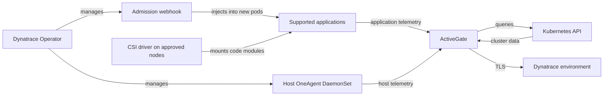

# Dynatrace

> **Última actualización**: September 13, 2026

## Introducción

Dynatrace combina la telemetría de aplicaciones e infraestructura con la topología y el análisis de problemas. La instrumentación automática de OneAgent depende de los tiempos de ejecución compatibles, el modo de despliegue y los permisos; instalar solo el Operator no proporciona todas las señales. PurePath proporciona contexto compatible de solicitudes/código, mientras que Smartscape asigna las dependencias observadas. Ninguno garantiza la captura de todas las solicitudes, métodos o dependencias.

Esta guía utiliza **Dynatrace Operator/chart 1.10.2**, **DynaKube v1beta6** y una **línea base de EKS 1.35 con nodos Linux EC2**. Se comprobaron el renderizado de Helm, los esquemas de CRD y los ejemplos locales; no se realizaron una instalación de EKS, llamadas a la API del tenant, instrumentación de OneAgent en vivo ni una prueba de capacidad en producción.

## Características principales

| Característica | Lo que proporciona y requiere |
|---|---|
| **OneAgent** | Visibilidad de host/proceso y aplicaciones compatibles; el modo y los privilegios del host son importantes. |
| **Instrumentación automática** | Inyección de módulos de código para tiempos de ejecución compatibles; los Pods existentes normalmente requieren recreación. |
| **Davis AI / Dynatrace Intelligence** | Correlación y análisis de anomalías y causalidad basados en la evidencia disponible. |
| **PurePath** | Análisis de solicitudes distribuidas; el muestreo y la tecnología compatible afectan la cobertura. |
| **Smartscape** | Relaciones inferidas de la telemetría observada, no un inventario exhaustivo de activos. |
| **Full Stack** | Capacidades de aplicación e infraestructura; RUM, monitoreo sintético y otras señales tienen requisitos de configuración/consumo independientes. |

## Arquitectura

La ruta cloud-native full-stack separa el **control de inyección** del **transporte de telemetría**. El webhook modifica los nuevos Pods de aplicación; el controlador CSI suministra módulos de código; un OneAgent de host recopila señales de nodo/proceso. ActiveGate puede enrutar tráfico y consultar la API de Kubernetes. El diagrama omite rutas directas opcionales y componentes de ingesta adicionales.



## Despliegue de EKS con Helm

### 1. Instalar Dynatrace Operator

Antes de instalar, compare las [distribuciones compatibles](https://docs.dynatrace.com/docs/ingest-from/setup-on-k8s/deployment/supported-technologies) y la [matriz de tecnologías](https://docs.dynatrace.com/docs/ingest-from/technology-support/support-model-and-issues). La restricción `kubeVersion >=1.25` del chart no constituye una declaración completa de compatibilidad.

| Objetivo | Alcance en el momento de la revisión |
|---|---|
| EKS 1.35 en nodos Linux EC2 compatibles | La matriz requiere OneAgent/ActiveGate **1.329+** y Operator **1.6+**, y recomienda Operator **1.9+**. Esta guía fija la versión 1.10.2. |
| Kubernetes 1.36 | El mínimo de OneAgent/ActiveGate es **1.335**; compruebe por separado la combinación de plataforma y versión. |
| Kubernetes 1.37 | No figura en la matriz de Dynatrace revisada; una nueva versión de Kubernetes no establece la compatibilidad del proveedor. |
| EKS Fargate | Monitoreo de aplicaciones **sin CSI**, mediante el [flujo de trabajo de EKS específico para Fargate](https://docs.dynatrace.com/docs/ingest-from/setup-on-k8s/deployment/marketplaces/eks-dto); sin OneAgent de host. |
| Bottlerocket | Monitoreo de aplicaciones y monitoreo de Kubernetes con ActiveGate; el monitoreo de host con OneAgent no es compatible según la tabla de distribuciones citada. |
| EKS Auto Mode | No deduzca compatibilidad completa de agentes de host a partir de la entrada general de EKS. Confirme el sistema operativo de los nodos administrados, los privilegios y la compatibilidad del proveedor; esta receta no se validó en Auto Mode. |

Use nodos EC2 aprobados y compatibles para la receta principal. Un administrador debe aplicar la etiqueta de nodo personalizada `monitoring.example.com/dynatrace-host=true` a ese pool y programar las aplicaciones monitoreadas en nodos con el controlador CSI. La etiqueta es una convención de ubicación, no un límite de seguridad. Planifique explícitamente los taints/tolerations de los nodos; no tolere todos los taints de forma predeterminada.

La instalación de CRD, webhooks y RBAC de clúster requiere un desplegador autorizado. Los permisos de OneAgent/CSI de host no son adecuados para un namespace de aplicación restringido normal. Revise los [permisos de seguridad del Operator](https://docs.dynatrace.com/docs/ingest-from/setup-on-k8s/reference/security), las excepciones de admission y el namespace protegido `dynatrace`. No conceda un lector opcional de Secrets/ConfigMaps para todo el clúster simplemente para que la instalación tenga éxito.

**Instalación existente:** siga las [instrucciones de actualización y migración de versiones almacenadas](https://docs.dynatrace.com/docs/ingest-from/setup-on-k8s/guides/deployment-and-configuration/updates-and-maintenance/update-uninstall-operator). Si el clúster tiene DynaKubes `v1beta1`/`v1beta2` almacenados, la ruta documentada pasa por **Operator 1.7.3 antes de 1.8+**. Cambiar el YAML a `v1beta6` no migra los objetos persistidos. Inspeccione `status.storedVersions` del CRD; no lo elimine ni desactive las comprobaciones de migración. El siguiente comando de instalación es para un **nuevo release**, no una actualización directa desde el ejemplo anterior 1.0.

```bash
kubectl get nodes -l monitoring.example.com/dynatrace-host=true
kubectl get crd dynakubes.dynatrace.com \
  -o jsonpath='{.status.storedVersions}' --ignore-not-found
kubectl create namespace dynatrace
```

### 2. Crear tokens de API

Use la [guía actual de tokens y permisos](https://docs.dynatrace.com/docs/ingest-from/setup-on-k8s/deployment/tokens-permissions) para la familia de tokens del tenant:

- **Tokens de la plataforma Dynatrace más reciente:** use un usuario de servicio dedicado y las políticas documentadas `Kubernetes Operator` y `Kubernetes Ingest`, con restricciones de entorno. Los permisos de Operator cubren las acciones obligatorias de `fleet-management` y `settings`; la ingesta usa los permisos correspondientes de `openpipeline`/`storage`. Se aplican tanto los permisos de usuario como los ámbitos del token.
- **Tokens de acceso Classic:** mantenga separadas las credenciales de Operator e ingesta. La guía actual documenta los permisos de token de instalador/conexión/ActiveGate; `entities.read` ya no es necesario desde Operator 1.7, y los permisos de settings son opcionales desde 1.7. No reutilice la antigua lista de permisos sin restricciones.
- Ingiera solo las señales habilitadas. Los ámbitos Classic de OTLP son `openTelemetryTrace.ingest`, `metrics.ingest` y `logs.ingest`; los eventos de despliegue y las escrituras de settings usan permisos distintos.

Las llamadas a la API con tokens de plataforma usan `Bearer`; las llamadas con tokens de acceso Classic usan `Api-Token`. No mezcle sus nombres de ámbitos ni encabezados. Rote las credenciales con ámbito limitado y restrinja quién puede leer sus archivos y el Secret de Kubernetes.

### 3. Crear Secret

Coloque los dos valores de token generados en archivos locales protegidos, **sin una nueva línea final**, llamados `apiToken` y `dataIngestToken`. Base64 es codificación, no cifrado. No haga commit de YAML de tokens, no coloque valores de tokens en argumentos de comandos ni imprima entornos de Pods. Esto crea un nuevo Secret; la rotación de un Secret existente es una operación controlada independiente.

```bash
token_dir="$PWD/private-dynatrace-tokens"
chmod 700 "$token_dir"
chmod 600 "$token_dir/apiToken" "$token_dir/dataIngestToken"
kubectl create secret generic dynakube --namespace dynatrace \
  --from-file=apiToken="$token_dir/apiToken" \
  --from-file=dataIngestToken="$token_dir/dataIngestToken"
```

### 4. Configuración de values.yaml

Estos son valores del chart **1.10.2**. Mantenga intactos los valores predeterminados de imagen compatibles del chart. Si se requiere ajuste, esta versión usa `operator.requests`/`operator.limits` y `webhook.requests`/`webhook.limits`, no `resources` anidados. Los ejemplos anteriores de `operator.image.tag` y `operator.resources` son ignorados por este chart. La personalización de OneAgent/ActiveGate corresponde a los campos apropiados de DynaKube, no a claves de chart inventadas.

```yaml
# values-fullstack.yaml
installCRD: true
debugLogs: false
operator:
  nodeSelector:
    kubernetes.io/os: linux
    monitoring.example.com/dynatrace-host: 'true'
webhook:
  nodeSelector:
    kubernetes.io/os: linux
    monitoring.example.com/dynatrace-host: 'true'
csidriver:
  enabled: true
  nodeSelector:
    kubernetes.io/os: linux
    monitoring.example.com/dynatrace-host: 'true'
```

### 5. Instalar Operator

Use el chart OCI oficial y una versión fijada. Este comando asume **Helm 3**; Helm 4 usa `--rollback-on-failure` en lugar de `--atomic`. Revise primero el RBAC renderizado, los montajes de host de CSI y los permisos de admission. La reversión de Helm no revierte todos los CRD ni los efectos externos.

```bash
helm template dynatrace-operator \
  oci://public.ecr.aws/dynatrace/dynatrace-operator \
  --version 1.10.2 --namespace dynatrace --kube-version 1.35.0 \
  --values values-fullstack.yaml > dynatrace-rendered.yaml

helm install dynatrace-operator \
  oci://public.ecr.aws/dynatrace/dynatrace-operator \
  --version 1.10.2 --namespace dynatrace \
  --values values-fullstack.yaml --atomic --timeout 10m
```

### 6. Configuración del CR de DynaKube

Use exactamente una variante de modo de monitoreo para este DynaKube. Reemplace `ENVIRONMENTID` por el ID de entorno aprobado; la URL de API usa `.live.dynatrace.com/api`, no el origen `.apps` de la aplicación web. La [muestra full-stack v1beta6 publicada](https://github.com/Dynatrace/dynatrace-operator/blob/v1.10.2/assets/samples/dynakube/v1beta6/cloudNativeFullStack.yaml) también documenta `dynatrace-api`; es una capacidad real de ActiveGate.

```yaml
# dynakube-fullstack.yaml
apiVersion: dynatrace.com/v1beta6
kind: DynaKube
metadata:
  name: dynakube
  namespace: dynatrace
spec:
  apiUrl: https://ENVIRONMENTID.live.dynatrace.com/api
  tokens: dynakube
  metadataEnrichment:
    enabled: true
    namespaceSelector:
      matchLabels:
        monitoring.example.com/dynatrace: 'true'
  oneAgent:
    hostGroup: eks-production
    cloudNativeFullStack:
      namespaceSelector:
        matchLabels:
          monitoring.example.com/dynatrace: 'true'
      nodeSelector:
        kubernetes.io/os: linux
        monitoring.example.com/dynatrace-host: 'true'
  activeGate:
    capabilities:
    - routing
    - kubernetes-monitoring
    - dynatrace-api
    replicas: 2
    nodeSelector:
      kubernetes.io/os: linux
      monitoring.example.com/dynatrace-host: 'true'
```

Cree un namespace de aplicación de ejemplo dedicado, o etiquete un namespace existente mediante la configuración que lo administra. Los selectores de inyección se aplican a la **mutación del webhook**, no a toda la telemetría de host de OneAgent ni a las consultas de API de clúster de ActiveGate. `replicas: 2` por sí solo no demuestra ni capacidad ni redundancia de dominio de fallos; dimensione y distribuya ActiveGates para la carga de trabajo real.

```yaml
# application-namespace.yaml
apiVersion: v1
kind: Namespace
metadata:
  name: observability-demo
  labels:
    monitoring.example.com/dynatrace: 'true'
```

### 7. Desplegar y verificar

Después de validar los requisitos previos, aplique el CR y el namespace elegidos. Compruebe el estado antes de desplegar una aplicación. Recree los Pods de aplicación seleccionados mediante su procedimiento normal de rollout; los procesos existentes no se reinician automáticamente con estos comandos.

```bash
kubectl apply -f application-namespace.yaml
kubectl apply -f dynakube-fullstack.yaml
kubectl get dynakube dynakube -n dynatrace
kubectl get deploy,ds,sts,pods -n dynatrace
kubectl get dynakube dynakube -n dynatrace -o jsonpath='{.status.conditions}'
```

## Modo Cloud Native Full Stack

Cloud-native full stack combina monitoreo de host e inyección de módulos de código de aplicación mediante la ruta webhook/CSI. No es un modo sidecar solo para aplicaciones ni una configuración universal para ahorrar recursos. `oneAgent.hostGroup` establece el grupo de host; las anulaciones de recursos para su agente de host pertenecen a `cloudNativeFullStack.oneAgentResources`. Valide el dimensionamiento en lugar de conservar límites arbitrarios.

**Classic Full Stack sigue disponible** en 1.10.2. La siguiente alternativa completa usa inyección basada en host. No la aplique además del CR cloud-native con el mismo nombre; seleccione y planifique una transición de modo compatible. Ambos enfoques full-stack requieren acceso al host.

```yaml
# dynakube-classic.yaml
apiVersion: dynatrace.com/v1beta6
kind: DynaKube
metadata:
  name: dynakube
  namespace: dynatrace
spec:
  apiUrl: https://ENVIRONMENTID.live.dynatrace.com/api
  tokens: dynakube
  metadataEnrichment:
    enabled: true
    namespaceSelector:
      matchLabels:
        monitoring.example.com/dynatrace: 'true'
  oneAgent:
    hostGroup: eks-production
    classicFullStack:
      nodeSelector:
        kubernetes.io/os: linux
        monitoring.example.com/dynatrace-host: 'true'
  activeGate:
    capabilities:
    - routing
    - kubernetes-monitoring
    - dynatrace-api
    replicas: 2
    nodeSelector:
      kubernetes.io/os: linux
      monitoring.example.com/dynatrace-host: 'true'
```

## Monitoreo solo de aplicaciones

`applicationMonitoring` omite el OneAgent de host. CSI es una **opción de nivel de chart**, no `applicationMonitoring.useCSIDriver`. Para una nueva instalación solo de aplicaciones sin CSI, use el siguiente `values-app-only.yaml` **en lugar de** los valores full-stack, además del CR solo de aplicaciones. No desactive CSI en una instalación full-stack existente sin el procedimiento de migración del proveedor.

Los selectores de nodo siguientes siguen dirigiéndose al pool EC2 aprobado. Un despliegue de EKS Fargate requiere su propio perfil de Fargate y configuración de ubicación coincidentes del flujo de trabajo citado; esta receta EC2 no se convierte en una receta Fargate simplemente al desactivar CSI. No combine DynaKubes separados de `hostMonitoring` y `applicationMonitoring` en el mismo clúster/entorno; use cloud-native full stack cuando se necesiten ambos.

```yaml
# values-app-only.yaml
installCRD: true
debugLogs: false
operator:
  nodeSelector:
    kubernetes.io/os: linux
    monitoring.example.com/dynatrace-host: 'true'
webhook:
  nodeSelector:
    kubernetes.io/os: linux
    monitoring.example.com/dynatrace-host: 'true'
csidriver:
  enabled: false
  nodeSelector:
    kubernetes.io/os: linux
    monitoring.example.com/dynatrace-host: 'true'
```

```yaml
# dynakube-app-only.yaml
apiVersion: dynatrace.com/v1beta6
kind: DynaKube
metadata:
  name: dynakube
  namespace: dynatrace
spec:
  apiUrl: https://ENVIRONMENTID.live.dynatrace.com/api
  tokens: dynakube
  metadataEnrichment:
    enabled: true
    namespaceSelector:
      matchLabels:
        monitoring.example.com/dynatrace: 'true'
  oneAgent:
    applicationMonitoring:
      namespaceSelector:
        matchLabels:
          monitoring.example.com/dynatrace: 'true'
  activeGate:
    capabilities:
    - routing
    - kubernetes-monitoring
    - dynatrace-api
    replicas: 2
    nodeSelector:
      kubernetes.io/os: linux
      monitoring.example.com/dynatrace-host: 'true'
```

## Análisis de causa raíz con Davis AI

### Cómo funciona Davis AI

La siguiente ilustración existente es una **explicación conceptual** de la correlación de señales y las salidas de problemas, no un algoritmo de procesamiento fijo ni una prueba de certeza sobre la causa raíz. Smartscape y PurePath proporcionan contexto observado; la instrumentación ausente puede ocultar dependencias. La [Dynatrace Intelligence](https://docs.dynatrace.com/docs/dynatrace-intelligence) actual incluye capacidades adicionales y acciones agénticas aprobadas en Preview. La detección de problemas por sí sola no autoriza cambios en código o infraestructura de producción.


[Ver diagrama interactivo](https://www.atomai.click/kubernetes-docs/archmaps/en-observability-tracing-04-dynatrace-1.html)

### Configuración de alertas de problemas

El endpoint anterior `/api/config/v1/alertingProfiles` está obsoleto. Use el [esquema de Settings `builtin:alerting.profile`](https://docs.dynatrace.com/docs/dynatrace-api/environment-api/settings/schemas/builtin-alerting-profile) mediante `POST /api/v2/settings/objects`. Primero valide con `?validateOnly=true`; compruebe el código de cada elemento de respuesta, incluso en una respuesta multiestado. La validación aún requiere el permiso de escritura del endpoint y no crea un destino de notificaciones.

Guarde este cuerpo como `alerting-profile.json`. Las etiquetas son **etiquetas de entidad de Dynatrace que deben existir previamente**, no una traducción automática de etiquetas de Kubernetes. El enum actual es `ERRORS` (en plural); `PERFORMANCE` sigue siendo válido.

```json
[
  {
    "schemaId": "builtin:alerting.profile",
    "scope": "environment",
    "value": {
      "name": "EKS Production Alerts",
      "severityRules": [
        {
          "severityLevel": "AVAILABILITY",
          "delayInMinutes": 0,
          "tagFilterIncludeMode": "INCLUDE_ANY",
          "tagFilter": [
            "cluster:eks-production"
          ]
        },
        {
          "severityLevel": "ERRORS",
          "delayInMinutes": 5,
          "tagFilterIncludeMode": "INCLUDE_ANY",
          "tagFilter": [
            "environment:production"
          ]
        },
        {
          "severityLevel": "PERFORMANCE",
          "delayInMinutes": 15,
          "tagFilterIncludeMode": "INCLUDE_ANY",
          "tagFilter": [
            "tier:critical"
          ]
        }
      ],
      "eventFilters": []
    }
  }
]
```

### Eventos de despliegue personalizados

La [API Events v2](https://docs.dynatrace.com/docs/dynatrace-api/environment-api/events-v2/post-event) acepta `CUSTOM_DEPLOYMENT`. Use un ID de entidad de Service verificado para que una cadena de nombre de servicio sin comprobar no pueda ampliar el selector. El asistente siguiente requiere Python 3 y `requests`; obtiene una vista previa de forma predeterminada, envía solo una vez con `--send`, no sigue redirecciones y comprueba el **cuerpo 201 y el estado por informe**, no solo el éxito HTTP. Un timeout deja la aceptación como desconocida: investigue antes de reintentar, porque este ejemplo no proporciona garantía de idempotencia.

La lista de orígenes permitidos de SaaS excluye deliberadamente orígenes Managed/personalizados; adáptela y revísela para esos despliegues. Las llamadas Classic necesitan `events.ingest`; las llamadas de plataforma necesitan el ámbito documentado de ingesta de eventos, como `openpipeline:events.davis:ingest`, y `--scheme Bearer`. Use un archivo de token protegido que contenga solo la credencial. Este es código de cliente HTTP, no un SDK de Dynatrace, y no realiza llamadas al importar.

```python
# deployment_event.py
"""Prepare one deployment annotation; send only when explicitly requested."""
from pathlib import Path
from urllib.parse import urlsplit
import argparse
import json
import re
import requests

def payload_for(entity_id, version):
    if not isinstance(entity_id, str) or not re.fullmatch(r"SERVICE-[0-9A-F]{16}", entity_id):
        raise ValueError("Use one verified SERVICE entity ID")
    if not isinstance(version, str) or not 1 <= len(version) <= 128:
        raise ValueError("Version must contain 1–128 characters")
    if any(ord(char) < 32 or ord(char) == 127 for char in version):
        raise ValueError("Version must not contain control characters")
    return {
        "eventType": "CUSTOM_DEPLOYMENT",
        "title": f"Deployment {version}",
        "entitySelector": f'type(SERVICE),entityId("{entity_id}")',
        "properties": {"release.version": version, "deployment.source": "ci"},
    }

def send_event(environment_url, token_file, entity_id, version, *, scheme="Api-Token", session=None):
    payload = payload_for(entity_id, version)
    parsed = urlsplit(environment_url)
    if (parsed.scheme != "https" or parsed.username or parsed.password
            or parsed.port not in (None, 443)
            or not re.fullmatch(r"[a-z0-9-]+\.live\.dynatrace\.com", parsed.hostname or "")
            or parsed.path not in ("", "/") or parsed.query or parsed.fragment):
        raise ValueError("Use the approved SaaS environment origin, without .apps or a path")
    if scheme not in ("Api-Token", "Bearer"):
        raise ValueError("Choose the authentication scheme required by the token family")
    token = Path(token_file).read_text(encoding="utf-8")
    if not token or token != token.strip() or any(ord(c) < 33 or ord(c) > 126 for c in token):
        raise ValueError("Token file must contain only the token, without whitespace")
    client = session if session is not None else requests.Session()
    try:
        response = client.post(
            f"https://{parsed.hostname}/api/v2/events/ingest",
            headers={"Authorization": f"{scheme} {token}", "Content-Type": "application/json"},
            json=payload, timeout=(5, 30), allow_redirects=False,
        )
        if response.status_code != 201:
            raise RuntimeError(f"Unexpected event API status: {response.status_code}")
        body = response.json()
        if not isinstance(body, dict):
            raise RuntimeError("Invalid event response")
        results = body.get("eventIngestResults")
        if (type(body.get("reportCount")) is not int or body["reportCount"] != 1
                or not isinstance(results, list) or len(results) != 1
                or not isinstance(results[0], dict) or results[0].get("status") != "OK"
                or not isinstance(results[0].get("correlationId"), str)
                or not results[0]["correlationId"]):
            raise RuntimeError("The response did not confirm one successful event report")
        return results[0]["correlationId"]
    finally:
        if session is None:
            client.close()

if __name__ == "__main__":
    parser = argparse.ArgumentParser()
    parser.add_argument("--entity-id", required=True)
    parser.add_argument("--version", required=True)
    parser.add_argument("--send", action="store_true")
    parser.add_argument("--environment-url")
    parser.add_argument("--token-file")
    parser.add_argument("--scheme", choices=["Api-Token", "Bearer"], default="Api-Token")
    args = parser.parse_args()
    if not args.send:
        print(json.dumps(payload_for(args.entity_id, args.version), indent=2))
    else:
        if not args.environment_url or not args.token_file:
            parser.error("--send requires --environment-url and --token-file")
        print("Event report:", send_event(args.environment_url, args.token_file,
              args.entity_id, args.version, scheme=args.scheme))
```

```bash
python3 deployment_event.py --entity-id SERVICE-0123456789ABCDEF --version 2.3.0
```

El ID anterior es ilustrativo: reemplácelo por una entidad verificada de su entorno antes de cualquier envío. Para enviar, agregue explícitamente `--send --environment-url https://ENVIRONMENTID.live.dynatrace.com --token-file /protected/path/events-token` y el esquema correcto. No reutilice una credencial de Operator para esta responsabilidad independiente de CI.

## Instrumentación automática

### Tecnologías compatibles

OneAgent admite varias familias de tecnologías. Compruebe las versiones exactas de tiempo de ejecución/framework, arquitecturas y modos de despliegue en la [matriz de compatibilidad](https://docs.dynatrace.com/docs/ingest-from/technology-support/support-model-and-issues), en lugar de considerar los siguientes ejemplos como una garantía independiente de la versión.

| Familia | Ejemplos que comprobar con la matriz |
|---|---|
| Java | Versiones de JVM y Spring/Spring Boot, Micronaut, Quarkus o Jakarta EE |
| Node.js | Tiempo de ejecución de Node e instrumentación HTTP/framework, incluidas las aplicaciones de la familia Express |
| Python | Ruta de instrumentación para tiempo de ejecución y Django/Flask/FastAPI |
| .NET | Tiempo de ejecución de .NET, ASP.NET Core frente al despliegue de Windows/.NET Framework |
| Go | Versión de Go, flags de compilación/build e instrumentación de framework HTTP compatible |
| PHP | Versiones de tiempo de ejecución PHP y framework Laravel/Symfony |

### Verificar la instrumentación automática

Inspeccione los nombres de contenedor, imágenes y preparación sin volcar valores de entorno ni credenciales. Luego envíe una solicitud de prueba autorizada a través de una aplicación compatible y verifique la visibilidad del servicio/trace en el tenant previsto. La preparación del Pod por sí sola no demuestra la entrega de traces. Revise los [selectores de inyección y exclusiones](https://docs.dynatrace.com/docs/ingest-from/setup-on-k8s/guides/deployment-and-configuration/monitoring-and-instrumentation/annotate): `dynatrace.com/inject: "false"` excluye, mientras que establecerlo en `"true"` no anula todas las reglas de selección.

```bash
kubectl get pods -n observability-demo \
  -o custom-columns='NAME:.metadata.name,INIT:.spec.initContainers[*].name,IMAGES:.spec.containers[*].image,READY:.status.containerStatuses[*].ready'
```

### Definición de servicio personalizada

La [API de servicio Java personalizada](https://docs.dynatrace.com/docs/dynatrace-api/configuration-api/service-api/custom-services-api/post-rule) aún admite `POST /api/config/v1/service/customServices/java`. La siguiente firma de método explícita es una **forma de configuración** válida, no una prueba de que una aplicación de ejemplo contenga ese método. Valide el cuerpo con `/api/config/v1/service/customServices/java/validator` (204 en caso de éxito), y cree solo después de comprobar la clase, el tipo de retorno, los argumentos y la compatibilidad de OneAgent. La autorización Classic usa `WriteConfig`; la autorización de plataforma sigue los requisitos `settings:objects:write` del endpoint.

```json
{
  "name": "Payment Gateway",
  "enabled": true,
  "rules": [
    {
      "enabled": true,
      "className": "com.example.payment.PaymentGateway",
      "methodRules": [
        {
          "methodName": "processPayment",
          "returnType": "com.example.payment.PaymentResult",
          "argumentTypes": []
        }
      ]
    }
  ],
  "queueEntryPoint": false
}
```

## Integración de monitoreo de Kubernetes

### Métricas de clúster

La capacidad `kubernetes-monitoring` de ActiveGate consulta la API de Kubernetes para obtener el estado del clúster/carga de trabajo. Su alcance es independiente de la inyección de aplicaciones. Para una instalación solo de ActiveGate, la siguiente alternativa completa incluye la URL de entorno necesaria. No la superponga involuntariamente sobre el DynaKube anterior con el mismo nombre.

```yaml
# dynakube-platform.yaml
apiVersion: dynatrace.com/v1beta6
kind: DynaKube
metadata:
  name: dynakube
  namespace: dynatrace
spec:
  apiUrl: https://ENVIRONMENTID.live.dynatrace.com/api
  tokens: dynakube
  metadataEnrichment:
    enabled: false
  activeGate:
    capabilities:
    - routing
    - kubernetes-monitoring
    - dynatrace-api
    replicas: 2
    nodeSelector:
      kubernetes.io/os: linux
      monitoring.example.com/dynatrace-host: 'true'
```

Configure el monitoreo de carga de trabajo/eventos/Prometheus mediante los settings actuales de plataforma y las opciones de capacidad documentadas. Las propiedades arbitrarias anteriores `[kubernetes_monitoring] monitor_*` y `kubernetes_namespace_filter` no son un sustituto verificado de esa configuración. Revise el RBAC real y las características de recopilación seleccionadas antes de conceder más permisos.

### Recopilación de métricas de Prometheus

Para la [integración documentada de Prometheus con ActiveGate](https://docs.dynatrace.com/docs/observe/infrastructure-observability/container-platform-monitoring/kubernetes-monitoring/monitor-prometheus-metrics), habilite el monitoreo de cargas de trabajo y exportadores anotados en los settings del clúster, y permita la ruta de red prevista. Las anotaciones pertenecen a la **plantilla de Pod**. Reemplace la imagen de marcador de posición siguiente por una aplicación propia que realmente sirva texto de Prometheus en el puerto 8080 en `/metrics`; esta es una forma completa de Deployment, no una aplicación ejecutable suministrada.

```yaml
# prometheus-application.yaml
apiVersion: apps/v1
kind: Deployment
metadata:
  name: metrics-demo
  namespace: observability-demo
spec:
  replicas: 1
  selector:
    matchLabels:
      app: metrics-demo
  template:
    metadata:
      labels:
        app: metrics-demo
      annotations:
        metrics.dynatrace.com/scrape: 'true'
        metrics.dynatrace.com/port: '8080'
        metrics.dynatrace.com/path: /metrics
    spec:
      automountServiceAccountToken: false
      containers:
      - name: app
        image: registry.example.com/app:metrics-demo
        ports:
        - name: metrics
          containerPort: 8080
      nodeSelector:
        kubernetes.io/os: linux
        monitoring.example.com/dynatrace-host: 'true'
```

Esta integración descubre Pods anotados entre namespaces independientemente del selector de inyección de DynaKube. El módulo de ActiveGate citado documenta límites de 1.000 Pods exportadores, 1.000 métricas por Pod y 500.000 puntos de datos por Pod. Admite counter, gauge, histogram y summary, no todas las características de OpenMetrics ni exemplars. Para despliegues más grandes, evalúe la alternativa documentada de Collector/Target Allocator y sus permisos independientes.

## Estructura de costos

### Modelo de licencia

Diferencie el consumo moderno de **Dynatrace Platform Subscription (DPS)** de un contrato que aún usa **licencias Classic**. Consulte su tarjeta de tarifas y las [unidades de capacidad actuales](https://www.dynatrace.com/pricing/); aquí no se asume un precio fijo en dólares ni un ahorro garantizado.

| Capacidad DPS | Unidad de consumo de ejemplo |
|---|---|
| Full-Stack Monitoring | GiB-horas de memoria, con reglas específicas por modo |
| Infrastructure Monitoring | Horas de host |
| Kubernetes Platform Monitoring | Horas de Pod, sujetas a las reglas documentadas de inclusión de Full-Stack |
| Code Monitoring | Horas de contenedor |
| Logs | GiB ingeridos, GiB-días retenidos y consumo de consultas según el plan elegido |
| Experiencia digital | Sesiones de RUM; las acciones/solicitudes sintéticas son unidades independientes |
| Seguridad de aplicaciones | GiB-horas de memoria u horas de host específicas por capacidad |

Full-stack no es una promesa de ingesta, retención, consultas, RUM o pruebas sintéticas ilimitadas de logs. Los compromisos anuales, las tarjetas de tarifas y el uso excedente afectan las facturas reales.

### Estrategias de optimización de costos

- Seleccione deliberadamente la inyección de aplicaciones y recopilación de señales necesarias. Los selectores de inyección de namespace no limitan el consumo de monitoreo de host o clúster.
- Dimensione los recursos de agente según el volumen de telemetría; el límite de memoria de un contenedor de agente no es un límite de facturación de la RAM del host monitoreado.
- Controle el volumen de logs, la retención, los patrones de consulta y la reproducción de sesión opcional con los settings de capacidad actuales y los requisitos de privacidad.
- Para el modo solo de aplicaciones, tenga en cuenta sus reglas independientes de medición/mínimo de memoria y la ausencia de monitoreo de infraestructura de host incluido.

### Cálculo de unidades de host

La antigua fórmula `max(memory/16, vCPU/1.5)` era incorrecta. Las [unidades de host Classic Full-Stack](https://docs.dynatrace.com/docs/license/classic-licensing/application-and-infrastructure-monitoring) usan niveles de RAM. Mantenga estos como ejemplos de **Classic**, no como el modelo de precios DPS actual:

| Ejemplo de host | Peso Classic Full-Stack | Uso DPS de host Full-Stack durante una hora completa alineada |
|---|---:|---:|
| 4 vCPU, 16 GiB RAM | 1 HU | 16 GiB-horas de memoria |
| 8 vCPU, 32 GiB RAM | 2 HU | 32 GiB-horas de memoria |
| 2 vCPU, 8 GiB RAM | 0.5 HU | 8 GiB-horas de memoria |

Para hosts físicos/virtuales de DPS, las [reglas de Full-Stack](https://docs.dynatrace.com/docs/license/capabilities/app-infra-observability/full-stack-monitoring) redondean la memoria hacia arriba a incrementos de un cuarto de GiB con un mínimo de 4 GiB, y facturan los **intervalos de calendario de 15 minutos** cubiertos. Para memoria fija, el uso es `max(4, ceil(memoryGiB × 4) / 4) × coveredIntervals × 0.25`. Cuente los intervalos de calendario en lugar de simplemente redondear el tiempo total de ejecución: cruzar un límite puede cubrir dos intervalos. Los cálculos de solo aplicaciones/contenedores tienen mínimos y reglas de medición/versión diferentes; no les aplique esta fórmula de host.

## Integración de OpenTelemetry

El [endpoint OTLP nativo](https://docs.dynatrace.com/docs/ingest-from/opentelemetry/otlp-api) de Dynatrace acepta **HTTP con Protobuf binario**, no gRPC nativo ni JSON. Un Collector puede aceptar gRPC local y exportar HTTP. La siguiente configuración completa se analizó con Contrib **0.160.0**; para producción, Dynatrace recomienda su propia distribución de Collector compatible y su matriz de componentes/versiones.

La [guía de configuración actual](https://docs.dynatrace.com/docs/ingest-from/opentelemetry/collector/configuration) requiere temporalidad de métricas delta. `cumulative_to_delta` rastrea streams acumulativos en memoria; mantenga cada stream enrutado a la misma instancia de conversión. Su primera observación establece una línea base, y los reinicios o la expulsión de streams afectan la conversión. La configuración de obsolescencia de 25 horas asume un intervalo de generación de informes inferior a ese y no es un presupuesto de cardinalidad.

El receiver se vincula solo a loopback, apropiado para una aplicación local o sidecar en el mismo Pod. Un gateway de múltiples Pods necesita acceso explícito autenticado/TLS al receiver y controles de red. Reemplace el ID de entorno y luego monte un `headers.yaml` protegido que contenga un mapa completo como `Authorization: "Api-Token REPLACE_WITH_INGEST_TOKEN"`. No coloque un token real en este documento, variables de entorno ni un ConfigMap. Este ejemplo usa los ámbitos Classic de ingesta de tres señales descritos anteriormente.

```yaml
# otel-collector.yaml
receivers:
  otlp:
    protocols:
      grpc:
        endpoint: 127.0.0.1:4317
      http:
        endpoint: 127.0.0.1:4318
processors:
  memory_limiter:
    check_interval: 1s
    limit_mib: 256
    spike_limit_mib: 64
  cumulative_to_delta:
    max_staleness: 25h
  batch:
    timeout: 5s
exporters:
  otlp_http/dynatrace:
    endpoint: https://ENVIRONMENTID.live.dynatrace.com/api/v2/otlp
    headers: ${file:/var/run/secrets/dynatrace/headers.yaml}
service:
  pipelines:
    traces:
      receivers: [otlp]
      processors: [memory_limiter, batch]
      exporters: [otlp_http/dynatrace]
    metrics:
      receivers: [otlp]
      processors: [memory_limiter, cumulative_to_delta, batch]
      exporters: [otlp_http/dynatrace]
    logs:
      receivers: [otlp]
      processors: [memory_limiter, batch]
      exporters: [otlp_http/dynatrace]
```

```bash
otelcol-contrib validate --config=otel-collector.yaml
```

Valide con el **binario de la distribución instalada** antes de iniciarlo. El proveedor de archivos consume el mapa completo de encabezados; no selecciona una subclave con un sufijo `:key`. La verificación TLS predeterminada permanece habilitada. El exportador agrega `/v1/traces`, `/v1/metrics` y `/v1/logs`; no duplique esos sufijos en su endpoint base.

Un endpoint de ingesta de ActiveGate tiene requisitos diferentes de puerto/ruta y capacidad/almacenamiento; simplemente habilitar `routing` no crea todas las canalizaciones de ingesta OTLP. La validación de un Collector o una prueba HTTP local no establece la aceptación del tenant, las cuotas ni la entrega de extremo a extremo. Compruebe las respuestas de éxito parcial y la visibilidad del lado del servidor después de un despliegue autorizado.

## Solución de problemas

### Problemas comunes

| Síntoma | Comprobar |
|---|---|
| CR rechazado | La versión de API servida y los campos actuales de CRD; `namespaceSelector`/`hostGroup` de raíz y `applicationMonitoring.useCSIDriver` no son reemplazos válidos. |
| Operator/CSI/ActiveGate pendiente | Etiquetas de nodo aprobadas, taints, recursos, restricciones de admission y disponibilidad de CSI. |
| Módulos inyectados ausentes | Selector de namespace, anotaciones de exclusión, tiempo de ejecución compatible y recreación del Pod de aplicación. |
| Error de autenticación | Familia de token, espacios en blanco del archivo, vencimiento, ámbito y restricción de entorno. Nunca imprima valores de token para diagnosticarlo. |
| Telemetría de host ausente | Sistema operativo y modo compatibles, permisos de host y estado de OneAgent; el modo solo de aplicaciones no crea monitoreo de host. |
| Métricas OTLP ausentes | Endpoint HTTP/protobuf, conversión delta, enrutamiento de streams y detalles de respuesta. |
| Sin conexión externa | DNS, salida/proxy aprobados y cadena de certificados de confianza. Un proxy no es un despliegue SaaS verdaderamente desconectado. |

ActiveGate puede almacenar telemetría en búfer y algunas configuraciones de ingesta requieren almacenamiento persistente, pero no es el lakehouse Grail a largo plazo. Inspeccione el estado actual de Pod/carga de trabajo en lugar de llamar a una ruta de CLI Java no documentada dentro de un contenedor.

### Verificación de recopilación de logs

Primero enumere los nombres de Pods y contenedores; luego recupere logs limitados de un componente elegido explícitamente. Revise y enmascare los logs de diagnóstico y archivos de soporte antes de compartirlos: pueden contener datos sensibles de aplicaciones o configuración. La preparación del agente y la salida de logs por sí solas no verifican la ingesta de logs en el tenant.

```bash
kubectl get pods -n dynatrace \
  -o custom-columns='POD:.metadata.name,CONTAINERS:.spec.containers[*].name,READY:.status.containerStatuses[*].ready'
# Replace with names from the preceding output.
dynatrace_pod='REPLACE_WITH_POD_NAME'
dynatrace_container='REPLACE_WITH_CONTAINER_NAME'
kubectl logs -n dynatrace "$dynatrace_pod" -c "$dynatrace_container" \
  --tail=100 --since=10m
```

## Cuestionario

Ponga a prueba sus conocimientos con el [Cuestionario de Dynatrace](../../quizzes/observability/tracing/04-dynatrace-quiz.md).
