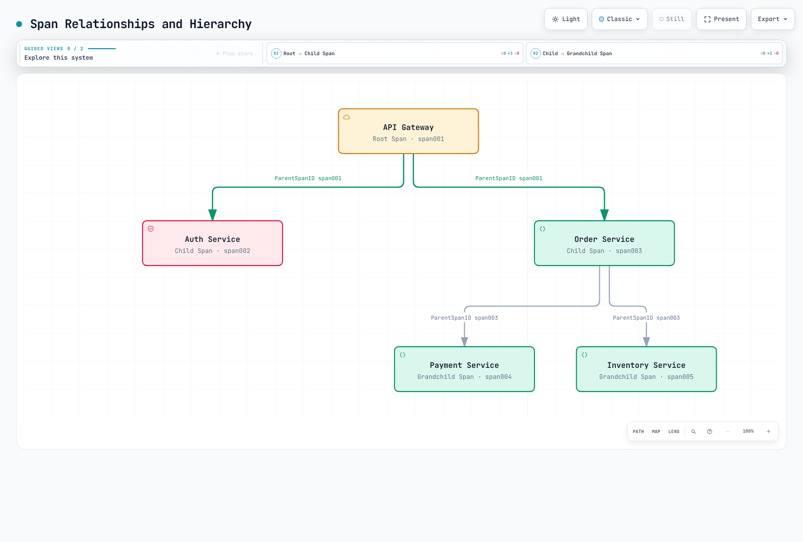
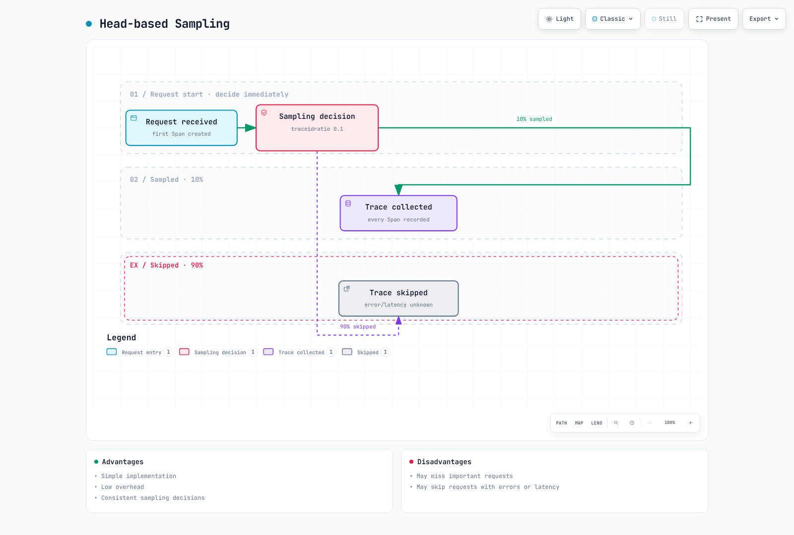
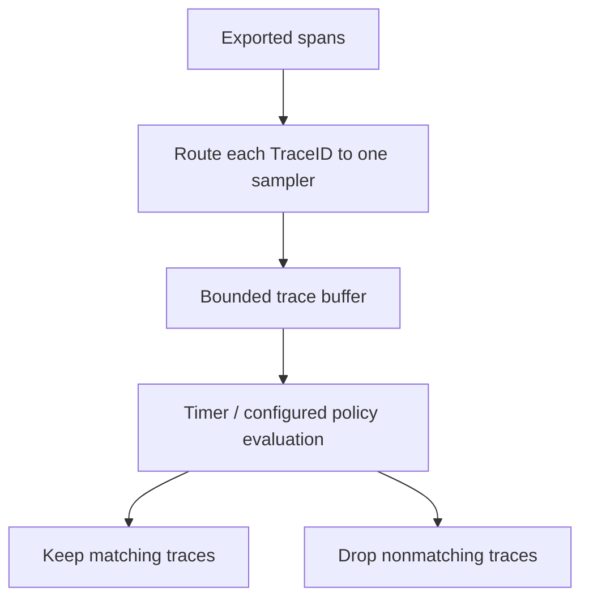

# Visión general del trazado distribuido

> **Última actualización**: September 13, 2026

## Introducción

El trazado distribuido (distributed tracing) registra operaciones instrumentadas a través de los límites entre procesos y las relaciona mediante el contexto propagado. Una traza almacenada es el **conjunto observado de spans**, no una prueba de que se capturaron todas las operaciones o solicitudes. La instrumentación, el muestreo, la exportación, el almacenamiento y la retención determinan qué es visible.

## La necesidad del trazado distribuido

### Limitaciones de la monitorización tradicional

Los logs y las métricas sin un contexto compartido pueden dificultar la reconstrucción de la ruta y los tiempos de una solicitud. Las trazas complementan esas señales al representar relaciones causales:

- ¿Qué servicios instrumentados participaron?
- ¿Qué operación fue lenta o falló?
- ¿Qué trabajo se solapó, esperó o se reintentó?
- ¿Qué logs adicionales y métricas de recursos respaldan el diagnóstico?


[Ver diagrama interactivo](https://www.atomai.click/kubernetes-docs/archmaps/en-observability-tracing-readme-0.html)

La figura ilustra por qué la correlación ayuda. No implica que unos logs correlacionados adecuadamente nunca puedan responder a estas preguntas, ni que una traza por sí sola demuestre la causa raíz.

## Conceptos fundamentales

### 1. Traza

Una traza agrupa spans que comparten un TraceID. Las relaciones padre-hijo describen el trabajo asociado causalmente a esa traza. La falta de instrumentación o la pérdida de datos pueden dejar huecos.

Considere esta **línea de tiempo ilustrativa**, en milisegundos relativos al inicio de la raíz:

| Span | Inicio | Fin | Duración |
|---|---:|---:|---:|
| Raíz del API gateway | 0 | 650 | 650 |
| User service | 20 | 70 | 50 |
| Order service | 100 | 600 | 500 |
| Payment service, hijo de Order | 250 | 550 | 300 |
| Notification service, hijo de Order | 500 | 600 | 100 |

La ventana observada es de 650 ms. Sumar todas las duraciones de los spans da 1.600 ms porque las duraciones de los padres incluyen el trabajo de los hijos y algunos hijos se solapan. No sume la duración inclusiva de un padre a la de sus descendientes para calcular una «ruta crítica». Analice los tiempos reales de inicio/fin y las dependencias, incluidos el trabajo asíncrono y la deriva de reloj.

### 2. Span

Un span describe una operación instrumentada:

| Campo | Significado | Ejemplo |
|---|---|---|
| TraceID | Identificador de la traza | `4bf92f3577b34da6a3ce929d0e0e4736` |
| SpanID | Identificador de este span | `00f067aa0ba902b7` |
| ParentSpanID | Identificador del span padre; ausente en una raíz | `b7ad6b7169203331` |
| Name | Nombre de operación de baja cardinalidad | `GET /api/users/{id}` |
| Inicio / fin | Marcas de tiempo; la duración se deriva de su diferencia | `2025-02-15T10:30:00Z` es una marca de tiempo ilustrativa |
| Attributes | Metadatos tipados | `http.response.status_code=200` |
| Events | Eventos con marca de tiempo asociados al span | Un evento de excepción registrado |
| Status | `UNSET`, `OK` o `ERROR` | Deje el estado del Span como UNSET para las solicitudes HTTP correctas, salvo que la instrumentación indique lo contrario |

OpenTelemetry usa **attributes** y **events**, en lugar de tratar los eventos de span como una copia de todos los logs de la aplicación. Los attributes/links iniciales pueden estar presentes en el momento de crear el span; después pueden llegar más events/attributes y actualizaciones de estado. La duración no se conoce cuando el span comienza. Registrar una excepción y establecer el estado de error son operaciones distintas de la API.

### 3. Relaciones y jerarquía de spans



[Ver diagrama interactivo](https://www.atomai.click/kubernetes-docs/archmaps/en-observability-tracing-readme-3.html)

`span001`–`span005` en el diagrama son **etiquetas simbólicas**, no SpanID válidos en formato de transmisión. Un span tiene como máximo un padre. Los **links** pueden asociar spans de la misma traza o de trazas distintas, lo que resulta útil para mensajería asíncrona, lotes y trabajo con múltiples entradas causales; esos enlaces no se muestran en este árbol simple.

### 4. SpanContext

SpanContext es información inmutable de identidad y propagación de la traza. Este YAML es una representación conceptual, no un archivo de configuración de SDK:

```yaml
SpanContext:
  trace_id: "4bf92f3577b34da6a3ce929d0e0e4736"
  span_id: "00f067aa0ba902b7"
  trace_flags: "01"
  trace_state: "vendor=value"
  is_remote: false
```

Los TraceID de OpenTelemetry tienen 16 bytes y se muestran como 32 caracteres hexadecimales en minúscula; los SpanID tienen 8 bytes y se muestran como 16. Un SpanContext válido tiene identificadores distintos de cero. `is_remote` distingue un padre remoto extraído de un span creado localmente. `01` activa el bit de muestreo; el indicador no prueba que el backend haya almacenado la traza.

Baggage es independiente de SpanContext y de `tracestate`. No coloque credenciales ni información personal en el contexto propagado, y no trate un identificador de traza suministrado por el llamante como autenticación.

## Propagación de contexto

La propagación transporta la identidad a través de los límites; por sí sola no instrumenta una operación ni exporta un span. Use el propagador del framework/SDK para inyectar y extraer cabeceras y para adjuntar/desasociar el contexto activo correctamente.

### W3C Trace Context (recomendado)

```http
traceparent: 00-4bf92f3577b34da6a3ce929d0e0e4736-00f067aa0ba902b7-01
tracestate: vendor=value
```

Para la versión `00`, los campos son:

```text
version(2 hex)-trace_id(32 hex)-parent_id(16 hex)-trace_flags(2 hex)
```

El `parent_id` transmitido es el **SpanID del span emisor**, que se usa como padre remoto cuando el receptor crea su hijo. No es el ParentSpanID propio del emisor. Las longitudes no válidas, los identificadores no hexadecimales y los identificadores compuestos solo por ceros no deben copiarse en los ejemplos; utilice las reglas de validación de la implementación en lugar de construir cabeceras a partir de cadenas arbitrarias.

### Propagación B3 (compatible con Zipkin)

B3 admite un TraceID de 64 o 128 bits y un SpanID de 64 bits. Estos dos ejemplos transportan el mismo contexto muestreado:

```http
b3: 4bf92f3577b34da6a3ce929d0e0e4736-00f067aa0ba902b7-1
```

```http
X-B3-TraceId: 4bf92f3577b34da6a3ce929d0e0e4736
X-B3-SpanId: 00f067aa0ba902b7
X-B3-Sampled: 1
```

El ParentSpanID opcional tiene sus propias reglas y se omite aquí. B3 también admite formas de solo muestreo y de depuración. Los nombres de las cabeceras HTTP no distinguen mayúsculas de minúsculas; otros transportes pueden requerir nombres normalizados. Si están presentes ambas formas de B3, la forma de cabecera única tiene prioridad según la especificación.

### Comparación de formatos de propagación

| Formato | Campos habituales | Consideración para la selección |
|---|---|---|
| W3C Trace Context | `traceparent`, `tracestate` | Interoperabilidad basada en estándares |
| B3 single | `b3` | Integraciones existentes con Zipkin/B3 |
| B3 multi | `X-B3-*` | Integraciones existentes y campos visibles por separado |
| Jaeger legacy | `uber-trace-id` | Compatibilidad heredada; verifique el propagador instalado |

Configure ambos extremos de forma coherente y pruebe los límites HTTP/gRPC y de mensajería. Evite propagadores simultáneos en competencia que extraigan padres distintos. Una cabecera estandarizada no garantiza que los proxies, las colas o las tareas asíncronas la preserven.

## Estrategias de muestreo

El muestreo puede reducir los datos retenidos y la sobrecarga. También cambia qué preguntas pueden responderse a partir de las trazas. Indique el punto de decisión, la probabilidad/política y el comportamiento ante datos ausentes.

### Muestreo en cabecera (head-based)



[Ver diagrama interactivo](https://www.atomai.click/kubernetes-docs/archmaps/en-observability-tracing-readme-4.html)

La división 10 %/90 % es una probabilidad configurada, no un recuento exacto para una ejecución pequeña. El diagrama supone que la instrumentación, la propagación y la entrega funcionan; «recopilado» no es una garantía incondicional de que todos los spans hijos estén disponibles.

Para un mecanismo de SDK/autoconfiguración que admita las variables de entorno estándar:

```bash
export OTEL_TRACES_SAMPLER=parentbased_traceidratio
export OTEL_TRACES_SAMPLER_ARG=0.1
```

ParentBased respeta la decisión del padre; la proporción se aplica a las raíces mediante su delegado configurado. Por tanto, un padre remoto muestreado puede producir una decisión de hijo muestreado incluso cuando la proporción de la raíz local es cero. Compruebe el soporte de configuración del SDK del lenguaje elegido. No presente un objeto YAML inventado `sampling: {type, ratio}` como configuración universal del SDK.

El muestreo en cabecera es relativamente sencillo, pero no puede conocer errores ni latencias futuras. Una solicitud no muestreada puede volverse importante más adelante, y el muestreo en cola no puede recrear spans que nunca se registraron ni se exportaron aguas arriba.

### Muestreo en cola (tail-based)

El muestreo en cola evalúa los datos de traza **recibidos** frente a unas políticas. No recibe una notificación infalible de que «todos los spans están completos».



Collector Contrib **0.160.0** admite este fragmento de procesador; intégrelo en un pipeline de trazas completo:

```yaml
processors:
  tail_sampling:
    decision_wait: 10s
    num_traces: 10000
    policies:
    - name: errors
      type: status_code
      status_code:
        status_codes:
        - ERROR
    - name: slow-requests
      type: latency
      latency:
        threshold_ms: 1000
    - name: probabilistic
      type: probabilistic
      probabilistic:
        sampling_percentage: 10
```

En la estrategia predeterminada `trace-complete`, la evaluación usa los spans acumulados en la ruta del temporizador. `decision_wait` comienza a partir de los datos de traza recibidos, no de una garantía de que la solicitud haya finalizado. El procesador actual también tiene una estrategia distinta, `span-ingest`; su compatibilidad de políticas y sus tiempos difieren.

La política de estado coincide con el estado de span observado `ERROR`, no con cualquier cadena de error de la aplicación. La política de latencia usa el inicio más temprano y el fin más tardío de la traza recibida. La política probabilística puede retener trazas elegibles adicionales, por lo que las trazas ordinarias no se descartan de forma universal.

Enrute todos los spans de un TraceID a la misma instancia del sampler. Tenga en cuenta las llegadas tardías, las cachés de decisión, los reinicios, los fallos de muestreo/exportación aguas arriba, los límites de recuento de trazas y de bytes, y el desalojo del búfer. `num_traces` no es un límite de memoria del proceso. Dimensione en función del tráfico y del tamaño de los spans, y observe las métricas de descarte, desalojo y spans tardíos. **El muestreo en cola no puede garantizar que no se pierda ninguna solicitud importante.**

### Comparación de estrategias de muestreo

| Estrategia | Información de la decisión | Compromiso |
|---|---|---|
| Cabecera | Información disponible al crear el span o en la decisión del padre | Menores necesidades de almacenamiento intermedio, pero pueden perderse resultados futuros |
| Cola | Spans recibidos y política/tiempos configurados | Más estado y requisitos de enrutamiento; siguen siendo posibles las trazas incompletas |
| Adaptativa | La política cambia según el tráfico observado o el presupuesto | Específica del producto/implementación; valide su lazo de control y sus límites |

No existe una clasificación universal de «precisión: media/alta». Evalúe si la población retenida responde a la pregunta diagnóstica o estadística prevista. Retener todas las trazas con error puede sesgar intencionadamente las proporciones de error.

## Correlación entre trazas, logs y métricas

### Vincular logs mediante el TraceID

Prefiera la instrumentación de logging soportada para su framework. Si usa MDC de SLF4J manualmente, restaure el contexto anterior incluso cuando la operación lance una excepción:

```java
import java.util.Map;
import org.slf4j.MDC;
import io.opentelemetry.api.trace.Span;
import io.opentelemetry.api.trace.SpanContext;

public final class TraceMdc {
    private TraceMdc() {}

    public static void run(Runnable operation) {
        Map<String, String> previous = MDC.getCopyOfContextMap();
        try {
            SpanContext context = Span.current().getSpanContext();
            if (context.isValid()) {
                MDC.put("traceId", context.getTraceId());
                MDC.put("spanId", context.getSpanId());
            } else {
                MDC.remove("traceId");
                MDC.remove("spanId");
            }
            operation.run();
        } finally {
            if (previous == null) {
                MDC.clear();
            } else {
                MDC.setContextMap(previous);
            }
        }
    }
}
```

Use `TraceMdc.run(() -> logger.info("Processing order"));` con las dependencias necesarias de OpenTelemetry/SLF4J y un backend de logging compatible. Configure el codificador/patrón para incluir `traceId` y `spanId`; colocar los valores en el MDC por sí solo no hace que aparezcan en la salida.

La comprobación de validez evita registrar identificadores compuestos solo por ceros procedentes de un contexto inactivo. El MDC es local al hilo; propagar el contexto de OpenTelemetry y el MDC al trabajo asíncrono requiere el mecanismo apropiado del framework. Este helper delimita el logging síncrono y no pretende resolver traspasos arbitrarios entre hilos.

### Vincular métricas mediante exemplars

Este es **texto de exposición de OpenMetrics**, no YAML. Un exemplar tiene etiquetas y un valor de observación; opcionalmente puede seguirle una marca de tiempo:

```text
# TYPE http_request_duration_seconds histogram
http_request_duration_seconds_bucket{le="0.5"} 1 # {trace_id="4bf92f3577b34da6a3ce929d0e0e4736"} 0.42
http_request_duration_seconds_bucket{le="+Inf"} 1
http_request_duration_seconds_sum 0.42
http_request_duration_seconds_count 1
# EOF
```

El exemplar es una observación representativa de 0,42 segundos en el bucket del histograma. No es una prueba de que esta solicitud fuera exactamente el límite p99. La preservación en el exportador/remote-write, el almacenamiento de exemplars en el backend y la vinculación del datasource de Grafana deben funcionar todos. El muestreo y la retención de trazas pueden dejar un exemplar cuya traza no esté disponible.

### Correlación en Grafana


[Ver diagrama interactivo](https://www.atomai.click/kubernetes-docs/archmaps/en-observability-tracing-readme-6.html)

El corto `abc123` de este diagrama más antiguo es una abreviatura, no un TraceID W3C válido. Use el identificador completo en los datos reales. Alinee `trace_id`/`traceId`/`traceID`, los UID de los datasources, el margen temporal y las asignaciones de etiquetas de recursos y logs. Verifique una solicitud real en todas las señales; los enlaces de navegación por sí solos no prueban una correlación correcta.

## Comparación de soluciones

### Comparación de soluciones de trazado distribuido

| Solución | Modelo / capacidades a evaluar | Consideraciones de despliegue y coste |
|---|---|---|
| [Tempo](https://github.com/grafana/tempo/tree/v3.0.3) | TraceQL e integración con Grafana | Cómputo, ingesta, almacenamiento, consultas, solicitudes y red; no «solo coste de almacenamiento» |
| [AWS X-Ray](https://docs.aws.amazon.com/xray/latest/devguide/aws-xray.html) | Trazado y filtrado de solicitudes gestionado por AWS | Ruta de instrumentación/OTel soportada, IAM, cuotas, retención y cargos por uso |
| [Jaeger](https://www.jaegertracing.io/docs/2.20/architecture/) | Consulta/UI y arquitectura configurable de collector/almacenamiento | Elija un almacenamiento soportado, la topología de ingesta y los procesadores del collector; no está limitado intrínsecamente al muestreo en cabecera |
| [Datadog APM](https://docs.datadoghq.com/tracing/) | APM, búsqueda y analítica gestionados | Asignación de agente/OTel, retención/indexación/muestreo y condiciones reales del plan |
| [Dynatrace](https://docs.dynatrace.com/docs/observe/application-observability/distributed-tracing) | Ingesta con OneAgent/OTel; capacidades de trazado de Grail/DQL | Modo de despliegue, permisos, retención, procesamiento y condiciones reales de consumo/plan |

El muestreo puede producirse en los SDK, en los collectors y en componentes específicos del backend. El «soporte nativo de OTel» no significa que cada atributo de señal, enlace de span, política de muestreo o límite de recursos sea idéntico en todos los productos. Las funciones asistidas por IA dependen de la plataforma circundante y del plan; no reduzca eso a una propiedad permanente de sí/no de un backend de almacenamiento.

### Guía de selección

Comience por la interoperabilidad, el flujo de investigación, la seguridad y residencia de los datos, la propiedad operativa y el volumen esperado. Prototipe la ruta real de ingesta/consulta y compare el coste operativo total con los mismos requisitos de retención y fiabilidad. Ni el código abierto ni una pila de Grafana existente garantizan el menor coste.

## Buenas prácticas

### 1. Estrategia de instrumentación

Instrumente los límites de servicio significativos —HTTP/gRPC, clientes de base de datos, mensajería y API externas— usando las bibliotecas soportadas. Añada spans internos, de caché o de archivos allí donde respondan a una pregunta diagnóstica concreta. Evite crear automáticamente un span para cada función diminuta o exponer cuerpos de solicitud/consulta sensibles.

Planifique la propagación de contexto, los tipos de span, el comportamiento del estado de error y los enlaces asíncronos junto con la exportación. La cobertura de la instrumentación y la decisión de muestreo son controles independientes.

### 2. Convenciones de nomenclatura de spans

Use nombres de baja cardinalidad basados en la convención semántica seleccionada:

```text
GET /api/users/{id}
SELECT users
GET
send orders
```

El nombre `GET` al estilo de Redis no debe incorporar una clave real como `user:123`. Almacene contexto adecuado y no sensible en los attributes. Evite identificadores aleatorios, valores SQL literales y URL completas en los nombres de span.

### 3. Estandarización de etiquetas

Para conocer las convenciones actuales, inspeccione el esquema emitido por el SDK y su modo de migración:

```yaml
attributes:
  http.request.method: GET
  http.response.status_code: 200
  http.route: /api/users/{id}
  db.system.name: postgresql
  db.operation.name: SELECT
resource:
  service.name: user-service
  service.version: 1.2.3
```

Esto describe atributos de ejemplo, no una configuración universal de instrumentación. Los datos más antiguos pueden usar `http.method`, `http.status_code`, `db.system`, `db.operation` o `db.statement`. Renombrar una consulta no transforma esos datos. Capture `db.query.text` solo bajo una política de saneamiento revisada; prefiera resúmenes útiles que no expongan literales ni credenciales.

## Próximos pasos

- [Grafana Tempo](./01-tempo.md)
- [AWS X-Ray](./02-xray.md)
- [OpenTelemetry](./03-opentelemetry.md)
- [Dynatrace](./04-dynatrace.md)

## Referencias y alcance de la validación

- [W3C Trace Context](https://www.w3.org/TR/trace-context/)
- [B3 propagation](https://github.com/openzipkin/b3-propagation)
- [OpenTelemetry Trace API](https://opentelemetry.io/docs/specs/otel/trace/api/)
- [Variables de entorno del SDK](https://opentelemetry.io/docs/specs/otel/configuration/sdk-environment-variables/)
- [Muestreo en cola en Collector 0.160](https://github.com/open-telemetry/opentelemetry-collector-contrib/blob/v0.160.0/processor/tailsamplingprocessor/README.md)
- [Especificación de OpenMetrics](https://github.com/prometheus/OpenMetrics/blob/main/specification/OpenMetrics.md)
- [API MDC de SLF4J](https://www.slf4j.org/apidocs/org/slf4j/MDC.html)
- [Convenciones semánticas de HTTP](https://opentelemetry.io/docs/specs/semconv/http/http-spans/)
- [Convenciones semánticas de bases de datos](https://opentelemetry.io/docs/specs/semconv/db/database-spans/)

Las comprobaciones nativas usaron la API/SDK/B3 de OpenTelemetry Python 1.44.0, el parser de OpenMetrics de prometheus-client y Collector Contrib 0.160.0 con datos locales sintéticos. El código Java de MDC se verificó frente a la API y la semántica del lenguaje, sin ejecución en un runtime de Java. No se probó ninguna aplicación distribuida real, backend de proveedor, clúster con afinidad de trazas, benchmark de rendimiento ni despliegue en la nube.

## Cuestionario

- [Cuestionario de Tempo](../../quizzes/observability/tracing/01-tempo-quiz.md)
- [Cuestionario de X-Ray](../../quizzes/observability/tracing/02-xray-quiz.md)
- [Cuestionario de OpenTelemetry](../../quizzes/observability/tracing/03-opentelemetry-quiz.md)
- [Cuestionario de Dynatrace](../../quizzes/observability/tracing/04-dynatrace-quiz.md)
