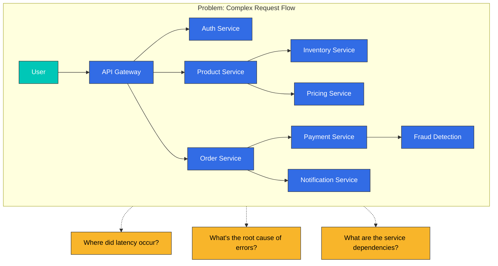
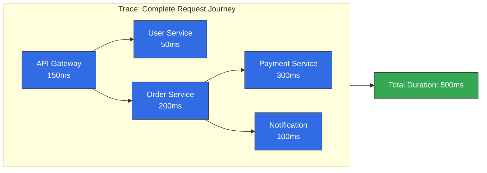
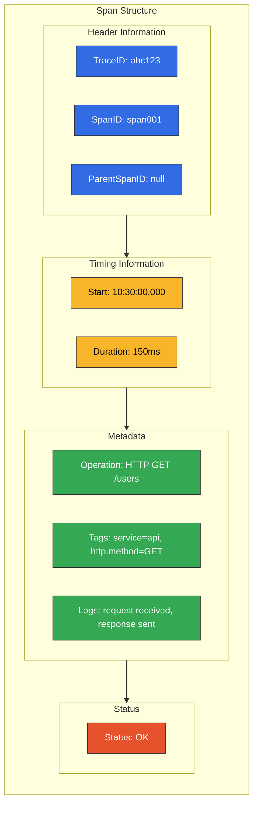
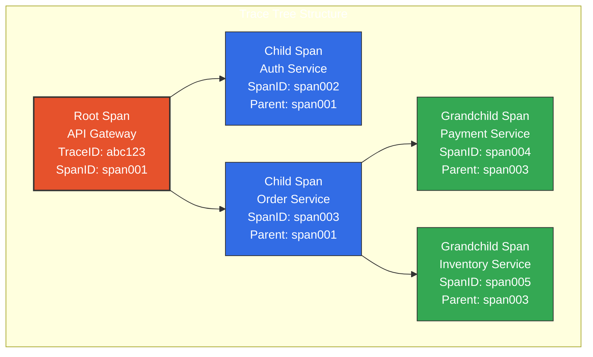
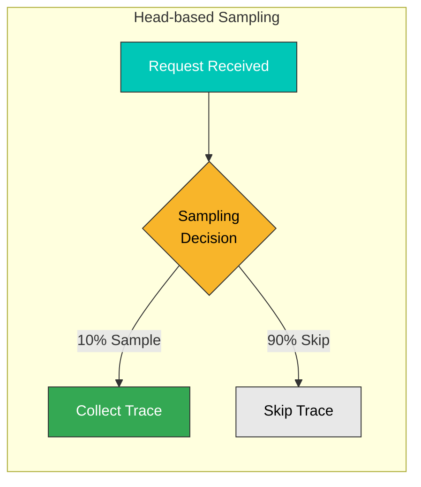
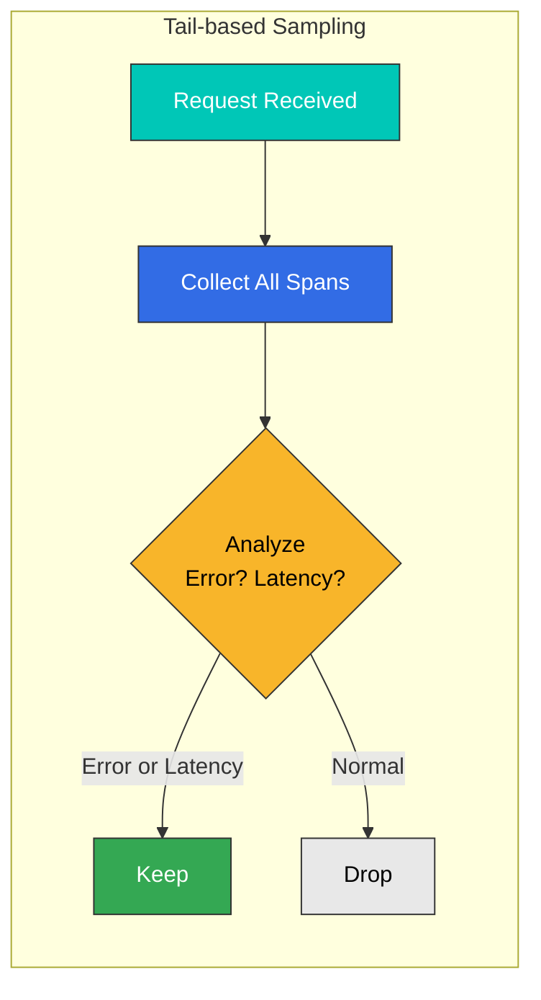
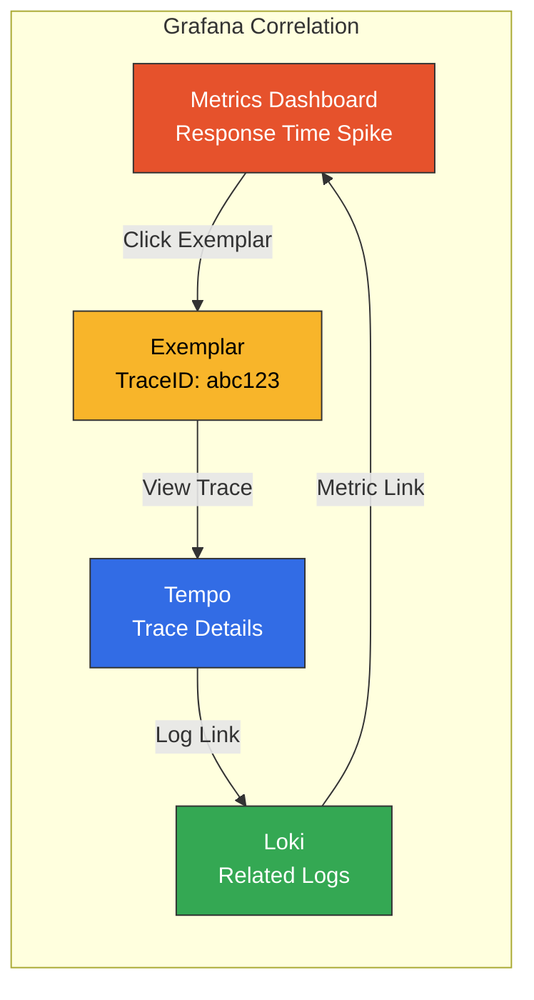
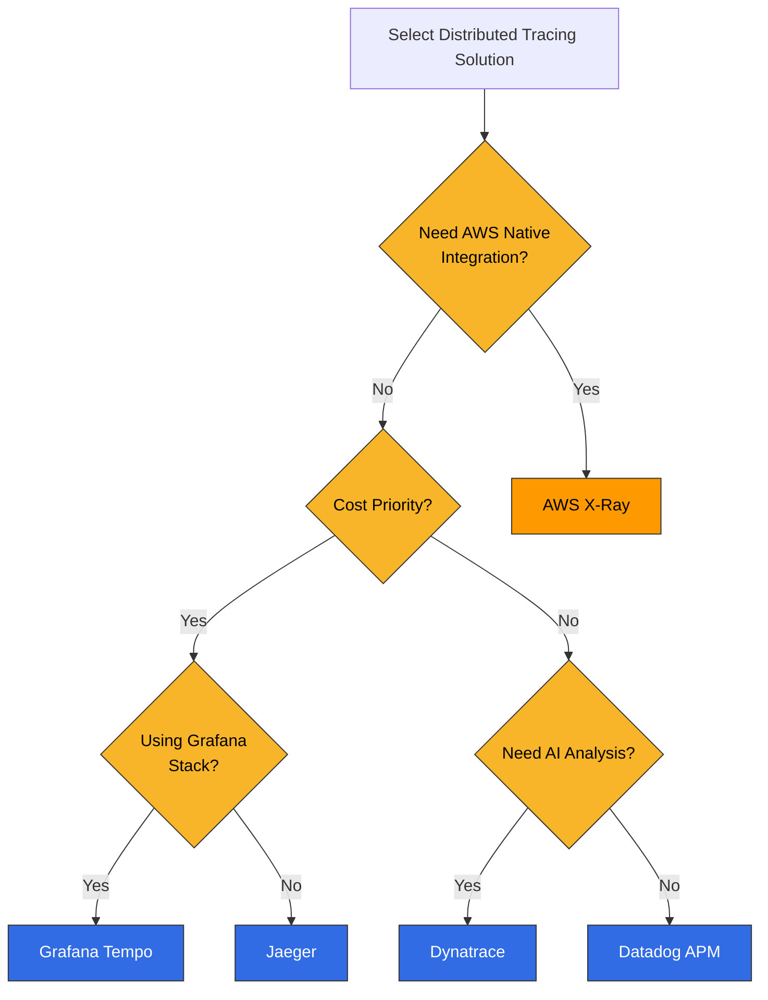

# Descripción general de Distributed Tracing

> **Última actualización**: February 20, 2026

## Introducción

Distributed Tracing es una técnica para rastrear la ruta completa de las solicitudes a medida que atraviesan múltiples servicios en arquitecturas de microservicios. En los sistemas modernos, donde una sola solicitud puede pasar por decenas de servicios, Distributed Tracing es esencial para identificar cuellos de botella de rendimiento y solucionar problemas.

## La necesidad de Distributed Tracing

### Limitaciones del monitoreo tradicional

En entornos de microservicios, el logging y las métricas tradicionales por sí solos no pueden responder estas preguntas:

- ¿Por qué servicios pasó la solicitud?
- ¿Cuánto tiempo tardó cada servicio?
- ¿Dónde ocurrieron los errores?
- ¿Cuáles son las dependencias entre los servicios?



## Conceptos principales

### 1. Trace

Un Trace representa el recorrido completo de una única solicitud. Es la colección de todas las operaciones generadas a medida que una solicitud pasa por el sistema.



### 2. Span

Un Span representa una única unidad de trabajo. Cada Span contiene la siguiente información:

| Campo | Descripción | Ejemplo |
|-------|-------------|---------|
| **TraceID** | Identificador único para todo el trace | `abc123def456` |
| **SpanID** | Identificador único para el Span individual | `span789` |
| **ParentSpanID** | Identificador del Span padre | `span456` |
| **Operation Name** | Nombre de la operación | `HTTP GET /api/users` |
| **Start Time** | Marca de tiempo de inicio | `2025-02-15T10:30:00Z` |
| **Duration** | Tiempo empleado | `150ms` |
| **Tags** | Metadatos | `http.status_code=200` |
| **Logs** | Registros de eventos | `error: connection timeout` |



### 3. Relaciones y jerarquía de Span

Los Spans forman relaciones padre-hijo que crean una estructura de árbol:



### 4. SpanContext

SpanContext es la información de trace que se propaga entre servicios:

```yaml
# SpanContext Components
SpanContext:
  trace_id: "abc123def456789"      # Trace identifier
  span_id: "span789"               # Current Span identifier
  trace_flags: "01"                # Sampling flag
  trace_state: "vendor=value"      # Vendor-specific additional info
```

## Propagación de contexto

El método para transmitir el contexto de trace entre servicios.

### W3C Trace Context (recomendado)

Propagación mediante headers estándar de W3C:

```http
# HTTP Request Headers
traceparent: 00-abc123def456789012345678901234-span12345678-01
tracestate: rojo=00f067aa0ba902b7,congo=t61rcWkgMzE
```

**formato de traceparent:**
```
version-trace_id-parent_id-trace_flags
00     -abc123...-span1234...-01
```

### Propagación B3 (compatible con Zipkin)

Formato de propagación utilizado por Zipkin:

```http
# Single header format
b3: abc123def456789-span12345678-1-parent12345678

# Multi-header format
X-B3-TraceId: abc123def456789
X-B3-SpanId: span12345678
X-B3-ParentSpanId: parent12345678
X-B3-Sampled: 1
```

### Comparación de formatos de propagación

| Formato | Headers | Ventajas | Desventajas |
|--------|---------|------------|---------------|
| **W3C Trace Context** | `traceparent`, `tracestate` | Estándar, extensible | Relativamente nuevo |
| **B3 Single** | `b3` | Simple, un solo header | Específico de Zipkin |
| **B3 Multi** | `X-B3-*` | Depuración sencilla | Muchos headers |
| **Jaeger** | `uber-trace-id` | Optimizado para Jaeger | Dependencia del proveedor |

## Estrategias de sampling

Rastrear todas las solicitudes genera problemas de costo y rendimiento. El sampling los gestiona.

### Head-based Sampling

Decisión de sampling al inicio de la solicitud:



**Ventajas:**
- Implementación sencilla
- Baja sobrecarga
- Decisiones de sampling coherentes

**Desventajas:**
- Puede omitir solicitudes importantes
- Puede omitir solicitudes con errores o latencia

**Ejemplo de configuración:**
```yaml
# OpenTelemetry SDK Configuration
sampling:
  type: parentbased_traceidratio
  ratio: 0.1  # 10% sampling
```

### Tail-based Sampling

Decisión de sampling tras la finalización de la solicitud, basada en los resultados:



**Ventajas:**
- Nunca omite solicitudes importantes (errores, latencia)
- Sampling más inteligente
- Rentable

**Desventajas:**
- Implementación compleja
- Mayor uso de memoria
- Debe almacenar temporalmente todos los Spans

**Configuración de Tail Sampling de OTEL Collector:**
```yaml
processors:
  tail_sampling:
    decision_wait: 10s
    num_traces: 100000
    policies:
      # Collect all error requests
      - name: errors
        type: status_code
        status_code:
          status_codes: [ERROR]
      # Collect slow requests
      - name: slow-requests
        type: latency
        latency:
          threshold_ms: 1000
      # 10% sampling for the rest
      - name: probabilistic
        type: probabilistic
        probabilistic:
          sampling_percentage: 10
```

### Comparación de estrategias de sampling

| Estrategia | Punto de decisión | Uso de recursos | Precisión | Caso de uso |
|----------|---------------|----------------|----------|----------|
| **Head-based** | Inicio de la solicitud | Bajo | Media | La mayoría de los casos |
| **Tail-based** | Finalización de la solicitud | Alto | Alta | Enfocado en errores/latencia |
| **Adaptive** | Dinámico | Medio | Alta | Alta variabilidad de tráfico |

## Correlación entre Trace, log y métrica

### Vinculación de logs mediante TraceID

```java
// Java logging example (SLF4J + MDC)
import org.slf4j.MDC;
import io.opentelemetry.api.trace.Span;

public void processOrder(Order order) {
    Span span = Span.current();
    MDC.put("traceId", span.getSpanContext().getTraceId());
    MDC.put("spanId", span.getSpanContext().getSpanId());

    logger.info("Processing order: {}", order.getId());
    // Log output: {"traceId": "abc123", "spanId": "span456", "message": "Processing order: 12345"}
}
```

### Vinculación de métricas mediante Exemplars

```yaml
# Linking TraceID to Prometheus metrics
http_request_duration_seconds_bucket{le="0.5"} 1000 # {traceID="abc123"}
http_request_duration_seconds_bucket{le="1.0"} 1500 # {traceID="def456"}
```

### Correlación en Grafana



## Comparación de soluciones

### Comparación de soluciones de Distributed Tracing

| Característica | Tempo | X-Ray | Jaeger | Datadog APM | Dynatrace |
|---------|-------|-------|--------|-------------|-----------|
| **Tipo** | Open Source | Administrado por AWS | Open Source | SaaS comercial | SaaS comercial |
| **Almacenamiento** | Object Storage | Interno de AWS | Cassandra/ES | Datadog | Dynatrace |
| **Lenguaje de consulta** | TraceQL | Expresiones de filtro | - | - | DQL |
| **Sampling** | Head/Tail | Basado en reglas | Head | Dinámico | Dinámico |
| **Compatibilidad con OTEL** | Nativa | Nativa | Nativa | Nativa | Nativa |
| **Mapa de servicios** | Integración con Grafana | Integrado | Integrado | Integrado | Integrado |
| **Análisis de AI** | Ninguno | Ninguno | Ninguno | Watchdog | Davis AI |
| **Costo** | Solo costo de almacenamiento | Basado en el uso | Costo de infraestructura | Basado en host/span | Basado en host |
| **Integración con EKS** | Configuración manual | Nativa | Configuración manual | Despliegue de Agent | OneAgent |

### Guía de selección



## Mejores prácticas

### 1. Estrategia de instrumentación

```yaml
# Recommended instrumentation scope
instrumentation:
  # Always instrument
  always:
    - HTTP requests/responses
    - gRPC calls
    - Database queries
    - Message queue operations
    - External API calls

  # Optional instrumentation
  optional:
    - Internal function calls
    - Cache operations
    - File I/O
```

### 2. Convenciones de nomenclatura de Span

```yaml
# Good examples
- "HTTP GET /api/users/{id}"
- "PostgreSQL SELECT users"
- "Redis GET user:123"
- "Kafka SEND orders"

# Bad examples
- "http call"
- "db query"
- "process"
- "span1"
```

### 3. Estandarización de tags

```yaml
# OpenTelemetry Semantic Conventions
tags:
  # HTTP
  http.method: GET
  http.url: https://api.example.com/users
  http.status_code: 200

  # Database
  db.system: postgresql
  db.statement: SELECT * FROM users
  db.operation: SELECT

  # Service
  service.name: user-service
  service.version: 1.2.3
```

## Próximos pasos

Una vez que comprenda los conceptos de Distributed Tracing, aprenda el uso de herramientas específicas en las siguientes secciones:

- [Grafana Tempo](./01-tempo.md): backend de Distributed Tracing del stack de Grafana
- [AWS X-Ray](./02-xray.md): Distributed Tracing nativo de AWS
- [OpenTelemetry](./03-opentelemetry.md): framework de instrumentación estandarizado
- [Dynatrace](./04-dynatrace.md): solución de APM impulsada por AI

## Cuestionario

Evalúe sus conocimientos con los cuestionarios específicos de cada herramienta:
- [Cuestionario de Tempo](../../quizzes/observability/tracing/01-tempo-quiz.md)
- [Cuestionario de X-Ray](../../quizzes/observability/tracing/02-xray-quiz.md)
- [Cuestionario de OpenTelemetry](../../quizzes/observability/tracing/03-opentelemetry-quiz.md)
- [Cuestionario de Dynatrace](../../quizzes/observability/tracing/04-dynatrace-quiz.md)
