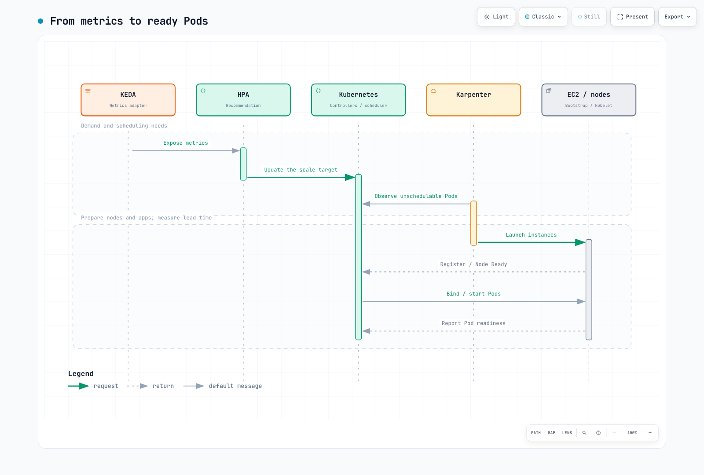

# Manual de planificación de capacidad para eventos

> **Última actualización**: 12 de septiembre de 2026, con KEDA 2.20.2 y Karpenter AWS provider autogestionado 1.14.1.
> Las cifras se calculan a partir de supuestos declarados, no son benchmarks de producción.

Los PM/planificadores proporcionan demanda, calendario y objetivos de latencia y fallos. Operaciones valida rendimiento de aplicación, nodos, base de datos, red y colas, cuotas y tiempo de preparación. El tipo de evento no garantiza multiplicadores de tráfico ni un calentamiento fijo. Use límites de tasa, salas de espera y contrapresión cuando sea necesario; escalar no es el único control de sobrecarga.

## 1. Entradas y unidades

| Entrada | Qué verificar |
|---|---|
| RPM/RPS pico | Unidades, comportamiento del usuario, aciertos de caché, amplificación por reintentos y demanda por API |
| Rendimiento por Pod | Capacidad SLO medida con entradas, requests y concurrencia representativos |
| Capacidad de nodo | Allocatable real menos DaemonSets; restricciones CPU, memoria y plazas Pod |
| Objetivo ante fallos | Definir tráfico objetivo durante pérdida de Pod/nodo/AZ |
| Tiempo | Zona IANA, offset UTC explícito e intervalos reales de actividad de nodos/reservas |
| Coste | Fecha del precio, región, SO, tenancy, reservas sin usar y otros servicios/impuestos |

La calculadora verifica redondeo, unidades, doble cómputo de reservas y pérdida de AZ. Supone un perfil Pod uniforme; agregue otras cargas y valide topología, volúmenes y puertos por separado. Añadir 30% de capacidad difiere de dejar 30% sin usar. La prueba de pérdida de AZ cubre el pico base, no demanda adicional simultánea.

`scenario.json`

```json
{
  "description": "Illustrative inputs; replace throughput and allocatable values with measured evidence.",
  "peak_rpm": 600000,
  "pod_rpm_at_slo": 3000,
  "extra_capacity_fraction": "0.30",
  "pod_cpu_milli": 1500,
  "pod_memory_mib": 2048,
  "allocatable_cpu_milli": 15500,
  "daemon_cpu_milli": 500,
  "allocatable_memory_mib": 29696,
  "daemon_memory_mib": 1024,
  "max_pods": 58,
  "daemon_pods": 7,
  "nodes_by_az": {"az-a": 15, "az-b": 11},
  "reserved_nodes_by_az": {"az-a": 15, "az-b": 11},
  "node_start": "2026-11-27T11:00:00+09:00",
  "node_end": "2026-11-27T15:00:00+09:00",
  "reservation_start": "2026-11-27T11:00:00+09:00",
  "reservation_end": "2026-11-27T15:00:00+09:00",
  "usd_per_instance_hour": "0.768",
  "price_region": "ap-northeast-2",
  "price_instance_type": "c5.4xlarge",
  "price_observed_date": "2026-09-12",
  "hpa_max_replicas": 300,
  "node_budget": 40,
  "require_one_az_loss": true,
  "other_services_budget_usd": null
}
```

```python
# capacity.py
"""Deterministic planning arithmetic, not a benchmark or AWS provisioning tool."""
import argparse
import json
from datetime import datetime, timezone
from decimal import Decimal, ROUND_CEILING, ROUND_HALF_UP


def number(value, name, minimum=Decimal(0), positive=False):
    if isinstance(value, bool):
        raise ValueError(f"{name}: boolean is not a number")
    result = Decimal(str(value))
    if not result.is_finite() or result < minimum or (positive and result == minimum):
        raise ValueError(f"{name}: invalid finite range")
    return result


def integer(value, name, positive=False):
    result = number(value, name, positive=positive)
    if result != result.to_integral_value():
        raise ValueError(f"{name}: integer required")
    return int(result)


def instant(value):
    result = datetime.fromisoformat(value.replace("Z", "+00:00"))
    if result.tzinfo is None or result.utcoffset() is None:
        raise ValueError("Use timestamps with an explicit UTC offset")
    return result.astimezone(timezone.utc)


def seconds_between(start, end):
    delta = end-start
    return Decimal(delta.days*86400 + delta.seconds) + Decimal(delta.microseconds)/Decimal(1_000_000)


def hours(start, end):
    seconds = seconds_between(start,end)
    if seconds < 60:
        raise ValueError("Planning intervals must be at least 60 seconds")
    return seconds/Decimal(3600)


def ceiling(value):
    return int(value.to_integral_value(rounding=ROUND_CEILING))


def calculate(config):
    if type(config.get("require_one_az_loss",False)) is not bool:
        raise ValueError("require_one_az_loss must be a boolean")
    demand = number(config["peak_rpm"], "peak_rpm", positive=True)
    pod_rate = number(config["pod_rpm_at_slo"], "pod_rpm_at_slo", positive=True)
    margin = number(config["extra_capacity_fraction"], "extra_capacity_fraction")
    pod_cpu = number(config["pod_cpu_milli"], "pod_cpu_milli", positive=True)
    pod_mem = number(config["pod_memory_mib"], "pod_memory_mib", positive=True)
    cpu = number(config["allocatable_cpu_milli"], "allocatable_cpu_milli", positive=True) - number(config["daemon_cpu_milli"], "daemon_cpu_milli")
    memory = number(config["allocatable_memory_mib"], "allocatable_memory_mib", positive=True) - number(config["daemon_memory_mib"], "daemon_memory_mib")
    slots = integer(config["max_pods"], "max_pods", positive=True) - integer(config["daemon_pods"], "daemon_pods")
    if cpu <= 0 or memory <= 0 or slots <= 0:
        raise ValueError("No allocatable application capacity after DaemonSet overhead")
    per_node = min(int(cpu//pod_cpu), int(memory//pod_mem), slots)
    if per_node < 1:
        raise ValueError("The workload cannot fit this node profile")
    base_pods = ceiling(demand/pod_rate)
    planned_pods = ceiling(demand*(Decimal(1)+margin)/pod_rate)
    needed_nodes = ceiling(Decimal(planned_pods)/Decimal(per_node))
    placements = {zone:integer(count, "nodes_by_az") for zone,count in config["nodes_by_az"].items()}
    reservations = {zone:integer(count, "reserved_nodes_by_az") for zone,count in config["reserved_nodes_by_az"].items()}
    if not placements or sum(placements.values()) < 1:
        raise ValueError("Provide at least one planned node")
    nodes = sum(placements.values())
    survivors = nodes-max(placements.values())
    surviving_rpm = Decimal(survivors*per_node)*pod_rate
    start, end = instant(config["node_start"]), instant(config["node_end"])
    reserve_start, reserve_end = instant(config["reservation_start"]), instant(config["reservation_end"])
    node_hours = hours(start,end)
    reservation_hours = hours(reserve_start,reserve_end)
    overlap_start, overlap_end = max(start,reserve_start), min(end,reserve_end)
    overlap = (seconds_between(overlap_start,overlap_end)/Decimal(3600)
               if overlap_end > overlap_start else Decimal(0))
    price = number(config["usd_per_instance_hour"], "usd_per_instance_hour", positive=True)
    # Pay for running instances and unused reserved slots, without double-counting
    # a matching instance occupying a reservation. Assume one instance profile/type.
    running_cost = Decimal(nodes)*node_hours*price
    unused_cost = Decimal(0)
    for zone,reserved in reservations.items():
        used = min(reserved,placements.get(zone,0))
        unused_slot_hours = Decimal(reserved)*reservation_hours-Decimal(used)*overlap
        unused_cost += unused_slot_hours*price
    compute_cost = running_cost+unused_cost
    other = config.get("other_services_budget_usd")
    total = None if other is None else compute_cost+number(other,"other_services_budget_usd")
    findings = []
    if nodes < needed_nodes:
        findings.append("Planned nodes do not satisfy the capacity target")
    if planned_pods > integer(config["hpa_max_replicas"],"hpa_max_replicas",positive=True):
        findings.append("Planned Pod target exceeds the approved HPA maximum")
    if nodes > integer(config["node_budget"],"node_budget",positive=True):
        findings.append("Planned nodes exceed the approved node budget")
    if config.get("require_one_az_loss") and surviving_rpm < demand:
        findings.append("Losing the largest AZ leaves less than the baseline peak demand capacity")
    money = lambda value: format(value.quantize(Decimal("0.01"),rounding=ROUND_HALF_UP),"f")
    return {
        "base_pods":base_pods, "planned_pods_with_extra_capacity":planned_pods,
        "pods_per_node_from_inputs":per_node, "minimum_nodes_for_capacity":needed_nodes,
        "planned_nodes":nodes, "surviving_nodes_after_largest_az_loss":survivors,
        "surviving_rpm":str(surviving_rpm), "node_hours_per_instance":str(node_hours),
        "reservation_hours_per_slot":str(reservation_hours),
        "running_instances_usd":money(running_cost), "unused_reservations_usd":money(unused_cost),
        "ec2_compute_subtotal_usd":money(compute_cost),
        "total_budget_estimate_usd":None if total is None else money(total),
        "findings":findings,
        "assumptions":[
            "Input throughput/allocatable values require workload-specific measurement.",
            "Extra capacity is added once; it is not the same as leaving that fraction unused.",
            "Constant node counts over the interval; matching reservations consumed first within each AZ.",
            "All instances/reservations have the same type/platform/tenancy and supplied hourly rate.",
            "Current public pricing is an estimate for a future event, not a guaranteed charge.",
            "EC2 subtotal excludes EBS, EKS/Auto Mode, networking, load balancers, databases, telemetry and tax.",
            "Capacity and AZ arithmetic do not prove scheduling, recovery or application SLO."
        ]
    }


if __name__ == "__main__":
    parser = argparse.ArgumentParser()
    parser.add_argument("input")
    args = parser.parse_args()
    try:
        with open(args.input,encoding="utf-8") as stream:
            result = calculate(json.load(stream))
    except (ValueError, KeyError, ArithmeticError) as error:
        parser.error(str(error))
    print(json.dumps(result,indent=2))
```

```bash
python3 capacity.py scenario.json
```

El ejemplo calcula 200 Pods base, 260 con capacidad adicional y al menos 26 nodos. Sin embargo, perder la AZ mayor de las de 15/11 nodos deja 11 y 330,000 RPM, por debajo del pico base de 600,000 RPM. No apruebe ignorando hallazgos. Otro cálculo con diez nodos en cada una de tres AZ cubre el pico base con el mismo perfil, pero sigue necesitando pruebas de ubicación y recuperación.

Distinga instancias que consumen reservas de plazas sin usar. Coincidir en hardware no asocia automáticamente una instancia existente a una reserva targeted. Verifique CapacityReservationId y cantidades disponibles reales; el supuesto de consumo de la calculadora necesita validación. Costes desconocidos de otros servicios mantienen el presupuesto total en null. El subtotal EC2 no es el coste completo del evento.

### Evidencia de precios

El 2026-09-12, AWS Price List API devolvió estos precios horarios On-Demand de Seúl para Linux/tenancy compartida sin software preinstalado. Excluyen descuentos contractuales, Spot e impuestos.

| Tipo | vCPU | Memoria | USD/hora |
|---|---:|---:|---:|
| c5.2xlarge | 8 | 16 GiB | 0.384 |
| c5.4xlarge | 16 | 32 GiB | 0.768 |
| c6i.4xlarge | 16 | 32 GiB | 0.768 |
| m5.4xlarge | 16 | 64 GiB | 0.944 |

El subtotal ilustrativo de 26 nodos c5.4xlarge durante cuatro horas es $79.87. La estimación original $70.72 usaba una tarifa incorrecta de Seúl de $0.68/hora. Si esas reservas se activan treinta días antes que los nodos, el subtotal con plazas sin usar es $14,456.83. Son cálculos, no facturas reales. Revise precio y activación antes del evento. Incluya EBS, EKS/Auto Mode, LB, NAT/transferencia, bases de datos, telemetría y la distinción entre costes base e incrementales.

## 2. Responsabilidades y requisitos

Los ejemplos EC2NodeClass/NodePool usan Karpenter autogestionado. Auto Mode usa NodeClass eks.amazonaws.com; no copie el mismo YAML. Su NodeClass actual también admite capacityReservationSelectorTerms, así que no asuma que no soporta reservas. Revise por separado selector, permisos y alcance del servicio.

Consulte el [capítulo de escalado](./06-scaling-strategies.md) para instalación base e IRSA del operador. Prepare Deployments, namespace ecommerce, Prometheus y contrato de métricas. Esta autenticación usa la identidad del operador; no crea un rol IAM.

```yaml
# trigger-auth.yaml
apiVersion: keda.sh/v1alpha1
kind: TriggerAuthentication
metadata:
  name: event-aws
  namespace: ecommerce
spec:
  podIdentity:
    provider: aws
    identityOwner: keda
```

`operator-read-policy.json`

```json
{
  "Version": "2012-10-17",
  "Statement": [
    {
      "Effect": "Allow",
      "Action": ["sqs:GetQueueAttributes"],
      "Resource": "arn:aws:sqs:ap-northeast-2:123456789012:order-processing"
    },
    {
      "Effect": "Allow",
      "Action": ["cloudwatch:GetMetricData"],
      "Resource": "*",
      "Condition": {
        "StringEquals": {
          "aws:RequestedRegion": "ap-northeast-2"
        }
      }
    }
  ]
}
```

Sustituya cuenta/ARN de cola y adjunte permisos de lectura al rol del operador. CloudWatch GetMetricData usa una condición de región solicitada, no ámbito por recurso. La política no concede ReceiveMessage/DeleteMessage al worker. En instalaciones compartidas, controle además quién crea ScaledObjects y TriggerAuthentications.

## 3. KEDA: un propietario por carga

No adjunte varios ScaledObjects/HPA a un Deployment. Los ejemplos se dirigen a tres cargas distintas: order-api, order-worker y frontend. Mantenga el autoscaling base por métricas y elimine/actualice el Cron del evento después.

No escale una API solo por pedidos completados: su número puede estancarse o bajar bajo saturación, sugiriendo erróneamente reducir réplicas. Relacione solicitudes entrantes, backlog y espera con capacidad real. Se supone un contador de aplicación http_requests_total y etiquetas de scrape namespace/service. No asuma que los exporters NGINX estándar aportan métricas de rutas/vistas de página. Este Prometheus es por clúster; añada alcance de clúster para un backend compartido.

```yaml
# prometheus-rule.yaml
apiVersion: monitoring.coreos.com/v1
kind: PrometheusRule
metadata:
  name: event-demand
  namespace: observability
  labels:
    release: prometheus
spec:
  groups:
  - name: event-demand
    rules:
    - record: event:incoming_requests_per_minute:rate1m
      expr: sum by (namespace, service) (rate(http_requests_total{namespace="ecommerce",service="order-api"}[1m]))
        * 60
    - record: event:order_api_error_ratio:rate5m
      expr: (sum by (namespace, service) (rate(http_requests_total{namespace="ecommerce",service="order-api",status=~"5.."}[5m]))
        or 0 * sum by (namespace, service) (rate(http_requests_total{namespace="ecommerce",service="order-api"}[5m])))
        / (sum by (namespace, service) (rate(http_requests_total{namespace="ecommerce",service="order-api"}[5m]))
        > 0)
```

```yaml
# order-api-scaledobject.yaml
apiVersion: keda.sh/v1alpha1
kind: ScaledObject
metadata:
  name: order-api
  namespace: ecommerce
  labels:
    event: flash-sale-2026-11
spec:
  scaleTargetRef:
    name: order-api
  minReplicaCount: 5
  maxReplicaCount: 300
  pollingInterval: 15
  advanced:
    horizontalPodAutoscalerConfig:
      behavior:
        scaleUp:
          stabilizationWindowSeconds: 0
          policies:
          - type: Percent
            value: 100
            periodSeconds: 15
        scaleDown:
          stabilizationWindowSeconds: 600
          policies:
          - type: Percent
            value: 10
            periodSeconds: 120
  triggers:
  - type: cron
    metricType: AverageValue
    metadata:
      timezone: Asia/Seoul
      start: 0 11 27 11 *
      end: 0 15 27 11 *
      desiredReplicas: '260'
  - type: prometheus
    metricType: AverageValue
    metadata:
      serverAddress: http://prometheus-kube-prometheus-prometheus.observability.svc:9090
      query: event:incoming_requests_per_minute:rate1m{namespace="ecommerce",service="order-api"}
      threshold: '3000'
      ignoreNullValues: 'false'
```

El umbral 3,000 son solicitudes por Pod y minuto, coincidiendo con las unidades ilustrativas. Sustitúyalo por evidencia de carga. La consulta debe devolver un valor. ignoreNullValues=false evita ocultar observaciones ausentes como demanda cero. Pruebe errores/datos ausentes del HPA y respuesta manual fuera de producción.

Cron usa cinco campos Linux, sin año. Dejar instalado el ejemplo del 27 de noviembre lo repite el año siguiente. Retire de Git la configuración tras un evento único. Las zonas IANA siguen el horario de verano: Nueva York en mayo es EDT, no EST. Pruebe límites, ventanas superpuestas y horas ambiguas.

HPA combina recomendaciones por métrica tomando el máximo y después aplica mínimos/máximos y restricciones de comportamiento. Cron aporta un suelo de demanda, no garantiza Pods Ready. El techo procede de maxReplicaCount y otros límites, no de las demás métricas. Políticas o capacidad pueden retrasar el objetivo.


[Abrir diagrama interactivo](https://www.atomai.click/kubernetes-docs/archmaps/en-ops-12-event-capacity-planning-1.html)

Con minReplicaCount mayor que cero, cooldownPeriod no es una espera genérica antes de volver a la base. Distinga activación/escala a cero de KEDA del bucle 1→N de HPA y sus intervalos de consulta/sincronización/caché. Percent/periodSeconds limita cambios en una ventana móvil, no es un temporizador exacto repetitivo. La estabilización no es simplemente dormir un tiempo fijo y actuar una vez.

### Worker SQS

queueLength es backlog objetivo por Pod, no promete que cada Pod procese exactamente diez mensajes. Elíjalo según duración, concurrencia y espera permitida; observe antigüedad del mensaje más viejo, DLQ y reintentos. El ejemplo incluye mensajes visibles y en curso, pero no retrasados; son cantidades aproximadas. Implemente por separado visibility timeout, idempotencia y cierre/confirmación.

```yaml
# worker-scaledobject.yaml
apiVersion: keda.sh/v1alpha1
kind: ScaledObject
metadata:
  name: order-worker
  namespace: ecommerce
  labels:
    event: flash-sale-2026-11
spec:
  scaleTargetRef:
    name: order-worker
  minReplicaCount: 2
  maxReplicaCount: 100
  pollingInterval: 15
  advanced:
    horizontalPodAutoscalerConfig:
      behavior:
        scaleUp:
          stabilizationWindowSeconds: 0
          policies:
          - type: Percent
            value: 100
            periodSeconds: 15
        scaleDown:
          stabilizationWindowSeconds: 600
          policies:
          - type: Percent
            value: 10
            periodSeconds: 120
  triggers:
  - type: aws-sqs-queue
    metricType: AverageValue
    metadata:
      queueURL: https://sqs.ap-northeast-2.amazonaws.com/123456789012/order-processing
      awsRegion: ap-northeast-2
      queueLength: '10'
      activationQueueLength: '1'
      scaleOnInFlight: 'true'
      scaleOnDelayed: 'false'
    authenticationRef:
      name: event-aws
```

### Frontend CloudWatch

RequestCount es un contador/delta de solicitudes publicado por la aplicación; Sum en 60 segundos produce el total del período. No sume gauges de tasa por minuto publicados repetidamente ni contadores acumulativos. KEDA 2.20.2 usa metricStat, no metricStatType. minMetricValue es un fallback NoData, no umbral de activación. ignoreNullValues=false prevalece. Valide tiempo de recogida, offset final y retraso de publicación.

```yaml
# frontend-scaledobject.yaml
apiVersion: keda.sh/v1alpha1
kind: ScaledObject
metadata:
  name: frontend
  namespace: ecommerce
  labels:
    event: flash-sale-2026-11
spec:
  scaleTargetRef:
    name: frontend
  minReplicaCount: 3
  maxReplicaCount: 100
  triggers:
  - type: aws-cloudwatch
    metricType: AverageValue
    metadata:
      namespace: ECommerce/Frontend
      dimensionName: Service
      dimensionValue: frontend
      metricName: RequestCount
      metricStat: Sum
      metricStatPeriod: '60'
      metricCollectionTime: '180'
      metricEndTimeOffset: '60'
      metricUnit: Count
      targetMetricValue: '3000'
      activationTargetMetricValue: '0'
      minMetricValue: '0'
      ignoreNullValues: 'false'
      awsRegion: ap-northeast-2
    authenticationRef:
      name: event-aws
```

## 4. Preaprovisionamiento dinámico frente a estático

weight y limits de NodePool no crean nodos calientes por sí solos. Los pools dinámicos responden a demanda de planificación Pod. Preescalar la aplicación real y validar inicialización es el enfoque base. Karpenter autogestionado también admite pools estáticos mediante spec.replicas. No son un Warm Pool de instancias detenidas de EC2 Auto Scaling.

Este NodeClass es para Karpenter autogestionado. Establezca rol IAM, etiquetas de subred/SG y versión reales. El alias fija una release verificada mediante el parámetro público SSM de Seúl EKS 1.36 AL2023 x86_64. Revalide para otras versiones/arquitecturas. Decida explícitamente si permite fallback al faltar o agotarse reservas.

```yaml
# nodeclass.yaml
apiVersion: karpenter.k8s.aws/v1
kind: EC2NodeClass
metadata:
  name: event-nodes
spec:
  role: KarpenterNodeRole-my-cluster
  amiSelectorTerms:
  - alias: al2023@v20260903
  subnetSelectorTerms:
  - tags:
      karpenter.sh/discovery: my-cluster
  securityGroupSelectorTerms:
  - tags:
      karpenter.sh/discovery: my-cluster
  capacityReservationSelectorTerms:
  - tags:
      event: flash-sale-2026-11
  blockDeviceMappings:
  - deviceName: /dev/xvda
    ebs:
      volumeSize: 100Gi
      volumeType: gp3
      encrypted: true
  tags:
    event: flash-sale-2026-11
```

### Opción A: pool dinámico con preescalado de la aplicación

reserved significa capacidad ODCR/capacity-block, no descuentos Reserved Instance. Karpenter prioriza reservas entre tipos permitidos y luego alternativas admitidas. El ejemplo excluye Spot, pero On-Demand no garantiza uptime ni capacidad nueva disponible. weight expresa preferencia de aprovisionamiento entre pools dinámicos compatibles, no ubicación forzada en nodos existentes.

```yaml
# dynamic-nodepool.yaml
apiVersion: karpenter.sh/v1
kind: NodePool
metadata:
  name: event-dynamic
spec:
  template:
    metadata:
      labels:
        event: flash-sale-2026-11
    spec:
      nodeClassRef:
        group: karpenter.k8s.aws
        kind: EC2NodeClass
        name: event-nodes
      taints:
      - key: event
        value: flash-sale-2026-11
        effect: NoSchedule
      requirements:
      - key: kubernetes.io/arch
        operator: In
        values:
        - amd64
      - key: karpenter.sh/capacity-type
        operator: In
        values:
        - reserved
        - on-demand
      - key: node.kubernetes.io/instance-type
        operator: In
        values:
        - c5.4xlarge
  limits:
    cpu: '640'
  weight: 100
  disruption:
    consolidationPolicy: WhenEmptyOrUnderutilized
    consolidateAfter: 10m
```

Haga coincidir etiquetas de evento de nodo/Pod, selectores, taints y tolerations. Es un parche de ubicación para un Deployment existente, no un manifiesto independiente completo. Una etiqueta de namespace no crea etiquetas Pod ni de facturación EC2 automáticamente. Cambiar el selector de una carga activa cambia rollout/ubicación; compruebe primero capacidad Ready y PDB.

```yaml
# workload-placement-patch.yaml
spec:
  template:
    metadata:
      labels:
        event: flash-sale-2026-11
    spec:
      nodeSelector:
        event: flash-sale-2026-11
      tolerations:
      - key: event
        operator: Equal
        value: flash-sale-2026-11
        effect: NoSchedule
```

### Opción B: pools estáticos

Es una alternativa, no una adición accidental a A. replicas=0 define el pool estático sin crear nodos; aumente cantidades en el momento aprobado. Una vez establecido, spec.replicas no puede eliminarse para pasar a dinámico. Los pools estáticos no usan weight y solo admiten limits.nodes. No se consolidan; el escalado evita presupuestos de interrupción NodePool, pero respeta PDB. Un pool que permite varias AZ no garantiza equilibrio, por lo que aquí se separan AZ.

```yaml
# static-nodepools.yaml
apiVersion: karpenter.sh/v1
kind: NodePool
metadata:
  name: event-static-a
spec:
  replicas: 0
  template:
    metadata:
      labels:
        event: flash-sale-2026-11
    spec:
      nodeClassRef:
        group: karpenter.k8s.aws
        kind: EC2NodeClass
        name: event-nodes
      taints:
      - key: event
        value: flash-sale-2026-11
        effect: NoSchedule
      requirements:
      - key: kubernetes.io/arch
        operator: In
        values:
        - amd64
      - key: karpenter.sh/capacity-type
        operator: In
        values:
        - reserved
        - on-demand
      - key: node.kubernetes.io/instance-type
        operator: In
        values:
        - c5.4xlarge
      - key: topology.kubernetes.io/zone
        operator: In
        values:
        - ap-northeast-2a
  limits:
    nodes: 12
---
apiVersion: karpenter.sh/v1
kind: NodePool
metadata:
  name: event-static-b
spec:
  replicas: 0
  template:
    metadata:
      labels:
        event: flash-sale-2026-11
    spec:
      nodeClassRef:
        group: karpenter.k8s.aws
        kind: EC2NodeClass
        name: event-nodes
      taints:
      - key: event
        value: flash-sale-2026-11
        effect: NoSchedule
      requirements:
      - key: kubernetes.io/arch
        operator: In
        values:
        - amd64
      - key: karpenter.sh/capacity-type
        operator: In
        values:
        - reserved
        - on-demand
      - key: node.kubernetes.io/instance-type
        operator: In
        values:
        - c5.4xlarge
      - key: topology.kubernetes.io/zone
        operator: In
        values:
        - ap-northeast-2b
  limits:
    nodes: 12
---
apiVersion: karpenter.sh/v1
kind: NodePool
metadata:
  name: event-static-c
spec:
  replicas: 0
  template:
    metadata:
      labels:
        event: flash-sale-2026-11
    spec:
      nodeClassRef:
        group: karpenter.k8s.aws
        kind: EC2NodeClass
        name: event-nodes
      taints:
      - key: event
        value: flash-sale-2026-11
        effect: NoSchedule
      requirements:
      - key: kubernetes.io/arch
        operator: In
        values:
        - amd64
      - key: karpenter.sh/capacity-type
        operator: In
        values:
        - reserved
        - on-demand
      - key: node.kubernetes.io/instance-type
        operator: In
        values:
        - c5.4xlarge
      - key: topology.kubernetes.io/zone
        operator: In
        values:
        - ap-northeast-2c
  limits:
    nodes: 12
```

```bash
# Example only after approval of matching capacity and cost:
DOCS_CONTEXT="my-event-cluster"
kubectl --context "$DOCS_CONTEXT" scale nodepool event-static-a --replicas=10
kubectl --context "$DOCS_CONTEXT" scale nodepool event-static-b --replicas=10
kubectl --context "$DOCS_CONTEXT" scale nodepool event-static-c --replicas=10
```

Si GitOps gestiona replicas, actualice también su estado deseado. Verifique Nodes estáticos Ready antes de activar ubicación y escalado del evento. No traslade cargas activas a capacidad de cero réplicas ni active Cron antes de preparar. Incluya el tiempo previo de preparación en entradas de coste node_start/reservation_start.

### Uso de Pods de relleno

Los Pods de baja prioridad pueden ser candidatos a preemption, sin garantizar ubicación/readiness instantáneas. Mantener su número deseado puede recrearlos tras ser desplazados y aprovisionar más nodos. Revise retención/caducidad y relevo, retire demanda de relleno y verifique readiness de la aplicación. Compruebe requests excesivos, selectores ausentes y conflictos con autoscalers base.


[Abrir diagrama interactivo](https://www.atomai.click/kubernetes-docs/archmaps/en-ops-12-event-capacity-planning-0.html)

## 5. Capacity Reservations: capacidad y facturación

targeted requiere seleccionar explícitamente la reserva; no es una ACL restringida a un NodePool. Verifique cuenta/permisos de compartición, AZ, tipo, plataforma, tenancy y activación. Compruebe selectores, status.capacityReservations y CapacityReservationId real. La capacidad reservada no garantiza readiness, SLO ni ejecución sin fallos.

El Terraform siguiente crea reservas inmediatas. Un end_date futuro no implica inicio futuro. Aplicar en D-30 puede generar cargos de capacidad sin usar antes del evento. Las reservas futuras tienen otras reglas de elegibilidad, compromiso e inicio. Establezca az_counts según el plan aprobado de capacidad y presupuesto.

```hcl
# reservations/main.tf
terraform {
  required_version = ">= 1.15.0, < 2.0.0"
  required_providers {
    aws = {
      source  = "hashicorp/aws"
      version = "6.64.0"
    }
  }
}

provider "aws" {
  region = var.region
}

variable "region" {
  type    = string
  default = "ap-northeast-2"
}

variable "event" {
  type    = string
  default = "flash-sale-2026-11"
}

variable "instance_type" {
  type    = string
  default = "c5.4xlarge"
}

variable "az_counts" {
  type        = map(number)
  description = "Approved matching capacity per Availability Zone in this AWS account."
  validation {
    condition = length(var.az_counts) > 0 && alltrue([
      for count in values(var.az_counts) : count > 0 && floor(count) == count
    ])
    error_message = "Provide positive integer reservation counts."
  }
}

variable "reservation_end_utc" {
  type        = string
  description = "RFC3339 expiration. This resource creates an immediate reservation, not a future-dated request."
  validation {
    condition     = can(timecmp(var.reservation_end_utc, plantimestamp())) && try(timecmp(var.reservation_end_utc, plantimestamp()) > 0, false)
    error_message = "The expiration must be a valid future RFC3339 timestamp."
  }
}

resource "aws_ec2_capacity_reservation" "event" {
  for_each                = var.az_counts
  instance_type           = var.instance_type
  instance_platform       = "Linux/UNIX"
  tenancy                 = "default"
  availability_zone       = each.key
  instance_count          = each.value
  instance_match_criteria = "targeted"
  end_date_type           = "limited"
  end_date                = var.reservation_end_utc
  tags = {
    Name  = "${var.event}-${each.key}"
    event = var.event
  }
}

output "reservation_ids" {
  value = { for zone, reservation in aws_ec2_capacity_reservation.event : zone => reservation.id }
}
```

```json
{
  "az_counts": {
    "ap-northeast-2a": 10,
    "ap-northeast-2b": 10,
    "ap-northeast-2c": 10
  },
  "reservation_end_utc": "2026-11-27T06:00:00Z"
}
```

Son entradas de ejemplo. Confirme AZ de la cuenta, capacidad y caducidad antes de guardar reservations/approved-event.tfvars.json. 15:00 KST equivale a 06:00 UTC. No use fechas de caducidad pasadas ni timestamps sin offset. Separe revisión del plan y momento de creación real.

```bash
terraform -chdir=reservations init
terraform -chdir=reservations plan -var-file=approved-event.tfvars.json -out=event.tfplan
terraform -chdir=reservations show event.tfplan
```

No facture una plaza reservada ocupada una segunda vez además de su instancia. Las plazas sin usar pueden cobrarse a tarifa On-Demand equivalente. Revise inicio, unidad mínima y descuentos para reservas inmediatas/futuras. Cancelar/caducar no termina automáticamente instancias EC2 activas. Verifique nodos, volúmenes y reservas por separado al limpiar.

## 6. Tiempos de arranque e imágenes

Mida por separado polling KEDA, sincronización HPA, reconciliación, capacidad/bootstrap EC2, CNI, conexión de volúmenes, descarga de imágenes y calentamiento. Distinga cantidades deseadas y Ready en el flujo. El número de nodos no equivale universalmente a Pods dividido entre diez.



[Abrir diagrama interactivo](https://www.atomai.click/kubernetes-docs/archmaps/en-ops-12-event-capacity-planning-2.html)

Preescalar réplicas reales valida inicialización y carga de dependencias, no solo descarga. Un DaemonSet genérico que ejecute sh -c echo cached en imágenes arbitrarias falla en imágenes sin shell, como distroless. Si usa caché, verifique comando inofensivo admitido, permisos, arquitectura, digest coincidente y selectores. GC de imágenes, sustitución de nodos y pull policies impiden garantizar retención permanente o eliminar todas las descargas. No prometa ausencia de arranques en frío.

## 7. Runbook

| Fase | Criterios de finalización |
|---|---|
| Planificación | Demanda, SLO, objetivos de fallo, dependencias, presupuesto, cuotas y viabilidad de reservas |
| Pruebas no productivas | Carga representativa, fallos/recuperación, distribución de arranque y métricas ausentes |
| Preparación | Renderizar/validar ajustes fijados, registrar propiedad GitOps y valores para restaurar la base |
| Activación | Preparar capacidad en ventana de facturación aprobada; verificar nodos, ubicación, readiness y SLO |
| Evento | Observar deseado/disponible, errores, latencia, antigüedad de backlog, restricciones y coste |
| Finalización | Restaurar Cron/suelos, vaciar backlog/sesiones/jobs y verificar nodos/reservas reales |

Renderizado, esquemas y dry-run del servidor no prueban disponibilidad EC2 real ni calentamiento. Las pruebas reales de preescalado pueden crear recursos y cargos y pertenecen a pruebas no productivas separadas. Establezca y verifique contexto y región antes de cambiar.

```bash
DOCS_CONTEXT="my-event-cluster"
DOCS_REGION="ap-northeast-2"
kubectl --context "$DOCS_CONTEXT" -n ecommerce get scaledobjects
kubectl --context "$DOCS_CONTEXT" get nodes -l event=flash-sale-2026-11 -o wide
kubectl --context "$DOCS_CONTEXT" -n ecommerce get deployment order-api
DOCS_HPA=$(kubectl --context "$DOCS_CONTEXT" -n ecommerce get scaledobject order-api \
  -o jsonpath='{.status.hpaName}')
test -n "$DOCS_HPA" || exit 1
kubectl --context "$DOCS_CONTEXT" -n ecommerce get hpa "$DOCS_HPA"
```

Escalar directamente el Deployment o parchear un HPA de KEDA puede revertirse durante reconciliación. No asuma que HPA se llama como el Deployment. Si hace falta, eleve temporalmente minReplicaCount de ScaledObject dentro del máximo aprobado, registre/restaure el valor previo y actualice Git si lo gestiona GitOps. No use por defecto un script de emergencia que cree pools o eleve techos a ciegas.

```bash
# Example only after checking the current maximum and change ownership:
kubectl --context "$DOCS_CONTEXT" -n ecommerce patch scaledobject order-api \
  --type merge -p '{"spec":{"minReplicaCount":260}}'
```

Después del evento, restaure Cron/suelos temporales conservando triggers base. Eliminar ScaledObject no restaura automáticamente las réplicas originales. Eliminar NodePool puede terminar nodos asociados; no automatice con borrado temporizado o terraform destroy -target. Para pools estáticos, mueva cargas de forma segura, baje el deseado a cero y confirme la terminación real. Revise PDB, trabajos largos, sesiones, reservas, volúmenes y cargos por separado.

## 8. Observación y análisis posterior

Compare demanda, deseado/disponible de Deployment, recomendaciones HPA, errores y latencia para el mismo alcance. Una métrica objetivo no es un número objetivo de Pods; contar series gauge Running no cuenta Pods Ready.

```promql
max(kube_deployment_spec_replicas{namespace="ecommerce",deployment="order-api"})
```

```promql
max(kube_deployment_status_replicas_available{namespace="ecommerce",deployment="order-api"})
```

```promql
event:incoming_requests_per_minute:rate1m{namespace="ecommerce",service="order-api"} / 60
```

```promql
event:order_api_error_ratio:rate5m{namespace="ecommerce",service="order-api"}
```

Incluya etiquetas de clúster al recoger varios. Verifique nombres reales de métricas/etiquetas de exporters SQS, CloudWatch y costes. No asuma que exista una métrica indefinida como node_cost_hourly. Consulte [FinOps](./13-finops-cost-platform.md) para API OpenCost/Kubecost y alcance de costes. Compruebe si una API GET requiere curl -G con --data-urlencode. Aprovisione cuerpos JSON completos de dashboards, no wrappers API ni paneles parciales.

Registre valores previstos/medidos, ventanas/muestras, solicitudes frente a pedidos terminados, deseado frente a disponible, cuellos de dependencia, intervalos reales de nodos/reservas y alcance de costes. No presente ingresos/costes hipotéticos como resultados medidos. On-Demand evita exposición a retirada de capacidad Spot, pero no todos los fallos. Pruebe interrupción, límites de notificación, reintentos y recuperación Spot; no decida solo por porcentajes fijos de ahorro o duración del evento.

La validación usó cálculos Decimal, esquemas/metadatos fijados, límites Cron/zonas horarias, mocks Terraform y diagramas. No probó carga real de eventos, disponibilidad EC2, procesamiento SQS ni facturación.

## Referencias oficiales

- [Cron KEDA](https://keda.sh/docs/2.20/scalers/cron/)
- [ScaledObject KEDA](https://keda.sh/docs/2.20/reference/scaledobject-spec/)
- [CloudWatch KEDA](https://keda.sh/docs/2.20/scalers/aws-cloudwatch/)
- [SQS KEDA](https://keda.sh/docs/2.20/scalers/aws-sqs/)
- [NodePools Karpenter](https://karpenter.sh/docs/concepts/nodepools/)
- [NodeClasses Karpenter](https://karpenter.sh/docs/concepts/nodeclasses/)
- [NodeClass Auto Mode](https://docs.aws.amazon.com/eks/latest/userguide/create-node-class.html)
- [Reservas de capacidad](https://docs.aws.amazon.com/AWSEC2/latest/UserGuide/ec2-capacity-reservations.html)
- [Facturación de reservas](https://docs.aws.amazon.com/AWSEC2/latest/UserGuide/capacity-reservations-pricing-billing.html)
- [AWS Price List API](https://docs.aws.amazon.com/awsaccountbilling/latest/aboutv2/price-changes.html)

---

< [Anterior: Actualizaciones EKS](./11-upgrade-operations.md) | [Índice](./README.md) | [Siguiente: FinOps](./13-finops-cost-platform.md) >
