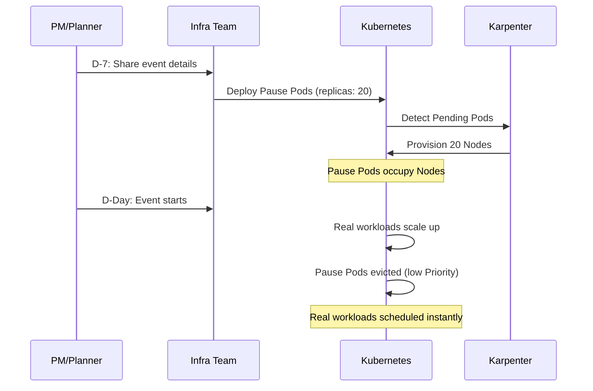
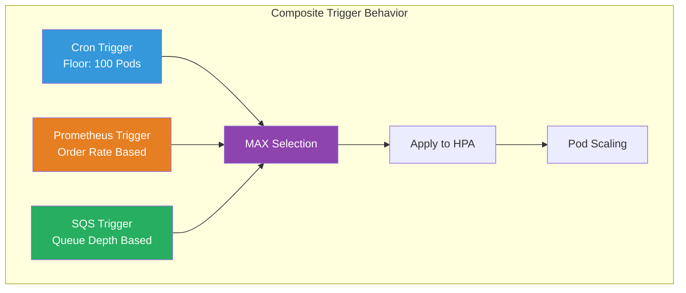
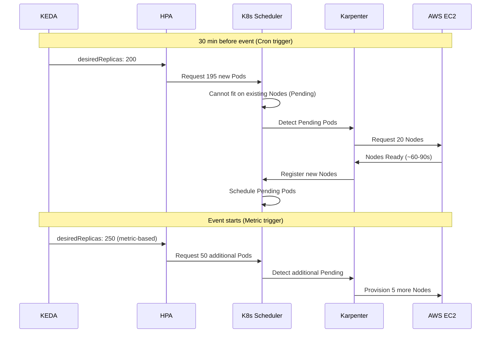

# Playbook de planificación de capacidad para eventos

> **Versiones compatibles**: Kubernetes 1.28+, KEDA 2.14+, Karpenter 0.37+
> **Última actualización**: April 25, 2026

< [Anterior: Operaciones de actualización de EKS](./11-upgrade-operations.md) | [Tabla de contenidos](./README.md) | [Siguiente: Visibilidad de costos FinOps](./13-finops-cost-platform.md) >

---

## Descripción general

Las ventas flash, campañas de marketing y eventos estacionales requieren una planificación proactiva de la capacidad de infraestructura para gestionar picos de tráfico de forma confiable. Este playbook sirve tanto a **ingenieros de operaciones** como a **stakeholders no técnicos** (PMs, especialistas en marketing) con orientación práctica y accionable.

Al combinar KEDA para el escalado a nivel de Pod y Karpenter para el aprovisionamiento a nivel de Node, puedes crear una estrategia sólida de escalado para eventos que use preescalado basado en cron como piso de seguridad, mientras las métricas de negocio impulsan la elasticidad en tiempo real.

### Objetivos de aprendizaje

- Comprender patrones de tráfico y estrategias de escalado para distintos tipos de eventos
- Usar la hoja de trabajo de planificación de capacidad para estimar necesidades de infraestructura
- Configurar triggers compuestos de KEDA con cron + métricas de negocio
- Aprovechar warm pools de Karpenter y EC2 Capacity Reservations
- Implementar coordinación de extremo a extremo entre KEDA + Karpenter
- Crear runbooks y procesos operativos específicos para eventos

---

## 1. Marco de planificación de capacidad para eventos

### 1.1 Clasificación del tipo de evento

| Tipo de evento | Multiplicador de tráfico | Tiempo de ramp-up | Duración | Predictibilidad | Ejemplos |
|-----------|-------------------|-------------|----------|---------------|---------|
| Ventas flash | 10-50x | Segundos | 1-4 horas | Alta | Ofertas por tiempo limitado, lanzamientos de edición limitada |
| Lanzamientos de producto | 5-20x | Minutos | 1-7 días | Alta | Lanzamientos de nuevas funcionalidades, actualizaciones de apps |
| Campañas de marketing | 3-10x | Minutos-Horas | Horas-Días | Media | Anuncios de TV, viralidad en redes sociales |
| Eventos estacionales | 5-30x | Horas | 1-7 días | Alta | Black Friday, ventas de fin de año |
| Picos inesperados | 5-100x | Segundos | Incierta | Baja | Viralidad en noticias/SNS, ataques de bots |

### 1.2 Hoja de trabajo de planificación de capacidad

Una hoja de trabajo estándar que los PMs y planificadores pueden completar y entregar al equipo de infraestructura.

**Entrada (completada por PM/Planificador):**

| Campo | Descripción | Valor de ejemplo |
|-------|------------|---------------|
| Tipo de evento | Venta flash / Marketing / Estacional | Venta flash |
| Usuarios concurrentes esperados | Conexiones simultáneas en pico | 100,000 |
| RPM pico esperado | Máximo de requests por minuto | 600,000 |
| Hora de inicio del evento | Fecha y hora (TZ local) | 2026-05-01 12:00 KST |
| Duración del evento | Horas en tráfico pico | 2 horas |
| Tiempo de ramp-up | Tiempo para alcanzar el tráfico pico | 10 segundos |
| Tráfico base | RPM del período normal | 30,000 |

**Fórmula de cálculo:**

```
Required Pods  = Peak RPM ÷ RPM per Pod
Required Nodes = Required Pods ÷ Pods per Node
Estimated Cost = Nodes × Hourly Cost × (Event Hours + Pre-scale + Cooldown)

Example:
- RPM per Pod: 3,000 (measured via load test)
- Required Pods: 600,000 ÷ 3,000 = 200 Pods
- Pods per Node: 10 (c5.4xlarge)
- Required Nodes: 200 ÷ 10 = 20 Nodes
- Safety margin (+30%): 26 Nodes
- Cost: 26 × $0.68/hr × (2hr event + 1hr pre + 1hr cooldown) = ~$70.72
```

### 1.3 Checklist de cronograma de D-30 a D+1

| Cuándo | Responsable | Tarea | Hecho |
|------|-------|------|------|
| **D-30** | PM + Infra | Compartir detalles del evento (completar hoja de trabajo) | ☐ |
| **D-30** | Infra | Solicitar Capacity Reservations (si es necesario) | ☐ |
| **D-30** | Finanzas | Aprobar presupuesto adicional de infraestructura | ☐ |
| **D-14** | Infra | Ejecutar prueba de carga al 120% del RPM objetivo | ☐ |
| **D-14** | Infra | Identificar y resolver cuellos de botella | ☐ |
| **D-7** | Infra | Desplegar KEDA ScaledObject (preescalado cron) | ☐ |
| **D-7** | Infra | Desplegar NodePool de Karpenter para el evento | ☐ |
| **D-7** | Infra | Configurar dashboards de monitoreo | ☐ |
| **D-3** | Infra | Dry-run de preescalado (verificar sin tráfico en vivo) | ☐ |
| **D-1** | Infra + PM | Verificación final: conteos de Pod/Node, canales de alerta, URLs de dashboard | ☐ |
| **D-1** | Infra | Preparar war room, asignar on-call | ☐ |
| **D-Day** | Infra | Verificar preescalado (30 min antes del evento) | ☐ |
| **D-Day** | Infra | Monitoreo en tiempo real y standby para intervención manual | ☐ |
| **D+1** | Infra | Confirmar scale-down, limpiar recursos sobrantes | ☐ |
| **D+1** | Infra + PM | Post-mortem: previsto vs real, análisis de costos | ☐ |

---

## 2. Estrategias de preescalado

### 2.1 Preescalado basado en cron con KEDA

Escala Pods antes del evento para absorber el pico inicial de tráfico.

**Ventana de evento único:**

```yaml
apiVersion: keda.sh/v1alpha1
kind: ScaledObject
metadata:
  name: flash-sale-prescale
  namespace: ecommerce
spec:
  scaleTargetRef:
    name: order-service
  minReplicaCount: 5
  maxReplicaCount: 300
  triggers:
    # Pre-scale 30 min before the event
    - type: cron
      metadata:
        timezone: Asia/Seoul
        start: "30 11 1 5 *"    # May 1st, 11:30
        end: "30 14 1 5 *"      # May 1st, 14:30
        desiredReplicas: "200"
```

**Ventanas de evento multirregión:**

```yaml
apiVersion: keda.sh/v1alpha1
kind: ScaledObject
metadata:
  name: global-sale-prescale
  namespace: ecommerce
spec:
  scaleTargetRef:
    name: order-service
  minReplicaCount: 5
  maxReplicaCount: 500
  triggers:
    # Korea flash sale (KST 12:00-14:00)
    - type: cron
      metadata:
        timezone: Asia/Seoul
        start: "30 11 1 5 *"
        end: "30 14 1 5 *"
        desiredReplicas: "200"
    # Japan flash sale (JST 18:00-20:00)
    - type: cron
      metadata:
        timezone: Asia/Tokyo
        start: "30 17 1 5 *"
        end: "30 20 1 5 *"
        desiredReplicas: "150"
    # US flash sale (EST 09:00-11:00)
    - type: cron
      metadata:
        timezone: America/New_York
        start: "30 8 1 5 *"
        end: "30 11 1 5 *"
        desiredReplicas: "180"
```

### 2.2 Warm pools de Karpenter

Preaprovisiona Nodes antes del evento para eliminar retrasos de scheduling de Pods.

```yaml
apiVersion: karpenter.sh/v1
kind: NodePool
metadata:
  name: event-warm-pool
spec:
  template:
    metadata:
      labels:
        workload-type: event
        pool: warm
    spec:
      requirements:
        - key: kubernetes.io/arch
          operator: In
          values: ["amd64"]
        - key: karpenter.sh/capacity-type
          operator: In
          values: ["on-demand"]
        - key: node.kubernetes.io/instance-type
          operator: In
          values:
            - c5.4xlarge
            - c5.2xlarge
            - m5.4xlarge
      nodeClassRef:
        group: karpenter.k8s.aws
        kind: EC2NodeClass
        name: event-nodes
  limits:
    cpu: "640"
    memory: 1280Gi
  disruption:
    consolidationPolicy: WhenEmpty
    consolidateAfter: 30m
  weight: 100   # Higher weight = preferred over default NodePool
---
apiVersion: karpenter.k8s.aws/v1
kind: EC2NodeClass
metadata:
  name: event-nodes
spec:
  amiSelectorTerms:
    - alias: al2023@latest
  subnetSelectorTerms:
    - tags:
        karpenter.sh/discovery: my-cluster
  securityGroupSelectorTerms:
    - tags:
        karpenter.sh/discovery: my-cluster
  blockDeviceMappings:
    - deviceName: /dev/xvda
      ebs:
        volumeSize: 100Gi
        volumeType: gp3
        iops: 5000
        throughput: 250
  tags:
    event: flash-sale-2026-05
    cost-center: marketing
```

### 2.3 EC2 Capacity Reservations

Garantiza la disponibilidad de instancias para eventos a gran escala.

**Terraform HCL:**

```hcl
resource "aws_ec2_capacity_reservation" "flash_sale" {
  instance_type     = "c5.4xlarge"
  instance_platform = "Linux/UNIX"
  availability_zone = "ap-northeast-2a"
  instance_count    = 15
  instance_match_criteria = "targeted"

  end_date_type = "limited"
  end_date      = "2026-05-01T15:00:00Z"

  tags = {
    Name       = "flash-sale-2026-05"
    Event      = "flash-sale"
    CostCenter = "marketing"
  }
}

resource "aws_ec2_capacity_reservation" "flash_sale_2b" {
  instance_type     = "c5.4xlarge"
  instance_platform = "Linux/UNIX"
  availability_zone = "ap-northeast-2b"
  instance_count    = 11
  instance_match_criteria = "targeted"
  end_date_type = "limited"
  end_date      = "2026-05-01T15:00:00Z"
  tags = {
    Name       = "flash-sale-2026-05-2b"
    Event      = "flash-sale"
    CostCenter = "marketing"
  }
}
```

**Apuntar Capacity Reservations en Karpenter:**

```yaml
apiVersion: karpenter.k8s.aws/v1
kind: EC2NodeClass
metadata:
  name: event-reserved
spec:
  amiSelectorTerms:
    - alias: al2023@latest
  subnetSelectorTerms:
    - tags:
        karpenter.sh/discovery: my-cluster
  securityGroupSelectorTerms:
    - tags:
        karpenter.sh/discovery: my-cluster
  capacityReservationSelectorTerms:
    - tags:
        Event: flash-sale
```

### 2.4 Pause Pods (escalado con placeholders)

Usa Pause Pods de baja prioridad como placeholders para precalentar Nodes. Se expulsan automáticamente cuando las cargas de trabajo reales necesitan la capacidad.

```yaml
apiVersion: scheduling.k8s.io/v1
kind: PriorityClass
metadata:
  name: pause-priority
value: -10
globalDefault: false
description: "Pause pods for pre-warming nodes - evicted by real workloads"
---
apiVersion: apps/v1
kind: Deployment
metadata:
  name: event-pause-pods
  namespace: ecommerce
  labels:
    purpose: node-warm-pool
spec:
  replicas: 20
  selector:
    matchLabels:
      app: pause-placeholder
  template:
    metadata:
      labels:
        app: pause-placeholder
    spec:
      priorityClassName: pause-priority
      terminationGracePeriodSeconds: 0
      containers:
        - name: pause
          image: registry.k8s.io/pause:3.9
          resources:
            requests:
              cpu: "14"
              memory: 24Gi
            limits:
              cpu: "14"
              memory: 24Gi
      tolerations:
        - key: event-workload
          operator: Exists
          effect: NoSchedule
```

**Cómo funciona:**



---

## 3. Escalado impulsado por métricas de negocio

### 3.1 Escalado basado en tasa de pedidos

Escala en función de métricas de negocio recopiladas en Prometheus.

**PrometheusRule (Recording Rules):**

```yaml
apiVersion: monitoring.coreos.com/v1
kind: PrometheusRule
metadata:
  name: business-metrics
  namespace: monitoring
spec:
  groups:
    - name: business.rules
      interval: 15s
      rules:
        - record: business:orders_per_minute:rate5m
          expr: sum(rate(order_completed_total[5m])) * 60
        - record: business:page_views_per_minute:rate5m
          expr: sum(rate(nginx_http_requests_total{path=~"/product.*"}[5m])) * 60
        - record: business:cart_additions_per_minute:rate5m
          expr: sum(rate(cart_add_total[5m])) * 60
```

**KEDA ScaledObject (tasa de pedidos):**

```yaml
apiVersion: keda.sh/v1alpha1
kind: ScaledObject
metadata:
  name: order-service-scaler
  namespace: ecommerce
spec:
  scaleTargetRef:
    name: order-service
  pollingInterval: 10
  cooldownPeriod: 60
  minReplicaCount: 5
  maxReplicaCount: 300
  triggers:
    - type: prometheus
      metadata:
        serverAddress: http://prometheus.monitoring.svc:9090
        query: business:orders_per_minute:rate5m
        threshold: "150"
        activationThreshold: "10"
  advanced:
    horizontalPodAutoscalerConfig:
      behavior:
        scaleUp:
          stabilizationWindowSeconds: 0
          policies:
            - type: Percent
              value: 100
              periodSeconds: 15
        scaleDown:
          stabilizationWindowSeconds: 300
          policies:
            - type: Percent
              value: 10
              periodSeconds: 60
```

### 3.2 Escalado basado en Page Views / Session

Usa métricas de CloudWatch para escalar el frontend.

```yaml
apiVersion: keda.sh/v1alpha1
kind: ScaledObject
metadata:
  name: frontend-pageview-scaler
  namespace: ecommerce
spec:
  scaleTargetRef:
    name: frontend-web
  pollingInterval: 15
  cooldownPeriod: 120
  minReplicaCount: 3
  maxReplicaCount: 200
  triggers:
    - type: aws-cloudwatch
      metadata:
        namespace: ECommerce/Frontend
        dimensionName: Service
        dimensionValue: frontend-web
        metricName: PageViewsPerMinute
        targetMetricValue: "5000"
        minMetricValue: "100"
        metricStatPeriod: "60"
        metricStatType: Sum
        awsRegion: ap-northeast-2
      authenticationRef:
        name: keda-aws-credentials
---
apiVersion: keda.sh/v1alpha1
kind: TriggerAuthentication
metadata:
  name: keda-aws-credentials
  namespace: ecommerce
spec:
  podIdentity:
    provider: aws
```

### 3.3 Escalado por profundidad de cola SQS

Escala workers de procesamiento de pedidos en función del backlog de la cola.

```yaml
apiVersion: keda.sh/v1alpha1
kind: ScaledObject
metadata:
  name: order-worker-scaler
  namespace: ecommerce
spec:
  scaleTargetRef:
    name: order-worker
  pollingInterval: 5
  cooldownPeriod: 30
  minReplicaCount: 2
  maxReplicaCount: 100
  triggers:
    - type: aws-sqs-queue
      metadata:
        queueURL: https://sqs.ap-northeast-2.amazonaws.com/123456789012/order-processing
        queueLength: "5"
        awsRegion: ap-northeast-2
        activationQueueLength: "1"
      authenticationRef:
        name: keda-aws-credentials
```

### 3.4 Configuración de triggers compuestos

**Cron establece el piso, las métricas determinan el techo.**

```yaml
apiVersion: keda.sh/v1alpha1
kind: ScaledObject
metadata:
  name: order-service-composite
  namespace: ecommerce
spec:
  scaleTargetRef:
    name: order-service
  pollingInterval: 10
  cooldownPeriod: 120
  minReplicaCount: 5
  maxReplicaCount: 300
  triggers:
    # Floor: guarantee minimum 100 Pods during event window
    - type: cron
      metadata:
        timezone: Asia/Seoul
        start: "30 11 1 5 *"
        end: "30 14 1 5 *"
        desiredReplicas: "100"
    # Ceiling: scale beyond 100 based on actual order volume
    - type: prometheus
      metadata:
        serverAddress: http://prometheus.monitoring.svc:9090
        query: business:orders_per_minute:rate5m
        threshold: "150"
        activationThreshold: "10"
    # Auxiliary: also consider SQS backlog
    - type: aws-sqs-queue
      metadata:
        queueURL: https://sqs.ap-northeast-2.amazonaws.com/123456789012/order-processing
        queueLength: "10"
        awsRegion: ap-northeast-2
      authenticationRef:
        name: keda-aws-credentials
```

KEDA selecciona el **conteo máximo de réplicas** entre todos los triggers. Si cron solicita 100 y Prometheus solicita 150, el resultado es 150.



---

## 4. Coordinación de KEDA + Karpenter

### 4.1 Escalado a nivel de Pod y a nivel de Node



### 4.2 Optimización del timing de escalado

| Fase | Duración | Optimización |
|-------|----------|-------------|
| Polling de KEDA → actualización de HPA | 10-30s | Reducir pollingInterval |
| HPA → creación de Pod | 1-5s | scaleUp stabilization: 0 |
| Pod Pending → aprovisionamiento de Node | 60-90s | Karpenter (vs CA 3-5 min) |
| Node Ready → Pod Running | 10-30s | Pre-cache de imágenes |
| **Arranque en frío total** | **~2 min** | **Eliminado con Warm Pool** |

**DaemonSet de pre-cache de imágenes:**

```yaml
apiVersion: apps/v1
kind: DaemonSet
metadata:
  name: image-cache
  namespace: kube-system
spec:
  selector:
    matchLabels:
      app: image-cache
  template:
    metadata:
      labels:
        app: image-cache
    spec:
      initContainers:
        - name: cache-order-service
          image: 123456789012.dkr.ecr.ap-northeast-2.amazonaws.com/order-service:v2.5.0
          command: ["sh", "-c", "echo cached"]
        - name: cache-frontend
          image: 123456789012.dkr.ecr.ap-northeast-2.amazonaws.com/frontend:v3.1.0
          command: ["sh", "-c", "echo cached"]
      containers:
        - name: pause
          image: registry.k8s.io/pause:3.9
          resources:
            requests:
              cpu: 10m
              memory: 16Mi
      tolerations:
        - operator: Exists
```

### 4.3 Ejemplo de extremo a extremo: escenario de venta flash

Configuración completa para una venta flash el 1 de mayo a las 12:00 KST.

**1) KEDA ScaledObject:**

```yaml
apiVersion: keda.sh/v1alpha1
kind: ScaledObject
metadata:
  name: flash-sale-order-service
  namespace: ecommerce
spec:
  scaleTargetRef:
    name: order-service
  pollingInterval: 10
  cooldownPeriod: 180
  minReplicaCount: 5
  maxReplicaCount: 300
  triggers:
    - type: cron
      metadata:
        timezone: Asia/Seoul
        start: "30 11 1 5 *"
        end: "00 15 1 5 *"
        desiredReplicas: "150"
    - type: prometheus
      metadata:
        serverAddress: http://prometheus.monitoring.svc:9090
        query: business:orders_per_minute:rate5m
        threshold: "150"
  advanced:
    horizontalPodAutoscalerConfig:
      behavior:
        scaleUp:
          stabilizationWindowSeconds: 0
          policies:
            - type: Percent
              value: 100
              periodSeconds: 15
        scaleDown:
          stabilizationWindowSeconds: 600
          policies:
            - type: Percent
              value: 5
              periodSeconds: 60
```

**2) Karpenter NodePool:**

```yaml
apiVersion: karpenter.sh/v1
kind: NodePool
metadata:
  name: flash-sale-pool
spec:
  template:
    metadata:
      labels:
        event: flash-sale-2026-05
    spec:
      requirements:
        - key: karpenter.sh/capacity-type
          operator: In
          values: ["on-demand", "spot"]
        - key: node.kubernetes.io/instance-type
          operator: In
          values: ["c5.4xlarge", "c5.2xlarge", "c6i.4xlarge", "c6i.2xlarge"]
      nodeClassRef:
        group: karpenter.k8s.aws
        kind: EC2NodeClass
        name: event-nodes
  limits:
    cpu: "800"
    memory: 1600Gi
  disruption:
    consolidationPolicy: WhenEmpty
    consolidateAfter: 30m
  weight: 100
```

**3) PodDisruptionBudget:**

```yaml
apiVersion: policy/v1
kind: PodDisruptionBudget
metadata:
  name: order-service-pdb
  namespace: ecommerce
spec:
  minAvailable: "80%"
  selector:
    matchLabels:
      app: order-service
```

**4) Visualización del cronograma:**

```
Time    11:00  11:30  12:00  12:30  13:00  13:30  14:00  14:30  15:00
        ──────────────────────────────────────────────────────────
Pods:     5     150    250    280    260    200    150     50      5
Nodes:    2      20     28     30     28     22     20      8      2
Traffic:  1x     1x    20x    35x    25x    15x    10x     2x     1x
        ──────────────────────────────────────────────────────────
             ▲                                           ▲
         Cron fires                                  Cron ends
         Pre-scaling                                 Cooldown starts
```

---

## 5. Runbook: playbooks específicos para eventos

### 5.1 Runbook de venta flash

**D-7: Desplegar preconfiguración**

```bash
# 1. Label the event namespace
kubectl label namespace ecommerce event=flash-sale-2026-05

# 2. Deploy KEDA ScaledObject
kubectl apply -f flash-sale-scaledobject.yaml

# 3. Deploy Karpenter NodePool
kubectl apply -f flash-sale-nodepool.yaml

# 4. Deploy PDB
kubectl apply -f order-service-pdb.yaml

# 5. Deploy image cache DaemonSet
kubectl apply -f image-cache-daemonset.yaml
```

**D-1: Verificación final**

```bash
# Verify ScaledObject status
kubectl get scaledobject -n ecommerce
kubectl describe scaledobject flash-sale-order-service -n ecommerce

# Verify Karpenter NodePool
kubectl get nodepool flash-sale-pool
kubectl describe nodepool flash-sale-pool

# Record baseline
echo "=== Baseline ==="
echo "Pods: $(kubectl get pods -n ecommerce -l app=order-service --no-headers | wc -l)"
echo "Nodes: $(kubectl get nodes --no-headers | wc -l)"
```

**D-Day: Monitoreo del evento**

```bash
# Real-time Pod count monitoring
watch -n 5 'kubectl get pods -n ecommerce -l app=order-service --no-headers | wc -l'

# Real-time Node count monitoring
watch -n 10 'kubectl get nodes -l event=flash-sale-2026-05 --no-headers | wc -l'

# Watch HPA status
kubectl get hpa -n ecommerce -w

# Emergency manual scale (if metrics are slow)
kubectl scale deployment order-service -n ecommerce --replicas=250
```

**D+1: Limpieza y análisis**

```bash
# Remove event ScaledObject (restore normal config)
kubectl delete scaledobject flash-sale-order-service -n ecommerce

# Remove event NodePool
kubectl delete nodepool flash-sale-pool

# Cost analysis via Kubecost API
kubectl port-forward -n kubecost svc/kubecost-cost-analyzer 9090:9090 &
curl -s "http://localhost:9090/model/allocation?window=2d&aggregate=label:event" | jq '.data'
```

### 5.2 Runbook de campaña de marketing

Las campañas de marketing tienen un ramp-up gradual, así que usa triggers cron por etapas.

```yaml
apiVersion: keda.sh/v1alpha1
kind: ScaledObject
metadata:
  name: campaign-gradual-scale
  namespace: ecommerce
spec:
  scaleTargetRef:
    name: frontend-web
  minReplicaCount: 3
  maxReplicaCount: 100
  triggers:
    # Campaign start: moderate scale-up
    - type: cron
      metadata:
        timezone: Asia/Seoul
        start: "0 9 1 5 *"
        end: "0 12 1 5 *"
        desiredReplicas: "20"
    # Peak hours: full scale
    - type: cron
      metadata:
        timezone: Asia/Seoul
        start: "0 12 1 5 *"
        end: "0 22 1 5 *"
        desiredReplicas: "50"
    # Metric-based additional scaling
    - type: prometheus
      metadata:
        serverAddress: http://prometheus.monitoring.svc:9090
        query: sum(rate(nginx_http_requests_total{service="frontend-web"}[2m])) * 60
        threshold: "10000"
```

### 5.3 Runbook de respuesta de emergencia

Procedimiento de respuesta inmediata para picos de tráfico inesperados.

```bash
#!/bin/bash
# emergency-scale.sh

NAMESPACE=${1:-ecommerce}
DEPLOYMENT=${2:-order-service}
TARGET_REPLICAS=${3:-100}

echo "=== Emergency Scaling ==="
echo "Target: ${NAMESPACE}/${DEPLOYMENT}"
echo "Desired Replicas: ${TARGET_REPLICAS}"

# 1. Immediate manual scale
kubectl scale deployment ${DEPLOYMENT} \
  -n ${NAMESPACE} \
  --replicas=${TARGET_REPLICAS}

# 2. Temporarily raise HPA minimum
kubectl patch hpa ${DEPLOYMENT} \
  -n ${NAMESPACE} \
  --type='json' \
  -p='[{"op":"replace","path":"/spec/minReplicas","value":'${TARGET_REPLICAS}'}]'

# 3. Apply emergency NodePool
cat <<EOF | kubectl apply -f -
apiVersion: karpenter.sh/v1
kind: NodePool
metadata:
  name: emergency-pool
spec:
  template:
    spec:
      requirements:
        - key: karpenter.sh/capacity-type
          operator: In
          values: ["on-demand"]
        - key: node.kubernetes.io/instance-type
          operator: In
          values: ["c5.4xlarge", "c6i.4xlarge", "m5.4xlarge"]
      nodeClassRef:
        group: karpenter.k8s.aws
        kind: EC2NodeClass
        name: default
  limits:
    cpu: "500"
  weight: 200
EOF

echo "=== Scaling Status ==="
kubectl get pods -n ${NAMESPACE} -l app=${DEPLOYMENT} --no-headers | wc -l
kubectl get nodes --no-headers | wc -l
```

---

## 6. Monitoreo y dashboards

### 6.1 Dashboard del período del evento

Paneles clave para monitoreo del evento en tiempo real:

| Panel | PromQL | Propósito |
|-------|--------|---------|
| RPS | `sum(rate(http_requests_total[1m]))` | Requests por segundo |
| Conteo de Pod | `count(kube_pod_info{namespace="ecommerce"})` | Conteo actual de Pod |
| Conteo de Node | `count(kube_node_info)` | Conteo actual de Node |
| Tasa de errores | `sum(rate(http_requests_total{code=~"5.."}[1m])) / sum(rate(http_requests_total[1m]))` | Tasa de errores |
| Latencia P99 | `histogram_quantile(0.99, sum(rate(http_request_duration_seconds_bucket[1m])) by (le))` | Tiempo de respuesta |
| Profundidad de cola | `aws_sqs_approximate_number_of_messages_visible` | Backlog de SQS |
| Costo/Hora | `sum(node_cost_hourly)` | Costo actual de infra |

**JSON de dashboard de Grafana (paneles clave):**

```json
{
  "dashboard": {
    "title": "Event Capacity Dashboard",
    "tags": ["event", "capacity"],
    "panels": [
      {
        "title": "Requests Per Second",
        "type": "timeseries",
        "gridPos": {"h": 8, "w": 8, "x": 0, "y": 0},
        "targets": [
          {
            "expr": "sum(rate(http_requests_total{namespace=\"ecommerce\"}[1m]))",
            "legendFormat": "RPS"
          }
        ],
        "fieldConfig": {
          "defaults": {
            "thresholds": {
              "steps": [
                {"color": "green", "value": null},
                {"color": "yellow", "value": 5000},
                {"color": "red", "value": 8000}
              ]
            }
          }
        }
      },
      {
        "title": "Pod Count vs Target",
        "type": "timeseries",
        "gridPos": {"h": 8, "w": 8, "x": 8, "y": 0},
        "targets": [
          {
            "expr": "count(kube_pod_status_phase{namespace=\"ecommerce\",phase=\"Running\"})",
            "legendFormat": "Running Pods"
          },
          {
            "expr": "kube_horizontalpodautoscaler_spec_target_metric{namespace=\"ecommerce\"}",
            "legendFormat": "Target"
          }
        ]
      },
      {
        "title": "Node Count",
        "type": "stat",
        "gridPos": {"h": 8, "w": 8, "x": 16, "y": 0},
        "targets": [
          {
            "expr": "count(kube_node_info)",
            "legendFormat": "Total Nodes"
          }
        ]
      }
    ]
  }
}
```

### 6.2 Análisis post-evento

**Plantilla de post-mortem:**

| Métrica | Previsto | Real | Variación |
|--------|----------|--------|---------|
| RPM pico | 600,000 | 520,000 | -13% |
| Conteo máximo de Pod | 200 | 175 | -12.5% |
| Conteo máximo de Node | 26 | 22 | -15% |
| Latencia P99 pico | 200ms | 180ms | -10% |
| Tasa de errores | < 0.1% | 0.02% | OK |
| Costo total del evento | $70.72 | $59.84 | -15% |
| Revenue | $500,000 | $620,000 | +24% |
| Costo de infra / Revenue | 0.014% | 0.010% | OK |

```bash
# Cost analysis via Kubecost for the event period
curl -s "http://kubecost:9090/model/allocation" \
  --data-urlencode "window=2026-05-01T02:00:00Z,2026-05-01T08:00:00Z" \
  --data-urlencode "aggregate=namespace" \
  --data-urlencode "accumulate=true" | jq '
  .data[0] | to_entries[] | 
  select(.key == "ecommerce") | 
  {namespace: .key, totalCost: .value.totalCost, cpuCost: .value.cpuCost, memCost: .value.ramCost}'
```

---

## 7. Gestión de costos

### 7.1 Estimación de costos del evento

| Tipo de instancia | vCPU | Memoria | Costo por hora (Seúl) | Capacidad de Pod |
|-------------|------|--------|--------------------|----|
| c5.2xlarge | 8 | 16 GiB | $0.34 | ~5 pods |
| c5.4xlarge | 16 | 32 GiB | $0.68 | ~10 pods |
| c6i.4xlarge | 16 | 32 GiB | $0.72 | ~10 pods |
| m5.4xlarge | 16 | 64 GiB | $0.77 | ~10 pods |

**Matriz de decisión Spot vs On-Demand:**

| Criterio | Usar On-Demand | Spot aceptable |
|----------|--------------|----------------|
| Criticidad del evento | Impacta ingresos | Servicios auxiliares |
| Tolerancia a interrupciones | No aceptable | OK (tiene lógica de reintentos) |
| Duración del evento | < 2 horas | > 4 horas |
| Ahorro de Spot | < 50% | > 60% |

### 7.2 Scale-down automático

```yaml
# Gradual scale-down after event
advanced:
  horizontalPodAutoscalerConfig:
    behavior:
      scaleDown:
        stabilizationWindowSeconds: 600
        policies:
          - type: Percent
            value: 10
            periodSeconds: 120
```

**Teardown de consolidación de Karpenter:**

```bash
# 1. Switch event NodePool to aggressive consolidation
kubectl patch nodepool flash-sale-pool --type='merge' -p '
  {"spec":{"disruption":{"consolidationPolicy":"WhenEmptyOrUnderutilized","consolidateAfter":"5m"}}}'

# 2. Remove event NodePool after 30 min
sleep 1800 && kubectl delete nodepool flash-sale-pool

# 3. Release Capacity Reservations (Terraform)
terraform destroy -target=aws_ec2_capacity_reservation.flash_sale
```

---

## 8. Buenas prácticas y anti-patrones

### Buenas prácticas

| # | Práctica | Descripción |
|---|---------|-------------|
| 1 | Hacer pruebas de carga temprano | Ejecutar al 120% del RPM objetivo dos semanas antes del evento |
| 2 | Combinar cron + métricas | Cron establece el piso, las métricas determinan el techo |
| 3 | Scale-down gradual | Reducir 10% cada vez en lugar de caídas bruscas |
| 4 | Etiquetar todo | Etiquetar todos los recursos con el nombre del evento para seguimiento de costos |
| 5 | Incluir stakeholders no técnicos | Compartir URLs de dashboard y estado con PMs |
| 6 | Post-mortem en cada evento | Comparar previsto vs real para mejorar la precisión |
| 7 | Usar warm pools | Eliminar por completo el arranque en frío de 2 minutos |

### Anti-patrones

| # | Anti-patrón | Problema | Alternativa |
|---|-------------|---------|-------------|
| 1 | Solo escalado manual | No puede responder a eventos de noche/fin de semana | Automatizar con cron de KEDA |
| 2 | Sin maxReplicas | Explosión de costos, agotamiento de recursos | Establecer siempre límites superiores |
| 3 | Cambios de configuración de último minuto | Sin tiempo para validar, riesgo de interrupción | Desplegar en D-7, validar en D-3 |
| 4 | Olvidar hacer scale-down | Costo innecesario continuo después del evento | Establecer políticas de TTL/cooldown |

---

## 9. Referencias

- [Documentación de KEDA](https://keda.sh/docs/)
- [Documentación de Karpenter](https://karpenter.sh/docs/)
- [AWS EC2 Capacity Reservations](https://docs.aws.amazon.com/AWSEC2/latest/UserGuide/ec2-capacity-reservations.html)
- [KEDA Cron Trigger](https://keda.sh/docs/scalers/cron/)
- [Comportamiento de HPA de Kubernetes](https://kubernetes.io/docs/tasks/run-application/horizontal-pod-autoscale/#configurable-scaling-behavior)
- [Escalado dirigido por eventos con KEDA](../autoscaling/01-keda.md)
- [Autoscaling de Node con Karpenter](../autoscaling/02-karpenter.md)
- [Análisis profundo de estrategias de escalado](./06-scaling-strategies.md)
- [Optimización de costos de EKS](../eks/07-eks-cost-optimization.md)
