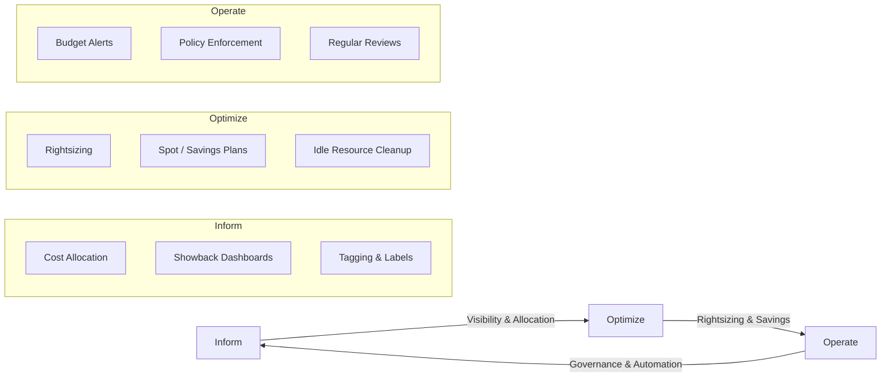
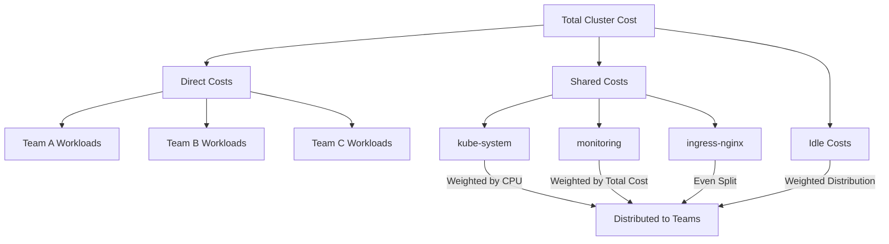
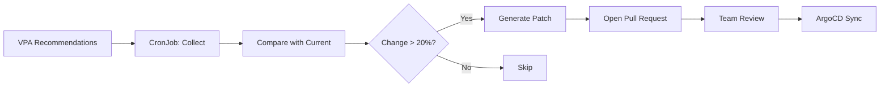

# Plataforma de visibilidad de costos FinOps

> **Versiones compatibles**: Kubernetes 1.28+, Kubecost 2.x, OpenCost 1.x
> **Última actualización**: April 25, 2026

< [Anterior: Planificación de capacidad para eventos](./12-event-capacity-planning.md) | [Tabla de contenidos](./README.md) | [Siguiente: Tekton Pipelines](./14-tekton-pipelines.md) >

---

## Descripción general

Ejecutar Kubernetes a escala introduce un desafío único de gestión de costos: las workloads son efímeras, los recursos se comparten y la atribución de costos tradicional por servidor ya no aplica. Sin visibilidad deliberada de costos, las organizaciones suelen descubrir que su factura de cloud ha crecido entre 2 y 5 veces más de lo esperado.

**FinOps** (Financial Operations) es la práctica de aportar responsabilidad financiera al modelo de gasto variable del cloud computing. El ciclo de vida de FinOps sigue tres fases iterativas:

- **Informar**: Proporcionar visibilidad sobre dónde se gasta el dinero y quién lo gasta
- **Optimizar**: Identificar y actuar sobre oportunidades para reducir desperdicio y mejorar la eficiencia
- **Operar**: Establecer gobernanza, automatización y prácticas culturales que sostengan la eficiencia de costos

Esta guía construye una plataforma completa de visibilidad de costos FinOps en Kubernetes usando OpenCost, Kubecost, Prometheus y Grafana.

### Objetivos de aprendizaje

- Comprender el modelo operativo de FinOps y cómo se aplica a entornos Kubernetes
- Desplegar y configurar OpenCost y Kubecost para una asignación de costos precisa
- Implementar sistemas de showback y chargeback usando labels, namespaces y APIs de costos
- Crear detección de anomalías de costos con pipelines de alertas hacia Slack
- Habilitar dashboards de costos de autoservicio para equipos e informes semanales automatizados de costos
- Establecer workflows de rightsizing de recursos usando recomendaciones de VPA y Goldilocks

---

## 1. Modelo operativo de FinOps

### 1.1 Ciclo Informar, Optimizar, Operar



**Fase Informar**: Establece visibilidad desplegando herramientas de monitoreo de costos, implementando una estrategia de labels y creando dashboards de showback. Esta es la base sobre la que se construyen todos los esfuerzos de optimización.

**Fase Optimizar**: Usa datos de visibilidad para identificar desperdicio. Esto incluye aplicar rightsizing a workloads, aprovechar instancias Spot y Savings Plans, y limpiar recursos inactivos.

**Fase Operar**: Institucionaliza la eficiencia de costos mediante alertas de presupuesto, aplicación de políticas y reuniones periódicas de revisión de costos.

### 1.2 Roles organizacionales

| Rol | Responsabilidades | Herramientas principales | Cadencia |
|------|-----------------|---------------|---------|
| **Equipo FinOps** | Definir modelos de asignación de costos, mantener dashboards, impulsar la optimización | Kubecost, Grafana, AWS Cost Explorer | Monitoreo diario, informes semanales |
| **Equipos de ingeniería** | Definir requests/limits de recursos, aplicar labels de costo, revisar dashboards del equipo | Dashboards de equipo, VPA, Goldilocks | Revisiones a nivel de sprint |
| **Finanzas** | Planificación presupuestaria, validación de previsiones, conciliación de chargeback | Informes mensuales de costos, datos de showback | Conciliación mensual |
| **Liderazgo** | Aprobar presupuestos, definir objetivos de costo, revisar economía unitaria | Dashboards ejecutivos, informes de tendencias | Revisiones mensuales/trimestrales |
| **Platform Engineering** | Desplegar y mantener herramientas de costos, crear dashboards de autoservicio | Kubecost, OpenCost, Kyverno, Prometheus | Continuo |

### 1.3 Niveles de madurez

| Nivel | Asignación de costos | Optimización | Gobernanza | Cronograma |
|-------|----------------|--------------|------------|----------|
| **Crawl** | Asignación a nivel de namespace, labels básicos | Rightsizing manual, limpieza ad hoc | Sin políticas formales, alertas reactivas | 1-3 meses |
| **Walk** | Asignación basada en labels con división de costos compartidos, showback | Recomendaciones de VPA, adopción de Spot | Aplicación de labels, revisiones mensuales | 3-6 meses |
| **Run** | Chargeback en tiempo real con conciliación de CUR | Pipelines automatizados de rightsizing | Políticas automatizadas, gates de costo en CI/CD | 6-12 meses |

---

## 2. Configuración profunda de OpenCost/Kubecost

### 2.1 Instalación de OpenCost (Open Source)

OpenCost requiere Prometheus para métricas y expone su propia API de asignación de costos.

```yaml
# opencost-values.yaml
# helm install opencost opencost/opencost -n opencost --create-namespace -f opencost-values.yaml
opencost:
  exporter:
    defaultClusterId: "production-eks-us-east-1"
    image:
      registry: ghcr.io
      repository: opencost/opencost
      tag: "1.112.0"
    aws:
      spot_data_region: "us-east-1"
      spot_data_bucket: "my-company-spot-data-feed"
    prometheus:
      internal:
        enabled: true
        serviceName: prometheus-server
        namespaceName: monitoring
        port: 80
    resources:
      requests:
        cpu: "100m"
        memory: "256Mi"
      limits:
        cpu: "500m"
        memory: "512Mi"
    persistence:
      enabled: true
      storageClass: "gp3"
      size: "32Gi"
    cloudCost:
      enabled: true
      refreshRateHours: 6
  ui:
    enabled: true
    ingress:
      enabled: true
      ingressClassName: "alb"
      annotations:
        alb.ingress.kubernetes.io/scheme: "internal"
        alb.ingress.kubernetes.io/target-type: "ip"
        alb.ingress.kubernetes.io/listen-ports: '[{"HTTPS": 443}]'
      hosts:
        - host: "opencost.internal.mycompany.com"
          paths:
            - path: /
              pathType: Prefix
  metrics:
    serviceMonitor:
      enabled: true
      namespace: monitoring
serviceAccount:
  create: true
  annotations:
    eks.amazonaws.com/role-arn: "arn:aws:iam::123456789012:role/opencost-role"
```

### 2.2 Kubecost Enterprise

Kubecost agrega federación multi-cluster, almacenamiento ETL en S3 y funciones avanzadas de asignación sobre OpenCost.

```yaml
# kubecost-values.yaml
# helm install kubecost kubecost/cost-analyzer -n kubecost --create-namespace -f kubecost-values.yaml
global:
  prometheus:
    enabled: false
    fqdn: "http://prometheus-server.monitoring.svc:80"
  grafana:
    enabled: false
    domainName: "grafana.monitoring.svc"

kubecostProductConfigs:
  clusterName: "production-eks-us-east-1"
  currencyCode: "USD"
  defaultModelPricing:
    enabled: false
  sharedNamespaces: "kube-system,kubecost,monitoring,cert-manager,ingress-nginx"
  shareTenancyCosts: true
  shareSplit: "weighted"

kubecostModel:
  etl: true
  etlBucketConfig:
    enabled: true
  federatedETL:
    enabled: true
    primaryCluster: true
  resources:
    requests:
      cpu: "200m"
      memory: "512Mi"
    limits:
      cpu: "1000m"
      memory: "2Gi"

# S3 backend for ETL data
kubecostS3Config:
  enabled: true
  bucketName: "mycompany-kubecost-etl"
  region: "us-east-1"

federatedETL:
  federatedStore:
    enabled: true
    bucket: "mycompany-kubecost-federation"
    region: "us-east-1"

kubecostAggregator:
  enabled: true
  replicas: 1
  resources:
    requests:
      cpu: "500m"
      memory: "1Gi"
    limits:
      cpu: "2000m"
      memory: "4Gi"

ingress:
  enabled: true
  className: "alb"
  annotations:
    alb.ingress.kubernetes.io/scheme: "internal"
    alb.ingress.kubernetes.io/target-type: "ip"
  hosts:
    - host: "kubecost.internal.mycompany.com"
      paths:
        - path: /
          pathType: Prefix

serviceAccount:
  create: true
  annotations:
    eks.amazonaws.com/role-arn: "arn:aws:iam::123456789012:role/kubecost-role"

podDisruptionBudget:
  enabled: true
  minAvailable: 1
```

### 2.3 Integración de AWS Cost and Usage Report (CUR)

El CUR proporciona la fuente más precisa de datos de facturación de AWS, permitiendo conciliar estimaciones dentro del cluster con cargos reales.

#### Configuración de Terraform

```hcl
# cur-infrastructure.tf
terraform {
  required_version = ">= 1.5.0"
  required_providers { aws = { source = "hashicorp/aws"; version = "~> 5.0" } }
}

data "aws_caller_identity" "current" {}

resource "aws_s3_bucket" "cur_bucket" {
  bucket = "mycompany-cur-reports"
  tags   = { Purpose = "cost-and-usage-reports", ManagedBy = "terraform" }
}

resource "aws_s3_bucket_versioning" "cur" {
  bucket = aws_s3_bucket.cur_bucket.id
  versioning_configuration { status = "Enabled" }
}

resource "aws_s3_bucket_lifecycle_configuration" "cur" {
  bucket = aws_s3_bucket.cur_bucket.id
  rule {
    id     = "transition-to-ia"
    status = "Enabled"
    transition { days = 90;  storage_class = "STANDARD_IA" }
    transition { days = 365; storage_class = "GLACIER" }
    expiration { days = 730 }
  }
}

resource "aws_s3_bucket_server_side_encryption_configuration" "cur" {
  bucket = aws_s3_bucket.cur_bucket.id
  rule { apply_server_side_encryption_by_default { sse_algorithm = "aws:kms" }; bucket_key_enabled = true }
}

resource "aws_s3_bucket_public_access_block" "cur" {
  bucket = aws_s3_bucket.cur_bucket.id
  block_public_acls = true; block_public_policy = true; ignore_public_acls = true; restrict_public_buckets = true
}

resource "aws_s3_bucket_policy" "cur" {
  bucket = aws_s3_bucket.cur_bucket.id
  policy = jsonencode({
    Version = "2012-10-17"
    Statement = [
      { Sid = "AllowCURDelivery", Effect = "Allow", Principal = { Service = "billingreports.amazonaws.com" },
        Action = ["s3:GetBucketAcl", "s3:GetBucketPolicy"], Resource = aws_s3_bucket.cur_bucket.arn },
      { Sid = "AllowCURWrite", Effect = "Allow", Principal = { Service = "billingreports.amazonaws.com" },
        Action = "s3:PutObject", Resource = "${aws_s3_bucket.cur_bucket.arn}/*" }
    ]
  })
}

resource "aws_cur_report_definition" "daily_cur" {
  report_name                = "mycompany-daily-cur"
  time_unit                  = "DAILY"
  format                     = "Parquet"
  compression                = "Parquet"
  additional_schema_elements = ["RESOURCES"]
  s3_bucket                  = aws_s3_bucket.cur_bucket.id
  s3_region                  = "us-east-1"
  s3_prefix                  = "cur-reports"
  report_versioning          = "OVERWRITE_REPORT"
  refresh_closed_reports     = true
  additional_artifacts       = ["ATHENA"]
}

# IAM role for Kubecost CUR access via IRSA
resource "aws_iam_role" "kubecost_cur" {
  name = "kubecost-cur-reader"
  assume_role_policy = jsonencode({
    Version = "2012-10-17"
    Statement = [{
      Effect = "Allow"
      Principal = { Federated = "arn:aws:iam::${data.aws_caller_identity.current.account_id}:oidc-provider/${var.oidc_provider}" }
      Action = "sts:AssumeRoleWithWebIdentity"
      Condition = { StringEquals = {
        "${var.oidc_provider}:sub" = "system:serviceaccount:kubecost:kubecost-cost-analyzer"
        "${var.oidc_provider}:aud" = "sts.amazonaws.com"
      }}
    }]
  })
}

resource "aws_iam_role_policy" "kubecost_cur" {
  name = "kubecost-cur-read"
  role = aws_iam_role.kubecost_cur.id
  policy = jsonencode({
    Version = "2012-10-17"
    Statement = [
      { Effect = "Allow", Action = ["s3:GetObject", "s3:ListBucket", "s3:GetBucketLocation"],
        Resource = [aws_s3_bucket.cur_bucket.arn, "${aws_s3_bucket.cur_bucket.arn}/*"] },
      { Effect = "Allow", Action = ["athena:StartQueryExecution", "athena:GetQueryExecution", "athena:GetQueryResults"],
        Resource = "arn:aws:athena:us-east-1:${data.aws_caller_identity.current.account_id}:workgroup/primary" },
      { Effect = "Allow", Action = ["glue:GetDatabase", "glue:GetTable", "glue:GetPartitions"],
        Resource = ["arn:aws:glue:us-east-1:${data.aws_caller_identity.current.account_id}:catalog",
                    "arn:aws:glue:us-east-1:${data.aws_caller_identity.current.account_id}:database/athenacurcfn_*",
                    "arn:aws:glue:us-east-1:${data.aws_caller_identity.current.account_id}:table/athenacurcfn_*/*"] },
      { Effect = "Allow", Action = ["pricing:GetProducts", "ec2:DescribeInstances", "ec2:DescribeReservedInstances"], Resource = "*" }
    ]
  })
}

variable "oidc_provider" { description = "OIDC provider URL (without https://)" ; type = string }
output "kubecost_role_arn" { value = aws_iam_role.kubecost_cur.arn }
output "cur_bucket_name"   { value = aws_s3_bucket.cur_bucket.id }
```

#### Valores de integración cloud de Kubecost

```yaml
# Add to kubecost-values.yaml for CUR reconciliation
kubecostProductConfigs:
  cloudIntegrationJSON: |
    {
      "aws": [{
        "athenaBucketName": "mycompany-cur-reports",
        "athenaRegion": "us-east-1",
        "athenaDatabase": "athenacurcfn_mycompany_daily_cur",
        "athenaTable": "mycompany_daily_cur",
        "athenaWorkgroup": "primary",
        "projectID": "123456789012"
      }]
    }
```

### 2.4 Ajuste de precisión de costos

#### Configuración de precios personalizados

```yaml
# custom-pricing-configmap.yaml
apiVersion: v1
kind: ConfigMap
metadata:
  name: pricing-configs
  namespace: kubecost
data:
  default-pricing.json: |
    {
      "provider": "aws",
      "description": "Custom pricing with negotiated EDP rates",
      "CPU": "0.02835",
      "RAM": "0.00356",
      "GPU": "0.85",
      "storage": "0.000054795",
      "zoneNetworkEgress": "0.00",
      "regionNetworkEgress": "0.01",
      "internetNetworkEgress": "0.05",
      "spotCPU": "0.0085",
      "spotRAM": "0.00107",
      "spotLabel": "karpenter.sh/capacity-type",
      "spotLabelValue": "spot"
    }
```

#### Reglas de asignación de costos compartidos

```yaml
# shared-cost-allocation-configmap.yaml
apiVersion: v1
kind: ConfigMap
metadata:
  name: allocation-configs
  namespace: kubecost
data:
  shared-costs.json: |
    {
      "sharedCosts": [
        { "name": "Control Plane",       "type": "weighted", "filter": { "namespace": "kube-system" },    "weight": "cpuCost" },
        { "name": "Monitoring Stack",    "type": "weighted", "filter": { "namespace": "monitoring" },     "weight": "totalCost" },
        { "name": "Ingress Controllers", "type": "even",     "filter": { "namespace": "ingress-nginx" } },
        { "name": "Service Mesh",        "type": "weighted", "filter": { "namespace": "istio-system" },   "weight": "networkCost" },
        { "name": "Cert Manager",        "type": "even",     "filter": { "namespace": "cert-manager" } },
        { "name": "Platform Tools",      "type": "even",     "filter": { "namespace": "kubecost,argocd,kyverno" } }
      ],
      "idleCostDistribution": "weighted"
    }
```

---

## 3. Implementación de showback/chargeback

Showback informa los costos a los equipos para crear conciencia; chargeback factura realmente a los centros de costo. Ambos requieren una asignación de costos precisa vinculada a unidades organizacionales.

### 3.1 Estrategia de labels

| Label | Propósito | Valores de ejemplo |
|-------|---------|---------------|
| `team` | Atribución de costos al equipo de ingeniería | `platform`, `checkout`, `payments` |
| `service` | Seguimiento de costos a nivel de Service | `api-gateway`, `order-service` |
| `environment` | Segregación de entornos | `production`, `staging`, `development` |
| `cost-center` | Mapeo al departamento financiero | `CC-1001`, `CC-2005` |

#### Política de aplicación de labels con Kyverno

```yaml
# kyverno-cost-labels-policy.yaml
apiVersion: kyverno.io/v1
kind: ClusterPolicy
metadata:
  name: require-cost-labels
  annotations:
    policies.kyverno.io/title: Require Cost Attribution Labels
    policies.kyverno.io/category: FinOps
    policies.kyverno.io/severity: high
spec:
  validationFailureAction: Enforce
  background: true
  rules:
    - name: check-cost-labels-on-resource
      match:
        any:
          - resources:
              kinds:
                - Deployment
                - StatefulSet
                - DaemonSet
      exclude:
        any:
          - resources:
              namespaces:
                - kube-system
                - kube-public
                - kubecost
                - monitoring
                - ingress-nginx
                - cert-manager
                - argocd
                - kyverno
      validate:
        message: >-
          Resource {{request.object.kind}}/{{request.object.metadata.name}} is missing
          required cost labels. All workloads must have: team, service, environment, cost-center.
        pattern:
          metadata:
            labels:
              team: "?*"
              service: "?*"
              environment: "?*"
              cost-center: "?*"
    - name: check-cost-labels-on-pod-template
      match:
        any:
          - resources:
              kinds:
                - Deployment
                - StatefulSet
                - DaemonSet
      exclude:
        any:
          - resources:
              namespaces:
                - kube-system
                - kube-public
                - kubecost
                - monitoring
                - ingress-nginx
                - cert-manager
                - argocd
                - kyverno
      validate:
        message: "Pod template must also carry cost labels for accurate pod-level cost attribution."
        pattern:
          spec:
            template:
              metadata:
                labels:
                  team: "?*"
                  service: "?*"
                  environment: "?*"
                  cost-center: "?*"
    - name: validate-environment-values
      match:
        any:
          - resources:
              kinds:
                - Deployment
                - StatefulSet
                - DaemonSet
      exclude:
        any:
          - resources:
              namespaces:
                - kube-system
                - kube-public
                - kubecost
                - monitoring
      validate:
        message: "Label 'environment' must be one of: production, staging, development, sandbox."
        pattern:
          metadata:
            labels:
              environment: "production | staging | development | sandbox"
```

### 3.2 Asignación de costos basada en namespaces

#### Ejemplos de la API de asignación de Kubecost

```bash
# Cost allocation by namespace for the last 7 days
curl -s "http://kubecost.internal.mycompany.com/model/allocation\
?window=7d&aggregate=namespace&accumulate=true" \
  | jq '.data[0] | to_entries[] | {namespace: .key, totalCost: .value.totalCost, cpuCost: .value.cpuCost}'

# Cost allocation by team label for the current month with shared costs
curl -s "http://kubecost.internal.mycompany.com/model/allocation\
?window=thismonth&aggregate=label:team&accumulate=true\
&shareIdle=weighted&shareNamespaces=kube-system,monitoring" \
  | jq '.data[0] | to_entries | sort_by(-.value.totalCost) | .[] | {team: .key, totalCost: (.value.totalCost | round), cpuEfficiency: (.value.cpuEfficiency * 100 | round)}'

# Daily cost trend for a specific team over 30 days
curl -s "http://kubecost.internal.mycompany.com/model/allocation\
?window=30d&aggregate=label:team&step=1d&filterLabels=team:checkout" \
  | jq '[.data[] | to_entries[] | {date: .key, cost: .value.totalCost}]'
```

#### ResourceQuota por namespace de equipo

```yaml
# team-namespace-quota.yaml
apiVersion: v1
kind: Namespace
metadata:
  name: team-checkout
  labels:
    team: checkout
    cost-center: "CC-2005"
    environment: production
---
apiVersion: v1
kind: ResourceQuota
metadata:
  name: team-checkout-quota
  namespace: team-checkout
spec:
  hard:
    requests.cpu: "40"
    requests.memory: "80Gi"
    limits.cpu: "80"
    limits.memory: "160Gi"
    persistentvolumeclaims: "20"
    pods: "200"
---
apiVersion: v1
kind: LimitRange
metadata:
  name: team-checkout-limits
  namespace: team-checkout
spec:
  limits:
    - type: Container
      default:        { cpu: "500m", memory: "512Mi" }
      defaultRequest: { cpu: "100m", memory: "128Mi" }
      max:            { cpu: "8",    memory: "16Gi" }
      min:            { cpu: "10m",  memory: "16Mi" }
```

### 3.3 Distribución de costos compartidos



| Método de distribución | Cuándo usarlo | Ventajas | Desventajas |
|-------------------|-------------|------|------|
| **Ponderado por CPU** | Costos de control plane | Proporcional al uso | Penaliza workloads intensivas en CPU |
| **Ponderado por costo total** | Servicios compartidos generales | Distribución global justa | Requiere asignación base precisa |
| **División uniforme** | Servicios compartidos pequeños | Simple, transparente | Injusto si los equipos difieren en tamaño |
| **Ponderado por red** | Ingress, service mesh | Preciso para costos de red | Los costos de red pueden ser volátiles |

### 3.4 Dashboards de showback en Grafana

El siguiente JSON de dashboard de Grafana proporciona paneles de costo por equipo y costo por Service con un selector de variable de equipo. Impórtalo mediante la UI de Grafana o aprovisiónalo como un ConfigMap con el label `grafana_dashboard: "true"`.

```json
{
  "description": "FinOps Showback Dashboard",
  "editable": true,
  "panels": [
    {
      "datasource": { "type": "prometheus", "uid": "prometheus" },
      "fieldConfig": { "defaults": { "unit": "currencyUSD", "custom": { "drawStyle": "bars", "fillOpacity": 80, "stacking": { "mode": "normal" } } } },
      "gridPos": { "h": 10, "w": 24, "x": 0, "y": 0 },
      "id": 1, "title": "Daily Cost by Team", "type": "timeseries",
      "targets": [{ "expr": "sum by (label_team) (sum by (namespace, label_team) (kubecost_container_cpu_allocation_cost{} * on(namespace) group_left(label_team) kube_namespace_labels{label_team!=\"\"}) + sum by (namespace, label_team) (kubecost_container_memory_allocation_cost{} * on(namespace) group_left(label_team) kube_namespace_labels{label_team!=\"\"}))", "legendFormat": "{{label_team}}" }]
    },
    {
      "datasource": { "type": "prometheus", "uid": "prometheus" },
      "fieldConfig": { "defaults": { "unit": "currencyUSD" } },
      "gridPos": { "h": 10, "w": 12, "x": 0, "y": 10 },
      "id": 2, "title": "Monthly Cost by Service", "type": "bargauge",
      "targets": [{ "expr": "sum by (label_service) ((kubecost_container_cpu_allocation_cost{} + kubecost_container_memory_allocation_cost{}) * on(pod) group_left(label_service) kube_pod_labels{label_service!=\"\"}) * 730", "legendFormat": "{{label_service}}" }]
    },
    {
      "datasource": { "type": "prometheus", "uid": "prometheus" },
      "fieldConfig": { "defaults": { "unit": "percentunit", "min": 0, "max": 1 } },
      "gridPos": { "h": 10, "w": 12, "x": 12, "y": 10 },
      "id": 3, "title": "Resource Efficiency by Team", "type": "bargauge",
      "targets": [{ "expr": "sum by (label_team) (rate(container_cpu_usage_seconds_total{namespace!~\"kube-system|monitoring\"}[1h]) * on(namespace) group_left(label_team) kube_namespace_labels{label_team!=\"\"}) / sum by (label_team) (kube_pod_container_resource_requests{resource=\"cpu\", namespace!~\"kube-system|monitoring\"} * on(namespace) group_left(label_team) kube_namespace_labels{label_team!=\"\"})", "legendFormat": "{{label_team}}" }]
    },
    {
      "datasource": { "type": "prometheus", "uid": "prometheus" },
      "fieldConfig": { "defaults": { "unit": "currencyUSD" } },
      "gridPos": { "h": 8, "w": 24, "x": 0, "y": 20 },
      "id": 4, "title": "Team Cost Summary Table", "type": "table",
      "targets": [
        { "expr": "sum by (label_team) (kubecost_container_cpu_allocation_cost{} + kubecost_container_memory_allocation_cost{}) * 730", "format": "table", "instant": true, "refId": "A" },
        { "expr": "sum by (label_team) (rate(container_cpu_usage_seconds_total{}[1h])) / sum by (label_team) (kube_pod_container_resource_requests{resource=\"cpu\"})", "format": "table", "instant": true, "refId": "B" }
      ]
    }
  ],
  "schemaVersion": 39, "tags": ["finops", "cost", "showback"],
  "templating": { "list": [{ "name": "team", "type": "query", "query": "label_values(kube_namespace_labels{label_team!=\"\"}, label_team)", "includeAll": true, "multi": true }] },
  "time": { "from": "now-30d", "to": "now" },
  "title": "FinOps Showback Dashboard", "uid": "finops-showback-v1"
}
```

---

## 4. Detección de anomalías de costos

Las anomalías de costos indican cambios inesperados en el gasto debido a configuraciones incorrectas, picos de tráfico o cambios de infraestructura. Detectarlas temprano evita sorpresas en la factura.

### 4.1 Configuración de alertas de Kubecost

```yaml
# kubecost-alerts-values.yaml (merge with main Kubecost Helm values)
kubecostProductConfigs:
  alertConfigs:
    enabled: true
    frontendUrl: "https://kubecost.internal.mycompany.com"
    alerts:
      # Budget exceeded - any namespace over $5000/month
      - type: budget
        threshold: 5000
        window: 30d
        aggregation: namespace
        slackWebhookUrl: "https://hooks.slack.com/services/T00/B00/XXX"
        frequencyMinutes: 1440
      # Budget warning at 80%
      - type: budget
        threshold: 4000
        window: 30d
        aggregation: namespace
        slackWebhookUrl: "https://hooks.slack.com/services/T00/B00/XXX"
        frequencyMinutes: 1440
      # Cluster efficiency below 40%
      - type: efficiency
        threshold: 0.4
        window: 48h
        aggregation: cluster
        slackWebhookUrl: "https://hooks.slack.com/services/T00/B00/XXX"
        frequencyMinutes: 360
      # 30% cost increase week over week per team
      - type: recurringUpdate
        threshold: 0.30
        window: 7d
        aggregation: "label:team"
        slackWebhookUrl: "https://hooks.slack.com/services/T00/B00/XXX"
        frequencyMinutes: 10080
      # Daily spend exceeds 150% of 7-day average
      - type: spendChange
        threshold: 0.50
        window: 1d
        baselineWindow: 7d
        aggregation: namespace
        slackWebhookUrl: "https://hooks.slack.com/services/T00/B00/XXX"
        frequencyMinutes: 360
```

### 4.2 Alertas de costos basadas en Prometheus

```yaml
# cost-anomaly-prometheus-rules.yaml
apiVersion: monitoring.coreos.com/v1
kind: PrometheusRule
metadata:
  name: cost-anomaly-detection
  namespace: monitoring
  labels:
    release: prometheus
spec:
  groups:
    - name: cost-anomaly-detection
      interval: 30m
      rules:
        - alert: ClusterCostSpike
          expr: |
            (sum(kubecost_cluster_costs{}) / avg_over_time(sum(kubecost_cluster_costs{})[7d:1h])) > 1.5
          for: 2h
          labels:
            severity: warning
            category: finops
          annotations:
            summary: "Cluster cost spike detected"
            description: "Current cost is {{ $value | humanizePercentage }} of 7-day average."
        - alert: NamespaceCostDoubled
          expr: |
            (
              sum by (namespace) (kubecost_container_cpu_allocation_cost{} + kubecost_container_memory_allocation_cost{})
              / sum by (namespace) (kubecost_container_cpu_allocation_cost{} offset 1d + kubecost_container_memory_allocation_cost{} offset 1d)
            ) > 2.0
          for: 1h
          labels:
            severity: warning
            category: finops
          annotations:
            summary: "Namespace {{ $labels.namespace }} cost doubled day-over-day"
        - alert: LowClusterCPUEfficiency
          expr: |
            (
              sum(rate(container_cpu_usage_seconds_total{namespace!~"kube-system|monitoring"}[1h]))
              / sum(kube_pod_container_resource_requests{resource="cpu", namespace!~"kube-system|monitoring"})
            ) < 0.30
          for: 6h
          labels:
            severity: warning
            category: finops
          annotations:
            summary: "Cluster CPU efficiency below 30%"
            description: "Current efficiency: {{ $value | humanizePercentage }}. Review VPA recommendations."
        - alert: HighIdleCost
          expr: |
            (sum(kubecost_cluster_costs{cost_type="idle"}) / sum(kubecost_cluster_costs{})) > 0.20
          for: 24h
          labels:
            severity: info
            category: finops
          annotations:
            summary: "Idle cost exceeds 20% of total cluster cost"
        - alert: ProjectedMonthlyBudgetExceeded
          expr: |
            (sum(kubecost_cluster_costs{}) * 730) > 50000
          for: 12h
          labels:
            severity: critical
            category: finops
          annotations:
            summary: "Projected monthly cost exceeds $50,000 budget"
            description: "Projected: ${{ $value | printf \"%.0f\" }}. Immediate review required."
```

#### Ruta y receptor de Alertmanager

```yaml
# alertmanager-finops-config.yaml
apiVersion: monitoring.coreos.com/v1alpha1
kind: AlertmanagerConfig
metadata:
  name: finops-alerts
  namespace: monitoring
spec:
  route:
    receiver: "finops-slack"
    groupBy: ["alertname", "namespace"]
    groupWait: 30s
    groupInterval: 5m
    repeatInterval: 4h
    matchers:
      - name: category
        value: finops
    routes:
      - receiver: "finops-slack-critical"
        matchers:
          - name: severity
            value: critical
        repeatInterval: 1h
  receivers:
    - name: "finops-slack"
      slackConfigs:
        - apiURL:
            name: finops-slack-webhook
            key: webhook-url
          channel: "#finops-alerts"
          sendResolved: true
          title: "[{{ .CommonLabels.severity | toUpper }}] {{ .CommonLabels.alertname }}"
          text: |
            {{ range .Alerts }}
            *Description:* {{ .Annotations.description }}
            {{ end }}
    - name: "finops-slack-critical"
      slackConfigs:
        - apiURL:
            name: finops-slack-webhook
            key: webhook-url
          channel: "#finops-critical"
          sendResolved: true
          title: "[CRITICAL] {{ .CommonLabels.alertname }}"
          text: |
            {{ range .Alerts }}
            *Description:* {{ .Annotations.description }}
            *Runbook:* {{ .Annotations.runbook_url }}
            {{ end }}
          color: "danger"
---
apiVersion: v1
kind: Secret
metadata:
  name: finops-slack-webhook
  namespace: monitoring
type: Opaque
stringData:
  webhook-url: "https://hooks.slack.com/services/T00/B00/XXXXXXXXXXXXXXXXXXXXXXXX"
```

### 4.3 Integración con AWS Cost Anomaly Detection

AWS Cost Anomaly Detection proporciona detección de anomalías basada en ML que complementa el monitoreo a nivel de Kubernetes.

```hcl
# aws-cost-anomaly-detection.tf
resource "aws_ce_anomaly_monitor" "eks_monitor" {
  name              = "eks-cost-anomaly-monitor"
  monitor_type      = "DIMENSIONAL"
  monitor_dimension = "SERVICE"
}

resource "aws_sns_topic" "finops_alerts" {
  name = "finops-cost-anomaly-alerts"
}

resource "aws_sns_topic_subscription" "finops_email" {
  topic_arn = aws_sns_topic.finops_alerts.arn
  protocol  = "email"
  endpoint  = "finops-team@mycompany.com"
}

resource "aws_ce_anomaly_subscription" "eks_alerts" {
  name      = "eks-anomaly-alerts"
  frequency = "DAILY"
  monitor_arn_list = [aws_ce_anomaly_monitor.eks_monitor.arn]

  subscriber {
    type    = "SNS"
    address = aws_sns_topic.finops_alerts.arn
  }

  threshold_expression {
    dimension {
      key           = "ANOMALY_TOTAL_IMPACT_ABSOLUTE"
      values        = ["100"]
      match_options = ["GREATER_THAN_OR_EQUAL"]
    }
  }
}
```

---

## 5. Gestión de costos de autoservicio para equipos

La gestión de costos de autoservicio escala FinOps más allá del equipo de plataforma. Cuando cada equipo de ingeniería puede ver sus costos de forma independiente y responder a alertas de presupuesto, el equipo FinOps puede centrarse en la estrategia.

### 5.1 Dashboard de costos por equipo

Un dashboard de Grafana controlado por variables que permite a cada equipo ver solo sus propios costos. Paneles clave y sus consultas PromQL:

```yaml
# grafana-team-dashboard-configmap.yaml
apiVersion: v1
kind: ConfigMap
metadata:
  name: grafana-team-cost-dashboard
  namespace: monitoring
  labels:
    grafana_dashboard: "true"
data:
  team-cost-dashboard.json: |
    {
      "panels": [
        { "id": 1, "title": "Projected Monthly Cost", "type": "stat", "gridPos": { "h": 4, "w": 8, "x": 0, "y": 0 },
          "fieldConfig": { "defaults": { "unit": "currencyUSD" } },
          "targets": [{ "expr": "sum(kubecost_container_cpu_allocation_cost{namespace=~\"team-$team.*\"} + kubecost_container_memory_allocation_cost{namespace=~\"team-$team.*\"}) * 730" }] },
        { "id": 2, "title": "CPU Efficiency", "type": "stat", "gridPos": { "h": 4, "w": 8, "x": 8, "y": 0 },
          "fieldConfig": { "defaults": { "unit": "percentunit" } },
          "targets": [{ "expr": "sum(rate(container_cpu_usage_seconds_total{namespace=~\"team-$team.*\"}[1h])) / sum(kube_pod_container_resource_requests{resource=\"cpu\", namespace=~\"team-$team.*\"})" }] },
        { "id": 3, "title": "Memory Efficiency", "type": "stat", "gridPos": { "h": 4, "w": 8, "x": 16, "y": 0 },
          "fieldConfig": { "defaults": { "unit": "percentunit" } },
          "targets": [{ "expr": "sum(container_memory_working_set_bytes{namespace=~\"team-$team.*\"}) / sum(kube_pod_container_resource_requests{resource=\"memory\", namespace=~\"team-$team.*\"})" }] },
        { "id": 4, "title": "Daily Cost Trend", "type": "timeseries", "gridPos": { "h": 8, "w": 24, "x": 0, "y": 4 },
          "targets": [{ "expr": "sum(kubecost_container_cpu_allocation_cost{namespace=~\"team-$team.*\"} + kubecost_container_memory_allocation_cost{namespace=~\"team-$team.*\"}) * 24", "legendFormat": "Daily Cost" }] },
        { "id": 5, "title": "Cost by Service", "type": "piechart", "gridPos": { "h": 8, "w": 12, "x": 0, "y": 12 },
          "targets": [{ "expr": "sum by (label_service) (kubecost_container_cpu_allocation_cost{namespace=~\"team-$team.*\"} + kubecost_container_memory_allocation_cost{namespace=~\"team-$team.*\"}) * 730", "legendFormat": "{{label_service}}" }] }
      ],
      "templating": { "list": [{ "name": "team", "type": "query", "query": "label_values(kube_namespace_labels{label_team!=\"\"}, label_team)", "refresh": 2 }] },
      "title": "Team Cost Self-Service", "uid": "finops-team-self-service-v1"
    }
```

### 5.2 Bot de informes de costos para Slack

Un CronJob semanal que consulta Kubecost y publica un informe de costos formateado en Slack.

```yaml
# slack-cost-report-cronjob.yaml
apiVersion: v1
kind: ConfigMap
metadata:
  name: cost-report-script
  namespace: kubecost
data:
  send-cost-report.sh: |
    #!/bin/bash
    set -euo pipefail
    KUBECOST_URL="${KUBECOST_URL:-http://kubecost-cost-analyzer.kubecost.svc:9090}"

    echo "Generating cost report for window: ${REPORT_WINDOW}"

    ALLOCATION_DATA=$(curl -sf "${KUBECOST_URL}/model/allocation?window=${REPORT_WINDOW}&aggregate=label:team&accumulate=true&shareIdle=weighted&shareNamespaces=kube-system,monitoring")

    TOTAL_COST=$(echo "${ALLOCATION_DATA}" | jq '[.data[0] | to_entries[].value.totalCost] | add | round')

    TEAM_BREAKDOWN=$(echo "${ALLOCATION_DATA}" | jq -r '
      .data[0] | to_entries | sort_by(-.value.totalCost) | .[]
      | select(.key != "__idle__" and .key != "__unallocated__")
      | "| \(.key) | $\(.value.totalCost | round) | \(.value.cpuEfficiency * 100 | round)% | \(.value.ramEfficiency * 100 | round)% |"
    ')

    SLACK_PAYLOAD=$(cat <<PAYLOAD
    {
      "blocks": [
        { "type": "header", "text": { "type": "plain_text", "text": "Weekly Kubernetes Cost Report - ${CLUSTER_NAME}" } },
        { "type": "section", "text": { "type": "mrkdwn", "text": "*Report Period:* Last ${REPORT_WINDOW}\n*Total Cluster Cost:* \$${TOTAL_COST}" } },
        { "type": "divider" },
        { "type": "section", "text": { "type": "mrkdwn", "text": "*Cost by Team:*\n| Team | Cost | CPU Eff | Mem Eff |\n|------|------|---------|---------|${TEAM_BREAKDOWN}" } },
        { "type": "section", "text": { "type": "mrkdwn", "text": "<https://kubecost.internal.mycompany.com|View in Kubecost> | <https://grafana.internal.mycompany.com/d/finops-showback-v1|Dashboard>" } }
      ]
    }
    PAYLOAD
    )

    curl -sf -X POST "${SLACK_WEBHOOK_URL}" -H "Content-Type: application/json" -d "${SLACK_PAYLOAD}"
    echo "Cost report sent successfully"
---
apiVersion: batch/v1
kind: CronJob
metadata:
  name: weekly-cost-report
  namespace: kubecost
spec:
  schedule: "0 9 * * 1"  # Every Monday 9:00 AM UTC
  timeZone: "America/New_York"
  concurrencyPolicy: Forbid
  successfulJobsHistoryLimit: 4
  failedJobsHistoryLimit: 2
  jobTemplate:
    spec:
      backoffLimit: 2
      activeDeadlineSeconds: 300
      template:
        metadata:
          labels: { app: cost-report-bot, team: platform }
        spec:
          serviceAccountName: cost-report-bot
          restartPolicy: OnFailure
          containers:
            - name: cost-reporter
              image: curlimages/curl:8.7.1
              command: ["/bin/sh", "/scripts/send-cost-report.sh"]
              env:
                - name: KUBECOST_URL
                  value: "http://kubecost-cost-analyzer.kubecost.svc:9090"
                - name: SLACK_WEBHOOK_URL
                  valueFrom:
                    secretKeyRef: { name: cost-report-slack-webhook, key: webhook-url }
                - name: REPORT_WINDOW
                  value: "7d"
                - name: CLUSTER_NAME
                  value: "production-eks-us-east-1"
              resources:
                requests: { cpu: "50m", memory: "64Mi" }
                limits:   { cpu: "200m", memory: "128Mi" }
              volumeMounts:
                - { name: scripts, mountPath: /scripts }
          volumes:
            - name: scripts
              configMap: { name: cost-report-script, defaultMode: 0755 }
---
apiVersion: v1
kind: ServiceAccount
metadata:
  name: cost-report-bot
  namespace: kubecost
```

### 5.3 Definición de presupuestos de costo y alertas

```yaml
# team-budgets-configmap.yaml
apiVersion: v1
kind: ConfigMap
metadata:
  name: team-cost-budgets
  namespace: kubecost
data:
  budgets.json: |
    {
      "budgets": [
        { "team": "checkout",         "monthlyBudget": 8000,  "warningThreshold": 0.80, "criticalThreshold": 0.95, "slackChannel": "#checkout-alerts" },
        { "team": "payments",         "monthlyBudget": 12000, "warningThreshold": 0.80, "criticalThreshold": 0.95, "slackChannel": "#payments-alerts" },
        { "team": "search",           "monthlyBudget": 15000, "warningThreshold": 0.80, "criticalThreshold": 0.95, "slackChannel": "#search-alerts" },
        { "team": "platform",         "monthlyBudget": 20000, "warningThreshold": 0.80, "criticalThreshold": 0.95, "slackChannel": "#platform-alerts" },
        { "team": "data-engineering", "monthlyBudget": 25000, "warningThreshold": 0.75, "criticalThreshold": 0.90, "slackChannel": "#data-eng-alerts" }
      ]
    }
---
apiVersion: batch/v1
kind: CronJob
metadata:
  name: budget-check
  namespace: kubecost
spec:
  schedule: "0 */6 * * *"  # Every 6 hours
  concurrencyPolicy: Forbid
  jobTemplate:
    spec:
      backoffLimit: 1
      activeDeadlineSeconds: 180
      template:
        spec:
          serviceAccountName: cost-report-bot
          restartPolicy: OnFailure
          containers:
            - name: budget-checker
              image: curlimages/curl:8.7.1
              command:
                - /bin/sh
                - -c
                - |
                  set -euo pipefail
                  KUBECOST_URL="http://kubecost-cost-analyzer.kubecost.svc:9090"
                  ALLOCATION=$(curl -sf "${KUBECOST_URL}/model/allocation?window=thismonth&aggregate=label:team&accumulate=true&shareIdle=weighted")
                  DAY_OF_MONTH=$(date +%d)
                  DAYS_IN_MONTH=$(date -d "$(date +%Y-%m-01) +1 month -1 day" +%d)

                  TEAMS=$(cat /config/budgets.json | jq -r '.budgets[].team')
                  for TEAM in ${TEAMS}; do
                    BUDGET=$(jq -r ".budgets[] | select(.team == \"${TEAM}\") | .monthlyBudget" /config/budgets.json)
                    CRITICAL_PCT=$(jq -r ".budgets[] | select(.team == \"${TEAM}\") | .criticalThreshold" /config/budgets.json)
                    WARNING_PCT=$(jq -r ".budgets[] | select(.team == \"${TEAM}\") | .warningThreshold" /config/budgets.json)
                    CHANNEL=$(jq -r ".budgets[] | select(.team == \"${TEAM}\") | .slackChannel" /config/budgets.json)
                    ACTUAL=$(echo "${ALLOCATION}" | jq -r ".data[0][\"${TEAM}\"].totalCost // 0 | round")
                    PROJECTED=$(echo "scale=0; ${ACTUAL} * ${DAYS_IN_MONTH} / ${DAY_OF_MONTH}" | bc)
                    USAGE=$(echo "scale=4; ${PROJECTED} / ${BUDGET}" | bc)

                    if [ "$(echo "${USAGE} >= ${CRITICAL_PCT}" | bc)" = "1" ]; then
                      curl -sf -X POST "${SLACK_WEBHOOK_URL}" -H "Content-Type: application/json" \
                        -d "{\"channel\":\"${CHANNEL}\",\"text\":\":rotating_light: CRITICAL - Team *${TEAM}*: Projected \$${PROJECTED}/\$${BUDGET}\"}"
                    elif [ "$(echo "${USAGE} >= ${WARNING_PCT}" | bc)" = "1" ]; then
                      curl -sf -X POST "${SLACK_WEBHOOK_URL}" -H "Content-Type: application/json" \
                        -d "{\"channel\":\"${CHANNEL}\",\"text\":\":warning: Warning - Team *${TEAM}*: Projected \$${PROJECTED}/\$${BUDGET}\"}"
                    fi
                  done
              env:
                - name: SLACK_WEBHOOK_URL
                  valueFrom:
                    secretKeyRef: { name: cost-report-slack-webhook, key: webhook-url }
              resources:
                requests: { cpu: "50m", memory: "64Mi" }
                limits:   { cpu: "200m", memory: "128Mi" }
              volumeMounts:
                - { name: budget-config, mountPath: /config }
          volumes:
            - name: budget-config
              configMap: { name: team-cost-budgets }
```

---

## 6. Automatización de rightsizing de recursos

El rightsizing ajusta los requests y limits de recursos al uso real de la workload. El sobreaprovisionamiento desperdicia dinero; el subaprovisionamiento causa OOM kills y throttling.

### 6.1 Workflow de recomendaciones de VPA

Ejecuta VPA en modo solo recomendación (`updateMode: "Off"`) para sugerir cambios de recursos sin aplicación automática.

```yaml
# vpa-recommendation-mode.yaml
apiVersion: autoscaling.k8s.io/v1
kind: VerticalPodAutoscaler
metadata:
  name: order-service-vpa
  namespace: team-checkout
  labels:
    team: checkout
    finops-rightsizing: "true"
spec:
  targetRef:
    apiVersion: apps/v1
    kind: Deployment
    name: order-service
  updatePolicy:
    updateMode: "Off"
  resourcePolicy:
    containerPolicies:
      - containerName: order-service
        minAllowed: { cpu: "50m", memory: "64Mi" }
        maxAllowed: { cpu: "4", memory: "8Gi" }
        controlledResources: ["cpu", "memory"]
        controlledValues: RequestsAndLimits
---
apiVersion: autoscaling.k8s.io/v1
kind: VerticalPodAutoscaler
metadata:
  name: payment-processor-vpa
  namespace: team-payments
  labels:
    team: payments
    finops-rightsizing: "true"
spec:
  targetRef:
    apiVersion: apps/v1
    kind: Deployment
    name: payment-processor
  updatePolicy:
    updateMode: "Off"
  resourcePolicy:
    containerPolicies:
      - containerName: payment-processor
        minAllowed: { cpu: "100m", memory: "128Mi" }
        maxAllowed: { cpu: "8", memory: "16Gi" }
        controlledResources: ["cpu", "memory"]
        controlledValues: RequestsAndLimits
```

Revisar recomendaciones:

```bash
# Get VPA recommendations across all namespaces
kubectl get vpa -A -o custom-columns=\
'NAMESPACE:.metadata.namespace,NAME:.metadata.name,TARGET_CPU:.status.recommendation.containerRecommendations[0].target.cpu,TARGET_MEM:.status.recommendation.containerRecommendations[0].target.memory'
```

### 6.2 Dashboard de Goldilocks

Goldilocks ejecuta VPA para cada Deployment en namespaces etiquetados y proporciona un dashboard web que compara los recursos actuales con los recomendados.

```yaml
# goldilocks-values.yaml
# helm install goldilocks fairwinds-stable/goldilocks -n goldilocks --create-namespace -f goldilocks-values.yaml
vpa:
  enabled: true
  updater:
    enabled: false  # Recommendations only
dashboard:
  enabled: true
  replicaCount: 2
  resources:
    requests: { cpu: "50m", memory: "64Mi" }
    limits:   { cpu: "200m", memory: "128Mi" }
  ingress:
    enabled: true
    ingressClassName: "alb"
    annotations:
      alb.ingress.kubernetes.io/scheme: "internal"
    hosts:
      - host: "goldilocks.internal.mycompany.com"
        paths:
          - path: /
            pathType: Prefix
controller:
  enabled: true
  resources:
    requests: { cpu: "50m", memory: "64Mi" }
    limits:   { cpu: "200m", memory: "128Mi" }
```

Habilitar Goldilocks para namespaces:

```bash
kubectl label namespace team-checkout goldilocks.fairwinds.com/enabled=true
kubectl label namespace team-payments goldilocks.fairwinds.com/enabled=true
kubectl label namespace team-search goldilocks.fairwinds.com/enabled=true
kubectl label namespace team-platform goldilocks.fairwinds.com/enabled=true

# Verify
kubectl get namespaces -l goldilocks.fairwinds.com/enabled=true
```

### 6.3 Pipeline automatizado de ajuste de recursos

Para organizaciones maduras, las recomendaciones de VPA pueden fluir hacia un pipeline automatizado que crea pull requests para revisión.



```yaml
# rightsizing-pipeline-cronjob.yaml
apiVersion: v1
kind: ConfigMap
metadata:
  name: rightsizing-script
  namespace: kubecost
data:
  collect-recommendations.sh: |
    #!/bin/bash
    set -euo pipefail
    OUTPUT_DIR="/tmp/recommendations"
    mkdir -p "${OUTPUT_DIR}"

    VPAS=$(kubectl get vpa -A -l finops-rightsizing=true -o json)

    echo "${VPAS}" | jq -c '.items[]' | while read -r VPA; do
      NS=$(echo "${VPA}" | jq -r '.metadata.namespace')
      TARGET_NAME=$(echo "${VPA}" | jq -r '.spec.targetRef.name')
      REC_CPU=$(echo "${VPA}" | jq -r '.status.recommendation.containerRecommendations[0].target.cpu // empty')
      REC_MEM=$(echo "${VPA}" | jq -r '.status.recommendation.containerRecommendations[0].target.memory // empty')

      [ -z "${REC_CPU}" ] && continue

      CURRENT=$(kubectl get deployment "${TARGET_NAME}" -n "${NS}" -o jsonpath='{.spec.template.spec.containers[0].resources.requests}')
      CUR_CPU=$(echo "${CURRENT}" | jq -r '.cpu // "0"')
      CUR_MEM=$(echo "${CURRENT}" | jq -r '.memory // "0"')

      echo "${NS}/${TARGET_NAME}: CPU ${CUR_CPU} -> ${REC_CPU}, Memory ${CUR_MEM} -> ${REC_MEM}"

      cat > "${OUTPUT_DIR}/${NS}-${TARGET_NAME}.json" <<EOF
    {"namespace":"${NS}","name":"${TARGET_NAME}","current":{"cpu":"${CUR_CPU}","memory":"${CUR_MEM}"},"recommended":{"cpu":"${REC_CPU}","memory":"${REC_MEM}"}}
    EOF
    done

    echo "Collected $(ls ${OUTPUT_DIR}/*.json 2>/dev/null | wc -l) recommendations"
---
apiVersion: batch/v1
kind: CronJob
metadata:
  name: rightsizing-recommendations
  namespace: kubecost
spec:
  schedule: "0 6 * * 1"  # Monday 6:00 AM UTC
  concurrencyPolicy: Forbid
  jobTemplate:
    spec:
      backoffLimit: 1
      template:
        spec:
          serviceAccountName: rightsizing-bot
          restartPolicy: OnFailure
          containers:
            - name: recommender
              image: bitnami/kubectl:1.30
              command: ["/bin/bash", "/scripts/collect-recommendations.sh"]
              resources:
                requests: { cpu: "100m", memory: "128Mi" }
                limits:   { cpu: "500m", memory: "256Mi" }
              volumeMounts:
                - { name: scripts, mountPath: /scripts }
          volumes:
            - name: scripts
              configMap: { name: rightsizing-script, defaultMode: 0755 }
---
apiVersion: v1
kind: ServiceAccount
metadata:
  name: rightsizing-bot
  namespace: kubecost
---
apiVersion: rbac.authorization.k8s.io/v1
kind: ClusterRole
metadata:
  name: rightsizing-reader
rules:
  - apiGroups: ["autoscaling.k8s.io"]
    resources: ["verticalpodautoscalers"]
    verbs: ["get", "list"]
  - apiGroups: ["apps"]
    resources: ["deployments", "statefulsets"]
    verbs: ["get", "list"]
---
apiVersion: rbac.authorization.k8s.io/v1
kind: ClusterRoleBinding
metadata:
  name: rightsizing-reader-binding
subjects:
  - kind: ServiceAccount
    name: rightsizing-bot
    namespace: kubecost
roleRef:
  kind: ClusterRole
  name: rightsizing-reader
  apiGroup: rbac.authorization.k8s.io
```

---

## 7. Gobernanza de optimización de costos

### 7.1 Detección automática de recursos inactivos

Consultas PromQL para identificar workloads que consumen recursos sin tráfico significativo:

**Deployments que usan menos del 1% de los requests de CPU durante 7 días:**

```promql
(
  sum by (namespace, deployment) (
    rate(container_cpu_usage_seconds_total{namespace!~"kube-system|monitoring|kubecost"}[7d])
  )
  /
  sum by (namespace, deployment) (
    kube_pod_container_resource_requests{resource="cpu", namespace!~"kube-system|monitoring|kubecost"}
    * on(pod) group_left(deployment) kube_pod_owner{owner_kind="ReplicaSet"}
  )
) < 0.01
```

**Deployments que usan menos del 10% de los requests de memoria durante 7 días:**

```promql
(
  sum by (namespace, deployment) (
    avg_over_time(container_memory_working_set_bytes{namespace!~"kube-system|monitoring"}[7d])
  )
  /
  sum by (namespace, deployment) (
    kube_pod_container_resource_requests{resource="memory", namespace!~"kube-system|monitoring"}
    * on(pod) group_left(deployment) kube_pod_owner{owner_kind="ReplicaSet"}
  )
) < 0.10
```

**Deployments con cero tráfico de red durante 7 días:**

```promql
sum by (namespace, pod) (
  increase(container_network_receive_bytes_total{namespace!~"kube-system|monitoring"}[7d])
) == 0
```

**PVCs enlazados pero no montados por ningún pod:**

```promql
kube_persistentvolumeclaim_status_phase{phase="Bound"}
unless on(persistentvolumeclaim, namespace) kube_pod_spec_volumes_persistentvolumeclaims_info
```

### 7.2 Políticas de costos (Kyverno)

#### Bloquear Deployments sin limits de recursos

```yaml
# kyverno-require-resource-limits.yaml
apiVersion: kyverno.io/v1
kind: ClusterPolicy
metadata:
  name: require-resource-limits
  annotations:
    policies.kyverno.io/title: Require Resource Limits
    policies.kyverno.io/category: FinOps
    policies.kyverno.io/severity: high
spec:
  validationFailureAction: Enforce
  background: true
  rules:
    - name: validate-resource-limits
      match:
        any:
          - resources:
              kinds:
                - Pod
      exclude:
        any:
          - resources:
              namespaces:
                - kube-system
                - kube-public
      validate:
        message: >-
          All containers must define CPU and memory limits.
          Add resources.limits.cpu and resources.limits.memory to your container spec.
        foreach:
          - list: "request.object.spec.containers"
            deny:
              conditions:
                any:
                  - key: "{{ element.resources.limits.cpu || '' }}"
                    operator: Equals
                    value: ""
                  - key: "{{ element.resources.limits.memory || '' }}"
                    operator: Equals
                    value: ""
```

#### Advertir sobre recursos sobreaprovisionados

```yaml
# kyverno-warn-over-provisioned.yaml
apiVersion: kyverno.io/v1
kind: ClusterPolicy
metadata:
  name: warn-over-provisioned-resources
  annotations:
    policies.kyverno.io/title: Warn on Over-Provisioned Resources
    policies.kyverno.io/category: FinOps
    policies.kyverno.io/severity: medium
spec:
  validationFailureAction: Audit
  background: true
  rules:
    - name: warn-high-cpu-request
      match:
        any:
          - resources:
              kinds:
                - Pod
      exclude:
        any:
          - resources:
              namespaces:
                - kube-system
                - monitoring
      validate:
        message: >-
          Container '{{ element.name }}' requests {{ element.resources.requests.cpu }} CPU.
          Requests above 4 CPU cores should be reviewed with VPA recommendations.
        foreach:
          - list: "request.object.spec.containers"
            deny:
              conditions:
                all:
                  - key: "{{ element.resources.requests.cpu || '0' }}"
                    operator: GreaterThan
                    value: "4000m"
    - name: warn-high-memory-request
      match:
        any:
          - resources:
              kinds:
                - Pod
      exclude:
        any:
          - resources:
              namespaces:
                - kube-system
                - monitoring
      validate:
        message: >-
          Container '{{ element.name }}' requests {{ element.resources.requests.memory }} memory.
          Requests above 8Gi should be reviewed with VPA recommendations.
        foreach:
          - list: "request.object.spec.containers"
            deny:
              conditions:
                all:
                  - key: "{{ element.resources.requests.memory || '0' }}"
                    operator: GreaterThan
                    value: "8Gi"
```

### 7.3 Proceso regular de revisión de costos

#### Cadencia de revisiones

| Tipo de revisión | Frecuencia | Participantes | Duración | Agenda clave |
|------------|-----------|-------------|----------|------------|
| **Revisión de sprint del equipo** | Cada 2 semanas | Team lead, ingenieros | 15 min | Revisar dashboard del equipo, abordar recomendaciones de rightsizing |
| **Standup semanal de FinOps** | Semanal (lunes) | FinOps lead, platform eng | 30 min | Triage de alertas de anomalías, priorizar acciones de optimización |
| **Revisión mensual de costos** | Mensual | Leads de ingeniería, finanzas | 60 min | Presupuesto vs. real, ROI de optimización, previsión del próximo mes |
| **Revisión trimestral de negocio** | Trimestral | Liderazgo, FinOps, finanzas | 90 min | Economía unitaria, costo por cliente, ahorros estratégicos |

#### Plantilla de revisión mensual

| Sección | Contenido | Fuente de datos |
|---------|---------|-------------|
| Resumen ejecutivo | Gasto total, cambio MoM, estado del presupuesto | Informe mensual de Kubecost |
| Costo por equipo | Desglose con puntuaciones de eficiencia | API de asignación de Kubecost |
| Principales 5 impulsores de costos | Servicios de mayor gasto o mayor crecimiento | Análisis de tendencias de Kubecost |
| Logros de optimización | Ahorros logrados por rightsizing, limpieza | Comparaciones antes/después |
| Anomalías | Cambios de costo inexplicados investigados | Historial de alertas de anomalías |
| Backlog de rightsizing | Recomendaciones de VPA aún no aplicadas | Dashboard de Goldilocks |
| Recursos inactivos | Recursos identificados para limpieza | Consultas PromQL de detección de inactividad |
| Elementos de acción | Responsables asignados y fechas límite | Seguimiento de la revisión anterior |

---

## 8. Mejores prácticas

1. **Empieza con visibilidad antes de optimizar.** Despliega Kubecost u OpenCost y recopila entre 2 y 4 semanas de datos antes de hacer recomendaciones de optimización. Sin datos de costos precisos, la optimización es una conjetura.

2. **Aplica labels desde el primer día.** Usa Kyverno para exigir labels de costo como requisito de admisión desde el inicio. Etiquetar retroactivamente cientos de workloads es doloroso, y los labels faltantes crean costos "no asignados" que erosionan la confianza.

3. **Usa VPA primero en modo recomendación.** Nunca habilites la actualización automática de VPA en producción sin al menos dos semanas en modo recomendación. Las actualizaciones automáticas causan reinicios de pods, y las recomendaciones incorrectas pueden provocar interrupciones.

4. **Separa los cronogramas de showback y chargeback.** Da a los equipos 2-3 meses de visibilidad de showback antes de implementar chargeback. Esto genera confianza en los datos y da tiempo a los equipos para optimizar.

5. **Contabiliza los costos compartidos de forma transparente.** Distribuye los costos de infraestructura compartida usando una metodología documentada y muestra el desglose claramente en los dashboards. Los costos ocultos generan desconfianza y disputas.

6. **Define presupuestos con un margen del 15-20%.** Los presupuestos demasiado ajustados crean fatiga de alertas y desalientan la experimentación. Ajusta gradualmente a medida que los equipos ganen confianza en su gestión de costos.

7. **Haz que el costo sea una métrica a nivel de equipo, no individual.** La responsabilidad de costos a nivel de ingeniero individual crea incentivos perversos y una cultura de culpa. Mantenla a nivel de equipo o Service.

8. **Automatiza el proceso de revisión.** Automatiza informes semanales de Slack, alertas de presupuesto y recopilación de recomendaciones de rightsizing. Los procesos manuales no escalan.

### Anti-patrones

| Anti-patrón | Problema | Solución |
|-------------|---------|----------|
| **Acaparamiento de datos de costos** | Solo el equipo de plataforma puede ver costos; los ingenieros están a ciegas | Desplegar dashboards de autoservicio para equipos; automatizar informes semanales de Slack |
| **FinOps solo con alertas** | Las alertas se disparan pero nadie actúa sobre ellas | Asociar cada alerta con un runbook y un responsable asignado; seguir el tiempo de resolución |
| **Sobreoptimizar no producción** | Tiempo de ingeniería dedicado a dev/staging (pequeña fracción del total) | Centrarse primero en producción; usar políticas simples (scale-to-zero por la noche) para non-prod |
| **Ignorar costos de transferencia de datos** | Foco en cómputo mientras los costos de red crecen silenciosamente | Incluir costos de red en dashboards; integrar datos CUR; revisar tráfico cross-AZ |

---

## 9. Referencias

### Referencias externas

- [Documentación de OpenCost](https://www.opencost.io/docs/) - Monitoreo de costos de Kubernetes open source
- [Documentación de Kubecost](https://docs.kubecost.com/) - Gestión de costos empresarial de Kubernetes
- [AWS Cost and Usage Report](https://docs.aws.amazon.com/cur/latest/userguide/what-is-cur.html) - Exportación de datos de facturación de AWS
- [FinOps Foundation](https://www.finops.org/) - Mejores prácticas y comunidad FinOps
- [FinOps Framework](https://www.finops.org/framework/) - Ciclo de vida Informar, Optimizar, Operar
- [Vertical Pod Autoscaler](https://github.com/kubernetes/autoscaler/tree/master/vertical-pod-autoscaler) - Kubernetes VPA
- [Goldilocks by Fairwinds](https://goldilocks.docs.fairwinds.com/) - Dashboard de recomendaciones de VPA
- [Kyverno Policy Library](https://kyverno.io/policies/) - Ejemplos de políticas para Kubernetes

### Referencias internas

- [Optimización de costos de EKS](../eks/07-eks-cost-optimization.md) - Estrategias de optimización de costos específicas de AWS para EKS
- [Optimización de recursos](./10-resource-optimization.md) - Ajuste detallado de requests/limits de recursos y guías específicas por framework
- [Estrategias de escalado](./06-scaling-strategies.md) - Estrategias de uso de HPA, KEDA, VPA y Spot
