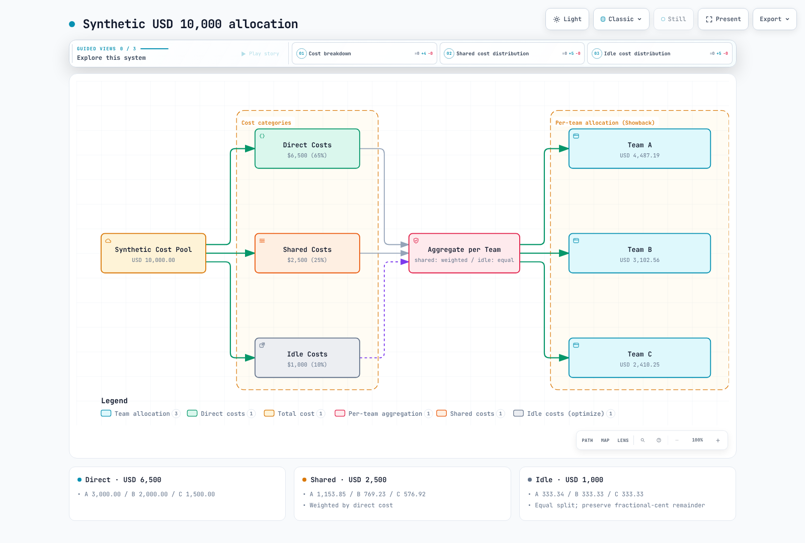

# Plataforma FinOps de visibilidad de costes

> **Última actualización**: 12 de septiembre de 2026. OpenCost 1.121.2 / chart 2.5.31, Kubecost 3.2.4, Kyverno 1.19.1.
> **Validación**: Render Helm, esquemas Kubernetes, proveedores simulados Terraform, cálculos locales y evaluación de políticas. No representa instalación productiva ni conciliación con una factura AWS real.

< [Anterior: Capacidad para eventos](./12-event-capacity-planning.md) | [Contenido](./README.md) | [Siguiente: Tekton Pipelines](./14-tekton-pipelines.md) >

## Descripción general

FinOps reúne ingeniería, finanzas, producto y negocio para gestionar el valor del gasto tecnológico. Reducir costes no es el único criterio: también importan niveles de servicio, crecimiento, economía unitaria y atribución fiable.

El capítulo distingue y conecta asignación Kubernetes, facturación AWS y presupuestos de equipos. Sustituya clústeres, namespaces, buckets y roles antes de desplegar. Los comandos crean recursos reales; la validación aquí fue local.

## 1. Modelo operativo FinOps

Inform abarca recopilación, asignación y visibilidad. Optimize convierte mediciones en mejoras. Operate mantiene propiedad, presupuestos y revisiones. Las fases se repiten.


[Ver diagrama interactivo](https://www.atomai.click/kubernetes-docs/archmaps/en-ops-13-finops-cost-platform-0.html)

| Rol | Responsabilidad |
| --- | --- |
| Plataforma | Recopilación fiable, control de acceso a costes y actualizaciones |
| Equipos de servicio | Etiquetas, requests, pruebas y revisión de cambios |
| Finanzas / FinOps | Conciliar facturas, reglas compartidas, presupuestos y previsiones |
| Producto / negocio | Economía unitaria, valor y prioridades de inversión |

Crawl/Walk/Run describen capacidades por área, no calendarios universales de 1–3 o 6–12 meses. Establezca calidad y propiedad antes de automatizar cargos o borrados.

## 2. Datos de costes e instalación

### 2.1 Distinguir mediciones

| Medición | Significado | Limitación |
| --- | --- | --- |
| Tasa actual asignada, USD/hora | Asignación y modelo de precios actuales | No es gasto mensual real |
| Coste del modelo en una ventana | Atribución Kubernetes en un período explícito | Depende de cobertura, retención y modelo |
| CUR 2.0 / Cost Explorer | Costes basados en facturación AWS | Retraso, descuentos, créditos, impuestos y amortización |
| Estimación lineal de fin de mes | Coste acumulado / días completos × días del mes | No modela estacionalidad ni cambios de demanda |

CPU y memoria EC2 generalmente no se facturan por separado. Los precios por núcleo/GiB de OpenCost reparten el coste de instancia. No presente precios arbitrarios o un segundo descuento contractual general como factura. Sumar Cloud Cost y Allocation de la misma infraestructura puede duplicar el gasto.

### 2.2 Instalar OpenCost

Esto presupone Prometheus Operator y el CRD ServiceMonitor de la [pila de observabilidad](./09-observability-stack.md), más un StorageClass `gp3` apropiado. El almacenamiento de EKS puede utilizar el controlador EBS CSI o la configuración de StorageClass de Auto Mode. El `release: prometheus` del ejemplo debe coincidir con el selector real de ServiceMonitor de Prometheus.

Siete días de retención no reconstruyen un mes. El análisis mensual necesita retención/almacenamiento suficientes; ampliarlos no recupera datos borrados. El PVC del exporter no sustituye al de Prometheus.

**`opencost-values.yaml`**

```yaml
serviceAccount:
  create: true
  name: opencost
opencost:
  mcp:
    enabled: false
  exporter:
    defaultClusterId: eks-production
    resources:
      requests:
        cpu: 100m
        memory: 256Mi
      limits:
        memory: 2Gi
    persistence:
      enabled: true
      accessMode: ReadWriteOnce
      storageClass: gp3
      size: 10Gi
  prometheus:
    internal:
      enabled: true
      serviceName: prometheus-kube-prometheus-prometheus
      namespaceName: observability
      port: 9090
    external:
      enabled: false
  metrics:
    serviceMonitor:
      enabled: true
      namespace: opencost
      additionalLabels:
        release: prometheus
      honorLabels: true
  customPricing:
    enabled: false
  cloudCost:
    enabled: false
  ui:
    enabled: true
    ingress:
      enabled: false
```

```bash
helm repo add opencost https://opencost.github.io/opencost-helm-chart
helm repo update opencost
helm upgrade --install opencost opencost/opencost \
  --version 2.5.31 --namespace opencost --create-namespace \
  -f opencost-values.yaml --wait --timeout 10m
kubectl -n opencost get pods,pvc,svc,servicemonitor
kubectl -n opencost port-forward service/opencost 9090:9090 9003:9003
```

La UI local usa `9090` y la API `9003`. `opencost.prometheus` y `opencost.cloudCost` no son hijos de exporter. Chart 2.5.31 habilita MCP por defecto; aquí se desactiva explícitamente. Si expone herramientas de coste por MCP, diseñe autenticación y alcance aparte; MCP de costes no es MCP de búsqueda documental.

### 2.3 Elegir Kubecost 3.x

Kubecost es otro producto/despliegue. 3.x usa ClickHouse y recopilación `finops-agent`. No copie intactos `kubecostModel`, Prometheus o ETL de 2.x. Las instalaciones existentes necesitan migración oficial con agentes intermedios, reingesta y restricciones de funciones.

El repositorio actual del chart es `https://kubecost.github.io/kubecost/`. Esta es una configuración base de instalación con funciones limitadas. Deshabilita explícitamente Cluster Controller, Admission Controller y la previsión. No la utilice como comando de sustitución directa de instalaciones y almacenamiento existentes.

**`kubecost-values.yaml`**

```yaml
global:
  clusterId: eks-production
  defaultStorageClass: gp3
frontend:
  enabled: true
  service:
    type: ClusterIP
localStore:
  enabled: true
  persistentVolume:
    enabled: true
    size: 32Gi
    storageClass: gp3
finopsagent:
  enabled: true
aggregator:
  enabled: true
cloudCost:
  enabled: false
networkCosts:
  enabled: false
clusterController:
  enabled: false
kubecostAdmissionController:
  enabled: false
forecasting:
  enabled: false
ingress:
  enabled: false
telemetry:
  enabled: false
```

```bash
helm repo add kubecost https://kubecost.github.io/kubecost/
helm repo update kubecost
helm template kubecost kubecost/kubecost --version 3.2.4 \
  --namespace kubecost -f kubecost-values.yaml > kubecost-rendered.yaml
# Review storage, RBAC, images and product entitlements before installation.
helm install kubecost kubecost/kubecost --version 3.2.4 \
  --namespace kubecost --create-namespace -f kubecost-values.yaml
```

Compruebe los derechos del producto para SSO, RBAC detallado y funciones multiclúster. La presencia de valores SAML/OIDC no habilita esas funciones en todos los despliegues. `global.acknowledged` se refiere a la confirmación de una actualización principal de Enterprise, no a la aceptación general de la licencia. Un ALB interno no autentica usuarios.

### 2.4 CUR 2.0, Athena y OpenCost Cloud Cost

Terraform define **una nueva exportación CUR 2.0, dos buckets S3, un workgroup Athena y un rol IRSA OpenCost**. Revise propiedad/importación antes de gestionar recursos existentes. Los datos de toda la organización requieren permisos de la cuenta de administración.

No incluye crawler ni tablas Glue. Siga el procesamiento Athena de Data Exports: espere la primera entrega y cree/actualice tabla y particiones desde el **directorio de datos**. No mezcle manifiestos/metadatos con la tabla. Proporcione nombres resultantes de base y tabla; Lake Formation necesita concesiones adicionales.

`COST_AND_USAGE_REPORT` es fuente SQL de Data Exports, no nombre universal de tabla Glue. Inspeccione el esquema: CUR 2.0 usa partición `billing_period`, no asuma `year`/`month` del CUR antiguo.

Data Exports entrega con SSE-S3. No copie requisitos de entrega KMS directa. Si necesita KMS, diseñe el cifrado posterior documentado y permisos de consumo. Archivos que requieren restauración pueden romper consultas sobre datos activos.

**`cur.tf`**

```hcl
terraform {
  required_version = ">= 1.12.0"
  required_providers {
    aws = {
      source  = "hashicorp/aws"
      version = "= 6.64.0"
    }
  }
}

provider "aws" {
  region = var.region
}

provider "aws" {
  alias  = "billing"
  region = "us-east-1"
}

variable "region" {
  type    = string
  default = "ap-northeast-2"
}

variable "cur_bucket" {
  type = string
}

variable "results_bucket" {
  type = string
  validation {
    condition     = var.results_bucket != var.cur_bucket
    error_message = "Use separate CUR source and Athena result buckets."
  }
}

variable "oidc_provider_arn" {
  type = string
}

variable "oidc_issuer" {
  type = string
}

variable "glue_database" {
  type = string
}

variable "glue_table" {
  type = string
}

data "aws_caller_identity" "current" {}
data "aws_partition" "current" {}

locals {
  account = data.aws_caller_identity.current.account_id
  arn     = "arn:${data.aws_partition.current.partition}"
  issuer  = trimprefix(trimsuffix(var.oidc_issuer, "/"), "https://")
  buckets = { cur = var.cur_bucket, results = var.results_bucket }
}

resource "aws_s3_bucket" "cost" {
  for_each      = local.buckets
  bucket        = each.value
  force_destroy = false
}

resource "aws_s3_bucket_public_access_block" "cost" {
  for_each                = aws_s3_bucket.cost
  bucket                  = each.value.id
  block_public_acls       = true
  block_public_policy     = true
  ignore_public_acls      = true
  restrict_public_buckets = true
}

resource "aws_s3_bucket_ownership_controls" "cost" {
  for_each = aws_s3_bucket.cost
  bucket   = each.value.id
  rule {
    object_ownership = "BucketOwnerEnforced"
  }
}

resource "aws_s3_bucket_server_side_encryption_configuration" "cost" {
  for_each = aws_s3_bucket.cost
  bucket   = each.value.id
  rule {
    apply_server_side_encryption_by_default {
      sse_algorithm = "AES256"
    }
  }
}

resource "aws_s3_bucket_policy" "delivery" {
  bucket = aws_s3_bucket.cost["cur"].id
  policy = jsonencode({
    Version = "2012-10-17"
    Statement = [{
      Sid       = "AllowDataExports"
      Effect    = "Allow"
      Principal = { Service = "bcm-data-exports.amazonaws.com" }
      Action    = "s3:PutObject"
      Resource  = "${aws_s3_bucket.cost["cur"].arn}/cur/*"
      Condition = {
        StringEquals = { "aws:SourceAccount" = local.account }
        ArnLike = {
          "aws:SourceArn" = "${local.arn}:bcm-data-exports:us-east-1:${local.account}:export/*"
        }
      }
    }]
  })
}

resource "aws_bcmdataexports_export" "cur" {
  provider = aws.billing
  depends_on = [
    aws_s3_bucket_policy.delivery,
    aws_s3_bucket_public_access_block.cost,
    aws_s3_bucket_server_side_encryption_configuration.cost
  ]
  export {
    name = "opencost-cur"
    data_query {
      query_statement = "SELECT * FROM COST_AND_USAGE_REPORT"
      table_configurations = {
        COST_AND_USAGE_REPORT = {
          BILLING_VIEW_ARN                      = "${local.arn}:billing::${local.account}:billingview/primary"
          TIME_GRANULARITY                      = "HOURLY"
          INCLUDE_RESOURCES                     = "TRUE"
          INCLUDE_MANUAL_DISCOUNT_COMPATIBILITY = "FALSE"
          INCLUDE_SPLIT_COST_ALLOCATION_DATA    = "FALSE"
        }
      }
    }
    destination_configurations {
      s3_destination {
        s3_bucket = aws_s3_bucket.cost["cur"].bucket
        s3_prefix = "cur"
        s3_region = var.region
        s3_output_configurations {
          overwrite   = "OVERWRITE_REPORT"
          format      = "PARQUET"
          compression = "PARQUET"
          output_type = "CUSTOM"
        }
      }
    }
    refresh_cadence {
      frequency = "SYNCHRONOUS"
    }
  }
}

resource "aws_athena_workgroup" "opencost" {
  name          = "opencost-cur"
  force_destroy = false
  configuration {
    enforce_workgroup_configuration    = true
    publish_cloudwatch_metrics_enabled = true
    bytes_scanned_cutoff_per_query     = 10737418240
    result_configuration {
      output_location       = "s3://${aws_s3_bucket.cost["results"].bucket}/opencost/"
      expected_bucket_owner = local.account
      encryption_configuration {
        encryption_option = "SSE_S3"
      }
    }
  }
}

resource "aws_iam_role" "opencost" {
  name = "opencost-cur-reader"
  assume_role_policy = jsonencode({
    Version = "2012-10-17"
    Statement = [{
      Effect    = "Allow"
      Principal = { Federated = var.oidc_provider_arn }
      Action    = "sts:AssumeRoleWithWebIdentity"
      Condition = {
        StringEquals = {
          "${local.issuer}:aud" = "sts.amazonaws.com"
          "${local.issuer}:sub" = "system:serviceaccount:opencost:opencost"
        }
      }
    }]
  })
}

resource "aws_iam_role_policy" "opencost" {
  role = aws_iam_role.opencost.id
  policy = jsonencode({
    Version = "2012-10-17"
    Statement = [
      {
        Effect = "Allow"
        Action = ["athena:StartQueryExecution", "athena:StopQueryExecution",
        "athena:GetQueryExecution", "athena:GetQueryResults", "athena:GetWorkGroup"]
        Resource = aws_athena_workgroup.opencost.arn
      },
      {
        Effect = "Allow"
        Action = ["glue:GetDatabase", "glue:GetDatabases", "glue:GetTable",
        "glue:GetTables", "glue:GetPartitions"]
        Resource = [
          "${local.arn}:glue:${var.region}:${local.account}:catalog",
          "${local.arn}:glue:${var.region}:${local.account}:database/${var.glue_database}",
          "${local.arn}:glue:${var.region}:${local.account}:table/${var.glue_database}/${var.glue_table}"
        ]
      },
      {
        Effect   = "Allow"
        Action   = "s3:GetBucketLocation"
        Resource = [for b in aws_s3_bucket.cost : b.arn]
      },
      {
        Effect    = "Allow"
        Action    = "s3:ListBucket"
        Resource  = aws_s3_bucket.cost["cur"].arn
        Condition = { StringLike = { "s3:prefix" = ["cur", "cur/*"] } }
      },
      {
        Effect    = "Allow"
        Action    = "s3:ListBucket"
        Resource  = aws_s3_bucket.cost["results"].arn
        Condition = { StringLike = { "s3:prefix" = ["opencost", "opencost/*"] } }
      },
      {
        Effect   = "Allow"
        Action   = "s3:GetObject"
        Resource = "${aws_s3_bucket.cost["cur"].arn}/cur/*"
      },
      {
        Effect   = "Allow"
        Action   = ["s3:GetObject", "s3:PutObject", "s3:AbortMultipartUpload"]
        Resource = "${aws_s3_bucket.cost["results"].arn}/opencost/*"
      }
    ]
  })
}

output "opencost_role_arn" {
  value = aws_iam_role.opencost.arn
}

output "cur_export_arn" {
  value = aws_bcmdataexports_export.cur.arn
}

output "athena_results" {
  value = "s3://${aws_s3_bucket.cost["results"].bucket}/opencost/"
}
```

`glue_database` y `glue_table` identifican el destino, no lo crean. El límite de exploración Athena es 10 GiB por consulta: investigue fallos y adáptelo. Registros horarios no implican entrega cada hora.

Este ejemplo utiliza **IRSA**. Proporcione el ARN y el emisor del proveedor OIDC existente y haga coincidir el `sub` de la política de confianza con el ServiceAccount real `opencost/opencost`. EKS Pod Identity utiliza una política de confianza y una asociación diferentes en lugar de la anotación IRSA.

**`cloud-integration.json`**

```json
{
  "aws": {
    "athena": [
      {
        "bucket": "s3://REPLACE_QUERY_RESULTS_BUCKET/opencost/",
        "region": "ap-northeast-2",
        "database": "REPLACE_GLUE_DATABASE",
        "catalog": "AwsDataCatalog",
        "table": "REPLACE_GLUE_TABLE",
        "workgroup": "opencost-cur",
        "account": "123456789012",
        "authorizer": {
          "authorizerType": "AWSServiceAccount"
        }
      }
    ]
  }
}
```

**`opencost-cloud-values.yaml`**

```yaml
serviceAccount:
  create: true
  name: opencost
  annotations:
    eks.amazonaws.com/role-arn: arn:aws:iam::123456789012:role/opencost-cur-reader
opencost:
  cloudIntegrationSecret: opencost-cloud-integrations
  cloudCost:
    enabled: true
```

```bash
# Replace all placeholders and account IDs in the files first.
kubectl -n opencost create secret generic opencost-cloud-integrations \
  --from-file=cloud-integration.json=cloud-integration.json \
  --dry-run=client -o yaml | kubectl apply -f -
helm upgrade opencost opencost/opencost --version 2.5.31 \
  --namespace opencost -f opencost-values.yaml -f opencost-cloud-values.yaml
```

`bucket` es el **bucket de resultados Athena**, no el origen CUR. `AWSServiceAccount` usa la cadena de credenciales SDK predeterminada, no claves estáticas. Compruebe lecturas, escrituras, montaje Secret y frescura del importador antes de afirmar que funciona.

Las claves de etiquetas de costes pueden faltar antes de activarse. AWS admite backfill desde la cuenta administradora hasta 12 meses si existían etiquetas en ese período, sujeto a demora. Etiquetar ahora no inventa etiquetas históricas.

## 3. Showback y chargeback

Showback hace visible el gasto; chargeback lo asigna y factura según reglas acordadas. Un valor modelado no es automáticamente una factura interna. Defina período, moneda, categorías directas/compartidas/ociosas/no asignadas, impuestos, créditos, reembolsos y redondeo.

### 3.1 Etiquetas y políticas

Use `team` en namespaces para equipos y `team` / `cost-center` en plantillas Pod para mayor detalle. Etiquetas Kubernetes y AWS son datos distintos. La asignación por namespace puede funcionar sin team, pero el mapeo a equipos no está garantizado.

Kyverno 1.19.1 advierte que ClusterPolicy está obsoleto. Los nuevos ejemplos usan CEL `ValidatingPolicy` de `policies.kyverno.io/v1`, con CRD/controlador correspondientes. Seleccionan `finops.example.com/enabled=true` y generan comprobaciones de plantillas de controladores Pod.

**`cost-labels.yaml`**

```yaml
apiVersion: policies.kyverno.io/v1
kind: ValidatingPolicy
metadata:
  name: finops-pod-labels
spec:
  validationActions: [Audit]
  evaluation:
    admission:
      enabled: true
    background:
      enabled: true
  autogen:
    podControllers:
      controllers: [deployments, statefulsets, daemonsets, jobs, cronjobs]
  matchConstraints:
    namespaceSelector:
      matchLabels:
        finops.example.com/enabled: "true"
    resourceRules:
      - apiGroups: [""]
        apiVersions: [v1]
        operations: [CREATE, UPDATE]
        resources: [pods]
  validations:
    - expression: >-
        ['team', 'cost-center'].all(label,
          object.metadata.?labels[label].orValue('') != '')
      message: "Add team and cost-center labels to the Pod template."
```

**`resource-requests.yaml`**

```yaml
apiVersion: policies.kyverno.io/v1
kind: ValidatingPolicy
metadata:
  name: finops-container-requests
spec:
  validationActions: [Audit]
  evaluation:
    admission:
      enabled: true
    background:
      enabled: true
  autogen:
    podControllers:
      controllers: [deployments, statefulsets, daemonsets, jobs, cronjobs]
  matchConstraints:
    namespaceSelector:
      matchLabels:
        finops.example.com/enabled: "true"
    resourceRules:
      - apiGroups: [""]
        apiVersions: [v1]
        operations: [CREATE, UPDATE]
        resources: [pods]
  validations:
    - expression: >-
        object.spec.containers.all(c,
          has(c.resources) && has(c.resources.requests) &&
          ['cpu', 'memory'].all(r,
            r in c.resources.requests &&
            quantity(c.resources.requests[r]).isGreaterThan(quantity('0'))))
      message: "Set positive CPU and memory requests for each regular container."
```

`Audit` no bloquea infracciones. Revise los informes en segundo plano y el ámbito, resuelva los problemas con los responsables y cambie después las políticas seleccionadas a `Deny`. Elija `Warn` por separado si desea advertencias para los usuarios. La CLI local puede devolver una prueba fallida para una política Audit; eso no demuestra que se denegaría la admisión.

La política exige **requests positivos de CPU y memoria en cada contenedor ordinario**. Init, presupuestos Pod y límites necesitan políticas separadas. Cuatro núcleos / 8 GiB universales no demuestran dimensionamiento correcto.

```yaml
apiVersion: v1
kind: Namespace
metadata:
  name: team-backend
  labels:
    team: backend
    finops.example.com/enabled: "true"
---
apiVersion: v1
kind: ResourceQuota
metadata:
  name: team-capacity
  namespace: team-backend
spec:
  hard:
    requests.cpu: "20"
    requests.memory: 40Gi
    requests.storage: 200Gi
    persistentvolumeclaims: "20"
    pods: "100"
```

Es una cuota de recursos ilustrativa, no presupuesto monetario ni límite de todo gasto cloud. Dimensione según uso y máximos de escalado, y prevea rechazos de creación.

### 3.2 API de asignación por período

Use `/allocation/compute` de OpenCost 1.121.2. Compruebe ventana, agregación y respuesta de esa versión. `includeIdle` y `shareIdle` son booleanos; `shareIdle=weighted` no es su forma documentada.

```bash
curl --fail --silent --show-error --get \
  'http://127.0.0.1:9003/allocation/compute' \
  --data-urlencode 'window=2026-09-01T00:00:00Z,2026-09-12T00:00:00Z' \
  --data-urlencode 'aggregate=namespace' \
  --data-urlencode 'includeIdle=true' \
  --data-urlencode 'shareIdle=false'
```

### 3.3 Reparto de costes compartidos y conservación

Son **entradas sintéticas en USD para validar cálculos, no una factura real**. Las categorías no solapadas suman 6,500 directos, 2,500 compartidos y 1,000 ociosos. Lo compartido se pondera por directo; lo ocioso se reparte por igual. Fracciones de céntimo usan mayores restos con desempate léxico por equipo.



[Ver diagrama interactivo](https://www.atomai.click/kubernetes-docs/archmaps/en-ops-13-finops-cost-platform-1.html)

```text
Team     Direct    Shared     Idle      Total
A        3000.00   1153.85    333.34     4487.19
B        2000.00    769.23    333.33     3102.56
C        1500.00    576.92    333.33     2410.25
Total    6500.00   2500.00   1000.00    10000.00
```

**`allocation-example.json`**

```json
{
  "description": "Synthetic reconciled expense pool, not an actual account bill.",
  "currency": "USD",
  "direct": {
    "team-a": "3000.00",
    "team-b": "2000.00",
    "team-c": "1500.00"
  },
  "shared": "2500.00",
  "idle": "1000.00",
  "unallocated": "0.00"
}
```

**`allocate_costs.py`**

```python
"""Allocate one reconciled USD expense pool using explicit, conserved cent amounts."""
import argparse
import json
from decimal import Decimal
from fractions import Fraction


def cents(value):
    if isinstance(value, bool):
        raise ValueError("Money cannot be boolean")
    value=Decimal(str(value))
    if not value.is_finite() or value < 0:
        raise ValueError("Use finite nonnegative expense amounts; handle refunds explicitly")
    scaled=value*100
    if scaled != scaled.to_integral_value():
        raise ValueError("Settle source amounts to cents under an approved rounding policy first")
    return int(scaled)


def money(value):
    return f"{Decimal(value)/100:.2f}"


def distribute(total, weights):
    if not weights:
        raise ValueError("At least one allocation target is required")
    rational={}
    for name, weight in weights.items():
        value=Decimal(str(weight))
        if not value.is_finite() or value < 0:
            raise ValueError("Weights must be finite and nonnegative")
        rational[name]=Fraction(value)
    denominator=sum(rational.values(),Fraction(0))
    if denominator==0:
        if total:
            raise ValueError("A positive pool cannot be allocated with zero total weight")
        return {name:0 for name in weights}
    exact={name:Fraction(total)*weight/denominator for name,weight in rational.items()}
    result={name:value.numerator//value.denominator for name,value in exact.items()}
    remainder=total-sum(result.values())
    # Largest remainder; ties resolved by stable target name.
    order=sorted(exact,key=lambda name:(-(exact[name]-result[name]),name))
    for name in order[:remainder]:
        result[name]+=1
    assert sum(result.values())==total
    return result


def allocate(config):
    if config.get("currency")!="USD":
        raise ValueError("This example accepts a single USD ledger; do not mix currencies")
    direct={name:cents(value) for name,value in config["direct"].items()}
    if not direct:
        raise ValueError("No teams supplied")
    shared=cents(config["shared"])
    idle=cents(config["idle"])
    unallocated=cents(config.get("unallocated","0"))
    shared_alloc=distribute(shared,direct)
    idle_alloc=distribute(idle,{name:1 for name in direct})
    teams={name:{"direct":money(value),"shared":money(shared_alloc[name]),"idle":money(idle_alloc[name]),
                 "total":money(value+shared_alloc[name]+idle_alloc[name])} for name,value in sorted(direct.items())}
    source_total=sum(direct.values())+shared+idle+unallocated
    allocated_total=sum(cents(value["total"]) for value in teams.values())+unallocated
    assert source_total==allocated_total
    return {"currency":"USD","policy":"Shared weighted by direct cost; idle split equally; unallocated retained",
            "rounding":"Exact cents; largest remainder with lexical tie-break",
            "teams":teams,"unallocated":money(unallocated),"source_total":money(source_total),
            "allocated_total":money(allocated_total),
            "limits":["Use one reconciled pool; do not add overlapping Allocation and Cloud Cost totals.",
                      "This policy is an example, not an inherently fair or mandatory chargeback rule.",
                      "Refunds, credits, taxes and currency conversion require explicit separate policies."]}


if __name__=="__main__":
    parser=argparse.ArgumentParser()
    parser.add_argument("input")
    args=parser.parse_args()
    try:
        with open(args.input,encoding="utf-8") as stream:
            result=allocate(json.load(stream))
    except (ValueError,KeyError,ArithmeticError) as error:
        parser.error(str(error))
    print(json.dumps(result,ensure_ascii=False,indent=2))
```

```bash
python3 allocate_costs.py allocation-example.json
```

Conserve importes sin atribuir como `unallocated`. La calculadora no redistribuye automáticamente costes negativos/reembolsos. La contabilidad real necesita reglas de créditos, reembolsos y divisas. El ejemplo no es inherentemente el más justo para todas las organizaciones.

### 3.4 Prometheus y Grafana

Se supone **Prometheus de un clúster**. Consultas centrales Prometheus/Thanos deben conservar identidad real de clúster en agregaciones y joins. Unir solo por nombre de nodo puede mezclar costes.

`node_cpu_hourly_cost` es por núcleo y `node_ram_hourly_cost` por GiB/hora. Multiplique por asignación y deduplique scrapes con `max`. No invente `kubecost_container_cpu_cost`. Combine este ajuste kube-state-metrics con los values existentes antes de unir etiquetas.

```yaml
kube-state-metrics:
  metricLabelsAllowlist:
    - namespaces=[team]
```

**`cost-rules.yaml`**

```yaml
groups:
  - name: finops-current-rates
    rules:
      - record: finops:node_cpu_hourly_cost
        expr: max by (node) (node_cpu_hourly_cost)
      - record: finops:node_ram_hourly_cost
        expr: max by (node) (node_ram_hourly_cost)
      - record: finops:namespace_cpu_cost_per_hour
        expr: |
          sum by (namespace) (
            max by (namespace, pod, container, node) (container_cpu_allocation{container!=""})
            * on (node) group_left finops:node_cpu_hourly_cost
          )
      - record: finops:namespace_ram_cost_per_hour
        expr: |
          sum by (namespace) (
            max by (namespace, pod, container, node) (container_memory_allocation_bytes{container!=""}) / 1073741824
            * on (node) group_left finops:node_ram_hourly_cost
          )
      - record: finops:namespace_compute_cost_per_hour
        expr: finops:namespace_cpu_cost_per_hour + finops:namespace_ram_cost_per_hour
      - record: finops:team_compute_cost_per_hour
        expr: |
          sum by (label_team) (
            finops:namespace_compute_cost_per_hour
            * on (namespace) group_left (label_team)
              max by (namespace, label_team) (kube_namespace_labels{label_team!=""})
          )
      - alert: OpenCostMetricsUnavailable
        expr: absent(node_cpu_hourly_cost)
        for: 15m
        labels:
          severity: warning
        annotations:
          summary: "OpenCost CPU pricing metrics are absent"
      - alert: KubernetesComputeRateAboveReviewThreshold
        expr: sum(finops:namespace_compute_cost_per_hour) > 20
        for: 30m
        labels:
          severity: warning
        annotations:
          summary: "Allocated compute model exceeds the example USD 20/hour threshold"
```

El archivo tiene formato de archivo de reglas de Prometheus. Con el operador, colóquelo bajo `PrometheusRule.spec` y establezca etiquetas de metadatos que coincidan con el selector real de reglas. USD 20/hora durante 30 minutos es un umbral de revisión de ejemplo sobre datos del modelo. `for` requiere que una condición persista; no elimina los falsos positivos.

Los paneles pueden usar `finops:namespace_compute_cost_per_hour` y `finops:team_compute_cost_per_hour`, en **USD/hora**. Son tasas asignadas CPU/RAM, no factura con todo almacenamiento/red/control/ociosidad. Marque `* 730` como estimación fija de 730 horas. Precios ausentes deben verse ausentes, no gratuitos.

Los espacios de nombres sin etiquetas de equipo pueden desaparecer de la agregación por equipo. Compare el total completo de espacios de nombres con el total de equipos. Las variables y carpetas de paneles no imponen autorización de fuentes de datos. Utilice permisos de fuentes de datos del servidor o inquilinos separados para aislar equipos, y pruebe que se denieguen las consultas entre equipos.

## 4. Anomalías basadas en facturación

Un monitor Cost Anomaly Detection `DIMENSIONAL` / `SERVICE` cubre gasto de servicios AWS; llamarlo «EKS» no lo limita a EKS. Para CUSTOM por etiquetas, cuentas o categorías, compruebe alcance y disponibilidad. Reutilice ARN existentes cuando proceda.

Esta configuración opcional acompaña al Terraform anterior. Distinga resúmenes EMAIL `DAILY` de notificaciones SNS `IMMEDIATE`. SNS sigue actualizaciones de facturación/detección; no detiene gasto instantáneamente. Necesita suscriptores aprobados aparte. No crea suscripción Slack.

**`anomaly.tf`**

```hcl
# Optional: supply an existing monitor ARN to avoid duplicating a SERVICE monitor.
variable "cost_monitor_arn" {
  type = string
}

variable "notification_email" {
  type = string
}

resource "aws_ce_anomaly_subscription" "daily" {
  provider         = aws.billing
  name             = "daily-cost-anomalies"
  frequency        = "DAILY"
  monitor_arn_list = [var.cost_monitor_arn]
  threshold_expression {
    dimension {
      key           = "ANOMALY_TOTAL_IMPACT_ABSOLUTE"
      match_options = ["GREATER_THAN_OR_EQUAL"]
      values        = ["100"]
    }
  }
  subscriber {
    type    = "EMAIL"
    address = var.notification_email
  }
}

resource "aws_sns_topic" "anomalies" {
  provider = aws.billing
  name     = "cost-anomalies"
}

resource "aws_sns_topic_policy" "anomalies" {
  provider = aws.billing
  arn      = aws_sns_topic.anomalies.arn
  policy = jsonencode({
    Version = "2012-10-17"
    Statement = [{
      Effect    = "Allow"
      Principal = { Service = "costalerts.amazonaws.com" }
      Action    = "sns:Publish"
      Resource  = aws_sns_topic.anomalies.arn
      Condition = {
        StringEquals = { "aws:SourceAccount" = local.account }
        ArnLike = {
          "aws:SourceArn" = "${local.arn}:ce::${local.account}:anomalysubscription/*"
        }
      }
    }]
  })
}

resource "aws_ce_anomaly_subscription" "immediate" {
  provider         = aws.billing
  depends_on       = [aws_sns_topic_policy.anomalies]
  name             = "immediate-cost-anomalies"
  frequency        = "IMMEDIATE"
  monitor_arn_list = [var.cost_monitor_arn]
  threshold_expression {
    dimension {
      key           = "ANOMALY_TOTAL_IMPACT_ABSOLUTE"
      match_options = ["GREATER_THAN_OR_EQUAL"]
      values        = ["100"]
    }
  }
  subscriber {
    type    = "SNS"
    address = aws_sns_topic.anomalies.arn
  }
}
```

Crear recursos/suscripciones tiene efectos reales de coste/notificación. SNS con KMS necesita permisos de clave para `costalerts.amazonaws.com` y restricciones SourceAccount/SourceArn. Adapte USD 100 a la organización.

AWS Budgets Actions puede realizar acciones EC2/RDS compatibles además de IAM/SCP. Demoras y alcance siguen aplicándose; no es un límite rígido que detenga todo gasto al instante.

## 5. Presupuestos y reportes programados

### 5.1 Presupuestos numéricos explícitos

`label_replace` no convierte una anotación de texto en serie numérica. El ejemplo analiza presupuestos USD explícitos desde JSON. La ausencia genera proporción `null`; cero, negativos o números inválidos se rechazan.

**`budgets.json`**

```json
{
  "currency": "USD",
  "namespaces": {
    "backend-production": "3000.00",
    "frontend-production": "2000.00"
  }
}
```

### 5.2 Informe mensual y envío opcional a Slack

El script solo usa la biblioteca estándar Python 3.12. Consulta días UTC completos; `--as-of` es la **fecha final excluida**. El primer día del mes informa el anterior completo. Datos vacíos o varios pasos temporales fallan, no se convierten en USD 0 ficticio. No prueba cobertura histórica completa: revise avisos y frescura.

Por defecto crea JSON y no envía Slack. Se necesitan `--send` y `--webhook-file`. Canales distintos requieren webhooks entrantes separados; no se usa override `channel` del payload.

**`report_costs.py`**

```python
"""Read-only OpenCost monthly model-cost report and optional reviewed Slack delivery."""
import argparse
import calendar
import json
from datetime import date, datetime, timedelta, timezone
from decimal import Decimal, ROUND_HALF_UP
from pathlib import Path
from urllib.parse import urlencode, urlsplit
from urllib.request import Request, build_opener, HTTPRedirectHandler


class NoRedirect(HTTPRedirectHandler):
    def redirect_request(self, req, fp, code, msg, headers, newurl):
        return None


def decimal_value(value, name, positive=False):
    if value is None or isinstance(value, bool):
        raise ValueError(f"{name}: missing/invalid number")
    amount=Decimal(str(value))
    if not amount.is_finite() or (positive and amount <= 0):
        raise ValueError(f"{name}: invalid finite range")
    return amount


def usd(value):
    return format(value.quantize(Decimal("0.01"),rounding=ROUND_HALF_UP),"f")


def month_window(as_of):
    end=date.fromisoformat(as_of)
    month_reference=end if end.day>1 else end-timedelta(days=1)
    start=month_reference.replace(day=1)
    completed=(end-start).days
    return start,end,completed,calendar.monthrange(start.year,start.month)[1]


def summarize(payload, budgets, as_of):
    start,end,days,month_days=month_window(as_of)
    if not isinstance(payload,dict) or not isinstance(budgets,dict) or not isinstance(budgets.get("namespaces",{}),dict):
        raise ValueError("Expected API and budget JSON objects")
    if budgets.get("currency")!="USD":
        raise ValueError("This report requires an explicitly configured USD cost source and budgets")
    if payload.get("code",200)!=200 or payload.get("status","success")!="success" or payload.get("errors"):
        raise ValueError("Cost API reported an error")
    sets=payload.get("data")
    if not isinstance(sets,list) or len(sets)!=1 or not isinstance(sets[0],dict) or not sets[0]:
        raise ValueError("Expected one nonempty whole-window allocation set; missing data is not zero cost")
    namespace_costs={}
    for namespace,allocation in sets[0].items():
        if not isinstance(allocation,dict) or "totalCost" not in allocation:
            raise ValueError(f"{namespace}: missing allocation cost")
        namespace_costs[namespace]=decimal_value(allocation["totalCost"],namespace)
    total=sum(namespace_costs.values(),Decimal(0))
    rows=[]
    for namespace,cost in sorted(namespace_costs.items(),key=lambda row:(-row[1],row[0])):
        budget=budgets.get("namespaces",{}).get(namespace)
        budget_value=None if budget is None else decimal_value(budget,"budget",positive=True)
        projected=cost*Decimal(month_days)/Decimal(days)
        rows.append({
            "namespace":namespace,
            "model_cost_to_date_usd":usd(cost),
            "linear_month_estimate_usd":usd(projected),
            "budget_usd":None if budget_value is None else usd(budget_value),
            "model_budget_ratio":None if budget_value is None else str(cost/budget_value),
            "linear_estimate_budget_ratio":None if budget_value is None else str(projected/budget_value),
        })
    return {
        "source":"OpenCost allocation model, not an AWS invoice",
        "currency":"USD","window_start":start.isoformat()+"T00:00:00Z",
        "window_end_exclusive":end.isoformat()+"T00:00:00Z",
        "completed_calendar_days":days,"days_in_month":month_days,
        "total_model_cost_to_date_usd":usd(total),
        "total_linear_month_estimate_usd":usd(total*Decimal(month_days)/Decimal(days)),
        "namespaces":rows,"api_warnings":payload.get("warnings",[]),
        "limits":[
            "Linear estimates assume complete coverage and stable daily cost; inspect retention, gaps and importer freshness.",
            "Idle and unallocated buckets are retained; this is not automatic chargeback.",
            "Calendar-to-date model cost, a linear estimate and actual billed cost are different quantities.",
            "Do not add overlapping cloud-billing and Kubernetes-allocation totals."
        ]
    }


def get_allocation(base_url, as_of):
    start,end,_,_=month_window(as_of)
    parsed=urlsplit(base_url)
    if parsed.scheme not in ("http","https") or not parsed.netloc or parsed.username or parsed.query or parsed.fragment:
        raise ValueError("Use an HTTP(S) API base URL without credentials, query or fragment")
    query=urlencode({
        "window":start.isoformat()+"T00:00:00Z,"+end.isoformat()+"T00:00:00Z",
        "aggregate":"namespace","includeIdle":"true","shareIdle":"false","resolution":"1m"
    })
    request=Request(base_url.rstrip("/")+"/allocation/compute?"+query,
                    headers={"Accept":"application/json"},method="GET")
    with build_opener(NoRedirect).open(request,timeout=30) as response:
        if response.status != 200:
            raise ValueError(f"Cost API status {response.status}")
        body=response.read(10*1024*1024+1)
    if len(body)>10*1024*1024:
        raise ValueError("Cost API response exceeded the configured limit")
    return json.loads(body,parse_float=Decimal)


def slack_payload(report):
    # Dynamic names stay in plain_text blocks to avoid markup/mention interpretation.
    header=f"Calendar-month Kubernetes model costs — {report['window_end_exclusive'][:10]}"
    blocks=[{"type":"header","text":{"type":"plain_text","text":header}},
            {"type":"section","text":{"type":"plain_text","text":
                f"UTC window: {report['window_start']} to {report['window_end_exclusive']} (exclusive)\n"
                f"Model cost: USD {report['total_model_cost_to_date_usd']}\n"
                f"Linear estimate: USD {report['total_linear_month_estimate_usd']}\n"
                "This is an allocation estimate, not an AWS invoice."}}]
    for row in report["namespaces"][:10]:
        text=f"{row['namespace']}: USD {row['model_cost_to_date_usd']}"
        blocks.append({"type":"section","text":{"type":"plain_text","text":text[:2900]}})
    omitted=max(0,len(report["namespaces"])-10)
    if omitted:
        blocks.append({"type":"section","text":{"type":"plain_text","text":
            f"{omitted} additional buckets are included in the total. See the full JSON report."}})
    return {"blocks":blocks}


def send_slack(payload, webhook_file):
    url=Path(webhook_file).read_text().strip()
    parsed=urlsplit(url)
    if parsed.scheme!="https" or parsed.hostname not in ("hooks.slack.com","hooks.slack-gov.com"):
        raise ValueError("Use a trusted HTTPS Slack incoming-webhook URL file")
    body=json.dumps(payload,ensure_ascii=False).encode()
    request=Request(url,data=body,headers={"Content-Type":"application/json"},method="POST")
    with build_opener(NoRedirect).open(request,timeout=15) as response:
        result=response.read(1024).decode().strip()
        if response.status!=200 or result!="ok":
            raise ValueError("Slack did not acknowledge the message")


def main():
    parser=argparse.ArgumentParser()
    source=parser.add_mutually_exclusive_group(required=True)
    source.add_argument("--input")
    source.add_argument("--api-url")
    parser.add_argument("--budgets",required=True)
    parser.add_argument("--as-of",default=datetime.now(timezone.utc).date().isoformat(),
                        help="Exclusive UTC reporting end date")
    parser.add_argument("--report",default="cost-report.json")
    parser.add_argument("--slack-payload",default="slack-payload.json")
    parser.add_argument("--print-report",action="store_true",
                        help="Write model-cost JSON to stdout for controlled log collection")
    parser.add_argument("--send",action="store_true")
    parser.add_argument("--webhook-file")
    args=parser.parse_args()
    try:
        if args.send and not args.webhook_file:
            raise ValueError("--send requires --webhook-file")
        payload=(json.loads(Path(args.input).read_text(),parse_float=Decimal) if args.input
                 else get_allocation(args.api_url,args.as_of))
        budgets=json.loads(Path(args.budgets).read_text(),parse_float=Decimal)
        report=summarize(payload,budgets,args.as_of)
        slack=slack_payload(report)
        Path(args.report).write_text(json.dumps(report,ensure_ascii=False,indent=2)+"\n")
        Path(args.slack_payload).write_text(json.dumps(slack,ensure_ascii=False,indent=2)+"\n")
        if args.print_report:
            print(json.dumps(report,ensure_ascii=False))
        if args.send:
            send_slack(slack,args.webhook_file)
        print(f"Report written: {args.report}; Slack delivery: {'requested' if args.send else 'disabled'}")
    except (ValueError,KeyError,ArithmeticError,OSError) as error:
        parser.exit(1,f"Cost report failed: {error}\n")


if __name__=="__main__":
    main()
```

```bash
python3 report_costs.py \
  --api-url http://127.0.0.1:9003 \
  --budgets budgets.json --as-of 2026-09-12 \
  --report cost-report.json --slack-payload slack-payload.json
```

Datos sintéticos verificaron **USD 1,610.10** de coste y **USD 4,391.18** de estimación lineal. No proceden de la cuenta del lector. Usa 11 días completos de septiembre de 30 días, no proyección fija de 730 horas.

### 5.3 Ejecutar como CronJob

Guarde script/presupuestos en ConfigMap. Se ejecuta diariamente a **09:00 Asia/Seoul**, imprime a stdout y no envía Slack. Los límites del informe son UTC. Los logs contienen costes internos: configure acceso/retención. Los archivos en `emptyDir` desaparecen al borrar el Pod.

```bash
kubectl -n opencost create configmap finops-report-code \
  --from-file=report_costs.py --from-file=budgets.json \
  --dry-run=client -o yaml | kubectl apply -f -
```

**`reporter-cronjob.yaml`**

```yaml
apiVersion: batch/v1
kind: CronJob
metadata:
  name: finops-report
  namespace: opencost
spec:
  schedule: "0 9 * * *"
  timeZone: Asia/Seoul
  concurrencyPolicy: Forbid
  startingDeadlineSeconds: 1800
  successfulJobsHistoryLimit: 2
  failedJobsHistoryLimit: 2
  jobTemplate:
    spec:
      backoffLimit: 0
      activeDeadlineSeconds: 180
      template:
        spec:
          automountServiceAccountToken: false
          restartPolicy: Never
          securityContext:
            runAsNonRoot: true
            runAsUser: 10001
            runAsGroup: 10001
            fsGroup: 10001
            seccompProfile:
              type: RuntimeDefault
          containers:
            - name: report
              image: python:3.12.13-slim
              command: [python, /app/report_costs.py]
              args:
                - --print-report
                - --api-url
                - http://opencost.opencost.svc.cluster.local:9003
                - --budgets
                - /app/budgets.json
                - --report
                - /output/cost-report.json
                - --slack-payload
                - /output/slack-payload.json
              resources:
                requests:
                  cpu: 50m
                  memory: 64Mi
                limits:
                  memory: 256Mi
              securityContext:
                readOnlyRootFilesystem: true
                allowPrivilegeEscalation: false
                capabilities:
                  drop: [ALL]
              volumeMounts:
                - name: app
                  mountPath: /app
                  readOnly: true
                - name: output
                  mountPath: /output
          volumes:
            - name: app
              configMap:
                name: finops-report-code
            - name: output
              emptyDir: {}
```

Verifique el resumen criptográfico de la imagen y la compatibilidad de la plataforma antes de desplegar y luego fije ese resumen. La versión de Python y el código de la biblioteca estándar se probaron localmente; no se descargaron imágenes de contenedor ni se ejecutó el CronJob en el clúster.

Para Slack operativo, monte el webhook como archivo Secret y añada `--send --webhook-file /secrets/webhook`. No lo ponga en documentación, Git o logs. `concurrencyPolicy: Forbid` y `backoffLimit: 0` reducen duplicados, pero no garantizan exactly-once. Reintentar tras perder confirmación puede duplicar; decida si necesita registro de entregas y deduplicación.

## 6. Ajuste de recursos

### 6.1 Recoger recomendaciones VPA

Esto presupone que el recomendador de VPA y el CRD ya estén instalados. Observe en modo `Off` y evite varios VPA dirigidos a la misma carga de trabajo. Si Goldilocks gestiona los VPA, no los duplique con el ejemplo manual. `target` es una solicitud de recursos recomendada; `upperBound` no es un límite obligatorio del contenedor.

**`vpa.yaml`**

```yaml
apiVersion: autoscaling.k8s.io/v1
kind: VerticalPodAutoscaler
metadata:
  name: backend-api
  namespace: team-backend
spec:
  targetRef:
    apiVersion: apps/v1
    kind: Deployment
    name: backend-api
  updatePolicy:
    updateMode: "Off"
  resourcePolicy:
    containerPolicies:
      - containerName: "*"
        controlledResources: [cpu, memory]
        controlledValues: RequestsOnly
```

Goldilocks es un panel opcional de recomendaciones de VPA que se habilita explícitamente por espacio de nombres. Compruebe las dependencias actuales del chart, los permisos del controlador y el acceso al panel antes de instalarlo; no añada un recomendador duplicado. Etiquetar un espacio de nombres con `goldilocks.fairwinds.com/enabled=true` no ahorra dinero ni aprueba cambios por sí solo.

### 6.2 Generar propuestas

Este script **no modifica el clúster ni crea PR**. Lee snapshots JSON `kubectl`, empareja contenedores Deployment/StatefulSet por nombre y propone reducir requests al menos 20%. Requiere `kubernetes==36.0.3`, cuyo parser de cantidades se probó.

Compruebe si las recomendaciones cubren suficiente tráfico, picos y escenarios de recuperación, y si los cambios de solicitudes de CPU afectan a los cálculos de utilización del HPA. Los contenedores de inicialización y los recursos a nivel de Pod siguen siendo elementos de revisión separados. No se hacen suposiciones ante VPA duplicados, contenedores desconocidos ni solicitudes de recursos ausentes.

```bash
python3 -m venv .venv
.venv/bin/python -m pip install 'kubernetes==36.0.3'
kubectl --context YOUR_CONTEXT get deployments,statefulsets -A -o json > workloads.json
kubectl --context YOUR_CONTEXT get vpa -A -o json > vpas.json
.venv/bin/python recommend_resources.py \
  --workloads workloads.json --vpas vpas.json --threshold 0.20 > proposals.json
```

**`recommend_resources.py`**

```python
#!/usr/bin/env python3
"""Build review proposals from kubectl JSON snapshots; never patch workloads."""
import argparse
import json
from collections import Counter
from decimal import Decimal
from pathlib import Path

from kubernetes.utils.quantity import parse_quantity


def quantity(value):
    parsed = parse_quantity(str(value))
    if not parsed.is_finite() or parsed <= 0:
        raise ValueError("resource quantity must be finite and positive")
    return parsed


def propose(workloads, vpas, threshold=Decimal("0.20")):
    if not Decimal(0) < threshold < Decimal(1):
        raise ValueError("threshold must be between zero and one")
    index = {}
    for w in workloads.get("items", []):
        key = (w["metadata"].get("namespace", "default"), w["kind"], w["metadata"]["name"])
        index[key] = w
    results = []
    targets = Counter(
        (v["metadata"].get("namespace", "default"),
         v.get("spec", {}).get("targetRef", {}).get("kind"),
         v.get("spec", {}).get("targetRef", {}).get("name"))
        for v in vpas.get("items", [])
    )
    for v in vpas.get("items", []):
        namespace = v["metadata"].get("namespace", "default")
        target = v.get("spec", {}).get("targetRef", {})
        key = (namespace, target.get("kind"), target.get("name"))
        row = {"vpa": v["metadata"]["name"], "namespace": namespace,
               "kind": key[1], "workload": key[2], "proposals": [], "warnings": []}
        if target.get("apiVersion") != "apps/v1" or key[1] not in ("Deployment", "StatefulSet"):
            row["warnings"].append("unsupported target: only apps/v1 Deployment/StatefulSet")
        elif targets[key] > 1:
            row["warnings"].append("duplicate VPA target: remove overlap before proceeding")
        elif key not in index:
            row["warnings"].append("target missing from workload snapshot")
        else:
            workload = index[key]
            pod = workload["spec"]["template"]["spec"]
            containers = {c["name"]: c for c in pod["containers"]}
            conditions = v.get("status", {}).get("conditions", [])
            if not any(c.get("type") == "RecommendationProvided" and c.get("status") == "True" for c in conditions):
                row["warnings"].append("RecommendationProvided is not True")
            else:
                recommendations = v.get("status", {}).get("recommendation", {}).get("containerRecommendations", [])
                if not recommendations:
                    row["warnings"].append("recommendations missing")
                for rec in recommendations:
                    name = rec.get("containerName")
                    if name not in containers:
                        row["warnings"].append(f"unknown container {name}")
                        continue
                    container = containers[name]
                    for resource in ("cpu", "memory"):
                        current = container.get("resources", {}).get("requests", {}).get(resource)
                        target_value = rec.get("target", {}).get(resource)
                        if current is None or target_value is None:
                            row["warnings"].append(f"{name}/{resource}: missing current request or target")
                            continue
                        try:
                            current_number, target_number = quantity(current), quantity(target_value)
                            reduction = (current_number - target_number) / current_number
                            limit = container.get("resources", {}).get("limits", {}).get(resource)
                            if limit is not None and target_number > quantity(limit):
                                row["warnings"].append(f"{name}/{resource}: target exceeds existing limit")
                                continue
                        except (ValueError, ArithmeticError) as error:
                            row["warnings"].append(f"{name}/{resource}: invalid quantity ({error})")
                            continue
                        if reduction >= threshold:
                            row["proposals"].append({
                                "container": name, "resource": resource,
                                "currentRequest": current, "proposedRequest": target_value,
                                "requestReductionRatio": str(reduction),
                                "estimatedBillingSavings": None
                            })
                if pod.get("initContainers") or pod.get("resources"):
                    row["warnings"].append("init containers and Pod-level resources require separate review")
        results.append(row)
    return {"mode": "proposal-only", "threshold": str(threshold), "workloads": results,
            "limitations": ["No PR, patch, or cluster change is created.",
                            "VPA history, peak load, HPA interaction, and SLOs require human review.",
                            "Lower requests do not guarantee fewer nodes or billing savings."]}


if __name__ == "__main__":
    parser = argparse.ArgumentParser()
    parser.add_argument("--workloads", type=Path, required=True)
    parser.add_argument("--vpas", type=Path, required=True)
    parser.add_argument("--threshold", type=Decimal, default=Decimal("0.20"))
    args = parser.parse_args()
    print(json.dumps(propose(json.loads(args.workloads.read_text()),
                             json.loads(args.vpas.read_text()), args.threshold), indent=2))
```


[Ver diagrama interactivo](https://www.atomai.click/kubernetes-docs/archmaps/en-ops-13-finops-cost-platform-2.html)

`estimatedBillingSavings` es `null`: requests menores no garantizan menos nodos ni compromisos menores. El propietario edita Git real, prueba rendimiento, revisa PR y observa SLO tras rollout. Automatizar exige mapeo de archivos, autenticación, PR duplicados, CI y reglas de aprobación.

## 7. Candidatos inactivos y gobernanza

### 7.1 Listas para revisión, no órdenes de borrado

La consulta de un clúster encuentra PVC Bound sin referencia de volumen en Pods actuales. Compara el gauge con 1 y une namespace y nombre de claim.

```promql
(kube_persistentvolumeclaim_status_phase{phase="Bound"} == 1)
unless on (namespace, persistentvolumeclaim)
kube_pod_spec_volumes_persistentvolumeclaims_info
```

Puede incluir StatefulSets a cero, volúmenes de recuperación o jobs pausados. Antes de borrar revise propiedad, recuperación, último uso, snapshots y retención. Un Deployment creado hace siete días no demuestra siete días con cero réplicas. Verifique historial continuo, cobertura y huecos.

CPU/memoria bajos pueden ser válidos en cargas de ráfagas/reserva. Agregar Pods a Deployment requiere relaciones ReplicaSet → Deployment, namespaces y clústeres. Recibir red no identifica por sí solo tráfico de negocio ni necesidad del recurso.

### 7.2 Revisiones periódicas

| Frecuencia | Revisión |
| --- | --- |
| Diaria | Huecos, frescura del importador, anomalías y estimaciones |
| Semanal | Propietarios de candidatos, propuestas VPA, efectos SLO |
| Mensual | Conciliación de facturas, descuentos, créditos, importes sin atribuir, reglas compartidas y economía unitaria |

Registre período, moneda, origen modelado/facturado, actualización, política de reparto, importe no atribuido y aprobador. No asuma que etiquetas completas dan exactitud perfecta, reducir requests equivale a ahorrar o los filtros del dashboard aíslan equipos.

## 8. Referencias

- [Definición FinOps Foundation](https://www.finops.org/introduction/what-is-finops/)
- [OpenCost 1.121.2](https://github.com/opencost/opencost/releases/tag/v1.121.2)
- [Chart OpenCost](https://github.com/opencost/opencost-helm-chart)
- [API OpenCost](https://opencost.io/docs/integrations/api/)
- [Autorizador AWS de OpenCost](https://github.com/opencost/opencost/blob/v1.121.2/pkg/cloud/aws/authorizer.go)
- [Chart y migración Kubecost](https://github.com/kubecost/cost-analyzer-helm-chart)
- [AWS Data Exports](https://docs.aws.amazon.com/cur/latest/userguide/what-is-data-exports.html)
- [Cifrado Data Exports](https://docs.aws.amazon.com/cur/latest/userguide/data-protection.html)
- [Política de bucket Data Exports](https://docs.aws.amazon.com/cur/latest/userguide/dataexports-s3-bucket.html)
- [Backfill de etiquetas de costes](https://docs.aws.amazon.com/awsaccountbilling/latest/aboutv2/cost-allocation-backfill.html)
- [Permisos SNS de anomalías](https://docs.aws.amazon.com/cost-management/latest/userguide/ad-SNS.html)
- [Migración CEL Kyverno](https://kyverno.io/docs/guides/migration-to-cel/)
- [Kyverno ValidatingPolicy](https://kyverno.io/docs/policy-types/validating-policy/)
- [Goldilocks](https://goldilocks.docs.fairwinds.com/)


- [Plataforma de observabilidad](./09-observability-stack.md)
- [Optimización de recursos](./10-resource-optimization.md)
- [Capacidad para eventos](./12-event-capacity-planning.md)
