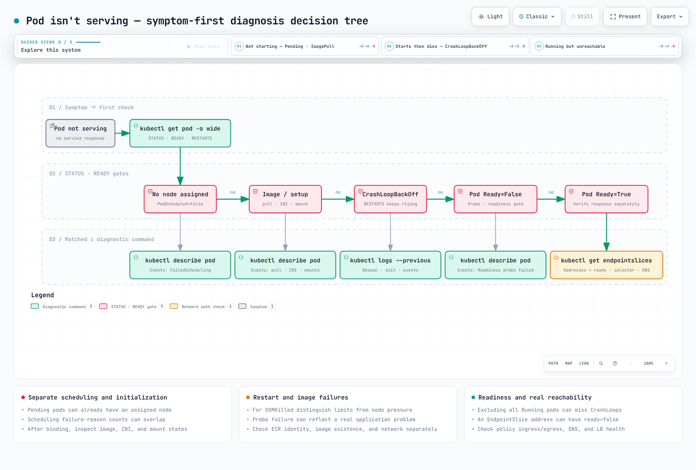

# Manual de resolución de problemas de Kubernetes/EKS: Síntoma → Diagnóstico → Causa → Solución

> **Versiones compatibles**: Kubernetes 1.33+ (salida verificada en Amazon EKS 1.36 — plano de control v1.36.2-eks-bca9cf6, versión de plataforma eks.9), Karpenter 1.4, VPC CNI v1.21, CoreDNS v1.14
> **Última actualización**: September 2, 2026

< [Anterior: Operaciones de clúster zonales](15-zonal-operations-guide.md) | [Tabla de contenido](./README.md) >

***

Cuando suena el buscapersonas a las 3 a. m. y abres una terminal, lo que necesitas no es una explicación conceptual, sino **"el siguiente comando que debo escribir según lo que veo ahora mismo"**. Este documento parte de los **síntomas**, no de los conceptos. Para cada síntoma, reúne en un bloque «lo que ves → lo que ejecutas → el aspecto de la salida → las causas más habituales y cómo resolverlas».

Los mensajes de eventos y la salida de ejemplo mostrados aquí se capturaron el 2 de septiembre de 2026 con `kubectl get/describe/events` en el clúster EKS de verificación de este repositorio (EKS 1.36 — plano de control v1.36.2-eks-bca9cf6, versión de plataforma eks.9 — con Karpenter 1.4.0, VPC CNI v1.21.1, CoreDNS v1.14.2), o son cadenas citadas de la documentación oficial de Kubernetes/AWS indicada en [Referencias](#references). Solo se han generalizado los nombres de recursos.

El análisis profundo de la causa raíz (logs del plano de control, consultas de CloudWatch Logs Insights, las ocho causas de fallo de unión de nodos, etc.) ya está en [Resolución de problemas de EKS](../eks/09-eks-troubleshooting.md) y [Depuración avanzada de EKS](../eks/11-eks-advanced-debugging.md). Esta página se sitúa antes de esos documentos: su función es **decidir en 30 segundos qué página abrir**, por lo que enlaza a ellos en lugar de repetir su contenido.

## Tabla de contenido

1. [Resumen en 30 segundos: Síntoma → Primer comando → Causa más habitual](#30-second-summary-symptom--first-command--most-common-cause)
2. [Árbol de decisiones de diagnóstico](#diagnostic-decision-tree)
3. [Manual por síntoma](#playbook-by-symptom)
4. [Guía rápida de diagnóstico de kubectl](#kubectl-diagnostic-cheat-sheet)
5. [Más información: documentos relacionados](#going-deeper-related-documents)
6. [Referencias](#references)

***

## Resumen en 30 segundos: Síntoma → Primer comando → Causa más habitual

Cada celda de síntoma enlaza a su sección del manual más abajo.

| Síntoma (lo que muestra `kubectl get pods`/`nodes`) | Primer comando | Causa más habitual |
|---|---|---|
| [`Pending`](#1-pod-stuck-in-pending) | `kubectl describe pod <pod>` → el mensaje `FailedScheduling` en Events | Recursos insuficientes (`Insufficient cpu/memory`), falta toleration, falta de coincidencia en nodeSelector, PVC no vinculado |
| [`ImagePullBackOff` / `ErrImagePull`](#2-imagepullbackoff--errimagepull) | `kubectl describe pod <pod>` → la línea `Failed to pull image` | Error tipográfico en la etiqueta, autenticación de registry privado (imagePullSecrets/node IAM), discrepancia de región/cuenta de ECR |
| [`CrashLoopBackOff`](#3-crashloopbackoff-exit-137-oomkilled-probe-failures-config-errors) | `kubectl logs <pod> --previous` + comprobar `lastState.terminated` | La app falla al inicio (exit 1), `OOMKilled` (exit 137), fallo de liveness probe, falta ConfigMap/Secret |
| [`Running` pero READY `0/1`](#4-running-but-not-ready--empty-endpoints) | `kubectl describe pod <pod>` → `Readiness probe failed` | Ruta/puerto de readiness incorrecto, espera de una dependencia, sidecar no preparado |
| [Las solicitudes nunca llegan al Service](#5-service-is-unreachable) | `kubectl get endpointslices -l kubernetes.io/service-name=<svc>` | Falta de coincidencia en las etiquetas del selector, `targetPort` incorrecto, bloqueo de NetworkPolicy, caída de CoreDNS |
| Nodo `NotReady`](#6-node-notready--kubelet-pressure-diskpressure-memorypressure-pidpressure) | `kubectl describe node <node>` → Conditions | kubelet detenido/partición de red, `DiskPressure`, `MemoryPressure`, `PIDPressure` |
| [PVC `Pending`](#7-pvc-stuck-in-pending) | `kubectl describe pvc <pvc>` → Events | `WaitForFirstConsumer` (espera normal), StorageClass ausente o mal escrito, discrepancia de AZ |
| [`AccessDenied` en los logs de la app (AWS API)](#8-eks-irsa--pod-identity-accessdenied) | `kubectl get sa <sa> -o yaml` + `env \| grep AWS` del Pod | Error de anotación/política de confianza de IRSA (IAM Roles for Service Accounts), falta asociación de Pod Identity, Pods sin reiniciar |
| [Bloqueado en `ContainerCreating` + `failed to assign an IP address`](#9-eks-enivpc-cni-ip-exhaustion) | `kubectl describe pod <pod>` → `FailedCreatePodSandBox` | Agotamiento de IP en subnet, máximo de Pods del nodo alcanzado, `aws-node` no saludable |
| [Karpenter no lanza un nodo](#10-eks-karpenter-does-not-launch-a-node) | `kubectl get events -A --field-selector reason=FailedScheduling` | Se alcanzaron los `limits` de NodePool, discrepancia de requirements/taint, restricción de tipo de instancia |
| [La creación de Service se rechaza con `failed calling webhook`](#11-no-service-can-be-created-failed-calling-webhook) | `kubectl -n kube-system get endpointslices -l kubernetes.io/service-name=aws-load-balancer-webhook-service` | Deployment de webhook no saludable (CrashLoop) detrás de un webhook con `failurePolicy: Fail` que coincide con cada namespace |

***

## Árbol de decisiones de diagnóstico



[🔍 Ver diagrama interactivo](https://www.atomai.click/kubernetes-docs/archmaps/en-ops-16-troubleshooting-playbook-0.html)

El punto de entrada del árbol siempre es el mismo: filtra los Pods no saludables de todos los namespaces y, después, lee los eventos Warning en orden temporal.

```bash
# Pods that are neither Running nor Succeeded
kubectl get pods -A --field-selector=status.phase!=Running,status.phase!=Succeeded

# Recent Warning events (cluster-wide, chronological)
kubectl get events -A --field-selector type=Warning --sort-by=.lastTimestamp | tail -30
```

***

## Manual por síntoma

### 1. Pod bloqueado en `Pending`

**Síntoma**: STATUS en `kubectl get pods` es `Pending` y READY es `0/1`. No se ha asignado ningún nodo, por lo que `kubectl logs` no muestra nada.

**Diagnóstico**: la respuesta siempre está en el último evento `FailedScheduling` de `describe`. El scheduler **agrega, para cada nodo, por qué se rechazó cada nodo**.

```bash
kubectl describe pod <pod> -n <ns> | sed -n '/^Events:/,$p'
```

```
Warning  FailedScheduling  default-scheduler  0/15 nodes are available: 1 Insufficient cpu, 1 Insufficient memory,
  6 node(s) didn't match Pod's node affinity/selector, 8 node(s) had untolerated taint(s).
  no new claims to deallocate, preemption: 0/15 nodes are available:
  1 No preemption victims found for incoming pod, 14 Preemption is not helpful for scheduling.
```

Cómo leerlo: de 15 nodos, 8 se rechazaron por taints, 6 por nodeSelector/affinity, y al único nodo restante le faltaban CPU y memoria. En otras palabras, **solo un nodo es elegible para este Pod y está lleno**. `no new claims to deallocate` lo añade el plugin DRA (Dynamic Resource Allocation); ignóralo para Pods que no usan ResourceClaims.

**Causas y soluciones**:

| Fragmento del mensaje | Causa | Solución |
|---|---|---|
| `Insufficient cpu` / `Insufficient memory` | Las requests superan la capacidad restante del nodo | Ajusta adecuadamente las requests, comprueba el autoscaler (→ [10. Karpenter](#10-eks-karpenter-does-not-launch-a-node)), inspecciona `Allocated resources` en `kubectl describe node` |
| `Too many pods` | Se alcanzó el máximo de Pods del nodo (límite ENI de VPC CNI) | → [9. Agotamiento de ENI/IP](#9-eks-enivpc-cni-ip-exhaustion) |
| `node(s) had untolerated taint(s)` | No hay toleration para los taints del nodo | Lista los taints con `kubectl get nodes -o custom-columns=NAME:.metadata.name,TAINTS:.spec.taints[*].key`, y después añade una toleration o ajusta el NodePool |
| `node(s) didn't match Pod's node affinity/selector` | Ningún nodo tiene la etiqueta de nodeSelector/affinity | Comprueba `kubectl get nodes --show-labels`. Con Karpenter, la clave debe aparecer en los requirements de NodePool o no se creará ningún nodo |
| `pod has unbound immediate PersistentVolumeClaims` | El PVC es `Pending` | → [7. PVC Pending](#7-pvc-stuck-in-pending) |
| `node(s) had volume node affinity conflict` | No hay un nodo planificable en la AZ donde reside el PV (EBS) | Lee la zona de `nodeAffinity` del PV y proporciona capacidad en esa AZ |
| `node(s) didn't match pod topology spread constraints` / `pod anti-affinity rules` | Ningún nodo satisface la restricción de distribución | Relaja con `whenUnsatisfiable: ScheduleAnyway` o añade nodos |
| No hay eventos en absoluto | Problema del scheduler o `schedulerName` mal escrito | Comprueba `kubectl get pod <pod> -o jsonpath='{.spec.schedulerName}'` |

### 2. `ImagePullBackOff` / `ErrImagePull`

**Síntoma**: STATUS comienza como `ErrImagePull` y después de algunos reintentos pasa a ser `ImagePullBackOff`. El pull back-off de kubelet crece hasta un límite de 5 minutos.

**Diagnóstico**:

```bash
kubectl describe pod <pod> -n <ns> | grep -A2 -E "Failed to pull|Back-off pulling"
kubectl get pod <pod> -n <ns> -o jsonpath='{range .spec.containers[*]}{.name}{"\t"}{.image}{"\n"}{end}'
kubectl get pod <pod> -n <ns> -o jsonpath='{.spec.imagePullSecrets}'
```

```
Warning  Failed   kubelet  Failed to pull image "123456789012.dkr.ecr.ap-northeast-2.amazonaws.com/app:v1.2.3": ... not found
Warning  Failed   kubelet  Error: ErrImagePull
Normal   BackOff  kubelet  Back-off pulling image "123456789012.dkr.ecr.ap-northeast-2.amazonaws.com/app:v1.2.3"
Warning  Failed   kubelet  Error: ImagePullBackOff
```

Un pull saludable deja el par `Pulling image "..."` → `Successfully pulled image "..." in 4.501s ...`, y una imagen ya almacenada en caché registra `Container image "..." already present on machine`. Si ves estos eventos saludables y el Pod todavía no inicia, la imagen no es el problema.

**Causas y soluciones**:

| Qué sigue a `Failed to pull image` | Causa | Solución |
|---|---|---|
| `not found` / `manifest unknown` | Error tipográfico en la etiqueta, etiqueta aún no publicada, repositorio incorrecto | Verifica con `aws ecr describe-images --repository-name <repo> --image-ids imageTag=<tag>` |
| `401 Unauthorized` / `no basic auth credentials` | Falló la autenticación del registry privado | Para ECR, el rol IAM del nodo necesita `AmazonEC2ContainerRegistryPullOnly` (o `ReadOnly`); para registries externos, comprueba `imagePullSecrets` |
| La región/cuenta de la URL de ECR difiere del clúster | No hay permiso de pull entre cuentas | Añade el principal que hace pull a la política del repositorio ECR |
| `dial tcp ... i/o timeout` | Subnet privada sin endpoints de NAT/VPC | Comprueba `com.amazonaws.<region>.ecr.api`, `ecr.dkr` y el endpoint de gateway de S3 |
| `toomanyrequests` | Límite de tasa de Docker Hub | Crea un mirror mediante una caché pull-through de ECR |

Para reproducir desde el propio nodo, `kubectl debug node/<node> -it --image=busybox --profile=sysadmin`, y después `chroot /host crictl pull <image>` hace pull por la misma ruta que usa kubelet (`--profile=sysadmin` proporciona al contenedor de depuración los privilegios que necesita `crictl`; consulta la [guía rápida](#kubectl-diagnostic-cheat-sheet)).

### 3. `CrashLoopBackOff` (exit 137 `OOMKilled`, fallos de probes, errores de configuración)

**Síntoma**: STATUS `CrashLoopBackOff`, RESTARTS continúa aumentando. El retraso de reinicio comienza en 10 segundos y se duplica hasta un límite de 5 minutos, así que el Pod parece `Running` un rato y luego vuelve a morir.

**Diagnóstico**: examina tres cosas en orden: **motivo de terminación y código de salida**, **logs del contenedor anterior**, **Events**.

```bash
# (1) Why did it die: lastState.terminated
kubectl get pod <pod> -n <ns> -o jsonpath='{range .status.containerStatuses[*]}{.name}{"\t"}restarts={.restartCount}{"\t"}reason={.lastState.terminated.reason}{"\t"}exit={.lastState.terminated.exitCode}{"\n"}{end}'

# (2) Logs right before death (the previous container, not the current one)
kubectl logs <pod> -n <ns> -c <container> --previous --tail=100

# (3) Probe/kill events
kubectl describe pod <pod> -n <ns> | sed -n '/^Events:/,$p'
```

Salida real — un contenedor con límite de memoria de 128Mi terminado por OOM:

```
    Last State:     Terminated
      Reason:       OOMKilled
      Exit Code:    137
      Started:      Mon, 31 Aug 2026 08:55:27 +0000
      Finished:     Tue, 01 Sep 2026 21:13:37 +0000
    Restart Count:  3
```

Lee `Started` frente a `Finished`: este contenedor se ejecutó aproximadamente 36 horas antes de terminar, lo cual indica una **fuga de memoria lenta o un crecimiento gradual del conjunto de trabajo**, no un problema de inicio. Un crash loop de inicio tiene un aspecto distinto: `Finished` llega segundos después de `Started`, y RESTARTS aumenta en minutos.

**Interpretación de códigos de salida**:

| Código de salida | Motivo | Significado | Solución |
|---|---|---|---|
| `0` | `Completed` | El proceso terminó normalmente; en un Deployment esto significa que la app no se mantiene en primer plano | Ejecuta el entrypoint en modo daemon/primer plano o cambia a un Job |
| `1` | `Error` | La app terminó por sí misma (error de configuración, fallo de conexión con dependencia) | El stack trace está en `logs --previous` |
| `126` | `Error` | Comando encontrado pero no ejecutable bajo un entrypoint de shell: falta el bit de ejecución, o el shell informa `cannot execute binary file: Exec format error` (discrepancia de arquitectura) | `chmod +x` en el Dockerfile; comprueba arm64/amd64 con `kubectl get nodes -L kubernetes.io/arch` y usa una imagen multi-arquitectura |
| `127` | `Error` | Comando no encontrado bajo un entrypoint de shell: error tipográfico en la ruta o el binario nunca se copió en la fase final de la imagen | Compara `command`/`args` con lo que realmente contiene la imagen (`kubectl debug ... -- ls <path>`) |
| `137` | `OOMKilled` | SIGKILL del kernel tras superar el límite de memoria | Aumenta el límite o corrige la fuga. Para JVM comprueba `-XX:MaxRAMPercentage` → [Optimización de recursos](10-resource-optimization.md) |
| `137` | `Error` | SIGKILL por otro motivo: liveness falló y el contenedor no terminó dentro de `terminationGracePeriodSeconds` | Revisa preStop/apagado ordenado |
| `143` | `Error` | Terminó con SIGTERM (puede ser un rollout/eviction normal) | Si se repite, busca quién lo termina en Events |

- Si la imagen ejecuta el binario directamente (sin shell intermedio), una discrepancia de arquitectura no produce exit 126: el contenedor nunca inicia y `lastState.terminated` muestra Reason `StartError` con `exec format error` en el mensaje. La solución es la misma: una imagen multi-arquitectura o un nodeSelector en `kubernetes.io/arch`.

**Fallos de probes**: cuando estas dos líneas aparecen juntas en Events, el problema suele ser la configuración de la probe, no el código de la aplicación.

```
Warning  Unhealthy  kubelet  Liveness probe failed: HTTP probe failed with statuscode: 503
Normal   Killing    kubelet  Container app failed liveness probe, will be restarted
```

- Si la app tarda en iniciar, añade una **`startupProbe`** en lugar de aumentar el `initialDelaySeconds` de liveness (liveness no inicia hasta que la startup probe tiene éxito).
- Un rechazo TCP como `Readiness probe failed: dial tcp 10.0.2.45:8080: connect: connection refused` significa que primero debes comprobar si el puerto del contenedor y el puerto de la probe difieren.

**Errores de referencia de configuración**: en sentido estricto no son un crash loop; el Pod se detiene en `CreateContainerConfigError`:

```
Warning  Failed  kubelet  Error: configmap "app-config" not found
Warning  Failed  kubelet  Error: secret "db-credentials" not found
```

Compara nombres y namespaces con `kubectl get cm,secret -n <ns>` y habrás terminado. Si la referencia es un montaje de volumen, aparece en su lugar como un evento `FailedMount` (`MountVolume.SetUp failed for volume "cfg" : configmap "app-config" not found`).

### 4. `Running` pero no Ready / Endpoints vacíos

**Síntoma**: STATUS es `Running` pero READY es `0/1` (`1/2` con un sidecar). El Service no envía tráfico a este Pod, por lo que desde la perspectiva del usuario está «desplegado, pero 503».

**Diagnóstico**:

```bash
kubectl describe pod <pod> -n <ns> | grep -E "Ready|Readiness probe"
kubectl get endpointslices -n <ns> -l kubernetes.io/service-name=<svc>
```

Un Service sin ningún Pod Ready detrás —el síntoma que buscas— imprime `<unset>` en la columna ENDPOINTS (y también en PORTS: el controlador EndpointSlice elimina la lista de puertos cuando no hay endpoint que la transporte). Capturado en este clúster desde un Service cuyo selector no coincidía con ningún Pod en ejecución:

```
NAME            ADDRESSTYPE   PORTS     ENDPOINTS   AGE
api-svc-xd28r   IPv4          <unset>   <unset>     145d
```

Como contraste, un Service saludable (kube-dns en el mismo clúster) enumera una IP por cada Pod Ready:

```
NAME             ADDRESSTYPE   PORTS        ENDPOINTS              AGE
kube-dns-xc4bb   IPv4          53,53,9153   10.0.2.106,10.0.3.14   145d
```

Una columna ENDPOINTS `<unset>` (o vacía) significa que no hay ningún Pod Ready detrás del Service. En Kubernetes 1.33+ `kubectl get endpoints` imprime `Warning: v1 Endpoints is deprecated in v1.33+; use discovery.k8s.io/v1 EndpointSlice`, así que acostúmbrate a leer EndpointSlices.

**Causas y soluciones**:

| Observación | Causa | Solución |
|---|---|---|
| `Readiness probe failed` repetido en Events | Ruta/puerto de probe incorrecto o la app aún espera una dependencia (DB, etc.) | Dirige la probe al endpoint de salud real de la app. Mantén las esperas de dependencias en readiness, fuera de liveness |
| Condición `Ready False` con motivo `ReadinessGatesNotReady` | Espera de una pod readiness gate; normalmente la gate `target-health.elbv2.k8s.aws/*` de AWS Load Balancer Controller | Averigua por qué falla la comprobación de salud de Target Group → [AWS Load Balancer Controller](../networking/03-aws-lb-controller.md) |
| `1/2` Running, solo el contenedor de la app está Ready | El sidecar (istio-proxy, etc.) no está Ready, o el sidecar inició después de la app y fallaron las conexiones iniciales | Comprueba los logs del sidecar; convierte el sidecar en un sidecar nativo (`initContainers` + `restartPolicy: Always`) |
| Ready, pero EndpointSlice está vacío | El selector del Service no coincide con las etiquetas del Pod | → [5. Service inaccesible](#5-service-is-unreachable) |

### 5. Service inaccesible

**Síntoma**: todos los Pods son `1/1 Running`, pero `curl http://<svc>.<ns>.svc.cluster.local` expira/rechaza, o falla la resolución de nombres.

**Divide el diagnóstico en tres capas**: (a) asignación Service → Pod, (b) política de red, (c) DNS.

```bash
# (a) Compare the selector with actual labels
kubectl get svc <svc> -n <ns> -o jsonpath='{.spec.selector}{"\n"}{.spec.ports}{"\n"}'
kubectl get pods -n <ns> -l <key>=<value> -o wide
kubectl get endpointslices -n <ns> -l kubernetes.io/service-name=<svc>

# (b) NetworkPolicies applied to the namespace
kubectl get networkpolicies -n <ns>
kubectl describe networkpolicy <policy> -n <ns>

# (c) CoreDNS status and logs
kubectl get pods -n kube-system -l k8s-app=kube-dns
kubectl logs -n kube-system -l k8s-app=kube-dns --tail=50
kubectl get cm -n kube-system coredns -o jsonpath='{.data.Corefile}'
```

**Causas y soluciones**:

| Observación | Causa | Solución |
|---|---|---|
| El selector es `{"app":"api"}` pero los Pods tienen la etiqueta `app=api-server` | Discrepancia de etiquetas → EndpointSlice vacío | Unifica etiquetas/selector. En charts de Helm, que `selectorLabels` y `podLabels` se separen es una causa habitual |
| EndpointSlice tiene IPs pero `connection refused` | `targetPort` difiere del puerto en el que realmente escucha el contenedor | Compara con `kubectl get pod -o jsonpath='{.spec.containers[*].ports}'`. Una app vinculada solo a `127.0.0.1` muestra el mismo síntoma |
| Falla solo desde un namespace concreto | Existe una NetworkPolicy `default-deny` y falta la regla de permiso de ingress | Comprueba `podSelector`/`namespaceSelector`. Con la política de red de VPC CNI, `kubectl get policyendpoints -n <ns>` muestra lo que realmente se aplica → [Network Policies](../security/04-network-policies.md) |
| `nslookup <svc>` devuelve `NXDOMAIN` | Se usó un nombre corto desde otro namespace o CoreDNS está caído | Usa el FQDN (`<svc>.<ns>.svc.cluster.local`). Confirma que los Pods de CoreDNS están `Running` y que el `nameserver` de `/etc/resolv.conf` es el ClusterIP de kube-dns (`172.20.0.10` en este clúster) |
| La resolución de dominios externos es lenta | Con el valor predeterminado `ndots:5`, cualquier nombre con menos de 5 puntos se prueba primero con cada dominio de búsqueda (`<ns>.svc.cluster.local`, `svc.cluster.local`, `cluster.local`, el dominio VPC del nodo) antes de consultarse como nombre absoluto | Añade un `.` final a los nombres externos o establece `ndots: 2` en `dnsConfig.options` |
| NodePort/LB funciona solo a través de algunos nodos | `externalTrafficPolicy: Local` sin Pod en ese nodo | Comportamiento esperado. Cambia a `Cluster` para aceptar en todos los nodos |

Para reproducir DNS desde el punto de vista de un Pod, inicia un Pod desechable: `kubectl run -it --rm dns-test --image=busybox:1.36 --restart=Never -- nslookup kubernetes.default.svc.cluster.local`. Los conceptos de CoreDNS y el Corefile se explican en [Services and Networking](../core/03-services-networking.md#coredns).

### 6. Nodo `NotReady` / presión de kubelet (`DiskPressure`, `MemoryPressure`, `PIDPressure`)

**Síntoma**: `kubectl get nodes` muestra `NotReady`, o el nodo está `Ready` pero los Pods obtienen `Evicted` o los Pods nuevos lo evitan con `node(s) had untolerated taint(s)`.

**Diagnóstico**:

```bash
# One-line summary of node conditions
kubectl get nodes -o custom-columns='NAME:.metadata.name,READY:.status.conditions[?(@.type=="Ready")].status,MEM:.status.conditions[?(@.type=="MemoryPressure")].status,DISK:.status.conditions[?(@.type=="DiskPressure")].status,PID:.status.conditions[?(@.type=="PIDPressure")].status'

# Conditions with their reason
kubectl get node <node> -o jsonpath='{range .status.conditions[*]}{.type}{"="}{.status}{" ("}{.reason}{")\n"}{end}'

# Taints the node picked up automatically
kubectl get node <node> -o jsonpath='{.spec.taints}'
```

Salida de nodo saludable (con EKS Node Monitoring Agent instalado también ves las condiciones `ContainerRuntimeReady`/`NetworkingReady`/`KernelReady`/`StorageReady`):

```
MemoryPressure=False (KubeletHasSufficientMemory)
DiskPressure=False (KubeletHasNoDiskPressure)
PIDPressure=False (KubeletHasSufficientPID)
Ready=True (KubeletReady)
ContainerRuntimeReady=True (ContainerRuntimeIsReady)
NetworkingReady=True (NetworkingIsReady)
KernelReady=True (KernelIsReady)
StorageReady=True (DiskIsReady)
```

**Causas y soluciones**:

| Condición / motivo | Taint automático | Causa | Solución |
|---|---|---|---|
| `Ready=Unknown` (`NodeStatusUnknown`, "Kubelet stopped posting node status.") | `node.kubernetes.io/unreachable` | El proceso kubelet murió, instancia detenida/partición de red, fallo de autenticación con API server | Comprueba el estado de la instancia EC2 → SSM/`kubectl debug node` y `journalctl -u kubelet` |
| `Ready=False` | `node.kubernetes.io/not-ready` | Runtime de contenedor caído, CNI no inicializado (`aws-node` no saludable) | `kubectl get pods -n kube-system -l k8s-app=aws-node -o wide` para el aws-node de ese nodo |
| `DiskPressure=True` (`KubeletHasDiskPressure`) | `node.kubernetes.io/disk-pressure` | Caché de imágenes/logs de contenedores llenaron el volumen raíz | `crictl rmi --prune`, rotación de logs, aumenta el EBS raíz. Los Pods obtienen `Evicted` con `The node was low on resource: ephemeral-storage` |
| `MemoryPressure=True` (`KubeletHasInsufficientMemory`) | `node.kubernetes.io/memory-pressure` | Se acumularon Pods con límites grandes pero sin requests, reserva de sistema insuficiente | Exige requests (LimitRange), comprueba `kube-reserved`/`system-reserved` |
| `PIDPressure=True` (`KubeletHasInsufficientPID`) | `node.kubernetes.io/pid-pressure` | Tormenta de forks (fuga de threads) | Encuentra y reinicia el Pod responsable, establece `podPidsLimit` |

Cuando necesites mirar dentro de un nodo, usa esto en lugar de SSH:

```bash
kubectl debug node/<node> -it --image=busybox --profile=sysadmin -- chroot /host
# once inside
journalctl -u kubelet --since "10 min ago" | tail -50
df -h /var/lib/containerd
crictl ps -a | head
```

Un nodo que **nunca aparece** en `kubectl get nodes` (fallo de unión: rol IAM/access entry, enrutamiento de subnet, security group, discrepancia de AMI) es un tema distinto → [Depuración avanzada de EKS — Diagnóstico de fallo de unión de nodos](../eks/11-eks-advanced-debugging.md#node-join-failure-diagnosis-8-common-causes), [Resolución de problemas de EKS — Problemas de nodos y Pods](../eks/09-eks-troubleshooting.md#node-and-pod-issues). Para nodos Karpenter, comienza con la comprobación de NodeClaim en la [sección 10](#10-eks-karpenter-does-not-launch-a-node).

### 7. PVC bloqueado en `Pending`

**Síntoma**: `kubectl get pvc` muestra `Pending` y el Pod que lo usa está `Pending` con `pod has unbound immediate PersistentVolumeClaims`.

**Diagnóstico**:

```bash
kubectl get pvc -n <ns>
kubectl describe pvc <pvc> -n <ns> | sed -n '/^Events:/,$p'
kubectl get storageclass
kubectl get pods -n kube-system -l app=ebs-csi-node -o wide     # is the CSI node plugin on that node?
```

```
NAME   PROVISIONER             RECLAIMPOLICY   VOLUMEBINDINGMODE      ALLOWVOLUMEEXPANSION   AGE
gp2    kubernetes.io/aws-ebs   Delete          WaitForFirstConsumer   false                  145d
gp3    ebs.csi.aws.com         Delete          WaitForFirstConsumer   true                   76d
```

**Causas y soluciones**: el mensaje de Events en `describe pvc` es el diagnóstico.

| Mensaje de Events | Causa | Solución |
|---|---|---|
| `WaitForFirstConsumer: waiting for first consumer to be created before binding` | **Normal.** `volumeBindingMode: WaitForFirstConsumer` aplaza la creación del volumen hasta que se planifica un Pod | Si está Pending porque ningún Pod aún lo usa, déjalo. Si el Pod también está Pending, lee el `FailedScheduling` del Pod |
| `FailedBinding: no persistent volumes available for this claim and no storage class is set` | No hay `storageClassName` ni StorageClass predeterminado | Establece `storageClassName: gp3` en el PVC o anota un SC con `storageclass.kubernetes.io/is-default-class: "true"` |
| `ProvisioningFailed: storageclass.storage.k8s.io "<name>" not found` | StorageClass mal escrito, manifiesto copiado de otro clúster | Usa el nombre real de `kubectl get sc` |
| `ProvisioningFailed: error generating accessibility requirements: no topology key found for node <node>` | El plugin de nodo EBS CSI no se ha registrado en el nodo donde aterrizó el Pod (no hay driver en `CSINode`) | Comprueba la columna DRIVERS de `kubectl get csinode <node>`; confirma que el DaemonSet `ebs-csi-node` se ejecuta en ese nodo |
| `ProvisioningFailed` + `UnauthorizedOperation`/`AccessDenied` | La IRSA/Pod Identity del controlador EBS CSI no tiene permiso | → [8. IRSA/Pod Identity](#8-eks-irsa--pod-identity-accessdenied): el sujeto es `ebs-csi-controller-sa` |
| En el lado del Pod, `node(s) had volume node affinity conflict` | El PV existente (EBS) está en la AZ `ap-northeast-2a`, pero los nodos planificables están en otra AZ | EBS no puede cruzar AZ. Lee la zona con `kubectl get pv <pv> -o jsonpath='{.spec.nodeAffinity}'` y proporciona capacidad allí (requisito de zona de NodePool o nodeSelector) |
| En el lado del Pod, `FailedAttachVolume: Multi-Attach error for volume` | Un volumen RWO sigue adjunto al nodo anterior (StatefulSet replanificado tras fallo de nodo) | Comprueba adjuntos obsoletos con `kubectl get volumeattachments`. Si el nodo desapareció, espera unos minutos para la limpieza |

Los conceptos de `WaitForFirstConsumer`, StorageClass y aprovisionamiento dinámico están en [Storage](../core/04-storage.md#storage-classes); los patrones de error de EBS/EFS CSI están en [Depuración avanzada de EKS — Resolución de problemas de almacenamiento](../eks/11-eks-advanced-debugging.md#6-storage-troubleshooting).

### 8. EKS: IRSA / Pod Identity `AccessDenied`

**Síntoma**: el Pod está felizmente `Running`, pero los logs de la app muestran un error de AWS SDK.

```
An error occurred (AccessDenied) when calling the AssumeRoleWithWebIdentity operation:
  Not authorized to perform sts:AssumeRoleWithWebIdentity
```

O la propia llamada a S3/DynamoDB se deniega con `... is not authorized to perform: s3:GetObject`, donde el principal denegado no es el rol de service account sino el **rol IAM del nodo** (`assumed-role/<node-role>/i-0abc...`). Esto último significa que la inyección de credenciales nunca ocurrió y el SDK recurrió al rol del nodo.

**Diagnóstico**: primero determina qué mecanismo se usa. Las variables de entorno del Pod te lo indican.

```bash
# Service account annotation (IRSA)
kubectl get sa <sa> -n <ns> -o jsonpath='{.metadata.annotations.eks\.amazonaws\.com/role-arn}{"\n"}'

# Credential-related env injected into the pod
kubectl get pod <pod> -n <ns> -o jsonpath='{range .spec.containers[0].env[*]}{.name}={.value}{"\n"}{end}' | grep ^AWS_
```

| Env inyectado | Mecanismo | Significado |
|---|---|---|
| `AWS_ROLE_ARN=arn:aws:iam::...:role/<role>` + `AWS_WEB_IDENTITY_TOKEN_FILE=/var/run/secrets/eks.amazonaws.com/serviceaccount/token` | **IRSA** | Inyectado por pod-identity-webhook. Si falta, la anotación de SA se añadió **después** de crear el Pod, o el nombre de SA difiere |
| `AWS_CONTAINER_CREDENTIALS_FULL_URI` + `AWS_CONTAINER_AUTHORIZATION_TOKEN_FILE` | **EKS Pod Identity** | `eks-pod-identity-agent` sirve credenciales en `169.254.170.23`. Solo se inyecta cuando existe una asociación |
| Ninguno | Ninguno → respaldo al rol de nodo | Consulta la tabla siguiente |

```bash
# Pod Identity: agent and association
kubectl get pods -n kube-system -l app.kubernetes.io/name=eks-pod-identity-agent
aws eks list-pod-identity-associations --cluster-name <cluster> --namespace <ns> --service-account <sa>

# IRSA: OIDC condition in the trust policy
aws eks describe-cluster --name <cluster> --query 'cluster.identity.oidc.issuer' --output text
aws iam get-role --role-name <role> --query 'Role.AssumeRolePolicyDocument'
```

**Causas y soluciones**:

| Observación | Causa | Solución |
|---|---|---|
| No hay env, pero existe la anotación de SA | El Pod se creó antes de la anotación (el webhook solo inyecta al crearlo) | `kubectl rollout restart deploy/<name>` |
| No hay env ni asociación | La asociación de Pod Identity no se creó, o se creó para otra SA/namespace | `aws eks create-pod-identity-association ...`, después reinicia los Pods |
| `Not authorized to perform sts:AssumeRoleWithWebIdentity` | Política de confianza de IRSA: ARN de proveedor OIDC `Federated` incorrecto, o la condición `sub` (`system:serviceaccount:<ns>:<sa>`)/`aud` (`sts.amazonaws.com`) no coincide | Corrige la política de confianza. Si se recreó el clúster, cambió el emisor OIDC, por lo que también debe recrearse el proveedor |
| Pod Identity, pero `AssumeRole` se deniega | El principal de la política de confianza no es `pods.eks.amazonaws.com` o falta `sts:TagSession` | Permite tanto `sts:AssumeRole` como `sts:TagSession` en la política de confianza |
| Env está bien, solo una API específica devuelve `AccessDenied` | La política de permisos del rol es insuficiente (no la política de confianza) | Busca `eventName` del evento `errorCode: AccessDenied` en CloudTrail y amplía la política |
| Env de Pod Identity presente pero el SDK dice `Unable to locate credentials` | El SDK es demasiado antiguo para admitir el proveedor de credenciales de contenedor (`FULL_URI`) | Actualiza el SDK: las versiones mínimas compatibles se indican en la documentación de EKS |

El funcionamiento y la configuración de IRSA y Pod Identity están en [Prácticas recomendadas de seguridad de EKS](../security/06-eks-security-best-practices.md#irsa-iam-roles-for-service-accounts) y [Seguridad de EKS](../eks/05-eks-security.md#eks-pod-identity); la expiración de token y los problemas de webhook están en [Depuración avanzada de EKS — Depuración del plano de control](../eks/11-eks-advanced-debugging.md#2-control-plane-debugging).

### 9. EKS: agotamiento de IP de ENI/VPC CNI

**Síntoma**: los Pods se bloquean en `ContainerCreating` con `FailedCreatePodSandBox` en Events:

```
Warning  FailedCreatePodSandBox  kubelet  Failed to create pod sandbox: rpc error: code = Unknown desc =
  failed to setup network for sandbox "...": plugin type="aws-cni" name="aws-cni" failed (add):
  add cmd: failed to assign an IP address to container
```

O permanecen `Pending` durante la planificación con `Too many pods`. Ambos síntomas comparten una causa raíz: **el nodo no tiene IP para entregar al Pod**.

**Diagnóstico**:

```bash
# Node max-pods (ENIs × (IPs per ENI − 1) + 2). An m6g.large is 29
kubectl get node <node> -o jsonpath='{.status.allocatable.pods}{"\n"}'
kubectl get pods -A --field-selector spec.nodeName=<node> --no-headers | wc -l

# aws-node status and IPAM settings
kubectl get pods -n kube-system -l k8s-app=aws-node -o wide
kubectl get ds -n kube-system aws-node -o jsonpath='{range .spec.template.spec.containers[?(@.name=="aws-node")].env[*]}{.name}={.value}{"\n"}{end}' | grep -E "PREFIX|WARM|MINIMUM|CUSTOM_NETWORK"

# Free IPs in the subnet
aws ec2 describe-subnets --subnet-ids <subnet-id> --query 'Subnets[].{id:SubnetId,az:AvailabilityZone,free:AvailableIpAddressCount}' --output table
```

El valor **predeterminado** de VPC CNI es solo `WARM_ENI_TARGET=1` (`WARM_IP_TARGET`/`MINIMUM_IP_TARGET` sin establecer). En ese estado, cada nodo mantiene **un ENI completo de reserva** adjunto (15 IP por ENI en un m5.xlarge), por lo que en subnets pequeñas las IP se agotan **mucho más rápido de lo que sugiere el número de Pods**. En cambio, la configuración de `aws-node` de este clúster (`ENABLE_PREFIX_DELEGATION=false`, `WARM_ENI_TARGET=1`, `WARM_IP_TARGET=3`, `MINIMUM_IP_TARGET=6`) es un ejemplo de un pool caliente ya reducido: cuando se establecen `WARM_IP_TARGET`/`MINIMUM_IP_TARGET`, tienen prioridad sobre la regla de ENI caliente, de modo que un nodo mantiene solo 3 IP de reserva más allá de las que usan sus Pods, y nunca menos de 6 IP asignadas en total (`MINIMUM_IP_TARGET` es un mínimo sobre el total —en uso más reserva—, no sobre el número de reserva).

**Causas y soluciones**:

| Observación | Causa | Solución |
|---|---|---|
| `AvailableIpAddressCount` de subnet de un solo dígito | La propia subnet está agotada; el pool caliente reclama IP de antemano | Reduce el pool caliente con `WARM_IP_TARGET`/`MINIMUM_IP_TARGET` (como en la configuración anterior), añade un CIDR secundario (por ejemplo, 100.64.0.0/16) con **custom networking** (`ENIConfig`) e IPv6 a largo plazo |
| Pods en nodo = Pods asignables | Límite ENI/IP del tipo de instancia | **Prefix delegation** (`ENABLE_PREFIX_DELEGATION=true`, asigna prefijos /28, requiere instancias Nitro) más recálculo de max-pods, o una instancia más grande |
| `aws-node` en `CrashLoopBackOff` en ese nodo | Fallo del propio CNI (falta `AmazonEKS_CNI_Policy`, discrepancia de versión) | `kubectl logs -n kube-system <aws-node-pod> -c aws-node`, y `/var/log/aws-routed-eni/ipamd.log` en el nodo |
| Usas Security Groups for Pods y faltan `vpc.amazonaws.com/pod-eni` | Límite de ENI de rama | Migra a instancias que admitan trunk ENI; confirma `ENABLE_POD_ENI=true` |

El comportamiento de IPAM (pool caliente, prefix delegation, custom networking) está en [VPC CNI — Gestión de direcciones IP](../networking/01-vpc-cni.md#ip-address-management); el manejo paso a paso del agotamiento de IP está en [Depuración avanzada de EKS — Diagnóstico de red](../eks/11-eks-advanced-debugging.md#5-networking-diagnostics) y [Resolución de problemas de EKS — Problemas de VPC CNI](../eks/09-eks-troubleshooting.md#networking-issues).

### 10. EKS: Karpenter no lanza un nodo

**Síntoma**: los Pods están `Pending` y no aparece ningún NodeClaim nuevo en `kubectl get nodeclaims`. **De forma independiente** al `FailedScheduling` del scheduler predeterminado, Karpenter registra sus propios motivos como eventos en el mismo Pod.

**Diagnóstico**:

```bash
# Events emitted by Karpenter (source is karpenter)
kubectl get events -n <ns> --field-selector involvedObject.name=<pod> -o custom-columns=REASON:.reason,SRC:.source.component,MSG:.message

# NodePool limits vs current usage
kubectl get nodepool -o custom-columns='NAME:.metadata.name,CPU_LIMIT:.spec.limits.cpu,CPU_USED:.status.resources.cpu,MEM_LIMIT:.spec.limits.memory,MEM_USED:.status.resources.memory,READY:.status.conditions[?(@.type=="Ready")].status'

# NodeClaim progress
kubectl get nodeclaims -o custom-columns='NAME:.metadata.name,TYPE:.metadata.labels.node\.kubernetes\.io/instance-type,LAUNCHED:.status.conditions[?(@.type=="Launched")].status,REGISTERED:.status.conditions[?(@.type=="Registered")].status,READY:.status.conditions[?(@.type=="Ready")].status'

kubectl logs -n kube-system -l app.kubernetes.io/name=karpenter --tail=100
```

Un evento real de Karpenter (recorre cada NodePool para un Pod y enumera por qué se rechazó cada uno):

```
FailedScheduling  karpenter  Failed to schedule pod, incompatible with nodepool "system",
  daemonset overhead={"cpu":"821m","memory":"1350Mi","pods":"10"}, incompatible requirements,
  label "nvidia.com/device-plugin.config" does not have known values;
  incompatible with nodepool "runner-arm", ..., did not tolerate workload-type=ci-runner:NoSchedule;
  all available instance types exceed limits for nodepool "graviton";
  incompatible with nodepool "gpu-ner", ..., incompatible requirements, key node.kubernetes.io/instance-type,
  node.kubernetes.io/instance-type In [g6e.4xlarge] not in node.kubernetes.io/instance-type In [g6.2xlarge g6.4xlarge g6.xlarge]
```

El estado de NodePool en el mismo momento mostraba `graviton` en `CPU_LIMIT 8 / CPU_USED 8`, **exactamente en su límite**, que es lo que significa `exceed limits`. Por el contrario, `Nominated  karpenter  Pod should schedule on: nodeclaim/system-tm4gv` significa que Karpenter ya hizo su parte y espera a que el nodo aparezca.

**Causas y soluciones**:

| Fragmento del mensaje | Causa | Solución |
|---|---|---|
| `all available instance types exceed limits for nodepool "<np>"` | Se alcanzaron los `spec.limits` (cpu/memory) de NodePool | Eleva el límite o comprueba si consolidation recupera nodos inactivos |
| `label "<key>" does not have known values` | La clave nodeSelector/affinity del Pod no está en los `requirements` de NodePool | Añade la clave (con su lista de valores) a `spec.template.spec.requirements` del NodePool |
| `did not tolerate <key>=<value>:NoSchedule` | No hay toleration para los `taints` de NodePool | Si el aislamiento es intencional, usa otro NodePool; de lo contrario, añade la toleration |
| `key node.kubernetes.io/instance-type, ... In [X] not in ... In [Y Z]` | El Pod exige un tipo de instancia que NodePool no permite | Alinea uno de los lados. Normalmente el requisito del lado del Pod es demasiado estricto |
| `daemonset overhead={...}` grande e `Insufficient` | No queda capacidad suficiente tras restar las reservas de DaemonSet | Incluye instancias más grandes en los requirements |
| NodeClaim `LAUNCHED=True, REGISTERED=False` durante varios minutos | EC2 inició, pero el nodo no puede unirse (selectores de subnet/SG de EC2NodeClass, access entry de rol IAM del nodo, AMI) | Conditions/Events en `kubectl describe nodeclaim <name>`, log del sistema de consola EC2 |
| `InsufficientInstanceCapacity` en logs de Karpenter | No hay capacidad EC2 para esa AZ/tipo de instancia (ICE — Insufficient Capacity Error) | Amplía los tipos de instancia, AZ y capacity-type (spot/on-demand) |
| No hay eventos, logs de Karpenter silenciosos | El Pod no es candidato de Karpenter (`nodeSelector` apunta a etiquetas MNG o restricciones de planificación no relacionadas con Karpenter) | Vuelve a comprobar cada restricción relacionada con nodo en la especificación del Pod |

La estructura de NodePool/EC2NodeClass y la resolución detallada de problemas están en [Karpenter — Resolución de problemas](../autoscaling/02-karpenter.md#troubleshooting) y [Depuración avanzada de EKS — Problemas de aprovisionamiento de Karpenter](../eks/11-eks-advanced-debugging.md#karpenter-provisioning-issues).

### 11. No se puede crear ningún Service: failed calling webhook

**Síntoma**: cualquier `kubectl apply`/`create` de un Service —en cualquier namespace, incluidos los que no tienen nada que ver con balanceadores de carga— es rechazado por API server. Los Deployments que envían un Service, las instalaciones de Helm y las sincronizaciones de ArgoCD se detienen ahí, mientras que **los Services existentes siguen funcionando**, por lo que nada parece incorrecto a nivel de Pod.

```
Internal error occurred: failed calling webhook "mservice.elbv2.k8s.aws": failed to call webhook:
  ... no endpoints available for service "aws-load-balancer-webhook-service"
```

**Diagnóstico**: el mensaje ya nombra el webhook y el Service que lo respalda. Desciende desde la configuración del webhook → los endpoints del Service de webhook → el Deployment que está detrás.

```bash
# (1) Which webhooks are registered, and what each does on failure (rules, namespaceSelector, objectSelector, failurePolicy)
kubectl get mutatingwebhookconfigurations,validatingwebhookconfigurations
kubectl get mutatingwebhookconfiguration aws-load-balancer-webhook -o jsonpath='{range .webhooks[*]}{.name}{"\t"}failurePolicy={.failurePolicy}{"\t"}ns={.namespaceSelector}{"\t"}obj={.objectSelector}{"\t"}{.rules[*].operations}{" "}{.rules[*].resources}{"\n"}{end}'

# (2) Is there a Ready pod behind the webhook Service?
kubectl -n kube-system get endpointslices -l kubernetes.io/service-name=aws-load-balancer-webhook-service

# (3) Why does that Deployment keep dying?
kubectl -n kube-system get pods -l app.kubernetes.io/name=aws-load-balancer-controller
kubectl -n kube-system logs deploy/aws-load-balancer-controller --previous
```

Así era realmente este clúster el 2 de septiembre de 2026: `aws-load-balancer-controller` v3.2.1 (2 réplicas) estuvo en **`CrashLoopBackOff` durante 48 días con 9250 reinicios**. Cada log `--previous` mostraba el mismo patrón (se recortaron algunos campos distintos de las marcas de tiempo):

```
{"ts":"2026-09-02T07:54:42Z","logger":"setup","msg":"Disabling NLBGatewayAPI: missing required Gateway API CRDs","missing":["TLSRoute","TCPRoute","UDPRoute"]}
{"level":"error","logger":"controller-runtime.source.Kind","msg":"if kind is a CRD, it should be installed before calling Start","kind":"ListenerSet.gateway.networking.k8s.io","error":"no matches for kind \"ListenerSet\" in version \"gateway.networking.k8s.io/v1\""}
{"ts":"2026-09-02T07:57:00Z","level":"error","logger":"setup","msg":"problem running manager","error":"failed to wait for gateway.k8s.aws/alb caches to sync kind source: *v1.ListenerSet: timed out waiting for cache to be synced for Kind *v1.ListenerSet"}
```

Cómo leerlo: el controlador ALB Gateway API del controlador espera el CRD `ListenerSet` (canal **experimental** de Gateway API) y el clúster no lo tiene. El lado NLB se desactiva cuando faltan sus CRD (primera línea, información), pero el lado ALB espera a que se sincronice su caché y **el proceso termina después de aproximadamente 2 min 18 s**; así, el Pod parece `Running` durante un momento, vuelve a morir y los endpoints del Service de webhook están vacíos la mayor parte del tiempo. Mientras tanto, el webhook `mservice.elbv2.k8s.aws` tiene `failurePolicy: Fail`, `namespaceSelector: {}` (cada namespace), `objectSelector: app.kubernetes.io/name NotIn [aws-load-balancer-controller]` y una regla sobre Service **CREATE**. En otras palabras, **la disponibilidad de este Deployment de webhook es la disponibilidad de la creación de Service para todo el clúster**, y en el momento en que tiene cero endpoints, API server rechaza todas las solicitudes coincidentes. La creación de Pods no se vio afectada: los Pods se creaban normalmente en este estado.

**Causas y soluciones**:

| Observación | Causa | Solución |
|---|---|---|
| `no endpoints available for service "aws-load-balancer-webhook-service"` | Cero Pods Ready en el Deployment de webhook (CrashLoop, no planificable, réplicas 0) | **Primero restaura la salud del controlador** (fila siguiente). Confirma la recuperación con `get endpointslices` que muestre direcciones en su columna ENDPOINTS |
| `no matches for kind "ListenerSet"` → `timed out waiting for cache to be synced` en los logs | Los CRD de Gateway API que requiere esta versión del controlador no están instalados | (a) Instala los CRD de Gateway API que requiere esa versión del controlador: `ListenerSet` está en el canal experimental; (b) hasta que los CRD estén presentes, desactiva la característica Gateway API del controlador mediante los valores de feature-gate de Helm (comprueba los nombres exactos de gates en el `values.yaml` de esa versión); (c) fija una versión del controlador que coincida con los CRD instalados |
| Hay endpoints, pero `connection refused` / `context deadline exceeded` / `x509` | Ruta hacia el puerto de webhook bloqueada (NetworkPolicy/security group), certificado vencido o no coincidente | Comprueba la ruta API server → puerto de webhook del Pod, `clientConfig.caBundle` y la renovación del certificado |
| Debes crear un Service ahora mismo | — | **Solo como medida de emergencia consciente, conociendo el radio de impacto**: cambia mediante patch el `failurePolicy` de `mservice.elbv2.k8s.aws` a `Ignore`. Los Services creados mientras tanto NO reciben la mutación del controlador (no se inyecta `loadBalancerClass` predeterminado), así que después de la recuperación **vuelve a `Fail`** y revisa los Services creados entre tanto |

Qué no hacer: etiquetar un Service con `app.kubernetes.io/name=aws-load-balancer-controller` para eludir el `objectSelector`. Pasa el webhook, pero ese Service **sale silenciosamente de la gestión del controlador** (no se aplica mutación) y la etiqueta ahora miente. Ese selector existe solo para que pueda crearse el propio Service del controlador.

**Prevención**: (1) alerta cuando el Service de webhook no tenga dirección lista, con kube-state-metrics `(sum(kube_endpoint_address{namespace="kube-system", endpoint="aws-load-balancer-webhook-service", ready="true"}) or vector(0)) == 0` (el `or vector(0)` importa: con cero direcciones la serie desaparece en lugar de indicar 0), o ante `CrashLoopBackOff` del controlador; este clúster ejecutaba 2 réplicas y ambas morían por el mismo motivo, por lo que el número de réplicas no protege contra este fallo. (2) Revisa periódicamente los webhooks `failurePolicy: Fail` que coinciden con cada namespace: `kubectl get mutatingwebhookconfigurations -o json | jq '.items[].webhooks[] | select(.failurePolicy=="Fail") | {name, namespaceSelector, rules}'`. (3) Ejecuta los Deployments de webhook con al menos 2 réplicas distribuidas entre AZ más un PDB: eso protege frente a pérdida de nodo/AZ; para errores de configuración, la respuesta es (1).

Esta interrupción es lo que impidió las mediciones de ClusterIP (kube-proxy) en el [Benchmark de red de Pods](../networking/06-pod-network-benchmark.md): el webhook no se omitió; el benchmark solo usó IP de Pod.

***

## Guía rápida de diagnóstico de kubectl

Todos los comandos usados en este documento, agrupados por propósito. Todos son de solo lectura.

```bash
# ── Status scan ────────────────────────────────────────────────────────
# Unhealthy pods only
kubectl get pods -A --field-selector=status.phase!=Running,status.phase!=Succeeded
# Restart counts ascending, so the 15 worst pods come LAST (after tail) + last termination reason.
# Reads the first container only ([0]); for multi-container pods check the others separately.
kubectl get pods -A --sort-by='.status.containerStatuses[0].restartCount' \
  -o custom-columns='NS:.metadata.namespace,NAME:.metadata.name,RESTARTS:.status.containerStatuses[0].restartCount,REASON:.status.containerStatuses[0].lastState.terminated.reason' | tail -15
# Pods on a given node
kubectl get pods -A --field-selector spec.nodeName=<node> -o wide
# Node conditions + zone + instance type
kubectl get nodes -o custom-columns='NAME:.metadata.name,READY:.status.conditions[?(@.type=="Ready")].status,DISK:.status.conditions[?(@.type=="DiskPressure")].status,MEM:.status.conditions[?(@.type=="MemoryPressure")].status,ZONE:.metadata.labels.topology\.kubernetes\.io/zone,TYPE:.metadata.labels.node\.kubernetes\.io/instance-type'

# ── Events ─────────────────────────────────────────────────────────────
kubectl get events -A --field-selector type=Warning --sort-by=.lastTimestamp | tail -30
kubectl get events -n <ns> --field-selector involvedObject.name=<pod>,reason=FailedScheduling
kubectl events -n <ns> --for pod/<pod> --watch          # follow one object live
kubectl events -A --types=Warning                       # kubectl events subcommand (1.26+)

# ── jsonpath for exactly the fields you need ──────────────────────────
kubectl get pod <pod> -o jsonpath='{.status.containerStatuses[*].lastState.terminated}'
kubectl get pod <pod> -o jsonpath='{range .spec.containers[*]}{.name}{": "}{.resources}{"\n"}{end}'
kubectl get svc <svc> -o jsonpath='{.spec.selector}'
kubectl get sa <sa> -o jsonpath='{.metadata.annotations.eks\.amazonaws\.com/role-arn}'
kubectl get pv <pv> -o jsonpath='{.spec.nodeAffinity.required.nodeSelectorTerms[0].matchExpressions}'

# ── Logs ───────────────────────────────────────────────────────────────
kubectl logs <pod> -c <container> --previous --tail=100   # logs of the dead container
kubectl logs -n kube-system -l k8s-app=kube-dns --tail=50  # several pods by label
kubectl logs deploy/<name> --all-containers --since=10m

# ── Debug containers ───────────────────────────────────────────────────
# Attach an ephemeral container to a distroless pod (shares the process namespace)
kubectl debug -it <pod> --image=nicolaka/netshoot --target=<container>
# Copy of the pod with a different image/command
kubectl debug <pod> -it --copy-to=<pod>-debug --container=<container> -- sh
# Node shell without SSH. --profile=sysadmin is a privileged container
kubectl debug node/<node> -it --image=busybox --profile=sysadmin -- chroot /host

# ── Resource usage (requires metrics-server) ───────────────────────────
kubectl top nodes
kubectl top pods -n <ns> --sort-by=memory
# Without metrics-server: "error: Metrics API not available"

# ── Schema lookup ──────────────────────────────────────────────────────
kubectl explain pod.status.containerStatuses.lastState.terminated
kubectl explain nodepool.spec.limits        # works for CRDs too
kubectl api-resources | grep -E "karpenter|k8s.aws"

# ── Rollouts ───────────────────────────────────────────────────────────
kubectl rollout status deploy/<name> -n <ns>
kubectl rollout history deploy/<name> -n <ns>
```

Los valores válidos de `--profile` para `kubectl debug` son `legacy`, `general`, `baseline`, `restricted`, `netadmin` y `sysadmin` (el predeterminado es `legacy` o `general` según tu versión de kubectl; consulta `kubectl debug --help`); en un namespace donde se aplican Pod Security Standards, usa `restricted` para superar la admisión.

***

## Más información: documentos relacionados

Este manual es la puerta de entrada que decide «adónde ir después». Una vez delimitada la causa, pasa a los documentos siguientes.

| Área delimitada | Documento conceptual | Resolución profunda de problemas |
|---|---|---|
| Ciclo de vida de Pod, probes, política de reinicio | [Pods and Workloads](../core/02-pods-and-workloads.md#pod-lifecycle) | [Depuración avanzada de EKS — Depuración de workloads](../eks/11-eks-advanced-debugging.md#4-workload-debugging) |
| Service, EndpointSlice, CoreDNS, NetworkPolicy | [Services and Networking](../core/03-services-networking.md), [Network Policies](../security/04-network-policies.md) | [Resolución de problemas de EKS — Problemas de red](../eks/09-eks-troubleshooting.md#networking-issues) |
| PV/PVC/StorageClass, EBS CSI | [Storage](../core/04-storage.md) | [Resolución de problemas de EKS — Problemas de almacenamiento](../eks/09-eks-troubleshooting.md#storage-issues) |
| Unión de nodos, kubelet, presión de recursos | [Arquitectura de clúster](../core/01-cluster-architecture.md) | [Resolución de problemas de EKS — Problemas de nodos y Pods](../eks/09-eks-troubleshooting.md#node-and-pod-issues) |
| Karpenter NodePool/NodeClaim | [Karpenter](../autoscaling/02-karpenter.md) | [Estrategias de escalado](06-scaling-strategies.md) |
| VPC CNI IPAM, prefix delegation, custom networking | [VPC CNI](../networking/01-vpc-cni.md) | [EKS Networking Parte 3: Resolución de problemas](../eks/03-eks-networking-part3.md) |
| IRSA, Pod Identity, RBAC | [Prácticas recomendadas de seguridad de EKS](../security/06-eks-security-best-practices.md), [Autenticación y autorización de Kubernetes](../security/02-kubernetes-auth-authz.md) | [Resolución de problemas de EKS — Problemas de IAM y autenticación](../eks/09-eks-troubleshooting.md#iam-and-authentication-issues) |
| Dónde están los logs y cómo encontrarlos | [Descripción general de logging](../observability/logging/README.md) | [Análisis de observabilidad](08-observability-analysis.md) |
| requests/limits, OOM, memoria JVM | [Optimización de recursos](10-resource-optimization.md) | [Resolución de problemas de EKS — Problemas de rendimiento](../eks/09-eks-troubleshooting.md#performance-issues) |
| Proceso de respuesta a incidentes, gravedad, lista de comprobación de los primeros 5 minutos | — | [Depuración avanzada de EKS — Marco de respuesta a incidentes](../eks/11-eks-advanced-debugging.md#1-incident-response-framework) |

***

## Referencias

Documentación oficial detrás de las cadenas citadas y las reglas prácticas de esta página.

**Kubernetes**

- [Taints and Tolerations](https://kubernetes.io/docs/concepts/scheduling-eviction/taint-and-toleration/) — los taints `node.kubernetes.io/*` que el controlador de nodo añade automáticamente (sección 6)
- [Depuración de nodos Kubernetes con kubectl](https://kubernetes.io/docs/tasks/debug/debug-cluster/kubectl-node-debug/) y la [referencia de `kubectl debug`](https://kubernetes.io/docs/reference/kubectl/generated/kubectl_debug/) — Pods de depuración de nodo y valores de `--profile` (secciones 2, 6, guía rápida)
- [Depurar Pods en ejecución](https://kubernetes.io/docs/tasks/debug/debug-application/debug-running-pod/) — contenedores efímeros, `--copy-to`, `--target` (guía rápida)
- [EndpointSlices](https://kubernetes.io/docs/concepts/services-networking/endpoint-slices/) — por qué `v1 Endpoints` está obsoleto desde 1.33 (sección 4)
- [Depurar Services](https://kubernetes.io/docs/tasks/debug/debug-application/debug-service/) y [Depuración de resolución DNS](https://kubernetes.io/docs/tasks/administer-cluster/dns-debugging-resolution/) — comprobaciones de selector/puerto/DNS y `ndots` (sección 5)

**Amazon EKS / AWS**

- [README del plugin Amazon VPC CNI](https://github.com/aws/amazon-vpc-cni-k8s/blob/master/README.md) — semántica y precedencia de `WARM_ENI_TARGET`, `WARM_IP_TARGET`, `MINIMUM_IP_TARGET`, `ENABLE_PREFIX_DELEGATION` (sección 9)
- [Asignar más direcciones IP a nodos Amazon EKS con prefijos](https://docs.aws.amazon.com/eks/latest/userguide/cni-increase-ip-addresses.html) — prefix delegation y recálculo de max-pods (sección 9)
- [EKS Pod Identity](https://docs.aws.amazon.com/eks/latest/userguide/pod-identities.html) y [roles IAM para service accounts](https://docs.aws.amazon.com/eks/latest/userguide/iam-roles-for-service-accounts.html) — formas de política de confianza y variables de entorno inyectadas (sección 8)
- [Detectar problemas de salud de nodos y habilitar la reparación automática de nodos](https://docs.aws.amazon.com/eks/latest/userguide/node-health.html) — condiciones de Node Monitoring Agent mostradas en la sección 6
- [Resolver problemas de clústeres y nodos de Amazon EKS](https://docs.aws.amazon.com/eks/latest/userguide/troubleshooting.html) — fallos de unión de nodos, `AccessDenied`, errores de CNI
- [Karpenter — Resolución de problemas](https://karpenter.sh/docs/troubleshooting/) — límites de NodePool, discrepancias de requirements, fallos de lanzamiento/registro de NodeClaim (sección 10)

***

< [Anterior: Operaciones de clúster zonales](15-zonal-operations-guide.md) | [Tabla de contenido](./README.md) >
