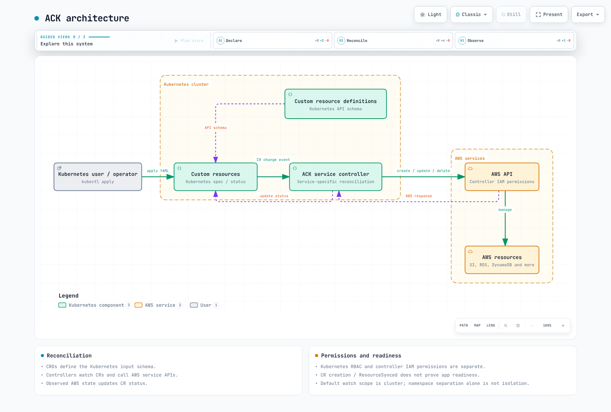

# AWS Controllers for Kubernetes (ACK)

> **Última actualización**: September 12, 2026

## Conceptos y arquitectura

ACK conecta recursos personalizados de Kubernetes con las API de AWS mediante controllers específicos de cada servicio. Los CRD definen las entradas; los controllers reconcilian el estado deseado con el estado observado de AWS. Crear un CR no significa que el recurso de AWS esté listo. Inspecciona el estado y la preparación propia del servicio.

ACK reutiliza las API de Kubernetes, RBAC y las herramientas GitOps, pero la autorización de Kubernetes y AWS IAM siguen siendo independientes. El CR de un usuario normalmente genera acciones bajo los permisos de AWS del controller. Por lo tanto, el permiso para escribir un CR delega la capacidad de solicitar acciones de AWS a través de ese controller.

ACK no es un sucesor obligatorio de CloudFormation ni Terraform. AWS contiene el recurso real; Kubernetes contiene el spec/status del CR. La gestión de la desviación depende de los campos compatibles y de la lógica del controller. Asigna un único propietario de mutación en lugar de permitir que varias herramientas o clusters reconcilien el mismo recurso de AWS.



[Diagrama interactivo](https://www.atomai.click/kubernetes-docs/archmaps/en-platform-engineering-02-ack-0.html)

## Versiones y soporte

| Controller | Versión |
| --- | --- |
| s3 | 1.12.1 |
| iam | 1.9.0 |
| sqs | 1.7.0 |
| sns | 1.10.1 |
| elbv2 | 1.7.0 |
| route53 | 1.6.0 |
| rds | 1.12.0 |

Estas versiones se comprobaron con las versiones oficiales y los charts OCI. Consulta la lista oficial de servicios para conocer la cobertura completa y el estado Alpha/Beta/GA. GA no implica que estén cubiertas todas las características de las API de AWS ni todos los requisitos operativos. La cadena de API v1alpha1 de un CRD es distinta de la madurez del controller.

El mínimo histórico de Kubernetes 1.16 no es una referencia operativa actual. Verifica conjuntamente una versión compatible de Kubernetes/EKS, la compatibilidad del controller, la versión de Helm y el proceso de actualización de CRD.

## Preparación de la instalación e inspección sin conexión

Usa la ruta del chart OCI a continuación, en lugar de la ruta anterior de eks-charts s3-chart. Este comando renderiza manifiestos sin instalarlos en un cluster.

```bash
helm template ack-s3 \
  oci://public.ecr.aws/aws-controllers-k8s/s3-chart \
  --version 1.12.1 --namespace infra \
  --set aws.region=us-west-2 \
  --set installScope=namespace --set watchNamespace=infra \
  --set enableCARM=false --set enableCrossNamespace=false \
  --set serviceAccount.create=false \
  --set serviceAccount.name=ack-s3-controller \
  --set metrics.service.create=true --set deletionPolicy=retain
```

Antes de una instalación/actualización real, prepara el namespace infra y el ServiceAccount del controller y, a continuación, configura IRSA o EKS Pod Identity compatible. Verifica las condiciones de confianza de OIDC de IRSA para el namespace/ServiceAccount, o la compatibilidad y asociación del agente/SDK de Pod Identity. Crear únicamente un rol de IAM no adjunta permisos a un ServiceAccount.

Revisa los permisos de lectura/creación/actualización/eliminación/etiquetado del controller y los permisos PassRole frente a los recursos gestionados. AmazonS3FullAccess o Resource:"*" no son ejemplos de mínimo privilegio. Las políticas de acceso a datos de la subguía no constituyen una política completa para el controller.

Un renderizado correcto no valida IAM, las restricciones de la API de AWS, la admisión, la instalación de CRD, la conectividad de endpoints ni la creación de recursos. Instalar controllers y cambiar CRD son cambios operativos independientes.

## Aislamiento de namespace y cuenta

El installScope predeterminado es cluster. Instalar simplemente releases en los namespaces dev/prod puede hacer que ambos controllers observen los mismos CR. Este ejemplo establece installScope=namespace y watchNamespace=infra, y deshabilita CARM y las referencias entre namespaces. Usa ámbitos de observación, ServiceAccounts, roles de IAM y RBAC independientes para otros equipos.

Incluso en modo namespace, el chart actual renderiza un ClusterRole que concede get/list/watch en namespaces para su caché de namespaces. El modo namespace no elimina todos los permisos de cluster. Inspecciona los Roles, ClusterRoles, Bindings y el acceso a Secret/FieldExport renderizados. El permiso para modificar anotaciones de namespaces, asignaciones de roles y destinos de referencias también afecta al aislamiento.

CARM es la gestión entre cuentas que requiere confianza en el rol de destino, permisos AssumeRole y configuración del controller. No garantiza una mutación concurrente segura por varios clusters. Separa las referencias de solo lectura de la propiedad de mutación.

## Creación, referencias y estado

Los esquemas de los servicios difieren. La política de S3 pertenece a Bucket.spec.policy; no existe un CRD BucketPolicy separado. Las políticas gestionadas de IAM se adjuntan mediante Role.policies/policyRefs. Las subguías muestran los atributos queueName/string de SQS y los campos dedicados Topic/Subscription de SNS.

- [S3 / IAM](ack/01-s3-iam.md)
- [SQS / SNS](ack/02-sqs-sns.md)
- [ELBv2 / Route 53 / Aurora](ack/03-elbv2-route53-rds.md)

```bash
kubectl get buckets.s3.services.k8s.aws -n infra
kubectl get bucket.s3.services.k8s.aws app-data -n infra -o json
kubectl describe bucket.s3.services.k8s.aws app-data -n infra
kubectl logs -n infra \
  -l app.kubernetes.io/instance=ack-s3 --all-containers --tail=100
kubectl get events -n infra \
  --field-selector involvedObject.name=app-data
```

ACK.ResourceSynced=True describe la sincronización del controller; no es una comprobación de conexión a la base de datos ni de preparación de la aplicación. Inspecciona otras condiciones, como ACK.Terminal/ACK.Recoverable, y el estado del servicio. Cuando se proporciona para el recurso, su ARN se encuentra en status.ackResourceMetadata.arn; los ARN de NLB y TargetGroup también usan esta ruta.

Los campos Ref compatibles pueden conectar recursos en el mismo namespace. Aplicar varios documentos YAML no es una transacción para todo AWS. Verifica la preparación del recurso referenciado y los identificadores externos/ARN.

## Adopción y retención

Usa las anotaciones ResourceAdoption a continuación. El chart de S3 actual habilita esta feature gate. Revisa los identificadores, la cuenta y la región, y planifica la transferencia de propiedad desde otras herramientas antes de la adopción.

```yaml
apiVersion: s3.services.k8s.aws/v1alpha1
kind: Bucket
metadata:
  name: existing-data
  namespace: infra
  annotations:
    services.k8s.aws/adoption-policy: adopt
    services.k8s.aws/adoption-fields: '{"name":"REPLACE_WITH_EXISTING_BUCKET"}'
    services.k8s.aws/deletion-policy: retain
spec:
  name: REPLACE_WITH_EXISTING_BUCKET
```

El runtime acepta adopt y adopt-or-create. adopt lee el estado existente en spec/status; adopt-or-create puede crear un recurso que falta. La reconciliación normal posterior puede modificar un recurso adoptado, por lo que la adopción no es simplemente acceso de lectura. El comportamiento de solo lectura es una característica independiente con su propia gate y ciclo de vida. La anotación anterior resource-imported:"true" no configura la adopción. La documentación oficial también identifica AdoptedResource como el enfoque más antiguo.

El valor de retención es **retain**. El runtime actual no acepta orphan. La precedencia es services.k8s.aws/deletion-policy del CR individual, la deletion-policy específica del servicio del namespace y, luego, el valor predeterminado del controller. Conservar los recursos de AWS deja responsabilidades continuas de costo, propiedad y copias de seguridad.

## Observabilidad, escalado y recuperación

Habilita metrics.service.create y haz coincidir el namespace de destino y el nombre del puerto a continuación. Los CRD de Prometheus Operator y los selectores ServiceMonitor de Prometheus son requisitos previos independientes.

```yaml
apiVersion: monitoring.coreos.com/v1
kind: ServiceMonitor
metadata:
  name: ack-s3
  namespace: monitoring
spec:
  namespaceSelector:
    matchNames: [infra]
  selector:
    matchLabels:
      app.kubernetes.io/name: s3-chart
      app.kubernetes.io/instance: ack-s3
  endpoints:
    - port: metricsport
      interval: 30s
```

El runtime revisado define ack_outbound_api_requests_total y ack_outbound_api_requests_error_total. No inventes nombres de métricas de éxito/error de reconciliación ni de latencia de API. Verifica los nombres, las etiquetas y las versiones de las métricas de controller-runtime en el endpoint real. La auditoría de CloudTrail depende del soporte de registro del servicio/API y de los eventos configurados.

La configuración de réplicas es deployment.replicas; revisa leaderElection.enabled al ejecutar varias réplicas. replicaCount no es la configuración de este chart. Las réplicas adicionales con elección de líder no aumentan automáticamente el rendimiento paralelo. Ajusta la concurrencia de reconciliación/resincronización según las cuotas, la limitación y el uso de recursos observados.

Versiona los manifiestos y charts específicos del entorno en Git, sin incluir credenciales. La recuperación requiere datos/copias de seguridad de AWS, identificadores, política de retención y propiedad, además de los CR. Crear un CR en otra región no implementa la replicación de datos ni la recuperación.

## Resolución de problemas

Para los fallos de creación, inspecciona condiciones/eventos, la imagen/logs del controller, cuenta/región, confianza/políticas de IAM, referencias y restricciones del servicio. Distingue los errores de RBAC de Kubernetes de los de AWS IAM. Para los recursos Terminating, identifica la eliminación de AWS, la dependencia o la condición de retención que el finalizer está esperando.

No elimines finalizers de forma rutinaria. Hacerlo puede dejar recursos de AWS sin seguimiento. Resuelve primero la causa; usa un procedimiento de recuperación de último recurso solo después de revisar el estado real del recurso, las copias de seguridad y la propiedad posterior.

## Verificación y referencias

Se leyeron los ocho archivos de guía originales y los dos cuestionarios en coreano/inglés, incluidos 56 bloques de código únicos. Se renderizaron siete charts OCI oficiales y se comprobaron 18 ejemplos de recursos frente a CRD versionados con rechazo de campos spec desconocidos. No se probaron la creación de recursos de AWS, la ejecución de controllers, la admisión/CEL, la entrega de mensajes ni la conectividad de bases de datos.

- [Servicios ACK](https://aws-controllers-k8s.github.io/community/docs/community/services/)
- [Adopción de recursos](https://aws-controllers-k8s.github.io/community/docs/user-docs/features/#resourceadoption)
- [Retención](https://aws-controllers-k8s.github.io/community/docs/user-docs/deletion-policy/)
- [Chart de S3 1.12.1](https://github.com/aws-controllers-k8s/s3-controller/tree/v1.12.1/helm)
- [Runtime 0.63.0](https://github.com/aws-controllers-k8s/runtime/tree/v0.63.0)

[Cuestionario ACK](../quizzes/platform-engineering/02-ack-quiz.md)
