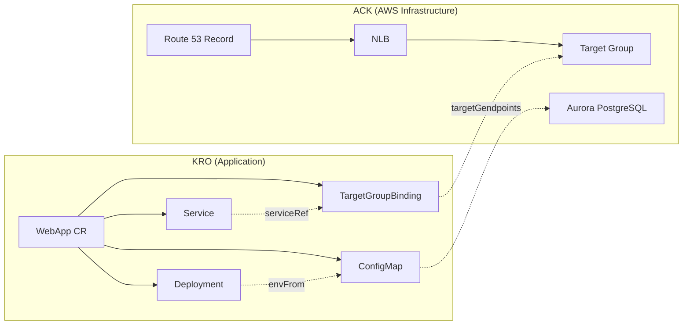

# Sistema de pedidos de ExampleCorp: despliegue integrado ACK + KRO

> **Última actualización**: February 21, 2026

## Resumen del escenario

Un ejemplo de extremo a extremo para desplegar la Order API de ExampleCorp en Kubernetes. ACK aprovisiona la infraestructura de AWS (NLB, Aurora PostgreSQL, Route 53), mientras que KRO gestiona los recursos de la aplicación (Deployment, Service, TargetGroupBinding, ConfigMap) como un único Custom Resource (recurso personalizado).

```
ACK (AWS Infrastructure)    KRO (App Deployment)
─────────────────────     ─────────────────────
NLB + TargetGroup    ←──  TargetGroupBinding
Aurora PostgreSQL    ←──  ConfigMap (endpoints)
Route 53 Record           Deployment + Service
```

ACK usa los controllers ELBv2, Route 53 y RDS descritos en el [documento de ACK](./02-ack.md) para crear infraestructura, y KRO gestiona los recursos de la aplicación que hacen referencia a esta infraestructura como un único CR.

## Diagrama de arquitectura



## Paso 1: Aprovisionamiento de infraestructura con ACK

Usa controllers de ACK (elbv2, route53, rds) para aprovisionar la siguiente infraestructura. Para ver el YAML detallado de cada recurso, consulta [ejemplos de recursos de ACK](./ack/03-elbv2-route53-rds.md).

- **NLB + TargetGroup + Listener**: ingress de tráfico de la aplicación
- **Route 53 DNS Record**: mapeo `app.example.com` → NLB
- **Aurora PostgreSQL**: DBSubnetGroup + DBCluster + Writer + 2 Readers + Custom Endpoint

## Paso 2: ResourceGraphDefinition de KRO

```yaml
apiVersion: kro.run/v1alpha1
kind: ResourceGraphDefinition
metadata:
  name: webapp-graph
spec:
  resourceKind:
    group: kro.example.com
    kind: WebApp
    version: v1
  childResources:
    # 1. ConfigMap — Aurora connection info
    - apiVersion: v1
      kind: ConfigMap
      nameTemplate: "{{.parent.metadata.name}}-db-config"
      template: |
        data:
          DB_WRITER_HOST: "{{.parent.spec.aurora.writerEndpoint}}"
          DB_READER_HOST: "{{.parent.spec.aurora.readerEndpoint}}"
          DB_PORT: "{{.parent.spec.aurora.port}}"
          DB_NAME: "{{.parent.spec.aurora.dbName}}"

    # 2. Deployment — App container
    - apiVersion: apps/v1
      kind: Deployment
      nameTemplate: "{{.parent.metadata.name}}"
      template: |
        spec:
          replicas: {{.parent.spec.replicas}}
          selector:
            matchLabels:
              app: {{.parent.spec.appName}}
          template:
            metadata:
              labels:
                app: {{.parent.spec.appName}}
            spec:
              containers:
              - name: {{.parent.spec.appName}}
                image: {{.parent.spec.image}}
                ports:
                - containerPort: {{.parent.spec.port}}
                envFrom:
                - configMapRef:
                    name: {{.children.configmap.metadata.name}}

    # 3. Service — ClusterIP
    - apiVersion: v1
      kind: Service
      nameTemplate: "{{.parent.metadata.name}}"
      template: |
        spec:
          selector:
            app: {{.parent.spec.appName}}
          ports:
          - port: {{.parent.spec.port}}
            targetPort: {{.parent.spec.port}}
          type: ClusterIP

    # 4. TargetGroupBinding — ACK Target Group connection
    - apiVersion: elbv2.k8s.aws/v1beta1
      kind: TargetGroupBinding
      nameTemplate: "{{.parent.metadata.name}}-tgb"
      template: |
        spec:
          targetGroupARN: {{.parent.spec.targetGroupARN}}
          serviceRef:
            name: {{.children.service.metadata.name}}
            port: {{.parent.spec.port}}
          targetType: ip

  statusMappings:
    - childResource:
        kind: Deployment
        name: "{{.parent.metadata.name}}"
      conditions:
        - type: Available
          mapping:
            type: Ready
    - childResource:
        kind: Service
        name: "{{.parent.metadata.name}}"
      fieldMappings:
        - child: "spec.clusterIP"
          parent: "status.serviceIP"
```

### Descripción de campos de entrada

| Campo | Descripción |
|-------|-------------|
| `appName` | Nombre de la aplicación (usado en labels y selectors) |
| `image` | URI de la imagen de Container |
| `replicas` | Cantidad de réplicas del Deployment |
| `port` | Puerto del Container y del Service |
| `targetGroupARN` | ARN del Target Group creado por ACK |
| `aurora.writerEndpoint` | endpoint Writer del DBCluster de ACK |
| `aurora.readerEndpoint` | endpoint Reader del DBCluster de ACK |
| `aurora.port` | Puerto de Aurora (predeterminado 5432) |
| `aurora.dbName` | Nombre de la base de datos |

## Paso 3: Despliegue de la aplicación

```yaml
apiVersion: kro.example.com/v1
kind: WebApp
metadata:
  name: order-api
  namespace: production
spec:
  appName: order-api
  image: 123456789012.dkr.ecr.ap-northeast-2.amazonaws.com/order-api:v1.2.0
  replicas: 3
  port: 8080
  targetGroupARN: <ACK TargetGroup's .status.targetGroupARN>
  aurora:
    writerEndpoint: <ACK DBCluster's .status.endpoint>
    readerEndpoint: <ACK DBCluster's .status.readerEndpoint>
    port: "5432"
    dbName: orders
```

Inyecta los valores de salida de la infraestructura creada por ACK (ARN del Target Group, endpoints de Aurora) en la spec del CR de KRO.

## Paso 4: Verificación

```bash
# Check WebApp CR status
kubectl get webapp order-api -n production -o yaml

# Check created resources
kubectl get deploy,svc,targetgroupbinding,configmap -n production -l app=order-api
```

## Patrones operativos

### Agregar nuevos Services

Reutiliza la infraestructura existente simplemente agregando un nuevo CR de WebApp:

```yaml
apiVersion: kro.example.com/v1
kind: WebApp
metadata:
  name: payment-api
  namespace: production
spec:
  appName: payment-api
  image: 123456789012.dkr.ecr.ap-northeast-2.amazonaws.com/payment-api:v1.0.0
  replicas: 2
  port: 8080
  targetGroupARN: <new Target Group ARN>
  aurora:
    writerEndpoint: <existing Aurora Writer Endpoint>
    readerEndpoint: <existing Aurora Reader Endpoint>
    port: "5432"
    dbName: payments
```

### Escalado de Aurora

Agrega DBInstances de ACK para escalar horizontalmente las Read Replicas:

```yaml
apiVersion: rds.services.k8s.aws/v1alpha1
kind: DBInstance
metadata:
  name: my-aurora-reader-3
  namespace: infra
spec:
  dbInstanceIdentifier: my-aurora-reader-3
  dbClusterIdentifier: my-aurora-cluster
  dbInstanceClass: db.r6g.xlarge
  engine: aurora-postgresql
```

### Despliegue Blue/Green

Realiza un despliegue sin downtime reemplazando el CR de KRO. Aplicar una nueva versión del CR hace que KRO actualice automáticamente el Deployment.

## Documentos de referencia

- [Conceptos e instalación de ACK](./02-ack.md)
- [Ejemplos de recursos de ACK: ELBv2, Route 53, RDS](./ack/03-elbv2-route53-rds.md)
- [Conceptos de KRO y RGD](./03-kro.md)
