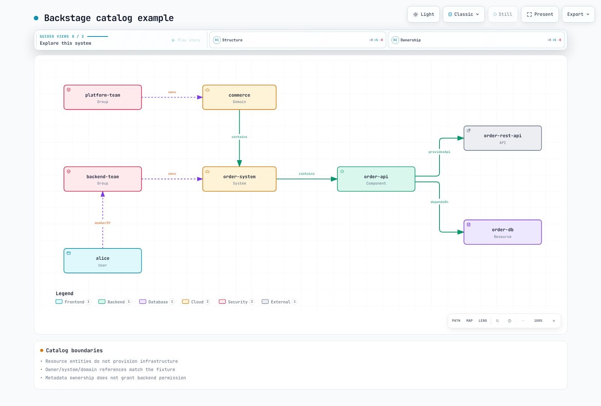
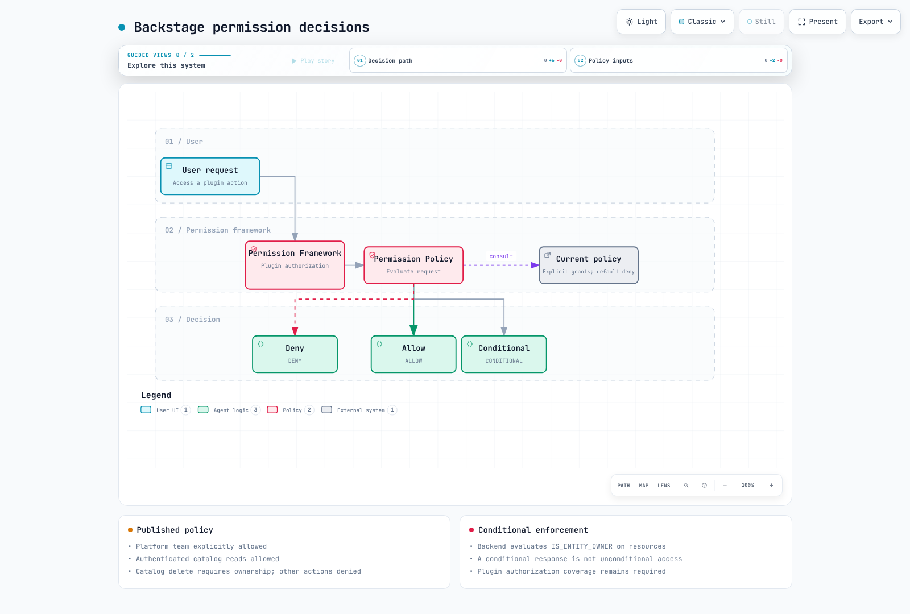

# Backstage como portal interno para desarrolladores

> **Última actualización**: September 12, 2026 · Backstage 1.54.7 / Helm chart 2.10.0

## Rol y alcance de adopción

Backstage es un framework de portal para desarrolladores de código abierto originado en Spotify, con licencia Apache 2.0. La CNCF lo lista como Incubating. Un portal puede ser la parte de un IDP orientada al usuario; no reemplaza toda la automatización de infraestructura, entrega, políticas u operaciones.

El Software Catalog modela la propiedad (ownership), las APIs y las relaciones entre recursos. Las Software Templates ejecutan acciones configuradas sobre esqueletos (skeletons) preparados. TechDocs se encarga de la construcción, publicación y lectura de la documentación. Search necesita collators configurados y backends de indexación. Ubicar el código y la documentación juntos no mantiene automáticamente el contenido actualizado.

Al comparar Port, Cortex, Humanitec, OpsLevel u otros productos, evalúe el hosting actual, los límites de los datos, las APIs de extensión y los costes de personal/suscripción/infraestructura. Evite los recuentos no verificados de plugins/adopción, los rankings universales o las afirmaciones de que Backstage solo cuesta infraestructura. Los términos de licencia y los costes operativos son cuestiones distintas.

## Arquitectura y plugins

Los frontends en React y los backends en Node.js componen los plugins de catalog, scaffolder, auth y TechDocs. Instale y registre los módulos necesarios. Los plugins no proporcionan de forma inherente despliegue independiente ni aislamiento de seguridad. Utilice el EntityPage heredado o las nuevas APIs de extensión de frontend según la arquitectura de aplicación seleccionada.


[Diagrama interactivo](https://www.atomai.click/kubernetes-docs/archmaps/en-platform-engineering-06-backstage-idp-0.html)

## Creación de la app, builds y versiones

Las releases de Backstage, las versiones individuales de los paquetes npm, las versiones del Helm chart y las revisiones de imágenes personalizadas son valores distintos. La release 1.54.7 requiere Node.js 22 o 24; el antiguo Dockerfile con Node 20 no es un valor por defecto actual.

El paquete create-app inspeccionado es 0.9.1. Después de generarlo, inspeccione su lockfile, packageManager y la estructura frontend/backend. Estos comandos describen el flujo de build de la app; durante esta auditoría no se construyó una aplicación Backstage completa.

```bash
npx @backstage/create-app@0.9.1
# In the generated app, using its supported Node/Yarn versions:
yarn install --immutable
yarn tsc
yarn build:backend
```

Revise el archivo packages/backend/Dockerfile generado. La plantilla actual extrae skeleton.tar.gz, instala las dependencias de producción, extrae bundle.tar.gz y ejecuta packages/backend. Simplemente copiar dist y ejecutar node packages/backend/dist no se corresponde con ese formato de bundle.

Haga coincidir la versión mayor de Node del host y del contenedor y la ABI de los módulos nativos, y verifique las imágenes de SO/arquitectura. No cree un segundo usuario con UID 1000 que entre en conflicto con el usuario node de la imagen. Prepare los permisos de ECR/push y los digests de imagen por separado; no incruste credenciales en imágenes, argumentos de build ni variables de entorno. Con builds externos de TechDocs, las imágenes lectoras no necesitan ejecutar el toolchain de construcción de documentos.

## Configuración de EKS con archivos de credenciales

Lo siguiente es un ejemplo de configuración. Reemplace example.invalid y los valores aprobados de organización, bucket y cliente OIDC. Esto no es evidencia de una conexión a PostgreSQL, a un proveedor de identidad, a GitHub o a S3.

Prepare backstage-credentials mediante un flujo de proveedor/ESO aprobado y móntelo como archivos. El cargador real de Backstage resuelve `$file` y recorta los saltos de línea finales. Alinee las rutas de configuración/montaje y verifique cuándo relee cada plugin los valores rotados. Los montajes con SubPath y la configuración leída solo al arranque pueden requerir rollouts.

Este ejemplo divide una única base de datos PostgreSQL en esquemas por plugin. ensureExists/ensureSchemaExists están deshabilitados, por lo que los esquemas/bases de datos deben estar preparados. Los esquemas accedidos a través de la misma credencial no son límites de seguridad independientes. Revise los permisos de migración y agregue las conexiones del pool considerando **plugins × réplicas**. Valide la CA de RDS y mantenga habilitada la verificación TLS.

```yaml
app:
  title: Example Developer Portal
  baseUrl: https://backstage.example.com
backend:
  baseUrl: https://backstage.example.com
  listen:
    port: 7007
  cors:
    origin: https://backstage.example.com
    credentials: true
  database:
    client: pg
    pluginDivisionMode: schema
    ensureExists: false
    ensureSchemaExists: false
    connection:
      host: backstage-db.example.invalid
      port: 5432
      database: backstage
      user: backstage
      password:
        $file: /var/run/backstage-secrets/postgres-password
      ssl:
        rejectUnauthorized: true
        ca:
          $file: /var/run/backstage-public/rds-ca.pem
    knexConfig:
      pool:
        min: 0
        max: 10
  auditor:
    severityLogLevelMappings:
      low: debug
      medium: info
      high: warn
      critical: error
auth:
  environment: production
  session:
    secret:
      $file: /var/run/backstage-secrets/auth-session-secret
  providers:
    oidc:
      production:
        metadataUrl: https://issuer.example.invalid/.well-known/openid-configuration
        clientId: replace-with-approved-client-id
        clientSecret:
          $file: /var/run/backstage-secrets/oidc-client-secret
        additionalScopes: [profile, email]
        signIn:
          resolvers:
            - resolver: emailMatchingUserEntityProfileEmail
permission:
  enabled: true
integrations:
  github:
    - host: github.com
      token:
        $file: /var/run/backstage-secrets/github-token
catalog:
  providers:
    github:
      approvedOrg:
        organization: replace-approved-org
        catalogPath: /catalog-info.yaml
        filters:
          branch: main
          repository: "^approved-.*$"
        schedule:
          frequency: {minutes: 30}
          timeout: {minutes: 3}
  rules:
    - allow: [Component, API, Resource, System, Domain, Group, User, Template, Location]
techdocs:
  builder: external
  publisher:
    type: awsS3
    awsS3:
      bucketName: replace-approved-techdocs-bucket
      region: us-west-2
```

El backend también admite la autenticación IAM de RDS, pero necesita el paquete signer, rds-db:connect, la configuración del usuario de base de datos y TLS. No mezcle automáticamente ese flujo con el ejemplo del archivo de contraseña.

## Configuración de Helm y HA

Construya una imagen que contenga la aplicación Backstage configurada. La imagen example.invalid de abajo es un placeholder. Prepare primero el ServiceAccount, el Secret de credenciales, el ConfigMap con la CA de RDS y el ConfigMap de app-config. Por defecto no se crea ningún ingress público; el acceso interno aprobado o expuesto tras CloudFront, la autenticación, TLS y los controles de red siguen siendo requisitos operativos.

```yaml
fullnameOverride: backstage
backstage:
  image:
    registry: example.invalid
    repository: backstage
    tag: replace-with-reviewed-app-revision
  replicas: 3
  resources:
    requests:
      cpu: 250m
      memory: 512Mi
    limits:
      cpu: "1"
      memory: 1Gi
  extraEnvVarsSecrets: []
  extraAppConfig:
    - filename: app-config.production.yaml
      configMapRef: backstage-app-config
  extraVolumeMounts:
    - name: credentials
      mountPath: /var/run/backstage-secrets
      readOnly: true
    - name: public-config
      mountPath: /var/run/backstage-public
      readOnly: true
  extraVolumes:
    - name: credentials
      secret:
        secretName: backstage-credentials
    - name: public-config
      configMap:
        name: backstage-public-config
  readinessProbe:
    httpGet:
      path: /.backstage/health/v1/readiness
      port: 7007
  livenessProbe:
    httpGet:
      path: /.backstage/health/v1/liveness
      port: 7007
  strategy:
    type: RollingUpdate
    rollingUpdate:
      maxUnavailable: 0
      maxSurge: 1
serviceAccount:
  create: false
  name: backstage
  automountServiceAccountToken: false
postgresql:
  enabled: false
ingress:
  enabled: false
```

examples/platform/backstage/app-config-configmap.yaml almacena esa configuración bajo data.app-config.production.yaml. Coincide con el filename/configMapRef de extraAppConfig y contiene referencias a archivos en lugar de valores secretos.

```bash
helm template backstage backstage/backstage   --version 2.10.0 --namespace backstage   -f examples/platform/backstage/helm-values.yaml
```

Registre primero el repositorio oficial backstage.github.io/charts. Esta auditoría descargó y renderizó ese chart localmente. serviceAccount es un valor de nivel superior del chart, no backstage.serviceAccount. El antiguo valor backstage.podDisruptionBudget no crea un PDB en el chart 2.10.0; prepare este recurso por separado.

```yaml
apiVersion: policy/v1
kind: PodDisruptionBudget
metadata:
  name: backstage
  namespace: backstage
spec:
  minAvailable: 2
  selector:
    matchLabels:
      app.kubernetes.io/name: backstage
      app.kubernetes.io/instance: backstage
```

Las rutas de salud actuales son /.backstage/health/v1/readiness y liveness. Alinee las comprobaciones de salud del load balancer con el backend real. Tres réplicas o un PDB por sí solos no garantizan la distribución entre AZ, la HA de la base de datos ni cero tiempo de caída. Verifique las reglas de topología, el estado compartido de base de datos/sesión, las tareas en segundo plano y las migraciones de actualización.

## Inicio de sesión OIDC e identidad

Registre el módulo del proveedor OIDC del backend y configure el inicio de sesión en el frontend. metadataUrl debe identificar el discovery de un issuer de confianza para el pool de Cognito o el issuer de Okta seleccionado. El proveedor actual usa additionalScopes para scopes adicionales.

emailMatchingUserEntityProfileEmail es un resolver de ejemplo basado en usuarios del catálogo. Revise la verificación de issuer/email, los límites de alta y los correos duplicados; no asigne claims externos arbitrarios a administradores del catálogo. Deje dangerouslyAllowSignInWithoutUserInCatalog deshabilitado. Evite registrar a la vez el proveedor integrado y un módulo con resolver personalizado bajo el mismo ID de proveedor.

## Software Catalog

Estas ocho entidades cubren siete kinds con referencias resolubles de owner/system/domain. Declare las dependencias de Resource mediante Component.dependsOn. No asuma que un campo inventado dependencyOf crea automáticamente relaciones en el backend. Registrar una entidad Resource no aprovisiona infraestructura de AWS.



[Diagrama interactivo](https://www.atomai.click/kubernetes-docs/archmaps/en-platform-engineering-06-backstage-idp-1.html)

```yaml
apiVersion: backstage.io/v1alpha1
kind: Domain
metadata:
  name: commerce
spec:
  owner: group:default/platform-team
---
apiVersion: backstage.io/v1alpha1
kind: System
metadata:
  name: order-system
spec:
  owner: group:default/backend-team
  domain: commerce
---
apiVersion: backstage.io/v1alpha1
kind: Component
metadata:
  name: order-api
  annotations:
    backstage.io/techdocs-ref: dir:.
    backstage.io/kubernetes-id: order-api
    backstage.io/kubernetes-namespace: production
    github.com/project-slug: replace-approved-org/order-api
    argocd/app-name: order-api
spec:
  type: service
  lifecycle: production
  owner: group:default/backend-team
  system: order-system
  providesApis:
  - order-rest-api
  dependsOn:
  - resource:default/order-db
---
apiVersion: backstage.io/v1alpha1
kind: API
metadata:
  name: order-rest-api
spec:
  type: openapi
  lifecycle: production
  owner: group:default/backend-team
  system: order-system
  definition: "openapi: 3.0.3\ninfo:\n  title: Order API\n  version: 1.0.0\npaths:\n\
    \  /orders:\n    get:\n      responses:\n        \"200\":\n          description:\
    \ Orders returned\n"
---
apiVersion: backstage.io/v1alpha1
kind: Resource
metadata:
  name: order-db
spec:
  type: database
  owner: group:default/backend-team
  system: order-system
---
apiVersion: backstage.io/v1alpha1
kind: Group
metadata:
  name: platform-team
spec:
  type: team
  children: []
---
apiVersion: backstage.io/v1alpha1
kind: Group
metadata:
  name: backend-team
spec:
  type: team
  children: []
  members:
  - alice
---
apiVersion: backstage.io/v1alpha1
kind: User
metadata:
  name: alice
spec:
  profile:
    displayName: Alice
    email: alice@example.com
  memberOf:
  - backend-team
```

El discovery de GitHub necesita credenciales de integración y el módulo catalog-backend-module-github. Configure catalogPath, los filtros de branch/repository y la programación para la organización real. Restrinja las fuentes de confianza en lugar de asumir que cualquier repositorio o Location arbitraria es segura para ingerir. Las ubicaciones de archivo deben coincidir con las rutas del contenedor; una cadena glob por sí sola no establece el registro.

## Software Templates y GitOps

Este es un **esqueleto pequeño y completo solo para archivos de catálogo y TechDocs**. No se presenta como un microservicio completamente implementado con runtime, Dockerfile, Helm y CI. Un golden path de runtime necesita código fuente real específico del lenguaje, tests, build de imagen, charts, valores por entorno y pipelines. Añadir una casilla de verificación no aprovisiona una base de datos ni un HPA.

```yaml
apiVersion: scaffolder.backstage.io/v1beta3
kind: Template
metadata:
  name: reviewed-documentation-starter
  title: Reviewed documentation starter
  description: Creates a catalog and TechDocs skeleton; it does not deploy an application.
spec:
  owner: group:default/platform-team
  type: documentation
  parameters:
    - title: Service metadata
      required: [name, description, owner, repoUrl]
      properties:
        name:
          type: string
          pattern: "^[a-z][a-z0-9-]{1,38}[a-z0-9]$"
        description:
          type: string
          maxLength: 200
        owner:
          type: string
          enum: [group:default/backend-team, group:default/platform-team]
        repoUrl:
          type: string
          ui:field: RepoUrlPicker
          ui:options:
            allowedHosts: [github.com]
            allowedOwners: [replace-approved-org]
  steps:
    - id: fetch
      name: Render the complete documentation skeleton
      action: fetch:template
      input:
        url: ./skeleton
        values:
          name: ${{ parameters.name }}
          description: ${{ parameters.description }}
          owner: ${{ parameters.owner }}
    - id: publish
      name: Create the approved repository
      action: publish:github
      input:
        repoUrl: ${{ parameters.repoUrl }}
        allowedHosts: [github.com]
        repoVisibility: private
        defaultBranch: main
        description: ${{ parameters.description }}
    - id: register
      name: Register the published catalog entity
      action: catalog:register
      input:
        repoContentsUrl: ${{ steps.publish.output.repoContentsUrl }}
        catalogInfoPath: /catalog-info.yaml
  output:
    links:
      - title: Repository
        url: ${{ steps.publish.output.remoteUrl }}
      - title: Catalog
        entityRef: ${{ steps.register.output.entityRef }}
```

El directorio template/skeleton contiene catalog-info.yaml, mkdocs.yml y docs/index.md. Los valores de description/owner codificados con dump preservan las cadenas YAML, incluidas las comillas y los saltos de línea probados. Las referencias de entidad de OwnerPicker no son slugs de equipos de GitHub; no conceda permisos de colaborador mediante una sustitución ingenua de cadenas. Las restricciones de RepoUrlPicker son comportamiento de UI, no sustitutos de las comprobaciones en las acciones del backend ni del alcance de la credencial de GitHub.

publish:github necesita el módulo de acciones de GitHub. Inspeccione las acciones registradas y sus esquemas de entrada reales. Este ejemplo registra después de publicar el repositorio. En un flujo de infraestructura con publish:github:pull-request, no registre de inmediato un archivo de la rama main que no existe hasta el merge; realice el discovery/registro después.

DatabaseClaim de ACK/kro no es un kind integrado. Prepare un RGD/CRD validado, un controlador y permisos, usando los ejemplos actuales de [ACK](02-ack.md), [kro](03-kro.md) e [integración](05-example-corp-app.md). Las referencias de entidad del catálogo contienen ':' y '/', por lo que no pueden copiarse literalmente en valores de labels de Kubernetes.

@roadiehq/scaffolder-backend-argocd 1.8.1 proporciona argocd:create-resources. Requiere appName, argoInstance, namespace, repoUrl y path; projectName/labelValue son opcionales. namespace es el destino del despliegue, y la antigua entrada revision no está presente en el esquema de esta acción. Registre su módulo de backend y su token, restringiendo los permisos de AppProject, destino y repositorio. Aquí no se ejecutó ninguna creación de repositorio ni llamada a la API de ArgoCD.

Distinga las expresiones Nunjucks de Backstage de las expresiones de GitHub en los esqueletos de workflow. La CI anterior intentaba hacer git push con contents:read y podía provocar auto-commits repetidos. Proponga digests de imagen revisados mediante un PR de GitOps separado con autenticación adecuada, protección de rama y comprobaciones de merge.

## TechDocs y S3

Con builders externos, la CI construye/publica mientras el backend de Backstage lee de S3. Separe los roles IAM de lector y publicador; no conceda por defecto PutObject/DeleteObject a los lectores en runtime. Habilite las cuatro opciones de S3 Block Public Access y configure la política/permisos de la clave KMS cuando corresponda. Los nombres de campo de ACK son blockPublicACLs/ignorePublicACLs.


[Diagrama interactivo](https://www.atomai.click/kubernetes-docs/archmaps/en-platform-engineering-06-backstage-idp-2.html)

TechDocs todavía admite credentials.roleArn, pero lo marca como obsoleto. Este ejemplo lo omite en favor de credenciales preparadas de workload identity/SDK; utilice la configuración de account/provider de AWS cuando sea necesario. Alinee el bucketRootPath del lector y del publicador, y verifique las claves de entidad namespace/kind/name con la CLI real.

El esqueleto pequeño se construyó con MkDocs/techdocs-core en modo strict; esto no es una construcción de la documentación de todos los servicios. La CI de publicación necesita ramas/eventos de confianza, id-token:write, una confianza OIDC restringida y permisos de publicador. Durante esta auditoría no se subió nada a S3.

## Plugins de Kubernetes, ArgoCD y coste

El plugin de Kubernetes necesita registro en frontend/backend, endpoint/CA reales, autenticación y RBAC. No copie tokens de ServiceAccount de larga duración impresos en variables de entorno. La autenticación de AWS para EKS requiere workload identity, acceso al rol destino/EKS y autorización en Kubernetes, con x-k8s-aws-id coincidiendo con el nombre real del cluster.

Las credenciales de cluster del lado del servidor pueden compartirse entre los usuarios de Backstage. Los locators multiTenant y los selectores de namespace/id del catálogo no son límites de autorización. Revise el alcance de los datos por usuario, la cobertura de permisos del backend y el RBAC del cluster. Haga coincidir las labels de las cargas de trabajo con las anotaciones del catálogo. Los logs de Pod necesitan autorización sobre pods/log y la configuración de la funcionalidad. Listar los customResources de KEDA/Karpenter no genera una UI de escalado dedicada; use los campos de status reales del CRD.

Los plugins de UI de ArgoCD y las acciones del scaffolder tienen paquetes, registro y permisos separados. El paquete de UI de Roadie inspeccionado es 2.12.5. Los antiguos nombres de paquete @kubecost/backstage-plugin y su paquete de backend devolvieron 404 en npm. No se conservan como comandos instalables; seleccione una integración mantenida o un adaptador verificado de API de costes. Revise la semántica de asignación (allocation) y de precios por separado de las tarjetas de la UI.

## Framework de permisos

permission.enabled:true no instala una política de equipo. Registre este módulo en el backend sin registrar en paralelo una política que permita todo. Utiliza las interfaces actuales PolicyQueryUser y AuthService/UserInfoService, no las obsoletas user.info ni la forma anterior user.identity.

Este ejemplo permite explícitamente a los administradores de confianza del platform-team, las lecturas autenticadas del catálogo y el borrado condicionado a la propiedad en el catálogo, denegando las demás acciones. No es una lista de permitidos completa para todo el portal; añada deliberadamente las acciones necesarias. Proteja las fuentes de Group/User frente a usuarios que se concedan a sí mismos privilegios superiores.



[Diagrama interactivo](https://www.atomai.click/kubernetes-docs/archmaps/en-platform-engineering-06-backstage-idp-3.html)

```typescript
import {
  AuthorizeResult,
  isPermission,
  type PolicyDecision,
} from '@backstage/plugin-permission-common';
import type {
  PermissionPolicy,
  PolicyQuery,
  PolicyQueryUser,
} from '@backstage/plugin-permission-node';
import {
  catalogEntityDeletePermission,
  catalogEntityReadPermission,
} from '@backstage/plugin-catalog-common/alpha';
import {
  coreServices,
  createBackendModule,
  type AuthService,
  type UserInfoService,
} from '@backstage/backend-plugin-api';
import { policyExtensionPoint } from '@backstage/plugin-permission-node/alpha';

export class TeamPolicy implements PermissionPolicy {
  constructor(
    private readonly userInfo: UserInfoService,
    private readonly auth: Pick<AuthService, 'isPrincipal'>,
  ) {}

  async handle(
    request: PolicyQuery,
    user?: PolicyQueryUser,
  ): Promise<PolicyDecision> {
    if (!user || !this.auth.isPrincipal(user.credentials, 'user')) {
      return { result: AuthorizeResult.DENY };
    }
    const { ownershipEntityRefs } = await this.userInfo.getUserInfo(
      user.credentials,
    );
    if (ownershipEntityRefs.includes('group:default/platform-team')) {
      return { result: AuthorizeResult.ALLOW };
    }
    if (isPermission(request.permission, catalogEntityReadPermission)) {
      return { result: AuthorizeResult.ALLOW };
    }
    if (
      isPermission(request.permission, catalogEntityDeletePermission) &&
      ownershipEntityRefs.length > 0
    ) {
      return {
        result: AuthorizeResult.CONDITIONAL,
        pluginId: 'catalog',
        resourceType: 'catalog-entity',
        conditions: {
          resourceType: 'catalog-entity',
          rule: 'IS_ENTITY_OWNER',
          params: { claims: ownershipEntityRefs },
        },
      };
    }
    // Add explicit grants for required plugin actions after reviewing their scope.
    return { result: AuthorizeResult.DENY };
  }
}

export const teamPolicyModule = createBackendModule({
  pluginId: 'permission',
  moduleId: 'reviewed-team-policy',
  register(reg) {
    reg.registerInit({
      deps: {
        policy: policyExtensionPoint,
        userInfo: coreServices.userInfo,
        auth: coreServices.auth,
      },
      async init({ policy, userInfo, auth }) {
        policy.setPolicy(new TeamPolicy(userInfo, auth));
      },
    });
  },
});
```

Las decisiones CONDITIONAL deben aplicarse a relaciones de entidad reales por parte del backend del catálogo. El borrado en el catálogo es independiente de los privilegios de modificación en GitHub o de despliegue en ArgoCD. No generalice esto a «los propietarios pueden realizar cualquier actualización». Los ocho casos de política usaron servicios de identidad simulados (mocked), no OIDC real ni el evaluador de propiedad del catálogo.

## Auditoría, recuperación y actualizaciones

El actual Auditor Service del core registra a través de rootLogger por defecto y admite backend.auditor.severityLogLevelMappings. Los antiguos ajustes backend.audit y backend.events.modules awsCloudWatch no configuran automáticamente la recolección de auditoría. Compruebe qué eventos emiten realmente los plugins y luego reenvíe los logs mediante un pipeline separado. Evite filtrar credenciales o datos personales en los metadatos de los eventos.

Planifique los snapshots/PITR de PostgreSQL, el versionado/replicación/ciclo de vida de TechDocs, las fuentes de configuración/catálogo y la recuperación del proveedor de secretos para los requisitos reales de RPO/RTO. Los esquemas en una base de datos compartida, las réplicas de Aurora o la replicación de S3 por sí solos no proporcionan aislamiento completo, backups ni failover automático. La restauración de Aurora también necesita instancias, redes y validación del cambio de endpoint.

Para las actualizaciones, revise las notas de la release y la compatibilidad de los plugins, y luego valide versions:bump, los lockfiles, los tipos/tests, las imágenes y las migraciones de base de datos en staging. No asuma que existe un comando genérico backstage-cli db:migrate; siga el ciclo de vida de migración de plugins/backend. Restaurar una imagen antigua no restaura automáticamente los esquemas de la base de datos.

## Alcance de la verificación

Se leyeron ambas guías originales —2.279 líneas en coreano y 2.226 en inglés—, sus cuestionarios de 143 líneas y 118 bloques de código únicos. Las comprobaciones incluyeron el renderizado del chart oficial, cinco inclusiones reales de archivos por el cargador, ocho entidades de catálogo más una entrada inválida, TypeScript/ocho casos de política, dos casos de plantillas de cadena y una construcción pequeña de TechDocs.

No se realizó ninguna prueba de app/imagen completa de Backstage, de PostgreSQL/OIDC, de las APIs de GitHub/ArgoCD/Kubernetes/AWS, de acciones reales de plantilla, de despliegue, de carga o de HA. Los placeholders y los prerrequisitos del operador son explícitos.

- [Backstage 1.54.7](https://github.com/backstage/backstage/tree/v1.54.7)
- [Helm chart 2.10.0](https://github.com/backstage/charts/releases/tag/backstage-2.10.0)
- [Configuración](https://backstage.io/docs/conf/writing/)
- [Autenticación de Kubernetes](https://backstage.io/docs/features/kubernetes/authentication/)
- [Política de permisos](https://backstage.io/docs/permissions/writing-a-policy/)
- [Auditor](https://backstage.io/docs/backend-system/core-services/auditor/)
- [TechDocs](https://backstage.io/docs/features/techdocs/configuration/)
- [Proyecto de la CNCF](https://www.cncf.io/projects/backstage/)

[Cuestionario de Backstage](../quizzes/platform-engineering/06-backstage-idp-quiz.md)
