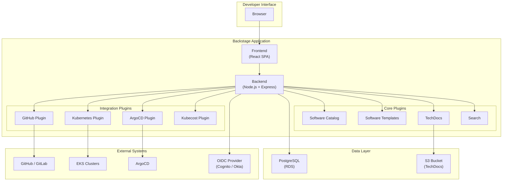
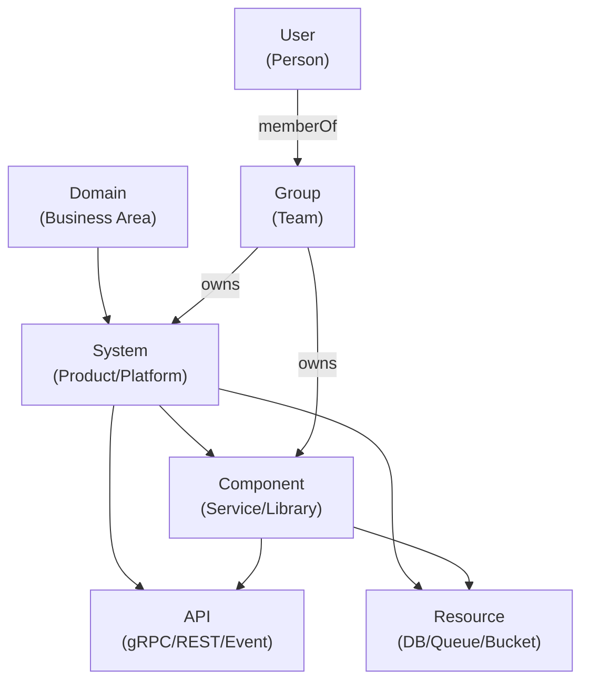
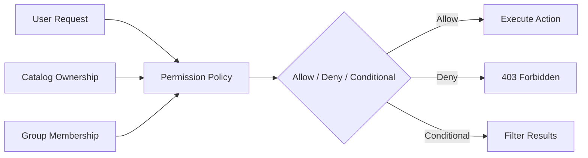

# Backstage: Framework de Internal Developer Platform

> **Versiones compatibles**: Backstage 1.35+, Kubernetes 1.31+, EKS
> **Última actualización**: June 22, 2026

## Tabla de contenidos

- [Descripción general](#overview)
- [Objetivos de aprendizaje](#learning-objectives)
- [Arquitectura de Backstage](#backstage-architecture)
- [Despliegue en EKS](#eks-deployment)
- [Software Catalog](#software-catalog)
- [Software Templates (Golden Paths)](#software-templates-golden-paths)
- [TechDocs](#techdocs)
- [Ecosistema de plugins para EKS](#plugin-ecosystem-for-eks)
- [RBAC y gobernanza](#rbac-and-governance)
- [Operaciones en producción](#production-operations)
- [Mejores prácticas](#best-practices)
- [Referencias](#references)

---

## Descripción general

### ¿Qué es una Internal Developer Platform (IDP)?

Una Internal Developer Platform (IDP) es una capa de autoservicio que se ubica entre los desarrolladores y la infraestructura subyacente, proporcionando flujos de trabajo estandarizados para desplegar aplicaciones, aprovisionar recursos y gestionar servicios. Como se describe en la [Descripción general de Platform Engineering](./00-platform-engineering-overview.md), una IDP permite que los desarrolladores se concentren en escribir código al abstraer la complejidad operativa.

Una IDP normalmente proporciona:

- **Service Catalog**: Un registro centralizado de todos los servicios, APIs y componentes de infraestructura
- **Flujos de trabajo de autoservicio**: Procesos con plantillas para crear nuevos servicios, bases de datos y entornos
- **Centro de documentación**: Documentación técnica centralizada, fácil de descubrir
- **Visibilidad**: Vista en tiempo real de despliegues, costos, propiedad y salud en toda la organización

### ¿Por qué Backstage?

Backstage es un framework open-source para crear Internal Developer Platforms, originalmente creado en Spotify y ahora un proyecto en incubación de CNCF. Spotify creó Backstage para gestionar más de 2.000 microservices en cientos de equipos de ingeniería. Tras publicarlo como open source en 2020, Backstage se ha convertido en el framework de IDP más adoptado en el ecosistema Kubernetes.

Razones clave para elegir Backstage:

1. **Open Source y extensible**: Con licencia MIT y un ecosistema de plugins próspero con más de 200 plugins comunitarios
2. **Respaldo de CNCF**: Proyecto en incubación con gobernanza sólida, lo que garantiza sostenibilidad a largo plazo
3. **Arquitectura de plugins**: Todo es un plugin, lo que lo hace altamente personalizable sin hacer fork
4. **Software Catalog**: Registro centralizado de propiedad que modela todo tu ecosistema tecnológico
5. **Software Templates**: Scaffolding de Golden Path que aplica los estándares organizacionales desde el primer día
6. **TechDocs**: Enfoque docs-like-code que mantiene la documentación junto al código que describe
7. **Comunidad activa**: Más de 900 colaboradores, adoptado por compañías como American Airlines, Netflix, Zalando y HP

### Comparación de plataformas IDP

| Criterio | Backstage | Port | Cortex | Humanitec | OpsLevel |
|----------|-----------|------|--------|-----------|----------|
| **Licencia** | Open Source (MIT) | Comercial (nivel gratuito) | Comercial | Comercial | Comercial |
| **Alojamiento** | Self-hosted | SaaS | SaaS | SaaS + Agent | SaaS |
| **Personalización** | Ilimitada (sistema de plugins) | API + Blueprints | Limitada | Moderada | Moderada |
| **Kubernetes Native** | Fuerte (plugins) | Basado en API | Limitado | Fuerte (Score) | Basado en API |
| **Complejidad de configuración** | Alta (DIY) | Baja | Baja | Media | Baja |
| **Ecosistema comunitario** | Más de 200 plugins | Marketplace en crecimiento | Limitado | En crecimiento | Limitado |
| **Costo** | Solo infraestructura | Por usuario/mes | Por usuario/mes | Por usuario/mes | Por usuario/mes |

> **Nota**: Backstage requiere una inversión inicial mayor para configurarse en comparación con alternativas SaaS, pero ofrece flexibilidad incomparable y cero costos de licencia. Para organizaciones que ya invirtieron en Kubernetes y GitOps, Backstage se integra de forma natural en el ecosistema existente.

---

## Objetivos de aprendizaje

Después de completar este documento, podrás:

1. **Explicar** el rol de Backstage como framework de IDP dentro del stack de platform engineering de Kubernetes
2. **Desplegar** Backstage en Amazon EKS usando Helm, con RDS PostgreSQL y ALB ingress
3. **Configurar** el Software Catalog para descubrir automáticamente servicios desde repositorios GitHub
4. **Crear** Software Templates (Golden Paths) que generen scaffolding de microservices con CI/CD e infraestructura
5. **Integrar** Backstage con el plugin de Kubernetes para visibilidad en tiempo real de workloads en EKS
6. **Configurar** TechDocs con almacenamiento S3 para documentación centralizada
7. **Instalar y configurar** plugins para ArgoCD, Kubecost y otras herramientas del ecosistema Kubernetes
8. **Implementar** RBAC y políticas de gobernanza para entornos de múltiples equipos
9. **Operar** Backstage en producción con alta disponibilidad, backup y estrategias de actualización

---

## Arquitectura de Backstage

### Arquitectura de alto nivel



### Conceptos principales

Backstage se construye alrededor de cuatro pilares fundamentales:

1. **Software Catalog**: Un inventario centralizado y actualizado automáticamente de todo el software de tu organización. Rastrea propiedad, dependencias, APIs, enlaces de documentación y metadatos operativos para cada componente.

2. **Software Templates**: Definiciones de scaffolding reutilizables (Golden Paths) que crean nuevos proyectos, servicios o infraestructura con todos los estándares organizacionales incorporados: pipelines de CI/CD, monitoreo, políticas de seguridad y estructura de documentación.

3. **TechDocs**: Una solución docs-like-code que renderiza documentación Markdown (mediante MkDocs) directamente dentro del portal Backstage. La documentación vive en el mismo repositorio que el código, asegurando que se mantenga actualizada.

4. **Search**: Una plataforma de búsqueda unificada que indexa el catálogo, TechDocs y cualquier otra fuente de datos, proporcionando una única barra de búsqueda para descubrir cualquier cosa en tu organización de ingeniería.

### Arquitectura de plugins

Backstage sigue la filosofía de "todo es un plugin". Incluso las funcionalidades principales como el Software Catalog se implementan como plugins. Esta arquitectura proporciona:

- **Plugins de frontend**: Componentes React que renderizan elementos de UI (páginas, tarjetas, pestañas)
- **Plugins de backend**: Módulos Node.js que proporcionan APIs, manejan procesamiento de datos e integran con sistemas externos
- **Aislamiento de plugins**: Cada plugin tiene su propio esquema de base de datos, rutas de API y configuración
- **Composabilidad**: Los plugins pueden depender de otros plugins y extenderlos mediante puntos de extensión bien definidos

```
┌─────────────────────────────────────────────────────────────────┐
│                     Backstage App Shell                         │
├─────────────────────────────────────────────────────────────────┤
│  ┌──────────┐  ┌──────────┐  ┌──────────┐  ┌──────────────┐   │
│  │ Catalog  │  │Templates │  │ TechDocs │  │   Search     │   │
│  │ Plugin   │  │ Plugin   │  │ Plugin   │  │   Plugin     │   │
│  └──────────┘  └──────────┘  └──────────┘  └──────────────┘   │
│  ┌──────────┐  ┌──────────┐  ┌──────────┐  ┌──────────────┐   │
│  │   K8s    │  │  ArgoCD  │  │ Kubecost │  │   Custom     │   │
│  │ Plugin   │  │  Plugin  │  │  Plugin  │  │   Plugins    │   │
│  └──────────┘  └──────────┘  └──────────┘  └──────────────┘   │
├─────────────────────────────────────────────────────────────────┤
│                    Plugin API / Extension Points                 │
├─────────────────────────────────────────────────────────────────┤
│                    Backend Services (Node.js)                    │
├─────────────────────────────────────────────────────────────────┤
│              PostgreSQL          │           S3 / Cache          │
└─────────────────────────────────────────────────────────────────┘
```

Un plugin normalmente consta de:

| Componente | Ubicación | Propósito |
|-----------|----------|---------|
| **Plugin de frontend** | `plugins/<name>/` | Componentes React, rutas, clientes de API |
| **Plugin de backend** | `plugins/<name>-backend/` | Routers Express, acceso a base de datos, llamadas a APIs externas |
| **Común** | `plugins/<name>-common/` | Tipos compartidos, constantes, definiciones de API |
| **Node** | `plugins/<name>-node/` | Utilidades de backend compartidas, puntos de extensión |

---

## Despliegue en EKS

### Prerrequisitos

Antes de desplegar Backstage en EKS, asegúrate de que los siguientes recursos estén disponibles:

| Recurso | Propósito | Notas |
|----------|---------|-------|
| **EKS Cluster** | Runtime de Backstage | Kubernetes 1.31+ |
| **Amazon RDS (PostgreSQL)** | Almacenamiento persistente | PostgreSQL 15+, db.r6g.large o mayor |
| **Amazon ECR** | Registro de imágenes de container | Repositorio privado para imágenes de Backstage |
| **AWS ALB** | Ingress controller | AWS Load Balancer Controller instalado |
| **Amazon S3** | Almacenamiento de TechDocs | Bucket para documentación generada |
| **AWS Certificate Manager** | Certificado TLS | Para HTTPS en ALB |
| **Amazon Cognito u Okta** | Autenticación OIDC | Proveedor de identidad para inicio de sesión de usuarios |
| **GitHub App o Token** | Integración de código fuente | Para descubrimiento de catálogo y scaffolding de plantillas |

### Paso 1: Crear la aplicación Backstage

Comienza generando el scaffolding de una nueva aplicación Backstage localmente:

```bash
# Ensure Node.js 20+ and Yarn are installed
node --version   # v20.x or higher
yarn --version   # 4.x (Berry)

# Create a new Backstage app
npx @backstage/create-app@latest --skip-install
# When prompted, enter the app name: my-backstage-app

cd my-backstage-app

# Install dependencies
yarn install
```

La estructura del proyecto generado:

```
my-backstage-app/
├── app-config.yaml              # Main configuration
├── app-config.production.yaml   # Production overrides
├── catalog-info.yaml            # Backstage's own catalog entry
├── package.json
├── packages/
│   ├── app/                     # Frontend (React)
│   │   ├── src/
│   │   └── package.json
│   └── backend/                 # Backend (Node.js)
│       ├── src/
│       └── package.json
├── plugins/                     # Custom plugins
└── yarn.lock
```

### Paso 2: Containerizar la aplicación

Crea un Dockerfile multi-stage para el despliegue en producción:

```dockerfile
# Stage 1: Build the frontend and backend
FROM node:20-bookworm-slim AS build

WORKDIR /app

# Copy dependency files
COPY package.json yarn.lock .yarnrc.yml ./
COPY .yarn ./.yarn
COPY packages/app/package.json ./packages/app/
COPY packages/backend/package.json ./packages/backend/
COPY plugins/ ./plugins/

# Install all dependencies
RUN yarn install --immutable

# Copy the rest of the source
COPY . .

# Build the app
RUN yarn tsc
RUN yarn build:backend --config ../../app-config.yaml

# Stage 2: Production image
FROM node:20-bookworm-slim

# Install runtime dependencies for TechDocs
RUN apt-get update && \
    apt-get install -y --no-install-recommends \
      python3 python3-pip python3-venv git curl && \
    python3 -m pip install --break-system-packages \
      mkdocs-techdocs-core==1.4.* && \
    apt-get clean && \
    rm -rf /var/lib/apt/lists/*

# Create a non-root user
RUN useradd -m -u 1000 backstage
USER backstage
WORKDIR /app

# Copy the built backend bundle
COPY --from=build --chown=backstage:backstage /app/packages/backend/dist ./packages/backend/dist
COPY --from=build --chown=backstage:backstage /app/node_modules ./node_modules
COPY --from=build --chown=backstage:backstage /app/package.json ./

# Copy configuration files
COPY --chown=backstage:backstage app-config.yaml app-config.production.yaml ./

# Environment variables
ENV NODE_ENV=production

# Health check
HEALTHCHECK --interval=30s --timeout=5s --start-period=60s --retries=3 \
  CMD curl -f http://localhost:7007/healthcheck || exit 1

EXPOSE 7007

CMD ["node", "packages/backend/dist", "--config", "app-config.yaml", "--config", "app-config.production.yaml"]
```

Construye y publica la imagen en ECR:

```bash
# Authenticate to ECR
aws ecr get-login-password --region ap-northeast-2 | \
  docker login --username AWS --password-stdin \
  111122223333.dkr.ecr.ap-northeast-2.amazonaws.com

# Build and push
docker build -t backstage:latest .
docker tag backstage:latest \
  111122223333.dkr.ecr.ap-northeast-2.amazonaws.com/backstage:v1.35.0
docker push \
  111122223333.dkr.ecr.ap-northeast-2.amazonaws.com/backstage:v1.35.0
```

### Paso 3: Desplegar con Helm

Agrega el repositorio del Helm chart de Backstage y crea un archivo de valores:

```bash
helm repo add backstage https://backstage.github.io/charts
helm repo update
```

Crea un `values.yaml` completo:

```yaml
# backstage-values.yaml
backstage:
  image:
    registry: 111122223333.dkr.ecr.ap-northeast-2.amazonaws.com
    repository: backstage
    tag: v1.35.0
    pullPolicy: IfNotPresent

  replicas: 2

  resources:
    requests:
      memory: 512Mi
      cpu: 250m
    limits:
      memory: 1Gi
      cpu: 1000m

  extraEnvVarsSecrets:
    - backstage-secrets

  appConfig:
    app:
      title: "My Company Developer Portal"
      baseUrl: https://backstage.example.com
    backend:
      baseUrl: https://backstage.example.com
      listen:
        port: 7007
      cors:
        origin: https://backstage.example.com
        methods: [GET, HEAD, PATCH, POST, PUT, DELETE]
        credentials: true
      database:
        client: pg
        connection:
          host: ${POSTGRES_HOST}
          port: ${POSTGRES_PORT}
          user: ${POSTGRES_USER}
          password: ${POSTGRES_PASSWORD}
          database: backstage
          ssl:
            require: true
            rejectUnauthorized: true

  podAnnotations:
    prometheus.io/scrape: "true"
    prometheus.io/port: "7007"
    prometheus.io/path: "/metrics"

  serviceAccount:
    create: true
    name: backstage
    annotations:
      eks.amazonaws.com/role-arn: arn:aws:iam::111122223333:role/backstage-irsa-role

ingress:
  enabled: true
  className: alb
  annotations:
    alb.ingress.kubernetes.io/scheme: internet-facing
    alb.ingress.kubernetes.io/target-type: ip
    alb.ingress.kubernetes.io/listen-ports: '[{"HTTPS":443}]'
    alb.ingress.kubernetes.io/certificate-arn: arn:aws:acm:ap-northeast-2:111122223333:certificate/abcd-1234-efgh
    alb.ingress.kubernetes.io/ssl-policy: ELBSecurityPolicy-TLS13-1-2-2021-06
    alb.ingress.kubernetes.io/healthcheck-path: /healthcheck
    alb.ingress.kubernetes.io/group.name: backstage
  hosts:
    - host: backstage.example.com
      paths:
        - path: /
          pathType: Prefix

postgresql:
  enabled: false  # Using external RDS

serviceAccount:
  create: true
  name: backstage
```

Despliega en EKS:

```bash
# Create the namespace
kubectl create namespace backstage

# Create the secrets (referencing values from AWS Secrets Manager or SSM)
kubectl create secret generic backstage-secrets \
  --namespace backstage \
  --from-literal=POSTGRES_HOST=backstage-db.cluster-xxxxxxx.ap-northeast-2.rds.amazonaws.com \
  --from-literal=POSTGRES_PORT=5432 \
  --from-literal=POSTGRES_USER=backstage \
  --from-literal=POSTGRES_PASSWORD='<secure-password>' \
  --from-literal=GITHUB_TOKEN='ghp_xxxxxxxxxxxxxxxxxxxx' \
  --from-literal=AUTH_OIDC_CLIENT_ID='<client-id>' \
  --from-literal=AUTH_OIDC_CLIENT_SECRET='<client-secret>'

# Install the chart
helm install backstage backstage/backstage \
  --namespace backstage \
  --values backstage-values.yaml \
  --wait --timeout 10m
```

### Paso 4: Configuración de ALB Ingress

Si prefieres gestionar el recurso Ingress por separado del Helm chart, créalo explícitamente:

```yaml
# backstage-ingress.yaml
apiVersion: networking.k8s.io/v1
kind: Ingress
metadata:
  name: backstage
  namespace: backstage
  annotations:
    alb.ingress.kubernetes.io/scheme: internet-facing
    alb.ingress.kubernetes.io/target-type: ip
    alb.ingress.kubernetes.io/listen-ports: '[{"HTTPS":443}]'
    alb.ingress.kubernetes.io/certificate-arn: arn:aws:acm:ap-northeast-2:111122223333:certificate/abcd-1234-efgh
    alb.ingress.kubernetes.io/ssl-policy: ELBSecurityPolicy-TLS13-1-2-2021-06
    alb.ingress.kubernetes.io/healthcheck-path: /healthcheck
    alb.ingress.kubernetes.io/healthcheck-interval-seconds: "15"
    alb.ingress.kubernetes.io/healthy-threshold-count: "2"
    alb.ingress.kubernetes.io/unhealthy-threshold-count: "3"
    alb.ingress.kubernetes.io/group.name: backstage
    alb.ingress.kubernetes.io/tags: Environment=production,Team=platform
    alb.ingress.kubernetes.io/load-balancer-attributes: >-
      idle_timeout.timeout_seconds=120,
      routing.http.drop_invalid_header_fields.enabled=true
spec:
  ingressClassName: alb
  rules:
    - host: backstage.example.com
      http:
        paths:
          - path: /
            pathType: Prefix
            backend:
              service:
                name: backstage
                port:
                  number: 7007
```

```bash
kubectl apply -f backstage-ingress.yaml
```

### Paso 5: PostgreSQL mediante RDS

La conexión a la base de datos se configura en `app-config.production.yaml`. El siguiente ejemplo muestra la sección completa de base de datos con connection pooling y SSL:

```yaml
# app-config.production.yaml
backend:
  database:
    client: pg
    connection:
      host: ${POSTGRES_HOST}
      port: ${POSTGRES_PORT}
      user: ${POSTGRES_USER}
      password: ${POSTGRES_PASSWORD}
      database: backstage
      ssl:
        require: true
        rejectUnauthorized: true
    knexConfig:
      pool:
        min: 3
        max: 12
        acquireTimeoutMillis: 60000
        idleTimeoutMillis: 30000
    plugin:
      catalog:
        connection:
          database: backstage_plugin_catalog
      scaffolder:
        connection:
          database: backstage_plugin_scaffolder
      auth:
        connection:
          database: backstage_plugin_auth
      search:
        connection:
          database: backstage_plugin_search
```

> **Nota**: Backstage admite aislamiento de base de datos por plugin. Cada plugin puede usar una base de datos separada dentro de la misma instancia PostgreSQL, lo que mejora la seguridad y simplifica backup y migración.

### Paso 6: Configuración de autenticación OIDC

Backstage admite múltiples proveedores de autenticación. A continuación se muestran configuraciones para Amazon Cognito y Okta.

#### Configuración de Amazon Cognito

```yaml
# app-config.production.yaml
auth:
  environment: production
  providers:
    oidc:
      production:
        metadataUrl: https://cognito-idp.ap-northeast-2.amazonaws.com/<user-pool-id>/.well-known/openid-configuration
        clientId: ${AUTH_OIDC_CLIENT_ID}
        clientSecret: ${AUTH_OIDC_CLIENT_SECRET}
        authorizationUrl: https://<domain>.auth.ap-northeast-2.amazoncognito.com/oauth2/authorize
        tokenUrl: https://<domain>.auth.ap-northeast-2.amazoncognito.com/oauth2/token
        scope: openid profile email
        prompt: auto
  session:
    secret: ${AUTH_SESSION_SECRET}
```

#### Configuración de Okta

```yaml
# app-config.production.yaml
auth:
  environment: production
  providers:
    okta:
      production:
        clientId: ${AUTH_OKTA_CLIENT_ID}
        clientSecret: ${AUTH_OKTA_CLIENT_SECRET}
        audience: https://dev-123456.okta.com
        authServerId: default
        idp: ${AUTH_OKTA_IDP_ID}
  session:
    secret: ${AUTH_SESSION_SECRET}
```

#### Configuración del Sign-In Resolver

En el código del plugin de backend, configura cómo las identidades OIDC se mapean a usuarios de Backstage:

```typescript
// packages/backend/src/plugins/auth.ts
import { createBackendModule } from '@backstage/backend-plugin-api';
import {
  authProvidersExtensionPoint,
  createOAuthProviderFactory,
} from '@backstage/plugin-auth-node';
import { oidcAuthenticator } from '@backstage/plugin-auth-backend-module-oidc-provider';

export const authModuleOidc = createBackendModule({
  pluginId: 'auth',
  moduleId: 'oidc',
  register(reg) {
    reg.registerInit({
      deps: { providers: authProvidersExtensionPoint },
      async init({ providers }) {
        providers.registerProvider({
          providerId: 'oidc',
          factory: createOAuthProviderFactory({
            authenticator: oidcAuthenticator,
            async signInResolver({ result }, ctx) {
              const email = result.userinfo.email;
              if (!email) {
                throw new Error('OIDC login did not provide an email');
              }
              return ctx.signInWithCatalogUser({
                filter: { 'spec.profile.email': email },
              });
            },
          }),
        });
      },
    });
  },
});
```

---

## Software Catalog

### Modelo de entidades

El Software Catalog de Backstage usa un modelo de entidades bien definido para representar el ecosistema de software de tu organización. Comprender este modelo es esencial para una gestión eficaz del catálogo.



### Tipos de entidades

| Entity Kind | Descripción | Ejemplo |
|-------------|-------------|---------|
| **Component** | Un componente de software (servicio, sitio web, biblioteca) | `order-service`, `payment-api` |
| **System** | Una colección de componentes que forman un producto | `order-platform`, `data-pipeline` |
| **Domain** | Un dominio de negocio que agrupa sistemas relacionados | `commerce`, `fulfillment` |
| **API** | Una interfaz expuesta por un componente | `order-api`, `payment-grpc` |
| **Resource** | Dependencias de infraestructura | `order-db`, `events-queue` |
| **Group** | Un equipo o unidad organizacional | `platform-team`, `commerce-team` |
| **User** | Una persona individual | `john.doe` |

### Ejemplos de catalog-info.yaml

#### Entidad Component

```yaml
# catalog-info.yaml (in the service repository root)
apiVersion: backstage.io/v1alpha1
kind: Component
metadata:
  name: order-service
  description: Handles order creation, updates, and lifecycle management
  labels:
    app.kubernetes.io/name: order-service
  annotations:
    backstage.io/techdocs-ref: dir:.
    github.com/project-slug: my-org/order-service
    backstage.io/kubernetes-id: order-service
    argocd/app-name: order-service
    backstage.io/kubernetes-namespace: commerce
  tags:
    - java
    - spring-boot
    - grpc
  links:
    - url: https://grafana.example.com/d/order-service
      title: Grafana Dashboard
      icon: dashboard
    - url: https://runbook.example.com/order-service
      title: Runbook
      icon: docs
spec:
  type: service
  lifecycle: production
  owner: group:commerce-team
  system: order-platform
  providesApis:
    - order-api
  consumesApis:
    - payment-api
    - inventory-api
  dependsOn:
    - resource:order-db
    - resource:order-events-queue
```

#### Entidad System

```yaml
apiVersion: backstage.io/v1alpha1
kind: System
metadata:
  name: order-platform
  description: End-to-end order management platform including order processing, payment, and fulfillment
  annotations:
    backstage.io/techdocs-ref: dir:.
  tags:
    - commerce
    - critical
spec:
  owner: group:commerce-team
  domain: commerce
```

#### Entidad Domain

```yaml
apiVersion: backstage.io/v1alpha1
kind: Domain
metadata:
  name: commerce
  description: All systems related to the online commerce experience including ordering, payments, and fulfillment
spec:
  owner: group:commerce-leadership
```

#### Entidad API

```yaml
apiVersion: backstage.io/v1alpha1
kind: API
metadata:
  name: order-api
  description: REST API for order management operations
  tags:
    - rest
    - json
spec:
  type: openapi
  lifecycle: production
  owner: group:commerce-team
  system: order-platform
  definition: |
    openapi: "3.0.0"
    info:
      title: Order API
      version: 1.0.0
    paths:
      /orders:
        get:
          summary: List orders
          responses:
            '200':
              description: A list of orders
        post:
          summary: Create an order
          responses:
            '201':
              description: Order created
      /orders/{orderId}:
        get:
          summary: Get order by ID
          parameters:
            - name: orderId
              in: path
              required: true
              schema:
                type: string
          responses:
            '200':
              description: Order details
```

#### Entidad Resource

```yaml
apiVersion: backstage.io/v1alpha1
kind: Resource
metadata:
  name: order-db
  description: Aurora PostgreSQL cluster for order data
  annotations:
    aws.amazon.com/rds-cluster-id: order-db-cluster
  tags:
    - postgresql
    - aurora
spec:
  type: database
  owner: group:commerce-team
  system: order-platform
```

#### Entidad Group

```yaml
apiVersion: backstage.io/v1alpha1
kind: Group
metadata:
  name: commerce-team
  description: Commerce engineering team responsible for the order platform
spec:
  type: team
  profile:
    displayName: Commerce Team
    email: commerce-team@example.com
    picture: https://avatars.example.com/commerce-team.png
  parent: engineering
  children: []
  members:
    - john.doe
    - jane.smith
    - alex.kim
```

#### Entidad User

```yaml
apiVersion: backstage.io/v1alpha1
kind: User
metadata:
  name: john.doe
  description: Senior Backend Engineer
spec:
  profile:
    displayName: John Doe
    email: john.doe@example.com
    picture: https://avatars.example.com/john-doe.png
  memberOf:
    - commerce-team
```

### Descubrimiento automático de GitHub

El plugin de descubrimiento de GitHub encuentra automáticamente archivos `catalog-info.yaml` en toda tu organización GitHub:

```yaml
# app-config.yaml
catalog:
  providers:
    github:
      myOrgProvider:
        organization: my-org
        catalogPath: /catalog-info.yaml
        filters:
          branch: main
          repository: '.*'  # All repositories
        schedule:
          frequency:
            minutes: 30
          timeout:
            minutes: 3
  rules:
    - allow:
        - Component
        - System
        - Domain
        - API
        - Resource
        - Group
        - User
        - Template
        - Location
```

Instala el plugin de backend requerido:

```bash
# From the Backstage app root
yarn --cwd packages/backend add @backstage/plugin-catalog-backend-module-github
```

Registra el módulo en el backend:

```typescript
// packages/backend/src/index.ts
import { createBackend } from '@backstage/backend-defaults';

const backend = createBackend();

// Core plugins
backend.add(import('@backstage/plugin-catalog-backend'));
backend.add(import('@backstage/plugin-catalog-backend-module-github'));
// ... other plugins

backend.start();
```

### Integración de Kubernetes Cluster

El plugin de Kubernetes muestra el estado en tiempo real de Pod, Deployment y Service directamente en el catálogo de Backstage para cada componente.

#### Instalar el plugin de Kubernetes

```bash
# Frontend plugin
yarn --cwd packages/app add @backstage/plugin-kubernetes

# Backend plugin
yarn --cwd packages/backend add @backstage/plugin-kubernetes-backend
```

#### Configurar el backend

Registra el plugin de backend de Kubernetes:

```typescript
// packages/backend/src/index.ts
backend.add(import('@backstage/plugin-kubernetes-backend'));
```

#### Configurar acceso a EKS Cluster

```yaml
# app-config.yaml
kubernetes:
  serviceLocatorMethod:
    type: multiTenant
  clusterLocatorMethods:
    - type: config
      clusters:
        - name: production-eks
          url: https://ABCDEF1234567890.gr7.ap-northeast-2.eks.amazonaws.com
          authProvider: serviceAccount
          serviceAccountToken: ${K8S_PROD_SA_TOKEN}
          caData: ${K8S_PROD_CA_DATA}
          skipTLSVerify: false
          skipMetricsLookup: false
          dashboardUrl: https://console.aws.amazon.com/eks/home?region=ap-northeast-2#/clusters/production-eks
          dashboardApp: aws
        - name: staging-eks
          url: https://GHIJKL5678901234.gr7.ap-northeast-2.eks.amazonaws.com
          authProvider: serviceAccount
          serviceAccountToken: ${K8S_STAGING_SA_TOKEN}
          caData: ${K8S_STAGING_CA_DATA}
          skipTLSVerify: false
          skipMetricsLookup: false
```

#### ServiceAccount y RBAC para Backstage

Crea un ServiceAccount de solo lectura en cada EKS cluster para que Backstage pueda consultar el estado de workloads:

```yaml
# backstage-k8s-rbac.yaml
---
apiVersion: v1
kind: Namespace
metadata:
  name: backstage-system
---
apiVersion: v1
kind: ServiceAccount
metadata:
  name: backstage-reader
  namespace: backstage-system
---
apiVersion: v1
kind: Secret
metadata:
  name: backstage-reader-token
  namespace: backstage-system
  annotations:
    kubernetes.io/service-account.name: backstage-reader
type: kubernetes.io/service-account-token
---
apiVersion: rbac.authorization.k8s.io/v1
kind: ClusterRole
metadata:
  name: backstage-reader
rules:
  - apiGroups: [""]
    resources:
      - pods
      - services
      - configmaps
      - namespaces
      - endpoints
      - serviceaccounts
    verbs: ["get", "list", "watch"]
  - apiGroups: ["apps"]
    resources:
      - deployments
      - replicasets
      - statefulsets
      - daemonsets
    verbs: ["get", "list", "watch"]
  - apiGroups: ["batch"]
    resources:
      - jobs
      - cronjobs
    verbs: ["get", "list", "watch"]
  - apiGroups: ["networking.k8s.io"]
    resources:
      - ingresses
    verbs: ["get", "list", "watch"]
  - apiGroups: ["autoscaling"]
    resources:
      - horizontalpodautoscalers
    verbs: ["get", "list", "watch"]
  - apiGroups: ["metrics.k8s.io"]
    resources:
      - pods
      - nodes
    verbs: ["get", "list"]
---
apiVersion: rbac.authorization.k8s.io/v1
kind: ClusterRoleBinding
metadata:
  name: backstage-reader-binding
subjects:
  - kind: ServiceAccount
    name: backstage-reader
    namespace: backstage-system
roleRef:
  kind: ClusterRole
  name: backstage-reader
  apiGroup: rbac.authorization.k8s.io
```

```bash
# Apply to each target EKS cluster
kubectl apply -f backstage-k8s-rbac.yaml

# Retrieve the token for Backstage configuration
kubectl get secret backstage-reader-token \
  -n backstage-system \
  -o jsonpath='{.data.token}' | base64 -d
```

#### Anotar componentes para descubrimiento de Kubernetes

Para que el plugin de Kubernetes encuentre los workloads correctos, anota tus entidades de catálogo:

```yaml
# In catalog-info.yaml
metadata:
  annotations:
    backstage.io/kubernetes-id: order-service
    backstage.io/kubernetes-namespace: commerce
    backstage.io/kubernetes-label-selector: app=order-service
```

El plugin coincide los workloads mediante estas anotaciones y muestra Pods, Deployments, ReplicaSets y estado de HPA directamente en la página del componente.

---

## Software Templates (Golden Paths)

Software Templates permite que los equipos de plataforma definan rutas estandarizadas para crear nuevos proyectos. Estos Golden Paths aseguran que cada nuevo servicio comience con la estructura, pipeline de CI/CD, monitoreo y configuración de seguridad correctos. Para contexto sobre el concepto de Golden Path, consulta la [Descripción general de Platform Engineering](./00-platform-engineering-overview.md).

### Estructura de una plantilla

Una plantilla de Backstage consta de:

1. **Parámetros**: Campos de entrada presentados al desarrollador (formularios)
2. **Pasos**: Acciones ejecutadas secuencialmente para generar el scaffolding del proyecto
3. **Salida**: Enlaces e información mostrados después de completar el proceso

```
template.yaml
├── parameters:     # What the developer fills in
│   ├── service name
│   ├── team/owner
│   ├── language
│   └── features (database, queue, etc.)
├── steps:          # What happens automatically
│   ├── fetch:template (scaffold files)
│   ├── publish:github (create repository)
│   ├── catalog:register (add to Backstage)
│   └── argocd:create-resources (set up CD)
└── output:         # What the developer sees
    ├── repository URL
    ├── catalog entity link
    └── ArgoCD app link
```

### Plantilla Golden Path de microservice

Esta plantilla genera el scaffolding de un microservice completo con un Dockerfile, Helm chart, ArgoCD Application y pipeline de CI de GitHub Actions:

```yaml
# templates/microservice/template.yaml
apiVersion: scaffolder.backstage.io/v1beta3
kind: Template
metadata:
  name: microservice-golden-path
  title: Microservice Golden Path
  description: |
    Create a production-ready microservice with CI/CD pipeline,
    Kubernetes deployment, monitoring, and documentation scaffolding.
  tags:
    - recommended
    - microservice
    - kubernetes
spec:
  owner: group:platform-team
  type: service

  parameters:
    - title: Service Information
      required:
        - serviceName
        - owner
        - description
      properties:
        serviceName:
          title: Service Name
          type: string
          description: Unique name for the microservice (lowercase, hyphens only)
          pattern: "^[a-z][a-z0-9-]*$"
          maxLength: 40
          ui:autofocus: true
        description:
          title: Description
          type: string
          description: Brief description of what this service does
          maxLength: 200
        owner:
          title: Owner Team
          type: string
          description: The team that will own this service
          ui:field: OwnerPicker
          ui:options:
            catalogFilter:
              kind: Group
        system:
          title: System
          type: string
          description: The system this service belongs to
          ui:field: EntityPicker
          ui:options:
            catalogFilter:
              kind: System

    - title: Technical Configuration
      required:
        - language
        - port
      properties:
        language:
          title: Programming Language
          type: string
          enum:
            - java-spring
            - go
            - node-express
            - python-fastapi
          enumNames:
            - Java (Spring Boot 3)
            - Go (Gin)
            - Node.js (Express)
            - Python (FastAPI)
        port:
          title: Service Port
          type: integer
          default: 8080
          description: Port the service listens on
        enableDatabase:
          title: Enable Database
          type: boolean
          default: false
          description: Provision an Aurora PostgreSQL database via ACK
        enableQueue:
          title: Enable Message Queue
          type: boolean
          default: false
          description: Provision an SQS queue via ACK

    - title: Deployment Configuration
      required:
        - namespace
        - environment
      properties:
        namespace:
          title: Kubernetes Namespace
          type: string
          default: default
          description: Target namespace for deployment
        environment:
          title: Environment
          type: string
          enum:
            - dev
            - staging
            - production
          default: dev

    - title: Repository Configuration
      required:
        - repoUrl
      properties:
        repoUrl:
          title: Repository Location
          type: string
          ui:field: RepoUrlPicker
          ui:options:
            allowedHosts:
              - github.com
            allowedOwners:
              - my-org

  steps:
    # Step 1: Scaffold the project from a skeleton template
    - id: fetch-skeleton
      name: Fetch Project Skeleton
      action: fetch:template
      input:
        url: ./skeleton/${{ parameters.language }}
        targetPath: .
        values:
          serviceName: ${{ parameters.serviceName }}
          description: ${{ parameters.description }}
          owner: ${{ parameters.owner }}
          system: ${{ parameters.system }}
          port: ${{ parameters.port }}
          namespace: ${{ parameters.namespace }}
          environment: ${{ parameters.environment }}
          enableDatabase: ${{ parameters.enableDatabase }}
          enableQueue: ${{ parameters.enableQueue }}

    # Step 2: Generate the Helm chart
    - id: fetch-helm
      name: Generate Helm Chart
      action: fetch:template
      input:
        url: ./skeleton/helm-chart
        targetPath: ./deploy/helm
        values:
          serviceName: ${{ parameters.serviceName }}
          port: ${{ parameters.port }}
          namespace: ${{ parameters.namespace }}
          enableDatabase: ${{ parameters.enableDatabase }}
          enableQueue: ${{ parameters.enableQueue }}

    # Step 3: Generate GitHub Actions CI pipeline
    - id: fetch-ci
      name: Generate CI Pipeline
      action: fetch:template
      input:
        url: ./skeleton/github-actions/${{ parameters.language }}
        targetPath: ./.github/workflows
        values:
          serviceName: ${{ parameters.serviceName }}
          language: ${{ parameters.language }}

    # Step 4: Generate ArgoCD Application manifest
    - id: fetch-argocd
      name: Generate ArgoCD Application
      action: fetch:template
      input:
        url: ./skeleton/argocd-app
        targetPath: ./deploy/argocd
        values:
          serviceName: ${{ parameters.serviceName }}
          namespace: ${{ parameters.namespace }}
          environment: ${{ parameters.environment }}
          repoUrl: ${{ (parameters.repoUrl | parseRepoUrl).host }}/${{ (parameters.repoUrl | parseRepoUrl).owner }}/${{ (parameters.repoUrl | parseRepoUrl).repo }}

    # Step 5: Publish to GitHub
    - id: publish
      name: Create GitHub Repository
      action: publish:github
      input:
        repoUrl: ${{ parameters.repoUrl }}
        description: ${{ parameters.description }}
        defaultBranch: main
        protectDefaultBranch: true
        repoVisibility: internal
        collaborators:
          - team: ${{ parameters.owner | replace("group:", "") }}
            access: maintain
          - team: platform-team
            access: admin

    # Step 6: Register in Backstage catalog
    - id: register
      name: Register in Backstage Catalog
      action: catalog:register
      input:
        repoContentsUrl: ${{ steps['publish'].output.repoContentsUrl }}
        catalogInfoPath: /catalog-info.yaml

  output:
    links:
      - title: Source Code Repository
        url: ${{ steps['publish'].output.remoteUrl }}
      - title: Backstage Catalog Entity
        icon: catalog
        entityRef: ${{ steps['register'].output.entityRef }}
      - title: GitHub Actions CI
        url: ${{ steps['publish'].output.remoteUrl }}/actions
```

### Plantilla de aprovisionamiento de infraestructura

Esta plantilla crea recursos de infraestructura de AWS mediante Claims de [ACK](./02-ack.md) y [KRO](./03-kro.md), dando a los desarrolladores acceso de autoservicio a bases de datos, caches y queues:

```yaml
# templates/infrastructure/template.yaml
apiVersion: scaffolder.backstage.io/v1beta3
kind: Template
metadata:
  name: aws-infrastructure-provisioning
  title: AWS Infrastructure Provisioning
  description: |
    Self-service provisioning of AWS infrastructure resources (RDS, ElastiCache, SQS)
    using ACK controllers and KRO resource graphs on EKS.
  tags:
    - infrastructure
    - aws
    - self-service
spec:
  owner: group:platform-team
  type: resource

  parameters:
    - title: Resource Information
      required:
        - resourceName
        - owner
        - resourceType
      properties:
        resourceName:
          title: Resource Name
          type: string
          description: Name for the infrastructure resource
          pattern: "^[a-z][a-z0-9-]*$"
          maxLength: 40
        owner:
          title: Owner Team
          type: string
          ui:field: OwnerPicker
          ui:options:
            catalogFilter:
              kind: Group
        resourceType:
          title: Resource Type
          type: string
          enum:
            - aurora-postgresql
            - aurora-mysql
            - elasticache-redis
            - sqs-queue
            - s3-bucket
          enumNames:
            - Aurora PostgreSQL
            - Aurora MySQL
            - ElastiCache Redis
            - SQS Queue
            - S3 Bucket

    - title: Resource Configuration
      required:
        - environment
        - size
      properties:
        environment:
          title: Environment
          type: string
          enum:
            - dev
            - staging
            - production
          default: dev
        size:
          title: Instance Size
          type: string
          enum:
            - small
            - medium
            - large
          enumNames:
            - "Small (dev/test: db.t4g.medium, cache.t4g.small)"
            - "Medium (staging: db.r6g.large, cache.r6g.large)"
            - "Large (production: db.r6g.xlarge, cache.r6g.xlarge)"
          default: small
        namespace:
          title: Target Namespace
          type: string
          default: default
          description: Kubernetes namespace where the resource claim will be created

    - title: Database-Specific Options
      description: Only applicable for database resource types
      properties:
        dbName:
          title: Database Name
          type: string
          default: appdb
          description: Name of the initial database to create
        storageSize:
          title: Storage Size (GiB)
          type: integer
          default: 20
          minimum: 20
          maximum: 1000
        enableMultiAZ:
          title: Enable Multi-AZ
          type: boolean
          default: false
          description: Enable Multi-AZ deployment for high availability

  steps:
    # Step 1: Generate the KRO resource claim
    - id: generate-claim
      name: Generate Resource Claim
      action: fetch:template
      input:
        url: ./skeleton/infrastructure/${{ parameters.resourceType }}
        targetPath: ./infrastructure
        values:
          resourceName: ${{ parameters.resourceName }}
          environment: ${{ parameters.environment }}
          size: ${{ parameters.size }}
          namespace: ${{ parameters.namespace }}
          dbName: ${{ parameters.dbName }}
          storageSize: ${{ parameters.storageSize }}
          enableMultiAZ: ${{ parameters.enableMultiAZ }}
          owner: ${{ parameters.owner }}

    # Step 2: Publish to the infrastructure GitOps repository
    - id: publish
      name: Create Pull Request
      action: publish:github:pull-request
      input:
        repoUrl: github.com?owner=my-org&repo=infrastructure-gitops
        branchName: provision/${{ parameters.resourceName }}
        title: "Provision ${{ parameters.resourceType }}: ${{ parameters.resourceName }}"
        description: |
          ## Infrastructure Provisioning Request

          | Field | Value |
          |-------|-------|
          | Resource | ${{ parameters.resourceName }} |
          | Type | ${{ parameters.resourceType }} |
          | Environment | ${{ parameters.environment }} |
          | Size | ${{ parameters.size }} |
          | Owner | ${{ parameters.owner }} |

          Provisioned via Backstage Software Template.
        targetPath: claims/${{ parameters.namespace }}

    # Step 3: Register as a Resource entity in the catalog
    - id: register
      name: Register Resource in Catalog
      action: catalog:register
      input:
        repoContentsUrl: https://github.com/my-org/infrastructure-gitops/tree/main
        catalogInfoPath: /claims/${{ parameters.namespace }}/${{ parameters.resourceName }}/catalog-info.yaml

  output:
    links:
      - title: Pull Request
        url: ${{ steps['publish'].output.remoteUrl }}
      - title: Catalog Entity
        icon: catalog
        entityRef: ${{ steps['register'].output.entityRef }}
```

El claim KRO generado para una base de datos Aurora PostgreSQL (creado por el skeleton de la plantilla):

```yaml
# claims/<namespace>/<resource-name>/kro-claim.yaml
apiVersion: kro.run/v1alpha1
kind: DatabaseClaim
metadata:
  name: order-db
  namespace: commerce
  labels:
    app.kubernetes.io/managed-by: backstage
    backstage.io/owner: group:commerce-team
    environment: production
spec:
  engine: aurora-postgresql
  engineVersion: "15.4"
  instanceClass: db.r6g.xlarge
  storageSize: 100
  multiAZ: true
  databaseName: appdb
  backupRetentionDays: 30
  deletionProtection: true
```

### Plugin de integración con ArgoCD

Para vincular las plantillas de Backstage con [ArgoCD](../gitops/argocd/02-applications.md) para despliegue automático, instala la acción de scaffolder de ArgoCD:

```bash
yarn --cwd packages/backend add @roadiehq/scaffolder-backend-argocd
```

```typescript
// packages/backend/src/index.ts
backend.add(import('@roadiehq/scaffolder-backend-argocd'));
```

Agrega la configuración de ArgoCD:

```yaml
# app-config.yaml
argocd:
  appLocatorMethods:
    - type: config
      instances:
        - name: main
          url: https://argocd.example.com
          token: ${ARGOCD_AUTH_TOKEN}
```

Esto permite que las plantillas incluyan pasos de ArgoCD:

```yaml
# In a template step
- id: create-argocd-app
  name: Create ArgoCD Application
  action: argocd:create-resources
  input:
    appName: ${{ parameters.serviceName }}-${{ parameters.environment }}
    argoInstance: main
    namespace: argocd
    repoUrl: ${{ steps['publish'].output.remoteUrl }}
    path: deploy/helm
    projectName: ${{ parameters.namespace }}
```

---

## TechDocs

TechDocs aporta una experiencia "docs-like-code" a Backstage, renderizando documentación Markdown basada en MkDocs directamente dentro del developer portal.

### Cómo funciona TechDocs

1. La documentación se escribe como archivos Markdown junto al código fuente
2. Un archivo de configuración `mkdocs.yml` define la estructura de la documentación
3. TechDocs construye la documentación como HTML estático
4. Los docs construidos se almacenan en S3 (o GCS/Azure Blob) para servirlos
5. Los desarrolladores leen docs directamente en la UI de Backstage, asociados con el componente propietario

### Configuración para almacenamiento S3

```yaml
# app-config.yaml
techdocs:
  builder: external
  generator:
    runIn: local
  publisher:
    type: awsS3
    awsS3:
      bucketName: backstage-techdocs
      region: ap-northeast-2
      bucketRootPath: /
      accountId: "111122223333"
      credentials:
        roleArn: arn:aws:iam::111122223333:role/backstage-techdocs-role
```

### Política de S3 Bucket

```json
{
  "Version": "2012-10-17",
  "Statement": [
    {
      "Sid": "BackstageTechDocsReadWrite",
      "Effect": "Allow",
      "Principal": {
        "AWS": "arn:aws:iam::111122223333:role/backstage-techdocs-role"
      },
      "Action": [
        "s3:GetObject",
        "s3:PutObject",
        "s3:DeleteObject",
        "s3:ListBucket"
      ],
      "Resource": [
        "arn:aws:s3:::backstage-techdocs",
        "arn:aws:s3:::backstage-techdocs/*"
      ]
    }
  ]
}
```

### Configuración de MkDocs en repositorios de servicios

Cada servicio que publica TechDocs necesita un `mkdocs.yml` en su raíz:

```yaml
# mkdocs.yml (in the service repository)
site_name: Order Service Documentation
site_description: Technical documentation for the Order Service
plugins:
  - techdocs-core
nav:
  - Home: index.md
  - Architecture: architecture.md
  - API Reference: api-reference.md
  - Runbook: runbook.md
  - ADRs:
      - ADR-001 Database Choice: adrs/001-database-choice.md
      - ADR-002 Event Schema: adrs/002-event-schema.md
```

La anotación correspondiente en `catalog-info.yaml`:

```yaml
metadata:
  annotations:
    backstage.io/techdocs-ref: dir:.
```

### Pipeline externo de build de TechDocs

Para el modo de builder `external`, configura un job de CI que construya y publique documentación en cada merge:

```yaml
# .github/workflows/techdocs.yaml
name: Build and Publish TechDocs
on:
  push:
    branches: [main]
    paths:
      - 'docs/**'
      - 'mkdocs.yml'

jobs:
  publish-techdocs:
    runs-on: ubuntu-latest
    steps:
      - uses: actions/checkout@v4

      - name: Setup Python
        uses: actions/setup-python@v5
        with:
          python-version: '3.12'

      - name: Install dependencies
        run: pip install mkdocs-techdocs-core==1.4.*

      - name: Build TechDocs
        run: npx @techdocs/cli generate --no-docker

      - name: Configure AWS Credentials
        uses: aws-actions/configure-aws-credentials@v4
        with:
          role-to-assume: arn:aws:iam::111122223333:role/techdocs-publisher
          aws-region: ap-northeast-2

      - name: Publish TechDocs
        run: |
          npx @techdocs/cli publish \
            --publisher-type awsS3 \
            --storage-name backstage-techdocs \
            --entity default/Component/order-service \
            --awsRoleArn arn:aws:iam::111122223333:role/techdocs-publisher \
            --awsRegion ap-northeast-2
```

---

## Ecosistema de plugins para EKS

El sistema de plugins de Backstage es su mayor fortaleza. Los siguientes plugins son especialmente valiosos para equipos que ejecutan workloads en Amazon EKS.

### Plugin de Kubernetes

El plugin de Kubernetes proporciona visibilidad en tiempo real del estado de Pod y Deployment directamente desde la página de entidad del catálogo.

**Qué muestra:**

- Conteo y estado de Pods (Running, Pending, CrashLoopBackOff)
- Estado de réplicas de Deployment (deseadas vs. disponibles)
- Eventos recientes de Pod y mensajes de error
- Métricas actuales y objetivo de HPA
- Utilización de recursos de container (CPU, memoria)

**Integración frontend:**

```typescript
// packages/app/src/components/catalog/EntityPage.tsx
import { EntityKubernetesContent } from '@backstage/plugin-kubernetes';

// Add to the service entity page
const serviceEntityPage = (
  <EntityLayout>
    <EntityLayout.Route path="/" title="Overview">
      {/* overview content */}
    </EntityLayout.Route>
    <EntityLayout.Route path="/kubernetes" title="Kubernetes">
      <EntityKubernetesContent refreshIntervalMs={10000} />
    </EntityLayout.Route>
  </EntityLayout>
);
```

### Plugin de ArgoCD

El plugin de ArgoCD muestra estado de sincronización de despliegues GitOps, salud e historial para cada componente.

**Instalación:**

```bash
# Frontend
yarn --cwd packages/app add @roadiehq/backstage-plugin-argo-cd

# Backend
yarn --cwd packages/backend add @roadiehq/backstage-plugin-argo-cd-backend
```

**Configuración:**

```yaml
# app-config.yaml
argocd:
  appLocatorMethods:
    - type: config
      instances:
        - name: main
          url: https://argocd.example.com
          token: ${ARGOCD_AUTH_TOKEN}
```

**Anotación de catálogo:**

```yaml
metadata:
  annotations:
    argocd/app-name: order-service
```

**Integración frontend:**

```typescript
// packages/app/src/components/catalog/EntityPage.tsx
import {
  EntityArgoCDOverviewCard,
  EntityArgoCDHistoryCard,
} from '@roadiehq/backstage-plugin-argo-cd';

// Add to the overview page
const overviewContent = (
  <Grid container spacing={3}>
    <Grid item md={6}>
      <EntityArgoCDOverviewCard />
    </Grid>
    <Grid item md={6}>
      <EntityArgoCDHistoryCard />
    </Grid>
  </Grid>
);
```

### Plugin de Kubecost

El plugin de Kubecost proporciona visibilidad de costos por servicio, mostrando cuánto cuesta cada componente en términos de compute, memoria y almacenamiento.

**Instalación:**

```bash
yarn --cwd packages/app add @kubecost/backstage-plugin
yarn --cwd packages/backend add @kubecost/backstage-plugin-backend
```

**Configuración:**

```yaml
# app-config.yaml
kubecost:
  baseUrl: https://kubecost.example.com
  # Optional: filter by cluster
  clusterFilter: production-eks
```

**Anotación de catálogo:**

```yaml
metadata:
  annotations:
    kubecost.com/deployment-name: order-service
    kubecost.com/namespace: commerce
```

**Integración frontend:**

```typescript
// packages/app/src/components/catalog/EntityPage.tsx
import { EntityKubecostCard } from '@kubecost/backstage-plugin';

const overviewContent = (
  <Grid container spacing={3}>
    <Grid item md={6}>
      <EntityKubecostCard />
    </Grid>
  </Grid>
);
```

### Visibilidad de KEDA y Karpenter (concepto de plugin personalizado)

Aunque no existe un plugin oficial de Backstage para KEDA o Karpenter, puedes crear un plugin personalizado que consulte la Kubernetes API para recursos ScaledObject y NodePool, y luego muestre métricas de escalado junto al componente.

**Concepto de backend de plugin personalizado:**

```typescript
// plugins/keda-backend/src/router.ts
import { Router } from 'express';
import { Logger } from 'winston';
import { Config } from '@backstage/config';

export async function createRouter(options: {
  logger: Logger;
  config: Config;
}): Promise<Router> {
  const router = Router();

  router.get('/scaled-objects/:namespace/:name', async (req, res) => {
    const { namespace, name } = req.params;

    // Query the Kubernetes API for ScaledObject
    const scaledObject = await k8sClient.getNamespacedCustomObject(
      'keda.sh',
      'v1alpha1',
      namespace,
      'scaledobjects',
      name,
    );

    res.json({
      name: scaledObject.body.metadata.name,
      minReplicas: scaledObject.body.spec.minReplicaCount,
      maxReplicas: scaledObject.body.spec.maxReplicaCount,
      triggers: scaledObject.body.spec.triggers,
      currentReplicas: scaledObject.body.status?.currentReplicas,
    });
  });

  return router;
}
```

**Concepto de frontend de plugin personalizado:**

```typescript
// plugins/keda/src/components/KedaCard.tsx
import React from 'react';
import { InfoCard, Progress } from '@backstage/core-components';
import { useEntity } from '@backstage/plugin-catalog-react';
import useAsync from 'react-use/lib/useAsync';

export const KedaScalingCard = () => {
  const { entity } = useEntity();
  const namespace =
    entity.metadata.annotations?.['backstage.io/kubernetes-namespace'];
  const name = entity.metadata.name;

  const { value, loading, error } = useAsync(async () => {
    const response = await fetch(
      `/api/keda/scaled-objects/${namespace}/${name}`,
    );
    return response.json();
  });

  if (loading) return <Progress />;
  if (error) return <div>Error loading KEDA data: {error.message}</div>;

  return (
    <InfoCard title="KEDA Autoscaling">
      <p>Min Replicas: {value?.minReplicas}</p>
      <p>Max Replicas: {value?.maxReplicas}</p>
      <p>Current Replicas: {value?.currentReplicas}</p>
      <p>Triggers: {value?.triggers?.length}</p>
    </InfoCard>
  );
};
```

### Resumen de plugins

| Plugin | Propósito | Fuente de datos | Instalación |
|--------|---------|-------------|--------------|
| **@backstage/plugin-kubernetes** | Estado de Pod/Deployment | Kubernetes API | Oficial |
| **@roadiehq/backstage-plugin-argo-cd** | Estado de sincronización, historial de despliegues | ArgoCD API | Comunidad (Roadie) |
| **@kubecost/backstage-plugin** | Desglose de costos por servicio | Kubecost API | Comunidad (Kubecost) |
| **Custom KEDA Plugin** | Estado del autoscaler | Kubernetes API (keda.sh CRDs) | Build personalizado |
| **Custom Karpenter Plugin** | Estado de aprovisionamiento de nodes | Kubernetes API (karpenter.sh CRDs) | Build personalizado |
| **@backstage/plugin-techdocs** | Visor de documentación | S3 / GCS | Oficial |
| **@backstage/plugin-github-actions** | Estado de pipeline de CI | GitHub API | Oficial |

---

## RBAC y gobernanza

### Descripción general del framework de permisos

Backstage incluye un framework de permisos integrado que controla el acceso a entidades de catálogo, plantillas y funcionalidades de plugins. El sistema de permisos se basa en políticas y se integra con el modelo de propiedad del catálogo.



### Habilitar el framework de permisos

```yaml
# app-config.yaml
permission:
  enabled: true
```

### Control de acceso basado en equipos

Implementa una política de permisos personalizada que aplique acceso basado en propiedad:

```typescript
// packages/backend/src/plugins/permission.ts
import {
  PolicyDecision,
  AuthorizeResult,
  isPermission,
} from '@backstage/plugin-permission-common';
import {
  PermissionPolicy,
  PolicyQuery,
} from '@backstage/plugin-permission-node';
import {
  catalogEntityDeletePermission,
  catalogEntityCreatePermission,
} from '@backstage/plugin-catalog-common/alpha';
import {
  createCatalogConditionalDecision,
  catalogConditions,
} from '@backstage/plugin-catalog-backend/alpha';
import { BackstageIdentityResponse } from '@backstage/plugin-auth-node';
import { createBackendModule } from '@backstage/backend-plugin-api';
import { policyExtensionPoint } from '@backstage/plugin-permission-node/alpha';

class TeamBasedPermissionPolicy implements PermissionPolicy {
  async handle(
    request: PolicyQuery,
    user?: BackstageIdentityResponse,
  ): Promise<PolicyDecision> {
    // Platform team gets full access
    if (
      user?.identity.ownershipEntityRefs.includes(
        'group:default/platform-team',
      )
    ) {
      return { result: AuthorizeResult.ALLOW };
    }

    // Only owners can delete catalog entities
    if (isPermission(request.permission, catalogEntityDeletePermission)) {
      if (!user) {
        return { result: AuthorizeResult.DENY };
      }
      return createCatalogConditionalDecision(request.permission, {
        anyOf: user.identity.ownershipEntityRefs.map((ref) =>
          catalogConditions.isEntityOwner({ claims: [ref] }),
        ),
      });
    }

    // Everyone can create entities and view the catalog
    if (isPermission(request.permission, catalogEntityCreatePermission)) {
      return { result: AuthorizeResult.ALLOW };
    }

    // Default: allow read operations
    return { result: AuthorizeResult.ALLOW };
  }
}

export const permissionModule = createBackendModule({
  pluginId: 'permission',
  moduleId: 'team-based-policy',
  register(reg) {
    reg.registerInit({
      deps: { policy: policyExtensionPoint },
      async init({ policy }) {
        policy.setPolicy(new TeamBasedPermissionPolicy());
      },
    });
  },
});
```

### Ejemplos de reglas de gobernanza

| Regla | Implementación | Alcance |
|------|---------------|-------|
| **Solo los propietarios pueden eliminar entidades** | Permiso condicional sobre `catalogEntityDeletePermission` | Catálogo |
| **Solo el equipo de plataforma puede crear plantillas** | DENY `templateCreatePermission` salvo que esté en el grupo platform-team | Scaffolder |
| **Solo lectura para contratistas externos** | DENY de todos los permisos de escritura para el grupo contractor | Global |
| **La ejecución de plantillas requiere aprobación** | Paso de flujo de trabajo de aprobación personalizado en plantillas | Scaffolder |
| **Despliegues de producción restringidos** | Permiso condicional basado en el lifecycle de la entidad | Catálogo + ArgoCD |

### Audit logging

Backstage admite audit logging para rastrear quién hizo qué. Configura el backend de audit log:

```yaml
# app-config.yaml
backend:
  audit:
    enabled: true
    logger:
      type: winston
      options:
        transports:
          - type: console
            level: info
          - type: file
            level: info
            filename: /var/log/backstage/audit.log
            maxsize: 10485760
            maxFiles: 10
```

Para entornos de producción, envía audit logs a CloudWatch:

```yaml
# app-config.yaml
backend:
  audit:
    enabled: true
    logger:
      type: winston
      options:
        transports:
          - type: cloudwatch
            level: info
            logGroupName: /backstage/audit
            logStreamName: backstage-production
            region: ap-northeast-2
```

Las entradas de audit log capturan:

- **Quién**: La identidad del usuario autenticado
- **Qué**: La acción realizada (entidad creada, plantilla ejecutada, entidad eliminada)
- **Cuándo**: Timestamp de la acción
- **Dónde**: La entidad o recurso objetivo
- **Resultado**: Éxito o fallo con detalles del error

---

## Operaciones en producción

### Configuración de alta disponibilidad

Para despliegues de producción, ejecuta múltiples réplicas de Backstage detrás del ALB con PostgreSQL externo compartido:

```yaml
# backstage-values.yaml (HA configuration)
backstage:
  replicas: 3

  resources:
    requests:
      memory: 1Gi
      cpu: 500m
    limits:
      memory: 2Gi
      cpu: 2000m

  podDisruptionBudget:
    enabled: true
    minAvailable: 2

  affinity:
    podAntiAffinity:
      preferredDuringSchedulingIgnoredDuringExecution:
        - weight: 100
          podAffinityTerm:
            labelSelector:
              matchExpressions:
                - key: app.kubernetes.io/name
                  operator: In
                  values:
                    - backstage
            topologyKey: topology.kubernetes.io/zone

  topologySpreadConstraints:
    - maxSkew: 1
      topologyKey: topology.kubernetes.io/zone
      whenUnsatisfiable: DoNotSchedule
      labelSelector:
        matchLabels:
          app.kubernetes.io/name: backstage

  livenessProbe:
    httpGet:
      path: /healthcheck
      port: 7007
    initialDelaySeconds: 60
    periodSeconds: 10
    failureThreshold: 3

  readinessProbe:
    httpGet:
      path: /healthcheck
      port: 7007
    initialDelaySeconds: 30
    periodSeconds: 5
    failureThreshold: 3

postgresql:
  enabled: false  # External RDS with Multi-AZ
```

**Arquitectura para despliegue HA:**

```
┌─────────────────────────────────────────────────────────────┐
│                        ALB (internet-facing)                 │
│                      backstage.example.com                   │
└──────────┬──────────────────┬──────────────────┬────────────┘
           │                  │                  │
    ┌──────▼──────┐    ┌──────▼──────┐    ┌──────▼──────┐
    │ Backstage   │    │ Backstage   │    │ Backstage   │
    │ Pod (AZ-a)  │    │ Pod (AZ-b)  │    │ Pod (AZ-c)  │
    └──────┬──────┘    └──────┬──────┘    └──────┬──────┘
           │                  │                  │
           └──────────────────┼──────────────────┘
                              │
                    ┌─────────▼─────────┐
                    │   RDS PostgreSQL   │
                    │   (Multi-AZ)       │
                    └───────────────────┘
```

### Estrategia de backup y recuperación

| Componente | Método de backup | Frecuencia | Retención |
|-----------|--------------|-----------|-----------|
| **PostgreSQL (RDS)** | Snapshots automatizados de RDS | Diario | 30 días |
| **PostgreSQL (RDS)** | Recuperación point-in-time | Continua | 35 días |
| **TechDocs (S3)** | Versioning de S3 + replicación cross-region | Continua | 90 días |
| **Configuración** | Repositorio Git (app-config.yaml) | Cada commit | Indefinida |
| **Entidades de catálogo** | Repositorios Git (catalog-info.yaml) | Cada commit | Indefinida |
| **Secrets** | AWS Secrets Manager con rotación | Al cambiar | Versionado |

**Configuración de backup de RDS (ejemplo Terraform):**

```hcl
resource "aws_rds_cluster" "backstage" {
  cluster_identifier      = "backstage-db"
  engine                  = "aurora-postgresql"
  engine_version          = "15.4"
  master_username         = "backstage"
  database_name           = "backstage"
  backup_retention_period = 30
  preferred_backup_window = "03:00-04:00"
  deletion_protection     = true
  storage_encrypted       = true
  kms_key_id              = aws_kms_key.backstage.arn

  copy_tags_to_snapshot = true

  tags = {
    Environment = "production"
    Service     = "backstage"
    ManagedBy   = "terraform"
  }
}
```

**Procedimiento de disaster recovery:**

1. **Corrupción o pérdida de base de datos**: Restaura desde el snapshot automatizado de RDS más reciente o usa point-in-time recovery a un timestamp específico
2. **Pérdida de TechDocs**: El versioning de S3 permite recuperar cualquier versión previa; la réplica cross-region proporciona failover regional
3. **Configuration drift**: Toda la configuración está en Git; vuelve a desplegar desde el commit conocido como bueno
4. **Pérdida de datos de catálogo**: Las entidades de catálogo se definen en repositorios Git; vuelve a disparar el proveedor de descubrimiento de GitHub para repoblar

### Estrategia de actualización

Backstage publica nuevas versiones con frecuencia (aproximadamente mensualmente). Sigue esta estrategia de actualización:

1. **Fija versiones explícitamente**: Usa siempre tags de versión exactos en tu Dockerfile y package.json, nunca `latest`
2. **Lee el changelog**: Revisa el [changelog de Backstage](https://github.com/backstage/backstage/blob/master/CHANGELOG.md) para detectar breaking changes antes de actualizar
3. **Actualiza incrementalmente**: No saltes versiones major; actualiza una versión minor a la vez
4. **Prueba en staging**: Despliega primero en un entorno de staging con una copia del esquema de base de datos de producción
5. **Rolling updates**: Usa la estrategia de rolling update de Kubernetes con readiness probes para asegurar cero downtime

```yaml
# Deployment strategy in values.yaml
backstage:
  strategy:
    type: RollingUpdate
    rollingUpdate:
      maxUnavailable: 0
      maxSurge: 1
```

**Flujo de actualización:**

```bash
# 1. Update Backstage packages
yarn backstage-cli versions:bump --release 1.36.0

# 2. Run database migrations
yarn backstage-cli db:migrate

# 3. Build and test locally
yarn build:backend
yarn test

# 4. Build new container image
docker build -t backstage:v1.36.0 .

# 5. Push to ECR
docker tag backstage:v1.36.0 \
  111122223333.dkr.ecr.ap-northeast-2.amazonaws.com/backstage:v1.36.0
docker push \
  111122223333.dkr.ecr.ap-northeast-2.amazonaws.com/backstage:v1.36.0

# 6. Update Helm values and upgrade
helm upgrade backstage backstage/backstage \
  --namespace backstage \
  --set backstage.image.tag=v1.36.0 \
  --values backstage-values.yaml \
  --wait --timeout 10m
```

---

## Mejores prácticas

### Prácticas recomendadas

1. **Comienza con el Software Catalog**: Antes de crear plantillas o instalar plugins, invierte en un catálogo completo y preciso. Un catálogo bien poblado es la base que hace valioso todo lo demás. Empieza registrando todos los servicios existentes con propiedad correcta.

2. **Trata Backstage como un producto interno**: Asigna un product owner, recopila feedback de desarrolladores, itera sobre funcionalidades y rastrea métricas de adopción. El equipo de plataforma es un equipo de producto cuyos clientes son los otros equipos de ingeniería.

3. **Define Golden Paths, no Golden Cages**: Las plantillas deben codificar mejores prácticas y estándares organizacionales, pero siempre permitir que los desarrolladores se desvíen cuando tengan una razón válida. El objetivo es hacer que lo correcto sea lo fácil, no lo único posible.

4. **Automatiza la población del catálogo**: Usa el plugin de descubrimiento de GitHub para encontrar y registrar automáticamente archivos `catalog-info.yaml` en lugar de requerir registro manual. Esto reduce la fricción y mantiene el catálogo actualizado.

5. **Mantén app-config.yaml en control de versiones**: Nunca edites manualmente la configuración en el cluster en ejecución. Toda la configuración de Backstage debe estar en un repositorio Git, desplegada mediante el mismo pipeline de CI/CD que la propia aplicación.

6. **Invierte en documentación (TechDocs)**: Un developer portal sin documentación es solo un dashboard. Haz que TechDocs sea un requisito para cada servicio: inclúyelo en tus plantillas Golden Path para que los nuevos servicios se entreguen con scaffolding de documentación desde el primer día.

7. **Monitorea Backstage en sí**: Expón métricas Prometheus desde el backend de Backstage, configura dashboards para latencia de API, tasas de error y salud de plugins. Usa el mismo stack de observabilidad que proporcionas a tus desarrolladores.

8. **Planifica el mantenimiento de plugins**: Los plugins comunitarios pueden quedar rezagados respecto a las releases del core de Backstage. Fija versiones de plugins, prueba actualizaciones en staging y mantén una lista de qué plugins son críticos para tu despliegue.

### Errores comunes

1. **Construir demasiado, demasiado rápido**: Intentar desplegar Backstage con todos los plugins el primer día lleva a complejidad y retrasos. Empieza con el catálogo y una plantilla, luego agrega plugins incrementalmente según el feedback de desarrolladores.

2. **Descuidar los datos de propiedad**: Un catálogo con información de propiedad faltante o incorrecta debilita la confianza. Si los desarrolladores no pueden encontrar quién es dueño de un servicio, dejan de usar el catálogo. Aplica propiedad mediante checks de CI sobre `catalog-info.yaml`.

3. **Ignorar la autenticación desde el inicio**: Desplegar Backstage sin autenticación OIDC adecuada, incluso en staging, crea brechas de seguridad y dificulta implementar RBAC más tarde. Configura la autenticación antes de exponer Backstage a usuarios.

4. **Tratar Backstage como solo lectura**: El verdadero poder de Backstage está en Software Templates y flujos de trabajo de autoservicio, no solo en ver datos del catálogo. Si los desarrolladores pueden ver sus servicios pero no pueden crear nuevos mediante el portal, la adopción se estancará.

---

## Referencias

### Documentación oficial

- [Documentación oficial de Backstage](https://backstage.io/docs/overview/what-is-backstage)
- [Repositorio GitHub de Backstage](https://github.com/backstage/backstage)
- [Marketplace de plugins de Backstage](https://backstage.io/plugins)
- [Helm Chart de Backstage](https://github.com/backstage/charts)

### CNCF y comunidad

- [Página del proyecto Backstage en CNCF](https://www.cncf.io/projects/backstage/)
- [White Paper de plataformas de CNCF](https://tag-app-delivery.cncf.io/whitepapers/platforms/)
- [Sesiones de la comunidad de Backstage](https://github.com/backstage/community)

### Integración con AWS y EKS

- [Guía de mejores prácticas de AWS EKS](https://aws.github.io/aws-eks-best-practices/)
- [Documentación de AWS Load Balancer Controller](https://kubernetes-sigs.github.io/aws-load-balancer-controller/)
- [Guía para desarrolladores de Amazon Cognito](https://docs.aws.amazon.com/cognito/latest/developerguide/)

### Documentación relacionada en este repositorio

- [Descripción general de Platform Engineering](./00-platform-engineering-overview.md) -- Conceptos de IDP, modelo de madurez y arquitectura de referencia
- [Gestor de paquetes Helm](./01-helm.md) -- Empaquetado de Helm chart usado para el despliegue de Backstage
- [AWS Controllers for Kubernetes (ACK)](./02-ack.md) -- Aprovisionamiento de infraestructura mediante Kubernetes API
- [Kubernetes Resource Operator (KRO)](./03-kro.md) -- Orquestación de resource graphs para claims de autoservicio
- [Mecanismos de extensión de Kubernetes](./04-kubernetes-extensions.md) -- CRDs y operadores que potencian plugins de Backstage
- [Ejemplo de integración de ExampleCorp](./05-example-corp-app.md) -- Ejemplo end-to-end de despliegue ACK + KRO
- [Crossplane](./07-crossplane.md) -- Infrastructure as Code mediante Kubernetes API; se integra con Backstage para autoservicio
- [ArgoCD Applications](../gitops/argocd/02-applications.md) -- Despliegue GitOps integrado con plantillas de Backstage
