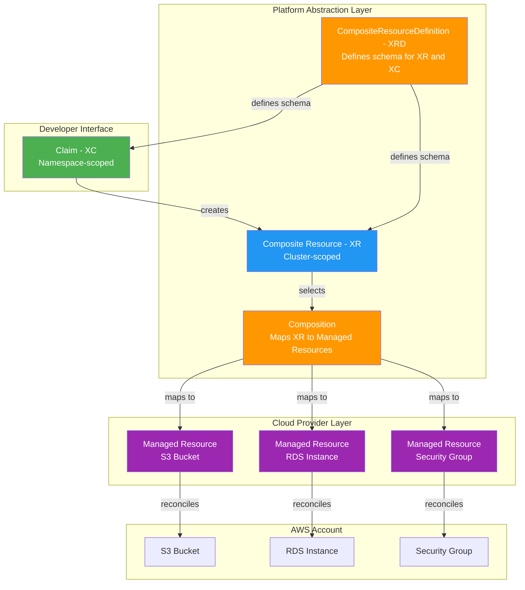
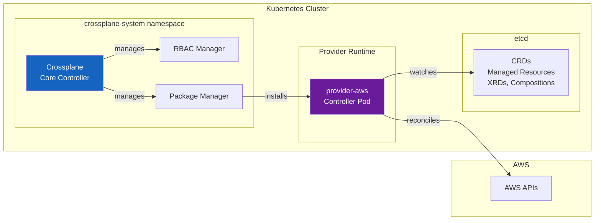
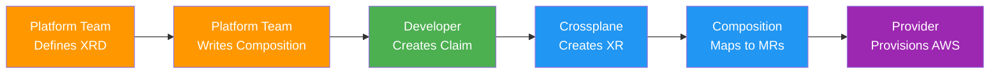
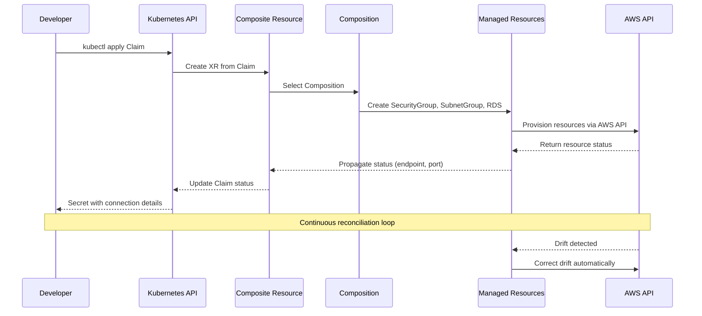
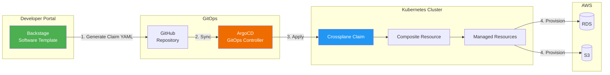

# Crossplane

> **Versiones compatibles**: Crossplane v1.17+, Provider-AWS v1.15+
> **Última actualización**: June 2025

## Table of Contents

- [Overview](#overview)
- [Learning Objectives](#learning-objectives)
- [Crossplane Architecture](#crossplane-architecture)
- [EKS Installation and Configuration](#eks-installation-and-configuration)
- [Managed Resources](#managed-resources)
- [Compositions (Platform Abstraction)](#compositions-platform-abstraction)
- [Claims (Self-Service)](#claims-self-service)
- [ACK vs Crossplane](#ack-vs-crossplane)
- [Backstage + Crossplane Integration](#backstage--crossplane-integration)
- [Production Operations](#production-operations)
- [Best Practices](#best-practices)
- [References](#references)

---

## Overview

### What is Crossplane?

Crossplane es un proyecto open-source graduado de CNCF que extiende Kubernetes para convertirlo en un control plane universal para la infraestructura. En lugar de introducir una herramienta o lenguaje separado para aprovisionar recursos cloud, Crossplane te permite definir, componer y gestionar infraestructura usando la misma Kubernetes API, comandos kubectl y flujos de trabajo GitOps que ya usas para las aplicaciones.

En esencia, Crossplane transforma tu cluster Kubernetes en un control plane capaz de orquestar recursos en cualquier cloud provider -- AWS, GCP, Azure -- o incluso en sistemas on-premises. Los ingenieros de infraestructura definen abstracciones de mayor nivel llamadas Compositions, y los desarrolladores de aplicaciones consumen esas abstracciones mediante Claims, sin necesidad de conocer los detalles subyacentes específicos de cada cloud.

### Why Crossplane?

Los enfoques tradicionales de gestión de infraestructura requieren que los equipos aprendan herramientas y lenguajes específicos del provider:

- **Terraform** usa HCL, requiere gestión de archivos de estado y opera fuera del ecosistema Kubernetes
- **CloudFormation** es solo para AWS y usa su propio lenguaje de plantillas
- **Pulumi** requiere lenguajes de programación de propósito general y un backend de estado separado

Crossplane aborda estos desafíos llevando la gestión de infraestructura directamente a la Kubernetes API:

1. **Kubernetes-Native**: La infraestructura se define como Kubernetes Custom Resources -- no hay nuevos lenguajes ni CLIs que aprender
2. **Continuous Reconciliation**: Como cualquier Kubernetes controller, Crossplane reconcilia continuamente el estado deseado con el estado real, detectando y corrigiendo drift automáticamente
3. **Composable Abstractions**: Los platform teams construyen abstracciones de infraestructura reutilizables (Compositions) que los desarrolladores consumen mediante Claims simples
4. **Multi-Cloud**: Un único control plane puede gestionar recursos en AWS, GCP, Azure y más
5. **GitOps Compatible**: Las definiciones de infraestructura son YAML estándar almacenado en Git, desplegable mediante ArgoCD o FluxCD

### Infrastructure as Code Tool Comparison

| Criteria | Crossplane | Terraform | ACK | CloudFormation | Pulumi |
|----------|-----------|-----------|-----|----------------|--------|
| **Interface** | Kubernetes API (YAML) | HCL | Kubernetes API (YAML) | JSON/YAML templates | General-purpose code |
| **State Management** | Kubernetes etcd | Terraform state file | Kubernetes etcd | CloudFormation stack | Pulumi state backend |
| **Drift Detection** | Continuous (controller) | On `plan`/`apply` | Continuous (controller) | Drift detection API | On `preview`/`up` |
| **Abstraction Layer** | Compositions + Claims | Modules | None (1:1 mapping) | Nested stacks | Component resources |
| **Multi-Cloud** | Yes (multiple Providers) | Yes (multiple providers) | AWS only | AWS only | Yes (multiple providers) |
| **Self-Service** | Claims (namespace-scoped) | Terraform Cloud workspaces | Not built-in | Service Catalog | Automation API |
| **GitOps Integration** | Native (Kubernetes resources) | Requires wrapper (Atlantis) | Native (Kubernetes resources) | Limited | Requires wrapper |
| **CNCF Status** | Graduated | N/A (HashiCorp) | N/A (AWS) | N/A (AWS) | N/A (Pulumi Inc.) |
| **Learning Curve** | Medium (Kubernetes + XRDs) | Medium (HCL) | Low (simple CRDs) | Medium (templates) | Medium (programming) |

### CNCF Project History

Crossplane fue creado por Upbound y aceptado en CNCF Sandbox en junio de 2020. Pasó al estado Incubating en septiembre de 2021 y alcanzó el estado Graduated en noviembre de 2024, uniéndose a Kubernetes, Prometheus y Envoy como proyecto CNCF plenamente maduro. Esta graduación refleja la preparación del proyecto para producción, una gobernanza sólida y una amplia adopción en la industria.

---

## Learning Objectives

Después de completar este documento, podrás:

1. **Explicar** la arquitectura de Crossplane y cómo extiende Kubernetes para convertirlo en un control plane universal
2. **Instalar** Crossplane en Amazon EKS con Provider-AWS configurado mediante IRSA
3. **Crear** Managed Resources para aprovisionar servicios AWS (S3, RDS, VPC) directamente desde Kubernetes
4. **Diseñar** CompositeResourceDefinitions (XRDs) y Compositions para construir abstracciones de plataforma
5. **Aprovisionar** infraestructura mediante Claims con scope de namespace para self-service de desarrolladores
6. **Comparar** ACK y Crossplane para elegir la herramienta adecuada para tu caso de uso
7. **Integrar** Crossplane con Backstage y ArgoCD para un flujo de trabajo IDP completo
8. **Operar** Crossplane en producción con monitoreo, estrategias de upgrade y detección de drift

---

## Crossplane Architecture

### Core Concepts

Crossplane introduce cinco conceptos fundamentales que trabajan juntos para proporcionar abstracción de infraestructura:



**1. Provider**: Un paquete de Crossplane que instala CRDs y controllers para un cloud provider específico. Por ejemplo, `provider-aws` instala CRDs para cada servicio AWS (S3, RDS, VPC, IAM, etc.) y ejecuta controllers que saben cómo crear, actualizar y eliminar esos recursos AWS.

**2. Managed Resource (MR)**: Una representación 1:1 de un recurso cloud externo como Kubernetes Custom Resource. Un Managed Resource para un bucket S3 se asigna directamente a un bucket S3 real en AWS. Los Managed Resources tienen scope de cluster y son la primitiva de menor nivel de Crossplane.

**3. Composite Resource (XR)**: Un custom resource de mayor nivel con scope de cluster definido por una CompositeResourceDefinition. Un XR representa una agrupación lógica de infraestructura -- por ejemplo, un XR "Database" podría componer una instancia RDS, un security group y un subnet group en una sola unidad.

**4. Composition**: La capa de mapeo que define qué Managed Resources crear cuando se aprovisiona un Composite Resource. Una Composition especifica la "receta" -- dado un XR de tipo "Database", crea estos Managed Resources específicos con estas configuraciones y aplica valores desde la spec del XR hacia los campos del MR.

**5. Claim (XC)**: Una proyección con scope de namespace de un Composite Resource. Los Claims son la interfaz orientada al desarrollador -- un desarrollador en el namespace `team-alpha` puede crear un "DatabaseClaim" sin necesitar permisos de nivel de cluster. El Claim crea el XR subyacente, que a su vez activa la Composition.

### Control Plane Architecture

Crossplane se ejecuta como un conjunto de controllers dentro de tu cluster Kubernetes:



- **Crossplane Core Controller**: Gestiona el ciclo de vida de Compositions, XRDs y el mapeo entre XRs y Managed Resources
- **RBAC Manager**: Genera automáticamente Kubernetes RBAC ClusterRoles para XRDs de modo que los Claims puedan usarse en namespaces
- **Package Manager**: Instala y actualiza Providers y Configurations (bundles de XRDs + Compositions)
- **Provider Controllers**: Cada Provider instalado ejecuta sus propios controller pod(s) que observan Managed Resources y los reconcilian contra la cloud API

---

## EKS Installation and Configuration

### Prerequisites

- Cluster Amazon EKS (v1.27+)
- kubectl configurado con acceso al cluster
- Helm v3.x instalado
- Cuenta AWS con permisos IAM adecuados
- OIDC provider configurado en el cluster EKS (para IRSA)

### Step 1: Install Crossplane via Helm

```bash
# Add the Crossplane Helm repository
helm repo add crossplane-stable https://charts.crossplane.io/stable
helm repo update

# Create the crossplane-system namespace and install Crossplane
helm install crossplane \
  crossplane-stable/crossplane \
  --namespace crossplane-system \
  --create-namespace \
  --version 1.17.1 \
  --set args='{"--enable-usages"}' \
  --wait
```

Verifica la instalación:

```bash
# Check Crossplane pods are running
kubectl get pods -n crossplane-system

# Expected output:
# NAME                                       READY   STATUS    RESTARTS   AGE
# crossplane-6d67f8c8b5-abc12               1/1     Running   0          2m
# crossplane-rbac-manager-7f8d9c4b6-def34   1/1     Running   0          2m

# Verify Crossplane CRDs are installed
kubectl get crds | grep crossplane
```

### Step 2: Install Provider-AWS

Instala el AWS provider, que registra CRDs para todos los servicios AWS compatibles:

```yaml
# provider-aws.yaml
apiVersion: pkg.crossplane.io/v1
kind: Provider
metadata:
  name: provider-aws-s3
spec:
  package: xpkg.upbound.io/upbound/provider-aws-s3:v1.15.0
  runtimeConfigRef:
    name: provider-aws-runtime
---
apiVersion: pkg.crossplane.io/v1
kind: Provider
metadata:
  name: provider-aws-rds
spec:
  package: xpkg.upbound.io/upbound/provider-aws-rds:v1.15.0
  runtimeConfigRef:
    name: provider-aws-runtime
---
apiVersion: pkg.crossplane.io/v1
kind: Provider
metadata:
  name: provider-aws-ec2
spec:
  package: xpkg.upbound.io/upbound/provider-aws-ec2:v1.15.0
  runtimeConfigRef:
    name: provider-aws-runtime
---
apiVersion: pkg.crossplane.io/v1
kind: Provider
metadata:
  name: provider-aws-iam
spec:
  package: xpkg.upbound.io/upbound/provider-aws-iam:v1.15.0
  runtimeConfigRef:
    name: provider-aws-runtime
```

```bash
kubectl apply -f provider-aws.yaml

# Wait for Providers to become healthy
kubectl get providers.pkg.crossplane.io
# NAME               INSTALLED   HEALTHY   PACKAGE                                              AGE
# provider-aws-s3    True        True      xpkg.upbound.io/upbound/provider-aws-s3:v1.15.0     60s
# provider-aws-rds   True        True      xpkg.upbound.io/upbound/provider-aws-rds:v1.15.0    60s
# provider-aws-ec2   True        True      xpkg.upbound.io/upbound/provider-aws-ec2:v1.15.0    60s
# provider-aws-iam   True        True      xpkg.upbound.io/upbound/provider-aws-iam:v1.15.0    60s
```

> **Nota**: El enfoque provider-family de Upbound instala un provider por servicio AWS (por ejemplo, `provider-aws-s3`, `provider-aws-rds`). Este es el enfoque recomendado frente al `provider-aws` monolítico para producción, ya que reduce la huella de CRDs y el uso de memoria.

### Step 3: Configure IAM with IRSA

Crea un IAM role para los controllers de Crossplane Provider-AWS usando IAM Roles for Service Accounts (IRSA):

```bash
# Set environment variables
export CLUSTER_NAME=my-eks-cluster
export AWS_ACCOUNT_ID=$(aws sts get-caller-identity --query Account --output text)
export OIDC_PROVIDER=$(aws eks describe-cluster --name $CLUSTER_NAME \
  --query "cluster.identity.oidc.issuer" --output text | sed 's|https://||')

# Create IAM policy for Crossplane (scope to required services)
cat > crossplane-policy.json << 'EOF'
{
  "Version": "2012-10-17",
  "Statement": [
    {
      "Effect": "Allow",
      "Action": [
        "s3:*",
        "rds:*",
        "ec2:*",
        "iam:*"
      ],
      "Resource": "*",
      "Condition": {
        "StringEquals": {
          "aws:RequestedRegion": "ap-northeast-2"
        }
      }
    }
  ]
}
EOF

aws iam create-policy \
  --policy-name CrossplaneProviderPolicy \
  --policy-document file://crossplane-policy.json

# Create IAM trust policy for IRSA
cat > trust-policy.json << EOF
{
  "Version": "2012-10-17",
  "Statement": [
    {
      "Effect": "Allow",
      "Principal": {
        "Federated": "arn:aws:iam::${AWS_ACCOUNT_ID}:oidc-provider/${OIDC_PROVIDER}"
      },
      "Action": "sts:AssumeRoleWithWebIdentity",
      "Condition": {
        "StringLike": {
          "${OIDC_PROVIDER}:sub": "system:serviceaccount:crossplane-system:provider-aws-*"
        }
      }
    }
  ]
}
EOF

aws iam create-role \
  --role-name CrossplaneProviderAWSRole \
  --assume-role-policy-document file://trust-policy.json

aws iam attach-role-policy \
  --role-name CrossplaneProviderAWSRole \
  --policy-arn arn:aws:iam::${AWS_ACCOUNT_ID}:policy/CrossplaneProviderPolicy
```

### Step 4: Configure DeploymentRuntimeConfig

DeploymentRuntimeConfig controla cómo se despliegan los Provider pods, incluida la anotación de service account requerida para IRSA:

```yaml
# deployment-runtime-config.yaml
apiVersion: pkg.crossplane.io/v1beta1
kind: DeploymentRuntimeConfig
metadata:
  name: provider-aws-runtime
spec:
  deploymentTemplate:
    spec:
      replicas: 1
      selector: {}
      template:
        spec:
          serviceAccountName: provider-aws-runtime
          containers:
            - name: package-runtime
              resources:
                requests:
                  cpu: 100m
                  memory: 256Mi
                limits:
                  cpu: 500m
                  memory: 512Mi
  serviceAccountTemplate:
    metadata:
      name: provider-aws-runtime
      annotations:
        eks.amazonaws.com/role-arn: arn:aws:iam::<AWS_ACCOUNT_ID>:role/CrossplaneProviderAWSRole
```

```bash
kubectl apply -f deployment-runtime-config.yaml
```

### Step 5: Create ProviderConfig

ProviderConfig indica al Provider cómo autenticarse con AWS. Con IRSA, la configuración simplemente indica al Provider que use las credenciales IAM inyectadas:

```yaml
# provider-config.yaml
apiVersion: aws.upbound.io/v1beta1
kind: ProviderConfig
metadata:
  name: default
spec:
  credentials:
    source: IRSA
```

```bash
kubectl apply -f provider-config.yaml

# Verify ProviderConfig
kubectl get providerconfig.aws.upbound.io
```

> **Nota de seguridad**: El ProviderConfig `default` se usa automáticamente por Managed Resources que no especifican un `providerConfigRef`. En entornos multi-tenant, crea ProviderConfigs separados para cada equipo con IAM roles acotados apropiadamente.

---

## Managed Resources

Managed Resources son los bloques de construcción de Crossplane -- cada uno se asigna directamente a un único recurso cloud. Esta sección muestra cómo aprovisionar recursos AWS comunes.

### S3 Bucket

```yaml
# s3-bucket.yaml
apiVersion: s3.aws.upbound.io/v1beta2
kind: Bucket
metadata:
  name: my-app-data-bucket
  annotations:
    crossplane.io/external-name: my-app-data-bucket-prod-abc123
spec:
  forProvider:
    region: ap-northeast-2
    tags:
      Environment: production
      ManagedBy: crossplane
  providerConfigRef:
    name: default
---
apiVersion: s3.aws.upbound.io/v1beta1
kind: BucketVersioning
metadata:
  name: my-app-data-bucket-versioning
spec:
  forProvider:
    region: ap-northeast-2
    bucketRef:
      name: my-app-data-bucket
    versioningConfiguration:
      - status: Enabled
  providerConfigRef:
    name: default
---
apiVersion: s3.aws.upbound.io/v1beta2
kind: BucketServerSideEncryptionConfiguration
metadata:
  name: my-app-data-bucket-encryption
spec:
  forProvider:
    region: ap-northeast-2
    bucketRef:
      name: my-app-data-bucket
    rule:
      - applyServerSideEncryptionByDefault:
          - sseAlgorithm: aws:kms
  providerConfigRef:
    name: default
---
apiVersion: s3.aws.upbound.io/v1beta1
kind: BucketPublicAccessBlock
metadata:
  name: my-app-data-bucket-public-access
spec:
  forProvider:
    region: ap-northeast-2
    bucketRef:
      name: my-app-data-bucket
    blockPublicAcls: true
    blockPublicPolicy: true
    ignorePublicAcls: true
    restrictPublicBuckets: true
  providerConfigRef:
    name: default
```

### RDS Instance

```yaml
# rds-instance.yaml
apiVersion: rds.aws.upbound.io/v1beta2
kind: Instance
metadata:
  name: my-app-postgres
  annotations:
    crossplane.io/external-name: my-app-postgres-prod
spec:
  forProvider:
    region: ap-northeast-2
    engine: postgres
    engineVersion: "16.4"
    instanceClass: db.r6g.large
    allocatedStorage: 100
    maxAllocatedStorage: 500
    storageType: gp3
    storageEncrypted: true
    multiAz: true
    dbName: myapp
    username: admin
    passwordSecretRef:
      name: rds-master-password
      namespace: crossplane-system
      key: password
    dbSubnetGroupNameRef:
      name: my-app-db-subnet-group
    vpcSecurityGroupIdRefs:
      - name: my-app-db-sg
    backupRetentionPeriod: 7
    deletionProtection: true
    skipFinalSnapshot: false
    finalSnapshotIdentifier: my-app-postgres-final
    publiclyAccessible: false
    tags:
      Environment: production
      ManagedBy: crossplane
  providerConfigRef:
    name: default
  writeConnectionSecretToRef:
    name: rds-connection-details
    namespace: crossplane-system
```

### VPC and Networking

```yaml
# vpc.yaml
apiVersion: ec2.aws.upbound.io/v1beta1
kind: VPC
metadata:
  name: my-app-vpc
spec:
  forProvider:
    region: ap-northeast-2
    cidrBlock: 10.0.0.0/16
    enableDnsHostnames: true
    enableDnsSupport: true
    tags:
      Name: my-app-vpc
      ManagedBy: crossplane
  providerConfigRef:
    name: default
---
# subnet-private-a.yaml
apiVersion: ec2.aws.upbound.io/v1beta1
kind: Subnet
metadata:
  name: my-app-private-a
spec:
  forProvider:
    region: ap-northeast-2
    availabilityZone: ap-northeast-2a
    vpcIdRef:
      name: my-app-vpc
    cidrBlock: 10.0.1.0/24
    mapPublicIpOnLaunch: false
    tags:
      Name: my-app-private-a
      Type: private
  providerConfigRef:
    name: default
---
# subnet-private-c.yaml
apiVersion: ec2.aws.upbound.io/v1beta1
kind: Subnet
metadata:
  name: my-app-private-c
spec:
  forProvider:
    region: ap-northeast-2
    availabilityZone: ap-northeast-2c
    vpcIdRef:
      name: my-app-vpc
    cidrBlock: 10.0.2.0/24
    mapPublicIpOnLaunch: false
    tags:
      Name: my-app-private-c
      Type: private
  providerConfigRef:
    name: default
```

### Security Group

```yaml
# security-group.yaml
apiVersion: ec2.aws.upbound.io/v1beta1
kind: SecurityGroup
metadata:
  name: my-app-db-sg
spec:
  forProvider:
    region: ap-northeast-2
    vpcIdRef:
      name: my-app-vpc
    name: my-app-db-sg
    description: Security group for RDS database
    tags:
      Name: my-app-db-sg
      ManagedBy: crossplane
  providerConfigRef:
    name: default
---
apiVersion: ec2.aws.upbound.io/v1beta1
kind: SecurityGroupRule
metadata:
  name: my-app-db-sg-ingress-postgres
spec:
  forProvider:
    region: ap-northeast-2
    type: ingress
    fromPort: 5432
    toPort: 5432
    protocol: tcp
    cidrBlocks:
      - 10.0.0.0/16
    securityGroupIdRef:
      name: my-app-db-sg
    description: Allow PostgreSQL from VPC
  providerConfigRef:
    name: default
```

### Verifying Resource Status

Después de aplicar Managed Resources, verifica su estado de aprovisionamiento:

```bash
# Check overall status of all Managed Resources
kubectl get managed

# Check specific resource with conditions
kubectl get bucket.s3.aws.upbound.io my-app-data-bucket -o yaml

# Example output showing a healthy resource:
# status:
#   conditions:
#   - lastTransitionTime: "2025-06-15T10:30:00Z"
#     reason: Available
#     status: "True"
#     type: Ready
#   - lastTransitionTime: "2025-06-15T10:30:00Z"
#     reason: ReconcileSuccess
#     status: "True"
#     type: Synced
#   atProvider:
#     arn: arn:aws:s3:::my-app-data-bucket-prod-abc123
#     id: my-app-data-bucket-prod-abc123
#     region: ap-northeast-2

# Check RDS instance status
kubectl get instance.rds.aws.upbound.io my-app-postgres

# Watch resources until they become ready
kubectl get managed -w

# Describe a resource for detailed events
kubectl describe instance.rds.aws.upbound.io my-app-postgres
```

Condiciones de estado clave para monitorear:

| Condition | Status | Meaning |
|-----------|--------|---------|
| `Ready` | `True` | The external resource exists and is available |
| `Ready` | `False` | The resource is being created or has an error |
| `Synced` | `True` | The Crossplane controller successfully reconciled |
| `Synced` | `False` | Reconciliation failed (check events for details) |

---

## Compositions (Platform Abstraction)

Compositions son el núcleo de la propuesta de valor de Crossplane. Permiten a los platform teams definir blueprints de infraestructura reutilizables que abstraen la complejidad específica del cloud.

### Workflow Overview



### Step 1: Define a CompositeResourceDefinition (XRD)

El XRD define el schema para tu API personalizada. Este ejemplo crea una API `PostgreSQLDatabase` que consumirán los desarrolladores:

```yaml
# xrd-database.yaml
apiVersion: apiextensions.crossplane.io/v1
kind: CompositeResourceDefinition
metadata:
  name: xpostgresqldatabases.database.example.com
spec:
  group: database.example.com
  names:
    kind: XPostgreSQLDatabase
    plural: xpostgresqldatabases
  claimNames:
    kind: PostgreSQLDatabase
    plural: postgresqldatabases
  versions:
    - name: v1alpha1
      served: true
      referenceable: true
      schema:
        openAPIV3Schema:
          type: object
          properties:
            spec:
              type: object
              properties:
                parameters:
                  type: object
                  description: Database configuration parameters
                  properties:
                    storageGB:
                      type: integer
                      description: Storage size in GB
                      minimum: 20
                      maximum: 1000
                      default: 100
                    instanceClass:
                      type: string
                      description: RDS instance class
                      enum:
                        - db.t4g.micro
                        - db.t4g.small
                        - db.t4g.medium
                        - db.r6g.large
                        - db.r6g.xlarge
                      default: db.t4g.medium
                    engineVersion:
                      type: string
                      description: PostgreSQL engine version
                      enum:
                        - "15.8"
                        - "16.4"
                      default: "16.4"
                    highAvailability:
                      type: boolean
                      description: Enable Multi-AZ deployment
                      default: false
                    backupRetentionDays:
                      type: integer
                      description: Number of days to retain backups
                      minimum: 1
                      maximum: 35
                      default: 7
                    environment:
                      type: string
                      description: Deployment environment
                      enum:
                        - dev
                        - staging
                        - production
                      default: dev
                  required:
                    - storageGB
                    - environment
              required:
                - parameters
            status:
              type: object
              properties:
                endpoint:
                  type: string
                  description: Database endpoint address
                port:
                  type: integer
                  description: Database port
                dbName:
                  type: string
                  description: Database name
      additionalPrinterColumns:
        - name: Engine Version
          type: string
          jsonPath: .spec.parameters.engineVersion
        - name: Instance Class
          type: string
          jsonPath: .spec.parameters.instanceClass
        - name: HA
          type: boolean
          jsonPath: .spec.parameters.highAvailability
        - name: Environment
          type: string
          jsonPath: .spec.parameters.environment
        - name: Ready
          type: string
          jsonPath: .status.conditions[?(@.type=='Ready')].status
        - name: Synced
          type: string
          jsonPath: .status.conditions[?(@.type=='Synced')].status
        - name: Age
          type: date
          jsonPath: .metadata.creationTimestamp
```

```bash
kubectl apply -f xrd-database.yaml

# Verify the XRD and the generated CRDs
kubectl get xrd
kubectl get crd | grep database.example.com
# xpostgresqldatabases.database.example.com
# postgresqldatabases.database.example.com   <-- Claim CRD
```

### Step 2: Write a Composition

La Composition define los recursos AWS concretos que se crean cuando se aprovisiona un `XPostgreSQLDatabase`. Este ejemplo empaqueta una instancia RDS con un security group y un DB subnet group:

```yaml
# composition-database.yaml
apiVersion: apiextensions.crossplane.io/v1
kind: Composition
metadata:
  name: xpostgresqldatabases.aws.database.example.com
  labels:
    provider: aws
    service: rds
spec:
  compositeTypeRef:
    apiVersion: database.example.com/v1alpha1
    kind: XPostgreSQLDatabase

  writeConnectionSecretsToNamespace: crossplane-system

  patchSets:
    - name: common-tags
      patches:
        - type: FromCompositeFieldPath
          fromFieldPath: spec.parameters.environment
          toFieldPath: spec.forProvider.tags.Environment
        - type: FromCompositeFieldPath
          fromFieldPath: metadata.labels[crossplane.io/claim-namespace]
          toFieldPath: spec.forProvider.tags.Team
        - type: ToCompositeFieldPath
          fromFieldPath: metadata.annotations[crossplane.io/external-name]
          toFieldPath: status.externalName
          policy:
            fromFieldPath: Optional

  resources:
    # --- Security Group ---
    - name: security-group
      base:
        apiVersion: ec2.aws.upbound.io/v1beta1
        kind: SecurityGroup
        spec:
          forProvider:
            region: ap-northeast-2
            description: Crossplane-managed RDS security group
            vpcId: vpc-0abc123def456789  # Replace with your VPC ID
          providerConfigRef:
            name: default
      patches:
        - type: PatchSet
          patchSetName: common-tags
        - type: CombineFromComposite
          combine:
            variables:
              - fromFieldPath: metadata.labels[crossplane.io/claim-namespace]
              - fromFieldPath: metadata.labels[crossplane.io/claim-name]
            strategy: string
            string:
              fmt: "%s-%s-db-sg"
          toFieldPath: spec.forProvider.name

    # --- Security Group Ingress Rule ---
    - name: security-group-rule
      base:
        apiVersion: ec2.aws.upbound.io/v1beta1
        kind: SecurityGroupRule
        spec:
          forProvider:
            region: ap-northeast-2
            type: ingress
            fromPort: 5432
            toPort: 5432
            protocol: tcp
            cidrBlocks:
              - 10.0.0.0/16
            description: Allow PostgreSQL from VPC CIDR
          providerConfigRef:
            name: default
      patches:
        - type: FromCompositeFieldPath
          fromFieldPath: metadata.uid
          toFieldPath: spec.forProvider.securityGroupIdSelector.matchLabels.crossplane.io/composite
          policy:
            fromFieldPath: Required

    # --- DB Subnet Group ---
    - name: db-subnet-group
      base:
        apiVersion: rds.aws.upbound.io/v1beta1
        kind: SubnetGroup
        spec:
          forProvider:
            region: ap-northeast-2
            description: Crossplane-managed DB subnet group
            subnetIds:
              - subnet-0aaa111bbb222ccc3  # private-a
              - subnet-0ddd444eee555fff6  # private-c
          providerConfigRef:
            name: default
      patches:
        - type: PatchSet
          patchSetName: common-tags
        - type: CombineFromComposite
          combine:
            variables:
              - fromFieldPath: metadata.labels[crossplane.io/claim-namespace]
              - fromFieldPath: metadata.labels[crossplane.io/claim-name]
            strategy: string
            string:
              fmt: "%s-%s-db-subnet-group"
          toFieldPath: metadata.annotations[crossplane.io/external-name]

    # --- RDS Instance ---
    - name: rds-instance
      base:
        apiVersion: rds.aws.upbound.io/v1beta2
        kind: Instance
        spec:
          forProvider:
            region: ap-northeast-2
            engine: postgres
            storageType: gp3
            storageEncrypted: true
            publiclyAccessible: false
            autoMinorVersionUpgrade: true
            deletionProtection: false
            skipFinalSnapshot: false
            username: admin
            autoGeneratePassword: true
            passwordSecretRef: null
          providerConfigRef:
            name: default
      patches:
        - type: PatchSet
          patchSetName: common-tags
        # Storage
        - type: FromCompositeFieldPath
          fromFieldPath: spec.parameters.storageGB
          toFieldPath: spec.forProvider.allocatedStorage
        # Instance class
        - type: FromCompositeFieldPath
          fromFieldPath: spec.parameters.instanceClass
          toFieldPath: spec.forProvider.instanceClass
        # Engine version
        - type: FromCompositeFieldPath
          fromFieldPath: spec.parameters.engineVersion
          toFieldPath: spec.forProvider.engineVersion
        # Multi-AZ
        - type: FromCompositeFieldPath
          fromFieldPath: spec.parameters.highAvailability
          toFieldPath: spec.forProvider.multiAz
        # Backup retention
        - type: FromCompositeFieldPath
          fromFieldPath: spec.parameters.backupRetentionDays
          toFieldPath: spec.forProvider.backupRetentionPeriod
        # Database name from claim name
        - type: FromCompositeFieldPath
          fromFieldPath: metadata.labels[crossplane.io/claim-name]
          toFieldPath: spec.forProvider.dbName
          transforms:
            - type: string
              string:
                type: Convert
                convert: ToLower
            - type: string
              string:
                type: Regexp
                regexp:
                  match: '[^a-z0-9]'
                  group: 0
        # External name
        - type: CombineFromComposite
          combine:
            variables:
              - fromFieldPath: spec.parameters.environment
              - fromFieldPath: metadata.labels[crossplane.io/claim-namespace]
              - fromFieldPath: metadata.labels[crossplane.io/claim-name]
            strategy: string
            string:
              fmt: "%s-%s-%s"
          toFieldPath: metadata.annotations[crossplane.io/external-name]
        # Reference security group
        - type: FromCompositeFieldPath
          fromFieldPath: metadata.uid
          toFieldPath: spec.forProvider.vpcSecurityGroupIdSelector.matchLabels.crossplane.io/composite
          policy:
            fromFieldPath: Required
        # Reference subnet group
        - type: FromCompositeFieldPath
          fromFieldPath: metadata.uid
          toFieldPath: spec.forProvider.dbSubnetGroupNameSelector.matchLabels.crossplane.io/composite
          policy:
            fromFieldPath: Required
        # Environment-specific: production gets deletion protection
        - type: FromCompositeFieldPath
          fromFieldPath: spec.parameters.environment
          toFieldPath: spec.forProvider.deletionProtection
          transforms:
            - type: map
              map:
                dev: "false"
                staging: "false"
                production: "true"
        # Max allocated storage (autoscaling) = 5x base
        - type: FromCompositeFieldPath
          fromFieldPath: spec.parameters.storageGB
          toFieldPath: spec.forProvider.maxAllocatedStorage
          transforms:
            - type: math
              math:
                type: Multiply
                multiply: 5
        # Status: propagate endpoint to XR
        - type: ToCompositeFieldPath
          fromFieldPath: status.atProvider.address
          toFieldPath: status.endpoint
          policy:
            fromFieldPath: Optional
        - type: ToCompositeFieldPath
          fromFieldPath: status.atProvider.port
          toFieldPath: status.port
          policy:
            fromFieldPath: Optional
        - type: ToCompositeFieldPath
          fromFieldPath: spec.forProvider.dbName
          toFieldPath: status.dbName
          policy:
            fromFieldPath: Optional
      connectionDetails:
        - name: endpoint
          fromFieldPath: status.atProvider.address
        - name: port
          fromFieldPath: status.atProvider.port
          type: FromFieldPath
        - name: username
          fromFieldPath: spec.forProvider.username
          type: FromFieldPath
        - name: password
          fromConnectionSecretKey: attribute.password
```

```bash
kubectl apply -f composition-database.yaml

# Verify the Composition
kubectl get compositions
# NAME                                              XR-KIND              XR-APIVERSION                      AGE
# xpostgresqldatabases.aws.database.example.com     XPostgreSQLDatabase  database.example.com/v1alpha1      10s
```

### Patch and Transform Details

Crossplane Compositions usan patches para mover datos entre el Composite Resource y los Managed Resources. Los tipos de patch clave son:

| Patch Type | Direction | Description |
|-----------|-----------|-------------|
| `FromCompositeFieldPath` | XR -> MR | Copy a value from the XR spec into a Managed Resource field |
| `ToCompositeFieldPath` | MR -> XR | Copy a value from a Managed Resource status back to the XR status |
| `CombineFromComposite` | XR -> MR | Combine multiple XR fields into a single MR field using a format string |
| `CombineToComposite` | MR -> XR | Combine multiple MR fields into a single XR field |
| `PatchSet` | N/A | Apply a named, reusable group of patches |

Transforms modifican valores a medida que se aplican mediante patches:

| Transform | Description | Example |
|-----------|-------------|---------|
| `map` | Map discrete values | `dev` -> `db.t4g.micro` |
| `math` | Arithmetic operations | Multiply storage by 5 |
| `string` | String manipulation | Format, Convert, Regexp |
| `convert` | Type conversion | String to integer |

---

## Claims (Self-Service)

Claims son la interfaz orientada al desarrollador para Crossplane Compositions. Tienen scope de namespace, lo que significa que los desarrolladores solo necesitan permisos RBAC dentro de su propio namespace para aprovisionar infraestructura.

### Creating a Database via Claim

Con el XRD y la Composition definidos anteriormente, un desarrollador ahora puede aprovisionar una base de datos PostgreSQL completamente configurada con un Claim simple:

```yaml
# database-claim-dev.yaml
apiVersion: database.example.com/v1alpha1
kind: PostgreSQLDatabase
metadata:
  name: orders-db
  namespace: team-alpha
spec:
  parameters:
    storageGB: 50
    instanceClass: db.t4g.small
    engineVersion: "16.4"
    highAvailability: false
    backupRetentionDays: 3
    environment: dev
  compositionRef:
    name: xpostgresqldatabases.aws.database.example.com
  writeConnectionSecretToRef:
    name: orders-db-connection
```

```bash
kubectl apply -f database-claim-dev.yaml

# Watch the Claim status
kubectl get postgresqldatabase orders-db -n team-alpha -w
# NAME        ENGINE VERSION   INSTANCE CLASS   HA      ENVIRONMENT   READY   SYNCED   AGE
# orders-db   16.4             db.t4g.small     false   dev           True    True     8m

# Check the underlying XR created by the Claim
kubectl get xpostgresqldatabase
# NAME                   ENGINE VERSION   INSTANCE CLASS   HA      ENVIRONMENT   READY   SYNCED   AGE
# orders-db-abc12        16.4             db.t4g.small     false   dev           True    True     8m

# Check all Managed Resources created by the Composition
kubectl get managed -l crossplane.io/claim-name=orders-db
```

### Production Database Claim

Para producción, el desarrollador simplemente cambia los parámetros -- la Composition maneja la complejidad de habilitar Multi-AZ, instance classes más robustas y deletion protection:

```yaml
# database-claim-prod.yaml
apiVersion: database.example.com/v1alpha1
kind: PostgreSQLDatabase
metadata:
  name: orders-db
  namespace: team-alpha-prod
spec:
  parameters:
    storageGB: 200
    instanceClass: db.r6g.large
    engineVersion: "16.4"
    highAvailability: true
    backupRetentionDays: 30
    environment: production
  compositionRef:
    name: xpostgresqldatabases.aws.database.example.com
  writeConnectionSecretToRef:
    name: orders-db-connection
```

### Connection Details

Cuando se aprovisiona la base de datos, Crossplane crea automáticamente un Kubernetes Secret que contiene los detalles de conexión:

```bash
# View the auto-generated connection secret
kubectl get secret orders-db-connection -n team-alpha -o yaml

# The secret contains:
# data:
#   endpoint: <base64-encoded RDS endpoint>
#   port: <base64-encoded port>
#   username: <base64-encoded username>
#   password: <base64-encoded auto-generated password>
```

Las aplicaciones pueden referenciar el Secret directamente:

```yaml
# application-deployment.yaml
apiVersion: apps/v1
kind: Deployment
metadata:
  name: orders-api
  namespace: team-alpha
spec:
  replicas: 2
  selector:
    matchLabels:
      app: orders-api
  template:
    metadata:
      labels:
        app: orders-api
    spec:
      containers:
        - name: orders-api
          image: 123456789012.dkr.ecr.ap-northeast-2.amazonaws.com/orders-api:v1.0.0
          env:
            - name: DB_HOST
              valueFrom:
                secretKeyRef:
                  name: orders-db-connection
                  key: endpoint
            - name: DB_PORT
              valueFrom:
                secretKeyRef:
                  name: orders-db-connection
                  key: port
            - name: DB_USER
              valueFrom:
                secretKeyRef:
                  name: orders-db-connection
                  key: username
            - name: DB_PASSWORD
              valueFrom:
                secretKeyRef:
                  name: orders-db-connection
                  key: password
```

### Claim Lifecycle



---

## ACK vs Crossplane

Tanto [AWS Controllers for Kubernetes (ACK)](./02-ack.md) como Crossplane gestionan recursos AWS mediante la Kubernetes API, pero sirven a propósitos diferentes y operan en distintos niveles de abstracción.

### Detailed Comparison

| Criteria | ACK | Crossplane |
|----------|-----|-----------|
| **Scope** | AWS only | Multi-cloud (AWS, GCP, Azure, etc.) |
| **Abstraction Level** | 1:1 resource mapping | Compositions + Claims (platform abstraction) |
| **Resource Coverage** | ~25 AWS service controllers | 900+ AWS resources via provider-aws family |
| **Custom APIs** | Not supported | XRDs define custom platform APIs |
| **Composition** | Not supported | Compositions package multiple resources |
| **Self-Service** | Cluster-scoped CRs only | Namespace-scoped Claims for tenants |
| **Maintained By** | AWS | Upbound / CNCF community |
| **CNCF Status** | Not a CNCF project | Graduated |
| **IAM Integration** | IRSA (native) | IRSA (via DeploymentRuntimeConfig) |
| **State Management** | Kubernetes etcd | Kubernetes etcd |
| **Drift Detection** | Yes (continuous) | Yes (continuous) |
| **Package System** | Helm charts per controller | Crossplane packages (OCI images) |
| **Learning Curve** | Low (simple CRDs) | Medium (XRDs, Compositions, patches) |
| **Multi-Tenancy** | Manual RBAC | Built-in via Claims + namespaces |
| **Connection Secrets** | Varies by controller | Standardized writeConnectionSecretToRef |

### When to Use ACK

ACK es la opción correcta cuando:

- **AWS-only infrastructure**: Tu organización usa exclusivamente AWS y no tiene requisitos multi-cloud
- **Simple resource provisioning**: Necesitas gestión directa 1:1 de recursos AWS sin capas de abstracción
- **Quick adoption**: Quieres el camino más simple para gestionar recursos AWS desde Kubernetes con una curva de aprendizaje mínima
- **AWS-native support**: Prefieres tooling mantenido directamente por AWS con integración estrecha con EKS
- **Limited scope**: Gestionas una cantidad pequeña de tipos de servicio AWS (por ejemplo, solo S3 y SQS)

### When to Use Crossplane

Crossplane es la opción correcta cuando:

- **Platform engineering**: Estás construyendo una Internal Developer Platform y necesitas APIs personalizadas y amigables para desarrolladores
- **Multi-cloud**: Gestionas recursos en AWS, GCP, Azure u otros providers desde un único control plane
- **Self-service infrastructure**: Los equipos de desarrollo deben aprovisionar infraestructura mediante Claims con scope de namespace sin acceso cluster-admin
- **Composition is essential**: Tus patrones de infraestructura involucran múltiples recursos relacionados (por ejemplo, RDS + SecurityGroup + SubnetGroup) que deben aprovisionarse como una unidad
- **Standardization**: Quieres aplicar estándares organizacionales (naming, tagging, security baselines) mediante Compositions

### Using ACK and Crossplane Together

ACK y Crossplane no son mutuamente excluyentes. Un enfoque pragmático:

1. Usa **ACK** para gestión simple y directa de recursos AWS donde no se necesita abstracción (por ejemplo, gestionar SQS queues, SNS topics)
2. Usa **Crossplane** para patrones de infraestructura complejos que se benefician de Composition y Claims self-service (por ejemplo, stacks de base de datos, configuraciones de red)
3. Ambas herramientas almacenan estado en Kubernetes etcd y funcionan con flujos de trabajo GitOps (ArgoCD, FluxCD)

---

## Backstage + Crossplane Integration

Combinar [Backstage](./06-backstage-idp.md) como developer portal con Crossplane como motor de aprovisionamiento de infraestructura crea una potente plataforma self-service. Los desarrolladores seleccionan infraestructura desde un catálogo en Backstage, que genera Crossplane Claims confirmados en Git y desplegados por ArgoCD.

### Architecture Overview



### Backstage Software Template for Crossplane Claims

Crea un Backstage Software Template que permita a los desarrolladores aprovisionar una base de datos mediante un formulario:

```yaml
# backstage-template-database.yaml
apiVersion: scaffolder.backstage.io/v1beta3
kind: Template
metadata:
  name: provision-database
  title: Provision PostgreSQL Database
  description: Self-service PostgreSQL database provisioning via Crossplane
  tags:
    - database
    - crossplane
    - aws
    - rds
spec:
  owner: platform-team
  type: infrastructure

  parameters:
    - title: Database Configuration
      required:
        - name
        - environment
        - storageGB
      properties:
        name:
          title: Database Name
          type: string
          pattern: '^[a-z][a-z0-9-]{2,28}[a-z0-9]$'
          description: Lowercase alphanumeric, 4-30 characters
        environment:
          title: Environment
          type: string
          enum:
            - dev
            - staging
            - production
          default: dev
        storageGB:
          title: Storage (GB)
          type: integer
          enum:
            - 20
            - 50
            - 100
            - 200
            - 500
          default: 50
        instanceClass:
          title: Instance Class
          type: string
          enum:
            - db.t4g.micro
            - db.t4g.small
            - db.t4g.medium
            - db.r6g.large
          default: db.t4g.small
        highAvailability:
          title: Multi-AZ (High Availability)
          type: boolean
          default: false

    - title: Repository Information
      required:
        - repoUrl
      properties:
        repoUrl:
          title: Infrastructure Repository
          type: string
          ui:field: RepoUrlPicker
          ui:options:
            allowedHosts:
              - github.com

  steps:
    - id: generate
      name: Generate Crossplane Claim
      action: fetch:template
      input:
        url: ./skeleton
        targetPath: ./infrastructure
        values:
          name: ${{ parameters.name }}
          environment: ${{ parameters.environment }}
          storageGB: ${{ parameters.storageGB }}
          instanceClass: ${{ parameters.instanceClass }}
          highAvailability: ${{ parameters.highAvailability }}

    - id: publish
      name: Create Pull Request
      action: publish:github:pull-request
      input:
        repoUrl: ${{ parameters.repoUrl }}
        branchName: infra/provision-${{ parameters.name }}-db
        title: "Provision database: ${{ parameters.name }}"
        description: |
          ## Database Provisioning Request

          | Parameter | Value |
          |-----------|-------|
          | Name | ${{ parameters.name }} |
          | Environment | ${{ parameters.environment }} |
          | Storage | ${{ parameters.storageGB }} GB |
          | Instance Class | ${{ parameters.instanceClass }} |
          | High Availability | ${{ parameters.highAvailability }} |

          This PR was created automatically by the Backstage self-service portal.
          Merging will trigger ArgoCD to apply the Crossplane Claim.

  output:
    links:
      - title: Pull Request
        url: ${{ steps.publish.output.remoteUrl }}
```

El directorio skeleton de la plantilla contendría el Claim YAML:

```yaml
# skeleton/claim.yaml
apiVersion: database.example.com/v1alpha1
kind: PostgreSQLDatabase
metadata:
  name: ${{ values.name }}
  namespace: ${{ values.namespace | default("default") }}
spec:
  parameters:
    storageGB: ${{ values.storageGB }}
    instanceClass: ${{ values.instanceClass }}
    engineVersion: "16.4"
    highAvailability: ${{ values.highAvailability }}
    backupRetentionDays: ${{ values.environment == "production" and 30 or 7 }}
    environment: ${{ values.environment }}
  compositionRef:
    name: xpostgresqldatabases.aws.database.example.com
  writeConnectionSecretToRef:
    name: ${{ values.name }}-connection
```

### GitOps Workflow: ArgoCD + Crossplane

Configura ArgoCD para observar el repositorio de infraestructura y aplicar automáticamente Crossplane Claims cuando se fusionan PRs. Consulta [ArgoCD Applications](../gitops/argocd/02-applications.md) para una configuración detallada de ArgoCD.

```yaml
# argocd-application-crossplane-claims.yaml
apiVersion: argoproj.io/v1alpha1
kind: Application
metadata:
  name: crossplane-claims
  namespace: argocd
spec:
  project: infrastructure
  source:
    repoURL: https://github.com/your-org/infrastructure-claims
    targetRevision: main
    path: claims/
    directory:
      recurse: true
  destination:
    server: https://kubernetes.default.svc
  syncPolicy:
    automated:
      prune: false        # Do not auto-delete Claims (protects infrastructure)
      selfHeal: true       # Re-apply if someone manually modifies a Claim
    syncOptions:
      - CreateNamespace=true
    retry:
      limit: 3
      backoff:
        duration: 30s
        factor: 2
        maxDuration: 5m
```

### End-to-End Self-Service Flow

El flujo de trabajo completo de infraestructura self-service:

1. **Developer** abre Backstage y selecciona "Provision PostgreSQL Database" del catálogo de plantillas
2. **Backstage** renderiza un formulario; el desarrollador completa nombre, environment, tamaño e instance class
3. **Backstage Template** genera un Crossplane Claim YAML y crea un Pull Request en el repositorio de infraestructura
4. **Reviewer** (platform team o verificación automática de políticas) aprueba y fusiona el PR
5. **ArgoCD** detecta el nuevo Claim en Git y lo aplica al cluster Kubernetes
6. **Crossplane** crea el Composite Resource, selecciona la Composition correspondiente y aprovisiona los Managed Resources
7. **AWS Provider** llama a la AWS API para crear la instancia RDS, el security group y el subnet group
8. **Connection Secret** se crea automáticamente en el namespace del desarrollador con endpoint, port y credenciales
9. **Developer** referencia el Secret en su application Deployment

---

## Production Operations

### State Management and Drift Detection

Crossplane reconcilia continuamente el estado deseado (recursos Kubernetes) con el estado real (recursos cloud). De forma predeterminada, el reconciliation loop se ejecuta cada 10 minutos, pero esto se puede configurar:

```yaml
# provider-aws.yaml with custom poll interval
apiVersion: pkg.crossplane.io/v1
kind: Provider
metadata:
  name: provider-aws-rds
spec:
  package: xpkg.upbound.io/upbound/provider-aws-rds:v1.15.0
  runtimeConfigRef:
    name: provider-aws-runtime
```

```bash
# Override the poll interval via DeploymentRuntimeConfig
# Add to the container args:
# --poll=5m          # Check every 5 minutes instead of 10
# --max-reconcile-rate=10   # Max concurrent reconciliations
```

Cuando se detecta drift (alguien modifica un recurso fuera de Crossplane), el controller lo corrige automáticamente en el siguiente ciclo de reconciliación. Para observar eventos de drift:

```bash
# Check events on a specific Managed Resource
kubectl describe instance.rds.aws.upbound.io my-app-postgres

# Events:
# Type     Reason                   Age   Message
# ----     ------                   ----  -------
# Normal   CreatedExternalResource  30m   Successfully requested creation...
# Warning  LateInitialized          25m   Late-initialized spec fields...
# Normal   UpdatedExternalResource   5m   Successfully requested update... (drift corrected)
```

### Import Existing Resources

Crossplane puede adoptar recursos que fueron creados fuera de Crossplane (por ejemplo, instancias RDS existentes creadas mediante la consola o Terraform):

```yaml
# Import an existing RDS instance by setting the external-name annotation
apiVersion: rds.aws.upbound.io/v1beta2
kind: Instance
metadata:
  name: imported-legacy-db
  annotations:
    crossplane.io/external-name: my-existing-rds-instance-id
spec:
  forProvider:
    region: ap-northeast-2
    engine: postgres
    engineVersion: "16.4"
    instanceClass: db.r6g.large
    allocatedStorage: 200
  providerConfigRef:
    name: default
```

Después de aplicar, Crossplane observa el recurso existente y lo incorpora bajo gestión. Los cambios en la spec se aplicarán al recurso real.

### Upgrade Strategy

#### Upgrading Crossplane Core

```bash
# Check current version
helm list -n crossplane-system

# Review changelog for breaking changes before upgrading
# https://github.com/crossplane/crossplane/releases

# Upgrade Crossplane core
helm upgrade crossplane \
  crossplane-stable/crossplane \
  --namespace crossplane-system \
  --version 1.18.0 \
  --wait

# Verify pods restart successfully
kubectl get pods -n crossplane-system -w
```

#### Upgrading Providers

Los upgrades de Providers deben realizarse con cuidado, ya que implican cambios de CRD:

```yaml
# Update the Provider version
apiVersion: pkg.crossplane.io/v1
kind: Provider
metadata:
  name: provider-aws-rds
spec:
  package: xpkg.upbound.io/upbound/provider-aws-rds:v1.16.0  # Updated version
  runtimeConfigRef:
    name: provider-aws-runtime
```

```bash
kubectl apply -f provider-aws-updated.yaml

# Monitor the upgrade
kubectl get providers.pkg.crossplane.io -w
# Wait for HEALTHY=True

# Verify no resources entered an error state
kubectl get managed | grep -v "True.*True"
```

**Buenas prácticas de upgrade de Provider:**

1. **Lee las release notes**: Revisa cambios incompatibles, campos obsoletos o cambios de versión de API
2. **Actualiza primero en no producción**: Prueba en clusters dev/staging antes de producción
3. **Actualiza un provider a la vez**: No actualices todos los providers simultáneamente
4. **Monitorea después del upgrade**: Observa Managed Resources para condiciones `Synced=False` durante al menos un ciclo de reconciliación
5. **Fija versiones exactas**: Especifica siempre versiones exactas (por ejemplo, `v1.16.0`), nunca uses `latest` ni tags flotantes

### Monitoring and Alerting

Crossplane y sus Providers exponen métricas Prometheus. Configura monitoreo para detectar fallos de aprovisionamiento y problemas de reconciliación:

```yaml
# prometheus-servicemonitor.yaml
apiVersion: monitoring.coreos.com/v1
kind: ServiceMonitor
metadata:
  name: crossplane-metrics
  namespace: crossplane-system
  labels:
    release: prometheus
spec:
  selector:
    matchLabels:
      app: crossplane
  endpoints:
    - port: metrics
      interval: 30s
      path: /metrics
---
apiVersion: monitoring.coreos.com/v1
kind: ServiceMonitor
metadata:
  name: provider-aws-metrics
  namespace: crossplane-system
  labels:
    release: prometheus
spec:
  selector:
    matchLabels:
      pkg.crossplane.io/revision: provider-aws-rds
  endpoints:
    - port: metrics
      interval: 30s
      path: /metrics
```

Métricas clave para monitorear:

| Metric | Description | Alert Threshold |
|--------|-------------|-----------------|
| `certwatcher_read_certificate_errors_total` | Certificate read failures | > 0 |
| `controller_runtime_reconcile_errors_total` | Reconciliation errors | > 5 per 5 min |
| `controller_runtime_reconcile_time_seconds` | Reconciliation duration | p99 > 30s |
| `workqueue_depth` | Items waiting for reconciliation | > 100 |
| `workqueue_retries_total` | Retry count | Sustained increase |

Ejemplo de reglas de alerta Prometheus:

```yaml
# crossplane-alerts.yaml
apiVersion: monitoring.coreos.com/v1
kind: PrometheusRule
metadata:
  name: crossplane-alerts
  namespace: crossplane-system
spec:
  groups:
    - name: crossplane
      rules:
        - alert: CrossplaneReconcileErrors
          expr: rate(controller_runtime_reconcile_errors_total[5m]) > 0
          for: 10m
          labels:
            severity: warning
          annotations:
            summary: "Crossplane reconciliation errors detected"
            description: "Controller {{ $labels.controller }} has reconciliation errors."

        - alert: CrossplaneManagedResourceNotReady
          expr: |
            kube_customresource_status_condition{
              group=~".*\\.aws\\.upbound\\.io",
              status="False",
              condition="Ready"
            } == 1
          for: 30m
          labels:
            severity: critical
          annotations:
            summary: "Managed Resource not ready for 30 minutes"
            description: "{{ $labels.customresource_kind }}/{{ $labels.customresource_name }} is not Ready."

        - alert: CrossplaneManagedResourceNotSynced
          expr: |
            kube_customresource_status_condition{
              group=~".*\\.aws\\.upbound\\.io",
              status="False",
              condition="Synced"
            } == 1
          for: 15m
          labels:
            severity: critical
          annotations:
            summary: "Managed Resource not synced for 15 minutes"
            description: "{{ $labels.customresource_kind }}/{{ $labels.customresource_name }} is not Synced."
```

---

## Best Practices

### Composition Design Principles

1. **Empieza por la experiencia del desarrollador**: Diseña el schema de tu XRD desde la perspectiva del consumidor del Claim. La API debe ser simple, intuitiva y ocultar la complejidad específica del cloud. Expón solo los parámetros que los desarrolladores necesitan variar.

2. **Usa valores predeterminados basados en environment**: Aprovecha el parámetro `environment` para establecer automáticamente valores apropiados para producción (Multi-AZ, deletion protection, retención de backups más larga) sin requerir que los desarrolladores los conozcan:

    ```yaml
    # In Composition: map environment to deletion protection
    - type: FromCompositeFieldPath
      fromFieldPath: spec.parameters.environment
      toFieldPath: spec.forProvider.deletionProtection
      transforms:
        - type: map
          map:
            dev: "false"
            staging: "false"
            production: "true"
    ```

3. **Usa PatchSets para consistencia**: Define patches comunes (tags, region, provider config) en PatchSets y referéncialos en todos los recursos de la Composition. Esto evita drift de tags entre recursos dentro de la misma Composition.

4. **Versiona tus XRDs**: Usa `v1alpha1` para APIs iniciales y promuévelas a `v1beta1` y `v1` a medida que el schema se estabilice. Nunca elimines campos de una versión servida -- agrega nuevas versiones en su lugar.

5. **Limita el tamaño de Composition**: Si una Composition crece más allá de 10-15 recursos, considera dividirla en múltiples Compositions o usar XRs anidados (Compositions que referencian otros XRs).

### Naming Conventions

Establece convenciones de naming consistentes en todos los recursos Crossplane:

| Resource Type | Convention | Example |
|--------------|-----------|---------|
| XRD | `x<plural>.<group>` | `xpostgresqldatabases.database.example.com` |
| Composition | `<xrd-plural>.<provider>.<group>` | `xpostgresqldatabases.aws.database.example.com` |
| Claim | `<descriptive-name>` | `orders-db` |
| Managed Resource | `<claim-name>-<resource-type>` | Auto-generated via patches |
| ProviderConfig | `default` or `<team>-<environment>` | `team-alpha-production` |
| Connection Secret | `<claim-name>-connection` | `orders-db-connection` |

### Secret Management

1. **Usa `writeConnectionSecretToRef`**: Propaga siempre los detalles de conexión mediante el mecanismo incorporado de connection secret de Crossplane en lugar de crear Secrets manualmente.

2. **Limita los secrets a namespaces de claim**: Los Claims crean automáticamente connection Secrets en el namespace del Claim, asegurando un aislamiento RBAC adecuado.

3. **Integra con External Secrets Operator**: Para organizaciones que almacenan secrets en AWS Secrets Manager o HashiCorp Vault, usa External Secrets Operator junto con Crossplane para sincronizar detalles de conexión:

    ```yaml
    # ExternalSecret that reads the Crossplane-generated secret
    # and syncs it to AWS Secrets Manager for non-Kubernetes consumers
    apiVersion: external-secrets.io/v1beta1
    kind: ExternalSecret
    metadata:
      name: orders-db-external
      namespace: team-alpha
    spec:
      refreshInterval: 1h
      secretStoreRef:
        name: aws-secrets-manager
        kind: ClusterSecretStore
      dataFrom:
        - sourceRef:
            generatorRef:
              apiVersion: v1
              kind: Secret
              name: orders-db-connection
    ```

4. **Rota credenciales**: Crossplane no rota automáticamente credenciales de base de datos. Implementa una estrategia de rotación usando CronJobs o intégrala con la rotación automática de AWS Secrets Manager.

### Multi-Tenancy

1. **Un ProviderConfig por tenant**: En escenarios de multi-tenancy estricta, crea ProviderConfigs separados con IAM roles acotados a los recursos AWS de cada tenant:

    ```yaml
    apiVersion: aws.upbound.io/v1beta1
    kind: ProviderConfig
    metadata:
      name: team-alpha
    spec:
      credentials:
        source: IRSA
      assumeRoleChain:
        - roleARN: arn:aws:iam::111122223333:role/CrossplaneTeamAlphaRole
    ```

2. **Aislamiento de namespace**: Los Claims tienen scope de namespace de forma inherente. Combínalos con Kubernetes RBAC y network policies para imponer límites entre tenants.

3. **Resource quotas**: Usa Kubernetes ResourceQuotas o políticas Kyverno para limitar el número y tamaño de Claims por namespace:

    ```yaml
    # Kyverno policy to limit database Claims per namespace
    apiVersion: kyverno.io/v1
    kind: ClusterPolicy
    metadata:
      name: limit-database-claims
    spec:
      validationFailureAction: Enforce
      rules:
        - name: limit-storage-size
          match:
            any:
              - resources:
                  kinds:
                    - PostgreSQLDatabase
          validate:
            message: "Storage cannot exceed 500GB in non-production environments"
            deny:
              conditions:
                all:
                  - key: "{{ request.object.spec.parameters.environment }}"
                    operator: NotEquals
                    value: production
                  - key: "{{ request.object.spec.parameters.storageGB }}"
                    operator: GreaterThan
                    value: 500
    ```

4. **Atribución de costos**: Usa la etiqueta de namespace de equipo en patches de Composition para etiquetar todos los recursos AWS con cost allocation tags, habilitando el seguimiento de costos por equipo en AWS Cost Explorer.

### Resource Deletion Safety

1. **Usa el recurso Usage de Crossplane** para evitar la eliminación accidental de recursos críticos:

    ```yaml
    apiVersion: apiextensions.crossplane.io/v1alpha1
    kind: Usage
    metadata:
      name: protect-production-db
    spec:
      of:
        apiVersion: rds.aws.upbound.io/v1beta2
        kind: Instance
        resourceRef:
          name: production-orders-db
      reason: "Protected production database - requires manual Usage deletion first"
    ```

2. **Configura `deletionPolicy: Orphan`** en Managed Resources críticos para evitar que el recurso cloud se elimine incluso si se elimina el objeto Kubernetes:

    ```yaml
    apiVersion: rds.aws.upbound.io/v1beta2
    kind: Instance
    metadata:
      name: critical-database
    spec:
      deletionPolicy: Orphan  # Default is "Delete"
      forProvider:
        # ...
    ```

---

## References

### Official Documentation

- [Crossplane Official Documentation](https://docs.crossplane.io/)
- [Crossplane GitHub Repository](https://github.com/crossplane/crossplane)
- [Upbound Provider-AWS Documentation](https://marketplace.upbound.io/providers/upbound/provider-family-aws/)
- [Crossplane Composition Functions](https://docs.crossplane.io/latest/concepts/composition-functions/)
- [Crossplane API Reference](https://doc.crds.dev/github.com/crossplane/crossplane)

### CNCF and Community

- [CNCF Crossplane Project Page](https://www.cncf.io/projects/crossplane/)
- [Crossplane Slack Community](https://slack.crossplane.io/)
- [Crossplane Blog](https://blog.crossplane.io/)
- [Upbound Blog](https://www.upbound.io/blog)

### AWS Integration

- [EKS IRSA Documentation](https://docs.aws.amazon.com/eks/latest/userguide/iam-roles-for-service-accounts.html)
- [AWS Provider CRD Reference](https://marketplace.upbound.io/providers/upbound/provider-aws-rds/)
- [Crossplane on AWS Prescriptive Guidance](https://docs.aws.amazon.com/prescriptive-guidance/latest/patterns/manage-aws-resources-with-crossplane.html)

### Related Documentation in This Repository

- [AWS Controllers for Kubernetes (ACK)](./02-ack.md) -- Gestión AWS-native de recursos Kubernetes; consulta [ACK vs Crossplane](#ack-vs-crossplane) para la comparación
- [Backstage IDP](./06-backstage-idp.md) -- Framework de Internal Developer Platform; se integra con Crossplane para infraestructura self-service
- [ArgoCD Applications](../gitops/argocd/02-applications.md) -- Despliegue GitOps para Crossplane Claims
- [Platform Engineering Overview](./00-platform-engineering-overview.md) -- Conceptos de IDP y arquitectura de referencia
- [Kubernetes Extension Mechanisms](./04-kubernetes-extensions.md) -- CRDs y controllers que sustentan Crossplane
- [Kubernetes Resource Operator (KRO)](./03-kro.md) -- Enfoque alternativo de composición de recursos

---

[Previous: Backstage IDP](./06-backstage-idp.md) | [Next: vCluster](./08-vcluster.md)
