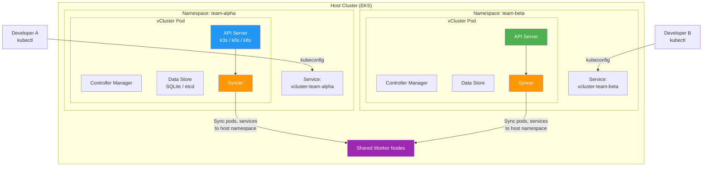
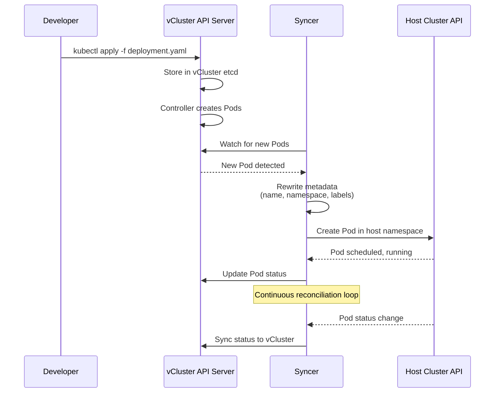
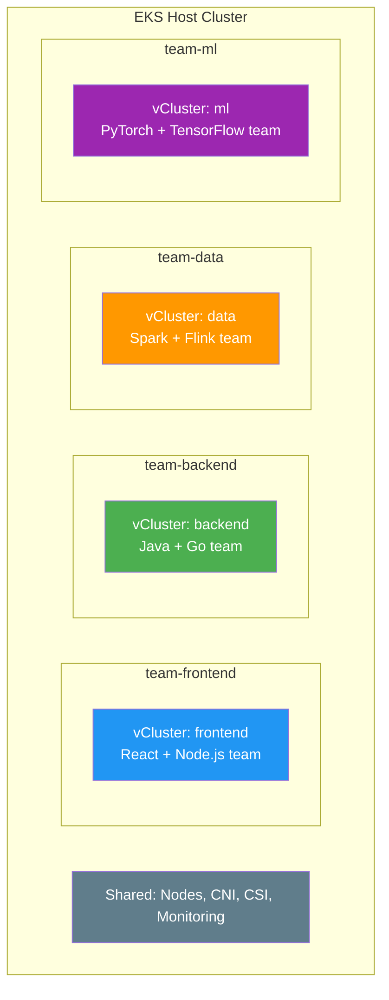
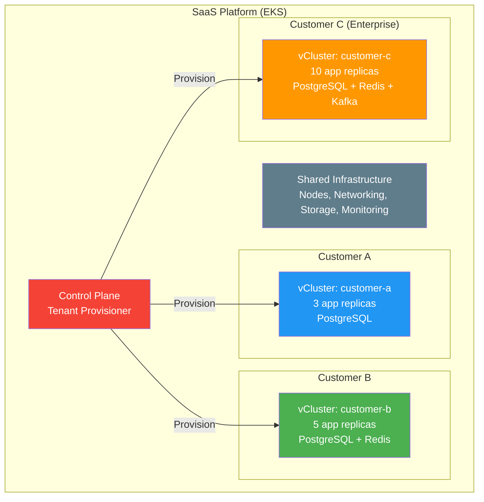
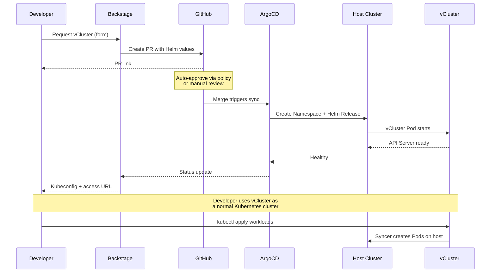

# vCluster

> **Versiones compatibles**: vCluster v0.21+, vCluster Pro v0.21+
> **Última actualización**: June 2025

## Table of Contents

- [Overview](#overview)
- [Learning Objectives](#learning-objectives)
- [vCluster Architecture](#vcluster-architecture)
- [EKS Installation and Configuration](#eks-installation-and-configuration)
- [Virtual Cluster Operations](#virtual-cluster-operations)
- [Multi-Tenancy Patterns](#multi-tenancy-patterns)
- [Security and Isolation](#security-and-isolation)
- [Backstage + vCluster Integration](#backstage--vcluster-integration)
- [Production Operations](#production-operations)
- [Best Practices](#best-practices)
- [References](#references)

---

## Overview

### What is vCluster?

vCluster es un proyecto open-source de Loft Labs que crea clusters Kubernetes virtuales completamente funcionales que se ejecutan dentro de namespaces de un cluster Kubernetes anfitrión. Cada cluster virtual tiene su propio API server dedicado, control plane y syncer, pero comparte los worker nodes y el container runtime subyacentes del cluster anfitrión. Desde la perspectiva de un usuario o workload, un cluster virtual es indistinguible de un cluster real: admite CRDs, admission webhooks, RBAC y la Kubernetes API completa, pero no requiere infraestructura adicional.

A diferencia de los enfoques tradicionales de multi-tenancy que dependen únicamente de namespaces y RBAC, vCluster proporciona aislamiento real del control plane. Cada tenant recibe un control plane Kubernetes completo donde puede actuar como cluster-admin, instalar sus propios CRDs, configurar sus propios admission controllers y gestionar recursos con scope de cluster, todo sin afectar a otros tenants ni al cluster anfitrión.

### Why Virtual Clusters?

Los enfoques tradicionales de multi-tenancy en Kubernetes implican trade-offs significativos:

- **Namespace isolation** proporciona separación básica, pero no puede aislar CRDs, recursos con scope de cluster ni admission webhooks. Los tenants comparten un único API server y deben coordinarse alrededor de recursos compartidos.
- **Separate physical clusters** proporciona aislamiento fuerte, pero multiplica el costo de infraestructura, la sobrecarga operativa y la complejidad de gestión. Aprovisionar un nuevo cluster tarda de minutos a horas.
- **Virtual clusters** se sitúan entre estos extremos: ofrecen aislamiento fuerte (cada tenant obtiene su propio API server y acceso cluster-admin completo) mientras comparten la infraestructura subyacente de cómputo, almacenamiento y red.

### Multi-Tenancy Approach Comparison

| Criteria | Namespace Isolation | vCluster | Physical Cluster |
|----------|-------------------|----------|-----------------|
| **Isolation Level** | Low (shared API server) | High (dedicated API server) | Highest (separate infrastructure) |
| **CRD Isolation** | None (shared across cluster) | Full (per-vCluster CRDs) | Full |
| **Cluster-Admin Access** | Not possible for tenants | Yes (within vCluster) | Yes |
| **Admission Webhooks** | Shared (cluster-wide) | Isolated (per-vCluster) | Isolated |
| **RBAC Complexity** | High (many role bindings) | Low (cluster-admin per tenant) | Low |
| **Provisioning Time** | Seconds (create namespace) | Seconds to minutes | Minutes to hours |
| **Infrastructure Cost** | Lowest (shared everything) | Low (shared nodes, minimal overhead) | Highest (dedicated nodes) |
| **Resource Overhead** | None | ~100-200 MiB per vCluster | Full control plane per cluster |
| **Operational Overhead** | Low | Medium | High (cluster lifecycle) |
| **Node Sharing** | Yes | Yes | No (unless multi-cluster scheduling) |
| **Network Isolation** | Requires NetworkPolicy | Requires NetworkPolicy + Syncer rules | Physical separation possible |
| **Scalability** | Limited by API server load | Hundreds per host cluster | Limited by infrastructure budget |
| **GitOps Compatibility** | Native | Native (standard kubeconfig) | Native |

### CNCF Sandbox Project

vCluster fue aceptado en CNCF Sandbox en noviembre de 2024, lo que señala el reconocimiento de la comunidad cloud-native de los clusters virtuales como un patrón legítimo para multi-tenancy y platform engineering. El proyecto tiene más de 7,000 estrellas en GitHub y se usa en producción en organizaciones que van desde startups hasta empresas Fortune 500. vCluster Pro, la oferta comercial de Loft Labs, añade características como gestión centralizada, Sleep Mode, Auto-Delete y RBAC avanzado: funcionalidades diseñadas para operaciones multi-tenant a gran escala.

---

## Learning Objectives

Después de completar este documento, podrás:

1. **Explicar** el concepto de cluster virtual y cómo vCluster logra aislamiento del control plane dentro de un único cluster anfitrión
2. **Comparar** enfoques de multi-tenancy (namespaces, vCluster, clusters físicos) y seleccionar la estrategia adecuada para tu caso de uso
3. **Instalar** vCluster en Amazon EKS usando la CLI y Helm, con configuración específica de EKS para EBS CSI, ALB Ingress e IRSA
4. **Crear y gestionar** clusters virtuales, incluidas operaciones de ciclo de vida como pausa, reanudación y eliminación
5. **Configurar** reglas de sincronización de recursos para controlar qué recursos Kubernetes fluyen entre clusters virtuales y anfitriones
6. **Diseñar** patrones de multi-tenancy para entornos de desarrollo, pipelines CI/CD, entornos de preview y plataformas SaaS multi-tenant
7. **Implementar** controles de seguridad, incluidos aislamiento con NetworkPolicy, aplicación de ResourceQuota, Pod Security Standards y RBAC
8. **Integrar** vCluster con Backstage y ArgoCD para aprovisionamiento self-service de clusters virtuales en una Internal Developer Platform
9. **Operar** vCluster en producción con monitoreo, backup, estrategias de upgrade y optimización de costos mediante Sleep Mode y Auto-Delete

---

## vCluster Architecture

### Virtual Control Plane

Cada vCluster ejecuta un control plane Kubernetes liviano dentro de un único pod (o StatefulSet) en el cluster anfitrión. El control plane virtual consta de un API server, un controller manager y un data store (etcd o una alternativa liviana). El componente Syncer conecta el cluster virtual y el cluster anfitrión sincronizando recursos seleccionados entre ellos.



### Syncer Component

El Syncer es la innovación principal detrás de vCluster. Actúa como un puente bidireccional entre el cluster virtual y el cluster anfitrión, traduciendo y sincronizando recursos Kubernetes a través del límite. Cuando un usuario crea un Pod dentro de un vCluster, el Syncer crea un Pod correspondiente en el namespace del host, pero con nombres, labels y metadata reescritos para evitar colisiones entre clusters virtuales.



**Comportamiento de sincronización de recursos:**

| Resource Type | Direction | Behavior |
|--------------|-----------|----------|
| Pods | vCluster -> Host | Created in host namespace with rewritten names |
| Services | vCluster -> Host | Synced to host; ClusterIP re-mapped |
| Endpoints | Bidirectional | Kept in sync for service discovery |
| ConfigMaps | vCluster -> Host (for mounted) | Only synced if referenced by a synced Pod |
| Secrets | vCluster -> Host (for mounted) | Only synced if referenced by a synced Pod |
| Ingresses | vCluster -> Host | Synced to host for ingress controller processing |
| PersistentVolumeClaims | vCluster -> Host | Synced to host for storage provisioning |
| PersistentVolumes | Host -> vCluster | Synced from host after PVC binding |
| StorageClasses | Host -> vCluster | Synced from host so tenants can select storage |
| IngressClasses | Host -> vCluster | Synced from host for ingress configuration |
| CSIDrivers | Host -> vCluster | Synced from host for volume support |
| CSINodes | Host -> vCluster | Synced from host for scheduling |
| Nodes | Host -> vCluster (virtual) | Fake or real node objects synced for scheduling |

### Backing Distributions

vCluster admite tres distribuciones Kubernetes como backend del control plane virtual:

| Distribution | Default | Control Plane Footprint | CRD Support | Notes |
|-------------|---------|------------------------|-------------|-------|
| **k3s** | Yes | ~100 MiB RAM, ~0.5 CPU | Full | Lightweight, fast startup. Built-in CoreDNS, Traefik disabled in vCluster mode. |
| **k0s** | No | ~150 MiB RAM, ~0.5 CPU | Full | Zero-friction Kubernetes by Mirantis. Single binary, minimal dependencies. |
| **Vanilla k8s** | No | ~500 MiB RAM, ~1 CPU | Full | Upstream Kubernetes API server + etcd. Highest fidelity, highest resource cost. Recommended when exact API compatibility is critical. |

La elección de distribución afecta la sobrecarga de recursos, pero no la funcionalidad. Las tres admiten CRDs, admission webhooks y toda la superficie de la Kubernetes API. Para la mayoría de los casos de uso de platform engineering, k3s ofrece el mejor equilibrio entre compatibilidad y eficiencia de recursos.

### Relationship with Host Cluster

El cluster virtual y el cluster anfitrión mantienen una separación clara de responsabilidades:

- **Virtual cluster owns**: recursos de API (Deployments, StatefulSets, CRDs, RBAC, admission webhooks), decisiones de scheduling de workloads (desde la perspectiva del tenant) y objetos con scope de namespace dentro del vCluster.
- **Host cluster owns**: scheduling real de Pods en nodes, networking (CNI, aplicación de NetworkPolicy), aprovisionamiento de almacenamiento (CSI drivers, StorageClasses) y asignación de recursos físicos.
- **Syncer bridges**: traduce recursos del cluster virtual en recursos del cluster anfitrión y propaga el estado de vuelta. El Syncer reescribe los nombres de recursos para incluir el nombre del vCluster, evitando colisiones. Por ejemplo, un Pod llamado `nginx` en el vCluster `team-alpha` se convierte en `nginx-x-default-x-team-alpha` en el namespace del host.

---

## EKS Installation and Configuration

### Prerequisites

Antes de instalar vCluster en EKS, asegúrate de lo siguiente:

```bash
# Verify EKS cluster access
kubectl cluster-info
kubectl get nodes

# Required: Helm v3.10+
helm version

# Required: kubectl v1.28+
kubectl version --client
```

### vCluster CLI Installation

La vCluster CLI proporciona la forma más sencilla de crear y gestionar clusters virtuales:

```bash
# macOS
brew install loft-sh/tap/vcluster

# Linux (amd64)
curl -L -o vcluster "https://github.com/loft-sh/vcluster/releases/latest/download/vcluster-linux-amd64"
chmod +x vcluster
sudo mv vcluster /usr/local/bin/

# Verify installation
vcluster --version
# vcluster version 0.21.x
```

### Helm Installation

Para flujos de trabajo GitOps y gestión programática, vCluster puede desplegarse mediante Helm:

```bash
# Add the vCluster Helm repository
helm repo add loft-sh https://charts.loft.sh
helm repo update

# Install a vCluster named "team-alpha" in namespace "team-alpha"
kubectl create namespace team-alpha

helm install team-alpha loft-sh/vcluster \
  --namespace team-alpha \
  --values vcluster-values.yaml \
  --version 0.21.0
```

### vcluster.yaml Configuration File

El archivo `vcluster.yaml` controla todos los aspectos del cluster virtual. A continuación se muestra una configuración completa y lista para producción en EKS:

```yaml
# vcluster.yaml -- Complete EKS production configuration
# Documentation: https://www.vcluster.com/docs/vcluster/configure/vcluster-yaml

# --- Control Plane Configuration ---
controlPlane:
  # Backing distribution: k3s (default), k0s, or k8s
  distro:
    k3s:
      enabled: true
      image:
        repository: rancher/k3s
        tag: v1.31.2-k3s1
      # Disable k3s built-in components not needed in vCluster
      extraArgs:
        - --disable=traefik,servicelb,metrics-server,local-storage

  # StatefulSet configuration for the vCluster control plane
  statefulSet:
    resources:
      requests:
        cpu: 200m
        memory: 256Mi
      limits:
        cpu: "1"
        memory: 1Gi
    persistence:
      # Use EBS for the vCluster data store
      size: 10Gi
      storageClass: gp3
    labels:
      app.kubernetes.io/managed-by: vcluster
      team: platform
    scheduling:
      nodeSelector:
        node.kubernetes.io/instance-type: m6i.large
      tolerations:
        - key: dedicated
          operator: Equal
          value: vcluster
          effect: NoSchedule

  # Ingress for API server access (optional -- alternative to LoadBalancer)
  ingress:
    enabled: false

  # Service configuration for API server access
  service:
    spec:
      type: ClusterIP  # Use ClusterIP with vcluster connect, or LoadBalancer for direct access

# --- Syncer Configuration ---
sync:
  # Resources synced FROM the virtual cluster TO the host cluster
  toHost:
    pods:
      enabled: true
    services:
      enabled: true
    configmaps:
      enabled: true
    secrets:
      enabled: true
    endpoints:
      enabled: true
    persistentvolumeclaims:
      enabled: true
    ingresses:
      enabled: true
    serviceaccounts:
      enabled: true
    networkpolicies:
      enabled: true

  # Resources synced FROM the host cluster TO the virtual cluster
  fromHost:
    nodes:
      enabled: true
      selector:
        labels:
          vcluster-enabled: "true"
    storageClasses:
      enabled: true
    ingressClasses:
      enabled: true
    csiDrivers:
      enabled: true
    csiNodes:
      enabled: true
    csiStorageCapacities:
      enabled: true

# --- Networking Configuration ---
networking:
  # Reuse host cluster DNS for external resolution
  replicateServices:
    fromHost:
      - from: kube-system/aws-load-balancer-webhook-service
        to: kube-system/aws-load-balancer-webhook-service
    toHost: []

  # Resolve DNS via host cluster CoreDNS
  resolveDNS:
    - hostname: "*.amazonaws.com"
      target: host
      service: ""

# --- Plugin Configuration ---
plugins: {}

# --- RBAC Configuration ---
rbac:
  # Role used by the Syncer on the host cluster
  role:
    # Extra rules needed for EKS-specific resources
    extraRules:
      - apiGroups: ["networking.k8s.io"]
        resources: ["networkpolicies"]
        verbs: ["create", "delete", "patch", "update", "get", "list", "watch"]

  # ClusterRole for host-level access
  clusterRole:
    extraRules:
      - apiGroups: ["storage.k8s.io"]
        resources: ["storageclasses", "csinodes", "csidrivers", "csistoragecapacities"]
        verbs: ["get", "list", "watch"]

# --- Export / Import CRDs ---
exportKubeconfig:
  context: vcluster-team-alpha
  server: https://localhost:8443

# --- Telemetry ---
telemetry:
  enabled: false
```

### EKS-Specific Configuration

#### EBS CSI Driver Integration

El Amazon EBS CSI driver se ejecuta en el cluster anfitrión. Los tenants de vCluster lo usan de forma transparente mediante la sincronización de StorageClass:

```yaml
# Verify EBS CSI driver is running on the host
# kubectl get pods -n kube-system -l app.kubernetes.io/name=aws-ebs-csi-driver

# vcluster.yaml -- StorageClass sync (enabled by default)
sync:
  fromHost:
    storageClasses:
      enabled: true

# Inside the vCluster, tenants can now use EBS StorageClasses:
# kubectl get sc
# NAME            PROVISIONER             RECLAIMPOLICY   VOLUMEBINDINGMODE
# gp3 (default)   ebs.csi.aws.com         Delete          WaitForFirstConsumer
```

Para hacer que una StorageClass específica esté disponible dentro del vCluster:

```yaml
# StorageClass on the host cluster
apiVersion: storage.k8s.io/v1
kind: StorageClass
metadata:
  name: gp3
  annotations:
    storageclass.kubernetes.io/is-default-class: "true"
provisioner: ebs.csi.aws.com
parameters:
  type: gp3
  encrypted: "true"
volumeBindingMode: WaitForFirstConsumer
allowVolumeExpansion: true
```

#### ALB Ingress Controller Integration

El AWS Load Balancer Controller se ejecuta en el cluster anfitrión. vCluster sincroniza recursos Ingress al host, donde son procesados por el controller:

```yaml
# vcluster.yaml -- Ingress sync configuration
sync:
  toHost:
    ingresses:
      enabled: true

# Inside the vCluster, tenants create Ingresses that reference the ALB class:
# ---
# apiVersion: networking.k8s.io/v1
# kind: Ingress
# metadata:
#   name: my-app
#   annotations:
#     alb.ingress.kubernetes.io/scheme: internet-facing
#     alb.ingress.kubernetes.io/target-type: ip
# spec:
#   ingressClassName: alb
#   rules:
#     - host: app.example.com
#       http:
#         paths:
#           - path: /
#             pathType: Prefix
#             backend:
#               service:
#                 name: my-app
#                 port:
#                   number: 80
```

#### IRSA (IAM Roles for Service Accounts) Integration

IRSA requiere coordinación entre el vCluster y el cluster anfitrión porque los Pods reales se ejecutan en el host. El Syncer debe sincronizar las anotaciones de ServiceAccount al host para que el IRSA mutating webhook pueda inyectar las credenciales IAM correctas:

```yaml
# vcluster.yaml -- ServiceAccount sync for IRSA
sync:
  toHost:
    serviceaccounts:
      enabled: true

# Step 1: Create the IAM role with the OIDC trust policy
# The trust policy must reference the HOST cluster's OIDC provider,
# and the service account namespace must be the HOST namespace (e.g., team-alpha),
# not the vCluster's internal namespace.

# Step 2: Inside the vCluster, create a ServiceAccount with the IAM role annotation
# ---
# apiVersion: v1
# kind: ServiceAccount
# metadata:
#   name: s3-reader
#   namespace: default
#   annotations:
#     eks.amazonaws.com/role-arn: arn:aws:iam::123456789012:role/vcluster-team-alpha-s3-reader
```

**Política de confianza IRSA para workloads de vCluster:**

```json
{
  "Version": "2012-10-17",
  "Statement": [
    {
      "Effect": "Allow",
      "Principal": {
        "Federated": "arn:aws:iam::123456789012:oidc-provider/oidc.eks.us-west-2.amazonaws.com/id/EXAMPLED539D4633E53DE1B71EXAMPLE"
      },
      "Action": "sts:AssumeRoleWithWebIdentity",
      "Condition": {
        "StringEquals": {
          "oidc.eks.us-west-2.amazonaws.com/id/EXAMPLED539D4633E53DE1B71EXAMPLE:sub": "system:serviceaccount:team-alpha:s3-reader-x-default-x-team-alpha"
        }
      }
    }
  ]
}
```

Observa el nombre de ServiceAccount reescrito en el claim `sub`: `s3-reader-x-default-x-team-alpha`. El Syncer reescribe el nombre de ServiceAccount para incluir el namespace del vCluster, y la política de confianza OIDC debe coincidir con este nombre reescrito.

#### Resource Limits for vCluster Control Plane

Aplica límites de recursos al control plane de vCluster para evitar que un único vCluster consuma recursos excesivos del host:

```yaml
# vcluster.yaml -- Resource limits
controlPlane:
  statefulSet:
    resources:
      requests:
        cpu: 200m
        memory: 256Mi
      limits:
        cpu: "1"
        memory: 1Gi
    persistence:
      size: 10Gi
      storageClass: gp3

# Additionally, set a ResourceQuota on the host namespace
# to limit the total resources a vCluster's workloads can consume
# ---
# apiVersion: v1
# kind: ResourceQuota
# metadata:
#   name: team-alpha-quota
#   namespace: team-alpha
# spec:
#   hard:
#     requests.cpu: "8"
#     requests.memory: 16Gi
#     limits.cpu: "16"
#     limits.memory: 32Gi
#     pods: "50"
#     persistentvolumeclaims: "10"
```

---

## Virtual Cluster Operations

### Create a Virtual Cluster

```bash
# Using the vCluster CLI (quickest method)
vcluster create team-alpha \
  --namespace team-alpha \
  --connect=false \
  --values vcluster-values.yaml

# Using Helm (GitOps-friendly)
helm install team-alpha loft-sh/vcluster \
  --namespace team-alpha \
  --create-namespace \
  --values vcluster-values.yaml

# Verify the vCluster is running
kubectl get pods -n team-alpha
# NAME                                    READY   STATUS    RESTARTS   AGE
# team-alpha-0                            1/1     Running   0          45s

kubectl get statefulset -n team-alpha
# NAME         READY   AGE
# team-alpha   1/1     50s
```

### Connect and Access the Virtual Cluster

```bash
# Connect using the CLI (sets up port forwarding + kubeconfig automatically)
vcluster connect team-alpha --namespace team-alpha

# This modifies your kubeconfig and switches context.
# You are now inside the virtual cluster:
kubectl get namespaces
# NAME              STATUS   AGE
# default           Active   2m
# kube-system       Active   2m
# kube-public       Active   2m
# kube-node-lease   Active   2m

# Verify you have cluster-admin access
kubectl auth can-i '*' '*'
# yes

# Disconnect (restore previous kubeconfig context)
vcluster disconnect
```

### Export Kubeconfig for External Access

Para pipelines CI/CD o distribución a equipos, exporta un kubeconfig independiente:

```bash
# Export kubeconfig to a file
vcluster connect team-alpha \
  --namespace team-alpha \
  --update-current=false \
  --kube-config ./team-alpha-kubeconfig.yaml

# Use the exported kubeconfig
export KUBECONFIG=./team-alpha-kubeconfig.yaml
kubectl get nodes
```

Para acceso persistente sin port forwarding, expón el API server de vCluster mediante un LoadBalancer o Ingress:

```yaml
# vcluster.yaml -- LoadBalancer service for direct access
controlPlane:
  service:
    spec:
      type: LoadBalancer
      annotations:
        service.beta.kubernetes.io/aws-load-balancer-scheme: internal
        service.beta.kubernetes.io/aws-load-balancer-type: nlb
```

### Delete a Virtual Cluster

```bash
# Using the CLI
vcluster delete team-alpha --namespace team-alpha

# Using Helm
helm uninstall team-alpha --namespace team-alpha

# Clean up the namespace (optional -- removes PVCs and any remaining resources)
kubectl delete namespace team-alpha
```

Cuando se elimina un vCluster, el Syncer limpia todos los recursos que creó en el namespace del host. Cualquier PersistentVolume aprovisionado por los workloads del vCluster queda sujeto a la reclaim policy de la StorageClass.

### Pause and Resume (vCluster Pro)

vCluster Pro admite pausar clusters virtuales para ahorrar recursos fuera del horario laboral. Un vCluster pausado escala su StatefulSet a cero réplicas, liberando CPU y memoria mientras conserva todos los datos en disco:

```bash
# Pause a vCluster (scales to 0 replicas)
vcluster pause team-alpha --namespace team-alpha

# Verify the vCluster is paused
kubectl get statefulset -n team-alpha
# NAME         READY   AGE
# team-alpha   0/1     24h

# Resume a vCluster
vcluster resume team-alpha --namespace team-alpha

# The vCluster restarts with all state intact
kubectl get statefulset -n team-alpha
# NAME         READY   AGE
# team-alpha   1/1     24h
```

### Resource Synchronization Rules

#### syncToHost -- Virtual Cluster to Host

Recursos creados dentro del vCluster que deben existir en el cluster anfitrión para la ejecución real:

```yaml
# vcluster.yaml
sync:
  toHost:
    # Core workload resources
    pods:
      enabled: true
      # Translate labels to avoid conflicts
      translatePatches:
        - path: metadata.labels.app
          expression: "'vcluster-' + value"
    services:
      enabled: true
    endpoints:
      enabled: true

    # Configuration resources (synced only if referenced by a Pod)
    configmaps:
      enabled: true
    secrets:
      enabled: true

    # Storage resources
    persistentvolumeclaims:
      enabled: true

    # Networking resources
    ingresses:
      enabled: true
    networkpolicies:
      enabled: true

    # Custom resources (sync CRDs from vCluster to host)
    customResources:
      certificates.cert-manager.io:
        enabled: true
```

#### syncFromHost -- Host to Virtual Cluster

Recursos que existen en el cluster anfitrión y deberían ser visibles dentro del vCluster:

```yaml
# vcluster.yaml
sync:
  fromHost:
    # Node information for scheduling decisions
    nodes:
      enabled: true
      selector:
        labels:
          vcluster-enabled: "true"
      # Optionally clear node status to hide host details
      clearImageStatus: true

    # Storage infrastructure
    storageClasses:
      enabled: true
    csiDrivers:
      enabled: true
    csiNodes:
      enabled: true
    csiStorageCapacities:
      enabled: true

    # Networking infrastructure
    ingressClasses:
      enabled: true

    # Custom resources from host
    customResources:
      clusterissuers.cert-manager.io:
        enabled: true
```

### Storage Synchronization

Cuando un tenant crea un PVC dentro del vCluster, el Syncer crea un PVC correspondiente en el namespace del host. El CSI driver del cluster anfitrión aprovisiona el volumen real:

```yaml
# Inside the vCluster -- tenant creates a PVC
apiVersion: v1
kind: PersistentVolumeClaim
metadata:
  name: data-volume
  namespace: default
spec:
  accessModes:
    - ReadWriteOnce
  storageClassName: gp3
  resources:
    requests:
      storage: 20Gi
---
# On the host cluster, the Syncer creates:
# PVC name: data-volume-x-default-x-team-alpha
# Namespace: team-alpha
# The EBS CSI driver provisions the volume as usual
```

### Service Exposure

Los tenants pueden exponer servicios desde dentro del vCluster mediante tres métodos:

**LoadBalancer (recomendado para servicios de producción):**

```yaml
# Inside the vCluster
apiVersion: v1
kind: Service
metadata:
  name: my-api
  namespace: default
  annotations:
    service.beta.kubernetes.io/aws-load-balancer-scheme: internet-facing
    service.beta.kubernetes.io/aws-load-balancer-type: nlb
spec:
  type: LoadBalancer
  selector:
    app: my-api
  ports:
    - port: 443
      targetPort: 8443
      protocol: TCP
# The Syncer creates this Service on the host cluster.
# The AWS Load Balancer Controller provisions an NLB.
```

**Ingress (recomendado para servicios HTTP/HTTPS):**

```yaml
# Inside the vCluster
apiVersion: networking.k8s.io/v1
kind: Ingress
metadata:
  name: my-app
  namespace: default
  annotations:
    alb.ingress.kubernetes.io/scheme: internet-facing
    alb.ingress.kubernetes.io/target-type: ip
    alb.ingress.kubernetes.io/certificate-arn: arn:aws:acm:us-west-2:123456789012:certificate/abc-123
spec:
  ingressClassName: alb
  rules:
    - host: myapp.example.com
      http:
        paths:
          - path: /
            pathType: Prefix
            backend:
              service:
                name: my-app
                port:
                  number: 80
```

**NodePort (para pruebas y desarrollo):**

```yaml
# Inside the vCluster
apiVersion: v1
kind: Service
metadata:
  name: debug-service
  namespace: default
spec:
  type: NodePort
  selector:
    app: debug
  ports:
    - port: 8080
      targetPort: 8080
      nodePort: 30080
```

---

## Multi-Tenancy Patterns

### Pattern 1: Development Environment Isolation (Per-Team vCluster)

Asigna a cada equipo de desarrollo un vCluster dedicado para su trabajo diario. Los equipos obtienen acceso cluster-admin dentro de su vCluster y pueden instalar cualquier CRD o herramienta que necesiten sin afectar a otros.



```yaml
# vcluster-team-frontend.yaml
controlPlane:
  distro:
    k3s:
      enabled: true
  statefulSet:
    resources:
      requests:
        cpu: 200m
        memory: 256Mi
      limits:
        cpu: "1"
        memory: 1Gi
    labels:
      team: frontend
      environment: development

sync:
  toHost:
    pods:
      enabled: true
    services:
      enabled: true
    ingresses:
      enabled: true
    persistentvolumeclaims:
      enabled: true
  fromHost:
    storageClasses:
      enabled: true
    ingressClasses:
      enabled: true
    nodes:
      enabled: true
```

```bash
# Create vClusters for each team
for team in frontend backend data ml; do
  kubectl create namespace "team-${team}"

  vcluster create "${team}" \
    --namespace "team-${team}" \
    --values "vcluster-team-${team}.yaml" \
    --connect=false
done

# Distribute kubeconfigs to each team
for team in frontend backend data ml; do
  vcluster connect "${team}" \
    --namespace "team-${team}" \
    --update-current=false \
    --kube-config "./kubeconfigs/${team}-kubeconfig.yaml"
done
```

### Pattern 2: CI/CD Ephemeral Environments

Crea un vCluster nuevo para cada ejecución de pipeline CI/CD. El vCluster se crea al inicio del pipeline, las pruebas se ejecutan dentro de él y se destruye cuando el pipeline finaliza. Esto garantiza un entorno limpio para cada ejecución de pruebas.

```yaml
# .github/workflows/integration-test.yaml
name: Integration Tests
on:
  push:
    branches: [main, develop]

jobs:
  test:
    runs-on: ubuntu-latest
    steps:
      - uses: actions/checkout@v4

      - name: Install vCluster CLI
        run: |
          curl -L -o vcluster "https://github.com/loft-sh/vcluster/releases/latest/download/vcluster-linux-amd64"
          chmod +x vcluster
          sudo mv vcluster /usr/local/bin/

      - name: Configure kubectl
        uses: aws-actions/configure-aws-credentials@v4
        with:
          role-to-assume: arn:aws:iam::123456789012:role/github-actions-eks
          aws-region: us-west-2
      - run: aws eks update-kubeconfig --name my-cluster --region us-west-2

      - name: Create ephemeral vCluster
        run: |
          VCLUSTER_NAME="ci-${GITHUB_RUN_ID}-${GITHUB_RUN_ATTEMPT}"
          vcluster create "${VCLUSTER_NAME}" \
            --namespace ci-environments \
            --connect=true \
            --values ci-vcluster.yaml

      - name: Run integration tests
        run: |
          kubectl apply -f ./k8s/manifests/
          kubectl wait --for=condition=available deployment/my-app --timeout=120s
          make integration-test

      - name: Cleanup vCluster
        if: always()
        run: |
          VCLUSTER_NAME="ci-${GITHUB_RUN_ID}-${GITHUB_RUN_ATTEMPT}"
          vcluster delete "${VCLUSTER_NAME}" \
            --namespace ci-environments \
            --delete-namespace=false
```

```yaml
# ci-vcluster.yaml -- Minimal configuration for CI
controlPlane:
  distro:
    k3s:
      enabled: true
  statefulSet:
    resources:
      requests:
        cpu: 100m
        memory: 128Mi
      limits:
        cpu: 500m
        memory: 512Mi
    persistence:
      size: 5Gi

sync:
  toHost:
    pods:
      enabled: true
    services:
      enabled: true
    configmaps:
      enabled: true
    secrets:
      enabled: true
  fromHost:
    storageClasses:
      enabled: true
```

### Pattern 3: Preview Environments (Per-PR vCluster)

Crea un vCluster para cada pull request, de modo que los revisores puedan acceder a una vista previa en vivo de los cambios:

```yaml
# .github/workflows/preview.yaml
name: Preview Environment
on:
  pull_request:
    types: [opened, synchronize, reopened]

jobs:
  preview:
    runs-on: ubuntu-latest
    steps:
      - uses: actions/checkout@v4

      - name: Setup tools
        run: |
          curl -L -o vcluster "https://github.com/loft-sh/vcluster/releases/latest/download/vcluster-linux-amd64"
          chmod +x vcluster && sudo mv vcluster /usr/local/bin/

      - name: Configure EKS access
        uses: aws-actions/configure-aws-credentials@v4
        with:
          role-to-assume: arn:aws:iam::123456789012:role/github-actions-eks
          aws-region: us-west-2
      - run: aws eks update-kubeconfig --name my-cluster --region us-west-2

      - name: Create or update preview vCluster
        run: |
          VCLUSTER_NAME="pr-${{ github.event.pull_request.number }}"

          # Create if it does not exist
          if ! vcluster list --namespace preview-envs | grep -q "${VCLUSTER_NAME}"; then
            vcluster create "${VCLUSTER_NAME}" \
              --namespace preview-envs \
              --values preview-vcluster.yaml \
              --connect=true
          else
            vcluster connect "${VCLUSTER_NAME}" \
              --namespace preview-envs
          fi

          # Deploy the application
          kubectl apply -f ./k8s/manifests/
          kubectl set image deployment/my-app \
            my-app=123456789012.dkr.ecr.us-west-2.amazonaws.com/my-app:pr-${{ github.event.pull_request.number }}

      - name: Post preview URL
        uses: actions/github-script@v7
        with:
          script: |
            github.rest.issues.createComment({
              issue_number: context.issue.number,
              owner: context.repo.owner,
              repo: context.repo.repo,
              body: `Preview environment ready: https://pr-${context.issue.number}.preview.example.com`
            })
```

```yaml
# Cleanup workflow when PR is closed
# .github/workflows/preview-cleanup.yaml
name: Preview Cleanup
on:
  pull_request:
    types: [closed]

jobs:
  cleanup:
    runs-on: ubuntu-latest
    steps:
      - name: Delete preview vCluster
        run: |
          VCLUSTER_NAME="pr-${{ github.event.pull_request.number }}"
          vcluster delete "${VCLUSTER_NAME}" \
            --namespace preview-envs \
            --delete-namespace=false
```

### Pattern 4: Training Environments

Aprovisiona vClusters aislados para sesiones de formación en Kubernetes. Cada participante obtiene su propio cluster con aplicaciones de ejemplo preinstaladas:

```bash
#!/bin/bash
# provision-training.sh -- Create vClusters for a training session

TRAINING_ID="k8s-workshop-$(date +%Y%m%d)"
PARTICIPANT_COUNT=25

for i in $(seq 1 ${PARTICIPANT_COUNT}); do
  VCLUSTER_NAME="${TRAINING_ID}-student-${i}"

  vcluster create "${VCLUSTER_NAME}" \
    --namespace training \
    --values training-vcluster.yaml \
    --connect=false &

  echo "Creating vCluster for student ${i}..."
done

wait
echo "All ${PARTICIPANT_COUNT} vClusters created."

# Export kubeconfigs for distribution
for i in $(seq 1 ${PARTICIPANT_COUNT}); do
  VCLUSTER_NAME="${TRAINING_ID}-student-${i}"

  vcluster connect "${VCLUSTER_NAME}" \
    --namespace training \
    --update-current=false \
    --kube-config "./kubeconfigs/student-${i}.yaml"
done
```

```yaml
# training-vcluster.yaml
controlPlane:
  distro:
    k3s:
      enabled: true
  statefulSet:
    resources:
      requests:
        cpu: 100m
        memory: 128Mi
      limits:
        cpu: 500m
        memory: 512Mi
    persistence:
      size: 2Gi

sync:
  toHost:
    pods:
      enabled: true
    services:
      enabled: true
  fromHost:
    storageClasses:
      enabled: true
    nodes:
      enabled: true
```

### Pattern 5: Multi-Tenant SaaS Platform

Para plataformas SaaS que proporcionan funcionalidad basada en Kubernetes a clientes, vCluster permite aislamiento por cliente sobre infraestructura compartida:



```yaml
# saas-customer-vcluster.yaml -- Per-customer vCluster with tiered resources
controlPlane:
  distro:
    k3s:
      enabled: true
  statefulSet:
    resources:
      requests:
        cpu: 200m
        memory: 256Mi
      limits:
        cpu: "2"
        memory: 2Gi
    persistence:
      size: 20Gi
      storageClass: gp3

sync:
  toHost:
    pods:
      enabled: true
    services:
      enabled: true
    ingresses:
      enabled: true
    persistentvolumeclaims:
      enabled: true
    networkpolicies:
      enabled: true
  fromHost:
    storageClasses:
      enabled: true
    ingressClasses:
      enabled: true
    nodes:
      enabled: true
      selector:
        labels:
          node-pool: saas-tenants
```

---

## Security and Isolation

### NetworkPolicy Isolation

Aplica NetworkPolicies en el cluster anfitrión para restringir el tráfico entre namespaces de vCluster. Dado que el Syncer crea Pods reales en el namespace del host, las NetworkPolicies a nivel de host son aplicadas por el CNI:

```yaml
# host-network-policy.yaml -- Isolate vCluster namespace traffic
apiVersion: networking.k8s.io/v1
kind: NetworkPolicy
metadata:
  name: vcluster-isolation
  namespace: team-alpha
spec:
  podSelector: {}   # Apply to all Pods in the namespace
  policyTypes:
    - Ingress
    - Egress
  ingress:
    # Allow traffic within the same namespace
    - from:
        - podSelector: {}
    # Allow traffic from the vCluster control plane
    - from:
        - podSelector:
            matchLabels:
              app: vcluster
  egress:
    # Allow traffic within the same namespace
    - to:
        - podSelector: {}
    # Allow DNS resolution
    - to:
        - namespaceSelector: {}
          podSelector:
            matchLabels:
              k8s-app: kube-dns
      ports:
        - protocol: UDP
          port: 53
        - protocol: TCP
          port: 53
    # Allow egress to AWS services (S3, RDS, etc.)
    - to:
        - ipBlock:
            cidr: 0.0.0.0/0
            except:
              - 10.0.0.0/8     # Block access to other private subnets
      ports:
        - protocol: TCP
          port: 443
---
# Deny cross-namespace traffic from other vClusters
apiVersion: networking.k8s.io/v1
kind: NetworkPolicy
metadata:
  name: deny-cross-vcluster
  namespace: team-alpha
spec:
  podSelector: {}
  policyTypes:
    - Ingress
  ingress:
    # Only allow from same namespace
    - from:
        - podSelector: {}
```

### ResourceQuota Enforcement

Aplica ResourceQuotas en el namespace del host para limitar los recursos totales que un vCluster puede consumir. Esto evita que un único tenant prive de recursos a otros:

```yaml
# host-resource-quota.yaml
apiVersion: v1
kind: ResourceQuota
metadata:
  name: vcluster-resource-quota
  namespace: team-alpha
spec:
  hard:
    # Compute limits
    requests.cpu: "8"
    requests.memory: 16Gi
    limits.cpu: "16"
    limits.memory: 32Gi

    # Object count limits
    pods: "50"
    services: "20"
    services.loadbalancers: "2"
    services.nodeports: "5"
    persistentvolumeclaims: "10"
    secrets: "50"
    configmaps: "50"

    # Storage limits
    requests.storage: 100Gi
---
# LimitRange for default resource requests/limits
apiVersion: v1
kind: LimitRange
metadata:
  name: vcluster-limit-range
  namespace: team-alpha
spec:
  limits:
    - type: Container
      default:
        cpu: 500m
        memory: 512Mi
      defaultRequest:
        cpu: 100m
        memory: 128Mi
      max:
        cpu: "4"
        memory: 8Gi
    - type: PersistentVolumeClaim
      max:
        storage: 50Gi
```

### Pod Security Standards

Aplica Pod Security Standards en el namespace del host para restringir las capacidades de seguridad de los Pods creados por tenants de vCluster. Dado que el Syncer crea Pods reales en el namespace del host, estas restricciones se aplican a nivel del host:

```yaml
# Apply Pod Security Standards to the host namespace
apiVersion: v1
kind: Namespace
metadata:
  name: team-alpha
  labels:
    pod-security.kubernetes.io/enforce: restricted
    pod-security.kubernetes.io/enforce-version: latest
    pod-security.kubernetes.io/audit: restricted
    pod-security.kubernetes.io/audit-version: latest
    pod-security.kubernetes.io/warn: restricted
    pod-security.kubernetes.io/warn-version: latest
```

Para un control más granular, usa un policy engine como Kyverno en el cluster anfitrión:

```yaml
# kyverno-policy-vcluster.yaml
apiVersion: kyverno.io/v1
kind: ClusterPolicy
metadata:
  name: vcluster-pod-restrictions
spec:
  validationFailureAction: Enforce
  background: true
  rules:
    - name: restrict-host-namespaces
      match:
        any:
          - resources:
              kinds:
                - Pod
              namespaces:
                - "team-*"
      validate:
        message: "Pods in vCluster namespaces must not use host namespaces."
        pattern:
          spec:
            =(hostNetwork): false
            =(hostPID): false
            =(hostIPC): false

    - name: restrict-privileged
      match:
        any:
          - resources:
              kinds:
                - Pod
              namespaces:
                - "team-*"
      validate:
        message: "Privileged containers are not allowed in vCluster namespaces."
        pattern:
          spec:
            containers:
              - =(securityContext):
                  =(privileged): false
            =(initContainers):
              - =(securityContext):
                  =(privileged): false

    - name: restrict-image-registries
      match:
        any:
          - resources:
              kinds:
                - Pod
              namespaces:
                - "team-*"
      validate:
        message: "Images must come from approved registries."
        pattern:
          spec:
            containers:
              - image: "123456789012.dkr.ecr.*.amazonaws.com/* | docker.io/library/*"
            =(initContainers):
              - image: "123456789012.dkr.ecr.*.amazonaws.com/* | docker.io/library/*"
```

### Admission Webhook Synchronization

De forma predeterminada, los admission webhooks configurados dentro de un vCluster se aplican solo a los recursos dentro de ese vCluster. Sin embargo, los admission webhooks del cluster anfitrión se aplican a todos los Pods en todos los namespaces, incluidos los creados por el Syncer. Esto crea un modelo de seguridad por capas:

1. **Host cluster webhooks** (por ejemplo, Kyverno, OPA Gatekeeper, Pod Security Admission) aplican seguridad base para todos los vClusters
2. **vCluster-local webhooks** aplican políticas adicionales específicas de ese tenant

```yaml
# Inside a vCluster, a tenant can install their own admission webhooks:
# For example, installing Kyverno inside the vCluster:
# helm install kyverno kyverno/kyverno --namespace kyverno --create-namespace

# The tenant's Kyverno policies affect resources INSIDE the vCluster.
# The host cluster's Kyverno policies affect the ACTUAL Pods on the host.
```

### RBAC Configuration

**Host cluster RBAC**: restringe quién puede gestionar vClusters:

```yaml
# ClusterRole for vCluster administrators
apiVersion: rbac.authorization.k8s.io/v1
kind: ClusterRole
metadata:
  name: vcluster-admin
rules:
  - apiGroups: [""]
    resources: ["namespaces"]
    verbs: ["create", "get", "list", "watch"]
  - apiGroups: ["apps"]
    resources: ["statefulsets"]
    verbs: ["*"]
  - apiGroups: [""]
    resources: ["services", "configmaps", "secrets", "serviceaccounts"]
    verbs: ["*"]
  - apiGroups: ["rbac.authorization.k8s.io"]
    resources: ["roles", "rolebindings"]
    verbs: ["*"]
---
# Bind to the platform engineering team
apiVersion: rbac.authorization.k8s.io/v1
kind: ClusterRoleBinding
metadata:
  name: vcluster-admin-binding
subjects:
  - kind: Group
    name: platform-engineering
    apiGroup: rbac.authorization.k8s.io
roleRef:
  kind: ClusterRole
  name: vcluster-admin
  apiGroup: rbac.authorization.k8s.io
```

**Inside the vCluster**: los tenants tienen acceso cluster-admin completo por defecto. Para limitar el acceso dentro de un vCluster (por ejemplo, para subequipos):

```yaml
# Inside the vCluster -- restrict a sub-team to specific namespaces
apiVersion: rbac.authorization.k8s.io/v1
kind: Role
metadata:
  name: developer
  namespace: app-staging
rules:
  - apiGroups: ["", "apps", "batch"]
    resources: ["*"]
    verbs: ["*"]
  - apiGroups: ["networking.k8s.io"]
    resources: ["ingresses"]
    verbs: ["get", "list", "watch", "create", "update", "patch"]
---
apiVersion: rbac.authorization.k8s.io/v1
kind: RoleBinding
metadata:
  name: developer-binding
  namespace: app-staging
subjects:
  - kind: Group
    name: sub-team-alpha
    apiGroup: rbac.authorization.k8s.io
roleRef:
  kind: Role
  name: developer
  apiGroup: rbac.authorization.k8s.io
```

### Host Cluster Access Restriction

De forma predeterminada, el Syncer opera con permisos limitados en el cluster anfitrión. Restríngelo aún más limitando lo que el Syncer puede hacer:

```yaml
# vcluster.yaml -- Restrict Syncer permissions
rbac:
  role:
    # Only allow the Syncer to manage specific resource types
    extraRules: []
    # The default rules cover pods, services, configmaps, secrets, etc.

  clusterRole:
    # Disable cluster-level access if not needed
    extraRules: []

# Restrict which namespaces the vCluster's Pods can reference
sync:
  toHost:
    pods:
      enabled: true
      # Enforce that pods cannot mount host paths
      patches:
        - path: spec.volumes[*].hostPath
          op: remove
```

---

## Backstage + vCluster Integration

### Provisioning vCluster from Backstage Templates

Integra el aprovisionamiento de vCluster en tu [Backstage](./06-backstage-idp.md) Internal Developer Platform para que los desarrolladores puedan crear clusters virtuales self-service mediante un formulario:

```yaml
# backstage-template-vcluster.yaml
apiVersion: scaffolder.backstage.io/v1beta3
kind: Template
metadata:
  name: provision-vcluster
  title: Provision Virtual Kubernetes Cluster
  description: Self-service virtual cluster for development and testing
  tags:
    - vcluster
    - kubernetes
    - multi-tenancy
spec:
  owner: platform-team
  type: environment

  parameters:
    - title: Virtual Cluster Configuration
      required:
        - name
        - team
        - purpose
      properties:
        name:
          title: Cluster Name
          type: string
          pattern: '^[a-z][a-z0-9-]{2,28}[a-z0-9]$'
          description: Lowercase alphanumeric with hyphens, 4-30 characters
        team:
          title: Team
          type: string
          enum:
            - frontend
            - backend
            - data
            - ml
            - qa
        purpose:
          title: Purpose
          type: string
          enum:
            - development
            - testing
            - preview
            - training
          default: development
        size:
          title: Cluster Size
          type: string
          enum:
            - small
            - medium
            - large
          default: small
          description: |
            small: 4 CPU / 8Gi, 20 pods
            medium: 8 CPU / 16Gi, 50 pods
            large: 16 CPU / 32Gi, 100 pods
        ttlHours:
          title: Time-to-Live (hours)
          type: integer
          default: 72
          minimum: 1
          maximum: 720
          description: Auto-delete after this many hours (max 30 days)

    - title: Repository
      required:
        - repoUrl
      properties:
        repoUrl:
          title: Infrastructure Repository
          type: string
          ui:field: RepoUrlPicker
          ui:options:
            allowedHosts:
              - github.com

  steps:
    - id: generate
      name: Generate vCluster manifests
      action: fetch:template
      input:
        url: ./skeleton
        targetPath: ./vcluster
        values:
          name: ${{ parameters.name }}
          team: ${{ parameters.team }}
          purpose: ${{ parameters.purpose }}
          size: ${{ parameters.size }}
          ttlHours: ${{ parameters.ttlHours }}
          namespace: "vc-${{ parameters.team }}-${{ parameters.name }}"

    - id: publish
      name: Create Pull Request
      action: publish:github:pull-request
      input:
        repoUrl: ${{ parameters.repoUrl }}
        branchName: "vcluster/${{ parameters.team }}/${{ parameters.name }}"
        title: "Provision vCluster: ${{ parameters.name }} for ${{ parameters.team }}"
        description: |
          ## Virtual Cluster Provisioning Request

          | Parameter | Value |
          |-----------|-------|
          | Name | ${{ parameters.name }} |
          | Team | ${{ parameters.team }} |
          | Purpose | ${{ parameters.purpose }} |
          | Size | ${{ parameters.size }} |
          | TTL | ${{ parameters.ttlHours }} hours |

          Created by the Backstage self-service portal.
          Merging will trigger ArgoCD to provision the vCluster.

  output:
    links:
      - title: Pull Request
        url: ${{ steps.publish.output.remoteUrl }}
```

Esqueleto de plantilla:

```yaml
# skeleton/vcluster.yaml
apiVersion: v1
kind: Namespace
metadata:
  name: ${{ values.namespace }}
  labels:
    managed-by: backstage
    team: ${{ values.team }}
    purpose: ${{ values.purpose }}
    vcluster.loft.sh/auto-delete: "${{ values.ttlHours }}h"
---
# skeleton/helm-release.yaml (for ArgoCD or FluxCD)
apiVersion: argoproj.io/v1alpha1
kind: Application
metadata:
  name: vcluster-${{ values.name }}
  namespace: argocd
  labels:
    team: ${{ values.team }}
    purpose: ${{ values.purpose }}
  annotations:
    argocd.argoproj.io/sync-wave: "1"
spec:
  project: vcluster-tenants
  source:
    repoURL: https://charts.loft.sh
    chart: vcluster
    targetRevision: 0.21.0
    helm:
      valuesObject:
        controlPlane:
          distro:
            k3s:
              enabled: true
          statefulSet:
            resources:
              requests:
                cpu: |-
                  200m400m800m
                memory: |-
                  256Mi512Mi1Gi
        sync:
          toHost:
            pods:
              enabled: true
            services:
              enabled: true
            ingresses:
              enabled: true
          fromHost:
            storageClasses:
              enabled: true
            ingressClasses:
              enabled: true
  destination:
    server: https://kubernetes.default.svc
    namespace: ${{ values.namespace }}
  syncPolicy:
    automated:
      selfHeal: true
    syncOptions:
      - CreateNamespace=true
```

### GitOps Workflow: ArgoCD + vCluster

Gestiona el ciclo de vida de vCluster completamente mediante GitOps. ArgoCD observa un repositorio con Helm releases de vCluster y las aplica al cluster anfitrión:

```yaml
# argocd-appset-vclusters.yaml
apiVersion: argoproj.io/v1alpha1
kind: ApplicationSet
metadata:
  name: vclusters
  namespace: argocd
spec:
  goTemplate: true
  generators:
    - git:
        repoURL: https://github.com/your-org/platform-config
        revision: main
        directories:
          - path: vclusters/*/

  template:
    metadata:
      name: "vcluster-{{ .path.basename }}"
      namespace: argocd
    spec:
      project: vcluster-tenants
      source:
        repoURL: https://github.com/your-org/platform-config
        targetRevision: main
        path: "{{ .path.path }}"
      destination:
        server: https://kubernetes.default.svc
      syncPolicy:
        automated:
          selfHeal: true
          prune: true
        syncOptions:
          - CreateNamespace=true
```

Este ApplicationSet crea automáticamente una Application de ArgoCD para cada directorio bajo `vclusters/` en el repositorio de configuración. Para aprovisionar un nuevo vCluster, añade un directorio con valores de Helm; para retirar uno, elimina el directorio.

### Self-Service Dev Environments in IDP

El flujo de trabajo completo para desarrolladores con clusters virtuales self-service:



---

## Production Operations

### Monitoring and Alerting

Monitorea la salud de vCluster desde el cluster anfitrión usando métricas de Prometheus:

```yaml
# prometheus-vcluster-rules.yaml
apiVersion: monitoring.coreos.com/v1
kind: PrometheusRule
metadata:
  name: vcluster-alerts
  namespace: monitoring
spec:
  groups:
    - name: vcluster.health
      rules:
        - alert: VClusterDown
          expr: |
            kube_statefulset_status_replicas_ready{
              statefulset=~".*",
              namespace=~"team-.*|vc-.*"
            } == 0
          for: 5m
          labels:
            severity: critical
          annotations:
            summary: "vCluster {{ $labels.statefulset }} in {{ $labels.namespace }} is down"
            description: "The vCluster StatefulSet has 0 ready replicas for 5 minutes."

        - alert: VClusterHighMemory
          expr: |
            container_memory_working_set_bytes{
              pod=~".*-0",
              namespace=~"team-.*|vc-.*",
              container="syncer"
            } / container_spec_memory_limit_bytes{
              pod=~".*-0",
              namespace=~"team-.*|vc-.*",
              container="syncer"
            } > 0.85
          for: 10m
          labels:
            severity: warning
          annotations:
            summary: "vCluster {{ $labels.pod }} memory usage above 85%"
            description: "Consider increasing memory limits or reducing workload."

        - alert: VClusterPVCNearFull
          expr: |
            kubelet_volume_stats_used_bytes{
              namespace=~"team-.*|vc-.*",
              persistentvolumeclaim=~"data-.*"
            } / kubelet_volume_stats_capacity_bytes{
              namespace=~"team-.*|vc-.*",
              persistentvolumeclaim=~"data-.*"
            } > 0.80
          for: 15m
          labels:
            severity: warning
          annotations:
            summary: "vCluster PVC {{ $labels.persistentvolumeclaim }} is 80% full"

        - alert: VClusterSyncErrors
          expr: |
            rate(
              vcluster_syncer_reconcile_errors_total[5m]
            ) > 0.1
          for: 10m
          labels:
            severity: warning
          annotations:
            summary: "vCluster Syncer reconciliation errors detected"
```

**Consultas de dashboard de Grafana para monitoreo de vCluster:**

```
# Total vClusters running
count(kube_statefulset_status_replicas_ready{namespace=~"team-.*|vc-.*"} > 0)

# CPU usage per vCluster
sum by (namespace) (rate(container_cpu_usage_seconds_total{namespace=~"team-.*|vc-.*"}[5m]))

# Memory usage per vCluster
sum by (namespace) (container_memory_working_set_bytes{namespace=~"team-.*|vc-.*"})

# Pods per vCluster namespace
count by (namespace) (kube_pod_info{namespace=~"team-.*|vc-.*"})
```

### Backup and Recovery

Haz backup del estado de vCluster respaldando el PersistentVolume usado por el StatefulSet de vCluster. El PV contiene los datos etcd del vCluster (o la base de datos SQLite para k3s):

```yaml
# Velero backup for vCluster data
# Install Velero on the host cluster first
# (see observability and ops documentation for Velero setup)

# Schedule regular backups of vCluster namespaces
apiVersion: velero.io/v1
kind: Schedule
metadata:
  name: vcluster-backup
  namespace: velero
spec:
  schedule: "0 2 * * *"   # Daily at 2 AM
  template:
    includedNamespaces:
      - "team-*"
      - "vc-*"
    includedResources:
      - persistentvolumeclaims
      - persistentvolumes
      - statefulsets
      - services
      - configmaps
      - secrets
    storageLocation: aws-s3
    volumeSnapshotLocations:
      - aws-ebs
    ttl: 168h   # Retain for 7 days
```

**Procedimiento de recuperación:**

```bash
# List available backups
velero backup get

# Restore a specific vCluster
velero restore create \
  --from-backup vcluster-backup-20250620020000 \
  --include-namespaces team-alpha \
  --restore-volumes=true

# Verify the vCluster restarts with its state intact
kubectl get statefulset -n team-alpha
kubectl get pvc -n team-alpha
```

### Upgrade Strategy

#### Upgrading the vCluster CLI

```bash
# Check current version
vcluster --version

# Upgrade via package manager
brew upgrade loft-sh/tap/vcluster

# Or download the latest release
curl -L -o vcluster "https://github.com/loft-sh/vcluster/releases/latest/download/vcluster-linux-amd64"
chmod +x vcluster && sudo mv vcluster /usr/local/bin/
```

#### Upgrading vCluster Instances

Actualiza vClusters individuales actualizando la Helm release:

```bash
# Check current chart version
helm list -n team-alpha
# NAME         NAMESPACE    REVISION  STATUS    CHART            APP VERSION
# team-alpha   team-alpha   1         deployed  vcluster-0.21.0  0.21.0

# Review release notes for breaking changes
# https://github.com/loft-sh/vcluster/releases

# Upgrade to a new version
helm upgrade team-alpha loft-sh/vcluster \
  --namespace team-alpha \
  --version 0.22.0 \
  --values vcluster-values.yaml \
  --wait

# Verify the upgrade
kubectl get statefulset -n team-alpha -w
# Wait for the new Pod to become Ready

# Test connectivity
vcluster connect team-alpha --namespace team-alpha
kubectl get nodes
kubectl get namespaces
```

**Mejores prácticas de upgrade:**

1. **Lee las release notes** antes de cada upgrade para identificar breaking changes o nuevas opciones de configuración
2. **Actualiza primero vClusters que no sean de producción** y ejecuta smoke tests antes de actualizar instancias de producción
3. **Haz backup del PVC** antes de actualizar por si se necesita un rollback
4. **Actualiza un vCluster a la vez** en lugar de actualizar todas las instancias en lote simultáneamente
5. **Fija versiones de Helm chart** en manifiestos GitOps; nunca uses `latest`

#### Rolling Upgrade Across All vClusters

```bash
#!/bin/bash
# upgrade-all-vclusters.sh
TARGET_VERSION="0.22.0"

# Get all vCluster Helm releases
VCLUSTERS=$(helm list --all-namespaces -f 'vcluster' -q)

for vc in ${VCLUSTERS}; do
  NS=$(helm list --all-namespaces -f "^${vc}$" -o json | jq -r '.[0].namespace')

  echo "Upgrading ${vc} in ${NS} to ${TARGET_VERSION}..."

  helm upgrade "${vc}" loft-sh/vcluster \
    --namespace "${NS}" \
    --version "${TARGET_VERSION}" \
    --reuse-values \
    --wait \
    --timeout 5m

  # Verify health before continuing
  kubectl rollout status statefulset/"${vc}" -n "${NS}" --timeout=120s

  echo "Successfully upgraded ${vc}."
done
```

### Cost Management

#### Sleep Mode (vCluster Pro)

Pausa automáticamente vClusters fuera del horario laboral para ahorrar costos de cómputo:

```yaml
# vcluster-pro-sleep.yaml
# Requires vCluster Pro license
apiVersion: management.loft.sh/v1
kind: VirtualCluster
metadata:
  name: team-alpha
  namespace: team-alpha
spec:
  sleepMode:
    # Auto-sleep after 30 minutes of inactivity
    afterInactivity: 1800
    # Schedule-based sleep: pause at 8 PM, wake at 8 AM (UTC)
    sleepSchedule: "0 20 * * 1-5"     # Sleep at 8 PM weekdays
    wakeSchedule: "0 8 * * 1-5"       # Wake at 8 AM weekdays
    # Auto-wake on API request
    autoWakeup: true
```

**Cálculo de ahorro de costos:**

| Metric | Without Sleep Mode | With Sleep Mode | Savings |
|--------|-------------------|-----------------|---------|
| Active hours/week | 168 | 50 (10h x 5 days) | 70% |
| vCluster CPU (per vCluster) | 0.2 CPU x 168h | 0.2 CPU x 50h | 70% |
| Workload CPU (per vCluster, ~2 CPU avg) | 2 CPU x 168h | 2 CPU x 50h | 70% |
| Cost per vCluster/month (m5.large @ $0.096/hr) | ~$30 | ~$9 | ~$21 saved |
| 50 vClusters/month | ~$1,500 | ~$450 | ~$1,050 saved |

#### Auto-Delete (vCluster Pro)

Elimina automáticamente vClusters que exceden su TTL para evitar proliferación de recursos:

```yaml
# vcluster-pro-auto-delete.yaml
apiVersion: management.loft.sh/v1
kind: VirtualCluster
metadata:
  name: ci-run-12345
  namespace: ci-environments
spec:
  autoDelete:
    # Delete after 4 hours of inactivity
    afterInactivity: 14400
```

Para vCluster open-source, implementa TTL con un CronJob:

```yaml
# vcluster-ttl-cleaner.yaml
apiVersion: batch/v1
kind: CronJob
metadata:
  name: vcluster-ttl-cleaner
  namespace: platform-system
spec:
  schedule: "*/30 * * * *"   # Run every 30 minutes
  jobTemplate:
    spec:
      template:
        spec:
          serviceAccountName: vcluster-cleaner
          containers:
            - name: cleaner
              image: bitnami/kubectl:1.31
              command:
                - /bin/bash
                - -c
                - |
                  # Find vCluster namespaces past their TTL
                  for ns in $(kubectl get ns -l managed-by=backstage -o name); do
                    CREATED=$(kubectl get ${ns} -o jsonpath='{.metadata.creationTimestamp}')
                    TTL=$(kubectl get ${ns} -o jsonpath='{.metadata.labels.vcluster\.loft\.sh/auto-delete}' 2>/dev/null)

                    if [ -z "${TTL}" ]; then
                      continue
                    fi

                    TTL_SECONDS=$(echo "${TTL}" | sed 's/h//' | awk '{print $1 * 3600}')
                    CREATED_EPOCH=$(date -d "${CREATED}" +%s)
                    NOW_EPOCH=$(date +%s)
                    AGE=$((NOW_EPOCH - CREATED_EPOCH))

                    if [ ${AGE} -gt ${TTL_SECONDS} ]; then
                      echo "Deleting expired vCluster namespace: ${ns}"
                      kubectl delete ${ns}
                    fi
                  done
          restartPolicy: OnFailure
```

### Large-Scale Operation Considerations

Al ejecutar decenas o cientos de vClusters en un único cluster anfitrión:

| Concern | Recommendation |
|---------|---------------|
| **API server load** | Each vCluster Syncer makes API calls to the host. Use `--max-reconcile-rate` to throttle. Consider dedicated API server nodes. |
| **etcd performance** | Host cluster etcd stores metadata for all synced resources. Monitor etcd latency and consider larger instance types for the control plane. |
| **Node capacity** | Each vCluster control plane consumes ~200 MiB. 100 vClusters need ~20 GiB just for control planes. Use dedicated node pools. |
| **IP address exhaustion** | Each synced Pod gets a host cluster IP. Plan VPC CIDR ranges for the expected Pod count across all vClusters. |
| **DNS load** | vClusters generate DNS queries to host CoreDNS. Scale CoreDNS replicas and enable NodeLocal DNSCache. |
| **Storage IOPS** | Each vCluster PVC needs sustained IOPS for its data store. Use gp3 volumes with provisioned IOPS for host-intensive workloads. |
| **Monitoring cardinality** | Hundreds of vClusters multiply Prometheus metric cardinality. Use recording rules and aggregation to manage costs. |

```yaml
# Dedicated node pool for vCluster control planes
apiVersion: karpenter.sh/v1
kind: NodePool
metadata:
  name: vcluster-control-planes
spec:
  template:
    metadata:
      labels:
        node-pool: vcluster
    spec:
      nodeClassRef:
        group: karpenter.k8s.aws
        kind: EC2NodeClass
        name: default
      requirements:
        - key: node.kubernetes.io/instance-type
          operator: In
          values: ["m6i.large", "m6i.xlarge"]
        - key: karpenter.sh/capacity-type
          operator: In
          values: ["on-demand"]
      taints:
        - key: dedicated
          value: vcluster
          effect: NoSchedule
  limits:
    cpu: "64"
    memory: 128Gi
```

---

## Best Practices

### Resource Governance

1. **Siempre configura ResourceQuotas en namespaces del host**: cada namespace de vCluster debería tener una ResourceQuota que coincida con la asignación de recursos del equipo. Sin quotas, los workloads de un único vCluster pueden consumir recursos ilimitados del host.

2. **Usa LimitRanges para valores predeterminados**: configura requests y limits de recursos predeterminados mediante LimitRange para que los Pods sin definiciones explícitas de recursos sigan recibiendo asignaciones acotadas.

3. **Separa los node pools de control plane y workload**: ejecuta StatefulSets de vCluster en nodes dedicados para evitar que la inestabilidad del control plane afecte a los workloads, y viceversa.

4. **Monitorea la capacidad del cluster anfitrión**: realiza seguimiento del consumo agregado de recursos en todos los vClusters. Alerta cuando los recursos comprometidos totales se acerquen a la capacidad del host.

### Naming Conventions

Establece una nomenclatura consistente para que los recursos de vCluster sean identificables a escala:

| Resource | Convention | Example |
|----------|-----------|---------|
| Namespace | `vc-<team>-<name>` or `team-<name>` | `vc-frontend-dev`, `team-alpha` |
| vCluster name | `<team>-<purpose>` or `<purpose>-<id>` | `frontend-dev`, `ci-12345` |
| Helm release | Same as vCluster name | `frontend-dev` |
| Kubeconfig context | `vcluster-<team>-<name>` | `vcluster-frontend-dev` |
| Labels | `team`, `purpose`, `environment` | `team: frontend`, `purpose: development` |
| Host NetworkPolicy | `vcluster-isolation-<namespace>` | `vcluster-isolation-team-alpha` |

### Lifecycle Management

1. **Implementa TTL para vClusters efímeros**: los vClusters de CI/CD y preview deberían tener un TTL máximo. Usa Auto-Delete (Pro) o el enfoque con CronJob descrito arriba.

2. **Usa Sleep Mode para vClusters de desarrollo**: los entornos de desarrollo normalmente están activos solo durante horas laborales. Sleep Mode reduce los costos entre un 60 y un 70%.

3. **Audita vClusters sin uso**: ejecuta una auditoría semanal para identificar vClusters con cero workload Pods. Notifica al equipo propietario y elimínalos automáticamente después de un período de gracia.

4. **Estandariza las configuraciones de vCluster**: mantén una biblioteca de perfiles `vcluster.yaml` validados (small, medium, large) en lugar de permitir configuraciones arbitrarias. Expón estos perfiles mediante templates de Backstage.

5. **Fija versiones de todos los componentes**: fija la versión del Helm chart de vCluster, la versión de la distribución de backend (tag de k3s) y la versión de la vCluster CLI. Documenta la matriz de combinaciones probadas.

### Cost Optimization

1. **Dimensiona correctamente los recursos del control plane**: monitorea el uso real de CPU y memoria de los Pods de vCluster y ajusta los resource requests para que coincidan. El sobreaprovisionamiento del control plane es una fuente común de desperdicio.

2. **Usa instancias Spot para workload nodes**: los workloads de vCluster (especialmente para desarrollo y CI/CD) toleran interrupciones. Usa Karpenter con aprovisionamiento de instancias Spot para los workload node pools.

3. **Consolida vClusters inactivos**: si varios equipos tienen vClusters de baja utilización, considera compartir menos vClusters de mayor tamaño en lugar de mantener muchos inactivos.

4. **Etiqueta todos los recursos para asignación de costos**: usa la reescritura de labels del Syncer para asegurar que todos los recursos a nivel del host lleven etiquetas de asignación de costos. Esto permite atribución de costos por equipo y por vCluster en AWS Cost Explorer.

5. **Configura límites de almacenamiento**: limita los tamaños de PVC mediante LimitRange y el almacenamiento total mediante ResourceQuota. Las solicitudes de almacenamiento ilimitadas son una fuente común de costos inesperados.

---

## References

### Official Documentation

- [vCluster Official Documentation](https://www.vcluster.com/docs)
- [vCluster GitHub Repository](https://github.com/loft-sh/vcluster)
- [vCluster Configuration Reference (vcluster.yaml)](https://www.vcluster.com/docs/vcluster/configure/vcluster-yaml)
- [vCluster Pro Documentation](https://www.vcluster.com/docs/vcluster-pro)
- [vCluster Helm Chart](https://artifacthub.io/packages/helm/loft/vcluster)

### CNCF and Community

- [CNCF vCluster Sandbox Page](https://www.cncf.io/projects/vcluster/)
- [Loft Labs Blog](https://loft.sh/blog)
- [vCluster Slack Community](https://slack.loft.sh/)
- [Virtual Clusters: Scalable Multi-Tenancy (KubeCon talk)](https://www.youtube.com/results?search_query=vcluster+kubecon)

### AWS and EKS Integration

- [EKS IRSA Documentation](https://docs.aws.amazon.com/eks/latest/userguide/iam-roles-for-service-accounts.html)
- [AWS Load Balancer Controller](https://kubernetes-sigs.github.io/aws-load-balancer-controller/)
- [Amazon EBS CSI Driver](https://docs.aws.amazon.com/eks/latest/userguide/ebs-csi.html)
- [EKS Best Practices Guide - Multi-Tenancy](https://aws.github.io/aws-eks-best-practices/security/docs/multitenancy/)

### Related Documentation in This Repository

- [Crossplane](./07-crossplane.md) -- aprovisionamiento de infraestructura mediante Kubernetes API; puede combinarse con vCluster para infraestructura por tenant
- [Backstage IDP](./06-backstage-idp.md) -- framework de Internal Developer Platform; se integra con vCluster para aprovisionamiento self-service de clusters virtuales
- [Platform Engineering Overview](./00-platform-engineering-overview.md) -- conceptos de IDP y arquitectura de referencia
- [Network Policies](../security/04-network-policies.md) -- aislamiento de red a nivel de host para namespaces de vCluster
- [Pod Security Standards](../security/03-pod-security-standards.md) -- aplicación de security baselines en workloads de vCluster
- [Kyverno Policy Management](../security/01-kyverno-policy-management.md) -- aplicación de políticas para namespaces de vCluster
- [ArgoCD](../gitops/argocd/README.md) -- despliegue GitOps para gestión del ciclo de vida de vCluster
- [Karpenter](../autoscaling/02-karpenter.md) -- autoscaling de nodes para workload node pools de vCluster

---

[Previous: Crossplane](./07-crossplane.md) | Next: None
