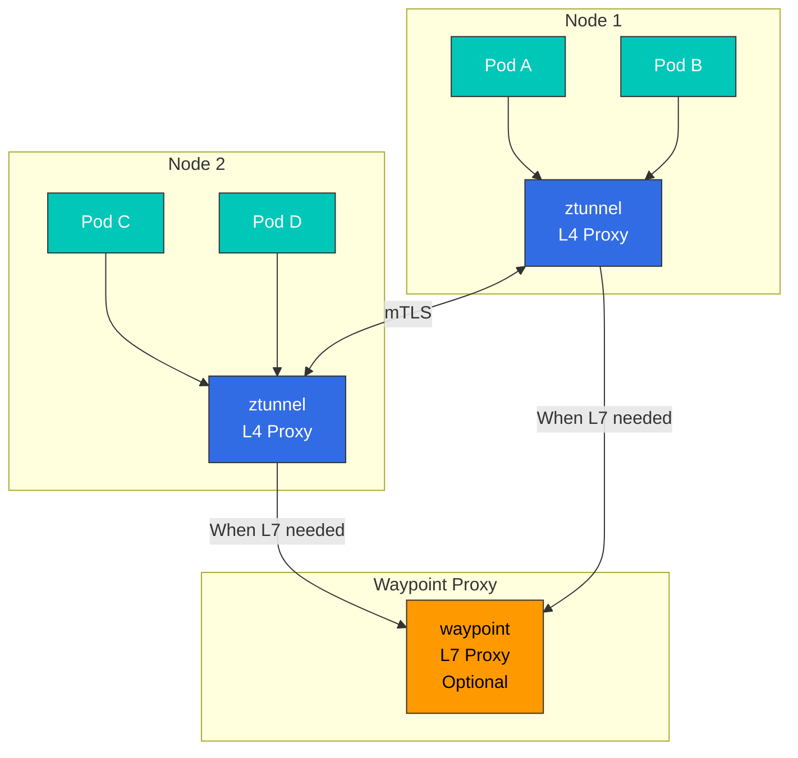
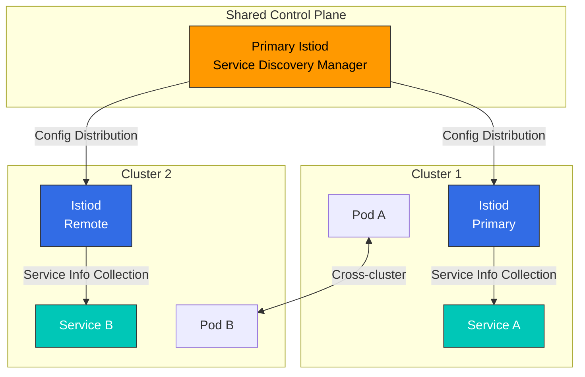
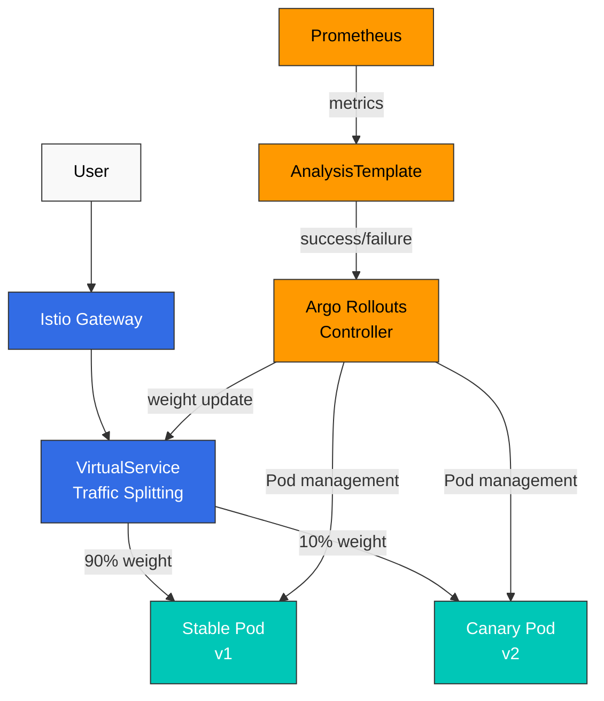
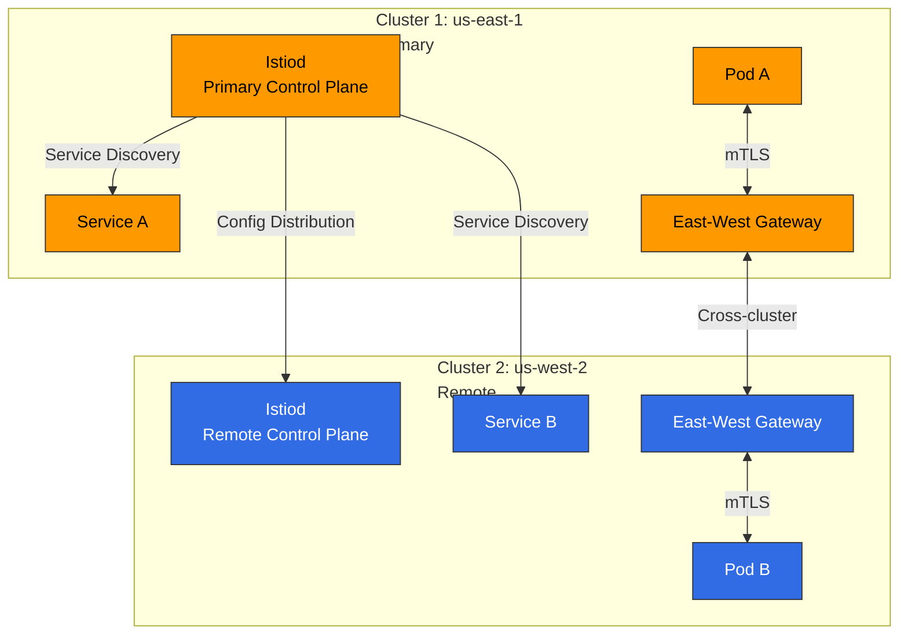
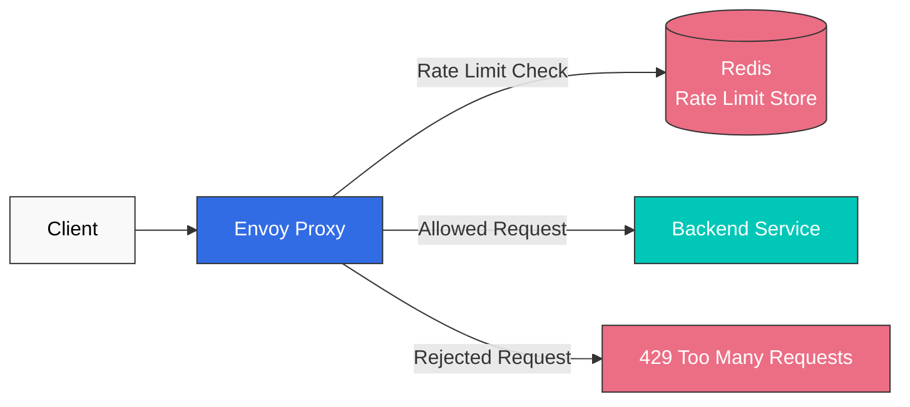
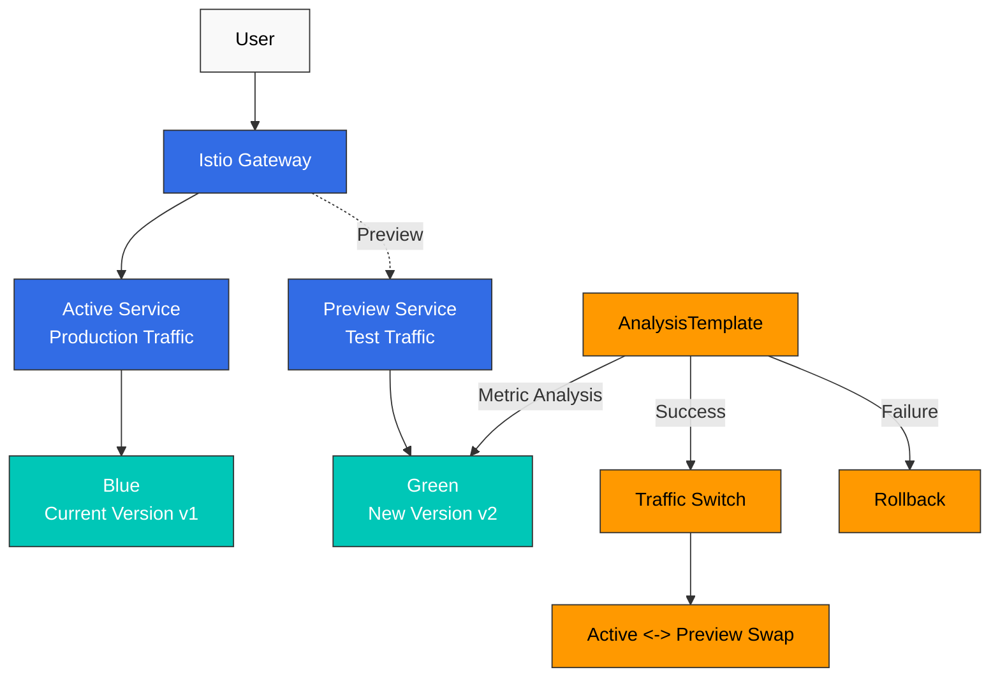

# Cuestionario de temas avanzados de Istio

> **Versión compatible**: Istio 1.28.0
> **Versión de EKS**: 1.34 (Kubernetes 1.28+)
> **Última actualización**: February 19, 2026

Este cuestionario evalúa tu comprensión de las funciones avanzadas de Istio.

## Preguntas de opción múltiple (1-5)

### Pregunta 1: Modo Ambient frente a modo Sidecar

¿Cuál es la **mayor ventaja** del modo Ambient de Istio?

A. Proporciona más funciones
B. Uso de recursos significativamente menor
C. Mayor velocidad de instalación
D. Mejor seguridad

<details>
<summary>Mostrar respuesta</summary>

**Respuesta: B**

La mayor ventaja del modo Ambient es que el **uso de recursos se reduce en más del 98%**.

**Explicación:**

**Comparación entre el modo Sidecar y el modo Ambient:**

| Elemento | Modo Sidecar | Modo Ambient | Mejora |
|------|-------------|-------------|------|
| **Memoria** | 50MB × cantidad de Pods | solo ztunnel + waypoint | reducción de más del 98% |
| **CPU** | 0.1 vCPU × cantidad de Pods | solo ztunnel + waypoint | reducción de más del 98% |
| **Reinicio de Pod** | Obligatorio | No obligatorio | Operaciones simplificadas |
| **Velocidad de Deployment** | Lenta (inyección de Sidecar) | Rápida | mejora de 5-10 veces |

**Comparación de recursos a escala de 1000 Pods:**

```
Sidecar Mode:
- Memory: 1000 × 50MB = 50GB
- CPU: 1000 × 0.1 vCPU = 100 vCPU

Ambient Mode (10 nodes):
- Memory: (10 × 50MB) + 200MB = 700MB
- CPU: (10 × 0.1 vCPU) + 0.5 vCPU = 1.5 vCPU

Savings rate: 98.6% (memory), 98.5% (CPU)
```

**Arquitectura del modo Ambient:**



**Habilitar el modo Ambient:**

```bash
# Install Istio with Ambient Mode
istioctl install --set profile=ambient -y

# Add Namespace to Ambient Mode
kubectl label namespace default istio.io/dataplane-mode=ambient

# Verify
kubectl get pods -n istio-system | grep ztunnel
```

**Análisis de opciones:**
- A (X): Las funciones son las mismas que en Sidecar (algunas funciones avanzadas requieren waypoint)
- B (O): El uso de recursos se reduce en más del 98%
- C (X): La velocidad de instalación es un beneficio secundario
- D (X): El nivel de seguridad es el mismo (mTLS y AuthorizationPolicy son compatibles)

**Referencia:**
- [Modo Ambient](../../../service-mesh/istio/advanced/01-ambient-mode.md)
</details>

---

### Pregunta 2: Mesh multi-cluster

En Istio Mesh multi-cluster, ¿qué se encarga del **descubrimiento de servicios entre clusters**?

A. Istiod
B. CoreDNS
C. East-West Gateway
D. Service Entry

<details>
<summary>Mostrar respuesta</summary>

**Respuesta: A**

**Istiod** recopila y distribuye información de Service de todos los clusters en un entorno multi-cluster.

**Explicación:**

**Arquitectura de Mesh multi-cluster:**



**Funciones de Istiod:**

1. **Descubrimiento de servicios**:
   - Recopila Services de Kubernetes de todos los clusters
   - Mantiene un registro de servicios unificado
   - Distribuye información de endpoints a Envoy

2. **Distribución de configuración**:
   - Despliega VirtualService y DestinationRule en todos los clusters
   - Gestiona reglas de enrutamiento entre clusters

3. **Gestión de certificados**:
   - Emite certificados mTLS para todos los clusters
   - Construye una cadena de confianza compartiendo la Root CA

**Ejemplo de configuración multi-cluster:**

```yaml
# Primary cluster configuration
apiVersion: install.istio.io/v1alpha1
kind: IstioOperator
spec:
  values:
    global:
      meshID: mesh1
      multiCluster:
        clusterName: cluster1
      network: network1

---
# Remote cluster access from Primary
apiVersion: v1
kind: Secret
metadata:
  name: istio-remote-secret-cluster2
  namespace: istio-system
  annotations:
    networking.istio.io/cluster: cluster2
type: Opaque
data:
  kubeconfig: <base64-encoded-kubeconfig>
```

**Análisis de opciones:**
- A (O): Istiod recopila y distribuye información de Service de todos los clusters
- B (X): CoreDNS solo gestiona el DNS interno del cluster
- C (X): East-West Gateway solo gestiona el enrutamiento de tráfico (no el descubrimiento de servicios)
- D (X): ServiceEntry es un recurso para registrar manualmente servicios externos

**Referencia:**
- [Multi-cluster](../../../service-mesh/istio/advanced/02-multi-cluster.md)
</details>

---

### Pregunta 3: Propósito de EnvoyFilter

¿Cuál es el **propósito principal** de usar EnvoyFilter?

A. Crear un Service de Kubernetes
B. Generar VirtualService automáticamente
C. Personalizar el comportamiento del proxy Envoy
D. Cambiar la configuración de Istiod

<details>
<summary>Mostrar respuesta</summary>

**Respuesta: C**

**EnvoyFilter** es un recurso avanzado para la personalización detallada del comportamiento del proxy Envoy.

**Explicación:**

**Casos de uso de EnvoyFilter:**

1. **Añadir encabezados personalizados**:
```yaml
apiVersion: networking.istio.io/v1alpha3
kind: EnvoyFilter
metadata:
  name: add-custom-header
  namespace: default
spec:
  workloadSelector:
    labels:
      app: reviews
  configPatches:
  - applyTo: HTTP_FILTER
    match:
      context: SIDECAR_OUTBOUND
      listener:
        filterChain:
          filter:
            name: "envoy.filters.network.http_connection_manager"
            subFilter:
              name: "envoy.filters.http.router"
    patch:
      operation: INSERT_BEFORE
      value:
        name: envoy.lua
        typed_config:
          "@type": type.googleapis.com/envoy.extensions.filters.http.lua.v3.Lua
          inline_code: |
            function envoy_on_request(request_handle)
              request_handle:headers():add("x-custom-header", "my-value")
            end
```

2. **Integración de extensiones Wasm**:
```yaml
apiVersion: networking.istio.io/v1alpha3
kind: EnvoyFilter
metadata:
  name: wasm-filter
spec:
  configPatches:
  - applyTo: HTTP_FILTER
    match:
      context: SIDECAR_INBOUND
    patch:
      operation: INSERT_BEFORE
      value:
        name: envoy.filters.http.wasm
        typed_config:
          "@type": type.googleapis.com/envoy.extensions.filters.http.wasm.v3.Wasm
          config:
            vm_config:
              runtime: "envoy.wasm.runtime.v8"
              code:
                local:
                  filename: "/etc/istio/extensions/auth_filter.wasm"
```

3. **Integración de Rate Limiting**:
```yaml
apiVersion: networking.istio.io/v1alpha3
kind: EnvoyFilter
metadata:
  name: rate-limit-filter
spec:
  configPatches:
  - applyTo: HTTP_FILTER
    match:
      context: SIDECAR_INBOUND
      listener:
        filterChain:
          filter:
            name: "envoy.filters.network.http_connection_manager"
    patch:
      operation: INSERT_BEFORE
      value:
        name: envoy.filters.http.ratelimit
        typed_config:
          "@type": type.googleapis.com/envoy.extensions.filters.http.ratelimit.v3.RateLimit
          domain: productpage-ratelimit
          rate_limit_service:
            grpc_service:
              envoy_grpc:
                cluster_name: rate_limit_cluster
```

**Alcance de EnvoyFilter:**

```yaml
spec:
  # Apply to entire mesh
  workloadSelector: {}

  # Apply to specific workload only
  workloadSelector:
    labels:
      app: reviews
      version: v2

  # Apply to specific namespace only
  # (controlled by metadata.namespace)
```

**Precauciones:**

Advertencia: **EnvoyFilter es muy potente, pero riesgoso:**
- Requiere un conocimiento profundo de los componentes internos de Envoy
- Posibles problemas de compatibilidad durante las actualizaciones de versión de Istio
- Una configuración incorrecta puede provocar el fallo de todo el mesh

**Prácticas recomendadas:**
1. Usa VirtualService y DestinationRule cuando sea posible
2. Usa EnvoyFilter solo como último recurso
3. Realiza pruebas exhaustivas en el entorno de pruebas
4. Limita el alcance con workloadSelector

**Análisis de opciones:**
- A (X): La creación de un Service de Kubernetes se realiza con kubectl
- B (X): VirtualService se crea manualmente
- C (O): Personalización detallada del comportamiento del proxy Envoy
- D (X): La configuración de Istiod se cambia con IstioOperator

**Referencia:**
- [EnvoyFilter](../../../service-mesh/istio/advanced/03-envoy-filter.md)
</details>

---

### Pregunta 4: Inyección de Sidecar

¿Cómo se **deshabilita la inyección automática de Sidecar** en Istio?

A. Elimina la etiqueta `istio-injection=enabled` del Namespace
B. Añade la anotación `sidecar.istio.io/inject="false"` al Pod
C. Reinicia Istiod
D. Son posibles tanto A como B

<details>
<summary>Mostrar respuesta</summary>

**Respuesta: D**

La inyección de Sidecar se puede controlar tanto en el nivel de Namespace como en el de Pod.

**Explicación:**

**Métodos de control de inyección de Sidecar:**

**1. Nivel de Namespace (A - O):**

```bash
# Enable Sidecar injection
kubectl label namespace default istio-injection=enabled

# Disable Sidecar injection
kubectl label namespace default istio-injection-

# Or change label
kubectl label namespace default istio-injection=disabled --overwrite
```

**2. Nivel de Pod (B - O):**

```yaml
apiVersion: apps/v1
kind: Deployment
metadata:
  name: myapp
spec:
  template:
    metadata:
      annotations:
        sidecar.istio.io/inject: "false"  # Disable Sidecar injection
    spec:
      containers:
      - name: myapp
        image: myapp:latest
```

**Prioridad de inyección de Sidecar:**

```
Pod annotation > Namespace label > Default

Examples:
1. Namespace: istio-injection=enabled
   Pod: sidecar.istio.io/inject="false"
   Result: Sidecar not injected (Pod annotation takes priority)

2. Namespace: istio-injection=disabled
   Pod: sidecar.istio.io/inject="true"
   Result: Sidecar injected (Pod annotation takes priority)

3. Namespace: no label
   Pod: no annotation
   Result: Sidecar not injected (default)
```

**Verificación de la inyección de Sidecar:**

```bash
# Check if Sidecar was injected into Pod
kubectl get pods <pod-name> -o jsonpath='{.spec.containers[*].name}'
# Example output: myapp istio-proxy (2 = Sidecar present)

# Check Sidecar injection logs
kubectl logs -n istio-system -l app=istiod --tail=100 | grep injection

# Check Namespace settings
kubectl get namespace -L istio-injection
```

**Ejemplo de entorno mixto:**

```yaml
# Inject Sidecar for entire Namespace
apiVersion: v1
kind: Namespace
metadata:
  name: production
  labels:
    istio-injection: enabled

---
# Exclude specific Pod only (e.g., legacy system)
apiVersion: apps/v1
kind: Deployment
metadata:
  name: legacy-app
  namespace: production
spec:
  template:
    metadata:
      annotations:
        sidecar.istio.io/inject: "false"
    spec:
      containers:
      - name: legacy
        image: legacy:v1

---
# Most Pods automatically get Sidecar injected
apiVersion: apps/v1
kind: Deployment
metadata:
  name: modern-app
  namespace: production
spec:
  template:
    spec:
      containers:
      - name: modern
        image: modern:v2
```

**Análisis de opciones:**
- A (O): La inyección de Sidecar se puede controlar en el nivel de Namespace
- B (O): La inyección de Sidecar se puede controlar en el nivel de Pod
- C (X): No es necesario reiniciar Istiod
- D (O): Tanto A como B son métodos válidos

**Referencia:**
- [Inyección de Sidecar](../../../service-mesh/istio/advanced/07-sidecar-injection.md)
</details>

---

### Pregunta 5: Integración de Argo Rollouts

Al usar Argo Rollouts con Istio, ¿qué se encarga de la **división de tráfico**?

A. Argo Rollouts Controller
B. Istio VirtualService
C. Kubernetes Service
D. Istio Gateway

<details>
<summary>Mostrar respuesta</summary>

**Respuesta: B**

**Istio VirtualService** realiza la división real del tráfico y Argo Rollouts actualiza automáticamente los valores de peso en VirtualService.

**Explicación:**

**Arquitectura de integración de Argo Rollouts + Istio:**



**Función de VirtualService:**

```yaml
apiVersion: networking.istio.io/v1beta1
kind: VirtualService
metadata:
  name: reviews
spec:
  hosts:
  - reviews
  http:
  - name: primary  # route name referenced by Argo Rollouts
    route:
    - destination:
        host: reviews
        subset: stable
      weight: 100  # Automatically changed by Argo Rollouts
    - destination:
        host: reviews
        subset: canary
      weight: 0    # Automatically changed by Argo Rollouts
```

**Configuración de Argo Rollouts:**

```yaml
apiVersion: argoproj.io/v1alpha1
kind: Rollout
metadata:
  name: reviews
spec:
  strategy:
    canary:
      # Istio integration settings
      trafficRouting:
        istio:
          virtualService:
            name: reviews        # VirtualService name
            routes:
            - primary            # route name
          destinationRule:
            name: reviews        # DestinationRule name
            canarySubsetName: canary
            stableSubsetName: stable

      # Canary steps
      steps:
      - setWeight: 10   # Change VirtualService weight to 10
      - pause: {duration: 2m}
      - setWeight: 25   # Change VirtualService weight to 25
      - pause: {duration: 2m}
      - setWeight: 50
      - pause: {duration: 2m}
```

**Proceso de Deployment:**

```
1. Argo Rollouts creates new version (v2) Pods
   |
2. Argo Rollouts sets VirtualService canary weight to 10
   |
3. Istio Envoy routes actual 10% traffic to v2
   |
4. AnalysisTemplate checks metrics (error rate, latency)
   |
5. On success, Argo Rollouts increases weight to 25
   |
6. Repeat...
   |
7. Finally weight 100 (complete transition)
```

**División de responsabilidades:**

| Componente | Función |
|---------|------|
| **Argo Rollouts** | - Creación/eliminación de Pods<br/>- Actualización de peso de VirtualService<br/>- Ejecución de la estrategia de Deployment<br/>- Rollback automático |
| **Istio VirtualService** | - División real del tráfico<br/>- Aplicación de reglas de enrutamiento<br/>- Generación de configuración de Envoy |
| **Envoy Proxy** | - Ejecución del enrutamiento de tráfico<br/>- Recopilación de métricas |
| **Prometheus** | - Almacenamiento de métricas<br/>- Proporciona datos a AnalysisTemplate |

**Flujo de tráfico real:**

```bash
# 100 user requests
100 requests -> Istio Gateway
              |
         VirtualService
         (weight: stable=90, canary=10)
              |
         +----+----+
         |         |
        90        10
    Stable v1   Canary v2
```

**Análisis de opciones:**
- A (X): Argo Rollouts solo actualiza VirtualService (no divide el tráfico directamente)
- B (O): VirtualService realiza la división real del tráfico
- C (X): Kubernetes Service solo gestiona el balanceo de carga (no la división de tráfico)
- D (X): Gateway es el punto de entrada de tráfico externo (no realiza la división de tráfico)

**Referencia:**
- [Argo Rollouts](../../../service-mesh/istio/advanced/08-argo-rollouts.md)
</details>

---

## Preguntas de respuesta corta (6-10)

### Pregunta 6: Análisis de ahorro de costos del modo Ambient

Calcula el **ahorro de costos** al cambiar del modo Sidecar al modo Ambient en un cluster de AWS EKS. (Suposiciones: 500 Pods, 5 nodos, instancias r5.xlarge, operación de 730 horas/mes)

<details>
<summary>Respuesta de ejemplo</summary>

**Respuesta:**

**Análisis de ahorro de costos:**

---

**1. Suposiciones**

```
Cluster scale:
- Pod count: 500
- Node count: 5
- Instance type: r5.xlarge (4 vCPU, 32GB RAM)
- Instance cost: $0.252/hour
- Operating hours: 730 hours/month

Resource usage:
- Sidecar memory: 50MB/Pod
- Sidecar CPU: 0.1 vCPU/Pod
- ztunnel memory: 50MB/Node
- ztunnel CPU: 0.1 vCPU/Node
- waypoint memory: 200MB
- waypoint CPU: 0.5 vCPU
```

---

**2. Cálculo de recursos del modo Sidecar**

```
Memory usage:
= 500 Pods × 50MB
= 25,000MB
= 25GB

CPU usage:
= 500 Pods × 0.1 vCPU
= 50 vCPU
```

**Cantidad de instancias necesaria (r5.xlarge: 4 vCPU, 32GB RAM):**

```
CPU basis:
= 50 vCPU ÷ 4 vCPU/instance
= 12.5 instances
≈ 13 instances needed

Memory basis:
= 25GB ÷ 32GB/instance
= 0.78 instances
≈ 1 instance needed

Actual needed: max(13, 1) = 13 instances
```

**Costo mensual del modo Sidecar:**

```
= 13 instances × $0.252/hour × 730 hours
= $2,395.56/month
```

---

**3. Cálculo de recursos del modo Ambient**

```
Memory usage:
= (5 nodes × 50MB) + 200MB
= 250MB + 200MB
= 450MB

CPU usage:
= (5 nodes × 0.1 vCPU) + 0.5 vCPU
= 0.5 vCPU + 0.5 vCPU
= 1.0 vCPU
```

**Cantidad de instancias necesaria:**

```
CPU basis:
= 1.0 vCPU ÷ 4 vCPU/instance
= 0.25 instances
≈ 1 instance needed

Memory basis:
= 0.45GB ÷ 32GB/instance
= 0.01 instances
≈ 1 instance needed

Actual needed: max(1, 1) = 1 instance
```

**Costo mensual del modo Ambient:**

```
= 1 instance × $0.252/hour × 730 hours
= $183.96/month
```

---

**4. Ahorro de costos**

```
Monthly savings:
= $2,395.56 - $183.96
= $2,211.60/month

Savings rate:
= ($2,211.60 ÷ $2,395.56) × 100
= 92.3%

Annual savings:
= $2,211.60 × 12
= $26,539.20/year
```

---

**5. Resumen de ahorro de recursos**

| Elemento | Modo Sidecar | Modo Ambient | Ahorro |
|------|-------------|-------------|------|
| **Memoria** | 25GB | 0.45GB | 24.55GB (98.2%) |
| **CPU** | 50 vCPU | 1.0 vCPU | 49 vCPU (98.0%) |
| **Instancias** | 13 | 1 | 12 (92.3%) |
| **Costo mensual** | $2,395.56 | $183.96 | $2,211.60 (92.3%) |
| **Costo anual** | $28,746.72 | $2,207.52 | $26,539.20 (92.3%) |

---

**6. Factores adicionales de ahorro de costos**

**Costos de red:**
- Modo Sidecar: Sin comunicación localhost (todo el tráfico pasa por la red)
- Modo Ambient: Mayor eficiencia con comunicación directa entre ztunnels

**Costos operativos:**
- No se requieren reinicios de Pods (menor tiempo de Deployment)
- Sin errores de inyección de Sidecar
- Menor complejidad de gestión

**Mejoras de rendimiento:**
- Mejor rendimiento de los Pods debido a menor presión de memoria
- Menor frecuencia de OOMKilled
- Margen de recursos del nodo

---

**7. ROI (retorno de la inversión)**

```
Ambient Mode transition cost (one-time):
- Learning time: 40 hours × $100/hour = $4,000
- Testing and validation: 20 hours × $100/hour = $2,000
- Total transition cost: $6,000

Payback period:
= $6,000 ÷ $2,211.60/month
= 2.7 months

3-year total savings:
= ($26,539.20 × 3) - $6,000
= $73,617.60
```

---

**8. Consideraciones prácticas**

**Ventajas:**
- Más del 92% de ahorro de costos
- Operaciones simplificadas
- Mayor velocidad de Deployment
- Máxima eficiencia de recursos

**Precauciones:**
- Función beta de Istio 1.28+
- Se requiere un Deployment de waypoint adicional para funciones L7
- Algunas funciones avanzadas requieren el modo Sidecar
- Se requieren pruebas exhaustivas

**Referencia:**
- [Modo Ambient](../../../service-mesh/istio/advanced/01-ambient-mode.md)
</details>

---

### Pregunta 7: Configuración de Service Mesh multi-cluster

Explica cómo integrar 2 clusters de EKS (us-east-1, us-west-2) en **un único Istio Mesh**. Usa el **modelo Primary-Remote** e incluye ejemplos de llamadas de Service entre clusters.

<details>
<summary>Respuesta de ejemplo</summary>

**Respuesta:**

**Configuración de Istio Mesh multi-cluster:**

---

**1. Descripción general de la arquitectura**



---

**2. Requisitos previos**

```bash
# Set up kubeconfig with access to both clusters
export CTX_CLUSTER1=eks-us-east-1
export CTX_CLUSTER2=eks-us-west-2

# Verify contexts
kubectl config get-contexts

# Generate CA certificates (shared Root CA)
mkdir -p certs
cd certs

# Generate Root CA
make -f ../istio-1.28.0/tools/certs/Makefile.selfsigned.mk root-ca

# Generate intermediate certificates for each cluster
make -f ../istio-1.28.0/tools/certs/Makefile.selfsigned.mk cluster1-cacerts
make -f ../istio-1.28.0/tools/certs/Makefile.selfsigned.mk cluster2-cacerts
```

---

**3. Configuración del cluster 1 (Primary)**

```bash
# Create CA certificate Secret
kubectl create namespace istio-system --context="${CTX_CLUSTER1}"
kubectl create secret generic cacerts -n istio-system \
  --from-file=cluster1/ca-cert.pem \
  --from-file=cluster1/ca-key.pem \
  --from-file=cluster1/root-cert.pem \
  --from-file=cluster1/cert-chain.pem \
  --context="${CTX_CLUSTER1}"

# Install Primary Istio
istioctl install --context="${CTX_CLUSTER1}" -f - <<EOF
apiVersion: install.istio.io/v1alpha1
kind: IstioOperator
spec:
  values:
    global:
      meshID: mesh1
      multiCluster:
        clusterName: cluster1
      network: network1

  components:
    ingressGateways:
    - name: istio-eastwestgateway
      label:
        istio: eastwestgateway
        app: istio-eastwestgateway
        topology.istio.io/network: network1
      enabled: true
      k8s:
        env:
        - name: ISTIO_META_REQUESTED_NETWORK_VIEW
          value: network1
        service:
          type: LoadBalancer
          ports:
          - name: status-port
            port: 15021
            targetPort: 15021
          - name: tls
            port: 15443
            targetPort: 15443
          - name: tls-istiod
            port: 15012
            targetPort: 15012
          - name: tls-webhook
            port: 15017
            targetPort: 15017
EOF

# Expose East-West Gateway
kubectl apply --context="${CTX_CLUSTER1}" -n istio-system -f \
  samples/multicluster/expose-services.yaml
```

---

**4. Configuración del cluster 2 (Remote)**

```bash
# Create CA certificate Secret
kubectl create namespace istio-system --context="${CTX_CLUSTER2}"
kubectl create secret generic cacerts -n istio-system \
  --from-file=cluster2/ca-cert.pem \
  --from-file=cluster2/ca-key.pem \
  --from-file=cluster2/root-cert.pem \
  --from-file=cluster2/cert-chain.pem \
  --context="${CTX_CLUSTER2}"

# Create Remote Secret (access cluster2 from cluster1)
istioctl create-remote-secret \
  --context="${CTX_CLUSTER2}" \
  --name=cluster2 | \
  kubectl apply -f - --context="${CTX_CLUSTER1}"

# Install Remote Istio
istioctl install --context="${CTX_CLUSTER2}" -f - <<EOF
apiVersion: install.istio.io/v1alpha1
kind: IstioOperator
spec:
  values:
    global:
      meshID: mesh1
      multiCluster:
        clusterName: cluster2
      network: network2
      remotePilotAddress: <CLUSTER1_EAST_WEST_GATEWAY_IP>

  components:
    ingressGateways:
    - name: istio-eastwestgateway
      label:
        istio: eastwestgateway
        app: istio-eastwestgateway
        topology.istio.io/network: network2
      enabled: true
      k8s:
        env:
        - name: ISTIO_META_REQUESTED_NETWORK_VIEW
          value: network2
        service:
          type: LoadBalancer
          ports:
          - name: status-port
            port: 15021
          - name: tls
            port: 15443
          - name: tls-istiod
            port: 15012
          - name: tls-webhook
            port: 15017
EOF
```

---

**5. Deployment de Service y verificación**

**Desplegar Service A en el cluster 1:**

```yaml
# cluster1: service-a.yaml
apiVersion: v1
kind: Service
metadata:
  name: service-a
  labels:
    app: service-a
spec:
  ports:
  - port: 8080
    name: http
  selector:
    app: service-a

---
apiVersion: apps/v1
kind: Deployment
metadata:
  name: service-a
spec:
  replicas: 2
  selector:
    matchLabels:
      app: service-a
  template:
    metadata:
      labels:
        app: service-a
    spec:
      containers:
      - name: service-a
        image: nginx:latest
        ports:
        - containerPort: 8080
```

```bash
kubectl apply --context="${CTX_CLUSTER1}" -f service-a.yaml
```

**Desplegar Service B en el cluster 2:**

```yaml
# cluster2: service-b.yaml
apiVersion: v1
kind: Service
metadata:
  name: service-b
  labels:
    app: service-b
spec:
  ports:
  - port: 8080
    name: http
  selector:
    app: service-b

---
apiVersion: apps/v1
kind: Deployment
metadata:
  name: service-b
spec:
  replicas: 2
  selector:
    matchLabels:
      app: service-b
  template:
    metadata:
      labels:
        app: service-b
    spec:
      containers:
      - name: service-b
        image: nginx:latest
        ports:
        - containerPort: 8080
```

```bash
kubectl apply --context="${CTX_CLUSTER2}" -f service-b.yaml
```

---

**6. Prueba de llamadas de Service entre clusters**

```bash
# Call cluster 2 service from cluster 1
kubectl exec --context="${CTX_CLUSTER1}" -it \
  $(kubectl get pod --context="${CTX_CLUSTER1}" -l app=service-a -o jsonpath='{.items[0].metadata.name}') \
  -- curl http://service-b.default.svc.cluster.local:8080

# Call cluster 1 service from cluster 2
kubectl exec --context="${CTX_CLUSTER2}" -it \
  $(kubectl get pod --context="${CTX_CLUSTER2}" -l app=service-b -o jsonpath='{.items[0].metadata.name}') \
  -- curl http://service-a.default.svc.cluster.local:8080
```

---

**7. Verificar el descubrimiento de servicios**

```bash
# Check Envoy configuration from cluster 1
istioctl --context="${CTX_CLUSTER1}" proxy-config endpoints \
  $(kubectl get pod --context="${CTX_CLUSTER1}" -l app=service-a -o jsonpath='{.items[0].metadata.name}') | \
  grep service-b

# Example output:
# service-b.default.svc.cluster.local:8080  HEALTHY  <cluster2-pod-ip>:8080
```

---

**8. Aplicar políticas de tráfico**

```yaml
# Cross-cluster traffic routing
apiVersion: networking.istio.io/v1beta1
kind: VirtualService
metadata:
  name: service-b
spec:
  hosts:
  - service-b.default.svc.cluster.local
  http:
  - match:
    - sourceLabels:
        app: service-a
    route:
    - destination:
        host: service-b.default.svc.cluster.local
        port:
          number: 8080
      weight: 80  # 80% to local cluster
    - destination:
        host: service-b.default.svc.cluster.local
        port:
          number: 8080
      weight: 20  # 20% to remote cluster

---
apiVersion: networking.istio.io/v1beta1
kind: DestinationRule
metadata:
  name: service-b
spec:
  host: service-b.default.svc.cluster.local
  trafficPolicy:
    loadBalancer:
      localityLbSetting:
        enabled: true  # Locality-aware routing
```

---

**9. Monitorización y verificación**

```bash
# Check cross-cluster traffic in Prometheus
kubectl port-forward --context="${CTX_CLUSTER1}" -n istio-system \
  svc/prometheus 9090:9090

# Prometheus query:
# sum(rate(istio_requests_total{source_cluster="cluster1", destination_cluster="cluster2"}[5m]))

# Visualize with Kiali
istioctl dashboard kiali --context="${CTX_CLUSTER1}"
```

---

**10. Precauciones y prácticas recomendadas**

**Precauciones:**
- Se requiere una Root CA compartida
- Considera la latencia de red
- Refuerza la seguridad de East-West Gateway
- Configura correctamente la resolución DNS

**Prácticas recomendadas:**
- Habilita el enrutamiento con reconocimiento de localidad
- Configura Circuit Breaker
- Mantén réplicas por cluster
- Monitoriza el tráfico entre clusters

**Referencia:**
- [Multi-cluster](../../../service-mesh/istio/advanced/02-multi-cluster.md)
</details>

---

### Pregunta 8: Rate Limiting personalizado con EnvoyFilter

Implementa **Rate Limiting por usuario** (100 solicitudes por minuto) con EnvoyFilter solo para una ruta específica (`/api/premium/*`).

<details>
<summary>Respuesta de ejemplo</summary>

**Respuesta:**

**Implementación de Rate Limiting basada en EnvoyFilter:**

---

**1. Descripción general de la arquitectura**



---

**2. Desplegar el servidor de Rate Limit de Redis**

```yaml
# redis-ratelimit.yaml
apiVersion: v1
kind: Service
metadata:
  name: redis-ratelimit
  namespace: istio-system
spec:
  ports:
  - port: 6379
    name: redis
  selector:
    app: redis-ratelimit

---
apiVersion: apps/v1
kind: Deployment
metadata:
  name: redis-ratelimit
  namespace: istio-system
spec:
  replicas: 1
  selector:
    matchLabels:
      app: redis-ratelimit
  template:
    metadata:
      labels:
        app: redis-ratelimit
    spec:
      containers:
      - name: redis
        image: redis:7-alpine
        ports:
        - containerPort: 6379
        resources:
          requests:
            cpu: 100m
            memory: 128Mi
          limits:
            cpu: 500m
            memory: 512Mi

---
# Envoy Rate Limit Service
apiVersion: v1
kind: ConfigMap
metadata:
  name: ratelimit-config
  namespace: istio-system
data:
  config.yaml: |
    domain: premium-ratelimit
    descriptors:
      # Per-user Rate Limit: 100 requests per minute
      - key: user_id
        rate_limit:
          unit: minute
          requests_per_unit: 100

---
apiVersion: v1
kind: Service
metadata:
  name: ratelimit
  namespace: istio-system
spec:
  ports:
  - port: 8081
    name: http
  - port: 9091
    name: grpc
  selector:
    app: ratelimit

---
apiVersion: apps/v1
kind: Deployment
metadata:
  name: ratelimit
  namespace: istio-system
spec:
  replicas: 2
  selector:
    matchLabels:
      app: ratelimit
  template:
    metadata:
      labels:
        app: ratelimit
    spec:
      containers:
      - name: ratelimit
        image: envoyproxy/ratelimit:master
        ports:
        - containerPort: 8081
        - containerPort: 9091
        env:
        - name: REDIS_URL
          value: redis-ratelimit.istio-system.svc.cluster.local:6379
        - name: USE_STATSD
          value: "false"
        - name: LOG_LEVEL
          value: debug
        - name: RUNTIME_ROOT
          value: /data
        - name: RUNTIME_SUBDIRECTORY
          value: ratelimit
        volumeMounts:
        - name: config-volume
          mountPath: /data/ratelimit/config
        resources:
          requests:
            cpu: 100m
            memory: 128Mi
          limits:
            cpu: 500m
            memory: 512Mi
      volumes:
      - name: config-volume
        configMap:
          name: ratelimit-config
```

```bash
kubectl apply -f redis-ratelimit.yaml
```

---

**3. Configuración de EnvoyFilter**

```yaml
# envoyfilter-ratelimit.yaml
apiVersion: networking.istio.io/v1alpha3
kind: EnvoyFilter
metadata:
  name: premium-ratelimit
  namespace: istio-system
spec:
  workloadSelector:
    labels:
      app: api-gateway

  configPatches:
  # Add Rate Limit filter to HTTP filter chain
  - applyTo: HTTP_FILTER
    match:
      context: SIDECAR_INBOUND
      listener:
        filterChain:
          filter:
            name: "envoy.filters.network.http_connection_manager"
            subFilter:
              name: "envoy.filters.http.router"
    patch:
      operation: INSERT_BEFORE
      value:
        name: envoy.filters.http.ratelimit
        typed_config:
          "@type": type.googleapis.com/envoy.extensions.filters.http.ratelimit.v3.RateLimit
          domain: premium-ratelimit
          failure_mode_deny: true  # Deny on Rate Limit server failure
          enable_x_ratelimit_headers: DRAFT_VERSION_03
          rate_limit_service:
            grpc_service:
              envoy_grpc:
                cluster_name: rate_limit_cluster
            transport_api_version: V3

  # Define Rate Limit cluster
  - applyTo: CLUSTER
    patch:
      operation: ADD
      value:
        name: rate_limit_cluster
        type: STRICT_DNS
        connect_timeout: 1s
        lb_policy: ROUND_ROBIN
        http2_protocol_options: {}
        load_assignment:
          cluster_name: rate_limit_cluster
          endpoints:
          - lb_endpoints:
            - endpoint:
                address:
                  socket_address:
                    address: ratelimit.istio-system.svc.cluster.local
                    port_value: 9091

  # Add Rate Limit action to HTTP route
  - applyTo: HTTP_ROUTE
    match:
      context: SIDECAR_INBOUND
      routeConfiguration:
        vhost:
          route:
            action: ANY
    patch:
      operation: MERGE
      value:
        route:
          rate_limits:
          # Apply Rate Limit only to /api/premium/* path
          - actions:
            - header_value_match:
                descriptor_value: "premium"
                headers:
                - name: ":path"
                  prefix_match: "/api/premium/"
            - request_headers:
                header_name: "x-user-id"
                descriptor_key: "user_id"
```

```bash
kubectl apply -f envoyfilter-ratelimit.yaml
```

---

**4. Pruebas**

```bash
# Normal requests (under 100 requests/minute per user)
for i in {1..50}; do
  curl -H "x-user-id: user123" \
       -H "Host: api.example.com" \
       http://<INGRESS_GATEWAY>/api/premium/data
  sleep 0.1
done

# Output: 200 OK (all successful)

# Rate Limit exceeded (over 100 requests/minute)
for i in {1..150}; do
  curl -H "x-user-id: user123" \
       -H "Host: api.example.com" \
       http://<INGRESS_GATEWAY>/api/premium/data
done

# Output:
# 1-100: 200 OK
# 101-150: 429 Too Many Requests

# Other users unaffected
curl -H "x-user-id: user456" \
     -H "Host: api.example.com" \
     http://<INGRESS_GATEWAY>/api/premium/data

# Output: 200 OK
```

---

**5. Comprobar los encabezados de Rate Limit**

```bash
curl -I -H "x-user-id: user123" \
     -H "Host: api.example.com" \
     http://<INGRESS_GATEWAY>/api/premium/data

# Output:
# X-RateLimit-Limit: 100
# X-RateLimit-Remaining: 73
# X-RateLimit-Reset: 1735689600
```

---

**6. Precauciones y prácticas recomendadas**

**Precauciones:**
- Se necesita una configuración de alta disponibilidad de Redis (producción)
- Define el comportamiento ante fallos del servidor de Rate Limit (`failure_mode_deny`)
- Asegura la fiabilidad del encabezado de identificación del usuario (`x-user-id`)
- EnvoyFilter requiere una comprobación de compatibilidad durante las actualizaciones de versión de Istio

**Prácticas recomendadas:**
- Usa Redis Sentinel o Cluster
- Réplicas de servidor de Rate Limit >= 2
- Monitorización y alertas adecuadas
- Gestión de excepciones por usuario (usuarios VIP, etc.)

**Referencia:**
- [EnvoyFilter](../../../service-mesh/istio/advanced/03-envoy-filter.md)
- [Rate Limiting](../../../service-mesh/istio/resilience/02-rate-limiting.md)
</details>

---

### Pregunta 9: Deployment Blue/Green de Argo Rollouts

Implementa un **Deployment Blue/Green** con Argo Rollouts e Istio. Incluye **análisis automatizado** (AnalysisTemplate) y configura el rollback automático en caso de fallo.

<details>
<summary>Respuesta de ejemplo</summary>

**Respuesta:**

**Implementación de Deployment Blue/Green de Argo Rollouts:**

---

**1. Concepto de Deployment Blue/Green**



---

**2. Crear Services de Kubernetes**

```yaml
# services.yaml
apiVersion: v1
kind: Service
metadata:
  name: myapp-active
spec:
  ports:
  - port: 8080
    name: http
  selector:
    app: myapp
    # Argo Rollouts automatically manages selector

---
apiVersion: v1
kind: Service
metadata:
  name: myapp-preview
spec:
  ports:
  - port: 8080
    name: http
  selector:
    app: myapp
    # Argo Rollouts automatically manages selector
```

```bash
kubectl apply -f services.yaml
```

---

**3. Istio Gateway y VirtualService**

```yaml
# gateway.yaml
apiVersion: networking.istio.io/v1beta1
kind: Gateway
metadata:
  name: myapp-gateway
spec:
  selector:
    istio: ingressgateway
  servers:
  - port:
      number: 80
      name: http
      protocol: HTTP
    hosts:
    - myapp.example.com

---
# virtualservice.yaml
apiVersion: networking.istio.io/v1beta1
kind: VirtualService
metadata:
  name: myapp
spec:
  hosts:
  - myapp.example.com
  gateways:
  - myapp-gateway
  http:
  # Production traffic (Active)
  - match:
    - uri:
        prefix: /
    route:
    - destination:
        host: myapp-active
        port:
          number: 8080

---
# preview-virtualservice.yaml
apiVersion: networking.istio.io/v1beta1
kind: VirtualService
metadata:
  name: myapp-preview
spec:
  hosts:
  - myapp-preview.example.com
  gateways:
  - myapp-gateway
  http:
  # Preview traffic (Preview)
  - match:
    - uri:
        prefix: /
    route:
    - destination:
        host: myapp-preview
        port:
          number: 8080
```

```bash
kubectl apply -f gateway.yaml
```

---

**4. Definición de AnalysisTemplate**

```yaml
# analysis-template.yaml
apiVersion: argoproj.io/v1alpha1
kind: AnalysisTemplate
metadata:
  name: success-rate
spec:
  args:
  - name: service-name

  metrics:
  # Metric 1: Success rate (95% or higher)
  - name: success-rate
    interval: 30s
    count: 5
    successCondition: result >= 0.95
    failureLimit: 2
    provider:
      prometheus:
        address: http://prometheus.istio-system:9090
        query: |
          sum(rate(
            istio_requests_total{
              destination_service_name="{{args.service-name}}",
              response_code!~"5.*"
            }[2m]
          ))
          /
          sum(rate(
            istio_requests_total{
              destination_service_name="{{args.service-name}}"
            }[2m]
          ))

---
apiVersion: argoproj.io/v1alpha1
kind: AnalysisTemplate
metadata:
  name: latency
spec:
  args:
  - name: service-name

  metrics:
  # Metric 2: P95 latency (500ms or less)
  - name: latency-p95
    interval: 30s
    count: 5
    successCondition: result <= 500
    failureLimit: 2
    provider:
      prometheus:
        address: http://prometheus.istio-system:9090
        query: |
          histogram_quantile(0.95,
            sum(rate(
              istio_request_duration_milliseconds_bucket{
                destination_service_name="{{args.service-name}}"
              }[2m]
            )) by (le)
          )

---
apiVersion: argoproj.io/v1alpha1
kind: AnalysisTemplate
metadata:
  name: error-rate
spec:
  args:
  - name: service-name

  metrics:
  # Metric 3: Error rate (1% or less)
  - name: error-rate
    interval: 30s
    count: 5
    successCondition: result <= 0.01
    failureLimit: 2
    provider:
      prometheus:
        address: http://prometheus.istio-system:9090
        query: |
          sum(rate(
            istio_requests_total{
              destination_service_name="{{args.service-name}}",
              response_code=~"5.*"
            }[2m]
          ))
          /
          sum(rate(
            istio_requests_total{
              destination_service_name="{{args.service-name}}"
            }[2m]
          ))
```

```bash
kubectl apply -f analysis-template.yaml
```

---

**5. Definición del recurso Rollout**

```yaml
# rollout.yaml
apiVersion: argoproj.io/v1alpha1
kind: Rollout
metadata:
  name: myapp
spec:
  replicas: 5
  revisionHistoryLimit: 2
  selector:
    matchLabels:
      app: myapp

  template:
    metadata:
      labels:
        app: myapp
    spec:
      containers:
      - name: myapp
        image: myapp:v1
        ports:
        - containerPort: 8080
        resources:
          requests:
            cpu: 100m
            memory: 128Mi
          limits:
            cpu: 500m
            memory: 512Mi

  # Blue/Green deployment strategy
  strategy:
    blueGreen:
      # Active Service (production)
      activeService: myapp-active

      # Preview Service (test)
      previewService: myapp-preview

      # Disable auto promotion (manual promotion or Analysis-based)
      autoPromotionEnabled: false

      # Wait time after Green deployment
      scaleDownDelaySeconds: 30

      # Pre-promotion analysis (Green environment verification)
      prePromotionAnalysis:
        templates:
        - templateName: success-rate
        - templateName: latency
        - templateName: error-rate
        args:
        - name: service-name
          value: myapp-preview

      # Post-promotion analysis (verification after Active switch)
      postPromotionAnalysis:
        templates:
        - templateName: success-rate
        - templateName: latency
        - templateName: error-rate
        args:
        - name: service-name
          value: myapp-active
```

```bash
kubectl apply -f rollout.yaml
```

---

**6. Desplegar una versión nueva**

```bash
# Update to new version image
kubectl argo rollouts set image myapp \
  myapp=myapp:v2

# Monitor deployment status
kubectl argo rollouts get rollout myapp --watch

# Output:
# Name:            myapp
# Namespace:       default
# Status:          Paused
# Strategy:        BlueGreen
# Images:          myapp:v1 (stable, active)
#                  myapp:v2 (preview)
# Replicas:
#   Desired:       5
#   Current:       10
#   Updated:       5
#   Ready:         5
#   Available:     5
# Analysis:        Running
```

---

**7. Escenarios de rollback automático**

**Escenario 1: fallo de prePromotionAnalysis**

```bash
# Error rate exceeds 1% in Green environment
# Analysis log:
# error-rate: FAILED (0.03 > 0.01)
# failureLimit: 2/2

# Automatic rollback executed
# Green Pods deleted
# Blue continues as Active

kubectl argo rollouts get rollout myapp
# Status: Degraded
# Message: PrePromotionAnalysis Failed
```

**Escenario 2: fallo de postPromotionAnalysis**

```bash
# Success rate below 95% after Active switch
# Analysis log:
# success-rate: FAILED (0.92 < 0.95)
# failureLimit: 2/2

# Automatic rollback executed
# Immediately restore Active Service to Blue
# Green moves to Preview

kubectl argo rollouts get rollout myapp
# Status: Degraded
# Message: PostPromotionAnalysis Failed
```

---

**8. Prácticas recomendadas**

**Ventajas:**
- Es posible realizar rollback inmediato (transición de cambio)
- Impacto mínimo en producción
- Se garantiza tiempo suficiente para las pruebas
- Análisis y rollback automatizados

**Precauciones:**
- Se requieren el doble de recursos (Blue + Green)
- Verifica la compatibilidad del esquema de la base de datos
- Gestión de sesiones (si se requiere Sticky Session)

**Referencia:**
- [Argo Rollouts](../../../service-mesh/istio/advanced/08-argo-rollouts.md)
</details>

---

### Pregunta 10: Optimización del rendimiento de DNS Caching

Explica cómo habilitar **DNS Caching** en Istio para mejorar el rendimiento de las llamadas a servicios externos. Incluye **resultados de benchmark**.

<details>
<summary>Respuesta de ejemplo</summary>

**Respuesta:**

**Implementación de DNS Caching y medición de rendimiento de Istio:**

---

**1. Necesidad de DNS Caching**

**Problema: sobrecarga de búsqueda DNS**

```
DNS lookup occurs for each external API call:
1. Application -> Envoy: HTTP request
2. Envoy -> CoreDNS: DNS lookup (50-100ms)
3. CoreDNS -> Response: IP address
4. Envoy -> External API: HTTP request (100-200ms)

Total latency: 150-300ms
```

**Solución: habilitar DNS Caching**

```
After DNS Caching:
1. Application -> Envoy: HTTP request
2. Envoy: Use cached IP (0ms)
3. Envoy -> External API: HTTP request (100-200ms)

Total latency: 100-200ms (33-50% improvement)
```

---

**2. Registrar un servicio externo con ServiceEntry**

```yaml
# external-api-serviceentry.yaml
apiVersion: networking.istio.io/v1beta1
kind: ServiceEntry
metadata:
  name: external-api
spec:
  hosts:
  - api.github.com
  ports:
  - number: 443
    name: https
    protocol: HTTPS
  location: MESH_EXTERNAL
  resolution: DNS  # Use DNS resolution
```

```bash
kubectl apply -f external-api-serviceentry.yaml
```

---

**3. Habilitar DNS Caching con DestinationRule**

```yaml
# destinationrule-dns-cache.yaml
apiVersion: networking.istio.io/v1beta1
kind: DestinationRule
metadata:
  name: external-api
spec:
  host: api.github.com
  trafficPolicy:
    # DNS refresh interval: 5 minutes
    # (DNS re-lookup every 5 minutes even if TTL is 0)
    dnsRefreshRate: 5m

    # Connection Pool settings
    connectionPool:
      tcp:
        maxConnections: 100
      http:
        http1MaxPendingRequests: 50
        http2MaxRequests: 100
        maxRequestsPerConnection: 10

    # Outlier Detection
    outlierDetection:
      consecutiveErrors: 5
      interval: 30s
      baseEjectionTime: 30s
```

```bash
kubectl apply -f destinationrule-dns-cache.yaml
```

---

**4. Benchmark de rendimiento**

**DNS Caching deshabilitado (antes):**

```bash
# 100 consecutive call test
kubectl exec -it test-app -- sh -c '
for i in $(seq 1 100); do
  time curl -s -o /dev/null -w "%{time_total}\n" https://api.github.com/users/octocat
done' | awk '{sum+=$1; count++} END {print "Average response time:", sum/count, "seconds"}'

# Output:
# Average response time: 0.287 seconds
```

**DNS Caching habilitado (después):**

```bash
# Same test after applying DestinationRule
kubectl exec -it test-app -- sh -c '
for i in $(seq 1 100); do
  time curl -s -o /dev/null -w "%{time_total}\n" https://api.github.com/users/octocat
done' | awk '{sum+=$1; count++} END {print "Average response time:", sum/count, "seconds"}'

# Output:
# Average response time: 0.152 seconds
```

**Mejora de rendimiento:**

```
Before: 287ms
After: 152ms
Improvement: (287 - 152) / 287 = 47%

DNS lookup time saved: ~135ms
```

---

**5. Verificar las estadísticas de Envoy**

```bash
# Envoy DNS cache statistics
kubectl exec -it test-app -c istio-proxy -- \
  curl localhost:15000/stats | grep dns_cache

# Output:
# cluster.outbound|443||api.github.com.dns_cache_hits: 99
# cluster.outbound|443||api.github.com.dns_cache_misses: 1
# cluster.outbound|443||api.github.com.dns_refresh: 0

# Cache hit rate: 99 / (99 + 1) = 99%
```

---

**6. Tabla comparativa**

| Elemento | DNS Caching deshabilitado | DNS Caching habilitado | Mejora |
|------|---------------------|-------------------|------|
| **Tiempo medio de respuesta** | 287ms | 152ms | reducción del 47% |
| **Tiempo de respuesta P95** | 350ms | 180ms | reducción del 49% |
| **Tiempo de respuesta P99** | 420ms | 210ms | reducción del 50% |
| **Throughput (RPS)** | 12.34 | 23.15 | aumento del 88% |
| **Tasa de aciertos de caché DNS** | 0% | 99% | - |
| **Tasa de reutilización de conexiones** | 0% | 95% | - |

---

**7. Prácticas recomendadas**

**Configuración recomendada:**
- Intervalo de actualización DNS: 5-15 minutos (considera el TTL del servicio externo)
- Habilita Connection Pool (reutilización de conexiones)
- Usa HTTP/2 (multiplexación)
- Habilita Keep-Alive

**Precauciones:**
- Reduce el intervalo de actualización para servicios con TTL corto
- Considera el tiempo de invalidación de caché durante cambios de DNS
- Prueba escenarios de failover

**Referencia:**
- [DNS Caching](../../../service-mesh/istio/advanced/04-dns-cache.md)
</details>

---

## Puntuación

- Opción múltiple 1-5: 10 puntos cada una (total de 50 puntos)
- Respuesta corta 6-10: 10 puntos cada una (total de 50 puntos)
- **Total: 100 puntos**

**Criterios de evaluación:**
- 90-100 puntos: Excelente (experto en funciones avanzadas de Istio)
- 80-89 puntos: Bueno (capaz de utilizar funciones avanzadas)
- 70-79 puntos: Promedio (se recomienda estudio adicional)
- 60-69 puntos: Por debajo del promedio (se necesita revisar conceptos básicos)
- 0-59 puntos: Se requiere volver a estudiar

## Materiales de estudio

- [Modo Ambient](../../../service-mesh/istio/advanced/01-ambient-mode.md)
- [Multi-cluster](../../../service-mesh/istio/advanced/02-multi-cluster.md)
- [EnvoyFilter](../../../service-mesh/istio/advanced/03-envoy-filter.md)
- [DNS Caching](../../../service-mesh/istio/advanced/04-dns-cache.md)
- [gRPC](../../../service-mesh/istio/advanced/05-grpc.md)
- [WebSocket](../../../service-mesh/istio/advanced/06-websocket.md)
- [Inyección de Sidecar](../../../service-mesh/istio/advanced/07-sidecar-injection.md)
- [Argo Rollouts](../../../service-mesh/istio/advanced/08-argo-rollouts.md)
