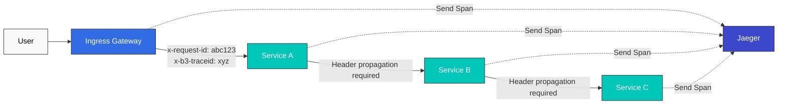
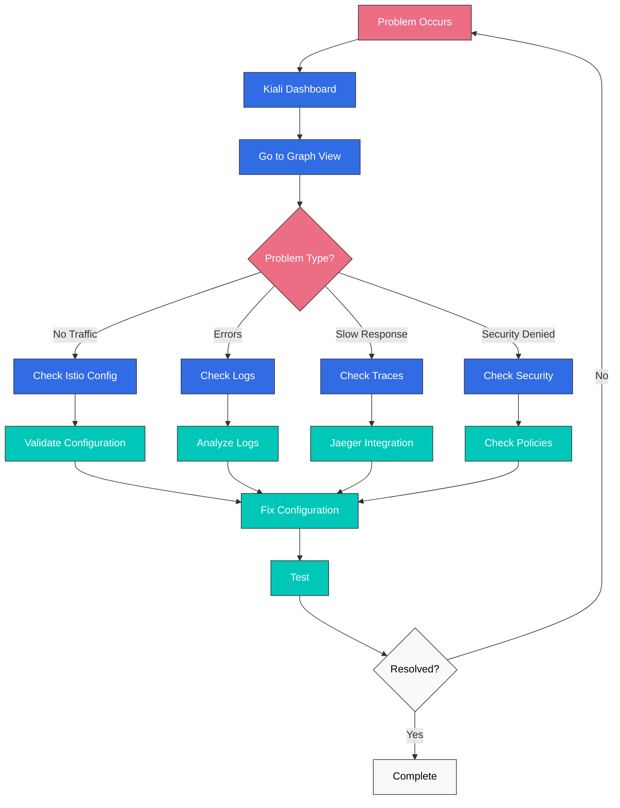

# Cuestionario de observabilidad

> **Versión compatible**: Istio 1.28.0 **Versión de EKS**: 1.34 (Kubernetes 1.28+) **Última actualización**: February 19, 2026

Este cuestionario evalúa tu comprensión de las características de observabilidad de Istio.

## Preguntas de opción múltiple (1-5)

### Pregunta 1: Métricas de Prometheus

¿Qué métrica **NO** recopila Prometheus de forma predeterminada en Istio?

A. istio\_requests\_total (recuento total de solicitudes) B. istio\_request\_duration\_milliseconds (latencia de solicitudes) C. istio\_request\_bytes (tamaño de solicitud) D. istio\_pod\_cpu\_usage (uso de CPU del Pod)

<details>

<summary>Mostrar respuesta</summary>

**Respuesta: D**

Istio Envoy recopila únicamente **métricas relacionadas con el tráfico**, mientras que el uso de CPU del Pod lo recopilan **Kubernetes Metrics Server** o **cAdvisor**.

**Explicación:**

**Métricas recopiladas por Istio:**

1. **istio\_requests\_total (A - O)**

```promql
# Total requests by service
sum(rate(istio_requests_total[5m])) by (destination_service_name)
```

2. **istio\_request\_duration\_milliseconds (B - O)**

```promql
# P95 latency
histogram_quantile(0.95,
  sum(rate(istio_request_duration_milliseconds_bucket[5m])) by (le)
)
```

3. **istio\_request\_bytes (C - O)**

```promql
# Request size
sum(rate(istio_request_bytes_sum[5m])) by (destination_service_name)
```

4. **istio\_pod\_cpu\_usage (D - X)**

* Esta no es una métrica de Istio
* Métrica de Kubernetes: `container_cpu_usage_seconds_total`
* Requiere kube-state-metrics para recopilarse en Prometheus

**Categorías de métricas de Istio:**

| Categoría     | Métrica de ejemplo                            | Descripción                   |
| ------------ | --------------------------------------------- | ----------------------------- |
| **Solicitud**  | istio\_requests\_total                        | Recuento de solicitudes, códigos de respuesta |
| **Duración** | istio\_request\_duration\_milliseconds        | Distribución de latencia          |
| **Tamaño**     | istio\_request\_bytes, istio\_response\_bytes | Tamaño del tráfico                  |
| **TCP**      | istio\_tcp\_connections\_opened\_total        | Conexiones TCP               |

**Ejemplos de Golden Signals:**

```promql
# 1. Latency
histogram_quantile(0.95,
  sum(rate(
    istio_request_duration_milliseconds_bucket{
      destination_service_name="reviews"
    }[5m]
  )) by (le)
)

# 2. Traffic
sum(rate(
  istio_requests_total{
    destination_service_name="reviews"
  }[5m]
))

# 3. Errors (error rate)
sum(rate(
  istio_requests_total{
    destination_service_name="reviews",
    response_code=~"5.."
  }[5m]
))
/
sum(rate(
  istio_requests_total{
    destination_service_name="reviews"
  }[5m]
))

# 4. Saturation - Uses Kubernetes metrics
sum(rate(
  container_cpu_usage_seconds_total{
    pod=~"reviews-.*"
  }[5m]
))
```

**Comprobación de métricas:**

```bash
# Check metrics via Envoy Admin API
kubectl exec <pod-name> -c istio-proxy -- \
  curl localhost:15000/stats/prometheus

# Check in Prometheus
kubectl port-forward -n istio-system svc/prometheus 9090:9090
# Query at http://localhost:9090
```

**Referencia:**

* [Métricas](../../../service-mesh/istio/observability/01-metrics.md)

</details>

***

### Pregunta 2: Trazado distribuido

¿Cuál es la **configuración mínima** necesaria para el trazado distribuido en Istio?

A. La aplicación debe generar IDs de Trace B. La aplicación debe propagar encabezados HTTP C. El cliente de Jaeger debe instalarse en todos los servicios D. Envoy gestiona todo automáticamente

<details>

<summary>Mostrar respuesta</summary>

**Respuesta: B**

Istio Envoy genera automáticamente IDs de Trace, pero **la aplicación debe propagar los encabezados HTTP** al siguiente servicio.

**Explicación:**

**Cómo funciona el trazado distribuido:**



**Encabezados HTTP que se deben propagar:**

```yaml
# Zipkin (B3) headers
x-b3-traceid: Trace ID
x-b3-spanid: Current Span ID
x-b3-parentspanid: Parent Span ID
x-b3-sampled: Sampling decision
x-b3-flags: Flags

# Or single header
b3: {traceid}-{spanid}-{sampled}-{parentspanid}

# Istio internal headers
x-request-id: Unique request ID

# Jaeger native headers (optional)
uber-trace-id
```

**Ejemplos de código de aplicación:**

```python
# Python Flask example
from flask import Flask, request
import requests

app = Flask(__name__)

@app.route('/api/users')
def get_users():
    # 1. Extract received headers
    headers = {}
    for header in ['x-request-id', 'x-b3-traceid', 'x-b3-spanid',
                   'x-b3-parentspanid', 'x-b3-sampled', 'x-b3-flags']:
        if header in request.headers:
            headers[header] = request.headers[header]

    # 2. Propagate headers when calling next service
    response = requests.get(
        'http://user-service/users',
        headers=headers  # Header propagation required
    )

    return response.json()
```

```javascript
// Node.js Express example
const express = require('express');
const axios = require('axios');
const app = express();

app.get('/api/users', async (req, res) => {
  // 1. Extract received headers
  const tracingHeaders = {};
  ['x-request-id', 'x-b3-traceid', 'x-b3-spanid',
   'x-b3-parentspanid', 'x-b3-sampled', 'x-b3-flags'].forEach(header => {
    if (req.headers[header]) {
      tracingHeaders[header] = req.headers[header];
    }
  });

  // 2. Propagate headers when calling next service
  const response = await axios.get('http://user-service/users', {
    headers: tracingHeaders  // Header propagation required
  });

  res.json(response.data);
});
```

**Análisis de cada opción:**

* **A (X)**: Envoy genera automáticamente IDs de Trace
* **B (O)**: La aplicación debe propagar encabezados HTTP (obligatorio)
* **C (X)**: No se necesita el cliente de Jaeger; Envoy envía Spans
* **D (X)**: Envoy crea/envía Spans, pero la propagación de encabezados es responsabilidad de la aplicación

**Configuración de muestreo:**

```yaml
apiVersion: install.istio.io/v1alpha1
kind: IstioOperator
spec:
  meshConfig:
    defaultConfig:
      tracing:
        sampling: 1.0  # 100% sampling (development)
        # sampling: 10.0  # 10% sampling (production)
```

**Acceso a Jaeger:**

```bash
istioctl dashboard jaeger
```

**Referencia:**

* [Trazado distribuido](https://github.com/Atom-oh/kubernetes-docs/blob/main/en/service-mesh/istio/observability/02-distributed-tracing.md)

</details>

***

### Pregunta 3: Visualización con Kiali

¿Qué característica **NO** proporciona Kiali?

A. Visualización de topología de servicios B. Análisis del flujo de tráfico C. Ejecución automática de despliegues Canary D. Validación de configuración de Istio

<details>

<summary>Mostrar respuesta</summary>

**Respuesta: C**

Kiali es una **herramienta de observación y análisis**, mientras que la ejecución de despliegues la gestionan herramientas como **Argo Rollouts**.

**Explicación:**

**Características principales de Kiali:**

**1. Visualización de topología de servicios (A - O)**

```bash
# Open Kiali dashboard
istioctl dashboard kiali

# Features:
# - Real-time service connection display
# - Traffic flow direction display
# - Service status (healthy/error)
# - Response time display
```

**Ejemplo de vista Graph:**

```
Frontend → Backend → Database
   ↓
External API

Color codes:
- Green: Normal
- Red: Error
- Gray: No traffic
```

**2. Análisis del flujo de tráfico (B - O)**

Kiali muestra:

* Recuento de solicitudes (RPS)
* Tasa de errores (%)
* Latencia P50/P95/P99
* Recuento de conexiones TCP

**3. Ejecución automática de despliegues Canary (C - X)**

* Kiali NO ejecuta despliegues
* Kiali únicamente **visualiza** el estado de división de tráfico
* Ejecución de despliegues: Argo Rollouts, Flagger

**4. Validación de configuración de Istio (D - O)**

```yaml
# Items Kiali validates:

1. VirtualService errors:
   - Non-existent host reference
   - Invalid subset reference
   - Weight sum not equal to 100

2. DestinationRule errors:
   - Subset labels don't match Pods
   - Duplicate subset names

3. Gateway errors:
   - Missing TLS certificate
   - Invalid selector

4. AuthorizationPolicy errors:
   - Conflicting policies
   - Invalid principal format
```

**Instalación de Kiali:**

```bash
# Install Kiali included in Istio samples
kubectl apply -f samples/addons/kiali.yaml

# Or install with Helm
helm repo add kiali https://kiali.org/helm-charts
helm install kiali-server kiali/kiali-server \
  --namespace istio-system
```

**Menús principales de Kiali:**

```
1. Overview: Service summary by Namespace
2. Graph: Service topology
3. Applications: Application list
4. Workloads: Deployment, StatefulSet, etc.
5. Services: Kubernetes Service
6. Istio Config: VirtualService, DestinationRule, etc.
```

**Kiali frente a otras herramientas:**

| Herramienta              | Función                                | Ejecución de despliegues |
| ----------------- | ----------------------------------- | -------------------- |
| **Kiali**         | Visualización, análisis, validación | No                   |
| **Argo Rollouts** | Entrega progresiva                | Sí                  |
| **Flagger**       | Despliegue Canary automático         | Sí                  |
| **Grafana**       | Panel de métricas                   | No                  |
| **Jaeger**        | Trazado distribuido                 | No                   |

**Ejemplo de uso práctico:**

```bash
# 1. Check service topology in Kiali
istioctl dashboard kiali

# 2. Detect anomalies in Graph view
#    - reviews service error rate 5%
#    - productpage → reviews latency increase

# 3. Check details in Workload view
#    - Check reviews-v2 Pod logs
#    - Check Envoy metrics

# 4. Validate configuration in Istio Config view
#    - Found typo in VirtualService
#    - Fix and redeploy
```

**Referencia:**

* [Visualización](https://github.com/Atom-oh/kubernetes-docs/blob/main/en/service-mesh/istio/observability/04-visualization.md)
* [Documentación oficial de Kiali](https://kiali.io/docs/)

</details>

***

### Pregunta 4: Configuración de Access Log

¿Cómo se configura la salida de Access Log en formato **JSON** en Istio?

A. Configurar meshConfig.accessLogEncoding como JSON en IstioOperator B. Modificar directamente el ConfigMap de Envoy C. Agregar una anotación a cada Pod D. Convertir a JSON mediante una consulta de Prometheus

<details>

<summary>Mostrar respuesta</summary>

**Respuesta: A**

Configura el campo **meshConfig.accessLogEncoding** en IstioOperator como `JSON`.

**Explicación:**

**Configuración de Access Log en formato JSON:**

```yaml
apiVersion: install.istio.io/v1alpha1
kind: IstioOperator
spec:
  meshConfig:
    # Enable Access Log
    accessLogFile: /dev/stdout

    # Output in JSON format
    accessLogEncoding: JSON

    # Define custom JSON format
    accessLogFormat: |
      {
        "start_time": "%START_TIME%",
        "method": "%REQ(:METHOD)%",
        "path": "%REQ(X-ENVOY-ORIGINAL-PATH?:PATH)%",
        "protocol": "%PROTOCOL%",
        "response_code": "%RESPONSE_CODE%",
        "response_flags": "%RESPONSE_FLAGS%",
        "bytes_received": "%BYTES_RECEIVED%",
        "bytes_sent": "%BYTES_SENT%",
        "duration": "%DURATION%",
        "upstream_service_time": "%RESP(X-ENVOY-UPSTREAM-SERVICE-TIME)%",
        "x_forwarded_for": "%REQ(X-FORWARDED-FOR)%",
        "user_agent": "%REQ(USER-AGENT)%",
        "request_id": "%REQ(X-REQUEST-ID)%",
        "authority": "%REQ(:AUTHORITY)%",
        "upstream_host": "%UPSTREAM_HOST%",
        "upstream_cluster": "%UPSTREAM_CLUSTER%",
        "upstream_local_address": "%UPSTREAM_LOCAL_ADDRESS%",
        "downstream_local_address": "%DOWNSTREAM_LOCAL_ADDRESS%",
        "downstream_remote_address": "%DOWNSTREAM_REMOTE_ADDRESS%",
        "requested_server_name": "%REQUESTED_SERVER_NAME%",
        "route_name": "%ROUTE_NAME%"
      }
```

**Ejemplo de salida:**

```json
{
  "start_time": "2025-01-20T10:30:00.123Z",
  "method": "GET",
  "path": "/api/users",
  "protocol": "HTTP/1.1",
  "response_code": 200,
  "response_flags": "-",
  "bytes_received": 0,
  "bytes_sent": 1234,
  "duration": 42,
  "upstream_service_time": "40",
  "x_forwarded_for": "192.168.1.100",
  "user_agent": "Mozilla/5.0",
  "request_id": "abc-123-def",
  "authority": "example.com",
  "upstream_host": "10.0.1.20:8080",
  "upstream_cluster": "outbound|8080||backend.default.svc.cluster.local",
  "upstream_local_address": "10.0.1.10:54321",
  "downstream_local_address": "10.0.1.10:8080",
  "downstream_remote_address": "10.0.1.5:12345",
  "requested_server_name": "-",
  "route_name": "default"
}
```

**Configuración por Namespace:**

```yaml
apiVersion: telemetry.istio.io/v1alpha1
kind: Telemetry
metadata:
  name: access-logging
  namespace: production
spec:
  accessLogging:
  - providers:
    - name: envoy
    # Can configure JSON format for specific Namespace only
```

**Variables de formato de Envoy:**

```yaml
# Key variables:
%START_TIME%: Request start time
%REQ(HEADER)%: Request header
%RESP(HEADER)%: Response header
%RESPONSE_CODE%: HTTP response code
%DURATION%: Total duration (ms)
%BYTES_RECEIVED%: Bytes received
%BYTES_SENT%: Bytes sent
%UPSTREAM_HOST%: Upstream server address
%DOWNSTREAM_REMOTE_ADDRESS%: Client address
```

**Integración con CloudWatch Logs:**

```yaml
apiVersion: v1
kind: ConfigMap
metadata:
  name: fluent-bit-config
  namespace: istio-system
data:
  output.conf: |
    [OUTPUT]
        Name cloudwatch_logs
        Match *
        region us-east-1
        log_group_name /aws/eks/istio/access-logs
        log_stream_prefix istio-
        auto_create_group true
```

**Comprobación de logs:**

```bash
# Check Pod's Access Log
kubectl logs <pod-name> -c istio-proxy

# Real-time monitoring
kubectl logs -f <pod-name> -c istio-proxy | jq .

# Filter specific response codes
kubectl logs <pod-name> -c istio-proxy | \
  jq 'select(.response_code == "500")'
```

**Formato TEXT frente a formato JSON:**

| Elemento            | TEXT         | JSON            |
| --------------- | ------------ | --------------- |
| **Legibilidad** | Alta (humana) | Baja (humana)     |
| **Análisis**     | Difícil    | Fácil (máquina)  |
| **Tamaño**        | Pequeño        | Grande           |
| **Estructura**   | No estructurada | Estructurada      |
| **Consulta**    | Difícil    | Fácil (jq, etc.) |

**Ejemplo de formato TEXT:**

```
[2025-01-20T10:30:00.123Z] "GET /api/users HTTP/1.1" 200 - "-" "-" 0 1234 42 40 "192.168.1.100" "Mozilla/5.0" "abc-123-def" "example.com" "10.0.1.20:8080" outbound|8080||backend.default.svc.cluster.local 10.0.1.10:54321 10.0.1.10:8080 10.0.1.5:12345 - default
```

**Referencia:**

* [Logging](../../../service-mesh/istio/observability/03-logging.md)
* [Formato de Access Log de Envoy](https://www.envoyproxy.io/docs/envoy/latest/configuration/observability/access_log/usage)

</details>

***

### Pregunta 5: Paneles de Grafana

¿Qué panel de Grafana **NO** se proporciona de forma predeterminada con la instalación de Istio?

A. Istio Service Dashboard B. Istio Workload Dashboard C. Istio Performance Dashboard D. Istio Cost Dashboard

<details>

<summary>Mostrar respuesta</summary>

**Respuesta: D**

Istio **no proporciona un Cost Dashboard** de forma predeterminada.

**Explicación:**

**Paneles de Grafana predeterminados de Istio:**

**1. Istio Service Dashboard (A - O)**

```
Service-level metrics:
- Request Volume (request count)
- Request Duration (P50, P95, P99)
- Request Size / Response Size
- Success Rate
- 4xx, 5xx error trends
```

**2. Istio Workload Dashboard (B - O)**

```
Workload (Pod) level metrics:
- Incoming Request Volume
- Incoming Success Rate
- Incoming Request Duration
- Incoming Request Size
- Outgoing Request Volume
- Outgoing Success Rate
```

**3. Istio Performance Dashboard (C - O)**

```
Istio's own performance metrics:
- Pilot performance (xDS push time)
- Envoy memory usage
- Envoy CPU usage
- Sidecar injection success rate
- Configuration sync latency
```

**4. Istio Control Plane Dashboard**

```
Control Plane metrics:
- Istiod resource usage
- xDS connection count
- Webhook performance
- Certificate issuance statistics
```

**5. Istio Mesh Dashboard**

```
Overall mesh metrics:
- Total request count
- Overall success rate
- Global P99 latency
- Service count, Pod count
```

**Cost Dashboard no disponible (D - X)**

Debes crear un panel personalizado para las métricas relacionadas con costos:

```promql
# Cross-AZ traffic cost estimation
sum(rate(istio_requests_total{
  source_cluster="us-east-1a",
  destination_cluster!="us-east-1a"
}[5m])) * 86400 * 30 * 0.01 / 1000000

# Sidecar resource cost (memory basis)
sum(container_memory_usage_bytes{
  container="istio-proxy"
}) / 1024 / 1024 / 1024 * 30 * 0.01
```

**Instalación y acceso a Grafana:**

```bash
# Install Grafana
kubectl apply -f samples/addons/grafana.yaml

# Access Grafana
istioctl dashboard grafana

# Or port forwarding
kubectl port-forward -n istio-system svc/grafana 3000:3000
# http://localhost:3000
```

**Creación de un panel personalizado:**

```json
{
  "dashboard": {
    "title": "Istio Custom Metrics",
    "panels": [
      {
        "title": "Request Rate",
        "targets": [
          {
            "expr": "sum(rate(istio_requests_total[5m])) by (destination_service_name)"
          }
        ]
      },
      {
        "title": "Error Rate",
        "targets": [
          {
            "expr": "sum(rate(istio_requests_total{response_code=~\"5..\"}[5m])) / sum(rate(istio_requests_total[5m]))"
          }
        ]
      }
    ]
  }
}
```

**Uso de variables de panel:**

```yaml
# Add Namespace variable
variables:
  - name: namespace
    type: query
    query: label_values(istio_requests_total, destination_workload_namespace)

# Use variable in panel
expr: |
  sum(rate(
    istio_requests_total{
      destination_workload_namespace="$namespace"
    }[5m]
  )) by (destination_service_name)
```

**Referencia:**

* [Visualización](https://github.com/Atom-oh/kubernetes-docs/blob/main/en/service-mesh/istio/observability/04-visualization.md)
* [Documentación oficial de Grafana](https://grafana.com/docs/)

</details>

***

## Preguntas de respuesta corta (6-10)

### Pregunta 6: Monitoreo de Golden Signals

Explica cómo monitorear las **Golden Signals** (Latencia, Tráfico, Errores, Saturación) de Google SRE mediante Istio y Prometheus. Incluye **consultas de Prometheus** y **reglas de alerta** para cada señal.

<details>

<summary>Mostrar respuesta</summary>

**Respuesta:**

**Implementación del monitoreo de Golden Signals:**

***

**1. Latencia**

**Consulta de Prometheus:**

```promql
# P95 latency
histogram_quantile(0.95,
  sum(rate(
    istio_request_duration_milliseconds_bucket{
      destination_service_name="reviews"
    }[5m]
  )) by (le)
)

# P99 latency
histogram_quantile(0.99,
  sum(rate(
    istio_request_duration_milliseconds_bucket{
      destination_service_name="reviews"
    }[5m]
  )) by (le)
)

# P50 latency (median)
histogram_quantile(0.50,
  sum(rate(
    istio_request_duration_milliseconds_bucket{
      destination_service_name="reviews"
    }[5m]
  )) by (le)
)
```

**Reglas de alerta:**

```yaml
apiVersion: monitoring.coreos.com/v1
kind: PrometheusRule
metadata:
  name: istio-latency-alerts
  namespace: monitoring
spec:
  groups:
  - name: latency
    interval: 30s
    rules:
    # P95 latency exceeds 500ms
    - alert: HighLatency
      expr: |
        histogram_quantile(0.95,
          sum(rate(
            istio_request_duration_milliseconds_bucket[5m]
          )) by (le, destination_service_name)
        ) > 500
      for: 5m
      labels:
        severity: warning
      annotations:
        summary: "High latency detected on {{ $labels.destination_service_name }}"
        description: "P95 latency is {{ $value }}ms"

    # P99 latency exceeds 1 second
    - alert: CriticalLatency
      expr: |
        histogram_quantile(0.99,
          sum(rate(
            istio_request_duration_milliseconds_bucket[5m]
          )) by (le, destination_service_name)
        ) > 1000
      for: 5m
      labels:
        severity: critical
      annotations:
        summary: "Critical latency on {{ $labels.destination_service_name }}"
```

***

**2. Tráfico**

**Consulta de Prometheus:**

```promql
# Requests per second (RPS)
sum(rate(
  istio_requests_total{
    destination_service_name="reviews"
  }[5m]
))

# RPS by service
sum(rate(
  istio_requests_total[5m]
)) by (destination_service_name)

# RPS by HTTP method
sum(rate(
  istio_requests_total[5m]
)) by (request_method)
```

**Reglas de alerta:**

```yaml
apiVersion: monitoring.coreos.com/v1
kind: PrometheusRule
metadata:
  name: istio-traffic-alerts
spec:
  groups:
  - name: traffic
    rules:
    # Traffic spike (2x normal)
    - alert: TrafficSpike
      expr: |
        sum(rate(istio_requests_total[5m])) by (destination_service_name)
        >
        sum(rate(istio_requests_total[1h] offset 1h)) by (destination_service_name) * 2
      for: 5m
      labels:
        severity: warning
      annotations:
        summary: "Traffic spike on {{ $labels.destination_service_name }}"

    # Traffic drop (below 50% of normal)
    - alert: TrafficDrop
      expr: |
        sum(rate(istio_requests_total[5m])) by (destination_service_name)
        <
        sum(rate(istio_requests_total[1h] offset 1h)) by (destination_service_name) * 0.5
      for: 10m
      labels:
        severity: warning
```

***

**3. Errores**

**Consulta de Prometheus:**

```promql
# Error rate (5xx)
sum(rate(
  istio_requests_total{
    destination_service_name="reviews",
    response_code=~"5.."
  }[5m]
))
/
sum(rate(
  istio_requests_total{
    destination_service_name="reviews"
  }[5m]
))

# 4xx + 5xx error rate
sum(rate(
  istio_requests_total{
    destination_service_name="reviews",
    response_code=~"[45].."
  }[5m]
))
/
sum(rate(
  istio_requests_total{
    destination_service_name="reviews"
  }[5m]
))

# Distribution by response code
sum(rate(
  istio_requests_total[5m]
)) by (response_code, destination_service_name)
```

**Reglas de alerta:**

```yaml
apiVersion: monitoring.coreos.com/v1
kind: PrometheusRule
metadata:
  name: istio-error-alerts
spec:
  groups:
  - name: errors
    rules:
    # Error rate > 1%
    - alert: HighErrorRate
      expr: |
        (
          sum(rate(istio_requests_total{response_code=~"5.."}[5m])) by (destination_service_name)
          /
          sum(rate(istio_requests_total[5m])) by (destination_service_name)
        ) > 0.01
      for: 5m
      labels:
        severity: warning
      annotations:
        summary: "High error rate on {{ $labels.destination_service_name }}"
        description: "Error rate is {{ $value | humanizePercentage }}"

    # Error rate > 5%
    - alert: CriticalErrorRate
      expr: |
        (
          sum(rate(istio_requests_total{response_code=~"5.."}[5m])) by (destination_service_name)
          /
          sum(rate(istio_requests_total[5m])) by (destination_service_name)
        ) > 0.05
      for: 2m
      labels:
        severity: critical
```

***

**4. Saturación**

**Consulta de Prometheus:**

```promql
# Envoy CPU usage
sum(rate(
  container_cpu_usage_seconds_total{
    pod=~".*",
    container="istio-proxy"
  }[5m]
)) by (pod)

# Envoy memory usage
sum(
  container_memory_usage_bytes{
    pod=~".*",
    container="istio-proxy"
  }
) by (pod)

# Envoy connection count
sum(
  envoy_cluster_upstream_cx_active
) by (cluster_name)

# Envoy pending requests
sum(
  envoy_cluster_upstream_rq_pending_active
) by (cluster_name)
```

**Reglas de alerta:**

```yaml
apiVersion: monitoring.coreos.com/v1
kind: PrometheusRule
metadata:
  name: istio-saturation-alerts
spec:
  groups:
  - name: saturation
    rules:
    # Envoy CPU > 80%
    - alert: HighEnvoyCPU
      expr: |
        sum(rate(
          container_cpu_usage_seconds_total{
            container="istio-proxy"
          }[5m]
        )) by (pod, namespace)
        /
        sum(
          container_spec_cpu_quota{
            container="istio-proxy"
          } / 100000
        ) by (pod, namespace)
        > 0.8
      for: 5m
      labels:
        severity: warning

    # Envoy Memory > 80%
    - alert: HighEnvoyMemory
      expr: |
        sum(
          container_memory_usage_bytes{
            container="istio-proxy"
          }
        ) by (pod, namespace)
        /
        sum(
          container_spec_memory_limit_bytes{
            container="istio-proxy"
          }
        ) by (pod, namespace)
        > 0.8
      for: 5m
      labels:
        severity: warning

    # Connection Pool Saturated
    - alert: ConnectionPoolSaturated
      expr: |
        envoy_cluster_upstream_cx_active
        /
        envoy_cluster_circuit_breakers_default_cx_open
        > 0.9
      for: 5m
      labels:
        severity: critical
```

***

**Configuración del panel de Grafana:**

```json
{
  "dashboard": {
    "title": "Golden Signals",
    "panels": [
      {
        "title": "Latency (P95, P99)",
        "targets": [
          {"expr": "histogram_quantile(0.95, sum(rate(istio_request_duration_milliseconds_bucket[5m])) by (le))"},
          {"expr": "histogram_quantile(0.99, sum(rate(istio_request_duration_milliseconds_bucket[5m])) by (le))"}
        ]
      },
      {
        "title": "Traffic (RPS)",
        "targets": [
          {"expr": "sum(rate(istio_requests_total[5m])) by (destination_service_name)"}
        ]
      },
      {
        "title": "Errors (Rate)",
        "targets": [
          {"expr": "sum(rate(istio_requests_total{response_code=~\"5..\"}[5m])) / sum(rate(istio_requests_total[5m]))"}
        ]
      },
      {
        "title": "Saturation (CPU, Memory)",
        "targets": [
          {"expr": "sum(rate(container_cpu_usage_seconds_total{container=\"istio-proxy\"}[5m])) by (pod)"},
          {"expr": "sum(container_memory_usage_bytes{container=\"istio-proxy\"}) by (pod)"}
        ]
      }
    ]
  }
}
```

**Referencia:**

* [Métricas](../../../service-mesh/istio/observability/01-metrics.md)
* [Libro de Google SRE - Monitoreo](https://sre.google/sre-book/monitoring-distributed-systems/)

</details>

***

### Pregunta 7: Búsqueda de cuellos de botella de rendimiento con Jaeger

Explica cómo usar la herramienta de trazado distribuido Jaeger para encontrar **cuellos de botella de rendimiento** en una arquitectura de microservicios. Incluye **métodos de análisis de Trace** y **escenarios prácticos de depuración**.

<details>

<summary>Mostrar respuesta</summary>

**Respuesta:**

**Análisis de cuellos de botella de rendimiento con Jaeger:**

***

**1. Instalación y configuración de Jaeger**

```bash
# Install Jaeger
kubectl apply -f samples/addons/jaeger.yaml

# Enable Tracing (100% sampling)
istioctl install --set values.pilot.traceSampling=100.0
```

```yaml
# Or configure with IstioOperator
apiVersion: install.istio.io/v1alpha1
kind: IstioOperator
spec:
  meshConfig:
    defaultConfig:
      tracing:
        sampling: 100.0  # Development: 100%, Production: 1-10%
        zipkin:
          address: jaeger-collector.istio-system:9411
```

***

**2. Comprensión de la estructura de Trace**

```
Trace
└─ Span 1: Ingress Gateway (total 150ms)
   └─ Span 2: Frontend (total 140ms)
      ├─ Span 3: Backend API (total 100ms)
      │  ├─ Span 4: Database Query (80ms)  ← Bottleneck!
      │  └─ Span 5: Cache Check (10ms)
      └─ Span 6: External API (30ms)
```

**Información de Span:**

* **Duración**: Tiempo empleado en el Span
* **Etiquetas**: Metadatos (método HTTP, URL, código de respuesta)
* **Logs**: Eventos (errores, advertencias)
* **Relación padre-hijo**: Jerarquía de llamadas

***

**3. Escenarios prácticos de depuración**

**Escenario 1: Latencia P99 alta**

**Síntomas:**

```promql
# P99 latency is 2 seconds
histogram_quantile(0.99,
  sum(rate(
    istio_request_duration_milliseconds_bucket[5m]
  )) by (le)
) = 2000
```

**Pasos de análisis en Jaeger:**

```bash
# 1. Access Jaeger UI
istioctl dashboard jaeger

# 2. Set search criteria
Service: productpage
Lookback: Last 1 hour
Min Duration: 2000ms  # Filter only 2+ seconds
Limit Results: 20

# 3. Analyze results
```

**Problema identificado:**

```
Trace ID: abc-123-def
Total Duration: 2.1 seconds

├─ productpage (2.1s)
   └─ reviews (2.0s)  ← Bottleneck!
      └─ ratings (1.9s)  ← Actual bottleneck!
         └─ MongoDB Query (1.8s)  ← Root cause!
```

**Resolución:**

```yaml
# 1. Optimize MongoDB query
# - Add index
# - Query tuning

# 2. Add caching
apiVersion: v1
kind: ConfigMap
metadata:
  name: ratings-config
data:
  redis.conf: |
    host: redis.default.svc.cluster.local
    port: 6379
    ttl: 300

# 3. Set Timeout
apiVersion: networking.istio.io/v1beta1
kind: VirtualService
metadata:
  name: ratings
spec:
  hosts:
  - ratings
  http:
  - timeout: 500ms  # Set timeout
    retries:
      attempts: 3
      perTryTimeout: 200ms
```

***

**Escenario 2: Timeouts intermitentes**

**Análisis de Jaeger:**

```
# Normal Trace
Trace ID: normal-001
Duration: 120ms
├─ frontend (120ms)
   └─ backend (100ms)
      └─ database (80ms)

# Timeout Trace
Trace ID: timeout-001
Duration: 10,000ms  ← Abnormal!
├─ frontend (10,000ms)
   └─ backend (9,980ms)
      └─ database (9,950ms)  ← Bottleneck!
         └─ Error: Connection timeout
```

**Comprobación de detalles del Span:**

```json
{
  "traceID": "timeout-001",
  "spanID": "span-db",
  "operationName": "database.query",
  "duration": 9950000,
  "tags": {
    "db.statement": "SELECT * FROM users WHERE status = 'active'",
    "db.type": "postgresql",
    "error": true
  },
  "logs": [
    {
      "timestamp": 1234567890,
      "fields": [
        {"key": "event", "value": "error"},
        {"key": "error.kind", "value": "ConnectionTimeout"},
        {"key": "message", "value": "Connection pool exhausted"}
      ]
    }
  ]
}
```

**Resolución:**

```yaml
# Increase Connection Pool
apiVersion: networking.istio.io/v1beta1
kind: DestinationRule
metadata:
  name: database
spec:
  host: database
  trafficPolicy:
    connectionPool:
      tcp:
        maxConnections: 100  # 50 → 100
      http:
        http1MaxPendingRequests: 50
        maxRequestsPerConnection: 2
```

***

**Escenario 3: Latencia en cascada**

**Análisis de Jaeger:**

```
Trace ID: cascade-001
Total Duration: 5.2 seconds

├─ frontend (5.2s)
   ├─ backend-a (2.0s)
   │  └─ database (1.9s)
   ├─ backend-b (2.0s)  ← Sequential call issue!
   │  └─ external-api (1.9s)
   └─ backend-c (1.0s)
      └─ cache (0.9s)

Problem: Sequential execution of parallelizable calls
```

**Resolución (modificación de la aplicación):**

```python
# Sequential calls (Before)
def get_user_data(user_id):
    profile = call_backend_a(user_id)      # 2 seconds
    orders = call_backend_b(user_id)       # 2 seconds
    recommendations = call_backend_c(user_id)  # 1 second
    return merge(profile, orders, recommendations)

# Total time: 5 seconds

# Parallel calls (After)
import asyncio

async def get_user_data(user_id):
    profile, orders, recommendations = await asyncio.gather(
        call_backend_a(user_id),      # 2 seconds
        call_backend_b(user_id),       # 2 seconds
        call_backend_c(user_id)        # 1 second
    )
    return merge(profile, orders, recommendations)

# Total time: 2 seconds (longest call)
```

***

**4. Consejos sobre la UI de Jaeger**

**Dependencias de servicio (gráfico de dependencias de servicios):**

```bash
# Jaeger UI → Dependencies tab
# - Visualize service call relationships
# - Display error rates
# - Display request counts
```

**Comparar Traces:**

```bash
# 1. Select normal Trace
# 2. Select slow Trace
# 3. Click Compare button
# 4. Check time differences per Span
```

**Gráfico de dependencias profundo:**

```bash
# Check detailed dependencies for specific Trace
# - Time spent per Span
# - Parallel/sequential execution status
# - Critical Path
```

***

**5. Lista de verificación para la optimización de rendimiento**

```yaml
# 1. Remove unnecessary calls
# - N+1 query problem
# - Duplicate API calls

# 2. Parallel processing
# - Execute independent calls in parallel
# - Use asyncio, Promise.all, etc.

# 3. Caching
# - Redis, Memcached
# - CDN (static resources)

# 4. Connection Pool tuning
# - Appropriate max connections
# - Enable Keep-Alive

# 5. Timeout settings
# - Appropriate timeout (not too long)
# - Fail Fast

# 6. Database optimization
# - Add indexes
# - Query optimization
# - Use read replicas
```

***

**6. Integración de Prometheus + Jaeger**

```promql
# Find Traces with high latency
histogram_quantile(0.99,
  sum(rate(
    istio_request_duration_milliseconds_bucket[5m]
  )) by (le, destination_service_name)
) > 1000

# After checking in Prometheus, search Traces in Jaeger for that time period
```

**Referencia:**

* [Trazado distribuido](https://github.com/Atom-oh/kubernetes-docs/blob/main/en/service-mesh/istio/observability/02-distributed-tracing.md)
* [Documentación oficial de Jaeger](https://www.jaegertracing.io/docs/)

</details>

***

### Pregunta 8: Resolución de problemas de Service Mesh con Kiali

Explica cómo diagnosticar y resolver **problemas comunes** (errores de configuración, anomalías de tráfico, conflictos de políticas de seguridad) en el service mesh de Istio mediante Kiali.

<details>

<summary>Mostrar respuesta</summary>

**Respuesta:**

**Resolución de problemas de Service Mesh con Kiali:**

***

**1. Diagnóstico de errores de configuración**

**Problema 1: Error de host de VirtualService**

**Síntomas:**

```bash
# Service call failure
curl http://reviews:9080
# 503 Service Unavailable
```

**Diagnóstico con Kiali:**

```bash
# 1. Access Kiali dashboard
istioctl dashboard kiali

# 2. Istio Config → VirtualServices tab
# 3. Warning indicator on reviews VirtualService

# 4. Click for details
```

**Mensaje de error de Kiali:**

```
Warning: VirtualService 'reviews-vs' has issues:
- Host 'reviews.default.svc.cluster.local' references service 'reviews'
  but service does not exist
- Subset 'v2' references DestinationRule 'reviews-dr'
  but subset is not defined
```

**Resolución:**

```yaml
# Incorrect configuration
apiVersion: networking.istio.io/v1beta1
kind: VirtualService
metadata:
  name: reviews-vs
spec:
  hosts:
  - reviews.default.svc.cluster.local  # Service doesn't exist!
  http:
  - route:
    - destination:
        host: reviews
        subset: v2  # Not defined in DestinationRule!

---
# Correct configuration
apiVersion: networking.istio.io/v1beta1
kind: VirtualService
metadata:
  name: reviews-vs
spec:
  hosts:
  - reviews  # Service name only
  http:
  - route:
    - destination:
        host: reviews
        subset: v1  # Existing subset

---
apiVersion: networking.istio.io/v1beta1
kind: DestinationRule
metadata:
  name: reviews-dr
spec:
  host: reviews
  subsets:
  - name: v1
    labels:
      version: v1
```

***

**Problema 2: Desajuste de etiquetas de Subset de DestinationRule**

**Diagnóstico con Kiali:**

```
In Graph view:
- No traffic being sent to reviews service
- Kiali shows red dashed line

In Istio Config tab:
Warning: DestinationRule 'reviews-dr' has issues:
- Subset 'v1' selects labels {version: v1}
  but no pods match these labels
```

**Comprobación del problema:**

```bash
# Check Pod labels
kubectl get pods -l app=reviews --show-labels

# Output:
NAME            LABELS
reviews-v1-xxx  app=reviews,version=1.0  ← version=1.0 (wrong)
```

**Resolución:**

```yaml
# Incorrect DestinationRule
apiVersion: networking.istio.io/v1beta1
kind: DestinationRule
spec:
  subsets:
  - name: v1
    labels:
      version: v1  # Pod has version=1.0

# Corrected DestinationRule
apiVersion: networking.istio.io/v1beta1
kind: DestinationRule
spec:
  subsets:
  - name: v1
    labels:
      version: "1.0"  # Match Pod label
```

***

**2. Diagnóstico de anomalías de tráfico**

**Problema 3: Desequilibrio de tráfico**

**Comprobación en la vista Graph de Kiali:**

```
frontend → backend-v1 (90% traffic)  ← Expected: 50%
frontend → backend-v2 (10% traffic)  ← Expected: 50%
```

**Análisis de causa raíz:**

```bash
# Kiali → Workloads tab → backend
# Check Pod status:

backend-v1: 5 pods (all Ready)
backend-v2: 5 pods (3 Ready, 2 Terminating)

# Problem: backend-v2 Pods not starting normally
```

**Resolución:**

```bash
# 1. Check backend-v2 logs in Kiali
Workloads → backend-v2 → Logs tab

# 2. Analyze logs
Error: Cannot connect to database
Connection: postgresql://db:5432

# 3. Fix
kubectl edit deployment backend-v2
# Fix database connection string

# 4. Verify traffic balance in Kiali
# After few minutes: 50% / 50% normalized
```

***

**Problema 4: Dependencia circular**

**Comprobación en la vista Graph de Kiali:**

```
service-a → service-b
    ↑           ↓
    └───────────┘

Circular dependency detected!
```

**Alerta de Kiali:**

```
Warning: Circular dependency detected:
service-a → service-b → service-a
```

**Resolución:**

```yaml
# Architecture redesign needed
# Before:
service-a ↔ service-b

# After:
service-a → service-c (common service)
service-b → service-c
```

***

**3. Diagnóstico de conflictos de políticas de seguridad**

**Problema 5: Conflicto de AuthorizationPolicy**

**Síntomas:**

```bash
# frontend → backend call fails
curl http://backend:8080
# 403 RBAC: access denied
```

**Diagnóstico con Kiali:**

```bash
# Kiali → Istio Config → Authorization Policies

Policy 1:
apiVersion: security.istio.io/v1beta1
kind: AuthorizationPolicy
metadata:
  name: deny-all
spec: {}  # Deny all requests

Policy 2:
apiVersion: security.istio.io/v1beta1
kind: AuthorizationPolicy
metadata:
  name: allow-frontend
spec:
  action: ALLOW
  rules:
  - from:
    - source:
        principals: ["cluster.local/ns/default/sa/frontend"]

# Kiali warning:
Warning: Policy conflict detected:
- deny-all denies all traffic
- allow-frontend allows traffic from frontend
- Evaluation order: DENY policies are evaluated first
```

**Resolución:**

```yaml
# Correct configuration (per-Namespace separation)
---
# deny-all applies only to specific service
apiVersion: security.istio.io/v1beta1
kind: AuthorizationPolicy
metadata:
  name: backend-deny-all
spec:
  selector:
    matchLabels:
      app: backend
  # Empty rules = deny all requests

---
# Explicit allow policy
apiVersion: security.istio.io/v1beta1
kind: AuthorizationPolicy
metadata:
  name: backend-allow-frontend
spec:
  selector:
    matchLabels:
      app: backend
  action: ALLOW
  rules:
  - from:
    - source:
        principals: ["cluster.local/ns/default/sa/frontend"]
```

***

**Problema 6: Desajuste del modo mTLS**

**Comprobación en la vista Security de Kiali:**

```
service-a: mTLS STRICT
service-b: mTLS PERMISSIVE
service-c: mTLS DISABLED

Kiali warning:
Warning: mTLS configuration mismatch detected
- service-a requires mTLS but service-c has mTLS disabled
- Connection may fail
```

**Resolución:**

```yaml
# Apply consistent mTLS policy across entire mesh
apiVersion: security.istio.io/v1beta1
kind: PeerAuthentication
metadata:
  name: default
  namespace: istio-system
spec:
  mtls:
    mode: STRICT  # Apply STRICT to all services
```

***

**4. Características avanzadas de Kiali**

**Rango de tiempo personalizado:**

```bash
# Kiali → Graph view
# Time Range: Last 1 hour
# Refresh Interval: Every 15s

# Analyze specific time period
# - Check before/after incident
# - Compare before/after deployment
```

**Animación de tráfico:**

```bash
# Kiali → Graph view
# Display: Enable Traffic Animation

# Real-time traffic flow visualization
# - Request size shown as animation speed
# - Errors shown in red
```

**Etiquetas de borde:**

```bash
# Kiali → Graph view
# Edge Labels:
# - Request percentage
# - Request per second
# - Response time (95th percentile)

# Check traffic split ratio
frontend → backend-v1: 80% (8 rps)
frontend → backend-v2: 20% (2 rps)
```

**Detalles del servicio:**

```bash
# Kiali → Services → backend

Tabs:
1. Overview: Summary information
2. Traffic: Inbound/Outbound traffic
3. Inbound Metrics: Metric charts
4. Traces: Jaeger trace integration
5. Envoy: Envoy configuration check
```

***

**5. Flujo de trabajo de resolución de problemas**



**Referencia:**

* [Visualización](https://github.com/Atom-oh/kubernetes-docs/blob/main/en/service-mesh/istio/observability/04-visualization.md)
* [Documentación oficial de Kiali](https://kiali.io/docs/)

</details>

***

### Pregunta 9: Configuración del stack de observabilidad para producción

Explica cómo desplegar el stack de observabilidad de Istio (Prometheus, Grafana, Jaeger, Kiali) en una configuración de **alta disponibilidad (HA)** para un clúster de Kubernetes de producción. Incluye estrategias de **almacenamiento persistente**, **escalado** y **respaldo**.

<details>

<summary>Mostrar respuesta</summary>

**Respuesta:**

**Configuración del stack de observabilidad para producción:**

Debido a la extensión de esta respuesta, consulta el archivo fuente en coreano para ver los detalles completos de implementación, incluidos:

1. **Configuración HA de Prometheus** con Helm (kube-prometheus-stack)
2. **Thanos para almacenamiento de métricas a largo plazo** con backend S3
3. **Configuración HA de Jaeger** con backend Elasticsearch
4. **Configuración HA de Kiali**
5. **Estrategia de respaldo y recuperación** con Velero
6. **Monitoreo y alertas** con PrometheusRules

**Referencia:**

* [Prometheus Operator](https://github.com/prometheus-operator/prometheus-operator)
* [Thanos](https://thanos.io/tip/thanos/getting-started.md/)
* [Jaeger Operator](https://www.jaegertracing.io/docs/latest/operator/)

</details>

***

### Pregunta 10: Métricas personalizadas y creación de paneles

Explica cómo recopilar **métricas de negocio** (por ejemplo, recuento de pedidos, tasa de éxito de pagos) más allá de las métricas predeterminadas recopiladas por Istio Envoy, y crear un panel personalizado de Grafana.

<details>

<summary>Mostrar respuesta</summary>

**Respuesta:**

**Métricas personalizadas y creación de paneles:**

Debido a la extensión de esta respuesta, consulta el archivo fuente en coreano para ver los detalles completos de implementación, incluidos:

1. **Exposición de métricas desde la aplicación** (ejemplos de Python Flask y Node.js Express)
2. **Configuración de Kubernetes ServiceMonitor**
3. **Consultas de Prometheus** para métricas de negocio
4. Configuración JSON de **panel personalizado de Grafana**
5. **Aprovisionamiento de paneles** con ConfigMap
6. **Configuración de alertas** con PrometheusRules

**Referencia:**

* [Métricas](../../../service-mesh/istio/observability/01-metrics.md)
* [Bibliotecas de cliente de Prometheus](https://prometheus.io/docs/instrumenting/clientlibs/)
* [Aprovisionamiento de Grafana](https://grafana.com/docs/grafana/latest/administration/provisioning/)

</details>

***

## Cálculo de la puntuación

* Opción múltiple 1-5: 10 puntos cada una (total 50 puntos)
* Respuesta corta 6-10: 10 puntos cada una (total 50 puntos)
* **Total: 100 puntos**

**Criterios de evaluación:**

* 90-100 puntos: Excelente (experto en observabilidad de Istio)
* 80-89 puntos: Bueno (capaz de realizar monitoreo de producción)
* 70-79 puntos: Promedio (se recomienda aprendizaje adicional)
* 60-69 puntos: Por debajo del promedio (se requiere repasar conceptos básicos)
* 0-59 puntos: Se requiere volver a aprender

## Recursos de aprendizaje

* [Métricas](../../../service-mesh/istio/observability/01-metrics.md)
* [Trazado distribuido](https://github.com/Atom-oh/kubernetes-docs/blob/main/en/service-mesh/istio/observability/02-distributed-tracing.md)
* [Logging](../../../service-mesh/istio/observability/03-logging.md)
* [Visualización](https://github.com/Atom-oh/kubernetes-docs/blob/main/en/service-mesh/istio/observability/04-visualization.md)
