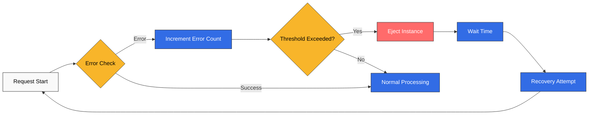
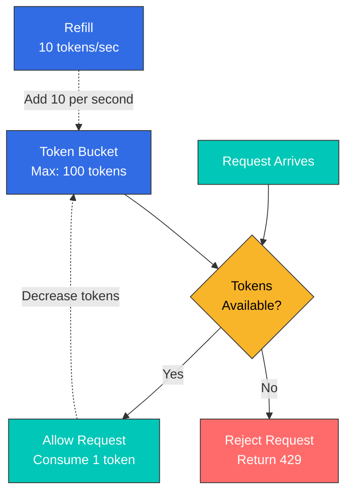
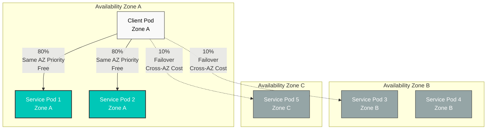
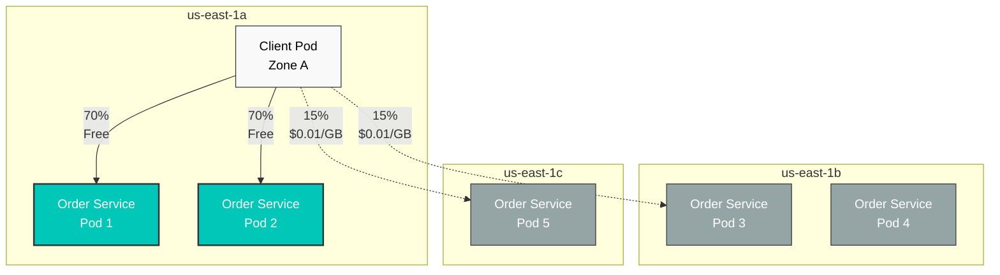

# Cuestionario de Resiliencia

> **Versión compatible**: Istio 1.28.0 **Versión de EKS**: 1.34 (Kubernetes 1.28+) **Última actualización**: February 19, 2026

Este cuestionario evalúa tu comprensión de las características de Resilience de Istio.

## Preguntas de opción múltiple (1-5)

### Pregunta 1: Conceptos básicos de Outlier Detection

¿Cuál de las siguientes opciones **NO** es un propósito principal de Outlier Detection?

A. Detectar automáticamente instancias con comportamiento anómalo B. Eliminar automáticamente del grupo de tráfico cuando se supera el umbral C. Eliminar permanentemente las instancias retiradas D. Intentar automáticamente la recuperación después de un período de tiempo

<details>

<summary>Mostrar respuesta</summary>

**Respuesta: C**

Outlier Detection **no elimina instancias**, sino que las retira temporalmente del grupo de tráfico.

**Explicación:**

**Cómo funciona Outlier Detection:**



**Características principales:**

1. **Detección automática**: Supervisa automáticamente la tasa de errores, la latencia y los fallos de respuesta
2. **Expulsión automática**: Retira temporalmente del grupo de tráfico cuando se supera el umbral
3. **Recuperación automática**: Intenta automáticamente la recuperación después de baseEjectionTime
4. **Medida temporal**: Solo bloquea el tráfico sin eliminar instancias

**Por qué la opción C es incorrecta:**

* Outlier Detection es un patrón Circuit Breaker
* **Expulsa temporalmente** las instancias sin eliminarlas
* Si los intentos de recuperación tienen éxito, se reanuda la recepción de tráfico

**Referencia:**

* [Outlier Detection](../../../service-mesh/istio/resilience/01-outlier-detection.md)

</details>

***

### Pregunta 2: Comparación de tipos de Rate Limiting

¿Qué afirmación compara correctamente Local Rate Limiting y Global Rate Limiting?

A. Local Rate Limiting tiene mayor precisión B. Global Rate Limiting tiene un rendimiento más rápido C. Local Rate Limiting limita las solicitudes de forma independiente en cada proxy Envoy D. Global Rate Limiting funciona sin servicios externos

<details>

<summary>Mostrar respuesta</summary>

**Respuesta: C**

Local Rate Limiting limita las solicitudes **de forma independiente en cada proxy Envoy**.

**Explicación:**

**Comparación entre Local y Global Rate Limiting:**

| Característica  | Local Rate Limiting | Global Rate Limiting             |
| --------------- | ------------------- | -------------------------------- |
| **Precisión**    | Baja (por instancia)  | Alta (en todo el clúster)              |
| **Rendimiento** | Muy rápido           | Ligeramente más lento                  |
| **Complejidad**  | Baja                 | Alta (requiere un servicio externo) |
| **Caso de uso**    | Protección general  | Cuando se necesita una limitación precisa  |

**Características de Local Rate Limiting:**

```yaml
# Limits 100 req/s per pod
# With 3 pods, up to 300 req/s total is allowed
apiVersion: networking.istio.io/v1beta1
kind: EnvoyFilter
metadata:
  name: local-ratelimit
spec:
  workloadSelector:
    labels:
      app: myapp
  configPatches:
  - applyTo: HTTP_FILTER
    patch:
      operation: INSERT_BEFORE
      value:
        name: envoy.filters.http.local_ratelimit
        typed_config:
          "@type": type.googleapis.com/envoy.extensions.filters.http.local_ratelimit.v3.LocalRateLimit
          stat_prefix: http_local_rate_limiter
          token_bucket:
            max_tokens: 100        # Maximum token count
            tokens_per_fill: 10    # Add 10 per second
            fill_interval: 1s
```

**Características de Global Rate Limiting:**

```yaml
# Limits total to 100 req/s
# Allows only 100 req/s regardless of pod count
# Requires centralized Rate Limit server (e.g., Redis)
```

**Algoritmo Token Bucket:**



**Referencia:**

* [Rate Limiting](../../../service-mesh/istio/resilience/02-rate-limiting.md)

</details>

***

### Pregunta 3: Beneficios de Zone Aware Routing

¿Cuál **NO** es un beneficio de usar Zone Aware Routing?

A. Latencia reducida mediante la comunicación en la misma AZ B. Ahorro en costos de transferencia de datos entre AZ C. Mejora del rendimiento al concentrar todo el tráfico en una única AZ D. Failover automático a otras AZ durante fallos

<details>

<summary>Mostrar respuesta</summary>

**Respuesta: C**

Zone Aware Routing **no concentra el tráfico en una única AZ**, sino que prioriza la misma AZ mientras lo distribuye para mantener la disponibilidad.

**Explicación:**

**Comportamiento correcto de Zone Aware Routing:**



**Beneficios reales de Zone Aware Routing:**

1. **Latencia reducida**:
   * Comunicación en la misma AZ: \~0.5ms
   * Comunicación entre AZ: \~1-2ms
2. **Ahorro de costos**:
   * Transferencia entre AZ de AWS: $0.01-0.02 por GB
   * Ahorra de cientos a miles de dólares al mes en entornos con alto tráfico
3. **Disponibilidad mejorada**:
   * Failover automático a otras AZ cuando fallan los pods de la misma AZ
   * La concentración en una única AZ es un **enfoque incorrecto** (reduce la disponibilidad)
4. **Optimización del rendimiento**:
   * Menos saltos de red
   * Optimización del ancho de banda

**Ejemplo de configuración de DestinationRule:**

```yaml
apiVersion: networking.istio.io/v1beta1
kind: DestinationRule
metadata:
  name: myapp
spec:
  host: myapp
  trafficPolicy:
    loadBalancer:
      localityLbSetting:
        enabled: true
        distribute:
        - from: us-east-1/us-east-1a/*
          to:
            "us-east-1/us-east-1a/*": 80   # Same AZ 80%
            "us-east-1/us-east-1b/*": 10   # Other AZ 10%
            "us-east-1/us-east-1c/*": 10   # Other AZ 10%
```

**Referencia:**

* [Zone Aware Routing](../../../service-mesh/istio/resilience/03-zone-aware-routing.md)

</details>

***

### Pregunta 4: Parámetros de Outlier Detection

¿Cuál es la condición para expulsar una instancia con la siguiente configuración de Outlier Detection?

```yaml
outlierDetection:
  consecutiveErrors: 5
  interval: 30s
  baseEjectionTime: 30s
  maxEjectionPercent: 50
```

A. Cuando se producen errores durante 5 segundos B. Cuando se producen 5 errores consecutivos C. Cuando la tasa de errores supera el 50% durante 30 segundos D. Expulsar incondicionalmente cada 30 segundos

<details>

<summary>Mostrar respuesta</summary>

**Respuesta: B**

`consecutiveErrors: 5` expulsa una instancia cuando se producen **5 errores consecutivos**.

**Explicación:**

**Parámetros principales de Outlier Detection:**

| Parámetro              | Descripción                 | Predeterminado | Recomendado |
| ---------------------- | --------------------------- | ------- | ----------- |
| **consecutiveErrors**  | Umbral de errores consecutivos | 5       | 3-10        |
| **interval**           | Intervalo de análisis           | 10s     | 10s-60s     |
| **baseEjectionTime**   | Tiempo mínimo de expulsión       | 30s     | 30s-300s    |
| **maxEjectionPercent** | Proporción máxima de expulsión      | 10%     | 10%-50%     |

**Explicación detallada de parámetros:**

**consecutiveErrors**

```yaml
# Sensitive service (fast detection)
consecutiveErrors: 3

# General service
consecutiveErrors: 5

# Lenient setting (prevent false positives)
consecutiveErrors: 10
```

**interval**

```yaml
# Fast detection (high load)
interval: 10s

# Typical case
interval: 30s

# Stable service
interval: 60s
```

**baseEjectionTime**

```yaml
# Quick recovery attempt
baseEjectionTime: 30s

# Typical case
baseEjectionTime: 60s

# Cautious recovery
baseEjectionTime: 300s
```

**maxEjectionPercent**

```yaml
# Conservative (stability priority)
maxEjectionPercent: 10

# Balanced setting
maxEjectionPercent: 30

# Aggressive (performance priority)
maxEjectionPercent: 50
```

**Ejemplo completo de DestinationRule:**

```yaml
apiVersion: networking.istio.io/v1beta1
kind: DestinationRule
metadata:
  name: reviews-outlier
  namespace: default
spec:
  host: reviews
  trafficPolicy:
    outlierDetection:
      consecutiveErrors: 5          # 5 consecutive errors
      interval: 30s                 # Evaluate every 30 seconds
      baseEjectionTime: 30s         # Eject for 30 seconds
      maxEjectionPercent: 50        # Allow ejection up to 50%
      minHealthPercent: 50          # Maintain at least 50% healthy
```

**Ejemplo de funcionamiento:**

```
T=0: Pod-1 has 5 consecutive errors → Ejected
T=30s: interval cycle reached, attempt recovery of ejected pod
T=30s: If Pod-1 is healthy → Recovered
T=30s: If Pod-1 still has errors → Additional 30s ejection (cumulative)
```

**Referencia:**

* [Outlier Detection](../../../service-mesh/istio/resilience/01-outlier-detection.md)

</details>

***

### Pregunta 5: Algoritmo Token Bucket

¿Cuál es el promedio de solicitudes por segundo que se puede procesar con la siguiente configuración de Rate Limiting?

```yaml
token_bucket:
  max_tokens: 100
  tokens_per_fill: 10
  fill_interval: 1s
```

A. 10 req/s B. 100 req/s C. 110 req/s D. 1000 req/s

<details>

<summary>Mostrar respuesta</summary>

**Respuesta: A**

Con `tokens_per_fill: 10` y `fill_interval: 1s`, **se añaden 10 tokens por segundo**, por lo que el promedio es **10 req/s**.

**Explicación:**

**Parámetros del algoritmo Token Bucket:**

* **max\_tokens**: Máximo de tokens que se pueden almacenar en el bucket (capacidad de ráfaga)
* **tokens\_per\_fill**: Tokens que se añaden por fill\_interval (**throughput promedio**)
* **fill\_interval**: Intervalo de adición de tokens

**Método de cálculo:**

```
Average request rate = tokens_per_fill / fill_interval
                     = 10 / 1s
                     = 10 req/s

Burst throughput = max_tokens
                 = 100 req (for a brief moment)
```

**Comportamiento a lo largo del tiempo:**

```
T=0: 100 tokens in bucket (initial state)
     Can handle 100 requests simultaneously

T=0.1s: Bucket empty (0 tokens)
        Additional requests rejected

T=1s: 10 tokens added (Refill)
      Can handle 10 requests

T=2s: 10 tokens added
      Can handle 10 requests

Average: 10 req/s (sustainable throughput)
Burst: 100 req/s (only for brief moment)
```

**Ejemplos de configuración práctica:**

```yaml
# Scenario 1: General API endpoint
token_bucket:
  max_tokens: 100        # Allow burst of 100
  tokens_per_fill: 10    # Average 10 req/s
  fill_interval: 1s

# Scenario 2: High-performance API
token_bucket:
  max_tokens: 1000       # Allow burst of 1000
  tokens_per_fill: 100   # Average 100 req/s
  fill_interval: 1s

# Scenario 3: Limited resource
token_bucket:
  max_tokens: 10         # Only 10 burst
  tokens_per_fill: 1     # Average 1 req/s
  fill_interval: 1s
```

**Ejemplo completo de EnvoyFilter:**

```yaml
apiVersion: networking.istio.io/v1beta1
kind: EnvoyFilter
metadata:
  name: local-ratelimit
  namespace: default
spec:
  workloadSelector:
    labels:
      app: myapp
  configPatches:
  - applyTo: HTTP_FILTER
    match:
      context: SIDECAR_INBOUND
      listener:
        filterChain:
          filter:
            name: "envoy.filters.network.http_connection_manager"
            subFilter:
              name: "envoy.filters.http.router"
    patch:
      operation: INSERT_BEFORE
      value:
        name: envoy.filters.http.local_ratelimit
        typed_config:
          "@type": type.googleapis.com/envoy.extensions.filters.http.local_ratelimit.v3.LocalRateLimit
          stat_prefix: http_local_rate_limiter
          token_bucket:
            max_tokens: 100        # Burst
            tokens_per_fill: 10    # Average throughput
            fill_interval: 1s
          filter_enabled:
            runtime_key: local_rate_limit_enabled
            default_value:
              numerator: 100
              denominator: HUNDRED
```

**Referencia:**

* [Rate Limiting](../../../service-mesh/istio/resilience/02-rate-limiting.md)

</details>

***

## Preguntas de respuesta corta (6-10)

### Pregunta 6: Implementación de Outlier Detection

Un `product-service` que se ejecuta en producción se vuelve lento de forma intermitente y experimenta timeouts. Quieres implementar Outlier Detection para expulsar automáticamente las instancias problemáticas. Escribe un DestinationRule que cumpla los siguientes requisitos:

**Requisitos:**

* Expulsar después de 3 errores consecutivos
* Evaluar cada 20 segundos
* Las instancias expulsadas intentan recuperarse después de 60 segundos
* Permitir la expulsión de un máximo del 30%
* Detectar también los errores de gateway 502, 503 y 504

<details>

<summary>Mostrar respuesta</summary>

**Respuesta:**

```yaml
apiVersion: networking.istio.io/v1beta1
kind: DestinationRule
metadata:
  name: product-service-outlier
  namespace: production
spec:
  host: product-service
  trafficPolicy:
    outlierDetection:
      # Consecutive error threshold
      consecutiveErrors: 3
      consecutive5xxErrors: 3
      consecutiveGatewayErrors: 3  # Detect 502, 503, 504

      # Analysis interval
      interval: 20s

      # Ejection time
      baseEjectionTime: 60s

      # Maximum ejection ratio
      maxEjectionPercent: 30

      # Minimum healthy ratio (maintain 70% or more)
      minHealthPercent: 70

      # Minimum request count (evaluate only with 5+ requests)
      enforcingConsecutive5xx: 100
      enforcingConsecutiveGatewayFailure: 100
```

**Explicación:**

**1. consecutiveErrors vs consecutive5xxErrors vs consecutiveGatewayErrors**

| Parámetro                    | Objetivo de detección                            | Caso de uso                  |
| ---------------------------- | ------------------------------------------- | ------------------------- |
| **consecutiveErrors**        | Todos los errores (5xx, fallos de conexión, etc.) | Detección general de errores   |
| **consecutive5xxErrors**     | Solo errores 5xx                             | Solo errores del servidor        |
| **consecutiveGatewayErrors** | Solo 502, 503, 504                          | Detección de problemas de gateway |

**2. Explicación de parámetros**

**interval: 20s**

* Ejecuta Outlier Detection cada 20 segundos
* Evalúa la tasa de errores de cada instancia

**baseEjectionTime: 60s**

* Las instancias expulsadas no reciben tráfico durante al menos 60 segundos
* El tiempo aumenta con expulsiones repetidas (60s -> 120s -> 180s...)

**maxEjectionPercent: 30**

* Permite expulsar simultáneamente un máximo del 30% de las instancias
* Ejemplo: con 10 pods, solo se pueden expulsar hasta 3
* Garantiza la disponibilidad

**minHealthPercent: 70**

* Mantiene al menos el 70% de las instancias en estado saludable
* Complementario a maxEjectionPercent

**3. Ejemplo de funcionamiento**

```
Initial state: All 10 pods healthy

T=0:   Pod-1 has 3 consecutive 503 errors
       -> Pod-1 ejected (9 healthy)

T=20s: Pod-2 has 3 consecutive 502 errors
       -> Pod-2 ejected (8 healthy)

T=40s: Pod-3 has 3 consecutive 504 errors
       -> Pod-3 ejected (7 healthy)

T=40s: Pod-4 has 3 consecutive errors
       -> Not ejected (maxEjectionPercent 30% reached)
       -> 30% = only 3 can be ejected

T=60s: Pod-1 recovery attempt
       -> If healthy, traffic reception resumes
```

**4. Monitoreo**

```bash
# Check Outlier Detection events
kubectl logs <envoy-pod> -c istio-proxy | grep outlier

# Prometheus metrics
envoy_cluster_outlier_detection_ejections_active
envoy_cluster_outlier_detection_ejections_total
```

**5. Consideraciones de producción**

**Servicio sensible (detección rápida):**

```yaml
outlierDetection:
  consecutiveErrors: 3
  interval: 10s
  baseEjectionTime: 30s
  maxEjectionPercent: 50
```

**Servicio estable (evitar falsos positivos):**

```yaml
outlierDetection:
  consecutiveErrors: 10
  interval: 60s
  baseEjectionTime: 300s
  maxEjectionPercent: 10
```

**Referencia:**

* [Outlier Detection](../../../service-mesh/istio/resilience/01-outlier-detection.md)

</details>

***

### Pregunta 7: Aplicación de Local Rate Limiting

El servicio `api-gateway` está bajo un ataque DDoS. Quieres aplicar Local Rate Limiting para limitar cada proxy Envoy a 50 solicitudes por segundo, con una ráfaga de hasta 200. Escribe el EnvoyFilter.

Requisitos adicionales:

* Añadir el header `X-RateLimit-Limit` cuando se aplique el límite de tasa
* Incluir el header `Retry-After: 1` en las respuestas 429

<details>

<summary>Mostrar respuesta</summary>

**Respuesta:**

```yaml
apiVersion: networking.istio.io/v1beta1
kind: EnvoyFilter
metadata:
  name: api-gateway-ratelimit
  namespace: production
spec:
  workloadSelector:
    labels:
      app: api-gateway
  configPatches:
  - applyTo: HTTP_FILTER
    match:
      context: SIDECAR_INBOUND
      listener:
        filterChain:
          filter:
            name: "envoy.filters.network.http_connection_manager"
            subFilter:
              name: "envoy.filters.http.router"
    patch:
      operation: INSERT_BEFORE
      value:
        name: envoy.filters.http.local_ratelimit
        typed_config:
          "@type": type.googleapis.com/envoy.extensions.filters.http.local_ratelimit.v3.LocalRateLimit
          stat_prefix: http_local_rate_limiter

          # Token Bucket configuration
          token_bucket:
            max_tokens: 200         # Burst: max 200
            tokens_per_fill: 50     # Average: 50 per second
            fill_interval: 1s       # Add 50 every second

          # Enable Rate Limit
          filter_enabled:
            runtime_key: local_rate_limit_enabled
            default_value:
              numerator: 100        # 100%
              denominator: HUNDRED

          # Enforce Rate Limit
          filter_enforced:
            runtime_key: local_rate_limit_enforced
            default_value:
              numerator: 100        # 100%
              denominator: HUNDRED

          # Add response headers
          response_headers_to_add:
          # Rate limit info
          - append: false
            header:
              key: X-RateLimit-Limit
              value: '50'

          # Current remaining tokens
          - append: false
            header:
              key: X-RateLimit-Remaining
              value: '%DYNAMIC_METADATA(envoy.extensions.filters.http.local_ratelimit:tokens_remaining)%'

          # Whether rate limit was applied
          - append: false
            header:
              key: X-Local-Rate-Limit
              value: 'true'

          # 429 response Retry-After header
          rate_limited_status:
            code: TOO_MANY_REQUESTS  # 429

          # Retry-After header addition (requires separate patch)

  # Add Retry-After header for 429 responses
  - applyTo: HTTP_ROUTE
    match:
      context: SIDECAR_INBOUND
    patch:
      operation: MERGE
      value:
        response_headers_to_add:
        - header:
            key: Retry-After
            value: '1'
          append: false
```

**Explicación:**

**1. Cálculo de Token Bucket**

```
Average processing rate: tokens_per_fill / fill_interval
                       = 50 / 1s
                       = 50 req/s

Burst processing: max_tokens
                = 200 req (for brief moment)
```

**2. Comportamiento según el escenario**

**Tráfico normal (40 req/s):**

```
50 tokens added per second, 40 used
-> Always has capacity
```

**Tráfico en ráfaga (200 req/s instantáneos):**

```
T=0: 200 tokens available
     All 200 requests processed

T=0.1s: 0 tokens
        Additional requests rejected (429 returned)

T=1s: 50 tokens added
      50 requests processed
```

**Sobrecarga continua (100 req/s):**

```
50 tokens added per second
Only 50 of 100 requests processed
Remaining 50 return 429
```

**3. Ejemplos de headers de respuesta**

**Solicitud normal:**

```http
HTTP/1.1 200 OK
X-RateLimit-Limit: 50
X-RateLimit-Remaining: 45
X-Local-Rate-Limit: true
```

**Límite de tasa superado:**

```http
HTTP/1.1 429 Too Many Requests
X-RateLimit-Limit: 50
X-RateLimit-Remaining: 0
X-Local-Rate-Limit: true
Retry-After: 1
```

**4. Rate Limiting basado en rutas**

Para un control más granular, establece límites diferentes por ruta:

```yaml
apiVersion: networking.istio.io/v1beta1
kind: EnvoyFilter
metadata:
  name: path-based-ratelimit
spec:
  workloadSelector:
    labels:
      app: api-gateway
  configPatches:
  - applyTo: HTTP_FILTER
    patch:
      operation: INSERT_BEFORE
      value:
        name: envoy.filters.http.local_ratelimit
        typed_config:
          "@type": type.googleapis.com/envoy.extensions.filters.http.local_ratelimit.v3.LocalRateLimit
          stat_prefix: http_local_rate_limiter

          # Path-based configuration
          descriptors:
          # /api/login: 10 per second
          - entries:
            - key: path
              value: /api/login
            token_bucket:
              max_tokens: 30
              tokens_per_fill: 10
              fill_interval: 1s

          # /api/search: 100 per second
          - entries:
            - key: path
              value: /api/search
            token_bucket:
              max_tokens: 300
              tokens_per_fill: 100
              fill_interval: 1s
```

**5. Monitoreo**

```bash
# Prometheus metrics
envoy_http_local_rate_limit_enabled
envoy_http_local_rate_limit_enforced
envoy_http_local_rate_limit_rate_limited

# 429 response count
sum(rate(istio_requests_total{response_code="429"}[5m]))
```

**Referencia:**

* [Rate Limiting](../../../service-mesh/istio/resilience/02-rate-limiting.md)

</details>

***

### Pregunta 8: Configuración de Zone Aware Routing

Tu clúster de AWS EKS está distribuido en 3 AZ (us-east-1a, us-east-1b, us-east-1c). Quieres configurar Zone Aware Routing para `order-service` a fin de reducir los costos de transferencia de datos entre AZ.

**Requisitos:**

* Enviar el 70% del tráfico a pods de la misma AZ
* Distribuir un 15% a cada una de las otras AZ
* Failover automático a otras AZ ante un fallo completo de una AZ
* Aplicar Zone Aware únicamente cuando el 50% o más de los pods estén saludables

<details>

<summary>Mostrar respuesta</summary>

**Respuesta:**

```yaml
apiVersion: networking.istio.io/v1beta1
kind: DestinationRule
metadata:
  name: order-service-locality
  namespace: production
spec:
  host: order-service
  trafficPolicy:
    loadBalancer:
      localityLbSetting:
        # Enable Zone Aware Routing
        enabled: true

        # Traffic distribution ratio
        distribute:
        # Traffic originating from us-east-1a
        - from: us-east-1/us-east-1a/*
          to:
            "us-east-1/us-east-1a/*": 70   # Same AZ 70%
            "us-east-1/us-east-1b/*": 15   # Other AZ 15%
            "us-east-1/us-east-1c/*": 15   # Other AZ 15%

        # Traffic originating from us-east-1b
        - from: us-east-1/us-east-1b/*
          to:
            "us-east-1/us-east-1b/*": 70
            "us-east-1/us-east-1a/*": 15
            "us-east-1/us-east-1c/*": 15

        # Traffic originating from us-east-1c
        - from: us-east-1/us-east-1c/*
          to:
            "us-east-1/us-east-1c/*": 70
            "us-east-1/us-east-1a/*": 15
            "us-east-1/us-east-1b/*": 15

        # Failover configuration
        failover:
        # On us-east-1a failure
        - from: us-east-1/us-east-1a
          to: us-east-1/us-east-1b    # Priority 1: us-east-1b

        # On us-east-1b failure
        - from: us-east-1/us-east-1b
          to: us-east-1/us-east-1c    # Priority 1: us-east-1c

        # On us-east-1c failure
        - from: us-east-1/us-east-1c
          to: us-east-1/us-east-1a    # Priority 1: us-east-1a

    # Outlier Detection (healthy pod determination)
    outlierDetection:
      consecutiveErrors: 5
      interval: 30s
      baseEjectionTime: 30s

      # Maintain minimum 50% healthy
      minHealthPercent: 50
```

**Explicación:**

**1. Verificación de labels de Node de Kubernetes**

AWS EKS añade automáticamente labels de Topology:

```bash
kubectl get nodes -L topology.kubernetes.io/zone -L topology.kubernetes.io/region

# Example output:
# NAME                          ZONE         REGION
# ip-10-0-1-10.ec2.internal     us-east-1a   us-east-1
# ip-10-0-2-20.ec2.internal     us-east-1b   us-east-1
# ip-10-0-3-30.ec2.internal     us-east-1c   us-east-1
```

**2. Jerarquía de localidad**

```
Region/Zone/SubZone

Examples:
us-east-1/us-east-1a/*
us-east-1/us-east-1b/*
us-east-1/us-east-1c/*
```

**3. Diagrama de flujo de tráfico**



**4. Cálculo de ahorro de costos**

**Escenario**: 1TB de tráfico mensual

**Sin Zone Aware (distribución uniforme):**

```
Total traffic: 1TB
Cross-AZ: 66.7% (667GB)
Cost: 667GB x $0.01 = $6.67
```

**Con Zone Aware (70% en la misma AZ):**

```
Total traffic: 1TB
Cross-AZ: 30% (300GB)
Cost: 300GB x $0.01 = $3.00

Savings: $6.67 - $3.00 = $3.67 (55% savings)
```

**Entorno de alto volumen (100TB/mes):**

```
Without Zone Aware: $667
With Zone Aware: $300

Savings: $367/month = $4,404/year
```

**5. Escenarios de failover**

**Estado normal:**

```
Client in us-east-1a
-> 70% us-east-1a pods
-> 15% us-east-1b pods
-> 15% us-east-1c pods
```

**Fallo completo de us-east-1a:**

```
Client in us-east-1a
-> failover: switch to us-east-1b
-> 100% us-east-1b pods

(If us-east-1b also fails -> switch to us-east-1c)
```

**Algunos pods no están saludables (Outlier Detection):**

```
us-east-1a: 2 pods (1 healthy, 1 ejected)
us-east-1b: 2 pods (all healthy)

-> minHealthPercent: 50% satisfied
-> Zone Aware continues to apply
-> Unhealthy pod doesn't receive traffic
```

**6. Monitoreo**

```bash
# Check locality-based traffic
kubectl exec <pod> -c istio-proxy -- \
  curl localhost:15000/clusters | grep locality

# Prometheus query
# Same-zone traffic ratio
sum(rate(istio_requests_total{
  source_workload_namespace="production",
  source_canonical_service="client",
  destination_canonical_service="order-service"
}[5m])) by (source_cluster_zone, destination_cluster_zone)
```

**7. Configuración específica de AWS EKS**

**Configurar grupos de Node de EKS por AZ:**

```yaml
# eksctl config
managedNodeGroups:
- name: ng-us-east-1a
  availabilityZones: ["us-east-1a"]
  labels:
    topology.kubernetes.io/zone: us-east-1a

- name: ng-us-east-1b
  availabilityZones: ["us-east-1b"]
  labels:
    topology.kubernetes.io/zone: us-east-1b

- name: ng-us-east-1c
  availabilityZones: ["us-east-1c"]
  labels:
    topology.kubernetes.io/zone: us-east-1c
```

**Distribuir los pods uniformemente entre las AZ:**

```yaml
apiVersion: apps/v1
kind: Deployment
metadata:
  name: order-service
spec:
  replicas: 9
  template:
    spec:
      topologySpreadConstraints:
      - maxSkew: 1
        topologyKey: topology.kubernetes.io/zone
        whenUnsatisfiable: DoNotSchedule
        labelSelector:
          matchLabels:
            app: order-service
```

**Referencia:**

* [Zone Aware Routing](../../../service-mesh/istio/resilience/03-zone-aware-routing.md)

</details>

***

### Pregunta 9: Estrategia combinada de Resilience

`payment-service` es un servicio crítico que llama a API de pago externas. Implementa la siguiente estrategia combinada de Resilience:

1. **Outlier Detection**: Expulsar la instancia después de 3 errores consecutivos
2. **Retry**: Reintentar hasta 3 veces ante errores 502, 503 y 504
3. **Timeout**: Timeout de 5 segundos por solicitud
4. **Circuit Breaker**: Bloquear todo el servicio cuando la tasa de errores supere el 50%

Escribe el DestinationRule y el VirtualService.

<details>

<summary>Mostrar respuesta</summary>

**Respuesta:**

```yaml
# ========================================
# DestinationRule: Outlier Detection + Circuit Breaker
# ========================================
apiVersion: networking.istio.io/v1beta1
kind: DestinationRule
metadata:
  name: payment-service-resilience
  namespace: production
spec:
  host: payment-service
  trafficPolicy:
    # Connection Pool (Circuit Breaker)
    connectionPool:
      tcp:
        maxConnections: 100          # Maximum concurrent connections
      http:
        http1MaxPendingRequests: 50  # Pending request count
        http2MaxRequests: 100        # HTTP/2 maximum requests
        maxRequestsPerConnection: 2  # Maximum requests per connection
        maxRetries: 3                # Maximum retry count

    # Outlier Detection
    outlierDetection:
      # Consecutive error detection
      consecutiveErrors: 3
      consecutive5xxErrors: 3
      consecutiveGatewayErrors: 3

      # Analysis interval
      interval: 10s

      # Ejection time
      baseEjectionTime: 30s

      # Maximum ejection ratio
      maxEjectionPercent: 50

      # Error rate based ejection (Circuit Breaker)
      splitExternalLocalOriginErrors: true

      # Eject when error rate exceeds 50%
      enforcingLocalOriginSuccessRate: 100
      enforcingSuccessRate: 100
      successRateMinimumHosts: 3
      successRateRequestVolume: 10
      successRateStdevFactor: 1900  # 50% error rate

---
# ========================================
# VirtualService: Retry + Timeout
# ========================================
apiVersion: networking.istio.io/v1beta1
kind: VirtualService
metadata:
  name: payment-service-retry
  namespace: production
spec:
  hosts:
  - payment-service
  http:
  - match:
    - uri:
        prefix: /payment
    route:
    - destination:
        host: payment-service
        port:
          number: 8080

    # Timeout configuration
    timeout: 5s

    # Retry configuration
    retries:
      attempts: 3                    # Maximum 3 retries
      perTryTimeout: 2s              # 2 second timeout per retry
      retryOn: 5xx,reset,connect-failure,refused-stream,retriable-4xx
      retryRemoteLocalities: true    # Retry on pods in other AZs
```

**Explicación:**

**1. Outlier Detection (nivel de instancia)**

**Detección de errores consecutivos:**

```yaml
consecutiveErrors: 3
consecutive5xxErrors: 3
consecutiveGatewayErrors: 3
```

* Cuando un pod específico tiene 3 errores consecutivos -> solo se expulsa ese pod
* Los demás pods saludables continúan recibiendo tráfico

**2. Circuit Breaker (nivel de servicio)**

**Bloqueo basado en la tasa de errores:**

```yaml
successRateStdevFactor: 1900  # 50% error rate
successRateMinimumHosts: 3    # Minimum 3 pods
successRateRequestVolume: 10  # Minimum 10 requests
```

**Comportamiento:**

```
Error rate < 50%: Normal operation
Error rate >= 50%: Entire service blocked (Circuit Open)

Circuit Open state:
- All requests immediately return 503
- Recovery attempt after baseEjectionTime (Circuit Half-Open)
```

**3. Estrategia de Retry**

**Condiciones de Retry (retryOn):**

| Condición           | Descripción              |
| ------------------- | ------------------------ |
| **5xx**             | Todos los errores 5xx           |
| **reset**           | Restablecimiento de conexión         |
| **connect-failure** | Fallo de conexión       |
| **refused-stream**  | Flujo HTTP/2 rechazado    |
| **retriable-4xx**   | 4xx reintentable (409, 429) |

**Cronología de Retry:**

```
T=0:    First attempt (2s timeout)
T=2s:   Timeout -> 2nd attempt
T=4s:   Timeout -> 3rd attempt
T=6s:   Timeout -> Final failure (503 returned)

Total time: 6s (but VirtualService timeout: 5s)
-> Final failure after 5 seconds
```

**4. Jerarquía de timeout**

```
VirtualService timeout: 5s
|
Retry perTryTimeout: 2s
|
DestinationRule connectionPool
```

**Cronología completa:**

```
attempt=1: 2s timeout
attempt=2: 2s timeout
attempt=3: 1s timeout (5s total limit reached)
```

**5. Ejemplo de funcionamiento completo**

**Escenario 1: Problema de red temporal**

```
Pod-1: 502 error (1st)
-> Retry -> Pod-2: 200 OK

Result: Client receives success response
Pod-1: Error count 1 (not yet ejected)
```

**Escenario 2: Problema en un pod específico**

```
Pod-1: 503 error (1st)
-> Retry -> Pod-1: 503 error (2nd)
-> Retry -> Pod-1: 503 error (3rd)
-> Pod-1 ejected

-> Retry -> Pod-2: 200 OK

Result: Client receives success response
Pod-1: Traffic blocked for 30 seconds
```

**Escenario 3: Fallo completo del servicio (Circuit Breaker)**

```
Error rate exceeds 50% on all pods
-> Circuit Breaker Open
-> All new requests immediately return 503 (no retries)

After baseEjectionTime:
-> Circuit Half-Open
-> Test with some requests
-> If successful, Circuit Closed
-> If failed, Circuit Open again
```

**6. Connection Pool (protección adicional)**

```yaml
connectionPool:
  tcp:
    maxConnections: 100
  http:
    http1MaxPendingRequests: 50
    http2MaxRequests: 100
```

**Comportamiento:**

* Más de 100 conexiones simultáneas -> se rechazan las conexiones nuevas
* Más de 50 solicitudes pendientes -> se devuelve 503
* Evita la sobrecarga del servicio

**7. Monitoreo**

```bash
# Circuit Breaker status
kubectl exec <pod> -c istio-proxy -- \
  curl localhost:15000/stats | grep circuit_breakers

# Outlier Detection events
kubectl logs <pod> -c istio-proxy | grep outlier

# Prometheus queries
# Retry count
sum(rate(envoy_cluster_upstream_rq_retry[5m]))

# Circuit Breaker activation count
sum(rate(envoy_cluster_circuit_breakers_default_rq_pending_open[5m]))

# Timeout occurrence count
sum(rate(istio_requests_total{response_flags=~".*UT.*"}[5m]))
```

**8. Consideraciones de producción**

**Para llamadas a API externas:**

```yaml
# More lenient settings
timeout: 10s
retries:
  attempts: 5
  perTryTimeout: 3s
outlierDetection:
  consecutiveErrors: 10
  baseEjectionTime: 300s
```

**Para servicio a servicio interno:**

```yaml
# Stricter settings
timeout: 1s
retries:
  attempts: 2
  perTryTimeout: 500ms
outlierDetection:
  consecutiveErrors: 3
  baseEjectionTime: 30s
```

**Referencia:**

* [Outlier Detection](../../../service-mesh/istio/resilience/01-outlier-detection.md)
* [Traffic Management](https://github.com/Atom-oh/kubernetes-docs/blob/main/en/service-mesh/istio/traffic/README.md)

</details>

***

### Pregunta 10: Optimización del rendimiento y reducción de costos

En un entorno de microservicios a gran escala, los costos de red mensuales son de $5,000. Desarrolla una estrategia integral para optimizar el rendimiento y reducir los costos mediante las características de Resilience de Istio.

**Situación actual:**

* 100 servicios distribuidos uniformemente en 3 AZ
* Tráfico mensual: 500TB
* Tiempo de respuesta promedio: 150ms
* Tasa de errores: 3%

**Objetivos:**

* Reducción del 50% en los costos entre AZ
* Tiempo de respuesta promedio inferior a 100ms
* Tasa de errores inferior al 1%

<details>

<summary>Mostrar respuesta</summary>

**Respuesta:**

### Estrategia integral de Resilience

#### 1. Zone Aware Routing (ahorro de costos + mejora del rendimiento)

**Plantilla de DestinationRule:**

```yaml
apiVersion: networking.istio.io/v1beta1
kind: DestinationRule
metadata:
  name: zone-aware-template
  namespace: production
spec:
  host: "*"  # Apply to all services
  trafficPolicy:
    loadBalancer:
      localityLbSetting:
        enabled: true
        distribute:
        - from: us-east-1/us-east-1a/*
          to:
            "us-east-1/us-east-1a/*": 80
            "us-east-1/us-east-1b/*": 10
            "us-east-1/us-east-1c/*": 10
        - from: us-east-1/us-east-1b/*
          to:
            "us-east-1/us-east-1b/*": 80
            "us-east-1/us-east-1a/*": 10
            "us-east-1/us-east-1c/*": 10
        - from: us-east-1/us-east-1c/*
          to:
            "us-east-1/us-east-1c/*": 80
            "us-east-1/us-east-1a/*": 10
            "us-east-1/us-east-1b/*": 10
```

**Cálculo de ahorro de costos:**

```
Current state (even distribution):
- Cross-AZ traffic: 66.7% (333TB)
- Cost: 333TB x $0.015/GB = $5,000

With Zone Aware (80% same AZ):
- Cross-AZ traffic: 20% (100TB)
- Cost: 100TB x $0.015/GB = $1,500

Savings: $5,000 - $1,500 = $3,500/month (70% savings)
```

**Mejora del rendimiento:**

```
Current (cross-AZ latency):
- Average latency: ~1.5ms

With Zone Aware:
- Same AZ latency: ~0.3ms
- Cross-AZ latency: ~1.5ms
- Weighted average: 0.3x0.8 + 1.5x0.2 = 0.54ms

Improvement: 1.5ms -> 0.54ms (64% improvement)
```

#### 2. Outlier Detection (reducción de la tasa de errores)

**Configuración de detección sensible:**

```yaml
apiVersion: networking.istio.io/v1beta1
kind: DestinationRule
metadata:
  name: strict-outlier-detection
  namespace: production
spec:
  host: "*"
  trafficPolicy:
    outlierDetection:
      consecutiveErrors: 3           # Fast detection
      consecutive5xxErrors: 3
      consecutiveGatewayErrors: 2    # More sensitive to gateway errors

      interval: 10s                  # Fast evaluation
      baseEjectionTime: 60s          # Sufficient recovery time
      maxEjectionPercent: 30         # Ensure availability

      # Error rate based ejection
      enforcingSuccessRate: 100
      successRateMinimumHosts: 3
      successRateRequestVolume: 10
```

**Efecto de reducción de la tasa de errores:**

```
Current error rate: 3%
- Problematic pods continue receiving traffic
- Additional load from retries

With Outlier Detection:
- Immediately eject problem pods
- Route only to healthy pods
- Expected error rate: under 1%

Additional effects:
- Reduced retry count -> Reduced network load
- Response time improvement
```

#### 3. Rate Limiting (protección de servicios)

**Rate Limiting basado en niveles:**

```yaml
# Critical services (payments, authentication)
apiVersion: networking.istio.io/v1beta1
kind: EnvoyFilter
metadata:
  name: critical-service-ratelimit
spec:
  workloadSelector:
    labels:
      tier: critical
  configPatches:
  - applyTo: HTTP_FILTER
    patch:
      operation: INSERT_BEFORE
      value:
        name: envoy.filters.http.local_ratelimit
        typed_config:
          "@type": type.googleapis.com/envoy.extensions.filters.http.local_ratelimit.v3.LocalRateLimit
          token_bucket:
            max_tokens: 500
            tokens_per_fill: 100
            fill_interval: 1s

---
# Standard services
apiVersion: networking.istio.io/v1beta1
kind: EnvoyFilter
metadata:
  name: standard-service-ratelimit
spec:
  workloadSelector:
    labels:
      tier: standard
  configPatches:
  - applyTo: HTTP_FILTER
    patch:
      operation: INSERT_BEFORE
      value:
        name: envoy.filters.http.local_ratelimit
        typed_config:
          "@type": type.googleapis.com/envoy.extensions.filters.http.local_ratelimit.v3.LocalRateLimit
          token_bucket:
            max_tokens: 200
            tokens_per_fill: 50
            fill_interval: 1s
```

#### 4. Optimización integral del rendimiento

**Estrategia para mejorar el tiempo de respuesta:**

```yaml
apiVersion: networking.istio.io/v1beta1
kind: DestinationRule
metadata:
  name: performance-optimization
  namespace: production
spec:
  host: "*"
  trafficPolicy:
    # Connection Pool optimization
    connectionPool:
      tcp:
        maxConnections: 1000
        connectTimeout: 1s
      http:
        http1MaxPendingRequests: 100
        http2MaxRequests: 1000
        maxRequestsPerConnection: 10
        idleTimeout: 60s

    # Zone Aware Routing
    loadBalancer:
      localityLbSetting:
        enabled: true

    # Outlier Detection
    outlierDetection:
      consecutiveErrors: 3
      interval: 10s
      baseEjectionTime: 60s

---
apiVersion: networking.istio.io/v1beta1
kind: VirtualService
metadata:
  name: performance-routing
  namespace: production
spec:
  hosts:
  - "*"
  http:
  - route:
    - destination:
        host: service

    # Timeout optimization
    timeout: 3s

    # Retry strategy
    retries:
      attempts: 2
      perTryTimeout: 1s
      retryOn: 5xx,reset,connect-failure
```

#### 5. Hoja de ruta de implementación

**Fase 1: Zone Aware Routing (semana 1-2)**

```bash
# 1. Check node Topology
kubectl get nodes -L topology.kubernetes.io/zone

# 2. Check pod AZ distribution
kubectl get pods -o wide | awk '{print $7}' | sort | uniq -c

# 3. Apply Zone Aware DestinationRule
kubectl apply -f zone-aware-template.yaml

# 4. Set up cost monitoring
# Monitor cross-AZ data transfer in CloudWatch
```

**Efecto esperado:**

* Costo: $5,000 -> $1,500 (70% de ahorro)
* Latencia: 150ms -> 120ms (20% de mejora)

**Fase 2: Outlier Detection (semana 3-4)**

```bash
# 1. Apply Outlier Detection to each service
kubectl apply -f strict-outlier-detection.yaml

# 2. Set up monitoring dashboard
# Check Outlier ejection metrics in Grafana

# 3. Monitor error rate
```

**Efecto esperado:**

* Tasa de errores: 3% -> 1.5% (50% de reducción)
* Latencia: 120ms -> 100ms (mejora adicional)

**Fase 3: Rate Limiting (semana 5-6)**

```bash
# 1. Apply tier-based Rate Limiting
kubectl apply -f critical-service-ratelimit.yaml
kubectl apply -f standard-service-ratelimit.yaml

# 2. Monitor 429 response rate
# Adjust to ensure normal traffic is not blocked
```

**Efecto esperado:**

* Protección DDoS
* Estabilidad del servicio mejorada
* Evita el consumo innecesario de recursos

#### 6. Monitoreo y validación

**Panel de Grafana:**

```promql
# Cross-AZ traffic ratio
100 * sum(rate(istio_requests_total{
  source_cluster_zone!="",
  destination_cluster_zone!="",
  source_cluster_zone!=destination_cluster_zone
}[5m])) /
sum(rate(istio_requests_total{
  source_cluster_zone!="",
  destination_cluster_zone!=""
}[5m]))

# Average response time
histogram_quantile(0.50,
  sum(rate(istio_request_duration_milliseconds_bucket[5m]))
  by (le, destination_service_name)
)

# Error rate
100 * sum(rate(istio_requests_total{response_code=~"5.."}[5m])) /
sum(rate(istio_requests_total[5m]))

# Outlier ejection events
sum(rate(envoy_cluster_outlier_detection_ejections_active[5m]))

# Rate limit application count
sum(rate(envoy_http_local_rate_limit_rate_limited[5m]))
```

#### 7. Predicción de resultados finales

| Métrica                    | Actual | Objetivo | Resultado esperado        |
| ------------------------- | ------- | ------ | ---------------------- |
| **Costo mensual de red**  | $5,000  | $2,500 | $1,500 (70% de ahorro)   |
| **Tiempo de respuesta promedio** | 150ms   | 100ms  | 95ms (37% de mejora) |
| **Tasa de errores**            | 3%      | 1%     | 0.8% (73% de reducción)   |
| **Tráfico entre AZ**      | 66.7%   | 33%    | 20% (70% de reducción)    |

#### 8. Oportunidades de optimización adicionales

**Estrategia de caché:**

```yaml
# Place Redis/Memcached in same AZ
# Improved cache hit rate + Network cost savings
```

**Optimización de Service Mesh:**

```yaml
# Consider Ambient Mode (Reduce Sidecar overhead)
# 30-50% reduction in resource usage
# Additional response time improvement
```

**Auto Scaling:**

```yaml
# HPA + Zone Aware Routing
# Independent scaling per AZ based on traffic patterns
# Maximize cost efficiency
```

**Referencia:**

* [Zone Aware Routing](../../../service-mesh/istio/resilience/03-zone-aware-routing.md)
* [Outlier Detection](../../../service-mesh/istio/resilience/01-outlier-detection.md)
* [Rate Limiting](../../../service-mesh/istio/resilience/02-rate-limiting.md)

</details>

***

## Cálculo de puntuación

* Opción múltiple 1-5: 10 puntos cada una (50 puntos en total)
* Respuesta corta 6-10: 10 puntos cada una (50 puntos en total)
* **Total: 100 puntos**

**Criterios de evaluación:**

* 90-100 puntos: Excelente (experto en Istio Resilience)
* 80-89 puntos: Bueno (listo para producción)
* 70-79 puntos: Promedio (se recomienda estudio adicional)
* 60-69 puntos: Por debajo del promedio (se necesita repasar los conceptos básicos)
* 0-59 puntos: Necesita volver a estudiar

## Recursos de aprendizaje

* [Outlier Detection](../../../service-mesh/istio/resilience/01-outlier-detection.md)
* [Rate Limiting](../../../service-mesh/istio/resilience/02-rate-limiting.md)
* [Zone Aware Routing](../../../service-mesh/istio/resilience/03-zone-aware-routing.md)
