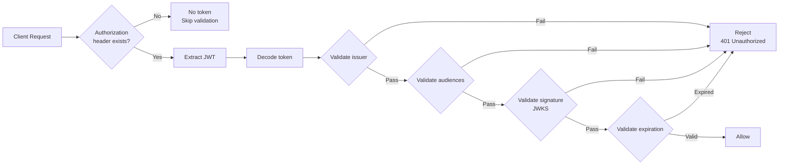
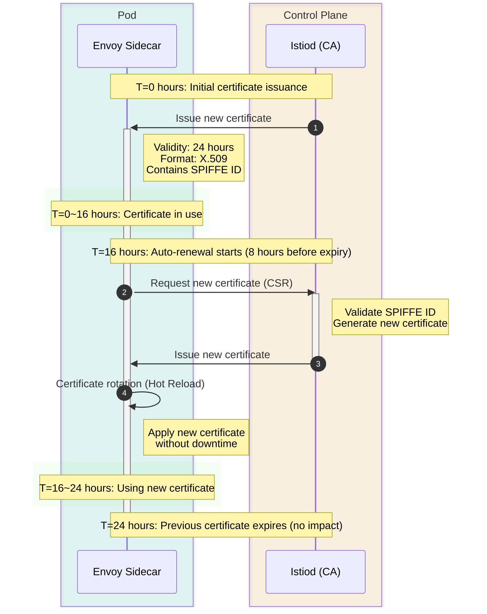

# Cuestionario de seguridad

> **Versión compatible**: Istio 1.28.0 **Versión de EKS**: 1.34 (Kubernetes 1.28+) **Última actualización**: February 23, 2026

Este cuestionario evalúa tu comprensión de las características de seguridad de Istio.

## Preguntas de opción múltiple (1-5)

### Pregunta 1: Modo PeerAuthentication

¿Qué afirmación describe correctamente el modo mTLS **PERMISSIVE** en PeerAuthentication?

A. Permite tanto tráfico mTLS como tráfico de texto sin formato B. Solo permite mTLS y rechaza el texto sin formato C. Rechaza todo el tráfico D. Deshabilita mTLS

<details>

<summary>Mostrar respuesta</summary>

**Respuesta: A**

El modo PERMISSIVE **permite tanto tráfico mTLS como tráfico de texto sin formato** para admitir una migración gradual.

**Explicación:**

**Modos mTLS de PeerAuthentication:**

| Modo           | Descripción                    | Caso de uso                          |
| -------------- | ------------------------------ | ------------------------------------ |
| **PERMISSIVE** | Permite mTLS + texto sin formato | Migración gradual, entornos mixtos |
| **STRICT**     | Solo permite mTLS              | Endurecimiento de seguridad de producción |
| **DISABLE**    | Deshabilita mTLS (solo texto sin formato) | Depuración, sistemas heredados |

**Ejemplo de modo PERMISSIVE:**

```yaml
apiVersion: security.istio.io/v1beta1
kind: PeerAuthentication
metadata:
  name: default
  namespace: istio-system
spec:
  mtls:
    mode: PERMISSIVE  # Allows both mTLS + plaintext
```

**Comportamiento:**

```
Client A (Istio Sidecar) -> [mTLS] -> Server (PERMISSIVE)  Allowed
Client B (No Sidecar)    -> [Plaintext] -> Server (PERMISSIVE)  Allowed
```

**Comparación con el modo STRICT:**

```yaml
apiVersion: security.istio.io/v1beta1
kind: PeerAuthentication
metadata:
  name: strict-mtls
  namespace: production
spec:
  mtls:
    mode: STRICT  # Only allows mTLS
```

```
Client A (Istio Sidecar) -> [mTLS] -> Server (STRICT)  Allowed
Client B (No Sidecar)    -> [Plaintext] -> Server (STRICT)  Rejected
```

**Estrategia de migración:**

```
Step 1: PERMISSIVE (Allow mixed traffic)
  |
Step 2: Inject Sidecars to all services
  |
Step 3: STRICT (Enforce mTLS)
```

**Referencia:**

* [PeerAuthentication](https://github.com/Atom-oh/kubernetes-docs/blob/main/en/service-mesh/istio/security/04-peer-authentication.md)
* [mTLS](../../../service-mesh/istio/security/01-mtls.md)

</details>

***

### Pregunta 2: Acción de AuthorizationPolicy

¿Qué significa la siguiente configuración de AuthorizationPolicy?

```yaml
apiVersion: security.istio.io/v1beta1
kind: AuthorizationPolicy
metadata:
  name: deny-all
spec:
  {}
```

A. Permite todas las solicitudes B. Deniega todas las solicitudes C. No aplica ninguna política D. Solo permite mTLS

<details>

<summary>Mostrar respuesta</summary>

**Respuesta: B**

Una AuthorizationPolicy con un spec vacío **deniega todas las solicitudes** (denegar de forma predeterminada).

**Explicación:**

**Comportamiento predeterminado de AuthorizationPolicy:**

1. **No existe ninguna política**: Se permiten todas las solicitudes
2. **Spec vacío (como el ejemplo)**: Se deniegan todas las solicitudes
3. **Tiene reglas**: Permite/deniega según las reglas

**Patrón de denegar de forma predeterminada:**

```yaml
# Step 1: Deny all requests
apiVersion: security.istio.io/v1beta1
kind: AuthorizationPolicy
metadata:
  name: deny-all
  namespace: default
spec: {}  # Empty spec = deny all requests

---
# Step 2: Selectively allow only what's needed
apiVersion: security.istio.io/v1beta1
kind: AuthorizationPolicy
metadata:
  name: allow-frontend
  namespace: default
spec:
  selector:
    matchLabels:
      app: backend
  action: ALLOW
  rules:
  - from:
    - source:
        principals: ["cluster.local/ns/default/sa/frontend"]
    to:
    - operation:
        methods: ["GET", "POST"]
```

**Tipos de acción de AuthorizationPolicy:**

| action     | Descripción           | Prioridad    |
| ---------- | --------------------- | ------------ |
| **DENY**   | Denegación explícita  | 1 (la más alta) |
| **ALLOW**  | Permiso explícito     | 2            |
| **AUDIT**  | Solo registrar        | 3            |
| **CUSTOM** | Servicio de autenticación externo | 4 |

**Orden de evaluación:**

```
1. Evaluate DENY policies -> If matched, immediately deny
   | (pass)
2. Evaluate ALLOW policies -> If matched, allow
   | (no match)
3. Default behavior
   - If any ALLOW policy exists -> Deny
   - If no ALLOW policy exists -> Allow
```

**Ejemplo práctico:**

```yaml
# Scenario: Restrict HTTP methods
---
# DENY: Prohibit DELETE
apiVersion: security.istio.io/v1beta1
kind: AuthorizationPolicy
metadata:
  name: deny-delete
spec:
  selector:
    matchLabels:
      app: backend
  action: DENY
  rules:
  - to:
    - operation:
        methods: ["DELETE"]

---
# ALLOW: Only allow GET, POST
apiVersion: security.istio.io/v1beta1
kind: AuthorizationPolicy
metadata:
  name: allow-read-write
spec:
  selector:
    matchLabels:
      app: backend
  action: ALLOW
  rules:
  - from:
    - source:
        principals: ["cluster.local/ns/default/sa/frontend"]
    to:
    - operation:
        methods: ["GET", "POST"]
```

**Prueba:**

```bash
# GET request -> Matches ALLOW policy -> Allowed
curl http://backend/api

# POST request -> Matches ALLOW policy -> Allowed
curl -X POST http://backend/api

# DELETE request -> Matches DENY policy -> Rejected
curl -X DELETE http://backend/api

# PUT request -> No ALLOW policy match -> Rejected
curl -X PUT http://backend/api
```

**Referencia:**

* [Política de autorización](https://github.com/Atom-oh/kubernetes-docs/blob/main/en/service-mesh/istio/security/02-authorization-policy.md)

</details>

***

### Pregunta 3: Autenticación JWT

¿Qué campos se utilizan para validar tokens JWT en RequestAuthentication?

A. issuer y audiences B. principals y namespaces C. methods y paths D. hosts y ports

<details>

<summary>Mostrar respuesta</summary>

**Respuesta: A**

RequestAuthentication utiliza los campos **issuer** y **audiences** para validar tokens JWT.

**Explicación:**

**Estructura del token JWT:**

```
Header.Payload.Signature

Payload example:
{
  "iss": "https://auth.example.com",        # issuer
  "sub": "user@example.com",                # subject
  "aud": ["api.example.com"],               # audiences
  "exp": 1735689600,                        # expiration
  "iat": 1735686000                         # issued at
}
```

**Configuración de RequestAuthentication:**

```yaml
apiVersion: security.istio.io/v1beta1
kind: RequestAuthentication
metadata:
  name: jwt-auth
  namespace: default
spec:
  selector:
    matchLabels:
      app: backend
  jwtRules:
  - issuer: "https://auth.example.com"      # Validate iss field
    jwksUri: "https://auth.example.com/.well-known/jwks.json"
    audiences:
    - "api.example.com"                     # Validate aud field
    forwardOriginalToken: true
```

**Proceso de validación de JWT:**



**Integración con proveedores OIDC:**

```yaml
# Google OAuth2 example
apiVersion: security.istio.io/v1beta1
kind: RequestAuthentication
metadata:
  name: google-jwt
spec:
  jwtRules:
  - issuer: "https://accounts.google.com"
    jwksUri: "https://www.googleapis.com/oauth2/v3/certs"
    audiences:
    - "123456789-abcdefg.apps.googleusercontent.com"

---
# Keycloak example
apiVersion: security.istio.io/v1beta1
kind: RequestAuthentication
metadata:
  name: keycloak-jwt
spec:
  jwtRules:
  - issuer: "https://keycloak.example.com/realms/myrealm"
    jwksUri: "https://keycloak.example.com/realms/myrealm/protocol/openid-connect/certs"
    audiences:
    - "myapp"
```

**Combinación con AuthorizationPolicy:**

```yaml
# 1. RequestAuthentication: Validate JWT
apiVersion: security.istio.io/v1beta1
kind: RequestAuthentication
metadata:
  name: jwt-auth
spec:
  selector:
    matchLabels:
      app: backend
  jwtRules:
  - issuer: "https://auth.example.com"
    jwksUri: "https://auth.example.com/.well-known/jwks.json"

---
# 2. AuthorizationPolicy: Only allow authenticated requests
apiVersion: security.istio.io/v1beta1
kind: AuthorizationPolicy
metadata:
  name: require-jwt
spec:
  selector:
    matchLabels:
      app: backend
  action: ALLOW
  rules:
  - from:
    - source:
        requestPrincipals: ["*"]  # Only requests with JWT
    to:
    - operation:
        methods: ["GET", "POST"]

---
# 3. AuthorizationPolicy: Only allow specific issuer
apiVersion: security.istio.io/v1beta1
kind: AuthorizationPolicy
metadata:
  name: require-specific-issuer
spec:
  selector:
    matchLabels:
      app: backend
  action: ALLOW
  rules:
  - from:
    - source:
        requestPrincipals: ["https://auth.example.com/*"]
```

**Prueba:**

```bash
# Request without JWT -> Passes RequestAuthentication, denied by AuthorizationPolicy
curl http://backend/api
# 401 Unauthorized

# Request with valid JWT
TOKEN="eyJhbGc..."
curl -H "Authorization: Bearer $TOKEN" http://backend/api
# 200 OK
```

**Referencia:**

* [Autenticación de solicitudes](https://github.com/Atom-oh/kubernetes-docs/blob/main/en/service-mesh/istio/security/03-request-authentication.md)

</details>

***

### Pregunta 4: Gestión de certificados mTLS

¿Cuál es el período de validez predeterminado de los certificados mTLS en Istio?

A. 1 hora B. 24 horas C. 7 días D. 90 días

<details>

<summary>Mostrar respuesta</summary>

**Respuesta: B**

El período de validez predeterminado de los certificados mTLS en Istio es de **24 horas**, y se renuevan automáticamente.

**Explicación:**

**Gestión de certificados de Istio:**

```yaml
# Istiod configuration (defaults)
apiVersion: install.istio.io/v1alpha1
kind: IstioOperator
spec:
  meshConfig:
    certificates:
    - secretName: dns.example-service-account
      dnsNames:
      - example.com
```

**Configuración predeterminada:**

* **Período de validez del certificado**: 24 horas (1 día)
* **Momento de renovación**: 8 horas antes de la expiración
* **Método de renovación**: Automático (administrado por Istiod)
* **Formato del certificado**: X.509

**Ciclo de vida del certificado:**



**Comprobación de certificados:**

```bash
# Check pod's mTLS certificate
istioctl proxy-config secret <pod-name> -o json

# Example output:
{
  "name": "default",
  "tlsCertificate": {
    "certificateChain": {
      "inlineBytes": "LS0tLS1CRU..."
    },
    "privateKey": {
      "inlineBytes": "LS0tLS1CRU..."
    }
  },
  "validationContext": {
    "trustedCa": {
      "inlineBytes": "LS0tLS1CRU..."
    }
  }
}

# Decode certificate contents
kubectl exec <pod-name> -c istio-proxy -- \
  openssl x509 -text -noout -in /etc/certs/cert-chain.pem

# Example output:
Certificate:
    Validity
        Not Before: Jan 20 00:00:00 2025 GMT
        Not After : Jan 21 00:00:00 2025 GMT  # 24 hours later
    Subject: O=cluster.local
    X509v3 Subject Alternative Name:
        URI:spiffe://cluster.local/ns/default/sa/myapp
```

**Personalización del período de validez:**

```yaml
apiVersion: install.istio.io/v1alpha1
kind: IstioOperator
spec:
  meshConfig:
    # Change certificate validity period
    defaultConfig:
      proxyMetadata:
        SECRET_TTL: "48h"  # Extend to 48 hours
```

**Escenarios de fallo de renovación de certificados:**

```bash
# Check Istiod logs
kubectl logs -n istio-system -l app=istiod

# Common issues:
# 1. Communication issues between Istiod and Envoy
# 2. RBAC permission issues
# 3. Blocked by network policies

# Manually trigger certificate renewal
kubectl delete pod <pod-name>  # Pod restart reissues certificate
```

**ID de SPIFFE:**

```
Istio's mTLS certificates follow the SPIFFE (Secure Production Identity Framework For Everyone) standard.

Format: spiffe://<trust-domain>/ns/<namespace>/sa/<service-account>
Example: spiffe://cluster.local/ns/default/sa/frontend
```

**Jerarquía de CA:**

```
Root CA (Istiod)
  +- Intermediate CA (auto-generated)
  |   +- frontend Pod certificate (24 hours)
  |   +- backend Pod certificate (24 hours)
  |   +- database Pod certificate (24 hours)
  +- ...
```

**Integración de CA externa:**

```yaml
# Using external CA with Cert-Manager
apiVersion: install.istio.io/v1alpha1
kind: IstioOperator
spec:
  components:
    pilot:
      k8s:
        env:
        - name: EXTERNAL_CA
          value: ISTIOD_RA_KUBERNETES_API
```

**Referencia:**

* [mTLS](../../../service-mesh/istio/security/01-mtls.md)
* [Gestión de certificados](../../../service-mesh/istio/03-architecture.md#certificate-management)

</details>

***

### Pregunta 5: Autenticación basada en Service Account

¿Qué identidad se utiliza para la autenticación de servicio a servicio en Istio?

A. Nombre de Pod B. Nombre de Service C. Service Account D. Nombre de Namespace

<details>

<summary>Mostrar respuesta</summary>

**Respuesta: C**

Istio administra la identidad de servicio a servicio basándose en **Service Account**.

**Explicación:**

**Identidad basada en Service Account:**

```yaml
# 1. Create Service Account
apiVersion: v1
kind: ServiceAccount
metadata:
  name: frontend
  namespace: default

---
# 2. Use Service Account in Deployment
apiVersion: apps/v1
kind: Deployment
metadata:
  name: frontend
spec:
  template:
    spec:
      serviceAccountName: frontend  # Used as identity
      containers:
      - name: frontend
        image: frontend:v1
```

**Formato de ID de SPIFFE:**

```
spiffe://<trust-domain>/ns/<namespace>/sa/<service-account>

Examples:
spiffe://cluster.local/ns/default/sa/frontend
spiffe://cluster.local/ns/production/sa/backend
```

**Uso de Service Account en AuthorizationPolicy:**

```yaml
apiVersion: security.istio.io/v1beta1
kind: AuthorizationPolicy
metadata:
  name: backend-policy
  namespace: default
spec:
  selector:
    matchLabels:
      app: backend
  action: ALLOW
  rules:
  # Only allow frontend Service Account
  - from:
    - source:
        principals:
        - "cluster.local/ns/default/sa/frontend"
    to:
    - operation:
        methods: ["GET", "POST"]
        paths: ["/api/*"]

  # admin Service Account allowed for all operations
  - from:
    - source:
        principals:
        - "cluster.local/ns/default/sa/admin"
```

**Service Account frente a nombre de Pod/Service:**

| Elemento             | Service Account         | Nombre de Pod       | Nombre de Service |
| -------------------- | ----------------------- | ------------------- | ----------------- |
| **Estabilidad**      | Estable                 | Cambia dinámicamente | Estable          |
| **Seguridad**        | Basada en certificados  | No confiable        | No confiable      |
| **Integración RBAC** | Kubernetes RBAC         | No es posible       | No es posible     |
| **mTLS**             | Incluido en el certificado | No incluido      | No incluido       |

**Ejemplo práctico: aplicación de 3 niveles:**

```yaml
# Frontend -> Backend only allowed
---
apiVersion: v1
kind: ServiceAccount
metadata:
  name: frontend
  namespace: app

---
apiVersion: v1
kind: ServiceAccount
metadata:
  name: backend
  namespace: app

---
apiVersion: v1
kind: ServiceAccount
metadata:
  name: database
  namespace: app

---
# Backend policy: Only allow Frontend access
apiVersion: security.istio.io/v1beta1
kind: AuthorizationPolicy
metadata:
  name: backend-policy
  namespace: app
spec:
  selector:
    matchLabels:
      app: backend
  action: ALLOW
  rules:
  - from:
    - source:
        principals: ["cluster.local/ns/app/sa/frontend"]

---
# Database policy: Only allow Backend access
apiVersion: security.istio.io/v1beta1
kind: AuthorizationPolicy
metadata:
  name: database-policy
  namespace: app
spec:
  selector:
    matchLabels:
      app: database
  action: ALLOW
  rules:
  - from:
    - source:
        principals: ["cluster.local/ns/app/sa/backend"]
```

**Comprobación de Service Account:**

```bash
# Check pod's Service Account
kubectl get pod <pod-name> -o jsonpath='{.spec.serviceAccountName}'

# Check SPIFFE ID in mTLS certificate
istioctl proxy-config secret <pod-name> -o json | \
  jq -r '.dynamicActiveSecrets[0].secret.tlsCertificate.certificateChain.inlineBytes' | \
  base64 -d | openssl x509 -text -noout | grep URI

# Output:
# URI:spiffe://cluster.local/ns/default/sa/frontend
```

**Comunicación entre Namespaces:**

```yaml
# Allow production namespace's frontend -> staging namespace's backend access
apiVersion: security.istio.io/v1beta1
kind: AuthorizationPolicy
metadata:
  name: backend-policy
  namespace: staging
spec:
  selector:
    matchLabels:
      app: backend
  action: ALLOW
  rules:
  - from:
    - source:
        principals:
        - "cluster.local/ns/production/sa/frontend"
        namespaces:
        - "production"
```

**Referencia:**

* [mTLS](../../../service-mesh/istio/security/01-mtls.md)
* [Política de autorización](https://github.com/Atom-oh/kubernetes-docs/blob/main/en/service-mesh/istio/security/02-authorization-policy.md)

</details>

***

## Preguntas de respuesta corta (6-10)

### Pregunta 6: Implementación de una política de seguridad de denegar de forma predeterminada

Explica paso a paso cómo implementar una política de seguridad de **denegar de forma predeterminada** usando Istio en un clúster de Kubernetes. Incluye los **recursos requeridos** (PeerAuthentication, AuthorizationPolicy) y métodos de **manejo de excepciones**.

<details>

<summary>Mostrar respuesta</summary>

**Respuesta:**

**Implementación de una política de seguridad de denegar de forma predeterminada:**

***

**Paso 1: Habilitar el modo mTLS STRICT**

Fuerza que toda la comunicación de servicio a servicio use mTLS:

```yaml
apiVersion: security.istio.io/v1beta1
kind: PeerAuthentication
metadata:
  name: default
  namespace: istio-system
spec:
  mtls:
    mode: STRICT  # Enforce mTLS
```

**Ámbito:**

* Implementado en el Namespace `istio-system` -> Se aplica a toda la malla
* Implementado en un Namespace específico -> Se aplica solo a ese Namespace
* Mediante selector -> Se aplica solo a cargas de trabajo específicas

***

**Paso 2: Denegar todo el tráfico (denegar de forma predeterminada)**

```yaml
apiVersion: security.istio.io/v1beta1
kind: AuthorizationPolicy
metadata:
  name: deny-all
  namespace: default
spec: {}  # Empty spec = deny all requests
```

**Después de esta política:**

* Se deniega todo el tráfico entrante
* Se bloquea la comunicación de servicio a servicio
* Se bloquea el acceso externo

***

**Paso 3: Permitir selectivamente la comunicación necesaria**

**Ejemplo 1: permitir comunicación de Frontend a Backend**

```yaml
apiVersion: security.istio.io/v1beta1
kind: AuthorizationPolicy
metadata:
  name: allow-frontend-to-backend
  namespace: default
spec:
  selector:
    matchLabels:
      app: backend  # Apply to Backend
  action: ALLOW
  rules:
  - from:
    - source:
        principals:
        - "cluster.local/ns/default/sa/frontend"  # Only allow Frontend
    to:
    - operation:
        methods: ["GET", "POST"]
        paths: ["/api/*"]
```

**Ejemplo 2: permitir comunicación de Backend a Database**

```yaml
apiVersion: security.istio.io/v1beta1
kind: AuthorizationPolicy
metadata:
  name: allow-backend-to-database
  namespace: default
spec:
  selector:
    matchLabels:
      app: database
  action: ALLOW
  rules:
  - from:
    - source:
        principals:
        - "cluster.local/ns/default/sa/backend"
    to:
    - operation:
        ports: ["5432"]  # PostgreSQL port
```

***

**Paso 4: Política de Ingress Gateway**

Se necesita una política para que Ingress Gateway permita tráfico externo:

```yaml
# Allow traffic to Ingress Gateway
apiVersion: security.istio.io/v1beta1
kind: AuthorizationPolicy
metadata:
  name: allow-ingress
  namespace: istio-system
spec:
  selector:
    matchLabels:
      istio: ingressgateway
  action: ALLOW
  rules:
  - to:
    - operation:
        ports: ["80", "443"]

---
# Allow Ingress Gateway -> Frontend
apiVersion: security.istio.io/v1beta1
kind: AuthorizationPolicy
metadata:
  name: allow-gateway-to-frontend
  namespace: default
spec:
  selector:
    matchLabels:
      app: frontend
  action: ALLOW
  rules:
  - from:
    - source:
        principals:
        - "cluster.local/ns/istio-system/sa/istio-ingressgateway-service-account"
```

***

**Paso 5: Excepciones de health check y Readiness Probe**

Gestiona las excepciones para que los health checks de Kubernetes no se bloqueen:

```yaml
apiVersion: security.istio.io/v1beta1
kind: AuthorizationPolicy
metadata:
  name: allow-health-checks
  namespace: default
spec:
  selector:
    matchLabels:
      app: backend
  action: ALLOW
  rules:
  # Allow Kubernetes health checks
  - to:
    - operation:
        paths: ["/health", "/ready"]
        methods: ["GET"]
```

O excluye puertos específicos en PeerAuthentication:

```yaml
apiVersion: security.istio.io/v1beta1
kind: PeerAuthentication
metadata:
  name: default
  namespace: default
spec:
  mtls:
    mode: STRICT
  portLevelMtls:
    8080:
      mode: DISABLE  # Disable mTLS for health check port
```

***

**Paso 6: Excepciones de monitorización y registro**

Permite que Prometheus recopile métricas:

```yaml
apiVersion: security.istio.io/v1beta1
kind: AuthorizationPolicy
metadata:
  name: allow-prometheus
  namespace: default
spec:
  action: ALLOW
  rules:
  - from:
    - source:
        namespaces: ["istio-system"]
        principals: ["cluster.local/ns/istio-system/sa/prometheus"]
    to:
    - operation:
        paths: ["/stats/prometheus"]
        methods: ["GET"]
```

***

**Ejemplo completo: aplicación de 3 niveles**

```yaml
# 1. mTLS STRICT
---
apiVersion: security.istio.io/v1beta1
kind: PeerAuthentication
metadata:
  name: default
  namespace: production
spec:
  mtls:
    mode: STRICT

# 2. Deny-by-default
---
apiVersion: security.istio.io/v1beta1
kind: AuthorizationPolicy
metadata:
  name: deny-all
  namespace: production
spec: {}

# 3. Ingress -> Frontend
---
apiVersion: security.istio.io/v1beta1
kind: AuthorizationPolicy
metadata:
  name: allow-ingress-to-frontend
  namespace: production
spec:
  selector:
    matchLabels:
      app: frontend
  action: ALLOW
  rules:
  - from:
    - source:
        principals: ["cluster.local/ns/istio-system/sa/istio-ingressgateway-service-account"]

# 4. Frontend -> Backend
---
apiVersion: security.istio.io/v1beta1
kind: AuthorizationPolicy
metadata:
  name: allow-frontend-to-backend
  namespace: production
spec:
  selector:
    matchLabels:
      app: backend
  action: ALLOW
  rules:
  - from:
    - source:
        principals: ["cluster.local/ns/production/sa/frontend"]
    to:
    - operation:
        methods: ["GET", "POST", "PUT", "DELETE"]
        paths: ["/api/*"]

# 5. Backend -> Database
---
apiVersion: security.istio.io/v1beta1
kind: AuthorizationPolicy
metadata:
  name: allow-backend-to-database
  namespace: production
spec:
  selector:
    matchLabels:
      app: database
  action: ALLOW
  rules:
  - from:
    - source:
        principals: ["cluster.local/ns/production/sa/backend"]

# 6. Health Checks
---
apiVersion: security.istio.io/v1beta1
kind: AuthorizationPolicy
metadata:
  name: allow-health-checks
  namespace: production
spec:
  action: ALLOW
  rules:
  - to:
    - operation:
        paths: ["/health", "/ready", "/live"]

# 7. Prometheus metrics
---
apiVersion: security.istio.io/v1beta1
kind: AuthorizationPolicy
metadata:
  name: allow-prometheus
  namespace: production
spec:
  action: ALLOW
  rules:
  - from:
    - source:
        namespaces: ["istio-system"]
    to:
    - operation:
        paths: ["/stats/prometheus"]
```

***

**Pruebas y validación:**

```bash
# 1. Frontend -> Backend (allowed)
kubectl exec -it <frontend-pod> -- curl http://backend/api
# 200 OK

# 2. Direct Database access (denied)
kubectl exec -it <frontend-pod> -- curl http://database:5432
# 403 RBAC: access denied

# 3. External direct Backend access (denied)
curl http://<ingress-gateway>/backend
# 403 RBAC: access denied

# 4. Normal path (allowed)
curl http://<ingress-gateway>/frontend
# 200 OK
```

***

**Prácticas recomendadas:**

1. **Aplicación gradual**:
   * Primero habilita mTLS en modo PERMISSIVE
   * Verifica que todos los servicios tengan Sidecars inyectados
   * Cambia al modo STRICT
   * Aplica la política de denegar de forma predeterminada
2. **Principio de mínimo privilegio**:
   * Permite solo la comunicación mínima necesaria
   * Restringe métodos HTTP (solo GET, solo POST, etc.)
   * Restringe paths (solo /api/\*, etc.)
3. **Manejo de excepciones**:
   * Gestiona siempre las excepciones de health check
   * Permite el acceso del sistema de monitorización
   * Configura la política de Ingress Gateway
4. **Pruebas**:
   * Prueba después de aplicar cada política
   * Comprueba los efectos secundarios (logs, métricas)
   * Prepara un plan de reversión

**Referencia:**

* [Política de autorización](https://github.com/Atom-oh/kubernetes-docs/blob/main/en/service-mesh/istio/security/02-authorization-policy.md)
* [PeerAuthentication](https://github.com/Atom-oh/kubernetes-docs/blob/main/en/service-mesh/istio/security/04-peer-authentication.md)

</details>

***

### Pregunta 7: Autenticación dual JWT + mTLS

Implementa un escenario donde la **autenticación de usuario final (JWT)** y la **autenticación de servicio a servicio (mTLS)** se utilicen juntas en Istio. Incluye cómo integrar proveedores OAuth2/OIDC (por ejemplo, Keycloak).

<details>

<summary>Mostrar respuesta</summary>

**Respuesta:**

**Arquitectura de autenticación dual JWT + mTLS:**

```
User
  | (JWT Token)
Ingress Gateway (Validate JWT with RequestAuthentication)
  | (mTLS)
Frontend (Validate mTLS with PeerAuthentication)
  | (mTLS)
Backend
```

***

**Paso 1: Configuración de Keycloak**

```bash
# Create Keycloak Realm
Realm: myrealm

# Create Client
Client ID: myapp
Access Type: confidential
Valid Redirect URIs: http://myapp.example.com/*

# Get JWKS URI
https://keycloak.example.com/realms/myrealm/protocol/openid-connect/certs
```

***

**Paso 2: Habilitar mTLS (autenticación de servicio a servicio)**

```yaml
# Apply STRICT mTLS to entire mesh
apiVersion: security.istio.io/v1beta1
kind: PeerAuthentication
metadata:
  name: default
  namespace: istio-system
spec:
  mtls:
    mode: STRICT
```

***

**Paso 3: Configurar autenticación JWT (autenticación de usuario final)**

```yaml
# Validate JWT at Ingress Gateway
apiVersion: security.istio.io/v1beta1
kind: RequestAuthentication
metadata:
  name: jwt-ingress
  namespace: istio-system
spec:
  selector:
    matchLabels:
      istio: ingressgateway
  jwtRules:
  - issuer: "https://keycloak.example.com/realms/myrealm"
    jwksUri: "https://keycloak.example.com/realms/myrealm/protocol/openid-connect/certs"
    audiences:
    - "myapp"
    forwardOriginalToken: true  # Forward JWT to backend
    outputPayloadToHeader: "x-jwt-payload"  # Extract payload to header
```

***

**Paso 4: Configurar AuthorizationPolicy**

**Política de Ingress Gateway**

```yaml
apiVersion: security.istio.io/v1beta1
kind: AuthorizationPolicy
metadata:
  name: ingress-jwt-policy
  namespace: istio-system
spec:
  selector:
    matchLabels:
      istio: ingressgateway
  action: ALLOW
  rules:
  # Only allow requests with JWT
  - from:
    - source:
        requestPrincipals: ["*"]
    to:
    - operation:
        paths: ["/api/*", "/app/*"]

  # Allow health checks without JWT
  - to:
    - operation:
        paths: ["/health", "/ready"]
```

**Política de Backend**

```yaml
apiVersion: security.istio.io/v1beta1
kind: AuthorizationPolicy
metadata:
  name: backend-jwt-mtls-policy
  namespace: default
spec:
  selector:
    matchLabels:
      app: backend
  action: ALLOW
  rules:
  # 1. mTLS: Only allow Frontend Service Account
  # 2. JWT: Must have valid JWT
  - from:
    - source:
        principals: ["cluster.local/ns/default/sa/frontend"]
        requestPrincipals: ["https://keycloak.example.com/realms/myrealm/*"]
    to:
    - operation:
        methods: ["GET", "POST"]
```

***

**Paso 5: Control de acceso basado en roles**

Autorización detallada basada en claims de JWT:

```yaml
apiVersion: security.istio.io/v1beta1
kind: AuthorizationPolicy
metadata:
  name: backend-rbac
  namespace: default
spec:
  selector:
    matchLabels:
      app: backend
  action: ALLOW
  rules:
  # Only Admin role allowed for DELETE
  - from:
    - source:
        principals: ["cluster.local/ns/default/sa/frontend"]
        requestPrincipals: ["*"]
    when:
    - key: request.auth.claims[roles]
      values: ["admin"]
    to:
    - operation:
        methods: ["DELETE"]
        paths: ["/api/admin/*"]

  # User role only allowed GET, POST
  - from:
    - source:
        principals: ["cluster.local/ns/default/sa/frontend"]
        requestPrincipals: ["*"]
    when:
    - key: request.auth.claims[roles]
      values: ["user"]
    to:
    - operation:
        methods: ["GET", "POST"]
        paths: ["/api/users/*"]
```

***

**Paso 6: Utilizar la carga útil de JWT**

Usa la carga útil de JWT en Backend:

```yaml
# EnvoyFilter to pass JWT claims as headers
apiVersion: networking.istio.io/v1alpha3
kind: EnvoyFilter
metadata:
  name: jwt-claim-to-header
  namespace: istio-system
spec:
  workloadSelector:
    labels:
      istio: ingressgateway
  configPatches:
  - applyTo: HTTP_FILTER
    match:
      context: GATEWAY
      listener:
        filterChain:
          filter:
            name: "envoy.filters.network.http_connection_manager"
            subFilter:
              name: "envoy.filters.http.jwt_authn"
    patch:
      operation: INSERT_AFTER
      value:
        name: envoy.lua
        typed_config:
          "@type": type.googleapis.com/envoy.extensions.filters.http.lua.v3.Lua
          inline_code: |
            function envoy_on_request(request_handle)
              local payload = request_handle:headers():get("x-jwt-payload")
              if payload then
                -- Base64 decode and JSON parse
                local json = require("json")
                local decoded = json.decode(payload)

                -- Pass user info as headers
                request_handle:headers():add("x-user-id", decoded.sub)
                request_handle:headers():add("x-user-email", decoded.email)
                request_handle:headers():add("x-user-roles", table.concat(decoded.roles, ","))
              end
            end
```

***

**Paso 7: Ejemplo completo**

**Ingress Gateway**

```yaml
---
# JWT validation
apiVersion: security.istio.io/v1beta1
kind: RequestAuthentication
metadata:
  name: jwt-ingress
  namespace: istio-system
spec:
  selector:
    matchLabels:
      istio: ingressgateway
  jwtRules:
  - issuer: "https://keycloak.example.com/realms/myrealm"
    jwksUri: "https://keycloak.example.com/realms/myrealm/protocol/openid-connect/certs"
    audiences: ["myapp"]
    forwardOriginalToken: true

---
# Require JWT
apiVersion: security.istio.io/v1beta1
kind: AuthorizationPolicy
metadata:
  name: require-jwt
  namespace: istio-system
spec:
  selector:
    matchLabels:
      istio: ingressgateway
  action: ALLOW
  rules:
  - from:
    - source:
        requestPrincipals: ["*"]
```

**Frontend**

```yaml
---
# mTLS STRICT
apiVersion: security.istio.io/v1beta1
kind: PeerAuthentication
metadata:
  name: frontend-mtls
  namespace: default
spec:
  selector:
    matchLabels:
      app: frontend
  mtls:
    mode: STRICT

---
# Only allow Ingress Gateway access
apiVersion: security.istio.io/v1beta1
kind: AuthorizationPolicy
metadata:
  name: frontend-policy
  namespace: default
spec:
  selector:
    matchLabels:
      app: frontend
  action: ALLOW
  rules:
  - from:
    - source:
        principals: ["cluster.local/ns/istio-system/sa/istio-ingressgateway-service-account"]
        requestPrincipals: ["*"]
```

**Backend**

```yaml
---
# mTLS STRICT
apiVersion: security.istio.io/v1beta1
kind: PeerAuthentication
metadata:
  name: backend-mtls
  namespace: default
spec:
  selector:
    matchLabels:
      app: backend
  mtls:
    mode: STRICT

---
# Only allow Frontend access + Require JWT
apiVersion: security.istio.io/v1beta1
kind: AuthorizationPolicy
metadata:
  name: backend-policy
  namespace: default
spec:
  selector:
    matchLabels:
      app: backend
  action: ALLOW
  rules:
  - from:
    - source:
        principals: ["cluster.local/ns/default/sa/frontend"]
        requestPrincipals: ["https://keycloak.example.com/realms/myrealm/*"]
```

***

**Prueba:**

```bash
# 1. Get token from Keycloak
TOKEN=$(curl -X POST \
  "https://keycloak.example.com/realms/myrealm/protocol/openid-connect/token" \
  -d "client_id=myapp" \
  -d "client_secret=<secret>" \
  -d "grant_type=password" \
  -d "username=user@example.com" \
  -d "password=password123" \
  | jq -r '.access_token')

# 2. Call API with JWT
curl -H "Authorization: Bearer $TOKEN" \
  http://myapp.example.com/api/users

# 3. Call without JWT (fails)
curl http://myapp.example.com/api/users
# 401 Unauthorized

# 4. Invalid JWT (fails)
curl -H "Authorization: Bearer invalid-token" \
  http://myapp.example.com/api/users
# 401 Unauthorized
```

***

**Beneficios de seguridad:**

1. **Autenticación dual**:
   * JWT: verifica la identidad del usuario final
   * mTLS: verifica la identidad del servicio
2. **Defensa en profundidad**:
   * Validación JWT en Gateway
   * Comunicación cifrada con mTLS entre servicios
   * Autorización detallada con AuthorizationPolicy
3. **Control de acceso basado en roles (RBAC)**:
   * Gestión de autorización basada en claims de JWT
   * Actualizaciones dinámicas de permisos (administradas en Keycloak)

**Referencia:**

* [Autenticación de solicitudes](https://github.com/Atom-oh/kubernetes-docs/blob/main/en/service-mesh/istio/security/03-request-authentication.md)
* [mTLS](../../../service-mesh/istio/security/01-mtls.md)

</details>

***

### Pregunta 8: Control de acceso a servicios externos

Explica cómo controlar el tráfico de **Egress** en Istio para permitir acceso solo a servicios externos específicos. Incluye ejemplos completos con **ServiceEntry**, **VirtualService** y **AuthorizationPolicy**.

<details>

<summary>Mostrar respuesta</summary>

**Respuesta:**

**Estrategia de control de tráfico de Egress:**

***

**Paso 1: Comprobar el modo predeterminado de tráfico de Egress**

Istio admite dos modos de egress:

```yaml
apiVersion: install.istio.io/v1alpha1
kind: IstioOperator
spec:
  meshConfig:
    outboundTrafficPolicy:
      mode: REGISTRY_ONLY  # or ALLOW_ANY
```

**Comparación de modos:**

| Modo               | Descripción                                    | Seguridad |
| ------------------ | ---------------------------------------------- | --------- |
| **ALLOW\_ANY**     | Permite todo el tráfico externo (predeterminado) | Baja      |
| **REGISTRY\_ONLY** | Solo permite servicios registrados en ServiceEntry | Alta   |

**Cambiar al modo REGISTRY\_ONLY:**

```bash
istioctl install --set meshConfig.outboundTrafficPolicy.mode=REGISTRY_ONLY
```

***

**Paso 2: Registrar servicios externos con ServiceEntry**

**Ejemplo 1: API HTTPS (GitHub)**

```yaml
apiVersion: networking.istio.io/v1beta1
kind: ServiceEntry
metadata:
  name: github-api
  namespace: default
spec:
  hosts:
  - api.github.com
  ports:
  - number: 443
    name: https
    protocol: HTTPS
  location: MESH_EXTERNAL
  resolution: DNS
```

**Ejemplo 2: API HTTP (httpbin)**

```yaml
apiVersion: networking.istio.io/v1beta1
kind: ServiceEntry
metadata:
  name: httpbin-ext
  namespace: default
spec:
  hosts:
  - httpbin.org
  ports:
  - number: 80
    name: http
    protocol: HTTP
  - number: 443
    name: https
    protocol: HTTPS
  location: MESH_EXTERNAL
  resolution: DNS
```

**Ejemplo 3: dirección IP específica**

```yaml
apiVersion: networking.istio.io/v1beta1
kind: ServiceEntry
metadata:
  name: external-database
  namespace: default
spec:
  hosts:
  - database.external.com
  addresses:
  - 203.0.113.10  # Specific IP
  ports:
  - number: 5432
    name: postgres
    protocol: TCP
  location: MESH_EXTERNAL
  resolution: STATIC
  endpoints:
  - address: 203.0.113.10
```

***

**Paso 3: Controlar el tráfico con VirtualService**

**Configuración de timeout y reintento**

```yaml
apiVersion: networking.istio.io/v1beta1
kind: VirtualService
metadata:
  name: github-api-vs
  namespace: default
spec:
  hosts:
  - api.github.com
  http:
  - timeout: 10s
    retries:
      attempts: 3
      perTryTimeout: 3s
      retryOn: 5xx,reset,connect-failure
    route:
    - destination:
        host: api.github.com
```

**Agregar headers (API Key)**

```yaml
apiVersion: networking.istio.io/v1beta1
kind: VirtualService
metadata:
  name: external-api-vs
  namespace: default
spec:
  hosts:
  - api.example.com
  http:
  - headers:
      request:
        add:
          X-API-Key: "my-secret-key"
    route:
    - destination:
        host: api.example.com
```

***

**Paso 4: Control de acceso con AuthorizationPolicy**

**Permitir solo Service Account específica**

```yaml
apiVersion: security.istio.io/v1beta1
kind: AuthorizationPolicy
metadata:
  name: allow-github-api
  namespace: default
spec:
  action: ALLOW
  rules:
  # Only allow Backend Service Account to access GitHub API
  - from:
    - source:
        principals: ["cluster.local/ns/default/sa/backend"]
    to:
    - operation:
        hosts: ["api.github.com"]
```

**Permitir solo paths específicos**

```yaml
apiVersion: security.istio.io/v1beta1
kind: AuthorizationPolicy
metadata:
  name: allow-specific-api
  namespace: default
spec:
  action: ALLOW
  rules:
  - from:
    - source:
        principals: ["cluster.local/ns/default/sa/backend"]
    to:
    - operation:
        hosts: ["api.example.com"]
        paths: ["/v1/data", "/v1/status"]
        methods: ["GET"]
```

***

**Paso 5: Uso de Egress Gateway (opcional)**

Control centralizado de egress:

```yaml
# Deploy Egress Gateway
apiVersion: install.istio.io/v1alpha1
kind: IstioOperator
spec:
  components:
    egressGateways:
    - name: istio-egressgateway
      enabled: true
      k8s:
        replicas: 2

---
# Define Gateway
apiVersion: networking.istio.io/v1beta1
kind: Gateway
metadata:
  name: egress-gateway
  namespace: default
spec:
  selector:
    istio: egressgateway
  servers:
  - port:
      number: 443
      name: https
      protocol: HTTPS
    hosts:
    - api.github.com
    tls:
      mode: PASSTHROUGH  # Pass TLS traffic through

---
# DestinationRule
apiVersion: networking.istio.io/v1beta1
kind: DestinationRule
metadata:
  name: egress-gateway-dr
  namespace: default
spec:
  host: istio-egressgateway.istio-system.svc.cluster.local
  subsets:
  - name: github

---
# VirtualService: Pod -> Egress Gateway
apiVersion: networking.istio.io/v1beta1
kind: VirtualService
metadata:
  name: github-through-egress
  namespace: default
spec:
  hosts:
  - api.github.com
  gateways:
  - mesh  # From Sidecar
  - egress-gateway
  http:
  - match:
    - gateways:
      - mesh  # Starting from Pod
      port: 443
    route:
    - destination:
        host: istio-egressgateway.istio-system.svc.cluster.local
        subset: github
        port:
          number: 443
  - match:
    - gateways:
      - egress-gateway  # From Egress Gateway
      port: 443
    route:
    - destination:
        host: api.github.com
        port:
          number: 443
```

**Flujo de tráfico:**

```
Pod -> Sidecar -> Egress Gateway -> External Service
```

***

**Paso 6: Ejemplo completo**

**Escenario**: permitir únicamente que el servicio Backend acceda a la API de GitHub

```yaml
# 1. Set REGISTRY_ONLY mode
---
apiVersion: v1
kind: ConfigMap
metadata:
  name: istio
  namespace: istio-system
data:
  mesh: |
    outboundTrafficPolicy:
      mode: REGISTRY_ONLY

# 2. GitHub API ServiceEntry
---
apiVersion: networking.istio.io/v1beta1
kind: ServiceEntry
metadata:
  name: github-api
  namespace: default
spec:
  hosts:
  - api.github.com
  ports:
  - number: 443
    name: https
    protocol: HTTPS
  location: MESH_EXTERNAL
  resolution: DNS

# 3. VirtualService: Timeout and retry
---
apiVersion: networking.istio.io/v1beta1
kind: VirtualService
metadata:
  name: github-api-vs
  namespace: default
spec:
  hosts:
  - api.github.com
  http:
  - timeout: 30s
    retries:
      attempts: 3
      perTryTimeout: 10s
      retryOn: 5xx,reset,connect-failure
    route:
    - destination:
        host: api.github.com
        port:
          number: 443

# 4. AuthorizationPolicy: Only allow Backend
---
apiVersion: security.istio.io/v1beta1
kind: AuthorizationPolicy
metadata:
  name: allow-backend-github
  namespace: default
spec:
  action: ALLOW
  rules:
  - from:
    - source:
        principals: ["cluster.local/ns/default/sa/backend"]
    to:
    - operation:
        hosts: ["api.github.com"]
        methods: ["GET", "POST"]

# 5. Deny-by-default (block all other egress)
---
apiVersion: security.istio.io/v1beta1
kind: AuthorizationPolicy
metadata:
  name: deny-all-egress
  namespace: default
spec:
  action: DENY
  rules:
  - to:
    - operation:
        hosts: ["*"]
```

***

**Prueba:**

```bash
# 1. Call GitHub API from Backend (allowed)
kubectl exec -it <backend-pod> -- \
  curl -I https://api.github.com/users/octocat
# 200 OK

# 2. Call GitHub API from Frontend (denied)
kubectl exec -it <frontend-pod> -- \
  curl -I https://api.github.com/users/octocat
# Connection refused

# 3. Call other external service from Backend (denied)
kubectl exec -it <backend-pod> -- \
  curl -I https://google.com
# Connection refused (No ServiceEntry)
```

***

**Monitorización:**

```bash
# Check egress traffic
kubectl exec -it <backend-pod> -c istio-proxy -- \
  curl localhost:15000/stats/prometheus | grep upstream_cx_total

# Check ServiceEntry
istioctl proxy-config clusters <backend-pod> | grep github
```

***

**Beneficios de seguridad:**

1. **Enfoque de lista blanca**: permite acceso solo a servicios registrados en ServiceEntry
2. **Control basado en Service Account**: solo servicios específicos pueden llamar a API externas
3. **Auditoría y registro**: se puede registrar todo el tráfico de egress
4. **Gestión centralizada**: monitoriza todo el tráfico externo mediante Egress Gateway

**Referencia:**

* [ServiceEntry](https://istio.io/latest/docs/reference/config/networking/service-entry/)
* [Tráfico de Egress](https://istio.io/latest/docs/tasks/traffic-management/egress/)

</details>

***

### Pregunta 9: Auditoría y registro de seguridad

Explica cómo **auditar** y registrar eventos relacionados con la seguridad en Istio. Incluye la acción **AUDIT de AuthorizationPolicy** y la configuración de **Access Log**.

<details>

<summary>Mostrar respuesta</summary>

**Respuesta:**

**Estrategia de auditoría y registro de seguridad de Istio:**

***

**1. Acción AUDIT de AuthorizationPolicy**

La acción AUDIT registra el tráfico sin bloquearlo.

**Política AUDIT básica**

```yaml
apiVersion: security.istio.io/v1beta1
kind: AuthorizationPolicy
metadata:
  name: audit-all-requests
  namespace: default
spec:
  selector:
    matchLabels:
      app: backend
  action: AUDIT
  rules:
  - {}  # Audit all requests
```

**Auditar solo condiciones específicas**

```yaml
apiVersion: security.istio.io/v1beta1
kind: AuthorizationPolicy
metadata:
  name: audit-sensitive-operations
  namespace: default
spec:
  selector:
    matchLabels:
      app: backend
  action: AUDIT
  rules:
  # Audit DELETE operations
  - to:
    - operation:
        methods: ["DELETE"]

  # Audit Admin API access
  - to:
    - operation:
        paths: ["/api/admin/*"]

  # Audit external IP access
  - from:
    - source:
        notNamespaces: ["default", "production"]
```

***

**2. Habilitar Access Logging**

**Habilitar Access Logging para toda la malla**

```yaml
apiVersion: install.istio.io/v1alpha1
kind: IstioOperator
spec:
  meshConfig:
    accessLogFile: /dev/stdout
    accessLogEncoding: JSON
    accessLogFormat: |
      {
        "start_time": "%START_TIME%",
        "method": "%REQ(:METHOD)%",
        "path": "%REQ(X-ENVOY-ORIGINAL-PATH?:PATH)%",
        "protocol": "%PROTOCOL%",
        "response_code": "%RESPONSE_CODE%",
        "response_flags": "%RESPONSE_FLAGS%",
        "bytes_received": "%BYTES_RECEIVED%",
        "bytes_sent": "%BYTES_SENT%",
        "duration": "%DURATION%",
        "upstream_service_time": "%RESP(X-ENVOY-UPSTREAM-SERVICE-TIME)%",
        "x_forwarded_for": "%REQ(X-FORWARDED-FOR)%",
        "user_agent": "%REQ(USER-AGENT)%",
        "request_id": "%REQ(X-REQUEST-ID)%",
        "authority": "%REQ(:AUTHORITY)%",
        "upstream_host": "%UPSTREAM_HOST%",
        "upstream_cluster": "%UPSTREAM_CLUSTER%",
        "upstream_local_address": "%UPSTREAM_LOCAL_ADDRESS%",
        "downstream_local_address": "%DOWNSTREAM_LOCAL_ADDRESS%",
        "downstream_remote_address": "%DOWNSTREAM_REMOTE_ADDRESS%",
        "requested_server_name": "%REQUESTED_SERVER_NAME%",
        "route_name": "%ROUTE_NAME%"
      }
```

**Aplicar solo a un Namespace específico**

```yaml
apiVersion: telemetry.istio.io/v1alpha1
kind: Telemetry
metadata:
  name: access-logging
  namespace: production
spec:
  accessLogging:
  - providers:
    - name: envoy
```

***

**3. Filtros de log personalizados para auditoría de seguridad**

**Incluir información de mTLS**

```yaml
apiVersion: install.istio.io/v1alpha1
kind: IstioOperator
spec:
  meshConfig:
    accessLogFile: /dev/stdout
    accessLogFormat: |
      [%START_TIME%] "%REQ(:METHOD)% %REQ(X-ENVOY-ORIGINAL-PATH?:PATH)% %PROTOCOL%"
      %RESPONSE_CODE% %RESPONSE_FLAGS%
      %BYTES_RECEIVED% %BYTES_SENT% %DURATION%
      "%REQ(X-FORWARDED-FOR)%" "%REQ(USER-AGENT)%"
      "%REQ(X-REQUEST-ID)%" "%REQ(:AUTHORITY)%"
      "%UPSTREAM_HOST%" "%DOWNSTREAM_REMOTE_ADDRESS%"
      mtls=%DOWNSTREAM_PEER_ISSUER% peer=%DOWNSTREAM_PEER_URI_SAN%
```

**Incluir información de autorización**

```yaml
apiVersion: telemetry.istio.io/v1alpha1
kind: Telemetry
metadata:
  name: security-audit-logging
  namespace: default
spec:
  accessLogging:
  - providers:
    - name: envoy
    filter:
      expression: response.code >= 400  # Log only errors
```

***

**4. Integración con sistemas de registro externos**

**Enviar a CloudWatch con FluentBit**

```yaml
apiVersion: v1
kind: ConfigMap
metadata:
  name: fluent-bit-config
  namespace: istio-system
data:
  fluent-bit.conf: |
    [SERVICE]
        Flush         5
        Log_Level     info

    [INPUT]
        Name              tail
        Path              /var/log/containers/*istio-proxy*.log
        Parser            docker
        Tag               istio.proxy
        Refresh_Interval  5

    [FILTER]
        Name    parser
        Match   istio.proxy
        Parser  istio-access-log

    [OUTPUT]
        Name cloudwatch_logs
        Match   istio.proxy
        region  us-east-1
        log_group_name  /aws/eks/istio/access-logs
        log_stream_prefix proxy-
        auto_create_group true
```

**Integración con Elasticsearch**

```yaml
apiVersion: telemetry.istio.io/v1alpha1
kind: Telemetry
metadata:
  name: elasticsearch-logging
  namespace: default
spec:
  accessLogging:
  - providers:
    - name: envoy
    filter:
      expression: |
        response.code >= 400 ||
        request.headers['x-audit'] == 'true'
```

***

**5. Configuración completa de auditoría de seguridad**

```yaml
# 1. AUDIT Policy: Audit sensitive operations
---
apiVersion: security.istio.io/v1beta1
kind: AuthorizationPolicy
metadata:
  name: audit-sensitive
  namespace: production
spec:
  selector:
    matchLabels:
      app: backend
  action: AUDIT
  rules:
  # DELETE operations
  - to:
    - operation:
        methods: ["DELETE"]

  # Admin API
  - to:
    - operation:
        paths: ["/api/admin/*"]

  # Access from outside production
  - from:
    - source:
        notNamespaces: ["production"]

# 2. DENY Policy: Actually block
---
apiVersion: security.istio.io/v1beta1
kind: AuthorizationPolicy
metadata:
  name: deny-unauthorized
  namespace: production
spec:
  selector:
    matchLabels:
      app: backend
  action: DENY
  rules:
  # Block admin access from outside production
  - from:
    - source:
        notNamespaces: ["production"]
    to:
    - operation:
        paths: ["/api/admin/*"]

# 3. Access Logging: JSON format
---
apiVersion: telemetry.istio.io/v1alpha1
kind: Telemetry
metadata:
  name: security-logging
  namespace: production
spec:
  accessLogging:
  - providers:
    - name: envoy
    filter:
      expression: |
        response.code >= 400 ||
        request.method == "DELETE" ||
        request.url_path.startsWith("/api/admin")
```

***

**6. Consultas de análisis de logs**

**Consultas de Prometheus**

```promql
# Authorization deny count
sum(rate(
  envoy_http_rbac_denied_total[5m]
)) by (namespace, pod)

# AUDIT action trigger count
sum(rate(
  envoy_http_rbac_logged_total[5m]
)) by (namespace, pod)

# 403 Forbidden responses
sum(rate(
  istio_requests_total{
    response_code="403"
  }[5m]
)) by (destination_service_name)
```

**Consultas de CloudWatch Insights**

```sql
# Audit DELETE operations
fields @timestamp, method, path, response_code, downstream_remote_address
| filter method = "DELETE"
| sort @timestamp desc
| limit 100

# Admin API access
fields @timestamp, path, response_code, downstream_remote_address, user_agent
| filter path like /api/admin/
| sort @timestamp desc

# Failed Authorization
fields @timestamp, path, response_code, response_flags
| filter response_code = 403
| stats count() by bin(5m)
```

***

**7. Panel de Grafana**

```yaml
# Panel 1: Authorization deny rate
rate(envoy_http_rbac_denied_total[5m])

# Panel 2: AUDIT log trend
rate(envoy_http_rbac_logged_total[5m])

# Panel 3: 403 response distribution
sum by (destination_service_name) (
  rate(istio_requests_total{response_code="403"}[5m])
)

# Panel 4: Sensitive operations (DELETE)
sum by (destination_service_name) (
  rate(istio_requests_total{request_method="DELETE"}[5m])
)
```

***

**8. Configuración de alertas**

```yaml
# PrometheusRule
apiVersion: monitoring.coreos.com/v1
kind: PrometheusRule
metadata:
  name: istio-security-alerts
  namespace: monitoring
spec:
  groups:
  - name: istio-security
    interval: 30s
    rules:
    # High Authorization deny rate
    - alert: HighAuthorizationDenyRate
      expr: |
        sum(rate(envoy_http_rbac_denied_total[5m])) by (namespace)
        > 10
      for: 5m
      labels:
        severity: warning
      annotations:
        summary: "High authorization deny rate in {{ $labels.namespace }}"
        description: "{{ $value }} denials per second"

    # Unauthorized Admin API access attempt
    - alert: UnauthorizedAdminAccess
      expr: |
        sum(rate(istio_requests_total{
          request_url_path=~"/api/admin/.*",
          response_code="403"
        }[5m])) > 0
      for: 1m
      labels:
        severity: critical
      annotations:
        summary: "Unauthorized admin API access attempt"
```

***

**Prácticas recomendadas:**

1. **AUDIT primero, DENY después**:
   * Inicia las políticas nuevas con AUDIT
   * Analiza los logs y después cambia a DENY
2. **Registro selectivo**:
   * Registrar todo el tráfico aumenta los costes
   * Registra solo las operaciones sensibles
3. **Retención de logs**:
   * Auditoría de seguridad: mínimo 90 días
   * Cumplimiento: 1 año o más
4. **Alertas en tiempo real**:
   * Alertas inmediatas para intentos de acceso no autorizados
   * Detecta patrones anómalos

**Referencia:**

* [Política de autorización](https://github.com/Atom-oh/kubernetes-docs/blob/main/en/service-mesh/istio/security/02-authorization-policy.md)
* [Access Logging](../../../service-mesh/istio/observability/03-logging.md)

</details>

***

### Pregunta 10: Implementación de una red Zero Trust

Explica cómo implementar principios de **Zero Trust Network** usando Istio. Incluye ejemplos completos que apliquen los principios de **mTLS STRICT**, **denegar de forma predeterminada** y **mínimo privilegio**.

<details>

<summary>Mostrar respuesta</summary>

**Respuesta:**

**Principios de Zero Trust Network:**

1. **Nunca confíes, verifica siempre**: verifica toda la comunicación
2. **Mínimo privilegio**: concede solo los permisos mínimos necesarios
3. **Asume una vulneración**: diseña asumiendo una situación de compromiso

***

**Arquitectura Zero Trust de Istio:**

```yaml
# 1. mTLS STRICT (Only encrypted communication allowed)
# 2. Deny-by-default (Deny all traffic by default)
# 3. Explicit Allow (Explicitly allow required communication only)
# 4. Identity-based (Based on Service Account)
# 5. Fine-grained (Path/method level control)
```

***

**Paso 1: Modo mTLS STRICT**

Cifra toda la comunicación de servicio a servicio:

```yaml
apiVersion: security.istio.io/v1beta1
kind: PeerAuthentication
metadata:
  name: default
  namespace: istio-system
spec:
  mtls:
    mode: STRICT
```

**Validación:**

```bash
# Check mTLS status
istioctl authn tls-check <pod-name>.<namespace>

# Output:
# HOST:PORT                            STATUS     SERVER     CLIENT     AUTHN POLICY
# backend.default.svc.cluster.local    OK         mTLS       mTLS       default/default
```

***

**Paso 2: Política de denegar de forma predeterminada**

**Política global de denegación**

```yaml
# Apply to all Namespaces
---
apiVersion: security.istio.io/v1beta1
kind: AuthorizationPolicy
metadata:
  name: deny-all
  namespace: default
spec: {}

---
apiVersion: security.istio.io/v1beta1
kind: AuthorizationPolicy
metadata:
  name: deny-all
  namespace: production
spec: {}
```

***

**Paso 3: Mínimo privilegio**

**Escenario: aplicación web de 3 niveles**

```
User -> Ingress Gateway -> Frontend -> Backend -> Database
```

**Crear Service Accounts**

```yaml
---
apiVersion: v1
kind: ServiceAccount
metadata:
  name: frontend
  namespace: app

---
apiVersion: v1
kind: ServiceAccount
metadata:
  name: backend
  namespace: app

---
apiVersion: v1
kind: ServiceAccount
metadata:
  name: database
  namespace: app
```

**Ingress Gateway -> Frontend**

```yaml
apiVersion: security.istio.io/v1beta1
kind: AuthorizationPolicy
metadata:
  name: allow-ingress-to-frontend
  namespace: app
spec:
  selector:
    matchLabels:
      app: frontend
  action: ALLOW
  rules:
  - from:
    - source:
        principals:
        - "cluster.local/ns/istio-system/sa/istio-ingressgateway-service-account"
```

**Frontend -> Backend**

```yaml
apiVersion: security.istio.io/v1beta1
kind: AuthorizationPolicy
metadata:
  name: allow-frontend-to-backend
  namespace: app
spec:
  selector:
    matchLabels:
      app: backend
  action: ALLOW
  rules:
  - from:
    - source:
        principals:
        - "cluster.local/ns/app/sa/frontend"
    to:
    - operation:
        methods: ["GET", "POST", "PUT"]  # Exclude DELETE
        paths: ["/api/v1/*"]  # Only v1 API
        ports: ["8080"]  # Specific port only
```

**Backend -> Database**

```yaml
apiVersion: security.istio.io/v1beta1
kind: AuthorizationPolicy
metadata:
  name: allow-backend-to-database
  namespace: app
spec:
  selector:
    matchLabels:
      app: database
  action: ALLOW
  rules:
  - from:
    - source:
        principals:
        - "cluster.local/ns/app/sa/backend"
    to:
    - operation:
        ports: ["5432"]  # PostgreSQL only
```

***

**Paso 4: Aislamiento de Namespace**

Bloquea el acceso desde otros Namespaces:

```yaml
# Block Production -> Staging
apiVersion: security.istio.io/v1beta1
kind: AuthorizationPolicy
metadata:
  name: deny-cross-namespace
  namespace: production
spec:
  action: DENY
  rules:
  - from:
    - source:
        notNamespaces: ["production", "istio-system"]
```

***

**Paso 5: Control de acceso basado en tiempo**

Implementa control basado en tiempo con EnvoyFilter:

```yaml
apiVersion: networking.istio.io/v1alpha3
kind: EnvoyFilter
metadata:
  name: time-based-access
  namespace: app
spec:
  workloadSelector:
    labels:
      app: backend
  configPatches:
  - applyTo: HTTP_FILTER
    match:
      context: SIDECAR_INBOUND
    patch:
      operation: INSERT_BEFORE
      value:
        name: envoy.filters.http.lua
        typed_config:
          "@type": type.googleapis.com/envoy.extensions.filters.http.lua.v3.Lua
          inline_code: |
            function envoy_on_request(request_handle)
              local hour = tonumber(os.date("%H"))
              -- Allow only business hours (9AM-6PM)
              if hour < 9 or hour >= 18 then
                request_handle:respond(
                  {[":status"] = "403"},
                  "Access denied outside business hours"
                )
              end
            end
```

***

**Paso 6: Control de tráfico de Egress**

Restringe el acceso a servicios externos:

```yaml
# REGISTRY_ONLY mode
apiVersion: install.istio.io/v1alpha1
kind: IstioOperator
spec:
  meshConfig:
    outboundTrafficPolicy:
      mode: REGISTRY_ONLY

---
# Register only approved external services
apiVersion: networking.istio.io/v1beta1
kind: ServiceEntry
metadata:
  name: allowed-external-api
  namespace: app
spec:
  hosts:
  - api.approved-vendor.com
  ports:
  - number: 443
    name: https
    protocol: HTTPS
  location: MESH_EXTERNAL
  resolution: DNS

---
# Only allow Backend to access external API
apiVersion: security.istio.io/v1beta1
kind: AuthorizationPolicy
metadata:
  name: allow-backend-egress
  namespace: app
spec:
  action: ALLOW
  rules:
  - from:
    - source:
        principals: ["cluster.local/ns/app/sa/backend"]
    to:
    - operation:
        hosts: ["api.approved-vendor.com"]
```

***

**Paso 7: Configuración completa de Zero Trust**

```yaml
# ========================================
# 1. mTLS STRICT (Entire mesh)
# ========================================
---
apiVersion: security.istio.io/v1beta1
kind: PeerAuthentication
metadata:
  name: default
  namespace: istio-system
spec:
  mtls:
    mode: STRICT

# ========================================
# 2. Deny-by-default (Each Namespace)
# ========================================
---
apiVersion: security.istio.io/v1beta1
kind: AuthorizationPolicy
metadata:
  name: deny-all
  namespace: app
spec: {}

# ========================================
# 3. Ingress Gateway Policy
# ========================================
---
# Only allow external traffic to Gateway Pod
apiVersion: security.istio.io/v1beta1
kind: AuthorizationPolicy
metadata:
  name: allow-external
  namespace: istio-system
spec:
  selector:
    matchLabels:
      istio: ingressgateway
  action: ALLOW
  rules:
  - to:
    - operation:
        ports: ["80", "443"]

# ========================================
# 4. Frontend Policy (Least privilege)
# ========================================
---
apiVersion: security.istio.io/v1beta1
kind: AuthorizationPolicy
metadata:
  name: frontend-policy
  namespace: app
spec:
  selector:
    matchLabels:
      app: frontend
  action: ALLOW
  rules:
  # Only allow Ingress Gateway
  - from:
    - source:
        principals:
        - "cluster.local/ns/istio-system/sa/istio-ingressgateway-service-account"

# ========================================
# 5. Backend Policy (Fine-grained control)
# ========================================
---
apiVersion: security.istio.io/v1beta1
kind: AuthorizationPolicy
metadata:
  name: backend-policy
  namespace: app
spec:
  selector:
    matchLabels:
      app: backend
  action: ALLOW
  rules:
  # Only allow Frontend
  - from:
    - source:
        principals: ["cluster.local/ns/app/sa/frontend"]
    to:
    - operation:
        methods: ["GET", "POST", "PUT"]
        paths: ["/api/v1/users/*", "/api/v1/data/*"]
        ports: ["8080"]

# ========================================
# 6. Database Policy (Most restrictive)
# ========================================
---
apiVersion: security.istio.io/v1beta1
kind: AuthorizationPolicy
metadata:
  name: database-policy
  namespace: app
spec:
  selector:
    matchLabels:
      app: database
  action: ALLOW
  rules:
  # Only allow Backend
  - from:
    - source:
        principals: ["cluster.local/ns/app/sa/backend"]
    to:
    - operation:
        ports: ["5432"]

# ========================================
# 7. Health Check Exception
# ========================================
---
apiVersion: security.istio.io/v1beta1
kind: AuthorizationPolicy
metadata:
  name: allow-health-checks
  namespace: app
spec:
  action: ALLOW
  rules:
  - to:
    - operation:
        paths: ["/health", "/ready", "/live"]
        methods: ["GET"]

# ========================================
# 8. Prometheus Metrics Exception
# ========================================
---
apiVersion: security.istio.io/v1beta1
kind: AuthorizationPolicy
metadata:
  name: allow-prometheus
  namespace: app
spec:
  action: ALLOW
  rules:
  - from:
    - source:
        namespaces: ["istio-system"]
        principals: ["cluster.local/ns/istio-system/sa/prometheus"]
    to:
    - operation:
        paths: ["/stats/prometheus"]

# ========================================
# 9. Egress Control
# ========================================
---
apiVersion: security.istio.io/v1beta1
kind: AuthorizationPolicy
metadata:
  name: deny-all-egress
  namespace: app
spec:
  action: DENY
  rules:
  - to:
    - operation:
        hosts: ["*"]

---
apiVersion: security.istio.io/v1beta1
kind: AuthorizationPolicy
metadata:
  name: allow-backend-egress
  namespace: app
spec:
  action: ALLOW
  rules:
  - from:
    - source:
        principals: ["cluster.local/ns/app/sa/backend"]
    to:
    - operation:
        hosts: ["api.approved-vendor.com"]
```

***

**Paso 8: Validación y monitorización**

```bash
# 1. mTLS validation
istioctl authn tls-check <pod-name>.<namespace>

# 2. Authorization test
# Frontend -> Backend (allowed)
kubectl exec -it <frontend-pod> -n app -- \
  curl http://backend:8080/api/v1/users

# Frontend -> Database (denied)
kubectl exec -it <frontend-pod> -n app -- \
  curl http://database:5432

# 3. Prometheus query
# Authorization deny count
sum(rate(envoy_http_rbac_denied_total[5m])) by (namespace, pod)

# 4. Grafana dashboard
# - mTLS connection count
# - Authorization deny rate
# - Service-to-service communication matrix
```

***

**Lista de verificación de Zero Trust:**

* Modo mTLS STRICT (cifra toda la comunicación)
* Denegar de forma predeterminada (deniega todo de forma predeterminada)
* Permiso explícito (permite solo lo necesario)
* Identidad basada en Service Account
* Mínimo privilegio (restringe methods/paths/ports)
* Aislamiento de Namespace
* Control de tráfico de Egress
* Manejo de excepciones de health check
* Monitorización y auditoría
* Revisión periódica de políticas

**Referencia:**

* [Zero Trust con Istio](https://istio.io/latest/blog/2021/zero-trust/)
* [mTLS](../../../service-mesh/istio/security/01-mtls.md)
* [Política de autorización](https://github.com/Atom-oh/kubernetes-docs/blob/main/en/service-mesh/istio/security/02-authorization-policy.md)

</details>

***

## Cálculo de puntuación

* Opción múltiple 1-5: 10 puntos cada una (50 puntos en total)
* Respuesta corta 6-10: 10 puntos cada una (50 puntos en total)
* **Total: 100 puntos**

**Criterios de evaluación:**

* 90-100 puntos: Excelente (experto en seguridad de Istio)
* 80-89 puntos: Bueno (preparado para la configuración de seguridad de producción)
* 70-79 puntos: Promedio (se recomienda estudio adicional)
* 60-69 puntos: Por debajo del promedio (se requiere repasar los conceptos básicos)
* 0-59 puntos: Necesita volver a estudiar

## Recursos de aprendizaje

* [mTLS](../../../service-mesh/istio/security/01-mtls.md)
* [Política de autorización](https://github.com/Atom-oh/kubernetes-docs/blob/main/en/service-mesh/istio/security/02-authorization-policy.md)
* [Autenticación de solicitudes](https://github.com/Atom-oh/kubernetes-docs/blob/main/en/service-mesh/istio/security/03-request-authentication.md)
* [Autenticación de pares](https://github.com/Atom-oh/kubernetes-docs/blob/main/en/service-mesh/istio/security/04-peer-authentication.md)
