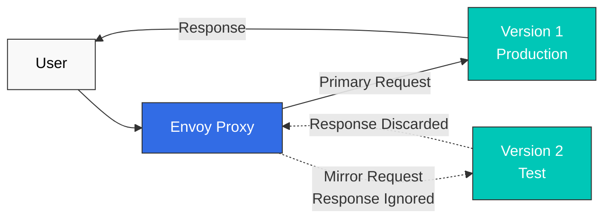

# Cuestionario de gestión de tráfico

> **Versión compatible**: Istio 1.28.0 **Versión de EKS**: 1.34 (Kubernetes 1.28+) **Última actualización**: February 23, 2026

Este cuestionario evalúa tu comprensión de las funciones de gestión de tráfico de Istio.

## Preguntas de opción múltiple (1-5)

### Pregunta 1: Rol de VirtualService

¿Qué afirmación sobre VirtualService es **correcta**?

A. Es un recurso que reemplaza Kubernetes Service B. Solo puede definir algoritmos de balanceo de carga C. Define reglas de enrutamiento y controla el tráfico D. Solo opera en el Control Plane

<details>

<summary>Mostrar respuesta</summary>

**Respuesta: C**

VirtualService es un CRD principal de Istio que controla el tráfico mediante la definición de **reglas de enrutamiento**.

**Explicación:**

* A (X): VirtualService no reemplaza Kubernetes Service; agrega reglas de enrutamiento sobre Service
* B (X): El balanceo de carga es manejado por DestinationRule; VirtualService define las reglas de enrutamiento
* C (O): VirtualService define lo siguiente:
  * Reglas de enrutamiento HTTP/TCP
  * Enrutamiento basado en la ruta URL
  * Enrutamiento basado en encabezados
  * División de tráfico basada en peso
  * Configuraciones de timeout y Retry
* D (X): VirtualService se ejecuta en Envoy en el Data Plane

**Ejemplo:**

```yaml
apiVersion: networking.istio.io/v1beta1
kind: VirtualService
metadata:
  name: reviews
spec:
  hosts:
  - reviews
  http:
  - match:
    - headers:
        end-user:
          exact: jason
    route:
    - destination:
        host: reviews
        subset: v2
  - route:
    - destination:
        host: reviews
        subset: v1
```

**Referencia:**

* [Enrutamiento](../../../service-mesh/istio/traffic-management/02-routing.md)
* [Conceptos de VirtualService](../../../service-mesh/istio/02-basic-concepts.md#virtualservice)

</details>

***

### Pregunta 2: Funciones de DestinationRule

¿Cuál **NO** es una función realizada por DestinationRule?

A. Definir subsets B. Configurar algoritmos de balanceo de carga C. Enrutamiento basado en rutas HTTP D. Configurar Connection Pool

<details>

<summary>Mostrar respuesta</summary>

**Respuesta: C**

El enrutamiento basado en rutas HTTP es el rol de **VirtualService**.

**Explicación:**

**Funciones principales de DestinationRule:**

1. **Definición de subsets (A - O)**

```yaml
apiVersion: networking.istio.io/v1beta1
kind: DestinationRule
metadata:
  name: reviews
spec:
  host: reviews
  subsets:
  - name: v1
    labels:
      version: v1
  - name: v2
    labels:
      version: v2
```

2. **Configuración de balanceo de carga (B - O)**

```yaml
spec:
  trafficPolicy:
    loadBalancer:
      simple: ROUND_ROBIN  # RANDOM, LEAST_REQUEST, etc.
```

3. **Configuración de Connection Pool (D - O)**

```yaml
spec:
  trafficPolicy:
    connectionPool:
      tcp:
        maxConnections: 100
      http:
        http1MaxPendingRequests: 50
```

4. **Enrutamiento basado en rutas HTTP (C - X)**

* Este es el rol de VirtualService:

```yaml
# Handled by VirtualService
apiVersion: networking.istio.io/v1beta1
kind: VirtualService
spec:
  http:
  - match:
    - uri:
        prefix: /api  # Path-based routing
    route:
    - destination:
        host: api-service
```

**Tabla comparativa:**

| Función          | VirtualService | DestinationRule |
| ----------------- | -------------- | --------------- |
| Reglas de enrutamiento     | Sí            | No              |
| Coincidencia de rutas     | Sí            | No              |
| Definición de subset | No             | Sí             |
| Balanceo de carga    | No             | Sí             |
| Connection Pool   | No             | Sí             |

**Referencia:**

* [Balanceo de carga](https://github.com/Atom-oh/kubernetes-docs/blob/main/en/service-mesh/istio/traffic-management/05-load-balancing.md)
* [Connection Pool](https://github.com/Atom-oh/kubernetes-docs/blob/main/en/service-mesh/istio/traffic-management/08-connection-pool.md)

</details>

***

### Pregunta 3: División de tráfico de Canary Deployment

¿Cuál es la proporción de tráfico entre v1 y v2 en la siguiente configuración de VirtualService?

```yaml
apiVersion: networking.istio.io/v1beta1
kind: VirtualService
metadata:
  name: reviews
spec:
  hosts:
  - reviews
  http:
  - route:
    - destination:
        host: reviews
        subset: v1
      weight: 80
    - destination:
        host: reviews
        subset: v2
      weight: 20
```

A. v1: 50%, v2: 50% B. v1: 80%, v2: 20% C. v1: 20%, v2: 80% D. v1: 100%, v2: 0%

<details>

<summary>Mostrar respuesta</summary>

**Respuesta: B**

Dado que los valores de peso son **v1: 80, v2: 20**, el tráfico se distribuye como **80% a v1** y **20% a v2**.

**Explicación:**

**División de tráfico basada en peso:**

* El campo `weight` representa proporciones relativas
* Peso total: 80 + 20 = 100
* Proporción de v1: 80/100 = 80%
* Proporción de v2: 20/100 = 20%

**Etapas de Canary Deployment:**

```yaml
# Stage 1: 10% Canary
- weight: 90  # v1
- weight: 10  # v2

# Stage 2: 25% Canary
- weight: 75  # v1
- weight: 25  # v2

# Stage 3: 50% Canary
- weight: 50  # v1
- weight: 50  # v2

# Stage 4: 100% v2
- weight: 0   # v1
- weight: 100 # v2
```

**Canary automatizado con Argo Rollouts:**

```yaml
apiVersion: argoproj.io/v1alpha1
kind: Rollout
spec:
  strategy:
    canary:
      trafficRouting:
        istio:
          virtualService:
            name: reviews
      steps:
      - setWeight: 10
      - pause: {duration: 2m}
      - setWeight: 25
      - pause: {duration: 2m}
      - setWeight: 50
      - pause: {duration: 2m}
```

**Referencia:**

* [División de tráfico](https://github.com/Atom-oh/kubernetes-docs/blob/main/en/service-mesh/istio/traffic-management/03-traffic-splitting.md)
* [Integración con Argo Rollouts](../../../service-mesh/istio/advanced/08-argo-rollouts.md)

</details>

***

### Pregunta 4: Propósito de Gateway

¿Cuál **NO** es un rol principal de Istio Gateway?

A. Punto de entrada para el tráfico desde fuera del cluster hacia dentro B. Terminación TLS y gestión de certificados C. Cifrado mTLS entre servicios D. Balanceo de carga del tráfico externo

<details>

<summary>Mostrar respuesta</summary>

**Respuesta: C**

El cifrado mTLS entre servicios es el rol de **Sidecar Envoy** y **PeerAuthentication**.

**Explicación:**

**Roles principales de Gateway:**

1. **Punto de entrada de tráfico Ingress/Egress (A - O)**

```yaml
apiVersion: networking.istio.io/v1beta1
kind: Gateway
metadata:
  name: bookinfo-gateway
spec:
  selector:
    istio: ingressgateway  # Select Ingress Gateway Pod
  servers:
  - port:
      number: 80
      name: http
      protocol: HTTP
    hosts:
    - "*"
```

2. **Terminación TLS (B - O)**

```yaml
spec:
  servers:
  - port:
      number: 443
      name: https
      protocol: HTTPS
    tls:
      mode: SIMPLE
      credentialName: bookinfo-secret  # TLS certificate
    hosts:
    - bookinfo.example.com
```

3. **Balanceo de carga de tráfico externo (D - O)**

* Gateway se integra con Kubernetes LoadBalancer Service
* Distribuye el tráfico externo dentro del cluster

4. **mTLS de servicio a servicio (C - X)**

* Este es el rol de Sidecar Envoy:

```yaml
# Enable mTLS with PeerAuthentication
apiVersion: security.istio.io/v1beta1
kind: PeerAuthentication
metadata:
  name: default
spec:
  mtls:
    mode: STRICT
```

**Rol de Gateway vs Sidecar:**

| Función                     | Gateway | Sidecar Envoy |
| ---------------------------- | ------- | ------------- |
| Tráfico externo -> interno | Sí     | No            |
| Terminación TLS              | Sí     | No            |
| mTLS de servicio a servicio      | No      | Sí           |
| Enrutamiento interno             | No      | Sí           |

**Referencia:**

* [Gateway](https://github.com/Atom-oh/kubernetes-docs/blob/main/en/service-mesh/istio/traffic-management/01-gateway.md)
* [mTLS](../../../service-mesh/istio/security/01-mtls.md)

</details>

***

### Pregunta 5: Política de Timeout y Retry

¿Qué significa la siguiente configuración de VirtualService?

```yaml
apiVersion: networking.istio.io/v1beta1
kind: VirtualService
metadata:
  name: reviews
spec:
  hosts:
  - reviews
  http:
  - route:
    - destination:
        host: reviews
    timeout: 10s
    retries:
      attempts: 3
      perTryTimeout: 2s
```

A. Reintentar hasta 3 veces dentro de 10 segundos en total, con cada intento limitado a 2 segundos B. Reintentar hasta 3 veces dentro de 2 segundos en total, con cada intento limitado a 10 segundos C. Reintentos ilimitados dentro de 10 segundos en total, con cada intento limitado a 2 segundos D. Fallar después de 10 segundos sin reintentos

<details>

<summary>Mostrar respuesta</summary>

**Respuesta: A**

Esta configuración reintenta **hasta 3 veces** dentro de **10 segundos en total**, con **cada intento limitado a 2 segundos**.

**Explicación:**

**Interpretación de la configuración:**

```yaml
timeout: 10s           # Maximum time for entire request
retries:
  attempts: 3          # Maximum retry count
  perTryTimeout: 2s    # Time limit for each attempt
```

**Escenarios de ejecución:**

```
Scenario 1: First attempt succeeds
+- 1st attempt: 1.5s elapsed -> Success
+- Total time: 1.5s

Scenario 2: Success after 2 attempts
+- 1st attempt: 2s timeout -> Failure
+- 2nd attempt: 1.8s elapsed -> Success
+- Total time: 3.8s

Scenario 3: All 3 attempts fail
+- 1st attempt: 2s timeout -> Failure
+- 2nd attempt: 2s timeout -> Failure
+- 3rd attempt: 2s timeout -> Failure
+- Total time: 6s (fails before 10s)

Scenario 4: Overall timeout
+- 1st attempt: 2s timeout -> Failure
+- 2nd attempt: 2s timeout -> Failure
+- 3rd attempt: 2s timeout -> Failure
+- 4th attempt: hasn't passed 2s but reached overall 10s
+- Total time: 10s (overall timeout)
```

**Configuraciones de condiciones de Retry:**

```yaml
retries:
  attempts: 3
  perTryTimeout: 2s
  retryOn: 5xx,connect-failure,refused-stream  # Retry conditions
```

**Mejores prácticas:**

```yaml
# Typical settings
timeout: 30s
retries:
  attempts: 3
  perTryTimeout: 10s
  retryOn: 5xx,gateway-error,reset,connect-failure
```

**Precauciones:**

* `timeout` >= `attempts x perTryTimeout` para permitir todos los reintentos
* Demasiados reintentos pueden provocar fallos en cascada
* Retry recomendado solo para operaciones idempotentes

**Referencia:**

* [Timeout y Retry](https://github.com/Atom-oh/kubernetes-docs/blob/main/en/service-mesh/istio/traffic-management/06-timeout-retry.md)

</details>

***

## Preguntas de respuesta corta (6-10)

### Pregunta 6: Argo Rollouts + Istio Canary Deployment

Explica el proceso de implementar un Canary Deployment automatizado usando Argo Rollouts e Istio juntos. Incluye los **recursos requeridos** (Rollout, VirtualService, DestinationRule, AnalysisTemplate) y las **condiciones de rollback automático**.

<details>

<summary>Mostrar respuesta</summary>

**Respuesta:**

**Implementación de Argo Rollouts + Istio Canary Deployment:**

***

**1. Crear Service (Kubernetes Service básico)**

```yaml
apiVersion: v1
kind: Service
metadata:
  name: reviews
spec:
  ports:
  - port: 9080
    name: http
  selector:
    app: reviews  # Select all Pods from Rollout
```

***

**2. Definir DestinationRule (definición de subset)**

```yaml
apiVersion: networking.istio.io/v1beta1
kind: DestinationRule
metadata:
  name: reviews-destrule
spec:
  host: reviews
  subsets:
  - name: stable
    labels: {}  # Managed automatically by Rollout
  - name: canary
    labels: {}  # Managed automatically by Rollout
```

**Importante**: Rollout agrega automáticamente la label `rollouts-pod-template-hash` a los Pods y usa esta label para distinguir subsets.

***

**3. Definir VirtualService (división de tráfico)**

```yaml
apiVersion: networking.istio.io/v1beta1
kind: VirtualService
metadata:
  name: reviews-vsvc
spec:
  hosts:
  - reviews
  http:
  - name: primary  # Route name referenced by Rollout (required)
    route:
    - destination:
        host: reviews
        subset: stable
      weight: 100  # Automatically modified by Rollout
    - destination:
        host: reviews
        subset: canary
      weight: 0    # Automatically modified by Rollout
```

**Puntos clave**:

* El campo `http[].name` es obligatorio
* Rollout solo actualiza automáticamente los valores de `weight` en este VirtualService

***

**4. Definir AnalysisTemplate (condiciones de rollback automático)**

**Análisis de tasa de éxito:**

```yaml
apiVersion: argoproj.io/v1alpha1
kind: AnalysisTemplate
metadata:
  name: success-rate
spec:
  args:
  - name: service-name

  metrics:
  - name: success-rate
    interval: 30s
    count: 4  # 4 measurements (total 2 minutes)
    successCondition: result >= 0.95  # 95% or higher success rate
    failureLimit: 2  # Auto rollback after 2 failures
    provider:
      prometheus:
        address: http://prometheus.istio-system:9090
        query: |
          sum(rate(
            istio_requests_total{
              destination_service_name="{{args.service-name}}",
              response_code!~"5.*"
            }[2m]
          ))
          /
          sum(rate(
            istio_requests_total{
              destination_service_name="{{args.service-name}}"
            }[2m]
          ))
```

**Análisis de latencia:**

```yaml
apiVersion: argoproj.io/v1alpha1
kind: AnalysisTemplate
metadata:
  name: latency
spec:
  args:
  - name: service-name

  metrics:
  - name: latency-p95
    interval: 30s
    count: 4
    successCondition: result <= 500  # P95 latency 500ms or less
    failureLimit: 2
    provider:
      prometheus:
        address: http://prometheus.istio-system:9090
        query: |
          histogram_quantile(0.95,
            sum(rate(
              istio_request_duration_milliseconds_bucket{
                destination_service_name="{{args.service-name}}"
              }[2m]
            )) by (le)
          )
```

***

**5. Definir recurso Rollout (estrategia Canary)**

```yaml
apiVersion: argoproj.io/v1alpha1
kind: Rollout
metadata:
  name: reviews
spec:
  replicas: 5
  revisionHistoryLimit: 2
  selector:
    matchLabels:
      app: reviews
  template:
    metadata:
      labels:
        app: reviews
    spec:
      containers:
      - name: reviews
        image: istio/examples-bookinfo-reviews-v2:1.17.0
        ports:
        - containerPort: 9080

  # Canary deployment strategy
  strategy:
    canary:
      # Traffic control via Istio VirtualService
      trafficRouting:
        istio:
          virtualService:
            name: reviews-vsvc
            routes:
            - primary
          destinationRule:
            name: reviews-destrule
            canarySubsetName: canary
            stableSubsetName: stable

      # Define Canary stages
      steps:
      - setWeight: 10    # 10% traffic to Canary
      - pause:
          duration: 2m

      - setWeight: 25    # 25% traffic to Canary
      - pause:
          duration: 2m

      - setWeight: 50    # 50% traffic to Canary
      - pause:
          duration: 2m

      - setWeight: 75    # 75% traffic to Canary
      - pause:
          duration: 2m

      # Automatic metric analysis
      analysis:
        templates:
        - templateName: success-rate
        - templateName: latency
        startingStep: 1
        args:
        - name: service-name
          value: reviews
```

***

**6. Ejecución y monitoreo del Deployment**

```bash
# Install Argo Rollouts
kubectl create namespace argo-rollouts
kubectl apply -n argo-rollouts -f https://github.com/argoproj/argo-rollouts/releases/latest/download/install.yaml

# Deploy resources
kubectl apply -f service.yaml
kubectl apply -f destination-rule.yaml
kubectl apply -f virtual-service.yaml
kubectl apply -f analysis-templates.yaml
kubectl apply -f rollout.yaml

# Deploy new version
kubectl argo rollouts set image reviews \
  reviews=istio/examples-bookinfo-reviews-v3:1.17.0

# Monitor deployment status in real-time
kubectl argo rollouts get rollout reviews --watch

# Rollout dashboard
kubectl argo rollouts dashboard
```

***

**Escenarios de rollback automático:**

**Escenario 1: Tasa de errores > 5%**

```
10% Canary -> Analysis starts
+- Measurement 1 (30s): 6% error rate -> Failure (1/2)
+- Measurement 2 (30s): 7% error rate -> Failure (2/2)
+- Auto rollback executed -> Stable 100%
```

**Escenario 2: Latencia > 500ms**

```
25% Canary -> Analysis starts
+- Measurement 1 (30s): P95 600ms -> Failure (1/2)
+- Measurement 2 (30s): P95 550ms -> Failure (2/2)
+- Auto rollback executed -> Stable 100%
```

**Escenario 3: Todas las métricas son normales**

```
10% Canary -> Analysis passed -> 25% Canary
25% Canary -> Analysis passed -> 50% Canary
50% Canary -> Analysis passed -> 75% Canary
75% Canary -> Analysis passed -> 100% Canary
```

***

**Beneficios clave:**

1. **Completamente automatizado**: El Deployment progresa sin intervención humana
2. **Rollback instantáneo**: Rollback en segundos después de detectar el fallo de una métrica
3. **Deployment seguro**: Verificación automática en cada etapa
4. **Proceso consistente**: Estrategia de Deployment estandarizada

**Referencia:**

* [División de tráfico](https://github.com/Atom-oh/kubernetes-docs/blob/main/en/service-mesh/istio/traffic-management/03-traffic-splitting.md)
* [Argo Rollouts](../../../service-mesh/istio/advanced/08-argo-rollouts.md)

</details>

***

### Pregunta 7: Blue/Green Deployment vs Canary Deployment

Compara las **diferencias** entre Blue/Green Deployment y Canary Deployment, y explica los **pros y contras** y los **escenarios de uso** de cada uno.

<details>

<summary>Mostrar respuesta</summary>

**Respuesta:**

**Comparación entre Blue/Green Deployment y Canary Deployment:**

***

**1. Diferencias en el método de Deployment**

**Blue/Green Deployment:**

```
Blue (current version) --+
                         +--> [100% Traffic]
Green (new version) -----+

Stage 1: Blue 100% active
Stage 2: Deploy and test Green (0% traffic)
Stage 3: Switch traffic (Blue 0% -> Green 100%)
Stage 4: Remove Blue
```

**Canary Deployment:**

```
Stable (current version) --> 90% -> 75% -> 50% -> 0%
Canary (new version) -----> 10% -> 25% -> 50% -> 100%

Gradually increase traffic
```

***

**2. Tabla comparativa detallada**

| Elemento               | Blue/Green                           | Canary                                 |
| ------------------ | ------------------------------------ | -------------------------------------- |
| **Cambio de tráfico** | Cambio instantáneo del 100%                  | Aumento gradual (10% -> 100%)         |
| **Velocidad de rollback** | Instantánea (un solo cambio)              | Rápida (solo desde la etapa actual)         |
| **Uso de recursos** | 2x (Blue + Green)                    | 1x + pequeña cantidad (Stable + Canary)    |
| **Nivel de riesgo**     | Medio (todos los usuarios a la vez)           | Bajo (comienza con pocos usuarios)            |
| **Período de pruebas** | Pruebas suficientes antes del Deployment | Validación gradual en producción       |
| **Complejidad**     | Baja                                  | Media (requiere análisis de métricas)      |
| **Impacto en usuarios**    | Todos los usuarios son afectados simultáneamente    | Impacto gradual comenzando con pocos usuarios |

***

**3. Ejemplos de implementación con Istio**

**Blue/Green Deployment (Argo Rollouts):**

```yaml
apiVersion: argoproj.io/v1alpha1
kind: Rollout
metadata:
  name: myapp
spec:
  replicas: 5
  strategy:
    blueGreen:
      activeService: myapp-active    # Blue (production)
      previewService: myapp-preview  # Green (test)
      autoPromotionEnabled: false    # Manual approval
      scaleDownDelaySeconds: 30      # Remove previous version 30s after Green -> Blue switch

      # Pre-promotion testing
      prePromotionAnalysis:
        templates:
        - templateName: smoke-tests

      # Post-promotion validation
      postPromotionAnalysis:
        templates:
        - templateName: performance-tests
```

**Canary Deployment (Argo Rollouts):**

```yaml
apiVersion: argoproj.io/v1alpha1
kind: Rollout
metadata:
  name: myapp
spec:
  replicas: 5
  strategy:
    canary:
      trafficRouting:
        istio:
          virtualService:
            name: myapp-vsvc
      steps:
      - setWeight: 10
      - pause: {duration: 2m}
      - analysis:
          templates:
          - templateName: success-rate
      - setWeight: 25
      - pause: {duration: 2m}
      - analysis:
          templates:
          - templateName: success-rate
      - setWeight: 50
      - pause: {duration: 2m}
      - setWeight: 100
```

***

**4. Comparación de pros y contras**

**Pros de Blue/Green:**

* Estructura simple (solo cambio Blue <-> Green)
* Rollback instantáneo posible (cambio de switch)
* Pruebas suficientes posibles antes del Deployment
* Comportamiento predecible

**Contras de Blue/Green:**

* Requiere 2x recursos
* Todos los usuarios son afectados simultáneamente
* Migraciones de base de datos complejas
* Sin validación gradual

**Pros de Canary:**

* Validación gradual comenzando con pocos usuarios
* Uso eficiente de recursos (1x + pequeña cantidad)
* Validación real en el entorno de producción
* Rollback automático posible (basado en métricas)

**Contras de Canary:**

* Configuración compleja (métricas, análisis)
* Monitoreo requerido
* Tiempo de Deployment más largo
* Existe un período de coexistencia de versiones

***

**5. Escenarios de uso**

**Escenarios recomendados para Blue/Green:**

1. **Lanzamientos importantes**: Cambio rápido después de pruebas suficientes
2. **Sin cambios en la base de datos**: Cuando no hay cambios de esquema
3. **Se necesita rollback instantáneo**: Cuando se necesita una recuperación rápida ante problemas
4. **Recursos suficientes**: Cuando se pueden costear 2x recursos
5. **Cambios predecibles**: Cuando las pruebas previas son suficientes para la verificación

**Ejemplos:**

```
- Major feature releases
- Complete UI redesign
- API version upgrades
- Marketing campaign integration (switch at specific time)
```

**Escenarios recomendados para Canary:**

1. **Funciones experimentales**: Probar primero con pocos usuarios
2. **Restricciones de recursos**: Cuando 2x recursos no están disponibles
3. **Validación gradual**: Validación con datos reales en producción
4. **Deployment automatizado**: Deployment automático en CI/CD
5. **Microservices**: Cuando las dependencias entre servicios son complejas

**Ejemplos:**

```
- A/B testing
- Performance optimization
- Bug fixes
- Minor feature additions
- Daily deployment (Continuous Deployment)
```

***

**6. Enfoque híbrido**

En la práctica, puedes combinar ambas estrategias:

```yaml
# Stage 1: Gradual validation with Canary
10% -> 25% -> 50%

# Stage 2: Final switch with Blue/Green
50% -> 100% (instant switch)
```

**Referencia:**

* [División de tráfico](https://github.com/Atom-oh/kubernetes-docs/blob/main/en/service-mesh/istio/traffic-management/03-traffic-splitting.md)
* [Blue/Green Deployment](https://github.com/Atom-oh/kubernetes-docs/blob/main/en/service-mesh/istio/traffic-management/03-traffic-splitting.md#bluegreen-deployment)

</details>

***

### Pregunta 8: Traffic Mirroring (Shadow Testing)

Explica cómo probar de forma segura nuevas versiones usando Traffic Mirroring. Incluye **casos de uso**, **métodos de configuración** y **precauciones**.

<details>

<summary>Mostrar respuesta</summary>

**Respuesta:**

**Concepto de Traffic Mirroring:**

Traffic mirroring es una técnica que duplica el tráfico de producción y lo envía a una versión nueva, mientras **ignora las respuestas**. También se denomina "shadow testing".

***

**1. Cómo funciona**



**Características clave:**

* Los usuarios solo reciben la respuesta de v1
* Envoy descarta la respuesta de v2
* Los errores de v2 no afectan a los usuarios

***

**2. Métodos de configuración**

**Mirroring básico (100%):**

```yaml
apiVersion: networking.istio.io/v1beta1
kind: VirtualService
metadata:
  name: reviews
spec:
  hosts:
  - reviews
  http:
  - route:
    - destination:
        host: reviews
        subset: v1
      weight: 100  # Primary traffic
    mirror:
      host: reviews
      subset: v2  # Mirror target
    mirrorPercentage:
      value: 100  # 100% mirroring
```

**Mirroring parcial (50%):**

```yaml
spec:
  http:
  - route:
    - destination:
        host: reviews
        subset: v1
      weight: 100
    mirror:
      host: reviews
      subset: v2
    mirrorPercentage:
      value: 50  # Only 50% mirroring (reduce traffic load)
```

**Combinación de Mirroring + Canary:**

```yaml
spec:
  http:
  - route:
    # Primary traffic: 90% v1, 10% v2
    - destination:
        host: reviews
        subset: v1
      weight: 90
    - destination:
        host: reviews
        subset: v2
      weight: 10

    # Mirroring: Mirror all traffic to v3 (test)
    mirror:
      host: reviews
      subset: v3
    mirrorPercentage:
      value: 100
```

***

**3. Casos de uso**

**Caso 1: Pruebas de rendimiento de nueva versión**

```
Purpose: Verify if v2's performance is better than v1

1. Run v1 (production) + v2 (mirror) simultaneously
2. Monitor v2's latency, CPU, memory
3. If v2 is faster than v1 -> Proceed with Canary deployment
4. If v2 is slower than v1 -> Optimize and retest
```

**Caso 2: Validación de migración de base de datos**

```
Purpose: Verify new database schema

1. v1 -> Existing DB
2. v2 -> New DB (mirroring)
3. Verify v2's query performance and error rate
4. If no issues -> Switch to v2
```

**Caso 3: Validación de corrección de bug**

```
Purpose: Verify that bug fix actually works

1. Run v1 (with bug) + v2 (fixed version, mirror)
2. Test v2 with production traffic
3. If v2's error rate decreases -> Deploy
```

**Caso 4: Calentamiento de caché**

```
Purpose: Pre-populate new version's cache

1. Warm cache via mirroring before v2 deployment
2. Once v2's cache is sufficiently populated
3. No cold start when switching to v2
```

***

**4. Configuración de monitoreo**

**Monitorear tráfico mirrored con consultas de Prometheus:**

```promql
# v2 (mirror) error rate
sum(rate(
  istio_requests_total{
    destination_version="v2",
    response_code=~"5.."
  }[5m]
))
/
sum(rate(
  istio_requests_total{
    destination_version="v2"
  }[5m]
))

# v1 vs v2 latency comparison
histogram_quantile(0.95,
  sum(rate(
    istio_request_duration_milliseconds_bucket[5m]
  )) by (destination_version, le)
)
```

**Dashboard de Grafana:**

```yaml
# Panel 1: Error rate comparison (v1 vs v2)
# Panel 2: Latency comparison (P50, P95, P99)
# Panel 3: CPU/Memory usage
# Panel 4: Request count (v1: actual, v2: mirror)
```

***

**5. Precauciones**

**Advertencia - Aumento de carga:**

```
Mirroring increases service load.

Example:
- v1: 1000 RPS
- v2: 1000 RPS (mirror)
- Total load: 2000 RPS

Solution: Set mirrorPercentage to 50% or less
```

**Advertencia - Vigilar los efectos secundarios:**

```yaml
# Don't mirror write operations!

# Bad example
POST /api/orders  # Both v1 and v2 create orders -> Duplicates!

# Good example
GET /api/orders   # Mirror only read-only operations
```

**Advertencia - Costos:**

```
Mirroring increases resources and costs.

- 2x computing resources
- 2x network traffic
- 2x database queries

Solution: Mirror only for short periods (1-2 days)
```

**Advertencia - No se pueden validar las respuestas:**

```
Mirror traffic responses are discarded, so
you cannot validate response content.

Can validate:
- Error rate
- Latency
- Resource usage

Cannot validate:
- Response data accuracy
- Business logic verification
```

***

**6. Mejores prácticas**

```yaml
# Good examples
1. Mirror only read-only APIs
2. mirrorPercentage: 50% (reduce load)
3. Short-term testing (1-2 days)
4. Automatic validation based on metrics

# Bad examples
1. Mirroring write operations (duplicate data)
2. mirrorPercentage: 100% (overload)
3. Long-term mirroring (cost increase)
4. Manual validation (slow)
```

**Referencia:**

* [Traffic Mirroring](https://github.com/Atom-oh/kubernetes-docs/blob/main/en/service-mesh/istio/traffic-management/04-traffic-mirroring.md)

</details>

***

### Pregunta 9: Locality Load Balancing (Zone Aware Routing)

Explica cómo usar Locality Load Balancing de Istio para **reducir los costos entre AZ** en AWS EKS. Incluye ejemplos de configuración y **ahorros de costos estimados**.

<details>

<summary>Mostrar respuesta</summary>

**Respuesta:**

**Concepto de Locality Load Balancing:**

Locality Load Balancing es una función que **enruta preferentemente a servicios dentro de la misma Availability Zone (AZ)** para reducir la latencia de red y los costos entre AZ.

***

**1. Costos entre AZ en AWS EKS**

**Estructura de costos:**

```
Same AZ traffic: Free
Cross-AZ traffic: $0.01-0.02 per GB
Cross-Region traffic: $0.02-0.09 per GB
```

**Cálculo de ejemplo:**

```
Service A (us-east-1a) -> Service B (us-east-1b)
- Monthly traffic: 1TB = 1000GB
- Cross-AZ cost: 1000GB x $0.01 = $10/month

If 80% traffic is routed to same AZ:
- Same AZ: 800GB x $0 = $0
- Cross-AZ: 200GB x $0.01 = $2/month
- Savings: $8/month (80%)
```

***

**2. Labels de topología de Pod de EKS**

Los nodos de EKS tienen labels de topología configuradas automáticamente:

```yaml
# EKS node labels (automatic)
topology.kubernetes.io/region: us-east-1
topology.kubernetes.io/zone: us-east-1a

# Pods inherit node labels
```

***

**3. Configuración de Locality Load Balancing**

**Configuración básica (prioridad de misma AZ):**

```yaml
apiVersion: networking.istio.io/v1beta1
kind: DestinationRule
metadata:
  name: reviews
spec:
  host: reviews
  trafficPolicy:
    loadBalancer:
      localityLbSetting:
        enabled: true
        # 100% routing to same AZ if Pods exist there
        # Automatic failover to other AZ if not
```

**Configuración avanzada (distribución ponderada):**

```yaml
apiVersion: networking.istio.io/v1beta1
kind: DestinationRule
metadata:
  name: reviews
spec:
  host: reviews
  trafficPolicy:
    loadBalancer:
      localityLbSetting:
        enabled: true
        distribute:
        # Traffic originating from us-east-1a
        - from: us-east-1/us-east-1a/*
          to:
            "us-east-1/us-east-1a/*": 80  # Same AZ 80%
            "us-east-1/us-east-1b/*": 20  # Other AZ 20% (for failover)

        # Traffic originating from us-east-1b
        - from: us-east-1/us-east-1b/*
          to:
            "us-east-1/us-east-1b/*": 80  # Same AZ 80%
            "us-east-1/us-east-1a/*": 20  # Other AZ 20% (for failover)
```

**Política de failover:**

```yaml
spec:
  trafficPolicy:
    loadBalancer:
      localityLbSetting:
        enabled: true
        failover:
        # On us-east-1a failure, route to us-east-1b
        - from: us-east-1/us-east-1a
          to: us-east-1/us-east-1b

        # On us-east-1 complete failure, route to us-west-2
        - from: us-east-1
          to: us-west-2
```

***

**4. Combinación con Outlier Detection**

```yaml
apiVersion: networking.istio.io/v1beta1
kind: DestinationRule
metadata:
  name: reviews
spec:
  host: reviews
  trafficPolicy:
    # Locality Load Balancing
    loadBalancer:
      localityLbSetting:
        enabled: true

    # Outlier Detection (exclude unhealthy instances)
    outlierDetection:
      consecutiveErrors: 5
      interval: 30s
      baseEjectionTime: 30s
      maxEjectionPercent: 50
```

**Comportamiento:**

```
1. Prioritize Pods in same AZ (us-east-1a)
2. Exclude that Pod after 5 consecutive failures
3. Automatic switch to healthy Pod in other AZ (us-east-1b)
4. Retry excluded Pod after 30 seconds
```

***

**5. Cálculo de ahorro de costos**

**Escenario: Arquitectura de Microservices a gran escala**

```
Assumptions:
- Number of services: 20
- Monthly traffic between each service: 500GB
- Total monthly traffic: 20 x 20 x 500GB = 200TB
- Cross-AZ ratio (without Locality LB): 70%
- Cross-AZ ratio (with Locality LB): 20%
```

**Sin Locality LB:**

```
Cross-AZ traffic: 200TB x 70% = 140TB
Cost: 140,000GB x $0.01 = $1,400/month
```

**Con Locality LB:**

```
Cross-AZ traffic: 200TB x 20% = 40TB
Cost: 40,000GB x $0.01 = $400/month

Savings: $1,400 - $400 = $1,000/month (71% savings)
Annual savings: $1,000 x 12 = $12,000/year
```

***

**6. Mejora del rendimiento**

**Mejora de latencia:**

```
Same AZ communication: ~1ms
Cross-AZ communication: ~2-3ms

With Locality LB:
- 30-50% reduction in average latency
- 40-60% reduction in P99 latency
```

**Ejemplo de medición real:**

```bash
# us-east-1a -> us-east-1a (same AZ)
$ kubectl exec -it pod-a -- curl -w "%{time_total}\n" http://service-b
0.001s

# us-east-1a -> us-east-1b (cross-AZ)
$ kubectl exec -it pod-a -- curl -w "%{time_total}\n" http://service-b
0.003s
```

***

**7. Monitoreo**

**Consultas de Prometheus:**

```promql
# Traffic distribution by Locality
sum(rate(
  istio_requests_total[5m]
)) by (
  source_workload_namespace,
  destination_workload_namespace,
  source_canonical_service,
  destination_canonical_service
)

# Cross-AZ traffic ratio
sum(rate(istio_requests_total{
  source_cluster="us-east-1a",
  destination_cluster!="us-east-1a"
}[5m]))
/
sum(rate(istio_requests_total[5m]))
```

**Dashboard de Grafana:**

```yaml
Panel 1: Request count by Locality (us-east-1a, us-east-1b, us-east-1c)
Panel 2: Cross-AZ traffic ratio (target: <20%)
Panel 3: Latency (same AZ vs cross-AZ)
Panel 4: Estimated cost (cross-AZ traffic x $0.01/GB)
```

***

**8. Precauciones**

**Advertencia - Carga no equilibrada:**

```
If all traffic concentrates on one AZ, overload can occur

Solutions:
- Deploy sufficient replicas in each AZ
- Configure HPA (Horizontal Pod Autoscaler)
- Ensure minimum replicas with PodDisruptionBudget
```

**Advertencia - Fallo de AZ:**

```
If entire AZ fails, traffic moves to other AZs

Failover policy configuration required:
- from: us-east-1/us-east-1a
  to: us-east-1/us-east-1b
```

**Advertencia - Cold Start:**

```
On failover, Pods in other AZ may be in cold start state

Solutions:
- Maintain at least 1 replica in each AZ
- Verify ready state with Readiness Probe
```

***

**9. Mejores prácticas**

```yaml
# Recommended configuration
apiVersion: networking.istio.io/v1beta1
kind: DestinationRule
metadata:
  name: production-service
spec:
  host: production-service
  trafficPolicy:
    loadBalancer:
      localityLbSetting:
        enabled: true
        distribute:
        - from: us-east-1/us-east-1a/*
          to:
            "us-east-1/us-east-1a/*": 80  # Cost savings
            "us-east-1/us-east-1b/*": 15  # Failover
            "us-east-1/us-east-1c/*": 5   # Additional backup

    outlierDetection:
      consecutiveErrors: 5
      interval: 30s
      baseEjectionTime: 30s

    connectionPool:
      tcp:
        maxConnections: 100
      http:
        http1MaxPendingRequests: 50
```

**Referencia:**

* [Zone Aware Routing](../../../service-mesh/istio/resilience/03-zone-aware-routing.md)
* [Optimización de costos de AWS EKS](../../../service-mesh/istio/best-practices.md#cost-optimization)

</details>

***

### Pregunta 10: Configuración TLS de Gateway

Explica cómo configurar la **terminación TLS** y establecer la **redirección HTTPS** en Istio Gateway. Incluye ambos casos: uso de certificados ACM (AWS Certificate Manager) y uso de certificados autofirmados.

<details>

<summary>Mostrar respuesta</summary>

**Respuesta:**

**Configuración TLS de Istio Gateway:**

***

**1. Uso de certificados autofirmados (Kubernetes Secret)**

**Paso 1: Generar certificado TLS**

```bash
# Generate self-signed certificate (for testing)
openssl req -x509 -nodes -days 365 -newkey rsa:2048 \
  -keyout bookinfo.key \
  -out bookinfo.crt \
  -subj "/CN=bookinfo.example.com"

# Or use Let's Encrypt certificate
certbot certonly --standalone -d bookinfo.example.com
```

**Paso 2: Crear Kubernetes Secret**

```bash
# Create Secret for Istio to use
kubectl create -n istio-system secret tls bookinfo-secret \
  --key=bookinfo.key \
  --cert=bookinfo.crt

# Verify Secret
kubectl get secret bookinfo-secret -n istio-system
```

**Paso 3: Configurar Gateway (redirección HTTPS + HTTP -> HTTPS)**

```yaml
apiVersion: networking.istio.io/v1beta1
kind: Gateway
metadata:
  name: bookinfo-gateway
  namespace: default
spec:
  selector:
    istio: ingressgateway
  servers:
  # HTTPS (port 443)
  - port:
      number: 443
      name: https
      protocol: HTTPS
    tls:
      mode: SIMPLE  # One-way TLS (server certificate only)
      credentialName: bookinfo-secret  # Kubernetes Secret name
    hosts:
    - bookinfo.example.com

  # HTTP (port 80) - Redirect to HTTPS
  - port:
      number: 80
      name: http
      protocol: HTTP
    hosts:
    - bookinfo.example.com
    tls:
      httpsRedirect: true  # HTTP -> HTTPS redirect
```

**Paso 4: Conectar VirtualService**

```yaml
apiVersion: networking.istio.io/v1beta1
kind: VirtualService
metadata:
  name: bookinfo-vs
  namespace: default
spec:
  hosts:
  - bookinfo.example.com
  gateways:
  - bookinfo-gateway
  http:
  - match:
    - uri:
        prefix: /productpage
    route:
    - destination:
        host: productpage
        port:
          number: 9080
    timeout: 10s
    retries:
      attempts: 3
      perTryTimeout: 2s
```

**Paso 5: Probar**

```bash
# HTTPS access
curl -v https://bookinfo.example.com/productpage

# HTTP access -> HTTPS redirect verification
curl -v http://bookinfo.example.com/productpage
# Output:
# HTTP/1.1 301 Moved Permanently
# location: https://bookinfo.example.com/productpage
```

***

**2. Uso de certificados AWS ACM (anotación de NLB)**

En AWS EKS, el enfoque recomendado es la terminación TLS en NLB con certificados ACM.

**Paso 1: Emitir certificado ACM**

```bash
# Issue ACM certificate via AWS Console or CLI
aws acm request-certificate \
  --domain-name bookinfo.example.com \
  --validation-method DNS \
  --region us-east-1

# Get ARN
aws acm list-certificates --region us-east-1
# Output: arn:aws:acm:us-east-1:123456789012:certificate/abc123
```

**Paso 2: Modificar Istio Ingress Gateway Service**

```yaml
apiVersion: v1
kind: Service
metadata:
  name: istio-ingressgateway
  namespace: istio-system
  annotations:
    # Use NLB
    service.beta.kubernetes.io/aws-load-balancer-type: "nlb"

    # TLS termination (ACM certificate)
    service.beta.kubernetes.io/aws-load-balancer-ssl-cert: "arn:aws:acm:us-east-1:123456789012:certificate/abc123"
    service.beta.kubernetes.io/aws-load-balancer-ssl-ports: "443"

    # HTTP -> HTTPS redirect (NLB level)
    service.beta.kubernetes.io/aws-load-balancer-ssl-negotiation-policy: "ELBSecurityPolicy-TLS-1-2-2017-01"

    # Cross-AZ load balancing
    service.beta.kubernetes.io/aws-load-balancer-cross-zone-load-balancing-enabled: "true"

spec:
  type: LoadBalancer
  selector:
    istio: ingressgateway
    app: istio-ingressgateway
  ports:
  # HTTP (80) - NLB redirects to HTTPS(443)
  - name: http
    port: 80
    targetPort: 8080
    protocol: TCP

  # HTTPS (443) - NLB terminates TLS and forwards to 8443
  - name: https
    port: 443
    targetPort: 8443
    protocol: TCP
```

**Paso 3: Configurar Gateway (TLS Passthrough)**

```yaml
apiVersion: networking.istio.io/v1beta1
kind: Gateway
metadata:
  name: bookinfo-gateway
spec:
  selector:
    istio: ingressgateway
  servers:
  # Receive as HTTP since NLB terminated TLS
  - port:
      number: 8443
      name: http
      protocol: HTTP  # NLB already terminated TLS
    hosts:
    - bookinfo.example.com
```

***

**3. TLS mutuo (mTLS) - Autenticación de cliente**

Cuando el cliente también debe presentar un certificado:

```yaml
apiVersion: networking.istio.io/v1beta1
kind: Gateway
metadata:
  name: secure-gateway
spec:
  selector:
    istio: ingressgateway
  servers:
  - port:
      number: 443
      name: https-mutual
      protocol: HTTPS
    tls:
      mode: MUTUAL  # Two-way TLS
      credentialName: server-cert-secret  # Server certificate
      caCertificates: /etc/istio/client-ca/ca-chain.crt  # Client CA
    hosts:
    - secure.example.com
```

**Conectar con certificado de cliente:**

```bash
curl --cert client.crt --key client.key \
  https://secure.example.com/api
```

***

**4. Certificados wildcard**

Usa un único certificado para múltiples subdominios:

```bash
# Generate wildcard certificate
openssl req -x509 -nodes -days 365 -newkey rsa:2048 \
  -keyout wildcard.key \
  -out wildcard.crt \
  -subj "/CN=*.example.com"

# Create Secret
kubectl create -n istio-system secret tls wildcard-secret \
  --key=wildcard.key \
  --cert=wildcard.crt
```

```yaml
apiVersion: networking.istio.io/v1beta1
kind: Gateway
metadata:
  name: wildcard-gateway
spec:
  selector:
    istio: ingressgateway
  servers:
  - port:
      number: 443
      name: https
      protocol: HTTPS
    tls:
      mode: SIMPLE
      credentialName: wildcard-secret
    hosts:
    - "*.example.com"  # Allow all subdomains
```

**Enrutar por subdominio con VirtualService:**

```yaml
apiVersion: networking.istio.io/v1beta1
kind: VirtualService
metadata:
  name: multi-subdomain
spec:
  hosts:
  - api.example.com
  - web.example.com
  - admin.example.com
  gateways:
  - wildcard-gateway
  http:
  - match:
    - uri:
        prefix: /api
      authority:
        exact: api.example.com
    route:
    - destination:
        host: api-service

  - match:
    - authority:
        exact: web.example.com
    route:
    - destination:
        host: web-service

  - match:
    - authority:
        exact: admin.example.com
    route:
    - destination:
        host: admin-service
```

***

**5. Configuración de versión TLS y Cipher Suite**

```yaml
apiVersion: networking.istio.io/v1beta1
kind: Gateway
metadata:
  name: secure-gateway
spec:
  selector:
    istio: ingressgateway
  servers:
  - port:
      number: 443
      name: https
      protocol: HTTPS
    tls:
      mode: SIMPLE
      credentialName: bookinfo-secret
      minProtocolVersion: TLSV1_2  # Allow only TLS 1.2 and above
      maxProtocolVersion: TLSV1_3
      cipherSuites:
      - ECDHE-ECDSA-AES256-GCM-SHA384
      - ECDHE-RSA-AES256-GCM-SHA384
      - ECDHE-ECDSA-AES128-GCM-SHA256
    hosts:
    - bookinfo.example.com
```

***

**6. Renovación automática de certificados (cert-manager)**

```bash
# Install cert-manager
kubectl apply -f https://github.com/cert-manager/cert-manager/releases/download/v1.13.0/cert-manager.yaml

# Create Let's Encrypt Issuer
kubectl apply -f - <<EOF
apiVersion: cert-manager.io/v1
kind: ClusterIssuer
metadata:
  name: letsencrypt-prod
spec:
  acme:
    server: https://acme-v02.api.letsencrypt.org/directory
    email: admin@example.com
    privateKeySecretRef:
      name: letsencrypt-prod
    solvers:
    - http01:
        ingress:
          class: istio
EOF

# Create Certificate resource (auto-renewal)
kubectl apply -f - <<EOF
apiVersion: cert-manager.io/v1
kind: Certificate
metadata:
  name: bookinfo-cert
  namespace: istio-system
spec:
  secretName: bookinfo-secret
  issuerRef:
    name: letsencrypt-prod
    kind: ClusterIssuer
  dnsNames:
  - bookinfo.example.com
EOF
```

***

**7. Mejores prácticas**

```yaml
# Recommended configuration
apiVersion: networking.istio.io/v1beta1
kind: Gateway
metadata:
  name: production-gateway
spec:
  selector:
    istio: ingressgateway
  servers:
  # HTTPS (recommended)
  - port:
      number: 443
      name: https
      protocol: HTTPS
    tls:
      mode: SIMPLE
      credentialName: prod-tls-secret
      minProtocolVersion: TLSV1_2  # Security hardening
    hosts:
    - "*.example.com"

  # HTTP -> HTTPS redirect
  - port:
      number: 80
      name: http
      protocol: HTTP
    hosts:
    - "*.example.com"
    tls:
      httpsRedirect: true
```

**Notas:**

* Usa TLS 1.2 o superior
* Configura Cipher Suites sólidos
* Renueva automáticamente los certificados (cert-manager)
* Habilita la redirección HTTP -> HTTPS
* No uses certificados autofirmados en producción
* No uses TLS 1.0/1.1

**Referencia:**

* [Gateway](https://github.com/Atom-oh/kubernetes-docs/blob/main/en/service-mesh/istio/traffic-management/01-gateway.md)
* [Configuración TLS](https://github.com/Atom-oh/kubernetes-docs/blob/main/en/service-mesh/istio/traffic-management/01-gateway.md#tls-configuration)

</details>

***

## Cálculo de puntuación

* Opción múltiple 1-5: 10 puntos cada una (50 puntos en total)
* Respuesta corta 6-10: 10 puntos cada una (50 puntos en total)
* **Total: 100 puntos**

**Criterios de evaluación:**

* 90-100 puntos: Excelente (experto en gestión de tráfico de Istio)
* 80-89 puntos: Bueno (listo para operaciones de producción)
* 70-79 puntos: Promedio (se recomienda estudio adicional)
* 60-69 puntos: Por debajo del promedio (se necesita repasar conceptos básicos)
* 0-59 puntos: Necesita volver a estudiar

## Recursos de aprendizaje

* [Documentación de gestión de tráfico](../../../service-mesh/istio/traffic-management/)
* [VirtualService](../../../service-mesh/istio/traffic-management/02-routing.md)
* [Gateway](https://github.com/Atom-oh/kubernetes-docs/blob/main/en/service-mesh/istio/traffic-management/01-gateway.md)
* [División de tráfico](https://github.com/Atom-oh/kubernetes-docs/blob/main/en/service-mesh/istio/traffic-management/03-traffic-splitting.md)
* [Argo Rollouts](../../../service-mesh/istio/advanced/08-argo-rollouts.md)
