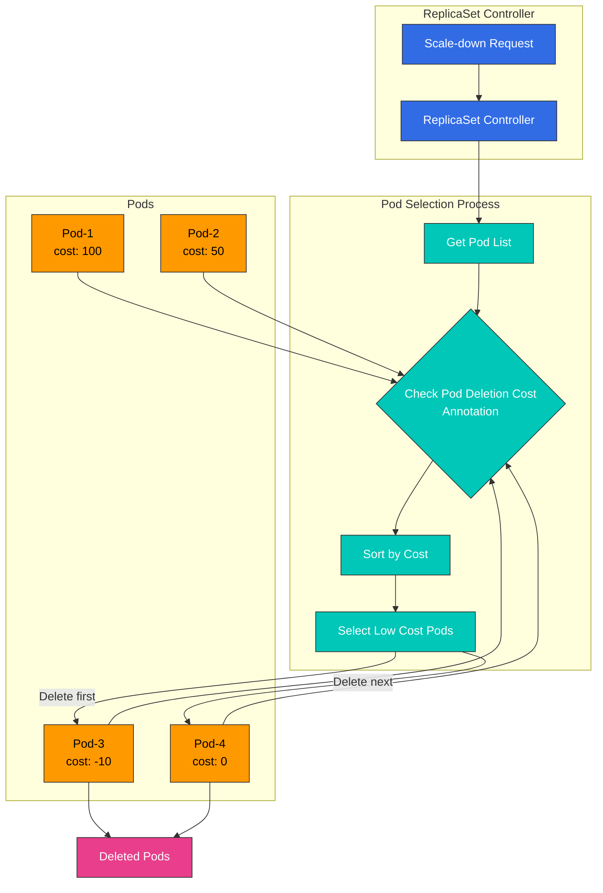

# Part 3: Advanced Features

## Custom Scheduler Implementation Cases in EKS

En esta sección, exploraremos casos reales de implementación de custom schedulers en EKS.

### Case 1: GPU Workload Optimization Scheduler

En clusters de EKS que ejecutan workloads de AI/ML, la utilización eficiente de los recursos GPU es importante. El siguiente es un caso de implementación de un custom scheduler que optimiza workloads de GPU.

#### GPU Workload Optimization Scheduler Architecture

El siguiente diagrama muestra la arquitectura del GPU workload optimization scheduler:

#### GPU Workload Scheduling Workflow

El siguiente diagrama muestra el flujo de trabajo de scheduling de workloads de GPU:

#### Requirements

1. Selección de Node basada en requisitos de memoria GPU
2. Selección de Node basada en el modelo de GPU (por ejemplo, NVIDIA A100, V100, T4, etc.)
3. Selección de Node considerando la utilización de GPU
4. Optimización del uso compartido de GPU en instancias multi-GPU

#### Implementation Approach

Este caso usa el enfoque de plugin del scheduler framework.

1. **Etiquetado de Node**: Agregue información relacionada con GPU como labels a cada Node.

```bash
# Add GPU model label
kubectl label node <node-name> gpu.nvidia.com/model=A100

# Add GPU memory label
kubectl label node <node-name> gpu.nvidia.com/memory=40960

# Add GPU count label
kubectl label node <node-name> gpu.nvidia.com/count=8
```

2. **Implementación de Custom Scheduler Plugin**:

```go
// GPUTopologyPlugin is a scheduler plugin that considers GPU topology.
type GPUTopologyPlugin struct {
    handle framework.Handle
}

// Filter filters nodes based on GPU requirements.
func (gtp *GPUTopologyPlugin) Filter(ctx context.Context, state *framework.CycleState, pod *v1.Pod, node *framework.NodeInfo) *framework.Status {
    // Check GPU requirements
    gpuReq := getGPURequest(pod)
    if gpuReq == 0 {
        return framework.NewStatus(framework.Success, "")
    }

    // Check node's GPU info
    gpuCount := getGPUCount(node.Node())
    if gpuCount < gpuReq {
        return framework.NewStatus(framework.Unschedulable, "Not enough GPUs")
    }

    // Check GPU model requirements
    requiredModel := getRequiredGPUModel(pod)
    if requiredModel != "" && getGPUModel(node.Node()) != requiredModel {
        return framework.NewStatus(framework.Unschedulable, "GPU model mismatch")
    }

    // Check GPU memory requirements
    memReq := getGPUMemoryRequest(pod)
    if memReq > 0 && getGPUMemory(node.Node()) < memReq {
        return framework.NewStatus(framework.Unschedulable, "Not enough GPU memory")
    }

    return framework.NewStatus(framework.Success, "")
}

// Score assigns scores to nodes based on GPU topology.
func (gtp *GPUTopologyPlugin) Score(ctx context.Context, state *framework.CycleState, pod *v1.Pod, nodeName string) (int64, *framework.Status) {
    nodeInfo, err := gtp.handle.SnapshotSharedLister().NodeInfos().Get(nodeName)
    if err != nil {
        return 0, framework.NewStatus(framework.Error, fmt.Sprintf("Error getting node info: %v", err))
    }

    node := nodeInfo.Node()

    // Return default score if no GPU requirements
    gpuReq := getGPURequest(pod)
    if gpuReq == 0 {
        return 0, framework.NewStatus(framework.Success, "")
    }

    // Check GPU utilization
    gpuUtilization := getGPUUtilization(node)

    // Calculate score based on GPU count
    gpuCount := getGPUCount(node)

    // Assign higher score to nodes with available GPUs slightly more than requested
    // This is for efficient GPU resource utilization
    score := 100 - int64(math.Abs(float64(gpuCount-gpuReq))*10)
    if score < 0 {
        score = 0
    }

    // Assign higher score to nodes with low GPU utilization
    utilizationScore := int64((1.0 - gpuUtilization) * 100)

    // Final score is weighted average of both scores
    finalScore := (score * 7 + utilizationScore * 3) / 10

    return finalScore, framework.NewStatus(framework.Success, "")
}
```

3. **Configuración del Scheduler**:

```yaml
apiVersion: kubescheduler.config.k8s.io/v1beta1
kind: KubeSchedulerConfiguration
clientConnection:
  kubeconfig: /etc/kubernetes/scheduler.conf
profiles:
- schedulerName: gpu-scheduler
  plugins:
    filter:
      enabled:
      - name: GPUTopologyPlugin
    score:
      enabled:
      - name: GPUTopologyPlugin
        weight: 10
  pluginConfig:
  - name: GPUTopologyPlugin
    args: {}
```

4. **Especificación de requisitos de GPU en Pod Spec**:

```yaml
apiVersion: v1
kind: Pod
metadata:
  name: gpu-pod
  annotations:
    gpu.nvidia.com/model: "A100"
    gpu.nvidia.com/memory: "40960"
spec:
  schedulerName: gpu-scheduler
  containers:
  - name: gpu-container
    image: nvidia/cuda:11.6.0-base-ubuntu20.04
    resources:
      limits:
        nvidia.com/gpu: 2
```

### Case 2: Network Locality Optimization Scheduler

En clusters de EKS, puede implementar un custom scheduler que considere la localidad de red para optimizar los costos de red.

#### Network Locality Optimization Scheduler Architecture

El siguiente diagrama muestra la arquitectura del network locality optimization scheduler.

#### Network Locality Optimization Workflow

El siguiente diagrama muestra el flujo de trabajo del network locality optimization scheduler.

## Scale-Down Optimization with Pod Deletion Cost

Pod Deletion Cost, introducido en Kubernetes 1.22, es una característica que le permite controlar qué pods se eliminan primero cuando recursos de workload como ReplicaSet, Deployment o StatefulSet reducen su escala. Esto es útil para optimizar la disponibilidad y el rendimiento de la aplicación.

### Pod Deletion Cost Concept

Pod Deletion Cost asigna un valor de costo a cada pod mediante la anotación `controller.kubernetes.io/pod-deletion-cost`. Durante la reducción de escala, los pods con costos más bajos se eliminan primero.

**Características clave**:

* Valor predeterminado: 0
* Rango: -2147483648 a 2147483647 (rango int32)
* Valor más alto = Pod más importante (se elimina más tarde)
* Valor más bajo = Pod menos importante (se elimina primero)

### Pod Deletion Cost Architecture

El siguiente diagrama muestra cómo funciona Pod Deletion Cost durante la reducción de escala:



### Use Cases

#### 1. Protecting Warmed-Up Cache Pods

Cuando las aplicaciones cargan caché al inicio, puede priorizar mantener los pods con caché precalentada para optimizar el rendimiento.

```yaml
apiVersion: v1
kind: Pod
metadata:
  name: app-pod-warmed-up
  annotations:
    controller.kubernetes.io/pod-deletion-cost: "100"  # Cache warmed up
spec:
  containers:
  - name: app
    image: my-app:latest
    lifecycle:
      postStart:
        exec:
          command:
          - /bin/sh
          - -c
          - |
            # Cache warm-up
            /app/warm-cache.sh
            # Increase deletion cost after warm-up complete
            kubectl annotate pod $HOSTNAME \
              controller.kubernetes.io/pod-deletion-cost=100 --overwrite
```

#### 2. Protecting Pods with Active Connections

Proteja pods con conexiones WebSocket o de larga duración:

```go
// Go example: Dynamically update deletion cost based on active connection count
package main

import (
    "context"
    "fmt"
    "os"
    "time"

    metav1 "k8s.io/apimachinery/pkg/apis/meta/v1"
    "k8s.io/client-go/kubernetes"
    "k8s.io/client-go/rest"
)

type ConnectionTracker struct {
    activeConnections int
    k8sClient         *kubernetes.Clientset
    podName           string
    namespace         string
}

func NewConnectionTracker() (*ConnectionTracker, error) {
    config, err := rest.InClusterConfig()
    if err != nil {
        return nil, err
    }

    clientset, err := kubernetes.NewForConfig(config)
    if err != nil {
        return nil, err
    }

    return &ConnectionTracker{
        k8sClient: clientset,
        podName:   os.Getenv("POD_NAME"),
        namespace: os.Getenv("POD_NAMESPACE"),
    }, nil
}

func (ct *ConnectionTracker) UpdateDeletionCost() error {
    // Set deletion cost proportional to active connection count
    // 10 cost per connection, max 1000
    cost := ct.activeConnections * 10
    if cost > 1000 {
        cost = 1000
    }

    pod, err := ct.k8sClient.CoreV1().Pods(ct.namespace).Get(
        context.TODO(),
        ct.podName,
        metav1.GetOptions{},
    )
    if err != nil {
        return err
    }

    if pod.Annotations == nil {
        pod.Annotations = make(map[string]string)
    }

    pod.Annotations["controller.kubernetes.io/pod-deletion-cost"] = fmt.Sprintf("%d", cost)

    _, err = ct.k8sClient.CoreV1().Pods(ct.namespace).Update(
        context.TODO(),
        pod,
        metav1.UpdateOptions{},
    )

    return err
}

func (ct *ConnectionTracker) StartPeriodicUpdate() {
    ticker := time.NewTicker(30 * time.Second)
    defer ticker.Stop()

    for range ticker.C {
        if err := ct.UpdateDeletionCost(); err != nil {
            fmt.Printf("Failed to update deletion cost: %v\n", err)
        }
    }
}

func (ct *ConnectionTracker) OnConnectionOpen() {
    ct.activeConnections++
}

func (ct *ConnectionTracker) OnConnectionClose() {
    ct.activeConnections--
    if ct.activeConnections < 0 {
        ct.activeConnections = 0
    }
}
```

#### 3. Protecting Pods with Data Locality

Proteja pods que almacenan en caché o usan datos en Nodes específicos:

```yaml
apiVersion: apps/v1
kind: Deployment
metadata:
  name: data-processor
spec:
  replicas: 5
  selector:
    matchLabels:
      app: data-processor
  template:
    metadata:
      labels:
        app: data-processor
      annotations:
        # Set high cost for pods with high data locality
        controller.kubernetes.io/pod-deletion-cost: "50"
    spec:
      affinity:
        podAntiAffinity:
          preferredDuringSchedulingIgnoredDuringExecution:
          - weight: 100
            podAffinityTerm:
              labelSelector:
                matchExpressions:
                - key: app
                  operator: In
                  values:
                  - data-processor
              topologyKey: kubernetes.io/hostname
      containers:
      - name: processor
        image: data-processor:latest
        env:
        - name: POD_NAME
          valueFrom:
            fieldRef:
              fieldPath: metadata.name
        - name: POD_NAMESPACE
          valueFrom:
            fieldRef:
              fieldPath: metadata.namespace
```

#### 4. Prioritizing Deletion of Newly Started Pods

Los pods iniciados recientemente pueden no estar completamente precalentados todavía, por lo que se eliminan primero:

```yaml
apiVersion: v1
kind: Pod
metadata:
  name: app-pod-new
  annotations:
    controller.kubernetes.io/pod-deletion-cost: "-50"  # New pods have low cost
spec:
  containers:
  - name: app
    image: my-app:latest
    lifecycle:
      postStart:
        exec:
          command:
          - /bin/sh
          - -c
          - |
            # Initially low cost
            sleep 60
            # Change to normal cost after 1 minute
            kubectl annotate pod $HOSTNAME \
              controller.kubernetes.io/pod-deletion-cost=0 --overwrite
```

### Integration with Horizontal Pod Autoscaler

Al usarlo con HPA, puede aprovechar Pod Deletion Cost para proteger pods importantes durante la reducción de escala:

```yaml
apiVersion: autoscaling/v2
kind: HorizontalPodAutoscaler
metadata:
  name: app-hpa
spec:
  scaleTargetRef:
    apiVersion: apps/v1
    kind: Deployment
    name: app
  minReplicas: 3
  maxReplicas: 10
  metrics:
  - type: Resource
    resource:
      name: cpu
      target:
        type: Utilization
        averageUtilization: 70
  behavior:
    scaleDown:
      stabilizationWindowSeconds: 300  # 5-minute stabilization period
      policies:
      - type: Percent
        value: 50
        periodSeconds: 60
      - type: Pods
        value: 2
        periodSeconds: 60
      selectPolicy: Min
```

### Dynamic Pod Deletion Cost Update Pattern

Puede actualizar dinámicamente el deletion cost cuando la importancia de un pod cambia en tiempo real:

```python
# Python example: Dynamic deletion cost update based on metrics
from kubernetes import client, config
import time
import os

class DeletionCostManager:
    def __init__(self):
        config.load_incluster_config()
        self.v1 = client.CoreV1Api()
        self.pod_name = os.environ.get('POD_NAME')
        self.namespace = os.environ.get('POD_NAMESPACE')

    def calculate_cost(self, metrics):
        """
        Calculate deletion cost based on metrics
        - Active request count
        - Cache hit rate
        - Average response time
        """
        base_cost = 0

        # Higher cost for more active requests
        active_requests = metrics.get('active_requests', 0)
        base_cost += active_requests * 5

        # Higher cost for higher cache hit rate
        cache_hit_rate = metrics.get('cache_hit_rate', 0)
        base_cost += int(cache_hit_rate * 100)

        # Higher cost for faster response time (optimized pod)
        avg_response_time = metrics.get('avg_response_time_ms', 1000)
        if avg_response_time < 100:
            base_cost += 50
        elif avg_response_time < 500:
            base_cost += 20

        # Limit to max 1000
        return min(base_cost, 1000)

    def update_deletion_cost(self, cost):
        """Update pod's deletion cost annotation"""
        try:
            pod = self.v1.read_namespaced_pod(
                name=self.pod_name,
                namespace=self.namespace
            )

            if pod.metadata.annotations is None:
                pod.metadata.annotations = {}

            pod.metadata.annotations['controller.kubernetes.io/pod-deletion-cost'] = str(cost)

            self.v1.patch_namespaced_pod(
                name=self.pod_name,
                namespace=self.namespace,
                body=pod
            )

            print(f"Updated deletion cost to {cost}")
        except Exception as e:
            print(f"Error updating deletion cost: {e}")

    def run(self, get_metrics_func):
        """Periodically collect metrics and update deletion cost"""
        while True:
            try:
                metrics = get_metrics_func()
                cost = self.calculate_cost(metrics)
                self.update_deletion_cost(cost)
            except Exception as e:
                print(f"Error in main loop: {e}")

            time.sleep(30)  # Update every 30 seconds

# Usage example
def get_app_metrics():
    """Collect application metrics (implementation required)"""
    return {
        'active_requests': 15,
        'cache_hit_rate': 0.85,
        'avg_response_time_ms': 120
    }

if __name__ == '__main__':
    manager = DeletionCostManager()
    manager.run(get_app_metrics)
```

### Monitoring and Debugging

Cómo verificar que Pod Deletion Cost funciona correctamente:

```bash
# 1. Check pod's deletion cost
kubectl get pods -o custom-columns=\
NAME:.metadata.name,\
DELETION_COST:.metadata.annotations.controller\.kubernetes\.io/pod-deletion-cost

# 2. Check all pod deletion costs for a specific Deployment
kubectl get pods -l app=my-app -o json | \
  jq -r '.items[] | "\(.metadata.name): \(.metadata.annotations["controller.kubernetes.io/pod-deletion-cost"] // "0")"'

# 3. Scale-down simulation
kubectl scale deployment my-app --replicas=3

# 4. Check which pods were deleted
kubectl get events --field-selector involvedObject.kind=Pod,reason=Killing \
  --sort-by='.lastTimestamp'
```

### Prometheus Metrics Collection

```yaml
# ServiceMonitor for Pod Deletion Cost metrics
apiVersion: monitoring.coreos.com/v1
kind: ServiceMonitor
metadata:
  name: pod-deletion-cost-monitor
  namespace: monitoring
spec:
  selector:
    matchLabels:
      app: my-app
  endpoints:
  - port: metrics
    interval: 30s
    relabelings:
    - sourceLabels: [__meta_kubernetes_pod_annotation_controller_kubernetes_io_pod_deletion_cost]
      targetLabel: pod_deletion_cost
```

### Grafana Dashboard

```json
{
  "dashboard": {
    "title": "Pod Deletion Cost Monitoring",
    "panels": [
      {
        "title": "Pod Deletion Cost Distribution",
        "targets": [
          {
            "expr": "kube_pod_annotations{annotation_controller_kubernetes_io_pod_deletion_cost!=\"\"}"
          }
        ],
        "type": "graph"
      },
      {
        "title": "Pods by Deletion Cost Range",
        "targets": [
          {
            "expr": "count(kube_pod_annotations{annotation_controller_kubernetes_io_pod_deletion_cost=~\"[0-9]+\"}) by (annotation_controller_kubernetes_io_pod_deletion_cost)"
          }
        ],
        "type": "piechart"
      }
    ]
  }
}
```

### Best Practices

1. **Use rangos de costo consistentes**: Defina y use rangos de costo consistentes dentro de su equipo.
   * `-100 to -1`: Eliminar primero (pods nuevos, pods en precalentamiento)
   * `0`: Predeterminado (pods normales)
   * `1 to 100`: Importancia media (pods con conexiones activas)
   * `100 to 1000`: Alta importancia (pods con caché precalentada, pods con muchas conexiones)
2. **Actualizaciones dinámicas**: Actualice dinámicamente el deletion cost cuando cambie el estado del pod.
3. **Establezca límites superiores**: Establezca límites superiores en el deletion cost para prevenir problemas con valores excesivamente grandes.
4. **Monitoreo**: Supervise la distribución de deletion costs para verificar que funcionen como se espera.
5. **Pruebas**: Pruebe el comportamiento de reducción de escala en un entorno de staging antes de aplicarlo a producción.
6. **Documentación**: Documente qué significa cada rango de costo.

### Limitations

* **Interacción con Pod Disruption Budget**: PDB tiene prioridad cuando se usan juntos.
* **Versión de Kubernetes**: Solo disponible en 1.22 y superiores.
* **Limitación de tipo de workload**: Solo funciona con workloads que usan el ReplicaSet controller (Deployment, ReplicaSet).
* **Fallo de Node**: El deletion cost no se considera cuando un Node falla por completo.

## Custom Scheduler Monitoring and Debugging

Después de implementar un custom scheduler, el monitoreo y la depuración son importantes. Esta sección cubre cómo monitorear y depurar custom schedulers.

### Monitoring Architecture

El siguiente diagrama muestra la arquitectura para monitorear custom schedulers en EKS.

### Key Monitoring Metrics

El siguiente diagrama muestra las métricas clave de monitoreo para custom schedulers y sus relaciones:

### Logging

Puede entender las decisiones de scheduling revisando los logs del custom scheduler:

```bash
kubectl logs -n kube-system -l app=custom-scheduler
```

### Checking Events

Puede revisar eventos relacionados con el scheduling de pods:

```bash
kubectl get events --field-selector involvedObject.name=<pod-name>
```

### Metrics Collection

Puede recopilar métricas del custom scheduler usando Prometheus:

```yaml
apiVersion: monitoring.coreos.com/v1
kind: ServiceMonitor
metadata:
  name: custom-scheduler
  namespace: monitoring
spec:
  selector:
    matchLabels:
      app: custom-scheduler
  endpoints:
  - port: metrics
    interval: 15s
```

### Dashboard Configuration

Puede visualizar métricas del custom scheduler usando Grafana:

```yaml
apiVersion: v1
kind: ConfigMap
metadata:
  name: custom-scheduler-dashboard
  namespace: monitoring
data:
  custom-scheduler-dashboard.json: |
    {
      "annotations": {
        "list": [
          {
            "builtIn": 1,
            "datasource": "-- Grafana --",
            "enable": true,
            "hide": true,
            "iconColor": "rgba(0, 211, 255, 1)",
            "name": "Annotations & Alerts",
            "type": "dashboard"
          }
        ]
      },
      "editable": true,
      "gnetId": null,
      "graphTooltip": 0,
      "id": 1,
      "links": [],
      "panels": [
        {
          "aliasColors": {},
          "bars": false,
          "dashLength": 10,
          "dashes": false,
          "datasource": null,
          "fieldConfig": {
            "defaults": {
              "custom": {}
            },
            "overrides": []
          },
          "fill": 1,
          "fillGradient": 0,
          "gridPos": {
            "h": 8,
            "w": 12,
            "x": 0,
            "y": 0
          },
          "hiddenSeries": false,
          "id": 2,
          "legend": {
            "avg": false,
            "current": false,
            "max": false,
            "min": false,
            "show": true,
            "total": false,
            "values": false
          },
          "lines": true,
          "linewidth": 1,
          "nullPointMode": "null",
          "options": {
            "alertThreshold": true
          },
          "percentage": false,
          "pluginVersion": "7.2.0",
          "pointradius": 2,
          "points": false,
          "renderer": "flot",
          "seriesOverrides": [],
          "spaceLength": 10,
          "stack": false,
          "steppedLine": false,
          "targets": [
            {
              "expr": "scheduler_scheduling_duration_seconds_count",
              "interval": "",
              "legendFormat": "",
              "refId": "A"
            }
          ],
          "thresholds": [],
          "timeFrom": null,
          "timeRegions": [],
          "timeShift": null,
          "title": "Scheduling Duration",
          "tooltip": {
            "shared": true,
            "sort": 0,
            "value_type": "individual"
          },
          "type": "graph",
          "xaxis": {
            "buckets": null,
            "mode": "time",
            "name": null,
            "show": true,
            "values": []
          },
          "yaxes": [
            {
              "format": "short",
              "label": null,
              "logBase": 1,
              "max": null,
              "min": null,
              "show": true
            },
            {
              "format": "short",
              "label": null,
              "logBase": 1,
              "max": null,
              "min": null,
              "show": true
            }
          ],
          "yaxis": {
            "align": false,
            "alignLevel": null
          }
        }
      ],
      "schemaVersion": 26,
      "style": "dark",
      "tags": [],
      "templating": {
        "list": []
      },
      "time": {
        "from": "now-6h",
        "to": "now"
      },
      "timepicker": {},
      "timezone": "",
      "title": "Custom Scheduler Dashboard",
      "uid": "custom-scheduler",
      "version": 1
    }
```

## Conclusion

Los custom schedulers son una forma poderosa de personalizar el comportamiento de scheduling de Kubernetes para requisitos específicos. En EKS, puede implementar custom schedulers mediante varios métodos, incluido el enfoque de múltiples schedulers, el enfoque de scheduler extender y el enfoque de plugin del scheduler framework.

Los custom schedulers se pueden utilizar en diversos casos, como la optimización de workloads de GPU y la optimización de localidad de red. Al implementar custom schedulers, también es importante configurar herramientas de monitoreo y depuración.

## Quiz

Para comprobar lo que ha aprendido en este capítulo, intente el [cuestionario del tema](../quizzes/scheduling/02-custom-scheduler-part3-quiz.md).
