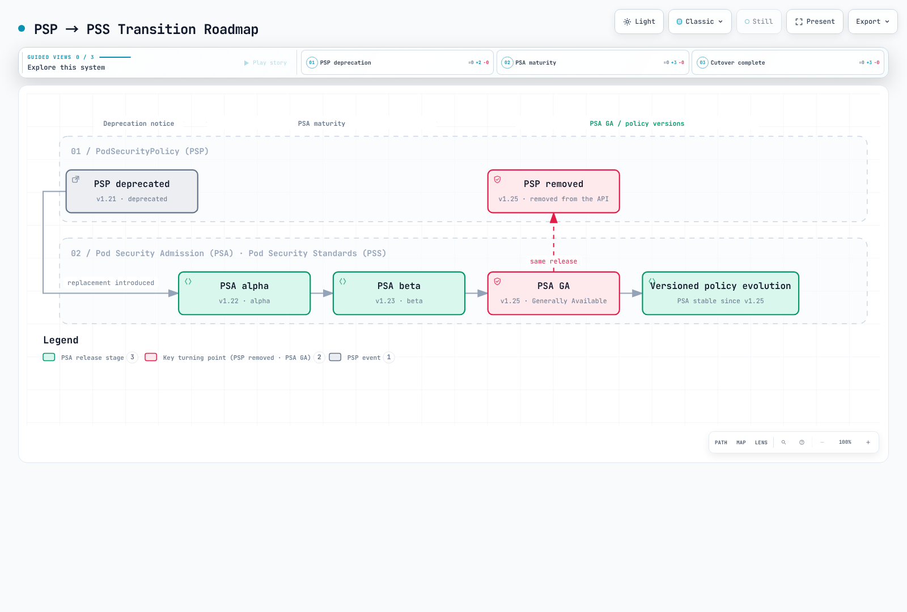
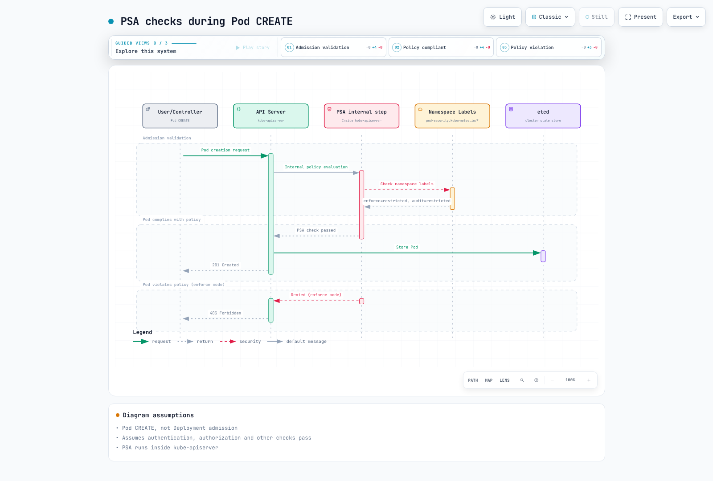
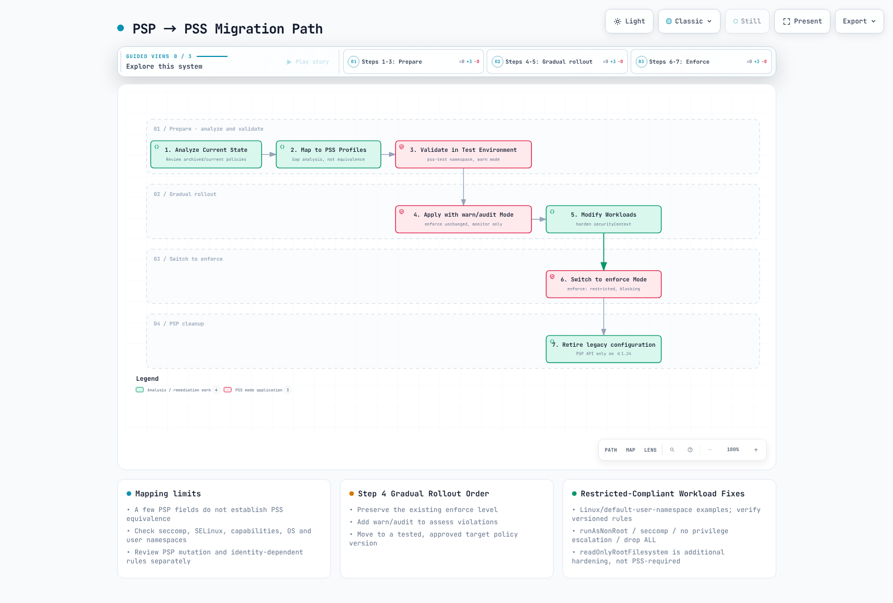

# Estándares de seguridad de Pod (PSS)

> **Base de validación**: Biblioteca PSA de Kubernetes v1.36.2; política PSS de ejemplo v1.35
> **Última actualización**: September 13, 2026

Los Estándares de seguridad de Pod (PSS) son un marco de políticas estandarizado para la seguridad de Pod en Kubernetes. Este documento abarca los conceptos de PSS, los métodos de configuración y la implementación en entornos EKS.

PSS define políticas; PSA es la implementación de admisión integrada que las aplica. Esta guía presupone **Pods de Linux ordinarios sin espacios de nombres de usuario**, salvo que se indique lo contrario. La evaluación de políticas upstream local y las comprobaciones de esquema/comandos son distintas del despliegue: no se probó ningún clúster activo, EKS ni ejecución de contenedores. El ejemplo `v1.35` es una definición de política fijada, no una afirmación sobre la versión compatible más reciente de Kubernetes/EKS. `latest` cambia de significado cuando se actualiza el servidor de API.

## Tabla de contenido

1. [Evolución de PSP a PSS](#evolution-from-psp-to-pss)
2. [Controlador de Pod Security Admission (PSA)](#pod-security-admission-psa-controller)
3. [Niveles de seguridad](#security-levels)
4. [Modos de aplicación](#enforcement-modes)
5. [Configuración a nivel de Namespace](#namespace-level-configuration)
6. [Migración de PSP a PSS](#migration-from-psp-to-pss)
7. [Valores predeterminados y configuración de EKS](#eks-defaults-and-configuration)
8. [Detalles de perfiles de seguridad](#security-profile-details)
9. [Configuración de exenciones](#exemptions-configuration)
10. [Prácticas recomendadas para la adopción gradual](#best-practices-for-gradual-adoption)

---

## Evolución de PSP a PSS

### Historia de PodSecurityPolicy (PSP)

PodSecurityPolicy (PSP) se introdujo por primera vez en Kubernetes 1.3 como un mecanismo de seguridad de Pod. Sin embargo, se deprecó en Kubernetes 1.21 y se eliminó por completo en 1.25 debido a los siguientes problemas:

```
┌─────────────────────────────────────────────────────────────────┐
│                    Key Issues with PSP                           │
├─────────────────────────────────────────────────────────────────┤
│ 1. Complex RBAC binding requirements                             │
│ 2. Implicit policy application (unclear which policy applies)    │
│ 3. User vs workload permission confusion                         │
│ 4. No warn/audit rollout modes                                               │
│ 5. Limited audit capabilities                                    │
└─────────────────────────────────────────────────────────────────┘
```

### Introducción de PSS

Los Estándares de seguridad de Pod (PSS) y Pod Security Admission (PSA) se introdujeron como alfa en Kubernetes 1.22, pasaron a beta en 1.23 y alcanzaron GA (Generally Available) en 1.25.



[🔍 Ver diagrama interactivo](https://www.atomai.click/kubernetes-docs/archmaps/en-security-03-pod-security-standards-0.html)

> Interpretación del diagrama: PSA alcanzó GA en 1.25; 1.28 no es un hito de estabilización independiente.

### Comparación entre PSP y PSS

| Característica | PodSecurityPolicy (PSP) | Estándares de seguridad de Pod (PSS) |
|---------|------------------------|------------------------------|
| **Activación** | Complemento de admisión anterior | Definiciones PSS aplicadas por el complemento PSA integrado |
| **Definición de política** | Recursos PSP personalizados | Tres perfiles predefinidos |
| **Vinculación de políticas** | Vinculación RBAC compleja | Etiquetas de Namespace simples |
| **Ámbito** | En todo el clúster o Namespace | Nivel de Namespace |
| **Vista previa de políticas** | No hay modos warn/audit tipo PSA; el dry-run de API es independiente | Modos warn/audit más dry-run de API |
| **Auditoría** | Limitada | Compatibilidad de auditoría integrada |
| **Flexibilidad** | Alta (control granular) | Media (perfiles estandarizados) |
| **Complejidad** | Alta | Baja |

---

## Controlador de Pod Security Admission (PSA)

### Arquitectura de PSA

PSA se ejecuta **dentro del servidor de API durante la admisión de validación**, después de la admisión de mutación. También se aplican la autenticación, autorización, validación de esquema y otras comprobaciones de admisión. No es un webhook externo, y el diagrama no debe implicar un orden universal entre PSA y todos los demás validadores.

```text
Request → authentication / authorization → mutating admission
        → validating admission (PSA + other checks) → persistence if accepted
```

### Cómo funciona PSA



[🔍 Ver diagrama interactivo](https://www.atomai.click/kubernetes-docs/archmaps/en-security-03-pod-security-standards-1.html)

> Alcance del diagrama: PSA es interno al servidor de API. Un CREATE de Pod correcto se conserva solo después de que se superen todas las comprobaciones aplicables; la aprobación de PSA por sí sola no garantiza 201 Created.

### Verificación del estado de PSA

PSA pasó a beta y se habilitó de forma predeterminada en Kubernetes 1.23, y después alcanzó GA en 1.25. La ausencia de una marca explícita `--enable-admission-plugins=PodSecurity` no significa que esté deshabilitado. Inspeccione la configuración del servidor de API autogestionado para detectar una deshabilitación explícita; EKS no expone esa configuración. Las métricas muestran evaluaciones, no una configuración de feature gate. El acceso a `/metrics` requiere autorización, y una serie no utilizada puede estar ausente.

```bash
kubectl --context "$PSS_CONTEXT" get namespace "$PSS_NAMESPACE" -o yaml
kubectl --context "$PSS_CONTEXT" get --raw /metrics
```

Utilice los controles de dry-run de Pod positivo/negativo que aparecen abajo para probar la ruta de admisión real. Nunca infiera cumplimiento únicamente a partir de un dry-run correcto de Deployment.

---

## Niveles de seguridad

PSS define tres niveles de seguridad (perfiles). Cada nivel aplica restricciones de seguridad progresivamente más estrictas.

### 1. Privileged

Este perfil no añade restricciones de PSS. No habilita automáticamente los privilegios de contenedor ni omite RBAC, la validación de API u otras políticas de admisión.

```yaml
# Privileged profile: PSS imposes no controls; API/RBAC/other policies still apply
# Use cases: System daemons, CNI plugins, monitoring agents

apiVersion: v1
kind: Pod
metadata:
  name: privileged-pod
  namespace: pss-privileged-lab
spec:
  hostNetwork: true      # Allowed
  hostPID: true          # Allowed
  hostIPC: true          # Allowed
  containers:
  - name: privileged-container
    image: nginx
    securityContext:
      privileged: true   # Allowed
      runAsUser: 0    # Allowed
```

**El nivel Privileged permite:**
- Espacios de nombres de red, PID e IPC de host
- Contenedores privilegiados
- Todas las capabilities
- Montajes HostPath
- Cualquier ID de usuario/grupo

### 2. Baseline

Aplica restricciones mínimas para evitar escaladas de privilegios conocidas. Es adecuado para la mayoría de las cargas de trabajo generales.

```yaml
# Baseline level: Prevents known privilege escalations
# Use cases: General applications, web servers, API servers

apiVersion: v1
kind: Pod
metadata:
  name: baseline-pod
spec:
  containers:
  - name: app
    image: nginx
    securityContext:
      # The following are prohibited in Baseline:
      # privileged: true        ❌
      # allowPrivilegeEscalation is not constrained by Baseline

      # The following are allowed in Baseline:
      runAsNonRoot: false      # ✓ (allowed but not recommended)
      readOnlyRootFilesystem: false  # ✓ (allowed)
    ports:
    - containerPort: 80
```

**Restricciones del nivel Baseline:**

| Campo | Restricción |
|-------|------------|
| HostProcess | Se prohíben los contenedores Windows HostProcess |
| Espacios de nombres de host | Se prohíben hostNetwork, hostPID, hostIPC |
| Contenedores privilegiados | Se prohíbe privileged: true |
| Capabilities | Las adiciones explícitas se limitan a la allowlist Baseline indicada; `NET_RAW` no está en ella |
| Volúmenes HostPath | Se prohíben los volúmenes hostPath |
| Puertos de host | PSA integrado permite sin establecer/0; no tiene una allowlist de puertos personalizada |
| AppArmor | Sin establecer o RuntimeDefault/Localhost; las anotaciones heredadas usan runtime/default o localhost/* |
| SELinux | Solo valores de tipo restringidos; se prohíbe la configuración de usuario/rol |
| Tipo de montaje /proc | Solo se permite el valor predeterminado |
| Seccomp | Se permite sin establecer; si se especifica, RuntimeDefault o Localhost (no Unconfined) |
| Sysctls | Solo la allowlist explícita de sysctl de la versión PSS; no todos los sysctl seguros para kubelet |

### 3. Restricted

La política más restrictiva que aplica las prácticas recomendadas de hardening de seguridad de Pod. Es adecuada para cargas de trabajo sensibles a la seguridad.

```yaml
apiVersion: v1
kind: Pod
metadata:
  name: restricted-pod
spec:
  automountServiceAccountToken: false
  securityContext:
    runAsNonRoot: true
    runAsUser: 101
    runAsGroup: 101
    fsGroup: 101
    seccompProfile:
      type: RuntimeDefault
  containers:
  - name: app
    image: ghcr.io/nginx/nginx-unprivileged@sha256:442753882674b49ae2c1de83ed67896131c0777f56df5005e356e62bc3f7e7ce
    securityContext:
      allowPrivilegeEscalation: false
      readOnlyRootFilesystem: true
      capabilities:
        drop: [ALL]
    ports:
    - containerPort: 8080
    resources:
      requests:
        cpu: 50m
        memory: 64Mi
      limits:
        cpu: 500m
        memory: 128Mi
    volumeMounts:
    - name: tmp
      mountPath: /tmp
  volumes:
  - name: tmp
    emptyDir: {}
```

**Restricciones adicionales del nivel Restricted:**

| Campo | Restricción |
|-------|------------|
| Tipos de volumen | Solo se permiten configMap, csi, downwardAPI, emptyDir, ephemeral, persistentVolumeClaim, projected, secret |
| Escalada de privilegios | Se requiere allowPrivilegeEscalation: false |
| Ejecución como no root | Se requiere runAsNonRoot: true |
| Ejecución como usuario no root | Se prohíbe runAsUser: 0 explícito (v1.23+); el campo puede omitirse |
| Seccomp | Se requiere RuntimeDefault o Localhost |
| Capabilities | Deben eliminarse todas las capabilities; solo se puede añadir NET_BIND_SERVICE |


Los controles se aplican a los contenedores regulares, init y efímeros aplicables. Un valor no root/seccomp a nivel de Pod se puede heredar; una sobrescritura de contenedor en conflicto no cumple. La política v1.34+ también prohíbe un `host` no vacío en las sondas HTTP/TCP y hooks de ciclo de vida. En v1.35, `hostUsers: false` relaja las comprobaciones no root; Baseline también relaja `procMount`, pero Restricted sigue prohibiendo `Unmasked`. Esto requiere compatibilidad real con espacios de nombres de usuario, no solo una etiqueta. Las relajaciones específicas de Windows para la escalada de privilegios, seccomp y capabilities de Linux son independientes de este ejemplo de Linux.

### Gráfico comparativo de niveles de seguridad

```
┌──────────────────────────────────────────────────────────────────────────┐
│                     Security Level Comparison                             │
├──────────────────────────────────────────────────────────────────────────┤
│                                                                          │
│  Restriction  ━━━━━━━━━━━━━━━━━━━━━━━━━━━━━━━━━━━━━━━━━━━━━━━━━━━▶       │
│               Low                                           High          │
│                                                                          │
│  ┌──────────────┐    ┌──────────────┐    ┌──────────────┐               │
│  │  Privileged  │    │   Baseline   │    │  Restricted  │               │
│  │              │    │              │    │              │               │
│  │ No           │    │ Prevent      │    │ Security     │               │
│  │ restrictions │    │ known        │    │ best         │               │
│  │              │    │ escalations  │    │ practices    │               │
│  │              │    │              │    │              │               │
│  │ Use cases:   │    │ Use cases:   │    │ Use cases:   │               │
│  │ - CNI        │    │ - General    │    │ - Financial  │               │
│  │ - CSI        │    │   apps       │    │   apps       │               │
│  │ - Monitoring │    │ - Web        │    │ - Healthcare │               │
│  │              │    │   servers    │    │ - Multi-     │               │
│  │              │    │ - API        │    │   tenant     │               │
│  └──────────────┘    └──────────────┘    └──────────────┘               │
│                                                                          │
└──────────────────────────────────────────────────────────────────────────┘
```

---

## Modos de aplicación

PSA proporciona tres modos de aplicación. Estos modos se pueden utilizar de forma independiente o conjunta.

### 1. enforce

Rechaza la creación de Pod que infringe las reglas y las actualizaciones relevantes de Pod. Las plantillas de cargas de trabajo reciben comprobaciones warn/audit; la aplicación ocurre en los Pods resultantes. Volver a etiquetar un Namespace no expulsa los Pods que ya están en ejecución.

```yaml
# enforce mode: Block Pod creation on violation
apiVersion: v1
kind: Namespace
metadata:
  name: production
  labels:
    pod-security.kubernetes.io/enforce: restricted
    pod-security.kubernetes.io/enforce-version: v1.35
```

**Extracto de respuesta ilustrativo (no es una ejecución de clúster registrada):**
```text
# Attempting to create a policy-violating Pod
$ kubectl apply --dry-run=server -f privileged-pod.yaml -n production
Error from server (Forbidden): error when creating "privileged-pod.yaml":
pods "privileged-pod" is forbidden: violates PodSecurity "restricted:v1.35":
privileged (container "app" must not set securityContext.privileged=true),
allowPrivilegeEscalation != false (container "app" must set
securityContext.allowPrivilegeEscalation=false)
```

### 2. audit

Añade anotaciones de infracción a los eventos de auditoría; este modo no rechaza por sí mismo la solicitud. La configuración de la política de auditoría/entrega de logs determina si esos eventos se conservan. Otros modos y comprobaciones de admisión pueden seguir rechazando la solicitud.

```yaml
# audit mode: Record violations in audit logs
apiVersion: v1
kind: Namespace
metadata:
  name: staging
  labels:
    pod-security.kubernetes.io/audit: restricted
    pod-security.kubernetes.io/audit-version: v1.35
```

**Extracto sintético de evento de auditoría (no es un evento capturado completo):**
```json
{
  "kind": "Event",
  "apiVersion": "audit.k8s.io/v1",
  "level": "Metadata",
  "auditID": "00000000-0000-4000-8000-000000000001",
  "stage": "ResponseComplete",
  "requestURI": "/api/v1/namespaces/staging/pods",
  "verb": "create",
  "user": {
    "username": "developer@example.com"
  },
  "objectRef": {
    "resource": "pods",
    "namespace": "staging",
    "name": "my-pod"
  },
  "annotations": {
    "pod-security.kubernetes.io/audit-violations": "privileged (container \"app\" must not set securityContext.privileged=true)"
  }
}
```

### 3. warn

Devuelve advertencias visibles para el cliente sin rechazar por sí mismo la solicitud; enforce u otras comprobaciones de admisión pueden seguir rechazándola.

```yaml
# warn mode: Display warning messages on violation
apiVersion: v1
kind: Namespace
metadata:
  name: development
  labels:
    pod-security.kubernetes.io/warn: restricted
    pod-security.kubernetes.io/warn-version: v1.35
```

**Extracto de advertencia ilustrativo (no es una ejecución registrada):**
```text
$ kubectl apply --dry-run=server -f non-compliant-pod.yaml -n development
Warning: would violate PodSecurity "restricted:v1.35":
allowPrivilegeEscalation != false (container "app" must set
securityContext.allowPrivilegeEscalation=false),
unrestricted capabilities (container "app" must set
securityContext.capabilities.drop=["ALL"])
pod/my-pod created (server dry run)
```

### Estrategia de combinación de modos

La fase Privileged inicial es solo para un Namespace sin una política existente más fuerte. Nunca reduzca la aplicación Baseline/Restricted para seguir este diagrama.

En entornos de producción, se recomienda combinar varios modos:

```yaml
# Recommended configuration: Use mode combinations
apiVersion: v1
kind: Namespace
metadata:
  name: app-namespace
  labels:
    # Current enforcement level
    pod-security.kubernetes.io/enforce: baseline
    pod-security.kubernetes.io/enforce-version: v1.35
    # Audit next level
    pod-security.kubernetes.io/audit: restricted
    pod-security.kubernetes.io/audit-version: v1.35
    # Warn next level
    pod-security.kubernetes.io/warn: restricted
    pod-security.kubernetes.io/warn-version: v1.35
```

```
┌─────────────────────────────────────────────────────────────────┐
│                    Mode Combination Strategy                      │
├─────────────────────────────────────────────────────────────────┤
│                                                                 │
│  Phase 1: Assess Current State                                   │
│  ┌─────────────────────────────────────────────────────────┐   │
│  │ enforce: privileged                                      │   │
│  │ audit: baseline                                          │   │
│  │ warn: baseline                                           │   │
│  └─────────────────────────────────────────────────────────┘   │
│                           │                                     │
│                           ▼                                     │
│  Phase 2: Gradual Hardening                                      │
│  ┌─────────────────────────────────────────────────────────┐   │
│  │ enforce: baseline                                        │   │
│  │ audit: restricted                                        │   │
│  │ warn: restricted                                         │   │
│  └─────────────────────────────────────────────────────────┘   │
│                           │                                     │
│                           ▼                                     │
│  Phase 3: Final Goal                                             │
│  ┌─────────────────────────────────────────────────────────┐   │
│  │ enforce: restricted                                      │   │
│  │ audit: restricted                                        │   │
│  │ warn: restricted                                         │   │
│  └─────────────────────────────────────────────────────────┘   │
│                                                                 │
└─────────────────────────────────────────────────────────────────┘
```

---

## Configuración a nivel de Namespace

### Configuración básica de etiquetas

PSS se configura mediante etiquetas de Namespace:

```yaml
apiVersion: v1
kind: Namespace
metadata:
  name: secure-namespace
  labels:
    # Format: pod-security.kubernetes.io/<MODE>: <LEVEL>
    pod-security.kubernetes.io/enforce: restricted
    pod-security.kubernetes.io/enforce-version: v1.35
    pod-security.kubernetes.io/audit: restricted
    pod-security.kubernetes.io/audit-version: v1.35
    pod-security.kubernetes.io/warn: restricted
    pod-security.kubernetes.io/warn-version: v1.35
```

### Especificación de versión

Puede usar definiciones PSS de una versión específica de Kubernetes:

```yaml
apiVersion: v1
kind: Namespace
metadata:
  name: versioned-namespace
  labels:
    # Use PSS definitions from a specific version
    pod-security.kubernetes.io/enforce: restricted
    pod-security.kubernetes.io/enforce-version: v1.35  # Specific version

    # Using 'latest' applies PSS from current cluster version
    # pod-security.kubernetes.io/enforce-version: latest
```

### Ejemplos de configuración específicos del entorno

```yaml
---
# Development environment: Relaxed policy
apiVersion: v1
kind: Namespace
metadata:
  name: development
  labels:
    environment: development
    pod-security.kubernetes.io/enforce: baseline
    pod-security.kubernetes.io/warn: restricted
---
# Staging environment: Intermediate policy
apiVersion: v1
kind: Namespace
metadata:
  name: staging
  labels:
    environment: staging
    pod-security.kubernetes.io/enforce: baseline
    pod-security.kubernetes.io/audit: restricted
    pod-security.kubernetes.io/warn: restricted
---
# Production environment: Strict policy
apiVersion: v1
kind: Namespace
metadata:
  name: production
  labels:
    environment: production
    pod-security.kubernetes.io/enforce: restricted
    pod-security.kubernetes.io/audit: restricted
    pod-security.kubernetes.io/warn: restricted
```

### Adición de etiquetas a Namespaces existentes

```bash
# Add labels using kubectl
kubectl label namespace my-namespace \
  pod-security.kubernetes.io/enforce=restricted \
  pod-security.kubernetes.io/enforce-version=v1.35 \
  pod-security.kubernetes.io/audit=restricted \
  pod-security.kubernetes.io/warn=restricted

# Verify labels
kubectl get namespace my-namespace -o yaml | grep pod-security
```

---

## Migración de PSP a PSS

### Resumen de la migración

La migración de PSP a PSS debe planificarse cuidadosamente y realizarse por etapas.



[🔍 Ver diagrama interactivo](https://www.atomai.click/kubernetes-docs/archmaps/en-security-03-pod-security-standards-2.html)

> Alcance del diagrama: el análisis/eliminación de PSP es histórico. Nunca reduzca una política enforce existente más fuerte para observar; readOnlyRootFilesystem se recomienda, pero no lo exige Restricted.

### Paso 1: Analizar PSP actual

**Solo procedimiento histórico:** los comandos/recursos de PSP siguientes se aplican a clústeres antiguos que aún ofrecían `policy/v1beta1` (hasta Kubernetes 1.24), o a manifiestos guardados. No aplique este PSP a un clúster actual. También haga un inventario de los campos que PSP establecía o mutaba previamente de forma predeterminada; PSA no los completa.

```bash
# List current PSPs
kubectl get psp

# Get PSP details
kubectl get psp <psp-name> -o yaml

# Check Pods with PSP applied
kubectl get pods --all-namespaces -o jsonpath='{range .items[*]}{.metadata.namespace}/{.metadata.name}: {.metadata.annotations.kubernetes\.io/psp}{"\n"}{end}'
```

### Paso 2: Asignar PSP a perfiles PSS

```yaml
# Example: Existing PSP
apiVersion: policy/v1beta1
kind: PodSecurityPolicy
metadata:
  name: restricted-psp
spec:
  privileged: false
  allowPrivilegeEscalation: false
  requiredDropCapabilities:
    - ALL
  volumes:
    - 'configMap'
    - 'emptyDir'
    - 'projected'
    - 'secret'
    - 'downwardAPI'
    - 'persistentVolumeClaim'
  hostNetwork: false
  hostIPC: false
  hostPID: false
  runAsUser:
    rule: MustRunAsNonRoot
  seLinux:
    rule: RunAsAny
  fsGroup:
    rule: RunAsAny
  supplementalGroups:
    rule: RunAsAny
```

**Resultado del mapeo:** Restricted es un objetivo candidato, no una política equivalente. Este PSP carece del control seccomp requerido y permite configuraciones SELinux que PSS puede rechazar. Compare cada control y cada Pod resultante; tres campos seleccionados no pueden establecer equivalencia.

### Tabla de mapeo de PSP a PSS

| Requisito de la carga de trabajo | Perfil PSS candidato | Revisión necesaria |
|---|---|---|
| Espacios de nombres de host, contenedor privilegiado o hostPath | Privileged | Aísle la excepción y aplique controles adicionales |
| No hay acceso al host, pero se necesita un proceso root | Baseline | Compruebe cada control Baseline, incluidas capabilities y seccomp |
| No root, sin escalada de privilegios, eliminar ALL | Restricted | Compruebe también volúmenes, seccomp, sobrescrituras y controles específicos de versión |

### Paso 3: Validar en el entorno de prueba

```bash
# Create test namespace
kubectl create namespace pss-test

# Apply restricted in warn mode
kubectl label namespace pss-test \
  pod-security.kubernetes.io/warn=restricted \
  pod-security.kubernetes.io/warn-version=v1.35

# Test existing workload deployment
kubectl apply -f my-deployment.yaml -n pss-test

# Check warnings and modify workloads
```

### Paso 4: Aplicación gradual

```yaml
# Staged migration namespace configuration
apiVersion: v1
kind: Namespace
metadata:
  name: migrating-namespace
  labels:
    # Phase 1: New namespace without a previous stronger enforce policy
    pod-security.kubernetes.io/enforce: privileged
    pod-security.kubernetes.io/audit: baseline
    pod-security.kubernetes.io/warn: baseline

    # Phase 2: Apply baseline, monitor restricted
    # pod-security.kubernetes.io/enforce: baseline
    # pod-security.kubernetes.io/audit: restricted
    # pod-security.kubernetes.io/warn: restricted

    # Phase 3: Final restricted enforcement
    # pod-security.kubernetes.io/enforce: restricted
```

### Paso 5: Modificar cargas de trabajo

Antes: un Pod `nginx` simple sin contexto de seguridad no supera las comprobaciones Restricted. Añadir solo `runAsNonRoot` es insuficiente: el usuario de la imagen, el listener y las rutas de escritura también deben ser compatibles. El Pod corregido usa la imagen upstream sin privilegios (UID/GID 101), el puerto 8080 y `/tmp` con permisos de escritura junto con un sistema de archivos raíz de solo lectura.

```yaml
apiVersion: v1
kind: Pod
metadata:
  name: new-pod
spec:
  automountServiceAccountToken: false
  securityContext:
    runAsNonRoot: true
    runAsUser: 101
    runAsGroup: 101
    fsGroup: 101
    seccompProfile:
      type: RuntimeDefault
  containers:
  - name: app
    image: ghcr.io/nginx/nginx-unprivileged@sha256:442753882674b49ae2c1de83ed67896131c0777f56df5005e356e62bc3f7e7ce
    securityContext:
      allowPrivilegeEscalation: false
      readOnlyRootFilesystem: true
      capabilities:
        drop: [ALL]
    ports:
    - containerPort: 8080
    resources:
      requests:
        cpu: 50m
        memory: 64Mi
      limits:
        cpu: 500m
        memory: 128Mi
    volumeMounts:
    - name: tmp
      mountPath: /tmp
  volumes:
  - name: tmp
    emptyDir: {}
```

### Script de automatización de migración

Esto se dirige deliberadamente a **un Namespace revisado**, añade solo etiquetas warn/audit previamente ausentes, conserva enforce y usa la versión de recurso observada para rechazar una edición simultánea. Es una mutación real de Namespace cuando se ejecuta; inspeccione primero el objetivo. Las etiquetas existentes provocan un error para comparación manual en lugar de una reducción automática. Las advertencias aparecen en solicitudes posteriores, no como un análisis retrospectivo de todos los Pods en ejecución.

```python
#!/usr/bin/env python3
# add-pss-observation.py CONTEXT NAMESPACE
import json, subprocess, sys

if len(sys.argv) != 3:
    raise SystemExit("Usage: add-pss-observation.py CONTEXT NAMESPACE")
context, namespace = sys.argv[1:]
if namespace in {"kube-system", "kube-public", "kube-node-lease"}:
    raise SystemExit("Refusing system namespace; review its workload requirements separately")
base = ["kubectl", "--context", context, "--request-timeout=30s"]
obj = json.loads(subprocess.run(
    base + ["get", "namespace", namespace, "-o", "json"],
    check=True, text=True, capture_output=True).stdout)
labels = obj["metadata"].get("labels", {})
new = {
    "pod-security.kubernetes.io/warn": "restricted",
    "pod-security.kubernetes.io/warn-version": "v1.35",
    "pod-security.kubernetes.io/audit": "restricted",
    "pod-security.kubernetes.io/audit-version": "v1.35",
}
if any(key in labels for key in new):
    raise SystemExit("Existing observation policy: review it; do not overwrite automatically")
subprocess.run(base + [
    "label", "namespace", namespace,
    "--resource-version=" + obj["metadata"]["resourceVersion"],
] + [key + "=" + value for key, value in new.items()], check=True)
```

---

## Valores predeterminados y configuración de EKS

### Configuración predeterminada de PSA en EKS

AWS documenta PSA como habilitado de forma predeterminada desde EKS 1.23, con valores predeterminados del clúster `privileged/latest` para todos los modos y sin exenciones estáticas. Esos valores predeterminados permisivos no son una política de hardening de cargas de trabajo. Las etiquetas de Namespace creadas por herramientas de plataforma o administradores pueden sobrescribir los valores predeterminados; inspeccione el Namespace real en lugar de suponer que todos los Namespaces no están etiquetados.

```bash
kubectl --context "$PSS_CONTEXT" get namespace "$PSS_NAMESPACE" -o yaml
```

### Configuración de PSS en EKS

```yaml
# Apply PSS to EKS namespace
apiVersion: v1
kind: Namespace
metadata:
  name: eks-app-namespace
  labels:
    # Example rollout choice, not a universal AWS requirement
    pod-security.kubernetes.io/enforce: baseline
    pod-security.kubernetes.io/enforce-version: v1.35
    pod-security.kubernetes.io/audit: restricted
    pod-security.kubernetes.io/warn: restricted

    # EKS-related labels
    app.kubernetes.io/managed-by: eks
```

### Consideraciones para Namespaces de sistema de EKS

Un agente de acceso al host no puede cumplir Baseline, pero eso no significa que cada Pod en `kube-system` necesite privilegios completos. Revise la versión exacta del complemento y la especificación de Pod procesada. Evite una sobrescritura general que deshabilite warn/audit para todo un Namespace de sistema. Cuando sea posible, aísle los agentes de host aprobados de las aplicaciones ordinarias y restrinja quién puede desplegar allí. Lo siguiente es un Namespace de ejemplo dedicado, no una instrucción para volver a etiquetar Namespaces de sistema existentes.

```yaml
apiVersion: v1
kind: Namespace
metadata:
  name: host-agents
  labels:
    pod-security.kubernetes.io/enforce: privileged
    pod-security.kubernetes.io/audit: restricted
    pod-security.kubernetes.io/audit-version: v1.35
    pod-security.kubernetes.io/warn: restricted
    pod-security.kubernetes.io/warn-version: v1.35
```

### Complementos de EKS y compatibilidad con PSS

| Componente / despliegue típico | Punto de revisión PSS |
|---|---|
| VPC CNI `aws-node`, kube-proxy | Las operaciones de red de host o de nodo privilegiadas pueden superar Baseline |
| DaemonSets de nodo EBS/EFS CSI | Los montajes de host pueden superar Baseline; los Pods de controlador tienen necesidades distintas |
| CloudWatch Agent / Fluent Bit a nivel de nodo | El acceso a logs/sistema de archivos del host depende de la configuración real |
| CoreDNS, AWS Load Balancer Controller, Cluster Autoscaler | Evalúe la especificación procesada respecto a Baseline/Restricted; un nombre de componente por sí solo no demuestra cumplimiento |

Los componentes de nodo integrados de EKS Auto Mode son distintos de los complementos autogestionados. Esta tabla es una ayuda de revisión, no una matriz de compatibilidad probada ni un requisito para instalar todos los complementos enumerados.

### Ejemplo de Terraform para EKS

Este fragmento administra un Namespace de aplicación. Configure y revise por separado el proveedor de Kubernetes y su contexto objetivo; no se ejecutó ninguna inicialización, plan ni apply del proveedor. Adopte/importe un Namespace existente a través de su propietario en lugar de crear una propiedad de Terraform/GitOps en competencia. La política está deliberadamente fijada y no se cambian etiquetas de Namespace de sistema.

```hcl
# Provider authentication/context and ownership must be configured separately.
resource "kubernetes_namespace_v1" "app" {
  metadata {
    name = "my-app"
    labels = {
      "pod-security.kubernetes.io/enforce"         = "restricted"
      "pod-security.kubernetes.io/enforce-version" = "v1.35"
      "pod-security.kubernetes.io/audit"           = "restricted"
      "pod-security.kubernetes.io/audit-version"   = "v1.35"
      "pod-security.kubernetes.io/warn"            = "restricted"
      "pod-security.kubernetes.io/warn-version"    = "v1.35"
      "environment"                              = "production"
    }
  }
}
```

---

## Detalles de perfiles de seguridad

### Detalles del perfil Privileged

El perfil Privileged no impone restricciones PSS; la validación de API, RBAC y otras comprobaciones de admisión siguen vigentes. El siguiente ejemplo de root de host es solo para análisis de políticas, no una carga de trabajo recomendada para desplegar.

```yaml
# All options allowed in Privileged profile
apiVersion: v1
kind: Pod
metadata:
  name: privileged-example
spec:
  hostNetwork: true
  hostPID: true
  hostIPC: true
  containers:
  - name: privileged-container
    image: nginx
    securityContext:
      privileged: true
      allowPrivilegeEscalation: true
      runAsUser: 0
      capabilities:
        add:
          - ALL
    volumeMounts:
    - name: host-root
      mountPath: /host
  volumes:
  - name: host-root
    hostPath:
      path: /
      type: Directory
```

### Detalles del perfil Baseline

```yaml
# Baseline profile restrictions (v1.35)
#
# Prohibited fields and values:
#
# spec.hostNetwork: true prohibited
# spec.hostPID: true prohibited
# spec.hostIPC: true prohibited
#
# spec.containers[*].securityContext.privileged: true prohibited
# spec.initContainers[*].securityContext.privileged: true prohibited
# spec.ephemeralContainers[*].securityContext.privileged: true prohibited
#
# spec.containers[*].securityContext.capabilities.add restricted
#   - Allowed: NET_BIND_SERVICE (only this in Restricted)
#   - Additionally allowed in Baseline: AUDIT_WRITE, CHOWN, DAC_OVERRIDE,
#     FOWNER, FSETID, KILL, MKNOD, NET_BIND_SERVICE,
#     SETFCAP, SETGID, SETPCAP, SETUID, SYS_CHROOT
#
# spec.volumes[*].hostPath prohibited
#
# spec.containers[*].ports[*].hostPort prohibited (except 0)
#
# spec.securityContext.appArmorProfile.type restricted
#   - Allowed: profile omitted, or type RuntimeDefault/Localhost
#   - Prohibited: Unconfined
#
# spec.securityContext.seLinuxOptions.type restricted
#   - Prohibited: Custom types (container_t etc. allowed)
#
# spec.securityContext.seccompProfile.type restricted
#   - Prohibited: Unconfined
#
# spec.securityContext.sysctls restricted
#   - Only the explicit versioned PSS sysctl allowlist

apiVersion: v1
kind: Pod
metadata:
  name: baseline-compliant
spec:
  automountServiceAccountToken: false
  containers:
  - name: app
    image: ghcr.io/nginx/nginx-unprivileged@sha256:442753882674b49ae2c1de83ed67896131c0777f56df5005e356e62bc3f7e7ce
    ports:
    - containerPort: 8080
    securityContext:
      capabilities:
        drop: [ALL]
```

### Detalles del perfil Restricted

Restricted añade a Baseline su allowlist de volúmenes, ejecución no root, seccomp explícito, sin escalada de privilegios y la eliminación de todas las capabilities. `NET_BIND_SERVICE` es la única adición permitida, pero este listener 8080 no la necesita. `readOnlyRootFilesystem` es un hardening recomendado, no un requisito de PSS. Establecer `containerPort` es metadatos; no reconfigura Nginx.

```yaml
apiVersion: v1
kind: Pod
metadata:
  name: restricted-compliant
spec:
  automountServiceAccountToken: false
  securityContext:
    runAsNonRoot: true
    runAsUser: 101
    runAsGroup: 101
    fsGroup: 101
    seccompProfile:
      type: RuntimeDefault
  containers:
  - name: app
    image: ghcr.io/nginx/nginx-unprivileged@sha256:442753882674b49ae2c1de83ed67896131c0777f56df5005e356e62bc3f7e7ce
    securityContext:
      allowPrivilegeEscalation: false
      readOnlyRootFilesystem: true
      capabilities:
        drop: [ALL]
    ports:
    - containerPort: 8080
    resources:
      requests:
        cpu: 50m
        memory: 64Mi
      limits:
        cpu: 500m
        memory: 128Mi
    volumeMounts:
    - name: tmp
      mountPath: /tmp
  volumes:
  - name: tmp
    emptyDir: {}
```

### Ejemplo completo de Nginx compatible con Restricted

El digest se comprobó con los metadatos OCI upstream para Linux amd64/arm64 (Nginx 1.30.4, usuario 101); no se extrajo ninguna capa de imagen ni se ejecutó ningún contenedor. Upstream documenta el puerto 8080, `/tmp/nginx.pid` y rutas temporales en `/tmp`. El ConfigMap siguiente proporciona el listener y el endpoint de salud correspondientes. Créelo en el mismo Namespace antes del Deployment. Valide el inicio/readiness en su entorno aprobado antes del lanzamiento.

```yaml
apiVersion: apps/v1
kind: Deployment
metadata:
  name: nginx-restricted
  namespace: production
spec:
  replicas: 3
  selector:
    matchLabels:
      app: nginx
  template:
    metadata:
      labels:
        app: nginx
    spec:
      automountServiceAccountToken: false
      securityContext:
        runAsNonRoot: true
        runAsUser: 101  # nginx user
        runAsGroup: 101
        fsGroup: 101
        seccompProfile:
          type: RuntimeDefault
      containers:
      - name: nginx
        image: ghcr.io/nginx/nginx-unprivileged@sha256:442753882674b49ae2c1de83ed67896131c0777f56df5005e356e62bc3f7e7ce
        securityContext:
          allowPrivilegeEscalation: false
          readOnlyRootFilesystem: true
          runAsNonRoot: true
          runAsUser: 101
          capabilities:
            drop:
              - ALL
        ports:
        - containerPort: 8080
        resources:
          limits:
            cpu: 100m
            memory: 128Mi
          requests:
            cpu: 50m
            memory: 64Mi
        volumeMounts:
        - name: tmp
          mountPath: /tmp
        - name: config
          mountPath: /etc/nginx/conf.d
          readOnly: true
        livenessProbe:
          httpGet:
            path: /healthz
            port: 8080
          initialDelaySeconds: 5
          periodSeconds: 10
        readinessProbe:
          httpGet:
            path: /healthz
            port: 8080
          initialDelaySeconds: 5
          periodSeconds: 5
      volumes:
      - name: tmp
        emptyDir: {}
      - name: config
        configMap:
          name: nginx-config
---
apiVersion: v1
kind: ConfigMap
metadata:
  name: nginx-config
  namespace: production
data:
  default.conf: |
    server {
        listen 8080;
        server_name localhost;

        location / {
            root /usr/share/nginx/html;
            index index.html;
        }

        location /healthz {
            return 200 'OK';
            add_header Content-Type text/plain;
        }
    }
```

---

## Configuración de exenciones

### Configuración de exenciones a nivel de clúster

Los servidores de API autogestionados pueden cargar esta configuración mediante `--admission-control-config-file`. El ejemplo mantiene vacías todas las listas de exenciones. Las exenciones omiten **todos los modos PSA**. `usernames` coincide con un nombre de usuario de solicitud autenticada exacto, no con un grupo, comodín ni la futura ServiceAccount del Pod. Eximir una cuenta de controlador omitiría las comprobaciones para los Pods que crea en nombre de muchos usuarios. Los nombres de Namespace y RuntimeClass también deben coincidir exactamente. Configure una excepción solo después de restringir por separado quién puede usarla.

```yaml
# Self-managed API server configuration; not an EKS control-plane setting
apiVersion: apiserver.config.k8s.io/v1
kind: AdmissionConfiguration
plugins:
- name: PodSecurity
  configuration:
    apiVersion: pod-security.admission.config.k8s.io/v1
    kind: PodSecurityConfiguration
    defaults:
      enforce: baseline
      enforce-version: v1.35
      audit: restricted
      audit-version: v1.35
      warn: restricted
      warn-version: v1.35
    exemptions:
      usernames: []
      runtimeClasses: []
      namespaces: []
```

### Configuración de exenciones en EKS

EKS no permite editar AdmissionConfiguration del servidor de API administrado. El Namespace `enforce: privileged` es un perfil permisivo, **no una exención estática**: warn/audit todavía puede evaluar solicitudes. Restrinja los permisos de escritura/despliegue del Namespace y separe los agentes de host de las aplicaciones ordinarias. Por ejemplo, node-exporter configurado con hostNetwork/hostPID/hostPath no puede superar Baseline; establecer Baseline no hace que esos accesos al host sean seguros o permitidos.

```yaml
apiVersion: v1
kind: Namespace
metadata:
  name: host-agents
  labels:
    pod-security.kubernetes.io/enforce: privileged
    pod-security.kubernetes.io/audit: restricted
    pod-security.kubernetes.io/audit-version: v1.35
    pod-security.kubernetes.io/warn: restricted
    pod-security.kubernetes.io/warn-version: v1.35
```

### Exenciones basadas en RuntimeClass

Una RuntimeClass selecciona un handler de runtime CRI configurado. Crear el recurso no instala gVisor/Kata ni concede una excepción PSA. Todos los nodos objetivo deben admitir el handler (o usar restricciones de programación adecuadas). Esta definición por sí sola deja PSA completamente aplicable:

```yaml
apiVersion: node.k8s.io/v1
kind: RuntimeClass
metadata:
  name: gvisor
handler: runsc
```

Solo una exención `runtimeClasses: ["gvisor"]` configurada por separado en un servidor de API autogestionado omite PSA. Cualquier solicitud a la que se permita seleccionar esa clase podría entonces omitir PSA; el aislamiento de runtime no sustituye a la autorización de admisión. Esta configuración de control plane administrado no está disponible en EKS.

### Exenciones granulares con Kyverno

Kyverno no puede convertir una denegación de PSA en una autorización. Si un agente de host necesita una excepción, primero diseñe el perfil PSA del Namespace y los permisos de despliegue, y después añada una política de aplicación independiente con una excepción de ámbito reducido. Una exclusión solo de HostPath no excluye las comprobaciones hostNetwork/hostPID; hacer coincidir únicamente una etiqueta de imagen o una etiqueta de Pod mutable no es autorización.

Consulte [gestión de políticas de Kyverno](./01-kyverno-policy-management.md) para las API de políticas revisadas y los límites de versión/deprecación. No copie una `ClusterPolicy` heredada con `validationFailureAction: enforce` en minúsculas; no es un valor válido y ClusterPolicy está deprecada en Kyverno 1.19. Un reemplazo debe probarse tanto con las cargas de trabajo normales como con las de excepción.

---

## Prácticas recomendadas para la adopción gradual

### Paso 1: Analizar el estado actual

Obtenga una vista previa de un cambio en **enforce**, no en warn: solo un cambio de nivel/versión enforce activa la comprobación de Pods existentes. Este dry-run de servidor no guarda etiquetas ni expulsa Pods. Si la política enforce efectiva no cambia, no se activa un nuevo análisis. El análisis se realiza según el mejor esfuerzo y puede limitar/deduplicar advertencias; el silencio no es una auditoría completa de cargas de trabajo. Los errores de comando/autenticación siguen siendo errores.

```bash
#!/usr/bin/env bash
# preview-pss.sh: no namespace mutation
set -euo pipefail
: "${PSS_CONTEXT:?Set the approved test context}"
: "${PSS_NAMESPACE:?Set one namespace to inspect}"
kubectl --context "$PSS_CONTEXT" --request-timeout=30s \
  get namespace "$PSS_NAMESPACE" -o yaml
kubectl --context "$PSS_CONTEXT" --request-timeout=30s \
  label namespace "$PSS_NAMESPACE" \
  pod-security.kubernetes.io/enforce=restricted \
  pod-security.kubernetes.io/enforce-version=v1.35 \
  --overwrite --dry-run=server
```

### Paso 2: Estrategia de lanzamiento gradual

Los intervalos de días son una programación de planificación ilustrativa, no duraciones de migración medidas. Utilice un inventario explícito de Namespaces, nunca reduzca una política existente más fuerte y avance solo después de probar Pods de reemplazo y la capacidad de reversión.

```yaml
# Gradual rollout using GitOps

# Phase 1: Monitoring (Day 1-7)
# - Apply warn: baseline to all namespaces
# - Collect and analyze violations

# Phase 2: Development Environment (Day 8-14)
# - Apply enforce: baseline to development namespaces
# - Apply warn: baseline to staging namespaces

# Phase 3: Staging Environment (Day 15-21)
# - Apply enforce: baseline to staging namespaces
# - Apply warn: baseline to production namespaces

# Phase 4: Production Environment (Day 22-28)
# - Apply enforce: baseline to production namespaces
# - Apply warn: restricted to all environments

# Phase 5: Restricted Hardening (Day 29+)
# - Apply enforce: restricted as default for new namespaces
# - Gradually migrate existing namespaces
```

### Paso 3: Configurar monitorización y alertas

Estas reglas requieren CRD de Prometheus Operator, un selector que incluya esta PrometheusRule y un scrape autorizado del servidor de API que exponga `pod_security_evaluations_total`. PSA integrado no es un webhook llamado `pod-security-webhook`. Las etiquetas de evaluación incluyen decision, policy_level, policy_version, mode, request_operation, resource y subresource; **no hay etiqueta de namespace**. Correlacione los eventos de auditoría retenidos para los detalles de namespace/solicitud. La ausencia de métricas no demuestra cero infracciones; una denegación en modo audit significa una evaluación infractora, no necesariamente una solicitud de API rechazada.

```yaml
apiVersion: monitoring.coreos.com/v1
kind: PrometheusRule
metadata:
  name: pss-violations
  namespace: monitoring
spec:
  groups:
  - name: pod-security-standards
    rules:
    - alert: PSSViolationDetected
      expr: |
        sum by (policy_level, policy_version, mode) (
          increase(pod_security_evaluations_total{mode="enforce",decision="deny"}[5m])
        ) > 0
      labels:
        severity: warning
      annotations:
        summary: "PSA denied a Pod request"
        description: "Policy {{ $labels.policy_level }}:{{ $labels.policy_version }}. Correlate audit logs for namespace and request identity."
    - alert: PSSAuditViolation
      expr: |
        sum by (policy_level, policy_version, mode) (
          increase(pod_security_evaluations_total{mode="audit",decision="deny"}[5m])
        ) > 10
      for: 5m
      labels:
        severity: info
      annotations:
        summary: "PSA audit violations increasing"
        description: "{{ $value }} violating evaluations over five minutes; not a count of unique Pods."
```

### Paso 4: Comprobaciones de cumplimiento automatizadas

Guarde esto como `check-pss.py` en el proyecto propietario de las cargas de trabajo. Requisitos previos: Python 3 con PyYAML, un kubectl compatible, credenciales de clúster aprobadas, un servidor de API de Kubernetes compatible con la política v1.35 y un Namespace de prueba existente que aplique explícitamente `restricted:v1.35`. El autor de la llamada necesita autorización de lectura de Namespace y creación de Pod, incluso para el dry-run de servidor. No exponga las credenciales del clúster a código de pull request no confiable.

```python
#!/usr/bin/env python3
# check-pss.py CONTEXT NAMESPACE pod.yaml [pod2.yaml ...]
# Requires Python 3 + PyYAML and a preconfigured, authorized kubectl.
import copy, json, subprocess, sys
from pathlib import Path
import yaml

if len(sys.argv) < 4:
    raise SystemExit("Usage: check-pss.py CONTEXT NAMESPACE pod.yaml [...]")
context, namespace, *files = sys.argv[1:]
pods = []
for filename in files:
    docs = list(yaml.safe_load_all(Path(filename).read_text()))
    if not docs or any(not isinstance(p, dict) for p in docs):
        raise SystemExit(f"{filename}: empty/non-object YAML")
    for pod in docs:
        if (pod.get("apiVersion"), pod.get("kind")) != ("v1", "Pod"):
            raise SystemExit(f"{filename}: only explicit v1 Pod test inputs are supported")
        meta = pod.setdefault("metadata", {})
        if meta.get("namespace", namespace) != namespace:
            raise SystemExit(f"{filename}: namespace mismatch")
        meta["namespace"] = namespace
        pods.append(pod)
base = ["kubectl", "--context", context, "--request-timeout=30s"]
ns = json.loads(subprocess.run(
    base + ["get", "namespace", namespace, "-o", "json"],
    check=True, text=True, capture_output=True).stdout)
labels = ns["metadata"].get("labels", {})
if (labels.get("pod-security.kubernetes.io/enforce"),
    labels.get("pod-security.kubernetes.io/enforce-version")) != ("restricted", "v1.35"):
    raise SystemExit("Test namespace must explicitly enforce restricted:v1.35")

def dry_run(pod):
    return subprocess.run(
        base + ["create", "--dry-run=server", "--validate=strict",
                "--namespace", namespace, "-f", "-"],
        input=json.dumps(pod), text=True, capture_output=True)

control = {
    "apiVersion": "v1", "kind": "Pod",
    "metadata": {"generateName": "pss-control-", "namespace": namespace},
    "spec": {
        "automountServiceAccountToken": False,
        "securityContext": {"runAsNonRoot": True, "runAsUser": 65532,
                            "seccompProfile": {"type": "RuntimeDefault"}},
        "containers": [{"name": "probe", "image": "registry.k8s.io/pause:3.10",
                        "securityContext": {"allowPrivilegeEscalation": False,
                                            "capabilities": {"drop": ["ALL"]}}}],
    },
}
good = dry_run(control)
if good.returncode:
    raise SystemExit("Positive control failed; no compliance result:\n" + good.stderr)
bad = copy.deepcopy(control)
bad["spec"]["hostPID"] = True
denied = dry_run(bad)
if denied.returncode == 0 or 'violates PodSecurity "restricted:v1.35"' not in denied.stderr:
    raise SystemExit("Negative control did not confirm PSA rejection:\n" + denied.stderr)
for pod in pods:
    result = dry_run(pod)
    if result.returncode:
        raise SystemExit("Pod dry-run failed:\n" + result.stderr)
print(f"{len(pods)} explicit Pod inputs passed server dry-run in {namespace}")
```

```bash
python3 check-pss.py "$PSS_CONTEXT" "$PSS_NAMESPACE" ./pss-inputs/web-pod.yaml
```

La lista de entradas explícita debe abarcar la plantilla de Pod de cada carga de trabajo, incluidos los contenedores init. Este ejemplo rechaza Deployments, archivos vacíos, Namespaces incorrectos, errores de consulta, ausencia de aplicación y una ruta de control negativo exenta/inactiva. La extracción de plantillas, los webhooks de mutación, la programación, el inicio de imagen y el comportamiento futuro en runtime necesitan comprobaciones independientes. El control negativo debe ser rechazado por PSA; cualquier otro error es no concluyente y hace fallar la comprobación. Una exención distinta seleccionada por un Pod candidato (por ejemplo, una RuntimeClass exenta) también debe prohibirse o probarse por separado por el propietario del clúster de prueba.

### Paso 5: Documentación y formación

```markdown
# Pod Security Standards Guidelines

## Checklist for Developers

### When Writing Restricted-Level Pods:

- [ ] Set `spec.securityContext.runAsNonRoot: true`
- [ ] Set `spec.securityContext.seccompProfile.type: RuntimeDefault`
- [ ] Set `allowPrivilegeEscalation: false` on all containers
- [ ] Set `capabilities.drop: ["ALL"]` on all containers
- [ ] Set `readOnlyRootFilesystem: true` (recommended)
- [ ] Use unprivileged images (e.g., nginxinc/nginx-unprivileged)
- [ ] Mount emptyDir for writable paths

### Common Problem Solutions:

1. **nginx fails to bind port 80**
   → Add `NET_BIND_SERVICE` capability or use port 8080

2. **File write failures**
   → Mount emptyDir volumes to required paths

3. **Process runs as root**
   → Use unprivileged base image or add USER directive in Dockerfile
```

---

## Solución de problemas

### Errores y soluciones comunes

#### 1. Error "allowPrivilegeEscalation != false"

Extracto de error ilustrativo; el YAML es una **corrección parcial de especificación de Pod**, no un manifiesto independiente. Conserve la imagen/configuración del contenedor existente. Aplique también los controles relevantes por contenedor a los contenedores init y efímeros.

```text
allowPrivilegeEscalation != false
```

```yaml
spec:
  containers:
  - name: app
    securityContext:
      allowPrivilegeEscalation: false
```

#### 2. Error "unrestricted capabilities"

Extracto de error ilustrativo; el YAML es una **corrección parcial de especificación de Pod**, no un manifiesto independiente. Conserve la imagen/configuración del contenedor existente. Aplique también los controles relevantes por contenedor a los contenedores init y efímeros.

```text
unrestricted capabilities
```

```yaml
spec:
  containers:
  - name: app
    securityContext:
      capabilities:
        drop: [ALL]
```

#### 3. Error "runAsNonRoot != true"

Extracto de error ilustrativo; el YAML es una **corrección parcial de especificación de Pod**, no un manifiesto independiente. Conserve la imagen/configuración del contenedor existente. Aplique también los controles relevantes por contenedor a los contenedores init y efímeros.

```text
runAsNonRoot != true
```

```yaml
spec:
  securityContext:
    runAsNonRoot: true
    runAsUser: 101
```

#### 4. Error "seccompProfile"

Extracto de error ilustrativo; el YAML es una **corrección parcial de especificación de Pod**, no un manifiesto independiente. Conserve la imagen/configuración del contenedor existente. Aplique también los controles relevantes por contenedor a los contenedores init y efímeros.

```text
seccompProfile must be RuntimeDefault or Localhost
```

```yaml
spec:
  securityContext:
    seccompProfile:
      type: RuntimeDefault
```

### Herramientas de comprobación de infracciones PSS

Polaris, kube-score y Trivy proporcionan comprobaciones estáticas adicionales, no un sustituto exacto para la política PSA versionada del clúster, las exenciones y las mutaciones. Instale una versión revisada y consulte su ayuda de CLI. Un dry-run de servidor correcto se limita a esa solicitud, identidad, Namespace y momento; utilice los controles de Pod explícitos anteriores.

```bash
# Dry-run check with kubectl
kubectl apply -f my-pod.yaml --dry-run=server

# Check with Polaris
polaris audit --audit-path ./k8s/ --format pretty

# Check with kube-score
kube-score score my-deployment.yaml

# Configuration check with Trivy
trivy config ./k8s/
```

---

## Resumen

Los Estándares de seguridad de Pod (PSS) proporcionan un enfoque estandarizado para gestionar la seguridad de Pod en Kubernetes:

1. **Tres niveles de seguridad**: Privileged (todos los privilegios), Baseline (evita escaladas conocidas), Restricted (mínimo privilegio)
2. **Tres modos de aplicación**: enforce (bloquear), audit (registrar), warn (advertencia)
3. **Etiquetas de Namespace**: No hay vinculación de uso estilo PSP; RBAC aún debe restringir las etiquetas de Namespace y la creación de cargas de trabajo
4. **Compatibilidad con adopción gradual**: Migración segura mediante modos warn/audit

### Recomendaciones

- Habilite PSS desde el inicio para clústeres nuevos
- Comience con el modo warn para clústeres existentes y refuerce gradualmente
- Aplique al menos el nivel Baseline en entornos de producción
- Aplique el nivel Restricted para cargas de trabajo sensibles

---

## Referencias

- [Documentación oficial de Kubernetes Pod Security Standards](https://kubernetes.io/docs/concepts/security/pod-security-standards/)
- [Documentación oficial de Pod Security Admission](https://kubernetes.io/docs/concepts/security/pod-security-admission/)
- [Guía de prácticas recomendadas de EKS - Seguridad de Pod](https://docs.aws.amazon.com/eks/latest/best-practices/pod-security.html)
- [Guía de migración de PSP a PSS](https://kubernetes.io/docs/tasks/configure-pod-container/migrate-from-psp/)

- [Vista previa de etiquetas de Namespace PSA y comprobaciones de Pods existentes](https://kubernetes.io/docs/tasks/configure-pod-container/enforce-standards-namespace-labels/)
- [Configuración y exenciones de PSA](https://kubernetes.io/docs/tasks/configure-pod-container/enforce-standards-admission-controller/)
- [Imagen Nginx sin privilegios y rutas de escritura](https://github.com/nginx/docker-nginx-unprivileged)
