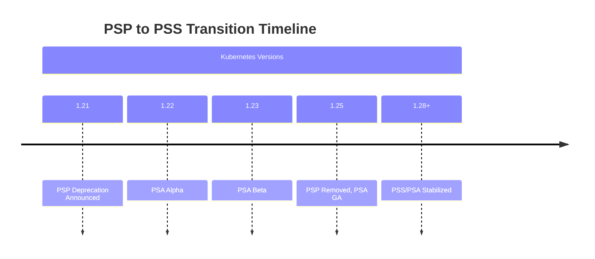
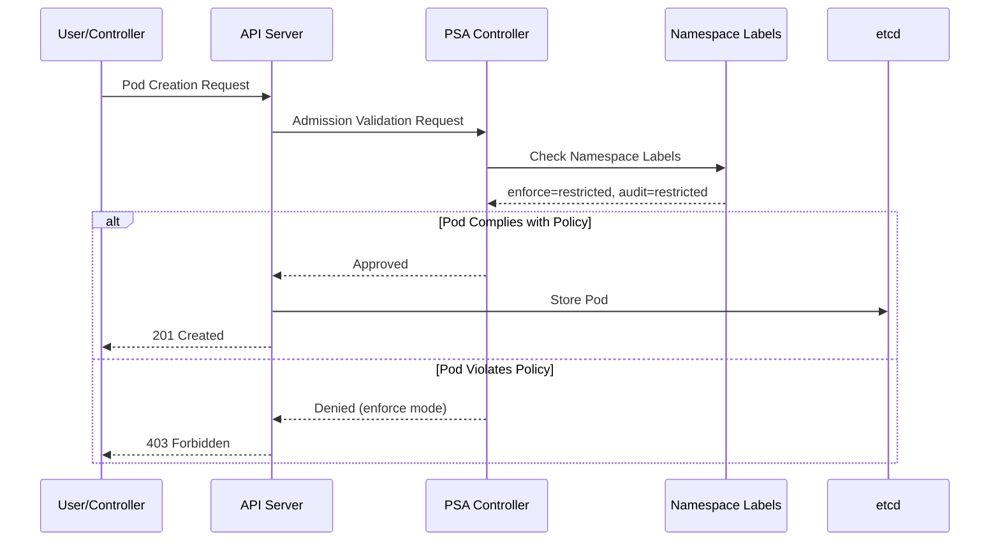
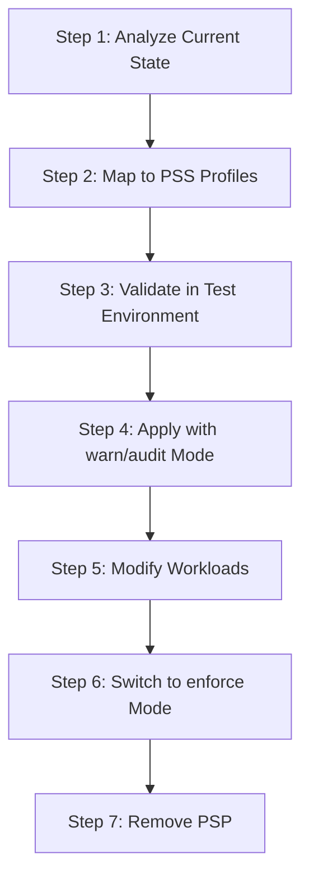

# Pod Security Standards (PSS)

> **Versiones compatibles**: Kubernetes 1.31, 1.32, 1.33
> **Última actualización**: February 22, 2026

Pod Security Standards (PSS) es un marco de políticas estandarizado para la seguridad de Pod en Kubernetes. Este documento cubre los conceptos de PSS, los métodos de configuración y la implementación en entornos EKS.

## Table of Contents

1. [Evolution from PSP to PSS](#evolution-from-psp-to-pss)
2. [Pod Security Admission (PSA) Controller](#pod-security-admission-psa-controller)
3. [Security Levels](#security-levels)
4. [Enforcement Modes](#enforcement-modes)
5. [Namespace-Level Configuration](#namespace-level-configuration)
6. [Migration from PSP to PSS](#migration-from-psp-to-pss)
7. [EKS Defaults and Configuration](#eks-defaults-and-configuration)
8. [Security Profile Details](#security-profile-details)
9. [Exemptions Configuration](#exemptions-configuration)
10. [Best Practices for Gradual Adoption](#best-practices-for-gradual-adoption)

---

## Evolution from PSP to PSS

### History of PodSecurityPolicy (PSP)

PodSecurityPolicy (PSP) se introdujo por primera vez en Kubernetes 1.3 como un mecanismo de seguridad para Pod. Sin embargo, quedó obsoleto en Kubernetes 1.21 y se eliminó por completo en 1.25 debido a los siguientes problemas:

```
┌─────────────────────────────────────────────────────────────────┐
│                    Key Issues with PSP                           │
├─────────────────────────────────────────────────────────────────┤
│ 1. Complex RBAC binding requirements                             │
│ 2. Implicit policy application (unclear which policy applies)    │
│ 3. User vs workload permission confusion                         │
│ 4. No dry-run mode                                               │
│ 5. Limited audit capabilities                                    │
└─────────────────────────────────────────────────────────────────┘
```

### Introduction of PSS

Pod Security Standards (PSS) y Pod Security Admission (PSA) se introdujeron como alpha en Kubernetes 1.22, pasaron a beta en 1.23 y alcanzaron GA (Generally Available) en 1.25.



### PSP vs PSS Comparison

| Feature | PodSecurityPolicy (PSP) | Pod Security Standards (PSS) |
|---------|------------------------|------------------------------|
| **Activation** | Admission Controller plugin | Built-in (enabled by default) |
| **Policy Definition** | Custom PSP resources | Three pre-defined profiles |
| **Policy Binding** | Complex RBAC binding | Simple namespace labels |
| **Scope** | Cluster-wide or namespace | Namespace level |
| **Dry-run** | Not supported | warn/audit modes supported |
| **Auditing** | Limited | Built-in audit support |
| **Flexibility** | High (fine-grained control) | Medium (standardized profiles) |
| **Complexity** | High | Low |

---

## Pod Security Admission (PSA) Controller

### PSA Architecture

Pod Security Admission (PSA) es un Admission Controller integrado en el Kubernetes API server que intercepta las solicitudes de creación y actualización de Pod y las valida de acuerdo con Pod Security Standards.

```
┌─────────────────────────────────────────────────────────────────────────┐
│                         Kubernetes API Server                            │
│  ┌─────────────────────────────────────────────────────────────────┐    │
│  │                    Admission Controllers                         │    │
│  │  ┌───────────┐  ┌───────────┐  ┌─────────────────────────────┐  │    │
│  │  │ Mutating  │──▶│Validating │──▶│  Pod Security Admission    │  │    │
│  │  │ Webhooks  │  │ Webhooks  │  │  (PSA Controller)           │  │    │
│  │  └───────────┘  └───────────┘  │  ┌───────────────────────┐  │  │    │
│  │                                 │  │ Security Standards    │  │  │    │
│  │                                 │  │ • Privileged          │  │  │    │
│  │                                 │  │ • Baseline            │  │  │    │
│  │                                 │  │ • Restricted          │  │  │    │
│  │                                 │  └───────────────────────┘  │  │    │
│  │                                 └─────────────────────────────┘  │    │
│  └─────────────────────────────────────────────────────────────────┘    │
└─────────────────────────────────────────────────────────────────────────┘
```

### How PSA Works



### Verifying PSA Status

En Kubernetes 1.25 y versiones superiores, PSA está habilitado de forma predeterminada:

```bash
# Check API server configuration (not directly accessible in EKS managed control plane)
# For local clusters:
kubectl get pods -n kube-system -l component=kube-apiserver -o yaml | grep -A5 "enable-admission-plugins"

# Check PSA feature gate
kubectl get --raw /metrics | grep pod_security
```

---

## Security Levels

PSS define tres niveles de seguridad (perfiles). Cada nivel aplica restricciones de seguridad progresivamente más estrictas.

### 1. Privileged

La política más permisiva, sin restricciones. Es adecuada para workloads de nivel de sistema e infraestructura.

```yaml
# Privileged level: Everything is allowed
# Use cases: System daemons, CNI plugins, monitoring agents

apiVersion: v1
kind: Pod
metadata:
  name: privileged-pod
  namespace: kube-system
spec:
  hostNetwork: true      # Allowed
  hostPID: true          # Allowed
  hostIPC: true          # Allowed
  containers:
  - name: privileged-container
    image: nginx
    securityContext:
      privileged: true   # Allowed
      runAsRoot: true    # Allowed
```

**El nivel Privileged permite:**
- Namespaces de red, PID e IPC del host
- Contenedores privileged
- Todas las capabilities
- Montajes HostPath
- Cualquier ID de usuario/grupo

### 2. Baseline

Aplica restricciones mínimas para evitar escaladas de privilegios conocidas. Es adecuado para la mayoría de los workloads generales.

```yaml
# Baseline level: Prevents known privilege escalations
# Use cases: General applications, web servers, API servers

apiVersion: v1
kind: Pod
metadata:
  name: baseline-pod
spec:
  containers:
  - name: app
    image: nginx
    securityContext:
      # The following are prohibited in Baseline:
      # privileged: true        ❌
      # allowPrivilegeEscalation: true (under certain conditions)  ❌

      # The following are allowed in Baseline:
      runAsNonRoot: false      # ✓ (allowed but not recommended)
      readOnlyRootFilesystem: false  # ✓ (allowed)
    ports:
    - containerPort: 80
```

**Restricciones del nivel Baseline:**

| Field | Restriction |
|-------|------------|
| HostProcess | Windows HostProcess containers prohibited |
| Host Namespaces | hostNetwork, hostPID, hostIPC prohibited |
| Privileged Containers | privileged: true prohibited |
| Capabilities | Additional capabilities beyond NET_RAW prohibited |
| HostPath Volumes | hostPath volumes prohibited |
| Host Ports | Host port usage prohibited |
| AppArmor | Only default profile or localhost/* allowed |
| SELinux | Only restricted type values, user/role setting prohibited |
| /proc Mount Type | Only default value allowed |
| Seccomp | Only RuntimeDefault, Localhost allowed |
| Sysctls | Only safe sysctls allowed |

### 3. Restricted

La política más restrictiva, que aplica las mejores prácticas de hardening de seguridad de Pod. Es adecuada para workloads sensibles a la seguridad.

```yaml
# Restricted level: Apply security best practices
# Use cases: Security-sensitive apps, multi-tenant environments

apiVersion: v1
kind: Pod
metadata:
  name: restricted-pod
spec:
  securityContext:
    runAsNonRoot: true           # Required
    seccompProfile:              # Required
      type: RuntimeDefault
  containers:
  - name: app
    image: nginx
    securityContext:
      allowPrivilegeEscalation: false  # Required
      readOnlyRootFilesystem: true     # Recommended
      capabilities:
        drop:
          - ALL                  # Required
      runAsNonRoot: true         # Required
    resources:
      limits:
        memory: "128Mi"
        cpu: "500m"
```

**Restricciones adicionales del nivel Restricted:**

| Field | Restriction |
|-------|------------|
| Volume Types | Only configMap, csi, downwardAPI, emptyDir, ephemeral, persistentVolumeClaim, projected, secret allowed |
| Privilege Escalation | allowPrivilegeEscalation: false required |
| Running as Non-root | runAsNonRoot: true required |
| Running as Non-root user | runAsUser must be non-zero (v1.23+) |
| Seccomp | RuntimeDefault or Localhost required |
| Capabilities | Must drop all capabilities, only NET_BIND_SERVICE can be added |

### Security Level Comparison Chart

```
┌──────────────────────────────────────────────────────────────────────────┐
│                     Security Level Comparison                             │
├──────────────────────────────────────────────────────────────────────────┤
│                                                                          │
│  Restriction  ━━━━━━━━━━━━━━━━━━━━━━━━━━━━━━━━━━━━━━━━━━━━━━━━━━━▶       │
│               Low                                           High          │
│                                                                          │
│  ┌──────────────┐    ┌──────────────┐    ┌──────────────┐               │
│  │  Privileged  │    │   Baseline   │    │  Restricted  │               │
│  │              │    │              │    │              │               │
│  │ No           │    │ Prevent      │    │ Security     │               │
│  │ restrictions │    │ known        │    │ best         │               │
│  │              │    │ escalations  │    │ practices    │               │
│  │              │    │              │    │              │               │
│  │ Use cases:   │    │ Use cases:   │    │ Use cases:   │               │
│  │ - CNI        │    │ - General    │    │ - Financial  │               │
│  │ - CSI        │    │   apps       │    │   apps       │               │
│  │ - Monitoring │    │ - Web        │    │ - Healthcare │               │
│  │              │    │   servers    │    │ - Multi-     │               │
│  │              │    │ - API        │    │   tenant     │               │
│  └──────────────┘    └──────────────┘    └──────────────┘               │
│                                                                          │
└──────────────────────────────────────────────────────────────────────────┘
```

---

## Enforcement Modes

PSA proporciona tres modos de enforcement. Estos modos pueden usarse de forma independiente o conjunta.

### 1. enforce

Bloquea la creación de Pod cuando se infringe la política.

```yaml
# enforce mode: Block Pod creation on violation
apiVersion: v1
kind: Namespace
metadata:
  name: production
  labels:
    pod-security.kubernetes.io/enforce: restricted
    pod-security.kubernetes.io/enforce-version: v1.31
```

**Ejemplo de comportamiento:**
```bash
# Attempting to create a policy-violating Pod
$ kubectl apply -f privileged-pod.yaml -n production
Error from server (Forbidden): error when creating "privileged-pod.yaml":
pods "privileged-pod" is forbidden: violates PodSecurity "restricted:v1.31":
privileged (container "app" must not set securityContext.privileged=true),
allowPrivilegeEscalation != false (container "app" must set
securityContext.allowPrivilegeEscalation=false)
```

### 2. audit

Registra las infracciones de política en audit logs, pero permite la creación de Pod.

```yaml
# audit mode: Record violations in audit logs
apiVersion: v1
kind: Namespace
metadata:
  name: staging
  labels:
    pod-security.kubernetes.io/audit: restricted
    pod-security.kubernetes.io/audit-version: v1.31
```

**Ejemplo de audit log:**
```json
{
  "kind": "Event",
  "apiVersion": "audit.k8s.io/v1",
  "level": "Metadata",
  "auditID": "abc123",
  "stage": "ResponseComplete",
  "requestURI": "/api/v1/namespaces/staging/pods",
  "verb": "create",
  "user": {
    "username": "developer@example.com"
  },
  "objectRef": {
    "resource": "pods",
    "namespace": "staging",
    "name": "my-pod"
  },
  "annotations": {
    "pod-security.kubernetes.io/audit-violations": "privileged (container \"app\" must not set securityContext.privileged=true)"
  }
}
```

### 3. warn

Muestra mensajes de advertencia a los usuarios, pero permite la creación de Pod.

```yaml
# warn mode: Display warning messages on violation
apiVersion: v1
kind: Namespace
metadata:
  name: development
  labels:
    pod-security.kubernetes.io/warn: restricted
    pod-security.kubernetes.io/warn-version: v1.31
```

**Ejemplo de mensaje de advertencia:**
```bash
$ kubectl apply -f non-compliant-pod.yaml -n development
Warning: would violate PodSecurity "restricted:v1.31":
allowPrivilegeEscalation != false (container "app" must set
securityContext.allowPrivilegeEscalation=false),
unrestricted capabilities (container "app" must set
securityContext.capabilities.drop=["ALL"])
pod/my-pod created
```

### Mode Combination Strategy

En entornos de producción, se recomienda combinar varios modos:

```yaml
# Recommended configuration: Use mode combinations
apiVersion: v1
kind: Namespace
metadata:
  name: app-namespace
  labels:
    # Current enforcement level
    pod-security.kubernetes.io/enforce: baseline
    pod-security.kubernetes.io/enforce-version: v1.31
    # Audit next level
    pod-security.kubernetes.io/audit: restricted
    pod-security.kubernetes.io/audit-version: v1.31
    # Warn next level
    pod-security.kubernetes.io/warn: restricted
    pod-security.kubernetes.io/warn-version: v1.31
```

```
┌─────────────────────────────────────────────────────────────────┐
│                    Mode Combination Strategy                      │
├─────────────────────────────────────────────────────────────────┤
│                                                                 │
│  Phase 1: Assess Current State                                   │
│  ┌─────────────────────────────────────────────────────────┐   │
│  │ enforce: privileged                                      │   │
│  │ audit: baseline                                          │   │
│  │ warn: baseline                                           │   │
│  └─────────────────────────────────────────────────────────┘   │
│                           │                                     │
│                           ▼                                     │
│  Phase 2: Gradual Hardening                                      │
│  ┌─────────────────────────────────────────────────────────┐   │
│  │ enforce: baseline                                        │   │
│  │ audit: restricted                                        │   │
│  │ warn: restricted                                         │   │
│  └─────────────────────────────────────────────────────────┘   │
│                           │                                     │
│                           ▼                                     │
│  Phase 3: Final Goal                                             │
│  ┌─────────────────────────────────────────────────────────┐   │
│  │ enforce: restricted                                      │   │
│  │ audit: restricted                                        │   │
│  │ warn: restricted                                         │   │
│  └─────────────────────────────────────────────────────────┘   │
│                                                                 │
└─────────────────────────────────────────────────────────────────┘
```

---

## Namespace-Level Configuration

### Basic Label Configuration

PSS se configura mediante labels de Namespace:

```yaml
apiVersion: v1
kind: Namespace
metadata:
  name: secure-namespace
  labels:
    # Format: pod-security.kubernetes.io/<MODE>: <LEVEL>
    pod-security.kubernetes.io/enforce: restricted
    pod-security.kubernetes.io/enforce-version: v1.31
    pod-security.kubernetes.io/audit: restricted
    pod-security.kubernetes.io/audit-version: v1.31
    pod-security.kubernetes.io/warn: restricted
    pod-security.kubernetes.io/warn-version: v1.31
```

### Version Specification

Puedes usar definiciones de PSS de una versión específica de Kubernetes:

```yaml
apiVersion: v1
kind: Namespace
metadata:
  name: versioned-namespace
  labels:
    # Use PSS definitions from a specific version
    pod-security.kubernetes.io/enforce: restricted
    pod-security.kubernetes.io/enforce-version: v1.31  # Specific version

    # Using 'latest' applies PSS from current cluster version
    # pod-security.kubernetes.io/enforce-version: latest
```

### Environment-Specific Configuration Examples

```yaml
---
# Development environment: Relaxed policy
apiVersion: v1
kind: Namespace
metadata:
  name: development
  labels:
    environment: development
    pod-security.kubernetes.io/enforce: baseline
    pod-security.kubernetes.io/warn: restricted
---
# Staging environment: Intermediate policy
apiVersion: v1
kind: Namespace
metadata:
  name: staging
  labels:
    environment: staging
    pod-security.kubernetes.io/enforce: baseline
    pod-security.kubernetes.io/audit: restricted
    pod-security.kubernetes.io/warn: restricted
---
# Production environment: Strict policy
apiVersion: v1
kind: Namespace
metadata:
  name: production
  labels:
    environment: production
    pod-security.kubernetes.io/enforce: restricted
    pod-security.kubernetes.io/audit: restricted
    pod-security.kubernetes.io/warn: restricted
```

### Adding Labels to Existing Namespaces

```bash
# Add labels using kubectl
kubectl label namespace my-namespace \
  pod-security.kubernetes.io/enforce=restricted \
  pod-security.kubernetes.io/enforce-version=v1.31 \
  pod-security.kubernetes.io/audit=restricted \
  pod-security.kubernetes.io/warn=restricted

# Verify labels
kubectl get namespace my-namespace -o yaml | grep pod-security
```

---

## Migration from PSP to PSS

### Migration Overview

La migración de PSP a PSS debe planificarse cuidadosamente y realizarse por etapas.



### Step 1: Analyze Current PSP

```bash
# List current PSPs
kubectl get psp

# Get PSP details
kubectl get psp <psp-name> -o yaml

# Check Pods with PSP applied
kubectl get pods --all-namespaces -o jsonpath='{range .items[*]}{.metadata.namespace}/{.metadata.name}: {.metadata.annotations.kubernetes\.io/psp}{"\n"}{end}'
```

### Step 2: Map PSP to PSS Profiles

```yaml
# Example: Existing PSP
apiVersion: policy/v1beta1
kind: PodSecurityPolicy
metadata:
  name: restricted-psp
spec:
  privileged: false
  allowPrivilegeEscalation: false
  requiredDropCapabilities:
    - ALL
  volumes:
    - 'configMap'
    - 'emptyDir'
    - 'projected'
    - 'secret'
    - 'downwardAPI'
    - 'persistentVolumeClaim'
  hostNetwork: false
  hostIPC: false
  hostPID: false
  runAsUser:
    rule: MustRunAsNonRoot
  seLinux:
    rule: RunAsAny
  fsGroup:
    rule: RunAsAny
  supplementalGroups:
    rule: RunAsAny
```

**Resultado de mapeo:** El PSP anterior corresponde al perfil `restricted`

### PSP to PSS Mapping Table

| PSP Setting | PSS Profile | Notes |
|-------------|-------------|-------|
| `privileged: true` | Privileged | - |
| `privileged: false`, `allowPrivilegeEscalation: true` | Baseline | - |
| `privileged: false`, `allowPrivilegeEscalation: false`, `runAsUser.rule: MustRunAsNonRoot` | Restricted | All capabilities must be dropped |

### Step 3: Validate in Test Environment

```bash
# Create test namespace
kubectl create namespace pss-test

# Apply restricted in warn mode
kubectl label namespace pss-test \
  pod-security.kubernetes.io/warn=restricted \
  pod-security.kubernetes.io/warn-version=v1.31

# Test existing workload deployment
kubectl apply -f my-deployment.yaml -n pss-test

# Check warnings and modify workloads
```

### Step 4: Gradual Application

```yaml
# Staged migration namespace configuration
apiVersion: v1
kind: Namespace
metadata:
  name: migrating-namespace
  labels:
    # Phase 1: Monitoring only (maintain existing behavior)
    pod-security.kubernetes.io/enforce: privileged
    pod-security.kubernetes.io/audit: baseline
    pod-security.kubernetes.io/warn: baseline

    # Phase 2: Apply baseline, monitor restricted
    # pod-security.kubernetes.io/enforce: baseline
    # pod-security.kubernetes.io/audit: restricted
    # pod-security.kubernetes.io/warn: restricted

    # Phase 3: Final restricted enforcement
    # pod-security.kubernetes.io/enforce: restricted
```

### Step 5: Modify Workloads

```yaml
# Before: PSS-violating Pod
apiVersion: v1
kind: Pod
metadata:
  name: old-pod
spec:
  containers:
  - name: app
    image: nginx
    # No securityContext

---
# After: Restricted-compliant Pod
apiVersion: v1
kind: Pod
metadata:
  name: new-pod
spec:
  securityContext:
    runAsNonRoot: true
    seccompProfile:
      type: RuntimeDefault
  containers:
  - name: app
    image: nginx
    securityContext:
      allowPrivilegeEscalation: false
      capabilities:
        drop:
          - ALL
      runAsNonRoot: true
      readOnlyRootFilesystem: true
```

### Migration Automation Script

```bash
#!/bin/bash
# psp-to-pss-migration.sh

# Apply warn mode baseline to all namespaces
for ns in $(kubectl get namespaces -o jsonpath='{.items[*].metadata.name}'); do
  # Exclude system namespaces
  if [[ "$ns" != "kube-system" && "$ns" != "kube-public" && "$ns" != "kube-node-lease" ]]; then
    echo "Applying warn mode to namespace: $ns"
    kubectl label namespace "$ns" \
      pod-security.kubernetes.io/warn=baseline \
      pod-security.kubernetes.io/warn-version=v1.31 \
      --overwrite
  fi
done

# Monitor for violations
echo "Monitoring for violations..."
kubectl get events --all-namespaces --field-selector reason=FailedCreate | grep -i "pod security"
```

---

## EKS Defaults and Configuration

### PSA Default Settings in EKS

Amazon EKS habilita PSA de forma predeterminada en Kubernetes 1.23 y versiones superiores. Sin embargo, no se aplican labels de PSS a ningún Namespace de forma predeterminada.

```bash
# Check PSA status in EKS cluster
kubectl get namespaces -o yaml | grep pod-security

# Check system namespaces
kubectl get namespace kube-system -o yaml
```

### Configuring PSS in EKS

```yaml
# Apply PSS to EKS namespace
apiVersion: v1
kind: Namespace
metadata:
  name: eks-app-namespace
  labels:
    # EKS recommended configuration
    pod-security.kubernetes.io/enforce: baseline
    pod-security.kubernetes.io/enforce-version: latest
    pod-security.kubernetes.io/audit: restricted
    pod-security.kubernetes.io/warn: restricted

    # EKS-related labels
    app.kubernetes.io/managed-by: eks
```

### EKS System Namespace Considerations

```yaml
# kube-system namespace requires privileged
apiVersion: v1
kind: Namespace
metadata:
  name: kube-system
  labels:
    pod-security.kubernetes.io/enforce: privileged
    pod-security.kubernetes.io/audit: privileged
    pod-security.kubernetes.io/warn: privileged
---
# AWS system components like aws-for-fluent-bit
apiVersion: v1
kind: Namespace
metadata:
  name: amazon-cloudwatch
  labels:
    pod-security.kubernetes.io/enforce: privileged  # Requires host access
```

### EKS Add-ons and PSS Compatibility

| EKS Add-on | Recommended PSS Level | Notes |
|------------|----------------------|-------|
| VPC CNI (aws-node) | Privileged | Requires host networking |
| CoreDNS | Baseline | - |
| kube-proxy | Privileged | Requires host networking |
| EBS CSI Driver | Privileged | Requires host volume access |
| EFS CSI Driver | Privileged | Requires host volume access |
| CloudWatch Agent | Privileged | Requires host access |
| Fluent Bit | Privileged | Requires host log access |
| ALB Controller | Baseline | - |
| Cluster Autoscaler | Baseline | - |

### EKS Terraform Example

```hcl
# Configure EKS namespaces and PSS with Terraform
resource "kubernetes_namespace" "app" {
  metadata {
    name = "my-app"

    labels = {
      "pod-security.kubernetes.io/enforce"         = "restricted"
      "pod-security.kubernetes.io/enforce-version" = "latest"
      "pod-security.kubernetes.io/audit"           = "restricted"
      "pod-security.kubernetes.io/warn"            = "restricted"
      "environment"                                = "production"
    }
  }
}

# Exception for system namespaces
resource "kubernetes_labels" "kube_system_pss" {
  api_version = "v1"
  kind        = "Namespace"

  metadata {
    name = "kube-system"
  }

  labels = {
    "pod-security.kubernetes.io/enforce" = "privileged"
    "pod-security.kubernetes.io/audit"   = "privileged"
    "pod-security.kubernetes.io/warn"    = "privileged"
  }
}
```

---

## Security Profile Details

### Privileged Profile Details

El perfil Privileged permite todos los privilegios sin restricciones.

```yaml
# All options allowed in Privileged profile
apiVersion: v1
kind: Pod
metadata:
  name: privileged-example
spec:
  hostNetwork: true
  hostPID: true
  hostIPC: true
  containers:
  - name: privileged-container
    image: nginx
    securityContext:
      privileged: true
      allowPrivilegeEscalation: true
      runAsUser: 0
      capabilities:
        add:
          - ALL
    volumeMounts:
    - name: host-root
      mountPath: /host
  volumes:
  - name: host-root
    hostPath:
      path: /
      type: Directory
```

### Baseline Profile Details

```yaml
# Baseline profile restrictions (v1.31)
#
# Prohibited fields and values:
#
# spec.hostNetwork: true prohibited
# spec.hostPID: true prohibited
# spec.hostIPC: true prohibited
#
# spec.containers[*].securityContext.privileged: true prohibited
# spec.initContainers[*].securityContext.privileged: true prohibited
# spec.ephemeralContainers[*].securityContext.privileged: true prohibited
#
# spec.containers[*].securityContext.capabilities.add restricted
#   - Allowed: NET_BIND_SERVICE (only this in Restricted)
#   - Additionally allowed in Baseline: AUDIT_WRITE, CHOWN, DAC_OVERRIDE,
#     FOWNER, FSETID, KILL, MKNOD, NET_BIND_SERVICE, NET_RAW,
#     SETFCAP, SETGID, SETPCAP, SETUID, SYS_CHROOT
#
# spec.volumes[*].hostPath prohibited
#
# spec.containers[*].ports[*].hostPort prohibited (except 0)
#
# spec.securityContext.appArmorProfile.type restricted
#   - Allowed: RuntimeDefault, Localhost, "" (empty)
#   - Prohibited: Unconfined
#
# spec.securityContext.seLinuxOptions.type restricted
#   - Prohibited: Custom types (container_t etc. allowed)
#
# spec.securityContext.seccompProfile.type restricted
#   - Prohibited: Unconfined
#
# spec.securityContext.sysctls restricted
#   - Only safe sysctls allowed

apiVersion: v1
kind: Pod
metadata:
  name: baseline-compliant
spec:
  containers:
  - name: app
    image: nginx:latest
    ports:
    - containerPort: 80  # No hostPort
    securityContext:
      # No privileged setting or false
      capabilities:
        add:
          - NET_BIND_SERVICE  # Allowed
        drop:
          - ALL
    volumeMounts:
    - name: config
      mountPath: /etc/nginx/conf.d
  volumes:
  - name: config
    configMap:  # Use configMap instead of hostPath
      name: nginx-config
```

### Restricted Profile Details

```yaml
# Restricted profile: Strictest security
#
# All Baseline restrictions + additional:
#
# 1. Volume type restrictions
#    Allowed: configMap, csi, downwardAPI, emptyDir, ephemeral,
#             persistentVolumeClaim, projected, secret
#
# 2. allowPrivilegeEscalation required
#    spec.containers[*].securityContext.allowPrivilegeEscalation: false required
#    spec.initContainers[*].securityContext.allowPrivilegeEscalation: false required
#
# 3. runAsNonRoot required
#    spec.securityContext.runAsNonRoot: true required
#    Or set individually on all containers
#
# 4. Seccomp profile required
#    spec.securityContext.seccompProfile.type: RuntimeDefault or Localhost
#
# 5. Capabilities restrictions
#    Must drop all capabilities
#    Only NET_BIND_SERVICE can be added

apiVersion: v1
kind: Pod
metadata:
  name: restricted-compliant
spec:
  securityContext:
    runAsNonRoot: true
    runAsUser: 1000
    runAsGroup: 1000
    fsGroup: 1000
    seccompProfile:
      type: RuntimeDefault
  containers:
  - name: app
    image: nginx:latest
    securityContext:
      allowPrivilegeEscalation: false
      readOnlyRootFilesystem: true
      runAsNonRoot: true
      runAsUser: 1000
      capabilities:
        drop:
          - ALL
        add:
          - NET_BIND_SERVICE  # Needed for binding ports below 1024
    ports:
    - containerPort: 8080
    volumeMounts:
    - name: tmp
      mountPath: /tmp
    - name: cache
      mountPath: /var/cache/nginx
    - name: run
      mountPath: /var/run
  volumes:
  - name: tmp
    emptyDir: {}
  - name: cache
    emptyDir: {}
  - name: run
    emptyDir: {}
```

### Complete Restricted-Compliant Nginx Example

```yaml
apiVersion: apps/v1
kind: Deployment
metadata:
  name: nginx-restricted
  namespace: production
spec:
  replicas: 3
  selector:
    matchLabels:
      app: nginx
  template:
    metadata:
      labels:
        app: nginx
    spec:
      securityContext:
        runAsNonRoot: true
        runAsUser: 101  # nginx user
        runAsGroup: 101
        fsGroup: 101
        seccompProfile:
          type: RuntimeDefault
      containers:
      - name: nginx
        image: nginxinc/nginx-unprivileged:latest  # Unprivileged nginx image
        securityContext:
          allowPrivilegeEscalation: false
          readOnlyRootFilesystem: true
          runAsNonRoot: true
          runAsUser: 101
          capabilities:
            drop:
              - ALL
        ports:
        - containerPort: 8080
        resources:
          limits:
            cpu: 100m
            memory: 128Mi
          requests:
            cpu: 50m
            memory: 64Mi
        volumeMounts:
        - name: tmp
          mountPath: /tmp
        - name: cache
          mountPath: /var/cache/nginx
        - name: run
          mountPath: /var/run
        - name: config
          mountPath: /etc/nginx/conf.d
          readOnly: true
        livenessProbe:
          httpGet:
            path: /healthz
            port: 8080
          initialDelaySeconds: 5
          periodSeconds: 10
        readinessProbe:
          httpGet:
            path: /healthz
            port: 8080
          initialDelaySeconds: 5
          periodSeconds: 5
      volumes:
      - name: tmp
        emptyDir: {}
      - name: cache
        emptyDir: {}
      - name: run
        emptyDir: {}
      - name: config
        configMap:
          name: nginx-config
---
apiVersion: v1
kind: ConfigMap
metadata:
  name: nginx-config
  namespace: production
data:
  default.conf: |
    server {
        listen 8080;
        server_name localhost;

        location / {
            root /usr/share/nginx/html;
            index index.html;
        }

        location /healthz {
            return 200 'OK';
            add_header Content-Type text/plain;
        }
    }
```

---

## Exemptions Configuration

### Cluster-Level Exemptions Configuration

PSA puede configurar exemptions a nivel de Cluster mediante AdmissionConfiguration.

```yaml
# /etc/kubernetes/admission/admission-config.yaml
apiVersion: apiserver.config.k8s.io/v1
kind: AdmissionConfiguration
plugins:
- name: PodSecurity
  configuration:
    apiVersion: pod-security.admission.config.k8s.io/v1
    kind: PodSecurityConfiguration

    # Default settings (applied to namespaces without labels)
    defaults:
      enforce: "baseline"
      enforce-version: "latest"
      audit: "restricted"
      audit-version: "latest"
      warn: "restricted"
      warn-version: "latest"

    # Exemptions configuration
    exemptions:
      # User exemptions: Exemptions for specific users/groups
      usernames:
        - "system:serviceaccount:kube-system:*"

      # RuntimeClass exemptions
      runtimeClasses:
        - "gvisor"
        - "kata"

      # Namespace exemptions
      namespaces:
        - "kube-system"
        - "kube-public"
        - "kube-node-lease"
        - "amazon-cloudwatch"
        - "amazon-vpc-cni"
```

### Exemptions Configuration in EKS

Como EKS usa un control plane administrado, no puedes modificar AdmissionConfiguration directamente. En su lugar, configura exemptions mediante labels de Namespace:

```yaml
# Apply privileged to system namespaces
apiVersion: v1
kind: Namespace
metadata:
  name: kube-system
  labels:
    pod-security.kubernetes.io/enforce: privileged
    pod-security.kubernetes.io/audit: privileged
    pod-security.kubernetes.io/warn: privileged
---
# CNI namespace
apiVersion: v1
kind: Namespace
metadata:
  name: amazon-vpc-cni
  labels:
    pod-security.kubernetes.io/enforce: privileged
---
# Monitoring namespace
apiVersion: v1
kind: Namespace
metadata:
  name: monitoring
  labels:
    # Prometheus node-exporter requires hostNetwork
    pod-security.kubernetes.io/enforce: baseline
    pod-security.kubernetes.io/audit: restricted
    pod-security.kubernetes.io/warn: restricted
```

### RuntimeClass-Based Exemptions

```yaml
# RuntimeClass definition
apiVersion: node.k8s.io/v1
kind: RuntimeClass
metadata:
  name: gvisor
handler: runsc
---
# Pods using gVisor can have more permissive policies
apiVersion: v1
kind: Pod
metadata:
  name: sandboxed-pod
spec:
  runtimeClassName: gvisor
  containers:
  - name: app
    image: nginx
```

### Fine-Grained Exemptions with Kyverno

Cuando PSS por sí solo no puede manejar los requisitos de exemptions, puedes usar Kyverno:

```yaml
apiVersion: kyverno.io/v1
kind: ClusterPolicy
metadata:
  name: pss-exception-for-monitoring
spec:
  validationFailureAction: enforce
  background: true
  rules:
  - name: allow-hostpath-for-prometheus
    match:
      any:
      - resources:
          kinds:
            - Pod
          namespaces:
            - monitoring
          selector:
            matchLabels:
              app: prometheus-node-exporter
    validate:
      podSecurity:
        level: baseline
        version: latest
        exclude:
        - controlName: HostPath Volumes
          images:
          - 'quay.io/prometheus/node-exporter:*'
```

---

## Best Practices for Gradual Adoption

### Step 1: Analyze Current State

```bash
#!/bin/bash
# analyze-pss-compliance.sh

echo "=== Pod Security Standards Compliance Analysis ==="

# Analyze Pods in all namespaces
for ns in $(kubectl get namespaces -o jsonpath='{.items[*].metadata.name}'); do
  echo ""
  echo "=== Namespace: $ns ==="

  # Check restricted violations
  kubectl label namespace "$ns" \
    pod-security.kubernetes.io/warn=restricted \
    pod-security.kubernetes.io/warn-version=v1.31 \
    --overwrite --dry-run=server 2>&1 | head -20

  # Per-Pod analysis
  for pod in $(kubectl get pods -n "$ns" -o jsonpath='{.items[*].metadata.name}'); do
    echo "  Pod: $pod"

    # Check privileged containers
    kubectl get pod "$pod" -n "$ns" -o jsonpath='{range .spec.containers[*]}{.name}: privileged={.securityContext.privileged}{"\n"}{end}' 2>/dev/null

    # Check hostNetwork/hostPID
    kubectl get pod "$pod" -n "$ns" -o jsonpath='hostNetwork={.spec.hostNetwork}, hostPID={.spec.hostPID}{"\n"}' 2>/dev/null
  done
done
```

### Step 2: Gradual Rollout Strategy

```yaml
# Gradual rollout using GitOps

# Phase 1: Monitoring (Day 1-7)
# - Apply warn: baseline to all namespaces
# - Collect and analyze violations

# Phase 2: Development Environment (Day 8-14)
# - Apply enforce: baseline to development namespaces
# - Apply warn: baseline to staging namespaces

# Phase 3: Staging Environment (Day 15-21)
# - Apply enforce: baseline to staging namespaces
# - Apply warn: baseline to production namespaces

# Phase 4: Production Environment (Day 22-28)
# - Apply enforce: baseline to production namespaces
# - Apply warn: restricted to all environments

# Phase 5: Restricted Hardening (Day 29+)
# - Apply enforce: restricted as default for new namespaces
# - Gradually migrate existing namespaces
```

### Step 3: Set Up Monitoring and Alerts

```yaml
# Prometheus alerting rules
apiVersion: monitoring.coreos.com/v1
kind: PrometheusRule
metadata:
  name: pss-violations
  namespace: monitoring
spec:
  groups:
  - name: pod-security-standards
    rules:
    - alert: PSSViolationDetected
      expr: |
        increase(apiserver_admission_webhook_rejection_count{
          name="pod-security-webhook",
          error_type="no_error"
        }[5m]) > 0
      for: 1m
      labels:
        severity: warning
      annotations:
        summary: "Pod Security Standards violation detected"
        description: "PSS violation detected in namespace {{ $labels.namespace }}."

    - alert: PSSAuditViolation
      expr: |
        increase(pod_security_evaluations_total{
          mode="audit",
          decision="deny"
        }[5m]) > 10
      for: 5m
      labels:
        severity: info
      annotations:
        summary: "PSS Audit mode violations increasing"
        description: "{{ $value }} PSS audit violations detected."
```

### Step 4: Automated Compliance Checks

```yaml
# PSS compliance checks in CI/CD pipeline
# .gitlab-ci.yml or GitHub Actions

name: PSS Compliance Check

on:
  pull_request:
    paths:
      - 'k8s/**'

jobs:
  pss-check:
    runs-on: ubuntu-latest
    steps:
    - uses: actions/checkout@v4

    - name: Install kubeconform
      run: |
        wget https://github.com/yannh/kubeconform/releases/latest/download/kubeconform-linux-amd64.tar.gz
        tar xzf kubeconform-linux-amd64.tar.gz
        sudo mv kubeconform /usr/local/bin/

    - name: Install kubectl
      uses: azure/setup-kubectl@v3

    - name: Check PSS compliance
      run: |
        for file in k8s/*.yaml; do
          echo "Checking $file..."

          # Extract Pod resources and check PSS
          if grep -q "kind: Pod\|kind: Deployment\|kind: StatefulSet\|kind: DaemonSet" "$file"; then
            kubectl apply --dry-run=server -f "$file" 2>&1 | grep -i "pod security" && exit 1
          fi
        done
        echo "All files are PSS compliant!"
```

### Step 5: Documentation and Training

```markdown
# Pod Security Standards Guidelines

## Checklist for Developers

### When Writing Restricted-Level Pods:

- [ ] Set `spec.securityContext.runAsNonRoot: true`
- [ ] Set `spec.securityContext.seccompProfile.type: RuntimeDefault`
- [ ] Set `allowPrivilegeEscalation: false` on all containers
- [ ] Set `capabilities.drop: ["ALL"]` on all containers
- [ ] Set `readOnlyRootFilesystem: true` (recommended)
- [ ] Use unprivileged images (e.g., nginxinc/nginx-unprivileged)
- [ ] Mount emptyDir for writable paths

### Common Problem Solutions:

1. **nginx fails to bind port 80**
   → Add `NET_BIND_SERVICE` capability or use port 8080

2. **File write failures**
   → Mount emptyDir volumes to required paths

3. **Process runs as root**
   → Use unprivileged base image or add USER directive in Dockerfile
```

---

## Troubleshooting

### Common Errors and Solutions

#### 1. "allowPrivilegeEscalation != false" Error

```yaml
# Error message
Error: pods "my-pod" is forbidden: violates PodSecurity "restricted:v1.31":
allowPrivilegeEscalation != false

# Solution: Add setting to all containers
spec:
  containers:
  - name: app
    securityContext:
      allowPrivilegeEscalation: false
```

#### 2. "unrestricted capabilities" Error

```yaml
# Error message
Error: violates PodSecurity "restricted:v1.31":
unrestricted capabilities (container "app" must set securityContext.capabilities.drop=["ALL"])

# Solution: Set capabilities drop
spec:
  containers:
  - name: app
    securityContext:
      capabilities:
        drop:
          - ALL
```

#### 3. "runAsNonRoot != true" Error

```yaml
# Error message
Error: violates PodSecurity "restricted:v1.31":
runAsNonRoot != true

# Solution 1: Set at Pod level
spec:
  securityContext:
    runAsNonRoot: true
    runAsUser: 1000

# Solution 2: Set at container level
spec:
  containers:
  - name: app
    securityContext:
      runAsNonRoot: true
      runAsUser: 1000
```

#### 4. "seccompProfile" Error

```yaml
# Error message
Error: violates PodSecurity "restricted:v1.31":
seccompProfile (pod or container "app" must set securityContext.seccompProfile.type to "RuntimeDefault" or "Localhost")

# Solution: Set seccompProfile
spec:
  securityContext:
    seccompProfile:
      type: RuntimeDefault
```

### PSS Violation Checking Tools

```bash
# Dry-run check with kubectl
kubectl apply -f my-pod.yaml --dry-run=server

# Check with Polaris
polaris audit --audit-path ./k8s/ --format pretty

# Check with kube-score
kube-score score my-deployment.yaml

# Configuration check with Trivy
trivy config ./k8s/
```

---

## Summary

Pod Security Standards (PSS) proporciona un enfoque estandarizado para administrar la seguridad de Pod en Kubernetes:

1. **Tres niveles de seguridad**: Privileged (todos los privilegios), Baseline (evita escaladas conocidas), Restricted (mínimo privilegio)
2. **Tres modos de enforcement**: enforce (bloquea), audit (registra), warn (advertencia)
3. **Configuración simple mediante labels de Namespace**: aplica políticas solo con labels, sin requerir bindings RBAC
4. **Soporte para adopción gradual**: migración segura mediante modos warn/audit

### Recommendations

- Habilita PSS desde el inicio para clusters nuevos
- Comienza con el modo warn para clusters existentes y aplica hardening gradualmente
- Aplica al menos el nivel baseline en entornos de producción
- Aplica el nivel restricted para workloads sensibles

---

## References

- [Documentación oficial de Kubernetes Pod Security Standards](https://kubernetes.io/docs/concepts/security/pod-security-standards/)
- [Documentación oficial de Pod Security Admission](https://kubernetes.io/docs/concepts/security/pod-security-admission/)
- [Guía de mejores prácticas de EKS - Pod Security](https://aws.github.io/aws-eks-best-practices/security/docs/pods/)
- [Guía de migración de PSP a PSS](https://kubernetes.io/docs/tasks/configure-pod-container/migrate-from-psp/)
