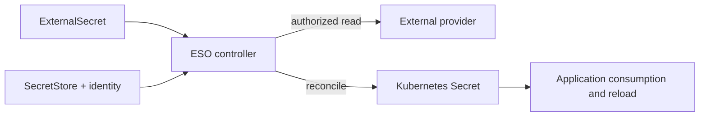
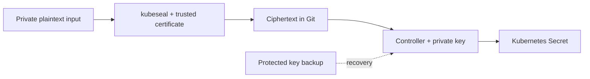

# Gestión de Secrets

> **Última actualización**: September 13, 2026

Este capítulo separa las responsabilidades y los requisitos de integración de los Secrets nativos, ESO, los almacenes de AWS, Sealed Secrets, Vault y SOPS. Use los [archivos de ejemplo completos](https://github.com/Atom-oh/kubernetes-docs/tree/main/examples/security/secrets-management). No se realizó ninguna instalación de clúster/AWS ni rotación de credenciales reales.

## Tabla de contenido

- [Secrets nativos de Kubernetes](#kubernetes-native-secrets)
- [Límites de cifrado, actualizaciones y auditoría](#encryption-updates-and-audit-boundaries)
- [External Secrets Operator (ESO)](#external-secrets-operator-eso)
- [PushSecret (sincronización inversa)](#pushsecret-reverse-sync)
- [Integración de AWS Secrets Manager](#aws-secrets-manager-integration)
- [Integración de AWS Systems Manager Parameter Store](#aws-systems-manager-parameter-store-integration)
- [Sealed Secrets](#sealed-secrets)
- [Integración de HashiCorp Vault](#hashicorp-vault-integration)
- [Vault CSI Driver y Argo CD Vault Plugin](#vault-csi-driver-and-argo-cd-vault-plugin)
- [SOPS (Secrets OPerationS)](#sops-secrets-operations)
- [EKS Pod Identity e IRSA](#eks-pod-identity-and-irsa)
- [Comparación de herramientas](#tool-comparison)
- [Prácticas recomendadas](#best-practices)
- [Resumen](#summary)
- [Referencias](#references)

## Secrets nativos de Kubernetes

### Descripción general de Secret

Un Secret es un objeto de API con semántica de control de acceso, almacenamiento y consumo.
La representación JSON/YAML de `data` usa Base64; la codificación no es cifrado.
`stringData` acepta entrada en texto sin formato y se combina con `data`. No es un
mecanismo de protección más sólido y no funciona bien con server-side apply.
Evite escribir credenciales reales en manifiestos rastreados, el historial de shell o logs.

### Tipos de Secret

| Tipo | Propósito |
|---|---|
| `Opaque` | Valores definidos por la aplicación |
| `kubernetes.io/service-account-token` | Token heredado de larga duración creado explícitamente; prefiera TokenRequest/tokens proyectados de corta duración |
| `kubernetes.io/dockerconfigjson` | Credenciales de registro |
| `kubernetes.io/basic-auth` / `kubernetes.io/ssh-auth` | Datos de autenticación básica o SSH |
| `kubernetes.io/tls` | Certificado y clave privada |

### Creación de Secrets

Use archivos protegidos y un namespace explícito. Reemplace las rutas por archivos
proporcionados mediante su proceso aprobado de credenciales. Estos comandos no muestran
el Secret resultante, pero el operador aún necesita el acceso apropiado a Kubernetes.

```bash
kubectl -n production create secret generic db-credentials   --from-file=username=/secure/input/username   --from-file=password=/secure/input/password   --from-file=host=/secure/input/host
kubectl -n production create secret generic ssh-key   --type=kubernetes.io/ssh-auth   --from-file=ssh-privatekey=/secure/input/id_rsa
kubectl -n production create secret tls app-tls   --cert=/secure/input/tls.crt --key=/secure/input/tls.key
kubectl -n production create secret generic regcred   --type=kubernetes.io/dockerconfigjson   --from-file=.dockerconfigjson=/secure/input/docker-config.json
```

Los indicadores literales son prácticos para **fixtures no confidenciales**, pero las contraseñas
reales en los argumentos de comando pueden aparecer en el historial y la inspección de procesos.

### Uso de Secrets

`secretKeyRef` selecciona una clave; `envFrom.secretRef` importa todas las claves. Las variables
de entorno no se actualizan en un contenedor que ya está en ejecución. Los volúmenes Secret montados
normalmente terminan actualizándose, mientras que los montajes `subPath` no reciben esas actualizaciones.
Las aplicaciones deben reabrir/recargar archivos según sea necesario; la sincronización no es una recarga.

El siguiente manifiesto proporciona a un grupo de aplicación no root archivos legibles. La
imagen de aplicación es un marcador de reemplazo explícito y no se ejecutó. El ServiceAccount
de la aplicación no necesita el permiso `get` de Secret únicamente para consumir un Secret
montado: kubelet realiza el montaje. Sin embargo, el permiso para crear Pods puede habilitar
el acceso indirecto a Secrets del namespace.

```yaml
# Replace the image with a reviewed application that reads /etc/app-secrets.
# This Pod is a manifest example; it was not started.
apiVersion: v1
kind: Pod
metadata:
  name: secret-file-consumer
  namespace: production
spec:
  automountServiceAccountToken: false
  securityContext:
    runAsNonRoot: true
    runAsUser: 10001
    runAsGroup: 10001
    fsGroup: 10001
    seccompProfile:
      type: RuntimeDefault
  containers:
    - name: app
      image: registry.example.com/team/app:replace-with-reviewed-tag
      securityContext:
        allowPrivilegeEscalation: false
        readOnlyRootFilesystem: true
        capabilities:
          drop: [ALL]
      volumeMounts:
        - name: secrets
          mountPath: /etc/app-secrets
          readOnly: true
  volumes:
    - name: secrets
      secret:
        secretName: db-credentials
        defaultMode: 0440
        items:
          - key: username
            path: username
          - key: password
            path: password
          - key: host
            path: host
```

## Límites de cifrado, actualizaciones y auditoría

### Limitaciones de Secrets

- Kubernetes autogestionado upstream requiere una configuración apropiada de cifrado en reposo.
  **EKS 1.28+ usa de forma predeterminada cifrado de sobre de todos los datos de la API de Kubernetes
  con una clave KMS propiedad de AWS**, con una opción de clave administrada por el cliente.
- El cifrado en reposo no detiene a un lector autorizado de la API, una aplicación comprometida,
  ni una entidad principal autorizada para crear un Pod consumidor.
- `immutable: true` congela los **datos** del Secret, no todos los metadatos; no puede
  revertirse a mutable. Prefiera un nuevo nombre de Secret y un rollout controlado del workload
  en lugar de eliminar una dependencia activa.
- La rotación de credenciales del proveedor, las actualizaciones de Secret, la propagación de
  archivos y la recarga de aplicación son operaciones distintas.
- Los eventos de auditoría de API pueden registrar el acceso a Secret. Proteja los destinos de
  auditoría y evite registrar cuerpos de solicitud/respuesta de Secret. Las lecturas de archivos
  montados no son un evento de auditoría de API por cada lectura de la aplicación.

### Configuración de cifrado de etcd

Un archivo `EncryptionConfiguration` es para un **servidor de API autogestionado**, no un
archivo que pueda instalar en el control plane administrado de EKS. Con varios proveedores,
el primero cifra las escrituras nuevas; los proveedores posteriores admiten el descifrado de
datos existentes. `identity` permite lecturas de texto sin formato y no debe convertirse en
una política accidental de escritura sin formato del primer proveedor.

Para una integración KMS v2 autogestionada, configure el socket real del plugin, la
disponibilidad y el ciclo de vida de claves conforme a la documentación de Kubernetes. El
antiguo ejemplo mezclaba AES-CBC, una caché tipo KMS v1 y una etiqueta de EKS; no era una
receta de instalación de EKS. Habilitar el cifrado no vuelve a escribir automáticamente cada
objeto almacenado existente. Siga un procedimiento de respaldo, migración y verificación.


## External Secrets Operator (ESO)

### Descripción general de ESO

ESO reconcilia valores externos en Secrets de Kubernetes. Los recursos Store describen el
acceso al proveedor; el controller realiza las llamadas. Un SecretStore no es un proxy
en ejecución independiente.



### Instalación de ESO

La línea base fijada es chart/aplicación **2.10.0**. La restricción de Kubernetes declarada
por Helm no es una prueba de compatibilidad para cada combinación de EKS/add-on.

```bash
helm repo add external-secrets https://charts.external-secrets.io
helm repo update external-secrets
helm upgrade --install external-secrets external-secrets/external-secrets   --version 2.10.0 --namespace external-secrets --create-namespace   --values eso-values.yaml
```

Los valores proporcionados deshabilitan por defecto la reconciliación de PushSecret. El RBAC
del chart es autoridad de administración del controller: los stores con alcance de namespace
por sí solos no convierten un controller de todo el clúster en un límite de aislamiento de tenants.

### Configuración de SecretStore

El siguiente conjunto completo de recursos utiliza IRSA. Cree primero el rol/la confianza de IAM.
El ServiceAccount referenciado está en **production**, el mismo namespace que el SecretStore. Un
ClusterSecretStore requiere en cambio un namespace explícito en `serviceAccountRef`; restrinja
también qué namespaces pueden usar el store compartido.

### Definición de ExternalSecret

Se usa `external-secrets.io/v1` para los ejemplos actuales de SecretStore/ExternalSecret.
`Periodic` es la política de actualización predeterminada; un `refreshInterval` positivo programa
la reconciliación, pero los errores/backoff del proveedor implican que no es una fecha límite de
entrega. `OnChange` y `CreatedOnce` tienen desencadenantes diferentes. `creationPolicy: Owner`
afecta las referencias de propietario de Kubernetes; `deletionPolicy: Retain` describe el manejo
de eliminación del proveedor, no la protección ante cada eliminación del ExternalSecret.

La selección explícita de claves limita la exposición accidental. `dataFrom.extract` puede importar
todas las propiedades cuando se pretende. Las plantillas deben escapar valores estructurados: insertar
directamente una contraseña en una URL de PostgreSQL puede corromper la sintaxis de URL. Prefiera
campos separados y el generador de conexiones de la aplicación.

```yaml
apiVersion: v1
kind: Namespace
metadata:
  name: production
---
apiVersion: v1
kind: ServiceAccount
metadata:
  name: external-secrets-reader
  namespace: production
  annotations:
    eks.amazonaws.com/role-arn: arn:aws:iam::123456789012:role/production-secret-reader
---
apiVersion: external-secrets.io/v1
kind: SecretStore
metadata:
  name: aws-secretsmanager
  namespace: production
spec:
  provider:
    aws:
      service: SecretsManager
      region: ap-northeast-2
      auth:
        jwt:
          serviceAccountRef:
            name: external-secrets-reader
---
apiVersion: external-secrets.io/v1
kind: ExternalSecret
metadata:
  name: database-credentials
  namespace: production
spec:
  refreshPolicy: Periodic
  refreshInterval: 1h
  secretStoreRef:
    name: aws-secretsmanager
    kind: SecretStore
  target:
    name: db-credentials
    creationPolicy: Owner
    deletionPolicy: Retain
  data:
    - secretKey: username
      remoteRef:
        key: production/database
        property: username
    - secretKey: password
      remoteRef:
        key: production/database
        property: password
    - secretKey: host
      remoteRef:
        key: production/database
        property: host
```

## PushSecret (sincronización inversa)

PushSecret es una capacidad separada de escritura inversa, no parte del ejemplo de solo lectura
anterior. La versión **2.10.0** aún expone su API como `external-secrets.io/v1alpha1`; verifique
el CRD instalado en vez de cambiar ciegamente cada recurso de ESO a v1.

Antes de habilitarla, elija una identidad de escritor separada, claves remotas permitidas,
`updatePolicy` y `deletionPolicy`. De otro modo, una escritura local de Kubernetes podría
sobrescribir una credencial utilizada por otros sistemas. Evite un bucle de retroalimentación
pull/push en la misma clave. Los permisos de lectura del store no conceden permisos de escritura
al proveedor.


## Integración de AWS Secrets Manager

### Configuración de IRSA

El `irsa-trust.json` proporcionado vincula el emisor OIDC exacto del clúster, `aud` y el asunto
`system:serviceaccount:production:external-secrets-reader`. Reemplace el ID de cuenta/OIDC de
ejemplo y cree el proveedor OIDC de IAM antes de usarlo.

`aws-reader-policy.json` lee un secreto de Secrets Manager y un parámetro de SSM. Los seis
caracteres `?` cubren el sufijo de ARN de secreto generado por el servicio; use el ARN real cuando
esté disponible. No concede `ListSecrets`, descubrimiento con comodines, escrituras de credenciales
ni rotación. Las claves KMS administradas por el cliente requieren una concesión de descifrado con
restricciones apropiadas **y** una política de clave KMS compatible.

### Creación de Secrets en AWS Secrets Manager

Mantenga las cargas útiles de credenciales en archivos privados. Las siguientes operaciones son
ejemplos de operador y no se ejecutaron contra AWS:

```bash
aws secretsmanager create-secret --region ap-northeast-2   --name production/database --secret-string file:///secure/input/database.json
aws secretsmanager put-secret-value --region ap-northeast-2   --secret-id production/database --secret-string file:///secure/input/database-next.json
```

Actualizar solo la contraseña almacenada no actualiza la contraseña de la base de datos.
Secrets Manager tiene integraciones de rotación administrada, así como rotación basada en Lambda.
Una receta Lambda requiere la función de rotación admitida, permisos, acceso de red y lógica de
actualización de credenciales de destino. No es automática simplemente porque aparezcan un ARN y
una programación de 30 días en un comando.

### Ejemplo completo de AWS ESO

Use el conjunto de recursos anterior con la política de confianza y de lector correspondiente.
Espere la disponibilidad de SecretStore y ExternalSecret sin mostrar los valores resultantes:

```bash
kubectl -n production wait secretstore/aws-secretsmanager   --for=condition=Ready --timeout=120s
kubectl -n production wait externalsecret/database-credentials   --for=condition=Ready --timeout=120s
```

Una sincronización inicial satisfactoria no demuestra una posterior rotación/recarga. Verifique
la versión del proveedor, el estado de reconciliación y la autenticación de la aplicación mediante
una prueba aprobada. Un workload que consume un Secret nativo no necesita heredar el rol de ESO.

```json
{
  "Version": "2012-10-17",
  "Statement": [
    {
      "Sid": "ReadOneSecret",
      "Effect": "Allow",
      "Action": ["secretsmanager:GetSecretValue", "secretsmanager:DescribeSecret"],
      "Resource": "arn:aws:secretsmanager:ap-northeast-2:123456789012:secret:production/database-??????",
      "Condition": {"StringEquals": {"aws:RequestedRegion": "ap-northeast-2"}}
    },
    {
      "Sid": "ReadOneParameter",
      "Effect": "Allow",
      "Action": ["ssm:GetParameter", "ssm:GetParameters"],
      "Resource": "arn:aws:ssm:ap-northeast-2:123456789012:parameter/production/api/key",
      "Condition": {"StringEquals": {"aws:RequestedRegion": "ap-northeast-2"}}
    }
  ]
}
```

## Integración de AWS Systems Manager Parameter Store

### Configuración de Parameter Store

Use `SecureString` y una clave KMS elegida. Para la entrada de CLI, un
`--cli-input-json file:///secure/input/parameter.json` privado evita poner el valor en los
argumentos. El archivo debe contener los ajustes reales de `Name`, `Value`, `Type` y de
sobrescritura/clave previstos. No use `get-parameter --with-decryption` como un comando de
estado rutinario: devuelve texto sin formato.

Los permisos de KMS difieren entre la clave administrada por AWS `aws/ssm` y una clave administrada
por el cliente. La autorización de Parameter Store, la autorización de KMS y la jerarquía de rutas
deben coincidir; las lecturas recursivas amplias de rutas pueden exponer parámetros secundarios.

### Configuración de ESO Parameter Store

Esto reutiliza el ServiceAccount de production creado explícitamente. La política de lector incluye
el parámetro nombrado. Los permisos de Secret Manager por sí solos no cubren SSM.

```yaml
apiVersion: external-secrets.io/v1
kind: SecretStore
metadata:
  name: aws-parameter-store
  namespace: production
spec:
  provider:
    aws:
      service: ParameterStore
      region: ap-northeast-2
      auth:
        jwt:
          serviceAccountRef:
            name: external-secrets-reader
---
apiVersion: external-secrets.io/v1
kind: ExternalSecret
metadata:
  name: ssm-parameters
  namespace: production
spec:
  refreshPolicy: Periodic
  refreshInterval: 1h
  secretStoreRef:
    name: aws-parameter-store
    kind: SecretStore
  target:
    name: app-config
    creationPolicy: Owner
    deletionPolicy: Retain
  data:
    - secretKey: api-key
      remoteRef:
        key: /production/api/key
```

## Sealed Secrets

### Descripción general de Sealed Secrets

El certificado público cifra; cualquiera que posea una clave privada apropiada puede descifrar,
incluido un operador autorizado de respaldo/recuperación. El controller no es el único descifrador
matemáticamente posible. Los nombres y otros metadatos permanecen visibles, y las claves antiguas
comprometidas pueden exponer texto cifrado conservado en el historial de Git.



### Instalación de Sealed Secrets

Use chart **2.20.0**, controller/CLI **0.40.0**. El índice antiguo de
`bitnami-labs.github.io/sealed-secrets` devolvió 404 durante esta revisión.

```bash
helm repo add sealed-secrets https://bitnami.github.io/sealed-secrets
helm repo update sealed-secrets
helm upgrade --install sealed-secrets sealed-secrets/sealed-secrets   --version 2.20.0 --namespace kube-system   --set-string fullnameOverride=sealed-secrets-controller
```

Seleccione la versión de CLI que coincida con el SO/arquitectura y verifique su checksum publicado
antes de instalarla. El comportamiento de CLI/criptografía de Linux arm64 se probó localmente.

### Creación de SealedSecrets

Obtenga el certificado del contexto autenticado de clúster previsto y verifique su procedencia.
El cifrado con un certificado de atacante sustituido es inseguro.

```bash
kubeseal --fetch-cert --controller-name=sealed-secrets-controller   --controller-namespace=kube-system > sealed-secrets-pub.pem
kubectl -n production create secret generic app-sealed   --from-file=password=/secure/input/password --dry-run=client -o json   | kubeseal --cert sealed-secrets-pub.pem --scope strict --format yaml   > sealed-secret.yaml
```

Ejecute pipelines con `set -o pipefail` y escriba las salidas mediante un archivo temporal privado
antes de reemplazar un artefacto de confianza. Compruebe el éxito antes de hacer commit.

### YAML de SealedSecret

Use el SealedSecret `bitnami.com/v1alpha1` generado real. Las cadenas que terminan en
`...` son ilustraciones, no texto cifrado descifrable. Mantenga coherentes los nombres/namespaces
de metadatos y plantilla.

### Configuración de ámbito

`strict` vincula namespace y nombre; `namespace-wide` permite cambiar el nombre dentro del
namespace; `cluster-wide` permite el uso en otros namespaces. Seleccione un ámbito más amplio
solo cuando ese acceso esté previsto. Proporcione el certificado/entrada/salida a cada comando de
cifrado; `kubeseal --scope` por sí solo no es un flujo de trabajo completo.

### Rotación de claves

Las claves de sellado se renuevan según la programación configurada del controller (predeterminado:
30 días); las claves antiguas se conservan para descifrado. Esto no rota la contraseña de una
aplicación. Proteja los respaldos de **todas las claves de sellado históricas necesarias**, con
permisos de archivo privados y almacenamiento fuera de Git. `kubeseal --re-encrypt` usa el
controller y la clave actual; el recifrado no elimina el texto cifrado antiguo de Git ni revoca
una credencial ya filtrada. Pruebe la recuperación antes de depender de un respaldo.


## Integración de HashiCorp Vault

### Arquitectura de Vault

Los motores de secretos, la autenticación y los dispositivos de auditoría de Vault son funciones
separadas. Agent Injector, el proveedor Vault CSI y Argo CD Vault Plugin consumen Vault mediante
distintas identidades y rutas de entrega. AVP renderiza manifiestos en el repo-server de Argo CD;
no es un montaje de Secret de Pod en tiempo de ejecución.

### Instalación de Vault (Helm)

El chart **0.34.1** usa de forma predeterminada Vault 2.0.4. Este ejemplo sobrescribe explícitamente
las imágenes del servidor y Agent inyectado a **2.1.0**. Habilita TLS en lugar de heredar los
valores predeterminados de desarrollo con TLS deshabilitado del chart.

```bash
helm repo add hashicorp https://helm.releases.hashicorp.com
helm repo update hashicorp
helm upgrade --install vault hashicorp/vault --version 0.34.1   --namespace vault --create-namespace --values vault-values.yaml
```

Los valores son una **línea base solo para renderizado**, no una instalación lista para producción.
Antes de usarla, proporcione `vault-server-tls` con clave, certificado y CA, SAN coincidentes para
endpoints de Service/Pod; una StorageClass gp3 funcional; ubicación/recursos; acceso de red;
inicialización/unseal; unión de Raft; y respaldo/recuperación. Tres Pods no demuestran un quórum
de tres miembros funcional. `auditStorage` solo monta almacenamiento: configure por separado un
dispositivo de auditoría de Vault.

El modo de desarrollo conserva un comportamiento práctico de inicialización/unseal y debe seguir
siendo una prueba local aislada. La revisión utilizó dev-TLS de loopback únicamente para probar el
renderizado de plantillas JSON, no para validar HA ni la autenticación de Kubernetes.

### Configuración de autenticación de Kubernetes

Para Vault ejecutándose en Kubernetes, las versiones compatibles de Vault pueden volver a leer el
token de revisor proyectado local. No pegue un token de corta duración en `token_reviewer_jwt` y
suponga que se actualiza para siempre. El ServiceAccount de Vault necesita la autorización TokenReview
prevista, normalmente el binding revisado `system:auth-delegator`.

Cree una política de ruta exacta, vincule `production/app-sa`, y use `audience=vault` con el token
proyectado del ejemplo. Configure el servidor de API real y la CA de confianza. Habilitar un montaje
KV v2, llenar su ruta y autenticar al operador son requisitos previos; la muestra no los crea
automáticamente.

```hcl
path "secret/data/production/config" {
  capabilities = ["read"]
}
```

### Vault Agent Injector

Escriba JSON estructurado en vez de sentencias `export` de shell. Una contraseña que contenga
comillas, saltos de línea o `$()` debe mantenerse como datos. Además, `/bin/sh` no admite
universalmente el comando `source`. El ejemplo proporcionado usa un token de audiencia dedicado
para Agent y ningún token de API de aplicación predeterminado.

La aplicación debe analizar `/vault/secrets/config.json` y recargarlo cuando corresponda. El
renderizado de datos KV estáticos recientes no es automáticamente una recarga de aplicación, y los
leases dinámicos tienen su propio comportamiento de renovación/vencimiento.

```yaml
# Requires a configured Vault Kubernetes auth role, KV v2 path and trusted CA.
# The application must parse JSON and reopen the file on refresh.
apiVersion: v1
kind: ServiceAccount
metadata:
  name: app-sa
  namespace: production
---
apiVersion: apps/v1
kind: Deployment
metadata:
  name: secret-json-consumer
  namespace: production
spec:
  replicas: 1
  selector:
    matchLabels:
      app: secret-json-consumer
  template:
    metadata:
      labels:
        app: secret-json-consumer
      annotations:
        vault.hashicorp.com/agent-inject: "true"
        vault.hashicorp.com/role: app-role
        vault.hashicorp.com/agent-service-account-token-volume-name: vault-token
        vault.hashicorp.com/tls-secret: vault-client-ca
        vault.hashicorp.com/ca-cert: /vault/tls/ca.crt
        vault.hashicorp.com/agent-inject-secret-config.json: secret/data/production/config
        vault.hashicorp.com/agent-inject-template-config.json: |
          {{- with secret "secret/data/production/config" -}}
          {{ .Data.data | toJSON }}
          {{- end }}
    spec:
      serviceAccountName: app-sa
      automountServiceAccountToken: false
      volumes:
        - name: vault-token
          projected:
            sources:
              - serviceAccountToken:
                  path: token
                  audience: vault
                  expirationSeconds: 3600
      containers:
        - name: app
          image: registry.example.com/team/app:replace-with-reviewed-tag
```

## Vault CSI Driver y Argo CD Vault Plugin

### Vault CSI Driver

Instale tanto Secrets Store CSI Driver como el proveedor Vault; habilitar solo el indicador `csi`
del chart de Vault no instala todas las dependencias. El proveedor usa una SecretProviderClass y la
identidad de un Pod consumidor.

Use HTTPS con una CA de confianza. `vaultCACertPath` es una ruta de archivo **dentro del Pod del
proveedor**, por lo que debe montar la CA allí; una ruta que existe solo en el Pod de aplicación no
es suficiente. Configure de forma coherente `audience`, el montaje de autenticación y el rol. No
omita la verificación TLS para hacer funcionar un ejemplo.

La sincronización opcional de `secretObjects` requiere la función de sincronización del driver y un
Pod que monte el volumen. La rotación también requiere compatibilidad de rotación del driver y una
estrategia de recarga de aplicación. Las variables de entorno obtenidas de un Secret sincronizado
aún no se actualizan en contenedores en ejecución. AWS ASCP/CSI nativo es otra opción; evalúe por
separado su compatibilidad de plataforma e identidad.

### ArgoCD Vault Plugin (AVP)

El antiguo mecanismo `argocd-cm.configManagementPlugins` está obsoleto en el Argo CD actual.
Configure un **sidecar CMP** de repo-server y coloque `argocd-plugin.yaml` en
`/home/argocd/cmp-server/config/plugin.yaml` dentro de ese sidecar. Este documento con forma de
ConfigManagementPlugin **no es un CRD de Kubernetes**.

La imagen debe contener AVP **1.18.1** y sus dependencias. La selección de plugin versionado usa
`argocd-vault-plugin-v1.18.1` en la fuente Application. Configure la autenticación de Vault del
sidecar, CA, descubrimiento o selección explícita, sockets compartidos y directorio temporal
aislado conforme a la guía de Argo CD.

Los marcadores de posición de AVP como `<password>` se resuelven durante la generación de
manifiestos. Los valores descifrados pasan por la ruta de renderizado/caché/API de Argo CD;
restrinja el acceso al repositorio y a la aplicación e impida que la salida de depuración exponga
manifiestos.


## SOPS (Secrets OPerationS)

### Descripción general de SOPS

SOPS cifra valores de archivos mediante claves de datos protegidas por identidades age/PGP/KMS
configuradas. El cifrado y el derecho a descifrar son independientes del acceso a Git. La línea
base probada es **SOPS 3.13.3 / age 1.3.2**.

### Instalación y configuración de SOPS

Instale binarios con checksum verificado para su SO/arquitectura. Genere una identidad age fuera
del repositorio con permisos restrictivos, y copie solo su destinatario público en `.sops.yaml`.
No ponga `AGE-SECRET-KEY-...` en Git.

```bash
umask 077
age-keygen -o /secure/keys/docs-age.key
age-keygen -y /secure/keys/docs-age.key
```

Para un archivo YAML de Kubernetes, `encrypted_regex: '^(data|stringData)$'` conserva los
metadatos de recurso. Las reglas de creación usan la **primera regla de ruta coincidente**; la
clave de configuración es `kms`, no `aws_kms`. Elija patrones no superpuestos y pruebe la ruta
realmente pasada a SOPS, no solo el nombre de salida redirigida.

Copie `sops-config.example.yaml` a `.sops.yaml`, reemplace su destinatario público y use esa
configuración explícitamente cuando se ejecute fuera de su directorio.

```yaml
# Copy to .sops.yaml and replace the public age recipient before encryption.
# The private age identity stays outside the repository.
creation_rules:
  - path_regex: '(^|/)app-secret(\.enc)?\.yaml$'
    encrypted_regex: '^(data|stringData)$'
    age: REPLACE_WITH_YOUR_PUBLIC_AGE_RECIPIENT
```

### Cifrado de Secrets con SOPS

Después de configurar el destinatario, cifre un archivo de entrada protegido y verifique un viaje
de ida y vuelta local sin mostrar valores:

```bash
sops encrypt /secure/input/app-secret.yaml > app-secret.enc.yaml
SOPS_AGE_KEY_FILE=/secure/keys/docs-age.key   sops decrypt app-secret.enc.yaml > /secure/output/app-secret.yaml
SOPS_AGE_KEY_FILE=/secure/keys/docs-age.key sops edit app-secret.enc.yaml
```

El valor de `SOPS_AGE_KEY_FILE` es una ruta, no una clave privada. Aplique permisos privados y
manejo de salida atómica; de otro modo, un fallo de comando puede dejar un destino truncado. Los
archivos temporales y respaldos del editor también necesitan protección.

### Formato de archivo cifrado

Conserve los metadatos y MAC generados de `sops`. Las abreviaciones `ENC[...data:...]` no son
archivos desplegables válidos. Pruebe que los valores estén cifrados y que los metadatos previstos
sigan siendo legibles. Un descifrado correcto debe validar la integridad; no deshabilite la
verificación de MAC para evitar corrupción.

### Integración de FluxCD SOPS

Cree el Secret existente `flux-system/sops-age` desde el archivo de identidad privada; el nombre
de clave debe terminar en `.agekey`. La Kustomization siguiente hace referencia a ese Secret y a
un GitRepository ya configurado. Los privilegios de Kubernetes/RBAC y descifrado de Flux siguen
siendo límites de seguridad.

```yaml
# Create flux-system/sops-age from a private age.agekey file separately.
# Never put an actual AGE-SECRET-KEY value in a tracked manifest.
apiVersion: kustomize.toolkit.fluxcd.io/v1
kind: Kustomization
metadata:
  name: app
  namespace: flux-system
spec:
  interval: 10m
  path: ./k8s
  prune: true
  sourceRef:
    kind: GitRepository
    name: my-repo
  decryption:
    provider: sops
    secretRef:
      name: sops-age
```

### AWS KMS con SOPS

Use ARN de clave KMS válidos y una política de identidad/clave restringida. Varios destinatarios
normalmente ofrecen descifradores alternativos, no un requisito automático de que todas las claves
autoricen el descifrado; los grupos de claves de umbral son una función separada.
`sops updatekeys` cambia destinatarios, mientras que `sops rotate` rota la clave de datos del
archivo. Ninguno cambia la credencial de aplicación/base de datos almacenada en el archivo.


## EKS Pod Identity e IRSA

### IRSA (IAM Roles for Service Accounts)

IRSA usa el proveedor OIDC del clúster y una política de confianza de rol. El SDK intercambia el
token proyectado por **credenciales temporales de AWS**; no llama a AWS sin credenciales. Use una
cadena de credenciales predeterminada/SDK compatible y vinculación exacta de namespace/ServiceAccount.
Las credenciales de entorno/estáticas pueden tener precedencia.

### EKS Pod Identity (nueva)

Pod Identity requiere la entidad principal de confianza de servicio `pods.eks.amazonaws.com`,
`sts:AssumeRole`/`sts:TagSession`, SDK/plataforma compatibles y una asociación. La gestión de
roles de IAM sigue siendo su responsabilidad. El agente viene integrado en EKS Auto Mode; no
instale ciegamente un duplicado. Compruebe la compatibilidad actual de Fargate, Windows, híbrida
y otras plataformas antes de elegirla.

Para ESO, asocie el ServiceAccount del **controller** con el rol.
`SecretStore.auth.jwt.serviceAccountRef` no puede suplantar otro ServiceAccount asociado a
Pod Identity. Por ello, el store alternativo siguiente omite `auth`. No lo combine con el ejemplo
de IRSA y espere el mismo límite de identidad por store.

### Comparación de IRSA y Pod Identity

| Aspecto | IRSA | EKS Pod Identity |
|---|---|---|
| Confianza | Emisor, audiencia y asunto OIDC del clúster | Entidad principal de servicio EKS y condiciones/etiquetas de sesión configuradas |
| Vinculación | Anotación de ServiceAccount | Asociación EKS para cluster/namespace/ServiceAccount exactos |
| Credenciales | Credenciales STS temporales | Credenciales temporales entregadas mediante la ruta de agente/SDK compatible |
| Selección | Compatibilidad de plataforma y modelo de confianza/operación existente | Compatibilidad de plataforma, asociaciones y modelo de operación |

La antigüedad nueva frente a antigua del clúster por sí sola no es una regla de selección.

```yaml
# Alternative to IRSA. Associate the actual ESO controller ServiceAccount
# external-secrets/external-secrets-controller with a constrained Pod Identity role.
# This store intentionally has no auth.jwt.serviceAccountRef.
apiVersion: external-secrets.io/v1
kind: SecretStore
metadata:
  name: aws-controller-identity
  namespace: production
spec:
  provider:
    aws:
      service: SecretsManager
      region: ap-northeast-2
```

## Comparación de herramientas

### Tabla de comparación de herramientas de gestión de Secrets

| Herramienta | Responsabilidad | Limitación clave |
|---|---|---|
| Secret nativo | Objeto de entrega de Kubernetes | Proteja API/RBAC/almacenamiento y el consumo de la aplicación |
| ESO | Sincronizar valores externos en Secrets | La sincronización no es rotación de credencial del proveedor ni recarga de aplicación |
| Sealed Secrets | Cifrado de clave pública para Git | Proteja claves privadas/de respaldo; la renovación no es rotación de credencial |
| Vault | Motores, identidad, leases y auditoría configurada | Opere TLS, almacenamiento/quórum, unseal, políticas y dispositivos de auditoría |
| SOPS | Archivos cifrados y gestión de destinatario/claves de datos | Proteja las identidades descifradoras y el procesamiento de texto sin formato |

### Recomendaciones por caso de uso

Elija en función de la fuente de verdad, las necesidades de rotación/recarga, la compatibilidad de
plataforma, la capacidad operativa del equipo, la recuperación ante desastres y el coste. Git puede
contener referencias de ESO sin valores, texto cifrado de SealedSecret o texto cifrado de SOPS.
Ninguna herramienta por sí sola establece cumplimiento ni hace automáticamente auditable todo uso.


## Prácticas recomendadas

### 1. Creación y almacenamiento de Secrets

Mantenga los valores reales y las claves privadas fuera de Git, los argumentos de comando y la
salida de compilación. Revise los artefactos cifrados para detectar texto sin formato accidental y
destinatarios no previstos.

### 2. Principio de mínimo privilegio

Un lector de API puede usar un Role restringido a `get` en Secrets nombrados. Los consumidores de
archivos montados no necesitan tal Role únicamente para leer su montaje. Restrinja también la
creación de Pod, exec/debug, la administración del controller y el acceso al proveedor externo.
La separación de namespaces debe estar respaldada por estos límites de autorización reales.

### 3. Rotación de Secret

Pruebe toda la cadena: cambie la credencial de destino, publique la versión del proveedor,
reconcilie, actualice archivos/reinicie donde sea necesario, recargue la aplicación, verifique la
autenticación y revoque de forma segura la credencial antigua. Un temporizador por sí solo no
prueba que esta cadena funcione.

### 4. Auditoría y monitorización

Los eventos syscall de Falco no incluyen automáticamente campos de auditoría de la API de Kubernetes.
Las reglas de auditoría de Kubernetes requieren una fuente/plugin de auditoría y un pipeline de
entrega apropiados. El antiguo ejemplo de lista con `kevt`/comodín no establecía esta configuración.
Prefiera un pipeline de auditoría probado con identidades permitidas explícitas, semántica de acceso
rechazado/satisfactorio y salidas protegidas. Una cadena que termina en `*` en una lista `in` no es
automáticamente una coincidencia de prefijo. No clasifique todos los ServiceAccounts de kube-system
como lectores autorizados de Secret.

### 5. Separación de entornos

Use rutas de proveedor separadas, roles restringidos, stores de namespace y propietarios operativos
para desarrollo y producción. Un nombre de recurso por sí solo no es aislamiento.

## Resumen

Los Secrets nativos siguen siendo objetos de entrega válidos para producción cuando se controlan su
acceso, almacenamiento, consumo y ciclo de vida. Los stores externos y las herramientas de cifrado
resuelven problemas adicionales; no eliminan los requisitos de seguridad de Kubernetes/aplicación.

### Recomendaciones clave

Use una fuente de verdad definida, mínimo privilegio, claves protegidas, recuperación verificada
y un proceso observado de rotación/recarga. La evidencia de validación local se separa
deliberadamente de la prueba de despliegue en producción.


## Referencias

- [Kubernetes Secrets](https://kubernetes.io/docs/concepts/configuration/secret/)
- [EKS default envelope encryption](https://docs.aws.amazon.com/eks/latest/userguide/envelope-encryption.html)
- [ESO AWS authentication](https://external-secrets.io/latest/provider/aws-access/)
- [ESO ExternalSecret refresh policies](https://external-secrets.io/latest/api/externalsecret/)
- [Sealed Secrets 0.40.0](https://github.com/bitnami/sealed-secrets/tree/v0.40.0)
- [Vault Kubernetes authentication](https://developer.hashicorp.com/vault/docs/auth/kubernetes)
- [Vault injector annotations](https://developer.hashicorp.com/vault/docs/deploy/kubernetes/injector/annotations)
- [Vault CSI configuration](https://developer.hashicorp.com/vault/docs/deploy/kubernetes/csi/configurations)
- [Argo CD CMP sidecars](https://argo-cd.readthedocs.io/en/stable/operator-manual/config-management-plugins/)
- [SOPS configuration](https://getsops.io/docs/usage/identities/config-file/)
- [Flux SOPS decryption](https://fluxcd.io/flux/components/kustomize/kustomizations/#decryption)
- [EKS Pod Identity](https://docs.aws.amazon.com/eks/latest/userguide/pod-identities.html)
