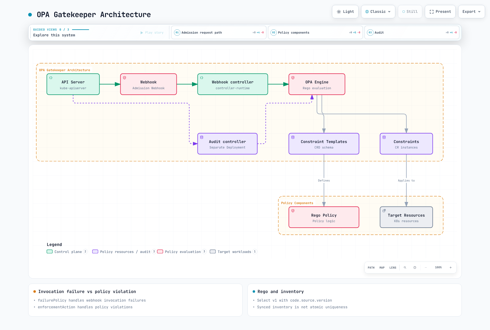

# OPA Gatekeeper

> **Línea base de validación**: Gatekeeper/Gator 3.23.1 · Helm chart 3.23.1

> **Última actualización**: September 13, 2026

## Descripción general

Gatekeeper evalúa políticas durante la admisión de Kubernetes y la auditoría periódica. ConstraintTemplates definen la lógica y los esquemas de parámetros; Constraints definen el alcance, los valores y enforcementAction. Los [ejemplos completos](https://github.com/Atom-oh/kubernetes-docs/tree/main/examples/security/gatekeeper) usan un namespace `policy-lab` dedicado y pruebas locales. No aplique cada fixture de prueba a un clúster de producción.



[🔍 Ver diagrama interactivo](https://www.atomai.click/kubernetes-docs/archmaps/en-security-09-opa-gatekeeper-0.html)

<span id="gatekeeper-vs-kyverno-comparison"></span>

## Elegir Gatekeeper y Kyverno

Elija entre el modelo Rego/Constraint de Gatekeeper y el modelo de políticas orientado a Kubernetes de Kyverno según sus requisitos, pruebas y modelo operativo. Gatekeeper también admite validación nativa de Kubernetes opcional basada en CEL. Evite clasificaciones fijas no compatibles de uso de recursos o afirmaciones de que otro motor no puede expresar lógica compleja. La graduación de OPA de CNCF no establece que Gatekeeper sea un proyecto graduado por separado.

<span id="installation-with-helm"></span>

<span id="installation-with-manifests"></span>

<span id="verify-installation"></span>

## Instalar Gatekeeper

Use el chart fijado y los valores compatibles del directorio de ejemplos. `auditInterval` y `logLevel` son campos de chart de nivel superior; no suponga que valores arbitrarios de `audit.replicas` o `audit.logLevel` tendrán efecto. El perfil renderiza tres réplicas de webhook y un Deployment de auditoría. Verifique la ruta de red desde el control plane de EKS hasta el webhook, los certificados, la ubicación y los recursos disponibles.

```bash
helm repo add gatekeeper https://open-policy-agent.github.io/gatekeeper/charts
helm repo update gatekeeper
helm upgrade --install gatekeeper gatekeeper/gatekeeper --version 3.23.1 \
  --namespace gatekeeper-system --create-namespace --values values.yaml --wait
kubectl -n gatekeeper-system rollout status deployment/gatekeeper-controller-manager
kubectl -n gatekeeper-system rollout status deployment/gatekeeper-audit
```

Para un despliegue gradual, `values.yaml` conserva explícitamente el webhook `failurePolicy: Ignore`. Por tanto, los errores de invocación del webhook pueden permitir solicitudes incluso cuando un Constraint indica `deny`. Evalúe `Fail` junto con la disponibilidad de la API, la recuperación y los namespaces exentos. El alcance del webhook puede ser más amplio que el alcance de un Constraint individual.

### Orden de Template y Constraint

Los Templates generan los CRD de Constraint correspondientes. Espere a que los CRD estén Established y compruebe el estado del Pod de la plantilla antes de aplicar Constraints. Todos los Constraints de ejemplo comienzan en `dryrun`; revise los prefijos de imagen, los parámetros y los namespaces para el entorno de destino.

```bash
kubectl create namespace policy-lab --dry-run=client -o yaml | kubectl apply -f -
kubectl apply -f templates/
kubectl wait --for=condition=Established --timeout=90s \
  crd/docsrequiredlabels.constraints.gatekeeper.sh \
  crd/docsnoprivileged.constraints.gatekeeper.sh \
  crd/docsapprovedimages.constraints.gatekeeper.sh \
  crd/k8scontainerlimits.constraints.gatekeeper.sh \
  crd/docsuniqueingress.constraints.gatekeeper.sh
kubectl apply -f constraints/
```

<span id="rego-language-basics"></span>

<span id="rego-syntax-overview"></span>

<span id="rego-data-types"></span>

<span id="rego-operators-and-built-in-functions"></span>

## Rego y el contrato de entrada

Las políticas de Gatekeeper usan `input.review`, no `input.request` de un ejemplo genérico de OPA AdmissionReview. `input.parameters` proporciona los valores de Constraint y `data.inventory` proporciona los objetos de Kubernetes sincronizados. `targets[].rego` existente usa Rego v0 compatible de forma predeterminada. Rego v1 se selecciona explícitamente con `code[].source.version: v1`; los Templates v0 anteriores no son automáticamente inválidos.

```yaml
apiVersion: templates.gatekeeper.sh/v1
kind: ConstraintTemplate
metadata:
  name: docsrequiredlabels
spec:
  crd:
    spec:
      names:
        kind: DocsRequiredLabels
      validation:
        openAPIV3Schema:
          type: object
          properties:
            labels:
              type: array
              minItems: 1
              items:
                type: string
                minLength: 1
          required:
          - labels
  targets:
  - target: admission.k8s.gatekeeper.sh
    code:
    - engine: Rego
      source:
        version: v1
        rego: "package docsrequiredlabels\nvalid_label(key) if {\n  value := input.review.object.metadata.labels[key]\n\
          \  is_string(value)\n  value != \"\"\n}\nviolation contains {\"msg\": sprintf(\"\
          required nonempty label: %v\", [key])} if {\n  some key in input.parameters.labels\n\
          \  not valid_label(key)\n}\n"
```

`violation contains ... if` es una regla de conjunto parcial v1. Varias definiciones contribuyen a ese conjunto; esto no significa que reglas de documentos completos conflictivas siempre se combinen como OR. Todas las condiciones dentro del cuerpo de una regla deben cumplirse. Distinga las reglas recursivas definidas por el usuario de los built-ins de recorrido JSON como `walk`.

```rego
package examples
items := [x | some x in input.items; x > 10]
keys := object.keys(object.get(input, "labels", {}))
missing := {"app", "team"} - keys
```

`obj[_]` selecciona valores de objeto. Use `object.keys` o vincule la clave explícitamente cuando necesite claves de etiquetas. La diferencia de conjuntos `-`, la intersección `&` y la unión `|` son operaciones de política útiles.

<span id="writing-constraint-templates"></span>

<span id="basic-structure"></span>

<span id="preventing-privileged-containers"></span>

<span id="enforcing-resource-limits"></span>

<span id="restricting-image-registries"></span>

<span id="defining-constraints"></span>

<span id="basic-constraint-writing"></span>

<span id="using-namespace-selectors"></span>

<span id="resource-limits-constraint"></span>

<span id="image-registry-constraint"></span>

## Políticas y alcance

| Template | Verificaciones | Alcance y límites |
|---|---|---|
| DocsRequiredLabels | Etiquetas obligatorias no vacías | Metadatos de Pod; los metadatos de Deployment difieren de las etiquetas de plantilla de Pod |
| DocsNoPrivileged | Rechaza privileged=true | Contenedores regulares, init y efímeros; no es una suite PSS completa |
| DocsApprovedImages | Prefijos de registro/ruta aprobados | Los tres tipos de contenedores; el esquema requiere un límite final `/` |
| K8sContainerLimits | Presencia y máximo de límites de CPU/memoria | Política upstream fijada; contenedores regulares/init, ya que los contenedores efímeros no pueden establecer campos de recursos |
| DocsUniqueIngress | Conflictos exactos de host en inventario sincronizado | Excluye actualizaciones del mismo objeto; no hay garantía de comodines ni de creación concurrente atómica |

### Límites de imágenes y excepciones

`registry.example.com/team/` difiere de `registry.example.com/team-evil/` y `registry.example.com.evil/`. La coincidencia por prefijo necesita un límite de separador y un contrato de nombre de imagen completamente calificado. El ejemplo no ofrece una etiqueta de omisión controlada por la carga de trabajo como `skip-privileged-check=true`. Las excepciones de namespace requieren RBAC controlado, autorización, caducidad y registros de auditoría para cambios de etiquetas.

### Cantidades de recursos

Un parser solo para Gi/Mi/Ki puede devolver undefined para `9G` o bytes simples y omitir silenciosamente infracciones. El ejemplo fija la política upstream `K8sContainerLimits`, que informa las cadenas no compatibles como infracciones. No acepta todas las representaciones de cantidad que Kubernetes permite; documente sus restricciones de formato. Las pruebas nativas distinguen millicores, memoria decimal/binaria, bytes simples, entradas numéricas y cadenas de exponentes explícitamente entre comillas. Ponga entre comillas fixtures de cadenas como `8e9` para evitar que los parsers YAML las conviertan en números.

### PSS y recursos de Controller

No etiquete unas pocas verificaciones de privileged/runAsNonRoot como enforcement Baseline/Restricted completo. El PSS versionado también cubre namespaces de host, seccomp, capabilities, distinciones de SO, herencia a nivel de Pod y contenedores efímeros; use la [guía de Pod Security Standards](./03-pod-security-standards.md). Estos ejemplos verifican la admisión de Pod. Para evaluar antes las plantillas de Pod de Controller, configure pruebas independientes de Template o ExpansionTemplate.

<span id="advanced-policy-patterns"></span>

<span id="external-data-reference"></span>

<span id="cross-namespace-policies"></span>

<span id="complex-condition-policies"></span>

## Datos sincronizados y políticas referenciales

`sync.yaml` sincroniza objetos Ingress de `networking.k8s.io/v1` en el inventario. Esto difiere de conectarse a un proveedor HTTP externo o a un bundle OPA arbitrario. Sincronice solo los objetos necesarios y revise RBAC, memoria y datos sensibles.

```yaml
apiVersion: config.gatekeeper.sh/v1alpha1
kind: Config
metadata:
  name: config
  namespace: gatekeeper-system
spec:
  sync:
    syncOnly:
    - group: networking.k8s.io
      version: v1
      kind: Ingress
```

Un nombre diferente en el mismo namespace, o el mismo nombre en otro namespace, aún puede entrar en conflicto. Exigir que tanto el namespace como el nombre sean diferentes no detecta esos casos. El ejemplo excluye solo el mismo namespace/nombre como una autoactualización. Puesto que el inventario es finalmente coherente, no puede garantizar atómicamente la unicidad para creaciones concurrentes.

<span id="mutation-features"></span>

<span id="using-assignmetadata"></span>

<span id="using-assign"></span>

<span id="conditional-mutation"></span>

<span id="using-modifyset"></span>

## Mutación

AssignMetadata agrega etiquetas/anotaciones de metadatos compatibles; no es un mecanismo de sobrescritura general. Assign establece un campo. Asignar una lista completa de tolerations puede descartar entradas existentes, por lo que este ejemplo usa la fusión de ModifySet. La toleration permite un taint de laboratorio dedicado; no selecciona nodos Spot.

```yaml
apiVersion: mutations.gatekeeper.sh/v1
kind: ModifySet
metadata:
  name: docs-dedicated-toleration
spec:
  applyTo:
  - groups:
    - ''
    versions:
    - v1
    kinds:
    - Pod
  match:
    scope: Namespaced
    namespaces:
    - policy-lab
  location: spec.tolerations
  parameters:
    operation: merge
    values:
      fromList:
      - key: dedicated
        operator: Equal
        value: policy-lab
        effect: NoSchedule
```

Separe la mutación/defaulting de la validación. Revise el alcance CREATE/UPDATE, la aplicación repetida, la convergencia con otros mutators y los efectos sobre objetos existentes. Crear un mutator no reescribe automáticamente cada objeto existente.

<span id="audit-configuration"></span>

<span id="checking-constraint-violations"></span>

<span id="prometheus-metrics"></span>

<span id="grafana-dashboard"></span>

## Auditoría y monitoreo

Establezca la frecuencia de auditoría con `auditInterval` del chart. La configuración `validation.traces` sirve para depurar evaluaciones de admisión seleccionadas, no para programar auditorías. Las entradas de admisión y los prints de Rego pueden contener datos sensibles de objetos; actívelos solo para el alcance necesario. `constraintViolationsLimit` limita la lista de detalles de estado, que puede diferir de totalViolations.

```bash
kubectl get constraints
kubectl describe docsrequiredlabels required-labels
kubectl get constrainttemplatepodstatuses -n gatekeeper-system
kubectl get constraintpodstatuses -n gatekeeper-system
```

El Service de webhook del chart expone solo tráfico HTTPS de webhook, no métricas. `podmonitor.yaml` selecciona el puerto de contenedor con nombre real metrics:8888 tanto en los Deployments de auditoría como de webhook. Primero instale los CRD de Prometheus Operator y alinee los selectores de etiquetas/namespace de PodMonitor.

| Métrica | Interpretación |
|---|---|
| gatekeeper_validation_request_count | Solicitudes de validación con etiquetas admission_status reales |
| gatekeeper_validation_request_duration_seconds | Histograma de latencia de validación |
| gatekeeper_violations | Infracciones auditadas por enforcement_action; sin asumir una etiqueta constraint_name predeterminada |
| gatekeeper_audit_last_run_end_time | Marca de tiempo de la última auditoría completada |
| gatekeeper_constraint_templates | Recuentos de estado de Template |

```promql
sum by (enforcement_action) (gatekeeper_violations)
histogram_quantile(0.99, sum by (le) (rate(gatekeeper_validation_request_duration_seconds_bucket[5m])))
```

<span id="testing-and-ci-cd-integration"></span>

<span id="gator-cli-testing"></span>

<span id="test-suite-definition"></span>

<span id="test-fixtures"></span>

<span id="github-actions-integration"></span>

## Pruebas de Gator y CI

Instale el asset de lanzamiento oficial 3.23.1 y verifique su checksum publicado. El binario ARM64 informa +dirty en GitVersion; la auditoría verificó el hash del archivo publicado en lugar de asumir que ese texto significa una modificación local. No sustituya evidencia versionada por una ejecución de CLI @latest sin fijar.

```bash
gator version
gator verify tests/suite.yaml --verbose
gator test -f templates/docsnoprivileged.yaml \
  -f constraints/no-privileged.yaml \
  -f tests/fixtures/tenant-skip-label-no-bypass.yaml --output=json
```

`verify` comprueba las infracciones esperadas en Suites; `test -f` evalúa manifiestos frente a Templates/Constraints. Verify puede ignorar un directorio sin Suites, así que compruebe que se ejecutaron las cinco pruebas y los 33 casos en lugar de confiar solo en el estado de salida. Las imágenes de los fixtures son entradas de política, no cargas de trabajo que se puedan descargar. CI ejecuta la suite local sin credenciales; cualquier dry-run de clúster pertenece a un entorno confiable separado con acceso autorizado.

<span id="best-practices"></span>

<span id="policy-organization"></span>

<span id="gradual-policy-rollout"></span>

<span id="policy-exception-management"></span>

<span id="troubleshooting"></span>

<span id="common-issues"></span>

<span id="debugging-tips"></span>

## Despliegue gradual y solución de problemas

Mueva el mismo Constraint completado a través de dryrun→warn→deny y revise los resultados de auditoría/admisión y las excepciones. No cree tres Constraints sin parámetros como mecanismo de despliegue gradual. Las infracciones de Dryrun/warn pueden devolver un estado de salida de prueba de Gator cero; las infracciones de deny devuelven uno. Observe los fallos de disponibilidad del webhook por separado de las infracciones de política.

```bash
kubectl get validatingwebhookconfiguration gatekeeper-validating-webhook-configuration -o yaml
kubectl -n gatekeeper-system logs deployment/gatekeeper-controller-manager --tail=100
kubectl -n gatekeeper-system logs deployment/gatekeeper-audit --tail=100
```

Compruebe la entrada de política, el alcance de match, los errores de CRD/template, los certificados/red del webhook, las marcas de tiempo de auditoría y la actualización del inventario. Diagnostique la causa antes de cambiar el enforcement del webhook o ampliar las excepciones de namespace.

<span id="summary"></span>

<span id="related-documentation"></span>

## Alcance de validación y lecturas relacionadas

Gator3.23.1 ejecutó 33 casos de política y tres modos de enforcement. Las comprobaciones cubrieron el renderizado de Helm fijado, ocho objetos CRD de Gatekeeper y enlaces de PodMonitor de auditoría/webhook. No ejecutaron la admisión de Kubernetes, las redes de EKS, la sincronización de caché de auditoría en vivo ni la conmutación por error de API. La validación nativa de mutación independiente se registra en el informe de revisión.

- [Cuestionario de Gatekeeper](../quizzes/security/09-opa-gatekeeper-quiz.md)
- [Kyverno](./01-kyverno-policy-management.md)
- [Pod Security Standards](./03-pod-security-standards.md)
- [Prácticas de seguridad de EKS](./06-eks-security-best-practices.md)

## Referencias

- [Gatekeeper v3.23.1](https://github.com/open-policy-agent/gatekeeper/tree/v3.23.1)
- [ConstraintTemplate y versiones de Rego](https://github.com/open-policy-agent/gatekeeper/blob/v3.23.1/website/docs/constrainttemplates.md)
- [Gator](https://github.com/open-policy-agent/gatekeeper/blob/v3.23.1/website/docs/gator.md)
- [Mutación](https://github.com/open-policy-agent/gatekeeper/blob/v3.23.1/website/docs/mutation.md)
- [Auditoría](https://github.com/open-policy-agent/gatekeeper/blob/v3.23.1/website/docs/audit.md)
- [Métricas](https://github.com/open-policy-agent/gatekeeper/blob/v3.23.1/website/docs/metrics.md)
- [Política de límites de recursos fijada](https://github.com/open-policy-agent/gatekeeper-library/blob/bd333d4704647b1000cef5a92017257ee46fe2c8/library/general/containerlimits/template.yaml)
