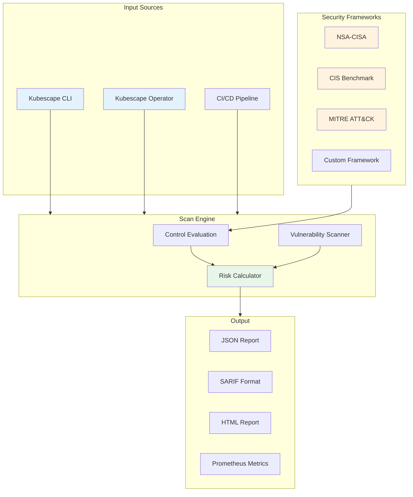
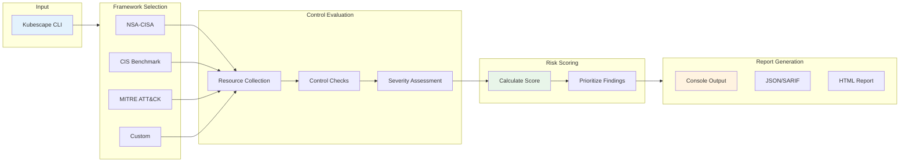
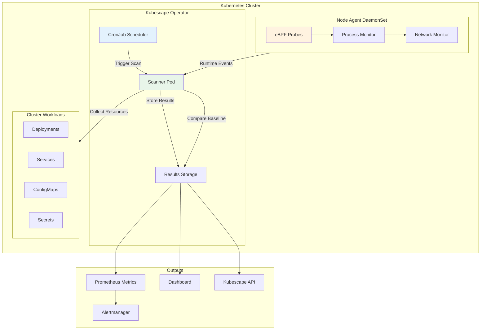
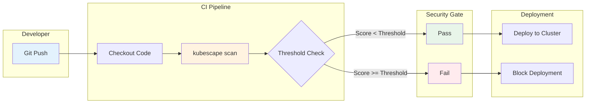

# Gestión de la postura de seguridad con Kubescape

> **Versiones compatibles**: Kubescape 3.0+, Kubernetes 1.31, 1.32, 1.33
> **Última actualización**: February 25, 2026

Kubescape es una plataforma de seguridad open-source para Kubernetes que proporciona gestión integral de la postura de seguridad, escaneo de vulnerabilidades y verificación de cumplimiento. Como proyecto CNCF Sandbox, ayuda a las organizaciones a identificar configuraciones incorrectas, vulnerabilidades e incumplimientos en sus entornos Kubernetes.

## Tabla de contenidos

1. [Descripción general](#descripción-general)
2. [Instalación](#instalación)
3. [Frameworks de seguridad](#frameworks-de-seguridad)
4. [Escaneo con CLI](#escaneo-con-cli)
5. [Modo Operator (In-Cluster)](#modo-operator-in-cluster)
6. [Puntuación de riesgo](#puntuación-de-riesgo)
7. [Integración CI/CD](#integración-cicd)
8. [Guía específica para EKS](#guía-específica-para-eks)
9. [Manejo de excepciones de controles](#manejo-de-excepciones-de-controles)
10. [Mejores prácticas](#mejores-prácticas)
11. [Resumen y referencias](#resumen-y-referencias)

---

## Descripción general

### Qué resuelve Kubescape

Kubescape aborda desafíos críticos de seguridad en entornos Kubernetes:

- **Detección de configuraciones incorrectas**: Identifica configuraciones incorrectas de seguridad en workloads, RBAC, network policies y ajustes del cluster
- **Verificación de cumplimiento**: Valida clusters frente a frameworks de la industria (NSA-CISA, CIS, MITRE ATT&CK)
- **Escaneo de vulnerabilidades**: Detecta vulnerabilidades en container images y componentes de Kubernetes
- **Análisis de RBAC**: Visualiza y analiza configuraciones de control de acceso basado en roles
- **Shift-Left Security**: Escanea manifests y Helm charts antes del despliegue

### Proyecto CNCF Sandbox

Kubescape se unió a CNCF Sandbox en 2022, demostrando su compromiso con los principios open-source y el desarrollo impulsado por la comunidad. El proyecto es mantenido activamente por ARMO y la comunidad open-source.

### Comparación con herramientas similares

| Característica | Kubescape | kube-bench | Polaris | Trivy |
|---------|-----------|------------|---------|-------|
| **CIS Benchmark** | Sí | Sí | No | Sí |
| **Framework NSA-CISA** | Sí | No | No | No |
| **MITRE ATT&CK** | Sí | No | No | No |
| **Escaneo de imágenes** | Sí | No | No | Sí |
| **Análisis de RBAC** | Sí | No | No | No |
| **Escaneo Helm/YAML** | Sí | No | Sí | Sí |
| **Operator In-Cluster** | Sí | Limitado | Sí | Sí |
| **Puntuación de riesgo** | Sí | No | Sí | Sí |
| **Frameworks personalizados** | Sí | No | Sí | No |
| **Integración CI/CD** | Nativa | Manual | Nativa | Nativa |
| **Detección en runtime** | Sí (con Node Agent) | No | No | No |
| **Licencia** | Apache 2.0 | Apache 2.0 | Apache 2.0 | Apache 2.0 |

### Arquitectura de Kubescape



---

## Instalación

### Instalación de la CLI

#### Linux y macOS

```bash
# Using curl (recommended)
curl -s https://raw.githubusercontent.com/kubescape/kubescape/master/install.sh | /bin/bash

# Using Homebrew (macOS/Linux)
brew install kubescape

# Using Krew (kubectl plugin manager)
kubectl krew install kubescape

# Verify installation
kubescape version
```

#### Windows

```powershell
# Using PowerShell
iwr -useb https://raw.githubusercontent.com/kubescape/kubescape/master/install.ps1 | iex

# Using Chocolatey
choco install kubescape

# Using Scoop
scoop install kubescape
```

#### Container Image

```bash
# Run Kubescape as a container
docker run -v ~/.kube:/root/.kube quay.io/kubescape/kubescape:latest scan framework nsa

# With specific kubeconfig
docker run -v /path/to/kubeconfig:/root/.kube/config \
    quay.io/kubescape/kubescape:latest scan framework cis
```

### Instalación del Helm Operator (In-Cluster)

El Kubescape Operator proporciona capacidades de escaneo y monitoreo continuos dentro del cluster.

```bash
# Add Kubescape Helm repository
helm repo add kubescape https://kubescape.github.io/helm-charts/
helm repo update

# Install Kubescape Operator with default settings
helm install kubescape kubescape/kubescape-operator \
    -n kubescape \
    --create-namespace

# Install with custom configuration
helm install kubescape kubescape/kubescape-operator \
    -n kubescape \
    --create-namespace \
    --set clusterName=my-eks-cluster \
    --set capabilities.continuousScan=enable \
    --set capabilities.vulnerabilityScan=enable \
    --set capabilities.nodeScan=enable \
    --set capabilities.runtimeDetection=enable
```

#### Valores de configuración del Operator

```yaml
# values.yaml
clusterName: "production-eks-cluster"

capabilities:
  continuousScan: enable
  vulnerabilityScan: enable
  nodeScan: enable
  runtimeDetection: enable
  networkPolicyService: enable

kubescape:
  serviceMonitor:
    enabled: true
  resources:
    requests:
      cpu: 100m
      memory: 256Mi
    limits:
      cpu: 500m
      memory: 512Mi

storage:
  enabled: true
  storageClassName: gp3
  size: 10Gi

nodeAgent:
  enabled: true
  resources:
    requests:
      cpu: 50m
      memory: 128Mi
    limits:
      cpu: 200m
      memory: 256Mi

gateway:
  enabled: true
  service:
    type: ClusterIP
```

### Kubescape Cloud (SaaS)

Kubescape Cloud proporciona un dashboard centralizado para gestionar la seguridad en múltiples clusters.

```bash
# Connect to Kubescape Cloud
kubescape scan framework nsa --account <ACCOUNT_ID> --submit

# Generate account ID
kubescape config set accountID <YOUR_ACCOUNT_ID>

# Verify cloud connectivity
kubescape config view
```

---

## Frameworks de seguridad

Kubescape admite múltiples frameworks de seguridad para una verificación integral del cumplimiento.

### NSA-CISA Kubernetes Hardening Guide

El framework NSA-CISA proporciona recomendaciones de seguridad de la U.S. National Security Agency y la Cybersecurity & Infrastructure Security Agency.

```bash
# Scan against NSA-CISA framework
kubescape scan framework nsa

# Scan specific namespaces
kubescape scan framework nsa --include-namespaces production,staging
```

Categorías principales de controles:
- Pod Security
- Separación de red
- Autenticación y autorización
- Audit Logging
- Actualización y aplicación de parches

### CIS Kubernetes Benchmark

El Center for Internet Security (CIS) Benchmark proporciona guías prescriptivas de configuración de seguridad.

```bash
# Scan against CIS Benchmark
kubescape scan framework cis

# CIS v1.8 for Kubernetes 1.27+
kubescape scan framework cis-v1.8

# EKS-specific CIS benchmark
kubescape scan framework cis-eks
```

Secciones de CIS Benchmark:
- Componentes del Control Plane
- Configuración de etcd
- Configuración del Control Plane
- Seguridad de Worker Node
- Políticas

### Framework MITRE ATT&CK

El framework MITRE ATT&CK asigna controles de seguridad a técnicas de ataque conocidas.

```bash
# Scan against MITRE ATT&CK
kubescape scan framework mitre

# View specific attack techniques
kubescape scan framework mitre --verbose
```

Categorías de ataque cubiertas:
- Acceso inicial
- Ejecución
- Persistencia
- Escalación de privilegios
- Evasión de defensas
- Acceso a credenciales
- Descubrimiento
- Movimiento lateral
- Impacto

### Frameworks personalizados

Crea frameworks personalizados para requisitos específicos de la organización.

```yaml
# custom-framework.yaml
name: "Organization Security Standards"
description: "Custom security framework for internal compliance"
controls:
  - controlID: C-0001
  - controlID: C-0002
  - controlID: C-0009
  - controlID: C-0034
  - controlID: C-0038
  - controlID: C-0041
  - controlID: C-0044
  - controlID: C-0055
  - controlID: C-0057
```

```bash
# Scan with custom framework
kubescape scan framework --custom-framework custom-framework.yaml

# List available controls
kubescape list controls
```

### Comparación de frameworks

| Framework | Área de enfoque | Controles | Ideal para |
|-----------|------------|----------|----------|
| **NSA-CISA** | Hardening gubernamental | 30+ | Cumplimiento federal/gubernamental |
| **CIS** | Línea base de configuración | 100+ | Línea base general de seguridad |
| **MITRE ATT&CK** | Mapeo de amenazas | 40+ | Modelado de amenazas, red team |
| **CIS-EKS** | Específico de AWS EKS | 50+ | Despliegues EKS |
| **SOC2** | Cumplimiento | 20+ | Auditorías SOC 2 |
| **Personalizado** | Específico de la organización | Variable | Estándares internos |

---

## Escaneo con CLI

### Flujo del pipeline de escaneo



### Escaneo de cluster

```bash
# Full cluster scan with NSA-CISA framework
kubescape scan framework nsa

# Scan with verbose output
kubescape scan framework nsa --verbose

# Scan specific namespaces
kubescape scan framework nsa \
    --include-namespaces production,staging \
    --exclude-namespaces kube-system,monitoring

# Scan with severity threshold
kubescape scan framework nsa --severity-threshold high

# Output to JSON
kubescape scan framework nsa --format json --output results.json

# Output to SARIF (for GitHub integration)
kubescape scan framework nsa --format sarif --output results.sarif

# Generate HTML report
kubescape scan framework nsa --format html --output report.html
```

### Escaneo de controles específicos

```bash
# List all available controls
kubescape list controls

# Scan for a specific control
kubescape scan control C-0034

# Scan multiple controls
kubescape scan control C-0034,C-0038,C-0041

# Get control details
kubescape describe control C-0034
```

Controles de seguridad comunes:

| ID de control | Nombre | Descripción |
|------------|------|-------------|
| C-0001 | Container registries prohibidos | Detecta imágenes de registries no confiables |
| C-0002 | Exec into Container | Detecta permisos de exec |
| C-0009 | Límites de recursos | Verifica límites de recursos faltantes |
| C-0016 | Permitir escalación de privilegios | Detecta riesgo de escalación de privilegios |
| C-0017 | Filesystem de container inmutable | Verifica filesystem raíz de solo lectura |
| C-0034 | Mapeo automático de SA | Detecta montaje automático de service account |
| C-0038 | Privilegios Host PID/IPC | Detecta uso compartido de namespaces del host |
| C-0041 | Acceso HostNetwork | Detecta uso de red del host |
| C-0044 | Hostport de container | Detecta uso de hostPort |
| C-0046 | Capabilities inseguras | Detecta capabilities peligrosas |
| C-0055 | Hardening de Linux | Verifica perfiles seccomp/AppArmor |
| C-0057 | Container privilegiado | Detecta containers privilegiados |

### Escaneo de manifests YAML y Helm (Shift-Left)

Escanea manifests antes del despliegue para detectar problemas temprano.

```bash
# Scan YAML files
kubescape scan *.yaml

# Scan a directory
kubescape scan ./manifests/

# Scan Helm chart
kubescape scan ./my-chart/

# Scan Helm chart with values
kubescape scan ./my-chart/ --helm-set key=value

# Scan from URL
kubescape scan https://raw.githubusercontent.com/org/repo/main/deployment.yaml

# Scan with specific framework
kubescape scan framework nsa ./manifests/

# Fail on high severity findings
kubescape scan ./manifests/ --severity-threshold high --fail-threshold 0
```

Ejemplo de salida de escaneo de manifest:

```
Controls: 25 (Failed: 3, Excluded: 0, Skipped: 0)
Failed Resources: 5
Compliance Score: 88%

┌──────────────┬────────────────────────────────────────┬──────────────┬────────┐
│ SEVERITY     │ CONTROL NAME                           │ FAILED       │ STATUS │
├──────────────┼────────────────────────────────────────┼──────────────┼────────┤
│ High         │ Privileged container                   │ 1            │ failed │
│ High         │ Allow privilege escalation             │ 2            │ failed │
│ Medium       │ Resource limits                        │ 2            │ failed │
└──────────────┴────────────────────────────────────────┴──────────────┴────────┘
```

### Escaneo de vulnerabilidades de imágenes

```bash
# Scan a specific image
kubescape scan image nginx:latest

# Scan all images in cluster
kubescape scan image --cluster

# Scan images in specific namespace
kubescape scan image --namespace production

# Filter by severity
kubescape scan image nginx:latest --severity critical,high

# Output vulnerabilities as JSON
kubescape scan image nginx:latest --format json --output vulns.json
```

Ejemplo de salida de vulnerabilidades:

```
Image: nginx:1.21.0
Vulnerabilities Found: 12 (Critical: 2, High: 4, Medium: 6)

┌─────────────────┬──────────────┬──────────┬─────────────────────────────────┐
│ CVE             │ SEVERITY     │ PACKAGE  │ FIX VERSION                     │
├─────────────────┼──────────────┼──────────┼─────────────────────────────────┤
│ CVE-2023-44487  │ Critical     │ openssl  │ 1.1.1w                          │
│ CVE-2023-38545  │ Critical     │ curl     │ 8.4.0                           │
│ CVE-2023-4911   │ High         │ glibc    │ 2.38-1                          │
└─────────────────┴──────────────┴──────────┴─────────────────────────────────┘

Recommendation: Update to nginx:1.25.3 or later
```

### Visualización y análisis de RBAC

```bash
# Scan RBAC configuration
kubescape scan rbac

# Analyze specific service account
kubescape scan rbac --service-account default:default

# Analyze specific user
kubescape scan rbac --user admin@example.com

# List subjects with cluster-admin equivalent
kubescape scan rbac --list-cluster-admins

# Export RBAC graph
kubescape scan rbac --format json --output rbac.json
```

Capacidades de análisis de RBAC:
- Identificar service accounts con privilegios excesivos
- Detectar permisos equivalentes a cluster-admin
- Visualizar role bindings y su alcance
- Encontrar roles y bindings no utilizados
- Resaltar combinaciones de permisos riesgosas

---

## Modo Operator (In-Cluster)

### Arquitectura de escaneo continuo



### Componentes del Operator

```bash
# Verify operator installation
kubectl get pods -n kubescape

# Expected output:
# NAME                                    READY   STATUS    RESTARTS   AGE
# kubescape-operator-7d8f9c6b4d-x2h8k    1/1     Running   0          2h
# kubescape-storage-6b9d4f5c8a-m3n7p     1/1     Running   0          2h
# kubescape-gateway-5c7e8d9f6b-q4w2r     1/1     Running   0          2h
# node-agent-abcd1                        1/1     Running   0          2h
# node-agent-efgh2                        1/1     Running   0          2h

# Check CRDs
kubectl get crd | grep kubescape
```

### Configuración de escaneo programado

```yaml
# scanning-schedule.yaml
apiVersion: kubescape.io/v1alpha1
kind: ScanSchedule
metadata:
  name: daily-compliance-scan
  namespace: kubescape
spec:
  schedule: "0 2 * * *"  # Daily at 2 AM
  scanType: framework
  framework: nsa
  namespaces:
    include:
      - production
      - staging
    exclude:
      - kube-system
  severityThreshold: medium
  notifications:
    slack:
      enabled: true
      channel: "#security-alerts"
    email:
      enabled: true
      recipients:
        - security-team@example.com
```

```bash
# Apply scanning schedule
kubectl apply -f scanning-schedule.yaml

# View scan results
kubectl get vulnerabilitymanifests -n kubescape
kubectl get configurationscans -n kubescape
```

### Integración de escaneo de vulnerabilidades

```yaml
# vulnerability-scan-config.yaml
apiVersion: kubescape.io/v1alpha1
kind: VulnerabilityScanConfig
metadata:
  name: image-scanning
  namespace: kubescape
spec:
  enabled: true
  scanNewImages: true
  scanInterval: "24h"
  registries:
    - url: "123456789012.dkr.ecr.us-west-2.amazonaws.com"
      credentials:
        secretRef: ecr-credentials
  severityThreshold: high
  ignoredCVEs:
    - CVE-2023-12345  # Known false positive
```

### Detección de amenazas en runtime (Node Agent con eBPF)

El Node Agent usa eBPF para monitoreo en runtime de baja sobrecarga.

```yaml
# node-agent configuration
nodeAgent:
  enabled: true

  config:
    applicationProfile:
      enabled: true
      interval: "1m"

    networkPolicy:
      enabled: true

    runtimeDetection:
      enabled: true
      rules:
        - name: "Crypto Mining Detection"
          enabled: true
        - name: "Reverse Shell Detection"
          enabled: true
        - name: "Privilege Escalation"
          enabled: true
        - name: "Container Escape"
          enabled: true

    alertThreshold: warning
```

Capacidades de detección en runtime:
- Anomalías de ejecución de procesos
- Monitoreo de acceso al filesystem
- Seguimiento de conexiones de red
- Detección de uso de capabilities
- Monitoreo de syscalls

### Detección de ataques a Kubernetes API

```yaml
# api-threat-detection.yaml
apiVersion: kubescape.io/v1alpha1
kind: ThreatDetectionConfig
metadata:
  name: api-monitoring
  namespace: kubescape
spec:
  apiServer:
    enabled: true
    detectionRules:
      - name: "Suspicious kubectl exec"
        severity: high
        pattern:
          verb: create
          resource: pods/exec

      - name: "Secret Enumeration"
        severity: medium
        pattern:
          verb: list
          resource: secrets

      - name: "RBAC Modification"
        severity: high
        pattern:
          verb: ["create", "update", "patch", "delete"]
          resource: ["roles", "rolebindings", "clusterroles", "clusterrolebindings"]

      - name: "Service Account Token Access"
        severity: medium
        pattern:
          verb: create
          resource: serviceaccounts/token
```

---

## Puntuación de riesgo

### Cálculo de la puntuación de riesgo

Kubescape calcula puntuaciones de riesgo con base en múltiples factores:

```
Risk Score = Σ (Control Severity × Resource Count × Exposure Factor)
           ─────────────────────────────────────────────────────────
                          Total Controls × Max Severity
```

Componentes:
- **Severidad del control**: Critical (10), High (7), Medium (4), Low (1)
- **Cantidad de recursos**: Número de recursos afectados
- **Factor de exposición**: Exposición de red, nivel de privilegios, sensibilidad de datos

### Niveles de severidad

| Nivel | Rango de puntuación | Descripción | Acción requerida |
|-------|-------------|-------------|-----------------|
| **Critical** | 9-10 | Riesgo de explotación inmediata | Remediación inmediata |
| **High** | 7-8 | Riesgo de seguridad significativo | Remediar dentro de 24 horas |
| **Medium** | 4-6 | Preocupación de seguridad moderada | Remediar dentro de 7 días |
| **Low** | 1-3 | Mejora de seguridad menor | Remediar dentro de 30 días |
| **Negligible** | 0 | Informativo | No se requiere acción |

### Visualización de puntuaciones de riesgo

```bash
# Scan with detailed risk scoring
kubescape scan framework nsa --verbose

# Get risk score summary
kubescape scan framework nsa --format json | jq '.riskScore'

# Sort results by risk score
kubescape scan framework nsa --format pretty-printer
```

Ejemplo de salida de puntuación de riesgo:

```
┌─────────────────────────────────────────────────────────────────────────────┐
│                            Risk Assessment Summary                           │
├─────────────────────────────────────────────────────────────────────────────┤
│                                                                             │
│  Overall Risk Score: 34/100                                                 │
│  Compliance Score: 76%                                                      │
│                                                                             │
│  ┌─────────────┬──────────┬───────────────────────────────────────────┐   │
│  │ Severity    │ Controls │ Progress                                  │   │
│  ├─────────────┼──────────┼───────────────────────────────────────────┤   │
│  │ Critical    │ 0/2      │ ████████████████████ 100%                │   │
│  │ High        │ 3/8      │ ██████████████░░░░░░ 62%                 │   │
│  │ Medium      │ 5/15     │ ████████████████░░░░ 67%                 │   │
│  │ Low         │ 2/10     │ ████████████████████ 80%                 │   │
│  └─────────────┴──────────┴───────────────────────────────────────────┘   │
│                                                                             │
│  Top 5 Risks:                                                               │
│  1. Privileged containers in production (Score: 9.2)                        │
│  2. Missing network policies (Score: 7.8)                                   │
│  3. Containers with CAP_SYS_ADMIN (Score: 7.5)                             │
│  4. Service accounts with cluster-admin (Score: 6.9)                        │
│  5. Images from untrusted registries (Score: 6.2)                          │
│                                                                             │
└─────────────────────────────────────────────────────────────────────────────┘
```

### Estrategia de priorización

```bash
# Focus on critical and high severity first
kubescape scan framework nsa --severity-threshold high

# Get prioritized remediation list
kubescape scan framework nsa --format json | \
    jq '[.results[].controls[] | select(.status == "failed")] |
        sort_by(.severity) | reverse'
```

---

## Integración CI/CD

### Flujo de trabajo de integración CI/CD



### Workflow de GitHub Actions

```yaml
# .github/workflows/security-scan.yaml
name: Kubernetes Security Scan

on:
  push:
    branches: [main, develop]
    paths:
      - 'k8s/**'
      - 'helm/**'
  pull_request:
    branches: [main]
    paths:
      - 'k8s/**'
      - 'helm/**'

jobs:
  kubescape-scan:
    runs-on: ubuntu-latest
    steps:
      - name: Checkout code
        uses: actions/checkout@v4

      - name: Install Kubescape
        run: |
          curl -s https://raw.githubusercontent.com/kubescape/kubescape/master/install.sh | /bin/bash

      - name: Scan Kubernetes manifests
        id: scan
        run: |
          kubescape scan framework nsa ./k8s/ \
            --format sarif \
            --output results.sarif \
            --severity-threshold high \
            --compliance-threshold 75

      - name: Upload SARIF results
        uses: github/codeql-action/upload-sarif@v3
        if: always()
        with:
          sarif_file: results.sarif

      - name: Scan Helm charts
        run: |
          kubescape scan framework cis ./helm/my-app/ \
            --format json \
            --output helm-results.json

      - name: Check compliance score
        run: |
          SCORE=$(cat helm-results.json | jq -r '.complianceScore')
          echo "Compliance Score: $SCORE%"
          if [ $(echo "$SCORE < 75" | bc) -eq 1 ]; then
            echo "Compliance score below threshold!"
            exit 1
          fi

      - name: Upload scan artifacts
        uses: actions/upload-artifact@v4
        if: always()
        with:
          name: kubescape-results
          path: |
            results.sarif
            helm-results.json

  image-scan:
    runs-on: ubuntu-latest
    needs: kubescape-scan
    steps:
      - name: Checkout code
        uses: actions/checkout@v4

      - name: Install Kubescape
        run: |
          curl -s https://raw.githubusercontent.com/kubescape/kubescape/master/install.sh | /bin/bash

      - name: Scan container images
        run: |
          # Extract image names from manifests
          IMAGES=$(grep -r "image:" ./k8s/ | awk '{print $2}' | sort -u)

          for IMAGE in $IMAGES; do
            echo "Scanning: $IMAGE"
            kubescape scan image "$IMAGE" \
              --format json \
              --output "image-scan-$(echo $IMAGE | tr '/:' '-').json" \
              --severity critical,high || true
          done

      - name: Check for critical vulnerabilities
        run: |
          CRITICAL=$(find . -name "image-scan-*.json" -exec cat {} \; | \
            jq -s '[.[].vulnerabilities[] | select(.severity == "Critical")] | length')

          if [ "$CRITICAL" -gt 0 ]; then
            echo "Critical vulnerabilities found: $CRITICAL"
            exit 1
          fi
```

### Integración con GitLab CI/CD

```yaml
# .gitlab-ci.yml
stages:
  - security-scan
  - deploy

variables:
  KUBESCAPE_VERSION: "latest"
  COMPLIANCE_THRESHOLD: 75
  SEVERITY_THRESHOLD: "high"

kubescape-scan:
  stage: security-scan
  image: quay.io/kubescape/kubescape:${KUBESCAPE_VERSION}
  script:
    - kubescape scan framework nsa ./manifests/
        --format json
        --output gl-security-report.json
        --severity-threshold ${SEVERITY_THRESHOLD}
    - |
      SCORE=$(cat gl-security-report.json | jq -r '.complianceScore')
      echo "Compliance Score: $SCORE%"
      if [ $(echo "$SCORE < ${COMPLIANCE_THRESHOLD}" | bc) -eq 1 ]; then
        echo "Security scan failed: compliance below threshold"
        exit 1
      fi
  artifacts:
    reports:
      sast: gl-security-report.json
    paths:
      - gl-security-report.json
    when: always
  rules:
    - if: $CI_PIPELINE_SOURCE == "merge_request_event"
    - if: $CI_COMMIT_BRANCH == $CI_DEFAULT_BRANCH
```

### Integración con Jenkins Pipeline

```groovy
// Jenkinsfile
pipeline {
    agent any

    environment {
        KUBESCAPE_ACCOUNT = credentials('kubescape-account-id')
    }

    stages {
        stage('Install Kubescape') {
            steps {
                sh '''
                    curl -s https://raw.githubusercontent.com/kubescape/kubescape/master/install.sh | /bin/bash
                '''
            }
        }

        stage('Security Scan') {
            steps {
                sh '''
                    kubescape scan framework nsa ./k8s/ \
                        --format json \
                        --output kubescape-results.json \
                        --severity-threshold high \
                        --account ${KUBESCAPE_ACCOUNT} \
                        --submit
                '''
            }
            post {
                always {
                    archiveArtifacts artifacts: 'kubescape-results.json'
                    publishHTML([
                        allowMissing: false,
                        alwaysLinkToLastBuild: true,
                        keepAll: true,
                        reportDir: '.',
                        reportFiles: 'kubescape-results.html',
                        reportName: 'Kubescape Security Report'
                    ])
                }
            }
        }

        stage('Gate Check') {
            steps {
                script {
                    def results = readJSON file: 'kubescape-results.json'
                    def score = results.complianceScore

                    if (score < 75) {
                        error "Security compliance score (${score}%) below threshold (75%)"
                    }
                    echo "Security scan passed with score: ${score}%"
                }
            }
        }
    }
}
```

### Gates basados en umbrales

```bash
# Set compliance threshold
kubescape scan framework nsa ./manifests/ \
    --compliance-threshold 80 \
    --fail-threshold 5

# Fail on any high/critical findings
kubescape scan framework nsa ./manifests/ \
    --severity-threshold high \
    --fail-threshold 0

# Custom exit codes
kubescape scan framework nsa ./manifests/ \
    --format json \
    --output results.json

# Check results and set exit code
CRITICAL=$(jq '[.results[].controls[] | select(.status == "failed" and .severity == "Critical")] | length' results.json)
HIGH=$(jq '[.results[].controls[] | select(.status == "failed" and .severity == "High")] | length' results.json)

if [ "$CRITICAL" -gt 0 ]; then
    echo "Critical findings: $CRITICAL"
    exit 2
elif [ "$HIGH" -gt 3 ]; then
    echo "Too many high findings: $HIGH"
    exit 1
fi
```

---

## Guía específica para EKS

### Controles específicos de EKS

```bash
# Scan with EKS-specific CIS benchmark
kubescape scan framework cis-eks

# Scan for EKS-specific controls
kubescape scan control \
    C-0001,C-0034,C-0035,C-0036,C-0037 \
    --verbose
```

### Análisis del ConfigMap aws-auth

```bash
# Analyze aws-auth ConfigMap permissions
kubectl get configmap aws-auth -n kube-system -o yaml

# Kubescape RBAC scan includes aws-auth analysis
kubescape scan rbac --verbose | grep -A 20 "aws-auth"
```

Problemas comunes de aws-auth:
- Entradas mapRoles excesivamente permisivas
- Mapeos directos de la cuenta root
- Restricciones de grupo faltantes

Ejemplo de configuración segura de aws-auth:

```yaml
apiVersion: v1
kind: ConfigMap
metadata:
  name: aws-auth
  namespace: kube-system
data:
  mapRoles: |
    - rolearn: arn:aws:iam::123456789012:role/EKSNodeRole
      username: system:node:{{EC2PrivateDNSName}}
      groups:
        - system:bootstrappers
        - system:nodes
    - rolearn: arn:aws:iam::123456789012:role/EKSAdminRole
      username: eks-admin
      groups:
        - system:masters
    - rolearn: arn:aws:iam::123456789012:role/EKSDeveloperRole
      username: eks-developer
      groups:
        - eks-developers  # Custom group with limited permissions
```

### Validación de IRSA (IAM Roles for Service Accounts)

```bash
# Check service accounts with IRSA annotations
kubectl get sa -A -o json | jq '.items[] |
    select(.metadata.annotations["eks.amazonaws.com/role-arn"] != null) |
    {namespace: .metadata.namespace, name: .metadata.name, role: .metadata.annotations["eks.amazonaws.com/role-arn"]}'

# Kubescape validates IRSA configuration
kubescape scan control C-0034 --verbose  # Automatic SA token mounting
```

Checklist de seguridad de IRSA:
- Deshabilitar el montaje automático de service account token cuando no sea necesario
- Usar service accounts dedicadas por workload
- Aplicar políticas IAM de mínimo privilegio
- Habilitar condiciones de proveedor OIDC en IAM trust policies

```yaml
# Secure IRSA service account configuration
apiVersion: v1
kind: ServiceAccount
metadata:
  name: my-app
  namespace: production
  annotations:
    eks.amazonaws.com/role-arn: arn:aws:iam::123456789012:role/MyAppRole
automountServiceAccountToken: false  # Disable unless needed
---
apiVersion: apps/v1
kind: Deployment
metadata:
  name: my-app
  namespace: production
spec:
  template:
    spec:
      serviceAccountName: my-app
      automountServiceAccountToken: true  # Enable only where needed
      containers:
        - name: app
          image: my-app:latest
```

### Escaneo de mejores prácticas de seguridad de EKS

```bash
# Comprehensive EKS security scan
kubescape scan framework nsa,cis-eks \
    --verbose \
    --format json \
    --output eks-security-report.json

# Check for EKS-specific misconfigurations
kubescape scan control \
    C-0001 \  # Container registries
    C-0002 \  # Exec permissions
    C-0034 \  # SA token mounting
    C-0035 \  # Cluster admin binding
    C-0038 \  # Host namespaces
    C-0041 \  # Host network
    C-0044 \  # Host ports
    C-0046 \  # Insecure capabilities
    C-0055 \  # Linux hardening
    C-0057    # Privileged containers
```

---

## Manejo de excepciones de controles

### Políticas de excepción

Crea excepciones para riesgos aceptables conocidos o falsos positivos.

```yaml
# exceptions.yaml
apiVersion: kubescape.io/v1alpha1
kind: ControlException
metadata:
  name: allow-privileged-monitoring
  namespace: kubescape
spec:
  controlID: C-0057  # Privileged Container
  resources:
    - namespace: monitoring
      kind: DaemonSet
      name: node-exporter
    - namespace: monitoring
      kind: DaemonSet
      name: fluent-bit
  reason: "Required for host metrics collection"
  approvedBy: "security-team@example.com"
  expiresAt: "2027-02-25T00:00:00Z"
---
apiVersion: kubescape.io/v1alpha1
kind: ControlException
metadata:
  name: allow-hostnetwork-ingress
  namespace: kubescape
spec:
  controlID: C-0041  # HostNetwork access
  resources:
    - namespace: ingress-nginx
      kind: DaemonSet
      name: ingress-nginx-controller
  reason: "Ingress controller requires host network for port 80/443"
  approvedBy: "platform-team@example.com"
  expiresAt: "2027-02-25T00:00:00Z"
```

### Aplicación de excepciones mediante CLI

```bash
# Apply exceptions file
kubescape scan framework nsa --exceptions exceptions.yaml

# Exclude specific namespaces
kubescape scan framework nsa \
    --exclude-namespaces kube-system,monitoring,ingress-nginx

# Exclude by label
kubescape scan framework nsa \
    --exclude-label "kubescape.io/ignore=true"

# Skip specific controls
kubescape scan framework nsa \
    --skip-controls C-0057,C-0041
```

### Documentación de riesgos aceptados

```yaml
# accepted-risks.yaml
apiVersion: kubescape.io/v1alpha1
kind: AcceptedRisk
metadata:
  name: legacy-app-privileges
  namespace: kubescape
spec:
  description: "Legacy application requires elevated privileges pending migration"

  affectedControls:
    - controlID: C-0057
      severity: high
      justification: "Application binary requires CAP_NET_ADMIN for network management"
    - controlID: C-0016
      severity: high
      justification: "Required for privilege escalation within container"

  affectedResources:
    - namespace: legacy
      kind: Deployment
      name: legacy-network-app

  mitigations:
    - "Network policies restrict communication to essential services only"
    - "Pod security context limits other capabilities"
    - "Runtime monitoring enabled via Falco"

  riskOwner: "legacy-team@example.com"
  approvedBy: "ciso@example.com"
  approvalDate: "2026-02-01"
  reviewDate: "2026-08-01"
  status: "accepted"
```

### Excepciones inline en recursos

```yaml
# Annotate resources to skip specific controls
apiVersion: apps/v1
kind: DaemonSet
metadata:
  name: node-exporter
  namespace: monitoring
  annotations:
    kubescape.io/ignore: "true"  # Skip all controls
    kubescape.io/ignore-controls: "C-0057,C-0038"  # Skip specific controls
    kubescape.io/exception-reason: "Required for host metrics collection"
spec:
  template:
    spec:
      containers:
        - name: node-exporter
          image: prom/node-exporter:latest
          securityContext:
            privileged: true  # Required for host access
```

---

## Mejores prácticas

### Programa de escaneo periódico

| Entorno | Framework | Frecuencia | Umbral |
|-------------|-----------|-----------|-----------|
| Producción | NSA-CISA + CIS | Diario | Critical: 0, High: 0 |
| Staging | NSA-CISA | Diario | Critical: 0, High: 5 |
| Desarrollo | Personalizado (controles core) | Semanal | Critical: 0 |
| Preproducción | Completo (todos los frameworks) | Por despliegue | Critical: 0, High: 0 |
| CI/CD | NSA-CISA | Por commit | Critical: 0 |

### Configuración de escaneo

```yaml
# production-scan-config.yaml
apiVersion: kubescape.io/v1alpha1
kind: ScanConfiguration
metadata:
  name: production-compliance
spec:
  frameworks:
    - nsa
    - cis

  schedule:
    continuous:
      enabled: true
      interval: "1h"
    full:
      enabled: true
      cron: "0 2 * * *"

  namespaces:
    include:
      - production
      - production-*
    exclude:
      - kube-system

  thresholds:
    compliance: 90
    severities:
      critical: 0
      high: 0
      medium: 10

  notifications:
    onFailure:
      slack:
        channel: "#security-alerts"
        priority: immediate
      pagerduty:
        enabled: true
    onSuccess:
      slack:
        channel: "#security-daily"
        priority: low
```

### Informes de cumplimiento

```bash
# Generate compliance report
kubescape scan framework nsa,cis \
    --format html \
    --output compliance-report-$(date +%Y%m%d).html

# Generate executive summary
kubescape scan framework nsa \
    --format json \
    --output results.json

# Extract key metrics
jq '{
  date: now | strftime("%Y-%m-%d"),
  overallScore: .complianceScore,
  criticalFindings: [.results[].controls[] | select(.status == "failed" and .severity == "Critical")] | length,
  highFindings: [.results[].controls[] | select(.status == "failed" and .severity == "High")] | length,
  totalControls: .results[].controls | length,
  passedControls: [.results[].controls[] | select(.status == "passed")] | length
}' results.json > executive-summary.json
```

### Workflow de remediación

```
┌─────────────────────────────────────────────────────────────────────────────┐
│                         Remediation Workflow                                 │
├─────────────────────────────────────────────────────────────────────────────┤
│                                                                             │
│  1. Scan & Identify                                                         │
│     └─▶ kubescape scan framework nsa --format json --output findings.json  │
│                                                                             │
│  2. Prioritize by Risk                                                      │
│     └─▶ Sort findings by severity and exposure                             │
│     └─▶ Critical → High → Medium → Low                                     │
│                                                                             │
│  3. Assign & Track                                                          │
│     └─▶ Create tickets for each finding                                    │
│     └─▶ Assign to appropriate team                                         │
│     └─▶ Set SLA based on severity                                          │
│                                                                             │
│  4. Remediate                                                               │
│     └─▶ Apply fixes to manifests                                           │
│     └─▶ Validate in dev/staging                                            │
│     └─▶ Deploy to production                                               │
│                                                                             │
│  5. Verify                                                                  │
│     └─▶ Re-scan to confirm remediation                                     │
│     └─▶ Update ticket status                                               │
│     └─▶ Document exceptions if needed                                      │
│                                                                             │
│  6. Monitor                                                                 │
│     └─▶ Set up alerts for regression                                       │
│     └─▶ Track compliance trends                                            │
│                                                                             │
└─────────────────────────────────────────────────────────────────────────────┘
```

### Integración con otras herramientas de seguridad

```yaml
# Multi-tool security pipeline
apiVersion: batch/v1
kind: CronJob
metadata:
  name: security-scan-pipeline
  namespace: security
spec:
  schedule: "0 3 * * *"
  jobTemplate:
    spec:
      template:
        spec:
          containers:
            # Kubescape for configuration scanning
            - name: kubescape
              image: quay.io/kubescape/kubescape:latest
              command:
                - /bin/sh
                - -c
                - |
                  kubescape scan framework nsa,cis \
                    --format json \
                    --output /reports/kubescape-$(date +%Y%m%d).json \
                    --submit
              volumeMounts:
                - name: reports
                  mountPath: /reports

            # Trivy for image scanning
            - name: trivy
              image: aquasec/trivy:latest
              command:
                - /bin/sh
                - -c
                - |
                  trivy k8s --report summary \
                    --output /reports/trivy-$(date +%Y%m%d).json \
                    --format json
              volumeMounts:
                - name: reports
                  mountPath: /reports

          volumes:
            - name: reports
              persistentVolumeClaim:
                claimName: security-reports
          restartPolicy: OnFailure
```

### Integración de métricas de Prometheus

```yaml
# ServiceMonitor for Kubescape metrics
apiVersion: monitoring.coreos.com/v1
kind: ServiceMonitor
metadata:
  name: kubescape
  namespace: monitoring
spec:
  selector:
    matchLabels:
      app: kubescape
  endpoints:
    - port: metrics
      interval: 60s
      path: /metrics
```

Métricas clave para monitorear:

| Métrica | Descripción | Umbral de alerta |
|--------|-------------|-----------------|
| `kubescape_compliance_score` | Porcentaje general de cumplimiento | < 80% |
| `kubescape_critical_findings` | Número de hallazgos críticos | > 0 |
| `kubescape_high_findings` | Número de hallazgos altos | > 5 |
| `kubescape_scan_duration_seconds` | Tiempo de ejecución del escaneo | > 600 |
| `kubescape_last_scan_timestamp` | Hora del último escaneo exitoso | > hace 24 h |

---

## Resumen y referencias

### Puntos clave

1. **Soporte para múltiples frameworks**: Kubescape admite NSA-CISA, CIS, MITRE ATT&CK y frameworks personalizados para una cobertura integral de cumplimiento.

2. **Shift-Left Security**: Escanea manifests y Helm charts en pipelines CI/CD antes del despliegue para detectar problemas temprano.

3. **Monitoreo continuo**: Despliega el operator para monitoreo continuo de la postura de seguridad con escaneos programados.

4. **Priorización basada en riesgo**: Usa la puntuación de riesgo para priorizar los esfuerzos de remediación en los hallazgos de mayor impacto.

5. **Gestión de excepciones**: Documenta y realiza seguimiento de riesgos aceptados con workflows de aprobación adecuados.

6. **Integración con EKS**: Aprovecha controles específicos de EKS y validación de IRSA para despliegues en AWS.

### Comandos de referencia rápida

```bash
# Basic cluster scan
kubescape scan framework nsa

# Scan with multiple frameworks
kubescape scan framework nsa,cis,mitre

# Scan manifests before deployment
kubescape scan ./manifests/

# Image vulnerability scan
kubescape scan image nginx:latest

# RBAC analysis
kubescape scan rbac

# CI/CD integration (fail on high severity)
kubescape scan framework nsa \
    --severity-threshold high \
    --compliance-threshold 80 \
    --format sarif \
    --output results.sarif

# Generate HTML report
kubescape scan framework nsa --format html --output report.html
```

### Referencias

- [Documentación oficial de Kubescape](https://kubescape.io/docs/)
- [Repositorio de Kubescape en GitHub](https://github.com/kubescape/kubescape)
- [NSA-CISA Kubernetes Hardening Guide](https://media.defense.gov/2022/Aug/29/2003066362/-1/-1/0/CTR_KUBERNETES_HARDENING_GUIDANCE_1.2_20220829.PDF)
- [CIS Kubernetes Benchmark](https://www.cisecurity.org/benchmark/kubernetes)
- [MITRE ATT&CK for Containers](https://attack.mitre.org/matrices/enterprise/containers/)
- [Kubescape Cloud Platform](https://cloud.armosec.io/)
- [Proyectos CNCF Sandbox](https://www.cncf.io/sandbox-projects/)

---

## Documentación relacionada

- [Gestión de políticas con Kyverno](./01-kyverno-policy-management.md)
- [Pod Security Standards](./03-pod-security-standards.md)
- [Mejores prácticas de seguridad de EKS](./06-eks-security-best-practices.md)
- [Seguridad de imágenes](./07-image-security.md)
- [Seguridad en runtime](./08-runtime-security.md)
- [OPA Gatekeeper](./09-opa-gatekeeper.md)
