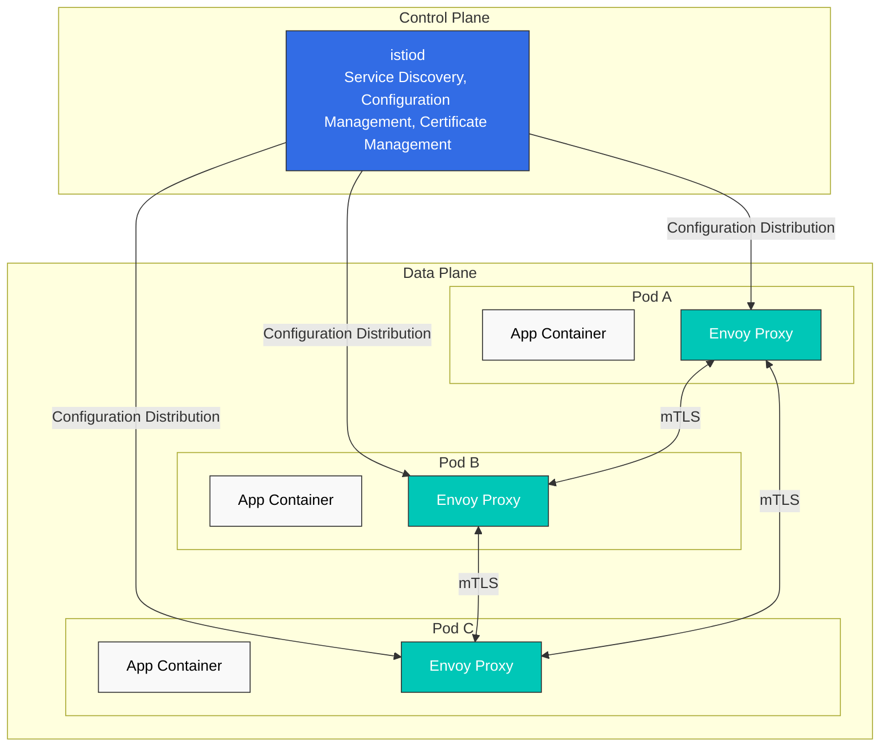

# Istio

> **Versiones compatibles**: Istio 1.28.0
> **Versión de EKS**: 1.34 (Kubernetes 1.28+)
> **Última actualización**: February 23, 2026

## Tabla de contenidos

- [Introducción](#introduction)
- [Características principales](#key-features)
- [Descripción general de la arquitectura](#architecture-overview)
- [Documentación detallada](#detailed-documentation)
- [Inicio rápido](#quick-start)
- [Recursos de aprendizaje](#learning-resources)

## Introducción

Istio es una plataforma de service mesh de código abierto para aplicaciones de microservicios. Un service mesh es una capa de infraestructura que maneja la comunicación entre servicios, lo que permite controlar y observar la comunicación entre servicios sin modificar el código de la aplicación.

### ¿Qué es un Service Mesh?

Un service mesh proporciona las siguientes capacidades principales:

1. **Gestión de tráfico**: Controla el flujo de tráfico entre servicios
2. **Seguridad**: Cifrado y autenticación de la comunicación entre servicios
3. **Observabilidad**: Visibilidad de la comunicación entre servicios

### Beneficios principales de Istio

- **Independencia de la plataforma**: Funciona en diversos entornos (Kubernetes, VM, etc.)
- **Integración transparente**: Puede aplicarse sin cambios en el código de la aplicación
- **mTLS automático**: Cifrado automático de la comunicación entre servicios
- **Gestión avanzada de tráfico**: Enrutamiento, balanceo de carga, inyección de fallos, etc.
- **Métricas detalladas**: Métricas detalladas sobre la comunicación entre servicios
- **Aplicación de políticas**: Control de acceso y limitación de tasa

## Características principales

### 1. Gestión de tráfico

Istio proporciona potentes capacidades de gestión de tráfico:

- **Gateway**: Enruta el tráfico externo al mesh
- **VirtualService**: Define reglas de enrutamiento entre servicios
- **DestinationRule**: Configura el balanceo de carga y los grupos de conexiones
- **División de tráfico**: Compatibilidad con despliegues Canary y pruebas A/B
- **Integración con Argo Rollouts**: Entrega progresiva automatizada

### 2. Seguridad

Funciones de seguridad integrales:

- **mTLS**: Cifrado automático entre servicios
- **Authorization Policy**: Control de acceso granular
- **Request Authentication**: Autenticación basada en JWT
- **Peer Authentication**: Políticas de autenticación entre servicios

### 3. Observabilidad

Visibilidad completa del service mesh:

- **Métricas**: Integración con Prometheus
- **Trazado distribuido**: Compatibilidad con Jaeger/Zipkin
- **Registro**: Logs de acceso y registro estructurado
- **Visualización**: Dashboard de Kiali

### 4. Resiliencia

Patrones de resiliencia de servicios:

- **Circuit Breaker**: Prevención de sobrecargas
- **Retry**: Reintentos automáticos
- **Timeout**: Configuración del tiempo de espera de solicitudes
- **Outlier Detection**: Excluye instancias no saludables
- **Rate Limiting**: Limitación de la tasa de solicitudes

## Descripción general de la arquitectura

Istio consta de un **Control Plane** y un **Data Plane**.



### Control Plane (istiod)

istiod es el componente de control central de Istio y proporciona:

- **Service Discovery**: Mantiene el registro de servicios del mesh
- **Configuration Management**: Almacena y distribuye la configuración de Istio
- **Certificate Management**: Genera y rota certificados para mTLS

### Data Plane (Envoy Proxy)

Envoy es un proxy de alto rendimiento desplegado como sidecar en cada Pod:

- **Enrutamiento de tráfico**: Controla el tráfico entre servicios
- **Balanceo de carga**: Distribuye el tráfico entre las instancias de servicio
- **Seguridad**: Cifrado y autenticación mTLS
- **Observabilidad**: Recopila métricas, logs y trazas

## Documentación detallada

Guías detalladas para todas las características de Istio.

### 📚 Documentación básica

| Documento | Descripción |
|----------|-------------|
| [Guía de instalación](istio/01-installation.md) | Instalación de Istio y configuración inicial |
| [Conceptos principales](istio/02-basic-concepts.md) | Conceptos básicos y terminología de Istio |
| [Componentes](istio/03-architecture.md) | Arquitectura y componentes de Istio |

### 🚦 Gestión de tráfico

| Documento | Descripción |
|----------|-------------|
| [Gateway & VirtualService](istio/traffic-management/01-gateway-virtualservice.md) | Configuración de Gateway de Ingress/Egress |
| [Enrutamiento](istio/traffic-management/02-routing.md) | Reglas de enrutamiento de VirtualService |
| [DestinationRule](istio/traffic-management/03-destination-rule.md) | Políticas de tráfico de servicios |
| [División de tráfico](istio/traffic-management/04-traffic-splitting.md) | Despliegue Canary y pruebas A/B |
| [Timeout y Retry](istio/traffic-management/05-retry-timeout.md) | Políticas de Timeout y Retry |
| [Balanceo de carga](istio/traffic-management/06-load-balancing.md) | Diversas estrategias de balanceo de carga |
| [Circuit Breaker](istio/traffic-management/07-circuit-breaker.md) | Implementación del patrón Circuit Breaker |
| [Inyección de fallos](istio/traffic-management/08-fault-injection.md) | Ingeniería del caos |
| [Reflejo de tráfico](istio/traffic-management/09-traffic-mirror.md) | Reflejo de tráfico y pruebas shadow |
| [Afinidad de sesión](istio/traffic-management/10-session-affinity.md) | Configuración de afinidad de sesión |

### 🔐 Seguridad

| Documento | Descripción |
|----------|-------------|
| [mTLS](istio/security/01-mtls.md) | Configuración de mTLS entre servicios |
| [Authorization Policy](istio/security/03-authorization.md) | Políticas de control de acceso |
| [Request Authentication](istio/security/02-authentication.md) | Autenticación basada en JWT |
| [Peer Authentication](istio/security/02-authentication.md) | Autenticación entre servicios |

### 📊 Observabilidad

| Documento | Descripción |
|----------|-------------|
| [Métricas](istio/observability/01-metrics.md) | Recopilación de métricas de Prometheus |
| [Trazado distribuido](istio/observability/02-tracing.md) | Integración con Jaeger/Zipkin |
| [Registro](istio/observability/03-logging.md) | Logs de acceso y registro estructurado |
| [Visualización](istio/observability/04-dashboards.md) | Dashboards de Kiali y Grafana |

### 💪 Resiliencia

| Documento | Descripción |
|----------|-------------|
| [Outlier Detection](istio/resilience/01-outlier-detection.md) | Detección de instancias no saludables |
| [Rate Limiting](istio/resilience/02-rate-limiting.md) | Limitación de tasa local y global |
| [Enrutamiento con reconocimiento de zona](istio/resilience/03-zone-aware-routing.md) | Enrutamiento con reconocimiento de localidad |

### 🚀 Temas avanzados

| Documento | Descripción |
|----------|-------------|
| [Modo Ambient](istio/advanced/01-ambient-mode.md) | Service mesh sin sidecar |
| [Multi-cluster](istio/advanced/02-multi-cluster.md) | Configuración de mesh multi-cluster |
| [EnvoyFilter](istio/advanced/03-envoy-filter.md) | Personalización de Envoy |
| [Caché de DNS](istio/advanced/04-dns-cache.md) | Mejora del rendimiento con caché de DNS |
| [gRPC](istio/advanced/05-grpc.md) | Compatibilidad con el protocolo gRPC |
| [WebSocket](istio/advanced/06-websocket.md) | Compatibilidad con conexiones WebSocket |
| [Inyección de sidecar](istio/advanced/07-sidecar-injection.md) | Mecanismo de inyección de sidecar |
| [Argo Rollouts](istio/advanced/08-argo-rollouts.md) | Integración de entrega progresiva |

### ✅ Mejores prácticas

| Documento | Descripción |
|----------|-------------|
| [Mejores prácticas](istio/best-practices.md) | Lista de verificación y recomendaciones para producción |

## Inicio rápido

### 1. Requisitos previos

- Clúster de Kubernetes (v1.28+)
- kubectl configurado
- Privilegios de administrador

### 2. Instalar Istio

```bash
# Download Istioctl
curl -L https://istio.io/downloadIstio | sh -
cd istio-1.28.0
export PATH=$PWD/bin:$PATH

# Install with default profile
istioctl install --set profile=default -y

# Enable Sidecar injection on namespace
kubectl label namespace default istio-injection=enabled
```

### 3. Desplegar la aplicación de ejemplo

```bash
# Deploy Bookinfo sample application
kubectl apply -f samples/bookinfo/platform/kube/bookinfo.yaml

# Create Gateway
kubectl apply -f samples/bookinfo/networking/bookinfo-gateway.yaml

# Verify installation
kubectl get pods
kubectl get svc istio-ingressgateway -n istio-system
```

### 4. Enviar tráfico

```bash
# Check Ingress Gateway address
export INGRESS_HOST=$(kubectl get svc istio-ingressgateway -n istio-system -o jsonpath='{.status.loadBalancer.ingress[0].hostname}')
export INGRESS_PORT=$(kubectl get svc istio-ingressgateway -n istio-system -o jsonpath='{.spec.ports[?(@.name=="http2")].port}')
export GATEWAY_URL=$INGRESS_HOST:$INGRESS_PORT

# Access application
curl -s "http://${GATEWAY_URL}/productpage"
```

### 5. Acceder a las herramientas de observabilidad

```bash
# Kiali dashboard
istioctl dashboard kiali

# Prometheus
istioctl dashboard prometheus

# Grafana
istioctl dashboard grafana

# Jaeger
istioctl dashboard jaeger
```

## Recursos de aprendizaje

### Documentación oficial

- [Documentación oficial de Istio](https://istio.io/latest/docs/)
- [Repositorio de Istio en GitHub](https://github.com/istio/istio)
- [Documentación de Envoy Proxy](https://www.envoyproxy.io/docs/envoy/latest/)

### Relacionado con AWS

- [AWS EKS Workshop - Istio](https://www.eksworkshop.com/docs/security/servicemesh/)
- [AWS App Mesh vs Istio](https://aws.amazon.com/blogs/containers/choosing-between-aws-app-mesh-and-istio/)

### Comunidad

- [Istio Discuss](https://discuss.istio.io/)
- [Istio Slack](https://istio.slack.com/)
- [Grupo de trabajo de CNCF sobre Istio](https://github.com/cncf/tag-app-delivery)

### Recursos adicionales

- [Patrones de Service Mesh (O'Reilly)](https://www.oreilly.com/library/view/service-mesh-patterns/9781492086444/)
- [Istio in Action (Manning)](https://www.manning.com/books/istio-in-action)
- [Guía de optimización del rendimiento de Istio](https://istio.io/latest/docs/ops/deployment/performance-and-scalability/)

## Cuestionario

Para comprobar su comprensión de Istio, pruebe el [Cuestionario de Istio](../quizzes/service-mesh/02-istio-quiz.md).

El cuestionario cubre los siguientes temas:

- Conceptos básicos de service mesh
- Arquitectura de Istio
- Gestión de tráfico (despliegue Canary)
- Seguridad (mTLS)
- Gateway e Ingress
- Herramientas de observabilidad
- Tendencias más recientes de service mesh
- Rate Limiting
- Enrutamiento de localidad
- Integración con Amazon EKS

---

**Siguientes pasos**: Consulte la [Guía de instalación](istio/01-installation.md) para instalar Istio y aprenda los conceptos básicos en [Conceptos principales](istio/02-basic-concepts.md).
