# Arquitectura de Cilium Service Mesh

> **Versiones compatibles**: Cilium 1.16+, Kubernetes 1.28+
> **Última actualización**: February 22, 2026

## Descripción general

La arquitectura de Cilium Service Mesh es fundamentalmente diferente de los service meshes tradicionales basados en sidecars. Aprovecha eBPF para procesar el tráfico L3/L4 en el nivel del kernel y proporciona funcionalidad L7 mediante un único proxy Envoy compartido por Node. Este capítulo explica en detalle los componentes arquitectónicos y las operaciones principales de Cilium Service Mesh.

## Arquitectura general

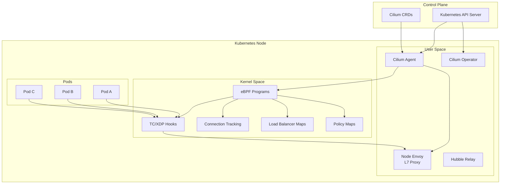

## Datapath de eBPF

### ¿Qué es eBPF?

eBPF (extended Berkeley Packet Filter) es una tecnología que permite ejecutar programas aislados dentro del kernel de Linux. Permite implementar funciones de redes, seguridad y observabilidad sin modificar el kernel.

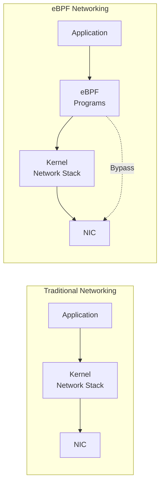

### Puntos de enganche de eBPF

Cilium utiliza varios puntos de enganche de eBPF:

| Punto de enganche | Ubicación | Propósito |
|------------|----------|---------|
| **XDP (eXpress Data Path)** | Controlador NIC | Procesamiento de paquetes ultrarrápido, protección DDoS |
| **TC (Traffic Control)** | Entrada de la pila de red | Filtrado y redirección de paquetes |
| **Operaciones de socket** | Nivel de socket | Aceleración de conexiones de socket |
| **cgroup** | Grupo de procesos | Control de recursos, aplicación de políticas |

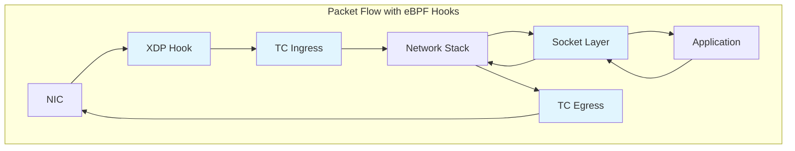

### Procesamiento L3/L4

El procesamiento L3/L4 en eBPF funciona de la siguiente manera:

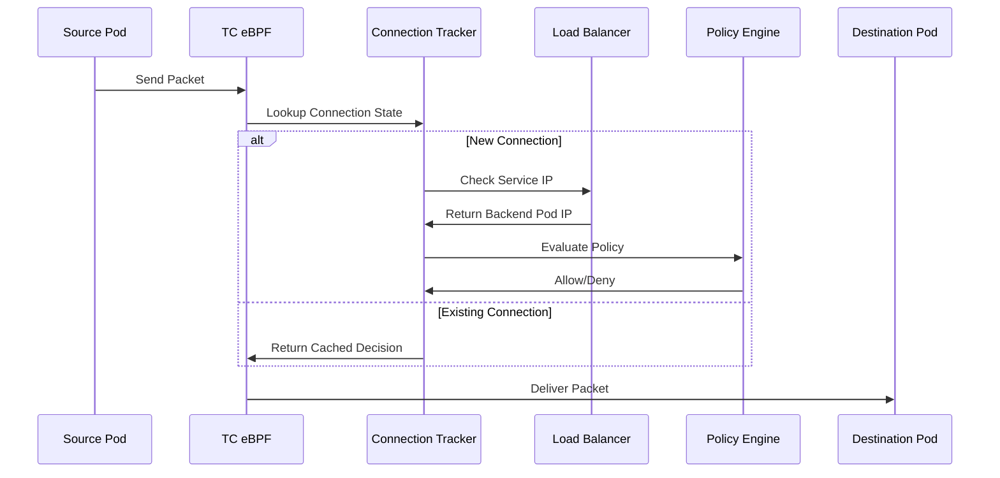

#### Estructura de mapas de eBPF

```c
// Connection Tracking Map
struct ct_entry {
    __u32 src_ip;
    __u32 dst_ip;
    __u16 src_port;
    __u16 dst_port;
    __u8  protocol;
    __u64 lifetime;
    __u32 rx_packets;
    __u32 tx_packets;
};

// Service Map
struct lb_service {
    __u32 service_ip;
    __u16 service_port;
    __u32 backend_count;
    __u32 backend_slot;
};

// Policy Map
struct policy_entry {
    __u32 identity;
    __u16 port;
    __u8  protocol;
    __u8  action;  // ALLOW, DENY, AUDIT
};
```

### Reemplazo de kube-proxy

El balanceador de carga basado en eBPF de Cilium puede reemplazar completamente kube-proxy:

```yaml
# Enable kube-proxy replacement during Cilium installation
kubeProxyReplacement: true

# Load balancer algorithm configuration
loadBalancer:
  algorithm: maglev  # or random
  mode: dsr          # Direct Server Return
```

**Comparación entre kube-proxy y Cilium eBPF:**

| Función | kube-proxy (iptables) | Cilium eBPF |
|---------|----------------------|-------------|
| Complejidad de reglas | O(n) - proporcional a los Services | O(1) - búsqueda en mapa hash |
| Seguimiento de conexiones | módulo conntrack | Mapa CT de eBPF |
| Compatibilidad con DSR | Limitada | Compatibilidad completa |
| Afinidad de sesión | basada en iptables | hash Maglev |
| Rendimiento | Medio | Alto |

## Proxy Envoy por Node

### Sidecar frente a proxy de Node

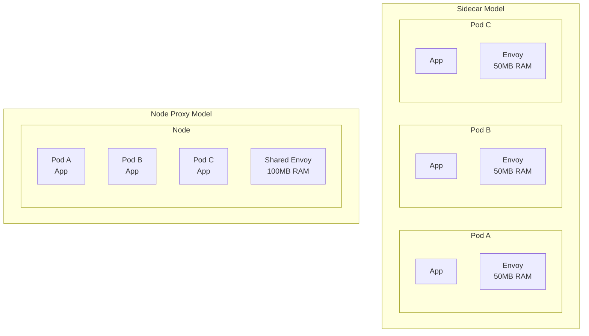

### Método de despliegue de Envoy

Cilium despliega un proxy Envoy por Node como un DaemonSet:

```bash
# Check Envoy DaemonSet
kubectl get daemonset -n kube-system cilium-envoy

# Expected output
NAME           DESIRED   CURRENT   READY   UP-TO-DATE   AVAILABLE
cilium-envoy   3         3         3       3            3
```

### Flujo de procesamiento L7

```mermaid
sequenceDiagram
    participant Client as Client Pod
    participant eBPF as eBPF Datapath
    participant Envoy as Node Envoy
    participant Server as Server Pod

    Client->>eBPF: HTTP Request
    Note over eBPF: Check L4 Policy

    alt L7 Policy Required
        eBPF->>Envoy: Redirect Traffic
        Note over Envoy: HTTP Parsing<br/>L7 Policy Enforcement<br/>Header Manipulation
        Envoy->>eBPF: Processed Request
    end

    eBPF->>Server: Deliver Packet
    Server->>eBPF: HTTP Response

    alt L7 Policy Required
        eBPF->>Envoy: Redirect Response
        Envoy->>eBPF: Processed Response
    end

    eBPF->>Client: Deliver Response
```

### Configuración de recursos de Envoy

```yaml
# values.yaml
envoy:
  enabled: true
  resources:
    limits:
      cpu: 2000m
      memory: 2Gi
    requests:
      cpu: 100m
      memory: 256Mi

  # Envoy concurrent connection settings
  maxConnectionsPerHost: 1000
  connectTimeout: 5s

  # Proxy protocol settings
  proxy:
    protocol:
      http2:
        enabled: true
      tls:
        enabled: true
```

## Modelo de CRD

### Estructura de CRD de Cilium

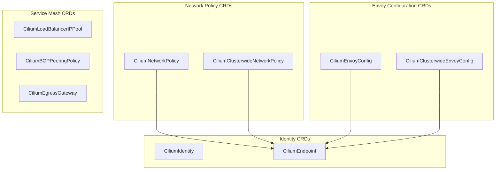

### CiliumEnvoyConfig

CiliumEnvoyConfig define la configuración de Envoy con ámbito de Namespace:

```yaml
apiVersion: cilium.io/v2
kind: CiliumEnvoyConfig
metadata:
  name: http-filter
  namespace: default
spec:
  # Services this configuration applies to
  services:
  - name: my-service
    namespace: default

  # Envoy resource definitions
  resources:
  - "@type": type.googleapis.com/envoy.config.listener.v3.Listener
    name: my-service-listener
    filter_chains:
    - filters:
      - name: envoy.filters.network.http_connection_manager
        typed_config:
          "@type": type.googleapis.com/envoy.extensions.filters.network.http_connection_manager.v3.HttpConnectionManager
          stat_prefix: my-service
          route_config:
            name: local_route
            virtual_hosts:
            - name: my-service
              domains: ["*"]
              routes:
              - match:
                  prefix: "/"
                route:
                  cluster: default/my-service
          http_filters:
          - name: envoy.filters.http.router
            typed_config:
              "@type": type.googleapis.com/envoy.extensions.filters.http.router.v3.Router
```

### CiliumClusterwideEnvoyConfig

Configuración de Envoy para todo el clúster:

```yaml
apiVersion: cilium.io/v2
kind: CiliumClusterwideEnvoyConfig
metadata:
  name: global-ratelimit
spec:
  # Apply to all services cluster-wide
  services:
  - name: "*"
    namespace: "*"

  resources:
  - "@type": type.googleapis.com/envoy.config.listener.v3.Listener
    name: global-listener
    filter_chains:
    - filters:
      - name: envoy.filters.network.http_connection_manager
        typed_config:
          "@type": type.googleapis.com/envoy.extensions.filters.network.http_connection_manager.v3.HttpConnectionManager
          stat_prefix: global
          http_filters:
          - name: envoy.filters.http.local_ratelimit
            typed_config:
              "@type": type.googleapis.com/envoy.extensions.filters.http.local_ratelimit.v3.LocalRateLimit
              stat_prefix: http_local_rate_limiter
              token_bucket:
                max_tokens: 1000
                tokens_per_fill: 100
                fill_interval: 1s
          - name: envoy.filters.http.router
            typed_config:
              "@type": type.googleapis.com/envoy.extensions.filters.http.router.v3.Router
```

### CiliumNetworkPolicy (L7)

Política de red con reglas L7:

```yaml
apiVersion: cilium.io/v2
kind: CiliumNetworkPolicy
metadata:
  name: l7-policy
  namespace: default
spec:
  endpointSelector:
    matchLabels:
      app: backend

  ingress:
  - fromEndpoints:
    - matchLabels:
        app: frontend
    toPorts:
    - ports:
      - port: "8080"
        protocol: TCP
      rules:
        http:
        - method: GET
          path: "/api/v1/.*"
          headers:
          - name: "X-Request-ID"
            value: ".*"
        - method: POST
          path: "/api/v1/users"
        - method: DELETE
          path: "/api/v1/users/[0-9]+"

  egress:
  - toEndpoints:
    - matchLabels:
        app: database
    toPorts:
    - ports:
      - port: "5432"
        protocol: TCP
```

## Cilium Agent y Service Mesh

### Rol de Cilium Agent

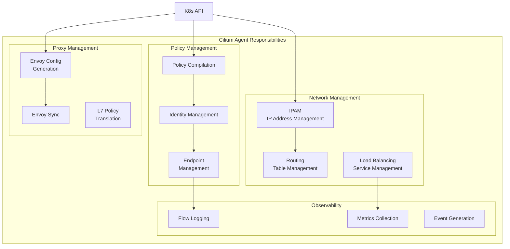

### Configuración del Agent

```yaml
# ConfigMap: cilium-config
apiVersion: v1
kind: ConfigMap
metadata:
  name: cilium-config
  namespace: kube-system
data:
  # Agent basic settings
  debug: "false"
  enable-ipv4: "true"
  enable-ipv6: "false"

  # Service mesh settings
  enable-l7-proxy: "true"
  enable-envoy-config: "true"

  # kube-proxy replacement
  kube-proxy-replacement: "true"

  # Observability
  enable-hubble: "true"
  hubble-listen-address: ":4244"
  hubble-metrics-server: ":9965"

  # Encryption
  enable-wireguard: "true"
  enable-ipsec: "false"
```

## Identidad de Service y SPIFFE

### Cilium Identity

Cilium asigna una identidad única a cada workload:

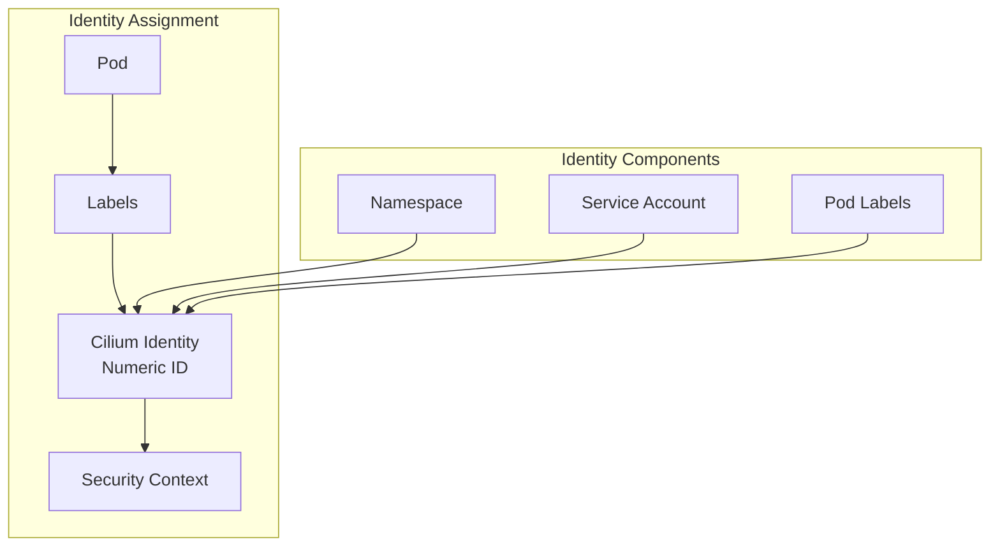

### Política basada en identidad

```yaml
# Check Pod's Identity
apiVersion: cilium.io/v2
kind: CiliumIdentity
metadata:
  name: "12345"
  labels:
    app: frontend
    k8s:io.kubernetes.pod.namespace: default
spec:
  security-labels:
    k8s:app: frontend
    k8s:io.kubernetes.pod.namespace: default
```

```bash
# List identities
cilium identity list

# Expected output
ID      LABELS
1       reserved:host
2       reserved:world
3       reserved:health
12345   k8s:app=frontend,k8s:io.kubernetes.pod.namespace=default
12346   k8s:app=backend,k8s:io.kubernetes.pod.namespace=default
```

### Integración con SPIFFE

Identidad de workload mediante SPIFFE (Secure Production Identity Framework for Everyone):

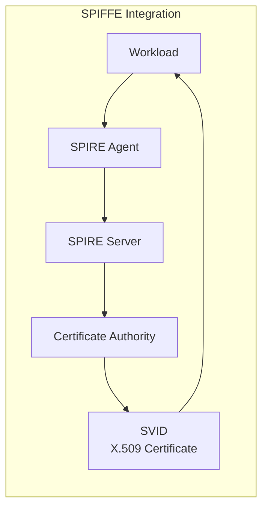

```yaml
# SPIRE integration configuration
authentication:
  mutual:
    spire:
      enabled: true
      install:
        enabled: true
        server:
          dataStorage:
            size: 1Gi
        agent:
          socketPath: /run/spire/sockets/agent.sock
```

Formato de ID de SPIFFE:
```
spiffe://cluster.local/ns/<namespace>/sa/<service-account>
```

## Análisis del flujo de paquetes

### Comunicación de Pod a Pod (mismo Node)

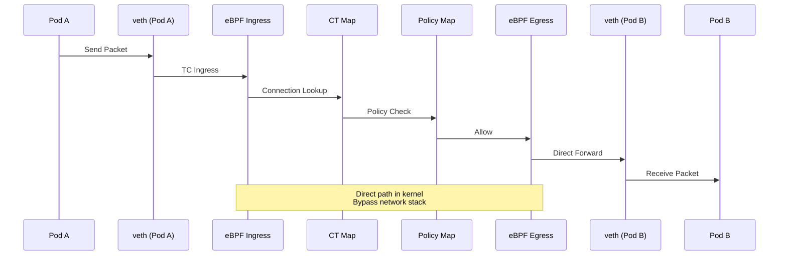

### Comunicación de Pod a Pod (Nodes diferentes)

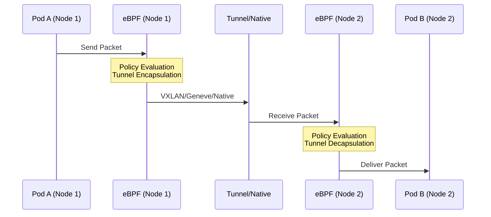

### Cuando se requiere procesamiento L7

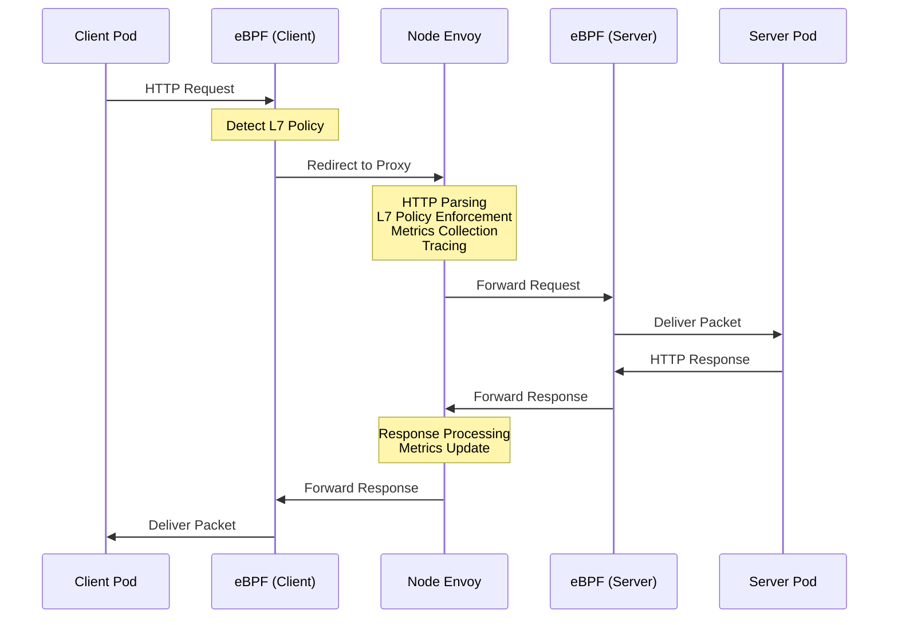

## Comparación con la arquitectura Sidecar de Istio

### Tabla comparativa de arquitectura

| Aspecto | Cilium Service Mesh | Istio Sidecar |
|--------|---------------------|---------------|
| **Ubicación del proxy** | 1 por Node | 1 por Pod |
| **Tipo de proxy** | eBPF + Envoy | Solo Envoy |
| **Procesamiento L4** | Kernel (eBPF) | Espacio de usuario (Envoy) |
| **Procesamiento L7** | Espacio de usuario (Envoy) | Espacio de usuario (Envoy) |
| **Uso de memoria** | ~100MB/Node | ~50MB/Pod |
| **Uso de CPU** | Bajo | Medio-Alto |
| **Latencia** | 0.1-0.5ms | 1-3ms |
| **Modelo de configuración** | CiliumEnvoyConfig | VirtualService/DestinationRule |
| **Implementación de mTLS** | eBPF/WireGuard | Envoy |
| **Inyección** | No requerida | Se requiere inyección de sidecar |

### Análisis de latencia

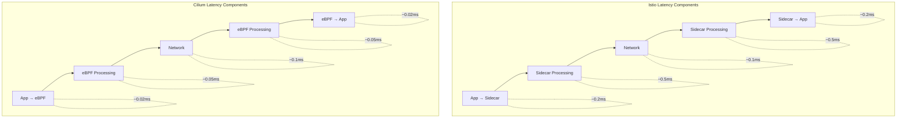

### Análisis de eficiencia de recursos

Para un clúster de 100 Pods:

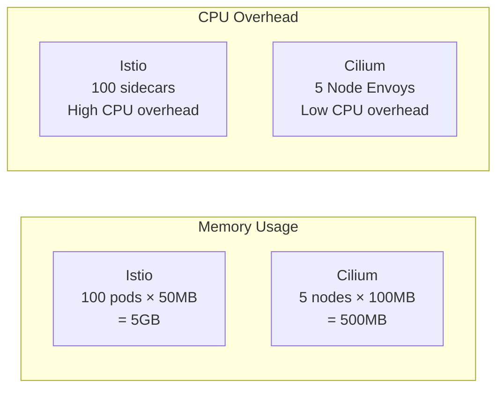

## Consideraciones de escalabilidad

### Tamaños de los mapas de eBPF

```yaml
# Cilium ConfigMap settings
bpf-map-dynamic-size-ratio: "0.0025"
bpf-ct-global-tcp-max: "524288"
bpf-ct-global-any-max: "262144"
bpf-nat-global-max: "524288"
bpf-policy-map-max: "16384"
```

### Configuración para clústeres grandes

```yaml
# Large cluster (1000+ nodes) configuration
apiVersion: v1
kind: ConfigMap
metadata:
  name: cilium-config
  namespace: kube-system
data:
  # Identity-related settings
  cluster-id: "1"
  cluster-name: "production"

  # Connection tracking optimization
  bpf-ct-global-tcp-max: "1048576"
  bpf-ct-global-any-max: "524288"

  # NAT table size
  bpf-nat-global-max: "1048576"

  # Policy map size
  bpf-policy-map-max: "65536"

  # Performance optimization
  sockops-enable: "true"
  bpf-lb-sock: "true"

  # Hubble settings
  hubble-disable: "false"
  hubble-socket-path: "/var/run/cilium/hubble.sock"
```

### Escalado de Node Envoy

```yaml
# Envoy resource scaling
envoy:
  resources:
    limits:
      cpu: 4000m
      memory: 4Gi
    requests:
      cpu: 500m
      memory: 512Mi

  # Envoy worker threads
  concurrency: 4

  # Connection limits
  perConnectionBufferLimitBytes: 32768

  # Cluster settings
  cluster:
    connectTimeout: 5s
    circuitBreakers:
      maxConnections: 10000
      maxPendingRequests: 10000
      maxRequests: 10000
```

## Próximos pasos

- [Gestión de tráfico](./02-traffic-management.md): Configure el enrutamiento L7 y el control de tráfico
- [Seguridad](./03-security.md): Configure mTLS y las políticas de red L7
- [Observabilidad](./04-observability.md): Supervise el service mesh con Hubble

## Referencias

- [Documentación de arquitectura de Cilium](https://docs.cilium.io/en/stable/concepts/overview/)
- [Documentación de eBPF](https://ebpf.io/what-is-ebpf/)
- [Arquitectura de Envoy Proxy](https://www.envoyproxy.io/docs/envoy/latest/intro/arch_overview/arch_overview)
- [Especificación de SPIFFE](https://spiffe.io/docs/latest/spiffe-about/overview/)
