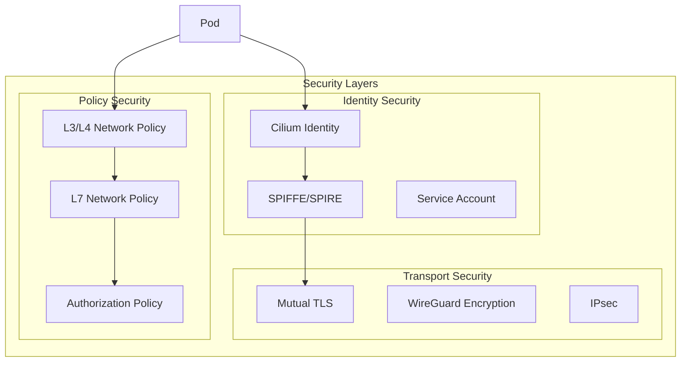
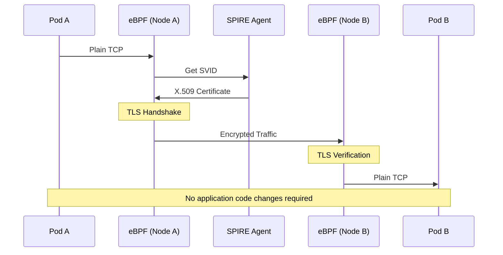
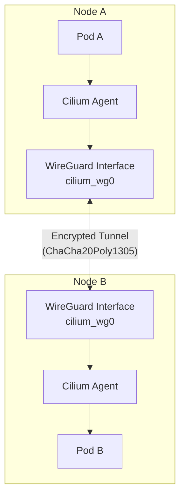
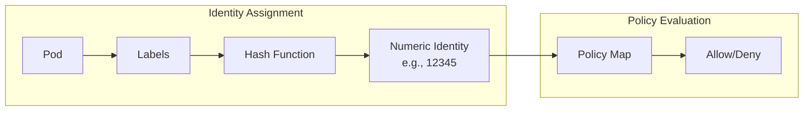
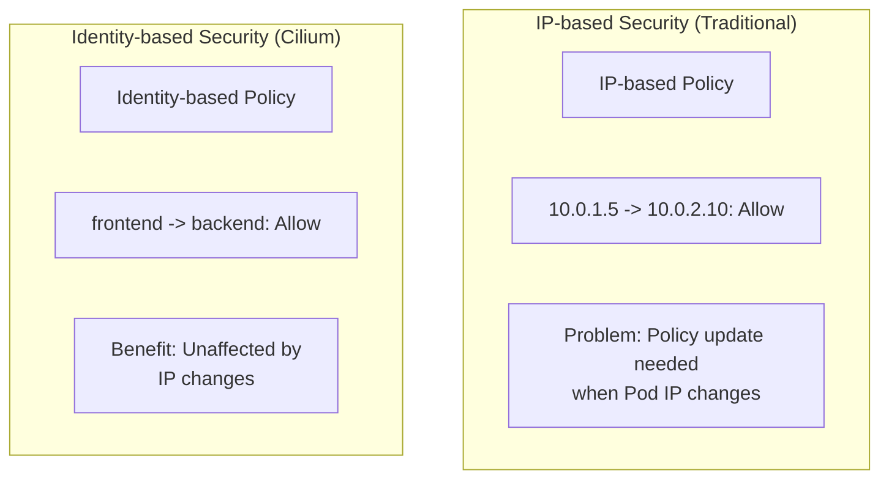

# Seguridad de Cilium Service Mesh

> **Versiones compatibles**: Cilium 1.16+, Kubernetes 1.28+
> **Última actualización**: July 13, 2026

## Descripción general

Cilium Service Mesh proporciona sólidas funciones de seguridad basadas en eBPF y SPIFFE. Puede implementar redes de confianza cero mediante mTLS transparente, políticas de red basadas en identidad y cifrado WireGuard. Este capítulo explica en detalle la arquitectura de seguridad y los métodos de configuración de Cilium Service Mesh.

## Arquitectura de seguridad



## mTLS transparente

### mTLS sin sidecar

Cilium Service Mesh proporciona mTLS transparente sin proxies sidecar:



### mTLS nativo mediante ztunnel (actualización de 2026)

En marzo de 2026, Cilium introdujo una arquitectura de mTLS más reciente inspirada en el modelo ztunnel de Istio Ambient, que evoluciona más allá del handshake de eBPF puro mostrado anteriormente. La pila ahora cuenta con tres componentes que cooperan entre sí:

- **SPIRE** — emite identidad de workload y certificados X.509 (la misma función que en la configuración basada en SPIRE de abajo)
- **Cilium** — instala reglas de iptables que redirigen de forma transparente el tráfico saliente de Pod a ztunnel en el puerto 15001
- **ztunnel** — un proxy por Node (no un sidecar por Pod) que realiza el handshake de mTLS real y cifra el tráfico de Pod a Pod

Esto mantiene la misma garantía de «sin sidecar ni cambios en la aplicación», pero el handshake de TLS ahora se ejecuta en un proceso dedicado por Node en lugar de hacerlo únicamente en eBPF; es un diseño que Cilium adoptó directamente del ztunnel de Istio Ambient. A fecha de marzo de 2026, está disponible como vista previa pública en Azure Kubernetes Service («Cilium mTLS encryption» para AKS). La autenticación mutua continúa funcionando solo dentro de un clúster administrado por Cilium y no es compatible con soluciones mTLS externas.

Consulte la [publicación del blog de Cilium sobre mTLS nativo](https://cilium.io/blog/2026/03/23/native-mtls-cilium/) para ver la descripción completa de la arquitectura.

### Configuración de mTLS basada en SPIRE

```yaml
# values.yaml - SPIRE integration configuration
authentication:
  mutual:
    spire:
      enabled: true
      install:
        enabled: true
        namespace: cilium-spire

        server:
          # SPIRE Server configuration
          replicas: 1
          dataStorage:
            enabled: true
            size: 1Gi
            storageClass: gp3

          # Trust Domain configuration
          trustDomain: cluster.local

          # CA configuration
          ca:
            # Use internal CA
            keyType: ec-p256
            ttl: 24h

          # Node Attestor configuration
          nodeAttestor:
            k8sPsat:
              enabled: true

        agent:
          # SPIRE Agent configuration
          socketPath: /run/spire/sockets/agent.sock

          # Workload Attestor configuration
          workloadAttestor:
            k8s:
              enabled: true
              disableContainerSelectors: false
```

### Aplicación de políticas mTLS

```yaml
# Enable mTLS for entire cluster
apiVersion: cilium.io/v2
kind: CiliumClusterwideNetworkPolicy
metadata:
  name: enforce-mtls
spec:
  endpointSelector: {}
  authentication:
  - mode: required
```

### Configuración de mTLS por Namespace

```yaml
# Apply mTLS to specific namespace only
apiVersion: cilium.io/v2
kind: CiliumNetworkPolicy
metadata:
  name: namespace-mtls
  namespace: production
spec:
  endpointSelector: {}
  ingress:
  - fromEndpoints:
    - {}
    authentication:
    - mode: required
  egress:
  - toEndpoints:
    - {}
    authentication:
    - mode: required
```

### Configuración de mTLS por Service

```yaml
# Enforce mTLS between specific services
apiVersion: cilium.io/v2
kind: CiliumNetworkPolicy
metadata:
  name: service-mtls
  namespace: default
spec:
  endpointSelector:
    matchLabels:
      app: backend

  ingress:
  - fromEndpoints:
    - matchLabels:
        app: frontend
    authentication:
    - mode: required
    toPorts:
    - ports:
      - port: "8080"
        protocol: TCP
```

## Reglas L7 de CiliumNetworkPolicy

### Política de seguridad HTTP L7

```yaml
apiVersion: cilium.io/v2
kind: CiliumNetworkPolicy
metadata:
  name: http-security-policy
  namespace: default
spec:
  endpointSelector:
    matchLabels:
      app: api-server

  ingress:
  # Read-only access
  - fromEndpoints:
    - matchLabels:
        role: reader
    toPorts:
    - ports:
      - port: "8080"
        protocol: TCP
      rules:
        http:
        - method: GET
          path: "/api/.*"

  # Admin access
  - fromEndpoints:
    - matchLabels:
        role: admin
    toPorts:
    - ports:
      - port: "8080"
        protocol: TCP
      rules:
        http:
        - method: ".*"
          path: "/api/.*"
          headers:
          - "Authorization: Bearer .*"

  # Health checks
  - fromEndpoints:
    - matchLabels:
        app: monitoring
    toPorts:
    - ports:
      - port: "8080"
        protocol: TCP
      rules:
        http:
        - method: GET
          path: "/health"
        - method: GET
          path: "/metrics"
```

### Política de seguridad Kafka L7

```yaml
apiVersion: cilium.io/v2
kind: CiliumNetworkPolicy
metadata:
  name: kafka-security
  namespace: kafka
spec:
  endpointSelector:
    matchLabels:
      app: kafka

  ingress:
  # Producer - allow writing to specific topics only
  - fromEndpoints:
    - matchLabels:
        role: producer
    toPorts:
    - ports:
      - port: "9092"
        protocol: TCP
      rules:
        kafka:
        - apiKey: produce
          topic: "orders"
        - apiKey: produce
          topic: "events"
        - apiKey: metadata

  # Consumer - allow reading from specific topics only
  - fromEndpoints:
    - matchLabels:
        role: consumer
    toPorts:
    - ports:
      - port: "9092"
        protocol: TCP
      rules:
        kafka:
        - apiKey: fetch
          topic: "orders"
        - apiKey: fetch
          topic: "events"
        - apiKey: listoffsets
          topic: "orders"
        - apiKey: listoffsets
          topic: "events"
        - apiKey: metadata
        - apiKey: findcoordinator
        - apiKey: joingroup
        - apiKey: heartbeat
        - apiKey: leavegroup
        - apiKey: syncgroup
        - apiKey: offsetcommit
          topic: "orders"
        - apiKey: offsetfetch
          topic: "orders"
```

### Política de seguridad DNS L7

```yaml
apiVersion: cilium.io/v2
kind: CiliumNetworkPolicy
metadata:
  name: dns-security
  namespace: default
spec:
  endpointSelector:
    matchLabels:
      app: web-application

  egress:
  # Restrict DNS queries
  - toEndpoints:
    - matchLabels:
        k8s:io.kubernetes.pod.namespace: kube-system
        k8s-app: kube-dns
    toPorts:
    - ports:
      - port: "53"
        protocol: UDP
      rules:
        dns:
        # Allow internal services only
        - matchPattern: "*.svc.cluster.local"
        # Allow specific external domains only
        - matchName: "api.stripe.com"
        - matchName: "api.aws.amazon.com"
        - matchPattern: "*.s3.amazonaws.com"

  # Egress to allowed external services
  - toFQDNs:
    - matchName: "api.stripe.com"
    - matchName: "api.aws.amazon.com"
    - matchPattern: "*.s3.amazonaws.com"
    toPorts:
    - ports:
      - port: "443"
        protocol: TCP
```

## Autenticación mutua

### Modos de autenticación

```yaml
# Cilium authentication mode options

# 1. disabled - no authentication (default)
authentication:
- mode: disabled

# 2. optional - use authentication if possible, otherwise allow
authentication:
- mode: optional

# 3. required - authentication required
authentication:
- mode: required

# 4. test-always-fail - for testing (always fails)
authentication:
- mode: test-always-fail
```

### Ejemplos de políticas de autenticación mutua

```yaml
apiVersion: cilium.io/v2
kind: CiliumNetworkPolicy
metadata:
  name: mutual-auth-policy
  namespace: production
spec:
  endpointSelector:
    matchLabels:
      app: secure-service

  ingress:
  # Allow authenticated clients only
  - fromEndpoints:
    - matchLabels:
        app: trusted-client
    authentication:
    - mode: required
    toPorts:
    - ports:
      - port: "443"
        protocol: TCP

  # Optional authentication for monitoring
  - fromEndpoints:
    - matchLabels:
        app: prometheus
    authentication:
    - mode: optional
    toPorts:
    - ports:
      - port: "9090"
        protocol: TCP
```

### Autenticación basada en SPIFFE ID

```yaml
apiVersion: cilium.io/v2
kind: CiliumNetworkPolicy
metadata:
  name: spiffe-auth
  namespace: default
spec:
  endpointSelector:
    matchLabels:
      app: database

  ingress:
  # Allow specific SPIFFE ID only
  - fromEndpoints:
    - matchLabels:
        app: backend
    authentication:
    - mode: required
      # SPIFFE ID verification is performed automatically
      # spiffe://cluster.local/ns/default/sa/backend
```

## Cifrado

### Cifrado transparente con WireGuard

WireGuard cifra todo el tráfico de Pod a Pod en el nivel del kernel de Linux:

```yaml
# values.yaml - Enable WireGuard
encryption:
  enabled: true
  type: wireguard

  wireguard:
    # Userspace fallback (when kernel support unavailable)
    userspaceFallback: true

  # Node-to-node encryption
  nodeEncryption: true
```

```bash
# Check WireGuard status
cilium status | grep Encryption

# Expected output
Encryption:              Wireguard  [NodeEncryption: Enabled, cilium_wg0 (Pubkey: xxx, Port: 51871, Peers: 2)]

# Check WireGuard peers
cilium encrypt status

# Expected output
Encryption: Wireguard
Keys in use: 1
Max Seq. Number: 0x0
Errors: 0
```

#### Arquitectura de WireGuard



### Cifrado IPsec

```yaml
# values.yaml - Enable IPsec
encryption:
  enabled: true
  type: ipsec

  ipsec:
    # IPsec interface
    interface: ""

    # Key rotation interval
    keyRotationDuration: "5m"

    # Encryption interface
    mountPath: /etc/ipsec

# Generate IPsec key
# kubectl create secret generic -n kube-system cilium-ipsec-keys \
#   --from-literal=keys="3 rfc4106(gcm(aes)) $(openssl rand -hex 20) 128"
```

### Comparación de cifrado

| Característica | WireGuard | IPsec |
|---------|-----------|-------|
| Rendimiento | Muy alto | Alto |
| Complejidad de configuración | Baja | Media |
| Compatibilidad con kernel | 5.6+ (integrada) | Todas las versiones |
| Algoritmo de cifrado | ChaCha20Poly1305 | AES-GCM, etc. |
| Gestión de claves | Automática | Manual/automática |
| Estándar | No estándar | Estándar IETF |

## Seguridad basada en identidad

### Identidad de Cilium

Cilium aplica políticas de seguridad basadas en la identidad en lugar de la IP:



### Componentes de identidad

```bash
# Identity label composition
# - k8s:io.kubernetes.pod.namespace
# - k8s:io.cilium.k8s.policy.serviceaccount
# - k8s:app
# - k8s:version
# - Other user-defined labels

# List identities
cilium identity list

# Example output
IDENTITY   LABELS
1          reserved:host
2          reserved:world
3          reserved:unmanaged
4          reserved:health
5          reserved:init
6          reserved:remote-node
12345      k8s:app=frontend,k8s:io.kubernetes.pod.namespace=default
12346      k8s:app=backend,k8s:io.kubernetes.pod.namespace=default
```

### Política basada en identidad

```yaml
# Identity-based network policy
apiVersion: cilium.io/v2
kind: CiliumNetworkPolicy
metadata:
  name: identity-based-policy
  namespace: default
spec:
  endpointSelector:
    matchLabels:
      app: backend

  ingress:
  # Allow only Pods with specific labels (Identity)
  - fromEndpoints:
    - matchLabels:
        app: frontend
        environment: production
    toPorts:
    - ports:
      - port: "8080"

  # Allow specific service from another namespace
  - fromEndpoints:
    - matchLabels:
        k8s:io.kubernetes.pod.namespace: monitoring
        app: prometheus
    toPorts:
    - ports:
      - port: "9090"
```

### Comparación entre IP e identidad



## Integración de PKI externa

### Integración con cert-manager

```yaml
# Certificate management with cert-manager
apiVersion: cert-manager.io/v1
kind: ClusterIssuer
metadata:
  name: cilium-ca-issuer
spec:
  ca:
    secretName: cilium-ca-secret
---
apiVersion: cert-manager.io/v1
kind: Certificate
metadata:
  name: cilium-spire-ca
  namespace: cilium-spire
spec:
  secretName: spire-ca-secret
  duration: 8760h  # 1 year
  renewBefore: 720h  # Renew 30 days before expiry
  isCA: true
  privateKey:
    algorithm: ECDSA
    size: 256
  subject:
    organizations:
    - Cilium
  commonName: SPIRE CA
  issuerRef:
    name: cilium-ca-issuer
    kind: ClusterIssuer
```

### Integración con Vault

```yaml
# Use Vault as CA in SPIRE
apiVersion: v1
kind: ConfigMap
metadata:
  name: spire-server-config
  namespace: cilium-spire
data:
  server.conf: |
    server {
      trust_domain = "cluster.local"

      ca_subject = {
        country = ["US"]
        organization = ["MyOrg"]
        common_name = ""
      }

      # Vault UpstreamAuthority
      UpstreamAuthority "vault" {
        plugin_data {
          vault_addr = "https://vault.vault.svc:8200"
          pki_mount_path = "pki"
          ca_cert_path = "/vault/ca/ca.crt"
          token_path = "/vault/token/token"
        }
      }
    }
```

## Redes de confianza cero

### Política de denegación predeterminada

```yaml
# Cluster-wide default deny
apiVersion: cilium.io/v2
kind: CiliumClusterwideNetworkPolicy
metadata:
  name: default-deny
spec:
  endpointSelector: {}
  ingress:
  - fromEndpoints:
    - matchLabels:
        reserved:host: ""
  egress:
  - toEndpoints:
    - matchLabels:
        reserved:host: ""
  - toEndpoints:
    - matchLabels:
        k8s:io.kubernetes.pod.namespace: kube-system
        k8s-app: kube-dns
    toPorts:
    - ports:
      - port: "53"
        protocol: UDP
```

### Acceso con privilegios mínimos

```yaml
# Production namespace security policy
apiVersion: cilium.io/v2
kind: CiliumNetworkPolicy
metadata:
  name: production-security
  namespace: production
spec:
  # Apply to all Pods
  endpointSelector: {}

  # Default deny
  ingressDeny:
  - fromEntities:
    - world

  # Allow rules
  ingress:
  # Allow communication within same namespace
  - fromEndpoints:
    - matchLabels:
        k8s:io.kubernetes.pod.namespace: production
    authentication:
    - mode: required

  # Allow access from Ingress Controller
  - fromEndpoints:
    - matchLabels:
        k8s:io.kubernetes.pod.namespace: ingress-nginx
        app: nginx-ingress
    toPorts:
    - ports:
      - port: "8080"

  egress:
  # DNS
  - toEndpoints:
    - matchLabels:
        k8s:io.kubernetes.pod.namespace: kube-system
        k8s-app: kube-dns
    toPorts:
    - ports:
      - port: "53"
        protocol: UDP

  # Communication within same namespace
  - toEndpoints:
    - matchLabels:
        k8s:io.kubernetes.pod.namespace: production
    authentication:
    - mode: required
```

### Microsegmentación

```yaml
# 3-tier architecture security
---
# Frontend policy
apiVersion: cilium.io/v2
kind: CiliumNetworkPolicy
metadata:
  name: frontend-policy
  namespace: app
spec:
  endpointSelector:
    matchLabels:
      tier: frontend

  ingress:
  - fromEntities:
    - world
    toPorts:
    - ports:
      - port: "443"

  egress:
  - toEndpoints:
    - matchLabels:
        tier: backend
    toPorts:
    - ports:
      - port: "8080"
---
# Backend policy
apiVersion: cilium.io/v2
kind: CiliumNetworkPolicy
metadata:
  name: backend-policy
  namespace: app
spec:
  endpointSelector:
    matchLabels:
      tier: backend

  ingress:
  - fromEndpoints:
    - matchLabels:
        tier: frontend
    toPorts:
    - ports:
      - port: "8080"
    authentication:
    - mode: required

  egress:
  - toEndpoints:
    - matchLabels:
        tier: database
    toPorts:
    - ports:
      - port: "5432"
    authentication:
    - mode: required
---
# Database policy
apiVersion: cilium.io/v2
kind: CiliumNetworkPolicy
metadata:
  name: database-policy
  namespace: app
spec:
  endpointSelector:
    matchLabels:
      tier: database

  ingress:
  - fromEndpoints:
    - matchLabels:
        tier: backend
    toPorts:
    - ports:
      - port: "5432"
    authentication:
    - mode: required

  # No external egress (data exfiltration prevention)
  egressDeny:
  - toEntities:
    - world
```

## Auditoría y monitoreo de seguridad

### Modo de auditoría de políticas

```yaml
# Test policy in audit mode
apiVersion: cilium.io/v2
kind: CiliumNetworkPolicy
metadata:
  name: audit-policy
  namespace: default
  annotations:
    # Audit mode - logging only, no blocking
    cilium.io/audit-mode: "true"
spec:
  endpointSelector:
    matchLabels:
      app: backend

  ingress:
  - fromEndpoints:
    - matchLabels:
        app: frontend
    toPorts:
    - ports:
      - port: "8080"
```

### Monitoreo de infracciones de políticas

```bash
# Observe policy violations with Hubble
hubble observe --verdict DROPPED

# Dropped traffic in specific namespace
hubble observe --namespace production --verdict DROPPED

# Policy violation statistics
hubble observe --verdict DROPPED -o json | jq -r '.flow | "\(.source.namespace)/\(.source.pod_name) -> \(.destination.namespace)/\(.destination.pod_name)"' | sort | uniq -c | sort -rn
```

### Métricas de Prometheus

```yaml
# Collect security-related metrics
hubble:
  metrics:
    enabled:
    - dns
    - drop
    - flow
    - http
    - icmp
    - port-distribution
    - tcp

# Useful metrics
# - cilium_drop_count_total: Packets dropped by policy
# - cilium_policy_verdict: Policy decisions (allow/deny)
# - cilium_forward_count_total: Forwarded packets
```

## Próximos pasos

- [Observabilidad](./04-observability.md): Monitoreo de seguridad con Hubble
- [Ingress y Gateway](./05-ingress-gateway.md): Seguridad del tráfico externo
- [Prácticas recomendadas](./06-best-practices.md): Configuración de seguridad para producción

## Referencias

- [Documentación de Cilium Network Policy](https://docs.cilium.io/en/stable/security/policy/)
- [Autenticación mutua de Cilium](https://docs.cilium.io/en/stable/network/servicemesh/mutual-authentication/)
- [Documentación de cifrado de Cilium](https://docs.cilium.io/en/stable/security/network/encryption/)
- [Documentación de SPIFFE/SPIRE](https://spiffe.io/docs/latest/)
- [Arquitectura de confianza cero - NIST](https://www.nist.gov/publications/zero-trust-architecture)
