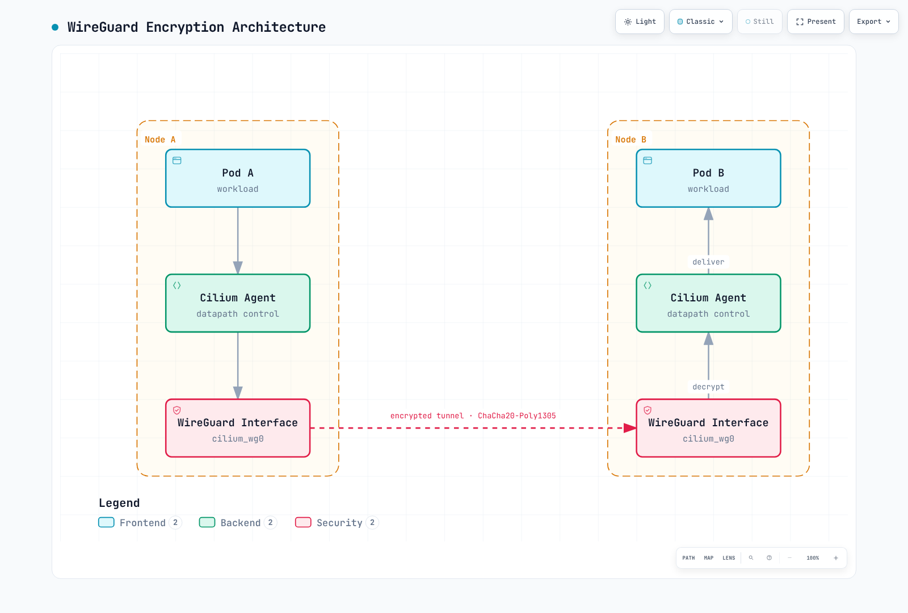
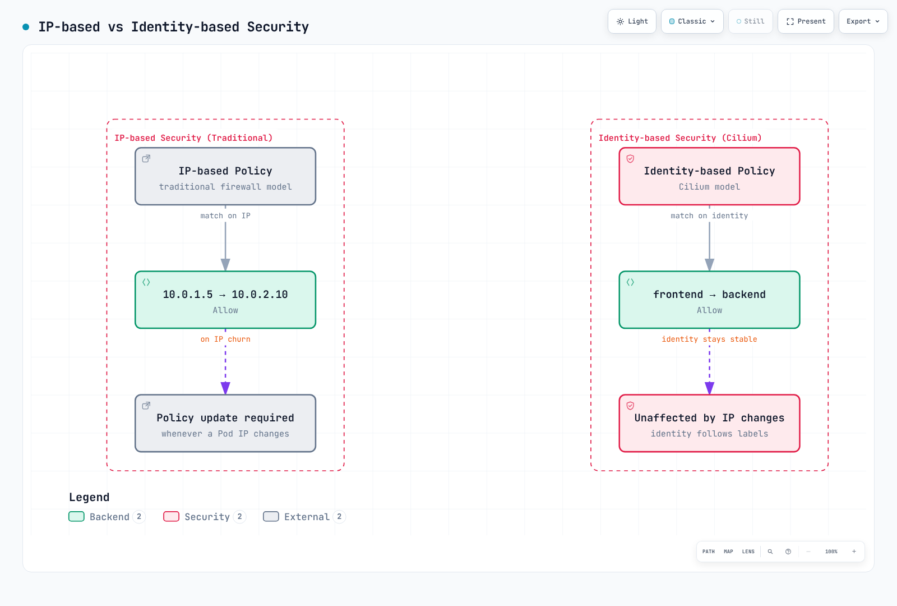

# Seguridad de la malla de servicios Cilium

> **Última actualización**: 11 de septiembre de 2026 · Cilium/chart 1.20.1 · SPIRE incluido 1.15.2. Consulte la [descripción general](./README.md) para versiones Kubernetes/EKS probadas y requisitos de plataforma.

## Descripción general

Evalúe tres controles separados: autorización de cargas, autenticación de peers y cifrado de datos de aplicación. La autenticación mutua fuera de banda de Cilium, el cifrado WireGuard/IPsec y la beta mTLS ztunnel independiente tienen requisitos y límites distintos.

Los ejemplos describen la ruta ordinaria de políticas/autenticación fuera de banda. **No asuma que mantienen la misma aplicación L4 al habilitar cifrado ztunnel**; su limitación beta se explica abajo.

## Arquitectura de seguridad


[🔍 Ver diagrama interactivo](https://www.atomai.click/kubernetes-docs/archmaps/en-service-mesh-cilium-service-mesh-03-security-0.html)

Los recuadros agrupan responsabilidades, no certifican que cada combinación preserve todas las políticas. En particular, ztunnel beta usa otra ruta de identidad/datos y su CA predeterminada no necesita la integración SPIRE mostrada para autenticación fuera de banda.

## Autenticación mutua y cifrado de datos

### Autenticación mutua Cilium existente

El mecanismo fuera de banda sigue documentado como **beta/incompleto** en Cilium 1.20.1. Los agentes autentican identidades de seguridad Cilium mediante SVID de SPIRE; una regla de red que exija autenticación no convierte la propia conexión de aplicación en TLS.


[🔍 Ver diagrama interactivo](https://www.atomai.click/kubernetes-docs/archmaps/en-service-mesh-cilium-service-mesh-03-security-1.html)

Los registros de autenticación se cachean para relaciones de identidad. El diagrama no significa un certificado/handshake nuevo por solicitud HTTP ni necesariamente por conexión. Aplique reglas explícitas de autorización además de requisitos de autenticación.

### mTLS nativo mediante ztunnel (actualización 2026)

Cilium 1.20.1 contiene **Cifrado transparente Ztunnel (Beta)**. Selecciónelo con este fragmento tras preparar material bootstrap/CA:

```yaml
encryption:
  enabled: true
  type: ztunnel
  ztunnel:
    ca:
      type: internal
```

El valor publicado usa la CA interna Cilium. Un Secret `cilium-ztunnel-secrets` aporta `bootstrap-private.key`, `bootstrap-root.crt`, `ca-private.key` y `ca-root.crt`; el script oficial es un ejemplo, no un diseño PKI/rotación productivo completo. `bootstrapRootCert` del chart solo aporta certificado público y no genera claves privadas de la CA interna.

El agente configura redirección iptables en namespaces de red de Pods inscritos, envía estado al ztunnel del nodo y sirve interfaces de control/certificados. El chart crea DaemonSet `ztunnel-cilium`. La inscripción usa `io.cilium/mtls-enabled=true`; instalar el modo no inscribe todos los namespaces.

La guía publicada especifica:

- Ambas cargas, origen y destino, deben estar inscritas; no se admite comunicación inscrita→no inscrita.
- La inscripción es por namespace, no por Pod. Pods host-network no pueden inscribirse.
- Solo TCP se redirige para mTLS; UDP y otros protocolos quedan fuera.
- ClusterMesh no está soportado y el kernel debe admitir las operaciones iptables necesarias.
- El cifrado ocurre antes de salir del Pod. Por ello, las políticas L4 ordinarias no funcionan en esta ruta salvo si apuntan directamente al puerto HBONE 15008.

La integración usa identidad de carga por namespace/cuenta de servicio, distinta de la ruta SPIFFE numérica `/identity/<id>` de la autenticación fuera de banda.

Comprobaciones de solo lectura para una instalación de prueba preparada:

```bash
kubectl -n kube-system get daemonset ztunnel-cilium
kubectl get namespaces -l io.cilium/mtls-enabled=true
kubectl -n kube-system get configmap cilium-config -o yaml
```

Una etiqueta namespace, proxy saludable o paquete en 15008 no demuestra que todo el tráfico previsto esté cifrado y autorizado. Revise inscripción efectiva, ambos extremos, identidad/confianza del certificado y casos no admitidos.

### Cuándo elegir Cilium o Istio para mTLS

Elija según identidad, autorización y cobertura requeridas. Un Cilium existente puede usar políticas de identidad más WireGuard/IPsec o evaluar ztunnel beta dentro de sus límites. Cuente proxies, CA y dependencias operativas realmente habilitados.

Istio proporciona mTLS de proxy de carga en sidecar y ambient con límites propios. `PeerAuthentication` `STRICT` exige mTLS entrante; por sí solo no emite identidades, no instala proxies ni autoriza a todos. No reduzca la comparación a un interruptor de cifrado. El [capítulo sidecar/ambient](../istio/comparison/03-sidecar-vs-ambient.md) conserva versiones y escenarios realmente medidos.

### Configuración de autenticación mutua con SPIRE

Para autenticación **fuera de banda**, combine este overlay con values revisados:

```yaml
authentication:
  enabled: true
  mutual:
    spire:
      enabled: true
      trustDomain: spiffe.cilium
      agentSocketPath: /run/spire/sockets/agent/agent.sock
      install:
        enabled: true
        server:
          dataStorage:
            enabled: true
            size: 1Gi
```

Prepare StorageClass/PV adecuado para StatefulSet SPIRE. Una clase `gp3` no existe automáticamente en todo EKS. Se requiere `authentication.enabled`; trust domain y socket del agente van bajo `authentication.mutual.spire`, no `install.server`/`install.agent`. El chart incluido no implementa los antiguos `server.replicas`, `server.nodeAttestor`, `agent.workloadAttestor` o `server.ca.ttl`.

SPIRE Server verifica agentes y firma SVID. Los agentes atestiguan cargas; Cilium además delega obtención y registra entradas de identidades de seguridad. Habilitar SPIRE solo no exige autenticación en todo tráfico ni activa WireGuard/IPsec.

### Aplicación de políticas de autenticación mutua

`authentication` es un **objeto dentro de una regla de permiso ingress/egress**. No es array ni interruptor raíz `spec.authentication`. Esta política de clúster selecciona deliberadamente una aplicación/namespace:

```yaml
apiVersion: cilium.io/v2
kind: CiliumClusterwideNetworkPolicy
metadata:
  name: production-backend-auth
spec:
  endpointSelector:
    matchLabels:
      k8s:io.kubernetes.pod.namespace: production
      k8s:app: backend
  ingress:
  - fromEndpoints:
    - matchLabels:
        k8s:io.kubernetes.pod.namespace: production
        k8s:app: frontend
    toPorts:
    - ports:
      - port: '8080'
        protocol: TCP
    authentication:
      mode: required
```

### Autenticación mutua por namespace

El ejemplo selecciona cargas en `production` y permite peers autenticados del mismo namespace por TCP 8080:

```yaml
apiVersion: cilium.io/v2
kind: CiliumNetworkPolicy
metadata:
  name: namespace-auth
  namespace: production
spec:
  endpointSelector: {}
  ingress:
  - fromEndpoints:
    - matchLabels:
        k8s:io.kubernetes.pod.namespace: production
    toPorts:
    - ports:
      - port: '8080'
        protocol: TCP
    authentication:
      mode: required
```

Es un permiso ilustrativo dentro del namespace, no mínimo privilegio universal. Evalúe otros puertos, clientes, probes y permisos existentes por separado. Afecta a ingress; no configura silenciosamente todas las dependencias egress.

### Autenticación mutua por servicio

```yaml
apiVersion: cilium.io/v2
kind: CiliumNetworkPolicy
metadata:
  name: service-auth
  namespace: default
spec:
  endpointSelector:
    matchLabels:
      k8s:io.kubernetes.pod.namespace: default
      k8s:app: backend
  ingress:
  - fromEndpoints:
    - matchLabels:
        k8s:io.kubernetes.pod.namespace: default
        k8s:app: frontend
    toPorts:
    - ports:
      - port: '8080'
        protocol: TCP
    authentication:
      mode: required
```

Las etiquetas origen/destino describen cargas, no login de usuarios. Los permisos Kubernetes deben controlar quién crea cargas, cambia etiquetas o usa sus cuentas de servicio.

## Reglas L7 CiliumNetworkPolicy

### Política HTTP L7

```yaml
apiVersion: cilium.io/v2
kind: CiliumNetworkPolicy
metadata:
  name: http-security-policy
  namespace: default
spec:
  endpointSelector:
    matchLabels:
      k8s:io.kubernetes.pod.namespace: default
      k8s:app: api-server
  ingress:
  - fromEndpoints:
    - matchLabels:
        k8s:io.kubernetes.pod.namespace: default
        k8s:role: reader
    toPorts:
    - ports:
      - port: '8080'
        protocol: TCP
      rules:
        http:
        - method: ^GET$
          path: ^/api/.*$
  - fromEndpoints:
    - matchLabels:
        k8s:io.kubernetes.pod.namespace: default
        k8s:role: admin
    toPorts:
    - ports:
      - port: '8080'
        protocol: TCP
      rules:
        http:
        - method: ^(GET|POST|PUT|PATCH|DELETE)$
          path: ^/api/.*$
          headers:
          - Authorization
  - fromEndpoints:
    - matchLabels:
        k8s:io.kubernetes.pod.namespace: default
        k8s:app: monitoring
    toPorts:
    - ports:
      - port: '8080'
        protocol: TCP
      rules:
        http:
        - method: ^GET$
          path: ^/health$
        - method: ^GET$
          path: ^/metrics$
```

Las reglas HTTP dentro de una regla son alternativas. `headers: [Authorization]` solo exige presencia: no valida bearer token, firma, caducidad ni permisos. La antigua cadena `Authorization: Bearer .*` no verificaba JWT ni era coincidencia regex general de valores. Implemente autenticación y autorización de aplicación independientemente.

Una política de ruta HTTP necesita una ruta L7 inspeccionable admitida. TLS de aplicación, probes y otras dependencias requieren configuración; un número de puerto no activa TLS.

### Política Kafka L7

El esquema L7 de Cilium 1.20.1 rechaza `rules.kafka` antiguo. La sustitución limita **solo conectividad de red**:

```yaml
apiVersion: cilium.io/v2
kind: CiliumNetworkPolicy
metadata:
  name: kafka-network-boundary
  namespace: kafka
spec:
  endpointSelector:
    matchLabels:
      k8s:io.kubernetes.pod.namespace: kafka
      k8s:app: kafka
  ingress:
  - fromEndpoints:
    - matchLabels:
        k8s:io.kubernetes.pod.namespace: kafka
        k8s:role: producer
    toPorts:
    - ports:
      - port: '9092'
        protocol: TCP
  - fromEndpoints:
    - matchLabels:
        k8s:io.kubernetes.pod.namespace: kafka
        k8s:role: consumer
    toPorts:
    - ports:
      - port: '9092'
        protocol: TCP
```

Configure TLS/SASL del listener Kafka y ACL de brokers para produce/fetch, temas y grupos. Retirar una regla L7 obsoleta deja acceso L4; no conserva autorización por tema.

### Política DNS L7

```yaml
apiVersion: cilium.io/v2
kind: CiliumNetworkPolicy
metadata:
  name: dns-security
  namespace: default
spec:
  endpointSelector:
    matchLabels:
      k8s:io.kubernetes.pod.namespace: default
      k8s:app: web-application
  egress:
  - toEndpoints:
    - matchLabels:
        k8s:io.kubernetes.pod.namespace: kube-system
        k8s:k8s-app: kube-dns
    toPorts:
    - ports:
      - port: '53'
        protocol: UDP
      - port: '53'
        protocol: TCP
      rules:
        dns:
        - matchPattern: '*.*.svc.cluster.local'
        - matchName: api.stripe.com
        - matchName: sts.us-east-1.amazonaws.com
  - toFQDNs:
    - matchName: api.stripe.com
    - matchName: sts.us-east-1.amazonaws.com
    toPorts:
    - ports:
      - port: '443'
        protocol: TCP
```

Se suponen endpoints CoreDNS con `k8s-app=kube-dns` en `kube-system` y sufijo `cluster.local`. Permite DNS UDP y TCP. Un FQDN Service incluye servicio y namespace, por lo que `*.*.svc.cluster.local` difiere del anterior `*.svc.cluster.local`.

Permitir HTTPS externo es independiente de permitir consultas DNS. `sts.us-east-1.amazonaws.com` es un endpoint regional específico; AWS no usa `api.aws.amazon.com` como endpoint universal. Seleccione endpoints SDK reales de región/servicio, incluidas variantes IPv6/doble pila o privadas pertinentes. Una respuesta DNS interna no concede conexión automática a todos los Services internos.

Revise search list del resolvedor y NodeLocal DNS si se usa. Comodines S3 amplios pueden permitir más que el bucket previsto; políticas DNS/IP no garantizan evitar exfiltración mediante destinos permitidos.

## Autenticación mutua

### Modos de autenticación

| Modo | Significado en la API fuera de banda |
|---|---|
| `required` | Exige autenticación exitosa para tráfico permitido coincidente |
| `disabled` | Exención explícita para esa regla |
| `test-always-fail` | Modo de prueba que fuerza fallo de autenticación |

No existe `optional` en el esquema. La ausencia de requisito explícito difiere de una exención cuidadosamente acotada si se superponen reglas; inspeccione el resultado, sin asumir que se comportan como permisos independientes ordinarios.

### Ejemplos de políticas

Una exención debe ser explícita, limitada y justificada:

```yaml
apiVersion: cilium.io/v2
kind: CiliumNetworkPolicy
metadata:
  name: authentication-exception
  namespace: production
spec:
  endpointSelector:
    matchLabels:
      k8s:io.kubernetes.pod.namespace: production
      k8s:app: secure-service
  ingress:
  - fromEndpoints:
    - matchLabels:
        k8s:io.kubernetes.pod.namespace: production
        k8s:app: trusted-client
    toPorts:
    - ports:
      - port: '443'
        protocol: TCP
    authentication:
      mode: required
  - fromEndpoints:
    - matchLabels:
        k8s:io.kubernetes.pod.namespace: monitoring
        k8s:app: prometheus
    toPorts:
    - ports:
      - port: '9090'
        protocol: TCP
    authentication:
      mode: disabled
```

La regla Prometheus es **autenticación desactivada**, no «autenticar si es posible». Solo permite la carga/puerto de monitorización indicados. TLS en los listeners de cualquiera de las aplicaciones se configura por separado.

### Autenticación basada en SPIFFE ID

En el dominio SPIRE predeterminado **fuera de banda**, una identidad Cilium tiene esta forma:

```text
spiffe://spiffe.cilium/identity/<numeric-security-identity>
```

Seleccione peers mediante políticas endpoint/identidad; `authentication` no tiene un campo allowlist arbitrario de SPIFFE ID. Cambiar un comentario a URI `/ns/.../sa/...` de estilo Istio no restringe acceso. ztunnel beta usa otro modelo de identidad.

## Cifrado

### Cifrado transparente WireGuard

```yaml
encryption:
  enabled: true
  type: wireguard
```

Cilium crea claves por nodo y distribuye las públicas mediante CiliumNode. El tráfico admitido entre Pods gestionados en **nodos distintos** se cifra; intranodo no. El kernel debe soportar WireGuard. No existe `encryption.wireguard.userspaceFallback` en el chart.

Permita UDP 51871 entre nodos y considere MTU/encapsulación. AWS VPC CNI chaining tiene requisitos adicionales, incluido `cni.enableRouteMTUForCNIChaining`; siga el modo elegido, no lo aplique a ciegas.

#### Arquitectura WireGuard



[🔍 Ver diagrama interactivo](https://www.atomai.click/kubernetes-docs/archmaps/en-service-mesh-cilium-service-mesh-03-security-2.html)

Agent representa gestión/distribución de claves, no un salto userspace por paquete. Capturar en la interfaz WireGuard puede mostrar paquetes interiores en claro; verifique la ruta exterior correcta al evaluar cifrado.

La cobertura entre nodos es otra opción beta:

```yaml
encryption:
  enabled: true
  type: wireguard
  nodeEncryption: true
```

Los nodos del plano de control se excluyen por defecto para evitar fallos de arranque por actualización de claves. La matriz publicada identifica exclusiones de aceleración XDP, DSR no Geneve y respuestas de egress gateway. El tramo cliente→clúster de una solicitud externa no lo cifra WireGuard de nodo.

### Cifrado IPsec

```yaml
encryption:
  enabled: true
  type: ipsec
  ipsec:
    secretName: cilium-ipsec-keys
    keyFile: keys
    keyWatcher: true
    keyRotationDuration: 5m
```

El Secret debe existir en el namespace Cilium. En el ejemplo AES-GCM documentado, `keys` tiene esta forma:

```text
3+ rfc4106(gcm(aes)) <fresh-20-byte-random-value-in-hex> 128
```

`+` selecciona claves derivadas por túnel. La forma global sin `+` quedó obsoleta por seguridad; no la copie como recomendación actual. Genere y proteja material nuevo con el flujo CLI/Secret documentado, no reutilice una clave de muestra.

`keyRotationDuration: 5m` es una gracia de transición/limpieza de claves antiguas tras cambiar una clave, **no un planificador que genere una clave cada cinco minutos**. Actualice IDs/material con el procedimiento admitido, coordine todos los clústeres si usa ClusterMesh y no rote con versiones de nodo mezcladas durante una actualización.

Compruebe ESP/firewall, interfaces de cifrado y CIDR de routing nativo. IPsec actual exige el comportamiento DNS proxy transparente documentado con L7, no admite CNI chaining ni políticas de host y no cifra tráfico intranodo.

### Comparación de cifrado

| Tema | WireGuard | IPsec | ztunnel beta |
|---|---|---|---|
| Claves/identidad | Pares generados por nodo | Material distribuido con derivación por túnel | Certificados mTLS de cargas y material bootstrap/CA |
| Ruta de datos | Interfaces WireGuard del kernel | IPsec/XFRM del kernel | Proxy TLS por nodo y redirección en namespace Pod |
| Intranodo/cobertura | Intranodo sin cifrar; consulte matriz publicada | Intranodo sin cifrar; límites de modo | Ambos extremos inscritos; solo TCP; límites de políticas |
| Cifrados | ChaCha20-Poly1305 del protocolo WireGuard | Algoritmos configurados admitidos por kernel, como AES-GCM | TLS negociado por el proxy compatible |
| Rendimiento | Medir CPU, MTU y mezcla de tráfico reales | Medir algoritmo/hardware, túnel y restricciones de descifrado por túnel | Medir sobrecarga de proxy, TLS y carga; no forma parte de benchmarks antiguos |

El cifrado transparente puede tener una ventana de descubrimiento donde un destino permitido desconocido se trata como externo. Cilium documenta egress restringido y modos de cifrado estricto como mitigaciones con límites: egress estricto depende de IPv4/CIDR; ingress estricto requiere WireGuard e interfaces gestionadas y no admite CNI chaining. «Cifrado habilitado» no demuestra protección fail-closed en toda ruta.

## Seguridad basada en identidad

### Identidad Cilium

Cilium asigna identidad numérica a un conjunto de etiquetas relevantes; varios Pods pueden compartirla. No es un hash calculado por el usuario ni un ID Pod permanente.

### Componentes de identidad

```bash
kubectl -n kube-system get pods -l k8s-app=cilium -o wide
CILIUM_POD='<agent-on-the-workload-node>'
kubectl -n default get ciliumendpoints
kubectl get ciliumidentities
kubectl -n kube-system exec "$CILIUM_POD" -c cilium-agent -- cilium-dbg identity list
kubectl -n kube-system exec "$CILIUM_POD" -c cilium-agent -- cilium-dbg status --verbose
kubectl -n kube-system exec "$CILIUM_POD" -c cilium-agent -- cilium-dbg encrypt status
```

Pueden contribuir namespace, cuenta de servicio y etiquetas elegidas. IDs 1–6 corresponden a host, world, unmanaged, health, init y remote-node; los IDs asignados dependen de la instalación. Inspeccione el agente del nodo pertinente y conserve fallos/estado completos.

### Política basada en identidad

```yaml
apiVersion: cilium.io/v2
kind: CiliumNetworkPolicy
metadata:
  name: identity-based-policy
  namespace: default
spec:
  endpointSelector:
    matchLabels:
      k8s:io.kubernetes.pod.namespace: default
      k8s:app: backend
  ingress:
  - fromEndpoints:
    - matchLabels:
        k8s:io.kubernetes.pod.namespace: default
        k8s:app: frontend
        k8s:environment: production
    toPorts:
    - ports:
      - port: '8080'
        protocol: TCP
  - fromEndpoints:
    - matchLabels:
        k8s:io.kubernetes.pod.namespace: monitoring
        k8s:app: prometheus
    toPorts:
    - ports:
      - port: '9090'
        protocol: TCP
```

### Comparación IP frente a identidad



[🔍 Ver diagrama interactivo](https://www.atomai.click/kubernetes-docs/archmaps/en-service-mesh-cilium-service-mesh-03-security-4.html)

Los selectores pueden permanecer estables ante cambios IP. Cilium debe actualizar endpoints/caché IP y una identidad puede liberarse y reasignarse; el diagrama no promete ID numérico inmutable tras todo reinicio.

## Integración PKI externa

### Integración cert-manager

Los objetos ilustran crear un Secret CA upstream. **No conectan por sí solos ese Secret a SPIRE**:

```yaml
apiVersion: cert-manager.io/v1
kind: ClusterIssuer
metadata:
  name: cilium-ca-issuer
spec:
  ca:
    secretName: cilium-ca-secret
---
apiVersion: cert-manager.io/v1
kind: Certificate
metadata:
  name: cilium-spire-ca
  namespace: cilium-spire
spec:
  secretName: spire-ca-secret
  duration: 8760h
  renewBefore: 720h
  isCA: true
  privateKey:
    algorithm: ECDSA
    size: 256
    rotationPolicy: Always
  usages:
  - cert sign
  - crl sign
  subject:
    organizations:
    - Cilium
  commonName: SPIRE upstream CA
  issuerRef:
    name: cilium-ca-issuer
    kind: ClusterIssuer
    group: cert-manager.io
```

Prepare CA/clave válida en `cilium-ca-secret` en el namespace de recursos de clúster configurado para cert-manager, con vida suficiente. Valide restricciones CA, usos de firma y cadenas. Un año es ejemplo de CA subordinada, no recomendación universal.

Un servidor SPIRE externo debe usar UpstreamAuthority admitida y acceder al material montado o API del issuer. Para autoridad de disco en PKI existente, SPIRE requiere `cert_file_path`, `key_file_path` y `bundle_file_path` de raíz confiable; planifique recarga/rotación y solapamiento de confianza. Actualizar un Secret no demuestra que cada consumidor haya adoptado la CA.

No sustituya el ConfigMap SPIRE incluido por un archivo parcial ajeno. Para SPIRE externo, revise por separado dirección externa Cilium, dominio de confianza, registro delegado de identidades y autenticación.

### Integración Vault

Lo siguiente es solo un **fragmento de plugin** para un servidor SPIRE 1.15.2 configurado independientemente, no configuración completa ni Deployment:

```hcl
plugins {
  UpstreamAuthority "vault" {
    plugin_data {
      vault_addr = "https://vault.vault.svc:8200"
      pki_mount_point = "pki"
      ca_cert_path = "/vault/ca/ca.crt"
      k8s_auth {
        k8s_auth_mount_point = "kubernetes"
        k8s_auth_role_name = "spire-upstream"
        token_path = "/var/run/secrets/vault/token"
      }
    }
  }
}
```

Los plugins pertenecen a `plugins` de nivel superior, no dentro de `server`. El campo es `pki_mount_point`; `token_path` va dentro de `k8s_auth`. El token es una proyección ServiceAccount Kubernetes para el rol auth Vault, no un archivo genérico de token Vault.

Prepare proyección/audience y autenticación Kubernetes de Vault, vincule el rol a la carga SPIRE prevista, monte CA TLS para verificar Vault y conceda PKI sign-intermediate. Coordine `ca_ttl` de SPIRE, TTL PKI Vault, confianza y rotación. La guía no afirma que se hayan desplegado o probado esas dependencias.

## Redes zero trust

### Política de denegación por defecto

Este recurso de clúster apunta deliberadamente al namespace aislado `policy-lab`:

```yaml
apiVersion: cilium.io/v2
kind: CiliumClusterwideNetworkPolicy
metadata:
  name: policy-lab-default-deny
spec:
  endpointSelector:
    matchLabels:
      k8s:io.kubernetes.pod.namespace: policy-lab
  enableDefaultDeny:
    ingress: true
    egress: true
  ingress: []
  egress: []
```

Los flags `enableDefaultDeny` son explícitos: un array ingress/egress Cilium vacío no aporta por sí solo reglas que activen denegación por defecto. No traslade esa suposición de ejemplos Kubernetes NetworkPolicy.

Añada dependencias específicas, como DNS, en reglas separadas:

```yaml
apiVersion: cilium.io/v2
kind: CiliumNetworkPolicy
metadata:
  name: policy-lab-dns
  namespace: policy-lab
spec:
  endpointSelector: {}
  egress:
  - toEndpoints:
    - matchLabels:
        k8s:io.kubernetes.pod.namespace: kube-system
        k8s:k8s-app: kube-dns
    toPorts:
    - ports:
      - port: '53'
        protocol: UDP
      - port: '53'
        protocol: TCP
```

No hay requisito universal de permitir todo host-network. Evalúe kubelet/probes, resolvedor y políticas de host reales. Los ejemplos no cambian la gestión de hosts de Cilium ni defienden de un nodo privilegiado comprometido.

### Acceso de mínimo privilegio

Se supone un gateway gestionado por Cilium con `app=ingress-gateway` en `edge`, frontend/database en `production` e integración SPIRE funcional:

```yaml
apiVersion: cilium.io/v2
kind: CiliumNetworkPolicy
metadata:
  name: production-security
  namespace: production
spec:
  endpointSelector:
    matchLabels:
      k8s:io.kubernetes.pod.namespace: production
      k8s:app: api
  ingress:
  - fromEndpoints:
    - matchLabels:
        k8s:io.kubernetes.pod.namespace: production
        k8s:app: frontend
    toPorts:
    - ports:
      - port: '8080'
        protocol: TCP
    authentication:
      mode: required
  - fromEndpoints:
    - matchLabels:
        k8s:io.kubernetes.pod.namespace: edge
        k8s:app: ingress-gateway
    toPorts:
    - ports:
      - port: '8080'
        protocol: TCP
  egress:
  - toEndpoints:
    - matchLabels:
        k8s:io.kubernetes.pod.namespace: kube-system
        k8s:k8s-app: kube-dns
    toPorts:
    - ports:
      - port: '53'
        protocol: UDP
      - port: '53'
        protocol: TCP
  - toEndpoints:
    - matchLabels:
        k8s:io.kubernetes.pod.namespace: production
        k8s:app: database
    toPorts:
    - ports:
      - port: '5432'
        protocol: TCP
    authentication:
      mode: required
```

Use etiquetas/identidades observadas en el gateway elegido. La ruta ingress/Gateway Envoy de nodo de Cilium y balanceadores externos pueden mostrar otras identidades; una etiqueta Pod arbitraria no equivale a `reserved:ingress` ni a la dirección de cliente externa. El antiguo ingress-nginx retirado no es dependencia obligatoria.

### Microsegmentación

Las políticas por capa conservan DNS explícito para capas que consultan Services. Suponen el mismo gateway y puertos indicados:

```yaml
apiVersion: cilium.io/v2
kind: CiliumNetworkPolicy
metadata:
  name: frontend-policy
  namespace: app
spec:
  endpointSelector:
    matchLabels:
      k8s:io.kubernetes.pod.namespace: app
      k8s:tier: frontend
  ingress:
  - fromEndpoints:
    - matchLabels:
        k8s:io.kubernetes.pod.namespace: edge
        k8s:app: ingress-gateway
    toPorts:
    - ports:
      - port: '443'
        protocol: TCP
  egress:
  - toEndpoints:
    - matchLabels:
        k8s:io.kubernetes.pod.namespace: kube-system
        k8s:k8s-app: kube-dns
    toPorts:
    - ports:
      - port: '53'
        protocol: UDP
      - port: '53'
        protocol: TCP
  - toEndpoints:
    - matchLabels:
        k8s:io.kubernetes.pod.namespace: app
        k8s:tier: backend
    toPorts:
    - ports:
      - port: '8080'
        protocol: TCP
    authentication:
      mode: required
---
apiVersion: cilium.io/v2
kind: CiliumNetworkPolicy
metadata:
  name: backend-policy
  namespace: app
spec:
  endpointSelector:
    matchLabels:
      k8s:io.kubernetes.pod.namespace: app
      k8s:tier: backend
  ingress:
  - fromEndpoints:
    - matchLabels:
        k8s:io.kubernetes.pod.namespace: app
        k8s:tier: frontend
    toPorts:
    - ports:
      - port: '8080'
        protocol: TCP
    authentication:
      mode: required
  egress:
  - toEndpoints:
    - matchLabels:
        k8s:io.kubernetes.pod.namespace: kube-system
        k8s:k8s-app: kube-dns
    toPorts:
    - ports:
      - port: '53'
        protocol: UDP
      - port: '53'
        protocol: TCP
  - toEndpoints:
    - matchLabels:
        k8s:io.kubernetes.pod.namespace: app
        k8s:tier: database
    toPorts:
    - ports:
      - port: '5432'
        protocol: TCP
    authentication:
      mode: required
---
apiVersion: cilium.io/v2
kind: CiliumNetworkPolicy
metadata:
  name: database-policy
  namespace: app
spec:
  endpointSelector:
    matchLabels:
      k8s:io.kubernetes.pod.namespace: app
      k8s:tier: database
  enableDefaultDeny:
    egress: true
  ingress:
  - fromEndpoints:
    - matchLabels:
        k8s:io.kubernetes.pod.namespace: app
        k8s:tier: backend
    toPorts:
    - ports:
      - port: '5432'
        protocol: TCP
    authentication:
      mode: required
  egress: []
```

La DB habilita explícitamente default-deny egress sin permiso de salida; las respuestas stateful a conexiones permitidas siguen admitidas. Añada deliberadamente backups, replicación, autenticación u otras dependencias reales. Restringir rutas no impide por completo extraer datos mediante solicitudes DB/aplicación autorizadas.

## Auditoría y monitorización de seguridad

### Modo de auditoría de políticas

`cilium.io/audit-mode: "true"` no es un interruptor de auditoría por política admitido. Una política con esa anotación arbitraria puede seguir aplicándose normalmente.

Para una **prueba de endpoint aislada**, la opción mutable real es `PolicyAuditMode`. Inspeccione el endpoint local, actívela temporalmente y restaure aplicación tras observar de forma controlada:

```bash
kubectl -n kube-system exec "$CILIUM_POD" -c cilium-agent -- cilium-dbg endpoint list
ENDPOINT_ID='<local-endpoint-id-in-the-isolated-test>'
kubectl -n kube-system exec "$CILIUM_POD" -c cilium-agent -- cilium-dbg endpoint config "$ENDPOINT_ID"
kubectl -n kube-system exec "$CILIUM_POD" -c cilium-agent -- cilium-dbg endpoint config "$ENDPOINT_ID" PolicyAuditMode=true
# Observe the controlled test, then restore enforcement.
kubectl -n kube-system exec "$CILIUM_POD" -c cilium-agent -- cilium-dbg endpoint config "$ENDPOINT_ID" PolicyAuditMode=false
```

Esto cambia la aplicación de políticas en ese endpoint, no añade auditoría a un objeto concreto. No deduzca que toda denegación L7 o fallo de seguridad se permite como auditoría; verifique la ruta/proxy. `enableDefaultDeny: false` tampoco equivale a auditoría L7.

### Monitorización de infracciones

```bash
# Terminal 1
cilium hubble port-forward --port-forward 4245
# Terminal 2
hubble observe --server localhost:4245 --namespace production --verdict DROPPED --last 100
hubble observe --server localhost:4245 --namespace production --verdict DROPPED --drop-reason-desc POLICY_DENIED --last 100
hubble observe --server localhost:4245 --namespace policy-lab --verdict AUDIT --last 100
```

`DROPPED` incluye causas distintas de denegación. La consulta filtrada por motivo se centra en descartes por política; fallos L7/autorización de aplicación necesitan observación propia. `AUDIT` difiere de `DROPPED`. `--last 100` limita historial y Relay puede devolver esa cantidad por instancia Hubble conectada; no cuenta todo el tráfico del clúster. Añada `--follow` solo para observación continua deliberada.

### Métricas Prometheus

```yaml
prometheus:
  enabled: true
hubble:
  enabled: true
  metrics:
    enabled:
    - dns
    - drop
    - flow
    - httpV2
    - icmp
    - port-distribution
    - tcp
```

Además de flags, el agente y exporter Hubble necesitan descubrimiento/scraping Prometheus. `httpV2` sustituye `http` obsoleto; no habilite ambos. HTTP requiere visibilidad L7 correspondiente.

- `cilium_drop_count_total` cuenta paquetes descartados por causa/dirección, no solo infracciones.
- `cilium_forward_count_total` cuenta paquetes reenviados, no solicitudes exitosas.
- El exporter `drop` de Hubble expone descartes de flujo como `hubble_drop_total`; su unidad no es la del contador de paquetes del agente.
- `cilium_policy_verdict` no era un nombre documentado. Use eventos reales de veredicto o métricas del exporter elegido.

## Siguientes pasos

- [Observabilidad](./04-observability.md)
- [Ingress y Gateway](./05-ingress-gateway.md)
- [Buenas prácticas](./06-best-practices.md)
- [Cuestionario de seguridad](../../quizzes/service-mesh/cilium-service-mesh/security.md)

## Referencias

- [Autenticación mutua Cilium1.20.1](https://github.com/cilium/cilium/blob/v1.20.1/Documentation/network/servicemesh/mutual-authentication/mutual-authentication.rst)
- [Ejemplo de autenticación y estructura API](https://github.com/cilium/cilium/blob/v1.20.1/Documentation/network/servicemesh/mutual-authentication/mutual-authentication-example.rst)
- [Esquema CNP Cilium1.20.1](https://github.com/cilium/cilium/blob/v1.20.1/pkg/k8s/apis/cilium.io/client/crds/v2/ciliumnetworkpolicies.yaml)
- [ztunnel beta Cilium1.20.1](https://github.com/cilium/cilium/blob/v1.20.1/Documentation/security/network/encryption-ztunnel.rst)
- [Implementación CA Ztunnel](https://github.com/cilium/cilium/blob/v1.20.1/pkg/ztunnel/ca/ca_server.go)
- [Ejemplo de bootstrap Ztunnel](https://github.com/cilium/cilium/blob/v1.20.1/examples/kubernetes-ztunnel/generate-secrets.sh)
- [Alcance de cifrado y modo estricto](https://github.com/cilium/cilium/blob/v1.20.1/Documentation/security/network/encryption.rst)
- [WireGuard](https://github.com/cilium/cilium/blob/v1.20.1/Documentation/security/network/encryption-wireguard.rst)
- [IPsec y rotación de claves](https://github.com/cilium/cilium/blob/v1.20.1/Documentation/security/network/encryption-ipsec.rst)
- [Valores Helm](https://github.com/cilium/cilium/blob/v1.20.1/install/kubernetes/cilium/values.yaml)
- [Políticas HTTP/DNS](https://github.com/cilium/cilium/blob/v1.20.1/Documentation/security/policy/layer7.rst)
- [Comportamiento default-deny](https://github.com/cilium/cilium/blob/v1.20.1/Documentation/security/policy/intro.rst)
- [API explícita default-deny](https://github.com/cilium/cilium/blob/v1.20.1/pkg/policy/api/rule.go)
- [Opción mutable de auditoría de endpoint](https://github.com/cilium/cilium/blob/v1.20.1/pkg/option/endpoint.go)
- [CLI de configuración de endpoints](https://github.com/cilium/cilium/blob/v1.20.1/Documentation/cmdref/cilium-dbg_endpoint_config.md)
- [Métricas](https://github.com/cilium/cilium/blob/v1.20.1/Documentation/observability/metrics.rst)
- [Configuración del servidor SPIRE1.15.2](https://github.com/spiffe/spire/blob/v1.15.2/doc/spire_server.md)
- [Autoridad Vault de SPIRE](https://github.com/spiffe/spire/blob/v1.15.2/doc/plugin_server_upstreamauthority_vault.md)
- [Autoridad de disco SPIRE](https://github.com/spiffe/spire/blob/v1.15.2/doc/plugin_server_upstreamauthority_disk.md)
- [ACL Kafka](https://kafka.apache.org/41/security/authorization-and-acls/)
- [Endpoints AWS STS](https://docs.aws.amazon.com/general/latest/gr/sts.html)
- [Protocolo WireGuard](https://www.wireguard.com/protocol/)
- [Arquitectura Zero Trust NIST: lectura adicional](https://www.nist.gov/publications/zero-trust-architecture)
