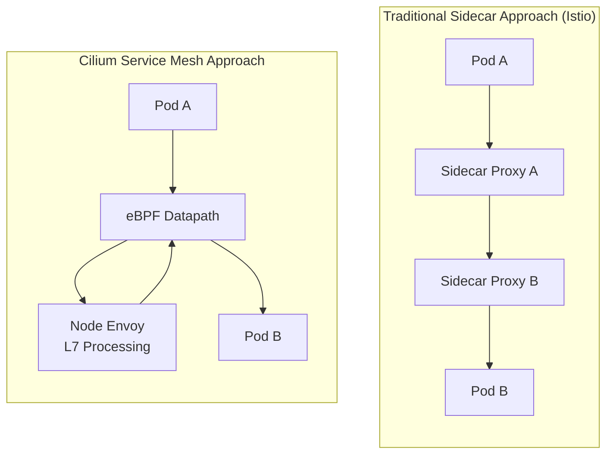
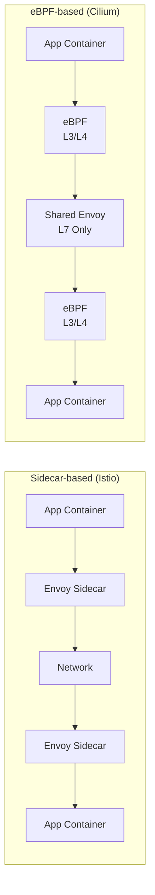
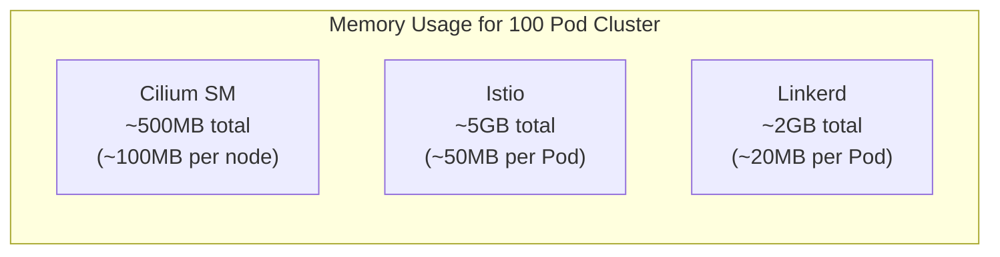

# Descripción general de Cilium Service Mesh

> **Versiones compatibles**: Cilium 1.16+, Kubernetes 1.28+
> **Última actualización**: February 22, 2026

## Introducción

Cilium Service Mesh es una solución de service mesh sin sidecar basada en eBPF. A diferencia de los enfoques tradicionales de proxy sidecar, Cilium Service Mesh aprovecha la tecnología eBPF del kernel de Linux para procesar el tráfico de red y utiliza un único proxy Envoy compartido por nodo para proporcionar funcionalidad L7.

### Propuesta de valor clave

El valor central de Cilium Service Mesh es una **plataforma unificada de networking y service mesh**:

1. **Eficiencia de recursos**: Funcionalidades de service mesh sin la sobrecarga de un proxy sidecar
2. **Baja latencia**: Procesamiento de paquetes a nivel de kernel mediante eBPF
3. **Operaciones sencillas**: CNI y service mesh integrados en un único componente
4. **Adopción gradual**: Los usuarios existentes de Cilium CNI pueden ampliar fácilmente a service mesh
5. **Seguridad sólida**: Identidad basada en SPIFFE y compatibilidad transparente con mTLS

## Arquitectura Sidecar vs. sin Sidecar



### Diagrama de comparación de arquitecturas



## Comparación de Service Mesh

| Característica | Cilium Service Mesh | Istio | Linkerd |
|---------|---------------------|-------|---------|
| **Arquitectura** | eBPF + Node Envoy | Sidecar Envoy | Sidecar linkerd2-proxy |
| **Proxy** | 1 por nodo (solo L7) | 1 por Pod | 1 por Pod |
| **Sobrecarga de memoria** | Baja (~50-100MB/nodo) | Alta (~50MB/Pod) | Media (~20MB/Pod) |
| **Sobrecarga de CPU** | Muy baja | Alta | Media |
| **Latencia** | ~0.1-0.5ms | ~1-3ms | ~0.5-1ms |
| **Procesamiento L4** | eBPF (kernel) | Envoy (userspace) | linkerd2-proxy |
| **Procesamiento L7** | Envoy | Envoy | linkerd2-proxy |
| **mTLS** | Transparente (eBPF/WireGuard) | Sidecar Envoy | linkerd2-proxy |
| **Integración de CNI** | Nativa | Requiere CNI independiente | Requiere CNI independiente |
| **Complejidad de instalación** | Baja | Alta | Media |
| **Gateway API** | Compatibilidad completa | Compatibilidad completa | Compatibilidad parcial |
| **Política de red** | CiliumNetworkPolicy (L3-L7) | AuthorizationPolicy | Server (L4) |
| **Observabilidad** | Hubble (nativa) | Kiali, Jaeger | Linkerd Viz |

### Comparación de uso de recursos



## Cuándo elegir Cilium Service Mesh

### Casos de uso adecuados

1. **Ya utiliza Cilium CNI**
   - Aproveche la inversión existente en Cilium
   - Habilite funcionalidades de service mesh sin componentes adicionales
   - Operaciones y monitoreo unificados

2. **La eficiencia de recursos es crítica**
   - Elimine la sobrecarga de sidecar en clusters grandes
   - Se requiere optimización de recursos de nodo
   - La reducción de costos es importante

3. **La baja latencia es esencial**
   - Workloads de alto rendimiento
   - Aplicaciones en tiempo real
   - Sistemas financieros/de trading

4. **Se desean operaciones sencillas**
   - Un único componente para CNI + service mesh
   - No se necesita gestionar la inyección de sidecar
   - Actualizaciones y resolución de problemas simplificadas

### Casos de uso no adecuados

1. **Gran inversión existente en Istio**
   - Ya se implementaron políticas complejas de Istio
   - Dependencia de funcionalidades específicas de Istio

2. **Se requieren extensiones extensas de Envoy**
   - Filtros personalizados por sidecar
   - Configuración detallada de proxy por Pod

3. **Mesh multi-cluster complejo**
   - Necesidad de las funcionalidades maduras multi-cluster de Istio

## Requisitos previos

### Verificar la instalación de Cilium CNI

Cilium Service Mesh requiere que Cilium CNI se instale primero:

```bash
# Check Cilium status
cilium status

# Expected output
    /¯¯\
 /¯¯\__/¯¯\    Cilium:             OK
 \__/¯¯\__/    Operator:           OK
 /¯¯\__/¯¯\    Envoy DaemonSet:    OK
 \__/¯¯\__/    Hubble Relay:       OK
    \__/       ClusterMesh:        disabled

# Check Cilium version
cilium version
```

### Instalar Cilium en EKS

```bash
# Add Helm repository
helm repo add cilium https://helm.cilium.io/
helm repo update

# Install Cilium on EKS (with service mesh features)
helm install cilium cilium/cilium --version 1.16.0 \
  --namespace kube-system \
  --set eni.enabled=true \
  --set ipam.mode=eni \
  --set egressMasqueradeInterfaces=eth0 \
  --set routingMode=native \
  --set kubeProxyReplacement=true \
  --set loadBalancer.algorithm=maglev \
  --set envoy.enabled=true \
  --set hubble.enabled=true \
  --set hubble.relay.enabled=true \
  --set hubble.ui.enabled=true
```

### Componentes requeridos

| Componente | Función | Requerido |
|-----------|------|----------|
| Cilium Agent | Gestión de programas eBPF, aplicación de políticas | Requerido |
| Cilium Operator | Gestión de CRD, IPAM | Requerido |
| Envoy (cilium-envoy) | Procesamiento de proxy L7 | Requerido para service mesh |
| Hubble | Observabilidad | Recomendado |
| Hubble Relay | Conectividad de UI/CLI | Recomendado |
| Hubble UI | Visualización | Opcional |

## Habilitar funcionalidades de Service Mesh

### Habilitación básica

```yaml
# values.yaml
envoy:
  enabled: true

# Default configuration for L7 proxy policy enforcement
proxy:
  enabled: true
```

### Configuración completa de Service Mesh

```yaml
# values.yaml - Full service mesh features
envoy:
  enabled: true
  resources:
    limits:
      cpu: 2000m
      memory: 2Gi
    requests:
      cpu: 100m
      memory: 256Mi

# Hubble observability
hubble:
  enabled: true
  relay:
    enabled: true
  ui:
    enabled: true
  metrics:
    enabled:
      - dns
      - drop
      - tcp
      - flow
      - icmp
      - http

# Mutual authentication (mTLS)
authentication:
  mutual:
    spire:
      enabled: true
      install:
        enabled: true

# Ingress Controller
ingressController:
  enabled: true
  loadbalancerMode: shared

# Gateway API
gatewayAPI:
  enabled: true
```

## Estructura del documento

Esta sección está organizada de la siguiente manera:

| Documento | Descripción |
|----------|-------------|
| [Arquitectura](./01-architecture.md) | Datapath de eBPF, Node Envoy, modelo de CRD |
| [Gestión de tráfico](./02-traffic-management.md) | Enrutamiento L7, balanceo de carga, división de tráfico |
| [Seguridad](./03-security.md) | mTLS, políticas de red, cifrado |
| [Observabilidad](./04-observability.md) | Hubble, métricas, mapas de servicios |
| [Ingress y Gateway](./05-ingress-gateway.md) | Ingress Controller, Gateway API |
| [Prácticas recomendadas](./06-best-practices.md) | Despliegue en producción, migración, optimización |

## Inicio rápido

### 1. Verificar las funcionalidades de Service Mesh

```bash
# Check Envoy DaemonSet
kubectl get daemonset -n kube-system cilium-envoy

# Check Cilium service mesh status
cilium status | grep -E "Envoy|Hubble"
```

### 2. Desplegar aplicación de ejemplo

```yaml
# bookinfo.yaml
apiVersion: v1
kind: Namespace
metadata:
  name: bookinfo
---
apiVersion: apps/v1
kind: Deployment
metadata:
  name: productpage
  namespace: bookinfo
spec:
  replicas: 1
  selector:
    matchLabels:
      app: productpage
  template:
    metadata:
      labels:
        app: productpage
    spec:
      containers:
      - name: productpage
        image: docker.io/istio/examples-bookinfo-productpage-v1:1.18.0
        ports:
        - containerPort: 9080
---
apiVersion: v1
kind: Service
metadata:
  name: productpage
  namespace: bookinfo
spec:
  selector:
    app: productpage
  ports:
  - port: 9080
    targetPort: 9080
```

### 3. Aplicar política L7

```yaml
# l7-policy.yaml
apiVersion: cilium.io/v2
kind: CiliumNetworkPolicy
metadata:
  name: productpage-l7
  namespace: bookinfo
spec:
  endpointSelector:
    matchLabels:
      app: productpage
  ingress:
  - fromEndpoints:
    - matchLabels:
        app: frontend
    toPorts:
    - ports:
      - port: "9080"
        protocol: TCP
      rules:
        http:
        - method: GET
          path: "/productpage"
        - method: GET
          path: "/health"
```

### 4. Observar el tráfico

```bash
# Observe L7 traffic with Hubble CLI
hubble observe --namespace bookinfo -f

# Filter HTTP requests
hubble observe --namespace bookinfo --protocol http

# Check inter-service flows
hubble observe --namespace bookinfo --to-service productpage
```

## Próximos pasos

1. **[Arquitectura](./01-architecture.md)**: Comprenda el funcionamiento interno de Cilium Service Mesh.
2. **[Gestión de tráfico](./02-traffic-management.md)**: Configure el enrutamiento L7 y el control de tráfico.
3. **[Seguridad](./03-security.md)**: Configure mTLS y las políticas de red L7.

## Referencias

- [Documentación oficial de Cilium](https://docs.cilium.io/)
- [Guía de Cilium Service Mesh](https://docs.cilium.io/en/stable/network/servicemesh/)
- [Introducción a eBPF](https://ebpf.io/)
- [Documentación de Gateway API](https://gateway-api.sigs.k8s.io/)
