# Conceptos básicos

Este documento explica los conceptos fundamentales y la arquitectura de Istio. Comprender estos conceptos básicos es importante para usar Istio eficazmente.

## Índice

1. [Contexto e historia](02-basic-concepts.md#background-and-history)
2. [¿Por qué Istio?](02-basic-concepts.md#why-istio)
3. [Arquitectura de Istio](02-basic-concepts.md#istio-architecture)
4. [Modos de despliegue: Sidecar vs Ambient](02-basic-concepts.md#deployment-modes-sidecar-vs-ambient)
5. [Recursos principales](02-basic-concepts.md#core-resources)
6. [Conceptos de gestión de tráfico](02-basic-concepts.md#traffic-management-concepts)
7. [Conceptos de seguridad](02-basic-concepts.md#security-concepts)
8. [Conceptos de observabilidad](02-basic-concepts.md#observability-concepts)
9. [Namespaces y Service Mesh](02-basic-concepts.md#namespaces-and-service-mesh)
10. [Siguientes pasos](02-basic-concepts.md#next-steps)

## Contexto e historia

### El nacimiento de Service Mesh

#### Desafíos de los microservicios

A principios de la década de 2010, las empresas comenzaron a descomponer las aplicaciones monolíticas en microservicios.

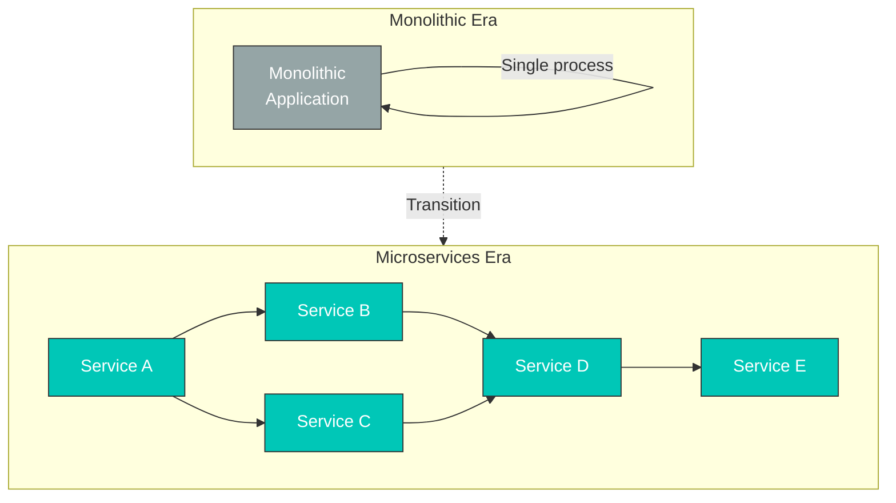

**Nuevos problemas**:

| Problema                         | Descripción                                  | Impacto                         |
| ------------------------------- | -------------------------------------------- | ------------------------------ |
| **Comunicación entre servicios** | Aumento de las llamadas de red               | Latencia, propagación de fallos |
| **Observabilidad**               | Necesidad de trazabilidad distribuida        | Depuración difícil             |
| **Seguridad**                    | Autenticación/cifrado entre servicios        | Complejidad de implementación de mTLS |
| **Control de tráfico**           | Despliegues Canary, pruebas A/B              | Modificaciones al código de la aplicación |
| **Manejo de fallos**             | Circuit Breaker, Retry                       | Implementación por servicio     |

#### Solución inicial: bibliotecas

**Problemas**:

* Necesidad de desarrollar bibliotecas para cada lenguaje (Hystrix para Java, biblioteca independiente para Go...)
* Acoplamiento estrecho con el código de la aplicación
* Requiere volver a desplegar todos los servicios para las actualizaciones
* Gestión de versiones compleja

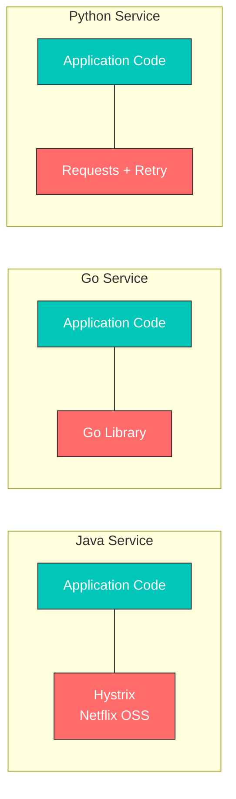

**Idea de Service Mesh**: trasladar la lógica de red de la aplicación a una capa de infraestructura

### El nacimiento de Envoy Proxy

#### El problema de Lyft

**En 2015, Lyft** enfrentaba los siguientes problemas:

* Operaba más de 200 microservicios
* Diversos lenguajes y frameworks (Python, Go, Java, etc.)
* Los proxies existentes (HAProxy, NGINX) eran insuficientes
  * Cambios de configuración dinámica difíciles
  * Falta de observabilidad
  * Funcionalidades avanzadas de enrutamiento limitadas

#### Matt Klein y Envoy

**Matt Klein** (ingeniero de Lyft) publicó Envoy como código abierto en 2016.

**Problemas que Envoy resolvió**:

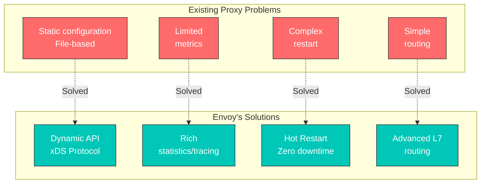

**Características principales de Envoy**:

1. **Arquitectura fuera de proceso**: proceso independiente de la aplicación
2. **APIs xDS**: actualizaciones de configuración dinámica
3. **Proxy L7**: soporte para HTTP/2, gRPC y WebSocket
4. **Observabilidad**: métricas detalladas, trazabilidad y registros
5. **Rendimiento**: escrito en C++, alto rendimiento

#### Adopción por CNCF

**Cronología**:

* **Septiembre de 2016**: Envoy se publica como código abierto
* **Septiembre de 2017**: aceptado como proyecto CNCF (Incubating)
* **Noviembre de 2018**: promovido a proyecto CNCF Graduated

### El nacimiento y la historia de Istio

#### Colaboración entre Google, IBM y Lyft

**En mayo de 2017**, Google, IBM y Lyft colaboraron para anunciar Istio.

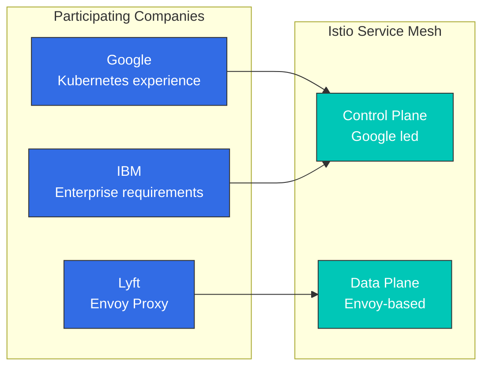

**Contribuciones de cada empresa**:

| Empresa    | Contribución principal    | Motivo                           |
| ---------- | -------------------- | -------------------------------- |
| **Google** | Diseño de Control Plane | Experiencia con Borg y Kubernetes      |
| **IBM**    | Funcionalidades empresariales  | Requisitos de clientes empresariales |
| **Lyft**   | Envoy Proxy          | Proxy probado en producción          |

#### Historial de versiones de Istio

**Hitos principales**:

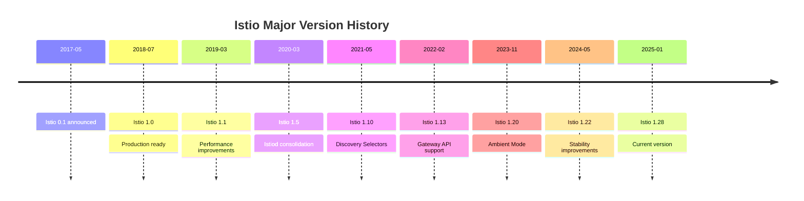

**Versión 1.5 (marzo de 2020): punto de inflexión importante**:

Arquitectura anterior (Istio 1.4 y versiones anteriores):

```
Separated into individual components:
- Mixer (policy/telemetry)
- Pilot (traffic management)
- Citadel (certificate management)
- Galley (configuration validation)
```

Nueva arquitectura (Istio 1.5+, actual 1.28):

```
Istiod (consolidated into single binary)
├── Pilot functionality (Service Discovery, Traffic Management)
├── Citadel functionality (Certificate Authority, Identity)
└── Galley functionality (Configuration Validation)

Mixer completely removed (functionality moved to Envoy)
```

**Motivos del cambio**:

* Complejidad reducida (4 componentes → 1)
* Rendimiento mejorado (reducción del 50 % de la latencia al eliminar Mixer)
* Operaciones simplificadas (gestión de un único proceso)
* Eficiencia de recursos (menor uso de memoria y CPU)

## ¿Por qué Istio?

Kubernetes proporciona orquestación de contenedores, pero tiene limitaciones para gestionar la comunicación compleja entre microservicios. Istio es una solución de Service Mesh para abordar estos problemas.

### Desafíos de los microservicios

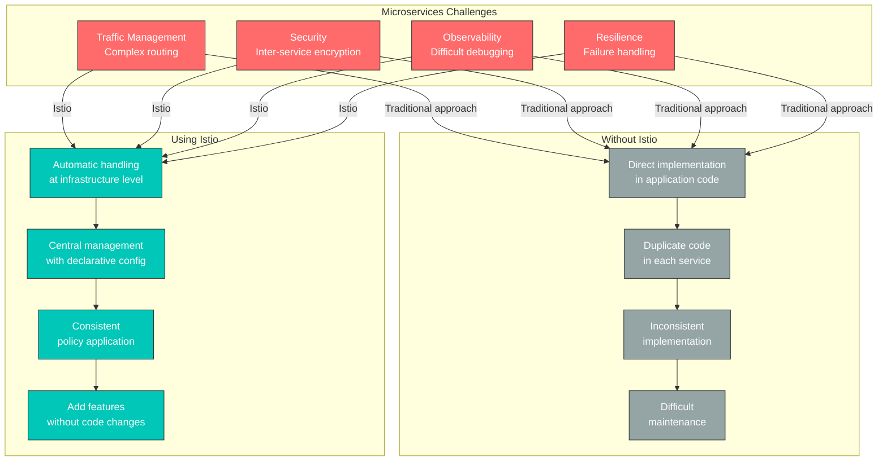

### Valores principales que proporciona Istio

#### 1. Gestión de tráfico

**Problema**: se desea realizar una transición segura del tráfico al desplegar nuevas versiones.

**Solución de Istio**:

```yaml
# Canary deployment without code changes
apiVersion: networking.istio.io/v1
kind: VirtualService
metadata:
  name: reviews
spec:
  hosts:
  - reviews
  http:
  - route:
    - destination:
        host: reviews
        subset: v1
      weight: 90  # Existing version 90%
    - destination:
        host: reviews
        subset: v2
      weight: 10  # New version 10%
```

**Beneficios**:

* No se requiere modificar el código de la aplicación
* Ajuste de división de tráfico en tiempo real
* Posibilidad de rollback automático
* Soporte para pruebas A/B y despliegue Blue/Green

#### 2. Seguridad

**Problema**: se desea cifrar y autenticar la comunicación entre servicios.

**Solución de Istio**:

```yaml
# Automatic mTLS enablement
apiVersion: security.istio.io/v1
kind: PeerAuthentication
metadata:
  name: default
  namespace: istio-system
spec:
  mtls:
    mode: STRICT  # Automatic encryption for all inter-service communication
```

**Beneficios**:

* Emisión y renovación automática de certificados
* Verificación automática de identidad del servicio
* Control de permisos granular
* Implementación de red Zero Trust

#### 3. Observabilidad

**Problema**: es difícil rastrear el flujo de solicitudes entre decenas de microservicios.

**Solución de Istio**:

* Generación automática de métricas (Latency, Traffic, Errors, Saturation)
* Trazabilidad distribuida
* Visualización de la topología de servicios

**Beneficios**:

* Identificación automática de cuellos de botella
* Identificación rápida de la causa raíz de los errores
* Supervisión del estado de los servicios en tiempo real

#### 4. Resiliencia

**Problema**: el fallo de un servicio se propaga a todo el sistema.

**Solución de Istio**:

```yaml
# Automatic Circuit Breaker configuration
apiVersion: networking.istio.io/v1
kind: DestinationRule
metadata:
  name: reviews
spec:
  host: reviews
  trafficPolicy:
    outlierDetection:
      consecutiveErrors: 5
      interval: 30s
      baseEjectionTime: 30s
```

**Beneficios**:

* Aislamiento de fallos (Circuit Breaker)
* Retry y timeout automáticos
* Eliminación automática de instancias no saludables
* Limitación de tráfico (Rate Limiting)

### Cuándo usar Istio

**✅ Cuándo Istio es adecuado:**

1. **Arquitectura de microservicios**
   * 10 o más servicios
   * Dependencias complejas entre servicios
   * Despliegues frecuentes
2. **Se necesita gestión avanzada de tráfico**
   * Despliegues Canary, pruebas A/B
   * Control de enrutamiento granular
   * Traffic Mirroring
3. **Requisitos sólidos de seguridad**
   * Cifrado entre servicios obligatorio
   * Control de acceso granular
   * Cumplimiento normativo
4. **Observabilidad y depuración**
   * Seguimiento de problemas complejos entre servicios
   * Identificación de cuellos de botella de rendimiento
   * Supervisión de SLO/SLA

**❌ Cuándo Istio puede ser excesivo:**

1. **Aplicaciones simples**
   * Pocos servicios (menos de 5)
   * Requisitos simples
   * Kubernetes Ingress es suficiente
2. **Restricciones de recursos**
   * Cluster pequeño
   * No se puede asumir la sobrecarga de recursos
   * Carga de coste de memoria de Sidecar
3. **Falta de capacidad operativa**
   * Tiempo de aprendizaje insuficiente
   * Sin equipo de plataforma dedicado
   * Se prefieren soluciones más simples

### Comparación de alternativas

#### Kubernetes Ingress vs Istio

| Característica           | Kubernetes Ingress | Istio                             |
| ----------------- | ------------------ | --------------------------------- |
| **Alcance**         | Externo → Cluster | Externo + entre servicios internos |
| **Enrutamiento**       | Básico (Path, Host) | Avanzado (Header, Cookie, etc.)   |
| **mTLS**          | Configuración manual       | Automático                         |
| **Observabilidad** | Limitada            | Completa                              |
| **Complejidad**    | Baja                | Alta                              |
| **Caso de uso**      | Aplicaciones simples        | Microservicios                     |

#### AWS VPC Lattice vs Istio

Para una comparación detallada, consulta el documento de [integración con AWS](04-aws-integration.md#istio-vs-other-solutions-comparison).

**Resumen rápido:**

* **VPC Lattice**: administrado por AWS, simple, comunicación entre VPC/cuentas
* **Istio**: código abierto, funcionalidades potentes, solo para Kubernetes, control granular

#### Linkerd vs Istio

| Propiedad           | Istio     | Linkerd            |
| ------------------ | --------- | ------------------ |
| **Complejidad**     | Alta      | Baja                |
| **Funcionalidades**       | Muy completas | Solo funcionalidades principales |
| **Recursos**      | Altos      | Bajos                |
| **Curva de aprendizaje** | Pronunciada     | Suave             |
| **Comunidad**      | Grande     | Pequeña              |

**Guía de selección:**

* Se necesitan funcionalidades avanzadas y flexibilidad → **Istio**
* Se necesita una malla simple y ligera → **Linkerd**

## Modos de despliegue: Sidecar vs Ambient

Istio admite dos modos de despliegue: **Sidecar Mode** y **Ambient Mode**.

### Sidecar Mode (predeterminado)

Inyecta un proxy Envoy como contenedor sidecar en cada Pod de la aplicación.

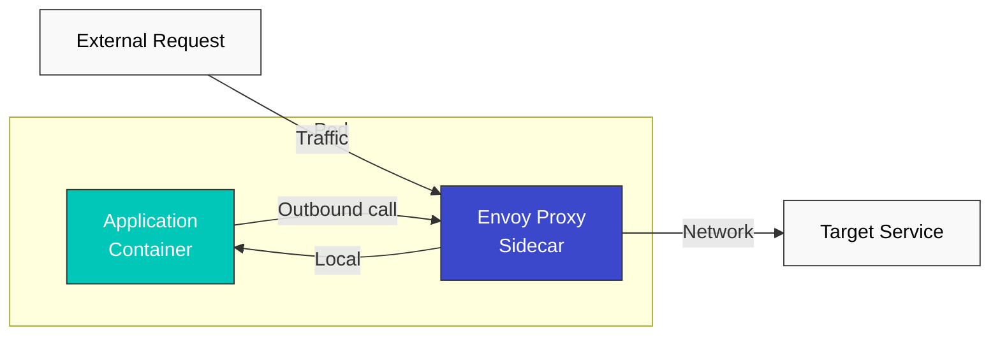

**Ventajas:**

* Maduro y estable
* Compatibilidad con todas las funcionalidades de Istio
* Control granular por Pod

**Desventajas:**

* Sobrecarga de recursos (Envoy por Pod)
* Mayor tiempo de inicio (Init Container)
* Configuración de permisos compleja (iptables)

### Ambient Mode (nuevo enfoque)

Gestiona el tráfico en el nivel de nodo sin sidecars.

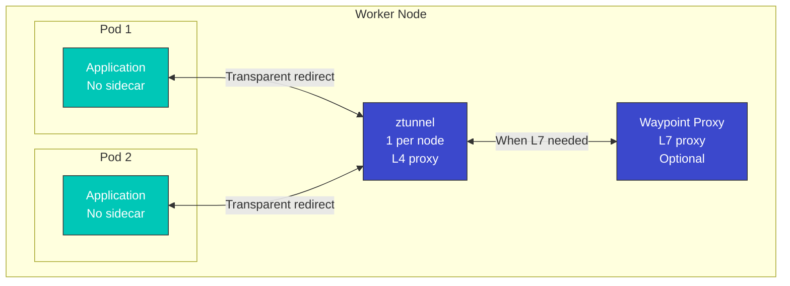

**Ventajas:**

* Bajo uso de recursos (1 por nodo)
* Inicio rápido de Pod
* Operaciones simples
* Posibilidad de aplicación gradual de funcionalidades L7

**Desventajas:**

* Tecnología relativamente nueva (menos madura)
* Algunas funcionalidades avanzadas son limitadas
* Control granular por Pod difícil

### Tabla comparativa

| Propiedad                   | Sidecar Mode                | Ambient Mode                   |
| -------------------------- | --------------------------- | ------------------------------ |
| **Uso de recursos**         | Alto (por Pod)              | Bajo (por nodo)                 |
| **Tiempo de inicio**           | Lento (Init Container)       | Rápido                           |
| **Complejidad operativa** | Alta                        | Baja                            |
| **Funcionalidades L4**            | Compatibles                   | Compatibles                      |
| **Funcionalidades L7**            | Compatibilidad completa                | Opcional (Waypoint)            |
| **Madurez**               | Alta                        | Media                         |
| **Migración**              | -                           | Posible desde Sidecar existente |
| **Uso recomendado**        | Se necesitan funcionalidades L7 avanzadas | Prioridad: eficiencia de recursos   |

### Guía de selección

**Elige Sidecar Mode:**

* Se necesita utilizar todas las funcionalidades de Istio
* Se necesita control de políticas granular por Pod
* Se necesita estabilidad probada en producción

**Elige Ambient Mode:**

* La eficiencia de recursos es importante
* Solo se necesitan funcionalidades L4 simples
* Se planea añadir gradualmente funcionalidades L7

**Para más detalles**, consulta el documento [Avanzado: Ambient Mode](advanced/01-ambient-mode.md).

## Arquitectura de Istio

Istio consta de dos componentes principales: **Control Plane** y **Data Plane**.

| Componente                    | Descripción                                                                                                  |
| ---------------------------- | ------------------------------------------------------------------------------------------------------------ |
| **Control Plane (istiod)**   | Sistema de control central responsable del descubrimiento de servicios, la distribución de configuración y la gestión de certificados |
| **Data Plane (Envoy Proxy)** | Desplegado como sidecar en cada Pod; gestiona el tráfico real (enrutamiento, mTLS y métricas)                             |

**Para conocer en detalle la estructura de la arquitectura, los principios de funcionamiento interno y los mecanismos de interceptación de tráfico**, consulta el [documento de arquitectura](03-architecture.md).

## Recursos principales

Istio utiliza Kubernetes Custom Resource Definitions (CRDs) para gestionar la configuración.

### 1. VirtualService

VirtualService define cómo se enrutan las solicitudes a los servicios.

```yaml
apiVersion: networking.istio.io/v1
kind: VirtualService
metadata:
  name: reviews-route
spec:
  hosts:
  - reviews  # Target service
  http:
  - match:
    - headers:
        end-user:
          exact: jason
    route:
    - destination:
        host: reviews
        subset: v2  # Route specific user to v2
  - route:
    - destination:
        host: reviews
        subset: v1  # Route to v1 by default
```

**Características principales**:

* Enrutamiento basado en Path (Path, Header, Query Parameter)
* División de tráfico (Canary, pruebas A/B)
* Retry, Timeout, Fault Injection
* URL Rewrite, manipulación de Header

### 2. DestinationRule

DestinationRule define subconjuntos (versiones) de servicios y aplica políticas de tráfico.

```yaml
apiVersion: networking.istio.io/v1
kind: DestinationRule
metadata:
  name: reviews-destination
spec:
  host: reviews
  trafficPolicy:
    loadBalancer:
      simple: LEAST_REQUEST  # Load balancing algorithm
    connectionPool:
      tcp:
        maxConnections: 100
      http:
        http1MaxPendingRequests: 50
        maxRequestsPerConnection: 2
    outlierDetection:
      consecutiveErrors: 5
      interval: 30s
      baseEjectionTime: 30s
  subsets:
  - name: v1
    labels:
      version: v1
  - name: v2
    labels:
      version: v2
  - name: v3
    labels:
      version: v3
```

**Características principales**:

* Definición de versión (subset) de servicio
* Algoritmo de balanceo de carga
* Configuración de Connection Pool
* Circuit Breaker (Outlier Detection)
* Configuración de TLS

### 3. Gateway

Gateway gestiona el tráfico externo que entra en la malla.

```yaml
apiVersion: networking.istio.io/v1
kind: Gateway
metadata:
  name: bookinfo-gateway
spec:
  selector:
    istio: ingressgateway  # Select Ingress Gateway pod
  servers:
  - port:
      number: 80
      name: http
      protocol: HTTP
    hosts:
    - "bookinfo.example.com"
  - port:
      number: 443
      name: https
      protocol: HTTPS
    tls:
      mode: SIMPLE
      credentialName: bookinfo-credential  # TLS certificate
    hosts:
    - "bookinfo.example.com"
```

**Características principales**:

* Definir el punto de entrada de tráfico externo
* Configuración de host, puerto y protocolo
* Terminación TLS
* Enrutamiento SNI

### 4. ServiceEntry

ServiceEntry permite usar servicios externos fuera de la malla como servicios internos.

```yaml
apiVersion: networking.istio.io/v1
kind: ServiceEntry
metadata:
  name: external-api
spec:
  hosts:
  - api.external.com
  ports:
  - number: 443
    name: https
    protocol: HTTPS
  location: MESH_EXTERNAL
  resolution: DNS
```

**Características principales**:

* Registro de servicios externos
* Control de tráfico para servicios externos
* Gestión de tráfico de salida

### 5. PeerAuthentication

PeerAuthentication define las políticas de autenticación entre servicios.

```yaml
apiVersion: security.istio.io/v1
kind: PeerAuthentication
metadata:
  name: default
  namespace: default
spec:
  mtls:
    mode: STRICT  # STRICT, PERMISSIVE, DISABLE
```

### 6. AuthorizationPolicy

AuthorizationPolicy define los permisos de acceso a los servicios.

```yaml
apiVersion: security.istio.io/v1
kind: AuthorizationPolicy
metadata:
  name: allow-ratings
  namespace: default
spec:
  selector:
    matchLabels:
      app: ratings
  action: ALLOW
  rules:
  - from:
    - source:
        principals: ["cluster.local/ns/default/sa/reviews"]
    to:
    - operation:
        methods: ["GET"]
```

## Conceptos de gestión de tráfico

### Flujo de enrutamiento de tráfico

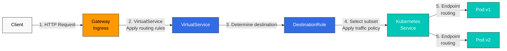

### División de tráfico (despliegue Canary)

```yaml
apiVersion: networking.istio.io/v1
kind: VirtualService
metadata:
  name: reviews-canary
spec:
  hosts:
  - reviews
  http:
  - route:
    - destination:
        host: reviews
        subset: v1
      weight: 90  # 90% of traffic
    - destination:
        host: reviews
        subset: v2
      weight: 10  # 10% of traffic (canary)
```

### Circuit Breaker

```yaml
apiVersion: networking.istio.io/v1
kind: DestinationRule
metadata:
  name: reviews-circuit-breaker
spec:
  host: reviews
  trafficPolicy:
    connectionPool:
      tcp:
        maxConnections: 100
      http:
        http1MaxPendingRequests: 10
        maxRequestsPerConnection: 2
    outlierDetection:
      consecutiveErrors: 5
      interval: 30s
      baseEjectionTime: 30s
      maxEjectionPercent: 50
```

## Conceptos de seguridad

### mTLS (TLS mutuo)

Istio cifra automáticamente la comunicación entre servicios.

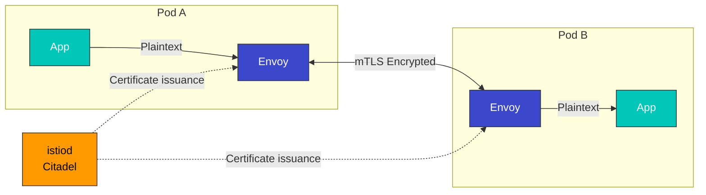

**Modos de mTLS**:

* **STRICT**: solo se permite mTLS
* **PERMISSIVE**: se permiten tanto mTLS como texto sin cifrar (para migración)
* **DISABLE**: mTLS deshabilitado

### Autenticación y autorización

```yaml
# JWT Authentication
apiVersion: security.istio.io/v1
kind: RequestAuthentication
metadata:
  name: jwt-auth
spec:
  jwtRules:
  - issuer: "https://accounts.google.com"
    jwksUri: "https://www.googleapis.com/oauth2/v3/certs"
---
# Authorization Policy
apiVersion: security.istio.io/v1
kind: AuthorizationPolicy
metadata:
  name: require-jwt
spec:
  action: DENY
  rules:
  - from:
    - source:
        notRequestPrincipals: ["*"]
```

## Conceptos de observabilidad

Istio genera automáticamente métricas, registros y trazas.

### Métricas generadas automáticamente

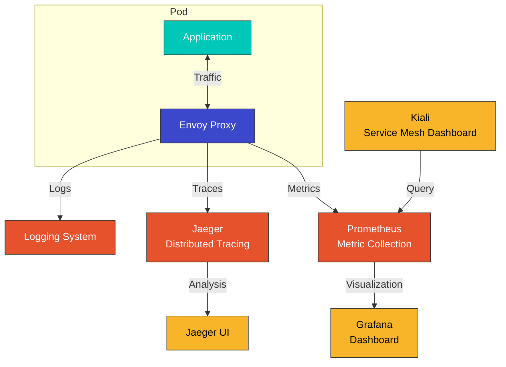

### Métricas principales

| Métrica                                | Descripción          |
| ------------------------------------- | -------------------- |
| `istio_requests_total`                | Número total de solicitudes  |
| `istio_request_duration_milliseconds` | Latencia de solicitud      |
| `istio_request_bytes`                 | Tamaño de solicitud         |
| `istio_response_bytes`                | Tamaño de respuesta        |
| `istio_tcp_connections_opened_total`  | Número de conexiones TCP |

### Trazabilidad distribuida

```yaml
# Enable tracing in Envoy
apiVersion: install.istio.io/v1alpha1
kind: IstioOperator
spec:
  meshConfig:
    enableTracing: true
    defaultConfig:
      tracing:
        sampling: 100.0  # 100% sampling
        zipkin:
          address: jaeger-collector.istio-system:9411
```

## Namespaces y Service Mesh

### Aislamiento de Namespace

```yaml
# Per-namespace mTLS policy
apiVersion: security.istio.io/v1
kind: PeerAuthentication
metadata:
  name: default
  namespace: production
spec:
  mtls:
    mode: STRICT
---
# Per-namespace authorization policy
apiVersion: security.istio.io/v1
kind: AuthorizationPolicy
metadata:
  name: deny-all
  namespace: production
spec:
  action: DENY
  rules:
  - {}
```

### Alcance de Service Mesh

```bash
# Include only specific namespaces in the mesh
kubectl label namespace default istio-injection=enabled
kubectl label namespace staging istio-injection=enabled

# Exclude specific namespace
kubectl label namespace kube-system istio-injection=disabled
```

### Multi-tenancy

```yaml
# Restrict mesh scope with Sidecar resource
apiVersion: networking.istio.io/v1
kind: Sidecar
metadata:
  name: default
  namespace: production
spec:
  egress:
  - hosts:
    - "production/*"  # Only production namespace accessible
    - "istio-system/*"
```

## Registro de cargas de trabajo de VM

Istio puede registrar no solo Pods de Kubernetes, sino también **cargas de trabajo de Virtual Machine (VM)** en la Service Mesh. Esto permite que las aplicaciones heredadas o los servicios fuera del cluster aprovechen las funcionalidades de gestión de tráfico, seguridad y observabilidad de Istio.

### Por qué se necesitan las cargas de trabajo de VM

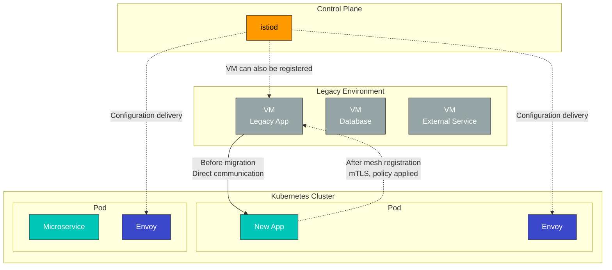

**Escenarios de uso**:

* Migración gradual de aplicaciones heredadas
* Inclusión de servidores de bases de datos en la malla
* Integración de servicios fuera del cluster
* Configuración de entorno de nube híbrida

### Arquitectura de registro de VM

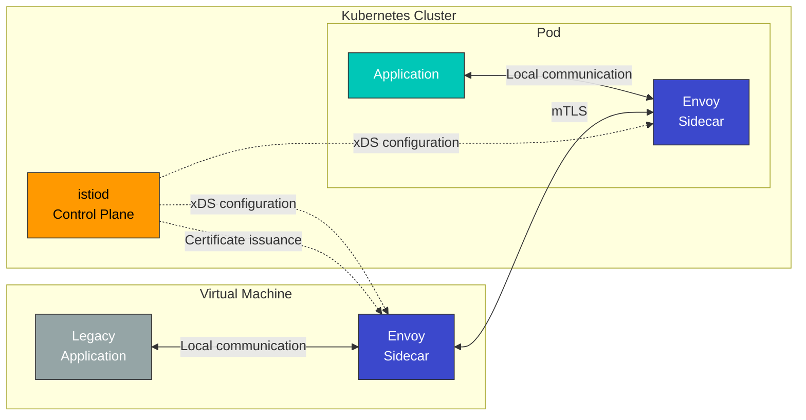

### Recurso WorkloadEntry

Las cargas de trabajo de VM se registran con el recurso **WorkloadEntry**.

```yaml
apiVersion: networking.istio.io/v1
kind: WorkloadEntry
metadata:
  name: legacy-database
  namespace: default
spec:
  address: 192.168.1.100  # VM IP address
  labels:
    app: mysql
    version: v5.7
  serviceAccount: database-sa
  ports:
    mysql: 3306
```

**Campos principales de WorkloadEntry**:

* `address`: dirección IP de VM
* `labels`: coincide con el selector de servicio
* `serviceAccount`: cuenta de servicio para autenticación mTLS
* `ports`: definición de puertos expuestos

### Integración con ServiceEntry

WorkloadEntry se usa con ServiceEntry para registrar servicios de VM en la malla.

```yaml
# Define service with ServiceEntry
apiVersion: networking.istio.io/v1
kind: ServiceEntry
metadata:
  name: legacy-database
spec:
  hosts:
  - database.legacy.com
  ports:
  - number: 3306
    name: mysql
    protocol: TCP
  location: MESH_INTERNAL  # Register as internal mesh service
  resolution: STATIC
  workloadSelector:
    labels:
      app: mysql
---
# Register VM instance with WorkloadEntry
apiVersion: networking.istio.io/v1
kind: WorkloadEntry
metadata:
  name: mysql-vm-1
  namespace: default
spec:
  address: 192.168.1.100
  labels:
    app: mysql
    version: v5.7
  serviceAccount: mysql-sa
```

### Comparación entre registro de VM y Multi-Cluster

| Característica                    | Registro de carga de trabajo de VM | Multi-Cluster                  | Kubernetes Pod      |
| -------------------------- | ------------------------ | ------------------------------ | ------------------- |
| **Ubicación de la carga de trabajo**      | VM fuera del cluster       | Cluster de Kubernetes diferente   | Dentro del cluster      |
| **Instalación de Envoy**     | Instalación manual      | Automática (sidecar)            | Automática (sidecar) |
| **Método de registro**    | WorkloadEntry            | ServiceEntry + EndpointSlice   | Service + Pod       |
| **mTLS**                   | Compatible                | Compatible                      | Compatible           |
| **Descubrimiento de servicios**      | Manual (IP especificada)    | Automático                      | Automático           |
| **Escenario de uso**         | Aplicaciones heredadas, DB          | Multi-cloud, recuperación ante desastres | Aplicaciones cloud-native   |
| **Complejidad operativa** | Alta                     | Media                         | Baja                 |

### Beneficios del registro de VM

#### 1. Migración gradual

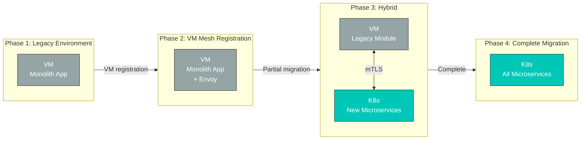

**Beneficios**:

* Integrar aplicaciones de VM existentes en la malla sin modificaciones
* Migrar a Kubernetes por etapas
* Mantener seguridad y observabilidad consistentes durante la migración

#### 2. Política de seguridad unificada

```yaml
# mTLS policy applied to both VMs and pods
apiVersion: security.istio.io/v1
kind: PeerAuthentication
metadata:
  name: default
  namespace: default
spec:
  mtls:
    mode: STRICT  # Enforce mTLS for both VMs and pods
---
# VM database access control
apiVersion: security.istio.io/v1
kind: AuthorizationPolicy
metadata:
  name: database-access
  namespace: default
spec:
  selector:
    matchLabels:
      app: mysql  # WorkloadEntry label
  action: ALLOW
  rules:
  - from:
    - source:
        principals: ["cluster.local/ns/default/sa/app-sa"]
    to:
    - operation:
        methods: ["*"]
```

#### 3. Observabilidad consistente

Las cargas de trabajo de VM proporcionan las mismas métricas, registros y trazabilidad distribuida que los Pods de Kubernetes.

```promql
# Unified metric query for VMs and pods
sum(rate(istio_requests_total{destination_workload="mysql-vm-1"}[5m]))

# Error rate from VM
sum(rate(istio_requests_total{destination_workload="mysql-vm-1",response_code="500"}[5m]))
/
sum(rate(istio_requests_total{destination_workload="mysql-vm-1"}[5m]))
```

### Limitaciones del registro de VM

1. **Instalación manual de Envoy**: se debe instalar y configurar manualmente el proxy Envoy en la VM
2. **Conectividad de red**: se requiere conexión de red entre la VM y el cluster de Kubernetes
3. **Gestión de certificados**: los certificados de cuenta de servicio deben desplegarse en la VM
4. **Carga operativa**: se requiere gestión y actualización de la versión de Envoy en la VM
5. **Limitación de auto-scaling**: no hay auto-scaling como Kubernetes HPA

### Ejemplo de uso práctico

#### Escenario: integración de base de datos heredada

```yaml
# 1. Define database service with ServiceEntry
apiVersion: networking.istio.io/v1
kind: ServiceEntry
metadata:
  name: legacy-postgres
  namespace: production
spec:
  hosts:
  - postgres.production.svc.cluster.local
  addresses:
  - 240.240.1.10  # Virtual IP
  ports:
  - number: 5432
    name: postgresql
    protocol: TCP
  location: MESH_INTERNAL
  resolution: STATIC
  workloadSelector:
    labels:
      app: postgres
      tier: database
---
# 2. Register VM instance with WorkloadEntry
apiVersion: networking.istio.io/v1
kind: WorkloadEntry
metadata:
  name: postgres-vm-1
  namespace: production
spec:
  address: 10.0.1.100  # Actual VM IP
  labels:
    app: postgres
    tier: database
    version: v13
  serviceAccount: postgres-sa
  ports:
    postgresql: 5432
---
# 3. Access control policy
apiVersion: security.istio.io/v1
kind: AuthorizationPolicy
metadata:
  name: postgres-access-control
  namespace: production
spec:
  selector:
    matchLabels:
      app: postgres
  action: ALLOW
  rules:
  - from:
    - source:
        namespaces: ["production"]
        principals: ["cluster.local/ns/production/sa/api-service"]
    to:
    - operation:
        ports: ["5432"]
```

**Resultado**:

* Los Pods de Kubernetes acceden a la base de datos mediante `postgres.production.svc.cluster.local`
* Cifrado mTLS automático entre la VM y los Pods
* Política de control de acceso aplicada
* Métricas y trazabilidad distribuida recopiladas automáticamente

### Resumen de la comparación de registro de cargas de trabajo

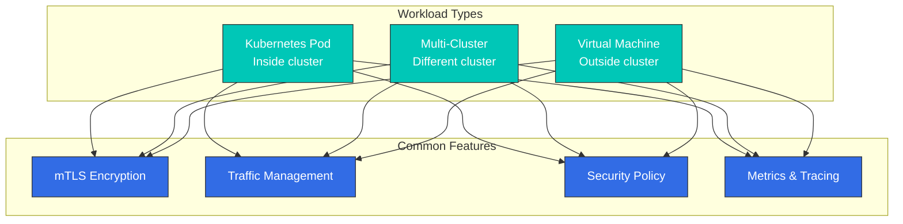

Mediante las capacidades flexibles de registro de cargas de trabajo de Istio:

* **Kubernetes Pod**: aplicaciones cloud-native
* **Multi-Cluster**: multi-cloud, distribución regional, recuperación ante desastres
* **Virtual Machine**: aplicaciones heredadas, bases de datos, entornos híbridos

Todas las cargas de trabajo reciben funcionalidades coherentes de seguridad, gestión de tráfico y observabilidad.

## Siguientes pasos

Ahora comprendes los conceptos básicos de Istio. Aprende a usarlos en la práctica mediante los siguientes documentos:

### Funcionalidades principales

1. [**Gestión de tráfico**](traffic-management/README.md)
   * Uso de Gateway y VirtualService
   * Definición de DestinationRule y subset
   * ServiceEntry y WorkloadEntry (registro de VM)
   * Patrones de enrutamiento avanzados (Canary, pruebas A/B)
   * Traffic Mirroring y Shadowing
2. [**Seguridad**](security/README.md)
   * Configuración de mTLS y PeerAuthentication
   * Autenticación (RequestAuthentication, JWT)
   * Autorización (AuthorizationPolicy)
   * Gestión de políticas de seguridad
   * Integración de autenticación externa
3. [**Observabilidad**](observability/README.md)
   * Recopilación de métricas (Prometheus)
   * Trazabilidad distribuida (Jaeger, Zipkin)
   * Configuración de registros
   * Visualización de Service Mesh con Kiali
   * Dashboards de Grafana
4. [**Resiliencia**](resilience/README.md)
   * Patrón Circuit Breaker
   * Configuración de Retry y Timeout
   * Rate Limiting
   * Outlier Detection
   * Pruebas de Fault Injection

### Temas avanzados

5. [**Temas avanzados**](advanced/README.md)
   * Ambient Mode (malla sin sidecar)
   * Configuración Multi-Cluster
   * Personalización de EnvoyFilter
   * DNS Proxy y Caching
   * Configuración detallada de cargas de trabajo de VM
   * Desarrollo de plugins WASM

## Referencias

* [Documentación oficial de Istio - Conceptos](https://istio.io/latest/docs/concepts/)
* [Documentación oficial de Istio - Gestión de tráfico](https://istio.io/latest/docs/concepts/traffic-management/)
* [Documentación oficial de Istio - Seguridad](https://istio.io/latest/docs/concepts/security/)
* [Documentación oficial de Istio - Observabilidad](https://istio.io/latest/docs/concepts/observability/)
* [Documentación oficial de Envoy Proxy](https://www.envoyproxy.io/docs/envoy/latest/)
