# Arquitectura

> **Versión compatible**: Istio 1.28+ **Versión de la API**: `networking.istio.io/v1`, `security.istio.io/v1` **Última actualización**: February 19, 2026

Este documento ofrece una visión detallada de la arquitectura interna y los mecanismos de red de Istio.

**Para conocer los antecedentes y la historia**, consulta el documento de [Conceptos básicos](02-basic-concepts.md#background-and-history).

**Cambios importantes (Istio 1.5+)**:

* Pilot, Citadel y Galley **ya no son componentes independientes**
* Se consolidan en un **único binario** llamado Istiod (`pilot-discovery`)
* La terminología Pilot/Citadel/Galley se refiere a **nombres históricos que describen funcionalidades**

## Tabla de contenido

1. [Descripción general de la arquitectura de Istio](03-architecture.md#istio-architecture-overview)
2. [Control Plane: Istiod](03-architecture.md#control-plane-istiod)
3. [Data Plane: Envoy Proxy](03-architecture.md#data-plane-envoy-proxy)
4. [Mecanismo de inyección de Sidecar](03-architecture.md#sidecar-injection-mechanism)
5. [iptables e intercepción de tráfico](03-architecture.md#iptables-and-traffic-interception)
6. [Mecanismo de procesamiento de DNS](03-architecture.md#dns-processing-mechanism)
7. [Comunicación de la API xDS](03-architecture.md#xds-api-communication)
8. [Optimización con el recurso Sidecar](03-architecture.md#optimization-with-sidecar-resource)

## Descripción general de la arquitectura de Istio

### Estructura general

### Control Plane frente a Data Plane

| Categoría        | Control Plane (Istiod)                        | Data Plane (Envoy)        |
| --------------- | --------------------------------------------- | ------------------------- |
| **Función**        | Gestión de políticas, distribución de configuración | Procesamiento de tráfico real |
| **Ubicación**    | Pods independientes (normalmente 1-3)                 | Todos los Pods de aplicación      |
| **Lenguaje**    | Go                                            | C++                       |
| **Carga**        | Baja                                           | Alta (todo el tráfico)        |
| **Escalabilidad** | Escalado horizontal (HA)                       | Automática (1 por Pod)     |

## Control Plane: Istiod

### Estructura interna de Istiod

**Importante**: Desde Istio 1.5, Pilot, Citadel y Galley son **funciones internas de Istiod, no componentes independientes**.

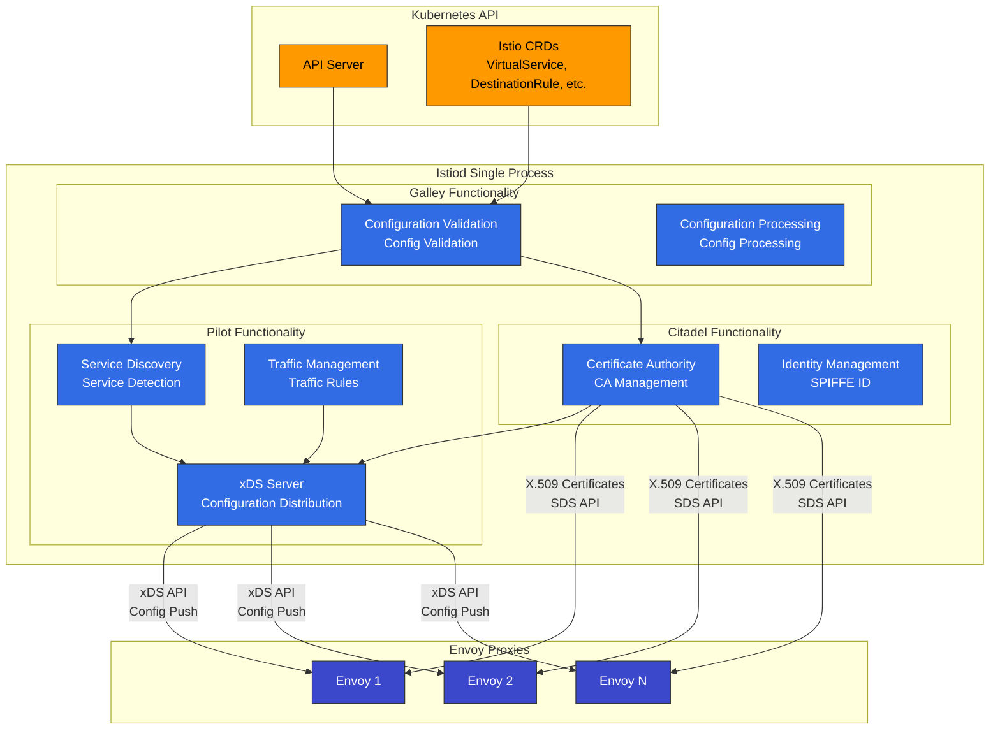

### Funciones principales de Istiod

**Nota**: Las siguientes funciones están integradas en Istiod en Istio 1.28. Los nombres históricos (Pilot, Citadel, Galley) se usan para describir funcionalidades.

#### 1. Descubrimiento de servicios (funcionalidad de Pilot)

```yaml
# Kubernetes Service detection
apiVersion: v1
kind: Service
metadata:
  name: reviews
spec:
  selector:
    app: reviews
  ports:
  - port: 9080
```

Istiod realiza el seguimiento de:

* Services de Kubernetes
* Endpoints (IP de los Pods)
* Cambios en el estado de los Pods
* Servicios externos (ServiceEntry)

#### 2. Gestión del tráfico (funcionalidad de Pilot)

Convierte los CRD de Istio en configuración de Envoy:

```yaml
# VirtualService (user-defined)
apiVersion: networking.istio.io/v1
kind: VirtualService
metadata:
  name: reviews
spec:
  hosts:
  - reviews
  http:
  - route:
    - destination:
        host: reviews
        subset: v1
      weight: 90
    - destination:
        host: reviews
        subset: v2
      weight: 10
```

↓ Istiod convierte en configuración de Envoy ↓

```json
{
  "route_config": {
    "weighted_clusters": {
      "clusters": [
        {"name": "outbound|9080|v1|reviews", "weight": 90},
        {"name": "outbound|9080|v2|reviews", "weight": 10}
      ]
    }
  }
}
```

#### 3. Gestión de certificados (funcionalidad de Citadel)

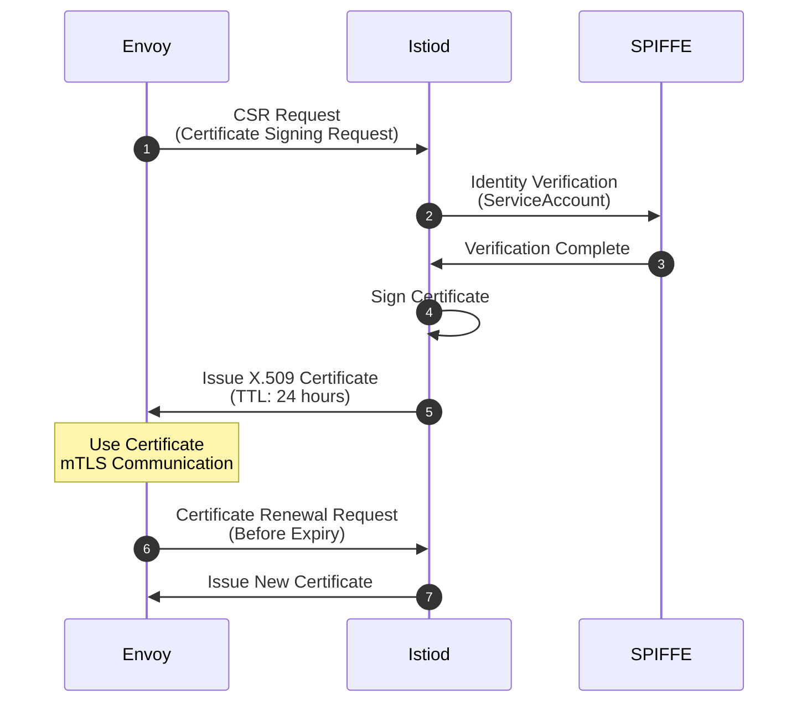

**Formato de SPIFFE ID**:

```
spiffe://cluster.local/ns/default/sa/reviews
```

#### 4. Validación de configuración (funcionalidad de Galley)

```yaml
# Invalid configuration
apiVersion: networking.istio.io/v1
kind: VirtualService
metadata:
  name: invalid
spec:
  hosts:
  - reviews
  http:
  - route:
    - destination:
        host: non-existent-service  # ❌ Non-existent service
```

Istiod valida antes de aplicar:

```bash
$ kubectl apply -f invalid-vs.yaml
Error from server: admission webhook "validation.istio.io" denied the request:
configuration is invalid: host "non-existent-service" not found
```

### Estructura de procesos de Istiod

**Implementación real en Istio 1.28**:

```bash
# Processes inside Istiod pod
$ kubectl exec -n istio-system deploy/istiod -- ps aux
USER       PID  COMMAND
istio-p+     1  /usr/local/bin/pilot-discovery discovery

# Single binary 'pilot-discovery' performs all functions
```

**Puntos clave**:

* Istiod se ejecuta como un **único binario de Go** llamado `pilot-discovery`
* Pilot, Citadel y Galley existen como **paquetes/módulos a nivel de código**, pero no son procesos independientes
* Todas las funciones se ejecutan como goroutines dentro de un único proceso

**Puertos principales proporcionados por Istiod**:

| Puerto      | Protocolo | Propósito                  | Funcionalidad             |
| --------- | -------- | ------------------------ | ------------------------- |
| **15010** | gRPC     | xDS (heredado)             | Compatibilidad con versiones anteriores    |
| **15012** | gRPC     | xDS sobre TLS             | Endpoint principal de la API xDS  |
| **15014** | HTTP     | Monitorización del Control Plane | Métricas y comprobaciones de estado |
| **15017** | HTTPS    | Webhook                  | Inyección de Sidecar         |
| **8080**  | HTTP     | Depuración                    | Interfaz de depuración       |

### Deployment de Istiod

**Configuración de alta disponibilidad**:

```yaml
apiVersion: apps/v1
kind: Deployment
metadata:
  name: istiod
  namespace: istio-system
spec:
  replicas: 3  # 3 replicas for HA
  selector:
    matchLabels:
      app: istiod
  template:
    metadata:
      labels:
        app: istiod
    spec:
      containers:
      - name: discovery
        image: istio/pilot:1.28.0
        resources:
          requests:
            cpu: 500m
            memory: 2Gi
```

**Uso típico de recursos**:

* CPU: 0.5 - 2 núcleos
* Memoria: 2 - 4 GB
* Puede gestionar miles de Services y Pods

## Data Plane: Envoy Proxy

### Arquitectura de Envoy

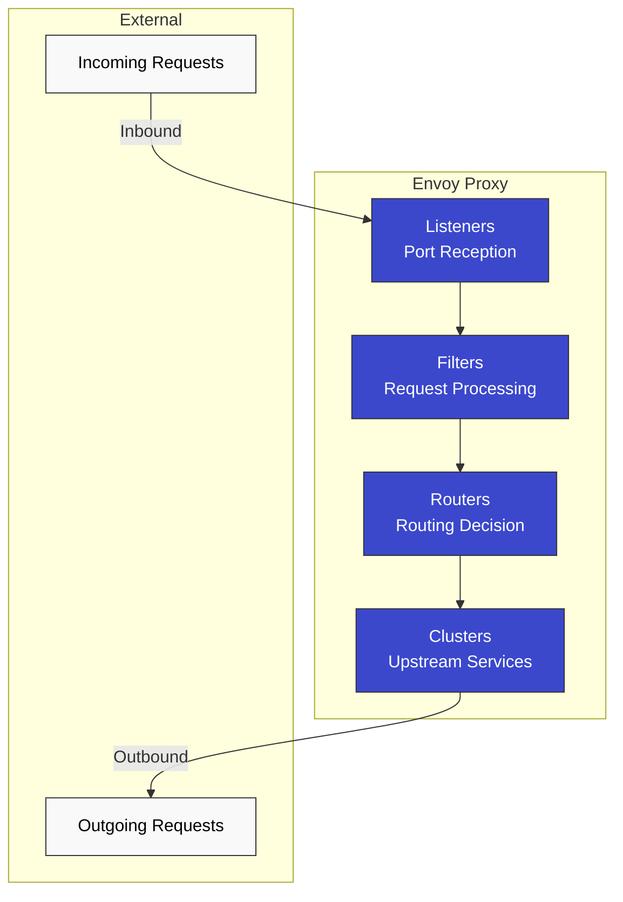

### Componentes principales de Envoy

#### 1. Listeners

**Recibe conexiones en puertos**:

```json
{
  "name": "0.0.0.0_15001",
  "address": {
    "socket_address": {
      "address": "0.0.0.0",
      "port_value": 15001
    }
  },
  "filter_chains": [...]
}
```

**Listeners predeterminados de Istio**:

* `0.0.0.0:15001`: Todo el tráfico TCP saliente
* `0.0.0.0:15006`: Todo el tráfico TCP entrante
* `0.0.0.0:15021`: Comprobación de estado
* `0.0.0.0:15090`: Métricas de Prometheus

#### 2. Filters

**Plugins que procesan solicitudes/respuestas**:

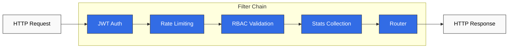

#### 3. Clusters

**Grupos lógicos de servicios upstream**:

```json
{
  "name": "outbound|9080|v1|reviews.default.svc.cluster.local",
  "type": "EDS",
  "eds_cluster_config": {
    "service_name": "outbound|9080|v1|reviews.default.svc.cluster.local"
  },
  "circuit_breakers": {...},
  "outlier_detection": {...}
}
```

#### 4. Endpoints

**Lista real de IP de Pods**:

```json
{
  "cluster_name": "outbound|9080|v1|reviews",
  "endpoints": [
    {
      "lb_endpoints": [
        {"endpoint": {"address": {"socket_address": {"address": "10.244.1.5", "port_value": 9080}}}},
        {"endpoint": {"address": {"socket_address": {"address": "10.244.2.8", "port_value": 9080}}}}
      ]
    }
  ]
}
```

### Rendimiento de Envoy

**Benchmarks** (entorno típico):

* Rendimiento: más de 10,000 RPS por núcleo
* Latencia añadida: < 1ms (P99)
* Memoria: 50-100 MB (configuración predeterminada)
* CPU: 0.1-0.5 núcleos (carga típica)

## Mecanismo de inyección de Sidecar

### Proceso de inyección

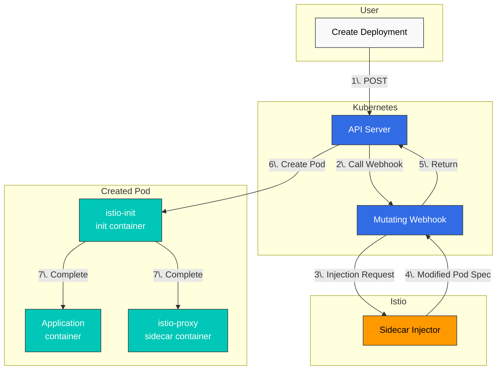

### Original frente a después de la inyección

**Deployment original**:

```yaml
apiVersion: apps/v1
kind: Deployment
metadata:
  name: reviews
spec:
  template:
    spec:
      containers:
      - name: reviews
        image: reviews:v1
        ports:
        - containerPort: 9080
```

**Después de la inyección**:

```yaml
apiVersion: v1
kind: Pod
metadata:
  annotations:
    sidecar.istio.io/status: '{"initContainers":["istio-init"],"containers":["istio-proxy"]}'
spec:
  initContainers:
  - name: istio-init
    image: istio/proxyv2:1.28.0
    command: ['istio-iptables', ...]
    securityContext:
      capabilities:
        add: [NET_ADMIN, NET_RAW]
  containers:
  - name: reviews
    image: reviews:v1
    ports:
    - containerPort: 9080
  - name: istio-proxy
    image: istio/proxyv2:1.28.0
    args: ['proxy', 'sidecar', ...]
```

### Habilitar la inyección de Sidecar

#### Inyección automática (recomendada)

**Nivel de Namespace**:

```bash
# Add label to namespace
kubectl label namespace default istio-injection=enabled

# All pods deployed to this namespace will automatically have sidecar injected
kubectl apply -f deployment.yaml
```

**Nivel de Pod** (Annotation):

```yaml
apiVersion: v1
kind: Pod
metadata:
  annotations:
    sidecar.istio.io/inject: "true"  # Enable injection per pod
spec:
  containers:
  - name: app
    image: myapp:v1
```

#### Inyección manual

Usa el comando `istioctl kube-inject` para inyectar el Sidecar directamente en archivos YAML.

```bash
# Inject sidecar into YAML file and deploy
istioctl kube-inject -f deployment.yaml | kubectl apply -f -

# Or save to file
istioctl kube-inject -f deployment.yaml -o deployment-injected.yaml
kubectl apply -f deployment-injected.yaml
```

**Escenarios para la inyección manual**:

* Entornos donde no se puede usar la inyección automática
* Cuando se necesita control explícito en pipelines de CI/CD
* Cuando se desea inspeccionar el YAML inyectado para depuración

## iptables e intercepción de tráfico

### Contenedor istio-init

**Función**: Configura reglas de iptables para redirigir el tráfico de red del Pod a Envoy Proxy

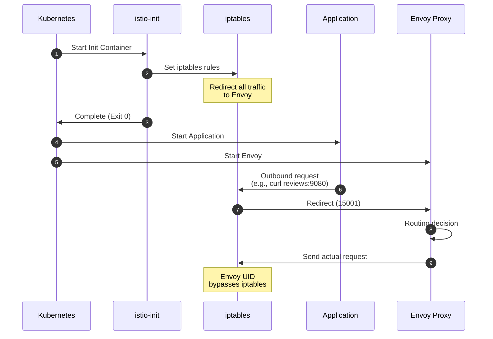

### Detalle de las reglas de iptables

**Comandos ejecutados por istio-init**:

```bash
#!/bin/bash
# istio-iptables script (simplified)

# 1. OUTPUT chain: Application outbound traffic
iptables -t nat -A OUTPUT -p tcp \
  -m owner ! --uid-owner 1337 \  # Exclude Envoy UID
  -j REDIRECT --to-port 15001     # Envoy outbound port

# 2. PREROUTING chain: Inbound traffic to pod
iptables -t nat -A PREROUTING -p tcp \
  -j REDIRECT --to-port 15006     # Envoy inbound port

# 3. Exclusion rules
# - localhost traffic
iptables -t nat -I OUTPUT -d 127.0.0.1/32 -j RETURN

# - Istiod communication (15012)
iptables -t nat -I OUTPUT -p tcp --dport 15012 -j RETURN

# - DNS (53)
iptables -t nat -I OUTPUT -p udp --dport 53 -j RETURN
```

### Flujo de tráfico (después de aplicar iptables)

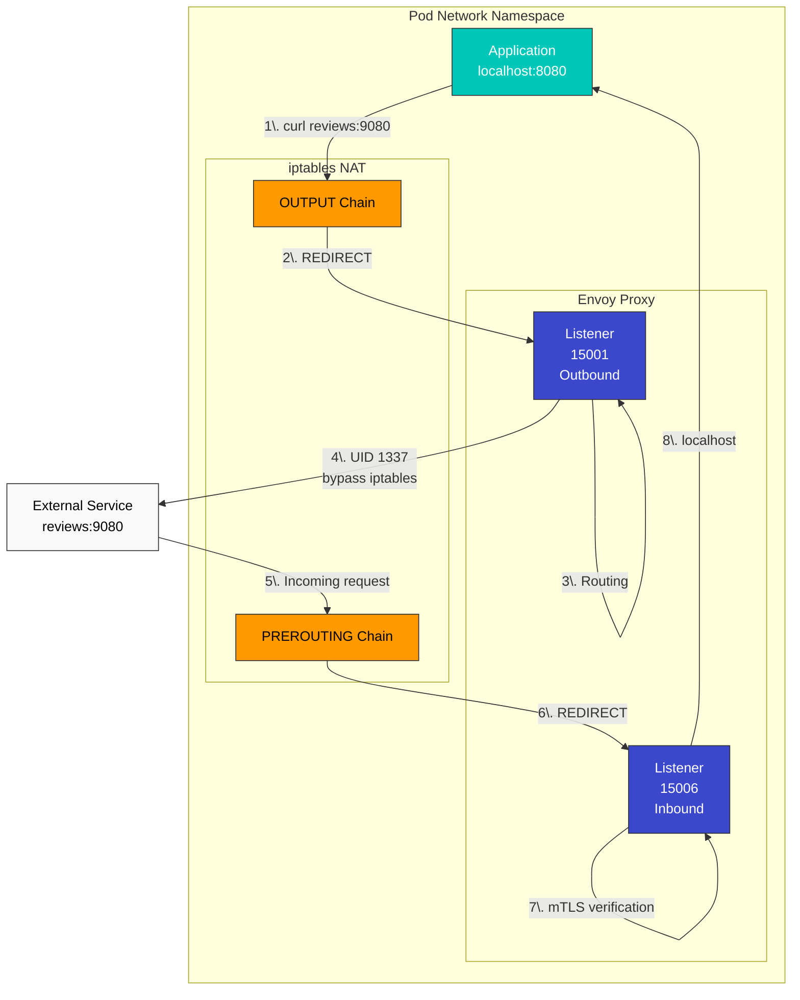

### Comprobar las reglas de iptables

**Comprobar desde dentro del Pod**:

```bash
# Enter pod
kubectl exec -it <pod-name> -c istio-proxy -- /bin/bash

# Check iptables rules
iptables -t nat -L -n -v

# OUTPUT chain
Chain OUTPUT (policy ACCEPT)
target     prot opt source     destination
ISTIO_OUTPUT  tcp  --  0.0.0.0/0  0.0.0.0/0

# ISTIO_OUTPUT detail
Chain ISTIO_OUTPUT (1 references)
RETURN     all  --  0.0.0.0/0  127.0.0.1           # Exclude localhost
RETURN     all  --  0.0.0.0/0  0.0.0.0/0           owner UID match 1337  # Exclude Envoy
REDIRECT   tcp  --  0.0.0.0/0  0.0.0.0/0           redir ports 15001  # Redirect rest

# PREROUTING chain
Chain PREROUTING (policy ACCEPT)
ISTIO_INBOUND  tcp  --  0.0.0.0/0  0.0.0.0/0

# ISTIO_INBOUND detail
Chain ISTIO_INBOUND (1 references)
REDIRECT   tcp  --  0.0.0.0/0  0.0.0.0/0           redir ports 15006
```

### iptables frente a eBPF (plugin de CNI)

Istio admite dos métodos de intercepción de tráfico:

| Método         | Ventajas           | Desventajas           | Escenario de uso                   |
| -------------- | -------------------- | ----------------------- | ------------------------------ |
| **iptables**   | Simple, universal    | Requiere Init Container | Configuración predeterminada                  |
| **eBPF (CNI)** | No necesita Init, rápido | Requiere kernel moderno  | Alto rendimiento, Ambient Mode |

## Mecanismo de procesamiento de DNS

### Funcionamiento básico de DNS de Kubernetes

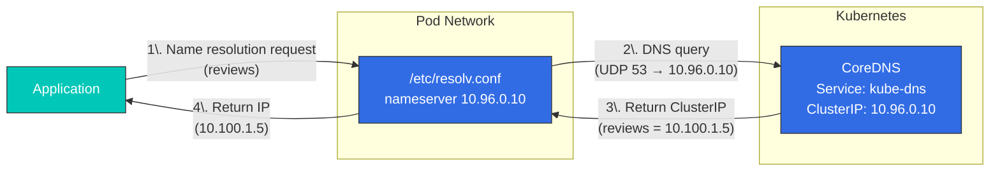

**/etc/resolv.conf** (dentro del Pod):

```bash
nameserver 10.96.0.10  # kube-dns ClusterIP
search default.svc.cluster.local svc.cluster.local cluster.local
options ndots:5
```

### Procesamiento DNS de Envoy

**En Istio, Envoy gestiona DNS**:

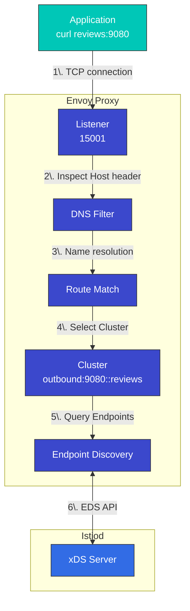

**Ventajas**:

* No se necesitan llamadas a CoreDNS (mejora del rendimiento)
* Actualizaciones dinámicas de Endpoints
* Enrutamiento avanzado (versiones, pesos, etc.)

### DNS Proxy (opcional)

**Funcionalidad DNS Proxy añadida en Istio 1.8+**:

```yaml
apiVersion: install.istio.io/v1alpha1
kind: IstioOperator
spec:
  meshConfig:
    defaultConfig:
      proxyMetadata:
        ISTIO_META_DNS_CAPTURE: "true"  # Enable DNS Proxy
```

**Funcionamiento**:

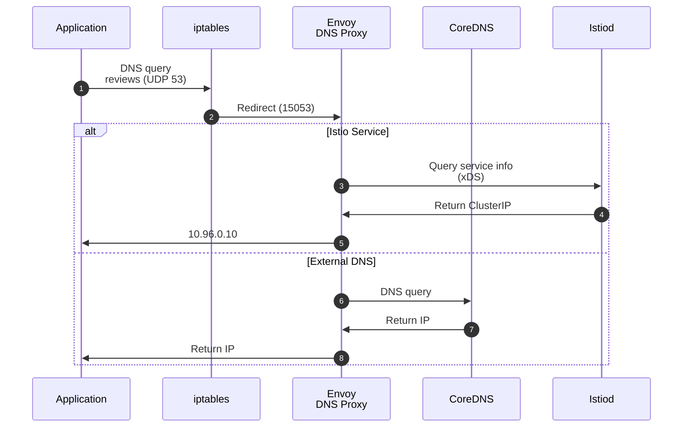

**Reglas de iptables de DNS Proxy**:

```bash
# Redirect UDP port 53 to Envoy DNS Proxy
iptables -t nat -A OUTPUT -p udp --dport 53 \
  -m owner ! --uid-owner 1337 \
  -j REDIRECT --to-port 15053
```

## Comunicación de la API xDS

### Descripción general del protocolo xDS

**xDS**: Significa Discovery Service, el protocolo de configuración dinámica de Envoy.

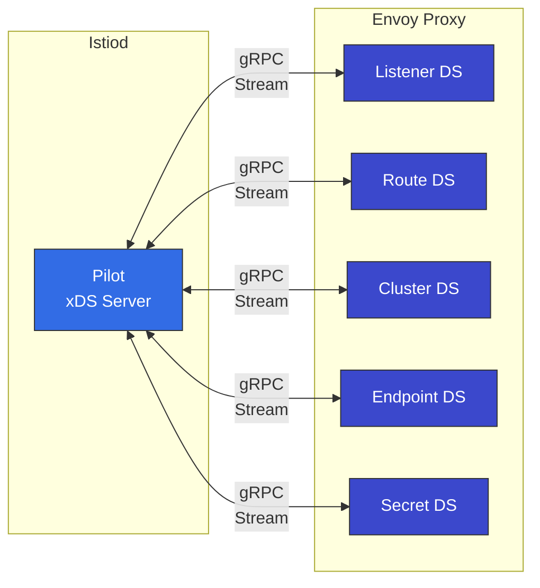

### Tipos de API xDS

| API     | Nombre               | Función                       | Ejemplo           |
| ------- | ------------------ | -------------------------- | ----------------- |
| **LDS** | Listener Discovery | Recibir configuración de puertos | 15001, 15006      |
| **RDS** | Route Discovery    | Reglas de enrutamiento HTTP         | VirtualService    |
| **CDS** | Cluster Discovery  | Servicios upstream          | DestinationRule   |
| **EDS** | Endpoint Discovery | Lista de IP de Pods                | Service Endpoints |
| **SDS** | Secret Discovery   | Certificados TLS           | Certificados mTLS |

### Flujo de comunicación xDS

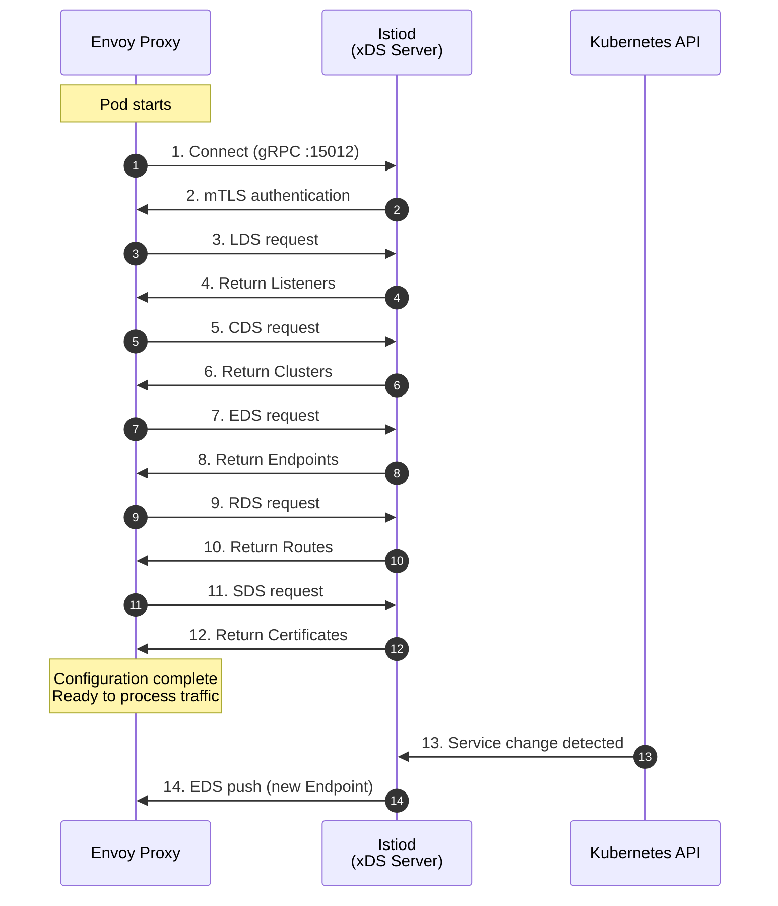

### Verificación de la comunicación xDS

**Comprobar con la API de administración de Envoy**:

```bash
# From inside pod
kubectl exec -it <pod-name> -c istio-proxy -- curl localhost:15000/config_dump

# LDS (Listeners)
kubectl exec -it <pod-name> -c istio-proxy -- \
  curl -s localhost:15000/config_dump | jq '.configs[0].dynamic_listeners'

# CDS (Clusters)
kubectl exec -it <pod-name> -c istio-proxy -- \
  curl -s localhost:15000/config_dump | jq '.configs[1].dynamic_active_clusters'

# EDS (Endpoints)
kubectl exec -it <pod-name> -c istio-proxy -- \
  curl -s localhost:15000/clusters | grep -A 5 "reviews"

# RDS (Routes)
kubectl exec -it <pod-name> -c istio-proxy -- \
  curl -s localhost:15000/config_dump | jq '.configs[2].dynamic_route_configs'
```

**Comprobar con istioctl**:

```bash
# Listener configuration
istioctl proxy-config listeners <pod-name> -n default

# Cluster configuration
istioctl proxy-config clusters <pod-name> -n default

# Endpoint configuration
istioctl proxy-config endpoints <pod-name> -n default

# Route configuration
istioctl proxy-config routes <pod-name> -n default
```

## Optimización con el recurso Sidecar

### Problema: recibir información de todos los Services

De forma predeterminada, cada Envoy recibe **información sobre todos los Services de toda la malla**:

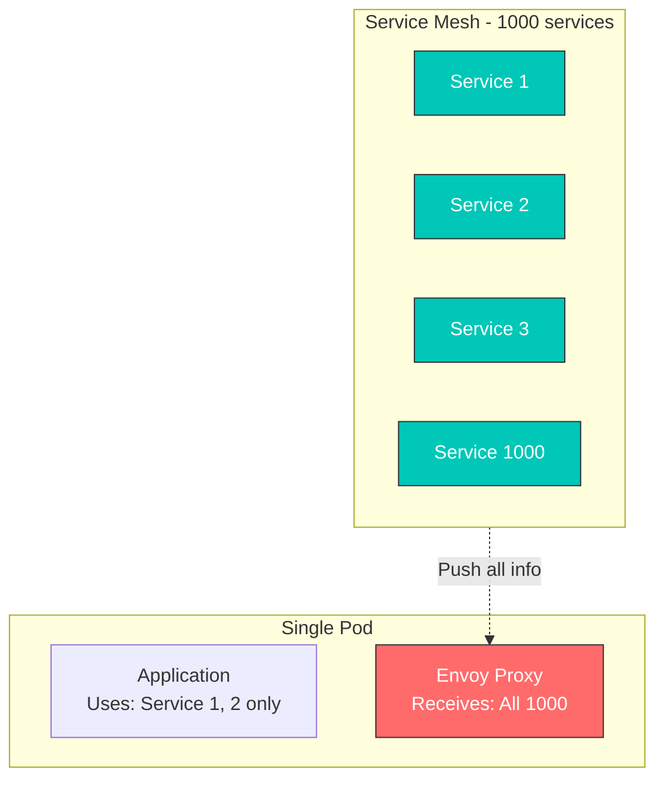

**Problemas**:

* Mayor uso de memoria
* Mayor uso de CPU (procesamiento de configuración)
* Desperdicio de ancho de banda de red
* Mayor carga en Istiod

### Solución: recurso Sidecar

Usa el **recurso Sidecar** para limitar la recepción únicamente a los Services necesarios:

```yaml
apiVersion: networking.istio.io/v1
kind: Sidecar
metadata:
  name: default
  namespace: default
spec:
  egress:
  - hosts:
    - "./*"  # All services in same namespace
    - "istio-system/*"  # All services in istio-system
    - "production/reviews"  # Only reviews in production namespace
```

### Ejemplos de recursos Sidecar

#### 1. Aislamiento de Namespace

```yaml
apiVersion: networking.istio.io/v1
kind: Sidecar
metadata:
  name: default
  namespace: team-a
spec:
  egress:
  - hosts:
    - "team-a/*"  # Own namespace only
    - "istio-system/*"  # System services
    - "shared/*"  # Shared services
```

#### 2. Acceso solo a Services específicos

```yaml
apiVersion: networking.istio.io/v1
kind: Sidecar
metadata:
  name: frontend
  namespace: default
spec:
  workloadSelector:
    labels:
      app: frontend
  egress:
  - hosts:
    - "default/reviews"
    - "default/ratings"
    - "default/details"
  - port:
      number: 443
      protocol: HTTPS
    hosts:
    - "external/*"
```

#### 3. Acceso solo a servicios externos

```yaml
apiVersion: networking.istio.io/v1
kind: Sidecar
metadata:
  name: external-only
  namespace: default
spec:
  workloadSelector:
    labels:
      app: batch-job
  egress:
  - hosts:
    - "./*"  # Same namespace
  outboundTrafficPolicy:
    mode: REGISTRY_ONLY  # Only those registered in ServiceEntry
```

### Efectos del recurso Sidecar

**Antes (sin Sidecar)**:

* 1000 Services → 1000 configuraciones de Cluster
* Memoria de Envoy: \~500 MB
* Tiempo de envío de configuración: 5-10 segundos

**Después (Sidecar aplicado)**:

* 10 Services → 10 configuraciones de Cluster
* Memoria de Envoy: \~80 MB
* Tiempo de envío de configuración: < 1 segundo

### Integración de DNS y Sidecar

```yaml
apiVersion: networking.istio.io/v1
kind: Sidecar
metadata:
  name: dns-optimized
  namespace: default
spec:
  egress:
  - hosts:
    - "default/reviews"
    - "default/ratings"
  # Envoy only handles DNS for reviews, ratings
  # Rest forwarded to CoreDNS
```

**Resultado**:

* Envoy solo resuelve `reviews`, `ratings`
* Los dominios externos como `google.com` se reenvían a CoreDNS
* Ahorro de memoria y CPU

## Referencias

### Documentación oficial

* [Arquitectura de Istio](https://istio.io/latest/docs/ops/deployment/architecture/)
* [Envoy Proxy](https://www.envoyproxy.io/docs/envoy/latest/intro/intro)
* [Protocolo xDS](https://www.envoyproxy.io/docs/envoy/latest/api-docs/xds_protocol)
* [SPIFFE](https://spiffe.io/)

### Historia y antecedentes

* [Historia del origen de Envoy - Matt Klein](https://blog.envoyproxy.io/the-universal-data-plane-api-d15cec7a)
* [Anuncio de Istio - Google Cloud Blog](https://cloud.google.com/blog/products/gcp/istio-service-mesh-for-microservices)
* [Historia de Service Mesh](https://www.nginx.com/blog/what-is-a-service-mesh/)

### Aprendizaje avanzado

* [Descripción general de la arquitectura de Envoy](https://www.envoyproxy.io/docs/envoy/latest/intro/arch_overview/arch_overview)
* [Rendimiento y escalabilidad de Istio](https://istio.io/latest/docs/ops/deployment/performance-and-scalability/)
* [Tutorial de iptables](https://www.frozentux.net/iptables-tutorial/iptables-tutorial.html)
