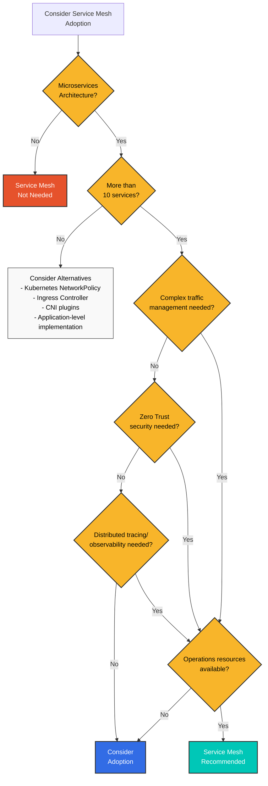
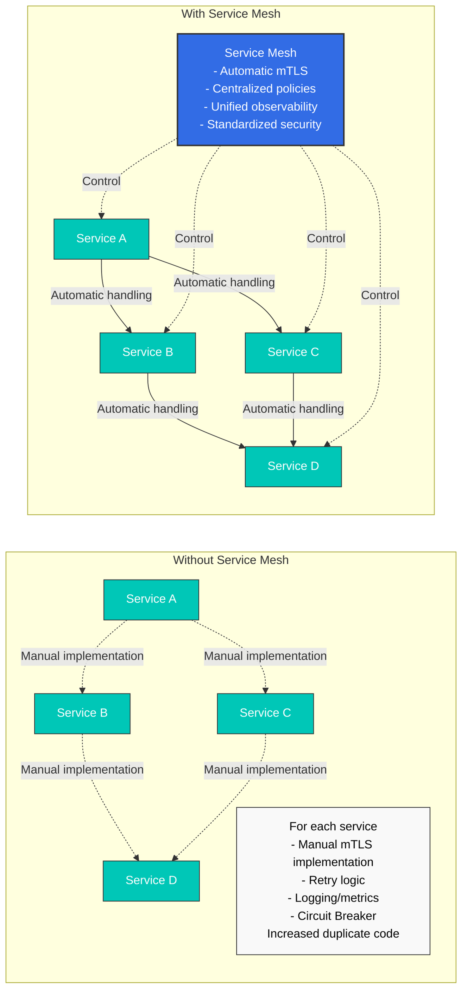
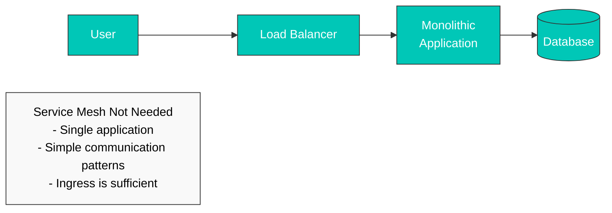
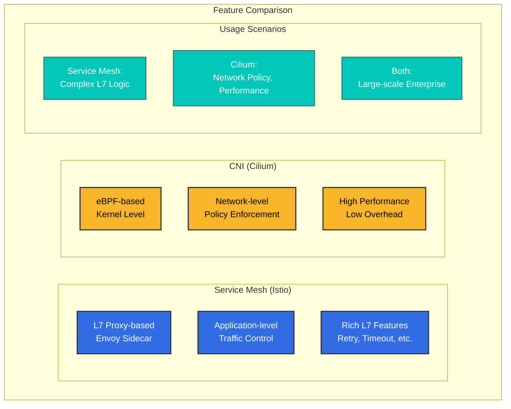
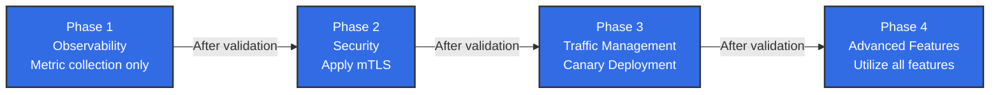
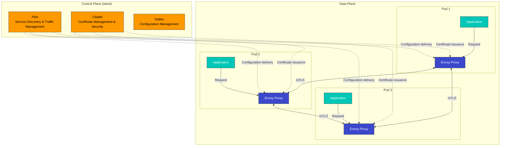

# Istio

> **Última actualización**: August 24, 2026

Una guía práctica para utilizar Istio Service Mesh en Amazon EKS.

### Actualización de agosto de 2026: Istio 1.31 entra en RC

El 19 de agosto de 2026, a 1.31.0-beta.2 le siguió el mismo día el primer candidato de lanzamiento, [1.31.0-rc.0](https://github.com/istio/istio/releases), llevando la próxima versión menor, 1.31, a la etapa de candidato de lanzamiento. Un RC es una versión previa para la validación final justo antes de GA; una señal de que el lanzamiento oficial está cerca. Continúe usando versiones GA en producción.

### Actualización de agosto de 2026: Istio 1.31 entra en Beta

El proceso de lanzamiento de la próxima versión menor, Istio 1.31, está en marcha: 1.31.0-alpha.2 se publicó el 11 de agosto de 2026, seguido de 1.31.0-beta.0 el 13 de agosto y 1.31.0-beta.1 el 14 de agosto. Las compilaciones alpha/beta son versiones previas para validación temprana, no para uso en producción; utilícelas solo si desea probar nuevas funcionalidades antes del lanzamiento GA. Consulte la [página de lanzamientos de Istio](https://github.com/istio/istio/releases) para obtener más detalles.

### Actualización de julio de 2026: lanzamientos de parches Istio 1.30.3 / 1.29.6

El 16 de julio de 2026 se publicaron los lanzamientos de parches de Istio 1.30.3 y 1.29.6. Aspectos destacados de 1.30.3:

- Se mejoró la escalabilidad de istiod en modo ambient al limitar los envíos XDS por cambios en las direcciones de workload/service únicamente a los waypoints afectados
- Se corrigió un error por el que istiod no detectaba secretos de clúster remoto actualizados (por ejemplo, durante la rotación de credenciales/tokens) hasta reiniciarse
- El nombre de taint del controlador de eliminación de taints de nodos de pilot ahora se puede personalizar mediante la variable de entorno `PILOT_NODE_UNTAINT_CONTROLLERS_TAINT_NAME`

Consulte el [anuncio oficial](https://istio.io/latest/news/releases/1.30.x/announcing-1.30.3/) para obtener más detalles.

## Tabla de contenido

1. [¿Realmente necesita un Service Mesh?](#do-you-really-need-a-service-mesh)
2. [Instalación y configuración inicial](01-installation.md)
3. [Conceptos básicos](02-basic-concepts.md)
4. [Arquitectura](03-architecture.md)
5. [Integración con AWS](04-aws-integration.md)
6. [Glosario](glossary.md)
7. [Gestión de tráfico](traffic-management/README.md)
8. [Seguridad](security/README.md)
9. [Observabilidad](observability/README.md)
10. [Resiliencia](resilience/README.md)
11. [Avanzado](advanced/README.md)
12. [Solución de problemas](troubleshooting/common-errors.md)
13. [Mejores prácticas](best-practices.md)
14. [Comparación de alternativas](comparison/README.md)

## ¿Qué es Istio?

Istio es una plataforma de service mesh de código abierto para conectar, proteger, controlar y observar microservicios. Gestiona la comunicación entre servicios en arquitecturas complejas de microservicios y proporciona control de tráfico, seguridad y observabilidad.

### Concepto de Service Mesh

<div align="center"></div>

Un service mesh es una capa de infraestructura que gestiona la comunicación entre microservicios. Istio implementa un Sidecar Proxy (Envoy) junto a cada servicio para interceptar y controlar todo el tráfico de red. Esto proporciona las siguientes capacidades sin modificar el código de la aplicación:

* **Enrutamiento de tráfico**: Enrutamiento inteligente, balanceo de carga, despliegues Canary
* **Seguridad**: mTLS automático, autenticación, autorización
* **Observabilidad**: Métricas, logs, trazabilidad distribuida
* **Resiliencia**: Circuit Breaking, Retry, Timeout

### Ejemplos de uso prácticos

<p align="center"><br><em>Aplicación sin Istio</em></p>

<p align="center"><br><em>Aplicación con Istio - Envoy Proxy implementado como Sidecar en cada servicio</em></p>

Cuando se aplica Istio, un Envoy Proxy se implementa automáticamente como contenedor sidecar en cada microservicio, interceptando y controlando de forma transparente todo el tráfico de red.

## ¿Realmente necesita un Service Mesh?

Un service mesh es una herramienta potente, pero no es adecuado para todas las situaciones. Se requiere una consideración cuidadosa antes de adoptarlo.

### Flujo de decisión



### Cuándo se necesita un Service Mesh ✅

#### 1. Entorno de microservicios complejo



**Criterios recomendados**:

* ✅ 10 o más microservicios
* ✅ Comunicación frecuente entre servicios (tráfico East-West)
* ✅ Se utilizan varios lenguajes de programación (Polyglot)
* ✅ Varios equipos desarrollan servicios de forma independiente

#### 2. Requisitos de seguridad Zero Trust

**El Service Mesh proporciona**:

* Cifrado mTLS automático entre servicios
* Gestión de identidad basada en SPIFFE
* Políticas detalladas de autenticación/autorización
* Comunicación cifrada garantizada

**Difícil de lograr sin alternativas**:

* Implementación duplicada de lógica de seguridad en cada servicio
* Complejidad de la gestión manual de certificados
* Políticas de seguridad inconsistentes

#### 3. Gestión avanzada de tráfico

```yaml
# Canary Deployment (Traffic Distribution)
apiVersion: networking.istio.io/v1
kind: VirtualService
metadata:
  name: reviews
spec:
  hosts:
  - reviews
  http:
  - route:
    - destination:
        host: reviews
        subset: v1
      weight: 90
    - destination:
        host: reviews
        subset: v2
      weight: 10  # Only 10% to new version
```

**Cuándo se necesita**:

* Despliegues Canary, pruebas A/B
* Enrutamiento basado en headers/rutas
* Traffic Mirroring (Shadow Testing)
* Fault Injection (Chaos Engineering)
* Circuit Breaking, Retry, Timeout

#### 4. Observabilidad unificada

**Ventajas del Service Mesh**:

* Recopilación automática de métricas sin modificar el código de la aplicación
* Implementación automática de Distributed Tracing
* Formato de logging unificado
* Visualización de la topología de servicios (Kiali)

### Cuándo no se necesita un Service Mesh ❌

#### 1. Arquitectura simple



**Use en su lugar**:

* Kubernetes Ingress Controller (NGINX, Traefik)
* Balanceador de carga simple
* Implementación a nivel de aplicación

#### 2. Pocos microservicios (<10)

**La sobrecarga es mayor**:

* La complejidad operativa del Service Mesh > los beneficios obtenidos
* 5-10 servicios se pueden gestionar manualmente
* NetworkPolicy proporciona seguridad suficiente

**Alternativa**:

```yaml
# Kubernetes NetworkPolicy is sufficient
apiVersion: networking.k8s.io/v1
kind: NetworkPolicy
metadata:
  name: allow-frontend-to-backend
spec:
  podSelector:
    matchLabels:
      app: backend
  ingress:
  - from:
    - podSelector:
        matchLabels:
          app: frontend
```

#### 3. Recursos operativos insuficientes

**Requisitos operativos del Service Mesh**:

* Conocimientos de Istio/Envoy
* Monitoreo y gestión del Control Plane
* Gestión de actualizaciones y parches
* Capacidad de solución de problemas (mayor complejidad de depuración)

**Preparación necesaria del equipo**:

* Al menos 1-2 expertos en Service Mesh
* Aprendizaje continuo y seguimiento de actualizaciones
* Entorno de pruebas suficiente

#### 4. Cuando el rendimiento es extremadamente crítico

**Sobrecarga del Service Mesh**:

* Latencia: +1-3 ms (P50), +5-10 ms (P99)
* CPU: +10-20 % por pod
* Memoria: +50-100 MB por pod (modo Sidecar)

**Considere alternativas**:

* Ambient Mode (reducción del 90 % en el uso de recursos)
* Soluciones basadas en CNI (Cilium)
* Optimización a nivel de aplicación

### Comparación de soluciones alternativas

| Funcionalidad                    | Service Mesh                                 | CNI (Cilium)    | Ingress Controller | Nivel de aplicación                |
| -------------------------- | -------------------------------------------- | --------------- | ------------------ | ------------------------ |
| **Gestión de tráfico L7**  | ✅ Compatibilidad completa                               | ⚠️ Limitada      | ⚠️ Solo Ingress    | ✅ Posible               |
| **Automatización de mTLS**        | ✅ Compatibilidad completa                               | ✅ Posible      | ❌ No compatible    | ❌ Implementación manual  |
| **Distributed Tracing**    | ✅ Automático                                  | ❌ No compatible | ❌ No compatible    | ⚠️ Implementación manual |
| **Políticas L3/L4**         | ✅ Compatible                                  | ✅ Compatibilidad completa  | ❌ No compatible    | ❌ No compatible          |
| **Complejidad operativa** | 🔴 Alta                                      | 🟡 Media       | 🟢 Baja             | 🟡 Media                |
| **Sobrecarga de recursos**      | <p>🔴 Alta (Sidecar)<br>🟢 Baja (Ambient)</p> | 🟢 Baja          | 🟢 Baja             | 🟢 Ninguna                  |
| **Escala adecuada**         | Más de 10 servicios                                 | Todas las escalas      | Escala pequeña        | Escala pequeña              |

### Solución basada en CNI (Cilium)

Cilium proporciona muchas funcionalidades a nivel de **red** basadas en eBPF:



**Cuándo Cilium es más adecuado**:

* Las políticas de red L3/L4 son el objetivo principal
* El alto rendimiento es un requisito fundamental
* Se desea evitar la carga operativa del Service Mesh
* Solo se necesita mTLS y observabilidad simples

**Referencia**: [Documentación de Cilium](../../networking/cilium/README.md)

### Lista de verificación de decisión

Responda las siguientes preguntas antes de adoptarlo:

**Arquitectura**:

* [ ] ¿Tiene 10 o más microservicios?
* [ ] ¿La comunicación entre servicios es compleja?
* [ ] ¿Se utilizan varios lenguajes de programación?

**Seguridad**:

* [ ] ¿Se necesita un modelo de seguridad Zero Trust?
* [ ] ¿Es obligatorio el cifrado mTLS entre servicios?
* [ ] ¿Se necesita control de acceso detallado?

**Gestión de tráfico**:

* [ ] ¿Se necesitan despliegues Canary y pruebas A/B?
* [ ] ¿Se necesitan reglas de enrutamiento avanzadas?
* [ ] ¿Se necesitan Circuit Breaking y Retry para muchos servicios?

**Observabilidad**:

* [ ] ¿Es obligatoria la trazabilidad distribuida?
* [ ] ¿Se necesita recopilación unificada de métricas?
* [ ] ¿Se necesita visualización de la topología de servicios?

**Operaciones**:

* [ ] ¿Cuenta con expertos en Service Mesh?
* [ ] ¿Puede manejar la complejidad operativa?
* [ ] ¿Puede aceptar la sobrecarga de recursos?

**Resultados**:

* ✅ 10 o más marcadas: Service Mesh muy recomendado
* 🟡 5-9 marcadas: Se necesita una evaluación cuidadosa; comience en pequeño (se recomienda Ambient Mode)
* ❌ 4 o menos marcadas: Considere soluciones alternativas (CNI, Ingress, nivel de aplicación)

### Estrategia de adopción gradual

Si determina que se necesita un Service Mesh, adóptelo gradualmente:



**Orden recomendado**:

1. **Proyecto piloto** (1-2 namespaces)
2. **Observabilidad primero** (métricas, logs, traces)
3. **Aplicar seguridad** (mTLS PERMISSIVE → STRICT)
4. **Gestión de tráfico** (VirtualService, DestinationRule)
5. **Expansión a toda la empresa**

### Funcionalidades clave

1.  **Gestión de tráfico**

    <div align="center"></div>

    * Enrutamiento inteligente y balanceo de carga
    * Pruebas A/B, despliegue Canary, despliegue Blue/Green
    * Control de Circuit Breaking, Retry y Timeout
    * Traffic Mirroring y Fault Injection
2.  **Seguridad**

    <div align="center"></div>

    * Cifrado mTLS automático entre servicios
    * Autenticación y autorización sólidas
    * Políticas de control de acceso detalladas
    * Aislamiento de red y políticas de seguridad
3.  **Observabilidad**

    <div align="center"></div>

    * Generación automática de métricas, logs y traces
    * Integración con Prometheus, Grafana, Jaeger y Kiali
    * Visualización de la topología de servicios
    * Monitoreo de tráfico en tiempo real
4. **Resiliencia**
   * Patrón Circuit Breaker
   * Rate Limiting
   * Outlier Detection
   * Zone Aware Routing

### Arquitectura de Istio

<div align="center"></div>

Istio consta de un Control Plane y un Data Plane:



**Control Plane (istiod)**:

* **Pilot**: Descubrimiento de servicios, gestión de reglas de enrutamiento de tráfico
* **Citadel**: Generación y gestión de certificados, habilitación de mTLS
* **Galley**: Validación e implementación de configuración

**Data Plane**:

* **Envoy Proxy**: Implementado como sidecar en cada pod, interceptando y controlando todo el tráfico de red

### Beneficios de usar Istio en Amazon EKS

1. **Gestión sencilla de microservicios**
   * Gestión de tráfico sin modificar el código de la aplicación
   * Aplicación coherente de políticas con configuración declarativa
   * Utiliza Kubernetes Native API
2. **Seguridad mejorada**
   * Cifrado automático entre servicios
   * Autenticación integrada con AWS IAM
   * Control detallado de permisos
3. **Observabilidad mejorada**
   * Integración con Amazon CloudWatch
   * Trazabilidad distribuida mediante AWS X-Ray
   * Métricas y logs detallados
4. **Integración con servicios de AWS**
   * Integración con Application Load Balancer (ALB)
   * Integración con AWS Certificate Manager (ACM)
   * Compatible con Amazon EBS CSI Driver

### Primeros pasos

<div align="center"></div>

Si es nuevo en Istio, lea los documentos en el siguiente orden:

1. [**Instalación y configuración inicial**](01-installation.md): Instale Istio en el clúster EKS
2. [**Conceptos básicos**](02-basic-concepts.md): Comprenda los conceptos fundamentales de Istio
3. [**Gestión de tráfico**](traffic-management/README.md): Aprenda sobre Gateway, VirtualService y DestinationRule
4. [**Seguridad**](security/README.md): Configure mTLS, autenticación y autorización
5. [**Observabilidad**](observability/README.md): Recopile métricas, logs y traces
6. [**Mejores prácticas**](best-practices.md): Recomendaciones para entornos de producción

### Ejemplos prácticos

Cada sección incluye ejemplos YAML funcionales. Todos los ejemplos están estructurados para poder copiarlos con un clic:

```yaml
# Example VirtualService
apiVersion: networking.istio.io/v1
kind: VirtualService
metadata:
  name: reviews
spec:
  hosts:
  - reviews
  http:
  - route:
    - destination:
        host: reviews
        subset: v1
```

### Referencias

* [Documentación oficial de Istio](https://istio.io/latest/docs/)
* [Istio GitHub](https://github.com/istio/istio)
* [AWS EKS Workshop - Istio](https://www.eksworkshop.com/intermediate/330_servicemesh_using_istio/)
* [Comunidad de Istio](https://discuss.istio.io/)

### Cuestionarios

Para poner a prueba lo aprendido en este capítulo, pruebe los siguientes cuestionarios:

* [Cuestionario de gestión de tráfico](../../quizzes/service-mesh/istio/traffic-management.md)
* [Cuestionario de seguridad](../../quizzes/service-mesh/istio/security.md)
* [Cuestionario de observabilidad](../../quizzes/service-mesh/istio/observability.md)
* [Cuestionario de resiliencia](../../quizzes/service-mesh/istio/resilience.md)
* [Cuestionario avanzado](../../quizzes/service-mesh/istio/advanced.md)
