# Ambient Mode

Ambient Mode es una arquitectura innovadora del plano de datos introducida en Istio 1.28. Reduce la complejidad y la sobrecarga de recursos del enfoque Sidecar tradicional, a la vez que proporciona la funcionalidad principal de Service Mesh.

## Tabla de contenido

1. [Descripción general](#overview)
2. [Sidecar Mode frente a Ambient Mode](#sidecar-mode-vs-ambient-mode)
3. [Arquitectura](#architecture)
4. [Instalación y configuración](#installation-and-configuration)
5. [Migración](#migration)
6. [Comparación de rendimiento](#performance-comparison)
7. [Casos de uso](#use-cases)
8. [Solución de problemas](#troubleshooting)

## Descripción general

<p align="center">
  
</p>

Ambient Mode es un nuevo enfoque que proporciona funcionalidad de Service Mesh sin inyectar proxies Sidecar en los pods de aplicaciones. Como se muestra en el diagrama anterior, Ambient Mode consta de una **arquitectura en capas**:

1. **Capa de superposición segura (L4)**: mTLS y telemetría básica mediante ztunnel
2. **Capa de procesamiento L7**: Gestión avanzada del tráfico mediante Waypoint Proxy

### ¿Por qué se necesita Ambient Mode?

Limitaciones del modelo Sidecar tradicional:
- **Alta sobrecarga de recursos**: Cada pod requiere un proxy Envoy (50-100 MB de memoria)
- **Complejidad operativa**: Los reinicios de pods, la gestión de versiones y las actualizaciones continuas son complejos
- **Latencia inicial**: El tiempo de inicio del pod aumenta debido a la inicialización de Sidecar
- **Funcionalidad excesiva**: La mayoría de las cargas de trabajo no utilizan características L7

Soluciones de Ambient Mode:
- Un proxy por nodo: Más del 90 % de reducción en el uso de recursos
- No se requiere reiniciar pods: Adopción de Service Mesh sin tiempo de inactividad
- Adopción gradual: Amplíe de L4 a L7 según sea necesario
- Integración transparente: Sin cambios en el código de la aplicación

### Conceptos principales

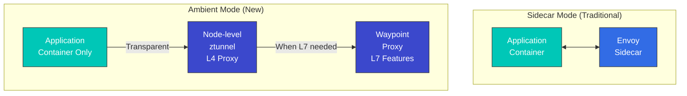

### Ventajas de Ambient Mode

1. **Bajo uso de recursos**: Un proxy por nodo en lugar de por pod
2. **Despliegue simple**: No se requiere reiniciar pods
3. **Adopción transparente**: Sin cambios en la aplicación
4. **Características L7 flexibles**: Use Waypoint solo cuando sea necesario

## Sidecar Mode frente a Ambient Mode

### Comparación de arquitectura

#### Sidecar Mode

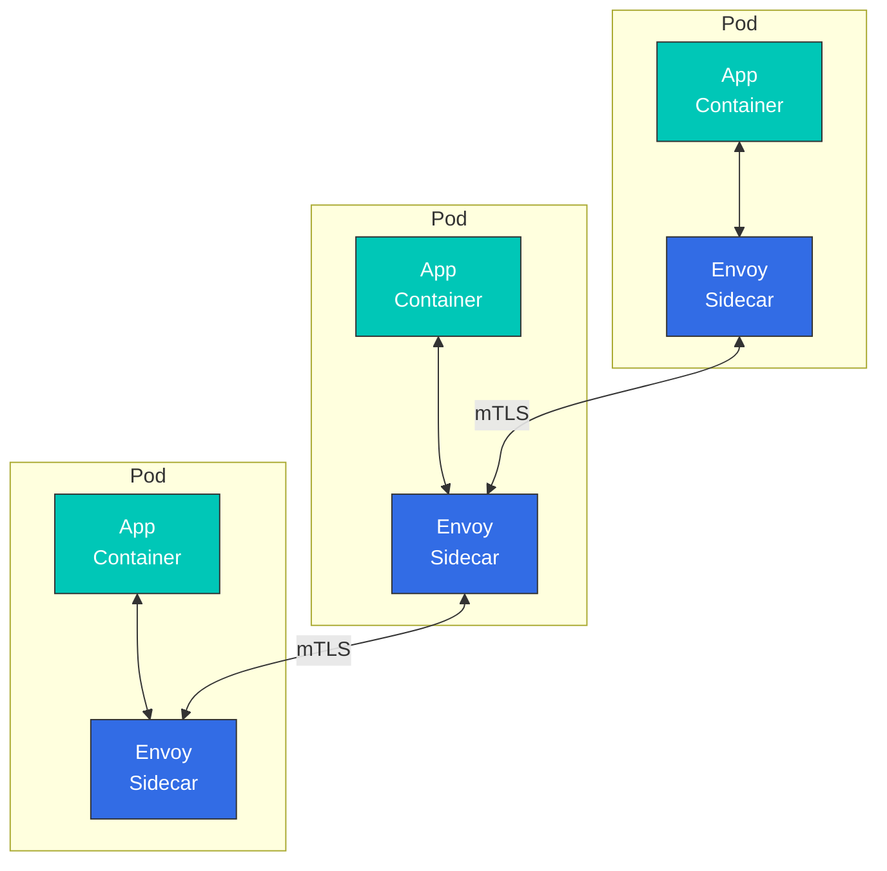

**Características**:
- Proxy Envoy inyectado en cada pod
- Compatibilidad con todas las características L4/L7
- Alto uso de recursos
- Se requiere reiniciar pods

#### Ambient Mode

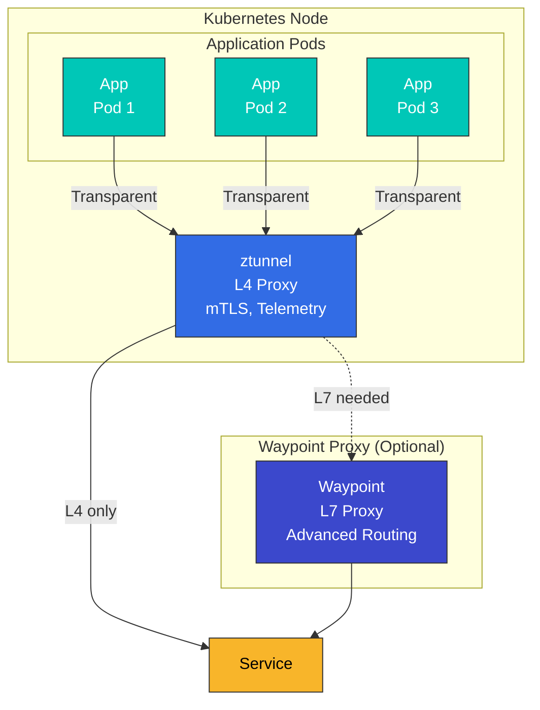

**Características**:
- Un ztunnel por nodo
- Características L4 proporcionadas de forma predeterminada
- Las características L7 requieren Waypoint
- No se requiere reiniciar pods

### Tabla de comparación detallada

| Elemento | Sidecar Mode | Ambient Mode |
|------|-------------|--------------|
| **Método de despliegue** | Inyección de Sidecar en el pod | ztunnel a nivel de nodo + Waypoint opcional |
| **Uso de recursos** | Alto (~50-100 MB por pod) | Bajo (~50 MB por nodo) |
| **Reinicio de pods** | Obligatorio | No obligatorio |
| **Latencia inicial** | Presente (inicialización de Sidecar) | Mínima |
| **Características L4** | Compatibles | Compatibles |
| **Características L7** | Totalmente compatibles | Requieren Waypoint |
| **mTLS** | Automático | Automático |
| **Telemetría** | Detallada | Básica (L4), detallada (L7 con Waypoint) |
| **Circuit Breaker** | Compatible | Requiere Waypoint |
| **Retry/Timeout** | Compatible | Requiere Waypoint |
| **Manipulación de encabezados** | Compatible | Requiere Waypoint |
| **Sobrecarga de rendimiento** | Media (~5-10 %) | Baja (~1-3 %) |
| **Complejidad operativa** | Alta | Baja |
| **Preparación para producción** | Madura | Beta (Istio 1.28+) |

### Comparación del uso de recursos

```yaml
# Sidecar Mode
# 100 pods x 50MB = 5GB memory
# 100 pods x 0.1 CPU = 10 vCPU

# Ambient Mode
# 10 nodes x 50MB = 500MB memory (ztunnel)
# + Waypoint (when needed): 200MB memory
# Total: ~700MB memory
```

## Arquitectura

<p align="center">
  
</p>

El plano de datos de Ambient Mode consta de dos componentes principales: **ztunnel** y **Waypoint Proxy**.

### ztunnel (Zero Trust Tunnel)

<p align="center">
  
</p>

ztunnel es el componente principal de Ambient Mode, un **proxy L4 ligero que se ejecuta a nivel de nodo**. Se despliega como un DaemonSet en cada nodo de Kubernetes y gestiona de forma transparente todo el tráfico de los pods de ese nodo.

#### Cómo funciona ztunnel

1. **Captura de tráfico**: Intercepta de forma transparente el tráfico de red de los pods mediante el plugin CNI y eBPF
2. **Aplicación de mTLS**: Aplica automáticamente cifrado mTLS mediante Identity basada en SPIFFE
3. **Balanceo de carga**: Realiza balanceo de carga L4 entre endpoints
4. **Recopilación de telemetría**: Recopila métricas y logs de conexión
5. **Reenvío**: Reenvía el tráfico al ztunnel de destino o a Waypoint

**Stack tecnológico de ztunnel**:
- **Lenguaje**: Rust (alto rendimiento, bajo uso de memoria)
- **Protocolo**: HBONE (HTTP-Based Overlay Network Environment)
- **Identity**: Compatible con el estándar SPIFFE/SPIRE
- **CNI**: Integración estrecha con el plugin Istio CNI

#### Función de ztunnel

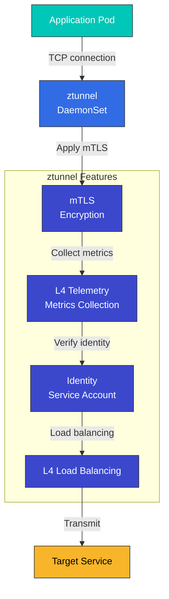

**Características de ztunnel**:
- Escrito en Rust (optimizado para el rendimiento)
- Desplegado como DaemonSet
- Integrado con el plugin CNI
- Redirección de tráfico basada en eBPF

#### Despliegue de ztunnel

```yaml
apiVersion: apps/v1
kind: DaemonSet
metadata:
  name: ztunnel
  namespace: istio-system
spec:
  selector:
    matchLabels:
      app: ztunnel
  template:
    metadata:
      labels:
        app: ztunnel
    spec:
      hostNetwork: true
      containers:
      - name: istio-proxy
        image: istio/ztunnel:1.28.0
        securityContext:
          privileged: true
          capabilities:
            add:
            - NET_ADMIN
            - SYS_ADMIN
        resources:
          requests:
            cpu: 100m
            memory: 50Mi
          limits:
            cpu: 200m
            memory: 100Mi
```

### Waypoint Proxy

<p align="center">
  
</p>

Waypoint es un **proxy opcional que se utiliza cuando se necesitan características L7**. Como se muestra en el diagrama anterior, Waypoint se coloca delante de los servicios para proporcionar características avanzadas de gestión del tráfico.

#### Características principales de Waypoint

1. **Despliegue selectivo**: Se utiliza solo para servicios que necesitan características L7, no para todos los servicios
2. **Proxy compartido**: Varias cargas de trabajo comparten un único Waypoint (por Namespace o ServiceAccount)
3. **Basado en Envoy**: Utiliza el mismo proxy Envoy que el Sidecar tradicional y admite todas las características L7 de Istio
4. **Bajo demanda**: Se puede agregar o eliminar dinámicamente en tiempo de ejecución

#### Unidades de despliegue de Waypoint

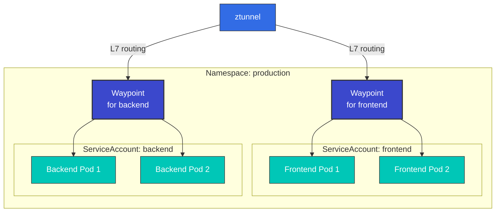

**Opciones de despliegue**:
- **Basado en ServiceAccount**: Solo los pods con una SA específica utilizan el Waypoint correspondiente
- **Basado en Namespace**: Todos los pods de todo el Namespace utilizan un único Waypoint
- **Basado en carga de trabajo**: Se aplica solo a cargas de trabajo específicas (Deployment, StatefulSet, etc.)

#### Función de Waypoint

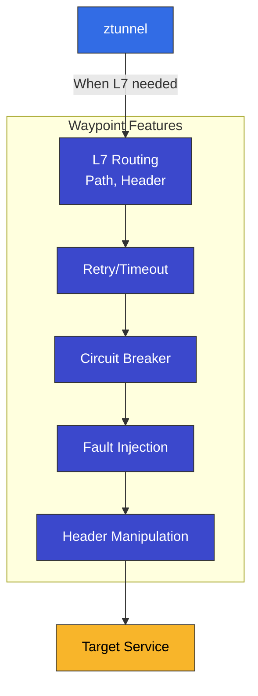

**Características de Waypoint**:
- Desplegado por Service Account o por Namespace
- Basado en el proxy Envoy
- Admite todas las características L7 de Istio
- Uso selectivo únicamente para los servicios necesarios

#### Despliegue de Waypoint

```yaml
apiVersion: gateway.networking.k8s.io/v1
kind: Gateway
metadata:
  name: reviews-waypoint
  namespace: default
spec:
  gatewayClassName: istio-waypoint
  listeners:
  - name: mesh
    port: 15008
    protocol: HBONE
```

### Flujo de tráfico completo

A continuación se muestra un diagrama completo de cómo fluye el tráfico en Ambient Mode **sin Sidecars**:

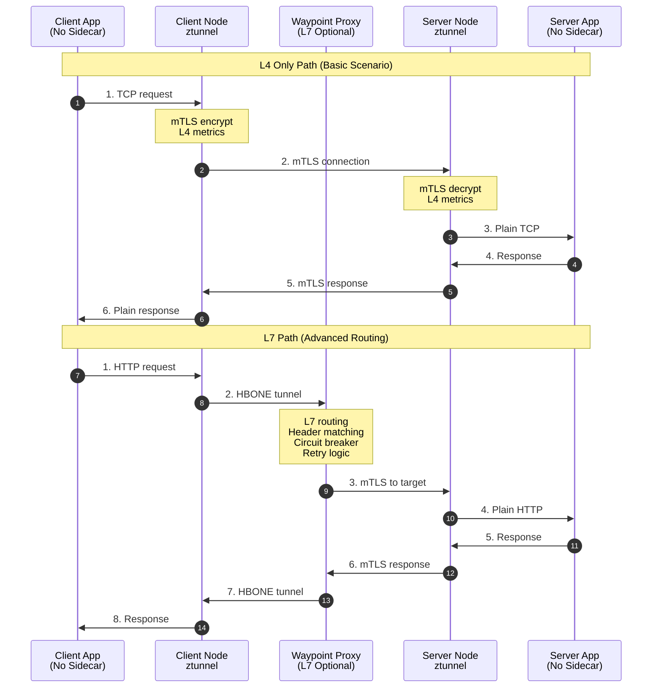

**Análisis del flujo de tráfico**:

1. **Ruta solo L4** (usando únicamente ztunnel):
   - Latencia mínima (~1 ms)
   - mTLS aplicado automáticamente
   - Telemetría básica
   - Suficiente para el 80-90 % de las cargas de trabajo

2. **Ruta L7** (ztunnel + Waypoint):
   - Enrutamiento basado en encabezados
   - Circuit Breaking
   - Retry/Timeout
   - Cuando se necesitan políticas de tráfico complejas

### Protocolo HBONE

<p align="center">
  
</p>

**HBONE (HTTP-Based Overlay Network Environment)** es el protocolo de tunelización utilizado en Ambient Mode:

- **Basado en HTTP/2**: Compatibilidad con la infraestructura existente
- **mTLS integrado**: Comunicación segura
- **Eficiente**: Sobrecarga mínima
- **Compatible con firewalls**: Utiliza puertos HTTP/2 estándar

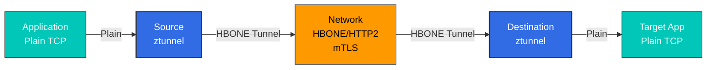

## Instalación y configuración

### 1. Instalación de Istio (Ambient Mode)

```bash
# Download Istio
curl -L https://istio.io/downloadIstio | ISTIO_VERSION=1.28.0 sh -
cd istio-1.28.0
export PATH=$PWD/bin:$PATH

# Install with Ambient profile
istioctl install --set profile=ambient -y

# Verify installation
kubectl get pods -n istio-system
# Output:
# NAME                                   READY   STATUS
# istio-cni-node-xxxxx                   1/1     Running
# istiod-xxxxx                           1/1     Running
# ztunnel-xxxxx                          1/1     Running
```

### 2. Habilitar Ambient Mode para un Namespace

```bash
# Enable Ambient Mode with Label
kubectl label namespace default istio.io/dataplane-mode=ambient

# Verify
kubectl get namespace default -o yaml | grep istio.io/dataplane-mode
```

### 3. Desplegar la aplicación

```yaml
# Normal Deployment (No Sidecar needed)
apiVersion: apps/v1
kind: Deployment
metadata:
  name: reviews
  namespace: default
spec:
  replicas: 3
  selector:
    matchLabels:
      app: reviews
  template:
    metadata:
      labels:
        app: reviews
    spec:
      containers:
      - name: reviews
        image: istio/examples-bookinfo-reviews-v1:1.17.0
        ports:
        - containerPort: 9080
```

### 4. Desplegar Waypoint Proxy (opcional)

```bash
# Create Waypoint per Service Account
istioctl x waypoint apply --service-account reviews

# Or per Namespace Waypoint
istioctl x waypoint apply --namespace default

# Verify Waypoint
kubectl get gateway -n default
```

### 5. Usar características L7

```yaml
# VirtualService (using Waypoint)
apiVersion: networking.istio.io/v1
kind: VirtualService
metadata:
  name: reviews
  namespace: default
spec:
  hosts:
  - reviews
  http:
  - match:
    - headers:
        end-user:
          exact: jason
    route:
    - destination:
        host: reviews
        subset: v2
  - route:
    - destination:
        host: reviews
        subset: v1
---
# DestinationRule
apiVersion: networking.istio.io/v1
kind: DestinationRule
metadata:
  name: reviews
spec:
  host: reviews
  subsets:
  - name: v1
    labels:
      version: v1
  - name: v2
    labels:
      version: v2
```

## Migración

### De Sidecar Mode a Ambient Mode

#### Migración paso a paso

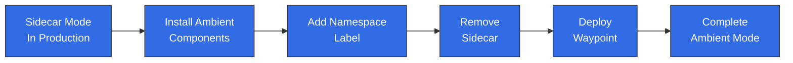

#### Paso 1: Instalar los componentes de Ambient

```bash
# If existing Istio is installed
istioctl install --set profile=ambient --skip-confirmation

# Verify ztunnel and CNI
kubectl get daemonset -n istio-system
```

#### Paso 2: Aplicar al Namespace de prueba

```bash
# Create test namespace
kubectl create namespace test-ambient

# Enable Ambient Mode
kubectl label namespace test-ambient istio.io/dataplane-mode=ambient

# Deploy test application
kubectl apply -f samples/sleep/sleep.yaml -n test-ambient
```

#### Paso 3: Verificación

```bash
# Verify mTLS is working
kubectl exec -n test-ambient deploy/sleep -- curl -s http://httpbin:8000/headers

# Check Telemetry
kubectl logs -n istio-system -l app=ztunnel | grep test-ambient
```

#### Paso 4: Cambiar el Namespace de producción

```bash
# Add Label to existing Namespace
kubectl label namespace default istio.io/dataplane-mode=ambient

# Restart pods (remove Sidecar)
kubectl rollout restart deployment -n default

# Verify Sidecar removal
kubectl get pods -n default -o jsonpath='{.items[*].spec.containers[*].name}' | grep -v istio-proxy
```

#### Paso 5: Desplegar Waypoint (cuando se necesitan características L7)

```bash
# Waypoint per Service Account
for sa in $(kubectl get sa -n default -o name); do
  istioctl x waypoint apply --service-account ${sa#serviceaccount/} -n default
done
```

### Estrategia de reversión

```bash
# Rollback from Ambient to Sidecar

# 1. Remove Namespace Label
kubectl label namespace default istio.io/dataplane-mode-

# 2. Enable Sidecar Injection
kubectl label namespace default istio-injection=enabled

# 3. Restart pods
kubectl rollout restart deployment -n default

# 4. Remove Waypoint
kubectl delete gateway -n default --all
```

## Comparación de rendimiento

<p align="center">
  
</p>

### Resultados de benchmarks

El gráfico anterior muestra los resultados de las pruebas oficiales de rendimiento de Istio y demuestra que Ambient Mode tiene un **uso de recursos significativamente menor** en comparación con Sidecar Mode.

| Métrica | Sidecar Mode | Ambient Mode (solo ztunnel) | Ambient Mode (con Waypoint) |
|--------|-------------|---------------------------|---------------------------|
| **Memoria/Pod** | ~50-100 MB | ~1-2 MB | ~1-2 MB (app) + Waypoint compartido |
| **CPU/Pod** | ~0.1 vCPU | ~0.01 vCPU | ~0.01 vCPU (app) + Waypoint compartido |
| **Latencia (P50)** | +2-3 ms | +0.5-1 ms | +2-3 ms |
| **Latencia (P99)** | +5-10 ms | +1-2 ms | +5-10 ms |
| **Throughput** | -5-10 % | -1-3 % | -5-10 % |

### Visualización del uso de recursos

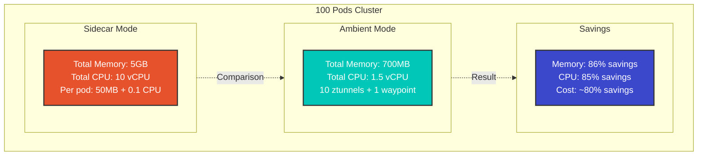

### Cálculo del ahorro de recursos

```python
# Example with 100 pod cluster

# Sidecar Mode
sidecar_memory = 100 * 50  # 5000MB = 5GB
sidecar_cpu = 100 * 0.1    # 10 vCPU

# Ambient Mode (10 nodes)
ambient_memory = 10 * 50 + 200  # 700MB (ztunnel + 1 waypoint)
ambient_cpu = 10 * 0.1 + 0.5    # 1.5 vCPU

# Savings
memory_saved = sidecar_memory - ambient_memory  # 4300MB (~86%)
cpu_saved = sidecar_cpu - ambient_cpu          # 8.5 vCPU (~85%)
```

## Casos de uso

### ¿Cuándo debería elegir Ambient Mode?

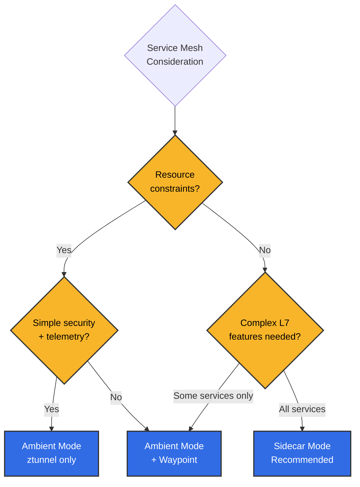

**Escenarios recomendados para Ambient Mode**:
- Cientos o más microservicios
- La optimización de costos de recursos es importante
- La mayoría de los servicios solo necesita comunicación simple
- Solo algunos servicios necesitan enrutamiento avanzado
- Se busca minimizar la complejidad operativa

**Escenarios recomendados para Sidecar Mode**:
- Todos los servicios necesitan características L7
- Se necesita una solución madura y probada
- Se necesita control detallado por servicio
- Gestión de versiones de proxy independiente por pod

### 1. Cuando solo se necesitan características L4

```yaml
# Using ztunnel only (Waypoint not needed)
apiVersion: v1
kind: Namespace
metadata:
  name: backend
  labels:
    istio.io/dataplane-mode: ambient
---
apiVersion: apps/v1
kind: Deployment
metadata:
  name: database
  namespace: backend
spec:
  replicas: 3
  # ... (normal Deployment)
```

**Beneficios**:
- mTLS aplicado automáticamente
- Telemetría básica
- Uso mínimo de recursos

### 2. Uso selectivo de características L7

```yaml
# Only specific Service uses Waypoint
apiVersion: gateway.networking.k8s.io/v1
kind: Gateway
metadata:
  name: frontend-waypoint
  namespace: frontend
spec:
  gatewayClassName: istio-waypoint
  listeners:
  - name: mesh
    port: 15008
    protocol: HBONE
---
apiVersion: v1
kind: ServiceAccount
metadata:
  name: frontend
  namespace: frontend
  labels:
    istio.io/use-waypoint: frontend-waypoint
```

### 3. Migración gradual

```bash
# Step-by-step migration
# 1. Non-critical services
kubectl label namespace dev istio.io/dataplane-mode=ambient

# 2. Testing
kubectl label namespace staging istio.io/dataplane-mode=ambient

# 3. Production (one by one)
kubectl label namespace prod-backend istio.io/dataplane-mode=ambient
kubectl label namespace prod-frontend istio.io/dataplane-mode=ambient
```

## Solución de problemas

### ztunnel no funciona

```bash
# Check ztunnel status
kubectl get daemonset -n istio-system ztunnel
kubectl logs -n istio-system -l app=ztunnel

# Check CNI
kubectl get daemonset -n istio-system istio-cni-node
kubectl logs -n istio-system -l k8s-app=istio-cni-node
```

### El tráfico no llega a Waypoint

```bash
# Check Waypoint status
kubectl get gateway -n <namespace>

# Verify Waypoint connection to Service Account
kubectl get sa <sa-name> -n <namespace> -o yaml | grep use-waypoint

# Check Envoy configuration
istioctl proxy-config clusters <waypoint-pod> -n <namespace>
```

## Referencias

### Documentación oficial
- [Documentación oficial de Istio Ambient Mode](https://istio.io/latest/docs/ops/ambient/)
- [Blog de introducción a Ambient Mode](https://istio.io/latest/blog/2022/introducing-ambient-mesh/)
- [Primeros pasos con Ambient Mode](https://istio.io/latest/docs/ops/ambient/getting-started/)
- [Repositorio de GitHub de ztunnel](https://github.com/istio/ztunnel)

### Recursos técnicos
- [Explicación detallada de la arquitectura de Ambient Mesh](https://istio.io/latest/blog/2022/ambient-security/)
- [Explicación del protocolo HBONE](https://istio.io/latest/blog/2022/get-started-ambient/)
- [Benchmarks de rendimiento](https://istio.io/latest/blog/2022/ambient-performance/)

### Comunidad
- [Istio Discuss - Ambient Mode](https://discuss.istio.io/c/ambient/47)
- [Istio Slack #ambient-mesh](https://istio.slack.com/)

### Recursos de comparación

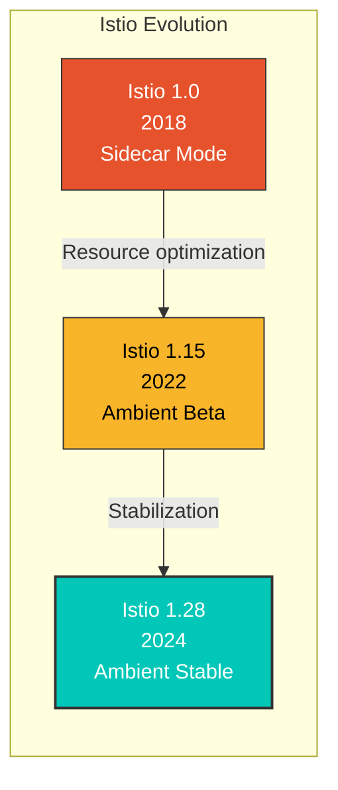

**Estado de uso en producción** (a partir de 2024):
- Solo.io: Migró clústeres internos completos a Ambient Mode
- Empresas financieras: Aplicaron Ambient Mode a miles de microservicios (reducción de costos del 80 %)
- Comercio electrónico: Operación híbrida con ztunnel L4 + Waypoint selectivo

**Hoja de ruta de características principales**:
- 1.28 (2024 T1): Ambient Mode GA (General Availability)
- 1.29 (2024 T2): Compatibilidad con Ambient en múltiples clústeres
- 1.30+ (2024 T3+): Integración completa de Gateway API, optimización del rendimiento

## Resumen

Ambient Mode es una arquitectura innovadora que muestra la dirección futura de Istio:

| Característica | Descripción | Beneficio |
|---------|-------------|---------|
| **Eliminación de Sidecar** | No se necesita un proxy por pod | 90 % de ahorro de recursos |
| **Arquitectura de 2 capas** | L4 (ztunnel) + L7 (Waypoint) | Selección flexible de características |
| **Adopción transparente** | No se requiere reiniciar pods | Adopción sin tiempo de inactividad |
| **Migración gradual** | Transición por Namespace | Transición segura |
| **Protocolo HBONE** | Tunelización basada en HTTP/2 | Compatible con firewalls |

Ambient Mode proporciona eficiencia de recursos y simplificación operativa, especialmente en **entornos de microservicios a gran escala**, y permite una implementación de **Service Mesh rentable** al desplegar Waypoint de forma selectiva solo para los servicios que necesitan características L7.
