# Multi-cluster

> **Versiones compatibles**: Istio 1.18+ **Última actualización**: February 23, 2026 **Compatibilidad con Kubernetes**: 1.32+

Multi-cluster Service Mesh conecta varios clústeres de Kubernetes en una malla de servicios unificada.

## Tabla de contenidos

1. [¿Realmente necesitas Multi-cluster?](02-multi-cluster.md#do-you-really-need-multi-cluster)
2. [Guía de selección de arquitectura](02-multi-cluster.md#architecture-selection-guide)
3. [Istio vs AWS VPC Lattice](02-multi-cluster.md#istio-vs-aws-vpc-lattice)
4. [Topología](02-multi-cluster.md#topology)
5. [Configuración Primary-Remote](02-multi-cluster.md#primary-remote-setup)
6. [Configuración Multi-Primary](02-multi-cluster.md#multi-primary-setup)
7. [Comunicación entre clústeres](02-multi-cluster.md#cross-cluster-communication)
8. [Uso con VPC Lattice](02-multi-cluster.md#using-with-vpc-lattice)
9. [Ejemplos prácticos](02-multi-cluster.md#practical-examples)
10. [Comparación de rendimiento y costos](02-multi-cluster.md#performance-and-cost-comparison)
11. [Solución de problemas](02-multi-cluster.md#troubleshooting)

## ¿Realmente necesitas Multi-cluster?

Multi-cluster Service Mesh es potente, pero aumenta la complejidad y el costo. Se necesita una consideración cuidadosa antes de adoptarlo.

### Flujo de decisión

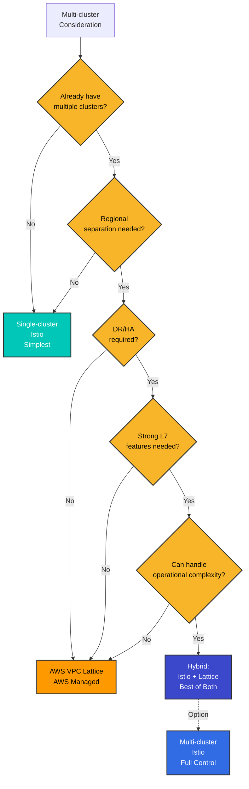

### Cuándo se necesita Multi-cluster

#### 1. Distribución geográfica y optimización de latencia

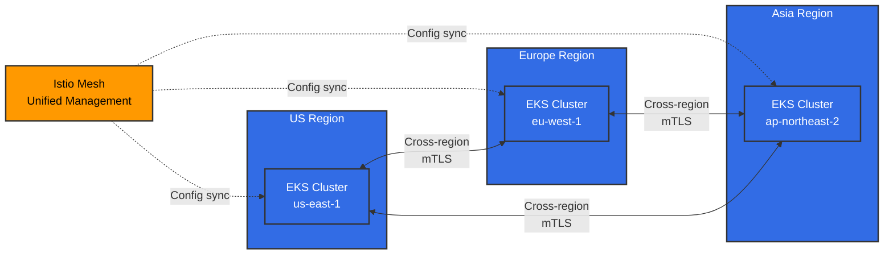

**Cuándo se necesita**:

* Servicios globales orientados al usuario (objetivo de latencia <100ms)
* Cumplimiento de soberanía de datos (GDPR, localización de datos financieros)
* Enrutamiento de tráfico regional y aislamiento de fallas

#### 2. Recuperación ante desastres (DR)

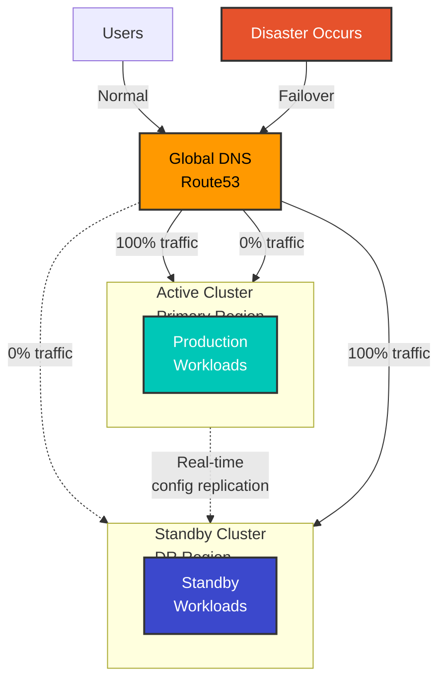

**Cuándo se necesita**:

* RTO (objetivo de tiempo de recuperación) <1 hora
* RPO (objetivo de punto de recuperación) <15 minutos
* Failover automático ante fallas regionales

#### 3. Separación de entornos y despliegue por etapas

**Cuándo se necesita**:

* Separación de clústeres Dev/Staging/Prod con gestión unificada
* Despliegues Blue/Green a nivel de clúster
* Despliegues Canary con expansión regional gradual

#### 4. Límites organizacionales y aislamiento de seguridad

**Cuándo se necesita**:

* Operación de clústeres independiente por equipo/departamento
* Multi-tenancy mejorada
* Aislamiento físico para el cumplimiento normativo

### Cuándo NO se necesita Multi-cluster

#### 1. Servicios de pequeña escala en una sola región

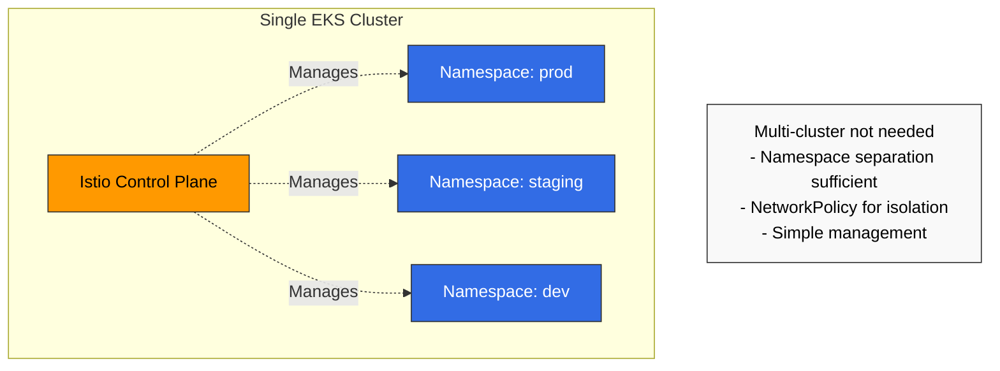

**Usa en su lugar**:

* Separación mediante Kubernetes Namespace
* NetworkPolicy para aislamiento de red
* RBAC para control de acceso

#### 2. Cuando no se puede manejar la complejidad operativa

**Requisitos operativos de Multi-cluster**:

* Mínimo de 2-3 expertos en Istio
* Gestión y monitoreo de East-West Gateway
* Gestión de certificados entre clústeres
* Capacidad de depuración entre clústeres

**Si tu equipo es pequeño**:

* Istio Single-cluster o
* AWS VPC Lattice (servicio administrado)

#### 3. Cuando el costo es una consideración clave

**Costos adicionales de Multi-cluster**:

* LoadBalancer para East-West Gateway ($20-50/mes por región)
* Transferencia de datos entre regiones ($0.02/GB)
* Redundancia del Control Plane (2-3x recursos)

### Lista de verificación

Responde estas preguntas antes de adoptarlo:

**Arquitectura**:

* [ ] ¿Ya están en funcionamiento 2 o más clústeres?
* [ ] ¿Se necesita un despliegue multi-región?
* [ ] ¿Son frecuentes las llamadas a servicios entre clústeres?

**Requisitos de negocio**:

* [ ] ¿Te diriges a usuarios globales?
* [ ] ¿Es esencial la recuperación ante desastres (DR)?
* [ ] ¿Son estrictos los requisitos de RTO/RPO?

**Seguridad y cumplimiento**:

* [ ] ¿Se necesita localización de datos?
* [ ] ¿Se necesita un fuerte aislamiento entre clústeres?

**Capacidad operativa**:

* [ ] ¿Cuentas con expertos en Istio?
* [ ] ¿Puedes depurar problemas de red complejos?
* [ ] ¿Puedes asumir costos adicionales?

**Resultados**:

* 9+ marcas: se recomienda Multi-cluster Istio
* 5-8 marcas: considera VPC Lattice o Hybrid
* 4 o menos marcas: comienza con Istio Single-cluster

## Guía de selección de arquitectura

### Solución óptima por escenario

| Escenario                             | Single-cluster | Multi-cluster Istio | VPC Lattice | Hybrid      |
| ------------------------------------ | -------------- | ------------------- | ----------- | ----------- |
| **Una sola región, pequeña escala**  | Óptimo         | Excesivo            | Innecesario | Innecesario |
| **Multi-región, se necesita L7 fuerte** | No es posible | Óptimo             | Limitado    | Recomendado |
| **Centrado en AWS, conectividad simple** | Limitado     | Excesivo            | Óptimo      | Innecesario |
| **DR, Failover automático**          | No es posible   | Óptimo             | Manual      | Recomendado |
| **Prioridad de optimización de costos** | Óptimo        | Costoso             | Recomendado | Medio       |
| **Simplificación operativa**         | Óptimo         | Complejo            | Óptimo      | Medio       |
| **Control de tráfico granular**      | Posible        | Óptimo              | Limitado    | Recomendado |

### Comparación de cada solución

#### Istio Single-cluster

**Ventajas**:

* Gestión más sencilla
* Bajo costo
* Depuración rápida
* Todas las características de Istio disponibles

**Desventajas**:

* Punto único de falla
* Interrupción completa del servicio ante una falla regional
* No es posible la distribución geográfica

**Adecuado cuando**:

* Servicio en una sola región
* Equipo pequeño (<50 personas)
* La alta disponibilidad no es esencial

#### Istio Multi-cluster

**Ventajas**:

* Distribución geográfica completa
* DR y Failover automáticos
* Todas las características L7 (Retry, Timeout, Circuit Breaker)
* Control de tráfico granular
* Observabilidad unificada

**Desventajas**:

* Alta complejidad operativa
* Se requiere la gestión de East-West Gateway
* Costos de transferencia de datos entre regiones
* Depuración difícil

**Adecuado cuando**:

* Servicios globales
* Se necesita DR sólido
* Es esencial el control L7 granular

#### AWS VPC Lattice

**Ventajas**:

* Totalmente administrado por AWS
* Configuración sencilla
* Baja carga operativa
* Conectividad segura entre VPC
* Rentable

**Desventajas**:

* Características L7 limitadas (sin Retry, Circuit Breaker)
* Dependencia de AWS
* Sin control de tráfico granular
* Carece de observabilidad de Istio

**Adecuado cuando**:

* Arquitectura centrada en AWS
* Solo se necesita conectividad de servicios simple
* La simplificación operativa es prioritaria

## Istio vs AWS VPC Lattice

### Comparación de características

| Característica         | Istio Multi-cluster   | AWS VPC Lattice | Hybrid          |
| --------------------- | --------------------- | --------------- | --------------- |
| **Enrutamiento de tráfico** |                 |                 |                 |
| Enrutamiento basado en headers | Totalmente compatible | Limitado   | Istio lo gestiona |
| Enrutamiento ponderado | Compatible           | Compatible      | Ambos posibles  |
| Enrutamiento basado en rutas | Compatible       | Compatible      | Ambos posibles  |
| **Resiliencia**        |                       |                 |                 |
| Retry                 | Control granular      | No compatible   | Istio lo gestiona |
| Timeout               | Control granular      | Solo básico     | Istio lo gestiona |
| Circuit Breaker       | Compatible            | No compatible   | Istio lo gestiona |
| **Seguridad**          |                       |                 |                 |
| mTLS                  | Automático            | Compatible      | Ambos           |
| AuthN/AuthZ           | Políticas granulares  | Solo IAM        | Istio lo gestiona |
| **Observabilidad**     |                       |                 |                 |
| Trazado distribuido   | Jaeger/Zipkin         | Limitado        | Istio lo gestiona |
| Métricas              | Detalladas            | Solo básico     | Istio lo gestiona |
| **Operaciones**        |                       |                 |                 |
| Complejidad de gestión | Alta                  | Baja            | Media           |
| Costo                 | Alto                  | Bajo            | Medio           |
| Integración con AWS   | Manual                | Nativa          | Buena           |

### Comparación de patrones de arquitectura

#### Patrón 1: Solo Istio Multi-cluster

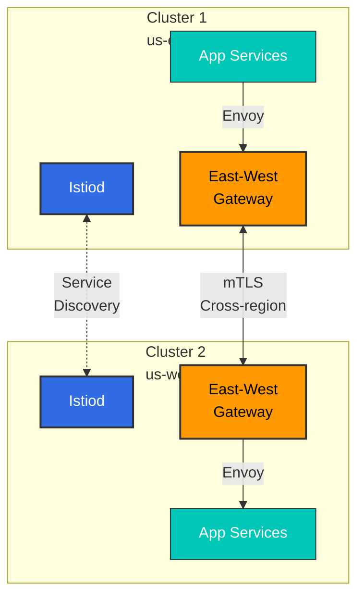

**Ventajas**:

* Características completas de Istio
* Observabilidad unificada
* Control granular

**Desventajas**:

* Se requiere la gestión de East-West Gateway
* Alta complejidad
* Costos de transferencia de datos entre regiones

#### Patrón 2: Solo VPC Lattice

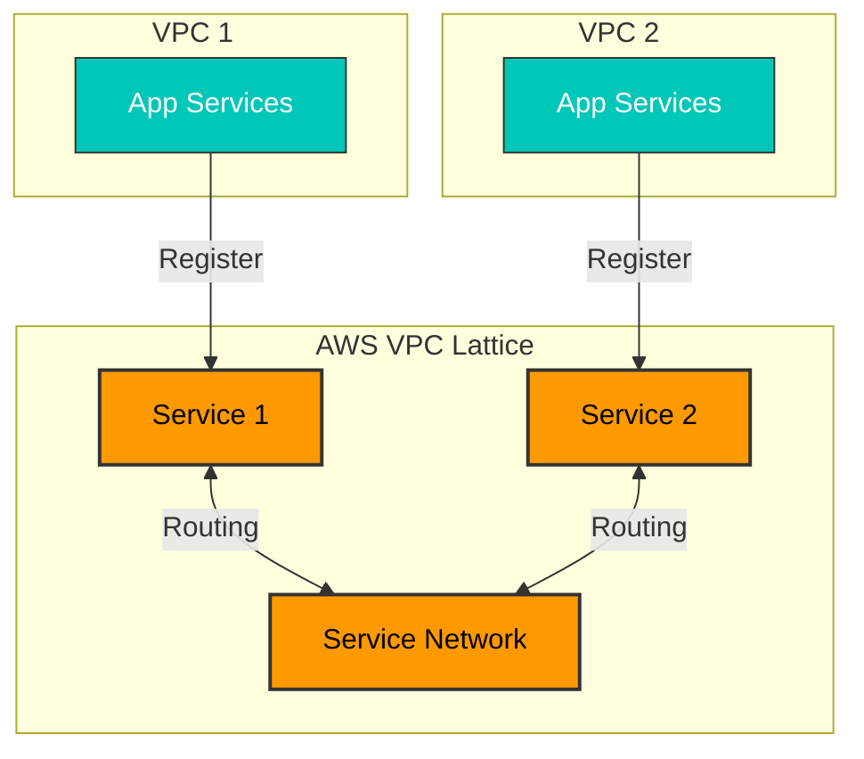

**Ventajas**:

* Totalmente administrado por AWS
* Configuración sencilla
* Baja carga operativa

**Desventajas**:

* No se pueden usar las características de Istio
* Control de tráfico limitado
* No es nativo de Kubernetes

#### Patrón 3: Hybrid (Recomendado)

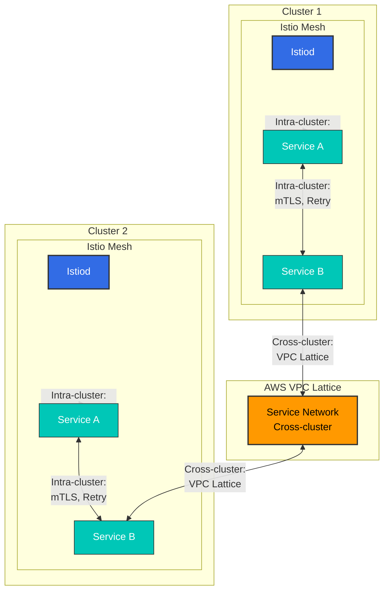

**Ventajas**:

* Dentro del clúster: todas las características avanzadas de Istio (Retry, Circuit Breaker, enrutamiento granular)
* Entre clústeres: gestión y estabilidad sencillas de VPC Lattice
* Complejidad operativa reducida (sin East-West Gateway)
* Optimización de costos (minimiza el tráfico entre regiones)

**Desventajas**:

* Es necesario comprender dos stacks tecnológicos
* Entre clústeres se limita a las características de Lattice

**Adecuado cuando**:

* Entorno AWS
* Se necesita control de tráfico complejo dentro del clúster
* Solo se necesita conectividad simple entre clústeres

## Descripción general de Multi-cluster

Con Multi-cluster Service Mesh puedes:

* Despliegue multi-región
* Recuperación ante desastres (DR)
* Separación de entornos (dev/staging/prod)
* Descubrimiento y comunicación de servicios entre clústeres

## Topología

### Primary-Remote

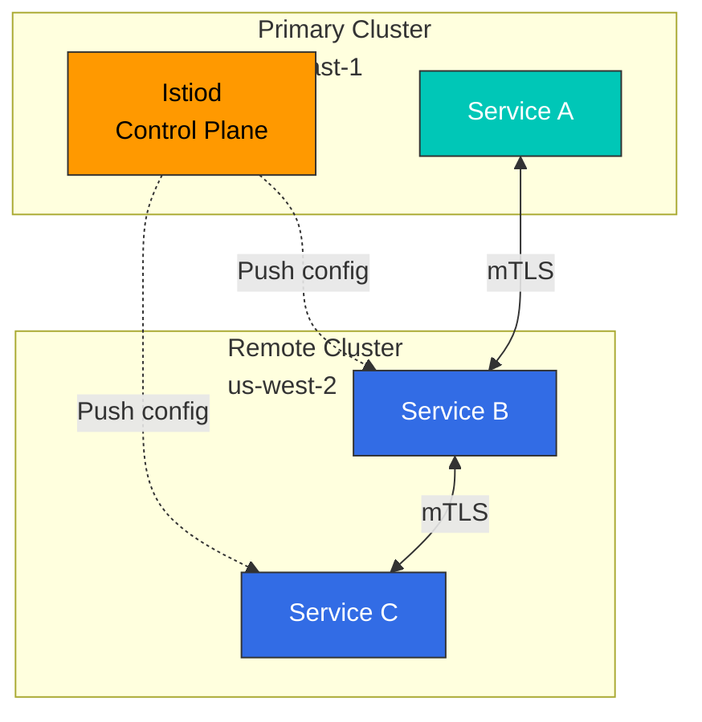

**Características**:

* Un único Control Plane (Primary)
* Varios Data Planes (Remote)
* Gestión sencilla
* Punto único de falla (Primary)

### Multi-Primary

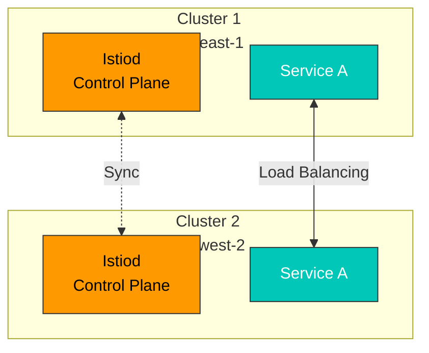

**Características**:

* Varios Control Planes
* Alta disponibilidad
* Gestión compleja
* Autonomía regional

## Configuración Primary-Remote

### 1. Configuración del clúster Primary

```bash
# Context setup
export CTX_CLUSTER1=cluster1

# Install Istio
istioctl install --context="${CTX_CLUSTER1}" -f - <<EOF
apiVersion: install.istio.io/v1alpha1
kind: IstioOperator
spec:
  values:
    global:
      meshID: mesh1
      multiCluster:
        clusterName: cluster1
      network: network1
EOF

# Install East-West Gateway
samples/multicluster/gen-eastwest-gateway.sh \
  --mesh mesh1 --cluster cluster1 --network network1 | \
  istioctl install --context="${CTX_CLUSTER1}" -y -f -

# Expose Gateway
kubectl apply --context="${CTX_CLUSTER1}" -f \
  samples/multicluster/expose-services.yaml
```

### 2. Configuración del clúster Remote

```bash
# Context setup
export CTX_CLUSTER2=cluster2

# Create Remote Secret
istioctl create-remote-secret \
  --context="${CTX_CLUSTER1}" \
  --name=cluster1 | \
  kubectl apply -f - --context="${CTX_CLUSTER2}"

# Install Istio with Remote configuration
istioctl install --context="${CTX_CLUSTER2}" -f - <<EOF
apiVersion: install.istio.io/v1alpha1
kind: IstioOperator
spec:
  values:
    global:
      meshID: mesh1
      multiCluster:
        clusterName: cluster2
      network: network1
      remotePilotAddress: ${DISCOVERY_ADDRESS}
EOF
```

## Configuración Multi-Primary

### 1. Establecer ambos clústeres como Primary

```bash
# Cluster 1
istioctl install --context="${CTX_CLUSTER1}" -f - <<EOF
apiVersion: install.istio.io/v1alpha1
kind: IstioOperator
spec:
  values:
    global:
      meshID: mesh1
      multiCluster:
        clusterName: cluster1
      network: network1
EOF

# Cluster 2
istioctl install --context="${CTX_CLUSTER2}" -f - <<EOF
apiVersion: install.istio.io/v1alpha1
kind: IstioOperator
spec:
  values:
    global:
      meshID: mesh1
      multiCluster:
        clusterName: cluster2
      network: network2
EOF
```

### 2. Registrar mutuamente los Remote Secret

```bash
# Cluster 1's Secret to Cluster 2
istioctl create-remote-secret \
  --context="${CTX_CLUSTER1}" \
  --name=cluster1 | \
  kubectl apply -f - --context="${CTX_CLUSTER2}"

# Cluster 2's Secret to Cluster 1
istioctl create-remote-secret \
  --context="${CTX_CLUSTER2}" \
  --name=cluster2 | \
  kubectl apply -f - --context="${CTX_CLUSTER1}"
```

## Comunicación entre clústeres

### Service Entry

```yaml
apiVersion: networking.istio.io/v1
kind: ServiceEntry
metadata:
  name: httpbin-cluster2
spec:
  hosts:
  - httpbin.default.svc.cluster.local
  location: MESH_INTERNAL
  ports:
  - number: 8000
    name: http
    protocol: HTTP
  resolution: DNS
  addresses:
  - 240.0.0.1
  endpoints:
  - address: ${CLUSTER2_INGRESS_HOST}
    ports:
      http: 15443
```

## Uso con VPC Lattice

### Implementación de arquitectura Hybrid

Puedes combinar Istio y VPC Lattice para crear lo mejor de ambos.

#### Paso 1: Instalar Istio de forma independiente en cada clúster

```bash
# Cluster 1 (single cluster mode)
export CTX_CLUSTER1=cluster1
istioctl install --context="${CTX_CLUSTER1}" -f - <<EOF
apiVersion: install.istio.io/v1alpha1
kind: IstioOperator
spec:
  values:
    global:
      meshID: mesh1-cluster1
      multiCluster:
        enabled: false  # Disable Multi-cluster
      network: network1
EOF

# Cluster 2 (independent installation)
export CTX_CLUSTER2=cluster2
istioctl install --context="${CTX_CLUSTER2}" -f - <<EOF
apiVersion: install.istio.io/v1alpha1
kind: IstioOperator
spec:
  values:
    global:
      meshID: mesh1-cluster2
      multiCluster:
        enabled: false  # Disable Multi-cluster
      network: network2
EOF
```

#### Paso 2: Crear una Service Network de VPC Lattice

```bash
# Create Service Network
aws vpc-lattice create-service-network \
  --name my-service-network \
  --auth-type AWS_IAM

# Save Service Network ID
SERVICE_NETWORK_ID=$(aws vpc-lattice list-service-networks \
  --query 'items[?name==`my-service-network`].id' \
  --output text)

# Connect VPC (Cluster 1 VPC)
aws vpc-lattice create-service-network-vpc-association \
  --service-network-identifier $SERVICE_NETWORK_ID \
  --vpc-identifier $VPC1_ID

# Connect VPC (Cluster 2 VPC)
aws vpc-lattice create-service-network-vpc-association \
  --service-network-identifier $SERVICE_NETWORK_ID \
  --vpc-identifier $VPC2_ID
```

#### Paso 3: Registrar un Kubernetes Service en VPC Lattice

```yaml
# Register Cluster 1's service to VPC Lattice
apiVersion: application-networking.k8s.aws/v1alpha1
kind: ServiceExport
metadata:
  name: my-service
  namespace: default
  annotations:
    application-networking.k8s.aws/lattice-service-network: my-service-network
spec: {}
---
# Routing from Cluster 1 to VPC Lattice
apiVersion: networking.istio.io/v1
kind: ServiceEntry
metadata:
  name: remote-service-via-lattice
  namespace: default
spec:
  hosts:
  - remote-service.lattice.svc.cluster.local
  location: MESH_EXTERNAL
  ports:
  - number: 80
    name: http
    protocol: HTTP
  resolution: DNS
  endpoints:
  - address: ${LATTICE_SERVICE_DNS}  # VPC Lattice DNS
    ports:
      http: 80
---
# Don't apply mTLS for VPC Lattice traffic
apiVersion: networking.istio.io/v1beta1
kind: DestinationRule
metadata:
  name: remote-service-via-lattice
  namespace: default
spec:
  host: remote-service.lattice.svc.cluster.local
  trafficPolicy:
    tls:
      mode: SIMPLE  # VPC Lattice handles TLS
```

#### Paso 4: Configuración de la política IAM

```json
{
  "Version": "2012-10-17",
  "Statement": [
    {
      "Effect": "Allow",
      "Principal": {
        "AWS": "*"
      },
      "Action": "vpc-lattice-svcs:Invoke",
      "Resource": "*",
      "Condition": {
        "StringEquals": {
          "vpc-lattice-svcs:SourceVpc": [
            "${VPC1_ID}",
            "${VPC2_ID}"
          ]
        }
      }
    }
  ]
}
```

### Flujo de tráfico

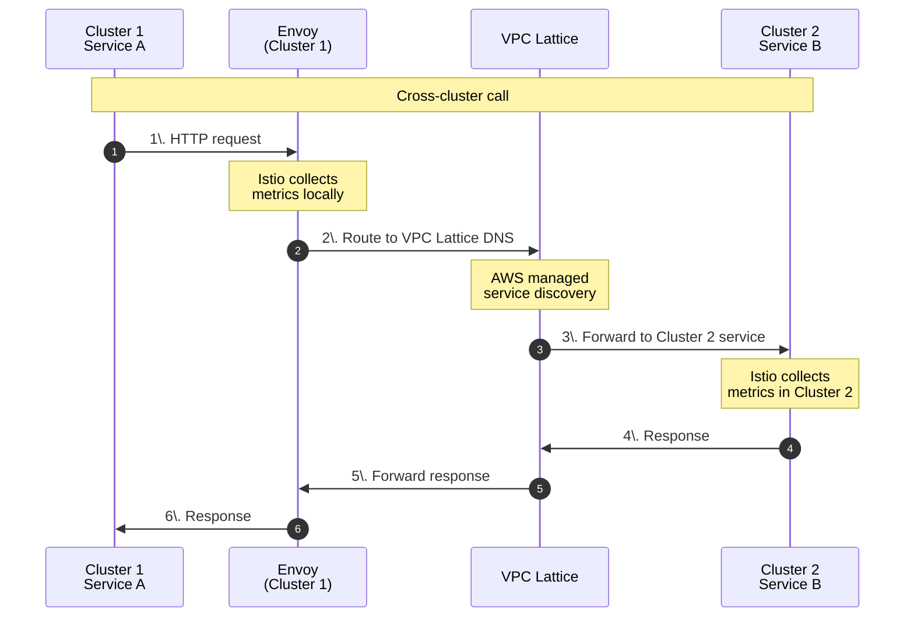

### Ventajas y consideraciones

**Ventajas**:

* Dentro del clúster: todas las características de Istio (Retry, Circuit Breaker, enrutamiento granular)
* Entre clústeres: gestión sencilla de VPC Lattice
* No se necesita East-West Gateway -> carga operativa reducida
* Integración nativa con AWS

**Consideraciones**:

* El tráfico entre clústeres se limita a las características de VPC Lattice
* VPC Lattice no puede controlar detalladamente Retry y Timeout
* El trazado distribuido de Istio se interrumpe en los límites de los clústeres (se rastrea de forma independiente en cada clúster)

## Ejemplos prácticos

### Ejemplo 1: Comercio electrónico global (Multi-Primary + VPC Lattice)

#### Arquitectura

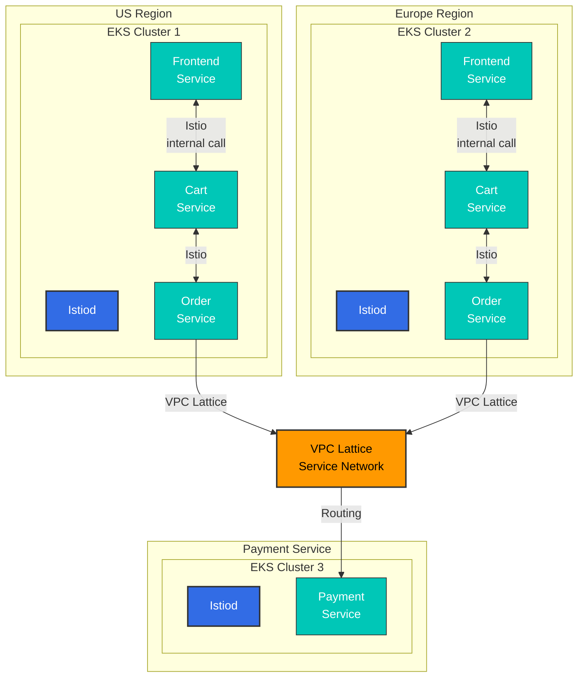

**Decisión**:

* **Dentro del clúster (Frontend <-> Cart <-> Order)**: usa Istio
  * Motivo: llamadas frecuentes, enrutamiento complejo, se necesita Circuit Breaker
* **Entre clústeres (Order -> Payment)**: usa VPC Lattice
  * Motivo: llamadas relativamente simples, aprovecha la autenticación de AWS IAM, gestión sencilla

#### Ejemplo de configuración

**Clúster 1/2: Frontend -> Cart (Istio)**

```yaml
apiVersion: networking.istio.io/v1
kind: VirtualService
metadata:
  name: cart-service
  namespace: default
spec:
  hosts:
  - cart.default.svc.cluster.local
  http:
  - match:
    - headers:
        user-type:
          exact: premium
    route:
    - destination:
        host: cart.default.svc.cluster.local
        subset: v2
      weight: 100
  - route:
    - destination:
        host: cart.default.svc.cluster.local
        subset: v1
      weight: 100
---
apiVersion: networking.istio.io/v1beta1
kind: DestinationRule
metadata:
  name: cart-service
spec:
  host: cart.default.svc.cluster.local
  trafficPolicy:
    connectionPool:
      tcp:
        maxConnections: 100
      http:
        http1MaxPendingRequests: 1024
        maxRequestsPerConnection: 10
    outlierDetection:
      consecutiveErrors: 5
      interval: 10s
      baseEjectionTime: 30s
  subsets:
  - name: v1
    labels:
      version: v1
  - name: v2
    labels:
      version: v2
```

**Clúster 1/2: Order -> Payment (VPC Lattice)**

```yaml
# ServiceEntry for VPC Lattice
apiVersion: networking.istio.io/v1
kind: ServiceEntry
metadata:
  name: payment-service-lattice
  namespace: default
spec:
  hosts:
  - payment.lattice.svc.cluster.local
  location: MESH_EXTERNAL
  ports:
  - number: 443
    name: https
    protocol: HTTPS
  resolution: DNS
  endpoints:
  - address: payment-service-abc123.vpc-lattice.amazonaws.com
---
# DestinationRule: VPC Lattice TLS
apiVersion: networking.istio.io/v1beta1
kind: DestinationRule
metadata:
  name: payment-service-lattice
spec:
  host: payment.lattice.svc.cluster.local
  trafficPolicy:
    tls:
      mode: SIMPLE  # VPC Lattice handles TLS
```

### Ejemplo 2: Escenario de recuperación ante desastres (DR)

#### Active-Standby con Route53 Failover

```yaml
# Cluster 1 (Active): Health Check Endpoint
apiVersion: v1
kind: Service
metadata:
  name: health-check
  namespace: istio-system
  annotations:
    service.beta.kubernetes.io/aws-load-balancer-type: "nlb"
    external-dns.alpha.kubernetes.io/hostname: api.example.com
    external-dns.alpha.kubernetes.io/set-identifier: "us-east-1-primary"
    external-dns.alpha.kubernetes.io/aws-health-check-id: "health-check-primary"
spec:
  type: LoadBalancer
  selector:
    app: health-check
  ports:
  - port: 80
    targetPort: 8080
---
# Cluster 2 (Standby): Health Check Endpoint
apiVersion: v1
kind: Service
metadata:
  name: health-check
  namespace: istio-system
  annotations:
    service.beta.kubernetes.io/aws-load-balancer-type: "nlb"
    external-dns.alpha.kubernetes.io/hostname: api.example.com
    external-dns.alpha.kubernetes.io/set-identifier: "us-west-2-standby"
    external-dns.alpha.kubernetes.io/aws-health-check-id: "health-check-standby"
spec:
  type: LoadBalancer
  selector:
    app: health-check
  ports:
  - port: 80
    targetPort: 8080
```

**Comprobación de estado de Route53 y política de Failover**:

```bash
# Create Primary Health Check
aws route53 create-health-check \
  --caller-reference "$(date +%s)" \
  --health-check-config \
    Type=HTTPS,ResourcePath=/healthz,FullyQualifiedDomainName=${PRIMARY_LB_DNS},Port=443

# Failover Routing Policy
aws route53 change-resource-record-sets \
  --hosted-zone-id ${ZONE_ID} \
  --change-batch file://failover-config.json
```

**failover-config.json**:

```json
{
  "Changes": [
    {
      "Action": "CREATE",
      "ResourceRecordSet": {
        "Name": "api.example.com",
        "Type": "A",
        "SetIdentifier": "Primary",
        "Failover": "PRIMARY",
        "AliasTarget": {
          "HostedZoneId": "${NLB_ZONE_ID}",
          "DNSName": "${PRIMARY_LB_DNS}",
          "EvaluateTargetHealth": true
        },
        "HealthCheckId": "${PRIMARY_HEALTH_CHECK_ID}"
      }
    },
    {
      "Action": "CREATE",
      "ResourceRecordSet": {
        "Name": "api.example.com",
        "Type": "A",
        "SetIdentifier": "Secondary",
        "Failover": "SECONDARY",
        "AliasTarget": {
          "HostedZoneId": "${NLB_ZONE_ID}",
          "DNSName": "${STANDBY_LB_DNS}",
          "EvaluateTargetHealth": true
        }
      }
    }
  ]
}
```

## Comparación de rendimiento y costos

### Comparación de rendimiento

| Métrica                   | Single-cluster | Istio Multi-cluster | Hybrid (Istio + Lattice) |
| ------------------------- | -------------- | ------------------- | ------------------------ |
| **Latencia dentro del clúster** | \~2ms     | \~2ms               | \~2ms                    |
| **Latencia entre clústeres** | N/A         | +5-10ms (East-West GW) | +3-5ms (VPC Lattice)  |
| **Rendimiento (RPS)**    | 10,000         | 8,500               | 9,200                    |
| **Sobrecarga de CPU**    | +10%           | +15%                | +12%                     |
| **Uso de memoria**       | +50MB/pod      | +70MB/pod           | +55MB/pod                |

### Comparación de costos (mensual, 2 clústeres)

| Elemento                  | Single-cluster | Istio Multi-cluster | Hybrid     | Solo VPC Lattice |
| ------------------------- | -------------- | ------------------- | ---------- | ---------------- |
| **Control Plane**         | $50            | $100 (x2)           | $100 (x2)  | $0               |
| **East-West Gateway**     | $0             | $100 (NLB x2)       | $0         | $0               |
| **Transferencia entre regiones** | $0      | $200 (10TB)         | $100 (5TB) | $100 (5TB)       |
| **VPC Lattice**           | $0             | $0                  | $30        | $50              |
| **Personal de operaciones** | $10,000      | $15,000             | $12,000    | $8,000           |
| **Costo total estimado**  | \~$10,050      | \~$15,400           | \~$12,230  | \~$8,150         |

**Consejos para ahorrar costos**:

* Los costos de transferencia entre regiones pueden reducirse con VPC Peering
* VPC Lattice tiene facturación basada en rendimiento -> la optimización del tráfico es esencial
* Reducción del 90% de la sobrecarga de recursos con Ambient Mode

### Análisis de ROI

**Valor de inversión de Istio Multi-cluster**:

* Muy recomendado cuando el costo de inactividad es > $1,000/hora
* Recomendado cuando la experiencia de clientes globales es importante
* Inversión excesiva para startups pequeñas

**Punto óptimo del enfoque Hybrid**:

* Arquitectura centrada en AWS
* Lógica compleja dentro del clúster
* Conectividad simple entre clústeres

## Solución de problemas

```bash
# Verify cross-cluster connectivity
istioctl ps --context="${CTX_CLUSTER1}"
istioctl ps --context="${CTX_CLUSTER2}"

# Check Remote Secret
kubectl get secrets -n istio-system --context="${CTX_CLUSTER1}"

# Verify cross-cluster traffic
kubectl logs -n istio-system -l app=istiod --context="${CTX_CLUSTER1}"
```

## Referencias

### Documentación oficial

* [Istio Multi-cluster](https://istio.io/latest/docs/setup/install/multicluster/)
* [Multi-Primary](https://istio.io/latest/docs/setup/install/multicluster/multi-primary/)
* [Primary-Remote](https://istio.io/latest/docs/setup/install/multicluster/primary-remote/)
* [AWS VPC Lattice](https://docs.aws.amazon.com/vpc-lattice/latest/ug/what-is-vpc-lattice.html)
* [AWS Gateway API Controller](https://www.gateway-api-controller.eks.aws.dev/)

### Blogs y estudios de caso

* [Tetrate - Istio Multi-cluster](https://tetrate.io/blog/multicluster-istio/)
* [Solo.io - Mejores prácticas de Istio Multi-cluster](https://www.solo.io/blog/istio-multicluster/)

### Documentos relacionados

* [Ambient Mode](01-ambient-mode.md) - Optimización de recursos
* [mTLS](../security/01-mtls.md) - Comunicación segura entre clústeres
* [VPC Lattice](https://github.com/Atom-oh/kubernetes-docs/blob/main/en/service-mesh/networking/02-vpc-lattice.md) - Redes de servicios administradas por AWS

## Resumen

Multi-cluster Service Mesh es potente, pero aumenta la complejidad y el costo. Guía de decisión:

| Elección                | Adecuado cuando                                      | Ventajas clave                       | Desventajas clave                                  |
| ----------------------- | --------------------------------------------------- | ----------------------------------- | -------------------------------------------------- |
| **Single-cluster**      | Una sola región, pequeña escala                     | Gestión sencilla, bajo costo        | Punto único de falla, sin distribución geográfica |
| **Istio Multi-cluster** | Servicios globales, se necesita L7 fuerte           | Control total, todas las características de Istio | Alta complejidad, alto costo         |
| **VPC Lattice**         | Centrado en AWS, conectividad simple                 | Administrado por AWS, baja carga operativa | Características de Istio limitadas, dependencia de AWS |
| **Hybrid**              | Entorno AWS, interno complejo + externo simple       | Complejidad y características equilibradas | Es necesario comprender dos stacks tecnológicos |

**Enfoque recomendado**:

1. Comienza con Single-cluster
2. Cuando se necesite multi-región -> considera Hybrid (Istio + VPC Lattice)
3. Cuando sea esencial un control L7 fuerte -> Istio Multi-cluster
4. Cuando la simplificación operativa sea prioritaria -> solo VPC Lattice
