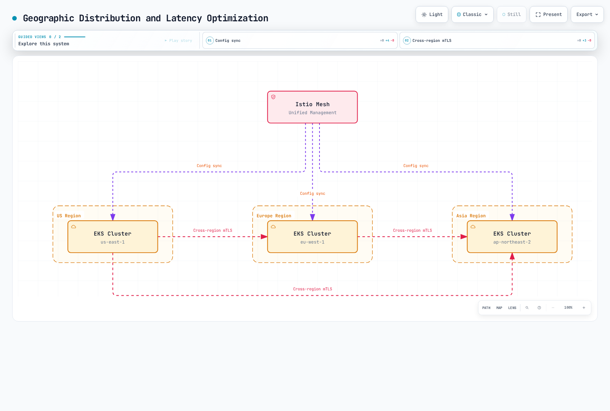
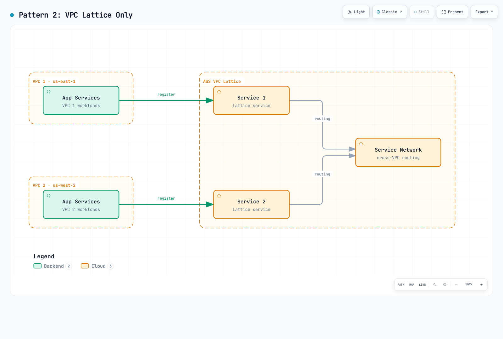
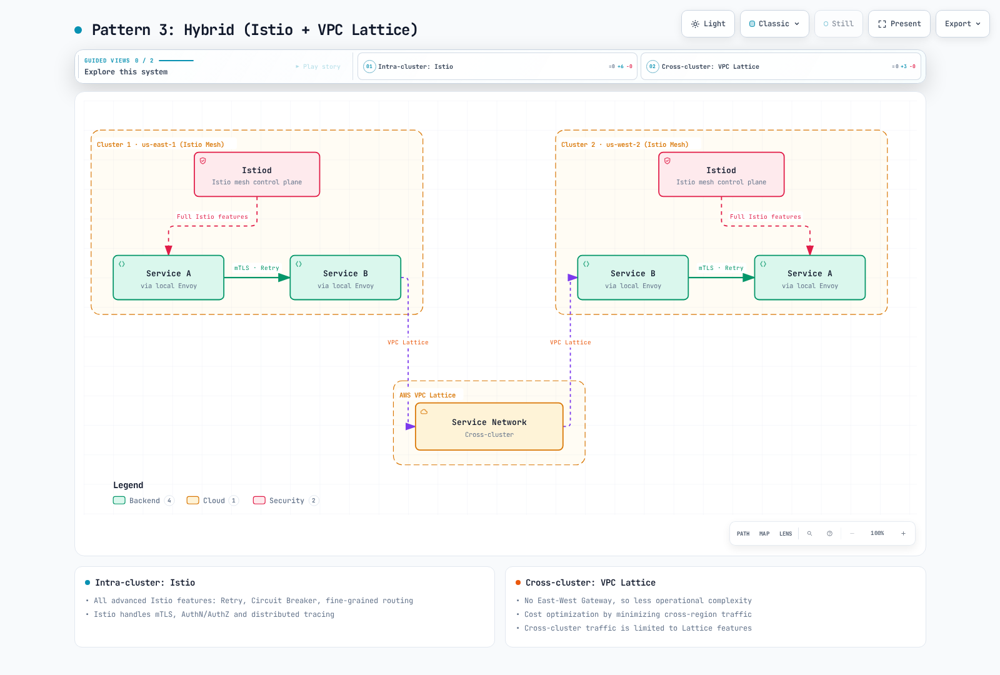

# Multiclúster

> **Última actualización**: 11 de septiembre de 2026 · Istio1.31 · Kubernetes1.32–1.36. Los ejemplos describen topologías **sidecar** y son alternativas independientes. Ambient tiene otros límites de soporte. Esta auditoría no realizó despliegues de clúster, AWS ni carga productiva.

Una malla multiclúster conecta varios clústeres Kubernetes en una malla unificada.

## Índice

1. [¿Realmente necesita multiclúster?](02-multi-cluster.md#do-you-really-need-multi-cluster)
2. [Guía de selección de arquitectura](02-multi-cluster.md#architecture-selection-guide)
3. [Istio frente a AWS VPC Lattice](02-multi-cluster.md#istio-vs-aws-vpc-lattice)
4. [Topología](02-multi-cluster.md#topology)
5. [Configuración Primary-Remote](02-multi-cluster.md#primary-remote-setup)
6. [Configuración Multi-Primary](02-multi-cluster.md#multi-primary-setup)
7. [Comunicación entre clústeres](02-multi-cluster.md#cross-cluster-communication)
8. [Uso con VPC Lattice](02-multi-cluster.md#using-with-vpc-lattice)
9. [Ejemplos prácticos](02-multi-cluster.md#practical-examples)
10. [Comparación de rendimiento y coste](02-multi-cluster.md#performance-and-cost-comparison)
11. [Resolución de problemas](02-multi-cluster.md#troubleshooting)

## ¿Realmente necesita multiclúster? {#do-you-really-need-multi-cluster}

Una malla multiclúster es potente, pero aumenta complejidad y coste. Evalúe cuidadosamente antes de adoptarla.

### Flujo de decisión

Use los requisitos siguientes como restricciones; ninguna puntuación de checklist hace universalmente preferible una arquitectura.


### Cuándo hace falta multiclúster

#### 1. Distribución geográfica y optimización de latencia



[🔍 Ver diagrama interactivo](https://www.atomai.click/kubernetes-docs/archmaps/en-service-mesh-istio-advanced-02-multi-cluster-1.html)

**Cuándo se necesita**:

* Servicios globales orientados al usuario, con latencia objetivo <100ms
* Obligaciones de ubicación de datos por carga; la malla no establece cumplimiento por sí sola
* Enrutamiento regional y aislamiento de fallos

#### 2. Recuperación ante desastres (DR)


[🔍 Ver diagrama interactivo](https://www.atomai.click/kubernetes-docs/archmaps/en-service-mesh-istio-advanced-02-multi-cluster-2.html)

**Cuándo se necesita**:

* RTO, objetivo de tiempo de recuperación, <1 hora
* RPO, objetivo de punto de recuperación, <15 minutos
* Failover automático ante fallo regional

Las cifras RTO/RPO son requisitos de ejemplo, no resultados garantizados. El diagrama DR supone replicación de despliegues/datos y DNS con salud implementados aparte; clientes, cachés y conexiones existentes afectan al cambio.

#### 3. Separación de entornos y despliegue por etapas

**Cuándo se necesita**:

* Separar clústeres Dev/Staging/Prod con gestión unificada
* Despliegues Blue/Green a nivel de clúster
* Canary con expansión regional gradual

#### 4. Límites organizativos y aislamiento de seguridad

**Cuándo se necesita**:

* Operación independiente por equipo/departamento
* Multitenencia mejorada
* Límites de aislamiento evaluados explícitamente; compartir confianza de malla es otra decisión

### Cuándo NO hace falta multiclúster

#### 1. Una región y servicios pequeños


[🔍 Ver diagrama interactivo](https://www.atomai.click/kubernetes-docs/archmaps/en-service-mesh-istio-advanced-02-multi-cluster-3.html)

**Alternativas**:

* Separación mediante namespaces Kubernetes
* NetworkPolicy para aislamiento de red
* RBAC para acceso

#### 2. Cuando no puede asumirse la complejidad operativa

**Requisitos operativos multiclúster**:

* Equipo responsable capaz de operar redes, PKI, actualizaciones e incidentes entre clústeres
* Gestión y monitorización de gateways este-oeste
* Gestión de certificados entre clústeres
* Capacidad de diagnóstico multiclúster

**Si el equipo es pequeño**:

* Istio de un clúster, o
* AWS VPC Lattice gestionado

#### 3. Cuando el coste es decisivo

**Costes adicionales multiclúster**:

* Horas/capacidad de balanceadores este-oeste y procesamiento de la plataforma
* Bytes facturables entre regiones y tarifas por dirección/región
* Réplicas de plano de control/gateway y capacidad de telemetría/almacenamiento

### Lista de comprobación

Responda antes de adoptar:

**Arquitectura**:

* [ ] ¿Ya hay 2 o más clústeres operativos?
* [ ] ¿Se necesita despliegue multirregional?
* [ ] ¿Son frecuentes las llamadas entre clústeres?

**Requisitos de negocio**:

* [ ] ¿Se orienta a usuarios globales?
* [ ] ¿Es esencial DR?
* [ ] ¿Son estrictos RTO/RPO?

**Seguridad y cumplimiento**:

* [ ] ¿Se necesita localización de datos?
* [ ] ¿Se necesita aislamiento fuerte entre clústeres?

**Capacidad operativa**:

* [ ] ¿Hay expertos Istio?
* [ ] ¿Puede depurar redes complejas?
* [ ] ¿Puede asumir costes adicionales?

**Resultados**:

Use respuestas como entradas de diseño, no puntuación numérica. Región, confianza, API, recuperación y operación pueden descartar opciones independientemente de cuántas casillas marque.

## Guía de selección de arquitectura {#architecture-selection-guide}

| Decisión | Evidencia requerida |
|---|---|
| HA regional frente a DR regional | Ubicación del control/cargas, datos replicados y recuperación probada |
| Malla entre clústeres | API/gateways accesibles, confianza común, identidad namespace/servicio y configuración distribuida aparte |
| Conectividad Lattice regional | Red regional, asociaciones/endpoints VPC, modo listener/auth y destinos accesibles |
| Conectividad entre regiones | Diseño global explícito de red/endpoints y aplicación/datos; asociaciones VPC regionales no son una red global |
| Coste y personal | Carga medida, mismas hipótesis de tráfico, facturación y esfuerzo reales |

### Comparación de soluciones

#### Istio de un clúster

**Ventajas**:

* Gestión más sencilla
* Menos componentes pueden simplificar costes; mida la carga real
* Diagnóstico rápido
* Todas las funciones Istio disponibles

**Desventajas**:

* Dominio de fallo compartido; aún puede configurar HA regional
* Dependencia regional salvo arquitectura de recuperación aparte
* Un control plane EKS es regional; distribuir dominios de fallo más amplios requiere diseño adicional

**Adecuado cuando**:

* Servicio de una región
* Los objetivos regionales del equipo encajan en ese alcance
* Se logra HA regional sin DR entre regiones

#### Istio multiclúster

**Ventajas**:

* Distribución geográfica completa
* Base para failover diseñado explícitamente; DR de aplicación/datos sigue separado
* Todas las funciones L7: retry, timeout, circuit breaker
* Control fino de tráfico
* Observabilidad unificada

**Desventajas**:

* Complejidad operativa alta
* Gestión de gateway este-oeste
* Costes de transferencia entre regiones
* Diagnóstico difícil

**Adecuado cuando**:

* Servicios globales
* Se requiere DR fuerte
* Control fino L7 esencial

#### AWS VPC Lattice

**Ventajas**:

* Totalmente gestionado por AWS
* Configuración sencilla
* Baja carga operativa
* Conectividad entre VPC mediante asociaciones y políticas explícitas
* Modelar costes de servicio/solicitudes/datos y operación con la carga real

**Desventajas**:

* Controles de resiliencia distintos; la API de reglas no tiene retry/outlier por salto equivalente
* Dependencia de AWS
* Rutas por cabeceras/métodos/path y destinos ponderados, con coincidencias/límites distintos de Istio
* Interfaces métricas/logs diferentes; trazado completo exige integración de aplicación

**Adecuado cuando**:

* Arquitectura centrada en AWS
* Solo se necesita conectividad sencilla
* Prioridad en simplificar operación

## Istio frente a AWS VPC Lattice {#istio-vs-aws-vpc-lattice}

### Comparación de funciones

| Área | Malla sidecar Istio | Servicios VPC Lattice |
|---|---|---|
| Enrutamiento | Políticas VirtualService/DestinationRule | Cabecera HTTP exact/prefix/contains, path exact/prefix, método y grupos ponderados |
| Resiliencia | Retry/timeout por salto, pools y detección de anomalías | Límites gestionados de servicio/conexión; no la misma API configurable por salto |
| Identidad TLS | mTLS de carga con confianza compatible | HTTPS termina en Lattice; passthrough puede llevar mTLS de aplicación, no identidad SPIFFE gestionada |
| Autorización | Políticas Istio/aplicación | Políticas HTTP(S) e IAM/SigV4 donde se exija; permitir solo por SourceVpc puede incluir anónimos |
| Límites TLS passthrough | Dependen del gateway | SNI de dominio personalizado, grupo TCP y solo regla predeterminada; políticas de principal anónimo, no IAM por cabecera HTTP |
| Observabilidad | Métricas, logs y trazas configurados de proxy/app | CloudWatch y accesos; trazas/contexto de aplicación se integran aparte |
| Coste | Cómputo, gateways, transferencias y operación | Tiempo de servicio, solicitudes/datos y cargos de recursos/endpoints; sin ganador universal más barato |

Servicios, configuraciones de recursos y redes Lattice son regionales. Clientes de otras regiones/locales requieren rutas de red/endpoints explícitas compatibles; peering/tránsito necesita el endpoint VPC de red de servicios apropiado, no solo asociación. Passthrough TLS y terminación HTTPS tienen contratos diferentes. Un híbrido debe indicar cada límite TLS/identidad.

### Comparación de patrones

#### Patrón 1: Solo Istio multiclúster


**Ventajas**:

* Funciones Istio completas
* Observabilidad unificada
* Control fino

**Desventajas**:

* Requiere gestión de gateway este-oeste
* Complejidad alta
* Costes entre regiones

#### Patrón 2: Solo VPC Lattice



[🔍 Ver diagrama interactivo](https://www.atomai.click/kubernetes-docs/archmaps/en-service-mesh-istio-advanced-02-multi-cluster-5.html)

**Ventajas**:

* Totalmente gestionado por AWS
* Configuración sencilla
* Baja carga operativa

**Desventajas**:

* No puede usar funciones Istio
* Control de tráfico limitado
* La integración Kubernetes requiere AWS Gateway API Controller y sus API admitidas

#### Patrón 3: Híbrido, una opción de conectividad regional



[🔍 Ver diagrama interactivo](https://www.atomai.click/kubernetes-docs/archmaps/en-service-mesh-istio-advanced-02-multi-cluster-6.html)

**Ventajas**:

* Dentro del clúster: funciones avanzadas Istio, retry, circuit breaker y rutas finas
* Entre clústeres: gestión sencilla y estabilidad Lattice
* Menor complejidad sin gateway este-oeste
* El coste debe medirse; elegir Lattice no reduce por sí solo bytes necesarios entre regiones

**Desventajas**:

* Hay que entender dos stacks
* Entre clústeres, solo funciones Lattice

**Adecuado cuando**:

* Entorno AWS
* Se necesita tráfico complejo dentro del clúster
* Solo conectividad sencilla entre clústeres

## Descripción general multiclúster

Una malla multiclúster permite:

* Despliegue multirregional
* Recuperación ante desastres
* Separación de entornos dev/staging/prod
* Descubrimiento y comunicación entre clústeres

## Topología {#topology}

Son topologías sidecar. Ambient multiclúster actual admite Beta multi-primary/multi-network, con otros límites; no reutilice primary/remote para ambient. Cada primary lee API Kubernetes autorizadas. Istiod no replica otros CRD Istio, configuración de aplicación ni bases de datos a otro primary; distribúyalos aparte. Compartir trust domain da la misma identidad namespace/ServiceAccount entre clústeres, por lo que separarlos no aísla autorización.

Una instalación primary puede tener varias réplicas. Su caída afecta a descubrimiento, inyección y certificados; proxies existentes pueden conservar configuración, así que no implica caída inmediata universal del tráfico. Multi-primary reduce esa dependencia, pero no todos los fallos compartidos.


### Primary-Remote


[🔍 Ver diagrama interactivo](https://www.atomai.click/kubernetes-docs/archmaps/en-service-mesh-istio-advanced-02-multi-cluster-7.html)

**Características**:

* Un plano de control Primary
* Varios planos de datos Remote
* Gestión sencilla
* Dependencia compartida del primary para descubrir, inyectar y emitir certificados

### Multi-Primary


**Características**:

* Varios planos de control
* Alta disponibilidad
* Gestión compleja
* Autonomía regional

### Requisitos compartidos

Trabaje desde la distribución Istio1.31 con dos clústeres compatibles y contextos kubeconfig revisados. Se supone revisión predeterminada; conserve la instalada en etiquetas y generación de gateways si difiere. Ambas API y rutas necesarias deben ser accesibles. Planifique confianza antes de instalar: issuers multi-primary deben encadenar a raíz común confiable o diseño explícitamente soportado; meshID iguales no establecen confianza. Siga [requisitos oficiales y preparación CA](https://istio.io/latest/docs/setup/install/multicluster/before-you-begin/) y proteja material privado. Distribuya configuración de aplicación/malla aparte; remote secrets no la replican.

```bash
export CTX_CLUSTER1=cluster1
export CTX_CLUSTER2=cluster2
kubectl --context="$CTX_CLUSTER1" get nodes
kubectl --context="$CTX_CLUSTER2" get nodes
```

## Configuración Primary-Remote {#primary-remote-setup}

Es la topología oficial **sidecar basada en IP y misma red**: Pods directamente accesibles entre clústeres y API remota accesible desde primary. No es una receta para hostname NLB EKS. El chart 1.31 puede representar remotePilotAddress DNS con un Service ExternalName; la búsqueda IP aquí no es diseño EKS DNS completo. Use la [guía de control externo](https://istio.io/latest/docs/setup/install/external-controlplane/) para URL de inyección, certificados DNS firmados y acceso real. Renderizar un DNS no verifica el despliegue. IstioOperator es entrada istioctl, no un operador dentro del clúster.

### 1. Configurar el clúster primary

```bash
# Context setup
export CTX_CLUSTER1=cluster1

# Install Istio
istioctl install --context="${CTX_CLUSTER1}" -f - <<EOF
apiVersion: install.istio.io/v1alpha1
kind: IstioOperator
spec:
  values:
    global:
      meshID: mesh1
      externalIstiod: true
      multiCluster:
        clusterName: cluster1
      network: network1
EOF

# Install East-West Gateway
samples/multicluster/gen-eastwest-gateway.sh --network network1 > primary-eastwest.yaml
# Review platform-specific L4 load balancer and access settings before applying
istioctl install --context="${CTX_CLUSTER1}" -f primary-eastwest.yaml

# Expose Gateway
kubectl apply --context="${CTX_CLUSTER1}" -f \
  samples/multicluster/expose-istiod.yaml
```

### 2. Configurar el clúster remoto

```bash
# Context setup
export CTX_CLUSTER2=cluster2

# Prepare the remote namespace and identify its managing primary
kubectl --context="$CTX_CLUSTER2" create namespace istio-system --dry-run=client -o yaml | kubectl --context="$CTX_CLUSTER2" apply -f -
kubectl --context="$CTX_CLUSTER2" annotate namespace istio-system topology.istio.io/controlPlaneClusters=cluster1 --overwrite
DISCOVERY_ADDRESS=$(kubectl --context="$CTX_CLUSTER1" -n istio-system get svc istio-eastwestgateway -o jsonpath='{.status.loadBalancer.ingress[0].ip}')
if [ -z "$DISCOVERY_ADDRESS" ]; then
  echo "This IP-based lab requires a reachable LB IP; DNS-based EKS endpoints need the external-control-plane design." >&2
  exit 1
fi


# Install Istio with Remote configuration
istioctl install --context="${CTX_CLUSTER2}" -f - <<EOF
apiVersion: install.istio.io/v1alpha1
kind: IstioOperator
spec:
  profile: remote
  values:
    istiodRemote:
      injectionPath: /inject/cluster/cluster2/net/network1
    global:
      meshID: mesh1
      multiCluster:
        clusterName: cluster2
      network: network1
      remotePilotAddress: ${DISCOVERY_ADDRESS}
EOF

# Give the primary access to the REMOTE API after remote components are configured
istioctl create-remote-secret \
  --context="${CTX_CLUSTER2}" \
  --name=cluster2 | \
  kubectl apply -f - --context="${CTX_CLUSTER1}"
```

## Configuración Multi-Primary {#multi-primary-setup}

En redes separadas, cada primary debe alcanzar API y gateway este-oeste del peer. Prepare Secrets CA acordes antes de Istiod. Configure LB L4, acceso a gateway y permisos acotados para la plataforma; ALB u otro salto L7 que termine TLS no es compatible con AUTO_PASSTHROUGH. Consulte [integración AWS](../04-aws-integration.md) para requisitos de LB EKS.

### 1. Configurar ambos clústeres como primary

```bash
# Cluster 1
istioctl install --context="${CTX_CLUSTER1}" -f - <<EOF
apiVersion: install.istio.io/v1alpha1
kind: IstioOperator
spec:
  values:
    global:
      meshID: mesh1
      multiCluster:
        clusterName: cluster1
      network: network1
EOF

# Cluster 2
istioctl install --context="${CTX_CLUSTER2}" -f - <<EOF
apiVersion: install.istio.io/v1alpha1
kind: IstioOperator
spec:
  values:
    global:
      meshID: mesh1
      multiCluster:
        clusterName: cluster2
      network: network2
EOF
```

```bash
# Both networks need their own gateway and service exposure
kubectl --context="$CTX_CLUSTER1" label namespace istio-system topology.istio.io/network=network1 --overwrite
kubectl --context="$CTX_CLUSTER2" label namespace istio-system topology.istio.io/network=network2 --overwrite
samples/multicluster/gen-eastwest-gateway.sh --network network1 > eastwest-cluster1.yaml
samples/multicluster/gen-eastwest-gateway.sh --network network2 > eastwest-cluster2.yaml
# Review platform-specific LB/access settings in these generated inputs before installing
istioctl install --context="$CTX_CLUSTER1" -f eastwest-cluster1.yaml
istioctl install --context="$CTX_CLUSTER2" -f eastwest-cluster2.yaml
kubectl --context="$CTX_CLUSTER1" apply -n istio-system -f samples/multicluster/expose-services.yaml
kubectl --context="$CTX_CLUSTER2" apply -n istio-system -f samples/multicluster/expose-services.yaml
```

### 2. Registrar remote secrets de forma cruzada

```bash
# Cluster 1's Secret to Cluster 2
istioctl create-remote-secret \
  --context="${CTX_CLUSTER1}" \
  --name=cluster1 | \
  kubectl apply -f - --context="${CTX_CLUSTER2}"

# Cluster 2's Secret to Cluster 1
istioctl create-remote-secret \
  --context="${CTX_CLUSTER2}" \
  --name=cluster2 | \
  kubectl apply -f - --context="${CTX_CLUSTER1}"
```

## Comunicación entre clústeres {#cross-cluster-communication}

Use descubrimiento remoto con mismos nombres Service/namespace y visibilidad DNS. Istiod no copia Service o Deployment entre clústeres. El laboratorio define Service en ambos, backend solo en cluster2 y cliente inyectado en cluster1. En redes diferentes, Istio selecciona gateway este-oeste y ruta SNI/mTLS; no lo sustituya por ServiceEntry HTTP a 15443.

Guarde como `shared-httpbin-service.yaml`:

```yaml
apiVersion: v1
kind: Service
metadata:
  name: httpbin
  namespace: multicluster-demo
spec:
  selector:
    app: httpbin
  ports:
  - name: http
    port: 8000
    targetPort: 8080
```

```bash
for context in "$CTX_CLUSTER1" "$CTX_CLUSTER2"; do
  kubectl --context="$context" create namespace multicluster-demo --dry-run=client -o yaml | kubectl --context="$context" apply -f -
  # Default revision lab; use the recorded revision label if installed differently
  kubectl --context="$context" label namespace multicluster-demo istio-injection=enabled --overwrite
  kubectl --context="$context" apply -f shared-httpbin-service.yaml
done
kubectl --context="$CTX_CLUSTER2" apply -n multicluster-demo -f samples/httpbin/httpbin.yaml
kubectl --context="$CTX_CLUSTER1" apply -n multicluster-demo -f samples/curl/curl.yaml
kubectl --context="$CTX_CLUSTER2" rollout status deployment/httpbin -n multicluster-demo --timeout=120s
kubectl --context="$CTX_CLUSTER1" rollout status deployment/curl -n multicluster-demo --timeout=120s
istioctl proxy-config endpoints deployment/curl --context="$CTX_CLUSTER1" -n multicluster-demo --cluster 'outbound|8000||httpbin.multicluster-demo.svc.cluster.local'
kubectl --context="$CTX_CLUSTER1" exec -n multicluster-demo deploy/curl -c curl -- curl -sS --max-time 5 http://httpbin:8000/headers
```

La respuesta HTTP prueba la ruta de aplicación, no la confianza del certificado por sí sola. Inspeccione TLS e identidad del llamante/receptor como en seguridad. La [verificación oficial](https://istio.io/latest/docs/setup/install/multicluster/verify/) añade escenarios. Se supone que confianza, red, políticas y descubrimiento ya funcionan.

## Uso con VPC Lattice {#using-with-vpc-lattice}

### Contratos híbridos y fragmentos

La alternativa empieza con mallas Istio independientes y una ruta regional Lattice. Cambiar `meshID` o un supuesto `multiCluster.enabled` no desconecta con seguridad una malla unida. Use guía de instalación y migración revisada de confianza/remote secrets/políticas al cambiar topología.

Los comandos son ejemplos, no un despliegue productivo completo. Suponen identidades de gestión autorizadas, IDs VPC/SG reales, AWS Gateway API Controller/CRD instalados y servicio Lattice HTTPS funcional. Las credenciales de gestión difieren del rol del llamante de aplicación, que solo necesita permisos de datos previstos. Lattice es regional; clientes de peering/tránsito requieren endpoint/ruta soportados. Asociar directamente dos VPC de una región no crea una red de tres regiones.

#### 1. Crear o seleccionar la red de servicios regional

Para una red nueva, capture el ID devuelto en vez de buscar un nombre ambiguo. Si ya existe, use su ID verificado, no cree otra. Asociar VPC habilita ruta de cliente; no publica Services Kubernetes ni autoriza toda solicitud.

```bash
# Both VPCs below are in this Region; use real reviewed VPC/security-group IDs
LATTICE_REGION=us-east-1
: "${VPC1_ID:?Set cluster1 VPC ID}"
: "${VPC2_ID:?Set cluster2 VPC ID}"
: "${LATTICE_SG1_ID:?Set cluster1 association security group}"
: "${LATTICE_SG2_ID:?Set cluster2 association security group}"
SERVICE_NETWORK_ID=$(aws vpc-lattice create-service-network   --region "$LATTICE_REGION" --name my-service-network --auth-type AWS_IAM   --query id --output text)
aws vpc-lattice create-service-network-vpc-association --region "$LATTICE_REGION"   --service-network-identifier "$SERVICE_NETWORK_ID" --vpc-identifier "$VPC1_ID"   --security-group-ids "$LATTICE_SG1_ID"
aws vpc-lattice create-service-network-vpc-association --region "$LATTICE_REGION"   --service-network-identifier "$SERVICE_NETWORK_ID" --vpc-identifier "$VPC2_ID"   --security-group-ids "$LATTICE_SG2_ID"
```

#### 2. Publicar mediante el controlador con un límite de entrada definido

La GatewayClass `amazon-vpc-lattice` y Gateway referencian la red por nombre. Un Gateway `my-service-network` puede usar la red gestionada aparte. HTTPRoute/GRPCRoute admitidas aportan servicio/listener/destinos y su propio endpoint; Gateway no es un endpoint DNS universal de servicio.

`ServiceExport` es API válida específica, pero crea un **grupo de destino**, no una asociación completa servicio/red Lattice. La antigua anotación `lattice-service-network` no hacía ese flujo. La exportación opcional supone Service ingress `lattice-entry` en puerto 80; crearla sola no expone una ruta completa:

```yaml
# Optional target-group export only; assumes this ingress Service already exists
apiVersion: application-networking.k8s.aws/v1alpha1
kind: ServiceExport
metadata:
  name: lattice-entry
  namespace: istio-system
spec:
  exportedPorts:
  - port: 80
    routeType: HTTP
```

Para publicar, complete [Gateway](https://www.gateway-api-controller.eks.aws.dev/latest/api-types/gateway/), [HTTPRoute](https://www.gateway-api-controller.eks.aws.dev/latest/api-types/http-route/) y ServiceImport donde proceda. Haga coincidir versión de controlador/CRD; exportedPorts se comprobó con v2.1.3.

Lattice no origina mTLS SPIFFE Istio hacia un backend STRICT. Proporcione una frontera ingress configurada aparte que acepte tráfico Lattice previsto, restrinja bypass y origine mTLS al backend, o diseñe otro contrato de seguridad admitido. No debilite políticas silenciosamente. El backend puede ver identidad ingress, no el llamante IAM original; propagar identidad confiable requiere diseño propio. El documento no aprovisiona esa frontera, roles IAM, certificados ACM ni DNS.

#### 3. Descubrir y llamar al endpoint HTTPS real

Tras estar listas la ruta del proveedor y asociación, obtenga DNS real. La aplicación debe usar HTTPS, verificar certificado coincidente y firmar host/ruta/payload reales cuando se exija autenticación. No invente `.lattice.svc.cluster.local` ni envuelva TLS de aplicación con SIMPLE TLS.

```bash
# Obtain the real service ID from the reconciled provider configuration
: "${LATTICE_SERVICE_ID:?Set the created and associated HTTPS Lattice service ID}"
aws vpc-lattice get-service --region "$LATTICE_REGION"   --service-identifier "$LATTICE_SERVICE_ID" > lattice-service.json
LATTICE_SERVICE_DNS=$(jq -er '.dnsEntry.domainName' lattice-service.json)
LATTICE_SERVICE_ARN=$(jq -er '.arn' lattice-service.json)

# JSON is also a valid Kubernetes manifest; this explicitly renders the hostname
jq -n --arg host "$LATTICE_SERVICE_DNS" '{
  apiVersion:"networking.istio.io/v1",kind:"ServiceEntry",
  metadata:{name:"remote-service-via-lattice",namespace:"default"},
  spec:{hosts:[$host],location:"MESH_EXTERNAL",resolution:"DNS",
        ports:[{number:443,name:"https",protocol:"HTTPS"}]}
}' > lattice-service-entry.json
kubectl --context="$CTX_CLUSTER1" apply -f lattice-service-entry.json
```

ServiceEntry solo registra el servicio externo en Istio del llamante; no aprovisiona conectividad Lattice, políticas ni firmante. HTTPS originado por la aplicación es opaco al sidecar; routing/métricas HTTP necesitan otra ruta de terminación TLS diseñada explícitamente.

#### 4. Exigir el llamante IAM previsto

`AWS_IAM` habilita evaluación de políticas. Principal comodín con solo SourceVpc puede permitir anónimos; no prueba autenticación IAM. Aquí se nombra un rol IAM y se restringe a un servicio y dos VPC asociadas directamente.

```bash
: "${CALLER_ROLE_ARN:?Set the explicitly authorized caller IAM role ARN}"
# Compact resource policy; explicit role requires an authenticated caller
jq -cn --arg role "$CALLER_ROLE_ARN" --arg service "$LATTICE_SERVICE_ARN"   --arg vpc1 "$VPC1_ID" --arg vpc2 "$VPC2_ID" '{
  Version:"2012-10-17",Statement:[{
    Effect:"Allow",Principal:{AWS:$role},Action:"vpc-lattice-svcs:Invoke",
    Resource:($service+"/*"),
    Condition:{StringEquals:{"vpc-lattice-svcs:SourceVpc":[$vpc1,$vpc2]}}
  }]
}' > lattice-auth-policy.json
aws vpc-lattice put-auth-policy --region "$LATTICE_REGION"   --resource-identifier "$SERVICE_NETWORK_ID" --policy file://lattice-auth-policy.json
```

El rol también necesita permiso Invoke basado en identidad. Toda política auth habilitada de red/servicio debe permitir y deny explícito prevalece. Si habilita autenticación de servicio, gestione también esa política, sin propietarios CLI/controlador competidores. Use SDK/firmante compatible o proxy firmado validado con credenciales de carga. TLS Istio no genera SigV4; cambiar host/ruta/body después puede invalidar la firma.

### Tráfico y observabilidad

El flujo previsto es: llamante firma y establece HTTPS → Lattice autoriza y termina HTTPS → frontera ingress entra a la malla backend → aplicación recibe. TLS passthrough es otro contrato: SNI personalizado/destinos TCP, solo regla por defecto y políticas de principal anónimo; puede transportar mTLS de aplicación, pero no da IAM mediante cabeceras HTTP.

Mantenga contexto de trazas y configuración collector/backend compatibles. Cruzar clúster o Lattice no divide inherentemente una traza. Verifique identidad, TLS y telemetría reales, sin asumir que el diagrama original de dos clústeres es un despliegue completo.

## Ejemplos prácticos {#practical-examples}

### Ejemplo 1: Comercio global, Multi-Primary + VPC Lattice

Una aplicación global puede desplegar mallas y redes Lattice regionales. Dentro de una región, Order local puede llamar a Payment local por el contrato Lattice/ingress. Las llamadas entre regiones necesitan diseño de red/endpoints separado; el diagrama retirado no lo establecía por dibujar tres regiones alrededor de una red. Replicación y failover regional siguen siendo responsabilidades de aplicación/infraestructura.

El ejemplo intraclúster supone Service cart real y etiquetas Pod v1/v2 coincidentes. La cabecera user-type elige ruta; no autentica. Se desactiva retry de malla porque las operaciones cart pueden tener efectos.

#### Ejemplo de configuración

**Clúster 1/2: Frontend -> Cart (Istio)**

```yaml
apiVersion: networking.istio.io/v1
kind: VirtualService
metadata:
  name: cart-service
  namespace: default
spec:
  hosts:
  - cart.default.svc.cluster.local
  http:
  - match:
    - headers:
        user-type:
          exact: premium
    route:
    - destination:
        host: cart.default.svc.cluster.local
        subset: v2
      weight: 100
    retries:
      attempts: 0
  - route:
    - destination:
        host: cart.default.svc.cluster.local
        subset: v1
      weight: 100
    retries:
      attempts: 0
---
apiVersion: networking.istio.io/v1
kind: DestinationRule
metadata:
  name: cart-service
  namespace: default
spec:
  host: cart.default.svc.cluster.local
  trafficPolicy:
    connectionPool:
      tcp:
        maxConnections: 100
      http:
        http1MaxPendingRequests: 1024
        maxRequestsPerConnection: 10
    outlierDetection:
      interval: 10s
      baseEjectionTime: 30s
      consecutive5xxErrors: 5
      minHealthPercent: 0
  subsets:
  - name: v1
    labels:
      version: v1
  - name: v2
    labels:
      version: v2
```

**Order → Payment regional mediante Lattice**

Use DNS HTTPS real y ServiceEntry renderizado de la sección híbrida, con ruta proveedor funcional, frontera ingress compatible y llamante SigV4. No añada SIMPLE TLS a HTTPS de aplicación ni invente alias Kubernetes `.svc.cluster.local`. Una ruta regional Lattice no resuelve sola routing global o recuperación de datos.

### Ejemplo 2: Recuperación ante desastres

Es una **configuración manual de alias failover Route53** para dos NLB regionales existentes. No despliega cargas, balanceadores, listeners TLS, replicación ni servicio de salud. Configure primero readiness/salud real de cada grupo. No mezcle este propietario de registros con anotaciones ExternalDNS incompletas ni invente IDs de health check.

El ejemplo usa `EvaluateTargetHealth` en alias NLB, sin una comprobación HTTPS pública separada. Para salud más profunda de aplicación/datos, diseñe endpoint/alarma apropiados; el Service HTTP80 antiguo no coincidía con el probe HTTPS443. Los verificadores HTTP públicos Route53 no pueden probar sin más endpoints exclusivamente privados.

```bash
# Existing, healthy NLBs and a DNS zone controlled by this workflow
PRIMARY_REGION=us-east-1
STANDBY_REGION=us-west-2
RECORD_NAME=api.example.com
: "${PRIMARY_LB_ARN:?Set the primary NLB ARN}"
: "${STANDBY_LB_ARN:?Set the standby NLB ARN}"
: "${ZONE_ID:?Set the Route53 hosted zone ID}"
aws elbv2 describe-load-balancers --region "$PRIMARY_REGION" \
  --load-balancer-arns "$PRIMARY_LB_ARN" > primary-nlb.json
aws elbv2 describe-load-balancers --region "$STANDBY_REGION" \
  --load-balancer-arns "$STANDBY_LB_ARN" > standby-nlb.json

# Each regional load balancer supplies its own canonical hosted-zone ID
jq -n --arg name "$RECORD_NAME" \
  --slurpfile primary primary-nlb.json --slurpfile standby standby-nlb.json '
  def record($id; $mode; $lb):
    {Action:"UPSERT",ResourceRecordSet:{
      Name:$name,Type:"A",SetIdentifier:$id,Failover:$mode,
      AliasTarget:{HostedZoneId:$lb.CanonicalHostedZoneId,
                   DNSName:$lb.DNSName,EvaluateTargetHealth:true}
    }};
  {Changes:[
    record("primary";"PRIMARY";$primary[0].LoadBalancers[0]),
    record("secondary";"SECONDARY";$standby[0].LoadBalancers[0])
  ]}
' > failover-config.json

# Review the records/zone before applying; do not give another DNS controller ownership
aws route53 change-resource-record-sets --hosted-zone-id "$ZONE_ID" \
  --change-batch file://failover-config.json
```

Revise registros y planes de restauración/reversión antes de cambiar DNS. Un alias A no es configuración IPv6 completa; dualstack también requiere AAAA y conectividad adecuados. Caché DNS, conexiones reutilizadas, semántica de salud y todos-los-destinos-no-saludables afectan failover. Pruebe junto con recuperación de datos/app. DNS e Istio solos no establecen RPO de 15 minutos ni RTO de una hora.

## Comparación de rendimiento y coste {#performance-and-cost-comparison}

La antigua tabla de latencia/RPS/CPU/memoria no tenía fuente reproducible, versión, hardware ni carga. La de costes comparaba tráficos distintos, 10TB frente a 5TB, y presupuestos arbitrarios de personal. No establecen una arquitectura más barata/rápida y no se presentan como mediciones actuales.

| Componente | Medir o cotizar explícitamente |
|---|---|
| Latencia/rendimiento de aplicación | Mismas regiones, payload, concurrencia, TLS, políticas, capacidad y percentil |
| Cómputo de malla | Réplicas reales Istiod/proxy/gateway/telemetría y consumo; costes Kubernetes/EKS aparte |
| Red | Mismos bytes/direcciones facturables, transferencia regional, procesamiento/capacidad LB/endpoints/TGW/peering |
| Servicios Lattice | Tiempo aprovisionado, solicitudes y procesamiento; recursos/endpoints tienen modelo propio |
| Operación/DR | Esfuerzo observado, ejercicios de incidentes/recuperación y supuestos de impacto |

Use [precios Lattice](https://aws.amazon.com/vpc/lattice/pricing/) y facturación real. Peering VPC no elimina automáticamente tarifas entre regiones. Lattice documenta ausencia de cargo adicional inter-AZ dentro del servicio, distinto de procesamiento gratuito. Ambient no garantiza 90% de ahorro; mida políticas equivalentes. Ni personal fijo ni un umbral de caída $1,000/hora seleccionan la arquitectura.

## Resolución de problemas {#troubleshooting}

```bash
# Verify cross-cluster connectivity
istioctl ps --context="${CTX_CLUSTER1}"
istioctl ps --context="${CTX_CLUSTER2}"

# Check Remote Secret
kubectl get secrets -n istio-system --context="${CTX_CLUSTER1}"

# Verify cross-cluster traffic
kubectl logs -n istio-system -l app=istiod --context="${CTX_CLUSTER1}"
```

## Referencias

### Documentación oficial

* [Istio multiclúster](https://istio.io/latest/docs/setup/install/multicluster/)
* [Multi-Primary](https://istio.io/latest/docs/setup/install/multicluster/multi-primary/)
* [Primary-Remote](https://istio.io/latest/docs/setup/install/multicluster/primary-remote/)
* [AWS VPC Lattice](https://docs.aws.amazon.com/vpc-lattice/latest/ug/what-is-vpc-lattice.html)
* [AWS Gateway API Controller](https://www.gateway-api-controller.eks.aws.dev/latest/)

* [Componentes regionales y patrones entre regiones Lattice](https://aws.amazon.com/vpc/lattice/faqs/)
* [Política auth y llamantes anónimos Lattice](https://docs.aws.amazon.com/vpc-lattice/latest/ug/auth-policies.html)
* [Solicitudes SigV4 Lattice](https://docs.aws.amazon.com/vpc-lattice/latest/ug/sigv4-authenticated-requests.html)
* [TLS passthrough Lattice](https://docs.aws.amazon.com/vpc-lattice/latest/ug/tls-listeners.html)
* [Alias failover Route53](https://docs.aws.amazon.com/Route53/latest/DeveloperGuide/resource-record-sets-values-failover-alias.html)

### Blogs y casos

* [Tetrate: Istio multiclúster](https://tetrate.io/blog/multicluster-istio/)

### Documentos relacionados

* [Modo ambient](01-ambient-mode.md) - Optimización de recursos
* [mTLS](../security/01-mtls.md) - Comunicación segura entre clústeres
* [VPC Lattice](../../../networking/02-vpc-lattice.md) - Redes de servicios gestionadas por AWS

## Resumen

Elija topología según confianza, red, API y recuperación reales. Un clúster regional puede ofrecer HA multizona. Sidecar multiclúster amplía descubrimiento y mTLS si cumple requisitos, pero no replica estado de aplicación. Lattice es red de aplicación regional gestionada, con contratos TLS/auth por listener. Un híbrido debe definir cada frontera de identidad/terminación y las rutas entre regiones. Valide comportamiento y costes con igual carga antes de recomendar.
