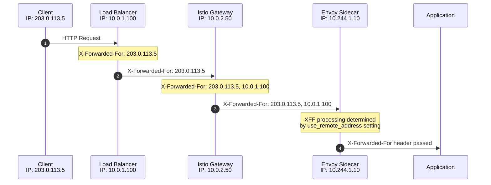
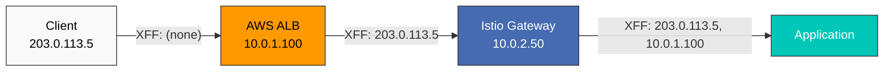
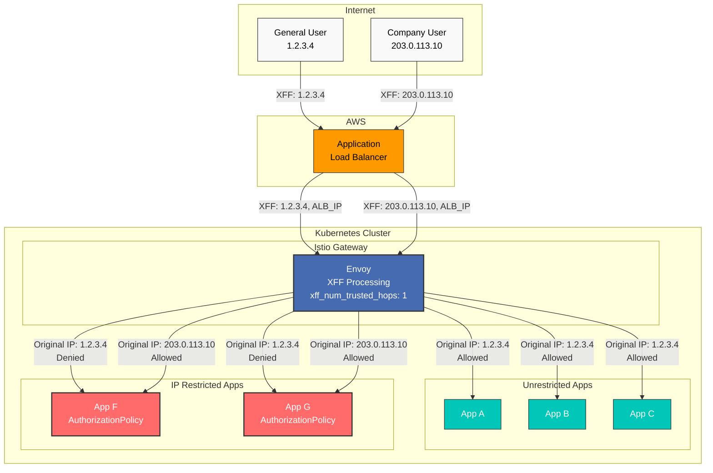
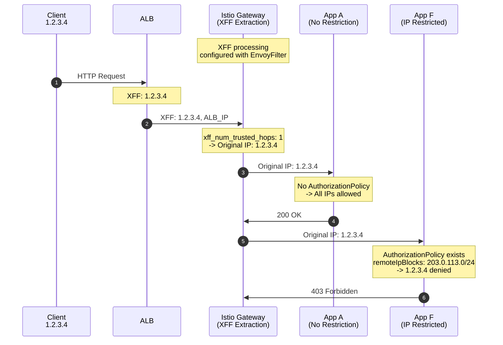
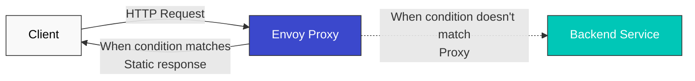

# EnvoyFilter

> **Versiones compatibles**: Istio 1.28+
> **Última actualización**: February 19, 2026

EnvoyFilter es una funcionalidad avanzada que permite personalizar directamente las configuraciones del proxy Envoy.

## Índice

1. [Descripción general](#overview)
2. [Estructura](#structure)
3. [Principales casos de uso](#main-use-cases)
4. [Configuración de X-Forwarded-For y saltos](#x-forwarded-for-and-hop-settings)
5. [Configuración de respuestas estáticas](#static-response-configuration)
6. [Ejemplos prácticos](#practical-examples)
7. [Prácticas recomendadas](#best-practices)
8. [Resolución de problemas](#troubleshooting)

## Descripción general

Con EnvoyFilter puedes:
- Agregar/modificar/eliminar encabezados personalizados
- Limitación de tasa
- Autorización externa
- Integración de plugins WASM

## Estructura

```yaml
apiVersion: networking.istio.io/v1alpha3
kind: EnvoyFilter
metadata:
  name: custom-filter
  namespace: default
spec:
  workloadSelector:
    labels:
      app: myapp
  configPatches:
  - applyTo: HTTP_FILTER
    match:
      context: SIDECAR_OUTBOUND
      listener:
        filterChain:
          filter:
            name: "envoy.filters.network.http_connection_manager"
    patch:
      operation: INSERT_BEFORE
      value:
        name: envoy.filters.http.lua
        typed_config:
          "@type": type.googleapis.com/envoy.extensions.filters.http.lua.v3.Lua
          inline_code: |
            function envoy_on_request(request_handle)
              request_handle:headers():add("x-custom-header", "value")
            end
```

## Principales casos de uso

### 1. Agregar encabezados personalizados

```yaml
apiVersion: networking.istio.io/v1alpha3
kind: EnvoyFilter
metadata:
  name: add-header
spec:
  workloadSelector:
    labels:
      app: myapp
  configPatches:
  - applyTo: HTTP_FILTER
    match:
      context: SIDECAR_OUTBOUND
    patch:
      operation: INSERT_BEFORE
      value:
        name: envoy.filters.http.lua
        typed_config:
          "@type": type.googleapis.com/envoy.extensions.filters.http.lua.v3.Lua
          inline_code: |
            function envoy_on_request(request_handle)
              request_handle:headers():add("x-request-id", request_handle:headers():get(":authority"))
              request_handle:headers():add("x-forwarded-proto", "https")
            end
```

### 2. Limitación de tasa

```yaml
apiVersion: networking.istio.io/v1alpha3
kind: EnvoyFilter
metadata:
  name: ratelimit
spec:
  workloadSelector:
    labels:
      app: api-service
  configPatches:
  - applyTo: HTTP_FILTER
    match:
      context: SIDECAR_INBOUND
    patch:
      operation: INSERT_BEFORE
      value:
        name: envoy.filters.http.local_ratelimit
        typed_config:
          "@type": type.googleapis.com/envoy.extensions.filters.http.local_ratelimit.v3.LocalRateLimit
          stat_prefix: http_local_rate_limiter
          token_bucket:
            max_tokens: 100
            tokens_per_fill: 10
            fill_interval: 1s
```

### 3. Plugin WASM

```yaml
apiVersion: networking.istio.io/v1alpha3
kind: EnvoyFilter
metadata:
  name: wasm-filter
spec:
  workloadSelector:
    labels:
      app: myapp
  configPatches:
  - applyTo: HTTP_FILTER
    match:
      context: SIDECAR_INBOUND
    patch:
      operation: INSERT_BEFORE
      value:
        name: envoy.filters.http.wasm
        typed_config:
          "@type": type.googleapis.com/envoy.extensions.filters.http.wasm.v3.Wasm
          config:
            vm_config:
              runtime: "envoy.wasm.runtime.v8"
              code:
                local:
                  filename: "/var/local/lib/wasm-filters/my_plugin.wasm"
```

## Configuración de X-Forwarded-For y saltos

Controlar el encabezado X-Forwarded-For (XFF) y el número de saltos es crucial para rastrear la IP real del cliente en entornos con cadenas de proxy.

### Descripción general de X-Forwarded-For



### Opciones de configuración de XFF

#### 1. Configuración de use_remote_address

**use_remote_address** determina cómo Envoy procesa el encabezado XFF.

```yaml
apiVersion: networking.istio.io/v1alpha3
kind: EnvoyFilter
metadata:
  name: xff-config
  namespace: istio-system
spec:
  workloadSelector:
    labels:
      istio: ingressgateway
  configPatches:
  - applyTo: NETWORK_FILTER
    match:
      context: GATEWAY
      listener:
        filterChain:
          filter:
            name: "envoy.filters.network.http_connection_manager"
    patch:
      operation: MERGE
      value:
        typed_config:
          "@type": type.googleapis.com/envoy.extensions.filters.network.http_connection_manager.v3.HttpConnectionManager
          use_remote_address: true
          xff_num_trusted_hops: 1
```

**Opciones de use_remote_address**:

| Configuración | Comportamiento | Escenario de uso |
|---------|------|--------------|
| `true` | Agrega la dirección downstream a XFF y confía en ella | Proxy perimetral (acceso directo a Internet) |
| `false` | No confía en la dirección downstream; pasa XFF sin cambios | Proxy interno (detrás de un proxy de confianza) |

#### 2. Configuración de xff_num_trusted_hops

**xff_num_trusted_hops** define el número de saltos de confianza en el encabezado XFF.

```yaml
apiVersion: networking.istio.io/v1alpha3
kind: EnvoyFilter
metadata:
  name: xff-trusted-hops
  namespace: istio-system
spec:
  workloadSelector:
    labels:
      istio: ingressgateway
  configPatches:
  - applyTo: NETWORK_FILTER
    match:
      context: GATEWAY
      listener:
        filterChain:
          filter:
            name: "envoy.filters.network.http_connection_manager"
    patch:
      operation: MERGE
      value:
        typed_config:
          "@type": type.googleapis.com/envoy.extensions.filters.network.http_connection_manager.v3.HttpConnectionManager
          use_remote_address: true
          xff_num_trusted_hops: 2  # Trust last 2 hops
          skip_xff_append: false
```

**Ejemplo de cálculo de xff_num_trusted_hops**:

```
X-Forwarded-For: 203.0.113.5, 10.0.1.100, 10.0.2.50, 10.244.1.10
                 [Client IP] [Proxy 1]   [Proxy 2]   [Proxy 3]

xff_num_trusted_hops: 0 -> Don't trust
  -> Client IP: 10.244.1.10 (last hop)

xff_num_trusted_hops: 1 -> Trust last 1
  -> Client IP: 10.0.2.50

xff_num_trusted_hops: 2 -> Trust last 2
  -> Client IP: 10.0.1.100

xff_num_trusted_hops: 3 -> Trust last 3
  -> Client IP: 203.0.113.5 (actual client)
```

### Configuración específica por escenario

#### Escenario 1: AWS ALB + Istio Gateway



**Configuración**:

```yaml
apiVersion: networking.istio.io/v1alpha3
kind: EnvoyFilter
metadata:
  name: gateway-xff-config
  namespace: istio-system
spec:
  workloadSelector:
    labels:
      istio: ingressgateway
  configPatches:
  - applyTo: NETWORK_FILTER
    match:
      context: GATEWAY
      listener:
        filterChain:
          filter:
            name: "envoy.filters.network.http_connection_manager"
    patch:
      operation: MERGE
      value:
        typed_config:
          "@type": type.googleapis.com/envoy.extensions.filters.network.http_connection_manager.v3.HttpConnectionManager
          use_remote_address: true
          xff_num_trusted_hops: 1  # Trust only ALB
          skip_xff_append: false
```

**Explicación**:
- `use_remote_address: true`: Gateway actúa como proxy perimetral
- `xff_num_trusted_hops: 1`: Confía en ALB (último salto)
- Resultado: la IP real del cliente (`203.0.113.5`) se extrae correctamente

#### Escenario 2: Cliente -> CloudFront -> ALB -> Gateway

```mermaid
flowchart LR
    Client[Client<br/>203.0.113.5]
    CF[CloudFront<br/>172.64.0.1]
    ALB[AWS ALB<br/>10.0.1.100]
    Gateway[Istio Gateway<br/>10.0.2.50]
    App[Application]

    Client -->|"XFF: (none)"| CF
    CF -->|"XFF: 203.0.113.5"| ALB
    ALB -->|"XFF: 203.0.113.5, 172.64.0.1"| Gateway
    Gateway -->|"XFF: 203.0.113.5, 172.64.0.1, 10.0.1.100"| App

    %% Style definitions
    classDef client fill:#f9f9f9,stroke:#333,stroke-width:1px,color:black;
    classDef aws fill:#FF9900,stroke:#333,stroke-width:1px,color:black;
    classDef istio fill:#466BB0,stroke:#333,stroke-width:1px,color:white;
    classDef app fill:#00C7B7,stroke:#333,stroke-width:1px,color:white;

    %% Apply classes
    class Client client;
    class CF,ALB aws;
    class Gateway istio;
    class App app;
```



**Configuración**:

```yaml
apiVersion: networking.istio.io/v1alpha3
kind: EnvoyFilter
metadata:
  name: gateway-xff-cf-alb
  namespace: istio-system
spec:
  workloadSelector:
    labels:
      istio: ingressgateway
  configPatches:
  - applyTo: NETWORK_FILTER
    match:
      context: GATEWAY
      listener:
        filterChain:
          filter:
            name: "envoy.filters.network.http_connection_manager"
    patch:
      operation: MERGE
      value:
        typed_config:
          "@type": type.googleapis.com/envoy.extensions.filters.network.http_connection_manager.v3.HttpConnectionManager
          use_remote_address: true
          xff_num_trusted_hops: 2  # Trust CloudFront + ALB
          skip_xff_append: false
```

**Cálculo de XFF**:
```
X-Forwarded-For: 203.0.113.5, 172.64.0.1, 10.0.1.100
                 [Actual IP]  [CloudFront IP] [ALB IP]

xff_num_trusted_hops: 2 -> Trust last 2 (CloudFront, ALB)
-> Actual client IP: 203.0.113.5
```

#### Escenario 3: Cliente -> CloudFront -> NLB -> ALB -> Gateway

```mermaid
flowchart LR
    Client[Client<br/>203.0.113.5]
    CF[CloudFront<br/>172.64.0.1]
    NLB[AWS NLB<br/>10.0.1.50]
    ALB[AWS ALB<br/>10.0.1.100]
    Gateway[Istio Gateway<br/>10.0.2.50]
    App[Application]

    Client -->|"XFF: (none)"| CF
    CF -->|"XFF: 203.0.113.5"| NLB
    NLB -->|"XFF: 203.0.113.5<br/>(L4, no modification)"| ALB
    ALB -->|"XFF: 203.0.113.5, 172.64.0.1"| Gateway
    Gateway -->|"XFF: 203.0.113.5, 172.64.0.1, 10.0.1.100"| App

    %% Style definitions
    classDef client fill:#f9f9f9,stroke:#333,stroke-width:1px,color:black;
    classDef aws fill:#FF9900,stroke:#333,stroke-width:1px,color:black;
    classDef istio fill:#466BB0,stroke:#333,stroke-width:1px,color:white;
    classDef app fill:#00C7B7,stroke:#333,stroke-width:1px,color:white;

    %% Apply classes
    class Client client;
    class CF,NLB,ALB aws;
    class Gateway istio;
    class App app;
```



**Configuración**:

```yaml
apiVersion: networking.istio.io/v1alpha3
kind: EnvoyFilter
metadata:
  name: gateway-xff-cf-nlb-alb
  namespace: istio-system
spec:
  workloadSelector:
    labels:
      istio: ingressgateway
  configPatches:
  - applyTo: NETWORK_FILTER
    match:
      context: GATEWAY
      listener:
        filterChain:
          filter:
            name: "envoy.filters.network.http_connection_manager"
    patch:
      operation: MERGE
      value:
        typed_config:
          "@type": type.googleapis.com/envoy.extensions.filters.network.http_connection_manager.v3.HttpConnectionManager
          use_remote_address: true
          xff_num_trusted_hops: 2  # Trust CloudFront + ALB (NLB is L4 so not counted)
          skip_xff_append: false
```

**Importante**: NLB es un balanceador de carga L4, por lo que no lee ni modifica encabezados XFF. Por lo tanto, no afecta la cadena XFF.

**Cálculo de XFF**:
```
X-Forwarded-For: 203.0.113.5, 172.64.0.1, 10.0.1.100
                 [Actual IP]  [CloudFront IP] [ALB IP]

NLB has no effect on XFF (L4 LB)
xff_num_trusted_hops: 2 -> Trust last 2 (CloudFront, ALB)
-> Actual client IP: 203.0.113.5
```

#### Escenario 4: Cliente -> ALB -> Gateway (conexión directa)


**Configuración**:

```yaml
apiVersion: networking.istio.io/v1alpha3
kind: EnvoyFilter
metadata:
  name: gateway-xff-alb-only
  namespace: istio-system
spec:
  workloadSelector:
    labels:
      istio: ingressgateway
  configPatches:
  - applyTo: NETWORK_FILTER
    match:
      context: GATEWAY
      listener:
        filterChain:
          filter:
            name: "envoy.filters.network.http_connection_manager"
    patch:
      operation: MERGE
      value:
        typed_config:
          "@type": type.googleapis.com/envoy.extensions.filters.network.http_connection_manager.v3.HttpConnectionManager
          use_remote_address: true
          xff_num_trusted_hops: 1  # Trust only ALB
          skip_xff_append: false
```

**Cálculo de XFF**:
```
X-Forwarded-For: 203.0.113.5, 10.0.1.100
                 [Actual IP]  [ALB IP]

xff_num_trusted_hops: 1 -> Trust last 1 (ALB)
-> Actual client IP: 203.0.113.5
```

#### Escenario 5: Comunicación de Service interno (Sidecar)

```yaml
apiVersion: networking.istio.io/v1alpha3
kind: EnvoyFilter
metadata:
  name: sidecar-xff-config
  namespace: default
spec:
  workloadSelector:
    labels:
      app: backend-service
  configPatches:
  - applyTo: NETWORK_FILTER
    match:
      context: SIDECAR_INBOUND
      listener:
        filterChain:
          filter:
            name: "envoy.filters.network.http_connection_manager"
    patch:
      operation: MERGE
      value:
        typed_config:
          "@type": type.googleapis.com/envoy.extensions.filters.network.http_connection_manager.v3.HttpConnectionManager
          use_remote_address: false  # Internal proxy, trusted environment
          xff_num_trusted_hops: 0
          skip_xff_append: false
```

### Opciones adicionales de XFF

#### skip_xff_append

No agregues el salto actual al encabezado XFF.

```yaml
apiVersion: networking.istio.io/v1alpha3
kind: EnvoyFilter
metadata:
  name: xff-skip-append
  namespace: istio-system
spec:
  workloadSelector:
    labels:
      istio: ingressgateway
  configPatches:
  - applyTo: NETWORK_FILTER
    match:
      context: GATEWAY
    patch:
      operation: MERGE
      value:
        typed_config:
          "@type": type.googleapis.com/envoy.extensions.filters.network.http_connection_manager.v3.HttpConnectionManager
          skip_xff_append: true  # Don't modify XFF header
```

**Escenario de uso**: cuando se necesita depurar o mantener una cadena XFF específica

#### Configuración del encabezado Via

Rastrea la cadena de proxy con el encabezado Via:

```yaml
apiVersion: networking.istio.io/v1alpha3
kind: EnvoyFilter
metadata:
  name: via-header
  namespace: istio-system
spec:
  workloadSelector:
    labels:
      istio: ingressgateway
  configPatches:
  - applyTo: NETWORK_FILTER
    match:
      context: GATEWAY
    patch:
      operation: MERGE
      value:
        typed_config:
          "@type": type.googleapis.com/envoy.extensions.filters.network.http_connection_manager.v3.HttpConnectionManager
          via: "istio-gateway"
```

### Ejemplo de extracción de la IP real del cliente

Extrae la IP real del cliente con un script Lua:

```yaml
apiVersion: networking.istio.io/v1alpha3
kind: EnvoyFilter
metadata:
  name: extract-real-ip
  namespace: default
spec:
  workloadSelector:
    labels:
      app: api-service
  configPatches:
  - applyTo: HTTP_FILTER
    match:
      context: SIDECAR_INBOUND
      listener:
        filterChain:
          filter:
            name: "envoy.filters.network.http_connection_manager"
            subFilter:
              name: "envoy.filters.http.router"
    patch:
      operation: INSERT_BEFORE
      value:
        name: envoy.filters.http.lua
        typed_config:
          "@type": type.googleapis.com/envoy.extensions.filters.http.lua.v3.Lua
          inline_code: |
            function envoy_on_request(request_handle)
              -- Get X-Forwarded-For header
              local xff = request_handle:headers():get("x-forwarded-for")

              if xff then
                -- First IP is the actual client IP
                local client_ip = xff:match("^([^,]+)")

                -- Set as custom header
                request_handle:headers():add("x-real-ip", client_ip)

                request_handle:logInfo("Real Client IP: " .. client_ip)
              end
            end
```

### Verificación y depuración de XFF

#### 1. Verificación de encabezados

```bash
# Verify headers inside pod
kubectl exec -it <pod-name> -c istio-proxy -- curl -v localhost:15000/config_dump | \
  jq '.configs[] | select(.["@type"] == "type.googleapis.com/envoy.admin.v3.ListenersConfigDump") |
      .dynamic_listeners[].active_state.listener.filter_chains[].filters[] |
      select(.name == "envoy.filters.network.http_connection_manager") |
      .typed_config | {use_remote_address, xff_num_trusted_hops}'
```

#### 2. Prueba con una solicitud real

```bash
# Test request with XFF header
curl -H "X-Forwarded-For: 203.0.113.5, 10.0.1.100" \
     http://your-gateway.example.com/api/test

# Check received headers in application logs
kubectl logs -n default <pod-name> -c app | grep -i "x-forwarded-for"
```

#### 3. Habilitar registros de acceso de Envoy

```yaml
apiVersion: networking.istio.io/v1alpha3
kind: EnvoyFilter
metadata:
  name: access-log-xff
  namespace: istio-system
spec:
  workloadSelector:
    labels:
      istio: ingressgateway
  configPatches:
  - applyTo: NETWORK_FILTER
    match:
      context: GATEWAY
    patch:
      operation: MERGE
      value:
        typed_config:
          "@type": type.googleapis.com/envoy.extensions.filters.network.http_connection_manager.v3.HttpConnectionManager
          access_log:
          - name: envoy.access_loggers.file
            typed_config:
              "@type": type.googleapis.com/envoy.extensions.access_loggers.file.v3.FileAccessLog
              path: /dev/stdout
              log_format:
                text_format: |
                  [%START_TIME%] "%REQ(:METHOD)% %REQ(X-ENVOY-ORIGINAL-PATH?:PATH)% %PROTOCOL%"
                  XFF: "%REQ(X-FORWARDED-FOR)%"
                  Real IP: "%DOWNSTREAM_REMOTE_ADDRESS%"
                  Status: %RESPONSE_CODE% Duration: %DURATION%ms
```

### Consideraciones de seguridad

#### 1. Prevención de suplantación de XFF

```yaml
apiVersion: networking.istio.io/v1alpha3
kind: EnvoyFilter
metadata:
  name: xff-security
  namespace: istio-system
spec:
  workloadSelector:
    labels:
      istio: ingressgateway
  configPatches:
  - applyTo: NETWORK_FILTER
    match:
      context: GATEWAY
    patch:
      operation: MERGE
      value:
        typed_config:
          "@type": type.googleapis.com/envoy.extensions.filters.network.http_connection_manager.v3.HttpConnectionManager
          use_remote_address: true
          xff_num_trusted_hops: 1
          # XFF from untrusted hops is ignored
```

**Importante**: en Edge Gateway, **debes** configurar `use_remote_address: true` para impedir que los clientes manipulen XFF.

#### 2. Proteger Services internos

```yaml
apiVersion: networking.istio.io/v1alpha3
kind: EnvoyFilter
metadata:
  name: internal-xff-strip
  namespace: default
spec:
  workloadSelector:
    labels:
      tier: backend
  configPatches:
  - applyTo: HTTP_FILTER
    match:
      context: SIDECAR_INBOUND
    patch:
      operation: INSERT_BEFORE
      value:
        name: envoy.filters.http.lua
        typed_config:
          "@type": type.googleapis.com/envoy.extensions.filters.http.lua.v3.Lua
          inline_code: |
            function envoy_on_request(request_handle)
              -- Remove XFF from requests not coming from internal network
              local remote_addr = request_handle:streamInfo():downstreamRemoteAddress():ip()

              -- Remove XFF if not from 10.0.0.0/8 internal network
              if not remote_addr:match("^10%.") then
                request_handle:headers():remove("x-forwarded-for")
                request_handle:logWarn("Removed potentially spoofed XFF from: " .. remote_addr)
              end
            end
```

### Restricción selectiva de IP por aplicación (Gateway + AuthorizationPolicy)

**Escenario**: algunas aplicaciones (A-E) permiten todos los clientes; aplicaciones específicas (F-G) permiten únicamente la IP NAT de la empresa

#### Descripción general de la arquitectura



#### Principio fundamental

**Función de Gateway** (común a todas las aplicaciones):
- Extraer la IP original del cliente del encabezado XFF
- Excluir los saltos de confianza (`xff_num_trusted_hops`)
- **NO realiza control de acceso**; solo identifica la IP con precisión

**Función de AuthorizationPolicy** (aplicada selectivamente a aplicaciones específicas):
- Control de acceso basado en la IP original extraída por Gateway
- Dirigirse a aplicaciones específicas con `selector`
- **Las aplicaciones sin políticas permiten todos los clientes**

#### Ejemplo de implementación

**Paso 1: procesamiento de XFF en Gateway (común a todas las aplicaciones)**

```yaml
# Apply once to istio-system namespace
apiVersion: networking.istio.io/v1alpha3
kind: EnvoyFilter
metadata:
  name: gateway-xff-config
  namespace: istio-system
spec:
  workloadSelector:
    labels:
      istio: ingressgateway
  configPatches:
  - applyTo: NETWORK_FILTER
    match:
      context: GATEWAY  # Gateway context
      listener:
        filterChain:
          filter:
            name: "envoy.filters.network.http_connection_manager"
    patch:
      operation: MERGE
      value:
        typed_config:
          "@type": type.googleapis.com/envoy.extensions.filters.network.http_connection_manager.v3.HttpConnectionManager
          use_remote_address: true
          xff_num_trusted_hops: 1  # Trust only ALB (2 if CloudFlare present)
          skip_xff_append: false
```

**Paso 2: aplicar restricción de IP a la aplicación F (selectiva)**

```yaml
# Allow only company NAT IP for App F
apiVersion: security.istio.io/v1
kind: AuthorizationPolicy
metadata:
  name: app-f-ip-restriction
  namespace: default
spec:
  selector:
    matchLabels:
      app: app-f  # Applied only to App F
  action: DENY
  rules:
  - from:
    - source:
        notRemoteIpBlocks:  # Deny if not following IPs
        - "203.0.113.0/24"  # Company NAT IP range
```

**Paso 3: aplicar restricción de IP a la aplicación G (selectiva)**

```yaml
# Allow same company NAT IP for App G
apiVersion: security.istio.io/v1
kind: AuthorizationPolicy
metadata:
  name: app-g-ip-restriction
  namespace: default
spec:
  selector:
    matchLabels:
      app: app-g  # Applied only to App G
  action: DENY
  rules:
  - from:
    - source:
        notRemoteIpBlocks:
        - "203.0.113.0/24"  # Company NAT IP range
```

**Paso 4: las aplicaciones A-E no tienen AuthorizationPolicy (se permiten todos los clientes)**

```yaml
# No AuthorizationPolicy created for Apps A-E
# = All client IPs allowed
```

#### Flujo de operación



#### ¿Por qué se necesita la configuración de Gateway?

**Sin configuración de XFF en Gateway**:
- `remoteIpBlocks` lee la IP de ALB (no la IP original)
- Todas las solicitudes parecen provenir de la misma IP de ALB, por lo que no se puede filtrar correctamente

**Con configuración de XFF en Gateway**:
- Gateway extrae con precisión la IP original del encabezado XFF
- `remoteIpBlocks` de AuthorizationPolicy usa la IP original
- AuthorizationPolicy de cada aplicación funciona correctamente

#### Pruebas

```bash
# General user (1.2.3.4) - App A access
curl -H "Host: app-a.example.com" http://<gateway-ip>/
# Expected: 200 OK

# General user (1.2.3.4) - App F access
curl -H "Host: app-f.example.com" http://<gateway-ip>/
# Expected: 403 Forbidden (RBAC: access denied)

# Company user (203.0.113.10) - App F access
curl -H "Host: app-f.example.com" -H "X-Forwarded-For: 203.0.113.10" http://<gateway-ip>/
# Expected: 200 OK

# Check AuthorizationPolicy
kubectl get authorizationpolicy -n default
# Output:
# NAME                    AGE
# app-f-ip-restriction    5m
# app-g-ip-restriction    5m
# (app-a, app-b, app-c, app-d, app-e are absent)
```

#### Resumen

| Componente | Alcance | Propósito | ¿Obligatorio? |
|----------|----------|------|----------|
| Gateway EnvoyFilter | Todas las aplicaciones | Extraer la IP original de XFF | Obligatorio (una vez) |
| AuthorizationPolicy de la aplicación F | Solo aplicación F | Permitir únicamente la IP NAT de la empresa | Selectivo |
| AuthorizationPolicy de la aplicación G | Solo aplicación G | Permitir únicamente la IP NAT de la empresa | Selectivo |
| AuthorizationPolicy de las aplicaciones A-E | Ninguno | Sin restricción (se permiten todas las IP) | No se necesita |

**Puntos clave**:
- La configuración de XFF de Gateway solo extrae la IP; no realiza control de acceso
- AuthorizationPolicy se aplica selectivamente solo a aplicaciones específicas
- Las aplicaciones sin políticas permiten automáticamente todos los clientes

---

### Control de acceso IP basado en XFF

Implementa el control de acceso basado en la IP original del cliente en el encabezado X-Forwarded-For.

**Método recomendado**: usa `remoteIpBlocks` de AuthorizationPolicy (más declarativo y seguro que EnvoyFilter)

#### 1. Lista de permitidos de IP con AuthorizationPolicy (recomendado)

```yaml
apiVersion: security.istio.io/v1
kind: AuthorizationPolicy
metadata:
  name: ip-whitelist
  namespace: default
spec:
  selector:
    matchLabels:
      app: api-service
  action: ALLOW
  rules:
  - from:
    - source:
        remoteIpBlocks:  # Original IP from X-Forwarded-For
        - "203.0.113.10/32"
        - "203.0.113.11/32"
        - "198.51.100.0/24"
```

**Ventajas**:
- Declarativo y fácil de entender
- Istio analiza automáticamente el encabezado XFF
- Compatibilidad con rangos CIDR
- Seguro durante las actualizaciones de Istio
- No se necesita código independiente

#### 2. Lista de bloqueados de IP con AuthorizationPolicy (recomendado)

```yaml
apiVersion: security.istio.io/v1
kind: AuthorizationPolicy
metadata:
  name: ip-blacklist
  namespace: default
spec:
  selector:
    matchLabels:
      app: api-service
  action: DENY
  rules:
  - from:
    - source:
        remoteIpBlocks:  # IPs to block
        - "192.0.2.100/32"
        - "192.0.2.101/32"
        - "198.51.100.0/24"
```

#### 3. Restricción de IP por ruta (AuthorizationPolicy)

```yaml
apiVersion: security.istio.io/v1
kind: AuthorizationPolicy
metadata:
  name: admin-path-ip-restriction
  namespace: default
spec:
  selector:
    matchLabels:
      app: api-service
  action: ALLOW
  rules:
  # Admin paths only specific IPs
  - to:
    - operation:
        paths: ["/admin/*"]
    from:
    - source:
        remoteIpBlocks:
        - "203.0.113.10/32"
        - "203.0.113.11/32"

  # General paths all IPs
  - to:
    - operation:
        notPaths: ["/admin/*"]
    from:
    - source:
        remoteIpBlocks:
        - "0.0.0.0/0"
```

#### 4. Política compleja: IP + ruta + método

```yaml
apiVersion: security.istio.io/v1
kind: AuthorizationPolicy
metadata:
  name: complex-access-control
  namespace: default
spec:
  selector:
    matchLabels:
      app: api-service
  action: ALLOW
  rules:
  # Admin: All paths accessible
  - from:
    - source:
        remoteIpBlocks:
        - "203.0.113.10/32"  # Admin IP

  # Internal network: API read only
  - to:
    - operation:
        paths: ["/api/v1/*"]
        methods: ["GET"]
    from:
    - source:
        remoteIpBlocks:
        - "10.0.0.0/8"  # Internal network

  # Public network: Public API only
  - to:
    - operation:
        paths: ["/api/v1/public/*"]
        methods: ["GET", "POST"]
    from:
    - source:
        remoteIpBlocks:
        - "0.0.0.0/0"
```

#### 5. Combinación de lista de permitidos y lista de bloqueados

```yaml
# Blacklist applied first (higher priority)
apiVersion: security.istio.io/v1
kind: AuthorizationPolicy
metadata:
  name: ip-blacklist
  namespace: default
spec:
  selector:
    matchLabels:
      app: api-service
  action: DENY
  rules:
  - from:
    - source:
        remoteIpBlocks:
        - "192.0.2.100/32"
        - "192.0.2.101/32"
        - "198.51.100.0/24"
---
# Whitelist applied
apiVersion: security.istio.io/v1
kind: AuthorizationPolicy
metadata:
  name: ip-whitelist
  namespace: default
spec:
  selector:
    matchLabels:
      app: api-service
  action: ALLOW
  rules:
  - from:
    - source:
        remoteIpBlocks:
        - "203.0.113.0/24"
        - "198.51.100.0/22"  # Larger range
```

**Orden de procesamiento**: las políticas DENY se evalúan primero, por lo que la lista de bloqueados tiene prioridad.

#### 6. Pruebas

```bash
# 1. Test from allowed IP
curl -H "X-Forwarded-For: 203.0.113.10" http://api-service:8080/api

# 2. Test from blocked IP
curl -H "X-Forwarded-For: 192.0.2.100" http://api-service:8080/api

# 3. IP not in Whitelist
curl -H "X-Forwarded-For: 1.2.3.4" http://api-service:8080/api

# 4. Admin path access test
curl -H "X-Forwarded-For: 203.0.113.10" http://api-service:8080/admin/users
curl -H "X-Forwarded-For: 10.0.1.100" http://api-service:8080/admin/users

# 5. Check policies
kubectl get authorizationpolicy -n default

# 6. Check logs (Envoy access logs)
kubectl logs -n default <pod-name> -c istio-proxy | grep "403"
```

#### 7. Avanzado: mensaje de denegación personalizado con EnvoyFilter (opcional)

AuthorizationPolicy devuelve el mensaje `RBAC: access denied` de forma predeterminada. Agrega EnvoyFilter solo si se necesita un mensaje personalizado:

```yaml
apiVersion: networking.istio.io/v1alpha3
kind: EnvoyFilter
metadata:
  name: custom-deny-message
  namespace: default
spec:
  workloadSelector:
    matchLabels:
      app: api-service
  configPatches:
  - applyTo: HTTP_FILTER
    match:
      context: SIDECAR_INBOUND
      listener:
        filterChain:
          filter:
            name: "envoy.filters.network.http_connection_manager"
            subFilter:
              name: "envoy.filters.http.router"
    patch:
      operation: INSERT_BEFORE
      value:
        name: envoy.filters.http.lua
        typed_config:
          "@type": type.googleapis.com/envoy.extensions.filters.http.lua.v3.Lua
          inline_code: |
            function envoy_on_response(response_handle)
              local status = response_handle:headers():get(":status")
              local body = response_handle:body():getBytes(0, 1000)

              -- Detect AuthorizationPolicy's 403 response
              if status == "403" and body and body:match("RBAC: access denied") then
                response_handle:body():setBytes('{"error": "Access denied", "code": "IP_NOT_ALLOWED"}')
                response_handle:headers():replace("content-type", "application/json")
              end
            end
```

### Prácticas recomendadas

1. **Configuración de Edge Gateway**:
   - `use_remote_address: true`
   - `xff_num_trusted_hops`: configúralo con el número de proxies de confianza

2. **Configuración de Sidecar interno**:
   - `use_remote_address: false`
   - `skip_xff_append: false`

3. **Verificación y pruebas**:
   - Prueba exhaustivamente el comportamiento de XFF antes del despliegue en producción
   - Verifica la extracción de la IP real del cliente con registros de acceso

4. **Seguridad**:
   - Evita la suplantación de XFF en el perímetro
   - Ignora XFF de fuentes no confiables

## Configuración de respuestas estáticas

Puedes devolver respuestas estáticas directamente, sin pasar por Services de backend, para solicitudes específicas. Esto es útil para el modo de mantenimiento, páginas de error, respuestas de health check, etc.

### Descripción general de respuestas estáticas



### Casos de uso

1. **Modo de mantenimiento**: devolver 503 Service Unavailable
2. **Endpoint de health check**: devolver 200 OK
3. **Páginas de error personalizadas**: respuestas de error JSON o HTML
4. **Respuestas de prueba/mock**: respuestas predefinidas para rutas específicas
5. **Rechazo rápido**: devolver 401 Unauthorized inmediatamente ante un fallo de autenticación

### Guía de selección del método de implementación

Istio proporciona varias formas de implementar respuestas estáticas:

| Método | Cuándo usarlo | Ventajas | Desventajas |
|------|----------|------|------|
| **VirtualService** | Respuestas estáticas simples, integración con reglas de enrutamiento | Declarativo, fácil de entender | Personalización limitada |
| **ProxyConfig** | Configuración de Envoy por workload | Control detallado, ajuste de rendimiento | Configuración compleja |
| **AuthorizationPolicy** | Control de acceso basado en IP/encabezado | Se integra con políticas de seguridad | No es solo para respuestas estáticas |
| **EnvoyFilter** | Solo cuando los métodos anteriores son insuficientes | Máxima flexibilidad | Complejo, riesgo en actualizaciones |

**Recomendación**: usa primero **VirtualService** y **AuthorizationPolicy** cuando sea posible; usa EnvoyFilter solo cuando sea necesario

### Implementación de respuestas estáticas con VirtualService

#### 1. Respuesta estática básica (directResponse)

```yaml
apiVersion: networking.istio.io/v1
kind: VirtualService
metadata:
  name: api-service
  namespace: default
spec:
  hosts:
  - api-service
  http:
  # Maintenance mode
  - match:
    - uri:
        prefix: "/api/v1"
    directResponse:
      status: 503
      body:
        string: |
          {
            "error": {
              "code": "SERVICE_UNAVAILABLE",
              "message": "The service is currently under maintenance",
              "timestamp": "2025-11-26T10:00:00Z",
              "retry_after": 3600
            }
          }
    headers:
      response:
        set:
          content-type: "application/json"
          retry-after: "3600"
```

**Resultado**:
```bash
$ curl -i http://api-service/api/v1/users
HTTP/1.1 503 Service Unavailable
content-type: application/json
retry-after: 3600

{
  "error": {
    "code": "SERVICE_UNAVAILABLE",
    "message": "The service is currently under maintenance",
    "timestamp": "2025-11-26T10:00:00Z",
    "retry_after": 3600
  }
}
```

#### 2. Endpoint de health check

```yaml
apiVersion: networking.istio.io/v1
kind: VirtualService
metadata:
  name: api-service-health
spec:
  hosts:
  - api-service
  http:
  # Health check path
  - match:
    - uri:
        exact: "/health"
    directResponse:
      status: 200
      body:
        string: "OK"

  # Normal traffic
  - route:
    - destination:
        host: api-service
```

#### 3. Bloquear rutas específicas

```yaml
apiVersion: networking.istio.io/v1
kind: VirtualService
metadata:
  name: block-admin
spec:
  hosts:
  - api-service
  http:
  # Block Admin paths
  - match:
    - uri:
        prefix: "/admin"
    directResponse:
      status: 403
      body:
        string: |
          {
            "error": "Access to admin endpoints is forbidden"
          }
    headers:
      response:
        set:
          content-type: "application/json"

  # Normal traffic
  - route:
    - destination:
        host: api-service
```

#### 4. Simulación de errores con inyección de fallos

```yaml
apiVersion: networking.istio.io/v1
kind: VirtualService
metadata:
  name: fault-injection
spec:
  hosts:
  - api-service
  http:
  - fault:
      abort:
        httpStatus: 503
        percentage:
          value: 100  # Apply to 100% traffic
    route:
    - destination:
        host: api-service
```

### Control de acceso con AuthorizationPolicy

#### 1. Control de acceso basado en IP de origen

```yaml
apiVersion: security.istio.io/v1
kind: AuthorizationPolicy
metadata:
  name: ip-whitelist
  namespace: default
spec:
  selector:
    matchLabels:
      app: api-service
  action: ALLOW
  rules:
  - from:
    - source:
        ipBlocks:
        - "203.0.113.10/32"
        - "203.0.113.11/32"
        - "198.51.100.0/24"
---
# Default DENY policy
apiVersion: security.istio.io/v1
kind: AuthorizationPolicy
metadata:
  name: deny-all
  namespace: default
spec:
  selector:
    matchLabels:
      app: api-service
  action: DENY
  rules:
  - from:
    - source:
        notIpBlocks:
        - "203.0.113.10/32"
        - "203.0.113.11/32"
        - "198.51.100.0/24"
```

#### 2. Restricción de IP por ruta

```yaml
apiVersion: security.istio.io/v1
kind: AuthorizationPolicy
metadata:
  name: admin-ip-whitelist
  namespace: default
spec:
  selector:
    matchLabels:
      app: api-service
  action: ALLOW
  rules:
  # Admin paths only specific IPs
  - to:
    - operation:
        paths: ["/admin/*"]
    from:
    - source:
        ipBlocks:
        - "203.0.113.10/32"
        - "203.0.113.11/32"

  # General paths all IPs
  - to:
    - operation:
        notPaths: ["/admin/*"]
```

#### 3. Control basado en el encabezado X-Forwarded-For

AuthorizationPolicy puede usar `remoteIpBlocks` para comprobar la IP original del encabezado X-Forwarded-For:

```yaml
apiVersion: security.istio.io/v1
kind: AuthorizationPolicy
metadata:
  name: xff-based-access
  namespace: default
spec:
  selector:
    matchLabels:
      app: api-service
  action: ALLOW
  rules:
  - from:
    - source:
        remoteIpBlocks:  # Original IP from X-Forwarded-For header
        - "203.0.113.0/24"
        - "198.51.100.0/24"
```

**Importante**: para que `remoteIpBlocks` funcione, `xff_num_trusted_hops` debe configurarse correctamente en Gateway (consulta [Configuración de XFF](#xff-configuration-options) arriba).

#### 4. Respuesta de denegación personalizada

Las solicitudes bloqueadas por AuthorizationPolicy devuelven una respuesta 403 de forma predeterminada, pero se pueden combinar con EnvoyFilter para proporcionar respuestas personalizadas:

```yaml
apiVersion: security.istio.io/v1
kind: AuthorizationPolicy
metadata:
  name: block-untrusted-ips
  namespace: default
spec:
  selector:
    matchLabels:
      app: api-service
  action: DENY
  rules:
  - from:
    - source:
        notRemoteIpBlocks:
        - "203.0.113.0/24"
---
# Add custom body to 403 response
apiVersion: networking.istio.io/v1alpha3
kind: EnvoyFilter
metadata:
  name: custom-deny-response
  namespace: default
spec:
  workloadSelector:
    matchLabels:
      app: api-service
  configPatches:
  - applyTo: HTTP_FILTER
    match:
      context: SIDECAR_INBOUND
      listener:
        filterChain:
          filter:
            name: "envoy.filters.network.http_connection_manager"
            subFilter:
              name: "envoy.filters.http.router"
    patch:
      operation: INSERT_BEFORE
      value:
        name: envoy.filters.http.lua
        typed_config:
          "@type": type.googleapis.com/envoy.extensions.filters.http.lua.v3.Lua
          inline_code: |
            function envoy_on_response(response_handle)
              local status = response_handle:headers():get(":status")

              if status == "403" then
                response_handle:body():setBytes('{"error": "Access denied", "code": "FORBIDDEN"}')
                response_handle:headers():replace("content-type", "application/json")
              end
            end
```

### Configuración de Envoy con ProxyConfig

ProxyConfig permite una configuración detallada del proxy Envoy por workload.

#### 1. Configuración del proxy por workload

```yaml
apiVersion: networking.istio.io/v1beta1
kind: ProxyConfig
metadata:
  name: api-service-config
  namespace: default
spec:
  selector:
    matchLabels:
      app: api-service
  concurrency: 4  # Worker thread count

  # Access log settings
  accessLogging:
  - providers:
    - name: envoy
      file:
        path: /dev/stdout
        format: |
          [%START_TIME%] "%REQ(:METHOD)% %REQ(X-ENVOY-ORIGINAL-PATH?:PATH)% %PROTOCOL%"
          Status: %RESPONSE_CODE% Duration: %DURATION%ms
          Client IP: %REQ(X-FORWARDED-FOR)%

  # Timeout settings
  connectionTimeout: 10s
  drainDuration: 5s

  # Resource limits
  resourceLimits:
    maxConnections: 10000
```

#### 2. Configuración de estadísticas y métricas

```yaml
apiVersion: networking.istio.io/v1beta1
kind: ProxyConfig
metadata:
  name: monitoring-config
  namespace: default
spec:
  selector:
    matchLabels:
      app: api-service

  # Statistics settings
  stats:
    inclusionPrefixes:
    - "cluster.outbound"
    - "http.inbound"
    inclusionSuffixes:
    - "upstream_rq_time"

  # Tracing settings
  tracing:
    sampling: 100.0  # 100% sampling
    maxPathTagLength: 256
```

### Ejemplo integrado: VirtualService + AuthorizationPolicy

Ejemplo integrado para escenarios reales de producción.

#### Escenario: proteger el Service de API

```yaml
# 1. IP based access control
apiVersion: security.istio.io/v1
kind: AuthorizationPolicy
metadata:
  name: api-access-control
  namespace: default
spec:
  selector:
    matchLabels:
      app: api-service
  action: ALLOW
  rules:
  # Admin API only specific IPs
  - to:
    - operation:
        paths: ["/api/v1/admin/*"]
    from:
    - source:
        remoteIpBlocks:
        - "203.0.113.10/32"  # Admin IP

  # Public API all trusted networks
  - to:
    - operation:
        paths: ["/api/v1/public/*"]
    from:
    - source:
        remoteIpBlocks:
        - "0.0.0.0/0"  # All IPs (in practice only trusted ranges)
---
# 2. Routing and static responses
apiVersion: networking.istio.io/v1
kind: VirtualService
metadata:
  name: api-service-routes
spec:
  hosts:
  - api-service
  http:
  # Health check
  - match:
    - uri:
        exact: "/health"
    directResponse:
      status: 200
      body:
        string: '{"status": "healthy"}'
    headers:
      response:
        set:
          content-type: "application/json"

  # Block legacy API version
  - match:
    - uri:
        prefix: "/api/v0/"
    directResponse:
      status: 410
      body:
        string: |
          {
            "error": "API v0 is deprecated",
            "supported_versions": ["v1", "v2"],
            "migration_guide": "https://docs.example.com/migration"
          }
    headers:
      response:
        set:
          content-type: "application/json"

  # Normal routing
  - route:
    - destination:
        host: api-service
        port:
          number: 8080
    timeout: 30s
    retries:
      attempts: 3
      perTryTimeout: 10s
---
# 3. Proxy settings
apiVersion: networking.istio.io/v1beta1
kind: ProxyConfig
metadata:
  name: api-service-proxy
  namespace: default
spec:
  selector:
    matchLabels:
      app: api-service
  concurrency: 4
  accessLogging:
  - providers:
    - name: envoy
      file:
        path: /dev/stdout
```

### Respuestas estáticas dinámicas con Lua

Los scripts Lua pueden generar dinámicamente respuestas estáticas según las condiciones.

#### Detección automática de la ventana de mantenimiento

```yaml
apiVersion: networking.istio.io/v1alpha3
kind: EnvoyFilter
metadata:
  name: maintenance-window
  namespace: default
spec:
  workloadSelector:
    labels:
      app: api-service
  configPatches:
  - applyTo: HTTP_FILTER
    match:
      context: SIDECAR_INBOUND
      listener:
        filterChain:
          filter:
            name: "envoy.filters.network.http_connection_manager"
            subFilter:
              name: "envoy.filters.http.router"
    patch:
      operation: INSERT_BEFORE
      value:
        name: envoy.filters.http.lua
        typed_config:
          "@type": type.googleapis.com/envoy.extensions.filters.http.lua.v3.Lua
          inline_code: |
            function envoy_on_request(request_handle)
              -- Current time (UTC)
              local current_hour = tonumber(os.date("!%H"))

              -- Daily maintenance window 2-4 AM
              if current_hour >= 2 and current_hour < 4 then
                request_handle:respond(
                  {[":status"] = "503",
                   ["content-type"] = "application/json",
                   ["retry-after"] = "3600"},
                  '{"error": "Maintenance in progress", "window": "02:00-04:00 UTC"}'
                )
              end
            end
```

#### Respuesta basada en el encabezado de la solicitud

```yaml
apiVersion: networking.istio.io/v1alpha3
kind: EnvoyFilter
metadata:
  name: header-based-response
  namespace: default
spec:
  workloadSelector:
    labels:
      app: api-service
  configPatches:
  - applyTo: HTTP_FILTER
    match:
      context: SIDECAR_INBOUND
      listener:
        filterChain:
          filter:
            name: "envoy.filters.network.http_connection_manager"
            subFilter:
              name: "envoy.filters.http.router"
    patch:
      operation: INSERT_BEFORE
      value:
        name: envoy.filters.http.lua
        typed_config:
          "@type": type.googleapis.com/envoy.extensions.filters.http.lua.v3.Lua
          inline_code: |
            function envoy_on_request(request_handle)
              local api_version = request_handle:headers():get("x-api-version")

              -- Unsupported API version
              if api_version and api_version == "v1" then
                request_handle:respond(
                  {[":status"] = "410",
                   ["content-type"] = "application/json"},
                  '{"error": "API v1 is deprecated", "supported_versions": ["v2", "v3"]}'
                )
              end
            end
```

### Integración con VirtualService

VirtualService y EnvoyFilter se pueden usar juntos para implementar escenarios de enrutamiento más complejos.

```yaml
apiVersion: networking.istio.io/v1
kind: VirtualService
metadata:
  name: api-service
spec:
  hosts:
  - api-service
  http:
  - match:
    - uri:
        prefix: "/maintenance"
    fault:
      abort:
        httpStatus: 503
        percentage:
          value: 100
    route:
    - destination:
        host: api-service
  - route:
    - destination:
        host: api-service
---
apiVersion: networking.istio.io/v1alpha3
kind: EnvoyFilter
metadata:
  name: maintenance-response-body
  namespace: default
spec:
  workloadSelector:
    labels:
      app: api-service
  configPatches:
  - applyTo: HTTP_FILTER
    match:
      context: SIDECAR_INBOUND
    patch:
      operation: INSERT_BEFORE
      value:
        name: envoy.filters.http.lua
        typed_config:
          "@type": type.googleapis.com/envoy.extensions.filters.http.lua.v3.Lua
          inline_code: |
            function envoy_on_response(response_handle)
              local status = response_handle:headers():get(":status")
              local path = response_handle:headers():get(":path")

              -- Add custom body when VirtualService returns 503
              if status == "503" and path and path:match("^/maintenance") then
                response_handle:body():setBytes('{"message": "Service under maintenance"}')
                response_handle:headers():replace("content-type", "application/json")
              end
            end
```

### Escenarios prácticos

#### Escenario 1: bloquear tráfico durante un despliegue azul/verde

```yaml
apiVersion: networking.istio.io/v1alpha3
kind: EnvoyFilter
metadata:
  name: deployment-block
  namespace: production
spec:
  workloadSelector:
    labels:
      app: api-service
      version: v1  # Block only old version
  configPatches:
  - applyTo: HTTP_ROUTE
    match:
      context: SIDECAR_INBOUND
    patch:
      operation: MERGE
      value:
        direct_response:
          status: 503
          body:
            inline_string: |
              {
                "message": "This version is being deprecated",
                "migration": {
                  "new_endpoint": "https://api-v2.example.com",
                  "cutoff_date": "2025-12-31"
                }
              }
        response_headers_to_add:
        - header:
            key: "Content-Type"
            value: "application/json"
        - header:
            key: "X-Migration-Required"
            value: "true"
```

#### Escenario 2: respuesta 429 al superar el límite de tasa

```yaml
apiVersion: networking.istio.io/v1alpha3
kind: EnvoyFilter
metadata:
  name: ratelimit-response
  namespace: default
spec:
  workloadSelector:
    labels:
      app: api-service
  configPatches:
  # Rate Limit filter
  - applyTo: HTTP_FILTER
    match:
      context: SIDECAR_INBOUND
      listener:
        filterChain:
          filter:
            name: "envoy.filters.network.http_connection_manager"
            subFilter:
              name: "envoy.filters.http.router"
    patch:
      operation: INSERT_BEFORE
      value:
        name: envoy.filters.http.local_ratelimit
        typed_config:
          "@type": type.googleapis.com/envoy.extensions.filters.http.local_ratelimit.v3.LocalRateLimit
          stat_prefix: http_local_rate_limiter
          token_bucket:
            max_tokens: 100
            tokens_per_fill: 10
            fill_interval: 1s
          filter_enabled:
            runtime_key: local_rate_limit_enabled
            default_value:
              numerator: 100
              denominator: HUNDRED
          filter_enforced:
            runtime_key: local_rate_limit_enforced
            default_value:
              numerator: 100
              denominator: HUNDRED
          response_headers_to_add:
          - append: false
            header:
              key: x-local-rate-limit
              value: 'true'
          local_rate_limit_per_downstream_connection: false
          # Custom 429 response
          status:
            code: 429
          response_headers_to_add:
          - header:
              key: "Content-Type"
              value: "application/json"

  # Lua filter to add 429 response body
  - applyTo: HTTP_FILTER
    match:
      context: SIDECAR_INBOUND
      listener:
        filterChain:
          filter:
            name: "envoy.filters.network.http_connection_manager"
            subFilter:
              name: "envoy.filters.http.router"
    patch:
      operation: INSERT_BEFORE
      value:
        name: envoy.filters.http.lua
        typed_config:
          "@type": type.googleapis.com/envoy.extensions.filters.http.lua.v3.Lua
          inline_code: |
            function envoy_on_response(response_handle)
              local status = response_handle:headers():get(":status")
              local rate_limited = response_handle:headers():get("x-local-rate-limit")

              if status == "429" and rate_limited == "true" then
                local body = [[
                {
                  "error": {
                    "code": "RATE_LIMIT_EXCEEDED",
                    "message": "Too many requests",
                    "retry_after": 60
                  }
                }
                ]]
                response_handle:body():setBytes(body)
                response_handle:headers():add("Retry-After", "60")
              end
            end
```

#### Escenario 3: respuesta de prueba de despliegue canary

```yaml
apiVersion: networking.istio.io/v1alpha3
kind: EnvoyFilter
metadata:
  name: canary-test-response
  namespace: default
spec:
  workloadSelector:
    labels:
      app: api-service
      version: canary
  configPatches:
  - applyTo: HTTP_FILTER
    match:
      context: SIDECAR_INBOUND
      listener:
        filterChain:
          filter:
            name: "envoy.filters.network.http_connection_manager"
            subFilter:
              name: "envoy.filters.http.router"
    patch:
      operation: INSERT_BEFORE
      value:
        name: envoy.filters.http.lua
        typed_config:
          "@type": type.googleapis.com/envoy.extensions.filters.http.lua.v3.Lua
          inline_code: |
            function envoy_on_request(request_handle)
              local test_header = request_handle:headers():get("x-canary-test")

              -- Return predefined response if canary test header present
              if test_header == "dry-run" then
                request_handle:respond(
                  {[":status"] = "200",
                   ["content-type"] = "application/json",
                   ["x-canary-version"] = "v2.0.0"},
                  '{"message": "Canary version response", "version": "v2.0.0"}'
                )
              end
            end
```

### Pruebas y verificación

#### Pruebas de respuestas estáticas

```bash
# 1. Test basic 503 response
curl -i http://api-service:8080/api/v1

# 2. Test health check endpoint
curl -i http://api-service:8080/health

# 3. Test JSON error response
curl -i -H "Content-Type: application/json" http://api-service:8080/api/v1/users

# 4. Test maintenance window (time manipulation)
kubectl exec -it <pod-name> -c istio-proxy -- date -s "02:30:00"
curl -i http://api-service:8080/api/v1

# 5. Rate Limit test
for i in {1..150}; do
  curl -i http://api-service:8080/api/v1
done
```

#### Verificar la configuración de Envoy

```bash
# 1. Verify static response route
istioctl proxy-config routes <pod-name> -n default -o json | \
  jq '.[] | select(.virtualHosts[].routes[].directResponse != null)'

# 2. Check full route configuration
istioctl proxy-config routes <pod-name> -n default

# 3. Verify EnvoyFilter applied
kubectl get envoyfilter -n default maintenance-mode -o yaml

# 4. Verify via Envoy Admin API
kubectl port-forward <pod-name> 15000:15000
curl http://localhost:15000/config_dump | jq '.configs[] | select(.["@type"] == "type.googleapis.com/envoy.admin.v3.RoutesConfigDump")'
```

### Prácticas recomendadas

1. **Mensajes de error claros**:
   - Proporciona a los usuarios la causa y la solución
   - Especifica el tiempo de reintento con el encabezado `Retry-After`

2. **Formato de error coherente**:
   - Usa el mismo esquema JSON para todas las respuestas de error
   - Mantén la coherencia entre los códigos de estado HTTP y los códigos de error

3. **Registro y monitoreo**:
   - Registra cuándo se devuelven respuestas estáticas
   - Realiza seguimiento de la frecuencia de respuestas estáticas con métricas

4. **Aplicación gradual**:
   - Aplica los cambios gradualmente al pasar al modo de mantenimiento
   - Prueba con un despliegue canary antes de la aplicación completa

5. **Plan de reversión**:
   - Restaura inmediatamente el tráfico normal eliminando EnvoyFilter
   - Scripts de reversión automatizada para emergencias

### Precauciones

1. **Prioridad**: las respuestas estáticas de EnvoyFilter pueden tener prioridad sobre VirtualService
2. **Rendimiento**: los scripts Lua se ejecutan en cada solicitud; considera el impacto en el rendimiento
3. **Seguridad**: ten cuidado de no exponer información confidencial en los mensajes de error
4. **Caché**: las respuestas estáticas también necesitan configuración del encabezado `Cache-Control`
5. **Métricas**: las respuestas estáticas generan métricas diferentes de las respuestas normales

## Ejemplos prácticos

### Ejemplo 1: registro de solicitudes/respuestas

```yaml
apiVersion: networking.istio.io/v1alpha3
kind: EnvoyFilter
metadata:
  name: request-response-logging
spec:
  workloadSelector:
    labels:
      app: api-service
  configPatches:
  - applyTo: HTTP_FILTER
    match:
      context: SIDECAR_INBOUND
    patch:
      operation: INSERT_BEFORE
      value:
        name: envoy.filters.http.lua
        typed_config:
          "@type": type.googleapis.com/envoy.extensions.filters.http.lua.v3.Lua
          inline_code: |
            function envoy_on_request(request_handle)
              request_handle:logInfo("Request: " .. request_handle:headers():get(":path"))
            end

            function envoy_on_response(response_handle)
              response_handle:logInfo("Response: " .. response_handle:headers():get(":status"))
            end
```

### Ejemplo 2: validación de JWT

```yaml
apiVersion: networking.istio.io/v1alpha3
kind: EnvoyFilter
metadata:
  name: jwt-auth
spec:
  workloadSelector:
    labels:
      app: api-service
  configPatches:
  - applyTo: HTTP_FILTER
    match:
      context: SIDECAR_INBOUND
    patch:
      operation: INSERT_BEFORE
      value:
        name: envoy.filters.http.jwt_authn
        typed_config:
          "@type": type.googleapis.com/envoy.extensions.filters.http.jwt_authn.v3.JwtAuthentication
          providers:
            auth0:
              issuer: "https://example.auth0.com/"
              audiences:
              - "api.example.com"
              remote_jwks:
                http_uri:
                  uri: "https://example.auth0.com/.well-known/jwks.json"
                  cluster: "auth0_jwks"
                  timeout: 5s
```

## Prácticas recomendadas

1. **Usa workloadSelector**: aplícalo solo a workloads específicos
2. **Primero el entorno de prueba**: realiza pruebas suficientes antes de producción
3. **Compatibilidad de versiones de Istio**: comprueba la API para cada versión
4. **Monitoreo del rendimiento**: supervisa el rendimiento después de agregar EnvoyFilter

## Resolución de problemas

```bash
# Check EnvoyFilter
kubectl get envoyfilter -A

# Verify Envoy configuration
istioctl proxy-config listeners <pod-name> -n <namespace> -o json

# Check logs
kubectl logs -n <namespace> <pod-name> -c istio-proxy
```

## Referencias

- [Referencia de EnvoyFilter](https://istio.io/latest/docs/reference/config/networking/envoy-filter/)
- [Documentación de Envoy](https://www.envoyproxy.io/docs/envoy/latest/)
- [Plugins WASM](https://istio.io/latest/docs/concepts/wasm/)
