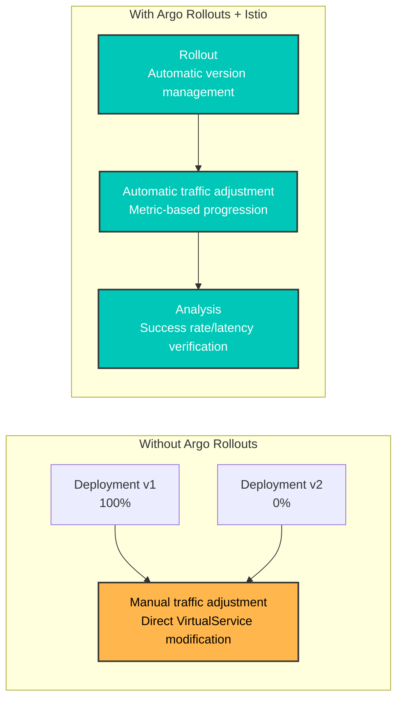
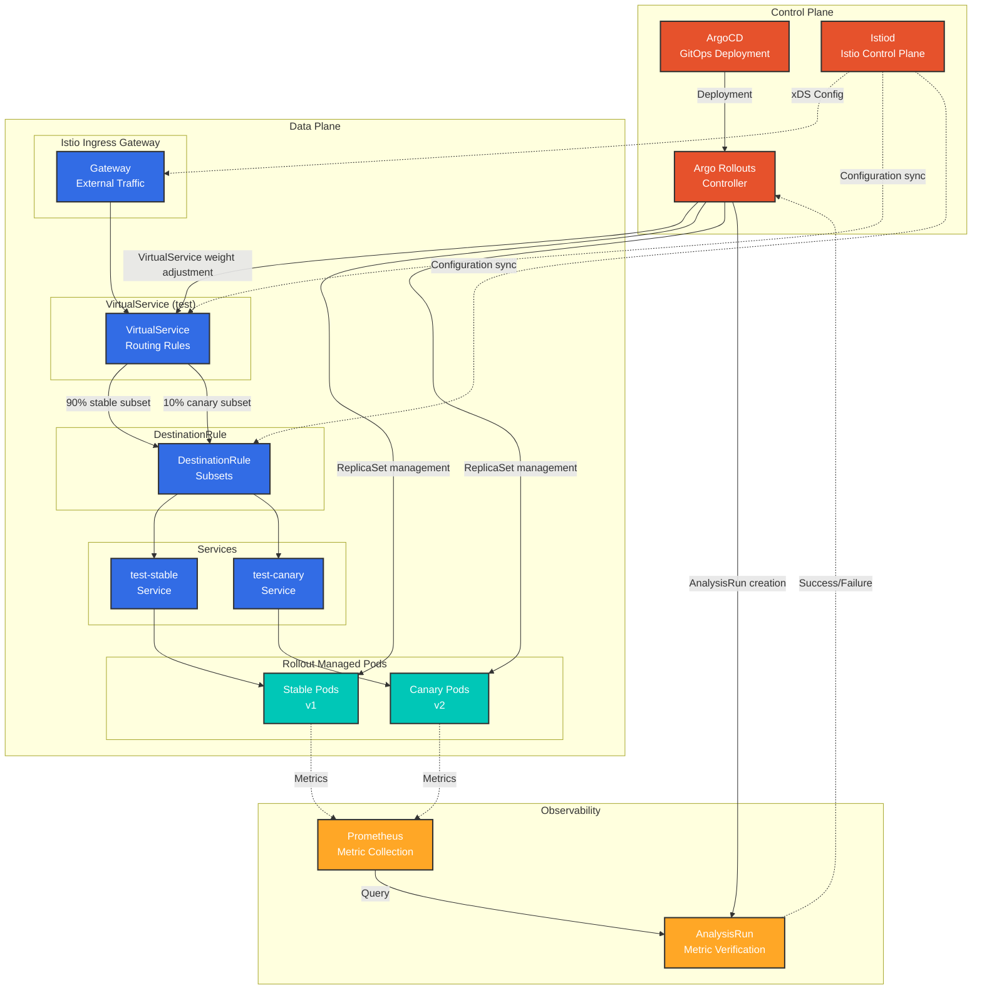
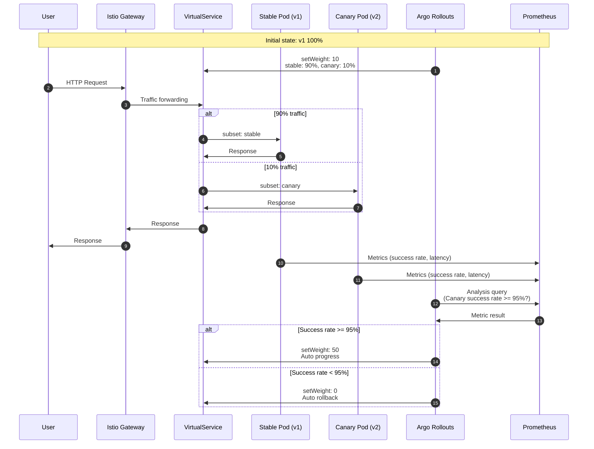
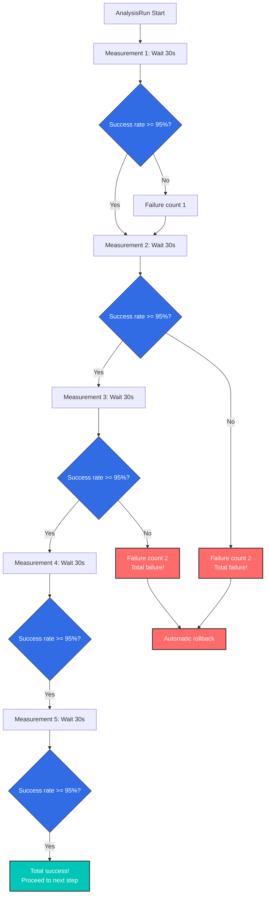
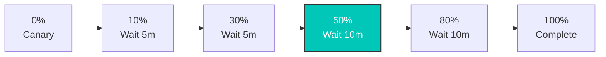
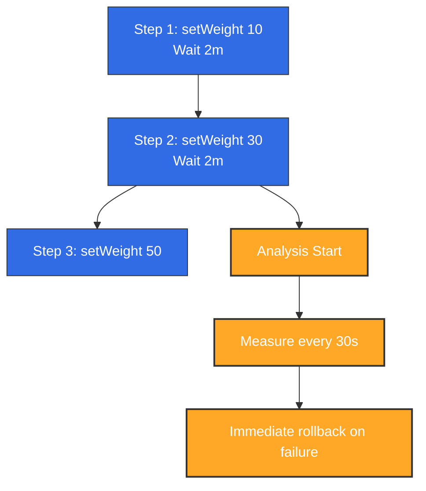
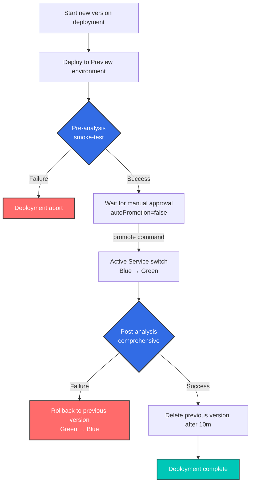

# Argo Rollouts e integración con Istio

> **Versiones compatibles**: Argo Rollouts 1.6+, Istio 1.18+
> **Última actualización**: February 19, 2026
> **Dificultad**: ⭐⭐⭐⭐ (Avanzado)

Este documento explica en detalle cómo implementar Progressive Delivery mediante la integración de Argo Rollouts con Istio Service Mesh.

## Tabla de contenidos

1. [Descripción general](#overview)
2. [Arquitectura](#architecture)
3. [Conceptos fundamentales](#core-concepts)
4. [Configuración y preparación](#setup-and-configuration)
5. [Estrategias de enrutamiento de tráfico](#traffic-routing-strategies)
6. [Análisis y métricas](#analysis-and-metrics)
7. [Patrones avanzados de despliegue](#advanced-deployment-patterns)
8. [Solución de problemas](#troubleshooting)
9. [Mejores prácticas](#best-practices)

## Descripción general

### ¿Qué es Argo Rollouts?

Argo Rollouts es un controlador de Progressive Delivery para Kubernetes que proporciona estrategias de despliegue avanzadas:

- **Despliegue Canary**: Desplazamiento gradual del tráfico
- **Despliegue Blue/Green**: Cambio y rollback instantáneos
- **Automatización basada en análisis**: Progresión/rollback automáticos basados en métricas
- **Integración de gestión de tráfico**: Compatibilidad con Istio, Nginx, ALB, etc.

### Beneficios de la integración con Istio



**Beneficios principales**:
- ✅ **Despliegue Canary automatizado**: Ajuste automático de peso de VirtualService
- ✅ **Verificación basada en métricas**: Progresión/rollback automáticos con métricas de Prometheus
- ✅ **Control de tráfico detallado**: Aprovechamiento del enrutamiento L7 de Istio
- ✅ **Despliegue sin tiempo de inactividad**: Sin interrupciones durante el cambio de tráfico
- ✅ **Rollback automático**: Rollback automático cuando aumenta la tasa de errores

### Recursos de Istio compatibles

| Recurso | Propósito | Gestión de Argo Rollouts |
|----------|------|-------------------|
| **VirtualService** | Reglas de enrutamiento de tráfico | ✅ Ajuste automático del peso de las rutas |
| **DestinationRule** | Definición de subset | ⚠️ Se requiere creación manual |
| **Service** | Endpoints Stable/Canary | ⚠️ Se requiere creación manual |

## Arquitectura

### Arquitectura general



### Flujo de tráfico



## Conceptos fundamentales

### 1. Recurso Rollout

Rollout es un recurso personalizado que reemplaza a Deployment y admite estrategias de despliegue avanzadas.

**Comparación con Deployment**:

| Característica | Deployment | Rollout |
|------|-----------|---------|
| **Rollout básico** | ✅ RollingUpdate | ✅ RollingUpdate |
| **Despliegue Canary** | ❌ | ✅ Control de peso del tráfico |
| **Blue/Green** | ❌ | ✅ Cambio instantáneo |
| **Automatización basada en análisis** | ❌ | ✅ AnalysisTemplate |
| **Integración de gestión de tráfico** | ❌ | ✅ Istio, Nginx, ALB |
| **Rollback automático** | ❌ | ✅ Basado en métricas |

### 2. Método de gestión de VirtualService

**Importante**: Argo Rollouts **sobrescribe todo el array de destinos** del nombre de ruta especificado.

```yaml
# VirtualService initial state
apiVersion: networking.istio.io/v1
kind: VirtualService
metadata:
  name: test
spec:
  http:
  - name: primary  # Route managed by Rollout
    route:
    - destination: {host: test, subset: stable}
      weight: 100
    - destination: {host: test, subset: canary}
      weight: 0
```

**Configuración de Rollout**:
```yaml
apiVersion: argoproj.io/v1alpha1
kind: Rollout
spec:
  strategy:
    canary:
      trafficRouting:
        istio:
          virtualService:
            name: test          # VirtualService name
            routes:
            - primary           # Route name to manage
          destinationRule:
            name: test          # DestinationRule name
            canarySubsetName: canary
            stableSubsetName: stable
      steps:
      - setWeight: 10  # → Modifies primary route of VirtualService
```

**Cuando se ejecuta setWeight: 10**:
```yaml
# Automatically modified by Argo Rollouts
http:
- name: primary
  route:
  - destination: {host: test, subset: stable}
    weight: 90   # ← Auto adjusted
  - destination: {host: test, subset: canary}
    weight: 10   # ← Auto adjusted
```

**Precauciones**:
- ⚠️ Se produce un conflicto si varios Rollout hacen referencia al mismo nombre de ruta
- ⚠️ Rollout gestiona **todos los destinos** de la ruta
- ⚠️ La misma ruta no se puede compartir ni siquiera con nombres de subset diferentes

### 3. Subset y Service

**Subset de DestinationRule**:
```yaml
apiVersion: networking.istio.io/v1
kind: DestinationRule
metadata:
  name: test
spec:
  host: test  # Matches Service name
  subsets:
  - name: stable
    labels: {}  # ← Empty labels (uses Service selector)
  - name: canary
    labels: {}  # ← Empty labels (uses Service selector)
```

**Service Stable/Canary**:
```yaml
# Stable Service
apiVersion: v1
kind: Service
metadata:
  name: test-stable
spec:
  selector:
    app: test
    # Label automatically added by Rollout
    rollouts-pod-template-hash: <stable-hash>
  ports:
  - port: 8080

---
# Canary Service
apiVersion: v1
kind: Service
metadata:
  name: test-canary
spec:
  selector:
    app: test
    # Label automatically added by Rollout
    rollouts-pod-template-hash: <canary-hash>
  ports:
  - port: 8080
```

**Método de funcionamiento**:
1. Cuando Rollout despliega una versión nueva, crea una etiqueta `rollouts-pod-template-hash` nueva
2. Añade automáticamente esa etiqueta hash a los Pods Canary
3. Canary Service selecciona únicamente esos Pods
4. Cuando Rollout finaliza, Stable Service se actualiza con el nuevo hash

### 4. Análisis y métricas

**AnalysisTemplate**:
```yaml
apiVersion: argoproj.io/v1alpha1
kind: AnalysisTemplate
metadata:
  name: success-rate
spec:
  args:
  - name: service-name
  - name: canary-hash
  metrics:
  - name: success-rate
    interval: 30s              # Measure every 30 seconds
    count: 5                   # 5 measurements
    successCondition: result >= 0.95  # Must be 95% or above for success
    failureLimit: 2            # Entire failure after 2 failures
    provider:
      prometheus:
        address: http://prometheus.istio-system:9090
        query: |
          sum(rate(
            istio_requests_total{
              destination_service_name="{{args.service-name}}",
              destination_workload_label_rollouts_pod_template_hash="{{args.canary-hash}}",
              response_code!~"5.*"
            }[2m]
          ))
          /
          sum(rate(
            istio_requests_total{
              destination_service_name="{{args.service-name}}",
              destination_workload_label_rollouts_pod_template_hash="{{args.canary-hash}}"
            }[2m]
          ))
```

**AnalysisRun**:


## Configuración y preparación

### Creación de recursos necesarios

#### 1. Recurso Rollout

```yaml
apiVersion: argoproj.io/v1alpha1
kind: Rollout
metadata:
  name: test
  namespace: default
spec:
  replicas: 3
  revisionHistoryLimit: 2  # Number of ReplicaSets to keep
  selector:
    matchLabels:
      app: test
  template:
    metadata:
      labels:
        app: test
    spec:
      containers:
      - name: app
        image: myapp:v1
        ports:
        - containerPort: 8080
        resources:
          requests:
            cpu: 100m
            memory: 128Mi
          limits:
            cpu: 200m
            memory: 256Mi
  strategy:
    canary:
      # Stable/Canary Service specification
      canaryService: test-canary
      stableService: test-stable

      # Istio traffic routing
      trafficRouting:
        istio:
          virtualService:
            name: test              # VirtualService name
            routes:
            - primary               # Route name to manage
          destinationRule:
            name: test              # DestinationRule name
            canarySubsetName: canary
            stableSubsetName: stable

      # Deployment steps
      steps:
      - setWeight: 10
      - pause: {duration: 5m}
      - setWeight: 20
      - pause: {duration: 5m}
      - setWeight: 50
      - pause: {duration: 5m}
      - setWeight: 80
      - pause: {duration: 5m}
```

#### 2. Service Stable/Canary

```yaml
# Stable Service
apiVersion: v1
kind: Service
metadata:
  name: test-stable
  namespace: default
spec:
  selector:
    app: test
    # rollouts-pod-template-hash is auto-added by Rollout
  ports:
  - name: http
    port: 8080
    targetPort: 8080

---
# Canary Service
apiVersion: v1
kind: Service
metadata:
  name: test-canary
  namespace: default
spec:
  selector:
    app: test
    # rollouts-pod-template-hash is auto-added by Rollout
  ports:
  - name: http
    port: 8080
    targetPort: 8080

---
# Unified Service (referenced by VirtualService)
apiVersion: v1
kind: Service
metadata:
  name: test
  namespace: default
spec:
  selector:
    app: test
  ports:
  - name: http
    port: 8080
    targetPort: 8080
```

#### 3. VirtualService

```yaml
apiVersion: networking.istio.io/v1
kind: VirtualService
metadata:
  name: test
  namespace: default
spec:
  hosts:
  - test
  - test.default.svc.cluster.local
  http:
  - name: primary  # Route managed by Rollout
    route:
    - destination:
        host: test
        subset: stable
      weight: 100  # ← Auto adjusted by Rollout
    - destination:
        host: test
        subset: canary
      weight: 0    # ← Auto adjusted by Rollout
```

#### 4. DestinationRule

```yaml
apiVersion: networking.istio.io/v1
kind: DestinationRule
metadata:
  name: test
  namespace: default
spec:
  host: test
  trafficPolicy:
    loadBalancer:
      simple: LEAST_REQUEST
  subsets:
  - name: stable
    labels: {}  # Empty labels (uses Service selector)
  - name: canary
    labels: {}  # Empty labels (uses Service selector)
```

### Flujo de trabajo de despliegue

```bash
# 1. Deploy new version
kubectl argo rollouts set image test app=myapp:v2

# 2. Check status (real-time monitoring)
kubectl argo rollouts get rollout test --watch

# Output example:
# Name:            test
# Namespace:       default
# Status:          ॥ Paused
# Strategy:        Canary
#   Step:          1/8
#   SetWeight:     10
#   ActualWeight:  10
# Images:          myapp:v1 (stable)
#                  myapp:v2 (canary)
# Replicas:
#   Desired:       3
#   Current:       4
#   Updated:       1
#   Ready:         4
#   Available:     4

# 3. Manually proceed to next step (after pause)
kubectl argo rollouts promote test

# 4. Immediate rollback (if issues occur)
kubectl argo rollouts abort test

# 5. Retry after rollback
kubectl argo rollouts retry rollout test
```

## Estrategias de enrutamiento de tráfico

### 1. Canary básico (basado en peso)

```yaml
spec:
  strategy:
    canary:
      steps:
      - setWeight: 10   # 10% traffic
      - pause: {duration: 5m}
      - setWeight: 30
      - pause: {duration: 5m}
      - setWeight: 50
      - pause: {duration: 10m}
      - setWeight: 80
      - pause: {duration: 10m}
      # 100% auto transition
```

**Gráfico de transición del tráfico**:


### 2. Enrutamiento basado en encabezados

**Caso de uso**: Exponer la versión Canary solo a grupos de usuarios específicos (evaluadores internos)

```yaml
# VirtualService configuration
apiVersion: networking.istio.io/v1
kind: VirtualService
metadata:
  name: test
spec:
  http:
  # Priority 1: Header matching (Beta users → Canary)
  - name: header-route
    match:
    - headers:
        x-beta-user:
          exact: "true"
    route:
    - destination:
        host: test
        subset: canary
      weight: 100

  # Priority 2: Normal traffic (weight-based)
  - name: primary
    route:
    - destination:
        host: test
        subset: stable
      weight: 90
    - destination:
        host: test
        subset: canary
      weight: 10
```

```yaml
# Rollout configuration
spec:
  strategy:
    canary:
      trafficRouting:
        istio:
          virtualService:
            name: test
            routes:
            - primary  # Manages only primary route
      steps:
      - setWeight: 10
      - pause: {duration: 5m}
      - setWeight: 50
      - pause: {duration: 10m}
```

**Comportamiento**:
- Solicitudes con el encabezado `x-beta-user: true` → 100% Canary
- Solicitudes normales → Peso gestionado por Rollout (10% → 50% → 100%)

### 3. Tráfico espejo (Shadow Testing)

**Caso de uso**: Copiar el tráfico de producción a Canary (ignorar la respuesta)

```yaml
apiVersion: networking.istio.io/v1
kind: VirtualService
metadata:
  name: test
spec:
  http:
  - name: primary
    route:
    - destination:
        host: test
        subset: stable
      weight: 100  # Actual traffic 100% Stable
    mirror:
      host: test
      subset: canary
    mirrorPercentage:
      value: 10.0  # Copy 10% to Canary (ignore response)
```

**Características**:
- ✅ Sin impacto en los usuarios reales (la respuesta procede solo de Stable)
- ✅ Verifica el rendimiento/errores de Canary con tráfico de producción
- ⚠️ Ten cuidado con las operaciones de escritura de Canary (posible duplicación de datos)

### 4. Gestión de múltiples rutas

**Caso de uso**: Ajustar el tráfico de varias rutas simultáneamente

```yaml
# VirtualService configuration
apiVersion: networking.istio.io/v1
kind: VirtualService
metadata:
  name: test
spec:
  http:
  - name: api-route  # API path
    match:
    - uri:
        prefix: /api
    route:
    - destination: {host: test, subset: stable}
      weight: 100
    - destination: {host: test, subset: canary}
      weight: 0

  - name: web-route  # Web path
    match:
    - uri:
        prefix: /web
    route:
    - destination: {host: test, subset: stable}
      weight: 100
    - destination: {host: test, subset: canary}
      weight: 0
```

```yaml
# Rollout configuration
spec:
  strategy:
    canary:
      trafficRouting:
        istio:
          virtualService:
            name: test
            routes:
            - api-route  # Manage both routes
            - web-route
      steps:
      - setWeight: 10  # Adjusts both routes to 10%
```

## Análisis y métricas

Argo Rollouts utiliza métricas de Prometheus recopiladas por Istio para determinar automáticamente el éxito de los despliegues Canary. Esta es la arquitectura de integración de las métricas de Argo Rollouts e Istio:


*Fuente: [Documentación oficial de Argo Rollouts](https://argo-rollouts.readthedocs.io/en/stable/features/traffic-management/istio/)*

### 1. Integración básica de análisis

```yaml
apiVersion: argoproj.io/v1alpha1
kind: Rollout
spec:
  strategy:
    canary:
      analysis:
        templates:
        - templateName: success-rate
        args:
        - name: service-name
          value: test
      steps:
      - setWeight: 10
      - pause: {duration: 5m}
      - analysis:  # ← Analysis runs at this step
          templates:
          - templateName: success-rate
          args:
          - name: service-name
            value: test
      - setWeight: 50
```

### 2. Análisis en segundo plano

```yaml
spec:
  strategy:
    canary:
      analysis:
        templates:
        - templateName: success-rate
        startingStep: 2  # Runs continuously in background from step 2
        args:
        - name: service-name
          value: test
      steps:
      - setWeight: 10
      - pause: {duration: 2m}
      - setWeight: 30
      - pause: {duration: 2m}
      - setWeight: 50
```

**Comportamiento**:


### 3. Análisis de métricas compuestas

```yaml
apiVersion: argoproj.io/v1alpha1
kind: AnalysisTemplate
metadata:
  name: comprehensive-analysis
spec:
  args:
  - name: service-name
  - name: canary-hash
  metrics:
  # Metric 1: Success rate
  - name: success-rate
    interval: 30s
    count: 5
    successCondition: result >= 0.95
    failureLimit: 2
    provider:
      prometheus:
        address: http://prometheus.istio-system:9090
        query: |
          sum(rate(
            istio_requests_total{
              destination_service_name="{{args.service-name}}",
              destination_workload_label_rollouts_pod_template_hash="{{args.canary-hash}}",
              response_code!~"5.*"
            }[2m]
          ))
          /
          sum(rate(
            istio_requests_total{
              destination_service_name="{{args.service-name}}",
              destination_workload_label_rollouts_pod_template_hash="{{args.canary-hash}}"
            }[2m]
          ))

  # Metric 2: P95 Latency
  - name: latency-p95
    interval: 30s
    count: 5
    successCondition: result <= 0.5  # 500ms or less
    failureLimit: 2
    provider:
      prometheus:
        address: http://prometheus.istio-system:9090
        query: |
          histogram_quantile(0.95,
            sum(rate(
              istio_request_duration_milliseconds_bucket{
                destination_service_name="{{args.service-name}}",
                destination_workload_label_rollouts_pod_template_hash="{{args.canary-hash}}"
              }[2m]
            )) by (le)
          ) / 1000

  # Metric 3: Error rate
  - name: error-rate
    interval: 30s
    count: 5
    successCondition: result <= 0.01  # 1% or less
    failureLimit: 2
    provider:
      prometheus:
        address: http://prometheus.istio-system:9090
        query: |
          sum(rate(
            istio_requests_total{
              destination_service_name="{{args.service-name}}",
              destination_workload_label_rollouts_pod_template_hash="{{args.canary-hash}}",
              response_code=~"5.*"
            }[2m]
          ))
          /
          sum(rate(
            istio_requests_total{
              destination_service_name="{{args.service-name}}",
              destination_workload_label_rollouts_pod_template_hash="{{args.canary-hash}}"
            }[2m]
          ))
```

### 4. Análisis pre/post

```yaml
spec:
  strategy:
    canary:
      # Pre-analysis (before deployment)
      analysis:
        templates:
        - templateName: pre-deployment-check
        args:
        - name: service-name
          value: test

      steps:
      - setWeight: 10
      - pause: {duration: 5m}
      - setWeight: 50

      # Post-analysis (after deployment)
      analysis:
        templates:
        - templateName: post-deployment-check
        args:
        - name: service-name
          value: test
```

## Patrones avanzados de despliegue

### 1. Despliegue Blue/Green

```yaml
apiVersion: argoproj.io/v1alpha1
kind: Rollout
metadata:
  name: test
spec:
  replicas: 3
  strategy:
    blueGreen:
      # Preview/Active Service specification
      previewService: test-preview
      activeService: test-active

      # Auto promotion (default: manual)
      autoPromotionEnabled: false

      # Pre-analysis
      prePromotionAnalysis:
        templates:
        - templateName: smoke-test

      # Post-analysis
      postPromotionAnalysis:
        templates:
        - templateName: comprehensive-analysis
        args:
        - name: service-name
          value: test

      # Previous version retention time
      scaleDownDelaySeconds: 600  # Delete previous version after 10 minutes
```

**VirtualService (Blue/Green)**:
```yaml
apiVersion: networking.istio.io/v1
kind: VirtualService
metadata:
  name: test
spec:
  http:
  - route:
    - destination:
        host: test-active  # ← Auto switched by Rollout
      weight: 100
```

**Flujo de funcionamiento**:


### 2. Canary con Experiment

**Caso de uso**: Probar varias versiones simultáneamente durante el despliegue Canary

```yaml
apiVersion: argoproj.io/v1alpha1
kind: Rollout
spec:
  strategy:
    canary:
      steps:
      - setWeight: 10
      - pause: {duration: 2m}

      # Experiment execution
      - experiment:
          duration: 10m
          templates:
          - name: canary-v2
            specRef: canary
            weight: 10
          - name: experimental-v3
            specRef: experimental
            weight: 5
          analyses:
          - name: compare-versions
            templateName: version-comparison

      - setWeight: 50
      - pause: {duration: 5m}
```

### 3. Rollout progresivo

```yaml
spec:
  strategy:
    canary:
      # Very slow rollout
      steps:
      - setWeight: 1    # Start from 1%
      - pause: {duration: 1h}
      - setWeight: 5
      - pause: {duration: 1h}
      - setWeight: 10
      - pause: {duration: 2h}
      - setWeight: 25
      - pause: {duration: 4h}
      - setWeight: 50
      - pause: {duration: 8h}
      - setWeight: 75
      - pause: {duration: 8h}
      # 100% (total 24+ hours)

      # Background Analysis
      analysis:
        templates:
        - templateName: comprehensive-analysis
        startingStep: 1
```

## Solución de problemas

### 1. VirtualService no se actualiza

**Síntoma**:
```bash
kubectl argo rollouts get rollout test
# Status: ॥ Paused
# Message: CannotUpdateVirtualService: ...
```

**Causa**:
- VirtualService no existe
- El nombre de la ruta es incorrecto
- Istio no está instalado

**Solución**:
```bash
# 1. Check VirtualService
kubectl get virtualservice test -o yaml

# 2. Check route name
kubectl get virtualservice test -o jsonpath='{.spec.http[*].name}'

# 3. Check Rollout configuration
kubectl get rollout test -o jsonpath='{.spec.strategy.canary.trafficRouting.istio}'
```

### 2. El Pod Canary no recibe tráfico

**Síntoma**: No llega tráfico al Pod Canary aunque setWeight: 10 esté configurado

**Causa**:
- El subset de DestinationRule está configurado incorrectamente
- El selector de Service no encuentra Pods

**Verificación**:
```bash
# 1. Check pod labels
kubectl get pods -l app=test --show-labels

# Output:
# NAME                    LABELS
# test-abc123-xyz         app=test,rollouts-pod-template-hash=abc123
# test-def456-xyz         app=test,rollouts-pod-template-hash=def456

# 2. Check if Canary Service selects correct pods
kubectl get endpoints test-canary

# 3. Check VirtualService → DestinationRule → Service path
istioctl proxy-config clusters <pod-name> | grep test
```

### 3. Error de análisis

**Síntoma**:
```bash
kubectl get analysisrun
# NAME                       STATUS   AGE
# test-abc123-1              Failed   5m
```

**Verificación**:
```bash
# Check Analysis logs
kubectl describe analysisrun test-abc123-1

# Test Prometheus query
kubectl port-forward -n istio-system svc/prometheus 9090:9090

# Run query in browser
# http://localhost:9090/graph
```

**Problemas habituales**:
- La dirección de Prometheus es incorrecta
- La métrica no existe (tráfico insuficiente)
- Error de sintaxis de la consulta

### 4. El rollback no funciona

**Síntoma**: `kubectl argo rollouts abort` no funciona

**Causa**: Todos los pasos ya se completaron (100%)

**Solución**:
```bash
# 1. Check current status
kubectl argo rollouts status test

# 2. Revert to previous version
kubectl argo rollouts undo test

# Or to specific revision
kubectl argo rollouts undo test --to-revision=2
```

### 5. Comandos de depuración

```bash
# 1. Rollout status (detailed)
kubectl argo rollouts get rollout test

# 2. Rollout events
kubectl describe rollout test

# 3. Check ReplicaSet
kubectl get replicaset -l app=test

# 4. Check VirtualService weight
kubectl get virtualservice test -o yaml | grep -A 10 "name: primary"

# 5. Check Istio proxy configuration
istioctl proxy-config route <pod-name> --name 8080

# 6. Check AnalysisRun
kubectl get analysisrun -l rollout=test

# 7. Rollout Controller logs
kubectl logs -n argo-rollouts deployment/argo-rollouts
```

## Mejores prácticas

### 1. Diseño de los pasos de despliegue

**Pasos recomendados**:
```yaml
steps:
- setWeight: 5      # Very small start
  pause: {duration: 5m}
- setWeight: 10     # Small-scale verification
  pause: {duration: 10m}
- setWeight: 25     # Meaningful traffic
  pause: {duration: 15m}
- setWeight: 50     # Half transition
  pause: {duration: 30m}
- setWeight: 75     # Most transition
  pause: {duration: 30m}
# 100% auto complete
```

**Principios**:
- ✅ Comienza con pasos pequeños (5-10%)
- ✅ Tiempo de verificación suficiente en cada paso
- ✅ Tiempo de espera más largo después del 50% (la mayor parte del tráfico)
- ✅ Transición rápida del último 20-30%

### 2. Configuración de análisis

```yaml
metrics:
- name: success-rate
  interval: 30s        # Not too short (minimum 30s)
  count: 5             # Sufficient samples (minimum 5)
  successCondition: result >= 0.95  # Reasonable threshold
  failureLimit: 2      # Don't fail immediately
```

**Principios**:
- ✅ Combinaciones de varias métricas (tasa de éxito + latencia + tasa de errores)
- ✅ Tiempo de medición suficiente (mínimo 2-3 minutos)
- ✅ Permite errores temporales con `failureLimit`
- ✅ Supervisa todo el despliegue con Analysis en segundo plano

### 3. Configuración de Service

```yaml
# ❌ Wrong example: version label in selector
apiVersion: v1
kind: Service
metadata:
  name: test-stable
spec:
  selector:
    app: test
    version: v1  # ← Wrong! Should use hash managed by Rollout

---
# ✅ Correct example: Rollout manages hash
apiVersion: v1
kind: Service
metadata:
  name: test-stable
spec:
  selector:
    app: test
    # rollouts-pod-template-hash is auto-added
```

### 4. Gestión de recursos

```yaml
spec:
  revisionHistoryLimit: 2  # Minimum 2 (for rollback)
  progressDeadlineSeconds: 600  # 10 minute timeout

  template:
    spec:
      containers:
      - name: app
        resources:
          requests:
            cpu: 100m
            memory: 128Mi
          limits:
            cpu: 200m      # 2x of request
            memory: 256Mi  # 2x of request
```

### 5. Configuración de HA

```yaml
spec:
  replicas: 3  # Minimum 3 (1 per AZ)

  strategy:
    canary:
      maxSurge: 1         # Maximum 1 extra pod
      maxUnavailable: 0   # Maintain minimum replicas
```

**PodDisruptionBudget**:
```yaml
apiVersion: policy/v1
kind: PodDisruptionBudget
metadata:
  name: test-pdb
spec:
  minAvailable: 2  # Maintain minimum 2
  selector:
    matchLabels:
      app: test
```

### 6. Lista de verificación de despliegue

Antes del despliegue:
- [ ] Service Stable/Canary creado
- [ ] VirtualService y DestinationRule creados
- [ ] AnalysisTemplate definido
- [ ] Recopilación de métricas de Prometheus verificada
- [ ] Pasos de Rollout revisados

Durante el despliegue:
- [ ] Supervisar con `kubectl argo rollouts get rollout --watch`
- [ ] Verificar la recepción de tráfico del Pod Canary
- [ ] Confirmar que las métricas de Analysis son normales
- [ ] Supervisar los registros de errores

Después del despliegue:
- [ ] Confirmar la transición al 100%
- [ ] Verificar la eliminación del ReplicaSet anterior
- [ ] Verificación final de métricas

### 7. Adopción gradual

**Paso 1**: Canary básico
```yaml
steps:
- setWeight: 10
- pause: {}  # Manual approval
```

**Paso 2**: Añadir Analysis automático
```yaml
steps:
- setWeight: 10
- pause: {duration: 5m}
- analysis:
    templates:
    - templateName: success-rate
```

**Paso 3**: Analysis en segundo plano
```yaml
analysis:
  templates:
  - templateName: success-rate
  startingStep: 1
```

**Paso 4**: Métricas compuestas
```yaml
analysis:
  templates:
  - templateName: comprehensive-analysis  # Success rate + latency + error rate
```

## Referencias

### Documentos relacionados
- [División de tráfico - Despliegue Canary](../traffic-management/04-traffic-splitting.md)
- [Argo Rollouts con reconocimiento de zona](09-zone-aware-argo-rollouts.md)
- [VirtualService](../traffic-management/01-gateway-virtualservice.md)
- [DestinationRule](../traffic-management/03-destination-rule.md)

### Enlaces externos
- [Documentación oficial de Argo Rollouts](https://argo-rollouts.readthedocs.io/)
- [Gestión de tráfico de Istio](https://argo-rollouts.readthedocs.io/en/stable/features/traffic-management/istio/)
- [Ejemplos de AnalysisTemplate](https://github.com/argoproj/argo-rollouts/tree/master/examples)

## Próximos pasos

1. [Implementación de Rollout con reconocimiento de zona](09-zone-aware-argo-rollouts.md)
