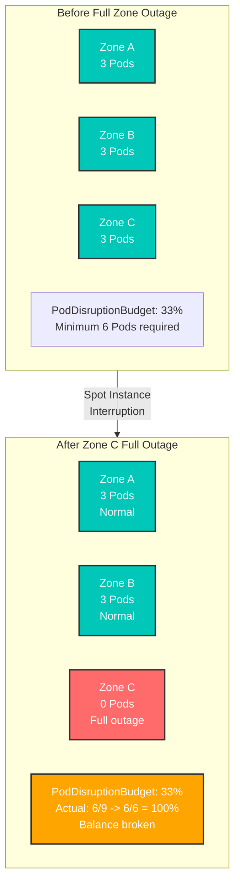
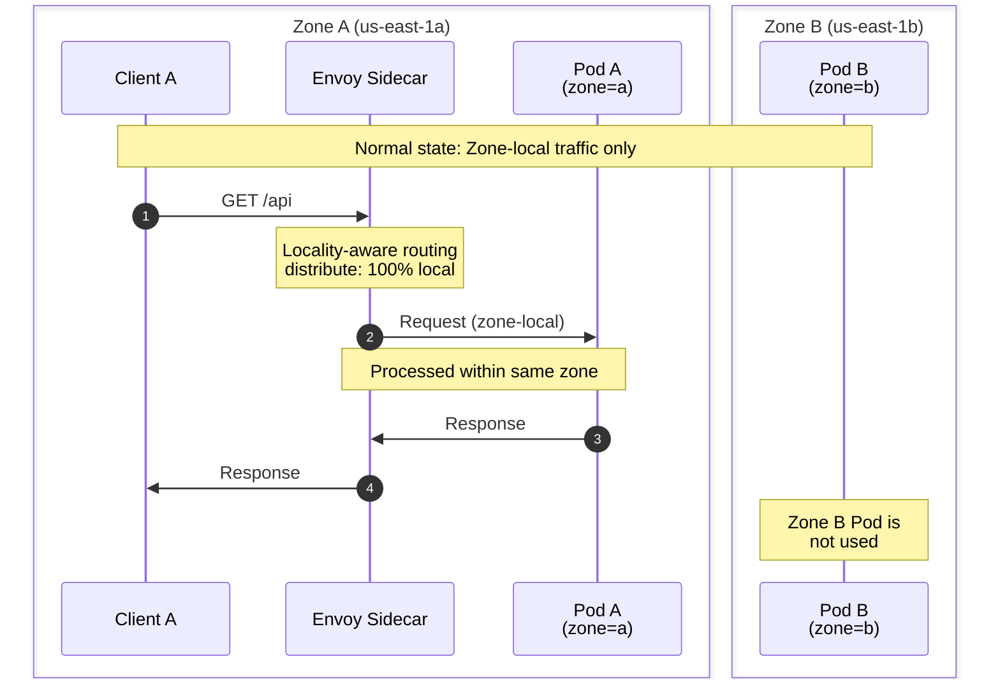
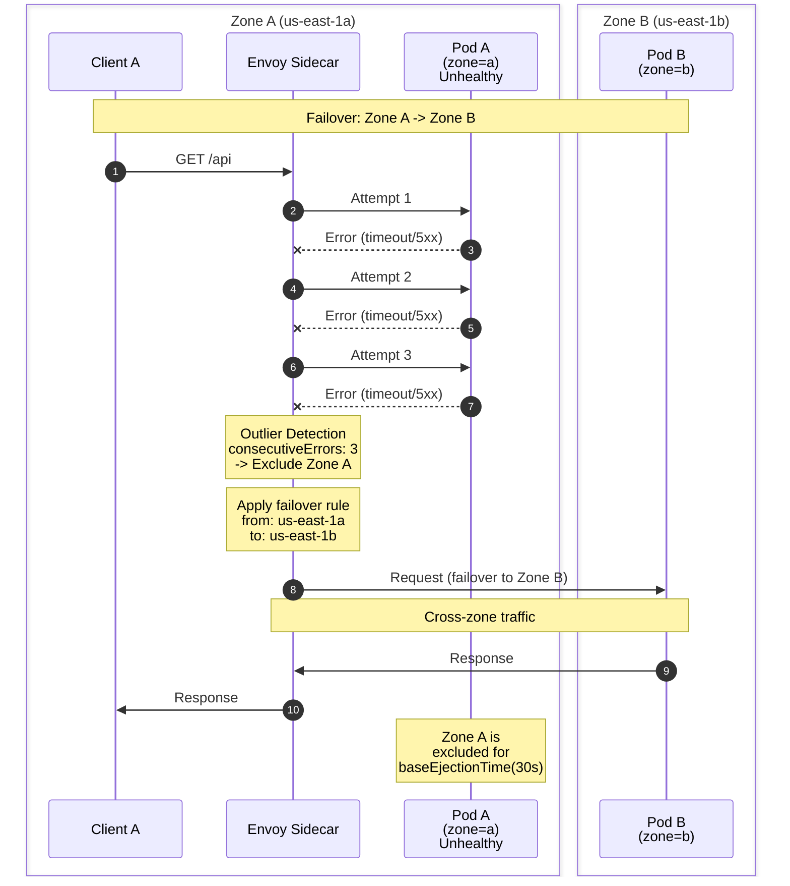
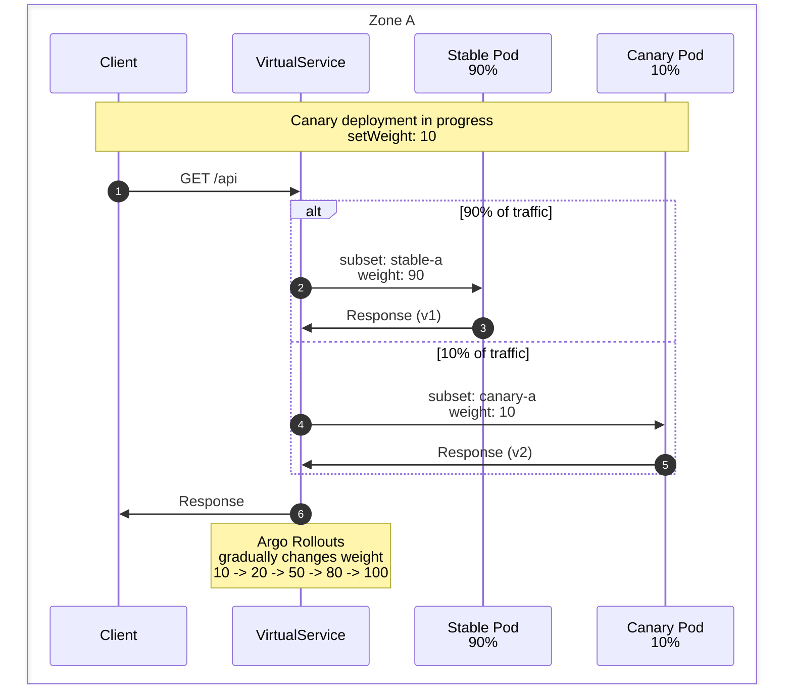

# Argo Rollouts conscientes de las zonas

> **Versiones compatibles**: Istio 1.18+, Argo Rollouts 1.6+ **Última actualización**: February 19, 2026 **Dificultad**: Experto

Este documento explica cómo configurar despliegues Canary de Argo Rollouts independientes por cada Availability Zone de AWS, aprovechando el enrutamiento consciente de la localidad de Istio para la conmutación por error automática.

## Tabla de contenido

1. [Definición del problema](09-zone-aware-argo-rollouts.md#problem-definition)
2. [Descripción general de la arquitectura](09-zone-aware-argo-rollouts.md#architecture-overview)
3. [Decisiones clave de diseño](09-zone-aware-argo-rollouts.md#key-design-decisions)
4. [Guía de implementación](09-zone-aware-argo-rollouts.md#implementation-guide)
5. [Flujo de tráfico](09-zone-aware-argo-rollouts.md#traffic-flow)
6. [Solución de problemas](09-zone-aware-argo-rollouts.md#troubleshooting)
7. [Prácticas recomendadas](09-zone-aware-argo-rollouts.md#best-practices)

## Definición del problema

### Caso de uso real: gestión de PDB en entornos de Spot Instances

**Contexto**: En entornos que utilizan AWS Spot Instances, todos los nodos de una Availability Zone (zona) específica pueden terminarse de forma repentina.

**Escenario del problema**:



**¿Por qué se necesitan Rollouts específicos por zona?**

1. **Gestión de PDB independiente por Rollout**
   * El Rollout de cada zona gestiona su propio PDB
   * Los PDB de las zonas A y B no se ven afectados aunque la zona C desaparezca por completo
2. **Recuperación a nivel de zona**
   * Solo se reinicia el Rollout afectado cuando se recupera la zona C
   * No hay impacto en el estado de despliegue de las demás zonas
3. **Respuesta a la interrupción de Spot Instance**
   * El Service continúa en las demás zonas incluso cuando se terminan todas las Spot Instances de una zona específica
   * Cambio de tráfico automático mediante la conmutación por error de localidad de Istio

**Ejemplo de configuración de PDB** (por zona):

```yaml
# Zone A - PDB (Independent per Rollout)
apiVersion: policy/v1
kind: PodDisruptionBudget
metadata:
  name: test-a-pdb
  namespace: default
spec:
  minAvailable: 1  # Minimum 1 in Zone A
  selector:
    matchLabels:
      app: test
      zone: a
---
# Zone B - PDB
apiVersion: policy/v1
kind: PodDisruptionBudget
metadata:
  name: test-b-pdb
  namespace: default
spec:
  minAvailable: 1  # Minimum 1 in Zone B
  selector:
    matchLabels:
      app: test
      zone: b
---
# Zone C - PDB
apiVersion: policy/v1
kind: PodDisruptionBudget
metadata:
  name: test-c-pdb
  namespace: default
spec:
  minAvailable: 1  # Minimum 1 in Zone C
  selector:
    matchLabels:
      app: test
      zone: c
```

**Ventajas**:

* Los PDB de las zonas A y B funcionan normalmente incluso durante una interrupción completa de la zona C
* Cada zona puede recuperarse de forma independiente
* Los despliegues Canary también avanzan de forma independiente por zona

### Requisitos

1. **Despliegue independiente por zona**: despliegues Canary independientes para cada una de las 3 Availability Zones (a, b, c)
2. **Aislamiento de zona**: el tráfico de cada zona se procesa de forma predeterminada solo dentro de esa zona
3. **Solo conmutación por error**: el tráfico cambia a otras zonas solo ante un fallo (a->b, b->c, c->a)
4. **Llamada unificada**: los clientes llaman mediante un único nombre de Service
5. **Respuesta de Spot Instance**: continuidad del Service garantizada incluso durante interrupciones a nivel de zona

### Problemas comunes

**Problema**: se producen conflictos cuando varios Argo Rollouts hacen referencia al mismo VirtualService

```yaml
# Wrong approach: All Rollouts try to modify the same route
apiVersion: argoproj.io/v1alpha1
kind: Rollout
metadata:
  name: test-a
spec:
  strategy:
    canary:
      trafficRouting:
        istio:
          virtualService:
            name: test  # All zone Rollouts reference same VirtualService
            routes:
            - primary  # Trying to modify same route simultaneously -> Conflict!
```

**Solución**: separación mediante rutas específicas por zona

**Importante**: Argo Rollouts **gestiona todo el arreglo de destinos** del nombre de ruta especificado. Por lo tanto, si varios Rollouts hacen referencia al mismo nombre de ruta, cada Rollout sobrescribirá la configuración de los demás. Se producen conflictos incluso con configuraciones de subset diferentes.

## Descripción general de la arquitectura

### Estructura general

```mermaid
flowchart TB
    subgraph Clients["Clients"]
        ClientA[Client A<br/>Zone: us-east-1a]
        ClientB[Client B<br/>Zone: us-east-1b]
        ClientC[Client C<br/>Zone: us-east-1c]
    end

    subgraph Istio["Istio Control Plane"]
        VS[VirtualService: test<br/>Single VirtualService]
        DR[DestinationRule: test<br/>locality-aware routing]
    end

    subgraph ZoneA["Zone A (us-east-1a)"]
        RolloutA[Rollout: test-a<br/>subset: stable-a/canary-a]
        StableA[Stable Pods<br/>label: zone=a]
        CanaryA[Canary Pods<br/>label: zone=a]
    end

    subgraph ZoneB["Zone B (us-east-1b)"]
        RolloutB[Rollout: test-b<br/>subset: stable-b/canary-b]
        StableB[Stable Pods<br/>label: zone=b]
        CanaryB[Canary Pods<br/>label: zone=b]
    end

    subgraph ZoneC["Zone C (us-east-1c)"]
        RolloutC[Rollout: test-c<br/>subset: stable-c/canary-c]
        StableC[Stable Pods<br/>label: zone=c]
        CanaryC[Canary Pods<br/>label: zone=c]
    end

    ClientA -->|test.default| VS
    ClientB -->|test.default| VS
    ClientC -->|test.default| VS

    VS -->|90% stable-a| StableA
    VS -->|10% canary-a| CanaryA
    VS -->|90% stable-b| StableB
    VS -->|10% canary-b| CanaryB
    VS -->|90% stable-c| StableC
    VS -->|10% canary-c| CanaryC

    DR -.->|localityLbSetting| VS

    RolloutA -.->|manages weights| VS
    RolloutB -.->|manages weights| VS
    RolloutC -.->|manages weights| VS

    classDef istio fill:#326CE5,stroke:#333,stroke-width:2px,color:white;
    classDef rollout fill:#E6522C,stroke:#333,stroke-width:2px,color:white;
    classDef pod fill:#00C7B7,stroke:#333,stroke-width:1px,color:white;
    classDef client fill:#f9f9f9,stroke:#333,stroke-width:1px,color:black;

    class VS,DR istio;
    class RolloutA,RolloutB,RolloutC rollout;
    class StableA,CanaryA,StableB,CanaryB,StableC,CanaryC pod;
    class ClientA,ClientB,ClientC client;
```



### Componentes clave

1. **Un único VirtualService**: define las reglas de enrutamiento de tráfico para todas las zonas
2. **Rollout específico por zona**: gestiona el despliegue Canary independiente en cada zona
3. **Separación basada en subset**: cada Rollout gestiona pares únicos de subset (stable-a/canary-a, etc.)
4. **DestinationRule consciente de la localidad**: enrutamiento local a la zona y conmutación por error automáticos

## Decisiones clave de diseño

### 1. Un único VirtualService + separación de rutas específica por zona

**¿Por qué se necesita este enfoque?**

Argo Rollouts funciona sobrescribiendo todo el arreglo de destinos del nombre de ruta especificado. Por lo tanto, **el Rollout de cada zona debe gestionar nombres de ruta independientes** para evitar conflictos:

```yaml
# VirtualService: Zone-specific routes defined in single VirtualService
http:
- name: zone-a-route  # Rollout A manages stable-a/canary-a for this route
  match:
  - sourceLabels:
      topology.istio.io/zone: us-east-1a
  route:
  - destination: {host: test, subset: stable-a}
    weight: 90
  - destination: {host: test, subset: canary-a}
    weight: 10

- name: zone-b-route  # Rollout B manages stable-b/canary-b for this route
  match:
  - sourceLabels:
      topology.istio.io/zone: us-east-1b
  route:
  - destination: {host: test, subset: stable-b}
    weight: 90
  - destination: {host: test, subset: canary-b}
    weight: 10
```

**Principio fundamental**:

* Cada Rollout hace referencia a **nombres de ruta diferentes** (`zone-a-route`, `zone-b-route`, `zone-c-route`)
* Cada ruta procesa solo el tráfico de esa zona mediante la **coincidencia de sourceLabels**
* El enrutamiento consciente de la localidad prioriza automáticamente los endpoints locales de la zona

### 2. Enrutamiento consciente de la localidad

**Comportamiento predeterminado**:

* Cliente de la zona A -> Pod de la zona A (100%)
* Cliente de la zona B -> Pod de la zona B (100%)
* Cliente de la zona C -> Pod de la zona C (100%)

**Durante la conmutación por error**:

* Fallo de la zona A -> cambio automático a la zona B
* Fallo de la zona B -> cambio automático a la zona C
* Fallo de la zona C -> cambio automático a la zona A

### 3. Llamada unificada al Service

Los clientes utilizan un único nombre DNS:

```bash
# Call like this
curl http://test.default.svc.cluster.local:8080

# Istio automatically routes to zone-local endpoint
```

## Guía de implementación

### 1. Crear un Service común

**Importante**: no incluya la etiqueta de zona en `selector` (selecciona Pods de todas las zonas)

```yaml
apiVersion: v1
kind: Service
metadata:
  name: test
  namespace: default
spec:
  selector:
    app: test  # No zone label - selects Pods from all zones
  ports:
  - name: http
    port: 8080
    targetPort: 8080
```

### 2. Services de Rollout específicos por zona

Services stable/canary gestionados por cada Rollout:

```yaml
# Zone A - Stable Service
apiVersion: v1
kind: Service
metadata:
  name: test-stable-a
  namespace: default
spec:
  selector:
    app: test
    zone: a  # Selects only Zone A stable Pods
  ports:
  - name: http
    port: 8080
    targetPort: 8080
---
# Zone A - Canary Service
apiVersion: v1
kind: Service
metadata:
  name: test-canary-a
  namespace: default
spec:
  selector:
    app: test
    zone: a  # Selects only Zone A canary Pods
  ports:
  - name: http
    port: 8080
    targetPort: 8080
---
# Zone B - Stable Service
apiVersion: v1
kind: Service
metadata:
  name: test-stable-b
  namespace: default
spec:
  selector:
    app: test
    zone: b
  ports:
  - name: http
    port: 8080
    targetPort: 8080
---
# Zone B - Canary Service
apiVersion: v1
kind: Service
metadata:
  name: test-canary-b
  namespace: default
spec:
  selector:
    app: test
    zone: b
  ports:
  - name: http
    port: 8080
    targetPort: 8080
---
# Zone C - Stable Service
apiVersion: v1
kind: Service
metadata:
  name: test-stable-c
  namespace: default
spec:
  selector:
    app: test
    zone: c
  ports:
  - name: http
    port: 8080
    targetPort: 8080
---
# Zone C - Canary Service
apiVersion: v1
kind: Service
metadata:
  name: test-canary-c
  namespace: default
spec:
  selector:
    app: test
    zone: c
  ports:
  - name: http
    port: 8080
    targetPort: 8080
```

### 3. Un único VirtualService con rutas específicas por zona

Un único VirtualService que gestiona el tráfico de todas las zonas (separación de rutas específica por zona):

```yaml
apiVersion: networking.istio.io/v1
kind: VirtualService
metadata:
  name: test
  namespace: default
spec:
  hosts:
  - test
  - test.default.svc.cluster.local
  http:
  # Zone A route (Managed by Rollout A)
  - name: zone-a-route
    match:
    - sourceLabels:
        topology.kubernetes.io/zone: us-east-1a
    route:
    - destination:
        host: test
        subset: stable-a
      weight: 90
    - destination:
        host: test
        subset: canary-a
      weight: 10
  # Zone B route (Managed by Rollout B)
  - name: zone-b-route
    match:
    - sourceLabels:
        topology.kubernetes.io/zone: us-east-1b
    route:
    - destination:
        host: test
        subset: stable-b
      weight: 90
    - destination:
        host: test
        subset: canary-b
      weight: 10
  # Zone C route (Managed by Rollout C)
  - name: zone-c-route
    match:
    - sourceLabels:
        topology.kubernetes.io/zone: us-east-1c
    route:
    - destination:
        host: test
        subset: stable-c
      weight: 90
    - destination:
        host: test
        subset: canary-c
      weight: 10
```

**Cambios importantes**:

* Anteriormente: todas las zonas compartían la misma ruta `primary` -> **se producía un conflicto**
* Corregido: cada zona utiliza nombres de ruta independientes (`zone-a-route`, `zone-b-route`, `zone-c-route`)
* Añadido: separación de tráfico específica por zona mediante la coincidencia de `sourceLabels.topology.kubernetes.io/zone`

**Cómo funciona**:

1. Solicitudes desde Pods de la zona A -> se aplica `zone-a-route`
2. El Rollout A modifica únicamente los pesos de `zone-a-route` (sin impacto en las demás zonas)
3. El enrutamiento consciente de la localidad prioriza automáticamente los endpoints locales de la zona

### 4. DestinationRule con configuración de localidad

```yaml
apiVersion: networking.istio.io/v1
kind: DestinationRule
metadata:
  name: test
  namespace: default
spec:
  host: test
  trafficPolicy:
    loadBalancer:
      localityLbSetting:
        enabled: true
        # Each zone processes only local traffic by default
        distribute:
        - from: us-east-1/us-east-1a/*
          to:
            "us-east-1/us-east-1a/*": 100  # Zone A -> Zone A (100%)
        - from: us-east-1/us-east-1b/*
          to:
            "us-east-1/us-east-1b/*": 100  # Zone B -> Zone B (100%)
        - from: us-east-1/us-east-1c/*
          to:
            "us-east-1/us-east-1c/*": 100  # Zone C -> Zone C (100%)
        # Failover settings: a->b, b->c, c->a
        failover:
        - from: us-east-1/us-east-1a
          to: us-east-1/us-east-1b  # Zone A failure -> Zone B
        - from: us-east-1/us-east-1b
          to: us-east-1/us-east-1c  # Zone B failure -> Zone C
        - from: us-east-1/us-east-1c
          to: us-east-1/us-east-1a  # Zone C failure -> Zone A
    # Outlier Detection for fast failure detection
    outlierDetection:
      consecutiveErrors: 3        # 3 consecutive failures
      interval: 10s               # Check every 10 seconds
      baseEjectionTime: 30s       # Exclude for 30 seconds
      maxEjectionPercent: 100     # Up to 100% can be excluded
  # Define stable/canary subsets per zone
  subsets:
  # Zone A subsets
  - name: stable-a
    labels:
      app: test
      zone: a
  - name: canary-a
    labels:
      app: test
      zone: a
  # Zone B subsets
  - name: stable-b
    labels:
      app: test
      zone: b
  - name: canary-b
    labels:
      app: test
      zone: b
  # Zone C subsets
  - name: stable-c
    labels:
      app: test
      zone: c
  - name: canary-c
    labels:
      app: test
      zone: c
```

### 5. Configuración de Rollout específica por zona

#### Rollout de la zona A

```yaml
apiVersion: argoproj.io/v1alpha1
kind: Rollout
metadata:
  name: test-a
  namespace: default
spec:
  replicas: 3
  selector:
    matchLabels:
      app: test
      zone: a
  template:
    metadata:
      labels:
        app: test
        zone: a
    spec:
      # Deploy Pods only to Zone A
      affinity:
        nodeAffinity:
          requiredDuringSchedulingIgnoredDuringExecution:
            nodeSelectorTerms:
            - matchExpressions:
              - key: topology.kubernetes.io/zone
                operator: In
                values:
                - us-east-1a
      containers:
      - name: app
        image: myapp:v1
        ports:
        - containerPort: 8080
        env:
        - name: ZONE
          value: "a"
  strategy:
    canary:
      # Zone A specific Services
      canaryService: test-canary-a
      stableService: test-stable-a
      trafficRouting:
        istio:
          virtualService:
            name: test              # Common VirtualService
            routes:
            - zone-a-route          # Zone A specific route
          destinationRule:
            name: test              # Common DestinationRule
            canarySubsetName: canary-a  # Zone A specific subset
            stableSubsetName: stable-a  # Zone A specific subset
      steps:
      - setWeight: 10
      - pause: {duration: 5m}
      - setWeight: 20
      - pause: {duration: 5m}
      - setWeight: 50
      - pause: {duration: 5m}
      - setWeight: 80
      - pause: {duration: 5m}
```

#### Rollout de la zona B

```yaml
apiVersion: argoproj.io/v1alpha1
kind: Rollout
metadata:
  name: test-b
  namespace: default
spec:
  replicas: 3
  selector:
    matchLabels:
      app: test
      zone: b
  template:
    metadata:
      labels:
        app: test
        zone: b
    spec:
      # Deploy Pods only to Zone B
      affinity:
        nodeAffinity:
          requiredDuringSchedulingIgnoredDuringExecution:
            nodeSelectorTerms:
            - matchExpressions:
              - key: topology.kubernetes.io/zone
                operator: In
                values:
                - us-east-1b
      containers:
      - name: app
        image: myapp:v1
        ports:
        - containerPort: 8080
        env:
        - name: ZONE
          value: "b"
  strategy:
    canary:
      # Zone B specific Services
      canaryService: test-canary-b
      stableService: test-stable-b
      trafficRouting:
        istio:
          virtualService:
            name: test              # Common VirtualService
            routes:
            - zone-b-route          # Zone B specific route
          destinationRule:
            name: test              # Common DestinationRule
            canarySubsetName: canary-b  # Zone B specific subset
            stableSubsetName: stable-b  # Zone B specific subset
      steps:
      - setWeight: 10
      - pause: {duration: 5m}
      - setWeight: 20
      - pause: {duration: 5m}
      - setWeight: 50
      - pause: {duration: 5m}
      - setWeight: 80
      - pause: {duration: 5m}
```

#### Rollout de la zona C

```yaml
apiVersion: argoproj.io/v1alpha1
kind: Rollout
metadata:
  name: test-c
  namespace: default
spec:
  replicas: 3
  selector:
    matchLabels:
      app: test
      zone: c
  template:
    metadata:
      labels:
        app: test
        zone: c
    spec:
      # Deploy Pods only to Zone C
      affinity:
        nodeAffinity:
          requiredDuringSchedulingIgnoredDuringExecution:
            nodeSelectorTerms:
            - matchExpressions:
              - key: topology.kubernetes.io/zone
                operator: In
                values:
                - us-east-1c
      containers:
      - name: app
        image: myapp:v1
        ports:
        - containerPort: 8080
        env:
        - name: ZONE
          value: "c"
  strategy:
    canary:
      # Zone C specific Services
      canaryService: test-canary-c
      stableService: test-stable-c
      trafficRouting:
        istio:
          virtualService:
            name: test              # Common VirtualService
            routes:
            - zone-c-route          # Zone C specific route
          destinationRule:
            name: test              # Common DestinationRule
            canarySubsetName: canary-c  # Zone C specific subset
            stableSubsetName: stable-c  # Zone C specific subset
      steps:
      - setWeight: 10
      - pause: {duration: 5m}
      - setWeight: 20
      - pause: {duration: 5m}
      - setWeight: 50
      - pause: {duration: 5m}
      - setWeight: 80
      - pause: {duration: 5m}
```

## Flujo de tráfico

### Estado normal (tráfico local a la zona)



### Escenario de conmutación por error



### Flujo de tráfico durante el despliegue Canary



## Solución de problemas

### 1. Error de conflicto de VirtualService

**Síntomas**:

```bash
Error: VirtualService update conflict
```

**Causa**: varios Rollouts intentan modificar la misma ruta simultáneamente

**Resolución**:

```yaml
# Configure each Rollout to manage unique subsets
spec:
  strategy:
    canary:
      trafficRouting:
        istio:
          destinationRule:
            canarySubsetName: canary-a  # Different subset per Zone
            stableSubsetName: stable-a
```

### 2. Tráfico entre zonas

**Síntomas**: tráfico enviado a otras zonas sin conmutación por error

**Causa**: configuración incorrecta de `distribute`

**Resolución**:

```yaml
# Correct distribute settings
distribute:
- from: us-east-1/us-east-1a/*
  to:
    "us-east-1/us-east-1a/*": 100  # 100% local only
```

### 3. La conmutación por error no funciona

**Síntomas**: no hay conmutación por error a otras zonas incluso durante un fallo de zona

**Causa**: la detección de valores atípicos está deshabilitada o la configuración es demasiado lenta

**Resolución**:

```yaml
# Fast failure detection
outlierDetection:
  consecutiveErrors: 3      # Detect even after just 3 failures
  interval: 10s             # Check every 10 seconds
  baseEjectionTime: 30s     # Exclude for 30 seconds
```

### 4. Rollout bloqueado

**Síntomas**: el despliegue Canary no avanza

**Verificación**:

```bash
# Check Rollout status
kubectl argo rollouts get rollout test-a -n default

# Check VirtualService weights
kubectl get virtualservice test -n default -o yaml | grep weight

# Check DestinationRule subsets
kubectl get destinationrule test -n default -o yaml
```

### 5. Comandos de depuración

```bash
# 1. Verify Pods deployed to correct zones
kubectl get pods -l app=test -o wide
kubectl get nodes --show-labels | grep topology.kubernetes.io/zone

# 2. Verify locality routing configuration
istioctl proxy-config endpoint <pod-name> --cluster "outbound|8080||test.default.svc.cluster.local"

# 3. Verify VirtualService synchronization
istioctl proxy-config route <pod-name> --name 8080

# 4. Check outlier detection status
kubectl exec <pod-name> -c istio-proxy -- curl localhost:15000/clusters | grep outlier

# 5. Check Argo Rollouts logs
kubectl logs -n argo-rollouts deployment/argo-rollouts
```

## Prácticas recomendadas

### 1. Sincronización de Rollout

**Problema**: mayor complejidad al desplegar varios Rollouts de zona simultáneamente

**Recomendación**:

```bash
# Sequential deployment per Zone
kubectl argo rollouts promote test-a -n default
# Wait 5 minutes and monitor
kubectl argo rollouts promote test-b -n default
# Wait 5 minutes and monitor
kubectl argo rollouts promote test-c -n default
```

### 2. Análisis Canary

Realice un análisis independiente por zona:

```yaml
apiVersion: argoproj.io/v1alpha1
kind: AnalysisTemplate
metadata:
  name: success-rate-zone-a
spec:
  metrics:
  - name: success-rate
    interval: 1m
    successCondition: result[0] >= 0.95
    provider:
      prometheus:
        address: http://prometheus:9090
        query: |
          sum(rate(
            istio_requests_total{
              destination_service="test.default.svc.cluster.local",
              destination_workload_namespace="default",
              response_code=~"2..",
              destination_pod_label_zone="a"
            }[5m]
          )) /
          sum(rate(
            istio_requests_total{
              destination_service="test.default.svc.cluster.local",
              destination_workload_namespace="default",
              destination_pod_label_zone="a"
            }[5m]
          ))
```

### 3. Pasos progresivos de Rollout

```yaml
steps:
- setWeight: 5      # Start with very small traffic
- pause: {duration: 5m}
- analysis:
    templates:
    - templateName: success-rate-zone-a
- setWeight: 10
- pause: {duration: 5m}
- setWeight: 25
- pause: {duration: 10m}
- setWeight: 50
- pause: {duration: 10m}
- setWeight: 75
- pause: {duration: 10m}
```

### 4. Reversión automática

```yaml
spec:
  strategy:
    canary:
      analysis:
        templates:
        - templateName: success-rate-zone-a
        startingStep: 2  # Start analysis from second step
      trafficRouting:
        istio:
          virtualService:
            name: test
          destinationRule:
            name: test
            canarySubsetName: canary-a
            stableSubsetName: stable-a
```

### 5. Monitoreo y alertas

**Alertas de Prometheus**:

```yaml
apiVersion: monitoring.coreos.com/v1
kind: PrometheusRule
metadata:
  name: zone-aware-rollout-alerts
spec:
  groups:
  - name: rollout
    rules:
    # Zone A Canary high failure rate
    - alert: HighErrorRateZoneA
      expr: |
        sum(rate(istio_requests_total{
          destination_service="test.default.svc.cluster.local",
          response_code=~"5..",
          destination_pod_label_zone="a"
        }[5m])) /
        sum(rate(istio_requests_total{
          destination_service="test.default.svc.cluster.local",
          destination_pod_label_zone="a"
        }[5m])) > 0.05
      for: 2m
      annotations:
        summary: "Zone A Canary has high error rate"

    # Cross-zone traffic occurring (unexpected)
    - alert: UnexpectedCrossZoneTraffic
      expr: |
        sum(rate(istio_requests_total{
          destination_service="test.default.svc.cluster.local",
          source_workload_zone="a",
          destination_pod_label_zone!="a"
        }[5m])) > 0
      for: 5m
      annotations:
        summary: "Unexpected cross-zone traffic from Zone A"
```

### 6. Lista de verificación de despliegue

* [ ] Todos los Nodes de zona están listos
* [ ] VirtualService incluye todos los subsets
* [ ] Configuración de localidad de DestinationRule verificada
* [ ] Detección de valores atípicos habilitada
* [ ] Cada Rollout gestiona subsets únicos
* [ ] Services específicos por zona definidos
* [ ] Recopilación de métricas de Prometheus verificada
* [ ] Reglas de alerta configuradas

## Consideraciones de rendimiento

### Requisitos de recursos

**Control Plane**:

* Istiod: CPU 500m, memoria 2GB (carga de VirtualService/DestinationRule adicionales)

**Data Plane**:

* Envoy Sidecar: CPU 100-500m, memoria 50-150MB (información de zona y sobrecarga de enrutamiento de localidad)

**Controlador de Argo Rollouts**:

* CPU 100m, memoria 128MB (gestión de 3 Rollouts)

### Sobrecarga de red

* **Tráfico local a la zona**: latencia adicional de 1-2ms (sobrecarga de Envoy)
* **Tráfico entre zonas** (durante la conmutación por error): latencia adicional de 5-10ms (red entre zonas)

## Referencias

### Documentos relacionados

* [Integración de Argo Rollouts](08-argo-rollouts.md)
* [Enrutamiento consciente de zonas](../resilience/03-zone-aware-routing.md)
* [Detección de valores atípicos](../resilience/01-outlier-detection.md)
* [DestinationRule](../traffic-management/03-destination-rule.md)

### Enlaces externos

* [Balanceo de carga por localidad de Istio](https://istio.io/latest/docs/tasks/traffic-management/locality-load-balancing/)
* [Integración de Istio con Argo Rollouts](https://argoproj.github.io/argo-rollouts/features/traffic-management/istio/)
* [AWS Availability Zones](https://docs.aws.amazon.com/AWSEC2/latest/UserGuide/using-regions-availability-zones.html)

## Próximos pasos

1. [Laboratorio: práctica de Rollout consciente de zonas](https://github.com/Atom-oh/kubernetes-docs/blob/main/en/service-mesh/labs/zone-aware-rollout/README.md)
2. Amplíe a [Multi-cluster](02-multi-cluster.md) para implementar conmutación por error entre regiones
3. [Progressive Delivery](https://github.com/Atom-oh/kubernetes-docs/blob/main/en/service-mesh/advanced/progressive-delivery.md) para análisis y reversión automáticos
