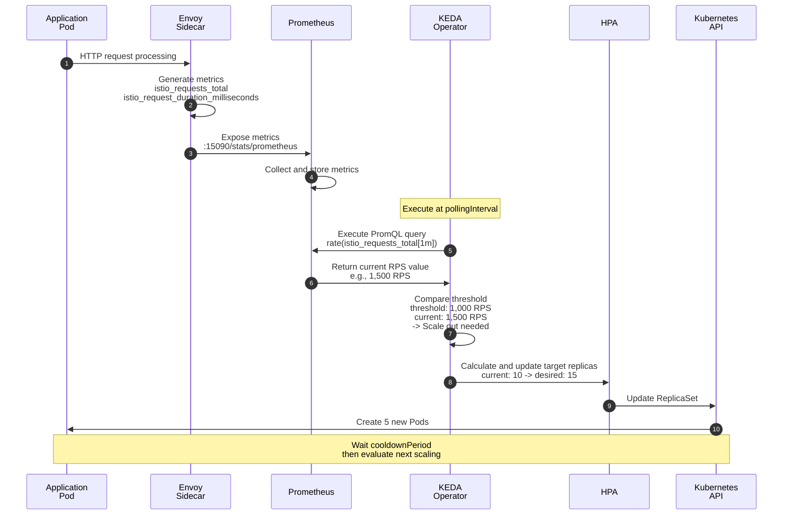
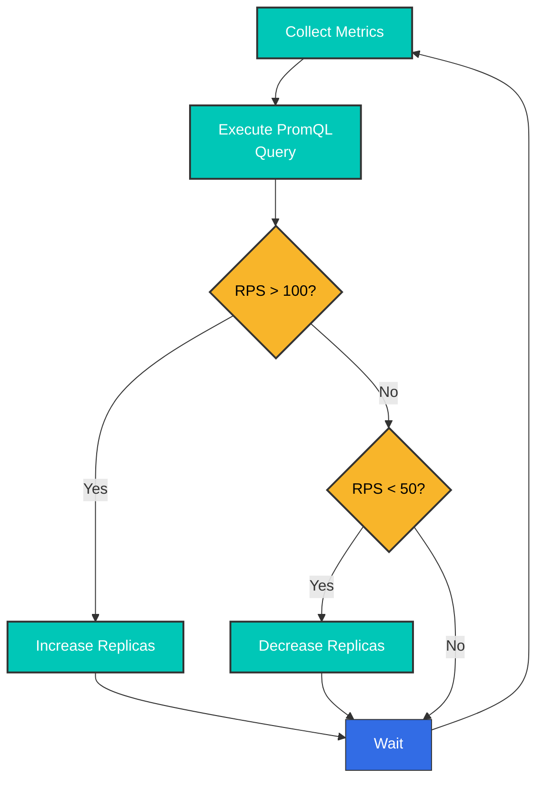
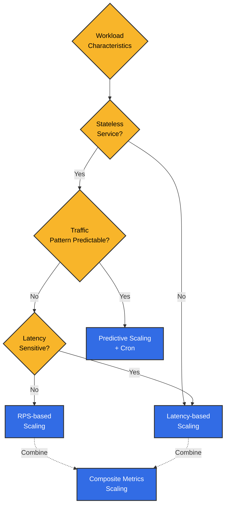

# Autoescalado basado en KEDA con métricas de Istio

> **Versiones compatibles**: KEDA 2.18, Istio 1.28
> **Última actualización**: February 19, 2026
> **Compatibilidad con Kubernetes**: 1.34

Este documento cubre **estrategias prácticas de autoescalado usando métricas de Istio**. Proporciona diversos patrones y ejemplos del mundo real para escalar cargas de trabajo basándose en métricas de Prometheus y CloudWatch mediante KEDA.

**Objetivos de aprendizaje**:
- Escribir políticas de escalado sofisticadas con Prometheus PromQL
- Integración de métricas de CloudWatch y combinaciones de servicios de AWS
- Estrategias basadas en diversas métricas, incluidas RPS, latencia y tasas de error
- Circuit Breaker y escalado predictivo basado en el tiempo
- Estabilización y monitoreo para entornos de producción

## Tabla de contenido

1. [Descripción general](#overview)
2. [Arquitectura](#architecture)
3. [Escalado basado en métricas de Prometheus](#prometheus-metrics-based-scaling)
4. [Escalado basado en métricas de CloudWatch](#cloudwatch-metrics-based-scaling)
5. [Estrategias prácticas de escalado](#practical-scaling-strategies)
6. [Prácticas recomendadas](#best-practices)
7. [Solución de problemas](#troubleshooting)
8. [Referencia: instalación de KEDA](#reference-keda-installation)

## Descripción general

Este documento se centra en **estrategias prácticas de autoescalado usando métricas de Istio**. KEDA amplía Kubernetes HPA para habilitar el escalado basado en consultas de métricas complejas de Prometheus y CloudWatch.

### Métricas principales de Istio

Métricas proporcionadas por el proxy Envoy de Istio utilizadas para el escalado:

| Métrica | Descripción | Uso de escalado |
|--------|------|---------------|
| **istio_requests_total** | Recuento total de solicitudes | Escalado basado en RPS |
| **istio_request_duration_milliseconds** | Latencia de solicitudes | Escalado basado en latencia |
| **istio_tcp_connections_opened_total** | Recuento de conexiones TCP | Escalado basado en conexiones |
| **istio_request_bytes_sum** | Bytes de solicitudes | Escalado basado en rendimiento |
| **envoy_cluster_upstream_rq_pending_overflow** | Desbordamiento de Circuit Breaker | Detección de sobrecarga |

### ¿Por qué usar KEDA?

Ventajas de KEDA en comparación con Kubernetes HPA estándar:

| Característica | Kubernetes HPA | KEDA |
|------|---------------|------|
| **Fuentes de métricas** | CPU/Memoria + Custom Metrics API | Más de 60 Scalers con soporte directo |
| **Consultas PromQL** | Se requiere Custom Metrics Adapter | Soporte nativo |
| **Integración con CloudWatch** | No es posible | Consulta directa |
| **Scale to Zero** | Mínimo 1 | 0 posible |
| **Múltiples métricas** | Limitado | Combinaciones de múltiples triggers |
| **Programación Cron** | No compatible | Escalado basado en tiempo |

**Enfoque de este documento**: En lugar de la instalación de KEDA, se centra en **patrones y estrategias prácticas de escalado usando métricas de Prometheus y CloudWatch**.

### Estrategias clave de escalado

Patrones prácticos de escalado cubiertos en este documento:

| Estrategia | Métrica principal | Escenarios adecuados | Beneficios clave |
|------|----------|----------------|----------|
| **Basada en RPS** | `istio_requests_total` | Servidores de API, servicios web | Intuitiva, implementación simple |
| **Basada en latencia** | Latencia P50/P95/P99 | Pagos, pedidos: servicios sensibles a la latencia | Garantía de experiencia de usuario |
| **Basada en tasa de error** | Proporción de respuestas 5xx | Servicios esenciales de alta disponibilidad | Respuesta rápida ante fallos |
| **Métricas compuestas** | RPS + latencia + error | Servicios de producción | Escalado estable y preciso |
| **Basada en Circuit Breaker** | overflow, grupo de conexiones | Servicios con muchas dependencias externas | Prevención de fallos en cascada |
| **Predicción basada en tiempo** | Cron + métricas | Patrones de tráfico predecibles | Optimización de costos, respuesta proactiva |

## Arquitectura

### Flujo de escalado basado en métricas



### Estructura básica de ScaledObject

El núcleo de KEDA es el CRD **ScaledObject**. Crea y administra automáticamente HPA basándose en métricas de Prometheus o CloudWatch:

```yaml
apiVersion: keda.sh/v1alpha1
kind: ScaledObject
metadata:
  name: my-app-scaler
  namespace: default
spec:
  # Scale target
  scaleTargetRef:
    name: my-app           # Deployment name
    kind: Deployment

  # Scaling policy
  pollingInterval: 30      # Check metrics every 30 seconds
  cooldownPeriod: 300      # Wait 5 minutes after scale down
  minReplicaCount: 2       # Minimum Pod count
  maxReplicaCount: 20      # Maximum Pod count

  # Metric triggers
  triggers:
  - type: prometheus       # or aws-cloudwatch
    metadata:
      serverAddress: http://prometheus.istio-system.svc:9090
      query: |             # PromQL query
        sum(rate(istio_requests_total{
          destination_workload="my-app"
        }[1m]))
      threshold: '1000'    # Threshold: 1000 RPS
```

## Escalado basado en métricas de Prometheus

### 1. Escalado basado en RPS (solicitudes por segundo)

#### Definición de ScaledObject

```yaml
apiVersion: keda.sh/v1alpha1
kind: ScaledObject
metadata:
  name: reviews-rps-scaler
  namespace: default
spec:
  scaleTargetRef:
    name: reviews
    kind: Deployment

  # Scaling policy
  pollingInterval: 30  # Check metrics every 30 seconds
  cooldownPeriod: 300  # Wait 5 minutes after scale down
  minReplicaCount: 2   # Minimum replicas
  maxReplicaCount: 20  # Maximum replicas

  triggers:
  - type: prometheus
    metadata:
      serverAddress: http://prometheus.istio-system.svc:9090
      query: |
        sum(rate(istio_requests_total{
          destination_workload="reviews",
          destination_workload_namespace="default",
          response_code=~"2.*"
        }[1m]))
      threshold: '100'  # Scale out above 100 RPS
      activationThreshold: '50'  # Activate above 50 RPS
```

#### Cómo funciona



### 2. Escalado basado en latencia

#### Escalado por latencia P95

```yaml
apiVersion: keda.sh/v1alpha1
kind: ScaledObject
metadata:
  name: reviews-latency-scaler
  namespace: default
spec:
  scaleTargetRef:
    name: reviews
    kind: Deployment

  pollingInterval: 30
  cooldownPeriod: 300
  minReplicaCount: 2
  maxReplicaCount: 20

  triggers:
  - type: prometheus
    metadata:
      serverAddress: http://prometheus.istio-system.svc:9090
      # P95 latency (95th percentile)
      query: |
        histogram_quantile(0.95,
          sum(rate(istio_request_duration_milliseconds_bucket{
            destination_workload="reviews",
            destination_workload_namespace="default"
          }[2m])) by (le)
        )
      threshold: '200'  # Scale out above 200ms
      activationThreshold: '100'
```

#### Escalado combinado de P50 y P99

```yaml
apiVersion: keda.sh/v1alpha1
kind: ScaledObject
metadata:
  name: reviews-multi-latency-scaler
  namespace: default
spec:
  scaleTargetRef:
    name: reviews
    kind: Deployment

  pollingInterval: 30
  cooldownPeriod: 300
  minReplicaCount: 2
  maxReplicaCount: 20

  # Scale when any trigger exceeds threshold
  triggers:
  # P50 latency
  - type: prometheus
    metadata:
      serverAddress: http://prometheus.istio-system.svc:9090
      query: |
        histogram_quantile(0.50,
          sum(rate(istio_request_duration_milliseconds_bucket{
            destination_workload="reviews",
            destination_workload_namespace="default"
          }[2m])) by (le)
        )
      threshold: '50'  # P50 > 50ms

  # P95 latency
  - type: prometheus
    metadata:
      serverAddress: http://prometheus.istio-system.svc:9090
      query: |
        histogram_quantile(0.95,
          sum(rate(istio_request_duration_milliseconds_bucket{
            destination_workload="reviews",
            destination_workload_namespace="default"
          }[2m])) by (le)
        )
      threshold: '200'  # P95 > 200ms

  # P99 latency (extreme cases)
  - type: prometheus
    metadata:
      serverAddress: http://prometheus.istio-system.svc:9090
      query: |
        histogram_quantile(0.99,
          sum(rate(istio_request_duration_milliseconds_bucket{
            destination_workload="reviews",
            destination_workload_namespace="default"
          }[2m])) by (le)
        )
      threshold: '500'  # P99 > 500ms
```

### 3. Escalado basado en tasa de éxito

Escala horizontalmente cuando la tasa de error es alta para distribuir la carga:

```yaml
apiVersion: keda.sh/v1alpha1
kind: ScaledObject
metadata:
  name: reviews-error-rate-scaler
  namespace: default
spec:
  scaleTargetRef:
    name: reviews
    kind: Deployment

  pollingInterval: 30
  cooldownPeriod: 300
  minReplicaCount: 2
  maxReplicaCount: 20

  triggers:
  # Scale out when error rate exceeds 5%
  - type: prometheus
    metadata:
      serverAddress: http://prometheus.istio-system.svc:9090
      query: |
        (
          sum(rate(istio_requests_total{
            destination_workload="reviews",
            response_code=~"5.*"
          }[2m]))
          /
          sum(rate(istio_requests_total{
            destination_workload="reviews"
          }[2m]))
        ) * 100
      threshold: '5'  # 5% error rate
      activationThreshold: '2'
```

### 4. Escalado con métricas compuestas

Considerando tanto RPS como latencia:

```yaml
apiVersion: keda.sh/v1alpha1
kind: ScaledObject
metadata:
  name: reviews-composite-scaler
  namespace: default
spec:
  scaleTargetRef:
    name: reviews
    kind: Deployment

  pollingInterval: 30
  cooldownPeriod: 300
  minReplicaCount: 2
  maxReplicaCount: 20

  # Advanced scaling behavior
  advanced:
    horizontalPodAutoscalerConfig:
      behavior:
        scaleDown:
          stabilizationWindowSeconds: 300  # 5 minute stabilization
          policies:
          - type: Percent
            value: 10  # Maximum 10% decrease
            periodSeconds: 60
        scaleUp:
          stabilizationWindowSeconds: 0  # Immediate scale out
          policies:
          - type: Percent
            value: 50  # Maximum 50% increase
            periodSeconds: 60
          - type: Pods
            value: 5  # Maximum 5 pods at once
            periodSeconds: 60
          selectPolicy: Max  # Select larger value

  triggers:
  # RPS-based
  - type: prometheus
    metricType: AverageValue
    metadata:
      serverAddress: http://prometheus.istio-system.svc:9090
      query: |
        sum(rate(istio_requests_total{
          destination_workload="reviews",
          destination_workload_namespace="default"
        }[1m])) / count(kube_pod_info{pod=~"reviews-.*"})
      threshold: '50'  # 50 RPS per Pod

  # P95 Latency-based
  - type: prometheus
    metricType: Value
    metadata:
      serverAddress: http://prometheus.istio-system.svc:9090
      query: |
        histogram_quantile(0.95,
          sum(rate(istio_request_duration_milliseconds_bucket{
            destination_workload="reviews"
          }[2m])) by (le)
        )
      threshold: '200'  # P95 > 200ms
```

## Escalado basado en métricas de CloudWatch

### Descripción general

CloudWatch tiene un **tiempo de respuesta más lento** que Prometheus (retraso de 1 a 3 minutos), pero ofrece ventajas para la integración con servicios nativos de AWS y la **retención a largo plazo**.

**Escenarios de uso**:
- Combinación con métricas de servicios de AWS (ALB, RDS, SQS, etc.)
- Análisis de tendencias a largo plazo y optimización de costos
- Monitoreo centralizado en entornos multirregión
- No recomendado para escalado en tiempo real (use Prometheus)

> **Requisito previo**: Las métricas de Istio deben enviarse a CloudWatch. Consulte la sección [Referencia: instalación de KEDA](#reference-keda-installation) para la configuración de ADOT Collector.

### Escalado con métricas de CloudWatch

#### Escalado basado en RPS

```yaml
apiVersion: keda.sh/v1alpha1
kind: ScaledObject
metadata:
  name: reviews-cloudwatch-rps
  namespace: default
spec:
  scaleTargetRef:
    name: reviews
    kind: Deployment

  pollingInterval: 60  # 1 minute interval recommended for CloudWatch
  cooldownPeriod: 300
  minReplicaCount: 2
  maxReplicaCount: 20

  triggers:
  - type: aws-cloudwatch
    metadata:
      namespace: IstioMetrics
      metricName: IstioRequestsTotal
      dimensionName: destination_workload
      dimensionValue: reviews
      targetMetricValue: '1000'  # 1000 requests/minute
      minMetricValue: '100'

      # Statistics type
      metricStatPeriod: '60'  # 1 minute
      metricStat: Sum

      # AWS region
      awsRegion: us-west-2

      # Use IRSA
      identityOwner: operator
```

#### Escalado basado en latencia

```yaml
apiVersion: keda.sh/v1alpha1
kind: ScaledObject
metadata:
  name: reviews-cloudwatch-latency
  namespace: default
spec:
  scaleTargetRef:
    name: reviews
    kind: Deployment

  pollingInterval: 60
  cooldownPeriod: 300
  minReplicaCount: 2
  maxReplicaCount: 20

  triggers:
  - type: aws-cloudwatch
    metadata:
      namespace: IstioMetrics
      metricName: IstioRequestDuration
      dimensionName: destination_workload
      dimensionValue: reviews

      # P95 latency (calculated in CloudWatch)
      targetMetricValue: '200'  # 200ms
      minMetricValue: '50'

      metricStatPeriod: '60'
      metricStat: 'p95'  # 95th percentile

      awsRegion: us-west-2
      identityOwner: operator
```

## Estrategias prácticas de escalado

### Estrategia 1: escalado predictivo basado en patrones de tráfico

Preescalado considerando patrones de tráfico basados en el tiempo:

```yaml
apiVersion: keda.sh/v1alpha1
kind: ScaledObject
metadata:
  name: frontend-predictive-scaler
  namespace: default
spec:
  scaleTargetRef:
    name: frontend
    kind: Deployment

  pollingInterval: 30
  cooldownPeriod: 300
  minReplicaCount: 2
  maxReplicaCount: 50

  # Advanced HPA behavior settings
  advanced:
    horizontalPodAutoscalerConfig:
      behavior:
        scaleDown:
          stabilizationWindowSeconds: 600  # 10 minute stabilization
          policies:
          - type: Percent
            value: 10
            periodSeconds: 120  # 10% decrease every 2 minutes
        scaleUp:
          stabilizationWindowSeconds: 0
          policies:
          - type: Percent
            value: 100  # Can double at once
            periodSeconds: 30
          - type: Pods
            value: 10  # Maximum 10 pods at once
            periodSeconds: 30
          selectPolicy: Max

  triggers:
  # RPS-based
  - type: prometheus
    metadata:
      serverAddress: http://prometheus.istio-system.svc:9090
      query: |
        sum(rate(istio_requests_total{
          destination_workload="frontend"
        }[1m])) / scalar(count(up{job="frontend"}))
      threshold: '100'  # 100 RPS per Pod

  # P95 latency
  - type: prometheus
    metadata:
      serverAddress: http://prometheus.istio-system.svc:9090
      query: |
        histogram_quantile(0.95,
          sum(rate(istio_request_duration_milliseconds_bucket{
            destination_workload="frontend"
          }[2m])) by (le)
        )
      threshold: '300'

  # Cron-based pre-scaling (peak hours)
  - type: cron
    metadata:
      timezone: Asia/Seoul
      start: 0 9 * * 1-5  # Weekdays 9 AM
      end: 0 18 * * 1-5   # Weekdays 6 PM
      desiredReplicas: '20'  # Minimum 20 during peak hours
```

### Estrategia 2: escalado basado en el estado de Circuit Breaker

Escalado horizontal automático cuando se abre el Circuit:

```yaml
apiVersion: keda.sh/v1alpha1
kind: ScaledObject
metadata:
  name: backend-circuit-breaker-scaler
  namespace: default
spec:
  scaleTargetRef:
    name: backend
    kind: Deployment

  pollingInterval: 15  # Circuit Breaker needs fast response
  cooldownPeriod: 180
  minReplicaCount: 3
  maxReplicaCount: 30

  triggers:
  # Circuit Breaker Overflow detection
  - type: prometheus
    metadata:
      serverAddress: http://prometheus.istio-system.svc:9090
      query: |
        sum(increase(envoy_cluster_upstream_rq_pending_overflow{
          cluster_name=~"outbound.*backend.*"
        }[1m]))
      threshold: '10'  # 10+ overflows per minute
      activationThreshold: '5'

  # Upstream connection pool saturation
  - type: prometheus
    metadata:
      serverAddress: http://prometheus.istio-system.svc:9090
      query: |
        sum(envoy_cluster_upstream_cx_active{
          cluster_name=~"outbound.*backend.*"
        })
        /
        sum(envoy_cluster_circuit_breakers_default_cx_open{
          cluster_name=~"outbound.*backend.*"
        }) * 100
      threshold: '80'  # Connection pool 80%+ usage
```

### Estrategia 3: escalado por niveles

Aplique diferentes velocidades de escalado según el nivel de carga:

```yaml
apiVersion: keda.sh/v1alpha1
kind: ScaledObject
metadata:
  name: payment-tiered-scaler
  namespace: default
spec:
  scaleTargetRef:
    name: payment-service
    kind: Deployment

  pollingInterval: 30
  cooldownPeriod: 300
  minReplicaCount: 3
  maxReplicaCount: 50

  advanced:
    horizontalPodAutoscalerConfig:
      behavior:
        scaleUp:
          policies:
          # Low load (< 150% threshold): slow increase
          - type: Percent
            value: 20
            periodSeconds: 120
          # Medium load (150-200%): fast increase
          - type: Percent
            value: 50
            periodSeconds: 60
          # High load (> 200%): very fast increase
          - type: Pods
            value: 10
            periodSeconds: 30
          selectPolicy: Max

        scaleDown:
          policies:
          - type: Percent
            value: 5  # Slow decrease (5% at a time)
            periodSeconds: 180  # Every 3 minutes

  triggers:
  - type: prometheus
    metadata:
      serverAddress: http://prometheus.istio-system.svc:9090
      query: |
        sum(rate(istio_requests_total{
          destination_workload="payment-service",
          response_code=~"2.*"
        }[1m]))
      threshold: '500'  # 500 RPS
```

### Estrategia 4: escalado optimizado en costos

Distinga entre horario laboral y horas no laborables:

```yaml
apiVersion: keda.sh/v1alpha1
kind: ScaledObject
metadata:
  name: analytics-cost-optimized-scaler
  namespace: default
spec:
  scaleTargetRef:
    name: analytics-service
    kind: Deployment

  pollingInterval: 60
  cooldownPeriod: 600  # Longer wait for cost optimization
  minReplicaCount: 1
  maxReplicaCount: 30

  triggers:
  # Business hours (09:00-18:00): aggressive scaling
  - type: prometheus
    metadata:
      serverAddress: http://prometheus.istio-system.svc:9090
      query: |
        (
          sum(rate(istio_requests_total{
            destination_workload="analytics-service"
          }[2m]))
          and
          (hour() >= 9 and hour() < 18)
        )
      threshold: '50'
      activationThreshold: '20'

  # Off-hours: Allow Scale to Zero
  - type: cron
    metadata:
      timezone: Asia/Seoul
      start: 0 18 * * *  # 6 PM
      end: 0 9 * * *     # 9 AM
      desiredReplicas: '0'  # Scale to Zero
```

### Estrategia 5: escalado basado en métricas de Gateway

Supervise la carga de Istio Gateway para escalar el backend:

```yaml
apiVersion: keda.sh/v1alpha1
kind: ScaledObject
metadata:
  name: backend-gateway-based-scaler
  namespace: default
spec:
  scaleTargetRef:
    name: backend
    kind: Deployment

  pollingInterval: 30
  cooldownPeriod: 300
  minReplicaCount: 2
  maxReplicaCount: 40

  triggers:
  # Monitor incoming traffic through Gateway
  - type: prometheus
    metadata:
      serverAddress: http://prometheus.istio-system.svc:9090
      query: |
        sum(rate(istio_requests_total{
          source_workload="istio-ingressgateway",
          destination_service="backend.default.svc.cluster.local"
        }[1m]))
      threshold: '1000'

  # Gateway pending connection count
  - type: prometheus
    metadata:
      serverAddress: http://prometheus.istio-system.svc:9090
      query: |
        sum(envoy_http_downstream_rq_active{
          app="istio-ingressgateway"
        })
      threshold: '500'  # 500+ concurrent requests
```

## Prácticas recomendadas

### 1. Guía de selección de métricas



**Métricas recomendadas**:

| Tipo de carga de trabajo | Métrica principal | Métrica secundaria | Motivo |
|-------------|----------|-----------|------|
| **Servidor de API** | RPS | Latencia P95 | El recuento de solicitudes es un indicador directo de carga |
| **Servidor web** | RPS | Tasa de error | El recuento de solicitudes es más importante que las conexiones simultáneas |
| **Procesamiento de datos** | Latencia P95 | CPU/Memoria | El tiempo de procesamiento es un indicador de carga |
| **Streaming** | Conexiones TCP | Rendimiento | El recuento de conexiones es clave para el consumo de recursos |
| **Trabajos por lotes** | Longitud de cola | Tiempo de procesamiento | El recuento de trabajo pendiente es el criterio de escalado |

### 2. Guía para configurar umbrales

```yaml
# Process for finding appropriate thresholds

# Step 1: Measure current workload
# Normal RPS
kubectl exec -it prometheus-xxx -n istio-system -- promtool query instant \
  'sum(rate(istio_requests_total{destination_workload="reviews"}[5m]))'

# Peak time RPS
# Normal: ~500 RPS
# Peak: ~2000 RPS

# Step 2: Measure per-Pod processing capacity
# Run load test
kubectl run load-test --image=fortio/fortio -- load -c 50 -qps 0 -t 60s http://reviews:9080

# Result: Maintains P95 < 100ms up to about 200 RPS per Pod

# Step 3: Calculate threshold
# Target P95: 100ms
# Per-Pod capacity: 200 RPS
# Safety margin: 70% (140 RPS/pod)
# -> threshold: '140'

# Step 4: Write ScaledObject
apiVersion: keda.sh/v1alpha1
kind: ScaledObject
metadata:
  name: reviews-optimized-scaler
spec:
  scaleTargetRef:
    name: reviews
  minReplicaCount: 3  # Normal 500 RPS / 140 = 3.5 -> 4
  maxReplicaCount: 20  # Peak 2000 RPS / 140 = 14.2 -> 20 (with margin)
  triggers:
  - type: prometheus
    metadata:
      query: |
        sum(rate(istio_requests_total{destination_workload="reviews"}[1m]))
        / count(kube_pod_info{pod=~"reviews-.*"})
      threshold: '140'  # 140 RPS per Pod
```

### 3. Ajuste de la velocidad de escalado

```yaml
apiVersion: keda.sh/v1alpha1
kind: ScaledObject
metadata:
  name: balanced-scaler
  namespace: default
spec:
  scaleTargetRef:
    name: myapp
    kind: Deployment

  pollingInterval: 30
  cooldownPeriod: 300
  minReplicaCount: 2
  maxReplicaCount: 50

  advanced:
    horizontalPodAutoscalerConfig:
      behavior:
        # Scale down: conservative (service stability first)
        scaleDown:
          stabilizationWindowSeconds: 600  # 10 minute observation
          policies:
          - type: Percent
            value: 10  # 10% decrease
            periodSeconds: 180  # Every 3 minutes
          - type: Pods
            value: 2  # Or maximum 2 at a time
            periodSeconds: 180
          selectPolicy: Min  # Select more conservative value

        # Scale up: aggressive (fast response)
        scaleUp:
          stabilizationWindowSeconds: 0  # Immediate
          policies:
          - type: Percent
            value: 100  # Up to 2x increase
            periodSeconds: 30
          - type: Pods
            value: 10  # Or 10 at a time
            periodSeconds: 30
          selectPolicy: Max  # Select more aggressive value

  triggers:
  - type: prometheus
    metadata:
      serverAddress: http://prometheus.istio-system.svc:9090
      query: sum(rate(istio_requests_total{destination_workload="myapp"}[1m]))
      threshold: '1000'
```

### 4. Escalado en entornos multiclúster

```yaml
# Cluster 1: Primary traffic handling
apiVersion: keda.sh/v1alpha1
kind: ScaledObject
metadata:
  name: frontend-cluster1-scaler
  namespace: default
spec:
  scaleTargetRef:
    name: frontend
  minReplicaCount: 5
  maxReplicaCount: 30

  triggers:
  - type: prometheus
    metadata:
      serverAddress: http://prometheus.istio-system.svc:9090
      # 60% of global traffic handled by this cluster
      query: |
        sum(rate(istio_requests_total{
          destination_workload="frontend",
          source_cluster="cluster1"
        }[1m])) * 0.6
      threshold: '600'
---
# Cluster 2: Secondary traffic handling
apiVersion: keda.sh/v1alpha1
kind: ScaledObject
metadata:
  name: frontend-cluster2-scaler
  namespace: default
spec:
  scaleTargetRef:
    name: frontend
  minReplicaCount: 3
  maxReplicaCount: 20

  triggers:
  - type: prometheus
    metadata:
      serverAddress: http://prometheus.istio-system.svc:9090
      # 40% of global traffic
      query: |
        sum(rate(istio_requests_total{
          destination_workload="frontend",
          source_cluster="cluster2"
        }[1m])) * 0.4
      threshold: '400'
```

## Prácticas recomendadas

### 1. Optimización de la recopilación de métricas

```yaml
# Adjust Prometheus scrape interval
apiVersion: v1
kind: ConfigMap
metadata:
  name: prometheus
  namespace: istio-system
data:
  prometheus.yml: |
    global:
      scrape_interval: 15s  # Default 15 seconds
      evaluation_interval: 15s

    scrape_configs:
    # Collect Istio metrics more frequently
    - job_name: 'istio-mesh'
      scrape_interval: 10s  # 10 seconds
      kubernetes_sd_configs:
      - role: endpoints
        namespaces:
          names:
          - default
          - production
      relabel_configs:
      - source_labels: [__meta_kubernetes_pod_annotation_prometheus_io_scrape]
        action: keep
        regex: true
```

### 2. Garantizar la estabilidad del escalado

```yaml
apiVersion: keda.sh/v1alpha1
kind: ScaledObject
metadata:
  name: stable-scaler
  namespace: default
spec:
  scaleTargetRef:
    name: myapp

  # 1. Appropriate polling interval
  pollingInterval: 30  # Too short is unstable, too long is slow

  # 2. Sufficient cooldown
  cooldownPeriod: 300  # 5 minutes is generally appropriate

  # 3. Safe min/max values
  minReplicaCount: 2  # 0 is risky, recommend minimum 2
  maxReplicaCount: 20  # 70% or less of cluster capacity

  advanced:
    horizontalPodAutoscalerConfig:
      behavior:
        scaleDown:
          # 4. Long stabilization window
          stabilizationWindowSeconds: 600
          policies:
          - type: Percent
            value: 10
            periodSeconds: 120
```

### 3. Monitoreo y alertas

```yaml
apiVersion: monitoring.coreos.com/v1
kind: PrometheusRule
metadata:
  name: keda-scaling-alerts
  namespace: keda
spec:
  groups:
  - name: keda-scaling
    interval: 30s
    rules:
    # Reached maximum replicas
    - alert: KEDAMaxReplicasReached
      expr: |
        kube_horizontalpodautoscaler_status_current_replicas
        >= kube_horizontalpodautoscaler_spec_max_replicas
      for: 5m
      labels:
        severity: warning
      annotations:
        summary: "KEDA scaled to maximum replicas"
        description: "{{ $labels.horizontalpodautoscaler }} has reached max replicas ({{ $value }})"

    # Scaling failed
    - alert: KEDAScalingFailed
      expr: |
        increase(keda_scaler_errors_total[5m]) > 0
      labels:
        severity: critical
      annotations:
        summary: "KEDA scaling failed"
        description: "KEDA scaler {{ $labels.scaledObject }} has errors"

    # Frequent scaling (Flapping)
    - alert: KEDAFlapping
      expr: |
        rate(keda_scaler_active[10m]) > 0.1
      for: 10m
      labels:
        severity: warning
      annotations:
        summary: "KEDA is flapping"
        description: "ScaledObject {{ $labels.scaledObject }} is scaling too frequently"
```

### 4. Configuración de límites de recursos

```yaml
apiVersion: apps/v1
kind: Deployment
metadata:
  name: reviews
  namespace: default
spec:
  replicas: 3
  template:
    spec:
      containers:
      - name: reviews
        image: istio/examples-bookinfo-reviews-v1:1.17.0

        # Resource requests/limits (important for scaling calculation)
        resources:
          requests:
            cpu: 100m
            memory: 128Mi
          limits:
            cpu: 200m
            memory: 256Mi

        # Readiness Probe (safety during scale out)
        readinessProbe:
          httpGet:
            path: /health
            port: 9080
          initialDelaySeconds: 10
          periodSeconds: 5
          timeoutSeconds: 3
          successThreshold: 1
          failureThreshold: 3

        # Liveness Probe
        livenessProbe:
          httpGet:
            path: /health
            port: 9080
          initialDelaySeconds: 30
          periodSeconds: 10
```

## Solución de problemas

### 1. KEDA no obtiene métricas

**Síntomas**:
```bash
kubectl get scaledobject -n default
# STATUS: Unknown
```

**Análisis de la causa raíz**:

```bash
# 1. Check KEDA Operator logs
kubectl logs -n keda -l app=keda-operator

# 2. Check ScaledObject status
kubectl describe scaledobject reviews-rps-scaler -n default

# 3. Test Prometheus connectivity
kubectl run curl-test --image=curlimages/curl -it --rm -- \
  curl -s http://prometheus.istio-system.svc:9090/api/v1/query \
  --data-urlencode 'query=up'
```

**Resolución**:

1. **Verifique la dirección de Prometheus**:
```bash
# Check Prometheus Service
kubectl get svc -n istio-system | grep prometheus

# Use correct address in ScaledObject
serverAddress: http://prometheus.istio-system.svc:9090
```

2. **Pruebe la consulta PromQL**:
```bash
# Test query directly in Prometheus UI
kubectl port-forward -n istio-system svc/prometheus 9090:9090

# Browser: http://localhost:9090
# Enter query and verify results
```

### 2. El escalado es demasiado lento

**Síntomas**: El escalado horizontal se retrasa durante picos de tráfico

**Resolución**:

```yaml
apiVersion: keda.sh/v1alpha1
kind: ScaledObject
metadata:
  name: fast-scaler
spec:
  # 1. Reduce polling interval
  pollingInterval: 15  # 30s -> 15s

  # 2. Remove scale up stabilization window
  advanced:
    horizontalPodAutoscalerConfig:
      behavior:
        scaleUp:
          stabilizationWindowSeconds: 0  # React immediately
          policies:
          - type: Pods
            value: 5  # 5 at a time
            periodSeconds: 30

  # 3. Lower activation threshold
  triggers:
  - type: prometheus
    metadata:
      query: sum(rate(istio_requests_total{...}[1m]))
      threshold: '100'
      activationThreshold: '30'  # Low threshold for early activation
```

### 3. Flapping (escalado inestable)

**Síntomas**: El número de Pods sigue aumentando/disminuyendo repetidamente

**Causa**: Umbral demasiado sensible o período de estabilización insuficiente

**Resolución**:

```yaml
apiVersion: keda.sh/v1alpha1
kind: ScaledObject
metadata:
  name: stable-scaler
spec:
  # 1. Longer cooldown
  cooldownPeriod: 600  # 10 minutes

  # 2. Longer PromQL evaluation period
  triggers:
  - type: prometheus
    metadata:
      query: |
        sum(rate(istio_requests_total{...}[5m]))  # 1m -> 5m
      threshold: '100'

  # 3. Conservative scale down
  advanced:
    horizontalPodAutoscalerConfig:
      behavior:
        scaleDown:
          stabilizationWindowSeconds: 600
          policies:
          - type: Percent
            value: 5  # Only 5% decrease
            periodSeconds: 180
```

### 4. Latencia de CloudWatch

**Síntomas**: Las métricas de CloudWatch no son en tiempo real (retraso de 1 a 3 minutos)

**Resolución**:

```yaml
# Use Prometheus primarily, CloudWatch as secondary
apiVersion: keda.sh/v1alpha1
kind: ScaledObject
metadata:
  name: hybrid-metrics-scaler
spec:
  triggers:
  # Primary metric: Prometheus (real-time)
  - type: prometheus
    metadata:
      serverAddress: http://prometheus.istio-system.svc:9090
      query: sum(rate(istio_requests_total{...}[1m]))
      threshold: '1000'

  # Secondary metric: CloudWatch (trend analysis)
  - type: aws-cloudwatch
    metadata:
      namespace: IstioMetrics
      metricName: IstioRequestsTotal
      targetMetricValue: '5000'  # Higher threshold
      metricStatPeriod: '300'  # 5 minute aggregation
```

## Ejemplos prácticos

### Ejemplo 1: servicio de pagos de comercio electrónico

Servicio donde la latencia es crítica:

```yaml
apiVersion: keda.sh/v1alpha1
kind: ScaledObject
metadata:
  name: payment-service-scaler
  namespace: production
spec:
  scaleTargetRef:
    name: payment-service
    kind: Deployment

  pollingInterval: 15  # Fast response
  cooldownPeriod: 180  # 3 minute cooldown
  minReplicaCount: 5   # Always maintain 5+
  maxReplicaCount: 50

  advanced:
    horizontalPodAutoscalerConfig:
      behavior:
        scaleUp:
          stabilizationWindowSeconds: 0
          policies:
          - type: Percent
            value: 100  # Fast 2x
            periodSeconds: 30
        scaleDown:
          stabilizationWindowSeconds: 900  # 15 minute stabilization
          policies:
          - type: Percent
            value: 5
            periodSeconds: 300  # 5% every 5 minutes

  triggers:
  # P50 latency (normal case)
  - type: prometheus
    metadata:
      serverAddress: http://prometheus.istio-system.svc:9090
      query: |
        histogram_quantile(0.50,
          sum(rate(istio_request_duration_milliseconds_bucket{
            destination_workload="payment-service",
            destination_workload_namespace="production"
          }[1m])) by (le)
        )
      threshold: '50'  # P50 > 50ms
      activationThreshold: '30'

  # P95 latency (quality guarantee)
  - type: prometheus
    metadata:
      serverAddress: http://prometheus.istio-system.svc:9090
      query: |
        histogram_quantile(0.95,
          sum(rate(istio_request_duration_milliseconds_bucket{
            destination_workload="payment-service",
            destination_workload_namespace="production"
          }[1m])) by (le)
        )
      threshold: '200'  # P95 > 200ms

  # Error rate (emergency scale out above 5%)
  - type: prometheus
    metadata:
      serverAddress: http://prometheus.istio-system.svc:9090
      query: |
        (
          sum(rate(istio_requests_total{
            destination_workload="payment-service",
            response_code=~"5.*"
          }[1m]))
          /
          sum(rate(istio_requests_total{
            destination_workload="payment-service"
          }[1m]))
        ) * 100
      threshold: '5'
```

### Ejemplo 2: servicio de procesamiento de datos

Procesamiento por lotes y escalado basado en colas:

```yaml
apiVersion: keda.sh/v1alpha1
kind: ScaledObject
metadata:
  name: data-processor-scaler
  namespace: default
spec:
  scaleTargetRef:
    name: data-processor
    kind: Deployment

  pollingInterval: 60  # Batch allows slow response
  cooldownPeriod: 600  # 10 minute cooldown
  minReplicaCount: 0   # Allow Scale to Zero
  maxReplicaCount: 30

  triggers:
  # SQS queue length (primary metric)
  - type: aws-sqs-queue
    metadata:
      queueURL: https://sqs.us-west-2.amazonaws.com/123456789/data-processing-queue
      queueLength: '10'  # Activate when 10+ in queue
      awsRegion: us-west-2
      identityOwner: operator

  # Istio processing time (secondary metric)
  - type: prometheus
    metadata:
      serverAddress: http://prometheus.istio-system.svc:9090
      query: |
        histogram_quantile(0.95,
          sum(rate(istio_request_duration_milliseconds_bucket{
            destination_workload="data-processor"
          }[5m])) by (le)
        )
      threshold: '5000'  # Scale out when taking 5+ seconds
```

### Ejemplo 3: servicio global multirregión

Escalado específico por región basado en la latencia:

```yaml
# US Region
apiVersion: keda.sh/v1alpha1
kind: ScaledObject
metadata:
  name: api-us-scaler
  namespace: default
  labels:
    region: us-east-1
spec:
  scaleTargetRef:
    name: api-service
  minReplicaCount: 3
  maxReplicaCount: 30

  triggers:
  - type: prometheus
    metadata:
      serverAddress: http://prometheus.istio-system.svc:9090
      # Aggregate only US user traffic
      query: |
        sum(rate(istio_requests_total{
          destination_workload="api-service",
          source_canonical_service=~".*-us-.*"
        }[1m]))
      threshold: '500'

  - type: prometheus
    metadata:
      serverAddress: http://prometheus.istio-system.svc:9090
      # US region P95 latency
      query: |
        histogram_quantile(0.95,
          sum(rate(istio_request_duration_milliseconds_bucket{
            destination_workload="api-service",
            destination_region="us-east-1"
          }[2m])) by (le)
        )
      threshold: '100'  # US users target 100ms
---
# EU Region
apiVersion: keda.sh/v1alpha1
kind: ScaledObject
metadata:
  name: api-eu-scaler
  namespace: default
  labels:
    region: eu-west-1
spec:
  scaleTargetRef:
    name: api-service
  minReplicaCount: 2
  maxReplicaCount: 20

  triggers:
  - type: prometheus
    metadata:
      serverAddress: http://prometheus.istio-system.svc:9090
      query: |
        sum(rate(istio_requests_total{
          destination_workload="api-service",
          source_canonical_service=~".*-eu-.*"
        }[1m]))
      threshold: '300'

  - type: prometheus
    metadata:
      serverAddress: http://prometheus.istio-system.svc:9090
      query: |
        histogram_quantile(0.95,
          sum(rate(istio_request_duration_milliseconds_bucket{
            destination_workload="api-service",
            destination_region="eu-west-1"
          }[2m])) by (le)
        )
      threshold: '150'  # EU allows 150ms
```

## Referencia: instalación de KEDA

> **Nota**: Esta sección solo es necesaria si instala KEDA por primera vez. Si ya está instalado, comience desde [Escalado basado en métricas de Prometheus](#prometheus-metrics-based-scaling).

### Instalar con Helm

```bash
# Add KEDA Helm repository
helm repo add kedacore https://kedacore.github.io/charts
helm repo update

# Install KEDA
helm install keda kedacore/keda \
  --namespace keda \
  --create-namespace \
  --set prometheus.metricServer.enabled=true \
  --set prometheus.metricServer.port=9022 \
  --set operator.replicaCount=2

# Verify installation
kubectl get pods -n keda
# Output:
# NAME                                      READY   STATUS
# keda-operator-xxxxx                       1/1     Running
# keda-operator-metrics-apiserver-xxxxx     1/1     Running
```

### Configuración de AWS IRSA (para CloudWatch)

Permisos de IAM requeridos para KEDA Operator al utilizar métricas de CloudWatch:

```bash
# IRSA setup
eksctl create iamserviceaccount \
  --name keda-operator \
  --namespace keda \
  --cluster my-cluster \
  --attach-policy-arn arn:aws:iam::aws:policy/CloudWatchReadOnlyAccess \
  --approve \
  --override-existing-serviceaccounts

# Verify ServiceAccount
kubectl get sa keda-operator -n keda -o yaml | grep eks.amazonaws.com/role-arn
```

### Configuración del envío de métricas de CloudWatch (opcional)

Para usar el escalado basado en métricas de CloudWatch, debe enviar métricas de Istio mediante ADOT Collector:

#### Paso 1: instalar ADOT Collector

```yaml
apiVersion: opentelemetry.io/v1alpha1
kind: OpenTelemetryCollector
metadata:
  name: istio-metrics-collector
  namespace: istio-system
spec:
  mode: deployment
  serviceAccount: adot-collector
  config: |
    receivers:
      prometheus:
        config:
          scrape_configs:
          - job_name: 'istio-mesh'
            scrape_interval: 60s  # 1 minute recommended for CloudWatch
            kubernetes_sd_configs:
            - role: endpoints
              namespaces:
                names:
                - default
            relabel_configs:
            - source_labels: [__meta_kubernetes_pod_annotation_prometheus_io_scrape]
              action: keep
              regex: true

    processors:
      batch:
        timeout: 60s
      metricstransform:
        transforms:
        - include: istio_requests_total
          action: update
          new_name: IstioRequestsTotal
        - include: istio_request_duration_milliseconds
          action: update
          new_name: IstioRequestDuration

    exporters:
      awsemf:
        namespace: IstioMetrics
        region: us-west-2
        dimension_rollup_option: NoDimensionRollup
        metric_declarations:
        - dimensions: [[destination_workload, destination_workload_namespace]]
          metric_name_selectors:
          - IstioRequestsTotal
          - IstioRequestDuration

    service:
      pipelines:
        metrics:
          receivers: [prometheus]
          processors: [batch, metricstransform]
          exporters: [awsemf]
```

#### Paso 2: configuración de IRSA

```bash
# Create IRSA policy
cat > adot-cloudwatch-policy.json <<EOF
{
  "Version": "2012-10-17",
  "Statement": [
    {
      "Effect": "Allow",
      "Action": ["cloudwatch:PutMetricData"],
      "Resource": "*",
      "Condition": {
        "StringEquals": {
          "cloudwatch:namespace": "IstioMetrics"
        }
      }
    }
  ]
}
EOF

aws iam create-policy \
  --policy-name ADOTCollectorCloudWatchPolicy \
  --policy-document file://adot-cloudwatch-policy.json

eksctl create iamserviceaccount \
  --name adot-collector \
  --namespace istio-system \
  --cluster my-cluster \
  --attach-policy-arn arn:aws:iam::${ACCOUNT_ID}:policy/ADOTCollectorCloudWatchPolicy \
  --approve
```

**Después de la instalación**, vuelva a la sección [Escalado basado en métricas de Prometheus](#prometheus-metrics-based-scaling) o [Escalado basado en métricas de CloudWatch](#cloudwatch-metrics-based-scaling).

---

## Referencias

### Documentación oficial

- [Documentación oficial de KEDA](https://keda.sh/docs/)
- [KEDA Prometheus Scaler](https://keda.sh/docs/scalers/prometheus/)
- [KEDA AWS CloudWatch Scaler](https://keda.sh/docs/scalers/aws-cloudwatch/)
- [Métricas de Istio](https://istio.io/latest/docs/reference/config/metrics/)

### Documentos relacionados

- [Observabilidad](../observability/README.md) - Prometheus y recopilación de métricas
- [Resiliencia](../resilience/README.md) - Circuit Breaker y resiliencia
- [Gestión del tráfico](../traffic-management/README.md) - Gestión del tráfico de Istio

## Resumen

### Guía de selección de fuentes de métricas

| Fuente de métricas | Ventajas | Desventajas | Uso recomendado |
|------------|------|------|----------|
| **Prometheus** | - Respuesta en tiempo real (15-30s)<br>- Consultas PromQL potentes<br>- Comunicación dentro del clúster | - Costo de retención a largo plazo<br>- Dependencia del clúster | Escalado en tiempo real, la mayoría de las cargas de trabajo |
| **CloudWatch** | - Integración con servicios de AWS<br>- Retención a largo plazo<br>- Soporte multirregión | - Retraso de 1 a 3 minutos<br>- Costo (proporcional al número de métricas) | Análisis de tendencias, combinaciones de servicios de AWS |

### Guía de selección de estrategias de escalado

| Tipo de carga de trabajo | Métrica principal | Métrica secundaria | Configuración recomendada |
|-------------|----------|-----------|----------|
| **Servidor de API** | RPS (por Pod) | Latencia P95 | `pollingInterval: 30`, `cooldownPeriod: 300` |
| **Pagos/Pedidos** | Latencia P50/P95 | Tasa de error | `pollingInterval: 15`, escalado horizontal rápido |
| **Procesamiento de datos** | Longitud de cola, latencia P95 | CPU/Memoria | `pollingInterval: 60`, permitir Scale to Zero |
| **Frontend web** | RPS, latencia P95 | Métricas de Gateway | Preescalado basado en Cron |
| **Microservicios** | RPS, Circuit Breaker | Tasa de error | Política de escalado por niveles |

### Lista de verificación para producción

Elementos que se deben verificar antes de aplicar políticas de escalado a producción:

- [ ] **Verificación de umbrales**: Verifique valores de umbral adecuados mediante pruebas de carga
- [ ] **Configuración de estabilización**: Configure `stabilizationWindowSeconds` suficiente (mínimo 300 segundos para scale down)
- [ ] **Límites de recursos**: Defina claramente `requests` y `limits` de Pod
- [ ] **Health Check**: Configure Readiness/Liveness Probe
- [ ] **Monitoreo**: Configure alertas `KEDAMaxReplicasReached` y `KEDAScalingFailed`
- [ ] **Prevención de flapping**: Período de evaluación PromQL largo (`[5m]`) y scale down conservador
- [ ] **Valores mín./máx.**: Configure `maxReplicaCount` en el 70% o menos de la capacidad del clúster
- [ ] **Respaldo**: HPA basado en CPU/Memoria en caso de fallo de Prometheus

### Ruta inicial recomendada

```
Step 1: Implement RPS-based scaling
   └─> Start with single metric, adjust thresholds

Step 2: Add Latency metrics
   └─> Monitor and scale on P95 latency

Step 3: Composite metrics strategy
   └─> Ensure stability with RPS + Latency combination

Step 4: Apply advanced strategies
   └─> Add Circuit Breaker, Cron, error rate, etc.
```

**Principios básicos**:
- Respuesta en tiempo real con Prometheus
- Garantice la estabilidad con métricas compuestas
- Scale down conservador, scale out agresivo
- Monitoreo continuo y ajuste de umbrales
