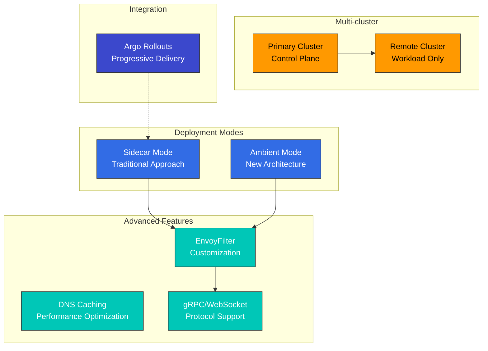
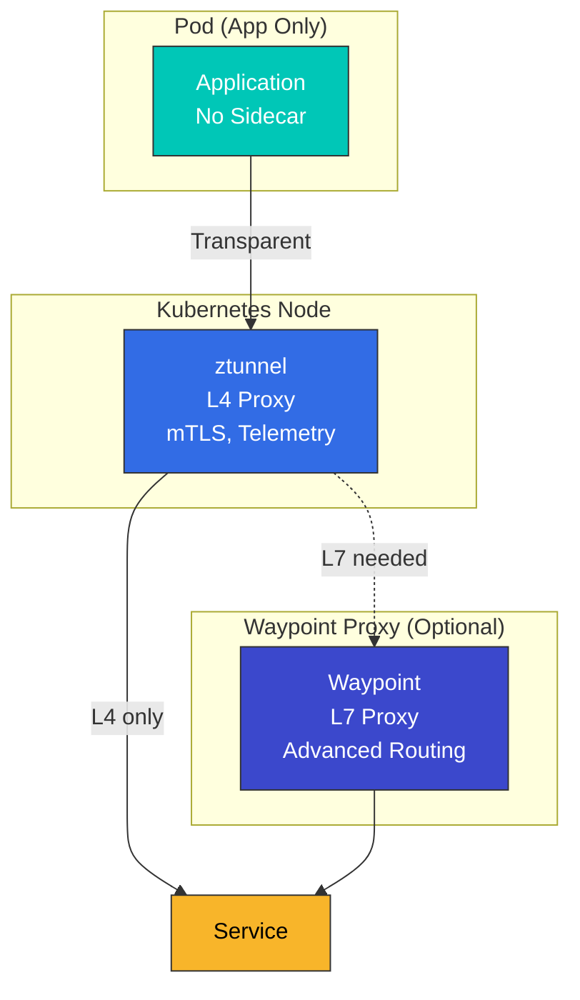
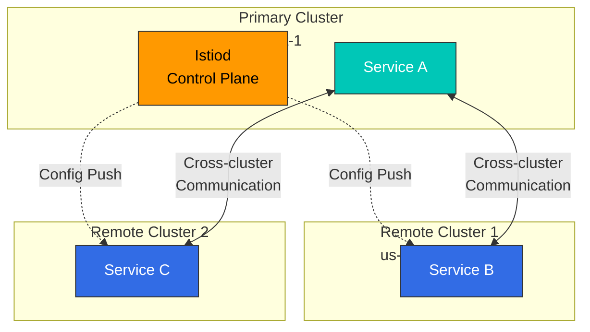
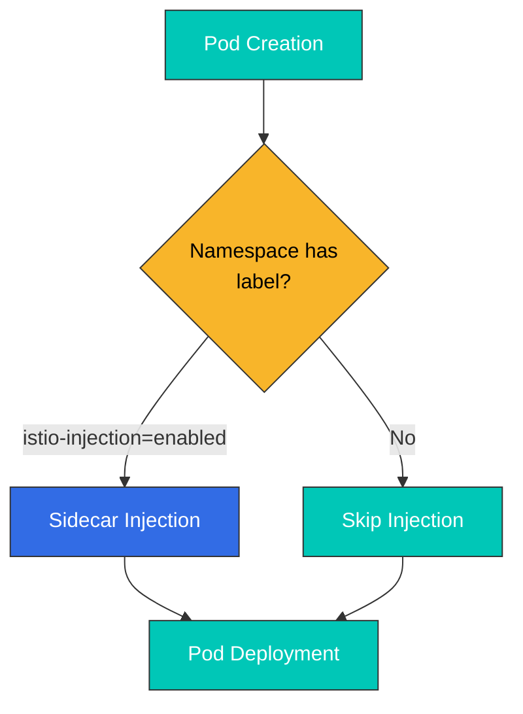
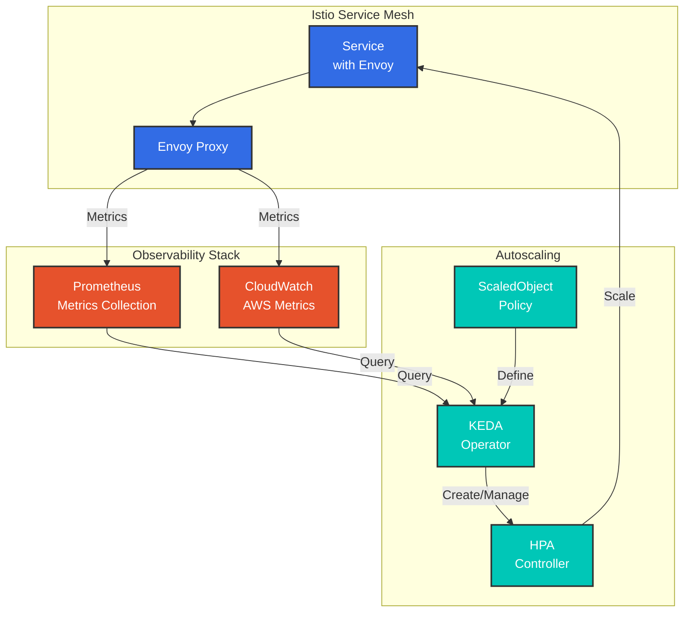

# Avanzado

Esta sección cubre características avanzadas de Istio, como Ambient Mode, Multi-cluster, EnvoyFilter, compatibilidad con gRPC/WebSocket y más.

## Tabla de contenidos

1. [Ambient Mode](01-ambient-mode.md)
2. [Multi-cluster](02-multi-cluster.md)
3. [EnvoyFilter](03-envoy-filter.md)
4. [Caché DNS](04-dns-cache.md)
5. [gRPC](05-grpc.md)
6. [WebSocket](06-websocket.md)
7. [Inyección de Sidecar](07-sidecar-injection.md)
8. [Integración con Argo Rollouts](08-argo-rollouts.md)
9. [Argo Rollouts con reconocimiento de zona](09-zone-aware-argo-rollouts.md)
10. [Autoescalado con KEDA](10-keda-autoscaling.md)

## Descripción general

Esta sección cubre características avanzadas de Istio y temas detallados necesarios para entornos de producción.

### Temas clave



## 1. Ambient Mode

Una nueva arquitectura de plano de datos introducida en Istio 1.28+.

### Sidecar Mode frente a Ambient Mode

| Característica | Sidecar Mode | Ambient Mode |
|----------------|-------------|--------------|
| **Arquitectura** | Proxy Envoy inyectado en cada Pod | ztunnel (a nivel de nodo) + waypoint (opcional) |
| **Uso de recursos** | Alto (un proxy por Pod) | Bajo (un proxy por nodo) |
| **Complejidad de Deployment** | Alta (se requiere redeployment) | Baja (aplicación transparente) |
| **Rendimiento** | Ligeramente más lento (salto adicional) | Más rápido (solo L4 cuando se necesita) |
| **Características** | Se admiten todas las características | L4 de forma predeterminada; L7 requiere waypoint |

### Arquitectura de Ambient Mode



**Más detalles**: [Guía detallada de Ambient Mode](01-ambient-mode.md)

## 2. Multi-cluster

Conecte varios clústeres de Kubernetes como una única service mesh.

### Topología Multi-cluster



**Casos de uso**:
- Deployment multirregión
- Recuperación ante desastres (DR)
- Deployment de clúster Blue/Green
- Aislamiento de entornos (dev/staging/prod)

**Más detalles**: [Guía de configuración Multi-cluster](02-multi-cluster.md)

## 3. EnvoyFilter

Personalice directamente la configuración del proxy Envoy.

### Casos de uso de EnvoyFilter

```yaml
# Add custom header
apiVersion: networking.istio.io/v1alpha3
kind: EnvoyFilter
metadata:
  name: custom-header
spec:
  workloadSelector:
    labels:
      app: myapp
  configPatches:
  - applyTo: HTTP_FILTER
    match:
      context: SIDECAR_OUTBOUND
    patch:
      operation: INSERT_BEFORE
      value:
        name: envoy.filters.http.lua
        typed_config:
          "@type": type.googleapis.com/envoy.extensions.filters.http.lua.v3.Lua
          inline_code: |
            function envoy_on_request(request_handle)
              request_handle:headers():add("x-custom-header", "value")
            end
```

**Casos de uso clave**:
- Limitación de tasa
- Autenticación/autorización personalizada
- Manipulación de encabezados
- Transformación de solicitudes/respuestas
- Plugins WASM

**Más detalles**: [Guía de EnvoyFilter](03-envoy-filter.md)

## 4. Caché DNS

Optimice el rendimiento almacenando en caché las consultas DNS.

```yaml
apiVersion: networking.istio.io/v1
kind: DestinationRule
metadata:
  name: dns-cache
spec:
  host: external-api.example.com
  trafficPolicy:
    connectionPool:
      tcp:
        maxConnections: 100
      http:
        http1MaxPendingRequests: 100
```

**Beneficios**:
- Latencia reducida en las consultas DNS
- Carga reducida en servidores DNS externos
- Respuestas DNS coherentes

**Más detalles**: [Guía de caché DNS](04-dns-cache.md)

## 5. Compatibilidad con gRPC

Proporciona routing y balanceo de carga optimizados para el protocolo gRPC.

```yaml
apiVersion: networking.istio.io/v1
kind: VirtualService
metadata:
  name: grpc-service
spec:
  hosts:
  - grpc-service
  http:
  - match:
    - uri:
        prefix: /mypackage.MyService/
    route:
    - destination:
        host: grpc-service
        subset: v2
```

**Características clave**:
- Balanceo de carga basado en HTTP/2
- Comprobaciones de estado de gRPC
- Deadlines y reintentos
- Routing basado en metadatos

**Más detalles**: [Guía de gRPC](05-grpc.md)

## 6. Compatibilidad con WebSocket

Proporciona manejo especial para conexiones WebSocket.

```yaml
apiVersion: networking.istio.io/v1
kind: VirtualService
metadata:
  name: websocket-service
spec:
  hosts:
  - ws.example.com
  http:
  - match:
    - headers:
        upgrade:
          exact: websocket
    route:
    - destination:
        host: websocket-service
```

**Características clave**:
- Mantenimiento de conexiones de larga duración
- Configuración de Connection Pool
- Gestión de Idle Timeout

**Más detalles**: [Guía de WebSocket](06-websocket.md)

## 7. Inyección de Sidecar

Cubre los mecanismos de inyección del proxy sidecar y su personalización.

### Métodos de inyección



**Más detalles**: [Guía de inyección de Sidecar](07-sidecar-injection.md)

## 8. Integración con Argo Rollouts

Implemente estrategias avanzadas de Deployment integrando Argo Rollouts con Istio.

```yaml
apiVersion: argoproj.io/v1alpha1
kind: Rollout
metadata:
  name: myapp
spec:
  strategy:
    canary:
      trafficRouting:
        istio:
          virtualService:
            name: myapp-vsvc
            routes:
            - primary
      steps:
      - setWeight: 10
      - pause: {duration: 2m}
      - setWeight: 50
      - pause: {duration: 2m}
```

**Características clave**:
- Deployment Canary automático basado en métricas
- Análisis y rollback automático
- Deployment Blue/Green
- Progressive Delivery

**Más detalles**: [Guía de integración con Argo Rollouts](08-argo-rollouts.md)

## 9. Argo Rollouts con reconocimiento de zona

Realice Deployments Canary con reconocimiento de zona por zona de disponibilidad.

**Más detalles**: [Guía de Argo Rollouts con reconocimiento de zona](09-zone-aware-argo-rollouts.md)

## 10. Autoescalado con KEDA

Implemente autoescalado basado en métricas de Istio mediante KEDA.

### KEDA frente a HPA

| Característica | Kubernetes HPA | KEDA |
|---------|---------------|------|
| **Fuentes de métricas** | CPU/memoria + métricas personalizadas | Más de 60 scalers (Prometheus, CloudWatch, Kafka, etc.) |
| **Escalado a cero** | No compatible (mínimo 1) | Compatible (0 Pods posibles) |
| **Métricas externas** | Requiere Metrics Server | Compatibilidad nativa |
| **Consultas complejas** | Limitadas | PromQL, CloudWatch Insights |

### Arquitectura de KEDA



### Estrategias de escalado clave

```yaml
# RPS-based scaling
apiVersion: keda.sh/v1alpha1
kind: ScaledObject
metadata:
  name: reviews-rps-scaler
spec:
  scaleTargetRef:
    name: reviews
  triggers:
  - type: prometheus
    metadata:
      query: |
        sum(rate(istio_requests_total{
          destination_workload="reviews"
        }[1m]))
      threshold: '100'
```

**Métricas de escalado**:
- **RPS (solicitudes por segundo)**: Basado en solicitudes por segundo
- **Latencia (P50/P95/P99)**: Basada en percentiles de latencia
- **Tasa de errores**: Basada en la tasa de errores 5xx
- **Circuit Breaker**: Basado en el estado de Circuit Breaker
- **Métricas compuestas**: Combinación de varias métricas

**Fuentes de métricas**:
- **Prometheus**: Métricas de Istio/Envoy en tiempo real
- **AWS CloudWatch**: Métricas de CloudWatch mediante ADOT Collector

**Más detalles**: [Guía de autoescalado con KEDA](10-keda-autoscaling.md)

## Ruta de aprendizaje

1. **[Ambient Mode](01-ambient-mode.md)** - Comprensión de la nueva arquitectura
2. **[Multi-cluster](02-multi-cluster.md)** - Configuración Multi-cluster
3. **[EnvoyFilter](03-envoy-filter.md)** - Personalización avanzada
4. **[Inyección de Sidecar](07-sidecar-injection.md)** - Mecanismos de inyección
5. **[gRPC](05-grpc.md)** - Compatibilidad con el protocolo gRPC
6. **[WebSocket](06-websocket.md)** - Compatibilidad con WebSocket
7. **[Caché DNS](04-dns-cache.md)** - Optimización del rendimiento
8. **[Argo Rollouts](08-argo-rollouts.md)** - Progressive Delivery
9. **[Argo Rollouts con reconocimiento de zona](09-zone-aware-argo-rollouts.md)** - Deployment basado en zonas
10. **[Autoescalado con KEDA](10-keda-autoscaling.md)** - Autoescalado basado en métricas

## Referencias

- [Características avanzadas de Istio](https://istio.io/latest/docs/ops/)
- [Documentación de Ambient Mode](https://istio.io/latest/docs/ops/ambient/)
- [Documentación Multi-cluster](https://istio.io/latest/docs/setup/install/multicluster/)
- [Referencia de EnvoyFilter](https://istio.io/latest/docs/reference/config/networking/envoy-filter/)

## Cuestionario

Para comprobar lo que ha aprendido en este capítulo, realice el [Cuestionario avanzado de Istio](../../../quizzes/service-mesh/istio/advanced.md).
