# Comparación de soluciones de Service Mesh

> **Última actualización**: February 19, 2026 **Objetivos de comparación**: Istio 1.24, Linkerd 2.15, Kong Mesh 2.8, Consul Connect 1.19

Este documento proporciona una comparación integral de las principales soluciones de Service Mesh disponibles en entornos Kubernetes.

## Tabla de contenido

1. [Descripción general y arquitectura](01-service-mesh-comparison.md#overview-and-architecture)
2. [Comparación de rendimiento](01-service-mesh-comparison.md#performance-comparison)
3. [Comparación de funcionalidades](01-service-mesh-comparison.md#feature-comparison)
4. [Complejidad operativa](01-service-mesh-comparison.md#operational-complexity)
5. [Funcionalidades de seguridad](01-service-mesh-comparison.md#security-features)
6. [Funcionalidades de observabilidad](01-service-mesh-comparison.md#observability-features)
7. [Soporte multi-cluster](01-service-mesh-comparison.md#multi-cluster-support)
8. [Análisis de costes](01-service-mesh-comparison.md#cost-analysis)
9. [Recomendaciones de casos de uso](01-service-mesh-comparison.md#use-case-recommendations)

## Descripción general y arquitectura

### ¿Qué es un Service Mesh?

Un Service Mesh es una capa de infraestructura que gestiona la comunicación entre microservicios. Proporciona funcionalidades de gestión del tráfico, seguridad y observabilidad sin modificar el código de la aplicación.

#### Conceptos básicos de Service Mesh

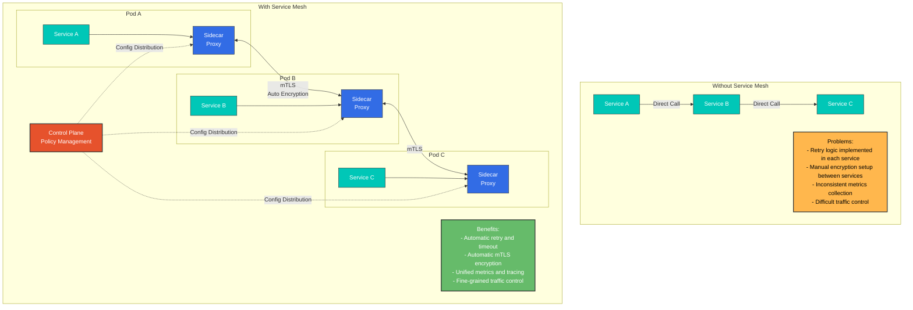
```mermaid
flowchart TB
    subgraph "Without Service Mesh"
        direction LR
        AppA1[Service A] -->|Direct Call| AppB1[Service B]
        AppB1 -->|Direct Call| AppC1[Service C]

        Note1[Problems:<br/>- Retry logic implemented in each service<br/>- Manual encryption setup between services<br/>- Inconsistent metrics collection<br/>- Difficult traffic control]
    end

    subgraph "With Service Mesh"
        direction LR
        subgraph PodA["Pod A"]
            AppA2[Service A]
            ProxyA[Sidecar<br/>Proxy]
        end
        subgraph PodB["Pod B"]
            AppB2[Service B]
            ProxyB[Sidecar<br/>Proxy]
        end
        subgraph PodC["Pod C"]
            AppC2[Service C]
            ProxyC[Sidecar<br/>Proxy]
        end

        ControlPlane[Control Plane<br/>Policy Management]

        AppA2 --> ProxyA
        ProxyA <-->|mTLS<br/>Auto Encryption| ProxyB
        AppB2 --> ProxyB
        ProxyB <-->|mTLS| ProxyC
        AppC2 --> ProxyC

        ControlPlane -.->|Config Distribution| ProxyA
        ControlPlane -.->|Config Distribution| ProxyB
        ControlPlane -.->|Config Distribution| ProxyC

        Note2[Benefits:<br/>- Automatic retry and timeout<br/>- Automatic mTLS encryption<br/>- Unified metrics and tracing<br/>- Fine-grained traffic control]
    end

    classDef problem fill:#FFB74D,stroke:#333,stroke-width:2px,color:black;
    classDef solution fill:#66BB6A,stroke:#333,stroke-width:2px,color:white;
    classDef app fill:#00C7B7,stroke:#333,stroke-width:1px,color:white;
    classDef proxy fill:#326CE5,stroke:#333,stroke-width:1px,color:white;
    classDef control fill:#E6522C,stroke:#333,stroke-width:2px,color:white;

    class Note1 problem;
    class Note2 solution;
    class AppA1,AppB1,AppC1,AppA2,AppB2,AppC2 app;
    class ProxyA,ProxyB,ProxyC proxy;
    class ControlPlane control;
```

#### Comparación de patrones de arquitectura

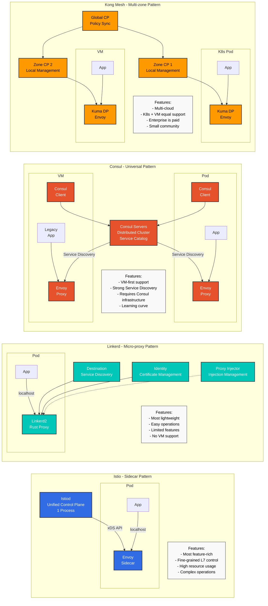
```mermaid
flowchart LR
    subgraph "Istio - Sidecar Pattern"
        direction TB
        I_CP[Istiod<br/>Unified Control Plane<br/>1 Process]

        subgraph I_Pod1["Pod"]
            I_App1[App]
            I_Envoy1[Envoy<br/>Sidecar]
        end

        I_CP -->|xDS API| I_Envoy1
        I_App1 -->|localhost| I_Envoy1

        I_Note[Features:<br/>- Most feature-rich<br/>- Fine-grained L7 control<br/>- High resource usage<br/>- Complex operations]
    end

    subgraph "Linkerd - Micro-proxy Pattern"
        direction TB
        L_CP1[Destination<br/>Service Discovery]
        L_CP2[Identity<br/>Certificate Management]
        L_CP3[Proxy Injector<br/>Injection Management]

        subgraph L_Pod1["Pod"]
            L_App1[App]
            L_Proxy1[Linkerd2<br/>Rust Proxy]
        end

        L_CP1 --> L_Proxy1
        L_CP2 --> L_Proxy1
        L_CP3 -.-> L_Proxy1
        L_App1 -->|localhost| L_Proxy1

        L_Note[Features:<br/>- Most lightweight<br/>- Easy operations<br/>- Limited features<br/>- No VM support]
    end

    subgraph "Consul - Universal Pattern"
        direction TB
        C_Server[Consul Servers<br/>Distributed Cluster<br/>Service Catalog]

        subgraph C_Pod1["Pod"]
            C_App1[App]
            C_Client1[Consul<br/>Client]
            C_Envoy1[Envoy<br/>Proxy]
        end

        subgraph C_VM["VM"]
            C_App2[Legacy<br/>App]
            C_Client2[Consul<br/>Client]
            C_Envoy2[Envoy<br/>Proxy]
        end

        C_Client1 --> C_Server
        C_Client2 --> C_Server
        C_Server -->|Service Discovery| C_Envoy1
        C_Server -->|Service Discovery| C_Envoy2
        C_App1 --> C_Envoy1
        C_App2 --> C_Envoy2

        C_Note[Features:<br/>- VM-first support<br/>- Strong Service Discovery<br/>- Requires Consul infrastructure<br/>- Learning curve]
    end

    subgraph "Kong Mesh - Multi-zone Pattern"
        direction TB
        K_Global[Global CP<br/>Policy Sync]
        K_Zone1[Zone CP 1<br/>Local Management]
        K_Zone2[Zone CP 2<br/>Local Management]

        subgraph K_Pod1["K8s Pod"]
            K_App1[App]
            K_DP1[Kuma DP<br/>Envoy]
        end

        subgraph K_VM["VM"]
            K_App2[App]
            K_DP2[Kuma DP<br/>Envoy]
        end

        K_Global --> K_Zone1
        K_Global --> K_Zone2
        K_Zone1 --> K_DP1
        K_Zone2 --> K_DP2
        K_App1 --> K_DP1
        K_App2 --> K_DP2

        K_Note[Features:<br/>- Multi-cloud<br/>- K8s + VM equal support<br/>- Enterprise is paid<br/>- Small community]
    end

    classDef istio fill:#326CE5,stroke:#333,stroke-width:2px,color:white;
    classDef linkerd fill:#00C7B7,stroke:#333,stroke-width:2px,color:white;
    classDef consul fill:#E6522C,stroke:#333,stroke-width:2px,color:white;
    classDef kong fill:#FF9900,stroke:#333,stroke-width:2px,color:black;
    classDef note fill:#f9f9f9,stroke:#333,stroke-width:1px,color:black;

    class I_CP,I_Envoy1 istio;
    class L_CP1,L_CP2,L_CP3,L_Proxy1 linkerd;
    class C_Server,C_Client1,C_Client2,C_Envoy1,C_Envoy2 consul;
    class K_Global,K_Zone1,K_Zone2,K_DP1,K_DP2 kong;
    class I_Note,L_Note,C_Note,K_Note note;
```

### Arquitectura detallada

#### Istio

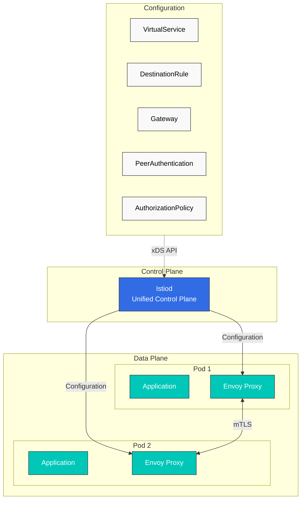
```mermaid
flowchart TB
    subgraph "Control Plane"
        Istiod[Istiod<br/>Unified Control Plane]
    end

    subgraph "Data Plane"
        subgraph "Pod 1"
            App1[Application]
            Envoy1[Envoy Proxy]
        end
        subgraph "Pod 2"
            App2[Application]
            Envoy2[Envoy Proxy]
        end
    end

    subgraph "Configuration"
        VS[VirtualService]
        DR[DestinationRule]
        GW[Gateway]
        PA[PeerAuthentication]
        AP[AuthorizationPolicy]
    end

    Configuration -.->|xDS API| Istiod
    Istiod -->|Configuration| Envoy1
    Istiod -->|Configuration| Envoy2
    Envoy1 <-->|mTLS| Envoy2

    classDef k8sComponent fill:#326CE5,stroke:#333,stroke-width:1px,color:white;
    classDef userApp fill:#00C7B7,stroke:#333,stroke-width:1px,color:white;
    classDef config fill:#f9f9f9,stroke:#333,stroke-width:1px,color:black;

    class Istiod k8sComponent;
    class App1,App2 userApp;
    class Envoy1,Envoy2 userApp;
    class VS,DR,GW,PA,AP config;
```

**Características**:

* **Proxy**: Envoy (C++)
* **Arquitectura**: Control Plane unificado (Istiod)
* **Configuración**: Kubernetes CRD (VirtualService, DestinationRule, etc.)
* **Fortalezas**: El más completo en funcionalidades, soporte empresarial a gran escala
* **Debilidades**: Curva de aprendizaje elevada, sobrecarga de recursos

**Componentes principales**:

* **Istiod**: Pilot + Citadel + Galley unificados
* **Envoy Proxy**: Data Plane
* **Ingress/Egress Gateway**: Control del tráfico en los límites del cluster

### Linkerd

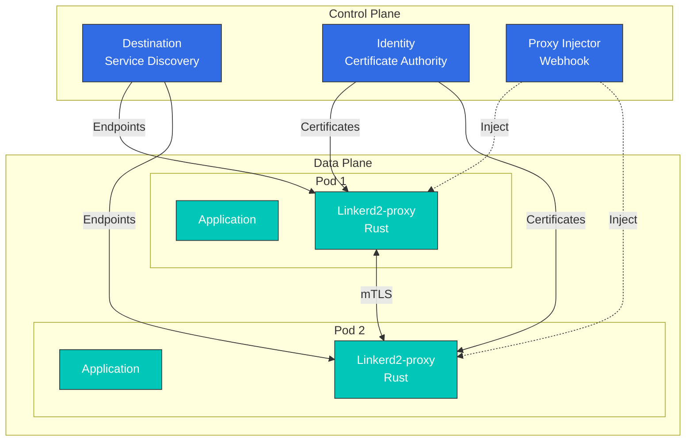
```mermaid
flowchart TB
    subgraph "Control Plane"
        Destination[Destination<br/>Service Discovery]
        Identity[Identity<br/>Certificate Authority]
        ProxyInjector[Proxy Injector<br/>Webhook]
    end

    subgraph "Data Plane"
        subgraph "Pod 1"
            App1[Application]
            LP1[Linkerd2-proxy<br/>Rust]
        end
        subgraph "Pod 2"
            App2[Application]
            LP2[Linkerd2-proxy<br/>Rust]
        end
    end

    ProxyInjector -.->|Inject| LP1
    ProxyInjector -.->|Inject| LP2
    Identity -->|Certificates| LP1
    Identity -->|Certificates| LP2
    Destination -->|Endpoints| LP1
    Destination -->|Endpoints| LP2
    LP1 <-->|mTLS| LP2

    classDef k8sComponent fill:#326CE5,stroke:#333,stroke-width:1px,color:white;
    classDef userApp fill:#00C7B7,stroke:#333,stroke-width:1px,color:white;

    class Destination,Identity,ProxyInjector k8sComponent;
    class App1,App2,LP1,LP2 userApp;
```

**Características**:

* **Proxy**: Linkerd2-proxy (Rust, desarrollado a medida)
* **Arquitectura**: Control Plane de microservicios
* **Configuración**: Recursos nativos de Kubernetes + Annotations sencillas
* **Fortalezas**: Ultraligero, instalación y operación sencillas, rendimiento rápido
* **Debilidades**: Funcionalidades limitadas, sin soporte para VM

**Componentes principales**:

* **Destination**: Service Discovery y políticas de enrutamiento
* **Identity**: Emisión automática de certificados mTLS
* **Proxy Injector**: Inyección automática de Sidecar

### Kong Mesh

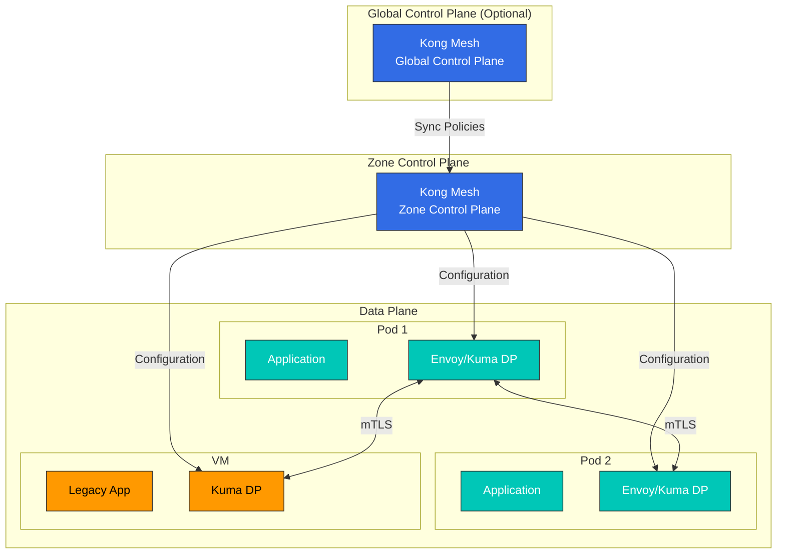
```mermaid
flowchart TB
    subgraph "Global Control Plane (Optional)"
        KongGlobal[Kong Mesh<br/>Global Control Plane]
    end

    subgraph "Zone Control Plane"
        KongZone[Kong Mesh<br/>Zone Control Plane]
    end

    subgraph "Data Plane"
        subgraph "Pod 1"
            App1[Application]
            Envoy1[Envoy/Kuma DP]
        end
        subgraph "Pod 2"
            App2[Application]
            Envoy2[Envoy/Kuma DP]
        end
        subgraph "VM"
            AppVM[Legacy App]
            EnvoyVM[Kuma DP]
        end
    end

    KongGlobal -->|Sync Policies| KongZone
    KongZone -->|Configuration| Envoy1
    KongZone -->|Configuration| Envoy2
    KongZone -->|Configuration| EnvoyVM
    Envoy1 <-->|mTLS| Envoy2
    Envoy1 <-->|mTLS| EnvoyVM

    classDef k8sComponent fill:#326CE5,stroke:#333,stroke-width:1px,color:white;
    classDef userApp fill:#00C7B7,stroke:#333,stroke-width:1px,color:white;
    classDef vm fill:#FF9900,stroke:#333,stroke-width:1px,color:black;

    class KongGlobal,KongZone k8sComponent;
    class App1,App2,Envoy1,Envoy2 userApp;
    class AppVM,EnvoyVM vm;
```

**Características**:

* **Proxy**: Envoy (Kuma Data Plane)
* **Arquitectura**: Control Plane universal (K8s + VM)
* **Configuración**: Kuma CRD + Kong Mesh UI
* **Fortalezas**: Excelente soporte para VM, multi-zone/multi-cloud, funcionalidades empresariales
* **Debilidades**: Las funcionalidades comerciales son de pago, comunidad relativamente pequeña

**Componentes principales**:

* **Global Control Plane**: Sincronización de políticas multi-zone
* **Zone Control Plane**: Gestión local del data plane
* **Kuma DP**: Data plane para Kubernetes y VM

#### Arquitectura detallada de Kong Mesh

Kong Mesh es un Service Mesh universal basado en Kuma que integra múltiples clusters y entornos en una única malla mediante una arquitectura multi-zone.

**Arquitectura de despliegue multi-zone**

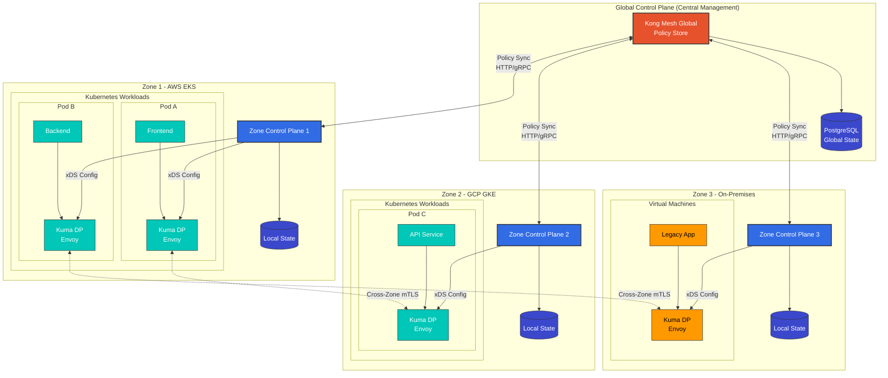
```mermaid
flowchart TB
    subgraph Global["Global Control Plane (Central Management)"]
        direction TB
        GCP[Kong Mesh Global<br/>Policy Store]
        GDB[(PostgreSQL<br/>Global State)]
    end

    subgraph Zone1["Zone 1 - AWS EKS"]
        direction TB
        ZCP1[Zone Control Plane 1]
        ZDB1[(Local State)]

        subgraph K8s1["Kubernetes Workloads"]
            direction LR
            subgraph Pod1["Pod A"]
                App1[Frontend]
                DP1[Kuma DP<br/>Envoy]
            end
            subgraph Pod2["Pod B"]
                App2[Backend]
                DP2[Kuma DP<br/>Envoy]
            end
        end
    end

    subgraph Zone2["Zone 2 - GCP GKE"]
        direction TB
        ZCP2[Zone Control Plane 2]
        ZDB2[(Local State)]

        subgraph K8s2["Kubernetes Workloads"]
            direction LR
            subgraph Pod3["Pod C"]
                App3[API Service]
                DP3[Kuma DP<br/>Envoy]
            end
        end
    end

    subgraph Zone3["Zone 3 - On-Premises"]
        direction TB
        ZCP3[Zone Control Plane 3]
        ZDB3[(Local State)]

        subgraph VM["Virtual Machines"]
            direction LR
            VM1[Legacy App]
            DPV[Kuma DP<br/>Envoy]
        end
    end

    %% Global to Zone connections
    GCP <-->|Policy Sync<br/>HTTP/gRPC| ZCP1
    GCP <-->|Policy Sync<br/>HTTP/gRPC| ZCP2
    GCP <-->|Policy Sync<br/>HTTP/gRPC| ZCP3
    GCP --> GDB

    %% Zone internal connections
    ZCP1 --> ZDB1
    ZCP1 -->|xDS Config| DP1
    ZCP1 -->|xDS Config| DP2

    ZCP2 --> ZDB2
    ZCP2 -->|xDS Config| DP3

    ZCP3 --> ZDB3
    ZCP3 -->|xDS Config| DPV

    %% App connections
    App1 --> DP1
    App2 --> DP2
    App3 --> DP3
    VM1 --> DPV

    %% Cross-Zone traffic
    DP1 <-.->|Cross-Zone mTLS| DP3
    DP2 <-.->|Cross-Zone mTLS| DPV

    classDef global fill:#E6522C,stroke:#333,stroke-width:2px,color:white;
    classDef zone fill:#326CE5,stroke:#333,stroke-width:2px,color:white;
    classDef dataplane fill:#00C7B7,stroke:#333,stroke-width:1px,color:white;
    classDef vm fill:#FF9900,stroke:#333,stroke-width:1px,color:black;
    classDef db fill:#3B48CC,stroke:#333,stroke-width:1px,color:white;

    class GCP global;
    class ZCP1,ZCP2,ZCP3 zone;
    class DP1,DP2,DP3,App1,App2,App3 dataplane;
    class DPV,VM1 vm;
    class GDB,ZDB1,ZDB2,ZDB3 db;
```

**Características principales**:

* **Global Control Plane**: Gestiona de forma centralizada las políticas de todas las zonas
* **Zone Control Plane**: Gestiona de forma independiente el data plane de cada zona
* **Service Discovery automático**: Descubrimiento automático de servicios entre zonas
* **mTLS unificado**: La comunicación entre zonas también se cifra automáticamente

**Conexión de servicios y flujo de tráfico**

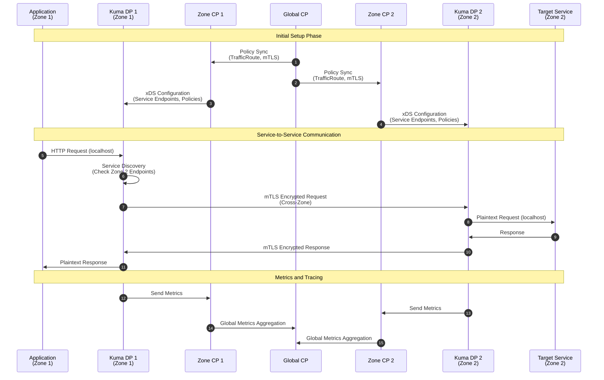
```mermaid
sequenceDiagram
    autonumber
    participant App as Application<br/>(Zone 1)
    participant DP1 as Kuma DP 1<br/>(Zone 1)
    participant ZCP1 as Zone CP 1
    participant GCP as Global CP
    participant ZCP2 as Zone CP 2
    participant DP2 as Kuma DP 2<br/>(Zone 2)
    participant Target as Target Service<br/>(Zone 2)

    Note over App,Target: Initial Setup Phase

    GCP->>ZCP1: Policy Sync<br/>(TrafficRoute, mTLS)
    GCP->>ZCP2: Policy Sync<br/>(TrafficRoute, mTLS)

    ZCP1->>DP1: xDS Configuration<br/>(Service Endpoints, Policies)
    ZCP2->>DP2: xDS Configuration<br/>(Service Endpoints, Policies)

    Note over App,Target: Service-to-Service Communication

    App->>DP1: HTTP Request (localhost)
    DP1->>DP1: Service Discovery<br/>(Check Zone 2 Endpoints)
    DP1->>DP2: mTLS Encrypted Request<br/>(Cross-Zone)
    DP2->>Target: Plaintext Request (localhost)
    Target->>DP2: Response
    DP2->>DP1: mTLS Encrypted Response
    DP1->>App: Plaintext Response

    Note over App,Target: Metrics and Tracing

    DP1->>ZCP1: Send Metrics
    DP2->>ZCP2: Send Metrics
    ZCP1->>GCP: Global Metrics Aggregation
    ZCP2->>GCP: Global Metrics Aggregation
```

**Mecanismo de propagación de políticas**

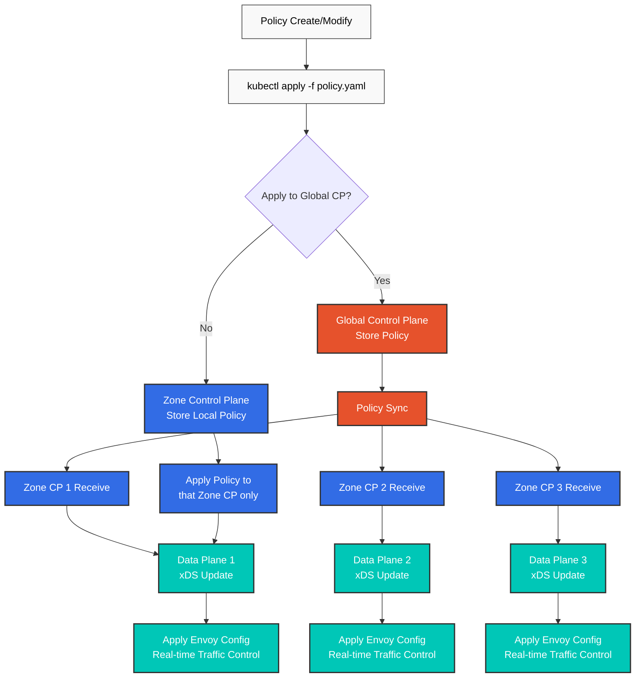
```mermaid
flowchart TD
    Start[Policy Create/Modify]
    Start --> Apply[kubectl apply -f policy.yaml]

    Apply --> Global{Apply to Global CP?}

    Global -->|Yes| GlobalStore[Global Control Plane<br/>Store Policy]
    Global -->|No| ZoneStore[Zone Control Plane<br/>Store Local Policy]

    GlobalStore --> Sync[Policy Sync]
    Sync --> Zone1[Zone CP 1 Receive]
    Sync --> Zone2[Zone CP 2 Receive]
    Sync --> Zone3[Zone CP 3 Receive]

    ZoneStore --> Zone1Apply[Apply Policy to<br/>that Zone CP only]

    Zone1 --> DP1[Data Plane 1<br/>xDS Update]
    Zone2 --> DP2[Data Plane 2<br/>xDS Update]
    Zone3 --> DP3[Data Plane 3<br/>xDS Update]
    Zone1Apply --> DP1

    DP1 --> Enforce1[Apply Envoy Config<br/>Real-time Traffic Control]
    DP2 --> Enforce2[Apply Envoy Config<br/>Real-time Traffic Control]
    DP3 --> Enforce3[Apply Envoy Config<br/>Real-time Traffic Control]

    classDef input fill:#f9f9f9,stroke:#333,stroke-width:1px,color:black;
    classDef global fill:#E6522C,stroke:#333,stroke-width:2px,color:white;
    classDef zone fill:#326CE5,stroke:#333,stroke-width:2px,color:white;
    classDef dataplane fill:#00C7B7,stroke:#333,stroke-width:2px,color:white;

    class Start,Apply input;
    class GlobalStore,Sync global;
    class Zone1,Zone2,Zone3,ZoneStore,Zone1Apply zone;
    class DP1,DP2,DP3,Enforce1,Enforce2,Enforce3 dataplane;
```

**Ámbito de propagación de políticas por tipo**:

| Tipo de política      | Ámbito | Método de propagación | Caso de uso                         |
| --------------------- | ------ | --------------------- | ----------------------------------- |
| **Mesh**              | Global | Todas las zonas       | Configuración global de mTLS        |
| **TrafficRoute**      | Global | Todas las zonas       | Reglas globales de enrutamiento     |
| **TrafficPermission** | Global | Todas las zonas       | Control de acceso entre servicios   |
| **HealthCheck**       | Zone   | Solo zona local       | Comprobaciones de salud por zona    |
| **ProxyTemplate**     | Zone   | Solo zona local       | Configuración de Envoy por zona     |

**Ciclo de vida del Data Plane**

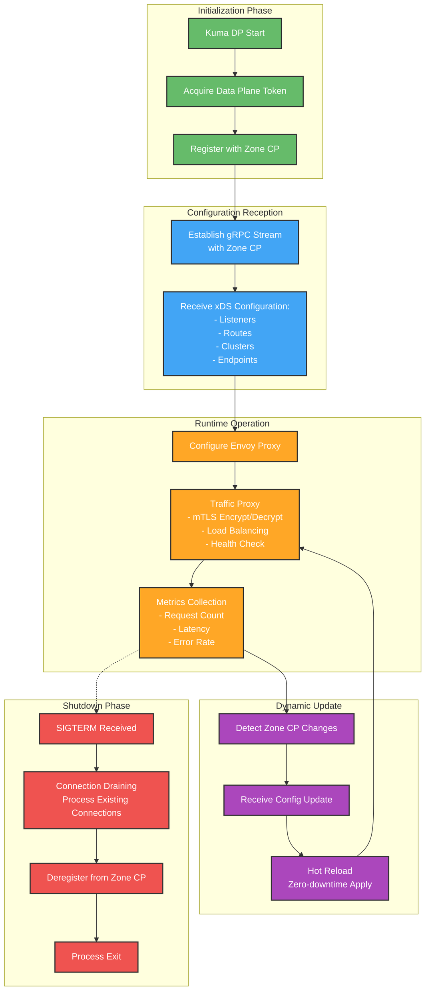
```mermaid
flowchart TB
    subgraph Init["Initialization Phase"]
        direction TB
        Start[Kuma DP Start]
        Start --> Token[Acquire Data Plane Token]
        Token --> Register[Register with Zone CP]
    end

    subgraph Config["Configuration Reception"]
        direction TB
        Register --> Connect[Establish gRPC Stream<br/>with Zone CP]
        Connect --> Receive[Receive xDS Configuration:<br/>- Listeners<br/>- Routes<br/>- Clusters<br/>- Endpoints]
    end

    subgraph Runtime["Runtime Operation"]
        direction TB
        Receive --> Proxy[Configure Envoy Proxy]
        Proxy --> Traffic[Traffic Proxy<br/>- mTLS Encrypt/Decrypt<br/>- Load Balancing<br/>- Health Check]
        Traffic --> Metrics[Metrics Collection<br/>- Request Count<br/>- Latency<br/>- Error Rate]
    end

    subgraph Update["Dynamic Update"]
        direction TB
        Metrics --> Watch[Detect Zone CP Changes]
        Watch --> UpdateConfig[Receive Config Update]
        UpdateConfig --> HotReload[Hot Reload<br/>Zero-downtime Apply]
        HotReload --> Traffic
    end

    subgraph Shutdown["Shutdown Phase"]
        direction TB
        Signal[SIGTERM Received]
        Signal --> Drain[Connection Draining<br/>Process Existing Connections]
        Drain --> Deregister[Deregister from Zone CP]
        Deregister --> Stop[Process Exit]
    end

    Metrics -.-> Signal

    classDef init fill:#66BB6A,stroke:#333,stroke-width:2px,color:white;
    classDef config fill:#42A5F5,stroke:#333,stroke-width:2px,color:white;
    classDef runtime fill:#FFA726,stroke:#333,stroke-width:2px,color:white;
    classDef update fill:#AB47BC,stroke:#333,stroke-width:2px,color:white;
    classDef shutdown fill:#EF5350,stroke:#333,stroke-width:2px,color:white;

    class Start,Token,Register init;
    class Connect,Receive config;
    class Proxy,Traffic,Metrics runtime;
    class Watch,UpdateConfig,HotReload update;
    class Signal,Drain,Deregister,Stop shutdown;
```

**Service Discovery entre zonas**

```mermaid
flowchart LR
    subgraph Zone1["Zone 1 - AWS"]
        direction TB
        Service1[Service: api<br/>Tag: version=v1]
        ZCP1[Zone CP 1]
        Service1 -.->|Register| ZCP1
    end

    subgraph Zone2["Zone 2 - GCP"]
        direction TB
        Service2[Service: api<br/>Tag: version=v2]
        ZCP2[Zone CP 2]
        Service2 -.->|Register| ZCP2
    end

    subgraph Zone3["Zone 3 - On-Prem"]
        direction TB
        Service3[Service: database<br/>Tag: tier=primary]
        ZCP3[Zone CP 3]
        Service3 -.->|Register| ZCP3
    end

    subgraph Global["Global Control Plane"]
        direction TB
        ServiceRegistry[Unified Service Registry<br/>api: [Zone1, Zone2]<br/>database: [Zone3]]
    end

    ZCP1 -->|Send Service Info| ServiceRegistry
    ZCP2 -->|Send Service Info| ServiceRegistry
    ZCP3 -->|Send Service Info| ServiceRegistry

    ServiceRegistry -->|Distribute Unified Service Map| ZCP1
    ServiceRegistry -->|Distribute Unified Service Map| ZCP2
    ServiceRegistry -->|Distribute Unified Service Map| ZCP3

    subgraph Client["Client (Zone 1)"]
        direction TB
        App[Application]
        DP[Kuma DP]
        App --> DP
    end

    DP -.->|1. Request api service| ZCP1
    ZCP1 -.->|2. Return Endpoints<br/>Zone1: 10.0.1.10<br/>Zone2: 10.1.1.10| DP
    DP -.->|3. Local-first Routing<br/>Zone1: 80%<br/>Zone2: 20%| Service1
    DP -.->|4. Cross-Zone Routing| Service2

    classDef zone fill:#326CE5,stroke:#333,stroke-width:2px,color:white;
    classDef service fill:#00C7B7,stroke:#333,stroke-width:1px,color:white;
    classDef global fill:#E6522C,stroke:#333,stroke-width:2px,color:white;
    classDef client fill:#FF9900,stroke:#333,stroke-width:2px,color:black;

    class ZCP1,ZCP2,ZCP3 zone;
    class Service1,Service2,Service3 service;
    class ServiceRegistry global;
    class App,DP client;
```

**Funcionalidades de Service Discovery**:

* **Registro automático**: Los servicios de cada zona se registran automáticamente con Zone CP
* **Vista global**: Global CP integra los servicios de todas las zonas
* **Local-first**: Primero enruta a servicios de la misma zona
* **Failover automático**: Cambia automáticamente a otra zona cuando falla el servicio local
* **Enrutamiento basado en tags**: Control de enrutamiento detallado mediante tags de servicio

**Ejemplos de configuración de Kong Mesh**

**Recurso Mesh (configuración global de mTLS)**:

```yaml
apiVersion: kuma.io/v1alpha1
kind: Mesh
metadata:
  name: default
spec:
  # Enable global mTLS
  mtls:
    enabledBackend: ca-1
    backends:
    - name: ca-1
      type: builtin
      dpCert:
        rotation:
          expiration: 24h
      conf:
        caCert:
          RSAbits: 2048
          expiration: 10y
  # Global metrics collection
  metrics:
    enabledBackend: prometheus-1
    backends:
    - name: prometheus-1
      type: prometheus
      conf:
        port: 5670
        path: /metrics
```

**TrafficRoute (enrutamiento entre zonas)**:

```yaml
apiVersion: kuma.io/v1alpha1
kind: TrafficRoute
metadata:
  name: api-route
  namespace: kuma-system
spec:
  sources:
  - match:
      kuma.io/service: '*'
  destinations:
  - match:
      kuma.io/service: api
  conf:
    # Local zone priority (80%)
    loadBalancer:
      roundRobin: {}
    split:
    - weight: 80
      destination:
        kuma.io/service: api
        kuma.io/zone: zone-1
    - weight: 20
      destination:
        kuma.io/service: api
        kuma.io/zone: zone-2
```

**TrafficPermission (control de acceso entre servicios)**:

```yaml
apiVersion: kuma.io/v1alpha1
kind: TrafficPermission
metadata:
  name: api-to-database
  namespace: kuma-system
spec:
  sources:
  - match:
      kuma.io/service: api
      kuma.io/zone: '*'  # api service from all zones
  destinations:
  - match:
      kuma.io/service: database
      kuma.io/zone: zone-3  # database in Zone 3 only
```

**Ventajas de la arquitectura de Kong Mesh**

**Arquitectura multi-zone**:

* **Service Mesh global**: Integra múltiples clusters y entornos en una única malla
* **Gestión independiente de zonas**: Cada zona opera de forma independiente; el tráfico local funciona normalmente incluso si falla Global CP
* **Failover automático**: Cambia automáticamente a otra zona ante el fallo de una zona
* **Consistencia de políticas**: Las mismas políticas se aplican automáticamente a todas las zonas

**Soporte universal**:

* **Kubernetes + VM**: Soporta por igual K8s y VM
* **Multi-cloud**: Integra AWS, GCP, Azure y On-Premises
* **Integración de sistemas heredados**: Añade gradualmente workloads de VM existentes a la malla

**Comodidad operativa**:

* **GUI incluida**: Gestión visual con la GUI de Kong Mesh
* **Plantillas de políticas**: Se proporcionan plantillas de políticas predefinidas
* **Service Discovery automático**: Los servicios se descubren automáticamente sin configuración manual

**Funcionalidades empresariales** (de pago):

* **RBAC**: Control de acceso detallado basado en roles
* **Multi-tenancy**: Aislamiento y gestión a nivel de zona
* **Soporte 24/7**: Soporte profesional para entornos de producción
* **Observabilidad avanzada**: Métricas y tracing detallados

### Consul Connect

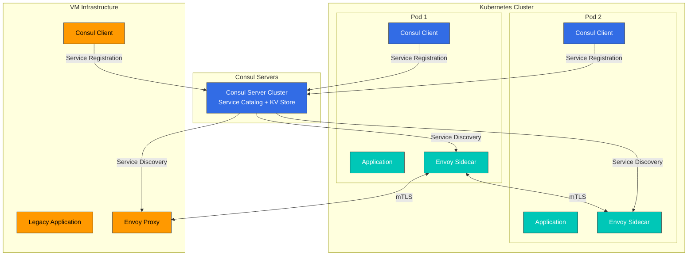
```mermaid
flowchart TB
    subgraph "Consul Servers"
        ConsulServer[Consul Server Cluster<br/>Service Catalog + KV Store]
    end

    subgraph "Kubernetes Cluster"
        subgraph "Pod 1"
            App1[Application]
            ConsulClient1[Consul Client]
            EnvoyProxy1[Envoy Sidecar]
        end
        subgraph "Pod 2"
            App2[Application]
            ConsulClient2[Consul Client]
            EnvoyProxy2[Envoy Sidecar]
        end
    end

    subgraph "VM Infrastructure"
        AppVM[Legacy Application]
        ConsulClientVM[Consul Client]
        EnvoyVM[Envoy Proxy]
    end

    ConsulClient1 -->|Service Registration| ConsulServer
    ConsulClient2 -->|Service Registration| ConsulServer
    ConsulClientVM -->|Service Registration| ConsulServer
    ConsulServer -->|Service Discovery| EnvoyProxy1
    ConsulServer -->|Service Discovery| EnvoyProxy2
    ConsulServer -->|Service Discovery| EnvoyVM
    EnvoyProxy1 <-->|mTLS| EnvoyProxy2
    EnvoyProxy1 <-->|mTLS| EnvoyVM

    classDef k8sComponent fill:#326CE5,stroke:#333,stroke-width:1px,color:white;
    classDef userApp fill:#00C7B7,stroke:#333,stroke-width:1px,color:white;
    classDef vm fill:#FF9900,stroke:#333,stroke-width:1px,color:black;

    class ConsulServer,ConsulClient1,ConsulClient2 k8sComponent;
    class App1,App2,EnvoyProxy1,EnvoyProxy2 userApp;
    class AppVM,ConsulClientVM,EnvoyVM vm;
```

**Características**:

* **Proxy**: Envoy o proxy integrado
* **Arquitectura**: Consul Server Cluster + Consul Clients
* **Configuración**: HCL o Kubernetes CRD
* **Fortalezas**: Service Discovery sólido, diseño VM-first, multi-datacenter
* **Debilidades**: Requiere gestión de la infraestructura de Consul; la integración con Kubernetes es más compleja que Istio

**Componentes principales**:

* **Consul Server**: Service Catalog, KV Store, gestión de certificados
* **Consul Client**: Se ejecuta en cada nodo, registro de servicios
* **Envoy Sidecar**: Proxy de tráfico

## Comparación de rendimiento

### Sobrecarga de latencia

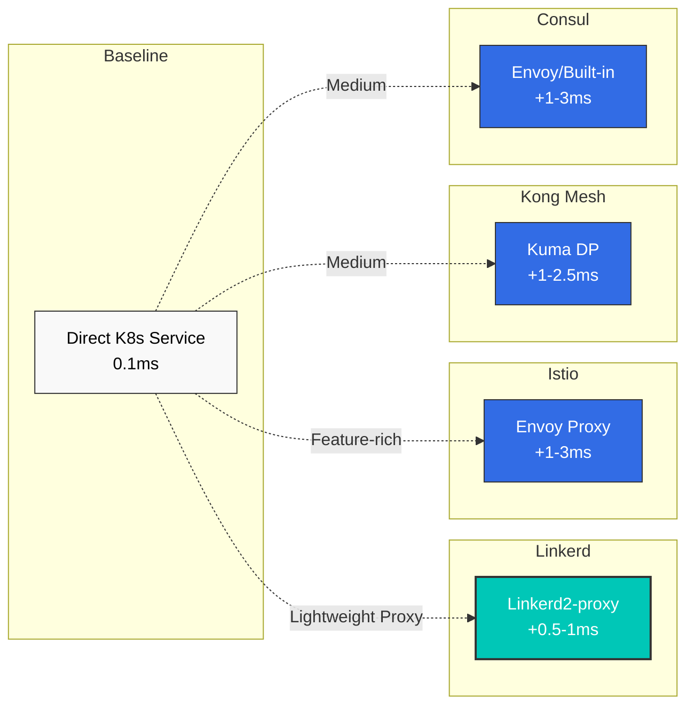
```mermaid
flowchart LR
    subgraph "Baseline"
        B[Direct K8s Service<br/>0.1ms]
    end

    subgraph "Linkerd"
        L[Linkerd2-proxy<br/>+0.5-1ms]
    end

    subgraph "Istio"
        I[Envoy Proxy<br/>+1-3ms]
    end

    subgraph "Kong Mesh"
        K[Kuma DP<br/>+1-2.5ms]
    end

    subgraph "Consul"
        C[Envoy/Built-in<br/>+1-3ms]
    end

    B -.->|Lightweight Proxy| L
    B -.->|Feature-rich| I
    B -.->|Medium| K
    B -.->|Medium| C

    classDef baseline fill:#f9f9f9,stroke:#333,stroke-width:1px,color:black;
    classDef fast fill:#00C7B7,stroke:#333,stroke-width:2px,color:white;
    classDef medium fill:#326CE5,stroke:#333,stroke-width:1px,color:white;

    class B baseline;
    class L fast;
    class I,K,C medium;
```

**Resultados de benchmarks** (aumento de latencia P99, 1000 RPS):

| Service Mesh       | P50    | P95    | P99    | Uso de CPU | Uso de memoria |
| ------------------ | ------ | ------ | ------ | ---------- | -------------- |
| **Baseline**       | 0.1ms  | 0.2ms  | 0.3ms  | -          | -              |
| **Linkerd**        | +0.5ms | +0.8ms | +1.2ms | +3-8%      | +20-50MB       |
| **Istio**          | +1.0ms | +2.5ms | +3.5ms | +5-15%     | +50-150MB      |
| **Kong Mesh**      | +0.8ms | +2.0ms | +3.0ms | +5-12%     | +40-120MB      |
| **Consul Connect** | +1.0ms | +2.5ms | +3.5ms | +6-14%     | +50-140MB      |

**Entorno de prueba**: EKS 1.28 de 3 nodos, m5.xlarge, 100 servicios, 1000 RPS

### Comparación de uso de recursos

#### Recursos del Control Plane

| Componente   | Istio      | Linkerd             | Kong Mesh     | Consul Connect       |
| ------------ | ---------- | ------------------- | ------------- | -------------------- |
| **CPU**      | 500m-1     | 100m-300m           | 200m-500m     | 500m-1               |
| **Memoria**  | 1-2GB      | 200-500MB           | 500MB-1GB     | 1-2GB                |
| **Réplicas** | 1 (Istiod) | 3-5 (microservicios) | 1-2 (Zone CP) | 3-5 (Consul Servers) |

#### Recursos del Data Plane (por Pod)

| Proxy      | Istio Envoy | Linkerd2-proxy | Kuma DP  | Consul Envoy |
| ---------- | ----------- | -------------- | -------- | ------------ |
| **CPU**    | 100-500m    | 20-100m        | 100-400m | 100-500m     |
| **Memoria** | 50-150MB    | 20-50MB        | 40-120MB | 50-140MB     |

### Comparación de throughput

**RPS máximo (solicitudes por segundo)**:

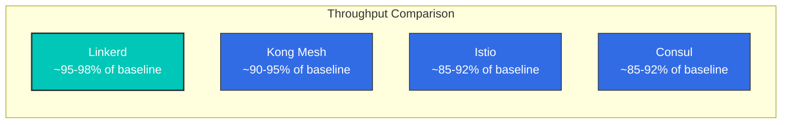
```mermaid
flowchart LR
    subgraph Throughput[Throughput Comparison]
        direction TB
        L[Linkerd<br/>~95-98% of baseline]
        K[Kong Mesh<br/>~90-95% of baseline]
        I[Istio<br/>~85-92% of baseline]
        C[Consul<br/>~85-92% of baseline]
    end

    classDef high fill:#00C7B7,stroke:#333,stroke-width:2px,color:white;
    classDef medium fill:#326CE5,stroke:#333,stroke-width:1px,color:white;

    class L high;
    class I,K,C medium;
```

**Conclusión**:

* **Linkerd**: Menor sobrecarga, proxy ligero
* **Istio/Consul**: Sobrecarga ligeramente mayor debido a más funcionalidades
* **Kong Mesh**: Nivel de rendimiento medio

## Comparación de funcionalidades

### Tabla de comparación integral de funcionalidades

| Área de funcionalidad      | Istio             | Linkerd   | Kong Mesh    | Consul Connect |
| -------------------------- | ----------------- | --------- | ------------ | -------------- |
| **Gestión del tráfico**    |                   |           |              |                |
| División de tráfico (Canary) | Detallada       | Básica    | Detallada    | Básica         |
| Pruebas A/B                | Basadas en headers | Limitada | Basadas en headers | Limitada   |
| Blue-Green                 | Sí                | Sí        | Sí           | Sí             |
| Mirroring de tráfico       | Sí                | No        | Sí           | Enterprise     |
| Circuit Breaking           | Sí                | Básico    | Sí           | Sí             |
| Retry                      | Detallado         | Básico    | Detallado    | Básico         |
| Timeout                    | Sí                | Sí        | Sí           | Sí             |
| Inyección de fallos        | Sí                | Limitada  | Sí           | Limitada       |
| **Seguridad**              |                   |           |              |                |
| Automatización de mTLS     | Sí                | Sí        | Sí           | Sí             |
| Políticas de autorización  | Muy detalladas    | Básicas   | Detalladas   | Intentions     |
| Integración con CA externa | Sí                | Sí        | Sí           | Sí             |
| Autenticación JWT          | Sí                | Limitada  | Sí           | Sí             |
| Limitación de tasa         | EnvoyFilter       | No        | Sí           | Enterprise     |
| **Observabilidad**         |                   |           |              |                |
| Métricas (Prometheus)      | Ricas             | Básicas   | Ricas        | Básicas        |
| Tracing distribuido        | Todos los backends | Jaeger   | Todos los backends | Jaeger/Zipkin |
| Logs de acceso             | Muy detallados    | Básicos   | Detallados   | Básicos        |
| Visualización de topología | Kiali             | Dashboard | GUI          | UI             |
| OpenTelemetry              | Sí                | Sí        | Sí           | Sí             |
| **Soporte de plataforma**  |                   |           |              |                |
| Kubernetes                 | Sí                | Sí        | Sí           | Sí             |
| Máquinas virtuales         | Limitado          | No        | Excelente    | Excelente      |
| Multi-cluster              | Excelente         | Compatible | Excelente   | Excelente      |
| Service Discovery          | Sí                | Sí        | Sí           | Muy sólido     |
| **Operaciones**            |                   |           |              |                |
| Complejidad de instalación | Alta              | Baja      | Media        | Media          |
| Actualización              | Media             | Fácil     | Media        | Media          |
| Solución de problemas      | Difícil           | Fácil     | Media        | Media          |
| Herramienta CLI            | istioctl          | linkerd   | kumactl      | consul         |

**Leyenda**:

* Sí = Totalmente compatible
* Limitado = Soporte limitado o funcionalidad Enterprise
* No = No compatible

### Comparación detallada de gestión del tráfico

#### Ejemplo de despliegue Canary

**Istio**:

```yaml
apiVersion: networking.istio.io/v1
kind: VirtualService
metadata:
  name: reviews
spec:
  hosts:
  - reviews
  http:
  - match:
    - headers:
        user-agent:
          regex: ".*Mobile.*"
    route:
    - destination:
        host: reviews
        subset: v2
      weight: 100
  - route:
    - destination:
        host: reviews
        subset: v1
      weight: 90
    - destination:
        host: reviews
        subset: v2
      weight: 10
---
apiVersion: networking.istio.io/v1
kind: DestinationRule
metadata:
  name: reviews
spec:
  host: reviews
  subsets:
  - name: v1
    labels:
      version: v1
  - name: v2
    labels:
      version: v2
```

**Linkerd**:

```yaml
apiVersion: split.smi-spec.io/v1alpha2
kind: TrafficSplit
metadata:
  name: reviews-split
spec:
  service: reviews
  backends:
  - service: reviews-v1
    weight: 90
  - service: reviews-v2
    weight: 10
---
# Requires separate Service creation
apiVersion: v1
kind: Service
metadata:
  name: reviews-v1
spec:
  selector:
    app: reviews
    version: v1
---
apiVersion: v1
kind: Service
metadata:
  name: reviews-v2
spec:
  selector:
    app: reviews
    version: v2
```

**Kong Mesh**:

```yaml
apiVersion: kuma.io/v1alpha1
kind: TrafficRoute
metadata:
  name: reviews-route
spec:
  sources:
  - match:
      kuma.io/service: '*'
  destinations:
  - match:
      kuma.io/service: reviews
  conf:
    split:
    - weight: 90
      destination:
        kuma.io/service: reviews
        version: v1
    - weight: 10
      destination:
        kuma.io/service: reviews
        version: v2
```

**Consul Connect**:

```hcl
Kind = "service-splitter"
Name = "reviews"
Splits = [
  {
    Weight        = 90
    ServiceSubset = "v1"
  },
  {
    Weight        = 10
    ServiceSubset = "v2"
  },
]
```

**Comparación**:

* **Istio**: Control más detallado (enrutamiento basado en headers, diversas condiciones de coincidencia)
* **Linkerd**: Sencillo, pero requiere Services separados
* **Kong Mesh**: Kuma CRD, intuitivo
* **Consul**: Configuración HCL, integrada con Service Discovery

## Funcionalidades de seguridad

### Comparación de configuración de mTLS

**Istio**:

```yaml
apiVersion: security.istio.io/v1
kind: PeerAuthentication
metadata:
  name: default
  namespace: istio-system
spec:
  mtls:
    mode: STRICT
---
apiVersion: networking.istio.io/v1
kind: DestinationRule
metadata:
  name: default
  namespace: istio-system
spec:
  host: "*.local"
  trafficPolicy:
    tls:
      mode: ISTIO_MUTUAL
```

**Linkerd**:

```bash
# mTLS enabled automatically (no configuration needed)
linkerd install | kubectl apply -f -

# Add annotation to namespace
kubectl annotate namespace default linkerd.io/inject=enabled
```

**Kong Mesh**:

```yaml
apiVersion: kuma.io/v1alpha1
kind: Mesh
metadata:
  name: default
spec:
  mtls:
    enabledBackend: ca-1
    backends:
    - name: ca-1
      type: builtin
      dpCert:
        rotation:
          expiration: 24h
      conf:
        caCert:
          RSAbits: 2048
          expiration: 10y
```

**Consul Connect**:

```hcl
Kind = "mesh"
Meta = {
  "consul.hashicorp.com/gateway-kind" = "mesh-gateway"
}
TLS {
  Incoming {
    TLSMinVersion = "TLSv1_2"
  }
}
```

### Comparación de políticas de autorización

**Istio** (el más detallado):

```yaml
apiVersion: security.istio.io/v1
kind: AuthorizationPolicy
metadata:
  name: reviews-policy
spec:
  selector:
    matchLabels:
      app: reviews
  action: ALLOW
  rules:
  - from:
    - source:
        principals: ["cluster.local/ns/default/sa/productpage"]
    to:
    - operation:
        methods: ["GET"]
        paths: ["/reviews/*"]
    when:
    - key: request.headers[user-agent]
      values: ["*Mobile*"]
```

**Linkerd**:

```yaml
apiVersion: policy.linkerd.io/v1beta1
kind: Server
metadata:
  name: reviews-server
spec:
  podSelector:
    matchLabels:
      app: reviews
  port: 9080
  proxyProtocol: HTTP/1
---
apiVersion: policy.linkerd.io/v1alpha1
kind: AuthorizationPolicy
metadata:
  name: reviews-policy
spec:
  targetRef:
    kind: Server
    name: reviews-server
  requiredAuthenticationRefs:
  - kind: ServiceAccount
    name: productpage
```

**Kong Mesh**:

```yaml
apiVersion: kuma.io/v1alpha1
kind: TrafficPermission
metadata:
  name: reviews-permission
spec:
  sources:
  - match:
      kuma.io/service: productpage
  destinations:
  - match:
      kuma.io/service: reviews
```

**Consul Connect** (Intentions):

```hcl
Kind = "service-intentions"
Name = "reviews"
Sources = [
  {
    Name   = "productpage"
    Action = "allow"
  }
]
```

**Comparación**:

* **Istio**: Control L7 muy detallado (método, Path, Header)
* **Linkerd**: Basado en Service Account, sencillo
* **Kong Mesh**: Permisos a nivel de Service
* **Consul**: Basado en Intentions, intuitivo

## Funcionalidades de observabilidad

### Recopilación de métricas

**Istio**:

* **Cantidad de métricas**: Más de 50 métricas predeterminadas
* **Personalización**: Extensión ilimitada con EnvoyFilter
* **Integración**: Prometheus, Grafana, Kiali

**Linkerd**:

* **Cantidad de métricas**: Más de 20 métricas predeterminadas (centradas en señales doradas)
* **Personalización**: Limitada
* **Integración**: Prometheus, Grafana, Linkerd Dashboard

**Kong Mesh**:

* **Cantidad de métricas**: Más de 40 métricas predeterminadas
* **Personalización**: Datadog, Prometheus
* **Integración**: GUI de Kong Mesh, Grafana

**Consul Connect**:

* **Cantidad de métricas**: Más de 30 métricas predeterminadas
* **Personalización**: Integración con Telegraf
* **Integración**: Consul UI, Prometheus, Grafana

### Tracing distribuido

**Backends compatibles**:

| Service Mesh  | Jaeger | Zipkin | Tempo   | Datadog | AWS X-Ray |
| ------------- | ------ | ------ | ------- | ------- | --------- |
| **Istio**     | Sí     | Sí     | Sí      | Sí      | Sí        |
| **Linkerd**   | Sí     | Sí     | Sí      | Limitado | Limitado |
| **Kong Mesh** | Sí     | Sí     | Sí      | Sí      | Sí        |
| **Consul**    | Sí     | Sí     | Limitado | Limitado | Limitado |

### Herramientas de visualización

**Istio + Kiali**:

```yaml
apiVersion: kiali.io/v1alpha1
kind: Kiali
metadata:
  name: kiali
spec:
  deployment:
    accessible_namespaces: ["**"]
  external_services:
    prometheus:
      url: http://prometheus:9090
    grafana:
      url: http://grafana:3000
    tracing:
      url: http://jaeger-query:16686
```

**Linkerd Dashboard**:

```bash
linkerd viz install | kubectl apply -f -
linkerd viz dashboard
```

**Kong Mesh GUI**:

```yaml
apiVersion: kuma.io/v1alpha1
kind: Mesh
metadata:
  name: default
spec:
  metrics:
    enabledBackend: prometheus-1
    backends:
    - name: prometheus-1
      type: prometheus
```

**Consul UI**:

```hcl
ui_config {
  enabled = true
  metrics_provider = "prometheus"
  metrics_proxy {
    base_url = "http://prometheus:9090"
  }
}
```

## Soporte multi-cluster

### Comparación de arquitectura

**Istio Multi-Primary**:

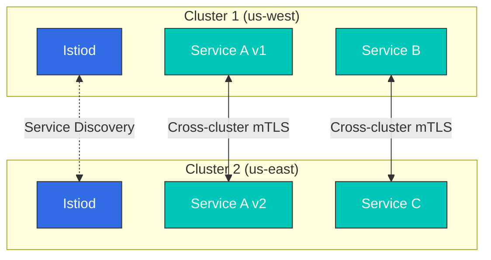
```mermaid
flowchart TB
    subgraph Cluster1["Cluster 1 (us-west)"]
        Istiod1[Istiod]
        App1[Service A v1]
        App2[Service B]
    end

    subgraph Cluster2["Cluster 2 (us-east)"]
        Istiod2[Istiod]
        App3[Service A v2]
        App4[Service C]
    end

    Istiod1 <-.->|Service Discovery| Istiod2
    App1 <-->|Cross-cluster mTLS| App3
    App2 <-->|Cross-cluster mTLS| App4

    classDef k8sComponent fill:#326CE5,stroke:#333,stroke-width:1px,color:white;
    classDef userApp fill:#00C7B7,stroke:#333,stroke-width:1px,color:white;

    class Istiod1,Istiod2 k8sComponent;
    class App1,App2,App3,App4 userApp;
```

**Linkerd Multi-cluster**:

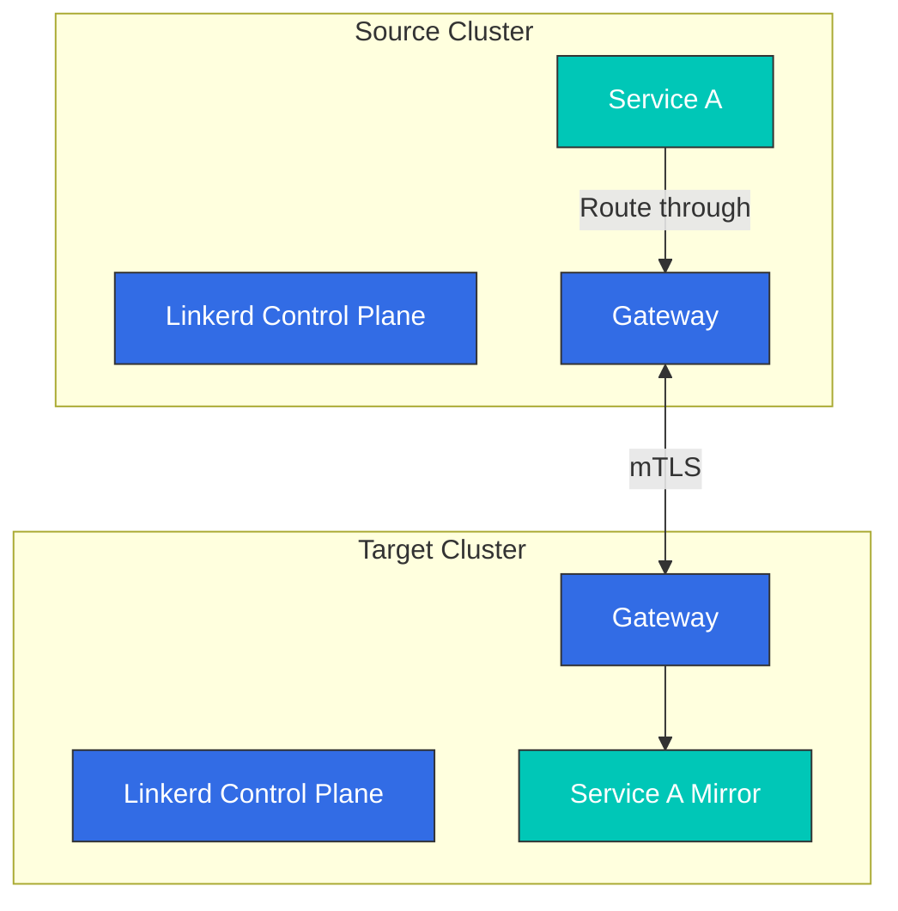
```mermaid
flowchart TB
    subgraph Cluster1["Source Cluster"]
        LinkerdCtl1[Linkerd Control Plane]
        Gateway1[Gateway]
        App1[Service A]
    end

    subgraph Cluster2["Target Cluster"]
        LinkerdCtl2[Linkerd Control Plane]
        Gateway2[Gateway]
        App2[Service A Mirror]
    end

    App1 -->|Route through| Gateway1
    Gateway1 <-->|mTLS| Gateway2
    Gateway2 --> App2

    classDef k8sComponent fill:#326CE5,stroke:#333,stroke-width:1px,color:white;
    classDef userApp fill:#00C7B7,stroke:#333,stroke-width:1px,color:white;

    class LinkerdCtl1,LinkerdCtl2,Gateway1,Gateway2 k8sComponent;
    class App1,App2 userApp;
```

**Kong Mesh Multi-zone**:

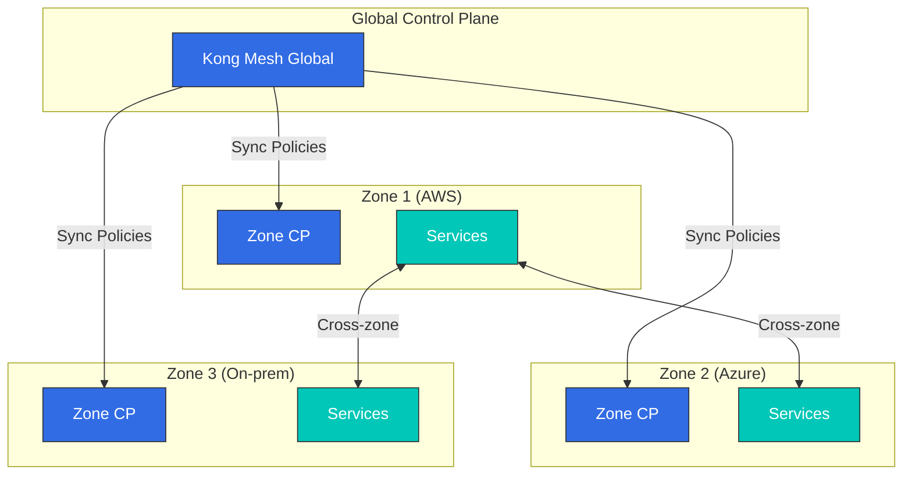
```mermaid
flowchart TB
    subgraph Global["Global Control Plane"]
        KongGlobal[Kong Mesh Global]
    end

    subgraph Zone1["Zone 1 (AWS)"]
        KongZone1[Zone CP]
        App1[Services]
    end

    subgraph Zone2["Zone 2 (Azure)"]
        KongZone2[Zone CP]
        App2[Services]
    end

    subgraph Zone3["Zone 3 (On-prem)"]
        KongZone3[Zone CP]
        App3[Services]
    end

    KongGlobal -->|Sync Policies| KongZone1
    KongGlobal -->|Sync Policies| KongZone2
    KongGlobal -->|Sync Policies| KongZone3
    App1 <-->|Cross-zone| App2
    App1 <-->|Cross-zone| App3

    classDef k8sComponent fill:#326CE5,stroke:#333,stroke-width:1px,color:white;
    classDef userApp fill:#00C7B7,stroke:#333,stroke-width:1px,color:white;

    class KongGlobal,KongZone1,KongZone2,KongZone3 k8sComponent;
    class App1,App2,App3 userApp;
```

**Consul Multi-datacenter**:

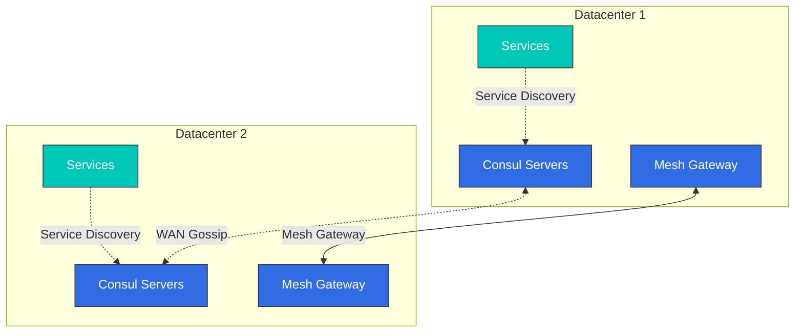
```mermaid
flowchart TB
    subgraph DC1["Datacenter 1"]
        ConsulServer1[Consul Servers]
        Gateway1[Mesh Gateway]
        App1[Services]
    end

    subgraph DC2["Datacenter 2"]
        ConsulServer2[Consul Servers]
        Gateway2[Mesh Gateway]
        App2[Services]
    end

    ConsulServer1 <-.->|WAN Gossip| ConsulServer2
    Gateway1 <-->|Mesh Gateway| Gateway2
    App1 -.->|Service Discovery| ConsulServer1
    App2 -.->|Service Discovery| ConsulServer2

    classDef k8sComponent fill:#326CE5,stroke:#333,stroke-width:1px,color:white;
    classDef userApp fill:#00C7B7,stroke:#333,stroke-width:1px,color:white;

    class ConsulServer1,ConsulServer2,Gateway1,Gateway2 k8sComponent;
    class App1,App2 userApp;
```

### Comparación de funcionalidades multi-cluster

| Funcionalidad              | Istio           | Linkerd          | Kong Mesh       | Consul    |
| -------------------------- | --------------- | ---------------- | --------------- | --------- |
| **Complejidad de configuración** | Media     | Baja             | Media           | Media     |
| **Service Discovery**      | Automático      | Servicios espejo | Automático      | Sólido    |
| **Failover de tráfico**    | Automático      | Manual           | Automático      | Automático |
| **mTLS**                   | Automático      | Mediante Gateway | Automático      | Automático |
| **Requisitos de red**      | Flat o Gateway  | Gateway          | Flat o Gateway  | Gateway   |
| **Sincronización de políticas** | Sí          | Limitada         | Global CP       | Sí        |
| **Número máximo de clusters** | Decenas      | \~10            | Decenas         | Decenas   |

## Complejidad operativa

### Instalación y actualización

**Istio**:

```bash
# Install
istioctl install --set profile=default

# Upgrade (Canary)
istioctl install --set profile=default --revision=1-24-0

# Sequential transition per namespace
kubectl label namespace default istio.io/rev=1-24-0 --overwrite
kubectl rollout restart deployment -n default
```

**Linkerd**:

```bash
# Install
linkerd install | kubectl apply -f -

# Upgrade (In-place)
linkerd upgrade | kubectl apply -f -

# Automatic rollout
```

**Kong Mesh**:

```bash
# Helm install
helm install kong-mesh kong-mesh/kong-mesh

# Upgrade
helm upgrade kong-mesh kong-mesh/kong-mesh
```

**Consul**:

```bash
# Helm install
helm install consul hashicorp/consul -f values.yaml

# Upgrade
helm upgrade consul hashicorp/consul -f values.yaml
```

**Comparación**:

* **Linkerd**: Instalación y actualización más sencillas
* **Istio**: La actualización Canary permite cero tiempo de inactividad, pero es compleja
* **Kong/Consul**: Basados en Helm, complejidad media

### Herramientas de solución de problemas

**Istio**:

```bash
# Check proxy status
istioctl proxy-status

# Validate configuration
istioctl analyze

# Check proxy configuration
istioctl proxy-config cluster <pod> -n <namespace>

# Change log level
istioctl proxy-config log <pod> --level debug
```

**Linkerd**:

```bash
# Check status
linkerd check

# Check statistics
linkerd stat deploy

# Tap (real-time traffic observation)
linkerd tap deploy/webapp

# Check profile
linkerd profile --template deploy/webapp
```

**Kong Mesh**:

```bash
# Check status
kumactl inspect dataplanes

# Check metrics
kumactl inspect meshes

# Check logs
kubectl logs -n kong-mesh-system deployment/kong-mesh-control-plane
```

**Consul**:

```bash
# Check status
consul members

# Check services
consul catalog services

# Check intentions
consul intention list

# Proxy logs
kubectl logs <pod> -c consul-connect-envoy-sidecar
```

### Curva de aprendizaje

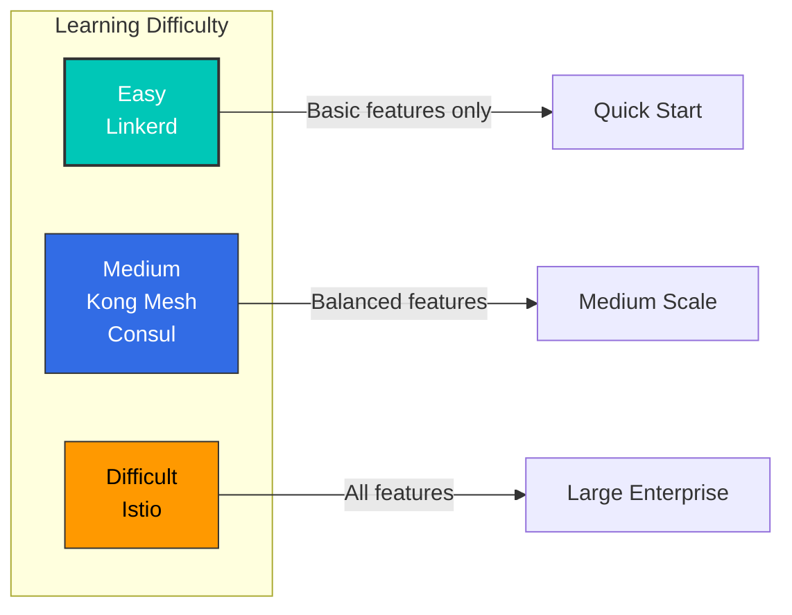
```mermaid
flowchart LR
    subgraph "Learning Difficulty"
        direction TB
        Easy[Easy<br/>Linkerd]
        Medium[Medium<br/>Kong Mesh<br/>Consul]
        Hard[Difficult<br/>Istio]
    end

    Easy -->|Basic features only| Use1[Quick Start]
    Medium -->|Balanced features| Use2[Medium Scale]
    Hard -->|All features| Use3[Large Enterprise]

    classDef easy fill:#00C7B7,stroke:#333,stroke-width:2px,color:white;
    classDef medium fill:#326CE5,stroke:#333,stroke-width:1px,color:white;
    classDef hard fill:#FF9900,stroke:#333,stroke-width:1px,color:black;

    class Easy easy;
    class Medium medium;
    class Hard hard;
```

## Análisis de costes

### Coste de infraestructura

**Cálculo de costes basado en recursos** (entorno de 100 Pod, EKS m5.xlarge):

| Service Mesh  | CPU de Control Plane | Memoria de Control Plane | CPU de Data Plane (total) | Memoria de Data Plane (total) | Coste mensual (estimado) |
| ------------- | -------------------- | ------------------------ | ------------------------- | ----------------------------- | ------------------------ |
| **Baseline**  | -                    | -                        | -                         | -                             | $300                     |
| **Linkerd**   | 300m                 | 500MB                    | 2 vCPU                    | 5GB                           | +$50 (\~$350)            |
| **Istio**     | 1 vCPU               | 2GB                      | 10 vCPU                   | 15GB                          | +$150 (\~$450)           |
| **Kong Mesh** | 500m                 | 1GB                      | 8 vCPU                    | 12GB                          | +$120 (\~$420)           |
| **Consul**    | 1 vCPU               | 2GB                      | 10 vCPU                   | 14GB                          | +$145 (\~$445)           |

**Nota**: Los costes reales pueden variar significativamente según los patrones de workload, el volumen de tráfico y la configuración.

### Coste operativo

**Tiempo de ingeniería (base mensual)**:

| Tarea                     | Istio      | Linkerd    | Kong Mesh  | Consul     |
| ------------------------- | ---------- | ---------- | ---------- | ---------- |
| **Configuración inicial** | 40h        | 8h         | 20h        | 24h        |
| **Operaciones diarias**   | 20h/mes    | 5h/mes     | 10h/mes    | 12h/mes    |
| **Solución de problemas** | 15h/mes    | 3h/mes     | 8h/mes     | 10h/mes    |
| **Actualizaciones**       | 8h/trimestre | 2h/trimestre | 4h/trimestre | 5h/trimestre |

### Coste de licencia

| Producto      | Open Source        | Enterprise                              |
| ------------- | ------------------ | --------------------------------------- |
| **Istio**     | Gratis (Apache 2.0) | Google Cloud Service Mesh (según uso)  |
| **Linkerd**   | Gratis (Apache 2.0) | Buoyant Enterprise (\$$$)              |
| **Kong Mesh** | Kuma Open Source   | Kong Mesh Enterprise (requiere contacto) |
| **Consul**    | Gratis (MPL 2.0)   | Consul Enterprise (\$$$)               |

**Ejemplos de funcionalidades Enterprise**:

* **Kong Mesh Enterprise**: GUI multi-zone, RBAC, soporte 24/7
* **Consul Enterprise**: Registro de auditoría, Namespaces, zonas de redundancia
* **Buoyant Enterprise**: Control Plane HA, soporte 24/7, SLA

## Recomendaciones de casos de uso

### 1. Gran empresa (más de 1000 servicios)

**Recomendado: Istio**

**Motivos**:

* Conjunto de funcionalidades más completo
* Control de tráfico detallado (pruebas A/B, Canary)
* Seguridad sólida (autorización L7)
* Federación multi-cluster
* Amplia comunidad y ecosistema de herramientas

**Ejemplo de configuración**:

```yaml
apiVersion: install.istio.io/v1alpha1
kind: IstioOperator
spec:
  profile: production
  components:
    pilot:
      k8s:
        hpaSpec:
          minReplicas: 3
          maxReplicas: 10
        resources:
          requests:
            cpu: 2000m
            memory: 4Gi
```

### 2. Startup pequeña o mediana (10-100 servicios)

**Recomendado: Linkerd**

**Motivos**:

* Instalación rápida (menos de 5 minutos)
* Baja sobrecarga de recursos
* Operaciones sencillas
* mTLS y métricas automáticos

**Ejemplo de configuración**:

```bash
linkerd install | kubectl apply -f -
linkerd viz install | kubectl apply -f -

# Enable per namespace
kubectl annotate namespace default linkerd.io/inject=enabled
```

### 3. Cloud híbrida (K8s + VM)

**Recomendado: Consul Connect o Kong Mesh**

**Motivos**:

* Soporte VM-first para workloads
* Service Discovery sólido
* Coherencia multi-plataforma

**Ejemplo de configuración de Consul**:

```hcl
# In Kubernetes
service {
  name = "web"
  port = 8080
  connect {
    sidecar_service {}
  }
}

# In VM
service {
  name = "database"
  port = 5432
  connect {
    sidecar_service {
      proxy {
        upstreams = [
          {
            destination_name = "web"
            local_bind_port  = 8080
          }
        ]
      }
    }
  }
}
```

### 4. Estrategia multi-cloud

**Recomendado: Istio o Kong Mesh**

**Motivos**:

* Neutral respecto al cloud
* Políticas y observabilidad coherentes
* Federación multi-cluster

**Istio multi-cluster**:

```bash
# Cluster 1 (AWS)
istioctl install --set values.global.meshID=mesh1 \
  --set values.global.multiCluster.clusterName=aws-cluster \
  --set values.global.network=aws-network

# Cluster 2 (GCP)
istioctl install --set values.global.meshID=mesh1 \
  --set values.global.multiCluster.clusterName=gcp-cluster \
  --set values.global.network=gcp-network

# Share Service Discovery
istioctl create-remote-secret \
  --context=aws-cluster --name=aws-cluster | \
  kubectl apply -f - --context=gcp-cluster
```

### 5. Migración de sistemas heredados

**Recomendado: Kong Mesh o Consul**

**Motivos**:

* Soporte simultáneo de VM y contenedores
* Migración gradual
* Integración con Service Discovery existente

**Híbrido de Kong Mesh**:

```yaml
# Kubernetes Service
apiVersion: v1
kind: Service
metadata:
  name: legacy-db
  annotations:
    kuma.io/mesh: default
spec:
  type: ExternalName
  externalName: legacy-db.vm.local
---
# Run Kuma DP on VM
kuma-dp run \
  --cp-address=https://kong-mesh-cp:5678 \
  --dataplane-token-file=/tmp/token \
  --dataplane-file=/etc/kuma/dataplane.yaml
```

### 6. Requisitos sólidos de observabilidad

**Recomendado: Istio**

**Motivos**:

* Más de 50 métricas predeterminadas
* Logs de acceso detallados
* Compatibilidad con todos los backends de tracing
* Integración con Kiali

**Stack de observabilidad**:

```yaml
# Prometheus + Grafana + Jaeger + Kiali
istioctl install --set profile=demo \
  --set values.prometheus.enabled=true \
  --set values.grafana.enabled=true \
  --set values.tracing.enabled=true \
  --set values.kiali.enabled=true
```

## Conclusión final y recomendaciones

### Árbol de decisión

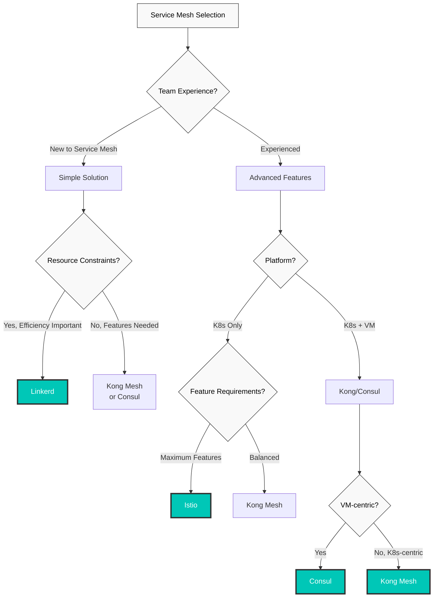
```mermaid
flowchart TD
    Start[Service Mesh Selection]
    Start --> Q1{Team Experience?}

    Q1 -->|New to Service Mesh| Simple[Simple Solution]
    Q1 -->|Experienced| Advanced[Advanced Features]

    Simple --> Q2{Resource Constraints?}
    Q2 -->|Yes, Efficiency Important| Linkerd[Linkerd]
    Q2 -->|No, Features Needed| KongSimple[Kong Mesh<br/>or Consul]

    Advanced --> Q3{Platform?}
    Q3 -->|K8s Only| Q4{Feature Requirements?}
    Q3 -->|K8s + VM| Hybrid[Kong/Consul]

    Q4 -->|Maximum Features| Istio[Istio]
    Q4 -->|Balanced| KongAdv[Kong Mesh]

    Hybrid --> Q5{VM-centric?}
    Q5 -->|Yes| Consul[Consul]
    Q5 -->|No, K8s-centric| Kong[Kong Mesh]

    classDef recommended fill:#00C7B7,stroke:#333,stroke-width:3px,color:white;
    classDef decision fill:#f9f9f9,stroke:#333,stroke-width:1px,color:black;

    class Linkerd,Istio,Consul,Kong recommended;
    class Start,Q1,Q2,Q3,Q4,Q5 decision;
```

### Guía rápida de recomendaciones

| Situación                  | Primera opción | Segunda opción | Evitar                     |
| -------------------------- | -------------- | -------------- | -------------------------- |
| **Primeros pasos**         | Linkerd        | Kong Mesh      | Istio (complejo)           |
| **Gran empresa**           | Istio          | Kong Mesh      | Linkerd (funcionalidades limitadas) |
| **Restricciones de recursos** | Linkerd     | -              | Istio (sobrecarga)         |
| **Workloads de VM**        | Consul         | Kong Mesh      | Linkerd (sin soporte)      |
| **Multi-cloud**            | Istio          | Consul         | Soluciones de cloud único  |
| **ROI rápido**             | Linkerd        | -              | Istio (curva de aprendizaje) |
| **Control detallado**      | Istio          | Kong Mesh      | Linkerd (limitado)         |

### Recomendaciones finales

**Istio**:

* **Cuándo**: Gran empresa, se necesitan funcionalidades completas, el equipo tiene experiencia con Service Mesh
* **Ventajas**: Funcionalidades líderes en su categoría, comunidad sólida, orientado al futuro
* **Desventajas**: Curva de aprendizaje pronunciada, alto uso de recursos

**Linkerd**:

* **Cuándo**: Simplicidad ante todo, equipo pequeño, inicio rápido, eficiencia de recursos
* **Ventajas**: Instalación/operación sencillas, baja sobrecarga, mTLS automático
* **Desventajas**: Funcionalidades limitadas, sin soporte para VM

**Kong Mesh / Consul Connect**:

* **Cuándo**: Entorno híbrido (K8s + VM), multiplataforma, integración de sistemas heredados
* **Ventajas**: Soporte VM-first, arquitectura flexible, Service Discovery sólido
* **Desventajas**: Las funcionalidades comerciales son de pago, tamaño de la comunidad

***

**Próximos pasos**:

1. Probar 2-3 soluciones en un entorno PoC
2. Realizar benchmarks de rendimiento con patrones de workload reales
3. Recopilar comentarios del equipo
4. Establecer un plan de rollout a producción

**Documentos relacionados**:

* [Comparación de Istio y VPC Lattice](02-istio-vs-lattice.md)
* [Arquitectura de Istio](https://github.com/Atom-oh/kubernetes-docs/blob/main/en/service-mesh/istio/istio/architecture/README.md)
