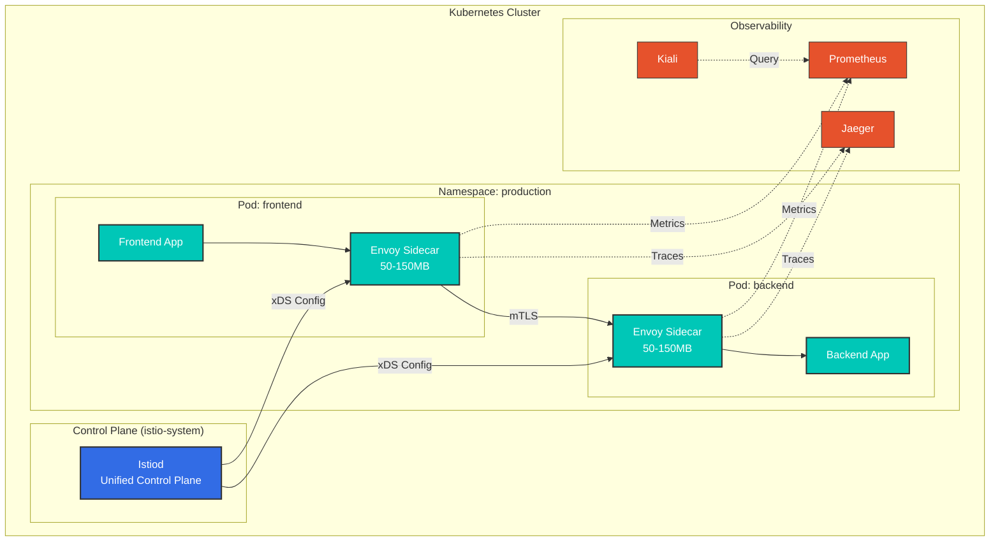
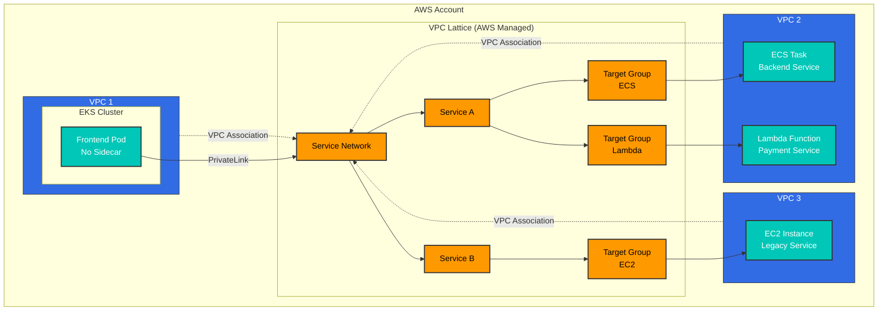
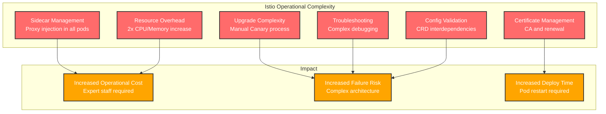
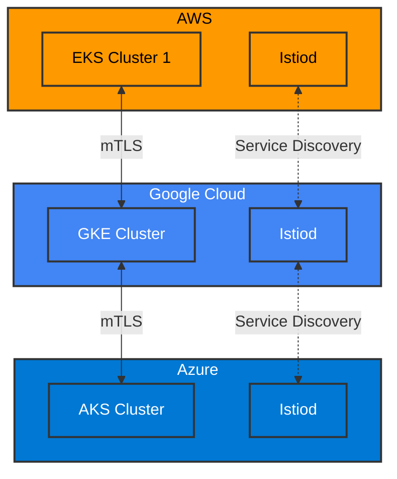
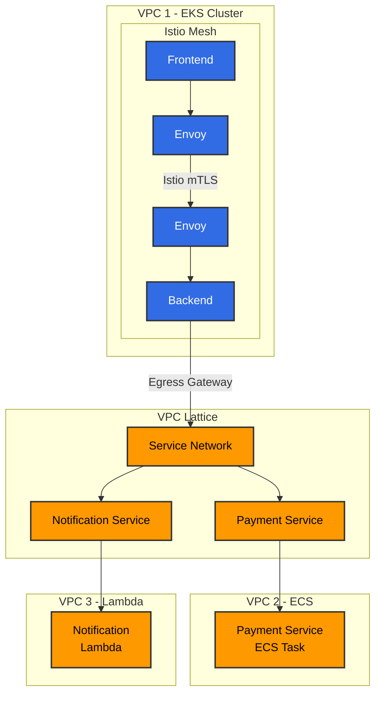
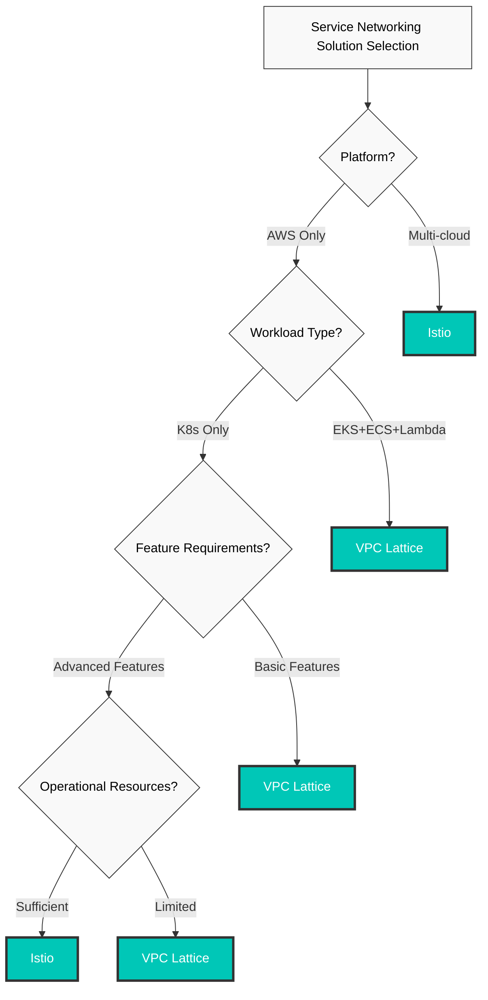

# Istio vs VPC Lattice

> **Última actualización**: February 23, 2026 **Istio Version**: 1.24 **VPC Lattice**: GA (Released 2023)

Este documento proporciona una comparación exhaustiva entre Kubernetes Service Mesh (Istio) y las redes de servicios nativas de AWS (VPC Lattice).

## Tabla de contenidos

1. [Descripción general y diferencias clave](02-istio-vs-lattice.md#overview-and-key-differences)
2. [Comparación de arquitectura](02-istio-vs-lattice.md#architecture-comparison)
3. [Características de gestión de tráfico](02-istio-vs-lattice.md#traffic-management-features)
4. [Modelo de seguridad](02-istio-vs-lattice.md#security-model)
5. [Observabilidad y monitoreo](02-istio-vs-lattice.md#observability-and-monitoring)
6. [Complejidad operativa](02-istio-vs-lattice.md#operational-complexity)
7. [Análisis de costos](02-istio-vs-lattice.md#cost-analysis)
8. [Comparación de rendimiento](02-istio-vs-lattice.md#performance-comparison)
9. [Estrategia multi-cloud](02-istio-vs-lattice.md#multi-cloud-strategy)
10. [Arquitectura híbrida](02-istio-vs-lattice.md#hybrid-architecture)
11. [Guía de selección](02-istio-vs-lattice.md#selection-guide)

## Descripción general y diferencias clave

### Istio Service Mesh

**Definición**: Un Service Mesh de código abierto que se ejecuta en entornos Kubernetes y que gestiona, protege y observa la comunicación entre microservicios como una capa de infraestructura

**Características clave**:

* Autogestionado (operación directa)
* Nativo de Kubernetes (basado en CRD)
* Neutral respecto al cloud
* Conjunto de características amplio
* Basado en Envoy Proxy

### AWS VPC Lattice

**Definición**: Un servicio de redes de aplicaciones totalmente administrado proporcionado por AWS que simplifica la conectividad y seguridad de los servicios entre VPC, cuentas y plataformas de cómputo

**Características clave**:

* Totalmente administrado
* Integración nativa de AWS
* Arquitectura serverless
* Soporte para EKS, ECS, EC2, Lambda
* Conectividad transparente entre VPC/cuentas

### Tabla de comparación rápida

| Aspecto                       | Istio          | VPC Lattice           |
| ---------------------------- | -------------- | --------------------- |
| **Modelo de Deployment**         | Autogestionado   | Totalmente administrado         |
| **Plataforma**                 | Kubernetes     | EKS, ECS, EC2, Lambda |
| **Arquitectura**             | Sidecar Proxy  | Administrada por AWS           |
| **Complejidad de configuración** | Alta           | Baja                   |
| **Riqueza de características**         | 5/5            | 3/5                   |
| **Sobrecarga operativa**     | Alta           | Casi ninguna           |
| **Dependencia de proveedor**           | Baja            | Alta (solo AWS)       |
| **Modelo de costos**               | Basado en recursos | Basado en uso           |
| **Curva de aprendizaje**           | Pronunciada          | Suave                |
| **Multi-cloud**              | Compatible      | Solo AWS              |

## Comparación de arquitectura

### Arquitectura de Istio



**Características**:

* **Patrón Sidecar**: Envoy Proxy inyectado en todos los pods
* **Sobrecarga de recursos**: 50-150MB de memoria, 100-500m de CPU por pod
* **Ruta de datos**: App -> Envoy -> mTLS -> Envoy -> App
* **Configuración**: Kubernetes CRD (VirtualService, DestinationRule, etc.)

### Arquitectura de VPC Lattice



**Características**:

* **Servicio administrado**: AWS opera la infraestructura de red
* **Sin Sidecar**: No hay contenedores adicionales en los pods de aplicaciones
* **Ruta de datos**: App -> AWS PrivateLink -> VPC Lattice -> Target
* **Configuración**: AWS Console, CLI, CloudFormation, Terraform

### Resumen de diferencias de arquitectura

| Aspecto                      | Istio                    | VPC Lattice             |
| --------------------------- | ------------------------ | ----------------------- |
| **Ubicación del Proxy**          | Dentro del Pod (Sidecar)     | Administrado por AWS (externo)  |
| **Sobrecarga de memoria**         | 50-150MB por pod         | 0MB (administrado)           |
| **Sobrecarga de CPU**            | 100-500m por pod         | 0 (administrado)             |
| **Control Plane**           | Autogestionado (Istiod)    | Administrado por AWS             |
| **Data Plane**              | Envoy Proxy              | AWS PrivateLink         |
| **Interfaz de configuración** | Kubernetes CRD           | AWS API                 |
| **Actualizaciones**                | Manual (Canary posible) | Automáticas (administradas por AWS) |

## Características de gestión de tráfico

### División de tráfico (Canary Deployment)

#### Istio

```yaml
apiVersion: networking.istio.io/v1
kind: VirtualService
metadata:
  name: frontend
spec:
  hosts:
  - frontend
  http:
  - match:
    - headers:
        user-agent:
          regex: ".*Mobile.*"
    route:
    - destination:
        host: frontend
        subset: v2
      weight: 100
  - route:
    - destination:
        host: frontend
        subset: v1
      weight: 90
    - destination:
        host: frontend
        subset: v2
      weight: 10
---
apiVersion: networking.istio.io/v1
kind: DestinationRule
metadata:
  name: frontend
spec:
  host: frontend
  trafficPolicy:
    loadBalancer:
      simple: LEAST_REQUEST
  subsets:
  - name: v1
    labels:
      version: v1
  - name: v2
    labels:
      version: v2
```

**Características**:

* Enrutamiento basado en Header, URL y Source
* Control de peso granular (granularidad del 1 %)
* Condiciones complejas (AND, OR, Regex)
* Algoritmos de balanceo de carga dinámicos

#### VPC Lattice

```yaml
# Weight-based routing with AWS CLI
aws vpc-lattice create-rule \
  --listener-identifier $LISTENER_ID \
  --priority 10 \
  --match '{
    "httpMatch": {
      "pathMatch": {"prefix": "/api"}
    }
  }' \
  --action '{
    "forward": {
      "targetGroups": [
        {
          "targetGroupIdentifier": "'$TG_V1'",
          "weight": 90
        },
        {
          "targetGroupIdentifier": "'$TG_V2'",
          "weight": 10
        }
      ]
    }
  }'
```

**Características**:

* Enrutamiento basado en Path, Header y Method
* División basada en peso
* Condiciones básicas
* Balanceo de carga round robin y least connections

**Comparación**:

* **Istio**: Control muy granular; permite escenarios complejos
* **VPC Lattice**: Características básicas, uso sencillo

### Duplicación de tráfico

#### Istio

```yaml
apiVersion: networking.istio.io/v1
kind: VirtualService
metadata:
  name: backend
spec:
  hosts:
  - backend
  http:
  - route:
    - destination:
        host: backend
        subset: v1
      weight: 100
    mirror:
      host: backend
      subset: v2
    mirrorPercentage:
      value: 10.0  # Copy 10% traffic to v2
```

**Casos de uso**:

* Probar una nueva versión con tráfico de producción
* Comparación de rendimiento
* Verificación de bugs

#### VPC Lattice

**No compatible**: VPC Lattice no admite la duplicación de tráfico.

**Alternativas**:

* Application Load Balancer + Lambda@Edge
* Análisis de streams de logs independientes

### Inyección de fallos

#### Istio

```yaml
apiVersion: networking.istio.io/v1
kind: VirtualService
metadata:
  name: backend
spec:
  hosts:
  - backend
  http:
  - fault:
      delay:
        percentage:
          value: 10.0
        fixedDelay: 5s
      abort:
        percentage:
          value: 5.0
        httpStatus: 503
    route:
    - destination:
        host: backend
```

**Características**:

* Inyección de retrasos
* Inyección de abortos (inyección de errores)
* Control basado en porcentaje
* Soporte para Chaos Engineering

#### VPC Lattice

**No compatible**: No hay una característica de Fault Injection integrada

**Alternativas**:

* Implementar a nivel de aplicación
* Usar AWS FIS (Fault Injection Simulator)

### Circuit Breaking y Outlier Detection

#### Istio

```yaml
apiVersion: networking.istio.io/v1
kind: DestinationRule
metadata:
  name: backend
spec:
  host: backend
  trafficPolicy:
    connectionPool:
      tcp:
        maxConnections: 100
      http:
        http1MaxPendingRequests: 50
        http2MaxRequests: 100
        maxRequestsPerConnection: 2
    outlierDetection:
      consecutiveErrors: 5
      interval: 30s
      baseEjectionTime: 60s
      maxEjectionPercent: 50
      minHealthPercent: 50
```

#### VPC Lattice

**Soporte limitado**: Solo se proporcionan health checks básicos

```yaml
# Target Group health check
aws vpc-lattice create-target-group \
  --name backend-tg \
  --health-check '{
    "enabled": true,
    "protocol": "HTTP",
    "path": "/health",
    "intervalSeconds": 30,
    "timeoutSeconds": 5,
    "healthyThresholdCount": 2,
    "unhealthyThresholdCount": 3
  }'
```

**Comparación**:

* **Istio**: Circuit Breaking granular, Outlier Detection automático
* **VPC Lattice**: Health checks básicos, eliminación manual

### Tabla de comparación de características

| Característica               | Istio              | VPC Lattice     | Ganador |
| --------------------- | ------------------ | --------------- | ------ |
| **Canary Deployment** | Muy granular  | Básico           | Istio  |
| **Pruebas A/B**       | Basadas en Header       | Solo basadas en Path | Istio  |
| **Duplicación de tráfico** | Sí                | No              | Istio  |
| **Inyección de fallos**   | Sí                | No              | Istio  |
| **Circuit Breaking**  | Granular       | Básico           | Istio  |
| **Retry**             | Avanzado           | Básico           | Istio  |
| **Timeout**           | Granular       | Básico           | Istio  |
| **Balanceo de carga**    | Varios algoritmos | Básico           | Istio  |

**Conclusión**: En la gestión de tráfico, **Istio tiene una ventaja abrumadora**

## Modelo de seguridad

### Configuración de mTLS

#### Istio

```yaml
# Global mTLS STRICT mode
apiVersion: security.istio.io/v1
kind: PeerAuthentication
metadata:
  name: default
  namespace: istio-system
spec:
  mtls:
    mode: STRICT
---
# Namespace-level exception
apiVersion: security.istio.io/v1
kind: PeerAuthentication
metadata:
  name: legacy-permissive
  namespace: legacy
spec:
  mtls:
    mode: PERMISSIVE
---
# Service-level port-level settings
apiVersion: security.istio.io/v1
kind: PeerAuthentication
metadata:
  name: backend
spec:
  selector:
    matchLabels:
      app: backend
  mtls:
    mode: STRICT
  portLevelMtls:
    8080:
      mode: DISABLE  # Metrics port is plaintext
```

**Características**:

* Emisión y renovación automáticas de certificados
* Certificados por workload
* Renovación automática cada 15 minutos
* Compatible con el estándar SPIFFE
* Integración con CA externas (Cert-manager, Vault)

#### VPC Lattice

```yaml
# Create TLS Listener
aws vpc-lattice create-listener \
  --service-identifier $SERVICE_ID \
  --protocol HTTPS \
  --port 443 \
  --default-action '{
    "forward": {
      "targetGroups": [{"targetGroupIdentifier": "'$TG_ID'"}]
    }
  }'

# Apply Auth Policy
aws vpc-lattice create-auth-policy \
  --resource-identifier $SERVICE_ID \
  --policy '{
    "allowedPrincipals": [
      "arn:aws:iam::123456789012:role/app-role"
    ]
  }'
```

**Características**:

* Integración con AWS Certificate Manager (ACM)
* Autenticación basada en IAM
* Firma SigV4
* Cifrado de AWS PrivateLink

**Comparación**:

* **Istio**: mTLS automático entre workloads, control granular
* **VPC Lattice**: TLS cliente-servicio, integración con IAM

### Políticas de autorización

#### Istio

```yaml
# L7 level fine-grained Authorization
apiVersion: security.istio.io/v1
kind: AuthorizationPolicy
metadata:
  name: backend-policy
spec:
  selector:
    matchLabels:
      app: backend
  action: ALLOW
  rules:
  - from:
    - source:
        principals: ["cluster.local/ns/frontend/sa/frontend"]
        namespaces: ["frontend"]
    to:
    - operation:
        methods: ["GET", "POST"]
        paths: ["/api/v1/*"]
        ports: ["8080"]
    when:
    - key: request.headers[user-role]
      values: ["admin", "poweruser"]
    - key: source.ip
      notValues: ["10.0.0.0/8"]
---
# JWT Authentication
apiVersion: security.istio.io/v1
kind: RequestAuthentication
metadata:
  name: jwt-auth
spec:
  selector:
    matchLabels:
      app: backend
  jwtRules:
  - issuer: "https://auth.example.com"
    jwksUri: "https://auth.example.com/.well-known/jwks.json"
    audiences:
    - "api.example.com"
---
# JWT-based Authorization
apiVersion: security.istio.io/v1
kind: AuthorizationPolicy
metadata:
  name: jwt-policy
spec:
  selector:
    matchLabels:
      app: backend
  action: ALLOW
  rules:
  - when:
    - key: request.auth.claims[role]
      values: ["admin"]
```

#### VPC Lattice

```json
// Auth Policy (IAM-based)
{
  "Version": "2012-10-17",
  "Statement": [
    {
      "Effect": "Allow",
      "Principal": {
        "AWS": "arn:aws:iam::123456789012:role/frontend-role"
      },
      "Action": "vpc-lattice:Invoke",
      "Resource": "arn:aws:vpc-lattice:region:account:service/svc-xxx"
    },
    {
      "Effect": "Deny",
      "Principal": "*",
      "Action": "vpc-lattice:Invoke",
      "Resource": "*",
      "Condition": {
        "IpAddress": {
          "aws:SourceIp": ["10.0.0.0/8"]
        }
      }
    }
  ]
}
```

**Comparación**:

| Característica                       | Istio                     | VPC Lattice             | Ganador              |
| ----------------------------- | ------------------------- | ----------------------- | ------------------- |
| **Mecanismo de autenticación**  | mTLS, JWT, Custom         | IAM, SigV4              | Istio (flexibilidad) |
| **Granularidad de autorización** | L7 (Method, Path, Header) | L4 (nivel de Service)      | Istio               |
| **Identidad de workload**         | SPIFFE ID                 | IAM Role                | Igual               |
| **Políticas dinámicas**          | Aplicación en tiempo real           | Se necesita tiempo de propagación | Istio               |
| **Multi-tenancy**             | Aislamiento de Namespace       | Aislamiento de VPC/Account   | Igual               |

**Conclusión**: En seguridad, **Istio proporciona un control más granular**, mientras que VPC Lattice destaca en la integración con AWS IAM

## Observabilidad y monitoreo

### Recopilación de métricas

#### Istio

```yaml
# Prometheus metrics (50+ provided by default)
# Request metrics
istio_requests_total{
  destination_service="backend",
  response_code="200",
  source_app="frontend"
}

# Latency metrics (histogram)
istio_request_duration_milliseconds_bucket{
  destination_service="backend",
  le="100"
}

# Connection Pool metrics
envoy_cluster_upstream_cx_active{
  cluster_name="outbound|8080||backend"
}

# Circuit Breaker metrics
envoy_cluster_outlier_detection_ejections_active

# Custom Metrics (Telemetry API)
apiVersion: telemetry.istio.io/v1alpha1
kind: Telemetry
metadata:
  name: custom-metrics
spec:
  metrics:
  - providers:
    - name: prometheus
    dimensions:
      request_method:
        value: request.method
      custom_header:
        value: request.headers['x-custom-header'] | ''
```

**Características**:

* Más de 50 métricas predeterminadas
* Formato Prometheus
* Integración con OpenTelemetry
* Es posible añadir métricas personalizadas
* Soporte de Exemplar (vinculación de métricas y trazas)

#### VPC Lattice

```bash
# CloudWatch metrics
aws cloudwatch get-metric-statistics \
  --namespace AWS/VPCLattice \
  --metric-name RequestCount \
  --dimensions Name=ServiceName,Value=backend \
  --start-time 2025-01-01T00:00:00Z \
  --end-time 2025-01-01T23:59:59Z \
  --period 300 \
  --statistics Sum
```

**Métricas predeterminadas**:

* `RequestCount`: Recuento de requests
* `ActiveConnectionCount`: Conexiones activas
* `HealthyTargetCount`: Targets en buen estado
* `UnhealthyTargetCount`: Targets en mal estado
* `TargetResponseTime`: Tiempo de respuesta
* `HTTPCode_Target_4XX_Count`: Errores 4xx
* `HTTPCode_Target_5XX_Count`: Errores 5xx

**Características**:

* Integración con CloudWatch
* Solo se proporcionan métricas predeterminadas
* No se pueden usar métricas personalizadas
* Granularidad de 1 o 5 minutos

### Trazabilidad distribuida

#### Istio

```yaml
# Tracing setup with Telemetry API
apiVersion: telemetry.istio.io/v1alpha1
kind: Telemetry
metadata:
  name: tracing
  namespace: istio-system
spec:
  tracing:
  - providers:
    - name: jaeger
    randomSamplingPercentage: 10.0
    customTags:
      environment:
        literal:
          value: "production"
      user_id:
        header:
          name: "x-user-id"
```

**Backends compatibles**:

* Jaeger
* Zipkin
* Tempo
* AWS X-Ray
* Datadog APM
* OpenTelemetry Collector

**Características**:

* Estándar W3C Trace Context
* Generación automática de Span
* Adición de tags personalizados
* Control de muestreo
* Propagación de Baggage

#### VPC Lattice

```bash
# Access Log to S3
aws vpc-lattice create-access-log-subscription \
  --resource-identifier $SERVICE_ID \
  --destination-arn arn:aws:s3:::lattice-logs

# Access Log to CloudWatch Logs
aws vpc-lattice create-access-log-subscription \
  --resource-identifier $SERVICE_ID \
  --destination-arn arn:aws:logs:region:account:log-group:/aws/vpclattice
```

**Formato de Access Log** (JSON):

```json
{
  "timestamp": "2025-01-15T12:34:56.789Z",
  "serviceNetworkArn": "arn:aws:vpc-lattice:...",
  "serviceArn": "arn:aws:vpc-lattice:...",
  "requestMethod": "GET",
  "requestPath": "/api/users",
  "requestProtocol": "HTTP/1.1",
  "responseCode": 200,
  "responseCodeDetails": "OK",
  "requestHeaders": {},
  "sourceVpcArn": "arn:aws:ec2:...",
  "targetGroupArn": "arn:aws:vpc-lattice:...",
  "traceparent": "00-4bf92f3577b34da6a3ce929d0e0e4736-00f067aa0ba902b7-01"
}
```

**Características**:

* Soporte para el header W3C Trace Context (`traceparent`)
* Envío a S3 o CloudWatch Logs
* Posible integración con AWS X-Ray (requiere instrumentación de la aplicación)
* Sin trazabilidad automática (instrumentación manual)

**Comparación**:

* **Istio**: Trazabilidad automática, todos los backends compatibles, control granular
* **VPC Lattice**: Basado en Access Log; X-Ray requiere integración manual

### Comparación integral de observabilidad

| Característica                   | Istio          | VPC Lattice            | Ganador |
| ------------------------- | -------------- | ---------------------- | ------ |
| **Métricas**               | Más de 50 métricas    | \~10 métricas           | Istio  |
| **Métricas personalizadas**        | Telemetry API  | No                     | Istio  |
| **Trazabilidad distribuida**   | Automática      | Instrumentación manual | Istio  |
| **Backends de trazabilidad**      | 6+             | Solo X-Ray             | Istio  |
| **Access Logs**           | Muy detallados  | Básicos                  | Istio  |
| **Visualización**         | Kiali, Grafana | CloudWatch             | Istio  |
| **Observación en tiempo real** | Sí            | Limitada                | Istio  |
| **Exemplars**             | Sí            | No                     | Istio  |

**Conclusión**: En observabilidad, **Istio tiene una ventaja abrumadora**

## Complejidad operativa

### Desafíos reales de las operaciones de Istio

Istio proporciona características potentes, pero operarlo en entornos de producción presenta desafíos significativos.

#### Desafíos operativos clave



### Instalación y configuración inicial

#### Istio

```bash
# 1. Install Istioctl
curl -L https://istio.io/downloadIstio | sh -
cd istio-1.24.0
export PATH=$PWD/bin:$PATH

# 2. Install Istio (production profile)
istioctl install --set profile=production

# 3. Enable Sidecar injection for namespace
kubectl label namespace default istio.io/injection=enabled

# 4. Deploy gateway
kubectl apply -f samples/bookinfo/networking/bookinfo-gateway.yaml

# 5. Install observability tools
kubectl apply -f samples/addons/prometheus.yaml
kubectl apply -f samples/addons/grafana.yaml
kubectl apply -f samples/addons/jaeger.yaml
kubectl apply -f samples/addons/kiali.yaml

# 6. Validate configuration
istioctl analyze
```

**Tiempo**: 30-60 minutos (incluida la configuración) **Complejidad**: 4/5 (Alta)

#### VPC Lattice

```bash
# 1. Create Service Network
SERVICE_NETWORK_ID=$(aws vpc-lattice create-service-network \
  --name production-network \
  --auth-type AWS_IAM \
  --query 'id' --output text)

# 2. Associate VPC
aws vpc-lattice create-service-network-vpc-association \
  --service-network-identifier $SERVICE_NETWORK_ID \
  --vpc-identifier vpc-xxx \
  --security-group-ids sg-xxx

# 3. Create Service
SERVICE_ID=$(aws vpc-lattice create-service \
  --name backend-service \
  --auth-type AWS_IAM \
  --query 'id' --output text)

# 4. Associate Service to Network
aws vpc-lattice create-service-network-service-association \
  --service-network-identifier $SERVICE_NETWORK_ID \
  --service-identifier $SERVICE_ID

# 5. Create Target Group
TG_ID=$(aws vpc-lattice create-target-group \
  --name backend-tg \
  --type IP \
  --config '{
    "port": 8080,
    "protocol": "HTTP",
    "vpcIdentifier": "vpc-xxx"
  }' \
  --query 'id' --output text)

# 6. Register Targets
aws vpc-lattice register-targets \
  --target-group-identifier $TG_ID \
  --targets id=10.0.1.10,port=8080

# 7. Create Listener
aws vpc-lattice create-listener \
  --service-identifier $SERVICE_ID \
  --protocol HTTP \
  --port 80 \
  --default-action '{
    "forward": {
      "targetGroups": [{"targetGroupIdentifier": "'$TG_ID'"}]
    }
  }'
```

**Tiempo**: 10-20 minutos **Complejidad**: 2/5 (Media)

### Actualización: el mayor desafío de Istio

#### Complejidad de la actualización de Istio

Las actualizaciones de Istio están entre las operaciones más riesgosas y complejas en entornos de producción.

**Tiempo total requerido**: **6-10 horas** (aumenta con el número de namespaces)

**Desafíos principales**:

* **Ventajas**: Es posible lograr cero tiempo de inactividad, rollout gradual y rollback
* **Desventajas**:
  * Proceso manual muy complejo
  * Se requiere conocimiento experto
  * 6-10 horas de tiempo de trabajo
  * Todos los pods requieren reinicio (impacto en los workloads)
  * Dos versiones de Control Plane se ejecutan simultáneamente (2x recursos)

#### VPC Lattice

**Actualización automática**: AWS administra las actualizaciones del servicio

**Acción del usuario**: Ninguna

### Resumen de complejidad operativa

| Tarea                   | Istio                           | VPC Lattice           | Diferencia                  |
| ---------------------- | ------------------------------- | --------------------- | --------------------------- |
| **Configuración inicial**      | 30-60 min, se requiere aprender CRD | 10-20 min, AWS Console | **Lattice 3x más rápido**       |
| **Actualización**            | 6-10 horas, Canary manual       | Automática, 0 horas    | **Lattice totalmente automático** |
| **Operaciones diarias**   | 15-25 h/mes                    | 2-5 h/mes            | **Lattice 5-10x menos**      |
| **Gestión de Sidecar** | Se requiere reiniciar todos los pods       | N/A                   | **Lattice sin gestión**   |
| **Sobrecarga de recursos**  | CPU/memoria 2x                   | 0                     | **Lattice sin sobrecarga**   |
| **Troubleshooting**    | Complejo, se requieren herramientas expertas    | Simple, CloudWatch    | **Lattice más fácil**          |
| **Curva de aprendizaje**     | Pronunciada, 3-6 meses               | Suave, 1-2 semanas     | **Lattice 10x más rápido**      |
| **Personal experto**       | Experto en Service Mesh             | Ingeniero general de AWS  | **Lattice más fácil de cubrir** |
| **Riesgo de fallos**       | Alto, arquitectura compleja      | Bajo, administrado por AWS      | **Lattice más estable**     |

**Conclusión**: En complejidad operativa, **VPC Lattice tiene una ventaja abrumadora**

## Análisis de costos

### Modelo de costos de Istio (detallado)

#### Costo de infraestructura (entorno de 100 pods, EKS)

**Costo de cómputo**:

| Componente                    | Recursos       | Requisitos de nodos           | Costo (mensual) |
| ---------------------------- | --------------- | --------------------------- | -------------- |
| **Aplicaciones** (100 pods)  | 10 vCPU, 25GB   | 3 nodos (m5.xlarge)         | $420           |
| **Envoy Sidecar** (100 pods) | 10 vCPU, 12.8GB | +2 nodos (sobrecarga de Sidecar) | $280           |
| **Istiod** (Control Plane)   | 1 vCPU, 2GB     | Incluido                    | -              |
| **Prometheus**               | 2 vCPU, 8GB     | Recursos adicionales        | $80            |
| **Jaeger**                   | 1 vCPU, 4GB     | Recursos adicionales        | $50            |
| **Kiali**                    | 0.5 vCPU, 1GB   | Recursos adicionales        | $20            |
| **Total de cómputo**          |                 | **5 nodos**                 | **$850/mes** |

**Costo de almacenamiento**:

* Métricas de Prometheus: SSD de 100GB -> $10/mes
* Trazas de Jaeger: SSD de 50GB -> $5/mes
* Almacenamiento total: **$15/mes**

**Total de infraestructura**: **$875/mes** = **$10,500/año**

#### Costo operativo (anual)

| Tarea                             | Tiempo (anual) | Costo por hora | Costo anual      |
| -------------------------------- | ------------- | ----------- | ---------------- |
| **Configuración inicial**                | 40 h           | $100/h      | $4,000           |
| **Operaciones diarias** (20 h/mes) | 240 h          | $100/h      | $24,000          |
| **Actualizaciones** (trimestrales)         | 40 h (4 veces) | $100/h      | $4,000           |
| **Respuesta de emergencia** (promedio) | 20 h           | $150/h      | $3,000           |
| **Capacitación**                     | 40 h           | $100/h      | $4,000           |
| **Total de operaciones**             |               |             | **$39,000/año** |

#### Costo total de Istio

**Costo total anual**: **$10,500 + $39,000 = $49,500**

### Modelo de costos de VPC Lattice

**Costo basado en uso**:

| Elemento                | Precio por unidad  | Uso esperado | Costo (mensual) |
| ------------------- | ----------- | -------------- | -------------- |
| **Service Network** | $0.025/hora | 1 x 730 horas  | $18            |
| **Service**         | $0.025/hora | 5 x 730 horas  | $91            |
| **Procesamiento de datos** | $0.010/GB   | 10TB           | $100           |
| **Total**           |             |                | **$209**       |

**Costo operativo**:

* Configuración inicial: 10 horas x $100/h = $1,000
* Operaciones mensuales: 3 horas x $100/h = $300

**Costo total anual**: $209 x 12 + $300 x 12 + $1,000 = **$7,608**

### Resumen de comparación de costos

| Elemento                        | Istio Sidecar | VPC Lattice | Diferencia (frente a Istio) |
| --------------------------- | ------------- | ----------- | --------------------- |
| **Infraestructura (anual)** | $10,500       | $2,508      | **76 % más barato**       |
| **Operaciones (anual)**     | $39,000       | $5,100      | **87 % más barato**       |
| **Total (anual)**          | **$49,500**   | **$7,608**  | **85 % más barato**       |
| **TCO a 5 años**              | **$297,500**  | **$38,040** | **87 % más barato**       |

**Conclusión**: VPC Lattice es **aproximadamente $42,000 más barato al año y $260,000 más barato durante 5 años**

## Comparación de rendimiento

### Sobrecarga de latencia

**Entorno de prueba**: 2 nodos EKS, m5.xlarge, 1000 RPS

| Escenario | Línea base | Istio          | VPC Lattice    |
| -------- | -------- | -------------- | -------------- |
| **P50**  | 1.0ms    | +1.0ms (2.0ms) | +0.5ms (1.5ms) |
| **P95**  | 2.5ms    | +2.5ms (5.0ms) | +1.2ms (3.7ms) |
| **P99**  | 5.0ms    | +3.5ms (8.5ms) | +2.0ms (7.0ms) |

**Conclusión**: VPC Lattice tiene una **latencia ligeramente menor** (sin Sidecar)

### Throughput

| Métrica           | Línea base | Istio       | VPC Lattice |
| ---------------- | -------- | ----------- | ----------- |
| **RPS máximo**      | 10,000   | 8,500 (85 %) | 9,200 (92 %) |
| **Uso de CPU**    | 100%     | 115%        | 102%        |
| **Uso de memoria** | 1GB      | 1.5GB       | 1.05GB      |

**Conclusión**: VPC Lattice tiene un **throughput ligeramente mayor**

### Eficiencia de recursos

**Entorno de 100 pods**:

| Recurso              | Línea base | Istio          | VPC Lattice |
| --------------------- | -------- | -------------- | ----------- |
| **CPU adicional**    | -        | +10 vCPU       | 0           |
| **Memoria adicional** | -        | +15GB          | 0           |
| **Pods adicionales**   | -        | +100 (Sidecar) | 0           |

**Conclusión**: VPC Lattice es **abrumadoramente eficiente**

## Estrategia multi-cloud

### Istio multi-cloud



**Ventajas**:

* Neutral respecto al cloud
* Políticas y observabilidad consistentes
* Service Discovery automático
* Identidad federada

### VPC Lattice multi-cloud

**No es posible**: VPC Lattice es exclusivo de AWS

**Alternativas**:

* AWS Transit Gateway + VPN
* Integración a nivel de aplicación
* API Gateway

## Arquitectura híbrida

### Uso conjunto de Istio + VPC Lattice



**Casos de uso**:

* **Dentro del cluster**: Istio (características avanzadas)
* **Entre clusters/externo**: VPC Lattice (conectividad sencilla)

## Guía de selección

### Árbol de decisión



### Tabla de recomendaciones rápidas

| Situación                    | Istio       | VPC Lattice | Motivo                     |
| ---------------------------- | ----------- | ----------- | -------------------------- |
| **Solo AWS**                 | Limitado     | Recomendado | Conveniencia de gestión     |
| **Multi-cloud**              | Recomendado | No          | Neutralidad de cloud           |
| **Solo K8s**                 | Sí         | Sí         | Ambos son posibles              |
| **EKS + Lambda**             | No          | Recomendado | Integración con Lambda         |
| **Control de tráfico avanzado** | Recomendado | No          | Riqueza de características           |
| **Operaciones sencillas**        | No          | Recomendado | Totalmente administrado              |
| **Observabilidad amplia**       | Recomendado | Limitado     | Métricas/trazabilidad            |
| **Costo bajo**                 | No          | Recomendado | Incluido el costo operativo |
| **Inicio rápido**              | No          | Recomendado | Curva de aprendizaje             |
| **Seguridad granular**    | Recomendado | Limitado     | Autorización L7           |

### Recomendaciones finales

**Elija VPC Lattice**:

* Arquitectura centrada en AWS
* Recursos operativos limitados
* Se necesita un inicio rápido
* EKS + ECS + Lambda combinados
* Conectividad sencilla entre múltiples VPC/cuentas

**Elija Istio**:

* Estrategia multi-cloud
* Se necesita control de tráfico granular
* Requisitos fuertes de observabilidad
* Estrategias de Deployment complejas (Canary, A/B)
* El equipo tiene experiencia con Service Mesh

**Híbrido (Istio + VPC Lattice)**:

* Dentro del cluster: Istio
* Entre clusters/externo: VPC Lattice
* Mejores características + conectividad externa sencilla

## Conclusión

### Resumen clave

**Fortalezas de Istio**:

* Características avanzadas (5/5)
* Control granular (5/5)
* Observabilidad sólida (5/5)
* Multi-cloud (5/5)

**Fortalezas de VPC Lattice**:

* Simplicidad operativa (5/5)
* Bajo costo (5/5)
* Inicio rápido (5/5)
* Integración con AWS (5/5)

### ¿Cuándo elegir cada uno?

**Elija Istio**:

* Entorno multi-cloud
* Se necesita control de tráfico granular
* Requisitos fuertes de observabilidad
* El equipo tiene experiencia con Service Mesh
* Evitar la dependencia de proveedores cloud

**Elija VPC Lattice**:

* Arquitectura centrada en AWS
* Prioridad en la simplicidad operativa
* EKS + ECS + Lambda combinados
* Tiempo de comercialización rápido
* Bajo costo operativo

**Use ambos** (híbrido):

* Dentro del cluster: Istio
* Entre clusters/externo: VPC Lattice
* Equilibrio óptimo

***

**Próximos pasos**:

1. Probar ambas soluciones en un entorno PoC
2. Medir el rendimiento con patrones de workload reales
3. Evaluar la curva de aprendizaje del equipo
4. Realizar la selección alineada con la estrategia a largo plazo

**Documentos relacionados**:

* [Comparación de soluciones de Service Mesh](01-service-mesh-comparison.md)
* [Arquitectura de Istio](../03-architecture.md)
* [Istio Ambient Mode](https://github.com/Atom-oh/kubernetes-docs/blob/main/en/service-mesh/istio/istio/advanced/01-ambient-mode.md)
* [Guía detallada de VPC Lattice](https://github.com/Atom-oh/kubernetes-docs/blob/main/en/service-mesh/networking/02-vpc-lattice.md)
